# 重庆理工大学硕士学位论文

# 城市狭窄道路自动驾驶车辆与行人交互的研究

研 究 生: 陈金煌

指 导 教 师： 胡远志 教授

学 位 类 型： 专业学位

专业学位类别： 工程硕士（车辆工程领域）

研 究 方 向： 自动驾驶规划控制

培 养 单 位： 车辆工程学院

论文完成时间： 2025 年 3 月 15 日

论文答辩日期： 2025 年 5 月 21 日

# Master's Dissertation of Chongqing University of Technology

# Research on the Interaction Between Autonomous Vehicles and Pedestrians in Urban Narrow Roads

Postgraduate: Jinhuang Chen

Supervisor: Professor Yuanzhi Hu

Degree Category: Professional Degree

Specialty: Master of Engineering

(Vehicle Engineering)

Research Direction: Autonomous Driving

Training Unit: Institute of vehicle engineering

Thesis Deadline: March 15, 2025

Oral Defense Date: May 21, 2025

# 摘要

随着自动驾驶技术的快速发展，在复杂城市环境，尤其是城市狭窄道路中的安全、高效行驶成为研究的关键问题。此类道路环境通常具有空间受限、行人密集、动态障碍物复杂等特点，使得传统的路径规划与避障策略难以直接适用。针对这一挑战，本文提出了一种结合行人预测、全局路径规划优化、局部路径动态避障与路径跟踪控制的完整自动驾驶路径规划与控制框架，以提高车辆在城市狭窄道路环境下的通行能力和安全性。

首先，本文基于多区域社会力模型，结合 DUT 人车交互数据集，提出了一种高精度行人轨迹预测方法。该方法能够在复杂交互环境下准确预测行人运动趋势，为后续路径规划提供关键的环境信息输入。

其次，在全局路径规划方面，本文采用 Hybrid A\*算法搜索可行路径，并通过 B样条曲线优化初步得到的全局路径，以减少路径曲率突变、提高轨迹平滑性，确保全局路径既符合车辆运动学约束，又具备较高的可行性和安全性。此外，结合安全走廊生成方法，进一步增强了全局路径的避障能力，提高车辆在狭窄环境中的通行率。

接着，在局部路径规划方面，本文提出了一种基于时空联合规划的动态避障策略，利用轨迹与速度协同优化的方式，使自动驾驶车辆能够在动态行人密集的环境下，实现精准避障与流畅通行。相比传统方法，该策略有效避免了时空解耦带来的频繁停车和响应延迟问题。

最后，在路径跟踪控制方面，本文采用 Pure Pursuit 算法，结合简化的自行车模型，确保车辆能够稳定跟踪优化后的全局路径，并根据局部环境动态调整，保证平稳的路径执行。

实验验证结果表明，所提出的完整路径规划方法在城市狭窄道路环境下，显著提升了自动驾驶车辆的行驶安全性、平稳性与避障能力。本研究为自动驾驶技术在复杂城市环境中的应用提供了理论支持和技术方案，并为未来在更广泛的实际场景中的推广提供了参考。

关键词：自动驾驶；行人预测；Hybrid A\*；时空联合规划

# Abstract

With the rapid advancement of autonomous driving technology, ensuring safe and efficient navigation in complex urban environments, particularly in narrow urban roads, has become a critical research challenge. These environments are often characterized by spatial constraints, high pedestrian density, and complex dynamic obstacles, making traditional path planning and obstacle avoidance strategies difficult to apply directly. To address these challenges, this paper proposes a comprehensive autonomous driving planning and control framework that integrates pedestrian prediction, global path planning optimization, dynamic local path obstacle avoidance, and path-tracking control to enhance vehicle maneuverability and safety in urban narrow roads.

Firstly, a high-precision pedestrian trajectory prediction method is developed based on the multi-region social force model, incorporating the DUT human-vehicle interaction dataset. This approach accurately predicts pedestrian movement trends in complex interactive environments, providing essential environmental information for subsequent path planning.

Secondly, for global path planning, the Hybrid A\* algorithm is employed to search for feasible paths. The initially generated global path is then optimized using B-spline curves to reduce sudden curvature variations and improve trajectory smoothness, ensuring that the planned path satisfies vehicle kinematic constraints while maintaining high feasibility and safety. Additionally, a safety corridor generation method is introduced to further enhance obstacle avoidance capabilities and improve vehicle passability in narrow environments.

Thirdly, for local path planning, this paper proposes a dynamic obstacle avoidance strategy based on spatiotemporal joint planning. By optimizing both trajectory and velocity in a coordinated manner, the proposed method enables precise obstacle avoidance and smooth navigation in dense pedestrian environments. Compared to conventional approaches, this strategy effectively mitigates issues such as frequent stops and response delays caused by spatiotemporal decoupling.

Finally, for path-tracking control, the Pure Pursuit algorithm is adopted in conjunction with a simplified bicycle model to ensure stable tracking of the optimized global path. Additionally, real-time adjustments based on the local environment are incorporated to guarantee smooth path execution.

Experimental validation results demonstrate that the proposed integrated path planning method significantly improves driving safety, stability, and obstacle avoidance capability in urban narrow road environments. This study provides theoretical support and technical solutions for the application of autonomous driving technology in complex urban scenarios and serves as a reference for future large-scale implementation.

Keywords: Autonomous Driving; Pedestrian Prediction; Hybrid A\*; Spatiotemporal Joint Planning

# 目 录

# 1 绪论..

1.1 研究背景与意义.  
1.2 国内外研究现状.

1.2.1 行人轨迹预测方法研究现状. 2

1.2.2 运动规划方法研究现状.

1.3 研究内容及论文结构..

# 2 系统架构与模型分析

2.1 预测规划框架. 11   
2.2 车辆运动学模型. .12  
2.3 Frenet 坐标系 .14

2.3.1 Frenet 坐标系的建立 .14

2.3.2 Frenet 坐标系与 Cartesian 坐标系的转换 . 15

2.4 本章小结. .18

# 3 行人轨迹预测 19

3.1 人车交互数据集选取及分析. .19

3.1.1 数据集选取.. .19  
3.1.2 人车交互数据分析.. .20

3.2 构建多区域社会力模型. .22

3.2.1 基础社会力模型. .22  
3.2.2 多区域社会力模型. .24

3.3 行人轨迹预测仿真实验.. .26  
3.4 本章小节. .28

# 4 生成安全走廊. .29

4.1 球体翻转法.. .29

4.1.1 球体翻转法优势. .29   
4.1.2 自由空间建模.. .31  
4.1.3 凸多边形构造. .32

4.2 基于球体翻转的安全边界构建 .33  
4.3 本章小节. .39

# 5 路径规划与跟踪控制 .41

5.1 全局规划— 搜索全局路径. ..41

5.1.1 传统 Dijkstra 算法和 A\*算法 .41   
5.1.2 Hybrid A\*算法 . ..47  
5.1.3 Hybrid A\*算法应用 ..48

5.2 全局规划— 优化全局路径. ...49

5.2.1 B样条基函数及其性质. .50  
5.2.2 使用B样条多项式表示轨迹. .51  
5.2.3 构建优化问题. .52   
5.2.4 优化结果.. .57

5.3 局部规划— 时空联合规划. .61

5.3.1 目标函数设计. ..61  
5.3.2 轨迹规划约束条件. ..62   
5.3.3 目标函数求解. ..64

5.4 路径跟踪— Pure Pursuit.. ..65  
5.5 仿真实验分析.. ..66  
5.6 本章小节. .71

6 总结与展望. .73

6.1 总结.. .73  
6.2 展望. .73

参考文献.. .75

# 1 绪论

# 1.1 研究背景与意义

随着安全问题的日益严重和汽车技术的不断进步，美国、德国、中国和日本等国家在自动驾驶汽车的普及和接受度上不断推进，推动了全球市场的增长。根据中商产业研究院发布的《2025-2030 全球及中国自动驾驶行业深度研究报告》，2023 年全球自动驾驶市场规模约为 1583 亿美元，同比增长 29.97%。分析师预测，到 2025 年，全球自动驾驶市场规模将达到 2738 亿美元，到 2030 年将接近 4000 亿美元，其中末端物流和低速载人出行市场的占比预计将超过 60%[1]。其中，末端物流和低速载人出行市场的“最后一公里”涉及非结构化城市环境（特别是城中村、老城区等狭窄道路）。尽管自动驾驶技术在结构化道路（如高速公路和城市主干道）的应用已经趋于成熟，但在非结构化的城市环境中，尤其是狭窄道路上，自动驾驶技术仍面临诸多挑战和技术难题。

非结构化城市环境通常具备道路拓扑复杂、空间受限、行人密集、动态障碍物多变等特点，这使得传统的路径规划与避障策略难以直接适用。如何在此类环境中实现安全且高效的自动驾驶，已成为当前研究的核心问题[2,3]。

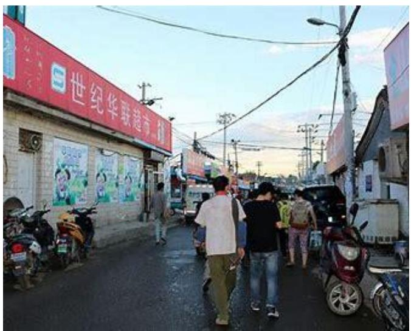

<details>
<summary>text_image</summary>

世纪华联超市
</details>

图1.1 城中村狭窄道路

在城市狭窄道路环境下，车辆的行驶空间十分有限，行人的随机运动增加了自动驾驶系统感知与决策的难度。统计数据显示，在宽度约为 2.5 至 3.5 米的道路上，车辆与行人发生冲突的比例高达 67%[4]。传统的路径规划方法往往难以同时满足车辆运动学约束和动态避障的需求，导致行驶路径不平滑、局部碰撞风险增加，甚至可能出现频繁停车的问题[5]。因此，迫切需要一种兼具高效性与适应性的路径规划与控制方法，以提升自动驾驶系统在狭窄环境中的通行能力和安全性。

本文重点研究了车辆在狭窄道场景下的行人轨迹预测、自车轨迹规划和路径跟踪方法，并通过仿真实验进行了验证。本文提出的方法能够帮助自动驾驶车辆在高动态的狭窄道路环境中实现安全、高效且无碰撞的自动驾驶。

# 1.2 国内外研究现状

# 1.2.1 行人轨迹预测方法研究现状

行人轨迹预测是自动驾驶、智能交通和车辆导航领域的关键技术，其核心目标是基于历史轨迹、环境信息及人车交互关系，来预测行人未来的运动轨迹。高精度的行人预测不仅能够提升自动驾驶系统的安全性和决策合理性，还可以有效避免碰撞事故。

早期的轨迹预测方法主要采用确定性方法，近年来，该领域在理论模型和算法实现方面取得了显著进展，提出了多模态行人轨迹预测框架，并引入基于参数的统计模型和算法，对行人运动行为模式进行建模。现有方法主要可分为三类：基于物理模型的方法、基于数据驱动的方法和混合方法。

# （1）基于物理模型的方法

基于物理模型的行人预测方法主要依赖动力学模型或社会行为模型来描述行人运动规律。其中，社会力模型（Social Force Model,SFM）是最具代表性的方法之一，该模型通过定义行人与环境之间的作用力（如吸引力、排斥力）来模拟行人行为。Helbing[6]等采用社会力模型进行建模，将行人之间的交互作用纳入影响因素，并通过引力和斥力的作用机制预测行人轨迹。SFM 在建模人群流动、行人避障方面表现良好，但在复杂交互环境下精度受限。此外，贝叶斯运动模型通过概率分布描述行人状态，并利用马尔科夫决策过程（MDP）或粒子滤波方法进行预测，适用于短时轨迹推断。Keller 团队[7]创新性地融合了行人运动学参数与贝叶斯估计理论拓展框架，实现了动态个体轨迹的概率推理；Morris 等人[8]与 Kitani 课题组[9]则分别从差异化视角切入——前者通过聚类分析解构行人轨迹的异质模式特征，后者引入社会力模型量化物理环境对行人决策的扰动效应。需指出的是，尽管上述两类研究均采用隐马尔可夫模型（HMM）作为基础架构，但其迭代求解过程存在显著缺陷（如 Morris 方法的计算复杂度达 ${ \mathrm { O } } ( { \mathfrak { n } } ^ { 2 } )$ ，Kitani 方案在密集场景下的实时性不足），这严重制约了实际部署效能。尽管传统数学统计模型在行人轨迹预测方面早期取得了一定成果，并推动了该领域的发展，但其方法主要基于固定的行人运动模式和简化的运动学模型，适用于匀速直线运动等低随机性场景。在应对高随机性和复杂度较高的行人运动时，这些方法的适应性较低，且在不同环境中的泛化能力有限。

# （2）基于数据驱动的方法

近年来，神经网络技术的快速发展推动了其在行人轨迹预测领域的应用。由于神经网络具备高效计算、并行处理、自学习以及良好的容错能力，吸引了众多学者的关注并加以研究。数据驱动方法借助机器学习和深度学习技术，从大规模轨迹数据中学习行人运动规律，显著提升了预测精度。

循环神经网络（RNN）及其变种，如长短时记忆网络（LSTM）和门控循环单元（GRU），广泛用于行人轨迹预测，通过历史轨迹信息推测行人未来位置。Williams 等[10]和Jitendra等[11]使用基于递归神经网络（RNN）的行人轨迹预测方法，但在时序依赖型轨迹预测模型中，递归神经网络（RNN）因缺乏对历史状态信息的筛选能力，存在两大局限性：其一，高维时序数据冗余导致模型泛化性下降；其二，梯度异常（爆炸/消失）现象频发，严重干扰参数收敛。对此，Peng 等[12]提出长短时记忆网络（LSTM），通过门控机制动态调控信息记忆与遗忘，显著提升了长序列建模的鲁棒性。然而，传统LSTM 仅以单一行人历史轨迹为输入，无法解析群体交互行为（如结伴同行、冲突避让、协作导航等），致使复杂场景下的轨迹预测出现语义断层。为突破此瓶颈，Alahi 团队[13,14]将社会力学模型（Social Force Model）与 LSTM 深度融合，构建 Social-LSTM 预测框架：该模型通过社交池化层实时聚合相邻行人隐藏状态，利用交互函数量化个体间的社会作用力，最终实现群体运动耦合关系的动态表征。

此外，生成对抗网络（GANs）和变分自编码器（VAE）结合概率分布建模，能够生成多模态轨迹，适用于处理行人行为的不确定性问题。Sadeghian等[15]基于GAN网络进行行人轨迹预测，通过输入行人轨迹信息和图像信息，引入注意力机制获取各帧中行人的轨迹和图像信息，编码行人的轨迹特征及环境特征，再通过 GAN网络生成未来轨迹。近年来，Transformer及图神经网络（GNN）逐步应用于行人预测任务，Transformer通过自注意力机制捕捉轨迹长期依赖关系，而 GNN适用于建模行人群体间的交互关系，提升了预测的稳定性和合理性。

# （3）混合方法

为弥补单一方法的局限性，部分研究将物理模型与数据驱动方法结合。例如，将社会力模型的物理约束嵌入深度学习框架，使预测结果符合现实运动规律。此外，基于贝叶斯推理的深度强化学习方法，能够在动态环境中调整预测策略，提高泛化能力。这类混合方法在复杂交互场景下具有较高的适应性和可解释性。

# 1.2.2 运动规划方法研究现状

运动规划是自动驾驶系统中的一个关键问题，旨在生成车辆从起点到终点的可行路径，避免碰撞并满足车辆的运动学约束。随着自动驾驶技术的快速发展，运动规划方法也不断得到优化和改进。根据不同的算法特点，运动规划方法可以大致分为以下几类：基于图搜索的算法、基于采样的算法、基于曲线插值的算法、基于数值优化的算法以及基于学习的方法。

# （1）基于图搜索的算法

基于图搜索的算法通过将环境建模为一个图，利用图搜索算法寻找从起点到终点的路径。这类方法通常通过离散化地图，并构建节点与边的网络，路径的寻找类似于在图中寻找最短路径。常见的图搜索算法包括 A\*[16]、Dijkstra[17]等。

Dijkstra 算法是一种无向图中寻找最短路径的经典算法，通过从起点向各个方向扩展，逐步确定最短路径。在自动驾驶运动规划领域，Dijkstra 算法的工程化应用可追溯至 2007 年 DARPA 城市挑战赛：Ben Franklin Institute 团队[18]首次将其部署为无人车的全局路径搜索框架。然而，经典 Dijkstra 算法在动态场景中存在拓扑节点膨胀缺陷（尤其在高阶变道行为中），导致实时性骤降。针对该问题，韩国高等科学技术院（KAIST）提出动态轨迹规划改进策略——通过代价函数权重自适应机制，将车辆横向动力学约束与换道安全裕度联合建模，能够为自动驾驶车辆的换道行为规划出一条最短的换道轨迹，以提升车辆的换道效率[19]。

A\*算法是一种经典的图搜索算法，通过启发式函数（如曼哈顿距离、欧几里得距离等）引导搜索过程，能够有效地找到从起点到终点的最短路径。A\*算法在二维和三维空间中都有广泛的应用，并且能够处理障碍物的影响。然而，A\*算法的时间复杂度较高，尤其在较为复杂或动态的环境中，搜索效率会降低。相比之下，Dijkstra 算法虽能保证求得最短路径，但在计算效率上不及 A\*算法。A\*算法利用启发式搜索提高了计算速度，尤其在自动驾驶领域，当车辆能够预先获取搜索空间时，其应用更具优势。

这些基于图搜索的算法的主要优点是可解释性强，且适用于离散化的环境，能够提供最优解。然而，它们的缺点在于计算开销大，尤其在动态环境下，图的更新会变得非常复杂。

# （2）基于采样的算法

基于采样的算法通过在环境中随机采样生成路径，这类方法适用于高维度、复杂的环境，并能够较好地应对动态障碍物和不规则的空间约束。常见的基于采样的算法包括 Rapidly-exploring Random Tree(RRT)和 RRT\*。

RRT[20]算法是一种通过随机采样在配置空间中生成树状结构的路径规划算法。RRT 能够快速探索空间，特别适用于高维空间中的路径规划。RRT 的主要缺点是生成的路径往往不平滑，需要后处理才能用于实际控制。

RRT\*[21]是RRT 的优化版本，采用了一种最优路径优化策略，能够在树的扩展过程中不断优化路径，逐渐逼近最优解。RRT\*在处理大规模、复杂环境时展现了较好的性能，但其计算复杂度较高，尤其是在面对动态障碍物时。

在自动驾驶运动规划领域，Hybrid A\*作为非完整约束下的混合决策框架，因其对连续位形空间的高效搜索能力被广泛采用[22,23]。早在2007年DARPA城市挑战赛中，斯坦福大学 Junior 团队便突破性地将该算法部署于非结构化道路场景[24]。从算法架构层面分析，Hybrid A\*包含启发式探索和运动学回溯这两阶段耦合机制，启发式探索过程与 A\*算法类似，运动学回溯阶段使用 RS 曲线以产生从起点到目标点的最短路径。

这些采样算法的优点是能够应对高维度、复杂的环境，并且具有较强的适应性。缺点则在于生成的路径需要后处理，而且在动态环境中的实时性较差。

# （3）基于曲线插值的算法

计算机几何设计等技术常被用于根据给定的路径点集合进行路径平滑。参数化曲线插值法通过构建满足车辆动力学约束的几何基元（如曲率连续可导的 Bézier 曲线簇），实现三阶连续轨迹生成。插值方法通过利用已有数据生成新的数据，从而支持动态导航环境中的轨迹规划，并能够满足车辆的各项约束，保证轨迹的连续性。

多项式曲线在轨迹生成过程中扮演重要角色，广泛用于拟合车辆的位置、角度及曲率约束，其计算方式相对简单，因而在自动驾驶领域得到广泛应用。例如，文献[25]首次引入五次多项式，用于实现车辆在车道变换时的平滑曲率过渡，提高轨迹连续性和舒适性。马川[26]在分析车辆动力学特性时，采用五次多项式进行轨迹规划，并与 B样条曲线的规划效果进行对比，验证了五次多项式在平滑性和可行性方面的优势。此外，清华大学罗永光教授[27]研究了换道场景下的轨迹优化，通过五次多项式生成可控且安全的换道轨迹，确保车辆在危险情况下能平稳返回原车道。

贝塞尔曲线是一种基于控制点的路径插值方法，其核心是伯恩斯坦多项式[28]。具有较好的平滑性。贝塞尔曲线适用于控制路径的形状，特别是在局部规划中，能够提供柔顺的转弯轨迹。

曲线插值算法的优点是能够生成平滑、可操作的路径，符合车辆运动学约束。然而，这类方法的计算量相对较大，且在面对动态障碍物时，路径的实时更新能力有限。

# （4）基于数值优化的算法

在自动驾驶车辆的轨迹规划过程中，数值优化方法通过将轨迹规划问题建模为优化问题，并结合多个约束条件（如车辆的稳定性、舒适性和安全性），来实现轨迹的优化。优化过程通常包括定义多个评价函数，这些函数根据其重要性被赋予不同的权重，最终合并为一个统一的目标函数。这种方法确保生成的轨迹具有良好的连续性和平滑性，从而使自动驾驶系统能够有效地跟踪并执行这些轨迹。

横纵解耦方法将车辆的轨迹规划问题分为两个独立的子问题：横向轨迹规划和纵向轨迹规划。这种方法的优势在于简化了问题的复杂度，可以分别针对横向和纵向的控制要求进行优化。在横纵解耦方法中，通常使用数值优化算法分别对横向和纵向轨迹进行优化。纵向轨迹优化可能涉及加速度、减速度以及速度的变化，而横向轨迹优化则关注转向角度的变化和曲率的平滑性。解耦后的优化过程通常会降低计算复杂度，提高效率，但可能会牺牲一些跨维度的协调性。

时空耦合方法则将横向和纵向轨迹规划问题作为一个整体进行优化，考虑到两者之间的相互依赖性。在这种方法中，车辆的转向和加速度是同时优化的，优化目标包括车辆的稳定性、舒适性以及路径的可行性。通过全局优化，考虑到两者的协调性，时空耦合方法能够生成更加平滑和可行的轨迹，尤其是在复杂或紧急的场景下。时空耦合优化通常更加复杂，需要处理更高维度的优化问题，因此对计算资源的需求较高。然而，这种方法能够考虑到横纵控制的协调性，优化出的轨迹通常会更加符合实际驾驶要求，适应更复杂的环境和动态变化。

基于数值优化的轨迹规划方法具有很强的灵活性和适应性，能够同时优化多个目标。然而，解耦与时空耦合的选择会影响优化过程的复杂性和计算效率。横纵解耦方法通过分离轨迹的不同控制维度，简化了问题的复杂度并提高了效率，但可能在跨维度协调方面有所不足；而时空耦合方法则能够更加精确地优化整体轨迹，适应更复杂的动态环境，但计算资源需求较大，实时性和效率可能面临挑战。

# （5）基于学习的方法

近年来，基于学习的运动规划技术已成为自动驾驶领域的重要发展方向。此类方法以任务要求、初始状态和驾驶环境作为输入，生成车辆的可行轨迹或路径，并在强化学习[29]、卷积神经网络（CNN）[30]、深度 Q网络（DQN）[31]等技术的支持下得到广泛应用。

例如，刘珏[32]提出了一种基于逆向强化学习的方法，通过学习演示轨迹来构建奖励函数，从而优化路径规划。基于此，姚君延[33]进一步开发了一种基于深度强化学习的改进算法，用于建立图像与路径之间的映射关系，提升自动驾驶轨迹规划的适应性和鲁棒性。尽管基于深度强化学习（DRL）与生成对抗网络（GAN）的轨迹规划模型展现出强大的表征学习能力，其工程化落地仍受制于三大核心瓶颈：海量标注数据集的依赖性、复杂场景下的泛化性能衰减，以及对抗性扰动引发的级联规划失效风险。因此，如何提升学习模型的泛化能力，以及在有限数据下提高规划精度，仍是自动驾驶轨迹规划研究的重要方向。此外，基于学习的轨迹规划算法相较于传统方法解释性较弱，这限制了其在实际量产车中的应用。由于该类方法通常依赖黑箱模型进行决策，难以直观分析其规划逻辑和安全性，因此尚未在大规模商用自动驾驶系统中得到广泛部署。

# 1.3 研究内容及论文结构

本文主要围绕城市狭窄道路场景中自动驾驶车辆与行人的交互决策及路径规划展开研究，致力于解决高动态、复杂环境下的路径规划与避障难题。具体研究内容包括：

# （1）行人轨迹预测与行为建模

通过提出多区域社会力模型，将车辆周围空间划分为多个交互区域，利用社会力模型对行人轨迹进行高精度预测[34,35]。这种精细化的行人行为建模方法能更准确地预测行人在车辆周围不同区域的行为轨迹及交互意图，为自动驾驶系统的实时规划与精准避障提供可靠依据[36]，

# （2）高效高精度安全走廊生成

提出了一种能够实时适应环境变化的安全走廊生成算法，有效融合动态障碍物预测与静态障碍物信息，实时生成适应复杂环境的严格凸安全走廊，提高了车辆在狭窄场景中的路径规划精度和安全性[37,38]。

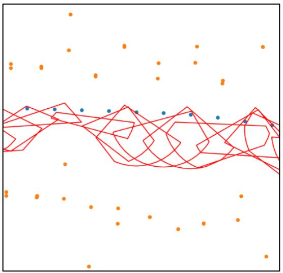

<details>
<summary>scatter</summary>

| Point Type | X Coordinate | Y Coordinate |
|------------|--------------|--------------|
| Blue Circle | 0.15         | 0.25         |
| Blue Circle | 0.18         | 0.23         |
| Blue Circle | 0.20         | 0.27         |
| Blue Circle | 0.22         | 0.24         |
| Blue Circle | 0.25         | 0.26         |
| Blue Circle | 0.28         | 0.22         |
| Blue Circle | 0.30         | 0.28         |
| Blue Circle | 0.32         | 0.25         |
| Blue Circle | 0.35         | 0.29         |
| Blue Circle | 0.38         | 0.24         |
| Blue Circle | 0.40         | 0.30         |
| Orange Dot   | 0.15         | 0.25         |
| Orange Dot   | 0.18         | 0.23         |
| Orange Dot   | 0.20         | 0.27         |
| Orange Dot   | 0.22         | 0.24         |
| Orange Dot   | 0.25         | 0.26         |
| Orange Dot   | 0.28         | 0.22         |
| Orange Dot   | 0.30         | 0.28         |
| Orange Dot   | 0.32         | 0.25         |
| Orange Dot   | 0.35         | 0.29         |
| Orange Dot   | 0.38         | 0.24         |
| Orange Dot   | 0.40         | 0.30         |
| Orange Dot   | 0.42         | 0.26         |
| Orange Dot   | 0.45         | 0.28         |
| Orange Dot   | 0.48         | 0.25         |
| Orange Dot   | 0.50         | 0.29         |
| Orange Dot   | 0.52         | 0.24         |
| Orange Dot   | 0.55         | 0.30         |
| Orange Dot   | 0.58         | 0.26         |
| Orange Dot   | 0.60         | 0.28         |
| Orange Dot   | 0.62         | 0.25         |
| Orange Dot   | 0.65         | 0.29         |
| Orange Dot   | 0.68         | 0.24         |
| Orange Dot   | 0.70         | 0.30         |
| Orange Dot   | 0.72         | 0.26         |
| Orange Dot   | 0.75         | 0.28         |
| Orange Dot   | 0.78         | 0.25         |
| Orange Dot   | 0.80         | 0.29         |
| Orange Dot   | 0.82         | 0.24         |
| Orange Dot   | 0.85         | 0.30         |
| Orange Dot   | 0.88         | 0.26         |
| Orange Dot   | 0.90         | 0.28         |
| Orange Dot   | 0.92         | 0.25         |
| Orange Dot   | 0.95         | 0.29         |
| Orange Dot   | 0.98         | 0.24         |
| Orange Dot   | 1.00         | 0.30         |
| Red Line    | -            | -            |
| Red Line    | -            | -            |
| Red Line    | -            | -            |
| Red Line    | -            | -            |
| Red Line    | -            | -            |
| Red Line    | -            | -            |
| Red Line    | -            | -            |
| Red Line    | -            | -            |
| Red Line    | -            | -            |
| Red Line    | -            | -            |
</details>

图1.2 生成的高效安全走廊

# （3）全局路径规划

使用 Hybrid A\*[39]算法搜索生成全局路径，针对传统 Hybrid A\*算法在狭窄道路环境中路径不平滑、曲率不连续、局部碰撞风险高等问题[40,41]，本研究提出了一种改进的 Hybrid A\*全局路径规划优化方法。该方法在路径搜索后引入二次平滑优化，解决传统算法在狭窄道路环境中的上述问题，使路径更符合车辆运动学约束，并提高路径的可行性和稳定性[42,43]，为后续局部规划提供更高质量的参考路径。

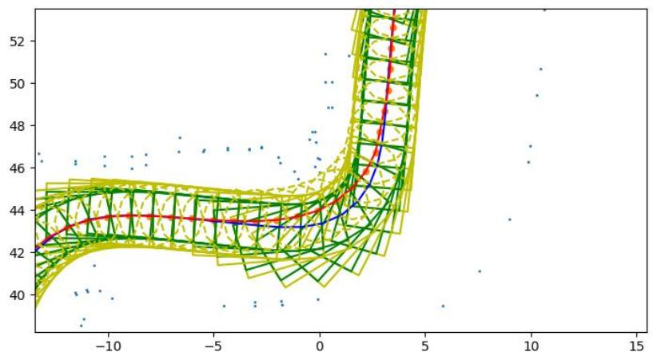

<details>
<summary>scatter</summary>

| x    | y    |
| ---- | ---- |
| -15  | 42   |
| -10  | 43   |
| -5   | 43   |
| 0    | 43   |
| 5    | 46   |
| 10   | 50   |
| 15   | 52   |
</details>

图1.3 优化后狭窄道路场景的全局路径（蓝色实线）

# （4）局部路径规划

本文在狭窄道路高动态场景中使用时空联合规划方法，实现路径与速度的同步优化。该方法能够实时根据障碍物的运动状态，动态协同调整车辆路径和速度，从而降低拥挤环境中的停车频率，提升车辆的灵活性和通行效率[44]。相比传统时空解耦方法，该方法克服了由于路径和速度解耦规划所导致的频繁停车、急减速等问题，从而提高了自动驾驶车辆的行驶效率[45,46]。

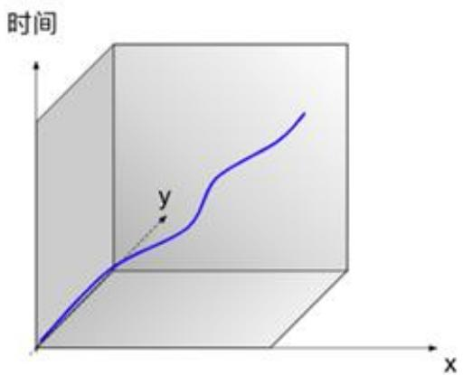

<details>
<summary>text_image</summary>

时间
y
x
</details>

图1.4 时空联合规划方法的路径与速度协同优化示意

本文的整体研究内容如图 1.5所示，各章节具体安排如下：

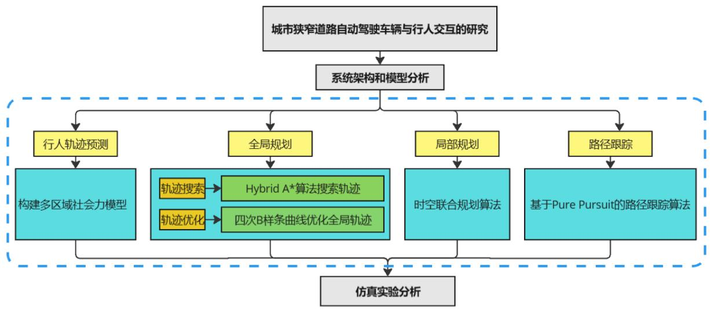

<details>
<summary>flowchart</summary>

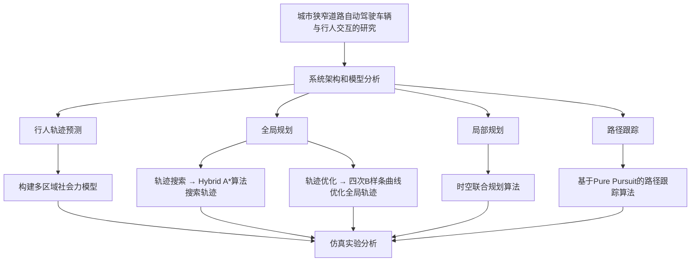
```mermaid
graph TD
    A["城市狭窄道路自动驾驶车辆与行人交互的研究"] --> B["系统架构和模型分析"]
    B --> C["行人轨迹预测"]
    B --> D["全局规划"]
    B --> E["局部规划"]
    B --> F["路径跟踪"]
    C --> G["构建多区域社会力模型"]
    D --> H["轨迹搜索 → Hybrid A*算法搜索轨迹"]
    D --> I["轨迹优化 → 四次B样条曲线优化全局轨迹"]
    E --> J["时空联合规划算法"]
    F --> K["基于Pure Pursuit的路径跟踪算法"]
    G --> L["仿真实验分析"]
    H --> L
    I --> L
    J --> L
    K --> L
```
</details>

图1.5 论文研究框架

第1章：绪论。阐述本文的研究背景和意义，分析城市狭窄道路场景的特点与自动驾驶技术面临的挑战；综述国内外研究进展，指出现有方法的局限性，明确本文的研究目标和内容。

第2章：系统架构与模型分析。详细介绍本文提出的自动驾驶系统整体架构与技术路线，建立适用于狭窄道路场景的预测规划框架，解析车辆运动学模型、Frenet 坐标系和Cartesian坐标系，为后续研究奠定理论基础。

第3章：行人预测与行为建模。针对城市狭窄道路中的复杂人车交互环境，提出基于多区域社会力模型的行人轨迹预测方法。通过细化车辆周围的交互区域并优化模型参数，实现更精确的轨迹预测；同时开展仿真实验，验证预测模型的有效性。

第4章：安全走廊生成算法。提出一种基于球体翻转的高效安全走廊生成方法，以实时生成凸安全通行区域，为后续规划提供可规划安全区域；将其与传统膨胀椭圆法进行性能对比，重点分析计算效率、凸多边形精确性及空间利用率的优势；通过仿真实验验证算法在狭窄道路与障碍物密集环境中的适应性。

第 5 章：路径规划与跟踪控制。提出一种改进的 Hybrid A\*全局路径规划方法，通过路径平滑与曲线拟合技术，解决狭窄道路环境下路径不平滑及转弯内切等问题。此外，引入时空联合规划策略，实现路径与速度的协同优化，降低车辆频繁停车风险，提升行驶稳定性。最后，采用 Pure Pursuit 算法实现轨迹跟踪控制，确保车辆沿规划路径平稳、安全行驶。通过仿真实验，全面验证本文所提出的行人预测、安全走廊生成与路径规划算法的性能。分析方法在不同工况下的适用性、优势与局限性，验证理论与方法的可行性。

第章：总结与展望。回顾本文主要研究成果，指出研究中的不足与局限；结合自动驾驶未来的发展趋势，展望更为精细的行人行为建模方法、更高效的路径优化技术

以及算法实时性提升的可能方向。

# 2 系统架构与模型分析

城市狭窄道路尤其是城中村的狭窄道路广泛分布于我国高密度城区，是城市交通系统中的重要瓶颈之一。由于道路空间受限、环境复杂、障碍物密集，自动驾驶车辆在此类场景下面临路径规划受限、避障难度大、行驶安全性降低等挑战，严重影响通行效率和安全性。因此，如何在城市狭窄道路环境中提升自动驾驶系统的适应性，成为当前研究的重要课题。在本章节，将介绍本文提出的适用于狭窄道路场景的预测规划系统架构和使用的相关车辆、坐标系模型。

# 2.1 预测规划框架

自动驾驶系统在狭窄道路环境中需实时面对道路拓扑结构复杂、高密度动态行人与静态障碍物的共同影响。因此，本研究提出了一种适用于城市狭窄道路的自动驾驶预测与路径规划框架。如图2.1所示，框架包括行人轨迹预测、全局路径规划与优化、局部路径规划以及路径跟踪控制四个核心模块。

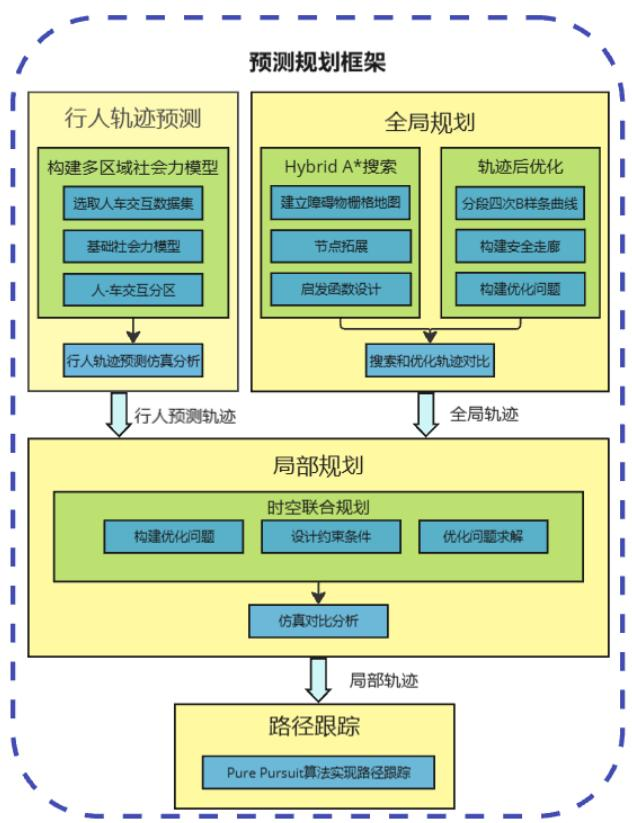

<details>
<summary>flowchart</summary>

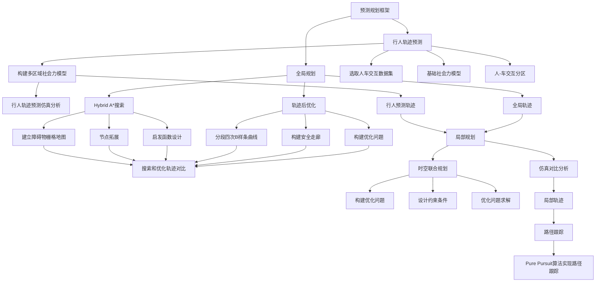
```mermaid
graph TD
    A["预测规划框架"] --> B["行人轨迹预测"]
    A --> C["全局规划"]
    B --> D["构建多区域社会力模型"]
    B --> E["选取人车交互数据集"]
    B --> F["基础社会力模型"]
    B --> G["人-车交互分区"]
    D --> H["行人轨迹预测仿真分析"]
    C --> I["Hybrid A*搜索"]
    C --> J["轨迹后优化"]
    I --> K["建立障碍物栅格地图"]
    I --> L["节点拓展"]
    I --> M["启发函数设计"]
    J --> N["分段四次B样条曲线"]
    J --> O["构建安全走廊"]
    J --> P["构建优化问题"]
    K --> Q["搜索和优化轨迹对比"]
    L --> Q
    M --> Q
    N --> Q
    O --> Q
    P --> Q
    D --> R["行人预测轨迹"]
    C --> S["全局轨迹"]
    R --> T["局部规划"]
    S --> T
    T --> U["时空联合规划"]
    U --> V["构建优化问题"]
    U --> W["设计约束条件"]
    U --> X["优化问题求解"]
    T --> Y["仿真对比分析"]
    Y --> Z["局部轨迹"]
    Z --> AA["路径跟踪"]
    AA --> AB["Pure Pursuit算法实现路径跟踪"]
```
</details>

图2.1 预测规划框架

（1）行人轨迹预测：针对城市狭窄道路环境中行人运动频繁、随机性大的特点，提出了基于多区域社会力模型的行人轨迹预测方法。通过划分车辆周围的不同风险区域，并分别设定社会力模型参数，提升行人行为预测的精度，为规划提供实时有效的决策依据。  
（2）全局规划——轨迹搜索：采用改进后的 Hybrid A\*算法进行全局路径规划。由于传统 Hybrid A\*算法在狭窄道路环境下可能导致路径不平滑、转弯过度内切、碰撞静态障碍物等问题，因此本文结合车辆运动学约束，利用 Reeds-Shepp 曲线扩展节点，生成初步全局路径。  
（3）全局规划——轨迹优化：针对 Hybrid A\*搜索路径的不足，提出了基于拟合和平滑处理的路径优化方法。通过构建优化问题，将路径平滑性、转弯曲率连续性和避障约束相结合，有效消除了不合理路径现象，显著提升了路径质量，增强了车辆实际运行时的可行性。其中提出了使用球体翻转法作为生成安全走廊的方法，生成的安全走廊精准且空间利用率高。  
（4）局部规划：为了避免传统时空解耦方法下频繁停车与响应滞后的问题，引入时空联合规划策略。该方法在空间与时间维度内同时进行路径与速度的协同优化，实现了车辆在拥挤复杂环境下的精准避障与平稳驾驶，显著提升了应对动态障碍物的实时性与精度。  
（5）路径跟踪：基于规划得到的轨迹，采用 Pure Pursuit 路径跟踪算法，结合简化车辆运动学模型执行运动控制，确保车辆能够准确、平稳地沿规划路径行驶，提高了实际运行的稳定性和安全性。

# 2.2 车辆运动学模型

车辆模型简化在自主泊车系统中至关重要。成功的简化模型既可以兼顾碰撞检测的速度和精度，又能行车规划的复杂度。在本论文研究的场景下，车辆处于低速行驶状态，因此轮胎侧滑和车体变形影响较小，可简化为刚体矩形模型，如图 2.2 所示。其中，W表示车辆宽度，即左右两侧最外缘之间的距离；L表示车辆长度，即车头至车尾的最大距离；l为轴距，即前后轮轴之间的距离； $l _ { r }$ 表示后悬，即车辆最后端至后轴中心的距离； $l _ { f }$ 表示前悬，即前轴中心至车辆最前端的距离。

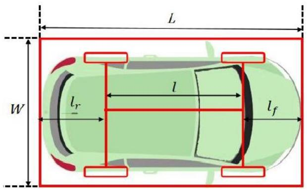

<details>
<summary>text_image</summary>

L
W
l
l_r
l_f
</details>

图2.2 车辆简化模型

如图2.3所示，车辆自行车模型由四轮模型简化得到的，车辆模型可以简化为二维平面上运动的刚体结构，车辆在任意时刻的状态 $\boldsymbol { q } = ( x , y , \theta )$ ，后轴的中心是车辆坐标的原点，坐标轴与车身平行。??表示车辆的速度，ϕ表示前轮转角（左为正，右为负），??表示前轴和后轴的距离，如果前轮转角保持ϕ不变，车辆就会在原地以半径为R转圈。

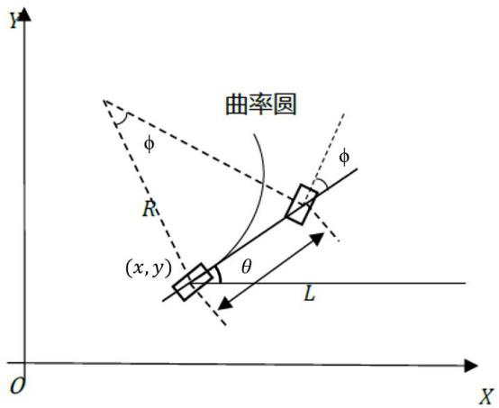

<details>
<summary>text_image</summary>

曲率圆
φ
R
(x,y)
θ
L
O
X
Y
</details>

图2.3 车辆自行车模型

车辆运动模型:

$$
\dot {x} = f _ {1} (x, y, \theta , v, \phi) \tag {2.1}
$$

$$
\dot {y} = f _ {2} (x, y, \theta , v, \phi) \tag {2.2}
$$

$$
\dot {\theta} = f _ {3} (x, y, \theta , v, \phi) \tag {2.3}
$$

在一个极短的时间Δt内，可以近似认为车辆按照车身中心轴的方向运动，dx、dy表示在dt时间内车辆在 x 轴、y 轴移动的距离，用ω表示Δt时间内车身运动的距离。

由：

$$
\frac {d y}{d x} = \tan \theta \tag {2.4}
$$

$$
\frac {d y}{d x} = \frac {\dot {y}}{\dot {x}} \tag {2.5}
$$

$$
\tan \theta = \sin \theta / \cos \theta \tag {2.6}
$$

$$
d \omega = \rho d \theta \tag {2.7}
$$

$$
\dot {\omega} = v \tag {2.8}
$$

$$
\mathrm{R} = L / \tan \phi \tag {2.9}
$$

可得：

$$
\left[ \begin{array}{l} \dot {x} \\ \dot {y} \\ \dot {\theta} \end{array} \right] = v * \left[ \begin{array}{l} c o s (\theta) \\ s i n (\theta) \\ \frac {t a n \phi}{L} \end{array} \right] \tag {2.10}
$$

$$
\dot {v} = a \tag {2.11}
$$

基于这个简单的车辆自行车模型，在给定了某个时刻的控制输入(a,ϕ)以后，就可以估算车辆在下一时刻的坐标，偏航角以及速度等状态信息。

# 2.3 Frenet 坐标系

Frenet 坐标系常用于自动驾驶和路径规划，以曲线的切线和法线方向构成。X轴沿切线方向，表示车辆前进方向，Y轴沿法线方向，表示侧向偏移量。车辆位置由这两者的偏移量描述，曲率则衡量曲线的弯曲程度。该坐标系能简化路径规划与车辆控制，特别适用于曲线路径，提高路径跟踪的精度和稳定性。

# 2.3.1 Frenet 坐标系的建立

Frenet 坐标系的建立基于一个参考线，这个参考线可以是任意曲线，但在自动驾驶运动规划中一般定义为道路的中心线，这条中心线是地图模块输入过来的一系列离散点。同时使用参考线的切线向量和法线向量建立一个直角坐标系，就是 Frenet 坐标系。

如图 2.4 所示，假设车辆质心在全局 Cartesian 坐标系下的坐标为 $( x , y )$ ，向选定的参考线做投影，得到投影点??；??点称为 Frenet 坐标系的原点，原点处参考线切线方向称为s 轴方向或纵轴方向，原点处参考线法线方向称为d轴方向或横轴方向。纵坐标??值指的是参考线上的原点与起点之间曲线的长度，也就是车辆在道路上的纵向行驶距离。横坐标??值指的是原点与车辆质心之间的距离，也就是车辆偏离道路中心线的距离。因此，车辆在 Cartesian 坐标系下的坐标(??, ??)可通过 Frenet 坐标系下的坐标(??,??)来表示。车辆质心随着车辆运动在不断变化，因此 Frenet 坐标系的原点也在不断变换，所以Frenet 坐标系是一个移动坐标系。

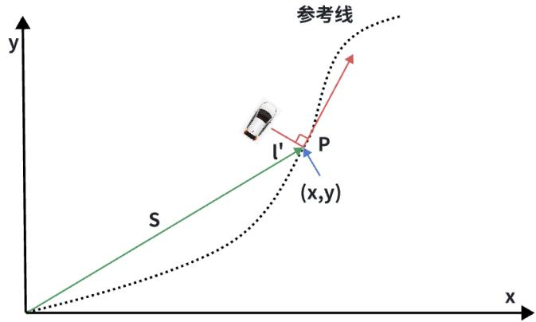

<details>
<summary>text_image</summary>

参考线
y
l'
P
(x,y)
S
x
</details>

图2.4 Frenet坐标系

如图 2.5 所示，通过 Frenet 坐标系可以将弯曲复杂的的车道中心曲线转换为直线，自动驾驶基于Frenet 坐标系规划，降低了路径规划的复杂度。此外，Frenet 坐标系实现了车辆轨迹规划的横纵向解耦，使横向和纵向状态可独立描述车辆信息，从而分别进行横向避障和纵向速度规划，将原本的(??,??,??)三维问题降维成两个(??,??)和(??,??)二维问题，优化了规划流程。

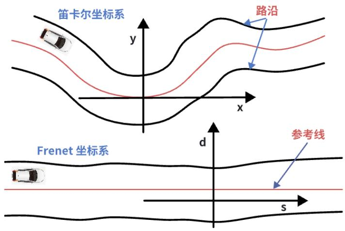

<details>
<summary>text_image</summary>

笛卡尔坐标系
y
x
路沿
Frenet 坐标系
d
参考线
s
</details>

图2.5 轨迹点在Frenet坐标系下的变化

# 2.3.2 Frenet 坐标系与 Cartesian 坐标系的转换

自动驾驶车辆在进行运动规划之前，需要将地图模块发来的全局 Cartesian 坐标系下的车辆位置及运动状态转换到当前局部 Frenet 坐标系下；而且运动规划之后得到的 Frenet 坐标系下的轨迹点不能直接用于控制，需要将其转换回 Cartesian 坐标系下，才能输出给控制模块。如图2.6所示，Frenet 坐标系和Cartesian 坐标系的转换关系可以通过相应的向量运算法推导得出。

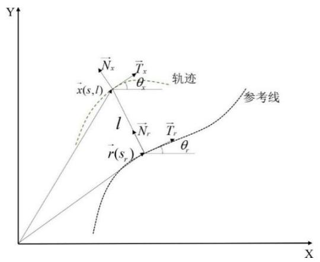

<details>
<summary>text_image</summary>

Y
x(s,l)
l
r(s_r)
θ_x
θ_r
θ_t
参考线
N_x
T_x
轨迹
N_r
T_r
</details>

图2.6 Cartesian坐标系与Frenet坐标系的转化

在 Cartesian 坐标系下的车辆位置及运动状态 $( x , y , \theta _ { x } , k _ { x } , \nu _ { x } , a _ { x } )$ 转换到 Frenet 坐标系下 $\hat { \bf \Delta }$ 的过程如式(2.12)所示。

$$
\left\{ \begin{array}{l} s = s _ {r} \\ \dot {s} = \frac {\nu_ {x} \cos (\theta_ {x} - \theta_ {r})}{1 - k _ {r} l} \\ \ddot {s} = \frac {a _ {x} \cos (\theta_ {x} - \theta_ {r}) - \dot {s} ^ {2} \left[ l ^ {\prime} \left(k _ {x} \frac {1 - k _ {r} l}{\cos (\theta_ {x} - \theta_ {r})} - k _ {r}\right) - (k _ {r} ^ {\prime} l + k _ {r} l ^ {\prime}) \right]}{1 - k _ {r} l} \\ l = s i g n ((y - y _ {r}) \cos \theta_ {r} - (x - x _ {r}) \sin \theta_ {r}) \sqrt {(x - x _ {r}) ^ {2} + (y - y _ {r}) ^ {2}} \\ l ^ {\prime} = (1 - k _ {r} l) \tan (\theta_ {x} - \theta_ {r}) \\ l ^ {\prime \prime} = - (k _ {r} ^ {\prime} l + k _ {r} l ^ {\prime}) \tan (\theta_ {x} - \theta_ {r}) + \frac {1 - k _ {r} l}{\cos^ {2} (\theta_ {x} - \theta_ {r})} (\frac {1 - k _ {r} l}{\cos^ {2} (\theta_ {x} - \theta_ {r})} k _ {x} - k _ {r}) \end{array} \right. \tag {2.12}
$$

在 Frenet 坐标系下的车辆位置及运动状态 $( s , l , \dot { s } , \ddot { s } , l ^ { \prime } , l ^ { \prime \prime } )$ 转换到 Cartesian 坐标系$\top ( x , y , \theta _ { x } , k _ { x } , \nu _ { x } , a _ { x } )$ 的过程如式(2.13)所示。

$$
\left\{ \begin{array}{l} x = x _ {r} - l \sin \theta_ {r} \\ y = y _ {r} + l \cos \theta_ {r} \\ \theta_ {x} = a r c t a n \left(\frac {l ^ {\prime}}{1 - k _ {r} l}\right) + \theta_ {r} \\ v _ {x} = \sqrt {[ \dot {s} (1 - k _ {r} l) ] ^ {2} + (\dot {s} \cdot l ^ {\prime}) ^ {2}} \\ a _ {x} = \ddot {s} \frac {1 - k _ {r} l}{c o s (\theta_ {x} - \theta_ {r})} + \frac {\dot {s} ^ {2}}{c o s (\theta_ {x} - \theta_ {r})} \bigg [ l ^ {\prime} \left(k _ {x} \frac {1 - k _ {r} l}{c o s (\theta_ {x} - \theta_ {r})} - k _ {r}\right) - (k _ {r} ^ {\prime} l + k _ {r} ^ {\prime}) \bigg ] \\ k _ {x} = \bigg [ (l ^ {\prime \prime} + (k _ {r} ^ {\prime} l + k _ {r} l ^ {\prime}) t a n (\theta_ {x} - \theta_ {r})) \frac {c o s ^ {2} (\theta_ {x} - \theta_ {r})}{1 - k _ {r} l} + k _ {r} \bigg ] \frac {c o s (\theta_ {x} - \theta_ {r})}{1 - k _ {r} l} \end{array} \right. \tag {2.13}
$$

本节中出现的所有参数含义汇总到表2.1 所示：

表2.1 参数含义

<table><tr><td>参数</td><td>含义</td><td>单位</td></tr><tr><td> $v_x$ </td><td>Cartesian坐标系下的车辆速度</td><td>m/s</td></tr><tr><td> $a_x$ </td><td>Cartesian坐标系下的车辆加速度</td><td> $m/s^2$ </td></tr><tr><td> $\theta_x$ </td><td>Cartesian坐标系下的车辆航向角</td><td>rad</td></tr><tr><td> $k_x$ </td><td>Cartesian坐标系下当前位置的曲率</td><td>无</td></tr><tr><td> $x_r$ </td><td>轨迹点投影在参考线上的x坐标</td><td>m</td></tr><tr><td> $y_r$ </td><td>轨迹点投影在参考线上的y坐标</td><td>m</td></tr><tr><td> $\theta_r$ </td><td>参考线投影点与X轴的切角</td><td>rad</td></tr><tr><td> $k_r$ </td><td>参考线投影点的曲率</td><td>无</td></tr><tr><td> $k_{r}'$ </td><td>参考线投影点的曲率的一阶导</td><td>无</td></tr><tr><td> $s_r$ </td><td>Frenet坐标系下参考线投影点的纵坐标</td><td>m</td></tr><tr><td>s</td><td>车辆在Frenet坐标系中纵坐标</td><td>m</td></tr><tr><td>l</td><td>车辆在Frenet坐标系中横坐标</td><td>m</td></tr><tr><td> $\dot{s}$ </td><td>车辆在Frenet坐标系下的纵向速度</td><td>m/s</td></tr><tr><td> $\ddot{s}$ </td><td>车辆在Frenet坐标系下的纵向加速度</td><td> $m/s^2$ </td></tr><tr><td> $l'$ </td><td>l对s的一阶导</td><td>无</td></tr><tr><td> $l''$ </td><td>l对s的二阶导</td><td>无</td></tr><tr><td> $\vec{T}_x$ </td><td>当前位置坐标的单位切向量</td><td>无</td></tr><tr><td> $\vec{N}_x$ </td><td>当前位置坐标的单位法向量</td><td>无</td></tr><tr><td> $\vec{T}_r$ </td><td>参考线投影点的单位切向量</td><td>无</td></tr><tr><td> $\vec{N}_r$ </td><td>参考线投影点的单位法向量</td><td>无</td></tr></table>

# 2.4 本章小结

本章围绕城市狭窄道路场景，构建了完整的自动驾驶系统预测与路径规划框架，并对各模块的关键技术进行了详细分析。内容涵盖了从行人轨迹预测到路径规划与控制的完整技术流程，为自动驾驶车辆在复杂拥挤环境中的精准避障与安全行驶提供了理论依据和技术支持。分析了车辆运动学模型，为后续轨迹跟踪提供了模型基础，并对 Frenet 坐标系与 Cartesian 坐标系的优缺点进行了比较，给出了 Frenet 坐标系与Cartesian坐标系之间的转换公式，为后续的时空联合规划提供了理论支持。

# 3 行人轨迹预测

城市狭窄道路环境下，频繁而复杂的人车交互是影响自动驾驶安全性与驾驶效率的关键因素之一。准确预测行人运动轨迹与行为意图，对于自动驾驶系统实现安全、平稳的路径规划和避障决策至关重要。本章将结合多区域社会力模型，构建适用于复杂交互场景的行人轨迹预测方法，为后续路径规划提供可靠支持。

# 3.1 人车交互数据集选取及分析

# 3.1.1 数据集选取

行人轨迹预测的准确性很大程度上取决于数据集的质量和适用性。通常，为采集精准的行人流轨迹数据，需要在与地面垂直的坐标系下设置多个摄像机进行同步拍摄，并进行严格的空间校正，因此数据获取和处理较为复杂。为了更好地建模行人流，需要选用适当的数据集进行处理。

常见的用于大规模行人流研究的数据集包括 ETH（ETH Zurich）[47]、UCY（University of California, Irvine）[48]等，这些数据集仅包含行人轨迹，不涉及车辆轨迹，因此不适用于人车交互场景。而 JAAD（Joint Attention in Autonomous Driving）[49]数据集虽然隐含了车辆优先路权的信息，但不适用于大密度行人流占据道路通行权的情境。

通过上述数据集的对比分析（如表 3.1 所示），本文最终选择了大连理工大学Dongfang Yang 等人于 2019 年采集的 DUT（Dalian University of Technology）数据集[50]。该数据集基于 CITR 实验平台进行采集，包含大连理工大学校园和俄勒冈州立大学校园内行人与车辆交互的视频数据，该数据集中，被观察分析行人主要在车辆两侧活动，其与车辆的交互模式与狭窄道路环境中的行车-行人交互情形具有高度一致性。因此，本研究采用该数据集模拟狭窄道路条件下，车辆与两侧人流之间的交互行为。如图3.1 所示。DUT 数据集共涵盖30余种不同的交互工况，提供了 1793条真实有效的轨迹数据。此外，数据集中提供了经过卡尔曼滤波预处理的轨迹真值，以及相应的行人与车辆像素位置数据及空间转换比例，便于后续进行数据转换、分析与建模。

表3.1 数据集对比

<table><tr><td>数据集</td><td>数据集</td><td>车辆轨迹</td><td>场景类型</td><td>路权规则</td><td>适用性评估</td></tr><tr><td>ETH</td><td>高密度</td><td>无</td><td>开放广场</td><td>无</td><td>不适用</td></tr><tr><td>DUT</td><td>高密度</td><td>包含</td><td>狭窄道路</td><td>行人优先</td><td>最佳</td></tr></table>

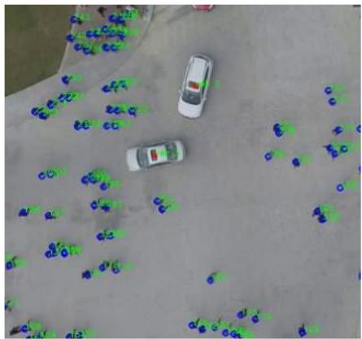

<details>
<summary>text_image</summary>

Aerial photo showing two cars on a road with scattered blue lettered signs and numbers, likely indicating vehicle identifiers or identifiers.
</details>

图3.1DUT数据集采集俯视数据示意图

# 3.1.2 人车交互数据分析

# （1）人车交互距离与行人期望速度

行人与车辆的交互距离及行人期望速度对轨迹预测具有重要影响。何颖[51]指出，行人在无干扰时的行进速度服从正态分布，而与车辆交互后速度分布发生显著变化。为研究此规律，本节对 DUT 与 ETH 数据集中人车距离小于 10m 的数据进行分析。经高斯回归拟合可知，当人车距离超过 4m 时，行人速度趋于稳定，几乎不存在交互现象。

此外，为分析行人在近距离（4m 以内）交互时的速度特征，提取 DUT数据集中每秒23.97帧的数据，计算行人平均速度并绘制分布图（图 3.2）。结果显示，行人与车辆交互时的速度大多集中在 1\~2m/s 之间，且存在约 1.3m/s 的局部峰值，表明行人通常以较低速度主动避让车辆，确保安全通行。

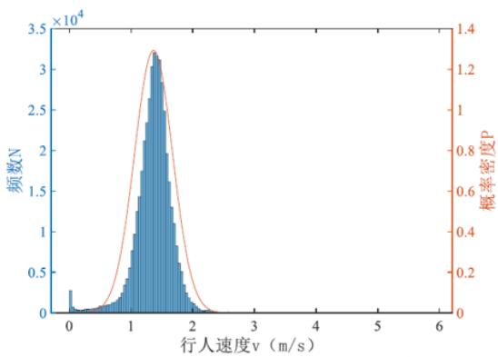

<details>
<summary>bar_line</summary>

| 行人速度v (m/s) | 频数N (×10⁴) | 概率密度P |
| --------------- | ------------- | ---------- |
| 0.0             | 0             | 0          |
| 0.5             | 0.1           | 0.1        |
| 1.0             | 1.5           | 0.8        |
| 1.5             | 3.2           | 1.2        |
| 2.0             | 1.0           | 0.6        |
| 2.5             | 0.2           | 0.2        |
| 3.0             | 0             | 0          |
| 3.5             | 0             | 0          |
| 4.0             | 0             | 0          |
| 4.5             | 0             | 0          |
| 5.0             | 0             | 0          |
| 5.5             | 0             | 0          |
| 6.0             | 0             | 0          |
</details>

图3.2 DUT数据集行人速度

# （2）车辆不同交互区的差异

在 DUT 数据集中，行人密度高且通常占据道路通行的优先权，体现出城市狭窄道路场景中“行人优先”的特征。实际交互中，行人更倾向于绕行车辆尾部而非车头区域。因此，将车辆视为统一整体进行交互分析存在局限性，有必要细化车辆周围的交互区域以深入研究其差异性。

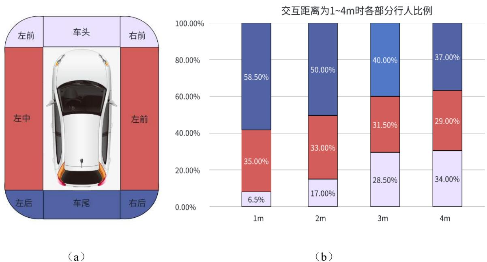

图3.3 车辆交互分区和交互距离1\~4m，各区域与行人交互概率   
表3.2 车辆细分交互区与行人交互概率统计表

<table><tr><td>交互区域</td><td>距离1m</td><td>距离2m</td><td>距离3m</td><td>距离4m</td></tr><tr><td>车头</td><td>0.00%</td><td>2.50%</td><td>3.00%</td><td>5.00%</td></tr><tr><td>中部</td><td>35.00%</td><td>33.00%</td><td>31.5%</td><td>29.00%</td></tr><tr><td>车尾</td><td>10.00%</td><td>13.00%</td><td>10.00%</td><td>7.00%</td></tr><tr><td>左前</td><td>3.00%</td><td>8.00%</td><td>10.00%</td><td>15.00%</td></tr><tr><td>右前</td><td>3.50%</td><td>6.50%</td><td>15.00%</td><td>14.00%</td></tr><tr><td>左后</td><td>7.00%</td><td>9.00%</td><td>15.00%</td><td>11.00%</td></tr><tr><td>右后</td><td>41.5%</td><td>28.00%</td><td>15.00%</td><td>19.00%</td></tr></table>

本研究将车辆周围区域按图 3.3(a)所示进行细分，并统计了不同区域内的行人交互数量，结果如表 3.2 所示。统计表明，在车辆低速行驶的前提下，1\~2m 范围内与车头区域的交互概率明显低于车身中部及尾部区域，尤其在 1m 以内车头区域几乎无交互行为。这说明行人通常倾向于避免与车辆车头发生近距离接触，而在1m范围内，车尾区域的交互概率高达 58.5%，表明行人在密切交互时更偏好绕行车尾。

# 3.2 构建多区域社会力模型

# 3.2.1 基础社会力模型

传统的基于概率的行人轨迹预测方法（如高斯过程回归、隐马尔可夫模型）假设行人行为服从特定概率分布（如速度正态分布），并基于历史数据推断行人未来的运动轨迹。这些方法虽然能在简单环境中取得良好效果，但在密集动态的人车交互场景下，暴露出明显的不足，具体表现为：

a.静态假设与动态交互冲突：传统概率模型基于历史数据的固定分布进行预测，难以实时适应行人与车辆之间动态博弈所引起的行为模式变化；  
b.缺乏交互耦合性：概率方法通常将个体行人视为孤立的对象，忽略了真实场景中普遍存在的行人之间以及行人与车辆之间的相互影响；  
c.意图推理不足：概率模型仅能预测未来位置的概率分布，无法解释行人进行某些特定行为决策（如“加速穿越”、“减速绕行”）背后的动机和逻辑。

为克服传统概率方法的不足，引入社会力模型（SFM）作为行人轨迹预测的核心框架。与概率方法相比，SFM 具有显著优势：它通过实时更新参数，能够动态适应交互敏感区内行人行为的变化；通过显式建模行人、车辆和环境之间的多维作用力，更好地解释复杂行为，如绕行和避让；同时，SFM 通过平衡驱动力和排斥力，直接反映行人的决策意图，从而提供更具可解释性的预测结果。

基础社会力模型由以下三种力组成：

（1）行人目标点对其产生的吸引力 ${ \vec { F } } _ { G }$ ：

目标点可以是最终目的地，也可以是路径上的一系列点。由于行人在行进过程中可能改变方向或绕道，目标点对行人具有吸引力，吸引力的方向指向目标点，其大小与行人当前速度、期望速度之间的插值以及松弛时间 τ（从当前速度过渡到期望速度所需时间）相关，具体公式如下所示：

$$
\vec {e} _ {G} = \frac {\vec {g} - \vec {p}}{\| \vec {g} - \vec {p} \|} \tag {3.1}
$$

$$
\vec {F} _ {G} = A _ {G} \cdot \left(\nu_ {p} ^ {0} \cdot \vec {e} _ {G} - \vec {\nu} _ {p}\right) \tag {3.2}
$$

其中 ${ \vec { F } } _ { G }$ 是行人所受目标点对自己的吸引力，??⃗是目标点位置， $\vec { p } { : }$ 是行人当前位置，$\scriptstyle { { \vec { e } } _ { G } }$ 为行人位置指向目标点位置的单位向量， $A _ { G }$ 为权重系数，是行人松弛时间 τ 的倒数，用来调节速度变化， $\nu _ { p } ^ { 0 }$ 是行人期望速度，通过分析 DUT 数据集，认为其值为1.42m/s， $\vec { \nu } _ { p }$ 是行人当前速度。

# （2）周围行人产生的排斥力 $\vec { F } _ { p }$

尽管行人流中存在跟随现象，但行人自身也受到领域效应的影响，即行人之间会保持一定的距离。当行人进入他人的活动范围时，会感到不适，并且这种不适感与距离成反比。因此，周围行人会对其产生指向该行人位置的排斥力，排斥力与行人之间的距离成反比，距离越近，排斥力越大，从而保护行人的个人空间不受干扰。排斥力方向指向行人，具体公式如下：

$$
\vec {e} _ {i j} = \frac {\vec {p} _ {i} - \vec {p} _ {j}}{\| \vec {p} _ {i} - \vec {p} _ {j} \|} \tag {3.3}
$$

$$
\vec {F} _ {p} = A _ {i j} \sum_ {j = 1} \varphi_ {i j} \cdot \vec {e} _ {i j} \tag {3.4}
$$

其中 $A _ { i j }$ 为权重系数， $\vec { p } _ { i }$ 是当前行人位置， $\vec { p } _ { j }$ 是产生排斥力的行人 j 的位置， $\vec { e } _ { i j }$ 为行人j 指向行人 i 的单位方向向量， $\varphi _ { i j }$ 是衡量交互强度的系数。

# （3）其他周围事物产生的作用力 $\vec { F } _ { o }$

行人在道路上行走时，除了受到目标点和周围行人作用力的影响，还会受到周围环境中其他因素（如斑马线、车辆、朋友或其他感兴趣的物体等）的约束。这些约束力可以是吸引力或排斥力，根据不同情况设定相应的作用力。具体计算公式如下：

$$
\vec {F} _ {O} = A _ {O 2 P} e ^ {- \frac {d _ {O 2 P} ^ {2}}{B _ {O 2 P}}} \cdot \vec {e} _ {O 2 P} \tag {3.5}
$$

其中 $A _ { O 2 P }$ 为调节权重系数， $B _ { O 2 P }$ 为势函数参数， $\vec { e } _ { O 2 P }$ 为交互单位向量，如是吸引力，则由行人指向目标，反之如果是排斥力，则由目标指向行人。

综上所述，基础社会力模型合力公式表达如下：

$$
\vec {F} _ {\text {total}} = \vec {F} _ {G} + \vec {F} _ {P} + \vec {F} _ {O} \tag {3.6}
$$

由于行人本身并不是质点模型，其物理模型应设置加速上限，认为受到合力产生的加速度应小于等于 $4 \mathrm { m } / { s ^ { 2 } }$ 。

在城市狭窄道路环境下，行人流密集且随机性强，使人车交互模式更为复杂。传统社会力模型多将车辆简化为质点，仅考虑车头交互点，适用于低密度场景，但在高密度环境中，车辆常受行人阻塞，导致停滞，传统模型难以精准描述此类交互。基于DUT 数据集分析，行人行为在不同交互区域存在显著差异，部分绕行车尾，部分尝试穿越车头。为更精确建模人车交互，本文在多区域社会力模型基础上引入车头交互区，优化车辆对行人行为的影响建模，提高预测精度与适用性。

# 3.2.2 多区域社会力模型

为了更清晰地描述人车交互过程中的相互作用力，本文依据行人与车辆的交互特性，将交互区域划分为冲突区和碰撞避免区。结合数据集分析，进一步将冲突区细分为前部冲突区（FRONT）、中部冲突区（MID）和尾部冲突区（TAIL），以精准刻画不同区域的人车交互特性。下文论述区域建模时中不考虑行人之间的作用力。

# （1）前部冲突区 FRONT

定义车辆车头前部两侧矩形区域为前部冲突区，长宽为 4m。根据行人与车辆的距离 $d _ { v 2 P }$ 、行人安全边际条件 PSMT、车辆行驶速度 $V _ { v }$ 、以及行人选择合作的最近距离 $\dot { d } _ { P 2 P }$ ，来判断是否产生合作决策。若选择让行的行人 $P _ { a }$ 被车辆阻挡前往目的地的意图，则 $\vec { F } _ { G } ^ { a } = 0$ ，此时行人仅受到避免冲突的排斥力 $\vec { F } _ { W } ^ { a }$ ，该力来自车辆侧前方“人墙”对行人的阻碍，方向由 $W _ { a }$ 指向 $P _ { a }$ ；若行人 $P _ { b }$ 不愿让行，则不受此排斥力影响。计算公式如下：

$$
\vec {F} _ {W} ^ {a} = A _ {W 2 P} \frac {\nu_ {a} ^ {2}}{2 (d _ {W 2 P} - 0 . 5)} \vec {e} _ {W 2 P} \tag {3.7}
$$

其中 $A _ { W 2 P }$ 为权重系数， $v _ { a }$ 为行人当前速度， $d _ { W 2 P }$ 为行人到墙体距离（即车辆侧面的垂直于车辆行进方向的距离）， $\vec { e } _ { W 2 P }$ 为墙体指向行人的单位向量（与车辆行进反向垂直，指向车辆外侧）。

# （2）中部冲突区 MID

中部冲突区 MID 在车身的两侧，其宽度为 4m，长度为车身总体长度的 2/3，当行人运动轨迹与该约束域产生空间交集时（记作行人 $P _ { c } )$ ），其通行路径将遭受完全阻断效应，导致运动状态呈现速率衰减乃至零速静止模态。在此区域内，车体侧缘将施加动态场作用力 $\vec { F } _ { W } ^ { c }$ ，该力学参数的数学表征与前部冲突区选择合作的行人保持一致。

# （3）尾部冲突区 TAIL

车身剩余区域属于尾部冲突区，向车尾延伸至宽度为 4m，位于尾部冲突区时，行人往往选择绕过尾部而非停止在原地等待车辆通行，因此，可以认为尾部冲突区对行人的目的地进行了临时的修订，使其朝向车尾部进行前进，假定该临时目的地 $G _ { t e m p }$ 为车辆模型车尾角转向点后 2倍的碰撞半径，行人 $P _ { d }$ 此时不仅受到方向由车尾角转向点指向行人位置的排斥力 $\vec { F } _ { V 2 P } ^ { d }$ ,，还受到临时目标点产生的吸引力 ${ \vec { F } } _ { G }$ ，方向由行人位置指向临时目标点，两者合力组成了 $\vec { F } _ { d }$ 。

设置碰撞避免区，定义行人不与车辆在此区域发生碰撞，当行人发现自己侵入了碰撞避免区，追求安全的心理往往使其产生迅速避让的策略，将作用力形式分为两类：矩形避碰区与扇形避碰区，其作用力的计算如下所示：

$$
\vec {F} _ {V 2 P} = A _ {V 2 P} e ^ {- \frac {d _ {V 2 P} ^ {2}}{B _ {V 2 P}}} \cdot \vec {e} _ {V 2 P} \tag {3.8}
$$

其中 $A _ { V 2 P }$ 为衡量人车交互程度的权重系数， $B _ { V 2 P }$ 为衡量势场的势函数参数； $\vec { e } _ { V 2 P }$ 为单位向量，方向由车辆交互点指向行人。

# a.矩形碰撞区

矩形避碰区宽度为 1m，向车头正前方、车身两侧、车尾正后方做延伸，位于该区域的行人 $P _ { e }$ 会受到车辆的排斥力 $\vec { F } _ { V 2 P } ^ { e }$ ,，其方向由车身上距离行人最近点 $W _ { e }$ 指向行人 $P _ { e }$ ，同时，目标点 $G _ { f i n i a l }$ 也会对行人产生吸引 $\vec { F } _ { G } ^ { e }$ ,力，两者产生合力为 $\vec { F } _ { e }$ 。

# b.扇形避碰区

扇形避碰区位于车辆四角所对应的交互区域，是以车辆四个边角点为圆心，半径为 1m 的扇形区域，位于该区域的行人 $P _ { f }$ 会受到车辆角点产生的排斥力 $\vec { F } _ { V 2 P } ^ { f }$ ,，其方向由车辆角心 $W _ { f }$ 指向行人，此时，目标点 $G _ { f i n i a l }$ 也会对其产生吸引力 $\vec { F } _ { G } ^ { f }$ ,，两者产生的合力为 $\vec { F } _ { f }$ 。

车头冲突区用来解决行人选择了与车辆合作，但其策略是选择加速冲过车头区域。此时行人 $P _ { g }$ 应该受到三个力：来自车头 $W _ { g }$ 到行人避免冲突的排斥力 $\vec { F } _ { W _ { g } } ^ { g }$ ,，该力认为是位于车头的人墙体”阻碍行人造成的，其方向由 $W _ { g }$ 指向 $P _ { g }$ ；来自车头 $W _ { g } ^ { \prime }$ 到行人避免冲突的排斥力 $\vec { F } _ { W _ { g } ^ { \prime } } ^ { g }$ ，该力认为是位于车两侧的人墙体”催促行人加速行进造成的，其方向由 $W _ { g } ^ { \prime }$ 指向 $P _ { g }$ ；来自目标点的吸引力 $\vec { F } _ { G } ^ { e }$ ,。这三个力的合力共同构成了行人 $P _ { g }$ 所受到的力 $\vec { F } _ { g }$ 。

$$
\vec {F} _ {W _ {g}} ^ {g} = A _ {W 2 P} \frac {(v _ {a} - v _ {\nu}) ^ {2}}{2 (4 - d _ {W 2 P}) ^ {B _ {W 2 P}}} \vec {e} _ {W 2 P} \tag {3.9}
$$

$$
\vec {F} _ {W _ {g ^ {\prime}}} ^ {g} = A _ {W ^ {\prime} 2 P} \frac {v _ {a} {} ^ {2}}{2 (4 . 5 - d _ {W ^ {\prime} 2 P}) ^ {B _ {W ^ {\prime} 2 P}}} \vec {e} _ {W ^ {\prime} 2 P} \tag {3.10}
$$

其中： $v _ { a }$ 为行人当前速度， $d _ { W 2 P }$ 为行人 $P _ { g }$ 到墙体 $W _ { g }$ 的距离， $\vec { e } _ { W 2 P }$ 为墙体 $W _ { g }$ 指向行人的单位向量， $B _ { W 2 P }$ 为车头墙体排斥力权重； $d _ { W ^ { \prime } 2 P }$ 为行人 $P _ { g }$ 到墙体 $W _ { g } ^ { \prime }$ 的距离， $\vec { e } _ { W ^ { \prime } 2 P }$ 为墙体 $W _ { g } ^ { \prime }$ 指向行人的单位向量。

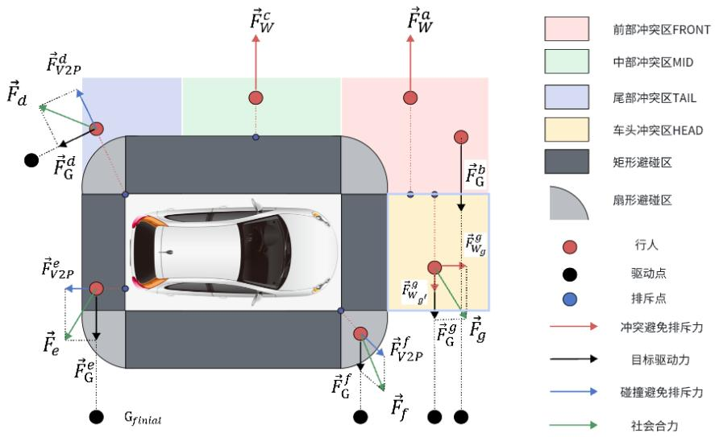

<details>
<summary>text_image</summary>

前部冲突区FRONT
中部冲突区MID
尾部冲突区TAIL
车头冲突区HEAD
矩形避碰区
扇形避碰区
行人
驱动点
排斥点
→ 冲突避免排斥力
→ 目标驱动力
→ 碰撞避免排斥力
→ 社会合力
FdV2P
FdGd
FdV2P
Fg
FgV2P
Fg
FgV2P
Gfinal
Fg
Fg
Fg
Fg
Fg
Fg
Fg
Fg
Fg
Fg
</details>

图3.4 多区域社会力模型作用力分布示意图

综上所述，如图3.4所示，为了更准确地预测行人在车辆周边的行为及运动轨迹，本文结合社会力模型与区域划分方法进行建模与分析。根据车辆周围的交通环境与行人分布特性，将该空间划分为不同功能或风险等级的区域，以细化行人状态分析。在各区域内，针对行人的运动特性进行精准建模，从而提升轨迹预测的准确性和适应性。

# 3.3 行人轨迹预测仿真实验

本文以上搭建的多区域社会力模型进行仿真实验，模型参数如表 3.3：

表3.3 社会力模型各项参数

<table><tr><td>参数名称</td><td>值</td><td>参数名称</td><td>值</td></tr><tr><td>人-人交互权重 $A_{ij}$ </td><td>5.0</td><td>角度权重 $n'$ </td><td>2.7</td></tr><tr><td>墙体排斥力权重 $A_{W2P}$ </td><td>2.0</td><td>松弛时间 $\tau(\frac{1}{A_G})$ </td><td>0.33</td></tr><tr><td>人-车交互权重 $A_{V2P}$ </td><td>10.0</td><td>角度权重n</td><td>2.0</td></tr><tr><td>交互方向权重 $\lambda$ </td><td>3.0</td><td>行人期望速度 $v_p^0$ </td><td>1.22</td></tr><tr><td>相对速度权重 $\gamma$ </td><td>0.33</td><td>车头墙体排斥力权重 $B_{W2P}$ </td><td>1.28</td></tr><tr><td>人-车交互势函数参数</td><td>1.5</td><td>——</td><td>——</td></tr></table>

如图 3.5 所示，车辆匀速行驶时，记录了行人在 T=4～7s 期间的仿真运动情况。T=4s 时，车辆两侧的行人（蓝色和绿色虚线）正向车辆移动，即将进入潜在冲突区域。T=5s 时，左侧行人选择绕行车尾，而右侧行人远离冲突区域，保持匀速前进。T=6s 时，左侧行人进入尾部冲突区，继续绕行车尾；右侧行人因中部冲突区的影响，开始减速，与车辆形成短暂博弈。T=7s 时，右侧行人因冲突区变化，最终选择绕行车尾，并调整临时目标点至车辆后方，确保安全通行。

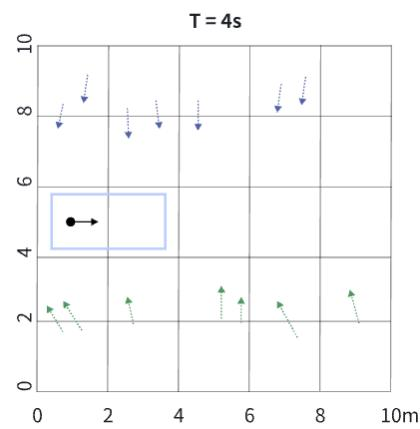

<details>
<summary>scatter</summary>

| x    | y    |
| ---- | ---- |
| 1    | 8.5  |
| 2    | 7.5  |
| 3    | 8.0  |
| 4    | 7.5  |
| 5    | 8.0  |
| 6    | 8.5  |
| 7    | 8.0  |
| 8    | 8.5  |
| 9    | 2.5  |
</details>

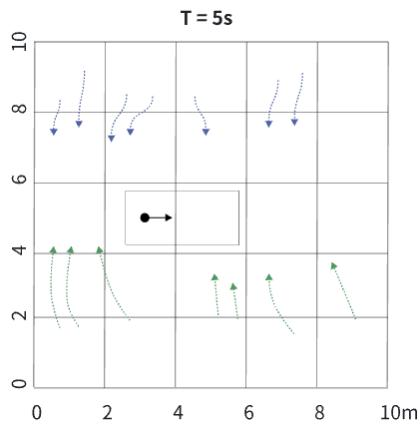

<details>
<summary>scatter</summary>

| x    | y    |
| ---- | ---- |
| 0.0  | 7.5  |
| 1.0  | 8.0  |
| 2.0  | 7.0  |
| 3.0  | 8.5  |
| 4.0  | 7.5  |
| 5.0  | 8.0  |
| 6.0  | 7.5  |
| 7.0  | 8.5  |
| 8.0  | 7.5  |
| 9.0  | 8.0  |
| 10.0 | 7.5  |
| 1.0  | 4.0  |
| 2.0  | 4.0  |
| 3.0  | 4.0  |
| 4.0  | 4.0  |
| 5.0  | 3.0  |
| 6.0  | 3.0  |
| 7.0  | 3.0  |
| 8.0  | 3.5  |
| 9.0  | 3.5  |
| 10.0 | 3.5  |
</details>

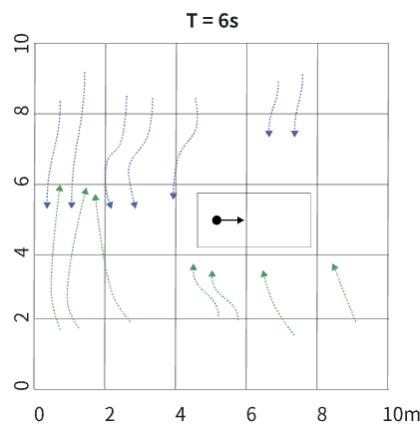

<details>
<summary>line</summary>

| x    | y    |
| ---- | ---- |
| 0    | 5.5  |
| 1    | 5.8  |
| 2    | 5.6  |
| 3    | 5.4  |
| 4    | 5.7  |
| 5    | 3.5  |
| 6    | 3.3  |
| 7    | 3.6  |
| 8    | 3.4  |
</details>

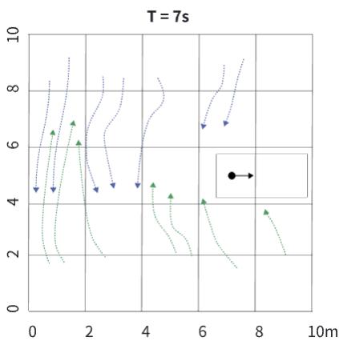

<details>
<summary>line</summary>

| x    | y (blue line) | y (green line) |
| ---- | ------------- | -------------- |
| 0    | 4             | 6              |
| 1    | 8             | 7              |
| 2    | 6             | 6              |
| 3    | 8             | 5              |
| 4    | 6             | 4              |
| 5    | 8             | 4              |
| 6    | 7             | 4              |
| 7    | 9             | 3              |
| 8    | 9             | 3              |
| 9    | 9             | 2              |
</details>

图3.5 T=4～7s时刻的仿真运动情况

如图3.6所示，在行为交互场景中，对比了观测到的行人单轨迹与模型预测的单轨迹。图中，蓝色和绿色虚线分别表示基于观测数据预测的行人运动轨迹，红色实线为数据集中记录的真实行人轨迹，黑色实线则代表车辆的行驶轨迹。

对比结果表明，预测轨迹与真实轨迹整体趋势高度一致，说明本文提出的多区域社会力模型能够较为准确地描述行人与车辆的交互行为，特别是在行人避让车辆或绕行车尾等关键决策时，模型预测具有良好的拟合度。这表明该方法在城市狭窄道路环境下，对行人轨迹的建模与预测具有较高的适用性和准确性。后续进行局部规划时将会把预测的行人动态障碍物加入局部规划器中。

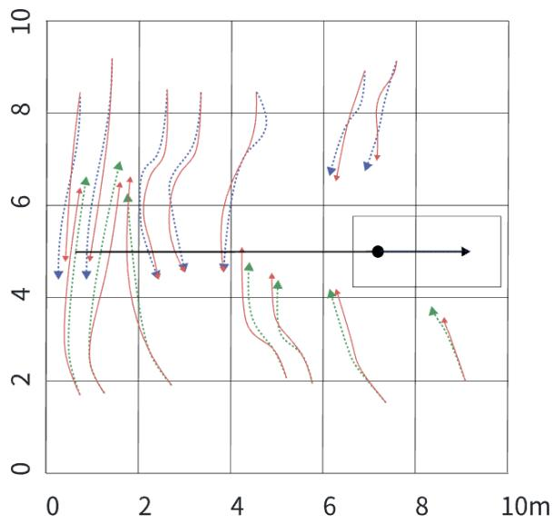

<details>
<summary>line</summary>

| x    | y (Red Solid) | y (Blue Dashed) | y (Green Solid) | y (Green Dashed) |
| ---- | ------------- | --------------- | --------------- | ---------------- |
| 0    | 4             | 5               | 6               | 6                |
| 1    | 8             | 9               | 7               | 7                |
| 2    | 6             | 8               | 6               | 6                |
| 3    | 4             | 7               | 5               | 5                |
| 4    | 5             | 6               | 4               | 4                |
| 5    | 3             | 5               | 3               | 3                |
| 6    | 2             | 4               | 2               | 2                |
| 7    | 1             | 3               | 1               | 1                |
| 8    | 0             | 2               | 0               | 0                |
| 9    | -1            | 1               | -1              | -1               |
| 10   | -2            | 0               | -2              | -2               |
</details>

图3.6 行人预测轨迹

# 3.4 本章小节

本章围绕城市狭窄道路环境下的人车交互建模与行人轨迹预测展开研究。首先，基于不同人车交互数据集的对比分析，选取了更契合研究需求的 DUT 数据集，以支撑复杂交互场景下的行人轨迹建模。随后，通过数据分析，探讨了行人速度与人车交互距离之间的关系，总结4m 以内为人车交互的敏感区域，并进一步细化了车辆不同区域对行人行为的影响。

在此基础上，提出了一种多区域社会力模型，细化车辆周边交互区域，从而更精确地描述稠密行人环境下的行人避让与绕行行为。仿真实验结果表明，该模型能够较为准确地预测行人轨迹。本章的研究成果不仅为后续路径规划提供了更精准的行人预测能力，同时也奠定了更可靠的避障策略基础。

# 4 生成安全走廊

在狭窄道路环境中，障碍物密集且分布复杂，自动驾驶系统不仅要精准感知环境，还需要高效规划安全可行的通行区域，以确保车辆平稳、安全行驶。传统避障方法往往依赖于网格地图或膨胀障碍物方法，计算开销大，且难以适应动态环境的实时性需求。为此，本文使用了一种基于球体翻转的安全走廊生成方法，在复杂环境中快速构建无碰撞的通行区域。

# 4.1 球体翻转法

方法包括自由空间建模和凸多边形构造两部分。首先，利用球体翻转变换将障碍点外推至边界，计算其凸包，并逆向映射至原始坐标系，生成无障碍的星型自由区域。随后，对边界进行优化，使其满足严格凸包条件，确保所有障碍物均被排除。该方法直接基于点云数据运行，避免网格划分和繁琐路径搜索，计算速度快，适用于嵌入式系统。相较于传统膨胀椭圆法，该方法提高了空间利用率，并为后续路径优化提供更稳定的可行解。

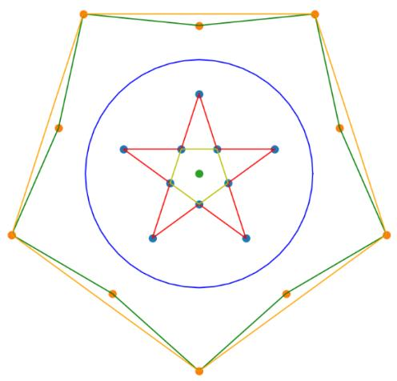

<details>
<summary>natural_image</summary>

Geometric diagram with concentric circles and a central star, no text or symbols present
</details>

图4.1 显示原始点云（红色点）和球体翻转后的点云（橙色点），翻转球体（蓝色圆），星型区域（红色五角星）

# 4.1.1 球体翻转法优势

在复杂自动驾驶环境中，高效生成自由空间的凸包对于路径规划至关重要。本文提出的球体翻转方法可直接在点云数据上运行，无需栅格地图或体素表示，显著提高计算效率和适应性。

如表 4.1 所示，与 Liu 等人提出的膨胀椭圆法（SFC）方法相比[52]，球体翻转方法采用线性空间变换，将点云映射到球体翻转坐标系，快速提取自由空间并生成凸包区域。这一过程避免了传统方法中繁琐的细化和膨胀计算，减少了数据预处理的开销，提高了算法的实时性。相比之下，SFC 方法依赖栅格地图和体素建模，计算复杂度较高，难以满足大规模动态环境下的实时规划需求。

表4.1 对比两种走廊生成方法

<table><tr><td></td><td>球体翻转法</td><td>膨胀椭圆法</td></tr><tr><td>核心原理</td><td>通过线性变换(球面翻转)将障碍物点映射到外部空间,生成星凸多边形后转化为严格凸区域。</td><td>通过膨胀椭球体生成覆盖路径的凸多边形序列(如图4.2)。</td></tr><tr><td>几何保证</td><td>生成的凸多边形严格排除所有障碍物点。</td><td>依赖椭球膨胀和切平面逼近,可能因路径局部偏差或障碍物分布导致多边形边界不精确。</td></tr><tr><td>障碍物建模</td><td>直接处理原始点云,保留所有障碍物空间信息,无信息丢失。</td><td>仅处理路径周围的局部障碍物(通过边界框限制),可能忽略远距离或复杂分布的障碍物。</td></tr><tr><td>自由空间覆盖</td><td>生成凸区域的体积更大(实验显示比膨胀椭圆法方法大22%),更贴近实际自由空间。</td><td>走廊体积受限于初始路径的几何形状,在狭窄场景中易产生保守的走廊(如图4.3)。</td></tr><tr><td>动态适应性</td><td>通过动态更新查询坐标系适应移动场景,支持实时障碍物融合(如行人预测轨迹)。</td><td>依赖静态路径规划,动态环境下需频繁重规划,可能导致走廊更新滞后。</td></tr><tr><td>适用场景</td><td>适用于任意点云环境(无结构假设),尤其在密集动态障碍物中表现优越。</td><td>适用于结构化或低动态环境,依赖传感器局部感知范围,全局地图下可能失效。</td></tr></table>

此外，球体翻转方法能够保证生成自由空间的凸性，并在障碍物无碰撞的前提下实现毫秒级计算，适用于嵌入式平台。其较强的鲁棒性使其能够适应噪声较大的传感器数据，而 SFC 方法在障碍物形状复杂的环境中性能受限，难以高效处理快速变化的动态场景。

总体而言，球面翻转方法在计算效率、适应性和精度方面均优于传统方法，尤其适用于大规模、高复杂度的自动驾驶环境。此外，该方法也可推广至其他需要实时路径规划和避障的机器人系统，如无人机导航和移动机器人自主避障。

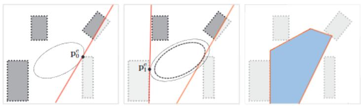

<details>
<summary>text_image</summary>

P₀ᶜ
P₁ᶜ
</details>

图4.2 扩大椭球体找到半空间。左：找到第一个交点 $P _ { 0 } ^ { c }$ 和超平面（红线），相应的半空间H0之外的障碍物点被移除（阴影）。中：找到下一个交点 $P _ { 1 } ^ { c }$ （虚线椭球显示原始椭球体0，实线椭球体显示新椭球体1），继续从地图中移除新半空间之外的障碍物点。右：继续扩张，直到当前地图中没有障碍物，凸空间C（蓝色区域）由半平面的交点定义

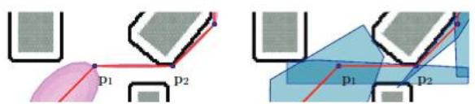

<details>
<summary>text_image</summary>

p1
p2
p1
p2
</details>

图4.3 黑色粗线是障碍物的安全轮廓，蓝色边界是考虑安全距离的SFC的轮廓。几个椭球和相应的多边形相当窄。而且，这种收缩过程可能会导致SFC中的不连续性

# 4.1.2 自由空间建模

在自由空间建模过程中，首先对无序点云进行处理，构造无障碍区域，并用星型$\ntrianglerighteq$ 多边形加以表示。具体而言，利用球面翻转变换（Spherical Inversion Transformation），将点云中的每个点映射到一个非线性变换空间，从而快速提取不受障碍物影响的自由区域。

本文在初步建模阶段，暂不考虑车辆的物理尺寸，而是将其简化为质点模型（PointMass Model）。后续在实际应用时，可通过膨胀包络（Enlarged Envelope）方法，将车辆的物理边界纳入碰撞检测模型，以确保路径规划的安全性。

a.移动原点：首先，将原点移动到查询坐标的位置。假设查询坐标为 $| p _ { q }$ ，而点 $\overline { { \overline { { Z } } } }$ 中的每个点为 $\lceil p _ { i }$ 。  
b.球面翻转变换：接着，如图 4.4，使用一种称为球面翻转的非线性变换，将点云中的每个点 ${ \mathbf { } } \cdot p _ { i }$ 映射到新的位置 $\boldsymbol { \cdot } \boldsymbol { p ^ { \prime } } _ { i }$ 。具体操作是将点 ${ \mathbf { } } \cdot p _ { i }$ 沿着从 ${ \mathbf { } } _ { \mathbf { } } { p } _ { q }$ 到 $| p _ { i }$ 的射线，按照一定规则翻转到球体外部。  
c.翻转后的点云：通过上述变换，将得到了一个新的点云 $\boldsymbol { p ^ { \prime } } _ { i }$ ，其中的每个点 ${ \mathbf { } } \cdot p _ { i }$ 是由原始点 ${ \mathbf { } } \cdot p _ { i }$ 经过球体翻转变换得到的。  
d.点云翻转特性：球体翻转具有递减特性，即距离查询坐标越近的点，被映射后的位置越远。这意味着如果在某个区域没有点的影像点，那么该区域就是无点区域。  
e.生成星形凸包：根据上述特性，利用著名的快速凸包算法（QuickHull）找到翻

转后点云的凸包。然后，将这些顶点重新映射回原始空间，得到一个无障碍的星形凸多边形。

f.无点区域推导：如图 4.5，假设在查询坐标 O 和原始点云之间没有超平面能够将所有点置于同一侧，这意味着 O被点云包围。利用点云的凸包特性，将每个极端边对应的三角形组合在一起，生成最终的无点区域。

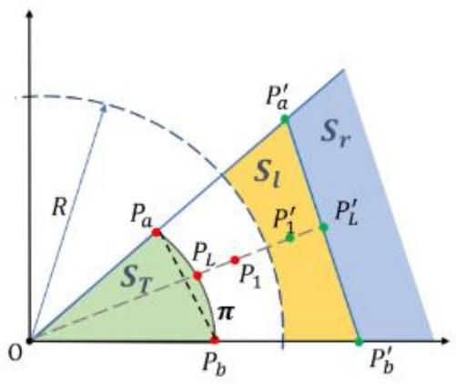

<details>
<summary>text_image</summary>

R
P_a
S_T
O
P_b
\pi
P_L
P_1
P_1'
P'_a
S_l
P'_L
P'_b
P'_r
S_r
</details>

图4.4 虚线圆的半径是球体映射的参数R，红色的障碍物点云在原始空间中，映射后的点是绿色的点。

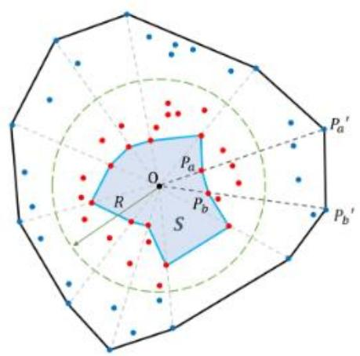

<details>
<summary>text_image</summary>

P_a'
P_b'
P_a
P_b
S
R
O
</details>

图4.5 虚线圆内的红点通过一一对应投影到蓝点，点O是这个圆的原点和中心。通过寻找投影点云的凸包，得到了一个无点星域S

# 4.1.3 凸多边形构造

如图4.6所示，通过在上一步生成的星型凸多边形的基础上进行修改，确保该多边形不仅是星型凸的，而且是严格的凸多边形。这一过程包括计算凸包，并通过选取最远的点来调整边界，以确保最终多边形中不包含任何障碍物。

a.构造凸包：首先再次使用快速凸包算法（QuickHull）从星形凸包的顶点构造出

一个新的凸包。这个凸包可能包含一些障碍物点和多余的顶点。

b.极端边与单形：由于星形凸包的特性，凸包的每个极端边都可以与原点形成一个单形（二维情况下的三角形）。需要选择单形内的所有星形凸包顶点，并将极端边推到离它最远的顶点位置。  
c.去除冗余约束：通过双重描述方法去除冗余约束。在二维情况下，可以通过选择远离边界的顶点来优化凸包的形状。

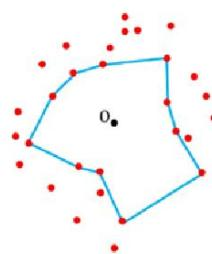

<details>
<summary>text_image</summary>

O₀
</details>

（a）

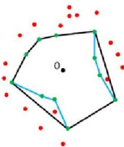

<details>
<summary>natural_image</summary>

Geometric diagram of a pentagon with internal lines and scattered red dots, no text or symbols present
</details>

(b)

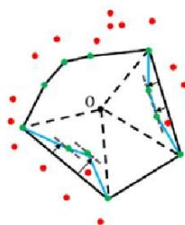

<details>
<summary>chemical</summary>

Molecular geometry diagram showing a polyhedral structure with labeled atoms and bonds
</details>

（c）

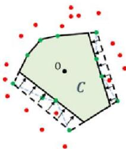

<details>
<summary>text_image</summary>

o
C
</details>

（d）  
图4.6 (a)无点星形凸多边形，(b)构造凸包，(c)搜索包含在这个凸包中的顶点，(d)沿着它的法向量尽可能向前推极边。

# 4.2 基于球体翻转的安全边界构建

球体翻转法广泛应用于无人机避障，通过非线性变换将障碍物点云映射至外部空间，从而高效生成自由凸区域。然而，在自动驾驶场景中，车辆具有非完整运动学约束（如最小转弯半径、车身尺寸），若直接以车辆质心为查询点，生成的自由空间可能未充分考虑车体占用区域，导致潜在碰撞风险。

为确保车辆在复杂环境中安全避障，本文采用基于几何模型的碰撞避免策略。具体而言，使用双圆覆盖模型（Dual-Circle Model）来近似描述车辆边界，如图 4.7 所示。其中，一个圆心位于车辆质心 P，另一个圆心位于前轴中心位置，以确保路径规划过程中考虑车辆的真实占用区域，而不仅仅是质心位置。

在安全走廊构建过程中，本文通过障碍物膨胀检测（Obstacle Inflation Detection）方法，对环境进行扫描。该方法利用两个固定半径??的圆形区域，形成车辆的有效碰撞边界，从而提前检测并规避潜在障碍物。相比传统以质点模型（Point Mass Model）

为基础的避障方法，双圆覆盖模型能更精确地描述车辆的物理尺寸及运动约束，使得路径规划更加安全可靠。

综合而言，该方法能够在复杂、狭窄的道路环境中确保车辆安全通行，并减少因忽略车体尺寸导致的碰撞风险，从而提升自动驾驶系统的稳定性和适用性。

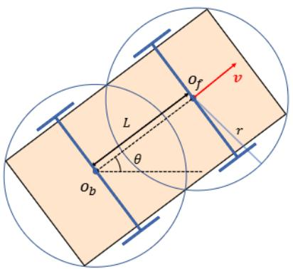

<details>
<summary>text_image</summary>

O_b
L
θ
r
v
O_f
</details>

图4.7 两个半径为r的圆用于覆盖整个车辆轮廓。 $O _ { b }$ 位于车辆p的位置， $O _ { f }$ 位于车辆前进方向的L处。θ是车辆的方位角。

在自动驾驶系统中，障碍物检测与避障策略需依据道路环境动态调整点云处理范围。在开阔区域，系统可处理较远距离的点云，以全面感知周围环境。而在城市狭窄道路（如城中村街巷），由于障碍物密集，扩大感知范围反而增加计算负担，影响实时性。因此，合理调整点云处理区域，聚焦车辆近距离障碍物，是提升安全走廊生成效率和系统敏捷性的关键。

为此，本文在星型凸包算法基础上，引入虚拟障碍物圆机制，以动态约束点云处理范围。在开阔道路中，虚拟障碍物圆半径较大，以确保全局环境感知；而在狭窄道路或高密度行人区域，则缩小其半径，仅关注近距离障碍物，减少数据冗余，提高计算效率。

如图4.8所示，虚拟障碍物圆的动态调整，使得凸包生成范围可依据不同工况灵活优化。这种方法显著提升了算法的实时性与计算效率，同时优化了路径规划与避障决策，使自动驾驶系统在城市狭窄道路下具备更强的适应性与响应能力。

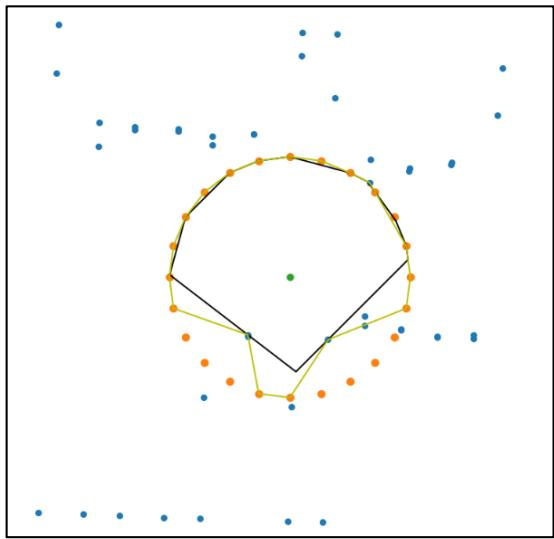

<details>
<summary>scatter</summary>

| x | y | color |
|---|---|-------|
| 0.1 | 0.95 | blue |
| 0.2 | 0.85 | orange |
| 0.3 | 0.75 | green |
| 0.4 | 0.65 | red |
| 0.5 | 0.55 | yellow |
| 0.6 | 0.45 | blue |
| 0.7 | 0.35 | orange |
| 0.8 | 0.25 | green |
| 0.9 | 0.15 | red |
| 1.0 | 0.05 | yellow |
| 1.1 | 0.95 | blue |
| 1.2 | 0.85 | orange |
| 1.3 | 0.75 | green |
| 1.4 | 0.65 | red |
| 1.5 | 0.55 | yellow |
| 1.6 | 0.45 | blue |
| 1.7 | 0.35 | orange |
| 1.8 | 0.25 | green |
| 1.9 | 0.15 | red |
| 2.0 | 0.05 | yellow |
| 2.1 | 0.95 | blue |
| 2.2 | 0.85 | orange |
| 2.3 | 0.75 | green |
| 2.4 | 0.65 | red |
| 2.5 | 0.55 | yellow |
| 2.6 | 0.45 | blue |
| 2.7 | 0.35 | orange |
| 2.8 | 0.25 | green |
| 2.9 | 0.15 | red |
| 3.0 | 0.05 | yellow |
| 3.1 | 0.95 | blue |
| 3.2 | 0.85 | orange |
| 3.3 | 0.75 | green |
| 3.4 | 0.65 | red |
| 3.5 | 0.55 | yellow |
| 3.6 | 0.45 | blue |
| 3.7 | 0.35 | orange |
| 3.8 | 0.25 | green |
| 3.9 | 0.15 | red |
| 4.0 | 0.05 | yellow |
| 4.1 | 0.95 | blue |
| 4.2 | 0.85 | orange |
| 4.3 | 0.75 | green |
| 4.4 | 0.65 | red |
| 4.5 | 0.55 | yellow |
| 4.6 | 0.45 | blue |
| 4.7 | 0.35 | orange |
| 4.8 | 0.25 | green |
| 4.9 | 0.15 | red |
| 5.0 | 0.05 | yellow |
| 5.1 | 0.95 | blue |
| 5.2 | 0.85 | orange |
| 5.3 | 0.75 | green |
| 5.4 | 0.65 | red |
| 5.5 | 0.55 | yellow |
| 5.6 | 0.45 | blue |
| 5.7 | 0.35 | orange |
| 5.8 | 0.25 | green |
| 5.9 | 0.15 | red |
| 6.0 | 0.05 | yellow |
| 6.1 | 0.95 | blue |
| 6.2 | 0.85 | orange |
| 6.3 | 0.75 | green |
| 6.4 | 0.65 | red |
| 6.5 | 0.55 | yellow |
| 6.6 | 0.45 | blue |
| 6.7 | 0.35 | orange |
| 6.8 | 0.25 | green |
| 6.9 | 0.15 | red |
| 7.0 | 0.05 | yellow |
| 7.1 | 0.95 | blue |
| 7.2 | 0.85 | orange |
| 7.3 | 0.75 | green |
| 7.4 | 0.65 | red |
| 7.5 | 0.55 | yellow |
| 7.6 | 0.45 | blue |
| 7.7 | 0.35 | orange |
| 7.8 | 0.25 | green |
| 7.9 | 0.15 | red |
| 8.0 | 0.05 | yellow |
| 8.1 | 0.95 | blue |
| 8.2 | 0.85 | orange |
| 8.3 | 0.75 | green |
| 8.4 | 0.65 | red |
| 8.5 | 0.55 | yellow |
| 8.6 | 0.45 | blue |
| 8.7 | 0.35 | orange |
| 8.8 | 0.25 | green |
| 8.9 | 0.15 | red |
| 9.0 | 0.05 | yellow |
| 9.1 | 0.95 | blue |
| 9.2 | 0.85 | orange |
| 9.3 | 0.75 | green |
| 9.4 | 0.65 | red |
| 9.5 | 0.55 | yellow |
| 9.6 | 0.45 | blue |
| 9.7 | 0.35 | orange |
| 9.8 | 0.25 | green |
| 9.9 | 0.15 | red |
|10<fcel>-<fcel>blue, orange, green, red, gray, etc., white, black, and gray, etc., black, gray, etc., gray, etc., gray, etc., gray, etc., gray, etc., gray, etc., gray, etc., gray, etc., gray, etc., gray, etc., gray, etc., gray, etc., gray, etc., gray, etc., gray, etc., gray, etc., gray, etc., gray, etc., gray, etc., gray, etc., gray, etc., gray, etc., gray, etc., gray, etc., gray, etc., gray, etc, gray, etc., gray, etc., gray, etc., gray, etc., gray, etc., gray, etc., gray, etc., gray, etc., gray, etc., gray, etc., gray, etc., gray, etc., gray, etc., gray, etc., gray, etc., gray, etc., gray, etc., gray, etc., gray, etc., gray, etc., gray, etc., gray, etc., gray, etc., gray, etc., gray,etc., grey,etc., grey,etc., grey,etc., grey,etc., grey,etc., grey,etc., grey,etc., grey,etc., grey,etc., grey,etc., grey,etc., grey,etc., grey,etc., grey,etc., grey,etc., grey,etc., grey,etc., grey,etc., grey,etc., grey,etc., grey,etc., grey,etc., grey,etc., grey,etc., grey,etc., gray,etc., grey,etc., grey,etc., grey,etc., grey,etc., grey,etc., grey,etc., grey,etc., grey,etc., grey,etc., grey,etc., grey,etc., grey,etc., grey,etc., grey,etc., grey,etc., grey,etc., grey,etc., grey,etc., grey,etc., grey,etc., grey,etc., grey,etc., grey,etc., grey,orc<ecel><nl>
</details>

图4.8 蓝色为障碍物点云，橙色为虚拟障碍物点，虚拟障碍物点组成虚拟障碍物点圆，上方虚拟障碍物点圆外蓝色障碍物点云将不被处理，侵入虚拟障碍物点圆被处理从而收黄线非凸区域至黑色凸域

如图 4.9 所示，为了优化避障计算效率，采用基于前后轴质点的车辆简化模型，通过以半径r的圆形区域覆盖车辆，来收缩生成的最大凸包。具体而言，车辆的前轴和后轴被视为主要的两个质心点，以此定义车辆的运动范围及碰撞边界。这种方法将长方体车辆抽象为两个关键点，减少了对完整几何模型的依赖，从而降低了避障计算的复杂度。

结合高效的安全走廊生成算法，该方法在实时性和计算效率方面表现优越。相比于传统避障方法需要对整个车体进行几何碰撞检测，该方法仅需关注前后轴的质点轨迹，极大地减少了计算负担，使得路径规划可以在更短时间内完成。此外，安全走廊算法通过动态调整自由空间，确保车辆始终拥有最优行驶路径，进一步提升避障效果，降低潜在碰撞风险。

这种方法特别适用于城市狭窄道路环境，在该类场景中，高密度障碍物和行人流动性使得传统方法难以保证实时性和安全性。通过将车辆视为两个质点进行避障，系统不仅减少了计算资源的消耗，还增强了对复杂环境的适应能力，使自动驾驶车辆能够更加灵活、安全地穿行于狭窄道路中。

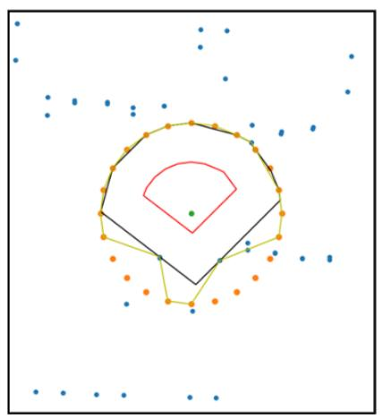

<details>
<summary>radar</summary>

| Category | Value |
| -------- | ----- |
| Top Left | 100   |
| Top Right | 150   |
| Bottom Left | 80    |
| Bottom Right | 60    |
</details>

(a)

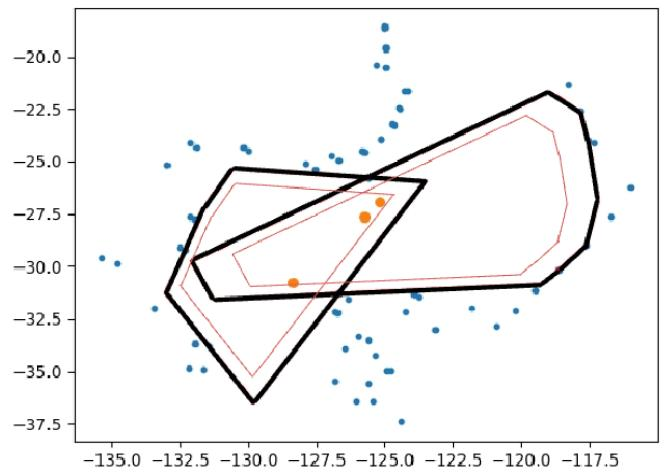

<details>
<summary>scatter</summary>

| x        | y      |
| -------- | ------ |
| -135.0   | -30.0  |
| -132.5   | -27.5  |
| -130.0   | -25.0  |
| -127.5   | -22.5  |
| -125.0   | -20.0  |
| -122.5   | -27.5  |
| -120.0   | -25.0  |
| -117.5   | -22.5  |
</details>

(b)   
图4.9 蓝色为障碍物点云，橙色为虚拟障碍物点，将生成的最大凸域（黑色凸多边形）收缩半径r，生成红线包络的凸域

在本研究中，将改进的单个凸包算法应用于整个路径的处理，通过对已知全局路径进行采样，每隔1 米生成一个采样点集，在每个采样点上生成相应的安全凸域。该方法能够有效地应对不同工况下的路径规划和避障任务。通过对多个典型场景进行验证，展示了该算法在狭窄路况、全局路径靠近一侧以及直角转弯处的走廊生成效果。

如图 4.10 所示，在两侧障碍物距离较近的狭窄道路环境中，改进后的安全走廊生成算法能够精准调整红色凸域，使其紧贴道路中心线，最大限度地避开障碍物。这表明，该算法在受限空间内的凸包构造能力较强，能够在高密度障碍环境下有效构建安全通行区域。同时，该方法保证了路径的可行性，为后续的路径优化与动态避障提供了精确的环境感知与空间约束，增强了自动驾驶系统在狭窄道路场景中的适应性。

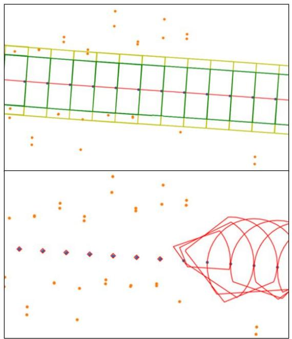

<details>
<summary>natural_image</summary>

Two-panel diagram showing a grid with colored lines and scattered orange dots, and a red wireframe sphere with curved lines (no text or symbols)
</details>

图4.10 狭窄道路工况下走廊生成效果。橙色为障碍物点云，蓝色为初始的全局路径采样点，绿框表示采样后的车辆位置，黄色是车辆考虑安全距离膨胀后的位置，红线包络的凸域构成安全走廊

如图4.11所示，在全局路径靠近道路一侧，而另一侧存在较大空隙的情况下，改进后的凸包生成算法能够自适应调整安全走廊，使其尽可能居中分布。这一特性确保了凸包既能充分避开障碍物，又能最大化利用道路可通行空间，避免走廊范围向一侧偏移过多。通过这一优化，生成的安全走廊更加稳定，有助于后续路径规划和车辆避障的鲁棒性提升。

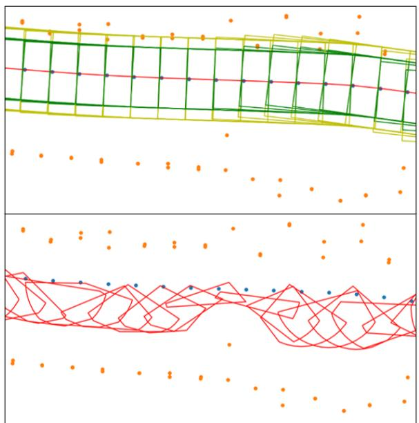

<details>
<summary>natural_image</summary>

Two-panel diagram showing a grid structure with colored lines and scattered orange dots, no text or symbols present.
</details>

图4.11 贴墙行驶工况走廊生成效果。

如图 4.12 所示，在全局路径靠近直角转弯区域时，传统凸包方法可能导致安全走廊过度紧贴转角，增加车辆行驶的安全隐患。尽管转弯外侧存在较大的可用空间，但未能充分利用。为解决此问题，本文引入基于路径曲率的动态调整机制，使得在曲率较大的区域，算法能够自适应扩大虚拟障碍物圆的半径，从而在凸包生成过程中合理拓展安全空间。这种方法确保了走廊区域在转弯处能够远离转角，同时保持路径的连贯性和安全性。优化后的安全走廊不仅有助于提高转弯过程的稳定性，也为后续路径规划提供了更合理的安全约束，从而减少转向时的剧烈调整，提高行驶的平顺性与安全性。

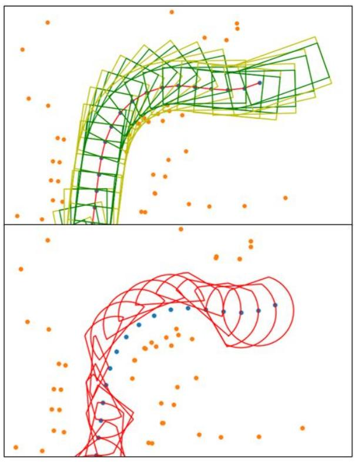

<details>
<summary>natural_image</summary>

Two abstract diagrams showing trajectories with colored lines and scattered orange dots, no text or symbols present.
</details>

图4.12 直角转弯工况走廊生成效果。

总体而言，本文提出的改进型单个凸包算法结合高效的安全走廊生成方法，能够适应不同道路环境，实现灵活的路径调整与精确的走廊构建。在狭窄道路、贴近障碍物行驶以及复杂转弯区域等多种工况下，该方法均能有效优化自由空间的分布，确保安全走廊的合理性和稳定性。通过动态调整虚拟障碍物圆与基于曲率的路径优化机制，该算法提升了对不同场景的适应能力，为自动驾驶系统在复杂环境中的应用提供了更加稳健、高效的技术支持。

# 4.3 本章小节

本章针对自动驾驶系统在复杂环境下的精准避障需求，提出了一种高效的安全走廊生成算法。该方法通过非线性球体翻转变换处理点云，快速生成严格凸多边形区域，具备高实时性、低计算开销和良好的环境适应性，适用于动态障碍物密集场景。

为贴合车辆运动学特性，本文优化了球体翻转法，采用双圆覆盖法建模车辆边界，确保生成的安全走廊准确反映通行能力。同时，引入虚拟障碍物圆机制，根据道路结构和障碍物分布动态调整点云处理范围，增强算法在狭窄道路、贴墙行驶、急弯等场景的适应性与鲁棒性。

实验结果表明，该算法在多种工况下均表现出优异的计算效率与精度，尤其在狭窄通道、靠近障碍物行驶和急转弯路径生成等场景中，生成高效合理的安全走廊，为自动驾驶系统的路径规划与避障提供了技术支撑。

本章提出的安全走廊生成算法为后续路径规划奠定了空间约束基础。下一章将重点探讨如何在该约束下优化路径搜索与动态调整机制，以进一步提升自动驾驶系统的可行驶性、平稳性和安全性。

# 5 路径规划与跟踪控制

在自动驾驶系统中，路径规划与跟踪控制是确保车辆安全、稳定行驶的关键环节。路径规划主要分为全局路径规划和局部路径规划两个层次：全局路径规划（GlobalPath Planning）负责根据地图信息规划从起点到目标点的最优路径，确保整体路线的合理性；局部路径规划（Local Path Planning）则基于传感器实时感知的环境数据，对临时出现的障碍物或动态交通因素进行避障调整，以保证路径的可行性和安全性。此外，轨迹跟踪控制（Trajectory Tracking Control）用于确保车辆能够严格沿着规划路径行驶，避免因环境变化或控制偏差而发生路径偏离。

本章将围绕狭窄道路环境下的路径规划与跟踪控制展开研究。首先，分析适用于复杂道路环境的全局路径规划方法，并优化传统算法以提升路径平滑性和可行性；其次，研究局部路径规划，结合动态避障策略提升实时适应能力；最后，探讨路径跟踪控制方法，确保车辆能够精确执行规划轨迹，提高系统的稳定性和安全性。

# 5.1 全局规划— 搜索全局路径

全局路径规划是自动驾驶系统的关键任务之一，旨在为车辆从起点到目标位置规划一条可行路径，确保其在复杂环境中安全、高效地行驶。在狭窄道路或障碍物密集的场景下，路径规划不仅要考虑最优路线的搜索，还需满足车辆的运动学约束，确保路径可执行。

本节采用 Hybrid A\*算法进行全局路径搜索。Hybrid A\*结合了\*A 算法的启发式搜索能力与车辆运动学模型，在路径搜索过程中直接考虑车辆的可行性约束，避免了传统A\*网格化搜索导致的路径不连续问题，使规划结果更适用于自动驾驶应用。

本节将详细介绍 Hybrid A\*算法的搜索过程，包括状态扩展方式、启发式搜索策略及路径生成方式，并探讨其在狭窄道路环境中的适用性和性能表现。

# 5.1.1 传统 Dijkstra 算法和 A\*算法

Dijkstra 路径规划算法基于代价地图的拓扑遍历机制，采用广度优先策略实现最优路径求解。该算法初始化阶段以起点为根节点构建优先级队列，通过迭代式选取当前最小累积代价的邻近节点进行状态扩展（如图 5.1(a)所示，粉色标识起始位姿，蓝色对应目标位姿）。其探索域（青色覆盖区域）呈现同心辐射特征，其中前沿边界（最浅色区域）表征当前最优路径的潜在扩展方向。

评估函数：

$$
\mathrm{f(n)=g(n)} \tag {5.1}
$$

g(n)是从起点到节点 n 的实际路径代价（到达该节点的总距离）。

基本步骤：

a.初始化：起点的 $\mathbf { g } ( \mathrm { s t a r t } ) = 0$ ，其他所有节点的 $\mathbf { g } ( \mathbf { n } ) = \infty$ 。  
b.在每一步中，选择当前 g(n)最小的节点进行扩展。  
c.对所有邻居节点 m 计算 g(m)，如果通过当前节点的路径更短，则更新该节点的值。

贪婪的最佳搜索算法(Greedy Best-First-Search)以类似的方式起作用，除了它具有距离任何顶点的目标有多远的估计（称为启发式）。它没有选择最接近起点的顶点，而是选择最接近目标的顶点。不能保证贪婪的最佳搜索能找到最短的路径。但是，它的运行速度比Dijkstra的算法快得多，因为它使用启发式功能很快就可以指导其目标。在下图5.1(b)中，黄色代表那些具有较高启发式价值的节点（达到目标的高成本），而黑色表示启发式值低的节点（达到目标的低成本）。它表明，与 Dijkstra的算法相比，贪婪的最佳搜索可以很快找到路径。

贪婪最佳优先搜索算法（Greedy Best-First Search,GBFS）继承相似的状态扩展范式，但其核心创新在于引入目标导向的启发式函数 h(n)进行节点优选。该算法摒弃传统Dijkstra算法的全局代价累积策略，转而采用曼哈顿距离或欧氏距离等启发式度量，在下图5.1(b)中，黄色代表那些具有较高启发式价值的节点，而黑色表示启发式值低的节点。与Dijkstra的算法相比，贪婪的最佳搜索可以更快找到从起始点到终点的路径。

评估函数：

$$
\mathrm{f(n)} = \mathrm{h(n)} \tag {5.2}
$$

h(n)是从节点n 到目标节点的估计代价（通常是启发式函数）。

基本步骤：

a.初始化：起点的 $\mathrm { f ( s t a r t ) = h ( s t a r t ) }$ ，其他所有节点的 $\operatorname { f } ( \mathrm { n } ) = \infty$   
b.通过计算 $\operatorname { f } ( \mathrm { n } ) = \mathrm { h } ( \mathrm { n } )$ 来选择最有可能的节点进行扩展，优先选择 f(n)最小的节点。

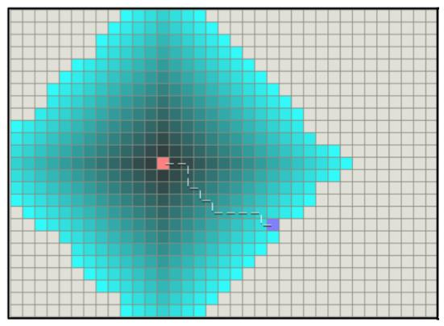

<details>
<summary>natural_image</summary>

Pixelated abstract shape with gradient fill and a small red arrow on a grid background (no text or symbols)
</details>

(a) Dijkstra的算法

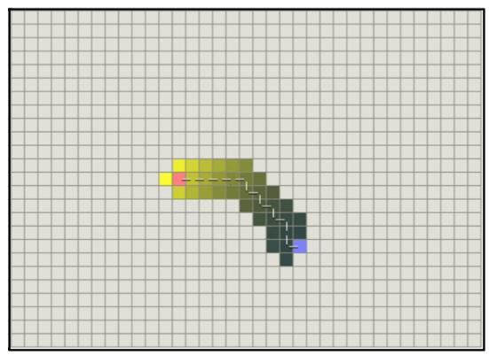

<details>
<summary>natural_image</summary>

Pixelated abstract shape on a grid background, no text or symbols present
</details>

(b) 最佳搜索算法  
图5.1Dijkstra和最佳搜索算法在无障碍物地图下搜索

但是，这两个示例都说明了最简单的情况——当地图没有障碍时，最短的路径确实是一条直线。考虑凹面障碍物时，在下图 5.2(a)中，Dijkstra 的算法搜索范围更大，耗时更长，但可以保证找到最短的道路，另一方面，在下图5.2(b)中，贪婪的最佳搜索的作用较少，但其路径显然不那么好。

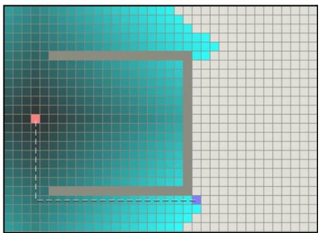

<details>
<summary>natural_image</summary>

Pixelated abstract grid with teal and gray tones, no text or symbols present
</details>

(a) Dijkstra的算法

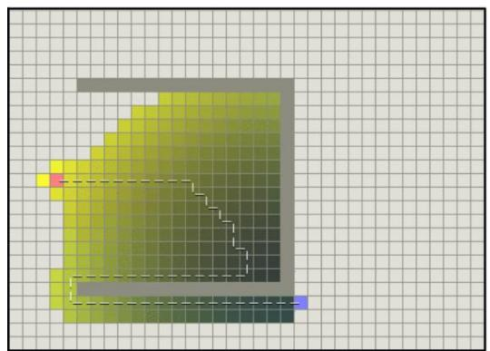

<details>
<summary>natural_image</summary>

Pixelated abstract shape on grid background, no text or symbols visible
</details>

(b) 最佳搜索算法  
图5.2 Dijkstra和最佳搜索算法在有障碍物地图下搜索

问题在于，贪婪的最佳搜索在算法上遵循“贪婪”原则，即使搜索的路径并不是最短最优路径，也会遵循启发项向着终点前进。它的启发项仅考虑到达到终点的成本并忽略了起始点到当下的成本。

为了将两者的最好的结合在一起，A\*算法于1968年开发，以结合诸如贪婪最佳搜索和诸如Dijsktra算法之类的正式方法之类的启发式方法。A\*就像 Dijkstra的算法一样，可以用来找到最短的路径。A\*就像贪婪的最佳搜索一样，它可以使用启发式来指导自己。在简单的情况下，它就像贪婪的最佳优先搜索一样快，在凹面障碍物的示例中，A\*找到了与 Dijkstra的算法一样好的路径。

它通过综合考虑当前路径的代价和目标路径的启发式估计，选择最有可能的路径进行扩展。

评估函数：

$$
\mathrm{f(n)=g(n)+h(n)} \tag {5.3}
$$

g(n)是从起点到当前节点 n 的实际代价（已知的路径代价）。h(n)是从当前节点 n到目标节点的估计代价（启发式函数）

基本步骤：

a.初始化：起点的 $\mathrm { f ( s t a r t ) = g ( s t a r t ) + h ( s t a r t ) }$ ，其他所有节点的 $\operatorname { f } ( \mathrm { n } ) = \infty$ 。  
b.通过计算 $\operatorname { f } ( \mathrm { n } ) = \operatorname { g } ( \mathrm { n } ) + \mathrm { h } ( \mathrm { n } )$ 来选择最优节点，优先选择 f(n)最小的节点进行扩展。  
c.对所有邻居节点 m 计算f(n)，如果通过当前节点的路径更短，则更新该节点的值。

A\*算法通过综合考虑启发项 g(n)和 h(n)来平衡搜索的全面性与效率。节点的总代价为实际代价和估计代价之和，在搜索时总是选取总代价最小的节点。 $h ( n )$ 是 $\mathsf { A } ^ { * }$ 算法使 $\mathsf { A } ^ { * }$ 算法能更快找到最优路径，当 $h ( n )$ 为 0 时， $\mathbf { A } ^ { * }$ 算法退化为 Dijkstra 算法，可实现最短路径搜索；当 $h ( n )$ 总小于当前节点与目标点实际代价时，规划出的路径为最短路径， $h ( n )$ 越小，算法扩展节点越多，规划速度越慢；当 $h ( n )$ 总大于当前节点与目标节点的实际代价时，规划结果非最优解，但算法运行速度快，实时性高；当 $h ( n )$ 的估计代价值远远大于 $g ( n )$ 时， $\mathbf { A } ^ { * }$ 算法退化为最佳搜索算法。

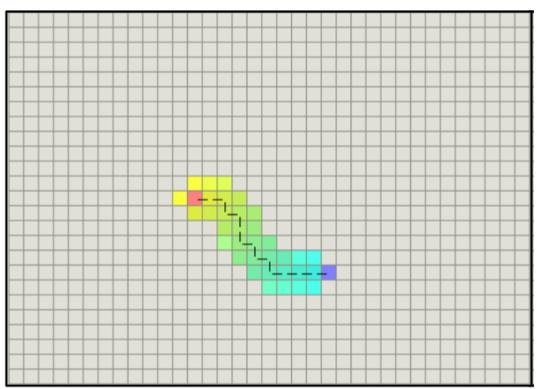

<details>
<summary>natural_image</summary>

Pixelated abstract shape on a grid background, no text or symbols present
</details>

(a) A\*算法在无障碍物地图下搜索

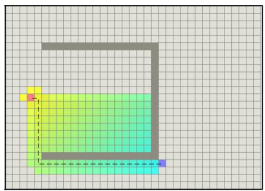

<details>
<summary>natural_image</summary>

Abstract geometric shape with gradient fill on grid background (no text or symbols)
</details>

(b) A\*算法在有障碍物地图下搜索   
图5.3 A\*算法搜索

总结 A\*算法伪代码如下：  
```txt
Algorithm 1: A* Pathfinding

Input: Start node {start}, Goal node {goal}, Graph {G}

Output: Optimal path or "Failure"

1: open_set ← {start} (优先队列，按 f_score 排序)
2: close_set ← {}
3: came_from ← {}
4: g_score[start] ← 0
5: f_score[start] ← g_score[start] + heuristic(start, goal)
6: while open_set is not empty:
7:    current ← node with lowest f_score in open_set
8:    if current = goal then return ReconstructPath(came_from, current)
9:    open_set.remove(current), close_set.add(current)
10:    for neighbor in neighbor_nodes(current):
11:    if neighbor in close_set then continue
12:    tentative_g_score ← g_score[current] + dist_between(current, neighbor)
13:    if neighbor not in open_set or tentative_g_score < g_score[neighbor]:
14:    came_from[neighbor] ← current
15:    g_score[neighbor] ← tentative_g_score
16:    f_score[neighbor] ← g_score[neighbor] + heuristic(neighbor, goal)
17:    open_set.add(neighbor)
18:return "Failure"

Function ReconstructPath(came_from, current)
19:path ← [current]
20:while current in came_from:
21:    current ← came_from[current], path.append(current)
22:return reverse(path) 
```

结合A\*算法的伪代码，可以总结关键步骤如下和流程图如图 5.4 所示：

a.初始化：将起点添加到开放列表 OPEN，并初始化其代价。OPEN 存储待评估的节点，CLOSED存储已评估的节点。  
b.选择节点：从 OPEN列表中选择代价f(n)最小的节点（即最优节点）进行扩展。  
c.路径判断：如果当前节点是目标节点，则路径找到，返回结果；如果不是，则继续搜索。

d.扩展节点：为当前节点生成所有相邻节点，计算其代价，并将符合条件的节点加入OPEN列表。  
e.循环：重复上述步骤，直到找到目标节点或OPEN列表为空（即没有路径可行）。

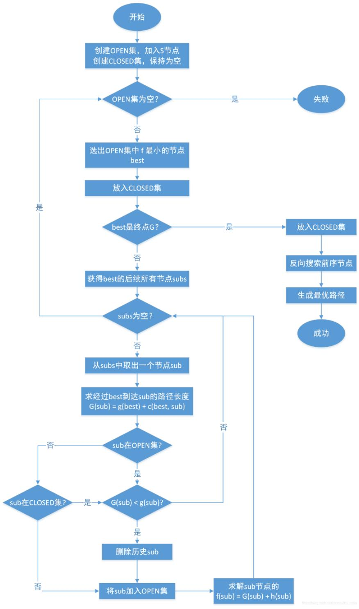

<details>
<summary>flowchart</summary>

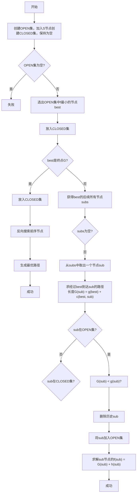
```mermaid
graph TD
    A["开始"] --> B["创建OPEN集，加入S节点创建CLOSED集，保持为空"]
    B --> C{OPEN集为空?}
    C -->|是| D["失败"]
    C -->|否| E["选出OPEN集中f最小的节点best"]
    E --> F["放入CLOSED集"]
    F --> G{best是终点G?}
    G -->|是| H["放入CLOSED集"]
    H --> I["反向搜索前序节点"]
    I --> J["生成最优路径"]
    J --> K["成功"]
    G -->|否| L["获得best的后续所有节点subs"]
    L --> M{subs为空?}
    M -->|否| N["从subs中取出一个节点sub"]
    N --> O["求经过best到达sub的路径长度G(sub) = g(best) + c(best, sub)"]
    O --> P{sub在OPEN集?}
    P -->|否| Q{sub在CLOSED集?}
    P -->|是| R["G(sub) < g(sub)?"]
    R --> S["删除历史sub"]
    S --> T["将sub加入OPEN集"]
    T --> U["求解sub节点的f(sub) = G(sub) + h(sub)"]
    U --> V["成功"]
```
</details>

图5.4 传统A\*算法流程图

# 5.1.2 Hybrid A\*算法

Hybrid $\mathbf { A } ^ { * }$ 算法是一种结合传统 A 搜索算法与车辆运动学模型的路径规划方法，在自动驾驶和机器人导航领域具有广泛应用。与经典 $\mathsf { A } ^ { * }$ 算法不同，Hybrid A\*不仅关注路径的几何结构，还综合考虑车辆的动力学约束，确保生成的路径可行且平滑。

如表 5.1 所示，传统 $\mathsf { A } ^ { * }$ 算法采用离散化搜索方式，忽略了车辆的运动约束，而Hybrid A\*放弃了对搜索空间的简单离散化，引入 Dubins 曲线或 Reeds-Shepp 曲线来生成路径片段，从而确保车辆能够沿着物理可行的轨迹行驶。该方法能够有效解决 $\mathbf { A } ^ { * }$ 算法中路径不连续、过度离散化导致的不可行性问题，使得规划出的轨迹符合自动驾驶车辆的非完整性约束。

表5.1 Hybrid A\*和传统A\*算法对比

<table><tr><td>算法</td><td>Hybrid A*</td><td>A*</td></tr><tr><td>维数</td><td>(x, y, θ, R)</td><td>(x, y)</td></tr><tr><td>H(n)</td><td>Max(Rends_Shepp,A*)</td><td>Maxhattan/Euclidean</td></tr><tr><td>节点</td><td>车辆运动学模型为节点</td><td>二位平面坐标点</td></tr><tr><td>节点与节点连接处</td><td>交点可以不是栅格顶点</td><td>交点是栅格顶点</td></tr><tr><td>缺点</td><td>不具备完备性</td><td>不满足车辆运动学特性</td></tr></table>

Hybrid A\*算法结构与 $\mathsf { A } ^ { * }$ 算法流程极其类似，核心区别在于生成子节点和启发式函数设计。

# （1）节点扩展

如图5.5所示，Hybrid A\*算法在路径搜索过程中，基于不同的转向角度（离散的车辆转角）生成短距离子节点，并在车辆运动范围（受最大转弯半径约束）内进行状态扩展。算法首先检测局部轨迹是否发生碰撞，若无碰撞，则进一步通过代价函数评估该节点的可行性，并决定是否将其纳入最终路径。

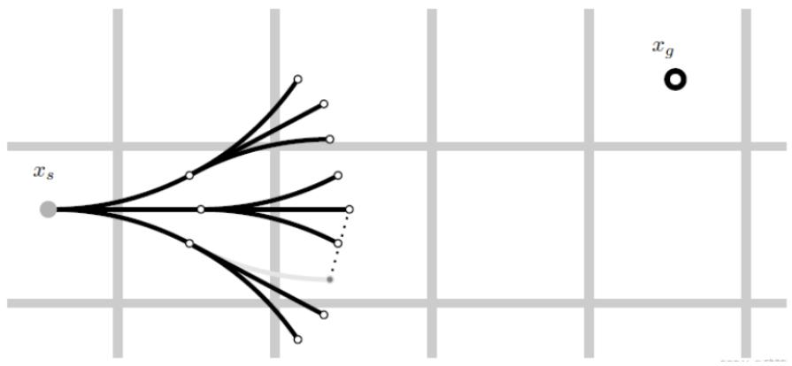

<details>
<summary>flowchart</summary>


```mermaid
graph TD
    A["x_s"] --> B["Node 1"]
    A --> C["Node 2"]
    A --> D["Node 3"]
    A --> E["Node 4"]
    A --> F["Node 5"]
    A --> G["Node 6"]
    A --> H["Node 7"]
    A --> I["Node 8"]
    A --> J["Node 9"]
    A --> K["Node 10"]
    A --> L["Node 11"]
    A --> M["Node 12"]
    A --> N["Node 13"]
    A --> O["Node 14"]
    A --> P["Node 15"]
    A --> Q["Node 16"]
    A --> R["Node 17"]
    A --> S["Node 18"]
    A --> T["Node 19"]
    A --> U["Node 20"]
    A --> V["Node 21"]
    A --> W["Node 22"]
    A --> X["Node 23"]
    A --> Y["Node 24"]
    A --> Z["Node 25"]
    A --> AA["Node 26"]
    A --> AB["Node 27"]
    A --> AC["Node 28"]
    A --> AD["Node 29"]
    A --> AE["Node 30"]
    A --> AF["Node 31"]
    A --> AG["Node 32"]
    A --> AH["Node 33"]
    A --> AI["Node 34"]
    A --> AJ["Node 35"]
    A --> AK["Node 36"]
    A --> AL["Node 37"]
    A --> AM["Node 38"]
    A --> AN["Node 39"]
    A --> AO["Node 40"]
    A --> AP["Node 41"]
    A --> AQ["Node 42"]
    A --> AR["Node 43"]
    A --> AS["Node 44"]
    A --> AT["Node 45"]
    A --> AU["Node 46"]
    A --> AV["Node 47"]
    A --> AW["Node 48"]
    A --> AX["Node 49"]
    A --> AY["Node 50"]
```
</details>

图5.5 离散的车辆转角

# （2）启发式函数设计

本文在 Hybrid A\*算法中采用受约束启发式函数（Constrained Heuristic）进行节点扩展。该函数利用车辆当前的方向角与最小转弯半径，以确保车辆在接近目标节点时保持正确的姿态。如图 5.6 所示，启发式函数值由 Dubins 曲线计算两点之间的最短可行路径，从而在搜索过程中提供更符合车辆运动约束的启发信息。

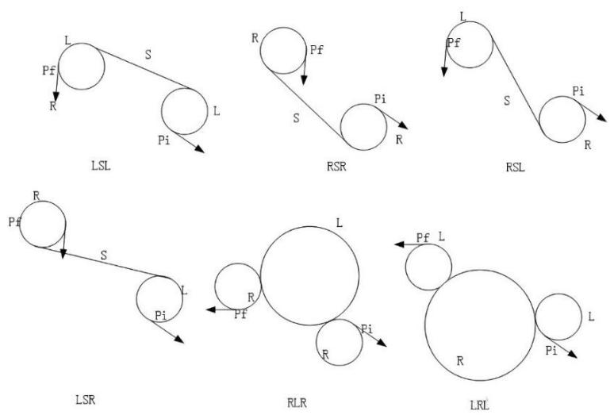

<details>
<summary>flowchart</summary>

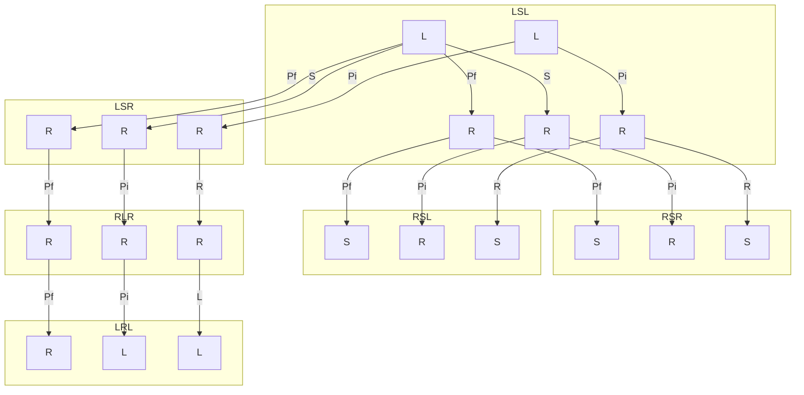
```mermaid
graph TD
    subgraph LSL
        L1["L"] -->|Pf| R1["R"]
        L1 -->|S| R2["L"]
        L2["L"] -->|Pi| R3["Pi"]
    end
    subgraph RSR
        R1["R"] -->|Pf| S1["S"]
        R2["R"] -->|Pi| S2["R"]
        R3["R"] -->|R| S3["S"]
    end
    subgraph RSL
        R1["R"] -->|Pf| S4["S"]
        R2["R"] -->|Pi| S5["R"]
        R3["R"] -->|R| S6["S"]
    end
    subgraph LSR
        L1["L"] -->|Pf| R7["Pf"]
        L1 -->|S| R8["L"]
        L2["L"] -->|Pi| R9["Pi"]
    end
    subgraph RLR
        R7["R"] -->|Pf| R10["R"]
        R8["R"] -->|Pi| R11["R"]
        R9["R"] -->|R| R12["R"]
    end
    subgraph LRL
        R10["R"] -->|Pf| R13["R"]
        R11["R"] -->|Pi| R14["L"]
        R12["R"] -->|L| R15["L"]
    end
```
</details>

图5.6 Dubins曲线

Hybrid A\*算法通过结合 A\*算法的路径搜索能力与车辆运动学约束，为自动驾驶与机器人导航提供了一种高效且可行的路径规划方案。本研究采用 Hybrid A\*算法进行全局路径规划，确保在复杂道路环境下生成的路径不仅符合理论最优性，同时能够在车辆实际执行时保持可行性和稳定性。

# 5.1.3 Hybrid A\*算法应用

本节介绍 Hybrid A\*算法在全局路径规划中的应用流程，包括静态障碍物数据采

集、栅格地图构建以及 Hybrid A\*搜索路径生成。

# （1）静态障碍物数据采集：

上游感知模块利用激光雷达扫描周围环境，获取静态障碍物的位置信息。由于本文重点关注路径规划，而非障碍物分类，因此所有静态障碍物均以点云形式存储，仅提取其空间坐标以供路径搜索使用。

# （2）栅格地图构建：

基于传感器采集的障碍物点云数据，将整个环境划分为固定大小的栅格单元，并根据障碍物分布，将每个栅格标记为“可通行”或“不可通行”。

为了在精度与计算复杂度之间取得平衡，本文将栅格分辨率设定为 0.2m×0.2m，确保既能精准表示环境，又不会导致搜索算法计算量过大。

# （3）应用 Hybrid A\*算法进行全局路径规划：

如图 5.7 所示，在已构建的栅格地图基础上，应用 Hybrid A\*算法进行全局路径搜索。该算法能够在动态约束下搜索可行路径，并生成一条基本无碰撞的全局轨迹，确保路径的可行性与可执行性。

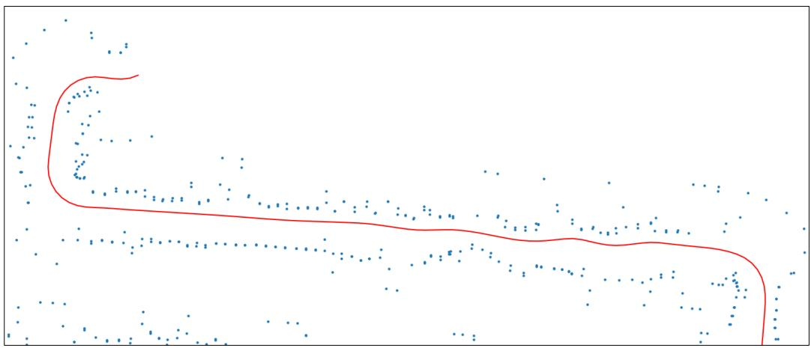

<details>
<summary>scatter</summary>

| x | y |
| --- | --- |
| 0.0 | 0.0 |
| 0.1 | 0.1 |
| 0.2 | 0.2 |
| 0.3 | 0.3 |
| 0.4 | 0.4 |
| 0.5 | 0.5 |
| 0.6 | 0.6 |
| 0.7 | 0.7 |
| 0.8 | 0.8 |
| 0.9 | 0.9 |
| 1.0 | 1.0 |
</details>

图5.7 Hybrid A\*算法搜索的全局路径

# 5.2 全局规划— 优化全局路径

尽管 Hybrid A\*算法能够生成符合车辆运动学约束的全局路径，但其初步搜索得到的轨迹仍然存在一定的局限性。例如，路径上可能出现折点突变、大曲率急转弯，以及过度内切贴近障碍物等问题。这些缺陷在城市狭窄道路环境中尤为明显，可能导致车辆在实际执行过程中行驶不稳定，甚至难以顺利通过某些复杂路段。此外，由于全局路径的不平滑性，局部路径规划器在后续优化和避障时需要额外处理复杂曲率变化，从而增加计算负担，降低规划效率。

为了有效解决这些问题，本文提出了一种全局路径优化方法，以改进搜索得到的轨迹。优化过程通过平滑化全局路径的折点和大曲率区域，消除轨迹中的急剧转弯和过度内切现象。具体来说，优化算法采用了路径拟合、避障与平滑处理技术，在全局路径中引入平滑和避障约束，减少路径曲率的突变和贴近障碍物的危险驾驶行为，使轨迹变得更加平滑且符合车辆动力学特性。通过这些优化操作，提高轨迹的可行性与可执行性，从而为后续局部规划与路径跟踪奠定更稳健的基础。

# 5.2.1 B 样条基函数及其性质

如图5.8所示，B 样条曲线由一组控制点和相应的节点向量共同定义，其形状受控制点的分布影响，从而构成整体曲线。B 样条多项式是由B 样条基的线性组合表示的多项式函数。m 阶 B 样条多项式写成：

$$
f (t) = p _ {0} b _ {\mathrm{m}} ^ {0} (t) + p _ {1} b _ {\mathrm{m}} ^ {1} (t) + \dots + p _ {\mathrm{m}} b _ {\mathrm{m}} ^ {\mathrm{m}} (t) = \sum_ {i = 0} ^ {\mathrm{m}} p _ {i} b _ {\mathrm{m}} ^ {i} (t) \tag {5.4}
$$

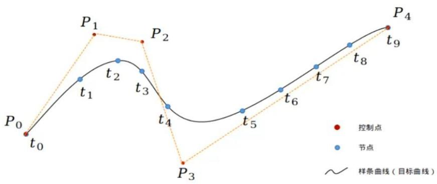

<details>
<summary>text_image</summary>

P0
t0
P1
t1
t2
t3
t4
t5
t6
t7
t8
t9
P2
P3
P4
控制点
节点
样条曲线（目标曲线）
</details>

图5.8 B样条曲线的构成

其中B 样条基满足 $b _ { i } ^ { m } ( t ) = \mathbf { p } _ { m } ^ { i } \cdot t ^ { i } \cdot ( 1 - t ) ^ { m - i }$ 。多项式 $\mathbf { \dot { \varphi } } _ { p _ { i } } \ ( \mathrm { i = } 0 , 1 , \dots , \mathrm { m } )$ ）的系数也称为控制点，将控制点集 $[ p _ { 0 } , \ p _ { 1 } , \ldots , \ p _ { \mathrm { m } } ]$ 表示为 ${ \mathfrak { p } } .$ 。与单项式多项式相比，B 样条曲线具有以下性质：

a.时间区间固定性：B 样条多项式定义在归一化时间区间 $\mathrm { t } \in [ 0 , 1 ]$ 上。

b.端点特性：B 样条曲线起始于第一个控制点 $f ( 0 ) = p _ { 0 }$ ，终止于最后一个控制点$f ( 1 ) = p _ { m }$ 。

c.凸包性质：B 样条曲线f(t)始终位于其控制点的凸包内。

d.导数性质：B 样条曲线的导数 $f ^ { \prime } ( t )$ 仍为 B 样条多项式，其控制点满足 $\mathsf { p } _ { i } ^ { 1 } = n$ ∙$( p _ { i + 1 } - p _ { i } )$ 。高阶导数可通过递推计算。

凸包性质适用于约束曲线在凸自由空间中的问题。具体地说，B 样条曲线 f(t)保证完全限定在控制点 p支持的凸包中。换句话说，通过将 p约束在凸自由空间中，得到的曲线保证是无碰撞的。

B 样条曲线的导数性质为高阶导数约束提供了便利，这对施加动力学限制至关重要。通过该属性，B 样条曲线f(t)的导数??f(??)/????仍为B 样条曲线，结合凸包性质，若对导数B 样条曲线的控制点施加边界约束（如速度或加速度限制），则可确保原曲线f(t)的完整动力学特性（速度、加速度等）始终处于预设的安全范围内（如图 5.9 所示）。

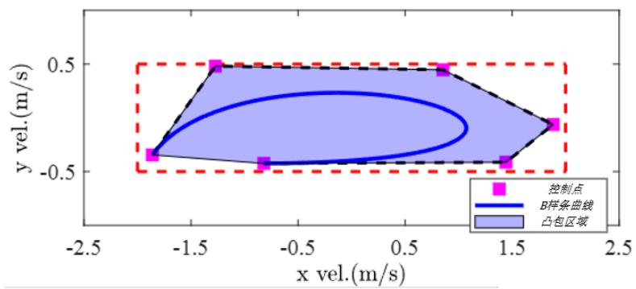

<details>
<summary>scatter</summary>

| x vel.(m/s) | y vel.(m/s) | Region         |
|-------------|-------------|----------------|
| -1.5        | 0.5         | B样条曲线     |
| -1.5        | -0.5        | B样条曲线     |
| 1.5         | 0.5         | B样条曲线     |
| 1.5         | -0.5        | B样条曲线     |
| -1.5        | -0.5        | B样条曲线     |
| 1.5         | -0.5        | B样条曲线     |
| -1.5        | -0.5        | B样条曲线     |
| 1.5         | -0.5        | B样条曲线     |
| -1.5        | -0.5        | B样条曲线     |
| 1.5         | -0.5        | B样条曲线上划线 |
</details>

图5.9 使用凸包属性在可行区域内约束速度分布的说明（虚线红线）

# 5.2.2 使用B 样条多项式表示轨迹

为了缓解数值不稳定性问题，在整个规划范围内使用具有较低阶数的分段 B 样条多项式，而不是使用高阶 B 样条多项式。轨迹的每一部分都与一个安全走廊相关联。??(??)是在固定的时间间隔[0,1]上定义的。对于 m+1 块的整个轨迹，在每一块$[ T _ { k } , T _ { k + 1 } ] \left( \mathrm { k } { = } 0 , 1 , \dots , \mathrm { m } \right)$ ）中，使用时域中的缩放变换和平移变换将其映射到区间[0,1]。然后，一维中的整个分段轨迹是：

$$
f _ {j} ^ {\sigma} (t) = \left\{ \begin{array}{c c} \alpha_ {1} \cdot \sum_ {i = 0} ^ {m} p _ {i} ^ {1} \cdot b _ {m} ^ {i} \left(\frac {t - t _ {0}}{\alpha_ {1}}\right), & t \in [ t _ {0}, t _ {1} ] \\ \alpha_ {2} \cdot \sum_ {i = 0} ^ {m} p _ {i} ^ {2} \cdot b _ {m} ^ {i} \left(\frac {t - t _ {1}}{\alpha_ {2}}\right), & t \in [ t _ {1}, t _ {2} ] \\ \vdots & \vdots \\ \alpha_ {n} \cdot \sum_ {i = 0} ^ {m} p _ {i} ^ {n} \cdot b _ {m} ^ {i} \left(\frac {t - t _ {n - 1}}{\alpha_ {n}}\right), & t \in [ t _ {n? 1}, t _ {n} ], \end{array} \right. \tag {5.5}
$$

其中 $^ 1 p _ { i } ^ { j }$ 表示第j 段的第i 个控制点， $t _ { 0 } , t _ { 1 } , \ldots , t _ { n }$ 是每个段的起点和终端的时间戳。由于B 样条曲线定义在固定区间[0,1]上，而每个段的轨迹持续时间可能会有所不同，根据其持续时间为每个段引入缩放因子 $\alpha _ { i }$ ，类似于[53]。

在本研究中，采用了 4 阶 B 样条曲线进行路径优化，以有效避免高次插值中的龙格现象（Runge’s Phenomenon）。如图 5.10 所示，龙格现象是指在使用高阶多项式进行插值时，随着插值节点数量的增加，插值曲线可能在节点之间出现剧烈振荡，导致路径的不平滑和不稳定。这种振荡效应在路径规划中尤其不利，会影响车辆的平稳行驶，并增加路径跟踪的难度。相比之下，B 样条曲线（B-Spline）采用分段低阶多项式进行插值，能够在保证路径光滑性的同时，避免高次插值带来的过度振荡问题。

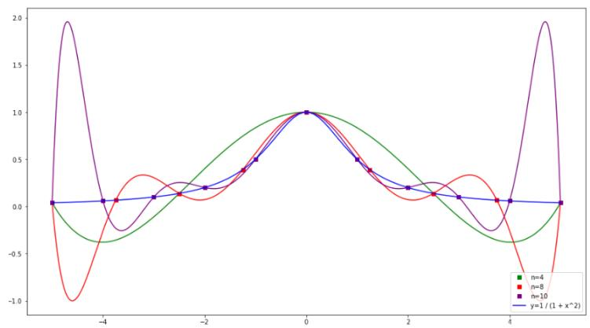

<details>
<summary>line</summary>

| x    | n=4       | n=8       | n=10      |
| ---- | --------- | --------- | --------- |
| -5   | 0.0       | 0.0       | 0.0       |
| -4   | 0.0       | 0.0       | 0.0       |
| -3   | 0.0       | 0.0       | 0.0       |
| -2   | 0.0       | 0.0       | 0.0       |
| -1   | 0.0       | 0.0       | 0.0       |
| 0    | 1.0       | 1.0       | 1.0       |
| 1    | 0.0       | 0.0       | 0.0       |
| 2    | 0.0       | 0.0       | 0.0       |
| 3    | 0.0       | 0.0       | 0.0       |
| 4    | 0.0       | 0.0       | 0.0       |
| 5    | 0.0       | 0.0       | 0.0       |
</details>

图5.10 多项式插值的龙格现象

# 5.2.3 构建优化问题

在本研究中，为了优化由 Hybrid A\*算法搜索得到的全局轨迹，构建了一个综合的优化问题，代价函数由三个主要部分组成：轨迹拟合项、平滑项和避障项。通过在全局轨迹的基础上加入这些优化项，能够有效地改进轨迹的平滑性、合理性和避障性能，确保轨迹在实际应用中的可行性和高效性。

$$
\min J = \lambda_ {o} \cdot J _ {o} + \lambda_ {1} \cdot J _ {1} + \lambda_ {2} \cdot J _ {2} \tag {5.6}
$$

其中 $\mid J _ { o }$ 是轨迹拟合项成本函数， $J _ { 1 }$ 是平滑项成本函数， $J _ { 2 }$ 是避障项成本函数。 $\lambda _ { o }$ 、$\lambda _ { 1 }$ 、 $\lambda _ { 2 }$ 是每个惩罚项的权重。

# （1）轨迹拟合项

Hybrid A\*算法生成的全局轨迹是基于粗糙的栅格地图进行搜索的，虽然在粗略的地图上进行路径规划可以得到一个可行的路径，但这条路径往往不具备足够的精细度。全局轨迹中隐含了一些粗糙的避障信息和最短路径的信息，这些信息在优化过程中具有重要的参考价值。因此，为了使优化后的轨迹更加接近原始全局路径，并保留原有的避障和最短路径特性，在代价函数中引入了轨迹拟合项。轨迹拟合项通过最小化优化路径与初始全局轨迹之间的差异，确保优化过程中轨迹的大体形态不会发生剧烈改变，同时保持路径的连贯性。

a.计算投影点 $f _ { j } ^ { \sigma }$ (??)

当 t 在区间 $[ t _ { 0 } , t _ { n } ]$ 内时，通过以下公式计算数据点在分段 B 样条曲线上的投影点$f _ { j } ^ { \sigma } ( t )$ ：

$$
f _ {j} ^ {\sigma} (t) = \left\{ \begin{array}{c c} \alpha_ {1} \cdot \sum_ {i = 0} ^ {m _ {1}} p _ {i 1} \cdot b _ {m 1} (t - t _ {0}) & t \in [ t _ {0}, t _ {1} ] \\ \alpha_ {2} \cdot \sum_ {i = 0} ^ {m _ {2}} p _ {i 2} \cdot b _ {m 2} (t - t _ {1}) & t \in [ t _ {1}, t _ {2} ] \\ \vdots \\ \alpha_ {n} \cdot \sum_ {i = 0} ^ {m _ {n}} p _ {i n} \cdot b _ {m n} (t - t _ {n - 1}) & t \in [ t _ {n - 1}, t _ {n} ] \end{array} \right. \tag {5.7}
$$

其中， $b _ { m i } ( t )$ 是 B 样条基函数， $p _ { i 1 } , p _ { i 2 } , \ldots , p _ { i n }$ 是每段曲线的控制点， $\alpha _ { 1 } , \alpha _ { 2 } , \ldots , \alpha _ { n }$ 是每段 B 样条曲线的缩放因子， $t _ { 0 } , t _ { 1 } , \ldots , t _ { n }$ 为每段 B 样条曲线的时间区间。通过此公式能够计算出每个时间点 t对应的轨迹点 $f _ { j } ^ { \sigma } ( t )$ ，并确保轨迹与控制点尽可能匹配。

# b.距离计算

数据点 p 到曲线投影点 $f _ { j } ^ { \sigma } ( t )$ 的距离计算如下：

$$
d = \parallel f _ {j} ^ {\sigma} (t) - p \parallel \tag {5.8}
$$

这个距离度量了轨迹拟合的精度，距离越小表示拟合效果越好。距离项作为优化代价函数的一部分，推动优化过程减少误差，使得优化后的轨迹尽量接近目标轨迹。

# c.梯度计算

为了保证轨迹的平滑性并减少轨迹的曲率变化，计算每个控制点 $p _ { i j }$ 对距离误差的梯度。梯度计算公式为：

$$
\frac {\vartheta}{\vartheta p _ {i j}} \parallel d \parallel^ {2} = 2 d \cdot b _ {m i} (t) \tag {5.9}
$$

在此公式中， $p _ { i j }$ 是控制点， $b _ { m i } ( t )$ 是 B 样条基函数，d 是轨迹点到数据点的距离。通过计算这个梯度，可以调整控制点的位置，确保轨迹在控制点之间平滑过渡，避免过大的曲率变化，从而优化轨迹的平滑度。

由此，得到轨迹拟合项成本函数 $J _ { o }$ ：

$$
J _ {0} = \sum_ {i = 0} ^ {\mathrm{n}} | | f _ {j} ^ {\sigma} (t) - P | | ^ {2} \tag {5.10}
$$

# d.边界情况

在轨迹优化时，边界条件也非常重要。特别是在 $t \in [ t _ { 0 } , t _ { 1 } ]$ 和 $t \in [ t _ { n - 1 } , t _ { n } ]$ ]时，起点和终点的推导公式会影响最终轨迹。例如，在 $t = t _ { 0 }$ 时，轨迹的起点为 $P _ { 0 }$ ，而终点的速度由初始速度 start\_velocity 决定：

$$
f _ {j} ^ {\sigma} (t) = P _ {0} + \text { start } _ {\mathrm{v}} \text { elocity } * t \tag {5.11}
$$

这样的设置确保了在优化过程中，边界条件被正确纳入考虑，保证轨迹在起点和终点处满足物理约束，避免路径的过度弯曲或不合理的速度变化。

# （2）平滑项

在初步生成的全局轨迹中，往往会出现不平滑的折点和急剧的曲率变化，特别是在经过转弯或路径调整的区域，这些不平滑的部分会增加下游局部规划器的计算负担，并可能导致轨迹的不稳定性。因此，为了消除这些不平滑的折点，在代价函数中加入了平滑项。平滑项通过对轨迹的曲率进行约束，惩罚那些不符合平滑度要求的轨迹点，从而使得优化后的轨迹更加平滑，曲率变化更加平稳。这不仅有助于降低下游规划器的计算压力，还能够提高系统在复杂环境中的稳定性，使得轨迹在实际执行过程中更加舒适和安全。

在B 样条拟合中，平滑度通常通过控制曲线的导数来实现。计算曲线在各段的一阶导数（表示曲线的斜率变化）和二阶导数（表示曲率变化）来控制平滑度。较小的导数变化意味着曲线更加平滑，因此可以通过添加一阶和二阶导数成本项来惩罚变化过大的部分。

平滑度成本函数的计算公式如下：

$$
J _ {1} = \sum_ {i = 0} ^ {n} \sum_ {j = 0} ^ {n} \left(\alpha \cdot \text {Order1SmoothCostCoeff} _ {i j} + \beta \cdot \text {Order2SmoothCostCoeff} _ {i j}\right) P _ {i} \cdot P _ {j} (5. 1 2)
$$

其中：

??和 $| \beta \rrangle$ 为权重系数，分别控制一阶和平滑成本对总成本的影响； $P _ { i }$ 和 $P _ { j }$ 是控制点的坐标值Order1SmoothCostCoef $\mathsf { f } _ { i j }$ 和 $\mathrm { 1 0 r d e r 2 S m o o t h C o s t C o e f f } _ { i j }$ 是矩阵的元素,表示对应控制点之间的平滑度成本系数。

# a.一阶平滑系数矩阵：

一阶平滑度主要与曲线的一阶导数变化有关，用来控制曲线的倾斜变化。假设 B样条曲线 $f _ { j } ^ { \sigma } ( t )$ 由控制点 $p _ { i 1 } , p _ { i 2 } , \ldots , p _ { i n }$ 是每段曲线的控制点构成，则平滑度成本系数矩阵的元素 Order1SmoothCostCoeff 表示两个控制点 P 和 P，对一阶导数平滑度的贡献。

生成一阶平滑度系数矩阵的方法一般如下：

首先计算一阶导数的导数基函数，对于每个控制点，根据 B 样条的导数基函数，计算控制点对曲线一阶导数的影响；其次构造矩阵，通过导数基函数对每个控制点之间的相互影响生成矩阵元素该过程会形成一个关于控制点位置的对称矩阵，即：

$$
\text { Order1SmoothCostCoeff } _ {i j} = \int_ {0} ^ {1} \frac {d N _ {i} (t)}{d t} \cdot \frac {d N _ {j} (t)}{d t} d t \tag {5.13}
$$

其中 $N _ { i } ( t )$ 和 $N _ { j } ( t )$ 是 B 样条曲线的基函数， $\frac { d N _ { i } ( t ) } { d t }$ 和 和??????(??)???? 是其一阶导数。这些矩 $\frac { d N _ { j } ( t ) } { d t }$

阵元素在实现时会预计算并存储下来。

# b.二阶平滑系数矩阵：

二阶平滑度系数矩阵主要用于控制曲线的曲率变化。它通过二阶导数来衡量曲线在局部的弯曲程度。二阶平滑度系数矩阵的元素 Order2SmoothCostCoeff 表示两个控制点对曲线二阶导数。平滑度的影响，具体计算方式如下：

首先计算二阶导数的导数基函数，同样地，计算二阶导数对控制点的影响；其次构造矩阵，根据控制点之间的二阶导数关系生成矩阵。公式如下：

$$
\text { Order2SmoothCostCoeff } _ {i j} = \int_ {0} ^ {1} \frac {d ^ {2} N _ {i} (t)}{d t ^ {2}} \cdot \frac {d ^ {2} N _ {j} (t)}{d t ^ {2}} d t \tag {5.14}
$$

其中??2????(??) $\frac { d ^ { 2 } N _ { i } ( t ) } { d t ^ { 2 } }$ ????2 和 $\frac { d ^ { 2 } N _ { j } ( t ) } { d t ^ { 2 } }$ 分别是其基函数的二阶导数。这些距阵元素衡量了控制点对曲线二阶导数（曲率）的贡献。

# c.实际生成过程

在代码实现中，通常通过数值积分或其他数值方法预先计算这些系数矩阵，然后在优化过程中使用。这使得优化过程更为高效，因为可以直接使用这些预计算的矩阵来快速计算平滑度成本。一阶平滑度成本系数矩阵衡量了控制点对曲线斜率平滑度的影响，二阶平滑度成本系数矩阵则衡量了控制点对曲率平滑度的影响。这些矩阵是通过对 B 样条基函数导数的积分来获得的，从而确保在优化过程中能够最小化曲线的平滑度成本，使得曲线更加自然和连续。

# （3）避障项

虽然 Hybrid A\*算法能够为全局路径提供基本的避障信息，但在实际应用中，生成的轨迹可能无法完全满足精确避障的要求。特别是在复杂的道路环境中，路径可能会经过一些靠近障碍物的区域，甚至在某些情况下可能会发生碰撞。为了避免这种情况，在优化问题中引入了避障项。避障项确保在对全局轨迹进行调整时，路径的任何修改都不会使原本安全的轨迹变得碰撞风险更高。通过对轨迹与障碍物之间的距离进行约束，优化算法能够自动避免使轨迹进入障碍物区域，并进一步优化轨迹，使其更加合理且安全。最终，通过综合考虑避障、轨迹拟合和路径平滑等因素，优化后的轨迹能够在保证避障安全的同时，提供更加合理的路径，确保车辆在复杂场景中的顺利行驶。

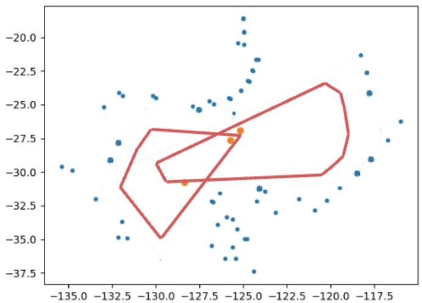

<details>
<summary>scatter</summary>

| x        | y       |
| -------- | ------- |
| -135.0   | -30.0   |
| -132.5   | -25.0   |
| -130.0   | -27.5   |
| -127.5   | -27.5   |
| -125.0   | -27.5   |
| -122.5   | -27.5   |
| -120.0   | -27.5   |
| -117.5   | -27.5   |
</details>

图5.11 从自由空间提取凸多边形

如图 5.11 所示，使用第四章节中的球体翻转法构造安全走廊算法提取环境中的自由空间，生成由 $H _ { j }$ 表示的凸多边形组成的 x-y 2D安全走廊。具有 m 个半空间的凸多边形定义为：

$$
\mathcal {C} = \bigcap_ {j = 1} ^ {2 \mathbf {n}} H _ {j} = \{\mathbf {x} \in \mathbb {R} ^ {2} \mid \mathbf {A x} \leq \mathbf {b} \} \tag {5.15}
$$

其中 $\boldsymbol { \mathsf { A } } \in \mathbb { R } ^ { m \times 2 }$ 和 $\mathbf { b } \in \mathbb { R } ^ { m }$ 是这m 个半空间的描述符，这些半空间的交点形成一个多边形，为了保证车辆不会与环境中的障碍物发生碰撞，使用两个半径为 r的圆来覆盖整个车辆轮廓，其中一个圆心位于车辆位置 p 如图 5.12 所示。在构建安全走廊之前用半径为r的障碍物进行收缩，因此车辆可以用两个点来表示：

$$
\mathbf {o} _ {b i} = \mathbf {p} _ {i}
$$

$$
\mathbf {o} _ {f i} = \mathbf {p} _ {i} + L \cdot \binom {\cos \theta_ {i}} {\sin \theta_ {i}} \tag {5.16}
$$

在构造走廊时，对于每个多边形 $C _ { i }$ ，安全约束可以表述为优化后的质点应该在相应的多边形 $C _ { i }$ 内：

$$
\begin{array}{l} \begin{array}{l} \mathrm{A} _ {k i} \mathrm{o} _ {k j} - \mathrm{b} _ {k i} \leq 0 \\ i \in (0, 1, 2, \dots , n) k \in (1, f) \end{array} \tag {5.17} \\ i \in \{0, 1, 2, \dots , m \}, k \in \{b, f \} \\ \end{array}
$$

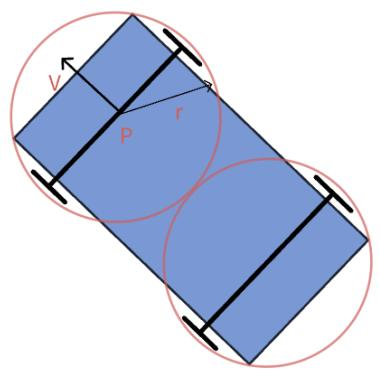

<details>
<summary>text_image</summary>

V
P
r
</details>

图5.12 两个半径为R的圆用于覆盖整个车辆轮廓

在本研究中，优化后的全局轨迹主要作为局部规划器生成实际行驶轨迹的参考。我们更注重全局轨迹的求解成功率和计算效率，而非严格的避障约束。为此，避障约束被作为软约束加入到代价函数中。这样，我们在优化过程中并不强制要求轨迹完全避开障碍物，而是通过对轨迹中与障碍物较近的点施加惩罚，间接引导轨迹远离障碍物。这种方法可以有效提高全局轨迹的计算效率，同时保证轨迹在避障方面具有一定的合理性，确保后续局部规划器能够在此基础上生成更加精准和可行的行驶轨迹。通过这种软约束方式，我们不仅保证了全局轨迹的生成效率，还为局部规划器提供了更加灵活的输入，避免了过于严格的避障要求给计算带来的负担，从而提升了整个路径规划系统的实时性和适应性。

避障成本函数的计算公式如下：

$$
J _ {2} = \sum_ {i = 0} ^ {2 n} F _ {s} (\mathbf {A} _ {i}, \mathbf {b} _ {i}) \tag {5.18}
$$

$$
F _ {s} (\mathbf {A} _ {i}, \mathbf {b} _ {i}) = \sum_ {j = 0} ^ {\mathrm{m}} L \big (\mathbf {A} _ {i j} \mathbf {p} _ {i} - \mathbf {b} _ {i j} \big) + L \big (\mathbf {A} _ {i + 1 j} \mathbf {p} _ {i + 1} - \mathbf {b} _ {i + 1 j} \big) \tag {5.19}
$$

当优化后的路径点位于某一边的内部时（即 $\mathbf { A } _ { i j } \mathbf { p } _ { i } - \mathbf { b } _ { i j } < 0 )$ ），我们不对其施加任何惩罚；而当路径点位于某一边的外部时，为了确保路径点始终位于走廊内部，我们通过三次方惩罚函数将路径点推向凸多边形的内部。具体来说，惩罚函数会在下一轮优化中对这些路径点施加更大的罚值，从而有效地引导优化过程，避免路径点偏离预定的安全区域。因此，罚函数可以表述为：

$$
L (x) = \left\{ \begin{array}{l l} 0 & (x <   0) \\ x ^ {3} \end{array} \right. \tag {5.20}
$$

# 5.2.4 优化结果

通过对比 Hybrid A\*算法搜索得到的全局路径与优化后的全局路径在不同工况下

的表现（如狭窄道路、贴墙行驶和直角转弯等），我们能够清晰地评估优化效果。

如图5.13所示，在狭窄道路的工况下，优化后的路径稳固地贴合道路中心线，且在确保车辆能够顺利通过的前提下，没有发生路径偏向道路一侧、导致与墙壁发生剐蹭的情况。这表明，所采用的走廊算法具有较高的精度，并且优化问题中的避障约束发挥了重要作用，有效地引导路径在安全区域内行驶。

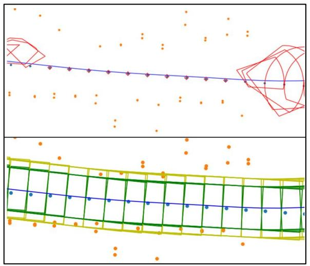

<details>
<summary>natural_image</summary>

Two-panel diagram showing light ray paths and a grid of colored dots with connecting lines (no text or symbols)
</details>

图5.13 狭窄道路工况优化结果。橙色为障碍物点云，蓝色为初始的全局路径采样点，红线包络的凸域构成安全走廊，蓝色实线为优化后的轨迹，绿框表示优化后的车辆位置，黄色是车辆考虑安全距离膨胀后的位置

如图 5.14 所示，在贴墙行驶的工况下，优化后的路径相较于全局路径发生了整体偏移。该路径不仅避免了与障碍物的碰撞，还在优化过程中与障碍物保持了安全距离。这种偏移增加了路径的整体舒适性，同时由于优化后的路径更加平滑，避免了急剧转弯或不连续的变化，证明了优化问题中平滑约束的有效性。

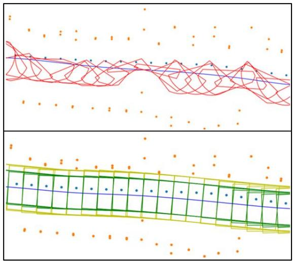

<details>
<summary>natural_image</summary>

Two-panel scientific visualization showing red and green trajectories with scattered orange dots, no text or symbols present.
</details>

图5.14 贴墙行驶工况优化结果。

如图 5.15 所示，在直角转弯的工况下，原始全局路径未能有效保证与拐角处障碍物的安全距离，甚至出现了与障碍物碰撞的风险。而优化后的路径在确保平滑度的同时，成功地与拐角处的障碍物保持了适当的安全距离，显著提升了整体路径的安全性与舒适性。

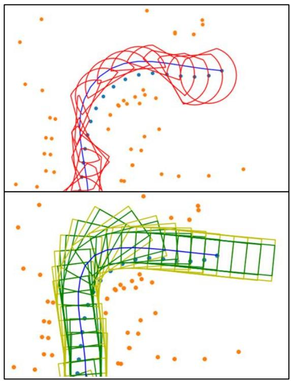

<details>
<summary>natural_image</summary>

Two abstract 3D wireframe models with colored dots and connecting lines, no text or symbols present.
</details>

图5.15 直角转弯工况优化结果。

如图 5.16 所示，在各个工况下，优化后的路径相较原始全局路径更加远离障碍物，与障碍物保持更加合理的安全距离。

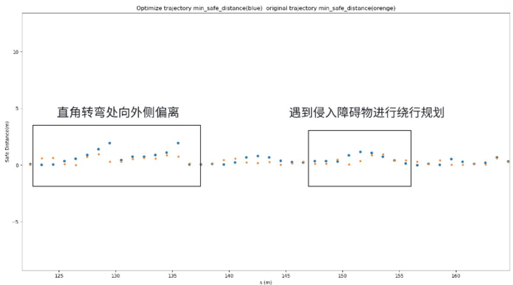

<details>
<summary>scatter</summary>

| s (m) | Original Trajectory Min_Safe_Distance (blue) | Original Trajectory Min_Safe_Distance (orange) |
|-------|---------------------------------------------|-----------------------------------------------|
| 125   | ~0.5                                        | ~0.3                                          |
| 130   | ~2.0                                        | ~0.8                                          |
| 135   | ~1.8                                        | ~0.7                                          |
| 140   | ~0.2                                        | ~0.1                                          |
| 145   | ~0.1                                        | ~0.0                                          |
| 150   | ~0.8                                        | ~0.6                                          |
| 155   | ~0.3                                        | ~0.2                                          |
| 160   | ~0.5                                        | ~0.4                                          |
| 165   | ~0.2                                        | ~0.1                                          |
</details>

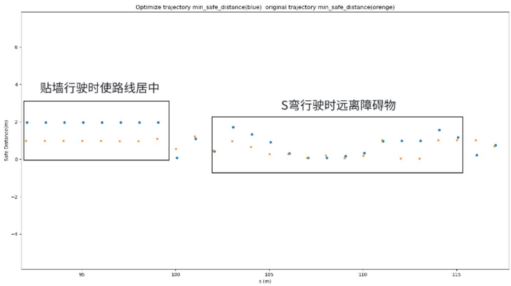

<details>
<summary>scatter</summary>

| s (m) | Safe Distance (m) |
|-------|-------------------|
| 95    | 2.0               |
| 100   | 0.0               |
| 105   | 1.5               |
| 110   | 0.5               |
| 115   | 1.0               |
| 120   | 0.0               |
</details>

图5.16 不同工况下优化后（蓝色）和原始路径（橙色）离障碍物最小距离。

整体来看，优化后的全局路径在多个复杂工况下均表现优异，兼顾了避障要求、轨迹平滑性和车辆行驶稳定性。本文通过构建包含轨迹拟合、平滑和避障三个优化项的代价函数，对 Hybrid A\*生成的轨迹进行优化。这些优化策略不仅提高了路径的平滑性与避障能力，还有效降低了局部规划器的计算负担，提升了自动驾驶系统的实时性和鲁棒性。最终，优化后的全局路径更加合理，能够更好地适应狭窄、拥挤、动态变化的城市狭窄道路环境，使自动驾驶系统能够平稳、安全、高效地行驶。

# 5.3 局部规划— 时空联合规划

时空联合规划（Spatiotemporal Joint Planning）是自动驾驶系统中路径规划的重要方法之一，它不仅关注车辆的空间位置，还将时间维度纳入规划过程中。传统的路径规划方法往往侧重于静态空间中的避障和最短路径计算，而忽略了车辆在动态环境中随时间变化的运动约束和决策过程。如图 5.17 所示，时空联合规划则通过考虑时间和空间的耦合关系，使得路径规划不仅能够避开障碍物，还能有效应对交通流、行人、其他车辆等动态因素的影响。

在时空联合规划中，车辆的路径规划不仅仅是选择一条静态的轨迹，而是结合车辆的速度、加速度等动态约束，在整个行驶过程中优化时间和空间的分配。这种方法能够在复杂环境中提供更高效、更安全的路径规划，特别适用于城市道路、狭窄街道等复杂场景，在这些场景中，车辆不仅需要避开静态障碍物，还要与行人、非机动车和其他车辆进行复杂的动态交互。

本节将介绍如何在城市狭窄道路的路径规划中使用时空联合规划方法作为局部规划器。城市狭窄道路环境中的道路狭窄、障碍物多且动态变化快，使得传统的路径规划方法难以有效应对。在这种情况下，时空联合规划作为局部规划器能够实时优化路径，充分考虑车辆的运动约束、周围环境的障碍物以及交通流等动态因素，从而实现高效的避障和轨迹平滑。

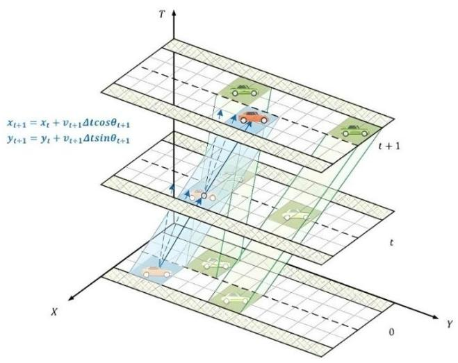

<details>
<summary>text_image</summary>

T
x_{t+1} = x_t + v_{t+1}\Delta t\cos\theta_{t+1}
y_{t+1} = y_t + v_{t+1}\Delta t\sin\theta_{t+1}
t+1
t
X
0
Y
</details>

图5.17 时空联合规划地图

# 5.3.1 目标函数设计

目标函数建立为

$$
J = J _ {s} + J _ {l} \tag {5.21}
$$

$$
J _ {s} = w _ {1} \int_ {0} ^ {T} (s (t) - s ^ {\tau} (t)) ^ {2} d t + w _ {2} \int_ {0} ^ {T} (\dot {s} (t) - v _ {s} ^ {\tau}) ^ {2} d t \tag {5.22}
$$

$$
+ w _ {3} \int_ {0} ^ {T} \dddot {s} (t) ^ {2} d + w _ {4} \int_ {0} ^ {T} \ddot {s} (t) ^ {2} d t + w _ {5} (s (T) - s ^ {\tau} (T)) ^ {2}.
$$

$$
J _ {l} = w _ {6} \int_ {0} ^ {T} (l (t) - l ^ {\tau} (t)) ^ {2} \mathrm{d} t + w _ {7} \int_ {0} ^ {T} (\dot {l} (t) - v _ {l} ^ {\tau}) ^ {2} \mathrm{d} t \tag {5.23}
$$

$$
+ w _ {8} \int_ {0} ^ {T} \ddot {l} (t) ^ {2} \mathrm{d} t + w _ {9} \int_ {0} ^ {T} \ddot {l} (t) ^ {2} \mathrm{d} t + w _ {1 0} (l (T) - l ^ {\tau} (T)) ^ {2}.
$$

其中 $s ^ { \tau } ( t )$ 和 $l ^ { \tau } ( t )$ 是参考线的纵向和横向轨迹， $v _ { s } ^ { \tau }$ 和 $v _ { l } ^ { \tau }$ 是两个方向的巡航速度。对于 $J _ { s }$ 和 $J _ { l }$ ，它们的第一项惩罚与参考线的偏差；第二项惩罚实际速度和巡航速度之间的偏差；第三和第四项分别惩罚加速度和加加速度。最后一项惩罚结束位置与目标终点的偏差。我们使用 $\mathrm { O p t u n a } ^ { [ 5 4 ] }$ 来调整所有 10 个参数。

# 5.3.2 轨迹规划约束条件

使用的 B 样条如第五章 5.3.1 所示，m 阶 B 样条多项式：

$$
f (t) = p _ {0} b _ {\mathrm{m}} ^ {0} (t) + p _ {1} b _ {\mathrm{m}} ^ {1} (t) + \dots + p _ {\mathrm{m}} b _ {\mathrm{m}} ^ {\mathrm{m}} (t) = \sum_ {i = 0} ^ {\mathrm{m}} p _ {i} b _ {\mathrm{m}} ^ {i} (t) \tag {5.24}
$$

其中 B 样条基满足 $b _ { i } ^ { m } ( t ) = \mathsf { p } _ { m } ^ { i } \cdot t ^ { i } \cdot ( 1 - t ) ^ { m - i }$ 。多项式 ${ \bf \langle { \pmb { p } } _ { i } \left( \mathrm { i } = 0 , 1 , \dots , m \right) }$ ）的系数也称为控制点，将控制点集 $[ p _ { 0 } , \ p _ { 1 } , \ldots , \ p _ { \mathrm { m } } ]$ 表示为 ${ \tt p }$ 。

整个分段B 样条轨迹表示：

$$
f _ {j} ^ {\sigma} (t) = \left\{ \begin{array}{c c} \alpha_ {1} \cdot \sum_ {i = 0} ^ {m} p _ {i} ^ {1} \cdot b _ {m} ^ {i} \left(\frac {t - t _ {0}}{\alpha_ {1}}\right), & t \in [ t _ {0}, t _ {1} ] \\ \alpha_ {2} \cdot \sum_ {i = 0} ^ {m} p _ {i} ^ {2} \cdot b _ {m} ^ {i} \left(\frac {t - t _ {1}}{\alpha_ {2}}\right), & t \in [ t _ {1}, t _ {2} ] \\ \vdots & \vdots \\ \alpha_ {n} \cdot \sum_ {i = 0} ^ {m} p _ {i} ^ {n} \cdot b _ {m} ^ {i} \left(\frac {t - t _ {n - 1}}{\alpha_ {n}}\right), & t \in [ t _ {n - 1}, t _ {n} ], \end{array} \right. \tag {5.25}
$$

其中 $^ { 1 } p _ { i } ^ { j }$ 表示第j 段的第 i 个控制点， $t _ { 0 } , \quad t _ { 1 } , \ldots , t _ { n }$ 是每个段的起点和终端的时间戳。由于 B 样条曲线定义在固定区间[0,1]上，而每个段的轨迹持续时间可能会有所不同，我们根据其持续时间为每个段引入缩放因 $\vec { \mathsf { f } } \alpha _ { i }$ 。

类似于[55]，我们最小化加加平方的时间积分给出的代价函数。具体来说，第 j 段的代价 $\mathrm { J j }$ 可以写成：

$$
J _ {j} = w _ {s} \int_ {t _ {j - 1}} ^ {t _ {j}} \left(\frac {d ^ {3} f ^ {s} (t)}{d t ^ {3}}\right) ^ {2} d t + w _ {l} \int_ {t _ {j - 1}} ^ {t _ {j}} \left(\frac {d ^ {3} f ^ {l} (t)}{d t ^ {3}}\right) ^ {2} d t \tag {5.26}
$$

其中 $w _ { s }$ 和 $w _ { l }$ 分别表示纵向和横向控制成本的权重。

用 $y _ { j } ^ { \sigma } ( t )$ 表示以 ${ \tt p } _ { j }$ 为控制点的区间[0,1]内的非标度 B 样条曲线。设 $\begin{array} { r } { u = \frac { t - t _ { j - 1 } } { \alpha _ { j } } } \end{array}$ ??−????−1表示????非标度 B 样条曲线的归一化时间，可以使用非标度 $y _ { j } ^ { \sigma } ( t )$ 重写第 j 维段的成本如下：

$$
J _ {j} ^ {\sigma} = \int_ {0} ^ {1} \alpha_ {j} \cdot \left(\frac {d ^ {3} (\alpha_ {j} \cdot y _ {j} ^ {\sigma} (t))}{d (u \cdot \alpha_ {j}) ^ {3}}\right) ^ {2} d u = \frac {1}{\alpha_ {j} ^ {3}} \cdot \mathrm{p} _ {j} ^ {\mathrm{T}} \mathrm{Qp} _ {j} \tag {5.27}
$$

其中Q是非标度B 样条曲线的Hessian 矩阵。

本文采用四次 $\left( { \bf { m } } { = } 4 \right)$ ）分段B 样条曲线作为轨迹参数化，根据线迹性质，非标度B 样条曲线的第k导数 $\cdot \frac { d ^ { k } y _ { j } ^ { \sigma } ( t ) } { d t ^ { k } }$ ?????? 由控制点????,????,( $\boldsymbol { q } _ { j , i } ^ { \sigma , ( k ) }$ 支持，可归纳如下，

$$
q _ {j, i} ^ {\sigma , (0)} = p _ {i} ^ {j}, q _ {j, i} ^ {\sigma , (k)} = \frac {m !}{(m - k) !} \left(q _ {j, i + 1} ^ {\sigma , (k - 1)} - q _ {j, i} ^ {\sigma , (k - 1)}\right) \tag {5.28}
$$

基于这个性质， $f _ { j } ^ { \sigma } ( t )$ 边界处的 k 阶导数可以表示为：

$$
\frac {d ^ {k} f _ {j} ^ {\sigma} (t _ {j - 1})}{d t ^ {k}} = \alpha_ {j} ^ {1 - k} \cdot q _ {j, 0} ^ {\sigma , (k)}, \frac {d ^ {k} f _ {j} ^ {\sigma} (t _ {j})}{d t ^ {k}} = \alpha_ {j} ^ {1 - k} \cdot q _ {j, m} ^ {\sigma , (k)} \tag {5.29}
$$

此外，通过进一步应用凸包性质，我们可以使用以下充分条件约束 $f _ { j } ^ { \sigma } ( t )$ 的整个导数轮廓：

$$
s ^ {k} (t) = \alpha_ {j} ^ {1 - k} \cdot q _ {j, i} ^ {\sigma , (k)} \tag {5.30}
$$

$$
\beta_ {j, -} ^ {\sigma , (k)} \leq s ^ {k} (t) \leq \beta_ {j, +} ^ {\sigma , (k)}, \forall i \Rightarrow \beta_ {j, -} ^ {\sigma , (k)} \leq \frac {d ^ {k} f _ {j} ^ {\sigma} (t)}{d t ^ {k}} \leq \beta_ {j, +} ^ {\sigma , (k)} \tag {5.31}
$$

其中 $\beta _ { j , - } ^ { \sigma , ( k ) }$ 和 $| \beta _ { j , + } ^ { \sigma , ( k ) }$ )表示第 j 段的第 k 个导数在维度 $\sigma$ 上的下界和上界，显然此处约束的是横纵路径，故 ${ \sf k } ^ { = 0 }$ 。

（1）边界约束：分段曲线从固定位置、速度和加速度开始。首先，生成的轨迹应该从给定的初始状态[????(0) $[ \sigma _ { t _ { 0 } } ^ { ( 0 ) } , \ \sigma _ { t _ { 0 } } ^ { ( 1 ) } , \ \sigma _ { t _ { 0 } } ^ { ( 2 ) } ]$ ???? ???? )]开始，并在给定的目标状态[????(0) $[ \sigma _ { t _ { 0 } } ^ { ( 0 ) } , \ \sigma _ { t _ { 0 } } ^ { ( 1 ) } , \ \sigma _ { t _ { 0 } } ^ { ( 2 ) } ]$ ???? ， ???? (2)]处终止，其中 $\alpha _ { t } ^ { ( k ) }$ 表示时间 t 的 k 阶导数。具体来说，这需要对第一段和最后一段强制执行等式约束，如下所示：

$$
\frac {d ^ {k} f _ {0} ^ {\sigma} (t _ {0})}{d t ^ {k}} = \sigma_ {t _ {0}} ^ {(k)}, \frac {d ^ {k} f _ {n} ^ {\sigma} (t _ {n})}{d t ^ {k}} = \sigma_ {t _ {n}} ^ {(k)} \tag {5.32}
$$

（2）连续性约束：分段曲线在位置、速度和加速度的连接时间点必须是连续的。

公式中体现为在两个连续片之间的所有连接点处直到 k 阶的所有导数都应该是连续的，第j 段和第j+1 段之间的连续性约束可以写成：

$$
\frac {d ^ {k} f _ {j} ^ {\sigma} (t _ {j})}{d t ^ {k}} = \frac {d ^ {k} f _ {j + 1} ^ {\sigma} (t _ {j})}{d t ^ {k}} \tag {5.33}
$$

其中 k=0,1,2,3。通过应用等式 5.29，这些约束也可以写成线性的等式约束。

（3）碰撞约束：为了保证生成的轨迹没有碰撞，我们将轨迹的每个段约束在相应的安全走廊内，安全走廊通过章节 4的球体翻转法，引入静态障碍物和行人轨迹预测的动态障碍物点云生成。第 j 段对维度??的自由空间约束可以通过在 k=0 下使用充分条件（公式 5.31）来强制执行，其中 $\beta _ { j , - } ^ { \sigma , ( 0 ) }$ ，和 $| \beta _ { j , + } ^ { \sigma , ( 0 ) }$ 表示立方体形状给出的维度??上的位置边界。  
（4）动力学约束：考虑的动力学约束条件包括车辆速度、加速度和加速度的极限。我们可以用 B 样条曲线的速度图来计算速度、加速度和加速度。我们使用充分条件（公式5.31）对轨迹的导数进行约束，其中 $_ { \mathrm { k } = 1 , 2 }$ 。物理意义是最大横向/纵向速度和加速度受到约束：

$$
s ^ {k} (t) = \alpha_ {j} ^ {1 - k} \cdot q _ {j, i} ^ {\sigma , (k)} \tag {5.34}
$$

$$
\beta_ {j, -} ^ {\sigma , (k)} \leq s ^ {k} (t) \leq \beta_ {j, +} ^ {\sigma , (k)}, \forall i \Rightarrow \beta_ {j, -} ^ {\sigma , (k)} \leq \frac {d ^ {k} f _ {j} ^ {\sigma} (t)}{d t ^ {k}} \leq \beta_ {j, +} ^ {\sigma , (k)} \tag {5.35}
$$

# 5.3.3 目标函数求解

结合上述目标函数和约束条件，建模的优化问题属于二次规划问题：

$$
\text { Minimize } J \tag {5.21}
$$

$$
s. t. \text { 边界约束 } \tag {5.32}
$$

$$
\text { 连续性约束 } \tag {5.33}
$$

$$
\text { 碰   撞   约   束 } \tag {5.31}
$$

$$
\text { 动力学约束 } \tag {5.35}
$$

求解上述二次规划问题的方法主要包括分析法、动态规划法和直接法。其中，直接法通过数值优化技术直接求解优化问题，具备计算效率高、鲁棒性强等优势，适合本文建模的优化问题。因此，在本节研究中，将采用直接法进行优化求解，以提高计算效率和求解精度。

本文采用 OSQP[56]（Operator Splitting Quadratic Program）开源二次规划（QP）求解器对该问题进行求解。OSQP 是专门用于凸二次规划的大规模优化求解器，由 C 和C++编写，并在 Apache 2.0 许可证下发布。OSQP 采用交替方向乘子法（ADMM,Alternating Direction Method of Multipliers）进行求解[57,58]，能够高效处理带约束的凸优化问题，并支持增量式优化，适用于实时控制、路径规划和模型预测控制（MPC）等应用。OSQP 提供了C/C++、Python、MATLAB 等多种接口，并可与多种建模环境集成，使其能够在高维优化问题中实现高效、稳定的求解。

# 5.4 路径跟踪— Pure Pursuit

路径跟踪是自动驾驶系统中的关键模块，它负责计算控制命令，使车辆沿规划路径行驶并将命令发送到底盘。当前，路径跟踪方法主要分为基于模型和基于几何的路径跟踪方法。

基于模型的路径跟踪算法利用车辆的运动学或动力学模型，通过求解预测和补偿车辆当前位置与目标路径之间的误差。然而，改方法存在局限性：它通常依赖于高精度定位系统来实现当前定位，这导致在实际应用中稳定性较差；其次，该方法的由于需要实时预测和补偿误差，计算开销大，无法满足自动驾驶系统对实时性的要求。车辆低速行驶且跟踪的路径曲率较大时，基于几何的路径跟踪方法通常优于基于模型的方法。

常见的几何路径跟踪算法包括 pure pursuit 和 Stanley 算法。Stanley 算法通过控制转向角来减少前轮与路径上最近点之间的横向距离和方向角差，适用于高速行驶和弯道跟踪，但对于曲率不连续的路径，算法容易变得不稳定。pure pursuit 则通过设置预瞄点计算前轮转向角。若预瞄点设置得当，pure pursuit 对非平滑路径或航路点指定路径的跟踪效果更为鲁棒，且实现较为简单。

因此，本文选择 pure pursuit 算法作为路径跟踪算法。由车辆自行车模型可知前轮转角和曲率圆之间的关系：

$$
\tan \varphi = \frac {L}{R} \tag {5.36}
$$

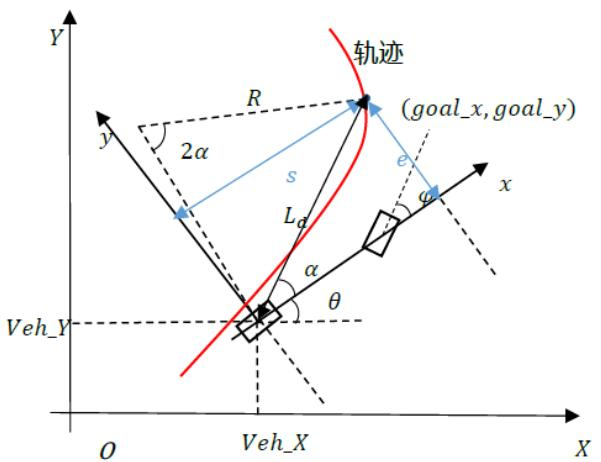

<details>
<summary>text_image</summary>

轨迹
goal_x, goal_y)
R
2α
s
Lα
e
φ
x
α
θ
Veh_Y
O
Veh_X
X
Y
</details>

图5.18 Pure Pursuit算法示意图

由图 5.18 可知，XOY为大地坐标系；xoy为车辆坐标系；(goal\_x, goal\_y)为预瞄点的大地坐标系坐标值；(????ℎ\_??，????h\_Y)为车辆坐标系原点的大地坐标系坐标值。

$$
\left\{ \begin{array}{l} \frac {L d}{\sin (2 \alpha)} = \frac {R}{\sin \left(\frac {\pi}{2} - \alpha\right)} \\ \frac {L d}{2 \sin \alpha \cdot \cos \alpha} = \frac {R}{\cos \alpha} \\ \frac {L d}{\sin \alpha} = 2 R \end{array} \right. \tag {5.37}
$$

由公式（5.36）、（5.37）推导得到前轮转角：

$$
\varphi = \arctan \left(\frac {2 L \sin (\alpha)}{L d}\right) \tag {5.38}
$$

根据坐标系之间的转换关系，得到车辆坐标下的预瞄点坐标：

$$
\left[ \begin{array}{c} g o a l _ {x} \\ g o a l _ {y} \end{array} \right] = \left[ \begin{array}{c c} \cos \theta & - \sin \theta \\ \sin \theta & \cos \theta \end{array} \right] \cdot \left[ \begin{array}{c} g o a l _ {\mathrm{X}} - V e h _ {X} \\ g o a l _ {\mathrm{Y}} - V e h _ {\mathrm{Y}} \end{array} \right] \tag {5.39}
$$

其中，??为车辆航向角。可以得到公式：

$$
\sin \alpha = \frac {\text { goal } _ {y}}{\sqrt {(\text { goal } _ {x}) ^ {2} + (\text { goal } _ {y}) ^ {2}}} \tag {5.40}
$$

其中，????????\_??为车辆当前位置和预瞄点之间的横向偏差，使用??表示；????????\_??为车辆当前位置和预瞄点之间的纵向偏差，使用??表示[59]，如图5.12所示。则前轮转角可以表述为：

$$
\varphi = \arctan \left(\frac {2 L e}{\sqrt {e ^ {2} + s ^ {2}}}\right) \tag {5.41}
$$

本文中自车的车速较低，设定预瞄距离设为 1m。

# 5.5 仿真实验分析

本节将在多种工况下对本文提出的轨迹规划与控制算法进行仿真实验，以验证其在复杂道路环境中的有效性与适应性。实验在 Intel i5-9300H 处理器、16GB RAM、Ubuntu 20.04 操作系统的硬件平台上运行，仿真平台基于 ROS（Robot Operating System）与Gazebo仿真环境构建。

ROS 是一种模块化的开源机器人操作系统，具备良好的通信机制与系统集成能力，可实现传感器数据处理、状态估计、路径规划和运动控制等功能模块之间的高效协同。Gazebo 是一款高保真物理仿真平台，支持复杂环境建模、物理交互模拟以及与ROS 的无缝集成，常用于验证机器人系统在虚拟环境中的行为表现。

在本研究中，Gazebo 用于构建城市狭窄道路场景，包括动态行人、静态障碍物和非结构化道路模型，同时实现车辆与环境之间的物理交互。ROS 则承担各功能模块的数据流调度与通信任务，实现车辆感知、轨迹规划与控制算法的集成与验证。通过该仿真平台，本文算法能够在接近真实道路工况下进行全面测试与评估，确保其实用性与可靠性。

仿真实验基于真实城市狭窄道路场景进行采集，主要包括窄道直行与窄道转弯两类典型道路工况，以考察所提方法在不同复杂场景下的适用性。为了进一步验证时空联合规划算法在动态环境下的优势，实验在窄道直行工况中加入动态障碍物，具体测试如下：

（1）动态行人绕行测试：在窄道直行工况中设置一侧动态行人，考察所提算法在狭窄道路场景中的动态避障能力。  
（2）行人阻挡测试：在前述场景基础上，增加行人缓慢行进并阻挡智能车前进路径的情况，评估所提算法在受限环境下的规划灵活性及行驶策略调整能力。

为全面评估时空联合规划算法的性能，本文选取了当前主流的轨迹规划算法Apollo[60]的 EM Planner 作为对比基准。EM Planner 采用横纵向解耦策略，通过分别求解横纵向优化问题，将横纵向最优解合并得到时空轨迹，不断交替迭代求解输出连续的轨迹[61,62]。

为了定量分析不同规划方法的性能，本实验分别对比时空联合规划算法与 EMPlanner在不同工况下的轨迹优化效果。主要评价指标包括：

a.路径合理性：对比规划轨迹的平滑性、可行性以及避障能力。  
b.速度控制：分析不同算法在动态避障过程中速度调整的稳定性和连续性。  
c.加速度优化：评估加速度变化幅度，以衡量行驶过程的舒适性和安全性。

如图5.19(a)所示，在狭窄道路环境下，当动态行人突然进入车辆规划路径时，采用 Apollo 方法的车辆会立即减速并最终停车。这是由于 Apollo 方法采用了轨迹与速度分别独立优化的时空解耦策略，路径一旦规划完成便较难实时调整，仅能通过速度控制以确保安全。尽管停车保障了安全性，但车辆的连续行驶状态频繁中断，在城市狭窄道路环境中尤其明显，导致车辆整体行驶效率降低[63]。

如图5.19(b)所示，在同样的狭窄道路场景中，动态行人侵入规划路径时，本文提出的时空联合规划方法则能灵活应对。该方法通过时空螺旋参数化（B 样条时空轨迹），实时协调横向位置与纵向速度，使车辆能同时实现轨迹和速度的动态调整。具体表现为车辆能够主动预判行人位置变化，微调轨迹并平滑减速，流畅地绕行动态障碍物，避免停车等待，显著提高了动态环境下的行驶稳定性与连续性。

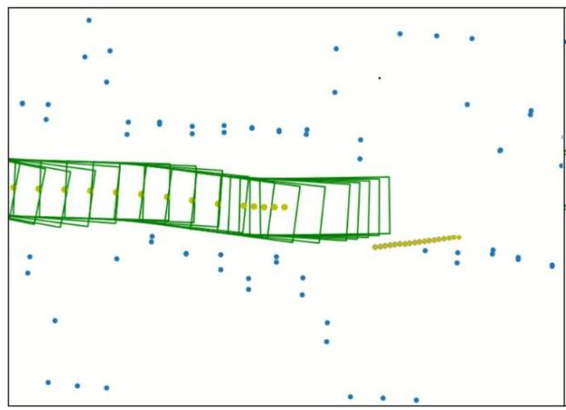

<details>
<summary>natural_image</summary>

Diagram of a green structural frame with scattered blue dots and yellow dots, no text or symbols present
</details>

(a)Apollo时空解耦规划

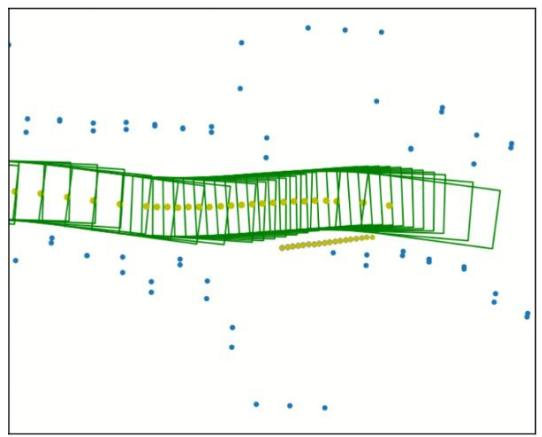

<details>
<summary>natural_image</summary>

Abstract diagram with green and yellow lines forming a curved structure surrounded by scattered blue dots (no text or symbols)
</details>

(b) 时空联合规划   
图5.19Apollo和时空联合规划方法在动态行人侵入车道工况下的避障表现

如图 5.20 所示，时空联合规划方法在绕行动态行人时的速度与加速度曲线体现出良好的平顺性。从速度曲线看，车辆在靠近行人前能够提前做出反应，以连续平缓的方式降低速度，待绕行障碍后又逐渐恢复至巡航状态。同时，加速度曲线波动幅度较小且变化平稳，没有剧烈加减速过程。这说明时空联合规划方法能够有效协调路径与速度，保障了动态绕行过程中的行驶舒适性与稳定性。

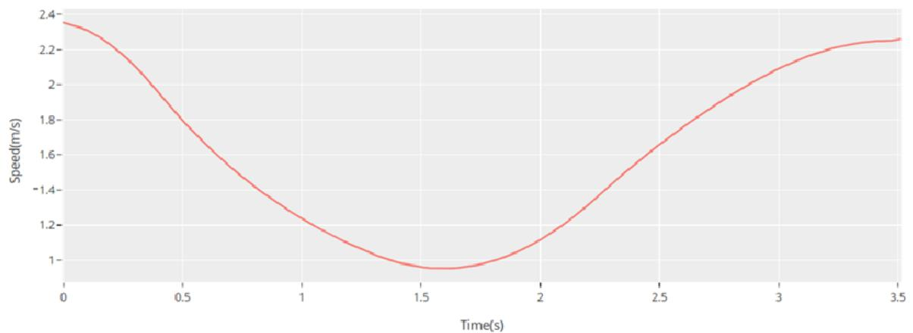

<details>
<summary>line</summary>

| Time(s) | Speed(m/s) |
| ------- | ---------- |
| 0.0     | 2.4        |
| 0.5     | 1.8        |
| 1.0     | 1.2        |
| 1.5     | 0.9        |
| 2.0     | 1.2        |
| 2.5     | 1.6        |
| 3.0     | 2.0        |
| 3.5     | 2.3        |
</details>

(a) 速度时间曲线

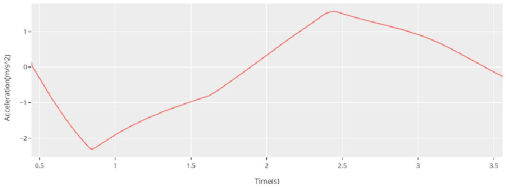

<details>
<summary>line</summary>

| Time(s) | Acceleration(m/s^2) |
| ------- | ------------------- |
| 0.5     | 0.0                 |
| 0.75    | -2.2                |
| 1.0     | -1.8                |
| 1.5     | -1.0                |
| 2.0     | 0.5                 |
| 2.5     | 1.5                 |
| 3.0     | 1.0                 |
| 3.5     | 0.0                 |
</details>

(b) 加速度时间曲线  
图5.20 时空联合规划方法在动态行人绕行时的速度、加速度曲线

如图 5.21 所示，当动态行人在窄道内以缓慢速度持续阻挡车辆前进路径时，采用 Apollo 方法的车辆则会被迫停止。这是因为 Apollo 的时空解耦架构下，路径规划相对固定，难以迅速响应障碍物持续占据路径的情况，只能依靠速度规划模块强制停车。虽然能避免碰撞，但该策略缺乏应对缓慢移动障碍物的灵活性，导致车辆长时间等待，降低了实际应用中的通行效率和乘坐舒适性。

如图 5.22 所示，在面对持续缓慢前进并占据车辆路径的动态行人时，本文提出的时空联合规划方法则能够主动实现跟随驾驶行为。这是由于时空联合规划同时优化路径和速度，在实时轨迹重规划时可主动适应行人运动节奏。车辆通过动态调整轨迹位置和实时平滑降低速度，保持适当安全距离持续跟随行人行进，避免完全停车。与Apollo 方法相比，这种策略有效提高了通行效率和驾驶平顺性，更适合动态复杂环境下的实际应用。

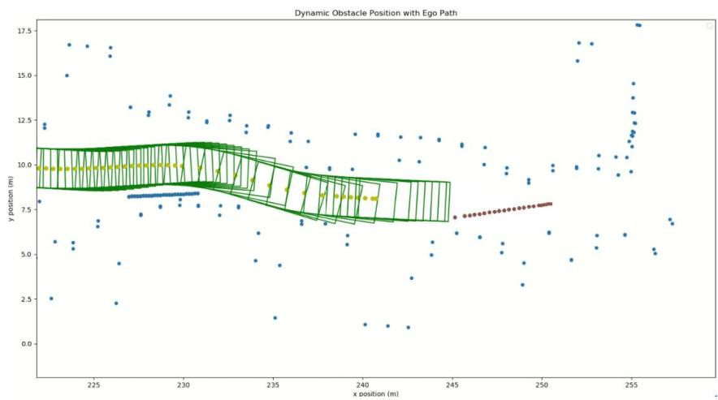

<details>
<summary>scatter</summary>

| x position (m) | y position (m) |
| -------------- | -------------- |
| 225            | 10.0           |
| 230            | 10.0           |
| 235            | 8.0            |
| 240            | 8.0            |
| 245            | 7.5            |
| 250            | 7.5            |
| 255            | 7.5            |
</details>

图5.21Apollo规划方法在车道上行人缓慢前行的避障表现

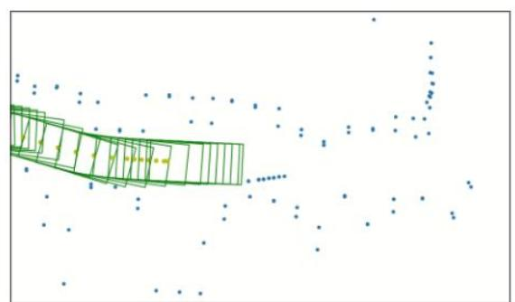

<details>
<summary>natural_image</summary>

Abstract diagram with green grid lines and scattered blue dots, no text or symbols present
</details>

T=2.5s

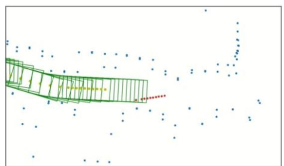

<details>
<summary>natural_image</summary>

Diagram showing a green structural beam with yellow centerline and red dotted line, surrounded by scattered blue dots (no text or symbols)
</details>

T=4s

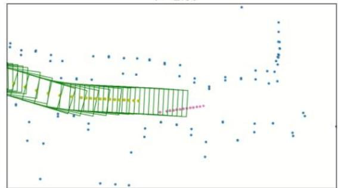

<details>
<summary>text_image</summary>

Diagram showing a green grid structure with yellow and pink lines, surrounded by scattered blue dots, likely representing a physical or mathematical model.
</details>

T=5.5s

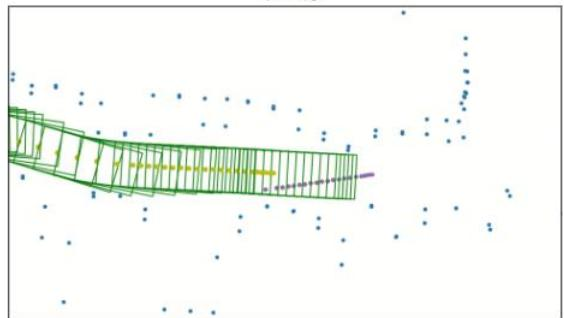

<details>
<summary>natural_image</summary>

Diagram of a green structural beam with yellow centerline and purple load, surrounded by scattered blue dots (no text or labels)
</details>

图5.22 时空联合规划方法在车道上行人缓慢前行的避障表现

如图 5.23 所示，时空联合规划方法在跟随缓慢移动行人时，所生成的速度与加速度曲线呈现出明显的平稳过渡特征。从速度曲线上看，车辆根据前方行人速度平缓地逐渐降低自身速度直至完全停止。加速度曲线则表现为多个细致的、小幅度减速过程，波动幅度较小且平稳连续。这种缓和的减速方式显著提升了车辆的驾乘舒适性和轨迹规划稳定性，充分体现出时空联合规划方法在复杂动态场景中的优势。

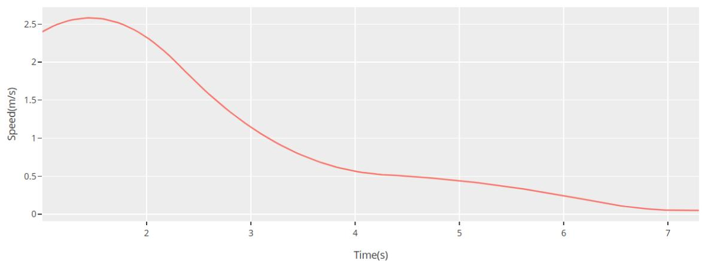

<details>
<summary>line</summary>

| Time(s) | Speed(m/s) |
| ------- | ---------- |
| 0       | 2.4        |
| 1       | 2.5        |
| 2       | 2.3        |
| 3       | 1.2        |
| 4       | 0.6        |
| 5       | 0.5        |
| 6       | 0.3        |
| 7       | 0.1        |
</details>

(a) 速度时间曲线

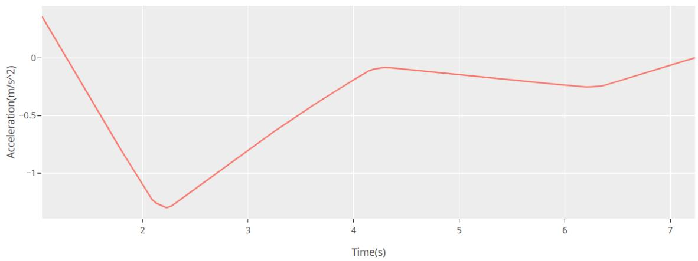

<details>
<summary>line</summary>

| Time(s) | Acceleration(m/s^2) |
| ------- | ------------------- |
| 0       | 0.5                 |
| 2       | -1.2                |
| 3       | -0.8                |
| 4       | -0.1                |
| 5       | -0.2                |
| 6       | -0.3                |
| 7       | 0.0                 |
</details>

(b) 加速度时间曲线  
图5.23 时空联合规划方法在跟随动态行人时的速度、加速度曲线

# 5.6 本章小节

本章首先采用 Hybrid A\*算法进行全局路径规划，但其生成的轨迹存在不平滑、转弯过度内切及潜在碰撞风险。为优化路径质量，本文构建了基于轨迹拟合、平滑与避障约束的优化模型，提升路径的可行性和执行稳定性。为提升路径质量和可行性，本文构建了基于轨迹拟合、平滑处理与避障约束的优化模型，对 Hybrid A 生成的路径进行优化，以改善路径连续性、降低局部曲率突变，并确保车辆在执行过程中具备更好的稳定性和安全性。

在优化后的全局路径基础上，进一步结合时空联合规划进行局部路径优化，使车辆能够在动态、拥挤环境中实现精准避障与高效交互。该方法通过综合考虑障碍物运动状态和车辆轨迹约束，动态调整局部路径，有效减少了传统方法中因避障导致的频繁停车问题，从而提升了驾驶流畅性。

在路径执行阶段，采用 Pure Pursuit 路径跟踪算法，确保车辆平稳跟踪优化后的轨迹，提升路径执行的稳定性与精准度。

仿真实验结果表明，本文方法能够生成平滑、安全的全局路径，提高复杂环境下的避障能力，特别是在狭窄道路、动态障碍物密集区域等挑战性场景下，该方法展现出优越的路径规划与执行性能，为自动驾驶系统在复杂环境中的稳定运行提供了有力支撑。

# 6 总结与展望

# 6.1 总结

本文针对城市狭窄道路环境下自动驾驶系统在行人交互、路径规划及避障控制方面的挑战，提出了一种融合行人预测、安全走廊生成、路径优化及跟踪控制的完整解决方案，以提升自动驾驶系统在复杂、拥挤环境下的稳定性与安全性。

针对高密度动态行人流场景，本文基于 DUT 数据集分析人车交互特性，并提出多区域社会力模型，细化车辆周边交互区域，准确预测行人轨迹，提高车辆对行人行为的理解能力，为后续路径规划提供可靠输入。

在路径规划方面，本文采用 Hybrid A\*算法进行全局路径搜索，并针对其路径不平滑、转弯过度内切等问题，构建了基于轨迹拟合、平滑及避障约束的优化方法，显著提升了路径的可行性与执行稳定性。本文提出基于球体翻转法的安全走廊生成算法，能够高效构建安全可通行区域，并结合时空联合规划进行局部路径优化，实现车辆对静态障碍物的精准避障及动态行人交互，有效减少传统方法中的频繁停车现象，提高行驶流畅性。

最后，在路径跟踪阶段，本文采用 Pure Pursuit 算法进行轨迹跟踪，确保优化路径的执行稳定性。仿真实验表明，本文方法能够有效提高车辆在狭窄、动态环境下的安全性与适应性，为自动驾驶技术在城市狭窄道路场景中的应用提供了技术支撑。

# 6.2 展望

尽管本文在行人预测、路径规划及避障控制方面取得了一定进展，但仍存在进一步优化的空间，主要包括以下几个方面：

# （1）行人行为预测的优化

本文基于多区域社会力模型进行行人轨迹预测，但受限于数据集的多样性，模型的泛化能力仍有提升空间。未来可通过引入更丰富、复杂的行人轨迹数据集，结合深度学习方法优化轨迹预测模型，以提升预测精度和适应性。

# （2）路径规划的实时性与动态适应性提升

目前采用 Hybrid A\*与时空联合规划相结合的方法进行路径规划，但该方法对计算资源要求较高，在中高速及高动态环境下的实时性存在一定局限。未来可通过优化计算流程、并行计算策略及算法结构，降低计算开销，提高路径规划的实时性，使其

更适用于复杂动态环境。

# （3）路径跟踪的鲁棒性增强

受限于计算资源，本文采用 Pure Pursuit 算法进行路径跟踪。然而，在急弯等极端场景下，该方法的跟踪误差可能增大，影响系统的稳定性。未来可引入模型预测控制（MPC），以增强路径跟踪的精度与鲁棒性，使自动驾驶系统能够在更复杂的环境中保持高效稳定的轨迹跟踪能力。

综上，未来研究可在行人预测、路径规划优化及路径跟踪控制方面进一步提升算法性能，以增强自动驾驶系统在复杂动态环境下的适应性、实时性与安全性。

# 参考文献

[1] 中华人民共和国统计局.中国统计年鉴中华人民共和国道路交通事故统计年报(2013 年度)[M].北京：中国统计出版社,2014.  
[2] Cosgun A, Ma L, Chiu J, et al. Towards full automated drive in urban environments: A d emonstration in gomentum station, california[C]//2017 IEEE Intelligent Vehicles Symposium (IV). IEEE, 2017: 1811-1818.   
[3] Khan M A. Intelligent environment enabling autonomous driving[J]. Ieee Access, 2021, 9: 32997-33017.   
[4] Pohan M A R, Utama J. Enhancing Passenger Comfort and Safeness in the Local Path Pla nning Strategy for Autonomous Road Vehicles Operating in New Capital City of Indonesia [C]//2023 9th International Conference on Signal Processing and Intelligent Systems (ICSPI S). IEEE, 2023: 1-5.   
[5] Li Z, Lu C, Yi Y, et al. A hierarchical framework for interactive behaviour prediction of h eterogeneous traffic participants based on graph neural network[J]. IEEE Transactions on In telligent Transportation Systems, 2021, 23(7): 9102-9114.   
[6] Helbing D, Molnar P. Social force model for pedestrian dynamics[J]. Physical review E, 19 95, 51(5): 4282.   
[7] Keller C G, Gavrila D M. Will the pedestrian cross? a study on pedestrian path prediction [J]. IEEE Transactions on Intelligent Transportation Systems, 2013, 15(2): 494-506.   
[8] Morris B T, Trivedi M M. Trajectory learning for activity understanding: Unsupervised, mu ltilevel, and long-term adaptive approach[J]. IEEE transactions on pattern analysis and mach ine intelligence, 2011, 33(11): 2287-2301.   
[9] Kitani K M, Huang D A, Ma W C. Activity forecasting: An invitation to predictive perce ption[M]//Group and Crowd Behavior for Computer Vision. Academic Press, 2017: 273-294.   
[10] Williams R J, Zipser D. A learning algorithm for continually running fully recurrent neural networks[J]. Neural computation, 1989, 1(2): 270-280.   
[11] Kumar J, Goomer R, Singh A K. Long short term memory recurrent neural network (LST M-RNN) based workload forecasting model for cloud datacenters[J]. Procedia computer scie nce, 2018, 125: 676-682.   
[12] Peng Y, Zhang G, Shi J, et al. SRAI-LSTM: A social relation attention-based interaction-a ware LSTM for human trajectory prediction[J]. Neurocomputing, 2022, 490: 258-268.   
[13] Alahi A, Ramanathan V, Fei-Fei L. Socially-aware large-scale crowd forecasting[C]//Proceed ings of the IEEE Conference on Computer Vision and Pattern Recognition. 2014: 2203-221 0.   
[14] Alahi A, Goel K, Ramanathan V, et al. Social lstm: Human trajectory prediction in crowde d spaces[C]//Proceedings of the IEEE conference on computer vision and pattern recognitio n. 2016: 961-971.   
[15] Sadeghian A, Kosaraju V, Sadeghian A, et al. Sophie: An attentive gan for predicting path s compliant to social and physical constraints[C]//Proceedings of the IEEE/CVF conference

on computer vision and pattern recognition. 2019: 1349-1358.   
[16] 文琼. 基于 RRT 的无人驾驶车辆路径规划方法研究[D]. 东北大学, 2019.  
[17] 谭丽敏. 无人驾驶车辆路径规划方法研究[D]. 兰州交通大学, 2021.  
[18] Bohren J, Foote T, Keller J, et al. Little ben: The ben franklin racing team's entry in the 2007 DARPA urban challenge[J]. Journal of Field Robotics, 2008, 25(9): 598-614.   
[19] Yang I, Kim H J, Jeon W H, et al. Development of realistic shortest path algorithm consi dering lane changes[J]. Journal of advanced transportation, 2016, 50(4): 541-551.   
[20] Karaman S, Frazzoli E. Sampling-based algorithms for optimal motion planning[J]. The inte rnational journal of robotics research, 2011, 30(7): 846-894.   
[21] Karaman S, Frazzoli E. Optimal kinodynamic motion planning using incremental sampling-b ased methods[C]//49th IEEE conference on decision and control (CDC). IEEE, 2010: 7681- 7687.   
[22] Dolgov D, Thrun S, Montemerlo M, et al. Practical search techniques in path planning for autonomous driving[J]. ann arbor, 2008, 1001(48105): 18-80.   
[23] Kurzer K. Path planning in unstructured environments: A real-time hybrid a\* implementatio n for fast and deterministic path generation for the kth research concept vehicle[J]. 2016.   
[24] Montremerlo M, Beeker J, Bhat S, et al. The stanford entry in the urban challenge[J]. Jour nal of Field Robotics, 2008, 7(9): 468-492.   
[25] Nelson W. Continuous-curvature paths for autonomous vehicles[C]//Proceedings, 1989 Intern ational Conference on Robotics and Automation. IEEE, 1989: 1260-1264.   
[26] 马川. 智能车辆轨迹规划和控制算法研究[D]. 山东理工大学, 2013.  
[27] Luo Y, Xiang Y, Cao K, et al. A dynamic automated lane change maneuver based on vehi cle-to-vehicle communication[J]. Transportation Research Part C: Emerging Technologies, 20 16, 62: 87-102.   
[28] 陈成, 何玉庆, 卜春光, 等. 基于四阶贝塞尔曲线的无人车可行轨迹规划[J]. 自动化学报, 2015, 41(3): 486-496.  
[29] Wang J, Wang Y, Zhang D, et al. Learning hierarchical behavior and motion planning for autonomous driving[C]//2020 IEEE/RSJ International Conference on Intelligent Robots and Systems (IROS). IEEE, 2020: 2235-2242.   
[30] Wang J, Chi W, Li C, et al. Neural RRT\*: Learning-based optimal path planning[J]. IEEE Transactions on Automation Science and Engineering, 2020, 17(4): 1748-1758.   
[31] Chen L, Hu X, Tang B, et al. Conditional DQN-based motion planning with fuzzy logic f or autonomous driving[J]. IEEE Transactions on Intelligent Transportation Systems, 2020, 2 3(4): 2966-2977.   
[32] 刘珏. 基于逆强化学习的舰载机牵引车路径规划研究[D]. 哈尔滨: 哈尔滨工程大学, 2017.  
[33] 姚君延. 基于深度增强学习的路径规划算法研究[D]. 成都: 电子科技大学, 2018.  
[34] 许宏鑫, 吴志周, 梁韵逸. 基于强化学习的自动驾驶汽车 路径规划方法研究综述[J]. Application Research of Computers/Jisuanji Yingyong Yanjiu, 2023, 40(11).  
[35] Yu X, Wang Y, Tran T T M, et al. Robots in the Wild: Contextually-Adaptive Human-Rob ot Interactions in Urban Public Environments[C]//Proceedings of the 35th Australian Compu ter-Human Interaction Conference. 2023: 701-705.   
[36] Huang A S, Antone M, Olson E, et al. A high-rate, heterogeneous data set from the darpa

urban challenge[J]. The International Journal of Robotics Research, 2010, 29(13): 1595-16 01.   
[37] Zhong X, Wu Y, Wang D, et al. Generating large convex polytopes directly on point cloud s[J]. arXiv preprint arXiv:2010.08744, 2020.   
[38] Liu S, Watterson M, Mohta K, et al. Planning dynamically feasible trajectories for quadrot ors using safe flight corridors in 3-d complex environments[J]. IEEE Robotics and Automat ion Letters, 2017, 2(3): 1688-1695.   
[39] Hemmat M A A, Liu Z, Zhang Y. Real-time path planning and following for nonholonomi c unmanned ground vehicles[C]//2017 International Conference on Advanced Mechatronic S ystems (ICAMechS). IEEE, 2017: 202-207.   
[40] Montremerlo M, Beeker J, Bhat S, et al. The stanford entry in the urban challenge[J]. Jour nal of Field Robotics, 2008, 7(9): 468-492.   
[41] Kammel S, Ziegler J, Pitzer B, et al. Team AnnieWAY's autonomous system for the 2007 DARPA Urban Challenge[J]. Journal of Field Robotics, 2008, 25(9): 615-639.   
[42] Zhang Z, Wang C, Zhao W, et al. Path–Speed Decoupling Planning Method Based on Risk Cooperative Game for Intelligent Vehicles[J]. IEEE Transactions on Transportation Electrifi cation, 2023, 10(2): 3792-3806.   
[43] Liu Y, Li J, Zhang H, et al. Gradient-Optimized B-spline Trajectory Planning for Unmanne d Platforms[C]//2024 36th Chinese Control and Decision Conference (CCDC). IEEE, 2024: 3194-3199.   
[44] Ding W, Zhang L, Chen J, et al. Safe trajectory generation for complex urban environment s using spatio-temporal semantic corridor[J]. IEEE Robotics and Automation Letters, 2019, 4(3): 2997-3004.   
[45] Ziegler J, Bender P, Dang T, et al. Trajectory planning for Bertha—A local, continuous me thod[C]//2014 IEEE intelligent vehicles symposium proceedings. IEEE, 2014: 450-457.   
[46] Li J, Xie X, Ma H, et al. Speed planning using bezier polynomials with trapezoidal corrid ors[J]. arXiv preprint arXiv:2104.11655, 2021.   
[47] Pellegrini S, Ess A, Schindler K, et al. You'll never walk alone: Modeling social behavior for multi-target tracking[C]//2009 IEEE 12th international conference on computer vision. IE EE, 2009: 261-268.   
[48] Lerner A, Chrysanthou Y, Lischinski D. Crowds by example[C]//Computer graphics forum. Oxford, UK: Blackwell Publishing Ltd, 2007, 26(3): 655-664.   
[49] Rasouli A, Kotseruba I, Tsotsos J K. Agreeing to cross: How drivers and pedestrians com municate[C]//2017 IEEE Intelligent Vehicles Symposium (IV). IEEE, 2017: 264-269.   
[50] Yang D, Li L, Redmill K, et al. Top-view trajectories: A pedestrian dataset of vehicle-crow d interaction from controlled experiments and crowded campus[C]//2019 IEEE Intelligent Ve hicles Symposium (IV). IEEE, 2019: 899-904.   
[51] Zeng W, Chen P, Yu G, et al. Specification and calibration of a microscopic model for pe destrian dynamic simulation at signalized intersections: A hybrid approach[J]. Transportation Research Part C: Emerging Technologies, 2017, 80: 37-70.   
[52] Liu S, Watterson M, Mohta K, et al. Planning dynamically feasible trajectories for quadrot ors using safe flight corridors in 3-d complex environments[J]. IEEE Robotics and Automat

ion Letters, 2017, 2(3): 1688-1695.   
[53] Gao F, Wu W, Lin Y, et al. Online safe trajectory generation for quadrotors using fast mar ching method and bernstein basis polynomial[C]//2018 IEEE International Conference on Ro botics and Automation (ICRA). IEEE, 2018: 344-351.   
[54] Akiba T, Sano S, Yanase T, et al. Optuna: A next-generation hyperparameter optimization f ramework[C]//Proceedings of the 25th ACM SIGKDD international conference on knowledg e discovery & data mining. 2019: 2623-2631.   
[55] Malyuta D, Reynolds T P, Szmuk M, et al. Convex optimization for trajectory generation: A tutorial on generating dynamically feasible trajectories reliably and efficiently[J]. IEEE C ontrol Systems Magazine, 2022, 42(5): 40-113.   
[56] Stellato B, Banjac G, Goulart P, et al. OSQP: An operator splitting solver for quadratic pr ograms[J]. Mathematical Programming Computation, 2020, 12(4): 637-672.   
[57] Banjac G, Stellato B, Moehle N, et al. Embedded code generation using the OSQP solver [C]//2017 IEEE 56th Annual Conference on Decision and Control (CDC). IEEE, 2017: 190 6-1911.   
[58] Stellato B, Naik V V, Bemporad A, et al. Embedded mixed-integer quadratic optimization using the OSQP solver[C]//2018 European Control Conference (ECC). IEEE, 2018: 1536-15 41.   
[59] 施友宁.锥桶环境下的智能车辆感知与路径规划控制[D].重庆理工大学,2022.DOI:10.27753/d.cnki.gcqgx.2022.000489.  
[60] Fan H, Zhu F, Liu C, et al. Baidu apollo em motion planner[J]. arXiv preprint arXiv:1807. 08048, 2018.   
[61] Kessler T, Esterle K, Knoll A. Mixed-integer motion planning on German roads within the Apollo driving stack[J]. IEEE Transactions on Intelligent Vehicles, 2022, 8(1): 851-867.   
[62] Ivanov D, Panov A I. Application of reinforcement learning in open space planner for apol lo auto[C]//Proceedings of the Fifth International Scientific Conference “Intelligent Informati on Technologies for Industry”(IITI’21). Springer International Publishing, 2022: 35-43.   
[63] Li Y, Chen Z, Wang T, et al. Apollo: Adaptive polar lattice-based local obstacle avoidance and motion planning for automated vehicles[J]. Sensors, 2023, 23(4): 1813.