ORIGINAL RESEARCH OPEN ACCESS

# Safety-Critical Kinematically-Executable Overtake Planning via Contingency Path-Speed Iterative Algorithm for Automated Valet Parking\*

Wei Han1,2 Bo Leng1,2 Peizhi Zhang1,2 Lu Xiong1, 1.2

1 School of Automotive Studies, Tongji University, Shanghai, China 2Clean Energy Automotive Engineering Center, Tongji University, Shanghai, China

Correspondence: Wei Han (tjhanwei@foxmail.com) Lu Xiong (xiong\_lu@tongji.edu.cn)

Received: 27 January 2025 Revised: 25 November 2025 Accepted: 23 December 2025

# ABSTRACT

Autonomous driving has emerged as a highly topical subject within the realm of intelligent transportation systems. Automated valet parking (AVP) represents one of the initial mass-production application scenarios. However, motion planning in AVP confronts a series of formidable challenges. These challenges include a constricted movement space, vehicles parked in violation of regulations, and vehicles that intrude suddenly. In response to these issues, this article devises a safety-critical, kinematically executable overtaking planning system for AVP through a contingency path-speed iterative algorithm. A path-speed iterative optimisation framework is adopted, taking into full account both the curvature constraint and the contour constraint. The prediction probability of dynamic obstacles is incorporated into the quadratic optimisation problem, presented in the form of either soft or hard constraints. Furthermore, a contingency path-speed iterative planner is formulated to address the multi-modal predictions and the interframe probability transfer that occur during the overtaking process in parking lots. Numerical simulations (conducted on the Carla simulator with a 10 Hz planning cycle) across four complex AVP scenarios demonstrate that the proposed algorithm outperforms the baseline Baidu Apollo EM Planner. On-road experiments (deployed on a mass-produced MCU) further validate that the algorithm maintains real-time performance (average computation time < 10 ms) and reduces speed oscillation by over 50% compared to the baseline, while ensuring kinematically executable trajectories (max steering wheel angle limited to 389◦). These results confirm the proposed algorithm significantly enhances overtaking safety, executability, and efficiency for AVP.

# 1 Introduction

The development of autonomous driving (AD), especially in the context of enhancing safety in connected automated vehicles (CAVs) for mixed traffic environments, holds immeasurable significance. In such complex traffic scenarios, the safety-enhancing features of CAVs play a pivotal role. By leveraging advanced sensors, communication technologies, and intelligent algorithms, these vehicles can significantly reduce the likelihood of humanerror-related traffic accidents. Moreover, the benefits of AD extend far beyond safety. The improved decision-making ability of CAVs in mixed traffic can lead to a substantial boost in traffic efficiency. The progress of AD technology, especially in CAVs, helps to reduce energy consumption. AD will bring people a more convenient and comfortable travel experience. This technological innovation promotes the transformation and upgrading of the entire transportation industry, having a profound and far-reaching impact on the development of the social economy.

Automated valet parking (AVP) is one of the first scenarios where AD is implemented, but there are still many challenges in decision-making and planning. Vehicle driving trajectories in parking lots are highly irregular. Different vehicle models have distinct turning radii and speeds, and manoeuvres like frequent lane changes and yielding occur frequently. At the same time, various unexpected situations emerge in an endless stream, such as suddenly intruding vehicles, illegally parked vehicles, and narrow movement space. Facing these complex situations, the AVP system needs to comprehensively consider numerous factors and make reasonable decisions within an extremely short time to plan a safe and executable driving trajectory.

To handle the above challenges that existed in motion planning, some researchers proposed feasible solutions. Finding the optimal trajectory is essentially a 3D constrained optimisation problem. There are typically two types of methods: the direct 3D optimisation algorithm and the path-speed decoupling algorithm. Direct methods [1–4] find the optimal solution within 3D space using sampling, search or nonlinear optimisation, which are limited by their complexity and feasibility. The safe area during the lane-changing process was identified by Delaunay triangulation, the driving risks were evaluated in both lateral and longitudinal directions, and TOPSIS was utilised to solve the multi-objective optimisation problem [5, 6]. In the optimisation problem defined by MPC, the safety constraints were defined using the sigmoid function, and the decision-making constraints were introduced in a mixed integer formulation-like manner [7]. To handle the safety lateral motion, the past data of obstacle motion was leveraged to construct a future occupancy set with probabilistic guarantees, and then the robust collision avoidance constraints were formulated with respect to such an occupancy set using convex programming duality [8]. For simultaneously enforcing safety and minimising intrusion onto the adjacent lane, an MPC framework was proposed to realise following a leading vehicle, overtaking a slower-moving leading vehicle and aborting the overtaking, enabling the autonomous vehicles to merge back into the lane if safety was compromised [9]. Conversely, the path-speed decoupling algorithm [10, 11] finds the optimal solution of path and speed separately. Baidu Apollo proposed EM Motion Planner [12, 13], a path-speed iterative algorithm, achieving more flexibility in both path and speed optimisation, so widely applied in industry. While EM Planner is scalable to highway and urban driving scenarios, it needs to be improved to adapt to the lower-speed parking lots. The iterative strategy of EM Planner can help to address dynamic obstacles under the path-speed decoupling framework; however, the multi-modal prediction of dynamic obstacles is not handled effectively, and the prediction uncertainty of dynamic obstacles is lost during the iterative process. This information loss can lead to the stress response of the motion planning system when faced with the sudden change of obstacle behaviours. The authors also investigated the decoupled planning framework and design the lateral optimisation planner and longitudinal optimisation planner [14, 15]. Based on this planning framework, the authors developed furthermore a decision-making approach based on safe reinforcement learning [16]. The behavioural cloning method and data augmentation method were utilised to learn the expert’s corrective driving behaviour [17]. AVP path planning was divided into the guided layer and the planning layer so as to make the hybrid A\* and optimization algorithm more applicable in a complex parking environment [18]. In order to handle the narrow parking scenarios, a multi-manoeuvre vertical parking trajectory planning and control strategy was presented based on a predefined geometric set [19]. The above studies focus on safe and efficient motion planning, while ignoring the kinematic constraints in parking lots, which may lead to a non-executable planned trajectory.

Overtaking manoeuvres are a crucial aspect of two-lane roads, to enable faster vehicles to overtake slower ones safely. Overtaking planning of autonomous vehicles in parking lots has lots of difficulties, such as high prediction uncertainties of low-speed dynamic vehicles, narrow overtaking space, short overtaking distance, etc. The overtaking trajectory, including the overtaking time, distance, abreast position, initial speed and final speed, was recorded through a field experiment, and six different kinematic models were calibrated [20]. Faced with the time-varying and uncertain dynamic behaviour of a vehicle, a vectorised implementation of multivariate Gaussian process regression (MGPR) was applied to learn the unmodelled dynamics [21]. On twolane country roads with dynamic oncoming traffic, an MPC-based switching control approach was utilised to allow the vehicle to operate in different modes corresponding to different high-level decisions [22]. To deal with the vehicle dynamics’ description with rough simplification, an optimisation of overtaking decision-making strategy was proposed based on quantified speed advantage considering surrounding vehicles’ changes in both speed and acceleration [23]. The current solutions to autonomous overtaking are limited to simple and static scenarios and have no capacity to deal with the multi-modal predictions of dynamic obstacles.

Contingency planning technique scan improve the performance of planners by introducing the motion uncertainty of dynamic obstacles into the planner. The contingency model predictive control (CMPC) was designed to prevent the potential emergencies. The experimental comparison showed that CMPC prepared for the potential loss of friction through a left-hand turn which may be covered by ice [24]. A conditional autoregressive flow model was used to create a compact contingency planning space. This model can tractably learn contingencies from behavioural observations [25]. A hierarchical contingency planning framework was proposed for safer driving in a stochastic and partially observable environment [26]. The contingency planning method was also integrated into a multi-policy decision-making framework [27]. The above studies make an emphasis on the multi-modal predictions of dynamic obstacles, while ignoring the accumulated effect during the interframe transfer of the prediction uncertainty.

In order to handle these challenges, a contingency path-speed iterative algorithm is proposed in this article. Superior to EM Planner, the proposed contingency framework was developed to be applied for lower-speed cruising of AVP. The contribution includes the following points:

i. The curvature constraint and contour constraint during the overtaking process should be emphasised. We converted the constraint expression from the Cartesian Coordinate to the Frenet frame and introduced the curvature-related and contour-related constraints into the path-speed iterative algorithm framework.

ii. The high prediction uncertainty of dynamic obstacles under parking lots leads to a large challenge for safe overtaking manoeuvre. In this article, the foremost portion of one’s multi-modal prediction was used to generate the path boundary. The prediction probability of multi-modal trajectory was introduced into the objective function of path optimisation.   
iii. The high stochasticity of low-speed motion has a bad impact on the interframe continuity of planning trajectory. In order to alleviate this problem, the correlation of interframe stochasticity was established, and the historical trajectory was introduced into the optimisation objectives under certain conditions.

The remainder of this paper is organised as follows. Section 2 introduces the problem description in parking lots. In Section 3, the contingency path-speed iterative algorithm framework is presented. Section 4 and Section 5 detail the design of the path optimisation and speed optimisation, respectively. In Section and Section 7, numerical simulations and on-road experiments are conducted, respectively. Finally, Section 8 concludes this paper.

# 2 Problem Description in Parking Lots

The Ackermann steering vehicle kinematics is assumed in this work. Generally, the configuration of an Ackermann steering vehicle with differential constraints includes four dimensions (??, ??, ??, ??). Two dimensions (x, y) are used to specify the coordinates of the centre of the rear axle of the vehicle. One dimension (heading, denoted as ??) is used to specify the vehicle’s heading direction in the map frame. One dimension (curvature, denoted as ??) is used to specify the curvature of the circle resulting from the Ackermann steering. The four-dimensional configuration space provides an accurate pose description to support the algorithm design of the motion planning system.

The goal of motion planning is to find a sequence of states $( x , y , \theta , \kappa )$ within the configuration space, and has a list of challenges for the problem of overtaking a slower-moving leading vehicle in parking lots:

1. The short straight roads lead to a relatively low overtaking success rate. During the overtaking process, the ego vehicle is allowed to exceed the speed limit and then quickly decelerate to the safety speed.   
2. The narrow lateral space limits the feasibility of the planned trajectory. The safety-critical and kinematically executable motion planning is essential.   
3. Due to the higher uncertainty of lower-speed motion, ego vehicle speed is oscillated more sharply.

Furthermore, overtake planning in parking lots satisfies the following requirements:

1. Safety: in parking lots, the overtaking action is only allowed on the long straight road (see Figure 1). Thus, we investigated the proposed algorithm on the long straight road in this arti-

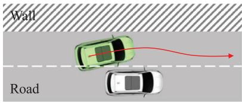

text_image

Wall
Road

FIGURE 1 The contour limitation is safety-critical during overtaking.

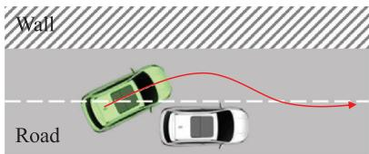

text_image

Wall
Road

FIGURE 2 The curvature limitation is execution-critical during overtaking.

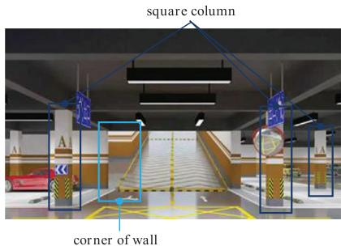

text_image

square column
corner of wall

FIGURE 3 Square columns and corner of wall in parking lots.

cle. The planner should generate a collision-free trajectory. The road space is very narrow in parking lots; the contour of the ego vehicle and surrounding obstacles needs to be modelled more precisely in the planner.

2. Kinematically executable: the overtaking space is limited in parking lots, and the planned trajectory has a large curvature when borrowing a lane (see Figure 2). The planner should generate a physically executable trajectory within the curvature limit of the vehicle.   
3. Comfort: compared to public roads, the perception range is limited due to the occlusion of static obstacles (see Figure 3, for example, square column, corner of wall, blind spot caused by surrounding vehicles or pedestrians, etc.) in parking lots. The planned trajectory is easily disturbed by the step changes of the visibility for static obstacles (see Figure 4) and leads to a discontinuous trajectory generation. Thus, interframe deci-

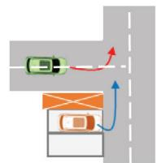

flowchart

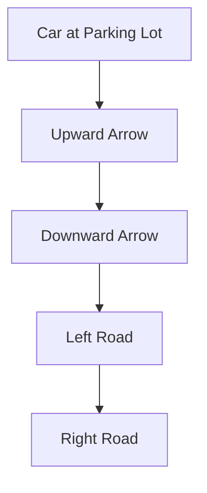
```mermaid
graph TD
    A["Car at Parking Lot"] --> B["Upward Arrow"]
    B --> C["Downward Arrow"]
    C --> D["Left Road"]
    D --> E["Right Road"]
```

(a) Blocked by the corner of wall

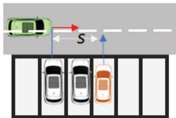

text_image

Diagram showing a car moving on a road with directional arrows and vehicle positions, likely illustrating a traffic or navigation concept.

(b) Blocked by vehicles parked in the parking spaces   
FIGURE 4 Blind spots caused by diverse traffic element.

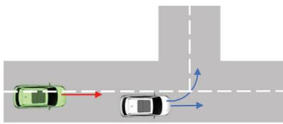

flowchart

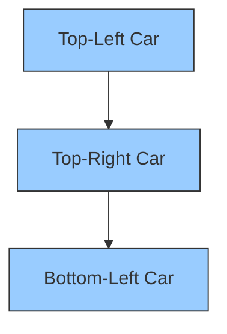
```mermaid
graph TD
    A["Top-Left Car"] --> B["Top-Right Car"]
    B --> C["Bottom-Left Car"]
    style A fill:#99ccff,stroke:#333
    style B fill:#99ccff,stroke:#333
    style C fill:#99ccff,stroke:#333
```

(a)More changeable low-speed vehicle heading

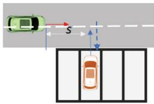

text_image

Diagram showing a car with speedometer and two cars in a parking lot, labeled with 'S' and directional arrows.

(b)Frequently switchable vehicle direction (driving forward or backward)   
FIGURE 5 Stronger motion stochasticity in parking lots.

sion stability and trajectory continuity of motion planning are critical points in parking lots. The planner should generate a continuous trajectory, which has minimal oscillation of vehicle movement.

4. Interaction: compared to highway and urban scenarios, the prediction uncertainty of dynamic vehicles is higher due to the more changeable low-speed vehicle heading, stronger HDV motion stochasticity and frequently switchable vehicle direction (see Figure 5). The planner should generate a trajectory considering the prediction uncertainty of dynamic vehicles.   
5. Efficiency: The planner is allowed to generate a little more aggressive behaviour in order to improve the traffic efficiency, such as overtaking the slower-moving vehicle ahead. However, the narrow overtaking space and the occluded visible range make it very difficult to borrow the adjacent driving lane.

Making the assumptions as follows:

1. Ignore the overtaking sight distance and the overtaking gap acceptance.   
2. Ignore the overtaking path decision-making. The feasible overtaking path tunnel is on the left side of the slower-moving leading vehicle.   
3. The speed decision (overtaking or following) of the ego vehicle was made according to the lateral drivable space and the relative speed by using the DP speed decider in [12].

# 3 Contingency Path-Speed Iterative Algorithm Framework

EM Planner is a path-speed decoupling framework, and it iteratively solves path and speed optimisation based on the Frenet frame. Our overall strategy utilises the concept of EM Planner, which transforms the motion planning problem from the Cartesian frame to the Frenet frame and furthermore decouples the 4-dimensional configuration space into station-lateral (SL) and station-time (ST), two lower-dimensional spaces separately. This framework is particularly advantageous as it greatly simplifies the problem by reducing the dimensionality of the planning problem. Furthermore, this work developed the EM Planner in parking lots and presented the contingency framework. In this section, the framework of the contingency path-speed iterative algorithm is firstly introduced. For the sake of space limitation, more details on EM Planner can be found in [10, 12].

TABLE 1 Pseudo code of contingency path-speed iterative planner. 

<table><tr><td colspan="2">Algorithm 1: Contingency path-speed iterative planner</td></tr><tr><td>Input:</td><td>road boundary  $B_{road}$ , static boundary  $B_{static}$ , multi-modal prediction of dynamic obstacle  $D$ </td></tr><tr><td>Output:</td><td>planned trajectory  $T$ </td></tr><tr><td>1</td><td>Trajectory Stitcher</td></tr><tr><td>2</td><td>Path Optimization</td></tr><tr><td>3</td><td>Use the foremost portion of  $D$  to generate the path boundary of dynamic obstacle  $B_{dyn}$ </td></tr><tr><td>4</td><td>Generate the path boundary  $B$  based on  $B_{road}$ ,  $B_{static}$ ,  $B_{dyn}$ </td></tr><tr><td>5</td><td rowspan="2">For each  $\{i^{th} \text{ traj, prob}\}$  in  $D$ ,Compute the candidate path by using Algorithm 2 and summarize into a candidate path set  $C$ </td></tr><tr><td>6</td></tr><tr><td>7</td><td>Compute the final path  $F$  based on  $B$ , prob in  $D$  and path in  $C$  by using Algorithm 3</td></tr><tr><td>8</td><td>Speed Optimization</td></tr><tr><td>9</td><td>Use the foremost portion of  $D$  to generate the station boundary of dynamic obstacle  $B_{obs}$ </td></tr><tr><td>10</td><td>Based on  $F$ , compute the final speed by using Algorithm 4</td></tr><tr><td>11</td><td>Trajectory Combiner</td></tr><tr><td>12</td><td>Combine the path and speed, to generate the planned trajectory  $T$ </td></tr><tr><td>13</td><td>Collision Checker</td></tr></table>

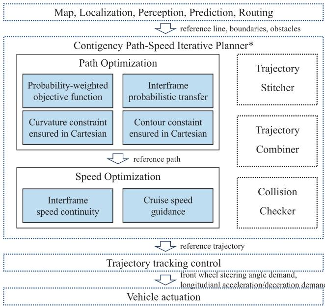

flowchart

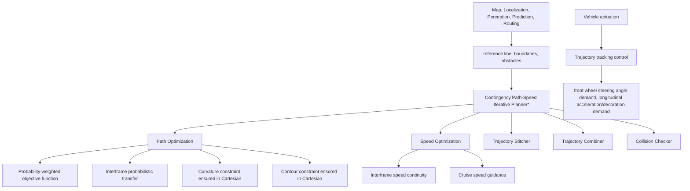
```mermaid
graph TD
    A["Map, Localization, Perception, Prediction, Routing"] --> B["reference line, boundaries, obstacles"]
    B --> C["Contingency Path-Speed Iterative Planner*"]
    C --> D["Path Optimization"]
    D --> E["Probability-weighted objective function"]
    D --> F["Interframe probabilistic transfer"]
    D --> G["Curvature constraint ensured in Cartesian"]
    D --> H["Contour constraint ensured in Cartesian"]
    C --> I["Speed Optimization"]
    I --> J["Interframe speed continuity"]
    I --> K["Cruise speed guidance"]
    C --> L["Trajectory Stitcher"]
    C --> M["Trajectory Combiner"]
    C --> N["Collision Checker"]
    O["Vehicle actuation"] --> P["Trajectory tracking control"]
    P --> Q["front wheel steering angle demand, longitudinal acceleration/decoration demand"]
```

\* denotes the study category of this article.

FIGURE 6 Contingency path-speed iterative algorithm framework.

# 3.1 Framework Design

Table 1 presents a pseudocode of the contingency path-speed iterative planner. As shown in Figure 6, we first construct a Frenet frame based on a specified reference line. The surrounding environment, such as the road boundary, the boundary of static obstacles, and the prediction results of dynamic obstacles, is evaluated in the Frenet frame. Then the optimiser module performs path optimisation and speed optimisation iteratively.

During path optimisation, a smooth path is generated through a two-round optimisation step. During speed optimisation, a smooth speed profile will be generated based on the above path. Combining path and speed profiles, we will obtain a smooth trajectory. Due to the consideration of prediction uncertainty, an additional collision check needs to be done.

# 3.2 Probabilistic Representation of Dynamic Obstacles

Multi-modal prediction trajectories with their probability are applied in this work to represent the future motion possibility of dynamic vehicles. The probabilistic information for multi-modal predictions is utilised in two different ways:

# 1. Hard constraint: Generate the certain path boundary

As we know, the prediction accuracy will be lower when the prediction horizon is longer. The foremost portion of prediction trajectories is more reasonable to represent the future motion intention of dynamic obstacles. Thus, we utilised the foremost short predictions to generate the certain path boundary, which was further transformed to the constraints for the path optimisation problem. The more accurate guess from trajectory prediction is used to establish the hard constraints so as to guarantee the safety to the maximum extent.

# 2. Soft constraint: Generate the probability-weighted path optimisation objective

There exists more uncertainty for the long-horizon prediction. Our idea is to transform the long-horizon prediction to the probability-guided objective function. First, a candidate path can be computed according to one of the prediction results. Then, the candidate paths can be combined via prediction probability and introduced into the optimisation objective. The final path will be computed through solving the QP problem.

# 3.3 Interframe Probabilistic Transfer

Due to the high stochasticity of low-speed dynamic vehicles, the sudden change of interframe prediction probability can lead to the interframe behaviour inconsistency of the ego vehicle. The historical predictions should be considered in the planning problem at the current frame. In this work, the previous ego path of historical frames was introduced to the optimisation objective at the current frame in order to transfer the interframe prediction probability.

# 4 Path Optimisation

# 4.1 Mathematical Modelling

In Cartesian space, obstacles are described with location and heading, as well as curvature and the derivative of curvature for the ego vehicle. These are mapped to the Frenet frame coordinates (s, $l , l ^ { \prime } , l ^ { \prime \prime } , l ^ { \prime \prime \prime } )$ , which represent station, lateral and lateral derivatives. The obstacles were projected on SL frames.

TABLE 2 Pseudo code of path optimisation. 

<table><tr><td colspan="2">Algorithm 2: path optimization</td></tr><tr><td>Input:</td><td>Path boundary  $l_B(s), l'_B(s), l''_B(s), l'''_B(s)$ , reference line  $l_{\text{refline}}(s)$ </td></tr><tr><td>Output:</td><td>path  $l$ </td></tr><tr><td>1</td><td>Preparation</td></tr><tr><td>2</td><td>Compute the boundary centerline  $l_{center}(s)$ </td></tr><tr><td>3</td><td>Check the reference line  $l_{\text{refline}}(s)$ </td></tr><tr><td>4</td><td>Objective function(1)</td></tr><tr><td>5</td><td>Follow reference path  $l_{center}(s)$  and  $l_{\text{refline}}(s)$ </td></tr><tr><td>6</td><td>Smooth path</td></tr><tr><td>7</td><td>Constraints</td></tr><tr><td>8</td><td>Safety limit(8)</td></tr><tr><td>9</td><td>Path continuity(9)</td></tr><tr><td>10</td><td>Staring point(10)</td></tr><tr><td>11</td><td>Curvature constraint(14)</td></tr><tr><td>12</td><td>Contour constraint(15)</td></tr></table>

For dynamic obstacles, once the foremost portion of their multimodal prediction has interacted with the estimate of ego vehicle station at the same time, the path boundary of dynamic obstacles will be generated on the SL map. Here, the interaction is defined as the overlap between the ego vehicle’s and obstacle’s bounding boxes. The path optimisation is conducted by using the quadratic programming method, which optimises an objective function with a linearised constraint. The detailed path optimisation formulation is discussed as follows.

# 4.2 Objective Function

The objective function of the path optimisation is a weighted linear combination of smoothness cost, obstacle centring cost, and guidance line cost. The pseudocode of the path optimisation is shown in Table 2. Mathematically, the path optimises the following functional:

$$
f _ {\text { single }} (l (s)) = f _ {\text { smooth }} (l (s)) + f _ {\text { obs }} (l (s)) + f _ {\text { guidance }} (l (s)) \tag {1}
$$

where, $f _ { \mathrm { s m o o t h } } ( l ( s ) )$ is the smoothness cost. $f _ { \mathrm { o b s } } ( l ( s ) )$ is the obstacle centring cost. $f _ { \mathrm { g u i d a n c e } } ( l ( s ) )$ is the guidance line cost.

The smoothness cost is mathematically expressed as:

$$
\begin{array}{l} f _ {\text { smooth }} (l (s)) = w _ {l ^ {\prime}} \int_ {0} ^ {s _ {\max}} \left(l ^ {\prime} (s)\right) ^ {2} d s + w _ {l ^ {\prime \prime}} \int_ {0} ^ {s _ {\max}} \left(l ^ {\prime \prime} (s)\right) ^ {2} d s \\ + w _ {l ^ {\prime \prime \prime}} \int_ {0} ^ {s _ {\max}} \left(l ^ {\prime \prime \prime} (s)\right) ^ {2} d s \end{array} \tag {2}
$$

where, $l ^ { \prime } , 1 ^ { \prime \prime }$ and $l ^ { \prime \prime \prime }$ are related to the heading, curvature and derivative of curvature. The optimisation objective for a path l(s) with length $s _ { m a x }$ is defined using the corresponding weighted factors. $w _ { l ^ { \prime } } , w _ { l ^ { \prime \prime } } , w _ { l ^ { \prime \prime \prime } }$ are the corresponding weights.

The obstacle centring cost implies that the ego vehicle drives along with the centring line of the obstacle boundary and is mathematically expressed as:

$$
f _ {\mathrm{obs}} (l (s)) = w _ {o b s} \int_ {0} ^ {s _ {\max}} (l (s) - l _ {\text { center }} (s)) ^ {2} d s \tag {3}
$$

TABLE 3 Pseudocode of multi-modal path optimisation. 

<table><tr><td colspan="2">Algorithm 2: Multi-modal path optimization</td></tr><tr><td>Input:</td><td>Path boundary  $l_B(s), l_B'(s), l_B''(s), l_B'''(s)$ , reference line  $l_{\text{refline}}(s)$ , multi-modal prediction of dynamic obstacle  $D$ , candidate path set  $C$ </td></tr><tr><td>Output:</td><td>path  $l$ </td></tr><tr><td>1</td><td>Preparation</td></tr><tr><td>2</td><td>Compute the boundary centerline  $l_{center}(s)$ </td></tr><tr><td>3</td><td>Check the reference line  $l_{\text{refline}}(s)$ </td></tr><tr><td>4</td><td>Check the previous path  $l_{\text{his}}(s)$  in the historical frame</td></tr><tr><td>5</td><td>Objective function(5)</td></tr><tr><td>6</td><td>For each  $\{i^{\text{th}} \text{ path}\}$  in  $C$  and  $\{prob\}$  in  $D$ </td></tr><tr><td>7</td><td>Following the probability-weighted path</td></tr><tr><td>8</td><td>Follow reference path  $l_{center}(s), l_{\text{refline}}(s)$  and  $l_{\text{his}}(s)$ </td></tr><tr><td>9</td><td>Smooth path</td></tr><tr><td>10</td><td>Constraints</td></tr><tr><td>11</td><td>Safety limit(8)</td></tr><tr><td>12</td><td>Path continuity(9)</td></tr><tr><td>13</td><td>Staring point(10)</td></tr><tr><td>14</td><td>Curvature constraint(14)</td></tr><tr><td>15</td><td>Contour constraint(15)</td></tr></table>

where, $l _ { c e n t e r } \ ( s ) = 0 . 5 \times ( l _ { B } ( s ) _ { m i n } + l _ { B } ( s ) _ { m a x } ) \ l _ { B } ( s ) _ { \mathrm { m i n } } , l _ { B } ( s ) _ { \mathrm { m a x } }$ are the minimum and maximum values of the obstacle boundary. $w _ { o b s }$ is the corresponding weight of the obstacle centring cost.

The guidance line provides a drivable path without obstacles and is mathematically expressed as:.

$$
f _ {\text { guidance }} (l (s)) = w _ {\text { refline }} \int_ {0} ^ {s _ {\max}} \left(l (s) - l _ {\text { refline }} (s)\right) ^ {2} d s \tag {4}
$$

where, $l _ { r e f l i n e }$ defines the reference line function. $w _ { r e f l i n e }$ is the corresponding weight of the guidance line cost.

In order to handle the prediction uncertainty of dynamic obstacles, the objective function of the above-mentioned path optimisation is developed into multi-modal path optimisation. The pseudo code of multi-modal path optimisation is shown in Table 3.

$$
f _ {\text { multi }} (l (s)) = f _ {\text { single }} (l (s)) + f _ {\text { prob }} (l (s)) + f _ {\text { his }} (l (s)) \tag {5}
$$

where $f _ { \mathrm { p r o b } } ( l ( s ) )$ is the probability cost. $f _ { \mathrm { h i s } } ( l ( s ) )$ ) is the historical cost.

The probability cost represents the prediction uncertainty of dynamic obstacles at the current frame. The optimization objective for a path l(s) with length $s _ { m a x }$ is defined using the weighted sum of the corresponding factors:

$$
f _ {\text { prob }} (l (s)) = \sum_ {i} ^ {m} \sum_ {j} ^ {n} w _ {i} \left(p _ {i j} \int_ {0} ^ {s _ {\max}} \left(l (s) - l _ {i j} (s)\right) ^ {2} d s\right) \tag {6}
$$

where, i and m represent the number and the amount of dynamic obstacles, and j and n represent the number and the amount of multi-modal predictions of one dynamic obstacle. $p _ { i j }$ is the prediction probability of the jth trajectory of the ith dynamic obstacle. $l _ { i j }$ is the path optimisation result when only considering the jth trajectory of the ith dynamic obstacle.

The historical cost is utilised to introduce the historical path into the current path optimisation problem and represents the interframe probability transfer. The historical cost is mathematically expressed as:

$$
f _ {\text { his }} (l (s)) = w _ {\text { his\_path }} \int_ {0} ^ {s _ {\max}} (l (s) - l _ {\text { his }} (s)) ^ {2} d s \tag {7}
$$

where, $^ { \ast } l _ { h i s } ^ { \phantom { \ast } } \cdot$ represents the previous path at the historical frame. $w _ { h i s \_ p a t h }$ is the corresponding weight of the historical cost.

# 4.3 Constraints

The above optimisation objective subjects to the following constraint:

1. Boundary constraint

$$
\left\{ \begin{array}{l} l (s) \in l _ {B} (s), \forall s \in [ 0, s _ {\max} ] \\ l ^ {\prime} (s) \in l _ {B} ^ {\prime} (s), \forall s \in [ 0, s _ {\max} ] \\ l ^ {\prime \prime} (s) \in l _ {B} ^ {\prime \prime} (s), \forall s \in [ 0, s _ {\max} ] \\ l ^ {\prime \prime \prime} (s) \in l _ {B} ^ {\prime \prime \prime} (s), \forall s \in [ 0, s _ {\max} ] \end{array} \right. \tag {8}
$$

2. Continuity constraint

$$
\left\{ \begin{array}{l} l _ {i + 1} ^ {\prime \prime} = l _ {i} ^ {\prime \prime} + l _ {i} ^ {\prime \prime \prime} d s \\ l _ {i + 1} ^ {\prime} = l _ {i} ^ {\prime} + l _ {i} ^ {\prime \prime} d s + \frac {1}{2} l _ {i} ^ {\prime \prime \prime} (d s) ^ {2} \\ l _ {i + 1} = l _ {i} + l _ {i} ^ {\prime} d s + \frac {1}{2} l _ {i} ^ {\prime \prime} (d s) ^ {2} + \frac {1}{6} l _ {i} ^ {\prime \prime \prime} (d s) ^ {3} \end{array} \right. \tag {9}
$$

3. Starting point constraint

$$
l (s = 0) = l _ {\text { start }} \tag {10}
$$

4. Curvature constraint

The boundary constraints (8) in the Frenet frame cannot accurately express the curvature constraint in Cartesian Coordinates, so the curvature of path points after optimisation may go beyond the curvature limit, leading to the planned path being kinematically non-executable. In this article, the curvature of path points is derived in [28]. The symbols of following expression are same as [28].

$$
\kappa = \frac {\left(\frac {\left(l ^ {\prime \prime} + \left(\kappa_ {r} ^ {\prime} l + \kappa_ {r} l ^ {\prime}\right) \tan \Delta \theta\right) \cos^ {2} \Delta \theta}{1 - \kappa_ {r} l} + \kappa_ {r}\right) \cos \Delta \theta}{1 - \kappa_ {r} l} \tag {11}
$$

Based on the small-angle hypothesis for Δ??, the above equation can be simplified as:

$$
\kappa = \frac {l ^ {\prime \prime} + \kappa_ {r} (1 - \kappa_ {r} l)}{(1 - \kappa_ {r} l) ^ {2}} \tag {12}
$$

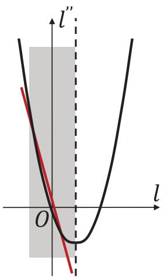

text_image

l''
O
l

(a) $\kappa \approx \kappa _ { r } > 0$

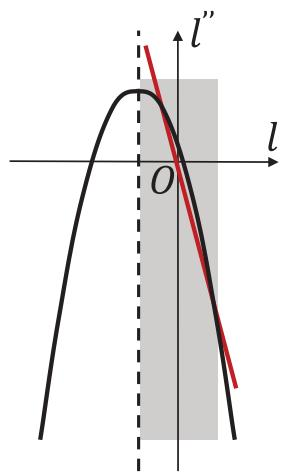

text_image

l''
O
l

(b) $\kappa \approx \kappa _ { r } < 0$

FIGURE 7 Curvature constraint from Cartesian coordinate to Frenet frame.   
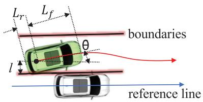

text_image

Lr
Lf
θ
l
boundaries
reference line

FIGURE 8 Contour constraint caused by vehicle heading.

We can further infer the relation between l and $l ^ { \prime \prime }$ as follows:

$$
l ^ {\prime \prime} = \kappa (1 - \kappa_ {r} l) ^ {2} - \kappa_ {r} (1 - \kappa_ {r} l) \tag {13}
$$

Given $\kappa , \kappa _ { r } \in \kappa _ { B } = [ \kappa _ { \operatorname* { m i n } } , \kappa _ { \operatorname* { m a x } } ]$ , the curve of Equation (13) is drawn as shown in Figure 7. We assume that ?? ≈ $\kappa _ { r } ,$ , for ??(??) ∈ $l _ { B } ( s ) , \forall s \in [ 0 , s _ { \mathrm { m a x } } ] , l ^ { \prime \prime }$ has an approximately linear relationship with l, which can be formulated by using the following affine constraint:

$$
a l (s) + b l ^ {\prime \prime} (s) \in c _ {B}, \forall s \in [ 0, s _ {\max} ] \tag {14}
$$

where, a is the coefficient of l, $a = a ( \kappa _ { B } ( s ) , \kappa _ { r } ( s ) )$ . b is the coefficient of $l ^ { \prime \prime } , ~ b = b ( \kappa _ { B } ( s ) , \kappa _ { r } ( s ) ) . ~ c _ { B }$ is the boundary, $c _ { B } =$ $c _ { B } ( \kappa _ { B } ( s ) , \kappa _ { r } ( s ) )$ . They are both computed by curvature constraint in Cartesian Coordinates. In this way, the curvature constraint can be converted into the affine constraint between l and l″.

# 5. Contour constraint

Vehicle heading during the overtaking process leads to an inaccurate contour constraint. In Figure 8, the following kinematic relations can be obtained:

$$
\left\{ \begin{array}{l} l (s) + L _ {f} \sin \theta \leq l (s) + L _ {f} l ^ {\prime} (s) \leq l _ {B} (s) _ {\max} \\ l (s) - L _ {r} \sin \theta \geq l (s) + L _ {r} l ^ {\prime} (s) \geq l _ {B} (s) _ {\min} \end{array} \right. \tag {15}
$$

where, $L _ { \mathrm { f } }$ and $L _ { \mathrm { r } }$ are the distances from the centre of the rear axle to the vehicle’s front and the end, respectively. The contour is described by the affine constraint between l and l’.

TABLE 4 Pseudocode of speed optimisation. 

<table><tr><td colspan="2">Algorithm 4: Speed optimization</td></tr><tr><td>Input:</td><td>Speed boundary  $s_B(t), s'_B(t), s''_B(t), s'''_B(t)$ </td></tr><tr><td>Output:</td><td>Speed data  $s'(t)$ </td></tr><tr><td>1</td><td>Preparation</td></tr><tr><td>2</td><td>Select the guidance speed profile  $s'_\text{guidance}(t)$ </td></tr><tr><td>3</td><td>Check the previous speed data  $s'_\text{his}(t)$  in the historical frame</td></tr><tr><td>4</td><td>Objective function(16)</td></tr><tr><td>5</td><td>Follow  $s'_\text{guidance}(t)$ and  $s'_\text{his}(t)$ </td></tr><tr><td>6</td><td>Smooth speed data</td></tr><tr><td>7</td><td>Constraints(20)</td></tr><tr><td>8</td><td>Safety Boundary limit</td></tr><tr><td>9</td><td>Speed continuity</td></tr><tr><td>10</td><td>Staring point</td></tr></table>

Since all constraints are linear or affine constraints, a quadratic programming solver can be used to solve the problem quickly.

# 5 Speed Optimisation

# 5.1 Mathematical Modelling

After the path optimisation module generates a smooth path profile, both static and dynamic obstacles are projected on the given path, and the speed boundary can be computed. ST projection helps us evaluate the ego car’s speed profile. During the speed optimisation, the speed variables are mapped to the Frenet frame coordinates (s $t , s ^ { \prime } , s ^ { \prime \prime } , s ^ { \prime \prime \prime } )$ , which represent station, station and station derivatives. The obstacles were projected on ST frames to compute the speed profile. The detailed speed optimisation formulation is discussed as follows.

# 5.2 Objective Function

The cost function of speed optimisation is defined taking the smoothness, guidance and historical cost. The pseudocode of speed optimisation is shown in Table 4. The optimisation objective for a station s(t) with period $t _ { m a x }$ is defined using the weighted sum of the corresponding factors:

$$
g _ {\text { total }} (s (t)) = g _ {\text { smooth }} (s (t)) + g _ {\text { guidance }} (s (t)) + g _ {\text { his }} (s (t)) \tag {16}
$$

where, $g _ { \mathrm { s m o o t h } } ( s ( t ) )$ is the smoothness cost. $g _ { \mathrm { g u i d a n c e } } ( s ( t ) )$ is the guidance speed cost. $g _ { \mathrm { h i s } } ( s ( t ) )$ is the historical speed cost.

The smoothness cost function is described as follows:

$$
g _ {\text { smooth }} (s (t)) = w _ {s ^ {\prime}} \int_ {0} ^ {t _ {\max}} \left(s ^ {\prime} (t)\right) ^ {2} d t + w _ {s ^ {\prime \prime}} \int_ {0} ^ {t _ {\max}} \left(s ^ {\prime \prime} (t)\right) ^ {2} d t \tag {17}
$$

$$
+ w _ {s ^ {\prime \prime \prime}} \int_ {0} ^ {t _ {\max}} (s ^ {\prime \prime \prime} (t)) ^ {2} d t
$$

where, $s ^ { \prime } , s ^ { \prime } { } ^ { * }$ and $s ^ { \prime \prime }$ are related to the speed, acceleration, and jerk. The optimisation objective for a speed profile s(t) with period $t _ { m a x }$ is defined using the corresponding weighted factors $w _ { s ^ { \prime } } , w _ { s ^ { \prime \prime } } , w _ { s ^ { \prime \prime \prime } }$ are the corresponding weights.

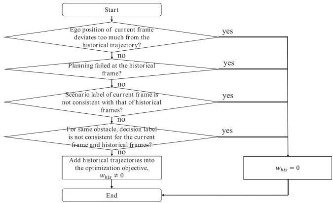

flowchart

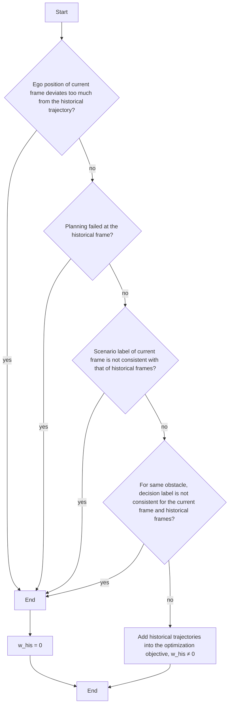
```mermaid
graph TD
    A["Start"] --> B{Ego position of current frame deviates too much from the historical trajectory?}
    B -->|yes| C["End"]
    B -->|no| D{Planning failed at the historical frame?}
    D -->|yes| C
    D -->|no| E{Scenario label of current frame is not consistent with that of historical frames?}
    E -->|yes| C
    E -->|no| F{For same obstacle, decision label is not consistent for the current frame and historical frames?}
    F -->|yes| C
    F -->|no| G["Add historical trajectories into the optimization objective, w_his ≠ 0"]
    G --> H["End"]
    C --> I["w_his = 0"]
    I --> H
```

FIGURE 9 Flowchart of the interframe speed continuity.

The guidance cost represents the cruising speed in parking lots and is mathematically expressed as:

$$
g _ {\text { guidance }} (s (t)) = w _ {\text { guidance }} \int_ {0} ^ {t _ {\max}} \left(s ^ {\prime} (t) - s _ {\text { guidance }} ^ {\prime} (t)\right) ^ {2} d t \tag {18}
$$

where, $s _ { g u i d a n c e } ^ { \prime } ( t )$ represents the guidance speed profile (e.g., cruise speed). $w _ { g u i d a n c e }$ is the corresponding weight of the guidance speed cost.

$$
g _ {\text { his }} (s (t)) = w _ {h i s} \int_ {0} ^ {t _ {\max}} \left(s ^ {\prime} (t) - s _ {h i s} ^ {\prime} (t)\right) ^ {2} d t \tag {19}
$$

where, $s ^ { \prime } { } _ { h i s } ( t )$ is the previous speed profile from the historical frames. $w _ { h i s }$ is the corresponding weight of the historical cost.

The sudden step change of surrounding obstacles leads to a discontinuous planned trajectory, such as sudden braking and acceleration. To handle this issue, the historical speed profile of the ego vehicle is introduced into the speed optimisation objective at the current frame under certain conditions, as displayed in Figure 9. The proposed method improves the interframe trajectory continuity by enhancing the stability of interframe speed decision-making.

# 5.3 Constraints

The above optimisation objective is subject to the following constraint:

# 1. Boundary constraint

$$
\left\{ \begin{array}{l} s (t) \in s _ {B} (t), \forall t \in [ 0, t _ {\max} ] \\ s ^ {\prime} (t) \in s _ {B} ^ {\prime} (t), \forall t \in [ 0, t _ {\max} ] \\ s ^ {\prime \prime} (t) \in s _ {B} ^ {\prime \prime} (t), \forall t \in [ 0, t _ {\max} ] \\ s ^ {\prime \prime \prime} (t) \in s _ {B} ^ {\prime \prime \prime} (t), \forall t \in [ 0, t _ {\max} ] \end{array} \right. \tag {20}
$$

TABLE 5 Key parameters of the proposed algorithm. 

<table><tr><td>Symbol</td><td>Value</td></tr><tr><td> $w_{obs}$ </td><td>2.2</td></tr><tr><td> $w_{refline}$ </td><td>1.5</td></tr><tr><td> $w_{his\_path}$ </td><td>0.3</td></tr><tr><td> $w_{guidance}$ </td><td>1.5</td></tr><tr><td> $w_{his}$ </td><td>0.2</td></tr></table>

# 2. Continuity constraint

$$
\left\{ \begin{array}{l} s _ {i + 1} ^ {\prime \prime} = s _ {i} ^ {\prime \prime} + s _ {i} ^ {\prime \prime \prime} d t \\ s _ {i + 1} ^ {\prime} = s _ {i} ^ {\prime} + s _ {i} ^ {\prime \prime} d t + \frac {1}{2} s _ {i} ^ {\prime \prime \prime} (d t) ^ {2} \\ s _ {i + 1} = s _ {i} + s _ {i} ^ {\prime} d t + \frac {1}{2} s _ {i} ^ {\prime \prime} (d t) ^ {2} + \frac {1}{6} s _ {i} ^ {\prime \prime \prime} (d t) ^ {3} \end{array} \right. \tag {21}
$$

# 3. Starting point constraint

$$
s ^ {\prime} (t = 0) = s _ {s t a r t} ^ {\prime} \tag {22}
$$

After wrapping up the cost objective and constraints, the feasible speed profile will be generated and then combined with the path profile. The contingency path-speed iterative planner will generate a smooth trajectory for the trajectory tracking control module.

# 6 Numerical Simulations: Expand Performance Validation With Complex Dynamic Scenarios

An Intel Core 2.5 GHz computer with 32 GB RAM was used to run simulations locally. The simulations were conducted on the Carla simulator [29]. The open-loop test without the control module was conducted in this section, namely that the planning command is regarded as the vehicle response. The proposed contingency path-speed iterative planner has been realised based on the Baidu Apollo Open Platform [30] and run at a 10 Hz frequency for each planning cycle. The proposed path and speed optimisation are implemented using Operator Splitting Quadratic Program (OSQP) [31]. For path optimisation, the total path length is 20 metres, with a discretisation resolution of 0.5 metres. The average computation time of the contingency planner is smaller than 10 ms. The key parameters of the proposed algorithm are displayed in Table 5.

Four complex scenarios were displayed in this article. Baidu Apollo’s EM Planner is selected as the baseline method, which has been released as part of the Baidu Apollo Open Platform. In this work, the comparison between the EM planner and the proposed algorithm will be conducted under the following typical scenarios. In parking lots, vehicles are more likely to violate traffic regulations. Therefore, a fusion prediction method combining the vehicle kinematic model and the multi-layer perceptron (MLP) lane sequence derivation is adopted to provide the trajectory probability of each mode for dynamic vehicles.

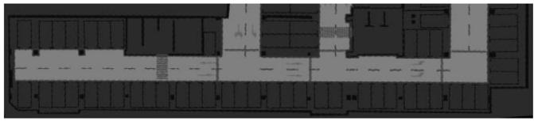

natural_image

Architectural floor plan showing room layouts and structural elements (no text or labels)

FIGURE 10 Scene description.

# 6.1 Scene description

As Figure 10 displayed, we selected a long straight road from some certain underground parking lots to investigate the overtaking planning under a low-speed narrow road scene. The velocity limit at this parking lot is 20 kph. The road length is 87 metre and its drivable width is 5.1 metre. This road includes two opposite lanes; each lane width is 2.5 metre. The length of ego car and obstacle car are both 4.6 metre, and their widths are both 2.2 metre (including the rearview mirror).

The road topology is complicated for connecting three junctions. Under this scene, the motion stochasticity of a low-speed driving vehicle is higher. The junctions can lead to large interframe changes in multi-modal prediction of dynamic obstacles. The above factors make it more difficult for overtake planning.

We conducted four cases in this article due to the length limit. Case 1 is the most basic scene and displays a slower-speed leading vehicle creeping. Case 2 shows a vehicle parking out from its space and creeping at a slower speed. Case 3 shows a slower-speed leading vehicle creeping firstly and then parking into its space. Case 4 adds the turning behaviour of a slower-speed leading vehicle at the intersection. This section displays the test curves of the ego vehicle (including the curvature, speed and heading angle) and the test visualisation of the corresponding case (the pink vehicle represents the current pose of the ego vehicle, and the blue one represents the current pose of the obstacle vehicle).

# 6.2  1. A slower-speed leading vehicle Cacreeping

Figures 11,12 show the Case 1 result by using EM Planner. The ego vehicle cannot finish the overtaking behaviour, because once the ego vehicle interacts with the predicted motion of the leading vehicle, the ego vehicle will be stopped (see Figure 12). From the speed curve, a repeating acceleration-deceleration action occurred, and the vehicle comfort was also deteriorated.

The simulation results by using the proposed contingency planner shown in Figures 13 and 14 showed that the, ego vehicle can overtake the slower-speed leading vehicle successfully. According to Figure 13, the maximum value of the curvature is 0.13, and the curvature is limited within the corresponding boundary, which infers that the curvature constraint in the proposed framework makes the planned trajectory kinematically executable. Superior to EM Planner, the heading angle has fewer changes by using the proposed planner. The ego vehicle accelerated quickly to reach the velocity limit (even exceeding the limit) and reduced the overtaking period. The maximum speed is 24.6 km/h, and the time during which the speed exceeded the maximum speed limit lasted for 2.6 s. At 11 $. 5 ^ { \mathrm { t h } }$ second as shown in Figure 14(b), when the ego vehicle front reaches the slower-speed vehicle front, the high stochasticity of low-speed motion leads to the ego vehicle’s speed reduction. Thanks to the historical trajectory introduced to the speed optimisation objectives, the speed reduction of the ego vehicle is slowed down in contrast to EM Planner (the ego vehicle stopped at $4 0 ^ { \mathrm { t h } }$ second in Figure 12) so as to guarantee the interframe continuity of the planning trajectory. Once the ego vehicle exceeds the slower-speed vehicle, as displayed in Figure 14(c), the ego vehicle will acceleration gradually and finish the overtaking as soon as possible to minimising the overtaking risk. During the overtaking process, the proposed planner planned a collision-free trajectory under the narrow space. Case 1 demonstrates the contingency planning performance by using the proposed framework.

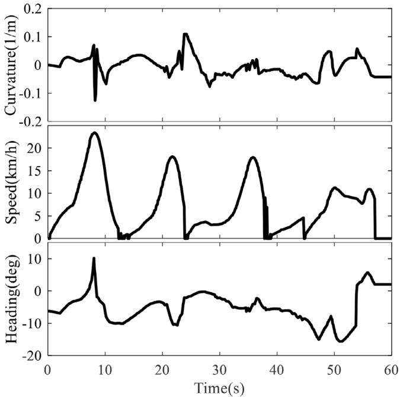

line

| Time(s) | Curvature(1/m) | Speed(km/h) | Heading(deg) |
| ------- | -------------- | ----------- | ------------ |
| 0       | 0.0            | 0           | -5           |
| 10      | -0.1           | 22          | 10           |
| 20      | 0.0            | 18          | -5           |
| 30      | -0.1           | 18          | -5           |
| 40      | 0.0            | 0           | -5           |
| 50      | 0.0            | 12          | -15          |
| 60      | 0.0            | 0           | 0            |

FIGURE 11 Case 1. Curves by using EM Planner.   
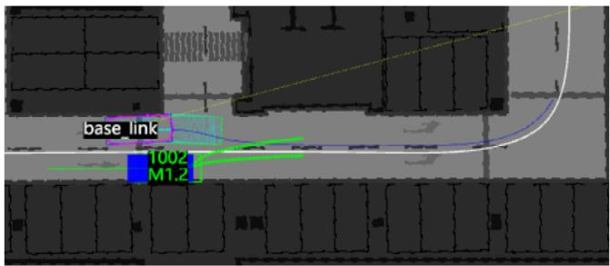

text_image

base link
1002
M1.2

FIGURE 12 Case 1. Visualisation by using EM Planner (decelerated@40th sec).

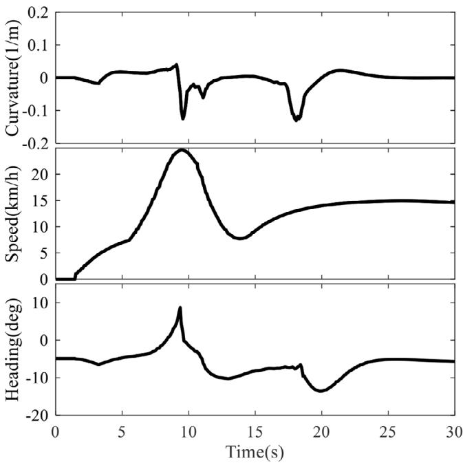

line

| Time(s) | Curvature(1/m) | Speed(km/h) | Heading(deg) |
| ------- | -------------- | ----------- | ------------ |
| 0       | 0.0            | 0           | -5           |
| 5       | 0.0            | 5           | -5           |
| 10      | -0.2           | 25          | 10           |
| 15      | 0.0            | 8           | -10          |
| 20      | -0.2           | 15          | -15          |
| 25      | 0.0            | 15          | -5           |
| 30      | 0.0            | 15          | -5           |

FIGURE 13 Case 1. Curves by using the proposed contingency planner.

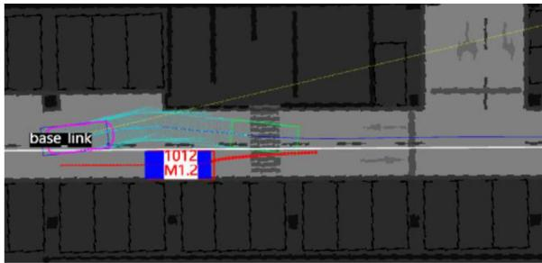

text_image

base link
1012
M1.2

(a)timestamp@ 8.5th sec.   
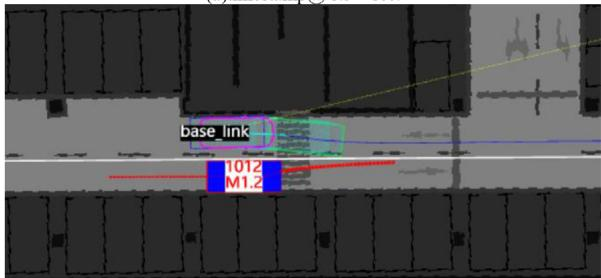

text_image

base link
1012
M1.2

(b)timestamp@11.5th sec.

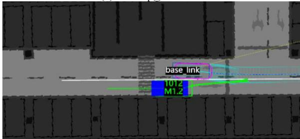

text_image

base link
1012
M1.2

(c)timestamp@ 16.5th sec.   
FIGURE 14 Case 1. Visualisation by using the proposed contingency planner.

# 6.3  2. A vehicle parking out from its space Caseand creeping at slower speed

Figures 15,16 display the Case 2 result by using EM Planner. Although the maximum speed exceed 20 km/h (23 km/h), ego vehicle cannot finish the overtaking behaviour. The EM Planner does not have the capacity to deal with the prediction uncertainty.

Figures 17,18 display the Case 2 result by using the proposed contingency planner. The maximum curvature is 0.15 and is not beyond the corresponding limitation. In Figure 18, at the sixth second, the ego vehicle recognises that the blue vehicle is parking out from its space and generates a safety-critical trajectory as far away from the dynamic vehicle as possible. At the eighth second, at the beginning of the overtaking process, the ego vehicle does not collide with the wall limited by the contour constraint (Equation 15). At the $1 2 ^ { \mathrm { t h } }$ second, although the blue vehicle has two different intentions (straight driving or turning left) at the junction, the ego vehicle attempts to maintain its speed due to its front exceeding the blue vehicle’s front. At the $1 5 ^ { \mathrm { t h } }$ second, the ego vehicle finishes the overtaking. Case 2 demonstrates the contingency planning performance by using the proposed framework.

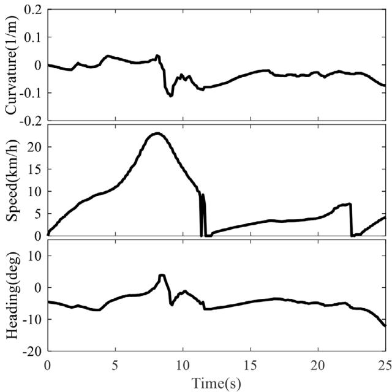

line

| Time(s) | Curvature(1/m) | Speed(km/h) | Heading(deg) |
| ------- | -------------- | ----------- | ------------ |
| 0       | 0.0            | 0           | -5           |
| 5       | 0.0            | 10          | -5           |
| 10      | -0.1           | 22          | -5           |
| 15      | -0.05          | 5           | -5           |
| 20      | -0.05          | 5           | -5           |
| 25      | -0.1           | 5           | -10          |

FIGURE 15 Case 2. Curves by using EM Planner.   
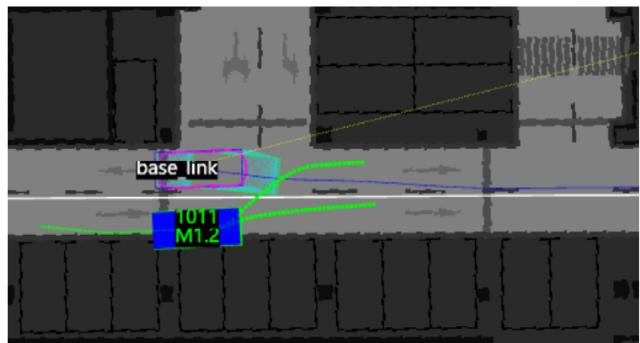

text_image

base link
1011
M1.2

FIGURE 16 Case 2. Visualisation by using EM Planner (decelerated@12th sec).   
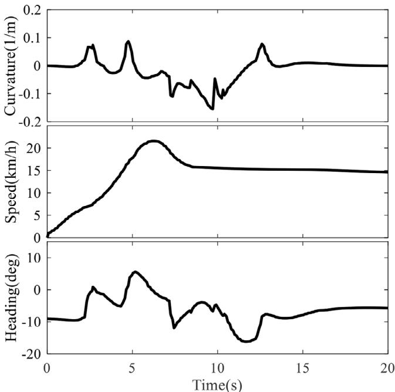

line

| Time(s) | Curvature(1/m) | Speed(km/h) | Heading(deg) |
| ------- | -------------- | ----------- | ------------ |
| 0       | 0.0            | 0           | -10          |
| 5       | 0.1            | 20          | 5            |
| 10      | -0.1           | 15          | -15          |
| 15      | 0.0            | 15          | -5           |
| 20      | 0.0            | 15          | -5           |

FIGURE 17 Case 2. Curves by using the proposed contingency planner.

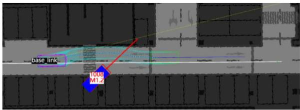

text_image

base link
1008
M1.2

(a)timestamp@ 6h sec.   
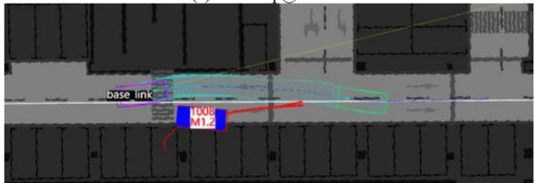

text_image

base link
1008
M1.2

(b)timestamp@ 8h sec.   
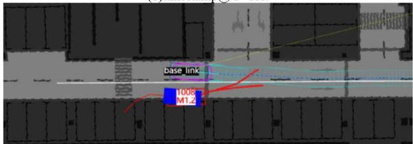

text_image

base link
1008
M1.2

(c)timestamp@ 12th sec.

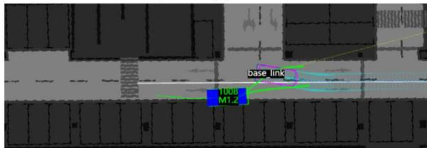

text_image

base link
100
M1.2

(d)timestamp@ $1 5 ^ { \mathrm { t h } } \sec .$   
FIGURE 18 Case 1. Visualisation by using the proposed contingency planner.

# 6.4  3. A slower-speed leading vehicle Casecreeping First and then parking into its space

From the simulation results by using the EM Planner, as shown in Figures 19 and 20, the ego vehicle accelerates rapidly and attempts to overtake the slower-moving leading vehicle (blue vehicle) at the $3 0 ^ { \mathrm { t h } }$ second. The blue vehicle parks into its space opposite the road, but the ego vehicle drives fast and is too late to be stopped. As a result, the two vehicles’ crash occurs at the $4 0 ^ { \mathrm { t h } }$ second. EM Planner does not have the capacity to deal with the motion uncertainty of the dynamic vehicles and is limited to ensure safe performance.

Figures 21,22 display the Case 3 result by using the proposed contingency planner. The maximum curvature is 0.16 and is not beyond the corresponding limitation. At the $2 6 ^ { \mathrm { t h } }$ second, as shown in Figure 22(a), ego vehicle accelerates gradually and plans a collision-free trajectory satisfying the contour constraint. At the $2 8 ^ { \mathrm { t h } }$ second, the ego vehicle is parallel to the blue one and reduces its speed. $\mathbf { A } \mathbf { t } ~ 3 2 ^ { \mathrm { n d } }$ second, the ego vehicle attempts to accelerate since ego vehicle front exceeds the blue one. The results verify the effectiveness of the proposed contingency planner.

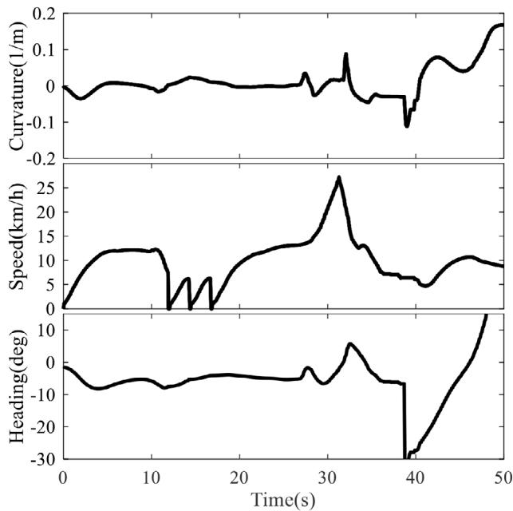

line

| Time(s) | Curvature(1/m) | Speed(km/h) | Heading(deg) |
| ------- | -------------- | ----------- | ------------ |
| 0       | 0.0            | 0           | 0            |
| 10      | 0.0            | 12          | -5           |
| 20      | 0.0            | 10          | -5           |
| 30      | 0.1            | 25          | -5           |
| 40      | -0.1           | 5           | -30          |
| 50      | 0.2            | 10          | 0            |

FIGURE 19 Case 3. Curves by using EM planner.

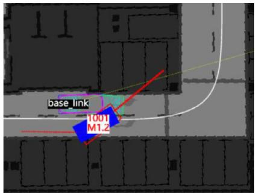

text_image

base link
1001
M1.2

FIGURE 20 Case 3. Visualisation by using EM planner (crash@40th sec).

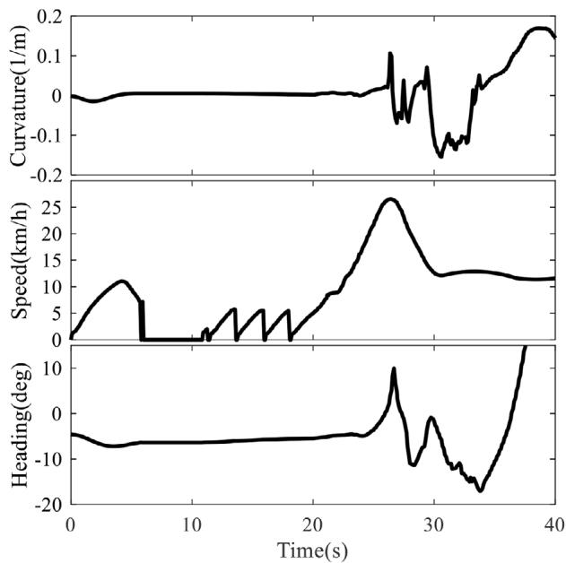

line

| Time(s) | Curvature(1/m) | Speed(km/h) | Heading(deg) |
| ------- | -------------- | ----------- | ------------ |
| 0       | 0.0            | 0           | -5           |
| 5       | 0.0            | 10          | -5           |
| 10      | 0.0            | 0           | -5           |
| 15      | 0.0            | 5           | -5           |
| 20      | 0.0            | 10          | -5           |
| 25      | 0.1            | 25          | -5           |
| 30      | -0.1           | 12          | -10          |
| 35      | 0.1            | 12          | -15          |
| 40      | 0.2            | 12          | 0            |

FIGURE 21 Case 3. Curves by using the proposed contingency planner.

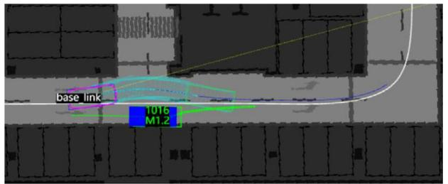

text_image

base link
1016
M1.2

(a)timestamp@ 26h sec.   
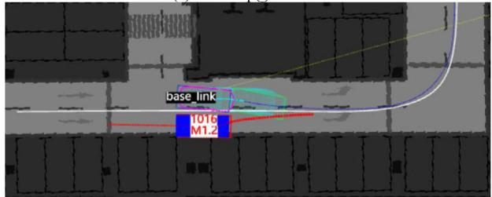

text_image

base link
1016
M1.2

(b)timestamp@ 28th sec.   
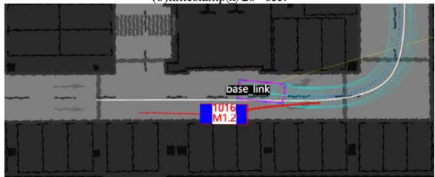

text_image

base link
1016
M1.2

(c)timestamp@ 32nd sec.   
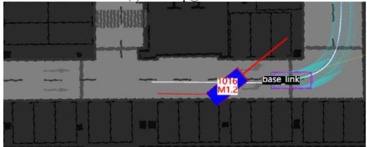

text_image

101g
M1.2
base link

(d)timestamp@ 36h sec.   
FIGURE 22 Case 1. Visualisation by using the proposed contingency planner.

# 6.5  4. A slower-speed leading vehicle Casecreeping first and turning at the intersection

Figures 23,24 show the simulation results by using EM Planner. Same as the previous case, the ego vehicle is blocked by the blue one and stopped at the $1 6 ^ { \mathrm { t h } }$ second. According to the simulation, by using the proposed contingency planner (Figures 25 and 26), the ego vehicle overtakes the slower-moving leading vehicle successfully. The maximum curvature is 0.12 and is not beyond the corresponding limitation. At the $1 4 ^ { \mathrm { t h } }$ second, as displayed in Figure 26(b), the contingency planning makes it slightly speedoscillated and safety-critical during the overtaking process in the parking lot.

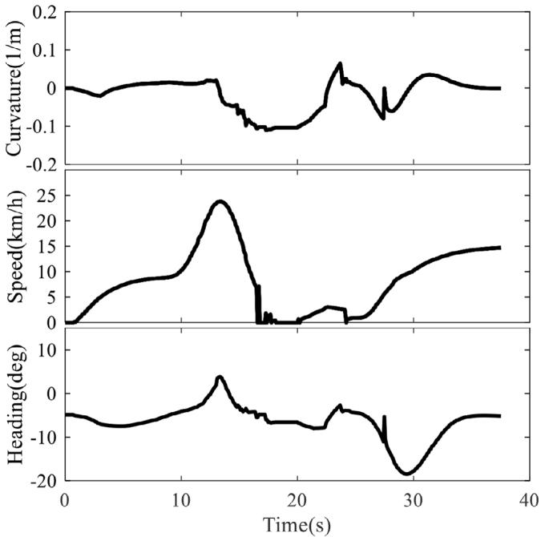

line

| Time(s) | Curvature(1/m) | Speed(km/h) | Heading(deg) |
| ------- | -------------- | ----------- | ------------ |
| 0       | 0.0            | 0           | -5           |
| 10      | 0.0            | 10          | -5           |
| 15      | -0.1           | 25          | 5            |
| 20      | -0.1           | 0           | -5           |
| 25      | 0.0            | 5           | -10          |
| 30      | -0.1           | 10          | -20          |
| 35      | 0.0            | 15          | -5           |
| 40      | 0.0            | 15          | -5           |

FIGURE 23 Case 4. Curves by using EM Planner.   
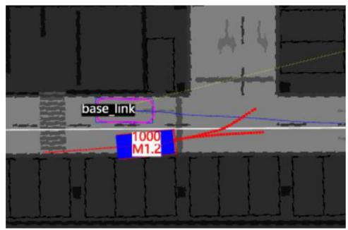

text_image

base link
1000
M1.2

FIGURE 24 Case 4. Visualisation by using EM Planner (blocked@16th sec).   
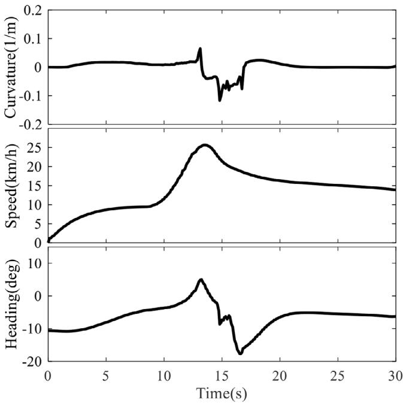

line

| Time(s) | Curvature(1/m) | Speed(km/h) | Heading(deg) |
| ------- | -------------- | ----------- | ------------ |
| 0       | 0.0            | 0           | -10          |
| 5       | 0.0            | 8           | -8           |
| 10      | 0.0            | 10          | -5           |
| 15      | -0.1           | 25          | -15          |
| 20      | 0.0            | 15          | -5           |
| 25      | 0.0            | 14          | -5           |
| 30      | 0.0            | 13          | -5           |

FIGURE 25 Case 4. Curves by using the proposed contingency planner.

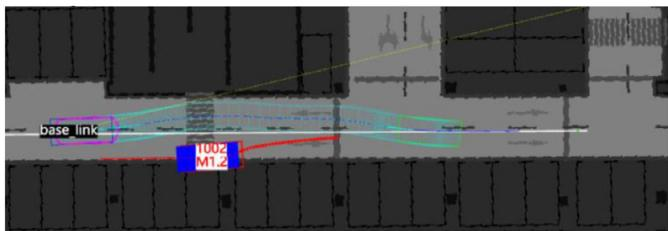

text_image

base link
1002
M1.2

(a)timestamp@ 11h sec.   
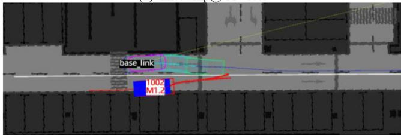

text_image

base link
1002
M1.2

(b) timestamp@ 14th sec.

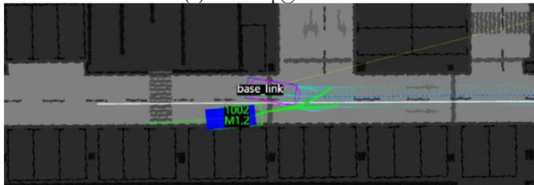

text_image

base link
100.2
M1.2

(c)timestamp@ 16h sec.   
FIGURE 26 Case 4. Visualisation by using the proposed contingency planner.

# 7 On-Road Experimental Implementation and Results

To further validate the control feasibility and real-world executability of our proposed algorithm, we tested it on an autonomous real vehicle under the same parking lot for overtaking the static leading vehicle. The proposed algorithm is deployed on a mass-produced MCU (Microcontroller Unit: NXP MPC5746R, 256 kB RAM, 4000 kB Flash). A SLAM (Simultaneous Localisation And Mapping) approach is employed to measure the vehicle position, heading angle, vehicle speed and so on. The chassis gateway provides the measured steering wheel angle and receives the controllable drive/brake torque command and steering wheel angle command. The updating rates of the planning cycle and control cycle are 10 Hz and 100 Hz, respectively. The control-in-the-loop test is conducted, namely that the planned trajectory is executed by the control module.

Figures 27,28 show the test curves of the planned trajectory and vehicle response, stage-by-stage test visualisation and front view of the on-road experiment, respectively. Compared to the numerical simulation, the vehicle speed limit is lowered down in on-road experiment for security purposes. During the overtaking process, the maximum curvature is 0.157, and the maximum steering wheel angle is 389 degrees. According to Figure 28, the planned trajectory is kinematically executable and satisfies the contour constraint. Faced with the perception uncertainty of the static vehicle, the contingency EM Planner reduces the speed oscillation and enhances the comfort via the interframe probability transfer.

The performance of the proposed contingency path-speed iterative algorithm is demonstrated by the numerical simulations and on-road experiments. The proposed contingency path-speed iterative algorithm addresses three critical limitations of EM Planner and forms its core contributions, as tailored to AVP overtaking scenarios: EM Planner (designed for highway/city driving) ignores curvature constraints and contour constraints, two key requirements for AVP’s narrow, low-speed environments. This often leads to non-executable trajectories (e.g., paths with curvature exceeding the vehicle’s physical limit). AVP scenarios are characterised by high uncertainty in low-speed dynamic obstacles (e.g., suddenly intruding vehicles, illegally parked cars). EM Planner treats obstacle predictions as deterministic, leading to fragile planning when obstacles deviate from expected tra-

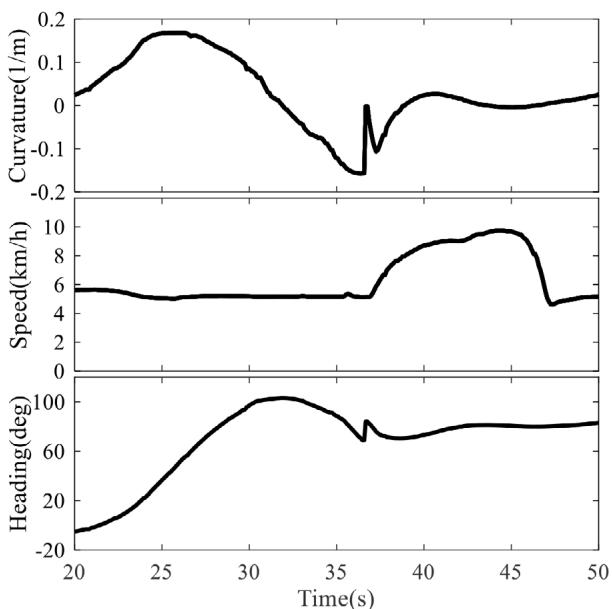

line

| Time(s) | Curvature(1/m) | Speed(km/h) | Heading(deg) |
| ------- | -------------- | ----------- | ------------ |
| 20      | 0.0            | 6           | -15          |
| 25      | 0.2            | 6           | 20           |
| 30      | 0.1            | 6           | 100          |
| 35      | -0.2           | 6           | 70           |
| 40      | 0.0            | 8           | 90           |
| 45      | 0.0            | 10          | 90           |
| 50      | 0.0            | 6           | 90           |

(a) planning command

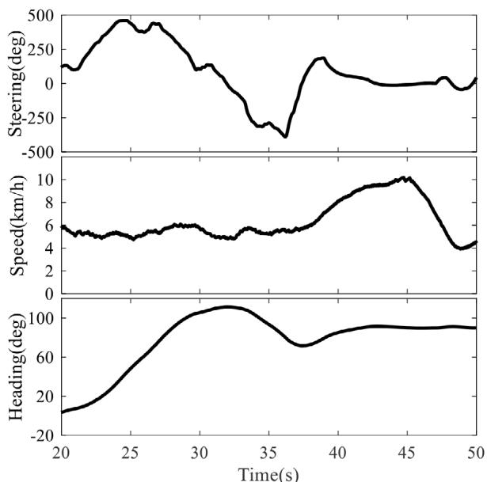

line

| Time(s) | Steering(deg) | Speed(km/h) | Heading(deg) |
| ------- | ------------- | ----------- | ------------ |
| 20      | ~100          | ~6          | ~-15         |
| 25      | ~500          | ~5          | ~60          |
| 30      | ~250          | ~6          | ~100         |
| 35      | ~-300         | ~5          | ~70          |
| 40      | ~200          | ~8          | ~90          |
| 45      | ~100          | ~10         | ~95          |
| 50      | ~0            | ~4          | ~95          |

(b)vehicle response   
FIGURE 27 Ground test by using the proposed contingency planner.

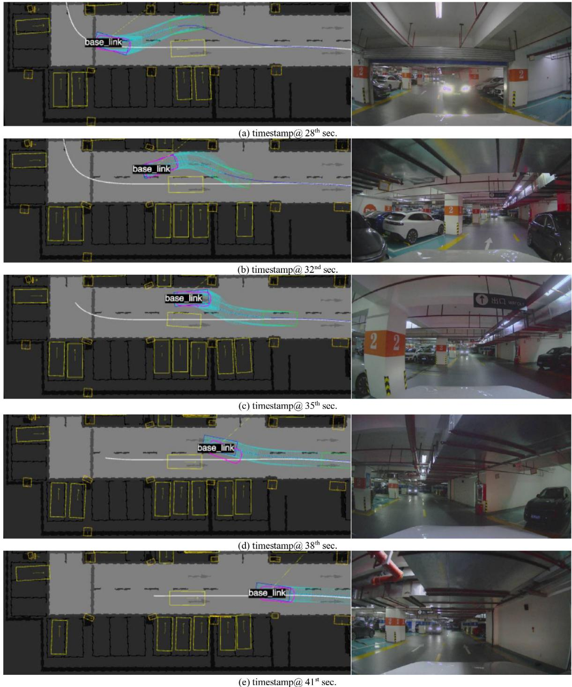  
FIGURE 28 Visualisation and front view of the test vehicle by using the proposed contingency planner.

jectories. Low-speed motion stochasticity in parking lots causes EM Planner’s trajectories to exhibit discontinuous speed/heading changes (e.g., sudden braking/acceleration), degrading comfort and safety.

# 8 Conclusion

The primary objective of this research was to develop a safetycritical, kinematically executable overtaking planning solution for AVP, addressing core challenges of narrow spaces, low-speed motion stochasticity, and non-executable trajectories in existing methods. Through the design and validation of a contingency path-speed iterative algorithm, this work delivers three key outcomes supported by quantitative evidence:

∙ First, the algorithm ensures kinematic executability by converting curvature constraints from Cartesian coordinates to the Frenet frame and integrating contour constraints. In simulations, planned paths maintained a maximum curvature of 0.16 m−1 (well within typical passenger vehicle physical limits), while on-road tests confirmed a max curvature of 0.157

m−1 and a maximum steering wheel angle of 389◦, eliminating non-executable trajectories that plague baseline methods like Apollo EM Planner.   
∙ Second, the hybrid hard-soft constraint design for multimodal obstacle predictions enables reliable overtaking across diverse AVP scenarios. Numerical simulations (Carla simulator) showed the algorithm achieved a 100% overtaking success rate in four complex cases (e.g., obstacles pulling out of parking spaces, junction turns), compared to 0% for the EM Planner (which stalled at 16–40 s or crashed in all scenarios). This performance gain stems from the algorithm’s ability to leverage short-horizon prediction reliability (hard constraints) and long-horizon probabilistic weighting (soft constraints), mitigating low-speed motion uncertainty.   
∙ Third, the integration of historical path and speed costs ensures smooth, real-time operation. The algorithm reduced speed oscillation by over 50% relative to the EM Planner (e.g., in Case 1, max speed deviation from the 20 kph limit was only 4.6 kph, with oscillations limited to ±2 kph) while maintaining a computation time of < 10 ms in simulations and 9.5 ms on a mass-produced MCU, meeting AVP’s real-time deployment requirements.

This study contributes to AVP motion planning by unifying kinematic constraint enforcement, probabilistic uncertainty handling, and interframe continuity in a single framework. The quantitative gains in success rate, trajectory executability, and computational efficiency validate its practical value for massproduced AVP systems.

One limitation of this study is that initial relative distances between the ego and leading vehicle (set to 10–15 m in tests) and extreme multi-modal prediction bifurcation may impact overtaking success rate; future research could integrate a gapacceptance model to adapt to variable initial conditions and explore trust-aware probabilistic planning to address extreme bifurcation. Expanding the algorithm to handle mixed traffic (e.g., pedestrians, non-motorised vehicles) in AVP scenarios would further enhance its generalisability.

# Author Contributions

W. H. was in charge of the conceptualisation, methodology, validation and writing. B. L. was in charge of formal analysis and writing. P. Z. was in charge of data curation and writing. L. X. provided the technical guidance and experimental equipment. All authors read and approved the final manuscript.

# Funding

This work is supported in part by the National Science Funds for Distinguished Young Scholars of China (Grant No. 52325212), in part by National Science Foundation of China (Grant No.52442211), in part by the Industry-University-Research Innovation Fund for Chinese Universities (Grant No. 2024HT010), and in part by the Jiangxi Key Laboratory of Intelligent Connected Vehicle and Powertrain System.

# Conflicts of Interest

The authors declare no conflicts of interest.

# Data Availability Statement

The datasets supporting the conclusions of this article are included within the article.

# References

1. J. Ziegler and C. Stiller, “Spatiotemporal State Lattices for Fast Trajectory Planning in Dynamic on-road Driving Scenarios,” in Proceedings of the IEEE/RSJ International Conference on Intelligent Robots and Systems, 2009 (IROS 2009), (IEEE, 2009), 1879–1884.   
2. B. Li, O. Y, and L. Li, “Autonomous Driving on Curvy Roads Without Reliance on Frenet Frame: A Cartesian-based Trajectory Planning Method,” IEEE Transactions on Intelligent Transportation Systems 23, no. 9 (2022): 15729–15741, https://doi.org/10.1109/TITS.2022.3145389.   
3. M. McNaughton, C. Urmson, J. M. Dolan, and J.-W. Lee, “Motion Planning for Autonomous Driving With a Conformal Spatiotemporal Lattice,” in Proceedings of the 2011 IEEE International Conference on Robotics and Automation (ICRA), (IEEE, 2011), 4889–4895.   
4. Z. Han, Y. Wu, T. Li, et al., “Differential Flatness-based Trajectory Planning for Autonomous Vehicles,” preprint, arXiv:2208.13160v1, August 28, 2022.   
5. C. Huang, H. Huang, P. Hang, et al., “Personalized Trajectory Planning and Control of Lane-change Maneuvers for Autonomous Driving,” IEEE Transactions on Vehicular Technology 70, no. 6 (2021): 5511–5523, https:// doi.org/10.1109/TVT.2021.3076473.   
6. C. Huang, H. Huang, J. Zhang, P. Hang, Z. Hu, and C. Lv, “Human-Machine Cooperative Trajectory Planning and Tracking for Safe Automated Driving,” IEEE Transactions on Intelligent Transportation Systems 23, no. 8 (2022): 12050–12063, https://doi.org/10.1109/TITS.2021.3109596.   
7. M. Ammour, R. Orjuela, and M. Basset, “A MPC Combined Decision Making and Trajectory Planning for Autonomous Vehicle Collision Avoidance,” IEEE Transactions on Intelligent Transportation Systems 23, no. 12 (2022): 24805–24817, https://doi.org/10.1109/TITS.2022. 3210276.   
8. S. Kumari, A. Hota, and S. Mukhopahyay, “Data-Driven Robust Optimization for Energy-aware Safe Motion Planning of Electric Vehicles,” IEEE Transactions on Intelligent Vehicles 10 (2025): 3178–3194, https://doi. org/10.1109/TIV.2024.3449035.   
9. J. Palatti, A. Aksjonov, G. Alcan, and V. Kyrki, “Planning for Safe Abortable Overtaking Maneuvers in Autonomous Driving,” paper presented at the 2021 IEEE Intelligent Transportation Systems Conference (ITSC), Indianapolis, IN, USA, September 19–21, 2021, https://doi.org/10. 1109/ITSC48978.2021.9564499.   
10. Y. Zhang, H. Sun, J. Zhou, et al., “Optimal Vehicle Path Planning Using Quadratic Optimization for Baidu Apollo Open Platform,” paper presented at the 2020 IEEE Intelligent Vehicles Symposium (IV), Las Vegas, USA, October 20–23, 2020, https://doi.org/10.1109/IV47402.2020. 9304787.   
11. W. Xu, Q. Wang, and J. M. Dolan, “Autonomous Vehicle Motion Planning via Recurrent Spline Optimization,” paper presented at the 2021 IEEE International Conference on Robotics and Automation (ICRA2021), Xi’an, China, May 31–June 4, 2021, https://doi.org/10.1109/ICRA48506. 2021.9560867.   
12. H. Fan, F. Zhu, C. Liu, et al., “Baidu Apollo EM Motion Planner,” preprint, arXiv:1807.08048v1, July 20, 2018.   
13. J. Zhou, R. He, and Y. Wang, “Autonomous Driving Trajectory Optimization With Dual-loop Iterative Anchoring Path Smoothing and Piecewise-jerk Speed Optimization,” IEEE Robotics and Automation Letters 6, no. 2 (2021): 439–446, https://doi.org/10.1109/LRA.2020.3045925.   
14. Z. Li, L. Xiong, and B. Leng, “A Unified Trajectory Planning and Tracking Control Framework for Autonomous Overtaking Based on Hierarchical MPC,” paper presented at the 2022 IEEE 25th International Conference on Intelligent Transportation Systems (ITSC), Macau, China, October 8–12, 2022, https://doi.org/10.1109/ITSC55140.2022.9922186.

15. Z. Li, J. Hu, B. Leng, et al., “An Integrated of Decision Making and Motion Planning Framework for Enhanced Oscillation-free Capability,” IEEE Transactions on Intelligent Transportation Systems 25 (2023): 5718– 5732, https://doi.org/10.1109/TITS.2023.3332655.   
16. Z. Li, L. Xiong, B. Leng, P. Xu, and Z. Fu, “Safe Reinforcement Learning of Lane Change Decision Making With Risk-Fused Constraint,” in Proceedings of the IEEE Conference on Intelligent Transportation System (ITSC), (IEEE, September 2023), 1313–1319.   
17. E. Cha, K. Kim, S. Longo, and A. Mehta, “OP-CAS: Collision Avoidance With Overtaking Maneuvers,” paper presented at the 2018 International Conference on Intelligent Transportation Systems (ITSC), Hawaii, USA, November 4–7, 2018, https://doi.org/10.1109/ITSC.2018. 8569740.   
18. Y. Zhang, G. Chen, H. Hu, et al., “Hierarchical Parking Path Planning Based on Optimal Parking Positions,” Automotive Innovation 6 (2023): 220–230, https://doi.org/10.1007/s42154-022-00214-z.   
19. G. Chen, Z. Gao, H. Hu, et al., “Multi-maneuver Vertical Parking Trajectory Planning and Tracking Control in Narrow Environments,” Automotive Innovation 7 (2024): 300–311, https://doi.org/10.1007/s42154- 023-00244-1.   
20. C. Llorca, A. Moreno, and A. Garcia, “Modelling Vehicles Acceleration During Overtaking Maneuvers,” IET Intelligent Transport Systems 10, no. 3 (2024): 206–215, https://doi.org/10.1049/iet-its.2015.0035.   
21. Y. Li, Z. Chen, T. Wang, X. Zeng, and Z. Yin, “Data-Driven Hierarchical Model Predictive Control for Automated Overtaking Maneuver via Gaussian Process Regression,” IEEE Transactions on Vehicular Technology 74, no. 1 (2025): 263–278, https://doi.org/10.1109/TVT.2024.3453170.   
22. X.-F. Wang, W.-H. Chen, J. Jiang, and Y. Yan, “High-level Decisionmaking for Autonomous Overtaking: An MPC-based Switching Control Approach,” IET Intelligent Transport Systems 18 (2024): 1259–1271, https:// doi.org/10.1049/itr2.12507.   
23. P. Huang, L. Zhang, H. Chen, H. Ding, and J. Cao, “Event-triggered Optimisation of Overtaking Decision-making Strategy for Autonomous Driving on Highway,” IET Intelligent Transport Systems 16 (2022): 1794– 1808, https://doi.org/10.1049/itr2.12246.   
24. J. P. Alsterda, M. Brown, and J. Gerdes, “Contingency Model Predictive Control for Automated Vehicles,” paper presented at the 2019 American Control Conference (ACC), Philadelphia USA, July 10–12, 2019, https:// doi.org/10.23919/ACC.2019.8815260.   
25. N. Rhinehart, J. He, C. Packer, et al., “Contingencies From Observations: Tractable Contingency Planning With Learned Behavior Models,” paper presented at the 2021 IEEE International Conference on Robotics and Automation (ICRA), Xi’an, China, May 30–June 5, 2021, https://doi. org/10.1109/ICRA48506.2021.9561683.   
26. U. Lecerf, C. Y. Tchassi, and P. Michiardi, “Safer Autonomous Driving in a Stochastic Partially-observable Environment by Hierarchical Contingency Planning,” preprint, arXiv:2204.06509v1, April 13, 2022.   
27. T. Li, L. Zhang, and S. Liu, “MARC: Multipolicy and Risk-aware Contingency Planning for Autonomous Driving,” IEEE Robotics and Automation Letters 8, no. 10 (2023), https://doi.org/10.1109/LRA.2023. 3310431.   
28. M. Werling, J. Ziegler, S. Kammel, and S. Thrun, “Optimal Trajectory Generation for Dynamic Street Scenarios in a Frenet Frame,” in Proceedings of the IEEE International Conference on Robotics and Automation (ICRA 2010). (IEEE, May 2010), 987–993.   
29. A. Dosovitskiy, G. Ros, F. Codevilla, et al., “CARLA: An Open Urban Driving Simulator,” in Proceedings of the 1stAnnual Conference on Robot Learning, (PMLR, 2017), 1–16.   
30. Baidu Apollo Project, Online: http://apollo.auto/.   
31. B. Stellato, G. Banjac, P. Goulart, A. Bemporad, and S. Boyd, “OSQP:An Operator Splitting Solver for Quadratic Programs.” preprint, arXiv:1711:08013, November 21, 2017.