doi：10.19562/j.chinasae.qcgc.2025.05.003

# 结构化道路下智能车时空联合轨迹规划方法 \*

胡 杰 1，2，3 ，郑嘉辰 1，2，3 ，周思龙 1，2，3 ，赵文龙 1，2，3 ，张志凌 1，2，3 ，姚茂嘉 1，2，3

（ 武汉理工大学，现代汽车零部件技术湖北省重点实验室，武汉 ；

2. 武汉理工大学，汽车零部件技术湖北省协同创新中心，武汉 430070；

3. 新能源与智能网联车湖北工程技术研究中心，武汉 430070）

［摘要］ 针对自动驾驶汽车所应用的时空分离轨迹规划方法易导致车辆灵活性不足，甚至无法在复杂工况下规划出可行轨迹，而现有时空联合轨迹规划方法难以满足结构化道路应用要求的问题，本文提出了一种基于动态规划与数值优化算法的时空联合规划方法。首先，在 坐标系下使用动态规划算法生成时空耦合粗轨迹，过程中采用确定性采样法进行子节点拓展。然后，以粗轨迹为参考在笛卡尔坐标系下构建可行驶时空走廊，建立 优化模型求解最终轨迹。最后，通过仿真验证算法有效性，结果表明，所提出的方法对结构化道路的适应性良好，相较于其他时空联合规划算法，能够更好地平衡通行效率、轨迹舒适性、算法实时性的要求。

关键词：时空联合轨迹规划；动态规划；确定性采样；可行驶时空走廊；NMPC优化

# Spatio-Temporal Unified Planning Method for Intelligent Vehicles on Structured Road

Hu Jie1，2，3 ，Zheng Jiachen1，2，3 ，Zhou Silong1，2，3 ， Zhao Wenlong 1，2，3 Zhang Zhiling1，2，3 & Yao Maojia1，2，3

1. Wuhan University of Technology， Hubei Key Laboratory of Modern Auto Parts Technology， Wuhan 430070；  
2. Wuhan University of Technology， Auto Parts Technology Hubei Collaborative Innovation Center， Wuhan 430070；   
3. Hubei Technology Research Center of New Energy and Intelligent Connected Vehicle Engineering， Wuhan 430070

［Abstract］ For the problem that the spatio-temporal separation trajectory planning method used in autonomous vehicles is prone to insufficient vehicle flexibility， and even cannot generate feasible trajectories under complex working conditions， while the existing spatio-temporal unified trajectory planning method is difficult to meet the requirements of structured road application， a spatio-temporal unified planning method based on dynamic programming and numerical optimization algorithm is proposed. Firstly， the spatio-temporal unified coarse trajectory is generated by dynamic programming algorithm in Frenet coordinate system. In the process， deterministic sampling method is used to expand the child nodes. Then， taking the coarse trajectory as reference， the feasible spatio-temporal corridor is constructed in Cartesian coordinate system， and the NMPC optimization model is established to generate the final trajectory. Finally， the algorithm is verified by simulation. The results show that the proposed algorism has good adaptability to structured road， and can better balance the requirements of traffic efficiency， trajectory comfort and time consumption than other spatio-temporal unified algorithms.

Keywords：spatio-temporal unified planning； dynamic planning； deterministic sampling； feasiblespatio-temporal corridor；NMPC optimization

# 前言

决策规划作为自动驾驶系统的核心模块之一，其主要任务是基于地图、感知、定位、预测等上游信息，生成一条安全、舒适、高效的可行驶轨迹。根据路径求解与速度求解是否相互独立，轨迹规划方法可分为时空分离规划和时空联合规划。

时空分离规划方法将轨迹规划解耦为路径规划和速度规划［1-2］ ，两者分别处理静态障碍物和动态障碍物，从而降低了轨迹规划问题的建模和求解难度，使算法实时性显著提高［3］ 。但路径速度解耦会极大限制轨迹规划的灵活性和适应性，通常只能处理纵横向运动较为独立的简单场景［4］，在换道超车、对向车辆借道等复杂场景下，轨迹规划结果容易陷入次优［5］。

时空联合规划方法在三维空间内开辟可行驶区域并直接求解轨迹，相较于时空分离运动规划方法，其会导致运动规划问题的维度增加进而影响求解效率，但具有更大的轨迹解空间和规划灵活性［6-7］。

在现有时空联合规划研究中， 算法被广泛应用于求解时空耦合粗轨迹［8-9］ ，其考虑了车辆运动学模型，从而保证了轨迹的可行性，同时启发函数的引导一定程度上降低了求解耗时。但由于其直接采样离散的车辆加速度及转向盘转角作为控制量生成轨迹，可能导致求解结果与结构化道路形状不符，且在复杂环境下其启发函数设计困难。 等［10］提出使用基于 的算法直接生成时空域内的车辆轨迹的方法，通过设置采样次数平衡轨迹最优性与算法实时性。在此基础上，Chang 等［11］ 进一步提出了使用Informed RRT\*算法，通过迭代收缩椭圆形采样区域，提升了轨迹点采样效率以及轨迹质量。但是受到 算法随机采样的影响，无法保证相邻规划周期的轨迹稳定性与一致性。 等［12］ 在决策层采用 算法，沿车道结构采样生成候选轨迹集，提升了轨迹对结构化道路的适应性与连续帧规划的稳定性，在此基础上划分同伦类，根据代价函数在每个同伦类中筛选最优轨迹。本文采用动态规划与确定性采样法生成粗轨迹，保证了所生成轨迹符合结构化道路形状，且具有良好的连续帧规划稳定性。采用多维时空网格过滤相似节点，避免了时空域内动态规划的维度爆炸问题。

等［13］ 提出使用梯形走廊构建时空域中的可行驶空间，并使用贝塞尔曲线构建优化模型求解最终轨迹，利用其凸包性质保证连续时间范围内的轨迹安全性，但其在Frenet坐标系中求解轨迹，可能导致自车与障碍物形状发生畸变，且在道路曲率过大时，其施加的运动学可行性约束无法反映真实的车辆模型。Groot 等［14］在 Frenet 坐标系中采用方法线性化非凸问题求解时空耦合粗轨迹，再将粗轨迹转换至笛卡尔坐标系下，通过非线性优化法对粗轨迹进行平滑处理，使用完整的车辆运动学模型保证轨迹可行性，受此启发，本文基于粗轨迹在笛卡尔坐标系中构建时空可行驶走廊，使用算法构建非线性优化模型，保证轨迹可行性与安全性约束的准确性。

综上，针对动态场景下时空分离规划方法灵活性与适应性不足，以及现有时空联合规划方法难以满足结构化道路应用要求的问题，本文提出一种分层的时空联合轨迹规划方法（图 ）。具体工作如下：

（）采用动态规划法与确定性采样法迭代生成时空耦合粗轨迹，保证生成轨迹符合结构化道路形状。在采样过程中根据SDNAM模型评估横向采样密度需求，平衡轨迹完备性与算法效率。  
（）使用多维时间网格存储动态规划子节点，对网格内相似节点进行代价评估与筛选，避免维度爆炸问题，提升算法实时性。  
（）在笛卡尔坐标系下，根据粗轨迹铺设圆形元素的可行驶走廊，构建时空域内的凸空间，并基于算法搭建横纵向耦合的非线性优化模型，求解车辆轨迹。  
（4）基于VTD搭建闭环仿真平台，选取不同道路形状下的两种典型工况，验证所提出算法的有效性。

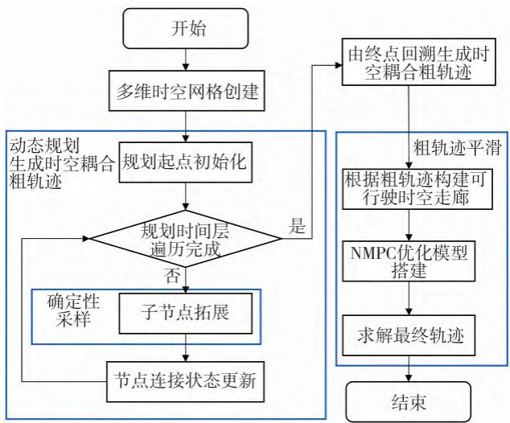

flowchart

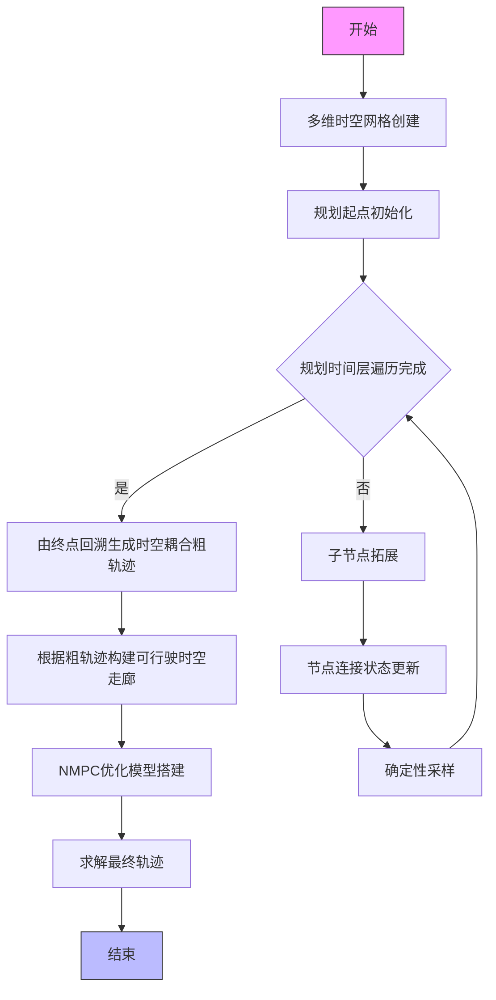

图 　算法整体架构图

# 1　时空耦合粗轨迹生成

轨迹规划模块通常可分为行为决策层和运动规划层。其中行为决策层为车辆生成“跟车”、“换道”、“自车道避障”等策略，其计算结果为语义级决策信息，或包含决策信息的粗轨迹［15］ 。本文提出基于动态规划与确定性采样的时空耦合粗轨迹生成方法，在复杂场景下实现灵活智能的行为决策。

# 1. 1　多维时空节点网格创建

由于本文的研究场景为结构化道路，为简化运动建模，使用Frenet坐标系进行场景描述。为了对时空域内的车辆状态进行精确描述，使用时空状态晶格［16］描述车辆轨迹点信息。

动态规划算法的子节点采样密度对于轨迹完备性与耗时具有关键影响，若子节点过于稀疏，将导致车辆难以通过狭窄与拥堵路段；若子节点过于密集，随着节点的进一步拓展，将产生维度爆炸的问题，导致算法难以满足实时性要求。为了在复杂环境中保证轨迹完备性，同时避免算法耗时过长，在不显著降低采样密度的前提下，在相对时间、纵向位置、横向位置、航向角 个维度对节点进行网格划分和储存，如图 所示。对处于同一网格内的节点，通过代价函数进行评估，每个网格内仅保留代价值最低的节点。

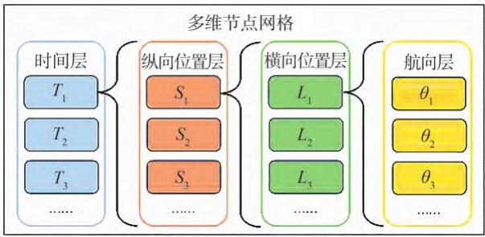

flowchart

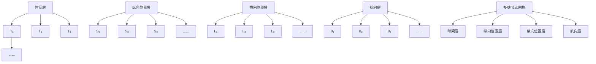

图 　多维节点网格示意图

# 1. 2　时空域动态规划流程

时空域内动态规划算法根据规划时间步长迭代进行，以车辆当前状态创建初始节点，向下一时间层拓展子节点，并进行节点可行性检查与代价计算，根据代价值更新节点连接关系。在下一规划时间层，将该层所有节点作为父节点，重复子节点拓展与连接关系更新过程，直至所有时间层遍历完成，选取规划终点并回溯车辆轨迹。动态规划整体流程见表 。

表1　时空域动态规划伪代码

<table><tr><td>算法1时空域动态规划算法流程</td></tr><tr><td>输入:车辆状态信息,道路信息,时空节点网格</td></tr><tr><td>输出:时空耦合粗轨迹</td></tr><tr><td>1. Initialize the start node of node_graph</td></tr><tr><td>2. For each time_layer ∈ node_graph</td></tr><tr><td>3. For each nodei ∈ node_graph</td></tr><tr><td>4. take nodei as parent node;</td></tr><tr><td>5. execute child node extension from parent node</td></tr><tr><td>6. calculate the cost of child node and filter the node with lowest cost in each grid</td></tr><tr><td>7. update the connection status of nodes in node_graph</td></tr><tr><td>8. End For</td></tr><tr><td>9. select the node with lowest cost in latest layer as target node</td></tr><tr><td>10. trackback from the target node to the planning start node and construct the coarse trajectory</td></tr><tr><td>11. End For</td></tr><tr><td>12. return the coarse trajectory</td></tr></table>

动态规划过程中，子节点拓展过程可分为纵向拓展与横向拓展过程。

# 节点纵向拓展

考虑到车辆动力学约束，纵向采用离散的加速度$a$ 作为控制变量。离散加速度集的分布以 为基准，在[a\_min，a\_max]区间内向两侧采样加速度，定义父节点为 $N _ { \mathrm { p } } ,$ ，子节点为 $N _ { \mathrm { i } }$ ，节点纵向拓展遵循以下公式：

$$
\left\{ \begin{array}{l} s _ {\mathrm{i}} = s _ {\mathrm{p}} + \int_ {t _ {\mathrm{p}}} ^ {t _ {\mathrm{i}}} (v \times \cos \theta) \mathrm{d} t \\ v _ {\mathrm{i}} = v _ {\mathrm{p}} + \int_ {t _ {\mathrm{p}}} ^ {t _ {\mathrm{i}}} a \mathrm{d} t \end{array} \right. \tag {1}
$$

式中 $: s _ { \mathrm { p } }$ 与 $s _ { \mathrm { i } }$ 分别为父节点与子节点的纵向位置 $; v _ { \mathrm { i } }$ 为车辆纵向速度 $; a$ 为纵向加速度；θ为车辆航向角；$t _ { \mathrm { p } }$ 与 $t _ { \mathrm { i } }$ 分别为父节点与子节点对应的时间。

车辆在结构化道路上行驶时，应避免航向角θ过度偏离道路方向，为简化运动建模过程，对θ采用小角度假设，即 $\cos \theta = 1$ 。

在此基础上，采用二次多项式连接父节点和子节点的纵向状态。

# 节点横向拓展

为了避免车辆在短时间内多次朝同一方向变换车道，约束单帧规划中的横向规划范围，处于以当前车道为中心的至多 条相邻车道内，故车道数量增多不对本文算法产生实质性影响。同时考虑到车辆在结构化道路行驶应当具有一定的动作倾向，例如尽可能保持车道中心行驶，换道时快速平滑地切换至目标车道，这些行为直接表现为车辆横向位置不同。因此以横向偏移量l作为采样变量。考虑到车辆保持车道中心通行的需求，从车道中心线向左右两侧采样，直至到达规划边界。

为避免采样密度不合理导致的轨迹完备性不足和算法耗时过高的问题，提出采样密度需求评估模型（sampling density need assessment model，SDNAM），计算节点拓展的横向采样密度。首先根据当前节点时间层，获取所有障碍物预测状态，基于纵向拓展过程中获得的子节点纵向位置，在障碍物密集的区域采用较大的横向采样密度，以提高车辆规划路径的完备性；在障碍物稀疏的区域采用较小的横向采样密度，以减少计算量，提升算法实时性。模型根据节点与障碍物预测位置的纵向距离，进行风险计算。根据节点处车速状态，定义纵向安全距离 $D _ { \mathrm { s } }$ ：

$$
D _ {\mathrm{s}} = k _ {\mathrm{D}} \cdot v _ {\mathrm{i}} \tag {2}
$$

式中： $k _ { \mathrm { D } }$ 为预定义系数 $; v _ { \mathrm { i } }$ 为节点处车辆纵向速度。

当自动驾驶车辆与障碍物纵向距离超过 $D _ { \mathrm { s } }$ 时，认为障碍物距离自车过远，其不对自车造成行驶风险；当自动驾驶车辆在节点处与障碍物在纵向方向发生重叠时，则其所造成的行驶风险达到峰值；否则，风险值随车辆与障碍物的纵向距离缩短而增大。采样密度需求评估模型可表示为

$$
\left\{ \begin{array}{l} A _ {\text {sum}} = \sum_ {j = 1} ^ {N} A _ {j} \\ A _ {j} = \left\{ \begin{array}{l l} 0, & d _ {\mathrm{s}} \in (D _ {\mathrm{s}}, \infty) \\ k _ {\mathrm{A}} \times \left(D _ {\mathrm{s}} - d _ {\mathrm{s}}\right) ^ {2}, & d _ {\mathrm{s}} \in [ 0, D _ {\mathrm{s}} ] \end{array} \right. \\ \Delta l = \left\{ \begin{array}{l l} \Delta l _ {\mathrm{u}}, & A _ {\text {sum}} \in (0, A _ {1}) \\ \Delta l _ {1} + \frac {A _ {\text {sum}} - A _ {1}}{A _ {\mathrm{u}} - A _ {1}} \times (\Delta l _ {\mathrm{u}} - \Delta l _ {1}), & \\ & A _ {\text {sum}} \in [ A _ {1}, A _ {\mathrm{u}} ] \\ \Delta l _ {1}, & A _ {\text {sum}} \in (A _ {\mathrm{u}}, \infty) \end{array} \right. \end{array} \right. \tag {3}
$$

式中： $; N$ 为该时刻存在的预测障碍物的总数量； $\mathsf { \Omega } _ { \mathrm { { i } } } k _ { \mathrm { { A } } }$ 为 风险系数； $; d _ { \mathrm { s } }$ 为自动驾驶车辆与障碍物的纵向距离； $\Delta l _ { \mathrm { u } }$ 和 $\Delta l _ { \parallel }$ 分别为最大和最小横向采样步长 ${ \mathrm { ; } } A _ { \mathrm { u } }$ 和A 分 别为采取最大和最小采样步长时对应的行驶风险评 估值。行驶风险评估值见图 $3 ,$ 。

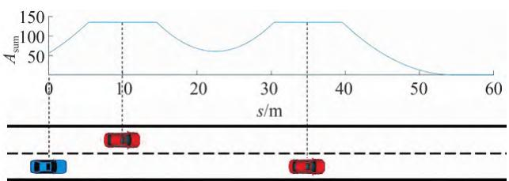

line

| s/m | A_sum |
| --- | --- |
| 0   | 50  |
| 10  | 125 |
| 20  | 75  |
| 30  | 125 |
| 40  | 125 |
| 50  | 50  |
| 60  | 0   |

图 　行驶风险评估值

节点横向拓展遵循以下公式：

$$
\left\{ \begin{array}{l} l _ {\mathrm{i}} = l _ {\mathrm{p}} + \int_ {s _ {\mathrm{p}}} ^ {s _ {\mathrm{i}}} (\mathrm{d} l) \mathrm{d} s \\ \mathrm{d} l _ {\mathrm{i}} = \mathrm{d} l _ {\mathrm{p}} + \int_ {s _ {\mathrm{p}}} ^ {s _ {\mathrm{i}}} (\mathrm{d} \mathrm{d} l) \mathrm{d} s \\ \mathrm{d} \mathrm{d} l _ {\mathrm{i}} = \mathrm{d} \mathrm{d} l _ {\mathrm{p}} + \int_ {s _ {\mathrm{p}}} ^ {s _ {\mathrm{i}}} (\mathrm{d} \mathrm{d} \mathrm{d} l) \mathrm{d} s \end{array} \right. \tag {4}
$$

式中：l为横向位置；l、 l、 l分别为l对s的 阶、2阶、3阶导数。

横向拓展完成后，采用四次多项式连接父节点和子节点的横向状态。

# 1. 2. 3　节点时空状态耦合

根据节点横纵向拓展结果，可以确定子节点横纵向状态。为进行更精确的节点可行性检查，以更小的固定时间间隔dt将动态规划时间进一步离散化为N段，根据多项式获得子节点拓展过程中的过渡节点集 $T _ { { \scriptscriptstyle m } } = \{ P _ { { \scriptscriptstyle 1 } } ^ { i } , P _ { { \scriptscriptstyle 2 } } ^ { i } , \cdots \} _ { \scriptscriptstyle \mathrm { c } }$ 。对子节点与过渡节点集进行碰撞检查、运动学约束检查以及可行驶区域边界检查。若子节点同时通过上述检查，则认为子节点可行，否则丢弃该子节点。

综上，时空子节点拓展过程伪代码如表2所示。

表 2　时空节点拓展伪代码

<table><tr><td colspan="2">算法2时空节点拓展算法流程</td></tr><tr><td colspan="2">输入:车辆配置参数,道路信息,障碍物信息,父节点 $N_i$ ,时空节点网格node_graph</td></tr><tr><td colspan="2">输出:更新后的时空节点网格</td></tr><tr><td colspan="2">13. For each  $a \in sample\_a\_list$ </td></tr><tr><td colspan="2">14. calculate the longitudinal quadratic polynomial;</td></tr><tr><td colspan="2">15. update longitudinal position  $s_i$ ;</td></tr><tr><td colspan="2">16. calculate  $A_j$  of the sample node through the SDNAM</td></tr><tr><td colspan="2">17. generate sample_l_list</td></tr><tr><td colspan="2">18. For each  $l \in sample\_l\_list$ </td></tr><tr><td colspan="2">19. calculate the lateral cubic polynomial;</td></tr><tr><td colspan="2">20. update lateral position;</td></tr><tr><td colspan="2">21. combine the longitudinal and lateral polynomial to form the trajectory from  $N_i$  to sample node  $N_{i+1}$ ;</td></tr><tr><td colspan="2">22. If  $N_{i+1}$  is in collision or kinematic inaccessible</td></tr><tr><td colspan="2">23. continue;</td></tr><tr><td colspan="2">24. End</td></tr><tr><td colspan="2">25. calculate the total cost of node  $N_{i+1}$  as  $C_{i+1}$ ;</td></tr><tr><td colspan="2">26. calculate the grid_id of  $N_{i+1}$  in the node_graph;</td></tr><tr><td colspan="2">27. If  $C_{i+1}<$  the total cost at node_graph(grid_id);</td></tr><tr><td colspan="2">28. replace the node at node_graph( $grid_{id}$ ) with  $N_{i+1}$ ;</td></tr><tr><td colspan="2">29. End</td></tr><tr><td colspan="2">30. End For</td></tr><tr><td colspan="2">31. End For</td></tr><tr><td colspan="2">32. return the updated node_graph</td></tr></table>

# 1. 3　时空节点代价函数设计

子节点代价指规划起始节点到当前节点的总耗散代价，由父节点的累计代价 $G _ { \mathrm { p } }$ 以及父节点向子节点的扩展代价 $G _ { e }$ 两部分构成，可表示为

$$
G _ {\mathrm{i}} = G _ {\mathrm{p}} + G _ {\mathrm{e}} \tag {5}
$$

节点之间拓展代价 $G _ { \mathrm { e } }$ 包含通行效率代价 $E _ { \mathrm { i } }$ 、舒适性代价 $C _ { \mathrm { i } }$ 、车道偏离代价 $O _ { \mathrm { i } }$ 和安全性代价 $S _ { \mathrm { i } }$ ，可表示为

$$
G _ {\mathrm{e}} = w _ {\mathrm{e}} \times E _ {\mathrm{i}} + w _ {\mathrm{c}} \times C _ {\mathrm{i}} + w _ {\mathrm{o}} \times O _ {\mathrm{i}} + w _ {\mathrm{s}} \times S _ {\mathrm{i}} \tag {6}
$$

式中 $w _ { \mathrm { e } } \setminus w _ { \mathrm { c } } \setminus w _ { \mathrm { c } }$ 和 $w _ { \mathrm { { s } } }$ 分别表示对应代价项的权重。

通行效率代价 $E _ { i }$ 通过节点的速度 $v _ { \mathrm { i } }$ 与当前行驶任务下期望车速 $v _ { \mathrm { e } }$ 的偏差衡量，可表示为

$$
E _ {\mathrm{i}} = \left| v _ {\mathrm{i}} - v _ {\mathrm{e}} \right| \tag {7}
$$

舒适性代价 $C _ { \mathrm { i } }$ 包括横向舒适性代价 $C _ { \mathrm { i } } ^ { \mathrm { l } }$ 和纵向舒适性代价 $C _ { \mathrm { i } } ^ { \mathrm { s } }$ ，分别通过节点处车辆的纵向加速度$a$ ，以及横向偏移量l对纵向位置s的2阶导数ddl衡量，该代价可表示为

$$
\left\{ \begin{array}{l} C _ {\mathrm{i}} = w _ {\mathrm{cl}} \times C _ {\mathrm{i}} ^ {1} + w _ {\mathrm{cs}} \times C _ {\mathrm{i}} ^ {\mathrm{s}} \\ C _ {\mathrm{i}} ^ {1} = \mathrm{dd} l _ {\mathrm{i}} ^ {2} \\ C _ {\mathrm{i}} ^ {\mathrm{s}} = a _ {\mathrm{i}} ^ {2} \end{array} \right. \tag {8}
$$

式中 $w _ { \mathrm { c l } }$ 和 $w _ { \mathrm { c s } }$ 分别表示横向舒适性和纵向舒适性的权重。

车道偏离代价 $O _ { \mathrm { i } }$ 包括车道边界风险代价 $O _ { \mathrm { i } } ^ { \mathrm { l } }$ 和道路边界风险代价 $O _ { \mathrm { i } } ^ { \mathrm { r } }$ ，该代价由道路风险场衡量［17］。以单向双车道为例，道路风险场模型如图 所示，车道中心位置处代价值最低，促使车辆尽可能沿车道中心行驶，但如果车辆通行受限，更高的通行效率代价可引导车辆穿过车道边界，实现换道动作；同时道路边界处代价值极高，促使车辆远离道路边界。车道偏离代价可表示为

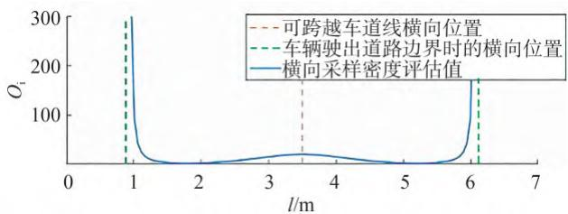

line

| l/m | Q_i (可跨越车道线横向位置) | Q_i (车辆驶出道路边界时的横向位置) | Q_i (横向采样密度评估值) |
| --- | --- | --- | --- |
| 1 | 300 | 300 | 300 |
| 2 | 50 | 50 | 50 |
| 3 | 50 | 50 | 50 |
| 4 | 50 | 50 | 50 |
| 5 | 50 | 50 | 50 |
| 6 | 180 | 180 | 180 |
| 7 | 180 | 180 | 180 |

图4　道路风险场

$$
\left\{ \begin{array}{l} O _ {\mathrm{i}} = w _ {\mathrm{l}} \times O _ {\mathrm{i}} ^ {1} + w _ {\mathrm{r}} \times O _ {\mathrm{i}} ^ {\mathrm{r}} \\ O _ {\mathrm{i}} ^ {1} = \exp \left(- \frac {d _ {\mathrm{lb}} ^ {2}}{v _ {\text {decay}} ^ {2}}\right) \\ O _ {\mathrm{i}} ^ {1} = \frac {1}{d _ {\mathrm{rb}} ^ {2}} \end{array} \right. \tag {9}
$$

式中： $w _ { 1 }$ 为车道边界代价权重； $w _ { \mathrm { \scriptscriptstyle I } }$ 为道路边界代价权重 $\div { \boldsymbol { v } } _ { \mathrm { d e c a y } }$ 为车道风险场强变化速度； $\vert d _ { \mathrm { l b } }$ 为节点到最近的车道边界的距离； $d _ { \mathrm { r b } }$ 为节点到最近的横向规划边界的距离。

节点安全性代价 $S _ { \mathrm { i } }$ 为所有障碍物造成的安全性代价之和，可表示为

$$
\left\{ \begin{array}{l} S _ {\mathrm{i}} = \sum_ {j = 1} ^ {N} R _ {j} \\ R _ {j} = \left\{ \begin{array}{l l} 0, & d _ {\mathrm{s}} \in (D _ {\mathrm{s}}, \infty) \text {或} d _ {1} \in (D _ {1}, \infty) \\ d _ {\mathrm{s}} ^ {2} + d _ {1} ^ {2}, & d _ {\mathrm{s}} \in [ 0, D _ {\mathrm{s}} ] \text {且} d _ {1} \in [ 0, D _ {1} ] \end{array} \right. \end{array} \right. \tag {10}
$$

式中： $R _ { j }$ 为第j个障碍物造成的安全性代价； $N$ 为对应时刻出现的障碍物数量； $; d _ { \mathrm { s } }$ 与 $d _ { \mathrm { { l } } }$ 分别为自车与障碍物的纵向距离和横向距离； $D _ { \mathrm { s } }$ 与 $D _ { 1 }$ 分别为预定义纵向与横向安全距离。

# 2　轨迹后处理

由于此前生成的离散轨迹点集不够平滑，故构建优化模型，须对初始轨迹进行平滑处理。为了保证碰撞约束与运动学可行性约束的精确性，并确保算法能够良好适配弯道场景，轨迹后处理过程在笛卡尔坐标系中进行［18］。

# 2. 1　可行驶时空走廊生成

考虑到环境中的动静态障碍物会导致自车在三维运动空间下的可行驶区域严重非凸，引入可行驶时空走廊，以构建优化问题的凸可行集，避免路径陷入局部最优，同时提升优化问题求解效率［19］。

将动态规划初始轨迹转换至笛卡尔坐标系下，构成一组表达可行驶运动状态序列的粗轨迹点集$T _ { \mathrm { r } }$ ，并铺设时空走廊，从而定义三维时空范围内自车可行驶空间。走廊元素表现为道路平面上的以粗轨迹点为圆心的圆，所有走廊元素边界的包络线内部即为可行驶时空走廊。以第 $n$ 个粗轨迹点 $P _ { n }$ 为例，圆形走廊元素的生成过程（图 ）为：抽取对应时刻的自车与预测障碍物运动状态，采用有向包围盒（ ， ）对自车与障碍物进行等价描述，走廊元素定义如下：

$$
\left\{ \begin{array}{l} \left(x _ {n}, y _ {n}\right) = \left(x _ {P _ {n}}, y _ {P _ {n}}\right), \quad n = [ 0, 1, \dots , M ] \\ R _ {n} = \min \left(d _ {\mathrm{O}}, d _ {\mathrm{R}}, d _ {\mathrm{E}}\right) \end{array} \right. \tag {11}
$$

式中： $\left( x _ { n } , y _ { n } \right)$ 为第 $n$ 个圆形走廊元素的中心位置； $R _ { r }$ 为对应的半径； $; d _ { 0 }$ 为自车与障碍物包围盒的最短距离； $; d _ { \mathrm { R } }$ 为自车包围盒与道路边界的最小距离； $d _ { \mathrm { E } }$ 为

走廊元素半径上限。

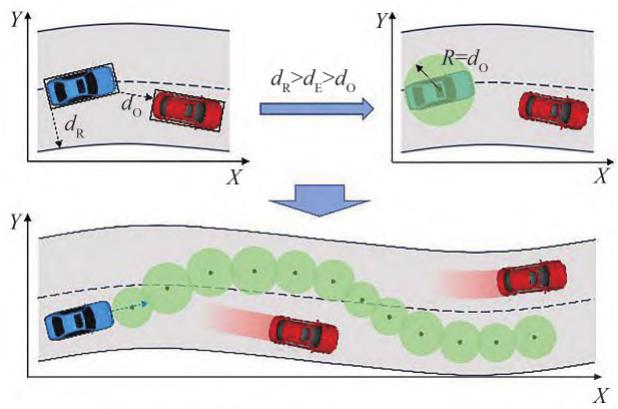

text_image

Y
X
Y
X
d_R > d_E > d_O
R=d_O
Y
X

图 　可行驶时空走廊开辟示意图

该圆内部为轨迹点的可分布范围，由走廊元素的生成过程可知，当对应时刻轨迹点的位置始终位于圆形边界范围内，即可确保自车与障碍物严格无碰撞，则走廊元素内部为轨迹优化问题的凸空间。

# 2. 2　基于NMPC的时空耦合轨迹优化

算法能够使用完整的车辆运动学模型构建状态转移公式，充分考虑车辆的动态特性和约束条件［20］ ，因此本文基于 构建轨迹优化模型。为了保证轨迹点的可行性，将车辆加速度a和前轮转角δ作为控制量，构建以下状态转移公式：

$$
\left\{ \begin{array}{l} x _ {k + 1} = x _ {k} + v _ {k} \times \mathrm{d} t \times \cos \theta_ {k} \\ y _ {k + 1} = y _ {k} + v _ {k} \times \mathrm{d} t \times \sin \theta_ {k} \\ \theta_ {k + 1} = \theta_ {k} + \frac {v _ {k} \times \mathrm{d} t}{L} \times \tan \delta_ {k} \\ v _ {k + 1} = v _ {k} + a _ {k} \times \mathrm{d} t \end{array} \right. \tag {12}
$$

式中： $\textstyle ( x , y )$ 为车辆位置；v为车辆质心速度；θ为车辆航向角相对于道路航向的偏移量；L为车辆轴距；k与k 表示当前时刻与下一采样时刻；t为离散时间增量。

优化模型目标函数考虑了优化轨迹与初始轨迹的偏离代价、轨迹与车道中心线的偏离代价以及舒适性代价，可表示为

$$
\begin{array}{l} C = w _ {\mathrm{d}} \cdot d _ {\mathrm{r}} ^ {2} + w _ {\mathrm{cen}} \cdot d _ {\mathrm{c}} ^ {2} + w _ {\mathrm{v}} \cdot (v - v _ {\mathrm{ref}}) ^ {2} + \\ w _ {\mathrm{com} 1} \cdot a _ {\mathrm{lon}} ^ {2} + w _ {\mathrm{com} 2} \cdot a _ {\mathrm{lat}} ^ {2} \tag {13} \\ \end{array}
$$

式中： $d _ { \mathrm { r } }$ 与 $d _ { \mathrm { c } }$ 分别为优化后轨迹点与粗轨迹点的距离、优化后轨迹点与车道中心线的距离，这两项均在笛卡尔坐标系中计算得出 ${ \mathfrak { s v } } _ { \cdot } a _ { \mathrm { l o n } }$ 和 $a _ { \mathrm { l a t } }$ 分别为优化轨迹点处的车辆速度、车辆纵向和横向加速度； $; v _ { \mathrm { r e f } }$ 为粗轨迹点处的车辆速度； $w _ { \mathrm { d } } \setminus w _ { \mathrm { c e n } } \setminus w _ { \mathrm { v } } \setminus w _ { \mathrm { c o m l } }$ 和 $w _ { \mathrm { c o m } 2 }$ 分别为对应惩罚性的权重系数。

基于前述时空走廊计算出的节点优化边界，构造轨迹点位置约束，同时，根据车辆动力学限制，为节点施加速度、加速度、前轮转角约束。使用粗轨迹点集T 为优化问题提供热启动，提高计算效率。

# 3　仿真分析

本节基于 软件搭建闭环仿真平台（图 ），验证所提出算法的有效性，并展示不同算法的性能指标对比，以及优化前后的轨迹性能对比。

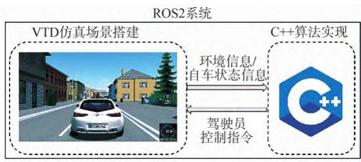

flowchart

图6　仿真平台架构

# 3. 1　仿真环境搭建

设置车辆行驶环境为双向四车道，为便于进行场景描述，使用 坐标系描述车辆位置及状态量。以最右侧车道的右边界为l轴基准，向左为正方向；与l轴垂直的某纵向位置为s轴基准，向前为正方向。

仿真车辆及其他实验相关参数如表 所示。

表3　实验相关参数

<table><tr><td>参数</td><td>数值</td></tr><tr><td>车长/m</td><td>4.6</td></tr><tr><td>车宽/m</td><td>1.8</td></tr><tr><td>轴距/m</td><td>2.7</td></tr><tr><td>最大前轮转角/(°)</td><td>40</td></tr><tr><td>最高车速/(m·s-1)</td><td>15</td></tr><tr><td>期望车速/(m·s-1)</td><td>14</td></tr><tr><td>加速度范围/(m·s-2)</td><td>[-4,4]</td></tr><tr><td>离散加速度候选集A</td><td>{-4,-3,-2,-1,0,1,2,3,4}</td></tr><tr><td>规划时域T/s</td><td>7</td></tr><tr><td>车道宽度/m</td><td>3.5</td></tr></table>

# 3. 2　仿真实验与结果分析

# 3. 2. 1　场景 1

该场景为直线道路。初始状态自车位置为， ，车速 $v _ { \mathrm { h } } = 1 2 \mathrm { m } / \mathrm { s }$ ，纵向加速度为 。自车所处车道前方存在同向的低速车辆 $O _ { \imath }$ ，从初始位置(25 m，5. 25 m) 处，以6 m/s的车速低速行驶；相邻右侧车道有同向的低速车辆 $O _ { 2 }$ ，从 (40 m，1. 75 m)的初始位置处，以8 m/s的车速低速行驶。

下方展示了场景 的仿真效果，图 为场景 中自车及障碍物的空间占据情况；图8和图9为该场景下本文算法与 Lattice 算法［21］ 、基于 Hybrid A\*的时空联合规划算法［6］ 生成的路径与速度曲线的对比；图与图 分别为本文算法粗轨迹、优化后轨迹与对比算法的纵向及横向加速度曲线。由于加速度值的符号代表其方向，对舒适性作用并无影响，因此，下文中横纵向加速度均指其对应的绝对值。

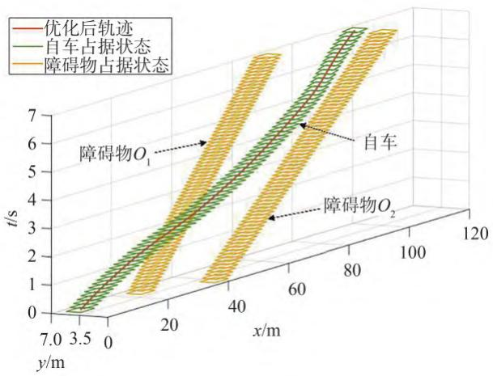

line

| x/m | t/s (优化后轨迹) | t/s (自车占据状态) | t/s (障碍物占据状态) |
|-----|------------------|--------------------|----------------------|
| 0   | 0.0              | 0.0                | 0.0                  |
| 20  | 1.0              | 1.0                | 1.0                  |
| 40  | 2.0              | 2.0                | 2.0                  |
| 60  | 3.0              | 3.0                | 3.0                  |
| 80  | 4.0              | 4.0                | 4.0                  |
| 100 | 5.0              | 5.0                | 5.0                  |
| 120 | 6.0              | 6.0                | 6.0                  |

图7　场景1时空轨迹示意图

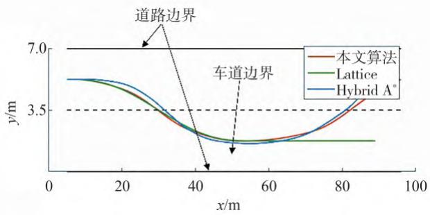

line

| x/m | 本文算法 | Lattice | Hybrid A* |
| --- | -------- | ------- | --------- |
| 0   | 7.0      | 7.0     | 7.0       |
| 20  | 6.5      | 6.5     | 6.5       |
| 40  | 3.5      | 3.5     | 3.5       |
| 60  | 3.5      | 3.5     | 3.5       |
| 80  | 6.5      | 3.5     | 6.5       |
| 100 | 7.0      | 3.5     | 7.0       |

图 　场景 不同算法路径曲线

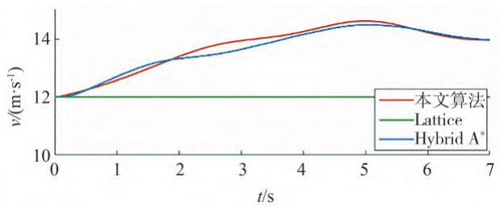

line

| t/s | 本文算法 | Lattice | Hybrid A* |
| --- | -------- | ------- | --------- |
| 0   | 12.0     | 12.0    | 12.0      |
| 1   | 12.5     | 12.0    | 12.5      |
| 2   | 13.0     | 12.0    | 13.0      |
| 3   | 13.5     | 12.0    | 13.5      |
| 4   | 14.0     | 12.0    | 14.0      |
| 5   | 14.5     | 12.0    | 14.5      |
| 6   | 14.0     | 12.0    | 14.0      |
| 7   | 13.5     | 12.0    | 13.5      |

图 　场景 不同算法速度曲线

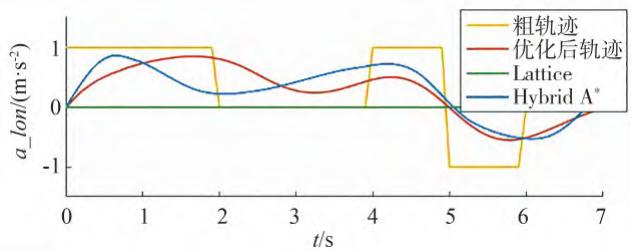

line

| t/s | 粗轨迹 | 优化后轨迹 | Lattice | Hybrid A* |
| --- | --- | --- | --- | --- |
| 0 | 1.0 | 0.0 | 0.0 | 0.0 |
| 1 | 1.0 | 0.8 | 0.0 | 0.8 |
| 2 | 1.0 | 0.6 | 0.0 | 0.2 |
| 3 | 1.0 | 0.4 | 0.0 | 0.6 |
| 4 | 1.0 | 0.2 | 0.0 | 0.8 |
| 5 | -1.0 | -0.2 | 0.0 | -0.2 |
| 6 | -1.0 | -0.6 | 0.0 | -0.6 |
| 7 | -1.0 | -0.2 | 0.0 | -0.2 |

图 　场景 不同算法纵向加速度曲线  
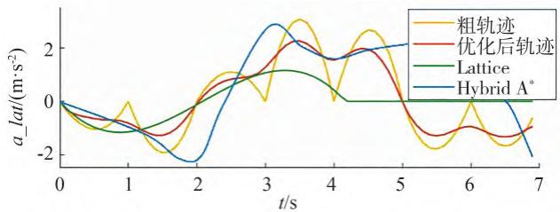

line

| t/s | 粗轨迹 (m·s⁻²) | 优化后轨迹 (m·s⁻²) | Lattice (m·s⁻²) | Hybrid A* (m·s⁻²) |
| --- | --- | --- | --- | --- |
| 0   | 0.0 | 0.0 | 0.0 | 0.0 |
| 1   | -0.5 | -0.8 | -1.0 | -0.6 |
| 2   | -1.5 | -1.2 | -1.5 | -2.0 |
| 3   | 0.5 | 1.0 | 1.2 | 2.5 |
| 4   | 2.0 | 1.5 | 1.0 | 1.8 |
| 5   | 1.5 | 1.2 | 0.8 | 2.0 |
| 6   | -0.5 | -0.8 | 0.5 | 1.5 |
| 7   | -1.0 | -1.2 | 0.0 | -2.0 |

图 　场景 不同算法横向加速度曲线

固定的规划时长内，轨迹的通行效率可体现为车辆的纵向通行距离，轨迹舒适性可通过车辆横纵向加速度衡量，场景 中不同算法的性能指标如表所示。

表4　场景1算法性能对比

<table><tr><td>算法</td><td>纵向通行距离/m</td><td>纵向加速度峰值/平均值/(m·s-2)</td><td>横向加速度峰值/平均值/(m·s-2)</td></tr><tr><td>本文算法粗轨迹</td><td>96.4</td><td>1.00/0.57</td><td>2.95/1.25</td></tr><tr><td>本文算法优化后</td><td>96.4</td><td>0.84/0.45</td><td>2.13/1.11</td></tr><tr><td>Lattice算法</td><td>84.0</td><td>0.00/0.00</td><td>1.17/0.45</td></tr><tr><td>Hybrid A*算法</td><td>94.3</td><td>0.94/0.51</td><td>2.77/1.56</td></tr></table>

分析优化前后轨迹横纵向加速度数据，可发现经过 优化处理后，横纵向加速度曲线折点消失，且峰值与平均值均有下降，说明轨迹具有更好的舒适性。

场景 的仿真结果说明，本文算法在单帧规划中在横纵向均可以生成多次变化的行驶动作，因此较 算法具有更强的灵活性，能够获得更高的通行效率。同时，本文算法无须启发函数作为引导，避免了因复杂环境下启发函数设计难度大、质量差，导致的轨迹计算结果不合理。

# 3. 2. 2　场景 2

为验证算法在不同结构道路下的适应性，设置场景 为弯道场景。自车初始状态与场景 相同，自车前方存在同向行驶的车辆 $O _ { \imath }$ ，从初始位置， 处，以 的速度匀速行驶。自车相 邻 右 侧 车 道 存 在 静 止 车 辆 $O _ { 2 }$ ，停 放 在(40 m，1. 75 m) 位置处。

图 图 展示了场景 的仿真结果，分别对应场景1的图7\~图11。

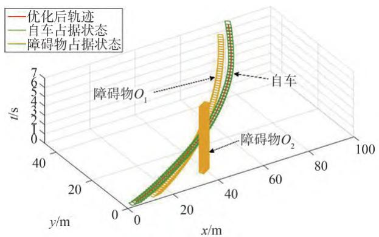

surface_3d

| x/m | y/m | t/s |
| --- | --- | --- |
| 0 | 0 | 0 |
| 20 | 0 | 1 |
| 40 | 0 | 7 |
| 60 | 0 | 5 |
| 80 | 0 | 3 |
| 100 | 0 | 1 |

图12　场景2时空轨迹示意图  
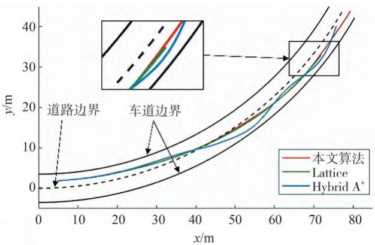

line

| x/m | 本文算法 | Lattice | Hybrid A* |
| --- | -------- | ------- | --------- |
| 0   | 0        | 0       | 0         |
| 10  | ~2       | ~1.5    | ~1        |
| 20  | ~5       | ~4      | ~3        |
| 30  | ~8       | ~7      | ~6        |
| 40  | ~12      | ~10     | ~9        |
| 50  | ~18      | ~15     | ~13       |
| 60  | ~25      | ~22     | ~20       |
| 70  | ~32      | ~30     | ~28       |
| 80  | ~40      | ~38     | ~35       |

图 　场景 不同算法路径曲线  
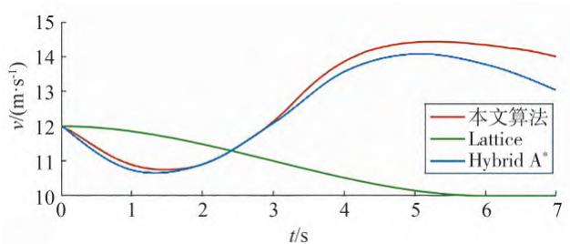

line

| t/s | 本文算法 | Lattice | Hybrid A* |
| --- | -------- | ------- | --------- |
| 0   | 12.0     | 12.0    | 12.0      |
| 1   | 11.0     | 11.5    | 11.0      |
| 2   | 10.8     | 11.2    | 11.0      |
| 3   | 12.5     | 10.8    | 12.5      |
| 4   | 13.8     | 10.5    | 13.8      |
| 5   | 14.5     | 10.2    | 14.2      |
| 6   | 14.3     | 10.0    | 13.8      |
| 7   | 14.0     | 10.0    | 13.2      |

图 　场景 不同算法速度曲线

不同算法的性能指标如表5所示。

仿真结果显示，在场景 中，本文算法生成了首先减速跟车，随后换道超车的轨迹。当获得足够的换道空间后，自车立刻换道并提升至期望车速，保持了较高的通行效率；而 算法由于前文所述原因，在单帧规划中仅能产生单一的横纵向行为，在获得足够的换道空间之前，为了与前方障碍物O 保持足够的安全距离，其采取了减速动作，导致整个规划时域范围内自车均保持较低车速，从而影响了通行效率；Hybrid A\*同样生成了减速跟车后换道加速的轨迹，但与场景 相同，由于启发函数效果不佳，导致换道时产生了较大的横向加速度。此外，自车换道之后，无法保持车道中心行驶，而在车道中心线附近反复摆动，出现蛇形行驶的动作。这是由于算法在控制空间采样，基于车辆运动学模型生成行驶轨迹，无法保证节点处车辆位姿符合道路中心线形状，在车道偏离代价的作用下，算法反复修正车辆航向，但始终无法维持车道中心行驶。

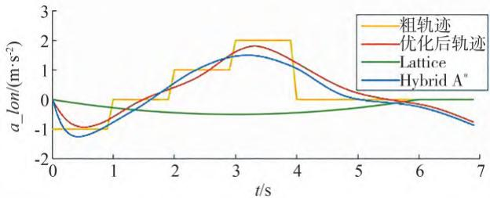

line

| t/s | 粗轨迹 | 优化后轨迹 | Lattice | Hybrid A* |
| --- | --- | --- | --- | --- |
| 0 | -1.0 | -1.0 | 0.0 | -1.0 |
| 1 | 0.0 | -0.5 | -0.2 | -0.8 |
| 2 | 1.0 | 0.5 | -0.3 | 0.0 |
| 3 | 2.0 | 1.5 | -0.4 | 1.5 |
| 4 | 0.0 | 1.8 | -0.5 | 1.2 |
| 5 | 0.0 | 0.5 | -0.6 | 0.5 |
| 6 | 0.0 | 0.0 | -0.7 | 0.0 |
| 7 | 0.0 | -0.5 | -0.8 | -0.5 |

图15　场景2优化前后纵向加速度曲线  
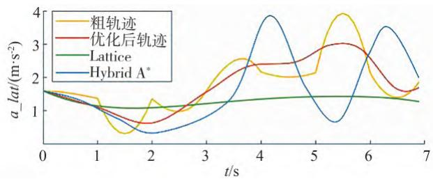

line

| t/s | 粗轨迹 (m·s⁻²) | 优化后轨迹 (m·s⁻²) | Lattice (m·s⁻²) | Hybrid A* (m·s⁻²) |
| --- | -------------- | ----------------- | --------------- | ----------------- |
| 0   | 1.5            | 1.5               | 1.5             | 1.5               |
| 1   | 1.2            | 1.0               | 1.3             | 0.8               |
| 2   | 0.5            | 0.8               | 1.4             | 0.6               |
| 3   | 1.0            | 1.5               | 1.4             | 1.0               |
| 4   | 2.5            | 2.5               | 1.4             | 3.8               |
| 5   | 2.0            | 2.8               | 1.4             | 0.8               |
| 6   | 3.8            | 3.0               | 1.4             | 3.5               |
| 7   | 1.8            | 1.5               | 1.3             | 2.0               |

图 　场景 优化前后横向加速度曲线

表5　场景2算法性能对比

<table><tr><td>算法</td><td>纵向通行距离/m</td><td>纵向加速度峰值/平均值/(m·s-2)</td><td>横向加速度峰值/平均值/(m·s-2)</td></tr><tr><td>本文算法粗轨迹</td><td>96.4</td><td>2.00/0.57</td><td>3.93/1.96</td></tr><tr><td>本文算法优化后</td><td>96.4</td><td>1.79/0.54</td><td>2.87/1.81</td></tr><tr><td>Lattice算法</td><td>84</td><td>0.50/0.26</td><td>1.60/1.30</td></tr><tr><td>Hybrid A*算法</td><td>92.1</td><td>1.47/0.58</td><td>3.89/1.88</td></tr></table>

场景 的仿真结果说明，本文算法对于弯曲道路适应性良好，所生成轨迹较Lattice算法具有更高的灵活性，通行效率更高，同时本文算法在节点拓展时直接采样车辆位姿，确保车辆轨迹符合道路形状，相较于 算法，其对结构化道路的适应性更好。

# 3. 3　算法实时性分析

算法在 系统上使用 实现，仿真计算

机配置为 Intel i5-13500hx/16GB RAM。

基于前文所述两种场景，每种场景重复试验次，统计本文算法与仿真实验中的另外两种算法耗时，对比结果如表 所示。

表6　算法耗时对比

<table><tr><td rowspan="2">场景</td><td colspan="3">平均耗时/ms</td></tr><tr><td>本文算法</td><td>Hybrid A*[6]</td><td>Lattice[21]</td></tr><tr><td>场景1</td><td>90(18+72)</td><td>76</td><td>34</td></tr><tr><td>场景2</td><td>96(21+75)</td><td>89</td><td>39</td></tr></table>

本文算法耗时的括号中，分别为粗轨迹生成与轨迹后处理过程的单步耗时。可以发现，针对本文算法，轨迹后处理过程占据了大部分耗时，这是由于非线性优化本身耗时较长导致的，但其保证了轨迹的安全性与可执行性，并保证了算法能够良好适配弯道场景。整体而言，本文算法的规划耗时相较于Lattice算法有所增加，但与基于Hybrid A\*的算法相近。结合前文所述两场景的仿真结果，本文算法的轨迹合理性明显提升，能够更好地平衡通行效率、轨迹舒适性、算法实时性的要求。

# 4　结论

本文针对结构化道路下智能汽车决策规划问题展开研究，采用时空耦合规划方法计算车辆轨迹，并选取典型场景开展仿真，对所提算法进行验证。本文主要研究内容及成果总结如下。

（）采用动态规划算法生成智能车辆时空耦合粗轨迹，并使用变密度的确定性采样法实现各层节点的拓展，平衡算法实时性与生成轨迹完备性的需求。横纵向分别以多项式连接相邻两层节点，保证了拓展过程中车辆行为合理受控，符合结构化道路形状。  
（）使用多维时空节点网格对动态规划节点进行了描述和储存，自定义评价函数，对相似节点进行评优与筛选，保留了最优节点进行进一步拓展。以此实现节点剪枝，避免了时空域中动态规划算法的维度爆炸问题。  
（）提出了一种圆形元素的可行驶时空走廊，以构建车辆在时空间内的凸可行域。在凸可行域内，通过 算法对粗轨迹进行非线性优化，在保证安全性与运动学可行性的前提下，提高了轨迹的平滑性和可执行性，并保证了算法能够良好适配不同结构化道路。

# 参考文献

［ 1 ］ FAN H， ZHU F， LIU C， et al. Baidu apollo em motion planner［J］. arxiv preprint arXiv：1807.08048， 2018.  
［ 2 ］ LIM W， LEE S， SUNWOO M， et al. Hierarchical trajectory plan⁃ning of an autonomous car based on the integration of a samplingand an optimization method［J］. IEEE Transactions on IntelligentTransportation Systems， 2018， 19（2）： 613-626.  
［ 3 ］ ZHANG Y， SUN H， ZHOU J， et al. Optimal vehicle path plan⁃ning using quadratic optimization for baidu apollo open platform［C］. 2020 IEEE Intelligent Vehicles Symposium （IV）. IEEE，2020： 978-984.  
［ 4 ］ MILLER C， PEK C， ALTHOFF M. Efficient mixed-integer pro⁃gramming for longitudinal and lateral motion planning of autono⁃mous vehicles［C］. 2018 IEEE Intelligent Vehicles Symposium（IV）. IEEE， 2018： 1954-1961.  
［ 5 ］ DEOLASEE S， LIN Q， LI J， et al. Spatio-temporal motion plan⁃ning for autonomous vehicles with trapezoidal prism corridors andbézier curves［C］. 2023 American Control Conference （ACC）.IEEE， 2023： 3207-3214.  
［ 6 ］ 胡杰，张志豪，陈瑞楠，等. 基于改进混合A\*的智能汽车时空联合规划方法［］汽车工程， ， （）：HUJ,ZHANG Z H,CHEN R N，et al. Spatio-temporal unifiedplanning method of intelligent vehicles based on improved hybridA\*［J］. Automotive Engineering， 2023， 45（7）： 1123-1133.  
［ 7 ］ ZHANG T， FU M，SONG W，et al. Trajectory planning based on spatio-temporal map with collision avoidance guaranteed by safety strip［J］. IEEE Transactions on Intelligent Transportation Systems， 2020， 23（2）： 1030-1043.   
［ 8 ］ LI B， ZHANG Y， OUYANG Y， et al. Fast trajectory planning forAGV in the presence of moving obstacles：a combination of 3-dim A\* search and QCQP[C]. 2021 33rd Chinese Control andDecision Conference（CCDC).IEEE，2021:7549-7554.  
［ 9 ］ XIN L， KONG Y， LI S E， et al. Enable faster and smoother spa⁃tio-temporal trajectory planning for autonomous vehicles in con⁃strained dynamic environment［J］. Proceedings of the Institutionof Mechanical Engineers， Part D： Journal of Automobile Engi⁃， ， （）：  
［ 10 ］ LI B， KONG Q， ZHANG Y， et al. On-road trajectory planning with spatio-temporal RRT\* and always-feasible quadratic program［C］. 2020 IEEE 16th International Conference on Automation Science and Engineering（CASE).IEEE,2020:942-947.   
［ 11 ］ CHANG Y， LIANG H， ZHAO P， et al. On-road trajectory plan⁃ning with spatio-temporal informed RRT［C］. 2022 IEEE Interna⁃tional Conference on Mechatronics and Automation (ICMA).IEEE，2022：1425-1431.  
［ 12 ］ EIRAS F， HAWASLY M， ALBRECHT S V， et al. A two-stageoptimization-based motion planner for safe urban driving[J].IEEE Transactions on Robotics，2021，38(2)：822-834.

（下转第 页）

ZHUANG W C， DING H N， DONG H X， et al. Learning basedeco-driving strategy of connected electric vehicle at signalized in⁃tersection［J］. Journal of Jilin University （Engineering and Tech⁃nology Edition）， 2023， 53（1）：82-93.  
［ 17 ］ BAI Z， HAO P， SHANGGUAN W， et al. Hybrid reinforcementlearning-based eco-driving strategy for connected and automatedvehicles at signalized intersections［J］. IEEE Transactions on In⁃telligent Transportation Systems， 2022， 23（9）： 15850-15863.  
［ 18 ］ LI J， WU X， XU M， et al. Deep reinforcement learning and reward shaping based eco-driving control for automated HEVs among signalized intersections［J］. Energy， 2022， 251： 123924.   
［ ］ 辛琪，王嘉琪，杨文科，等 信控路段混行交通生态驾驶深度强化学习模型［J］. 交通运输系统工程与信息， 2024， 24（3）：127-139.  
XIN Q， WANG J Q， YANG W K， et al. Eco-driving undermixed autonomy at signalized intersection：a deep reinforcementlearning model［J］. Journal of Transportation Systems Engineeringand Information Technology， 2024， 24（3）：127-139.  
［ 20 ］ ZHOU M， YU Y， QU X. Development of an efficient driving strat⁃egy for connected and automated vehicles at signalized intersec⁃tions： a reinforcement learning approach［J］. IEEE Transactionson Intelligent Transportation Systems， 2020， 21（1）： 433-443.  
［ ］ 张健，姜夏，史晓宇，等 基于离线强化学习的交叉口生态驾驶控制［］ 东南大学学报（自然科学版）， ， （）：762-769.  
ZHANG J， JIANG X， SHI X Y， et al. Offline reinforcementlearning for eco-driving control at signalized intersections［J］.Journal of Southeast University（Natural Science Edition）， 2022，52（4）： 762-769.

［ ］ 李捷，吴晓东，许敏，等 基于强化学习的城市场景多目标生态驾驶策略［］汽车工程， ， （ ）：  
LI J， WU X D， XU M， et al. Reinforcement learning basedmulti-objective eco-driving strategy in urban scenarios［J］. Auto⁃motive Engineering， 2023， 45（10）： 1791-1802.  
［ 23 ］ WEGENER M， KOCH L， EISENBARTH M， et al. Automatedeco-driving in urban scenarios using deep reinforcement learning［J］. Transportation Research Part C： Emerging Technologies，2021， 126.  
［ 24 ］ FIORI C， MONTANINO M， NIELSEN S， et al. Microscopic en⁃ergy consumption modelling of electric buses： model develop⁃ment， calibration， and validation［J］. Transportation ResearchPart D： Transport and Environment， 2021， 98.  
［ 25 ］ PAN Y J， FANG W P， GE Z Z， et al. A hybrid on-line approach for predicting the energy consumption of electric buses based on vehicle dynamics and system identification ［J］. Energy， 2024，290.   
［ 26 ］ KYONGSU Y， JINTAI C. Nonlinear brake control for vehicle CW/CA systems［J］. IEEE/ASME Transactions on Mechatronics，2001， 6（1）： 17-25.  
［ ］ 徐哲，刘豪，党威，等 汽车制动舒适性控制研究综述［］科学技术与工程， ， （ ）：  
XU Z， LIU H， DANG W， et al. Review on automotive brakingcomfort control［J］. Science Technology and Engineering， 2022，（ ）：  
［ 28 ］ KRAUSS S， WAGNER P， GAWRON C. Metastable states in amicroscopic model of traffic flow［J］. Physical Review E， 1997，55(5): 5597-5602.

# （上接第828页）

[13]DEOLASEE S,LIN Q,LI J,et al. Spatio-temporal motion planning for autonomous vehicles with trapezoidal prism corridors and Bézier curves[C].2023 American Control Conference (ACC). IEEE，2023:3207-3214.   
［ 14 ］ DE GROOT O， FERRANTI L， GAVRILA D M， et al. Topology-driven parallel trajectory optimization in dynamic environments[J].IEEE Transactions on Robotics，2024.  
[15］SADATA，RENM,POKROVSKYA，etal. Jointly learnable behavior and trajectory planning for self-driving vehicles[C]. 2019 IEEE/RSJ International Conference on Intelligent Robots and Sys-（ ） ， ：   
［ 16 ］ ZIEGLER J， STILLER C. Spatiotemporal state lattices for fast trajectory planning in dynamic on-road driving scenarios［C］. 2009 IEEE/RSJ International Conference on Intelligent Robots and Systems.IEEE，2009：1879-1884.   
［ 17 ］ DIXIT S， MONTANARO U， DIANATI M， et al. Trajectory planning for autonomous high-speed overtaking in structured environ⁃

ments using robust MPC［J］. IEEE Transactions on IntelligentTransportation Systems， 2019， 21（6）： 2310-2323.  
［ 18 ］ LI B， OUYANG Y， LI L， et al. Autonomous driving on curvyroads without reliance on frenet frame： a cartesian-based trajecto⁃ry planning method［J］. IEEE Transactions on Intelligent Trans⁃portation Systems， 2022， 23（9）： 15729-15741.  
［ 19 ］ ZIEGLER J， BENDER P， DANG T， et al. Trajectory planningfor Bertha—a local,continuous method[C].2O14 IEEE Intelli-gent Vehicles Symposium Proceedings. IEEE， 2014： 450-457.  
［ 20 ］ MICHELI F， BERSANI M， ARRIGONI S， et al. NMPC trajecto⁃ry planner for urban autonomous driving［J］. Vehicle System Dy⁃， ， （）：  
[21］MCNAUGHTON M，URMSON C，DOLAN JM，et al.Motion planning for autonomous driving with a conformal spatiotemporal lattice[C].2O11 IEEE International Conference on Robotics and Automation.IEEE，2011：4889-4895.