Received August 17, 2019, accepted September 2, 2019, date of publication September 11, 2019, date of current version September 24, 2019.

Digital Object Identifier 10.1109/ACCESS.2019.2940271

# A Decoupled Trajectory Planning Framework Based on the Integration of Lattice Searching and Convex Optimization

YU MENG , YANGMING WU , QING GU , AND LI LIU

School of Mechanical Engineering, University of Science and Technology Beijing, Beijing 100083, China

Corresponding author: Yu Meng (myu@ustb.edu.cn)

This work was supported in part by the National Key Research and Development Program of China under Grant 2018YFC0604403 and Grant 2018YFE0192900, in part by the National High Technology Research and Development Program of China (863 Program) under Grant 2011AA060408, and in part by the Fundamental Research Funds for the Central Universities under Grant FRF-TP-17-010A2.

ABSTRACT This paper presents a decoupled trajectory planning framework based on the integration of lattice searching and convex optimization for autonomous driving in structured environments. For a 3D trajectory planning problem with timestamps information, due to the presence of multiple kinds of constraints, the feasible domain is non-convex, so it is easy to fall into local optimum for trajectory planning. And the solution space of this problem is so enormous that it is difficult to identify an optimal solution in polynomial time. To address this non-convex problem, and to improve the convergence speed of an optimization process, the approach based on lattice searching is adopted in consideration of the ability to discretize driving environments and reduce the solution space. And the resulting path generated by lattice searching typically lies in the neighborhood of the global optimum. But this solution is neither spatiotemporally smooth nor globally optimal, so it is generally called the rough solution. For this reason, a subsequent nonlinear optimization process is introduced to refine the rough trajectory (combined by path and speed). The proposed framework is implemented and evaluated through simulations in various challenging scenarios in this paper. The simulation results verify that the trajectory planner can generate high-quality trajectories, and the execution time is also acceptable.

INDEX TERMS Trajectory planning, path planning, speed profile planning, lattice searching, Dijkstra’s algorithm, nonlinear optimization.

# I. INTRODUCTION

Research on autonomous vehicles has made considerable progress during the past few decades. As the core module of the autonomous driving system, the planning module takes into account all information sensed by sensors, including driving environments information and vehicle state, and then generates a safe, spatiotemporally smooth, and feasible trajectory to feed into the control module. Although many excellent trajectory planning algorithms are proposed, it is still difficult to generate a good trajectory in real-time in dynamic uncertain environments. And these methods are not generic in all scenarios.

The associate editor coordinating the review of this manuscript and approving it for publication was Okyay Kaynak.

A trajectory planning problem is a typical 3D constrained planning problem by considering timestamps information and spatial information. In structured environments, the 3D feasible set is non-convex due to the constraints of traffic rules, time consumption, nonholonomic and collision avoidance. Hence, the following difficulties need to be dealt with simultaneously: (1) how to reduce the computational complexity of the planning algorithm to execute fast enough to meet real-time requirement for planning and replanning, which means we need to quickly generate a feasible solution in an enormous solution space, (2) how to address spatiotemporal obstacles in 3D state space, which means the planning problem is a highly non-convex problem, so it is extremely difficult to ensure that the solution converges to a single, global optimum, and (3) how to generate a spatiotemporally smooth trajectory, which means the curvature profile, speed profile, acceleration profile, and jerk profile of a trajectory are all continuous and smooth.

# A. RELATED WORK

According to whether the configuration space is continuous or not, trajectory planning techniques for autonomous driving can be divided into two categories: sampling-based methods and optimization-based methods. According to whether the state space is decoupled or not, there are also two different categories in trajectory planning techniques: direct planning methods and decoupled planning methods. This paper will review typical trajectory planning techniques in terms of whether the state space is decoupled or not.

Direct methods attempt to find one optimal trajectory in the Cartesian coordinate system or the frenet coordinate system [1]. These planning methods perform searching or optimization in spatiotemporal state space, which means they can directly deal with dynamic obstacles. Ziegler et al. [2] carefully design an objective function and constraints to transform a nonconvex problem into a convex one. And they introduce sequential quadratic programming (SQP) algorithm to solve the nonlinear optimization problem. SQP is often seen as a state-of-the-art technology to solve the nonlinear programming problem [3], [4]. But the convergence speed in SQP without a good initial value is not fast enough for the real-time requirement for a medium scale optimization problem.

A fast planning algorithm called the convex feasible set (CFS) algorithm is proposed to solve optimization-based motion planning problems with convex objective functions and nonconvex constraints [5], [6]. The main idea of the CFS algorithm is to transform the original problem into a sequence of convex subproblems and iteratively solve subproblems until convergence, which makes the computation faster than SQP and interior point method (IP). In [7], [8], the constrained iterative LQR (CILQR) is proposed to efficiently solve the optimal control problem with nonlinear system dynamics and general form of constraints. And the computation efficiency of CILQR is shown to be much higher than the standard SQP solver. But, it is easy to fall into a stationary point for these technologies without being given a good initial solution. A trajectory is a one-to-one mapping between the time domain and the space domain, so these optimization-based techniques above usually sample at equal time intervals. And positions of a vehicle in the space domain are free variables. According to constraint functions and performance index, an appropriate algorithm is picked to optimize the decision variables. However, in a clustered environment, the feasible region both in spatial domain and temporal domain is usually highly non-convex. And the convexification of the feasible region is not easy for them. In addition, the generalization ability of these algorithms is also a problem. For example, when the decision-making layer issues an instruction, it is not easy to adjust the speed profile or path flexibly for these algorithms.

Howard et al. [9], [10] develop an efficient and general model predictive trajectory generation technology via the shooting method and Newton’s method. Usually, a set of terminal states are sampled in the state space, then Howard’s technique is used to connect the initial state with the sampling states while respecting nonholonomic constraints. At last, the carefully designed cost function is used to select the best trajectory with the lowest cost. Similarly, another widely used method is the lattice searching approach. In [11], [12], a conformal spatiotemporal lattice with time and speed dimensions is proposed to generate a feasible trajectory in a dynamic scenario. And dynamic programming is adopted to search for an optimal trajectory in a lattice. The highlight of lattice searching is that the sampling resolution of a lattice must be balanced between the time consumption and completeness. The execution time increases as the resolution increases. And if the resolution is reduced, a feasible solution can’t even be found.

Different from direct methods, decoupled methods reduce the dimensions of the state space and perform planning in two 2D state space separately. In Werling et al’s method [1], they generate lateral and longitudinal trajectories using quantic polynomials versus time, which ensures continuous speed profile and acceleration profile. However, this method may lead to frequent swerving of a vehicle and cannot guarantee the optimality of the generated solution.

Impressively, another popular decoupled method is the path-speed decoupling method which plans path and speed profile, respectively. Path planning typically takes static obstacles into consideration, and then a speed profile is generated based on the generated path. Two representative methods are A\* search [13] and random sampling-based method that mainly refers to the rapidly-exploring random tree (RRT) [14], [15]. These two classes of methods usually search in a grid map or sample in the configuration space to generate a continuous path. For graph search-based methods, the resulting paths are not smooth, which means the subsequent smoothing process should be employed to make the path meet kinodynamic constraints. For random sampling-based methods, the resulting paths tend to be jerky and redundant, which means the subsequent smoothing processing is also introduced.

Still path-speed decoupling, in [16], [17], polynomial spirals are used to solve the two-point boundary value problem in order to generate a path that satisfies nonholonomic constraints, and then the trapezoidal velocity profile is employed for the longitudinal velocity profile generation. This reactive trajectory planning method can meet the real-time requirement, but it cannot guarantee the trajectory is globally optimal. At the same time, the speed profile is not flexible enough to adapt to complicated scenarios. This method sampling in state space only specifies a finite set of motion primitives, which reduces the motion potential of vehicles. To overcome these shortcomings, Xu et al. [18] propose a two-step planning framework. Firstly, they sample separately in posture space (x, y, θ, κ) [24] and speed space, then search for a rough path and a rough speed profile, finally enter the optimization step to optimize the trajectory. However, motion primitives in their work are spirals which are not good choices compared to polynomials in terms of computational complexity, and the subsequent optimization does not guarantee the trajectories satisfy nonholonomic constraints and sideslip constraints.

TABLE 1. Comparison of trajectory planning methods. 

<table><tr><td>Methods</td><td>Implemented in</td><td>Optimality</td><td>Mobility</td><td>Completeness</td><td>Spatial smoothness</td><td>Temporal smoothness</td><td>Anytime</td><td>Driving environment</td><td>Flexibility</td><td>Curvature constraint</td><td>State space</td></tr><tr><td rowspan="5">Direct methods</td><td>Ziegler et al.[2]</td><td>Locally optimal</td><td>High</td><td>√</td><td>√</td><td>√</td><td>√</td><td>FE and SE</td><td>×</td><td>√</td><td>Continuous</td></tr><tr><td>CFS[5][6]</td><td>Locally optimal</td><td>High</td><td>√</td><td>√</td><td>√</td><td>√</td><td>FE and SE</td><td>×</td><td>√</td><td>Continuous</td></tr><tr><td>CILQR[7][8]</td><td>Locally optimal</td><td>High</td><td>√</td><td>√</td><td>√</td><td>√</td><td>FE and SE</td><td>×</td><td>√</td><td>Continuous</td></tr><tr><td>Howard et al. [9] [10]</td><td>Suboptimal</td><td>Low</td><td>Resolution complete</td><td>√</td><td>×</td><td>√</td><td>FE and SE</td><td>√</td><td>√</td><td>Discrete</td></tr><tr><td>Spatiotemporal lattice[11][12]</td><td>Suboptimal</td><td>Low</td><td>Resolution complete</td><td>√</td><td>×</td><td>×</td><td>FE and SE</td><td>√</td><td>√</td><td>Discrete</td></tr><tr><td rowspan="7">Decoupled methods</td><td>Werling et al. [1]</td><td>Suboptimal</td><td>Low</td><td>Resolution complete</td><td>√</td><td>√</td><td>√</td><td>SE</td><td>√</td><td>√</td><td>Discrete</td></tr><tr><td>Li et al. [16] [17]</td><td>Suboptimal</td><td>Low</td><td>Resolution complete</td><td>√</td><td>×</td><td>√</td><td>SE</td><td>√</td><td>√</td><td>Discrete</td></tr><tr><td>Lim et al.[4]</td><td>√</td><td>High</td><td>√</td><td>√</td><td>√</td><td>√</td><td>SE</td><td>√</td><td>×</td><td>Discrete and continuous</td></tr><tr><td>Fan et al.[19]</td><td>√</td><td>High</td><td>√</td><td>√</td><td>√</td><td>√</td><td>SE</td><td>√</td><td>×</td><td>Discrete and continuous</td></tr><tr><td>Xu et al.[18]</td><td>√</td><td>High</td><td>√</td><td>√</td><td>√</td><td>√</td><td>SE</td><td>√</td><td>×</td><td>Discrete and continuous</td></tr><tr><td>Liu et al.[31]</td><td>√</td><td>High</td><td>√</td><td>√</td><td>√</td><td>√</td><td>SE</td><td>×</td><td>√</td><td>Continuous</td></tr><tr><td>Zhan et al.[35]</td><td>√</td><td>Medium</td><td>√</td><td>√</td><td>√</td><td>√</td><td>SE</td><td>√</td><td>×</td><td>Discrete and continuous</td></tr></table>

In Lim et al.’s method [4], they sample some vertices in frenet coordinates and the Space-Time coordinates, respecttively, and then use dynamic programming to search a rough path, and use the Hybrid A\* algorithm [23] to search the rough speed profile. Finally, SQP is introduced to optimize the rough trajectory generated by the decoupled method in [4]. In [19], a combination of dynamic programming and spline-based quadratic programming is proposed to construct a scalable and easy-to-tune framework to handle traffic rules, obstacle decisions and smoothness simultaneously. This planner searches path and speed profile respectively, and then optimizes path and speed profile, respectively. The above methods can make the solution jump out of a stationary point. Simultaneously, the optimization process in these methods makes the solution close to the globally optimal solution, and also makes the trajectory smoother than the untreated trajectory. However, the imperfection in their work is that they ignore the curvature constraints during the optimization process, which makes their algorithms not trustworthy algorithms for the trajectory tracking module.

For the sake of clarity, we compare some of the considerable features of direct methods and decoupled methods, including optimality, mobility, completeness, spatial smoothness, temporal smoothness, real-time performance, driving environment, flexibility, curvature constraints and state space, which can be seen in Table 1. Optimality represents the ability of an algorithm to find an optimal solution in a non-convex space. Among these methods, the solution generated by only the optimization-based technologies is easy to fall into a stationary point, so the optimality is locally optimal. As for the sampling-based technologies, their solutions are generally located in the neighborhood of the global optimum, so the optimality is suboptimal. The mobility of an algorithm is determined by whether the motion potential of a vehicle is restricted or not. Some algorithms [9]–[12] specify the values of the kinematics and dynamics parameters of a vehicle (i.e., special wheel angles, speed, and acceleration), which may reduce the motion performance of a vehicle, so the mobility is also one of the algorithms’ considerations. In [9]–[12], [16], [17], motion primitives are generated according to certain predefined rules, so the mobility is low. Completeness ([37], [45]) indicates the ability of an algorithm to find a feasible solution in the solution space. Spatial smoothness is determined by whether the heading profile and curvature profile of a trajectory are continuous and smooth or not. Temporal smoothness indicates the characteristics of the speed profile, acceleration profile, and jerk profile of a trajectory. Driving environments of an autonomous vehicle are basically divided into free environments (FE) and structured environments (SE). Different algorithms are developed depending on the specified environment. Flexibility indicates the ability of an algorithm to adapt to different driving scenarios (i.e., following, parking and lane changes). Considering the computational complexity, some algorithms (i.e., [4], [18], [19], [35]) ignore the curvature constraints to improve the convergence speed of a trajectory. The state space term indicates whether the planning space is discrete or not. In general, some algorithms [9]–[12] perform planning in discrete state space, and some algorithms (i.e., [2], [5]–[8]) perform planning in continuous state space. But decoupled algorithms (i.e., [4], [18], [19], [35]) usually prefer to perform planning in both discrete and continuous state space according to our observations.

To sum up, both direct methods and decoupled methods often use sampling-based technologies to discretize the solution space, and use optimization-based technologies to generate a continuous and smooth solution. However, direct methods search in the spatiotemporal lattice or transform a spatiotemporal planning problem into an optimization problem to generate a feasible trajectory, so static and dynamic obstacles can be considered at the same time. But, if a good initial solution is not given, or the objective function and constraints are not addressed subtly, it is easy to fall into local optimum, and the convergence speed of the algorithm may not be satisfactory. Moreover, the resolution of the spatiotemporal lattice cannot be too high due to the planning in 3D space, and the trajectory generated by lattice is not spatiotemporally smooth enough. For decoupled methods, they usually transform a medium scale searching or optimization problem into two small scale searching or optimization problems, which greatly reduces the computational complexity of the trajectory planner. Inevitably, static and dynamic obstacles are considered separately in the path planning step and the speed planning step, which may result in a suboptimal trajectory. Simultaneously, there are too many parameters to tune in decoupled methods, which makes the adjustment of parameters become a problem.

And our conclusion is that there is currently no universal algorithm that can adapt to multiple scenarios while meeting all the constraints and requirements in Table 1 in structured environments. Short-sighted, locally optimal, incomplete, and inflexible imperfections are distributed separately in current algorithms as shown in Table 1. So developing a generic, real-time, flexible, and comprehensive algorithm is an important research topic for trajectory planning.

# B. CONTRIBUTIONS

Based on related work, and in order to solve the trajectory planning problem in real-time for autonomous driving in structured environments, we propose a novel decoupled trajectory planning framework which decouples a 3D planning problem into two 2D planning problems. Firstly, we perform path searching and path post-optimization. Then according to the optimized path, we perform speed searching and subsequent speed optimization. Prominently, a feasible solution in discrete configuration space can be quickly searched by the lattice searching step and be fed to the nonlinear optimization step. With lattice searching, nonlinear optimization can quickly converge to an optimal and continuous solution with just several iterations. The main contributions of this paper are summarized as follows:

• A novel decoupled trajectory planning framework we developed combines the advantages of optimizationbased methods and sampling-based methods. For optimization-based methods ([2], [5]–[8]), they can guarantee sufficient smoothness, while sampling-based methods ([16], [17], [25], [26]) focus on real-time and flexiblity. The highlight of the framework achieves a good balance between constraints (i.e., curvature constraints, collision avoidance constraints and traffic rule constraints) compliance and requirements (i.e., optimality, smoothness, real-time performance, and flexibility)

satisfaction through the combination of methods. Compared with the methods in [2], [5]–[8], the decoupled method in this paper can jump out of a stationary point, reduce the number of iterations, and enhance the flexibility. And the decoupled method also improves the smoothness and completeness in comparison with the methods in [16], [17] and [25], [26]. Hence, this trajectory planner can quickly generate a spatiotemporally smooth and kinematically-feasible trajectory.

• We introduce a local, continuous method to refine the rough path generated by lattice searching. Reference [19] transforms a path optimization problem into a quadratic programming (QP) problem. And the Simplex algorithm is used for path optimization in [18]. In [4], SQP is introduced to optimize the rough trajectory. These methods also smooth the path or trajectory while avoiding collisions. However, there are no curvature constraints added to the path or trajectory optimization, which may make the generated path or trajectory not satisfy the nonholonomic constraints. Hence, in this paper, we consider the path optimization problem as a nonlinear programming (NLP) problem and add the curvature constraints for the path optimization step in the frenet coordinate system. The highlight is that different from the work in [2], [6]–[8] and [31], the rough path is fed to the NLP problem as a hot start in this paper, which ensures fast convergence and prevents a local optimism. And another novelty is that optimization can be performed over lateral offset in this NLP problem and curvature can be calculated by differences of the frenet waypoints.

• We formulate the speed optimization problem into a standard QP problem which optimizes the longitudinal station for all waypoints along the predefined time domain in urban environments. Unlike the spline QP speed optimizer in [19] and the non-derivative Simplex algorithm speed optimizer in [18], we optimize the decision variable $\mathbf { s } = [ s _ { 1 } , s _ { 2 } , . . . , s _ { n } ] ^ { T }$ that can be mapped to the fixed timestamps, which can ensure that the speed profile meets the kinematic constraints, dynamic constraints, and temporal smoothness requirements. The work in [31] directly models the speed optimization problem as an NLP problem and does not provide good initial value for optimization. Compared with the work in [31], our work provides a rough speed profile as the initial value for QP, so the number of iterations of the algorithm is much less than that in [31]. And because of the existence of the speed lattice searching, our algorithm can guarantee global temporal optimality. In addition, compared with the trapezoidal linear velocity profile in [9], [10] and the smooth trapezoidal velocity profile in [16], [17], the speed planner we developed does not specify the values of speed and acceleration. Impressively, we optimizes the speed according to the objective function and constraint functions, which makes the speed planner can adapt to different driving scenarios, and flexibility and realtime performance are guaranteed.

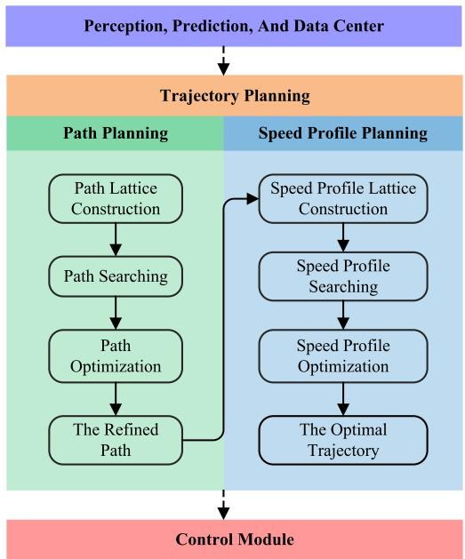

flowchart

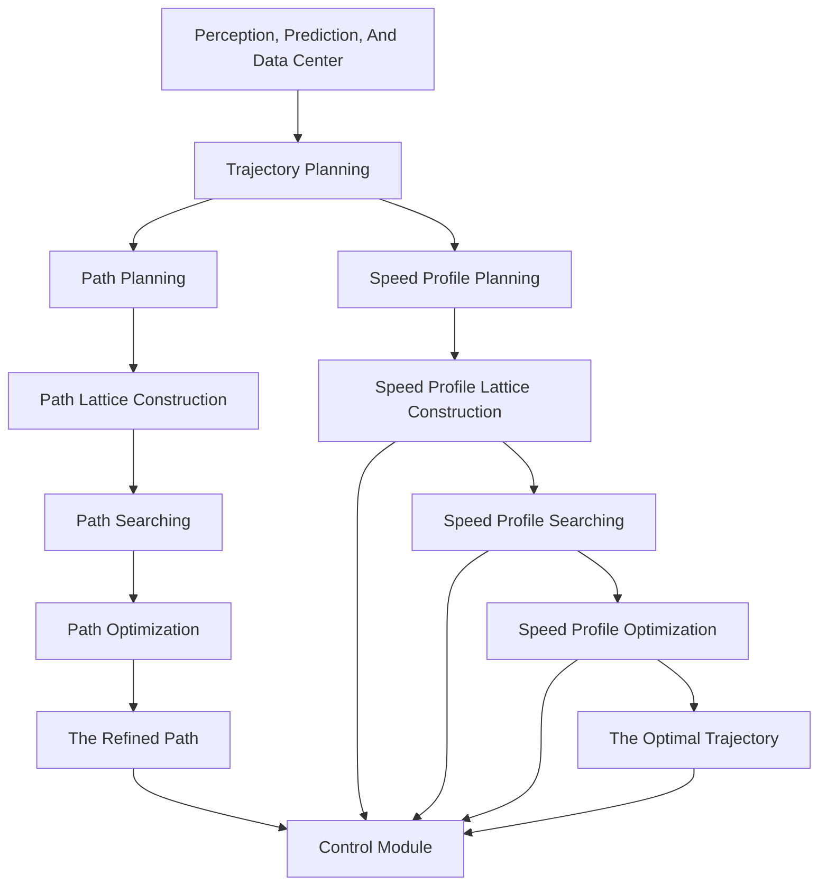

FIGURE 1. The decoupled trajectory planning framework.

This paper is organized as follows. The algorithm frame-work is introduced in Section II. The implementation details of the framework are presented in Section III, which includes the following subsections: rough path searching step, NLP path optimization step, rough speed profile searching step and QP speed optimization step. Section IV explains the settings of simulations, presents four cases of different scenarios and analyzes the performance of the proposed algorithm framework in detail. Section V summarizes the contributions and discusses future work.

# II. TRAJECTORY PLANNING FRAMEWORK

The decoupled trajectory planning framework is shown in Fig. 1. The core parts of this framework are path lattice searching, path optimization, speed profile lattice searching and speed profile optimization. In preprocessing, we convert the host vehicle information (i.e., pose, speed, acceleration, and jerk) and the driving environment information (i.e., obstacles information) into frenet coordinates from Cartesian coordinates. And the centerline of a lane approximately parameterized by arc-length is used as a reference line for planning. In the path searching step, we sample in the frenet coordinate system along a lane. And the sampled poses form vertices of a weighted directed acyclic graph (DAG), then the path edges (motion primitives) are generated using the method described in [20]. Kinematic constraints, nonholonomic constraints, obstacle avoidance constraints, smoothness performance, and traffic rules constraints constitute the edge weights of the DAG. Finally, Dijkstra’s algorithm is picked to find the shortest path to generate a kinematically-feasible, relatively smooth, collision-free path in the non-convex spatial space. In order to optimize the path to meet the spatial smoothness and comfort requirements, we model the path optimization problem into an NLP problem with the quadratic objective function and nonlinear constraint functions. The objective function is a linear combination of smoothness and lateral offset from the reference line. And the constraints include boundary value constraints, nonholonomic constraints (curvature constraints) and obstacle avoidance constraints.

During speed profile searching, the trajectory of the ego vehicle and predicted trajectories of obstacles are projected in the Station-Time domain, which forms a non-convex 2D space. After the preprocessing, the speed profile lattice is constructed in the s-t domain. After that, based on the weights which are composed of temporal smoothness and obstacles collision risk, the rough piecewise speed profiles are found using Dijkstra’s algorithm. However, the speed profiles are composed of piecewise continuous lines, so it is not temporally smooth. In order to improve the smoothness of the speed profile, we model the speed optimization problem into a standard QP problem, which is much faster than an NLP problem with nonlinear constraints.

# III. METHODOLOGY

# A. PATH SEARCHING

The frenet coordinate system [1], [4], [20] is a popular technology in the field of autonomous driving because it has an excellent ability to well characterize the curve roads, which brings great convenience to the local planning. In the frenet coordinate system, we use line segments, arcs, polynomial curves, and Euler spirals to connect a series of waypoints. Finally, a smooth reference line is built along a lane based on these curves. The above processing refers to the work of [21] and the OpenDRIVE1 map format. Reference [22] presents a simple and efficient technique to generate approximately arc-length parameterized spline curves that closely match the reference line of a lane. According to our experience, the length of each approximately arc-length parameterized spline curve needs to be selected reasonably. If these segments are too dense, this performance will consume a lot of space to store the coefficients of arc-length parameterized spline curves and the query time will be increased in the subsequent lookup of the coefficients table. And if the cubic spline segments are too sparse, this characteristic will increase the matching error with the reference line of a lane.

Sampling in the frenet coordinate system is a resolution complete [9] path planning technique by efficient discretization of the spatial domain. Hence, we can quickly find a feasible solution using graph-search-based methods. Next, considering the continuity and smoothness of the path, we use a class of curves to connect the two sampling states.

# 1) MOTION PRIMITIVES

Polynomial spirals [12], [16]–[18], [24] are popular curves for path planning, which possess as many degrees of freedom as necessary to meet any number of constraints. However,

1http://www.opendrive.org/

we have to use numerical methods to solve the non-trivial constraints and the well-known Fresnel integrals as depicted in [24]. Usually, we can utilize a lookup table which is an efficient means of storing initial guesses for the parameters to make the numerical calculations converge quickly to a relatively accurate solution, but spirals are not as good as polynomials in terms of the computational efficiency. The cubic polynomials take only four parameters to represent a spatially smooth path. Hence, the cubic polynomial curves have a simple form and good performance in solving this two-point boundary value problem. Naturally, the motion primitives are generated by connecting sampled endpoints using the cubic polynomials as depicted in [20], [25], [26]. As shown in (1), the function describing the relationship between the arc length s along a lane and the lateral offset $\rho$ is designed to smoothly connect two states in the frenet coordinate system.

$$
\rho (s) = a _ {0} + a _ {1} s + a _ {2} s ^ {2} + a _ {3} s ^ {3}, \quad s \in [ s _ {0}, s _ {f} ] \tag {1}
$$

The boundary conditions are described as (2) [26], [27]. We can easily convert these differential constraints into a matrix expression, and the coefficients of the cubic polynomial can be determined as (3).

$$
\rho (s _ {0}) = \rho_ {0}
$$

$$
\rho (s _ {f}) = \rho_ {f}
$$

$$
\rho^ {\prime} (s _ {0}) = \tan \theta_ {s _ {0}}
$$

$$
\rho^ {\prime} (s _ {f}) = \tan \theta_ {s _ {f}} \tag {2}
$$

$$
\left[ \begin{array}{c c c c} 1 & s _ {0} & s _ {0} ^ {2} & s _ {0} ^ {3} \\ 1 & s _ {f} & s _ {f} ^ {2} & s _ {f} ^ {3} \\ 0 & 1 & 2 s _ {0} & 3 s _ {0} ^ {2} \\ 0 & 1 & 2 s _ {f} & 3 s _ {f} ^ {2} \end{array} \right] \left[ \begin{array}{l} a _ {0} \\ a _ {1} \\ a _ {2} \\ a _ {3} \end{array} \right] = \left[ \begin{array}{c} \rho_ {0} \\ \rho_ {f} \\ \tan \theta_ {s _ {0}} \\ \tan \theta_ {s _ {f}} \end{array} \right] \tag {3}
$$

In (2) and (3), the start point state is $[ s _ { 0 } , \rho _ { 0 } , \theta _ { s _ { 0 } } ] ^ { T }$ , and the endpoint state is $[ s _ { f } , \rho _ { f } , \theta _ { s _ { f } } ] ^ { T }$ . In this paper, θ represents the heading of a vehicle in the Cartesian coordinate system, $\theta _ { s }$ represents the heading in the frenet coordinate system, and $\theta _ { r }$ represents the heading of the projection point of the rear axle midpoint of a vehicle in the reference line. The geometrical relationship between them can be expressed in (4).

$$
\theta = \theta_ {s} + \theta_ {r} \tag {4}
$$

The sampling mechanism including the interval distance ds between rows of endpoints and the total station horizon $s _ { m a x }$ along a lane is similar to the method in [28]. The characteristics of the sampling points are usually related to the road structure, the host vehicle’s speed and the decisions of behavior planning. In reality, we need to adjust parameters to make them adapt to different scenarios, and this processing can increase the expressiveness and completeness of the solution space of our planner. For example, higher speed might need a longer sampling interval than lower speed, and a straight lane requires a longer sampling interval than a curved lane. As shown in Fig. 2 and Fig. 3, we construct a path lattice by sampling in the frenet coordinate system.

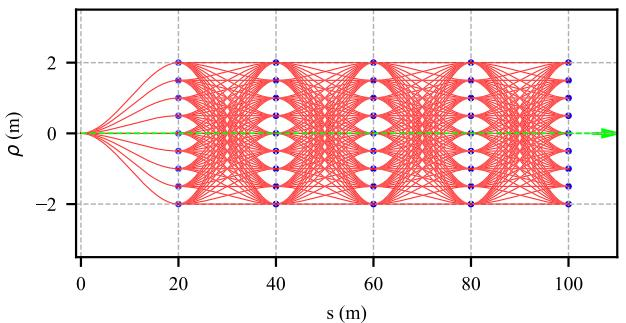

line

| s (m) | ρ (m) |
|-------|-------|
| 0     | 0     |
| 20    | 2     |
| 40    | 2     |
| 60    | 2     |
| 80    | 2     |
| 100   | 2     |

FIGURE 2. Path lattice in the frenet coordinate system. Blue vertices represent the sampled poses. The red motion primitives are cubic splines connecting vertices, and the dotted green line is the reference line of a lane.

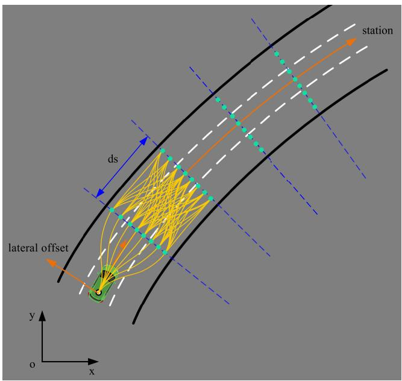

text_image

station
ds
lateral offset
y
o
x

FIGURE 3. Path lattice in Cartesian coordinates. The green vehicle shows the current vehicle pose. Green vertices represent the sampled offset poses of the reference line along a lane, and ds represents the longitudinal interval between the sampled vertices.

# 2) COST FUNCTIONS

A feasible path needs to be found in the path lattice. According to Ziegler et al’s work [11], they observe the difficulty of employing heuristic search algorithms, because $\mathrm { i t } ^ { \prime } \mathrm { s }$ hard to estimate the cost terms of smoothness and collision risk. Hence, they propose an exhaustive rather than heuristic search algorithm to find the optimal path. In this paper, we also regard the state lattice as a DAG and employ Dijkstra’s algorithm to search the optimal path based on the cumulative costs of motion primitives in the lattice.

When we construct a path lattice using motion primitives, the weights of motion primitives are also calculated. The total weights of each edge are a linear combination of the smoothness term, the lateral offset from the reference line term, and the obstacles collision risk term, as shown in (5).

$$
c _ {p a t h} = c _ {s m o o t h} + c _ {r e f} + c _ {o b s} \tag {5}
$$

Curvature can characterize the smoothness of a curve, so the smoothness cost term function is designed as the integral of the square of curvature along with the longitudinal station, which is described as (6).

$$
c _ {s m o o t h} = w _ {s m o o t h} \int_ {s _ {0}} ^ {s _ {f}} \kappa (s) ^ {2} d s \tag {6}
$$

It is difficult to get an explicit expression of the curvature function about the arc-length parameter, and in order to facilitate the calculation of the computer, we use numerical methods to calculate the integral of curvature’s square. For a segment of a curve, we sample N points evenly on it, and an approximate calculation of the integral $c _ { s m o o t h }$ can be expressed as the finite sum, which is shown in (7).

$$
c _ {s m o o t h} = \frac {w _ {s m o o t h}}{N} \sum_ {n = 0} ^ {N} \kappa_ {i} ^ {2} \tag {7}
$$

The curvature function of a curve is defined as:

$$
\kappa = \frac {x ^ {\prime} y ^ {\prime \prime} - y ^ {\prime} x ^ {\prime \prime}}{\sqrt [ 3 ]{x ^ {\prime 2} + y ^ {\prime 2}}} \tag {8}
$$

The curvature can be approximated using the finite differences of the sample waypoints as shown in (9).

$$
\kappa_ {i} \approx \frac {x _ {i} ^ {\prime} y _ {i} ^ {\prime \prime} - y _ {i} ^ {\prime} x _ {i} ^ {\prime \prime}}{\sqrt [ 3 ]{x _ {i} ^ {\prime 2} + y _ {i} ^ {\prime 2}}} \tag {9}
$$

where,

$$
x _ {i} ^ {\prime} \approx \frac {x _ {i + 1} - x _ {i}}{t}
$$

$$
x _ {i} ^ {\prime \prime} \approx \frac {x _ {i + 2} - 2 x _ {i + 1} + x _ {i}}{t ^ {2}}
$$

$$
y _ {i} ^ {\prime} \approx \frac {y _ {i + 1} - y _ {i}}{t}
$$

$$
y _ {i} ^ {\prime \prime} \approx \frac {y _ {i + 2} - 2 y _ {i + 1} + y _ {i}}{t ^ {2}} \tag {10}
$$

Because the coordinates of the cubic polynomials are represented using frenet coordinates $( s - \rho )$ , so we need to convert the coordinates into the Cartesian coordinates $( x - y )$ to calculate the curvature using (9). The coordinates conversion function is given by [18] as shown in (11).

$$
x (s, \rho) = x _ {r} (s) + \rho \cos (\theta_ {r} (s) + \pi / 2)
$$

$$
y (s, \rho) = y _ {r} (s) + \rho \sin (\theta_ {r} (s) + \pi / 2)
$$

$$
\theta (s, \rho) = \theta_ {r} (s)
$$

$$
\kappa (s, \rho) = (\kappa_ {r} (s) ^ {- 1} + \rho) ^ {- 1} \tag {11}
$$

where $\theta _ { r } ( s )$ represents the heading angle of the reference line, $x _ { r } ( s )$ and $y _ { r } ( s )$ represent the Cartesian coordinates of the reference line, and $\kappa _ { r } ( s )$ represents the curvature of the reference line. In this paper, we define the lateral offset $\rho$ to be positive on the left side of the reference line and negative on the right side.

Usually, the trajectory of the vehicle should follow the reference line of a lane, which means this maneuver can well comply with the traffic rules, and it is also a relatively safe driving strategy. The lateral offset $\rho$ from the reference line is then added to the total edge weights as a penalty. $c _ { r e f }$ can also be expressed as the finite sum as shown in (12).

$$
c _ {r e f} = \frac {w _ {r e f}}{N} \sum_ {n = 0} ^ {N} (\rho_ {i} - \rho_ {r e f}) ^ {2} \tag {12}
$$

where $\rho _ { r e f } $ represents the lateral offset of the reference line in $s - \rho .$ . In this paper, the offset $\rho _ { r e f } $ of the reference line in the rightmost lane is 0.0 m.

One method to calculate the collision risk with obstacles is to calculate the distance to all obstacles [18]. However, this strategy will increase the computational complexity because the distance from all points on the path to all obstacles needs to be calculated one by one. The computation expense is O(NM ), where N is the number of the path sampling points, M is the number of obstacles. Another strategy is to assign the value of collision risk to be False or True, which depends on whether there is a collision maneuver for a path [29]. However, for path candidates with no collision, it is obvious that the path closer to obstacles has higher collision risk, which is ignored by this strategy of the binary collision risk index. Therefore, this paper introduces the convolution collision risk indicator, which is successfully used in [25], [26].

The value of a collision check is given by [26]. They penalize a path that passes solid lane lines by assigning the value of the collision check to be 0.5, and they assign 0.2 to a path which passes dashed lane lines. If a path does not pass any obstacle and road boundary, the value is defined as 0.0. Instead, if a path hits an obstacle or road boundary the value is defined as 1.0. The function of collision check can be described as (13).

$$
r [ i ] = \left\{ \begin{array}{l l} 1. 0 & \text { if   (passing   obstacles) } \\ 0. 5 & \text { if   (passing   solid   lane   lines) } \\ 0. 2 & \text { if   (passing   dashed   lane   lines) } \\ 0. 0 & \text { if   (no   collision) } \end{array} \right. \tag {13}
$$

In order to reasonably express the security cost term, the risk index of a path is calculated by discrete Gaussian convolution [25] combined with collision checks as follows.

$$
c _ {o b s} [ i ] = w _ {o b s} \sum_ {k = 1} ^ {n _ {\rho}} r [ k ] g [ i - k ] \tag {14}
$$

where,

$$
g [ i ] = \frac {1}{\sqrt {2 \pi} \sigma} \exp (- \frac {i ^ {2}}{2 \sigma^ {2}}) \tag {15}
$$

where i is the index of each candidate path, $n _ { \rho }$ is the number of endpoints sampled laterally, and σ is the standard deviation of the Gaussian kernel g[i]. The value of $\sigma$ indicates the influence scope of collision risk because a collision path poses a collision risk to the nearby paths. Usually, the larger the value is, the higher the collision risk of an adjacent path will be.

In order to perform the collision check in the path planning step, the speed profile of the previous planning cycle is used to assess potential collisions with dynamic obstacles. Since the planning frequency is high enough, it is reasonable to use the speed profile of the previous planning cycle to perform the collision check of the trajectory in this cycle. Another strategy for performing the collision check with dynamic obstacles is the path-speed iteration method [18]. This method iteratively optimizes the path and speed until the convergence condition is met. However, in the search step and the optimization step of the trajectory, the computational complexity is already high enough due to the existence of the collision check, and the mutual conversion of the coordinates between the Cartesian coordinates and the frenet coordinates. Therefore, for real-time considerations, the path-speed iteration method is not selected.

The short-term target point cannot be determined explicitly in on-road driving, and because of the existence of the smoothness cost term, the offset from the reference line cost term, and the collision risk cost term, it is difficult to design the heuristic function for lattice searching. Hence, we use an exhaustive rather than heuristic search, as described in [12]. In this paper, Dijkstra’s algorithm is adopted to find the shortest path to generate a kinematically-feasible, relatively smooth, collision-free path in the nonconvex spatial space. Unlike the traditional Dijkstra’s algorithm, we do not specify a target pose in advance, but design a TARGET list to store the sampled target poses set. When poses (endpoints) in the list are all expanded, the pose with the least cost is selected as our short-term target pose. The feasible path generated by the lattice searching looks smooth, but we find that the curvature profile has step changes and is jerky after calculating the curvature of the path. Considering the above factors, the smoothness performance is very poor, which brings great difficulties to the trajectory tracking module. In addition, according to the sampling mechanism, the heading of each endpoint of a path segment is always consistent with the reference line. This sampling mechanism limits the motion potential of the vehicle. And when multiple such motion primitives are connected, the heading of the path generated by lattice searching possibly changes frequently. Therefore, the generated path does not meet the smoothness, optimality and mobility requirements and also violates human driving habits.

# B. PATH OPTIMIZATION

# 1) OBJECTIVE FUNCTION

The lattice searching can generate a continuous path, but the curvature profile of the path may be not continuous, as shown in Fig. 5 (a), (b). Therefore, an optimization process of the rough path is introduced, which makes the final path not only meet internal and external constraints but also smooth enough for an autonomous vehicle to track. The optimal path is defined as the one that minimizes the cost function which can be expressed as the finite sum as follows

$$
j (\rho_ {1}, \rho_ {2}, \dots , \rho_ {N _ {s}}) = \sum_ {i = 1} ^ {N _ {s} - 3} L (\rho_ {i}, \dot {\rho} _ {i}, \ddot {\rho} _ {i}, \dddot {\rho} _ {i}) e \tag {16}
$$

with

$$
{\cal L} = w _ {1} (\rho_ {i} ^ {\prime}) ^ {2} + w _ {2} (\rho_ {i} ^ {\prime \prime}) ^ {2} + w _ {3} (\rho_ {i} ^ {\prime \prime \prime}) ^ {2} + w _ {4} (\rho_ {i} - \rho_ {r} (s _ {i})) ^ {2}
$$

where $\rho _ { r } ( s _ { i } )$ is the function of the rough path generated by the path lattice searching. $\rho _ { i } ^ { \prime } , \rho _ { i } ^ { \prime \prime }$ and $\rho _ { i } ^ { \prime \prime \prime }$ are related to the frenet heading angle, the first derivative and second derivative of the frenet heading angle in the frenet coordinate system. The objective function has a good balance between spatial smoothness and followability to the rough path.

To numerically calculate the objective function, the path is approximated by $N _ { s }$ waypoints which are sampled at equidistant longitudinal station distance as follows:

$$
s _ {i} = s _ {0} + i e, \quad i = 0, 1, \dots , N _ {s} \tag {17}
$$

where $e$ is the sampling step size. The station derivatives of $\rho$ are approximated by differences of the sampling waypoints as follows:

$$
\rho_ {i} ^ {\prime} \approx \frac {\rho_ {i + 1} - \rho_ {i}}{e}
$$

$$
\rho_ {i} ^ {\prime \prime} \approx \frac {\rho_ {i + 2} - 2 \rho_ {i + 1} + \rho_ {i}}{e ^ {2}}
$$

$$
\rho_ {i} ^ {\prime \prime \prime} \approx \frac {\rho_ {i + 3} - 3 \rho_ {i + 2} + 3 \rho_ {i + 1} - \rho_ {i}}{e ^ {3}} \tag {18}
$$

# 2) CONSTRAINT FUNCTIONS

The optimal path must minimize the objective function (16), but at the same time, the optimization needs to obey a set of internal and external constraints. Internal constraints are introduced by vehicle kinematics and dynamics limitations. In path optimization, internal constraints include curvature constraints which are brought by Ackerman steering geometry. Curvature constraints can be expressed as (19), and their approximate numerical calculations are shown as (9).

$$
\left| \kappa_ {i} \right| \leq \kappa_ {\lim} \tag {19}
$$

External constraints are imposed by the driving corridor [3], obstacles, and boundary conditions. Unlike the work in [3], [30], we won’t transform obstacles into the convex polygons, which means we don’t need to convert non-convex obstacles into the convex constraints. Because the path lattice searching will find a feasible solution close to the optimal solution in a non-convex feasible domain, we only need to use this solution as the initial value to iterate several times to converge to an optimal solution.

In order to perform the collision check, we have to consider the shape of the ego vehicle, so we introduce the vehicle discs as shown in Fig. 4. We decompose the ego vehicle into three discs with a radius of $r _ { \nu e h }$ along the longitudinal axis of the vehicle. The center of one of the discs coincides with the midpoint of the rear axle of the vehicle, and the distance between the centers of the discs is d. The red points represent centers of the discs. Orange curves represent the frenet frames in the lane. The blue points represent the projection points of the red points in the frenet coordinate system.

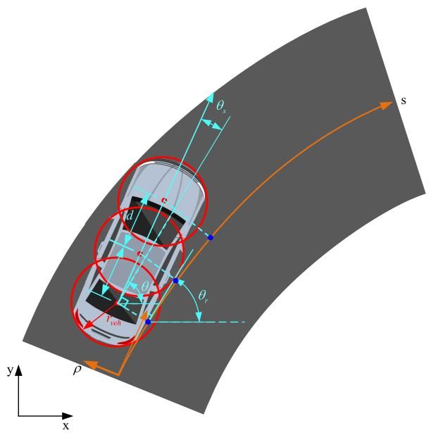

text_image

θs
s
d
e
θr
v/v0
y
x
ρ

FIGURE 4. The vehicle discs containing the host vehicle body.

In this paper, the coordinates $[ s _ { i } , \rho _ { i } ] ^ { T }$ of the center point of the rear axis are given by the localization module, so the center coordinates of the remaining two discs can be obtained using approximate numerical calculations as follows:

$$
s _ {2 i} = s _ {i} + d \cos (\theta (s _ {i}) - \theta_ {r} (s _ {i}))
$$

$$
\rho_ {2 i} = \rho_ {i} + d \sin (\theta (s _ {i}) - \theta_ {r} (s _ {i}))
$$

$$
s _ {3 i} = s _ {2 i} + d \cos (\theta (s _ {i}) - \theta_ {r} (s _ {2 i}))
$$

$$
\rho_ {3 i} = \rho_ {2 i} + d \sin (\theta (s _ {i}) - \theta_ {r} (s _ {2 i})) \tag {20}
$$

Collision avoidance constraints can be written as:

$$
(s _ {i} - s _ {j}) ^ {2} + (\rho_ {i} - \rho_ {j}) ^ {2} > (r _ {v e h} + r _ {o b s}) ^ {2}
$$

$$
(s _ {2 i} - s _ {j}) ^ {2} + (\rho_ {2 i} - \rho_ {j}) ^ {2} > (r _ {v e h} + r _ {o b s}) ^ {2}
$$

$$
(s _ {3 i} - s _ {j}) ^ {2} + (\rho_ {3 i} - \rho_ {j}) ^ {2} > (r _ {v e h} + r _ {o b s}) ^ {2} \tag {21}
$$

where the frenet coordinate of the jth obstacle is $[ s _ { j } , \rho _ { j } ] ^ { T } . r _ { o b s }$ represents the expansion radius of an obstacle. For dynamic obstacle avoidance constraints, the longitudinal trajectory of the host vehicle is projected into the S-T domain based on the speed profile of the previous cycle. Then, according to the mapping relationship of S-T, the time stamp $t _ { i }$ corresponding to station $s _ { i }$ is obtained, and finally the obstacle coordinate $[ s _ { j } , \rho _ { j } ] ^ { T }$ corresponding to the time stamp $t _ { i }$ is obtained according to the predicted trajectories. Therefore, the collision avoidance constraints of dynamic obstacles are also shown in (21). These constraints create $3 n _ { o } N _ { s }$ inequations, where $n _ { o }$ is the number of obstacles. At the same time, the vehicle cannot pass the boundaries of the driving corridor while driving, so the following inequality constraints are formed:

$$
\rho_ {\min} \leq \rho_ {i} \leq \rho_ {\max} \tag {22}
$$

where $\rho _ { \mathrm { m a x } }$ and $\rho _ { \mathrm { m i n } }$ are the left and right boundaries, respectively, so the number of the driving corridor inequalities here is $2 N _ { s } .$ .

The optimization process also needs to meet the start point state constraints to match the initial heading and curvature. The initial state of the host vehicle given by the perception module is $\mathbf { x } _ { 0 } = [ x _ { 0 } , y _ { 0 } , s _ { 0 } , \rho _ { 0 } , \theta _ { 0 } , \kappa _ { 0 } ] ^ { T }$ . So the equality constraints formed by the initial state are:

$$
\theta_ {s _ {0}} = \theta_ {0} - \theta_ {r} (s _ {0})
$$

$$
\tan \theta_ {s _ {0}} = \frac {\rho_ {1} - \rho_ {0}}{s _ {1} - s _ {0}}
$$

$$
\kappa_ {0} = \frac {\left(x _ {1} - x _ {0}\right) \left(y _ {2} - 2 y _ {1} + y _ {0}\right) - \left(y _ {1} - y _ {0}\right) \left(x _ {2} - 2 x _ {1} + x _ {0}\right)}{\sqrt [ 3 ]{\left(x _ {1} - x _ {0}\right) ^ {2} + \left(y _ {1} - y _ {0}\right) ^ {2}}} \tag {23}
$$

According to (23), the decision variables $\rho _ { 1 }$ and $\rho _ { 2 }$ can be expressed as:

$$
\rho_ {1} = e \tan (\theta_ {0} - \theta_ {r} (s _ {0})) + \rho_ {0}
$$

$$
\rho_ {2} = \frac {A - B + C}{D} \tag {24}
$$

where,

$$
A = \kappa_ {0} \sqrt [ 3 ]{(x _ {1} - x _ {0}) ^ {2} + (y _ {1} - y _ {0}) ^ {2}}
$$

$$
B = (x _ {1} - x _ {0}) \left(y _ {r} \left(s _ {2}\right) - 2 y _ {1} + y _ {0}\right)
$$

$$
C = (y _ {1} - y _ {0}) \left(x _ {r} \left(s _ {2}\right) - 2 x _ {1} + x _ {0}\right)
$$

$$
D = (x _ {1} - x _ {0}) \sin (\theta_ {r} (s _ {2}) + \frac {\pi}{2}) - (y _ {1} - y _ {0}) \cos (\theta_ {r} (s _ {2}) + \frac {\pi}{2}) \tag {25}
$$

where $x _ { 1 } , y _ { 1 } , x _ { 2 } , y _ { 2 }$ can be calculated according to (11).

Finally, a problem to optimize the rough path is transformed into a constrained nonlinear optimization problem that minimizes the performance index (16) and satisfies the nonlinear constraints and nonlinear boundary conditions. For the convenience of notation, we organize all the constraints into the following form:

$$
\min j (\boldsymbol {\rho}) = \sum_ {i = 1} ^ {N _ {s} - 3} L \left(\rho_ {i}, \dot {\rho} _ {i}, \ddot {\rho} _ {i}, \dddot {\rho} _ {i}\right) e
$$

$$
s. t. \mathbf {A e q} \cdot \boldsymbol {\rho} = \mathbf {B e q}
$$

$$
\mathbf {C} (\boldsymbol {\rho}) \leq \mathbf {0}
$$

$$
\mathbf {L B} \leq \boldsymbol {\rho} \leq \mathbf {U B} \tag {26}
$$

where Aeq · $\rho ~ = ~ \mathbf { B e q }$ is the equality constraints formed by boundary conditions, $\mathbf { C } ( \pmb { \rho } ) \le \mathbf { 0 }$ is inequality constraints consisting of (19) and (21), and $\mathbf { L B } \ \leq \ \pmb { \rho } \ \leq \ \mathbf { U B }$ is the driving corridor constraints of the decision variables. $\pmb { \rho } =$ $[ \rho _ { 0 } , \cdots , \rho _ { N _ { s } } ] ^ { T }$ is the vector of the decision variables.

In (26), the objective function is a quadratic form which is twice differentiable. And the constraint functions are composed of nonlinear equations and nonlinear inequalities. In order to solve this problem quickly, a constrained nonlinear optimization solver is picked as shown in Section IV. Fig. 5 (a) shows the rough path (the blue curve) and the optimized path (the orange curve) on a straight road with three obstacles. It can be seen from this figure that both paths seem to be continuous and smooth. Fig. 5 (b) shows the curvature profile (the blue curve) of the rough path contains three step changes, and the curvature profile (the orange curve) of the refined path is spatially smooth.

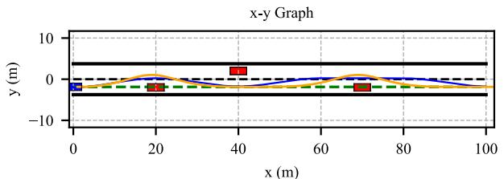

line

| x (m) | y (m) |
|-------|-------|
| 0     | -2    |
| 20    | -1    |
| 40    | 3     |
| 60    | -1    |
| 80    | -2    |
| 100   | -1    |

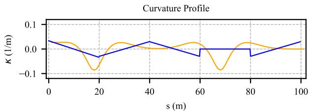

line

| s (m) | K (1/m) - Blue Line | K (1/m) - Orange Line |
|-------|---------------------|-----------------------|
| 0     | 0.05                | 0.05                  |
| 20    | -0.05               | -0.08                 |
| 40    | 0.03                | 0.02                  |
| 60    | -0.02               | 0.01                  |
| 80    | -0.01               | 0.01                  |
| 100   | 0.02                | 0.02                  |

FIGURE 5. Path optimization. (a) Path optimization on structured roads. The blue curve represents the rough path generated by the lattice searching. The orange curve represents the refined path generated by path optimizer. The green dotted line represents the reference line of the right lane. And these three red boxes represent obstacles. (b) Curvature profile of path optimization. The blue curve represents the curvature profile of the rough path, and the orange curve represents the curvature profile of the refined path.

# C. SPEED PROFILE SEARCHING

In recent years, the Station-Time (s-t) graph used by speed profile planning is a popular method [4], [31], [32]. In general, obstacles information is mapped to the s-t graph, which may make the s-t graph become a non-convex domain. In order to generate a temporally smooth speed profile in this non-convex domain, sampling-based methods [33], optimization-based methods [31],[34], and combinationbased methods [4], [18], [35] are used widely. And in order to ensure that the generated speed profile is optimal and to prevent the speed profile from falling into a local minimum state, combination-based methods are preferred. It is convenient to explicitly express the mathematical relationship between the longitudinal station and the time in the s-t graph. The planning result also explicitly reflects the relative position between the ego vehicle and moving obstacles in the s-t graph. We can clearly see whether the ego vehicle’s behavior is overtaking, following or stopping or not. Speed planning in this paper is divided into two layers like path planning. Firstly, we sample in the s-t graph and search for a rough speed profile, then the QP algorithm is introduced to optimize the rough speed profile.

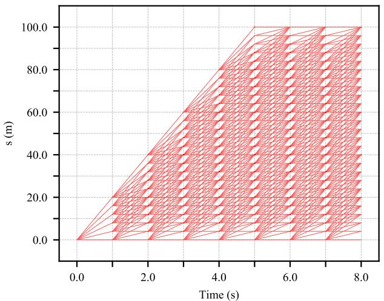

line

| Time (s) | s (m) |
| -------- | ----- |
| 0.0      | 0.0   |
| 2.0      | 40.0  |
| 4.0      | 60.0  |
| 6.0      | 80.0  |
| 8.0      | 100.0 |

FIGURE 6. Speed profile lattice in the Station-Time domain.

# 1) SPEED PROFILE PRIMITIVES

We sample some vertices at equal intervals in the s-t graph, then connect these sampled vertices using straight lines to construct a speed profile lattice as shown in Fig. 6. The efficiency of the algorithm is closely related to the resolution of the speed lattice. A lower resolution may result in a larger acceleration or deceleration of a generated speed profile, which affects the temporal smoothness of the trajectory. A higher resolution will produce a smoother speed profile, but it is a challenge in terms of computational efficiency. Fig. 6 shows the time interval $\Delta t \ = \ 1$ 1.0s and the station interval $\Delta s = 4 . 0 m$ . Of course, we can adjust the resolution of the lattice to adapt to different scenarios. On the time axis, time series can be expressed as:

$$
t _ {i} = t _ {0} + i \Delta t, \quad i = 0, 1,..., n \tag {27}
$$

According to the sampling interval 1t, the time derivatives of s are approximated by the finite differences as follows:

$$
s _ {i} ^ {\prime} = v _ {i} \approx \frac {s _ {i} - s _ {i - 1}}{\Delta t}
$$

$$
s _ {i} ^ {\prime \prime} = a _ {i} \approx \frac {s _ {i} - 2 s _ {i - 1} + s _ {i - 2}}{\Delta t ^ {2}}
$$

$$
s _ {i} ^ {\prime \prime \prime} = j _ {i} \approx \frac {s _ {i} - 3 s _ {i - 1} + 3 s _ {i - 2} - s _ {i - 3}}{\Delta t ^ {3}} \tag {28}
$$

# 2) COST FUNCTIONS

Like the path planning step, we also need to assign weights to each edge. Considering the feasibility, smoothness, safety, and optimality of the generated trajectory, the cost function we designed is also a linear combination of the offset from the reference speed $\nu _ { r e f }$ , acceleration and jerk penalties, and collision risk with obstacles, as shown in (29).

$$
c _ {s p e e d} = c _ {r e f} + c _ {a c c} + c _ {j e r k} + c _ {o b s} \tag {29}
$$

cref represents the cost term of the offset from the reference speed, which shows that we do not expect the planning speed to drift too far from the reference speed. This term can be defined as follows:

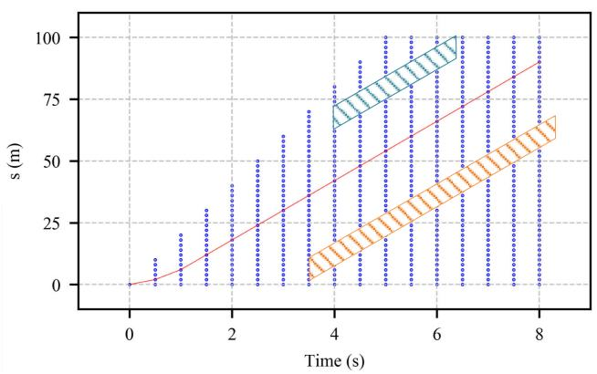

line

| Time (s) | s (m) |
| -------- | ----- |
| 0        | 0     |
| 1        | 10    |
| 2        | 30    |
| 3        | 50    |
| 4        | 75    |
| 5        | 90    |
| 6        | 100   |
| 7        | 100   |
| 8        | 90    |

FIGURE 7. The rough speed profile in the Station-Time domain. The blue points are sampled vertices, and two parallelograms are the predicted trajectories of obstacles.

$$
c _ {r e f} = w _ {r e f} (s _ {i} ^ {\prime} - v _ {r e f}) ^ {2} \tag {30}
$$

where the reference speed $\nu _ { r e f }$ depends on the speed of the vehicle ahead, traffic rules, and road structure.

$c _ { a c c }$ and $c _ { j e r k }$ represent the penalty terms of acceleration and jerk, respectively, which is shown as (31). These two terms can make the trajectory smoother by dampening rapid changes in the speed and acceleration profile.

$$
c _ {a c c} = w _ {a c c} (s _ {i} ^ {\prime \prime}) ^ {2}
$$

$$
c _ {j e r k} = w _ {j e r k} (s _ {i} ^ {\prime \prime \prime}) ^ {2} \tag {31}
$$

The cost term $c _ { o b s }$ describes the collision risk with obstacles. In dynamic scenarios, risk assessment can be performed using some risk indicators, such as the Time-To-Collision (TTC) [36], Distance-To-Collision (DTC) [37] or Time-To-React (TTR) [38]. This paper uses a combination of the physics-based motion models and the curved lane models to predict the short-term trajectory of a vehicle. Although this prediction does not take the uncertainty of the vehicle and the error of the motion model into account, the predicted trajectory remains valid in the short term. And the computational complexity of this prediction method also makes it suitable for online execution. And based on the bicycle model and the road structure, the single trajectory simulated forward is projected into the s-t graph. At last, based on the projection trajectory, we use the index DTC as our risk indicator. At a certain timestamp, we calculate the distance of the ego vehicle to obstacles and select the minimum distance as the value of the DTC. The $c _ { o b s }$ is represented as follows:

$$
c _ {o b s} = \frac {w _ {o b s}}{D T C + \delta} \tag {32}
$$

where $\delta = 0 . 0 1$ .

In the speed profile searching step, we can generate a rough speed profile using Dijkstra’s algorithm as shown in Fig. 7. In this figure, the ego vehicle starts moving from rest as shown by the red curve. Two parallelograms are the predicted trajectories of obstacles.

# D. SPEED PROFILE OPTIMIZATION

# 1) OBJECTIVE FUNCTION

The generated rough speed profile is formed by the connection of many straight segments, so the kinematic constraints, dynamic constraints, and temporal smoothness are not satisfied. Obviously, a trajectory with step changes in the speed profile and acceleration profile is not feasible for a vehicle, so we also introduce an optimization method to improve the performance of the rough speed profile like path optimization. In the s-t graph, a speed profile is a one-toone mapping between the timestamp and the station along a lane. Generally there are two optimization strategies in the s-t graph as described in [31]: one strategy is to optimize the decision variables $\mathbf { s } = [ s _ { 1 } , s _ { 2 } , . . . , s _ { n } ] ^ { T }$ based on the fixed timestamps as discussed in [35], [39], and the other strategy is to optimize the decision variables $\mathbf { t } { = } [ t _ { 1 } , t _ { 2 } , . . . , t _ { n } ] ^ { T }$ based on the fixed longitudinal stations as discussed in [31], [40]. For the convenience of the computation, this paper refines the rough speed profile via station optimization. And the speed optimization problem is transformed into a QP problem, so the speed optimization problem can also be solved by a local, continuous method.

The optimal speed is defined as the one that minimizes the finite sum as follows

$$
j = \sum_ {i = 1} ^ {N _ {t}} (w _ {v e l} (v _ {i} - v _ {r i}) ^ {2} + w _ {a c c} a _ {i} ^ {2} + w _ {j e r k} j e r k _ {i} ^ {2}) \varepsilon \tag {33}
$$

with

$$
{\cal L} = w _ {v e l} (s _ {i} ^ {\prime} - v _ {r} (t _ {i})) ^ {2} + w _ {a c c} (s _ {i} ^ {\prime \prime}) ^ {2} + w _ {j e r k} (s _ {i} ^ {\prime \prime \prime}) ^ {2}
$$

We discretize the temporal space into the following form:

$$
t _ {i} = t _ {0} + i \varepsilon , \quad i = 0, 1, \dots , N _ {t} \tag {34}
$$

where ε is the step of time, and $N _ { t }$ indicates that the total temporal horizon T is divided into $N _ { t }$ discrete timestamps.

The corresponding decision variables that need to be optimized are expressed as $\mathbf { s } = [ s _ { 1 } , s _ { 2 } , . . . , s _ { n } ] ^ { T }$ . The time derivatives of s are approximated by finite differences of the discrete waypoints.

$$
s _ {i} ^ {\prime} = v _ {i} \approx \frac {s _ {i + 1} - s _ {i}}{\varepsilon}
$$

$$
s _ {i} ^ {\prime \prime} = a _ {i} \approx \frac {s _ {i + 2} - 2 s _ {i + 1} + s _ {i}}{\varepsilon^ {2}}
$$

$$
s _ {i} ^ {\prime \prime \prime} = j e r k _ {i} \approx \frac {s _ {i + 3} - 3 s _ {i + 2} + 3 s _ {i + 1} - s _ {i}}{\varepsilon^ {3}} \tag {35}
$$

Obviously, the objective function is a quadratic convex function. The first term is the penalty cost about the offset from the rough speed profile $\nu _ { r } ( t )$ . This cost indicates that the speed of the ego vehicle should follow the rough speed profile as much as possible, which ensures that the speed optimization can converge to the global optimum. $\nu _ { r i }$ is the rough speed obtained from the rough speed profile. The vector s obtained from the rough speed profile is used as the initial value to feed QP. The remaining two terms in (33)

are the penalties for acceleration and jerk, which makes the generated speed profile smoother. And for the computational convenience, we convert the objective functional (33) into a standard quadratic form (SQF) expressed by matrix manipulations. The details of the transformations can be found in Appendix A.

# 2) CONSTRAINT FUNCTIONS

Constraints also can be separated into two classes in the $\mathrm { Q P }$ speed optimization step, internal and external constraints. Internal constraints come from the kinematics and dynamics limitations of the vehicle, including the speed limits, acceleration limits $a _ { \mathrm { l i m } }$ and jerk limits $j e r k _ { \mathrm { l i m } } .$ which are essentially brought about by the physical limits of the vehicle’s powertrain and the adhesion of tires. External constraints come from the driving scenarios, including the road speed limits $\nu _ { \mathrm { l i m } } .$ , collision avoidance, boundary conditions, and so on. In this paper, acceleration constraints, jerk constraints, and lane speed limits can be defined as follows:

$$
\left| s _ {i} ^ {\prime \prime} \right| \leq a _ {\lim}
$$

$$
\left| s _ {i} ^ {\prime \prime \prime} \right| \leq j e r k _ {\lim}
$$

$$
\left| s _ {i} ^ {\prime} \right| \leq v _ {\text { lim }} \tag {36}
$$

For each decision variable $s _ { i } ,$ there are upper and lower bounds $( s _ { 0 } , s _ { \mathrm { m a x } } )$ which can be expressed as:

$$
s _ {0} \leq s _ {i} \leq s _ {\max} \tag {37}
$$

And the collision avoidance constraints can be described as:

$$
\left| s _ {j, i} - s _ {i} \right| > r _ {v e h} + r _ {d y n}
$$

$$
\left| s _ {j, i} - s _ {2 i} \right| > r _ {v e h} + r _ {d y n}
$$

$$
\left| s _ {j, i} - s _ {3 i} \right| > r _ {\text { veh }} + r _ {\text { dyn }} \tag {38}
$$

where $s _ { j , i }$ represents the coordinate of the jth obstacle at ti in station domain. $r _ { d y n }$ represents the expansion radius of the dynamic obstacles. $s _ { 2 i }$ and $s _ { 3 i }$ represent the coordinates of the remaining vehicle discs in the station domain. Due to the existence of $s _ { 2 i } , s _ { 3 i }$ , the obstacle avoidance constraints become highly nonlinear constraints. To linearize these inequalities, we scale up the inequalities, which is shown in (39).

$$
s _ {2 i} = s _ {i} + d \cos (\theta (s _ {i}) - \theta_ {r} (s _ {i})) \leq s _ {i} + d
$$

$$
s _ {3 i} = s _ {2 i} + d \cos (\theta (s _ {i}) - \theta_ {r} (s _ {2 i})) \leq s _ {i} + 2 d \tag {39}
$$

The amplification of $s _ { 2 i } , s _ { 3 i }$ is of physical significance because this transformation increases the safe distance of the ego vehicle to obstacles in this QP step.

And the boundary value conditions form the equality constraints. The start point and the end point in the speed optimization step are $\mathbf { x } _ { 0 } ~ = ~ [ s _ { 0 } , t _ { 0 } , \nu _ { 0 } , a _ { 0 } , j e r k _ { 0 } ] ^ { T }$ and $\mathbf { x } _ { f } ~ =$ $[ s _ { f } , t _ { f } , \nu _ { f } , a _ { f } , j e r k _ { f } ] ^ { T }$ , respectively. And both speed and acceleration are expected to be 0.0 at the endpoint of the trajectory, which means that the ego vehicle will move at a constant speed after the optimization. Hence, the terminal conditions can be written as (40).

$$
v _ {n} \approx \frac {s _ {n + 1} - s _ {n}}{\varepsilon}
$$

$$
a _ {n} \approx \frac {s _ {n + 2} - 2 s _ {n + 1} + s _ {n}}{\varepsilon^ {2}} = 0
$$

$$
j e r k _ {n} \approx \frac {s _ {n + 3} - 3 s _ {n + 2} + 3 s _ {n + 1} - s _ {n}}{\varepsilon^ {3}} = 0 \tag {40}
$$

At the endpoint of the trajectory, both ε and $a _ { n - 1 }$ are extremely small, so we can write the following equality constraints according to the boundary value conditions.

$$
s _ {0} = s _ {0}
$$

$$
s _ {1} = \varepsilon v _ {0} + s _ {0}
$$

$$
s _ {2} = a _ {0} \varepsilon^ {2} + s _ {0} + 2 \varepsilon v _ {0}
$$

$$
s _ {3} = j e r k _ {0} \varepsilon^ {3} + 3 \varepsilon v _ {0} + 3 a _ {0} \varepsilon^ {2} + s _ {0}
$$

$$
s _ {n + 1} = 2 s _ {n} - s _ {n - 1}
$$

$$
s _ {n + 2} = 3 s _ {n} - 2 s _ {n - 1}
$$

$$
s _ {n + 3} = 4 s _ {n} - 3 s _ {n - 1} \tag {41}
$$

At last, all the above constraints (36), (37), (38) and (41) are linear, so the feasible domain is a convex space in $\mathbb { R } ^ { n + 3 }$ . To facilitate numerical calculations, all constraints are also converted into the forms of matrix manipulations. The details of the transformations can be found in Appendix B. Finally, we successfully transform the speed profile optimization problem into an optimization problem with a quadratic objective function and linear constraints. This optimization problem is a typical medium-scale QP problem. We transform the objective function and the constraint functions into a standard form (SF), which is described as (42). A detailed explanation of the coefficients in (42) can be found in Appendix A and B.

$$
\min j (\mathbf {s}) = \frac {1}{2} \mathbf {s} ^ {T} \mathbf {H} \mathbf {s} + \mathbf {q s} + p
$$

$$
s. t. \mathbf {G} \mathbf {s} \leq \mathbf {h}
$$

$$
\mathbf {A} \mathbf {s} = \mathbf {b} \tag {42}
$$

In Fig. 8 (a), the blue curve represents the rough s-t profile generated by the speed lattice searching, and the orange curve represents the refined s-t profile generated by QP. We can see that the shapes of the two curves are similar. In Fig.8 (b), (c), (d), the profiles of speed, acceleration, and jerk generated by $\mathrm { Q P }$ are temporally smoother than those generated by lattice searching.

# IV. CASE STUDIES

To evaluate the algorithm performance we proposed, we built a 1, 163m simulated road with multiple challenging scenarios. Our simulation environment consists of static and dynamic obstacles and simulated two-lane roads. Some common driving scenarios are added to the simulated structured environment, including lane changing, following, obstacles avoidance, overtaking, and stopping. We show four cases to test the performance of the framework in this paper. In our simulation environment, the host vehicle is represented by a blue box and the surrounding vehicles are represented by boxes of other colors. The temporal information is represented by the depth of color, where deeper color represents a later time step.

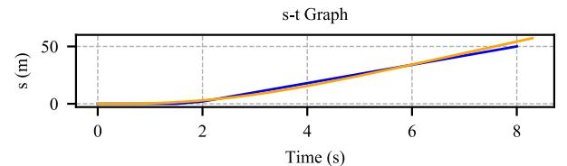

line

| Time (s) | s (m) - Blue Line | s (m) - Orange Line |
| -------- | ----------------- | ------------------- |
| 0        | 0                 | 0                   |
| 2        | ~5                | ~5                  |
| 4        | ~20               | ~20                 |
| 6        | ~35               | ~35                 |
| 8        | ~50               | ~50                 |

(a)   
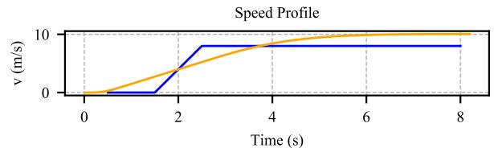

line

| Time (s) | v (m/s) - Blue Line | v (m/s) - Orange Line |
| -------- | ------------------- | --------------------- |
| 0        | 0                   | 0                     |
| 1        | 0                   | 2                     |
| 2        | 8                   | 4                     |
| 3        | 8                   | 6                     |
| 4        | 8                   | 8                     |
| 5        | 8                   | 9                     |
| 6        | 8                   | 10                    |
| 7        | 8                   | 10                    |
| 8        | 8                   | 10                    |

(b)   
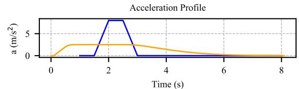

line

| Time (s) | a (m/s²) |
| -------- | -------- |
| 0        | 0        |
| 1        | 0        |
| 2        | 7        |
| 3        | 0        |
| 4        | 0        |
| 5        | 0        |
| 6        | 0        |
| 7        | 0        |
| 8        | 0        |

（c）  
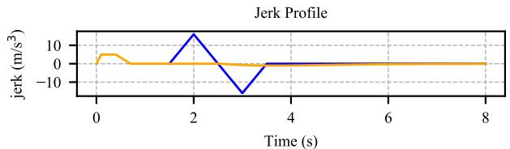

line

| Time (s) | jerk (m³/s) |
| -------- | ----------- |
| 0        | 0           |
| 1        | 0           |
| 2        | 10          |
| 3        | -15         |
| 4        | 0           |
| 5        | 0           |
| 6        | 0           |
| 7        | 0           |
| 8        | 0           |

(d)   
FIGURE 8. Speed profile optimization. (a) The blue curve represents the rough Station-Time profile, and the orange curve represents the post-optimized Station-Time profile. (b) The blue curve represents the rough speed profile, and the orange curve represents the post-optimized speed profile. (c) The blue curve represents the rough acceleration profile, and the orange curve represents the post-optimized acceleration profile. (d) The blue curve represents the rough jerk profile, and the orange curve represents the post-optimized jerk profile.

In our simulator, the perception module can be removed because all the environmental information and vehicle state information can be directly acquired from the simulator. The behavior planning (decision-making) layer uses a finite state machine [41], [42] model to make decisions based on the predefined behaviors and scenarios. Due to the clear logic and low computational complexity, this rule-based decisionmaker is fully capable of handling simple scenarios. For decision makers based on the partially observable Markov decision process (POMDP) [43], the computational complexity is too high to make it unsuitable for real-time operation. In order to validate the planning algorithm in this paper, using the state machine model as the core of the decision-making layer is a nice choice. And the behavior prediction layer combines the physical model of vehicles with the curved road model to predict the behaviors and trajectories of surrounding vehicles. Due to the existence of the nonholonomic constraints and dynamic constraints, we use the model predictive control (MPC) [44] controller to track the trajectories the decoupled planner generated and plot the historical trajectories of the host vehicle and all surrounding vehicles.

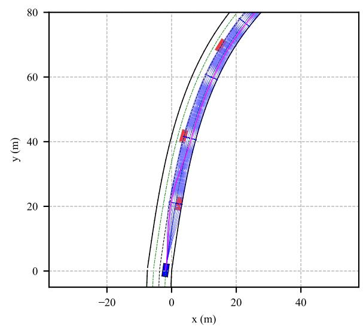

line

| x (m) | y (m) |
|-------|-------|
| -5    | 0     |
| 0     | 0     |
| 5     | 20    |
| 10    | 40    |
| 15    | 60    |
| 20    | 70    |
| 25    | 75    |
| 30    | 80    |

(a)   
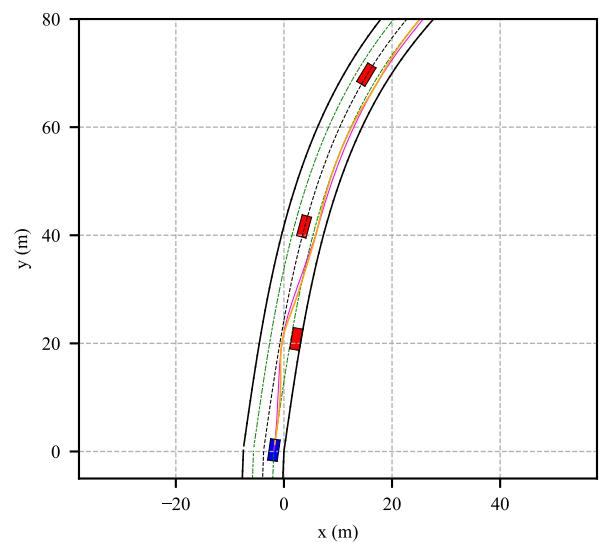

line

| x (m) | y (m) |
|-------|-------|
| -5    | 0     |
| 0     | 0     |
| 5     | 20    |
| 10    | 40    |
| 15    | 60    |
| 20    | 70    |
| 25    | 75    |
| 30    | 80    |

(b)   
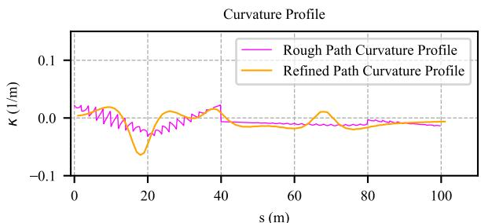

line

| s (m) | Rough Path Curvature Profile | Refined Path Curvature Profile |
|-------|------------------------------|--------------------------------|
| 0     | ~0.0                         | ~0.0                           |
| 20    | ~-0.05                       | ~-0.08                         |
| 40    | ~0.0                         | ~0.0                           |
| 60    | ~-0.02                       | ~-0.01                         |
| 80    | ~-0.01                       | ~-0.01                         |
| 100   | ~-0.01                       | ~-0.01                         |

（c）  
FIGURE 9. Static obstacles avoidance. (a) The blue lattice is constructed in the right lane. The magenta curve represents the rough path. The blue box and the red boxes represent the ego vehicle and obstacles respectively. (b) Path optimization. The magenta curve represents the rough path. The orange curve represents the refined path. The green dotted curves represent the reference line for each lane separately. (c) Curvature profile of path optimization.

In addition, compared to the pure pursuit controller [45] and the rear wheel based feedback controller [45], the MPC controller can maintain proper tracking accuracy and has good control over the host vehicle at high speed. Therefore, the trajectory planner only needs to generate an executable trajectory combining the path and the temporal information to feed into the controller.

The planner is implemented in Python3.6 scripts and runs on a laptop with 2.6GHz Intel Core i7-6500U and 8GB RAM in Ubuntu 16.04.6 LTS. The path optimizer utilizes the open-source nonlinear optimization tool CasADi [46]. The solver of the interior point method is the open source optimization library IPOPT [47]. And the speed profile optimizer and the MPC controller utilizes the open-source optimization library CVXOPT2 and CVXPY,3 respectively.

# A. CASE1: STATIC OBSTACLES AVOIDANCE

Static obstacles avoidance is one of the most basic functions for the trajectory planner. The host vehicle expects a spatiotemporally smooth trajectory that can bypass obstacles without collisions with obstacles and road boundaries. In this case, the ego vehicle starts moving from rest, and there are three static obstacles along the right lane. Fig. 9 (a) shows the rough path generated in the path lattice is able to avoid obstacles and looks smooth enough. The magenta curve represents the rough path, and blue curves represent the motion primitives that construct the path lattice. Fig. 9 (b) shows the rough path and the refined path, respectively. In this graph, the magenta curve represents the rough path, and the orange curve represents the refined path. Fig. 9 (c) shows the magenta curvature profile of the rough path is not smooth due to the existence of oscillations and step changes. And the orange curve represents the curvature profile of the refined path. The results show that the curvature of the path is well improved by the path optimizer. The curvature profile of the refined path removed the shocks and improved the smoothness of the path. Fig. 10 shows the speed, acceleration and jerk profiles of the ego vehicle, which are temporally smooth and Fig. 11 records the trajectory of the ego vehicle generated by the MPC controller. The static obstacle avoidance test verifies that our framework can output a spatiotemporally smooth and feasible trajectory for the trajectory tracking module to execute.

# B. CASE2: AUTOMATIC LANE CHANGING

Lane changing is also one of the most common behaviors in structured environments. According to our predictive model, obstacles continue to move forward along the lane with the current detection speed. We set up slow-moving vehicles ahead to test the planner’s lane changing performance, where the speed of obstacle vehicles is 3.0m/s. Fig. 12 (a) shows the rough path in the scenario of lane changing. In Fig. 12 (b), the magenta curve represents the rough path and the orange

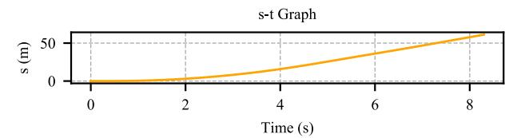

line

| Time (s) | s (m) |
| -------- | ----- |
| 0        | 0     |
| 2        | 10    |
| 4        | 20    |
| 6        | 35    |
| 8        | 50    |

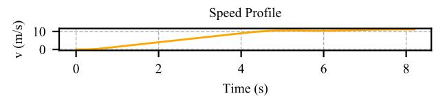

line

| Time (s) | v (m/s) |
| -------- | ------- |
| 0        | 0       |
| 2        | ~2      |
| 4        | ~6      |
| 6        | ~10     |
| 8        | ~10     |

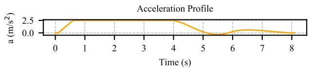

line

| Time (s) | Acceleration (m/s²) |
| -------- | ------------------- |
| 0        | 0.0                 |
| 1        | 2.5                 |
| 2        | 2.5                 |
| 3        | 2.5                 |
| 4        | 2.5                 |
| 5        | 0.0                 |
| 6        | 0.0                 |
| 7        | 0.0                 |
| 8        | 0.0                 |

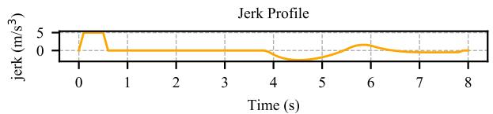

line

| Time (s) | Jerk (m/s³) |
| -------- | ----------- |
| 0        | 5           |
| 1        | 0           |
| 2        | 0           |
| 3        | 0           |
| 4        | 0           |
| 5        | 0           |
| 6        | 2           |
| 7        | 0           |
| 8        | 0           |

FIGURE 10. Speed profile, acceleration profile and jerk profile generated by the speed profile optimizer in the scenario of static obstacle avoidance.

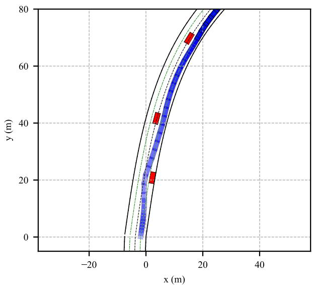

line

| x (m) | y (m) |
|-------|-------|
| 0     | 20    |
| 5     | 40    |
| 10    | 60    |
| 15    | 70    |
| 20    | 80    |

FIGURE 11. The host vehicle trajectory in the scenario of static obstacle avoidance.

curve represents the refined path. Fig. 12 (c) shows the curvature profiles of the rough path and the refined path. And the maximum curvature of the refined path is $0 . 0 4 m ^ { - 1 }$ . Fig. 13 shows that the ego vehicle’s speed should be accelerated from 8m/s at $t \ = \ 1 2 . 4 s$ to $1 1 . 3 m / s$ at $t \ = \ 1 5 . 2 s$ during the lane changing. We set the maximum acceleration and deceleration values to be $2 . 5 m / s ^ { 2 }$ and $- 2 . 5 m / s ^ { 2 }$ , respectively. And we set the maximum jerk value to be $5 m / s ^ { 3 }$ . In this graph, we can see that the speed profile, the acceleration profile and the jerk profile are smooth. And the speed, acceleration, and jerk did not exceed the thresholds. Fig. 14 records the results of trajectory tracking. The blue trajectory belongs to the host vehicle, and the other trajectories belong to the surrounding obstacles.

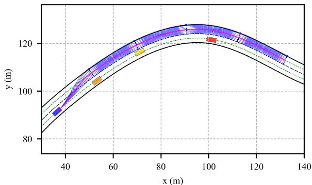

line

| x (m) | y (m) |
|-------|-------|
| 40    | 90    |
| 60    | 105   |
| 80    | 115   |
| 100   | 125   |
| 120   | 115   |
| 140   | 105   |

(a)   
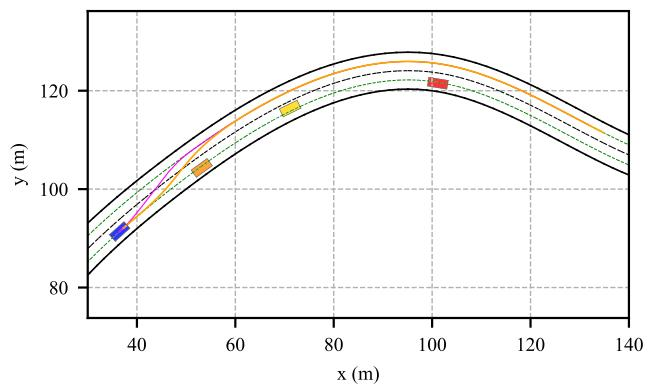

line

| x (m) | y (m) |
|-------|-------|
| 40    | 90    |
| 60    | 105   |
| 80    | 115   |
| 100   | 125   |
| 120   | 115   |
| 140   | 105   |

(b)   
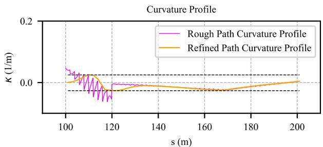

line

| s (m) | Rough Path Curvature Profile | Refined Path Curvature Profile |
|-------|------------------------------|-------------------------------|
| 100   | ~0.05                        | ~0.02                         |
| 120   | ~-0.05                       | ~-0.01                        |
| 140   | ~0.01                        | ~0.00                         |
| 160   | ~0.00                        | ~0.00                         |
| 180   | ~0.00                        | ~0.00                         |
| 200   | ~0.00                        | ~0.01                         |

（c）  
FIGURE 12. The lane change scenario. (a) The blue lattice is constructed in the left lane. The magenta curve represents the rough path. The blue box and the remaining boxes represent the ego vehicle and dynamic obstacles respectively. (b) Path optimization. The magenta curve represents the rough path. The orange curve represents the refined path. The green dotted curves represent the reference line for each lane respectively. (c) Curvature profile of path optimization.

# C. CASE3: STOPPING

In the stopping scenario, we set a static obstacle in the left lane as shown by the orange box, and the decision making layer does not give the instruction to perform lane changing, so the ego vehicle should stop when it encounters this static obstacle as displayed in Fig. 15. Fig. 15 (a) shows the total distance horizon sampled forward of the path lattice is 80m. For this path lattice with 4 sets of longitudinal sampling waypoints with an interval of 20 m and 9 sets of lateral sampling waypoints with an interval of 0.5 m, Dijkstra’s algorithm can search the path lattice to generate a rough path using 0.08s. The magenta curve represents the rough path. Fig. 15 (b) shows the orange refined path and the magenta rough path, and the two paths are almost overlapping. Fig. 15 (c) shows the magenta curvature profile of the rough path trembles violently. The curvature profile is smooth enough when the rough path is optimized. The host vehicle detects a static obstacle ahead when $t ~ = ~ 2 4 . 2 s , ~ s ~ = ~ 2 0 0 m$ as shown in Fig. 16. The result of the speed optimization step shows that the speed of the ego vehicle is 15.1 m/s at $t = 2 4 . 2 s$ , then the speed is reduced to $0 . 0 \ : m / s$ at $t = 3 2 . 0 s$ . The maximum deceleration is $- 2 . 5 m / s ^ { 2 }$ and the maximum derivative of the deceleration is $- 5 m / s ^ { 3 }$ . Fig. 17 shows the trajectories of the host vehicle and surrounding vehicles. The blue trajectory shows that the host vehicle is slowing down. The results show that the trajectory planner can output a smooth and feasible trajectory while satisfying the kinodynamic constraints and traffic rule constraints.

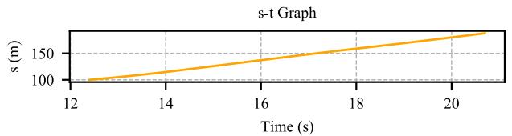

line

| Time (s) | s (m) |
| -------- | ----- |
| 12       | 100   |
| 14       | 110   |
| 16       | 120   |
| 18       | 130   |
| 20       | 140   |
| 22       | 150   |

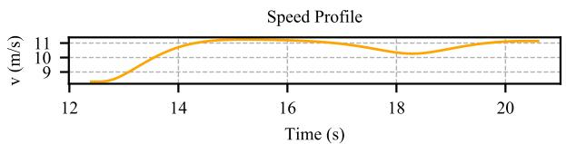

line

| Time (s) | v (m/s) |
| -------- | ------- |
| 12       | 9       |
| 14       | 10.5    |
| 16       | 10.8    |
| 18       | 10.2    |
| 20       | 10.7    |

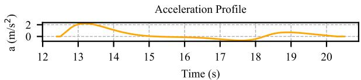

line

| Time (s) | Acceleration (m/s²) |
| -------- | ------------------- |
| 12       | 0                   |
| 13       | 2                   |
| 14       | 1                   |
| 15       | 0                   |
| 16       | 0                   |
| 17       | 0                   |
| 18       | 0                   |
| 19       | 1                   |
| 20       | 0                   |

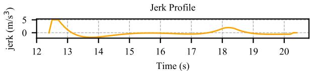

line

| Time (s) | Jerk (m/s³) |
| -------- | ----------- |
| 12       | 5           |
| 13       | 0           |
| 14       | 0           |
| 15       | 0           |
| 16       | 0           |
| 17       | 0           |
| 18       | 2           |
| 19       | 0           |
| 20       | 0           |

FIGURE 13. Speed profile, acceleration profile and jerk profile generated by the speed profile optimizer in the scenario of lane changing.

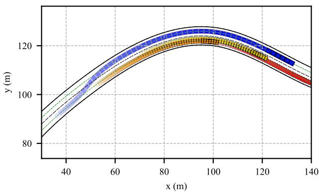

line

| x (m) | y (m) - Blue | y (m) - Orange | y (m) - Red |
|-------|--------------|----------------|-------------|
| 40    | ~95          | ~90            | ~85         |
| 60    | ~110         | ~105           | ~100        |
| 80    | ~120         | ~115           | ~110        |
| 100   | ~125         | ~120           | ~115        |
| 120   | ~120         | ~115           | ~110        |
| 140   | ~105         | ~100           | ~95         |

FIGURE 14. Trajectories of the host vehicle and surrounding vehicles in the scenario of lane changing.

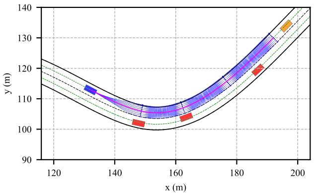

line

| x (m) | y (m) |
|-------|-------|
| 130   | 115   |
| 150   | 105   |
| 160   | 108   |
| 180   | 120   |
| 190   | 130   |
| 200   | 135   |

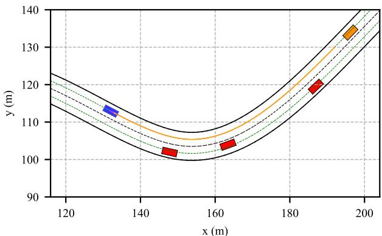

line

| x (m) | y (m) |
|-------|-------|
| 130   | 115   |
| 150   | 102   |
| 165   | 105   |
| 185   | 120   |
| 200   | 135   |

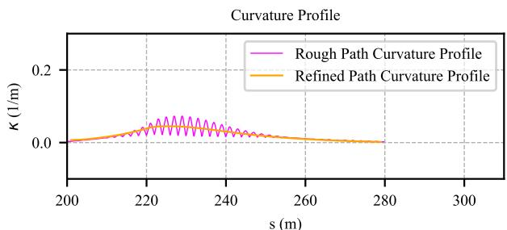

line

| s (m) | Rough Path Curvature Profile | Refined Path Curvature Profile |
|-------|------------------------------|-------------------------------|
| 200   | 0.0                          | 0.0                           |
| 220   | ~0.05                        | ~0.0                          |
| 240   | ~0.05                        | ~0.0                          |
| 260   | ~0.0                         | ~0.0                          |
| 280   | ~0.0                         | ~0.0                          |
| 300   | ~0.0                         | ~0.0                          |

FIGURE 15. The stopping scenario. (a) The blue lattice is constructed in the current lane. The magenta curve represents the rough path. The blue box and the remaining boxes represent the ego vehicle, static and dynamic obstacles respectively. (b) Path optimization. The magenta curve represents the rough path. The orange curve represents the refined path. The green dotted curves represent the reference line for each lane respectively. (c) Curvature profile of path optimization.

# D. CASE4: OVERTAKING

One of the most challenging scenarios for trajectory planning is to overtake the dynamic vehicles ahead. Due to the high speed of the ego vehicle and surrounding vehicles, the trajectory given by the planner requires reasonable and timely acceleration and steering. When $s ~ = ~ 4 0 0 . 0 m , t ~ = ~ 3 9 . 2 s .$ , the decision-making layer issues an overtaking instruction. Fig. 18 (a) displays that the rough path can avoid obstacles. Fig. 18 (b) shows the magenta rough path and the orange refined path on the road. Fig. 18 (c) shows that the curvature profile of the rough path has three step changes, which indicates that the curvature of the rough path generated in the path lattice is discontinuous and not smooth. According to our experience, step changes usually occur at the junctions of the motion primitives. During the overtaking process, there are two slowly moving vehicles in the current lane, and there is a moving vehicle ahead in the left lane. Fig. 19 shows that the planning speed profile should be increased from $6 . 0 m / s$ at $t = 3 9 . 2 s$ to 15.1 m/s at $t = 4 4 . 3 s$ . After passing the right vehicles, the ego vehicle changes to the right lane and starts to slow down slowly. Because the reference speed we set in this paper is 40.0 km/h, the speed of the host vehicle returns to the reference speed at $t = 5 0 . 0 s$ . Fig. 19 shows that the speed profile, the acceleration profile and the jerk profile generated by the speed optimizer are very smooth. Fig. 20 records trajectories of the host vehicle and surrounding vehicles in the overtaking scenario. The blue trajectory indicates the movement of the host vehicle. As can be seen from Fig. 20, the interval between the blue boxes which belongs to the host vehicle’s trajectory is getting larger after switching to the left lane, which indicates that the vehicle is accelerating. And after changing to the right lane, the interval of the boxes is getting smaller and smaller, which indicates that the vehicle is slowing down. Fig. 20 shows that our planning results are similar to the real on-road overtaking process.

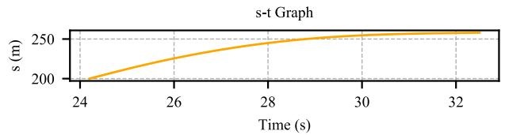

line

| Time (s) | s (m) |
| -------- | ----- |
| 24       | 200   |
| 26       | 225   |
| 28       | 240   |
| 30       | 250   |
| 32       | 255   |

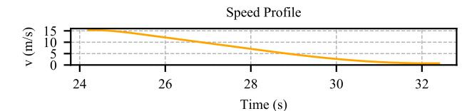

line

| Time (s) | v (m/s) |
| -------- | ------- |
| 24       | 15      |
| 26       | 10      |
| 28       | 5       |
| 30       | 2       |
| 32       | 0       |

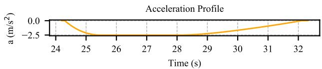

line

| Time (s) | Acceleration (m/s²) |
| -------- | ------------------- |
| 24       | 0.0                 |
| 25       | -2.5                |
| 26       | -2.5                |
| 27       | -2.5                |
| 28       | -2.5                |
| 29       | -2.5                |
| 30       | -2.5                |
| 31       | -2.5                |
| 32       | 0.0                 |

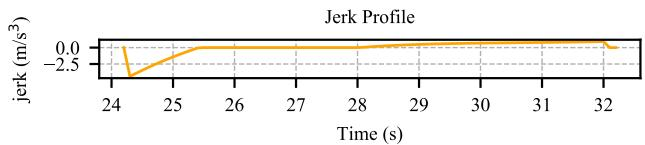

line

| Time (s) | jerk (m/s³) |
| -------- | ----------- |
| 24       | -2.5        |
| 25       | 0.0         |
| 26       | 0.0         |
| 27       | 0.0         |
| 28       | 0.0         |
| 29       | 0.0         |
| 30       | 0.0         |
| 31       | 0.0         |
| 32       | 0.0         |

FIGURE 16. Speed profile, acceleration profile and jerk profile generated by the speed profile optimizer in the scenario of stopping.

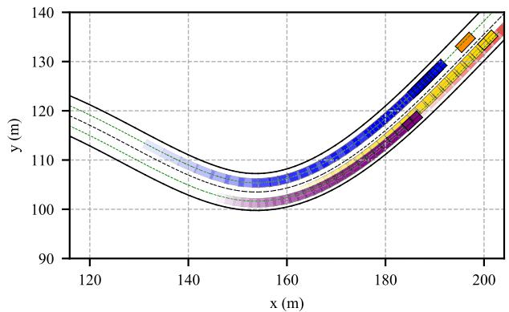

line

| x (m) | y (m) |
|-------|-------|
| 120   | 120   |
| 140   | 110   |
| 160   | 105   |
| 180   | 115   |
| 200   | 135   |

FIGURE 17. The ego vehicle trajectory of stopping.

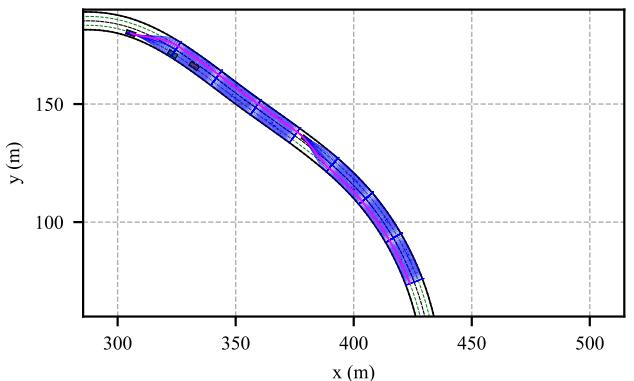

line

| x (m) | y (m) |
|-------|-------|
| 300   | 180   |
| 350   | 160   |
| 400   | 120   |
| 450   | 80    |
| 500   | 0     |

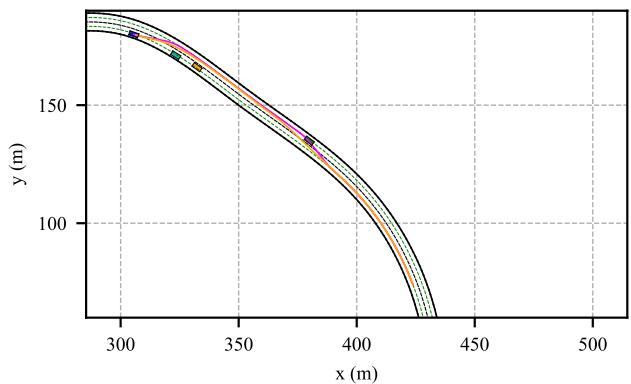

line

| x (m) | y (m) |
|-------|-------|
| 300   | 180   |
| 325   | 165   |
| 350   | 150   |
| 375   | 135   |
| 400   | 120   |
| 425   | 90    |
| 450   | 60    |
| 475   | 40    |
| 500   | 20    |

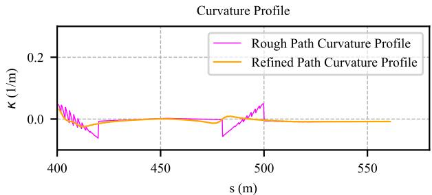

line

| s (m) | Rough Path Curvature Profile | Refined Path Curvature Profile |
|-------|------------------------------|-------------------------------|
| 400   | ~0.05                        | ~0.0                          |
| 425   | ~-0.05                       | ~0.0                          |
| 450   | ~0.0                         | ~0.0                          |
| 475   | ~-0.05                       | ~0.0                          |
| 500   | ~0.05                        | ~0.0                          |
| 525   | ~0.0                         | ~0.0                          |
| 550   | ~0.0                         | ~0.0                          |

FIGURE 18. The overtaking scenario. (a) The blue lattice is constructed in two lanes. The magenta curve represents the rough path. The blue box and the remaining boxes represent the ego vehicle and dynamic obstacles respectively. (b) Path optimization. The magenta curve represents the rough path. The orange curve represents the refined path. The green dotted curves represent the reference line for each lane respectively. (c) Curvature profile of path optimization.

# E. PERFORMANCE ANALYSIS

We tested the running time of the path searcher and the speed profile searcher. For a path lattice with 5 sets of longitudinal sampling waypoints with an interval of 20 m and 9 sets of lateral sampling waypoints with an interval of 0.5 m, the average search time is 0.12s. For a speed profile lattice with 8 sets

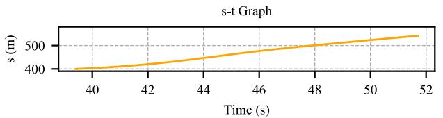

line

| Time (s) | s (m) |
| -------- | ----- |
| 40       | 400   |
| 42       | 410   |
| 44       | 430   |
| 46       | 460   |
| 48       | 490   |
| 50       | 520   |
| 52       | 550   |

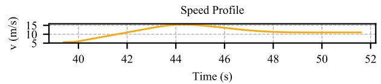

line

| Time (s) | Speed Profile |
| -------- | ------------- |
| 40       | 5             |
| 42       | 10            |
| 44       | 15            |
| 46       | 10            |
| 48       | 5             |
| 50       | 5             |
| 52       | 5             |

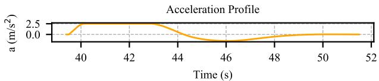

line

| Time (s) | Acceleration Profile (m/s²) |
| -------- | --------------------------- |
| 40       | 2.5                         |
| 42       | 2.5                         |
| 44       | 2.5                         |
| 46       | 0.0                         |
| 48       | 0.0                         |
| 50       | 0.0                         |
| 52       | 0.0                         |

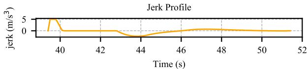

line

| Time (s) | jerk (m/s³) |
| -------- | ----------- |
| 38       | 0           |
| 39       | 5           |
| 40       | 0           |
| 41       | 0           |
| 42       | 0           |
| 43       | 0           |
| 44       | 0           |
| 45       | 0           |
| 46       | 0           |
| 47       | 0           |
| 48       | 0           |
| 49       | 0           |
| 50       | 0           |
| 51       | 0           |
| 52       | 0           |

FIGURE 19. Speed profile, acceleration profile and jerk profile generated by the speed profile optimizer in the scenario of overtaking.

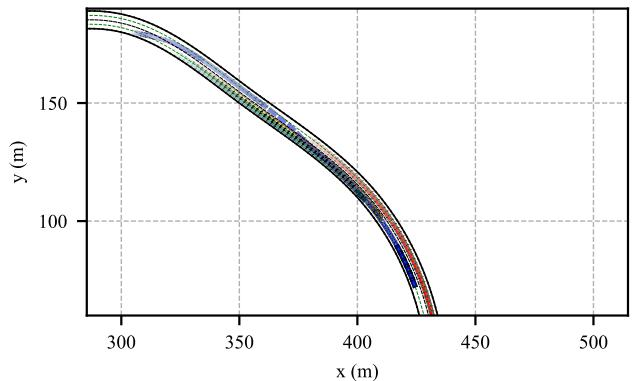

line

| x (m) | y (m) |
|-------|-------|
| 300   | 180   |
| 350   | 160   |
| 400   | 120   |
| 450   | 70    |
| 500   | 0     |

FIGURE 20. The host vehicle trajectory of overtaking.

TABLE 2. Runtime of different solvers in the path optimization step. 

<table><tr><td>Algorithm</td><td>Runtime (s)</td><td>Number of Iterations</td></tr><tr><td>SQP</td><td>4.5036</td><td>48</td></tr><tr><td>SQP-LEGACY</td><td>3.2448</td><td>48</td></tr><tr><td>ACTIVE-SET</td><td>21.0768</td><td>58</td></tr><tr><td>IP</td><td>0.0982</td><td>12</td></tr></table>

of temporal sampling nodes with an interval of 1.0 s and 5 sets of station sampling nodes with an interval of 4.0 m, the average search time is 0.04s. For a path optimization problem with three surrounding obstacles with a path length of 100m, we convert it into a nonlinear optimization problem with 100 decision variables and about 2200 nonlinear constraint functions. To solve this medium-scale optimization problem in this test, we tested the SQP method, interior point (IP) method, SQP-legacy method, and active-set method separately. The comparison results are shown in Table 2. The interior point method is picked considering runtime performance.

TABLE 3. Performance comparison of the mainstream trajectory planning methods. 

<table><tr><td>Algorithm</td><td>Iteration</td><td>Time (s)</td><td>Planning Horizon</td><td>Speed Planning</td><td>Planning Strategy</td></tr><tr><td>Ours</td><td>7(path)+6(speed)</td><td>0.55</td><td>Long</td><td>√</td><td>Path-speed decoupling, separate searching and optimization for path and speed</td></tr><tr><td>Ziegler et al.[2]</td><td>20</td><td>0.89</td><td>Long</td><td>√</td><td>Direct optimization via waypoint coordinate optimization</td></tr><tr><td>Werling et al.[1]</td><td></td><td>0.11</td><td>Short</td><td>√</td><td>Lateral trajectory - longitudinal trajectory decoupling, semi-reactive trajectory generation</td></tr><tr><td>Li et al.[16][17]</td><td>4</td><td>0.09</td><td>Short</td><td>√</td><td>Path-speed decoupling, separate spiral path and trapezoidal velocity profile generation</td></tr><tr><td>Hybrid A* [23]</td><td></td><td>0.27</td><td>Long</td><td>×</td><td>Only path planning in the grid map</td></tr><tr><td>Hybrid A*+CG[23]</td><td>7</td><td>0.42</td><td>Long</td><td>×</td><td>Path planning in grid map and path smoothing via conjugate gradient</td></tr></table>

In order to verify the efficiency of the trajectory planning framework, we tested the runtime performance of the proposed algorithm and other state-of-the-art algorithms in the static obstacles avoidance scenario. In comparison, we place four static vehicle obstacles in the structured environments, and we set the planning distance horizon forward to be 100 m. The comparison results are shown in Table 3. Our contributions are explained through simulations and comparisons as follows:

• Through verifications of the previous four cases, and comparisons in Table 1 and Table 3, we can show that our algorithm performs well in the characteristics listed in Table 1 and Table 3. Compared with the decoupled method in [1], our algorithm is complete and can develop the full potential of the host vehicle. For the method in [16], [17], the running time is a huge attraction. However, the short planning horizon, not smooth enough trajectory, and the limited motion potential of vehicles in discrete state space, these three drawbacks can cause tracking difficulties and bring about potential dangers for autonomous vehicles in high-speed driving. In practice, the planning distance of this method is not 100m, but 20m (maybe 10m or 30m, it depends on the current speed of the host vehicle and the road environments), so this nearsightedness limits the application of the algorithm in high-speed dynamic scenes. For Hybrid A\* and the subsequent path smoothing via conjugate gradient [23], this method can generate a smooth path in the crowded environment, but it lacks the speed planning step. At the same time, it is not suitable for a vehicle to drive on structured roads because the temporary goal waypoint changes frequent and is difficult to determine while driving online. On the contrary, Hybrid A\* is more suitable for path planning in free space. Impressively, our algorithm does take advantages of sampling-based methods and optimization-based methods, and tries to reduce the side effects of their defects. And our novel and all-sided algorithm is well balanced in terms of various constraints compliance and requirements satisfaction.

• In comparison with the direct method in [2], our algorithm can jump out of local optimum and has better flexibility to adapt to different scenarios by adjusting parameters. And fewer iterations make our algorithm

converge to the optimal solution faster. And the running time is also less than the method in [2], which can be seen in Table 3. In Fig. 9, Fig. 12, Fig. 15, and Fig. 18, the optimized paths are able to avoid obstacles and their curvature profiles are spatially smooth enough. And simulations in Section IV and comparisons in Table 1 and Table 3 confirm that the path optimization over lateral offset is efficient and real-time.

• For the speed profile optimization problem with two surrounding obstacles in Station-Time domain with a time horizon T = 8.0s, we convert it into a standard quadratic programming problem with 80 decision variables and nearly 1000 linear constraint functions. The average number of iterations is 6 and the running time is 0.0352 s. The QP speed optimization step has excellent performance in real-time and flexibility.

# V. CONCLUSION AND FUTURE WORK

In this paper, a novel decoupled trajectory planning framework is proposed and implemented in Python scripts to solve the non-convex spatiotemporal planning problem. The path searcher and the speed profile searcher can guarantee that we can search for a solution close to the globally optimal solution in the non-convex 3D state space. And the subsequent nonlinear path and speed profile optimization processes ensure that our solution is continuous, spatiotemporally smooth and optimal. And the decoupling of the spatial and temporal information also makes our solution converge to the global optimum more efficiently.

The solution the lattice searching generated is in the neighborhood of the globally optimal solution, so the rough path and the rough speed profile are used as the initial solutions of path optimization and speed optimization, respectively. This treatment reduces the number of iterations, improves the speed of convergence, and generates a globally optimal, continuous solution. Cases studies show that the framework is effective in several structured environments. For the curved roads driving, static obstacles and dynamic obstacles avoidance, lane changing, and overtaking, the trajectory planner performs well in these scenarios. So this framework is suitable for autonomous vehicles traveling online on dynamic structured roads and is able to respond accurately to the commands of the decision maker through parameter tuning.

For future work, more cases need to be done to verify the framework’s performance. And the runtime is tempting if we convert these scripts into C++. We will transplant the framework into the trajectory planning module in Autoware4 for on-road experiments.

# APPENDIX

# TRANSFORMATIONS FROM SPEED PROFILE OPTIMIZATION TO STANDARD QUADRATIC PROGRAMMING

# A. STANDARDIZATION OF THE OBJECTIVE FUNCTION FOR QUADRATIC PROGRAMMING

The speed cost item can be converted into the following form:

$$
\sum_ {i = 1} ^ {N _ {t}} \left(v _ {i} - v _ {r i}\right) ^ {2} = \frac {1}{\varepsilon^ {2}} \mathbf {s} _ {N _ {t} + 1} ^ {T} \mathbf {H} _ {\text {vel}} \mathbf {s} _ {N _ {t} + 1} + \sum_ {i = 1} ^ {N _ {t}} v _ {r i} ^ {2} - \frac {2}{\varepsilon} \mathbf {q} _ {\text {vel}} ^ {T} \mathbf {s} _ {N _ {t} + 1} \tag {43}
$$

where,

$$
\mathbf {s} _ {N _ {t} + 1} = [ s _ {1}, s _ {2}, s _ {3}, \dots , s _ {N _ {t} + 1} ] ^ {T}
$$

$$
\mathbf {H} _ {v e l} = \left[ \begin{array}{c c c c c} 1 & - 1 & 0 & \dots & 0 \\ - 1 & 2 & \ddots & \ddots & \vdots \\ 0 & \ddots & \ddots & \ddots & 0 \\ \vdots & \ddots & \ddots & 2 & - 1 \\ 0 & \dots & 0 & - 1 & 1 \end{array} \right]
$$

$$
\mathbf {q} _ {v e l} = \left[ - v _ {r 1}, v _ {r 1} - v _ {r 2}, \dots , v _ {r \left(N _ {t} - 1\right)} - v _ {r N _ {t}}, v _ {r N _ {t}} \right] ^ {T} \tag {44}
$$

The acceleration cost item can be converted into the following form:

$$
\sum_ {i = 1} ^ {N _ {t}} a _ {i} ^ {2} = \frac {1}{\varepsilon^ {4}} \mathbf {s} _ {N _ {t} + 2} ^ {T} \mathbf {H} _ {\text { acc }} \mathbf {s} _ {N _ {t} + 2} \tag {45}
$$

where,

$$
\mathbf {s} _ {N _ {t} + 2} = [ s _ {1}, s _ {2}, \dots , s _ {N _ {t}}, s _ {N _ {t} + 1}, s _ {N _ {t} + 2} ] ^ {T}
$$

$$
\mathbf {H} _ {\text {acc}} = \left[ \begin{array}{c c c c c c c} 1 & - 2 & 1 & 0 & \dots & \dots & 0 \\ - 2 & 5 & - 4 & \ddots & \ddots & \ddots & \vdots \\ 1 & - 4 & 6 & \ddots & \ddots & \ddots & \vdots \\ 0 & \ddots & \ddots & \ddots & \ddots & \ddots & 0 \\ \vdots & \ddots & \ddots & \ddots & 6 & - 4 & 1 \\ \vdots & \ddots & \ddots & \ddots & - 4 & 5 & - 2 \\ 0 & \dots & \dots & 0 & 1 & - 2 & 1 \end{array} \right] \tag {46}
$$

The jerk cost item can be converted into the following form:

$$
\sum_ {i = 1} ^ {N _ {t}} \text { jerk } _ {i} ^ {2} = \frac {1}{\varepsilon^ {6}} \mathbf {s} _ {N _ {t} + 3} ^ {T} \mathbf {H} _ {\text { jerk }} \mathbf {s} _ {N _ {t} + 3} \tag {47}
$$

where,

$$
\mathbf {s} _ {N _ {t} + 3} = [ s _ {1}, s _ {2}, \dots , s _ {N _ {t}}, s _ {N _ {t} + 1}, s _ {N _ {t} + 2}, s _ {N _ {t} + 3} ] ^ {T}
$$

4https://www.autoware.org/

$$
\mathbf {H} _ {j e r k} = \left[ \begin{array}{c c c c c c c c c} 1 & - 3 & 3 & - 1 & 0 & \dots & \dots & \dots & 0 \\ - 3 & 1 0 & - 1 2 & 6 & \ddots & \ddots & \ddots & \ddots & \vdots \\ 3 & - 1 2 & 1 9 & - 1 5 & \ddots & \ddots & \ddots & \ddots & \vdots \\ - 1 & 6 & - 1 5 & 2 0 & \ddots & \ddots & \ddots & \ddots & \vdots \\ 0 & \ddots & \ddots & \ddots & \ddots & \ddots & \ddots & \ddots & 0 \\ \vdots & \ddots & \ddots & \ddots & \ddots & 2 0 & - 1 5 & 6 & - 1 \\ \vdots & \ddots & \ddots & \ddots & \ddots & - 1 5 & 1 9 & - 1 2 & 3 \\ \vdots & \ddots & \ddots & \ddots & \ddots & 6 & - 1 2 & 1 0 & - 3 \\ 0 & \dots & \dots & \dots & 0 & - 1 & 3 & - 3 & 1 \end{array} \right] \tag {48}
$$

To be consistent with the dimensions of the matrix in (48), we increase the dimensions of the matrices in (44) and (46). Finally, the objective function can be organized into a standard form using the matrix manipulations as follows:

$$
\underset {s _ {1}, s _ {2}, \dots , s _ {N _ {t} + 3}} {\arg \min} \quad j (\mathbf {s}) = \frac {1}{2} \mathbf {s} ^ {T} \mathbf {H} \mathbf {s} + \mathbf {q} ^ {T} \mathbf {s} + p \tag {49}
$$

where,

$$
\mathbf {H} = 2 \frac {w _ {v e l}}{\varepsilon} \left[ \begin{array}{c c c} \mathbf {H} _ {v e l} & \mathbf {0} & \mathbf {0} \\ \mathbf {0} & 0 & 0 \\ \mathbf {0} & 0 & 0 \end{array} \right] + 2 \frac {w _ {a c c}}{\varepsilon^ {3}} \left[ \begin{array}{c c} \mathbf {H} _ {a c c} & \mathbf {0} \\ \mathbf {0} & 0 \end{array} \right]
$$

$$
+ 2 \frac {w _ {j e r k}}{\varepsilon^ {5}} \mathbf {H} _ {j e r k}
$$

$$
\mathbf {q} = - 2 w _ {v e l} \left[ \mathbf {q} _ {v e l} ^ {T} 0 0 \right] ^ {T}
$$

$$
p = w _ {v e l} \varepsilon \sum_ {i = 1} ^ {N _ {t}} v _ {r i} ^ {2}
$$

$$
\mathbf {s} = \left[ s _ {1}, s _ {2}, \dots , s _ {N _ {t} + 3} \right] ^ {T} \tag {50}
$$

# B. STANDARDIZATION OF CONSTRAINT FUNCTIONS FOR QUADRATIC PROGRAMMING

Acceleration constraints can be expressed as:

$$
\mathbf {G} _ {a c c} \mathbf {s} _ {N _ {t} + 3} \leq \mathbf {h} _ {a c c}
$$

$$
- \mathbf {G} _ {\text { acc }} \mathbf {s} _ {N _ {t} + 3} \leq \mathbf {h} _ {\text { acc }} \tag {51}
$$

where,

$$
\mathbf {G} _ {a c c} = \left[ \begin{array}{c c c c c c c} 1 & - 2 & 1 & 0 & \dots & 0 & 0 \\ 0 & 1 & - 2 & 1 & \ddots & \ddots & \vdots \\ \vdots & \ddots & \ddots & \ddots & \ddots & 0 & 0 \\ 0 & \dots & 0 & 1 & - 2 & 1 & 0 \end{array} \right]
$$

$$
\mathbf {h} _ {a c c} = \left[ \varepsilon^ {2} a _ {\lim}, \dots , \varepsilon^ {2} a _ {\lim} \right] ^ {T} \tag {52}
$$

Jerk constraints can be expressed as:

$$
\mathbf {G} _ {j e r k} \mathbf {s} _ {N _ {t} + 3} \leq \mathbf {h} _ {j e r k}
$$

$$
- \mathbf {G} _ {\text { jerk }} \mathbf {s} _ {N _ {t} + 3} \leq \mathbf {h} _ {\text { jerk }} \tag {53}
$$

where,

$$
\mathbf {G} _ {j e r k} = \left[ \begin{array}{c c c c c c c} - 1 & 3 & - 3 & 1 & & & \\ & - 1 & 3 & - 3 & 1 & & \\ & & \ddots & \ddots & \ddots & \ddots & \\ & & & - 1 & 3 & - 3 & 1 \end{array} \right]
$$

$$
\mathbf {h} _ {j e r k} = \left[ \begin{array}{c c c} \varepsilon^ {3} j e r k _ {\lim} & \dots & \varepsilon^ {3} j e r k _ {\lim} \end{array} \right] ^ {T} \tag {54}
$$

Lane speed limits can be expressed as:

$$
\mathbf {G} _ {v e l} \mathbf {s} _ {N _ {t} + 3} \leq \mathbf {h} _ {v e l} \tag {55}
$$

where,

$$
\begin{array}{l} \mathbf {G} _ {v e l} = \left[ \begin{array}{c c c c c c c} - 1 & 1 & 0 & \dots & \dots & \dots & 0 \\ 0 & - 1 & 1 & \ddots & \ddots & \ddots & \vdots \\ \vdots & \ddots & \ddots & \ddots & \ddots & \ddots & \vdots \\ 0 & \dots & 0 & - 1 & 1 & 0 & 0 \end{array} \right] \\ \mathbf {h} _ {v e l} = \left[ \varepsilon v _ {\lim}, \dots , \varepsilon v _ {\lim} \right] ^ {T} \tag {56} \\ \end{array}
$$

For each decision variable si, there are upper and lower bounds, which can be expressed as:

$$
\mathbf {G} _ {\max} \mathbf {s} _ {N _ {t} + 3} \leq \mathbf {h} _ {\max}
$$

$$
- \mathbf {G} _ {0} \mathbf {s} _ {N _ {t} + 3} \leq \mathbf {h} _ {0} \tag {57}
$$

where,

$$
\mathbf {G} _ {\max} = \mathbf {G} _ {0} = \left[ \begin{array}{c c c c} \mathbf {I} & \mathbf {0} & \mathbf {0} & \mathbf {0} \end{array} \right]
$$

$$
\mathbf {h} _ {\max} = \left[ s _ {\max}, \dots , s _ {\max} \right] ^ {T}
$$

$$
\mathbf {h} _ {0} = \left[ s _ {0}, \dots , s _ {0} \right] ^ {T} \tag {58}
$$

For the obstacle avoidance constraints (38) and (39), we can simplify them into this expression as follows:

$$
s _ {j, i} - s _ {3 i} > r _ {v e h} + r _ {d y n}
$$

$$
s _ {i} - s _ {j, i} > r _ {v e h} + r _ {d y n} \tag {59}
$$

And (59) can be express as:

$$
\mathbf {I} _ {N _ {t} + 3} \mathbf {s} _ {N _ {t} + 3} <   \mathbf {0} _ {j}
$$

$$
- \mathbf {I} _ {N _ {t} + 3} \mathbf {s} _ {N _ {t} + 3} <   \mathbf {d} _ {j} \tag {60}
$$

where,

$$
\mathbf {o} _ {j} = \left[ \begin{array}{c} s _ {j, 1} - r _ {v e h} - r _ {d y n} - 2 d \\ \vdots \\ s _ {j, N _ {t} + 3} - r _ {v e h} - r _ {d y n} - 2 d \end{array} \right]
$$

$$
\mathbf {d} _ {j} = \left[ \begin{array}{c} - s _ {j, 1} - r _ {v e h} - r _ {d y n} \\ \vdots \\ - s _ {j, N _ {t} + 3} - r _ {v e h} - r _ {d y n} \end{array} \right] \tag {61}
$$

where j represents the jth obstacle. The number of obstacles is $n _ { o } ,$ so (61) can be stacked into the following expression.

$$
\mathbf {G} _ {\text { obs }} \mathbf {s} <   \mathbf {h} _ {\text { obs }} \tag {62}
$$

where,

$$
\mathbf {G} _ {o b s} = [ \mathbf {I}, - \mathbf {I}, \dots , \mathbf {I}, - \mathbf {I} ] ^ {T}
$$

$$
\mathbf {h} _ {o b s} = \left[ \mathbf {o} _ {1}, \mathbf {d} _ {1}, \dots , \mathbf {o} _ {j}, \mathbf {d} _ {j}, \dots , \mathbf {o} _ {n _ {o}}, \mathbf {d} _ {n _ {o}} \right] ^ {T} \tag {63}
$$

Boundary value conditions (41) can be expressed as:

$$
\mathbf {A} \mathbf {s} = \mathbf {b} \tag {64}
$$

where,

$$
\begin{array}{l} \mathbf {A} = \left[ \begin{array}{c c c c c c c c c c} 1 & & & 0 & \dots & 0 & & & & \\ & 1 & & 0 & \dots & 0 & & & & \\ & & 1 & 0 & \dots & 0 & & & & \\ & & & 0 & \dots & 0 & 1 & - 2 & 1 & 0 & 0 \\ & & & 0 & \dots & 0 & 2 & - 3 & 0 & 1 & 0 \\ & & & 0 & \dots & 0 & 3 & - 4 & 0 & 0 & 1 \end{array} \right] \\ \mathbf {b} = \left[ \begin{array}{c} \varepsilon v _ {0} + s _ {0} \\ a _ {0} \varepsilon^ {2} + s _ {0} + 2 \varepsilon v _ {0} \\ j e r k _ {0} \varepsilon^ {3} + 3 \varepsilon v _ {0} + 3 a _ {0} \varepsilon^ {2} + s _ {0} \\ 0 \\ 0 \\ 0 \end{array} \right] \tag {65} \\ \end{array}
$$

All constraint matrices can be stacked into a matrix in the form of columns as follows:

$$
\begin{array}{l} \mathbf {G} = \left[ \mathbf {G} _ {a c c}, - \mathbf {G} _ {a c c}, \mathbf {G} _ {j e r k}, - \mathbf {G} _ {j e r k}, \mathbf {G} _ {v e l}, \mathbf {G} _ {\max}, \mathbf {G} _ {0}, \mathbf {G} _ {o b s} \right] ^ {T} \\ \mathbf {h} = \left[ \mathbf {h} _ {\text { acc }}, \mathbf {h} _ {\text { acc }}, \mathbf {h} _ {\text { jerk }}, \mathbf {h} _ {\text { jerk }}, \mathbf {h} _ {\text { vel }}, \mathbf {h} _ {\text { max }}, \mathbf {h} _ {0}, \mathbf {h} _ {\text { obs }} \right] ^ {T} \tag {66} \\ \end{array}
$$

(42) is the standard form of QP, which is based on the above transformations. After the objective function and the constraint functions are matrixed, the QP problem can be solved quickly by CVXOPT.

# REFERENCES

[1] M. Werling, S. Kammel, J. Ziegler, and L. Gröll, ‘‘Optimal trajectories for time-critical street scenarios using discretized terminal manifolds,’’ Int. J. Robot. Res., vol. 31, no. 3, pp. 346–359, 2012.   
[2] J. Ziegler, P. Bender, T. Dang, and C. Stiller, ‘‘Trajectory planning for Bertha—A local, continuous method,’’ in Proc. IEEE Intell. Vehicles Symp., Dearborn, MI, USA, Jun. 2014, pp. 450–457. doi: 10.1109/IVS.2014.6856581.   
[3] J. Ziegler et al., ‘‘Making bertha drive—An autonomous journey on a historic route,’’ IEEE Intell. Transp. Syst. Mag., vol. 6, no. 2, pp. 8–20, Apr. 2014. doi: 10.1109/MITS.2014.2306552.   
[4] W. Lim, S. Lee, M. Sunwoo, and K. Jo, ‘‘Hierarchical trajectory planning of an autonomous car based on the integration of a sampling and an optimization method,’’ IEEE Trans. Intell. Transp. Syst., vol. 19, no. 2, pp. 613–626, Feb. 2018. doi: 10.1109/TITS.2017.2756099.   
[5] C. Liu, C.-Y. Lin, and M. Tomizuka, ‘‘The convex feasible set algorithm for real time optimization in motion planning,’’ SIAM J. Control Optim., vol. 56, no. 4, pp. 2712–2733, 2018. doi: 10.1137/16M1091460.   
[6] C. Liu, C.-Y. Lin, Y. Wang, and M. Tomizuka, ‘‘Convex feasible set algorithm for constrained trajectory smoothing,’’ in Proc. Amer. Control Conf. (ACC), Seattle, WA, USA, May 2017, pp. 4177–4182. doi: 10.23919/ACC.2017.7963597.   
[7] J. Chen, W. Zhan, and M. Tomizuka, ‘‘Constrained iterative LQR for on-road autonomous driving motion planning,’’ in Proc. IEEE 20th Int. Conf. Intell. Transp. Syst. (ITSC), Yokohama, Japan, Oct. 2017, pp. 1–7. doi: 10.1109/ITSC.2017.8317745.   
[8] J. Chen, W. Zhan, and M. Tomizuka, ‘‘Autonomous driving motion planning with constrained iterative LQR,’’ IEEE Trans. Intell. Veh., vol. 4, no. 2, pp. 244–254, Jun. 2019. doi: 10.1109/TIV.2019.2904385.   
[9] T. M. Howard, C. J. Green, A. Kelly, and D. Ferguson, ‘‘State space sampling of feasible motions for high-performance mobile robot navigation in complex environments,’’ J. Field Robot., vol. 25, nos. 6–7, pp. 325–345, 2008. doi: 10.1002/rob.20244.   
[10] T. M. Howard and A. Kelly, ‘‘Optimal rough terrain trajectory generation for wheeled mobile robots,’’ Int. J. Robot. Res. vol. 26, no. 2, pp. 141–166, Feb. 2007. doi: 10.1177/0278364906075328.   
[11] J. Ziegler and C. Stiller, ‘‘Spatiotemporal state lattices for fast trajectory planning in dynamic on-road driving scenarios,’’ in Proc. IEEE/RSJ Int. Conf. Intell. Robots Syst., St. Louis, MO, USA, Oct. 2009, pp. 1879–1884. doi: 10.1109/IROS.2009.5354448.

[12] M. McNaughton, C. Urmson, J. M. Dolan, and J.-W. Lee, ‘‘Motion planning for autonomous driving with a conformal spatiotemporal lattice,’’ in Proc. IEEE Int. Conf. Robot. Autom., Shanghai, China, May 2011, pp. 4889–4895. doi: 10.1109/ICRA.2011.5980223.   
[13] D. González, J. Pérez, V. Milanés, and F. Nashashibi, ‘‘A review of motion planning techniques for automated vehicles,’’ IEEE Trans. Intell. Transp. Syst., vol. 17, no. 4, pp. 1135–1145, Apr. 2016. doi: 10.1109/TITS.2015.2498841.   
[14] Y. Kuwata, J. Teo, G. Fiore, S. Karaman, E. Frazzoli, and J. P. How, ‘‘Real-time motion planning with applications to autonomous urban driving,’’ IEEE Trans. Control Syst. Technol., vol. 17, no. 5, pp. 1105–1118, Sep. 2009. doi: 10.1109/TCST.2008.2012116.   
[15] L. Ma, J. Xue, K. Kawabata, J. Zhu, C. Ma, and N. Zheng, ‘‘Efficient sampling-based motion planning for on-road autonomous driving,’’ IEEE Trans. Intell. Transp. Syst., vol. 16, no. 4, pp. 1961–1976, Aug. 2015. doi: 10.1109/TITS.2015.2389215.   
[16] X. Li, Z. Sun, D. Cao, Z. He, and Q. Zhu, ‘‘Real-time trajectory planning for autonomous urban driving: Framework, algorithms, and verifications,’’ IEEE/ASME Trans. Mechatronics, vol. 21, no. 2, pp. 740–753, Apr. 2016. doi: 10.1109/TMECH.2015.2493980.   
[17] X. Li, Z. Sun, D. Cao, D. Liu, and H. He, ‘‘Development of a new integrated local trajectory planning and tracking control framework for autonomous ground vehicles,’’ Mech. Syst. Signal Process. vol. 87, pp. 118–137, Mar. 2017. doi: 10.1016/j.ymssp.2015.10.021.   
[18] W. Xu, J. Wei, J. M. Dolan, H. Zhao, and H. Zha, ‘‘A real-time motion planner with trajectory optimization for autonomous vehicles,’’ in Proc. IEEE Int. Conf. Robot. Autom., Saint Paul, MN, USA, May 2012, pp. 2061–2067. doi: 10.1109/ICRA.2012.6225063.   
[19] H. Fan, F. Zhu, C. Liu, L. Zhang, L. Zhuang, D. Li, W. Zhu, J. Hu, H. Li, and Q. Kong, ‘‘Baidu Apollo EM motion planner,’’ 2018, arXiv:1807.08048. [Online]. Available: https://arxiv.org/abs/1807.08048   
[20] J. Kim, K. Jo, W. Lim, M. Lee, and M. Sunwoo, ‘‘Curvilinear-coordinatebased object and situation assessment for highly automated vehicles,’’ IEEE Trans. Intell. Transp. Syst., vol. 16, no. 3, pp. 1559–1575, Jun. 2015. doi: 10.1109/TITS.2014.2369737.   
[21] D. Betaille and R. Toledo-Moreo, ‘‘Creating enhanced maps for lanelevel vehicle navigation,’’ IEEE Trans. Intell. Transp. Syst., vol. 11, no. 4, pp. 786–798, Dec. 2010. doi: 10.1109/TITS.2010.2050689.   
[22] H. Wang, J. Kearney, and K. Atkinson, ‘‘Arc-length parameterized spline curves for real-time simulation,’’ in Proc. 5th Int. Conf. Curves Surfaces. vol. 387396, Jun. 2002, pp. 388–396.   
[23] D. Dolgov, S. Thrun, M. Montemerlo, and J. Diebel, ‘‘Path planning for autonomous vehicles in unknown semi-structured environments,’’ Int. J. Robot. Res., vol. 29, no. 5, Apr. 2010, pp. 485–501. doi: 10.1177/0278364909359210.   
[24] A. Kelly and Bryan Nagy, ‘‘Reactive nonholonomic trajectory generation via parametric optimal control,’’ Int. J. Robot. Res., vol. 22, nos. 7–8, pp. 583–601, 2003. doi: 10.1177/02783649030227008.   
[25] K. Chu, M. Lee, and M. Sunwoo, ‘‘Local path planning for off-road autonomous driving with avoidance of static obstacles,’’ IEEE Trans. Intell. Transp. Syst., vol. 13, no. 4, pp. 1599–1616, Dec. 2012. doi: 10.1109/TITS.2012.2198214.   
[26] X. Hu, L. Chen, B. Tang, D. Cao, and H. He, ‘‘Dynamic path planning for autonomous driving on various roads with avoidance of static and moving obstacles,’’ Mech. Syst. Signal Process. vol. 100, pp. 482–500, Feb. 2018. doi: 10.1016/j.ymssp.2017.07.019.   
[27] B. Siciliano, Robotics: Modelling, Planning and Control. Rome, Italy: Springer, 2010. [Online]. Available: http://www.bookmetrix. com/detail/book/8c0c3f78-8187-448b-9dd7-e08f48f51a58#citations   
[28] T. Gu, J. Snider, J. M. Dolan, and J.-W. Lee, ‘‘Focused Trajectory Planning for autonomous on-road driving,’’ in Proc. IEEE Intell. Vehicles Symp., Gold Coast, QLD, Australia, Jun. 2013, pp. 547–552. doi: 10.1109/IVS.2013.6629524.   
[29] S. Lefèvre, D. Vasquez, and C. Laugier, ‘‘A survey on motion prediction and risk assessment for intelligent vehicles,’’ ROBOMECH J. vol. 1, no. 1, 2014, p. 1. doi: 10.1186/s40648-014-0001-z.   
[30] Ö. S. Tas, N. O. Salscheider, F. Poggenhans, S. Wirges, C. Bandera, M. R. Zofka, T. Strauss, J. M. Zöllner, and C. Stiller, ‘‘Making bertha cooperate–team AnnieWAY’s entry to the 2016 grand cooperative driving challenge,’’ IEEE Trans. Intell. Transp. Syst., vol. 19, no. 4, pp. 1262–1276, Apr. 2018. doi: 10.1109/TITS.2017.2749974.   
[31] C. Liu, W. Zhan, and M. Tomizuka, ‘‘Speed profile planning in dynamic environments via temporal optimization,’’ in Proc. IEEE Intell. Vehicles Symp., Los Angeles, CA, USA, Jun. 2017, pp. 154–159. doi: 10.1109/IVS.2017.7995713.

[32] Y. Zhang, H. Chen, S. L. Waslander, T. Yang, S. Zhang, G. Xiong, and K. Liu, ‘‘Speed planning for autonomous driving via convex optimization,’’ in Proc. 21st Int. Conf. Intell. Transp. Syst. (ITSC), Maui, HI, USA, Nov. 2018, pp. 1089–1094. doi: 10.1109/ITSC.2018.8569414.   
[33] M. Werling, J. Ziegler, S. Kammel, and S. Thrun, ‘‘Optimal trajectory generation for dynamic street scenarios in a Frenét frame,’’ in Proc. IEEE Int. Conf. Robot. Autom., Anchorage, AK, USA, May 2010, pp. 987–993. doi: 10.1109/ROBOT.2010.5509799.   
[34] Y. Wei, C. Avci, J. Liu, B. Belezamo, N. Aydin, P. T. Li, and X. Zhou, ‘‘Dynamic programming-based multi-vehicle longitudinal trajectory optimization with simplified car following models,’’ Transp. Res. B, Methodol. vol. 106, Dec. 2017, pp. 102–129. doi: 10.1016/j.trb.2017.10.012.   
[35] W. Zhan, J. Chen, C.-Y. Chan, C. Liu, and M. Tomizuka, ‘‘Spatiallypartitioned environmental representation and planning architecture for onroad autonomous driving,’’ in Proc. IEEE Intell. Vehicles Symp., Los Angeles, CA, USA, Jun. 2017, pp. 632–639. doi: 10.1109/IVS.2017.7995789.   
[36] J. Kim and D. Kum, ‘‘Collision risk assessment algorithm via lanebased probabilistic motion prediction of surrounding vehicles,’’ IEEE Trans. Intell. Transp. Syst., vol. 19, no. 9, pp. 2965–2976, Sep. 2018. doi: 10.1109/TITS.2017.2768318.   
[37] C. Katrakazas, M. Quddus, W.-H. Chen, and L. Deka, ‘‘Real-time motion planning methods for autonomous on-road driving: State-of-the-art and future research directions,’’ Transp. Res. C, Emerg. Technol. vol. 60, Nov. 2015, pp. 416–442. doi: 10.1016/j.trc.2015.09.011.   
[38] J. Hillenbrand, A. M. Spieker, and K. Kroschel, ‘‘A multilevel collision mitigation approach—Its situation assessment, decision making, and performance tradeoffs,’’ IEEE Trans. Intell. Transp. Syst., vol. 7, no. 4, pp. 528–540, Dec. 2006. doi: 10.1109/TITS.2006.883115.   
[39] T. Gu, J. Atwood, C. Dong, J. M. Dolan, and J.-W. Lee, ‘‘Tunable and stable real-time trajectory planning for urban autonomous driving,’’ in Proc. IEEE/RSJ Int. Conf. Intell. Robots Syst. (IROS), Hamburg, Germany, Sep./Oct. 2015, pp. 250–256. doi: 10.1109/IROS.2015.7353382.   
[40] C. Liu, C. Lin, S. Shiraishi, and M. Tomizuka, ‘‘Distributed conflict resolution for connected autonomous vehicles,’’ IEEE Trans. Intell. Veh., vol. 3, no. 1, pp. 18–29, Mar. 2018. doi: 10.1109/TIV.2017.2788209.   
[41] C. Urmson et al., ‘‘Autonomous driving in urban environments: Boss and the urban challenge,’’ J. Field Robot. vol. 25, no. 8, pp. 425–466, Aug. 2008. doi: 10.1002/rob.20255.   
[42] M. Montemerlo et al., ‘‘Junior: The stanford entry in the urban challenge,’’ J. Field Robot., vol. 25, no. 9, pp. 569–597, Sep. 2008. doi: 10.1002/rob.20258.   
[43] C. Hubmann, M. Becker, D. Althoff, D. Lenz, and C. Stiller, ‘‘Decision making for autonomous driving considering interaction and uncertain prediction of surrounding vehicles,’’ in Proc. IEEE Intell. Vehicles Symp., Jun. 2017, pp. 1671–1678. doi: 10.1109/IVS.2017.7995949.   
[44] J. Ji, A. Khajepour, W. W. Melek, and Y. Huang, ‘‘Path planning and tracking for vehicle collision avoidance based on model predictive control with multiconstraints,’’ IEEE Trans. Ultrason. Eng., vol. 66, no. 2, pp. 952–964, Feb. 2017. doi: 10.1109/TVT.2016.2555853.   
[45] B. Paden, M. Čáp, S. Z. Yong, D. Yershov, and E. Frazzoli, ‘‘A survey of motion planning and control techniques for self-driving urban vehicles,’’ IEEE Trans. Intell. Veh., vol. 1, no. 1, pp. 33–55, Mar. 2016. doi: 10.1109/TIV.2016.2578706.   
[46] J. A. E. Andersson, J. Gillis, G. Horn, J. B. Rawlings, and M. Diehl, ‘‘CasADi: A software framework for nonlinear optimization and optimal control,’’ Math. Program. Comput. vol. 11, no. 1, Mar. 2019, pp. 1–36. doi: 10.5281/zenodo.1257968.   
[47] A. Wächter and Lorenz T. Biegler, ‘‘On the implementation of an interior-point filter line-search algorithm for large-scale nonlinear programming,’’ Math. Program. vol. 106, no. 1, Mar. 2006, pp. 25–57. doi: 10.1007/s10107-004-0559-y.

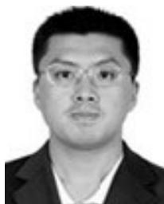

natural_image

Portrait of a man wearing glasses and a suit (no text or symbols visible)

YU MENG received the M.S. and Ph.D. degrees in computer science and technology from Jilin University, Changchun, China, in 2007. He is currently an Associate Professor with the School of Mechanical Engineering, University of Science and Technology Beijing, Beijing, China. His research interests include computer vision and intelligent vehicle.

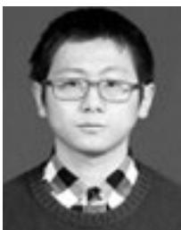

natural_image

Portrait of a young man wearing glasses and a collared shirt (no text or symbols visible)

YANGMING WU received the B.Eng. degree in vehicle engineering from the University of Science and Technology Beijing, Beijing, China, in 2017, where he is currently pursuing the master’s degree in mechanical engineering. His research interests include motion planning and decision-making.

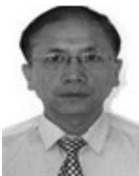

natural_image

Portrait of a man wearing glasses and a tie (no text or symbols visible)

LI LIU received the Ph.D. degree in mechanical engineering from the University of Science and Technology Beijing, Beijing, China, in 2012, where he is currently a Professor with the School of Mechanical Engineering. His research interests include autonomous driving and mine intelligence.

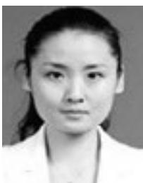

natural_image

Portrait of a woman in a white coat (no text or symbols visible)

QING GU received the Ph.D. degree in intelligent traffic engineering from Beijing Jiaotong University, Beijing, China, in 2014. She is currently an Assistant Professor with the School of Mechanical Engineering, University of Science and Technology Beijing, Beijing. Her research interests include systems’ modeling, control, and optimization with application in the intelligent transportation systems.