# 硕士学位论文

（专业学位论文）

# 结构化道路下基于时空联合的自动驾驶轨迹规划算法研究

# RESEARCH ON AUTOMATED DRIVING TRAJECTORY PLANNING ALGORITHMS BASED ON SPATIOTEMPORAL INTEGRATION UNDER STRUCTURED ROADS

乔应

哈尔滨工业大学

2025 年 5 月

# 硕士学位论文

# 结构化道路下基于时空联合的自动驾驶轨迹规划算法研究

硕 士 研 究 生：乔应

导 师：赵立军 副教授

申 请 学 位：专业硕士学位

学 科：机械

所 在 单 位：汽车工程学院

答 辩 日 期：2025 年 5 月

授予学位单位：哈尔滨工业大学

# Dissertation for the Master’s Degree

# RESEARCH ON AUTOMATED DRIVING TRAJECTORY PLANNING ALGORITHMS BASED ON SPATIOTEMPORAL INTEGRATION UNDER STRUCTURED ROADS

Candidate： Qiao Ying

Supervisor： Associate Prof. Zhao Lijun

Academic Degree Applied for： Professional Degrees Master

Speciality： Mechanical Engineering

Affiliation： School of Automotive Engineering

Date of Defence： May, 2025

Degree-Conferring-Institution： Harbin Institute of Technology

# 摘 要

随着社会的快速发展，自动驾驶技术作为跨学科研究的重要方向，日益受到汽车工程与计算机科学领域的广泛关注。轨迹规划是自动驾驶的关键环节，其功能是基于环境感知信息生成一条安全、无碰撞风险且平滑的行驶轨迹。目前轨迹规划方法通过将时间与空间解耦以提高轨迹规划的效率，但会使轨迹质量下降，容易陷入局部次优解。而时空联合方法在规划时能同时考虑时间和空间两个维度，从而保证规划轨迹的全局最优性。本文研究内容如下：

首先，基于 T-S-L（时间-纵向-横向）提出时空联合的轨迹决策算法。推导笛卡尔坐标系与Frenet 道路坐标系的转换关系，采用数值优化方法平滑全局参考线。引入T-S-L三维时空，同时介绍离散采样策略，确保轨迹采样的合理性。并设计代价函数和三维动态规划轨迹决策算法。

其次，提出基于时空走廊的轨迹规划算法，建立轨迹规划最优问题的数学模型。优化目标函数的设计准则为尽量贴近决策轨迹，优化过程中需满足的硬性约束包括边界约束、车辆机械约束、运动学约束以及碰撞躲避约束。针对运动学约束，基于二自由度车辆运动学微分方程，采用向前欧拉离散化将其转化为等式约束。针对碰撞躲避约束，通过构建时空安全走廊进行线性简化处理。利用仿真平台，在低密度和高密度交通流两种场景下验证决策和规划算法的可行性。

然后，设计一种横向基于模型预测控制（Model Predictive Control，MPC），纵向基于比例-积分-微分（Proportion-Integral-Derivative，PID）的轨迹跟踪控制器。针对横向控制，建立二自由度动力学误差模型，同时构建MPC 优化目标函数和约束条件，通过优化求解和前馈控制得到前轮转角的控制量，实现对车辆横向运动的精确调节。针对纵向控制，提出 PID 纵向控制算法，并基于动力学特性制作驱动/制动力矩标定表，以确保车辆纵向位置和速度的精确控制。在仿真实验平台上针对双移线和变道轨迹两种典型工况算法测试，跟踪控制器有较好的跟踪精度和鲁棒性。

最后，进行轨迹决策-规划-控制的闭环仿真实验。搭建ROS、Ubuntu/Carla联合仿真平台，设计静态和静/动态混合两种仿真实验场景，以验证本文所提算法的合理性。

关键词：动态规划；时空联合规划；数值优化；自动驾驶；联合仿真

# Abstract

With the rapid development of technology, autonomous driving technology, as an important direction of interdisciplinary research, has increasingly attracted widespread attention in the fields of automotive engineering and computer science. Trajectory planning is a key link in autonomous driving, and its function is to generate a safe, collision-free, and smooth driving trajectory based on environmental perception information. Currently, trajectory planning methods improve efficiency by decoupling time and space, but this can lead to a decrease in trajectory quality and may easily get trapped in local suboptimal solutions. In contrast, spatiotemporal joint methods consider both time and space dimensions during planning, ensuring the global optimality of the planned trajectory and improving trajectory accuracy. The research content of this paper is as follows:

Firstly, a spatiotemporal joint trajectory decision-making algorithm based on T-S-L (Time-Longitudinal-Lateral) is proposed. The conversion relationship between Cartesian coordinates and Frenet road coordinates is derived, and numerical optimization methods are used to smooth the global reference line. The T-S-L three-dimensional spacetime is introduced, along with a discrete sampling strategy to ensure the rationality of trajectory sampling. A cost function and a three-dimensional dynamic programming trajectory decision-making algorithm are designed.

Secondly, a trajectory planning algorithm based on spatiotemporal corridors is proposed, establishing a mathematical model for the optimal trajectory planning problem. The design criteria for the optimization objective function are to closely adhere to the decision trajectory, with hard constraints that must be satisfied during the optimization process, including boundary constraints, vehicle mechanical constraints, kinematic constraints, and collision avoidance constraints. For kinematic constraints, the twodegree-of-freedom vehicle kinematic differential equations are converted into equality constraints using forward Euler discretization. For collision avoidance constraints, the construction of a spatiotemporal safety corridor is performed for linear simplification. A simulation platform is utilized to validate the feasibility of the decision and planning algorithms in both free-flowing and congested road scenarios.

Then, a lateral model predictive control (Model Predictive Control, MPC) based on trajectory tracking controller and a longitudinal proportional-integral-derivative (Proportion-Integral-Derivative, PID) control strategy are designed. For lateral control, a two-degree-of-freedom dynamic error model is established, and the MPC optimization objective function and constraints are constructed. Through optimization solving and feedforward control, the control quantity for the front wheel angle is obtained, allowing for precise adjustment of the vehicle's lateral movement. For longitudinal control, a PID longitudinal control algorithm is proposed, and a drive/brake torque calibration table is created based on dynamic characteristics to ensure precise control of the vehicle's longitudinal position and speed. On the simulation experimental platform, algorithm tests for typical conditions of dual lane change and lane change trajectories show that the tracking controller has good tracking accuracy and robustness.

Finally, closed-loop simulation experiments on trajectory decision-making, planning, and control are conducted. A joint simulation platform of ROS and Ubuntu/Carla is built, and two simulation experimental scenarios of static and static/dynamic hybrid are designed to verify the rationality of the algorithms proposed in this paper.

Keywords: dynamic programming, spatio-temporal planning, numerical optimization, autonomous driving, joint simulation

# 目 录

# 第1 章 绪论..

1.1 课题背景及研究的目的和意义  
1.2 国内外研究现状及分析..

1.2.1 自动驾驶国内外研究现状.. 2  
1.2.2 轨迹规划国内外研究现状. 4  
1.2.3 跟踪控制国内外研究现状.. 8  
1.2.4 国内外研究现状综述..

1.3 本文主要研究内容. .10

# 第2 章 基于三维动态规划的轨迹决策算法研究. .12

2.1 笛卡尔坐标系与 Frenet 坐标系 .12

2.1.1 Frenet 坐标系 . .12  
2.1.2 笛卡尔坐标系转换至 Frenet 坐标系 .13  
2.1.3 Frenet 坐标系转换至笛卡尔坐标系 . .16

2.2 全局参考路径平滑. .17

2.2.1 基于样条曲线平滑参考线...   
2.2.2 基于数值优化平滑参考线.. .18  
2.2.3 路径平滑对比.. .20

2.3 T-S-L 三维时空 . .21

2.3.1 T-S-L 坐标系的引入 . .21  
2.3.2 离散采样策略.. .22

2.4 三维动态规划决策算法. .23

2.4.1 动态规划代价函数设计. .23  
2.4.2 三维动态规划决策算法. .25

2.5 本章小结. .26

# 第3 章 基于时空安全走廊的规划算法研究 .27

3.1 最优化轨迹规划问题描述 .27

3.1.1 优化目标函数.. .28  
3.1.2 车辆运动学约束. .28  
3.1.3 车辆机械约束和边界约束. .30   
3.1.4 碰撞躲避约束.. .30   
3.1.5 完整的最优控制问题.. .31

3.2 车体轮廓模型与碰撞检测 .31

3.2.1 车体轮廓近似模型. .32   
3.2.2 点与矩形碰撞检测. .34

3.3 时空安全走廊构建方式. ..36  
3.4 算法验证与分析. .38  
3.5 本章小结. ..41  
第4 章 基于MPC的跟踪控制算法研究. ..42  
4.1 跟踪控制器设计方案. ..42  
4.2 车辆动力学跟踪误差模型 ..42   
4.2.1 二自由度动力学模型. ..42  
4.2.2 跟踪误差模型. .44   
4.3 横向控制器设计. ..45  
4.3.1 MPC 理论基础 . .45   
4.3.2 MPC 横向控制器 ..47  
4.4 纵向控制器设计. ..49  
4.4.1 PID 控制原理 .49  
4.4.2 PID 纵向控制器 .50  
4.5 算法验证与分析. .51  
4.5.1 双移线工况. .51  
4.5.2 变道工况. .53   
4.6 本章小结. .55  
第5 章 自动驾驶规划控制算法仿真验证 .56  
5.1 仿真算法平台.. .56  
5.2 仿真场景设计.. .57  
5.3 联合仿真实验与分析.. .58  
5.3.1 静态场景仿真验证. .58  
5.3.2 动态场景仿真验证. ..60   
5.4 本章小结. ..62  
结论... ..63   
参考文献... ..65

# 第1章 绪 论

# 1.1 课题背景及研究的目的和意义

在全球范围内，经济水平的显著提升与城市建设的持续推进，正深刻影响着社会发展的格局。汽车已成为当代社会重要的交通工具，其保有量呈现稳定上升趋势。截至2025年，全球汽车保有量已突破 15 亿辆，而我国作为全球最大的汽车市场，据官方数据显示，全国机动车登记总数已突破 4.53亿台[1]，稳居全球首位。车辆数量的急剧增加同时也带来了严重的交通问题，其中最突出的便是频发的交通事故和严重的交通拥堵，如图 1-1 所示。根据我国统计年鉴显示[2]，2024 年全国共发生交通事故约25 万起，造成超过6万人死亡，25万人受伤，带来约 1.2亿元的直接财产损失。其中绝大多数事故都是由疲劳驾驶、酒后驾驶、超速驾驶等人为因素引起的。

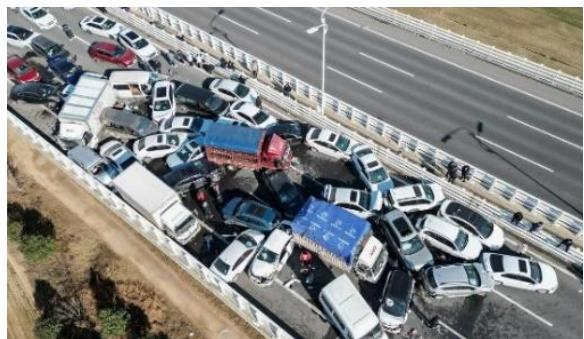

<details>
<summary>natural_image</summary>

Aerial view of a heavy-lift highway with numerous parked cars and a blue truck on the side (no visible text or signage)
</details>

(a) 交通事故

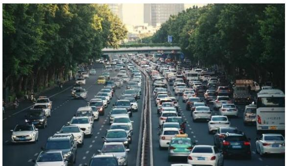

<details>
<summary>natural_image</summary>

Aerial view of a busy urban highway with heavy traffic and multiple cars, surrounded by dense green trees and modern buildings in the background (no visible text or signage).
</details>

(b) 交通拥堵  
图1-1 交通事故与交通拥堵

在此背景下，自动驾驶汽车作为一种革命性的技术创新，逐渐成为汽车工业和人工智能领域研究的焦点。自动驾驶车辆通过整合精密的传感装置和智能化算法，能够完成环境感知、行为决策、轨迹规划和运动控制等关键任务，从而可实现取代人类驾驶员[3]。与人类驾驶员相比，自动驾驶车辆可避免人类驾驶员因疲劳驾驶、酒后驾驶等人为因素引起的事故。自动驾驶车辆还可通过车联网（V2X）进行车辆与车辆、车辆与云端的数据通信，以实现车辆间的协同驾驶，达到优化交通流量、减缓拥堵和提高通行效率等目的[4]。自动驾驶系统能够有效增强老年人和残障人士等特殊需求人群的自主出行能力。上述优点使得自动驾驶技术能够有效提升交通安全和通行效率。

自动驾驶的分级标准随着驾驶操纵者和应用场景的变化不断发展。最初美国国家公路交通安全管理局（NHTSA）提出了自动驾驶分级体系，随后美国汽车工程师学会（SAE）在其基础上对自动驾驶等级进行了更为细致的分类，制定了包含五个等级的划分标准[5]，具体内容见表1-1所示。而我国自动驾驶等级的划分主要参考了国际标准，结合国内的实际情况进行相应调整[6]。目前，最为广泛采用的是由SAE制定的分级标准，这一标准在全球范围内得到了普遍认可和应用。

表1-1 自动驾驶分级

<table><tr><td colspan="2">自动驾驶分级标准</td><td rowspan="2">定义</td><td rowspan="2">操作人员</td><td rowspan="2">监控人员</td><td rowspan="2">接管人员</td><td rowspan="2">应用场景</td></tr><tr><td>NHTSA</td><td>SAE</td></tr><tr><td>L0</td><td>L0</td><td>人类负责所有驾驶任务</td><td>人类</td><td>人类</td><td>人类</td><td rowspan="2">无部分场景</td></tr><tr><td>L1</td><td>L1</td><td>车辆负责横向或纵向中之一进行操作</td><td>人类</td><td>人类</td><td>人类</td></tr><tr><td>L2</td><td>L2</td><td>车辆负责横向或纵向的多个进行操作</td><td>车辆</td><td>人类</td><td>人类</td><td>部分场景</td></tr><tr><td>L3</td><td>L3</td><td>车辆负责绝大部分驾驶任务</td><td>车辆</td><td>车辆</td><td>人类</td><td>部分场景</td></tr><tr><td rowspan="2">L4</td><td>L4</td><td>车辆负责所有驾驶任务</td><td>车辆</td><td>车辆</td><td>车辆</td><td>部分场景</td></tr><tr><td>L5</td><td>车辆负责所有驾驶任务</td><td>车辆</td><td>车辆</td><td>车辆</td><td>全部场景</td></tr></table>

目前自动驾驶系统主要由环境感知、决策规划和控制执行三部分组成。其中，决策规划是自动驾驶系统的重要环节，直接决定了自动驾驶车辆行驶的安全性、舒适性和通行效率。轨迹规划需要在复杂多变的环境中，生成一条满足计算实时性，且符合交通规则的安全无碰撞轨迹。目前，传统的规划方法通常将时间和空间解耦，分别进行路径规划和速度规划，解耦方法虽然可以简化算，但也有明显的局限性。解耦方法面对动态复杂环境场景时，可能会导致规划轨迹质量下降，甚至出现安全隐患。时空联合轨迹规划方法能综合考虑时间和空间两个维度，已成为自动驾驶规划领域的一个重要研究方向。

综上所述，自动驾驶技术具有重要的社会价值和广阔的应用前景，能有效提高交通安全，减少人为因素引发的事故，改善交通拥堵，优化交通流量。针对解耦规划的局限性和不足，本文提出一种时空联合的轨迹规划方法，在一定程度上可提升自动驾驶轨迹规划在动态复杂环境下的适应性。

# 1.2 国内外研究现状及分析

# 1.2.1 自动驾驶国内外研究现状

自动驾驶技术的探索始于 20 世纪中叶，距今已有约 70 年的发展历程。初步探索主要集中在自动化和传感器领域的基础研究。得益于计算机技术和感知系统的进步，自动驾驶技术逐步从理论走向实际。最早主要以卡内基梅隆大学的 Navlab和麻省理工学院的City Car 为主导，实现了对自动驾驶落地的初步尝试。2004年，美国国防高级研究计划局（DARPA）举办了 Grand Challenge首届无人驾驶挑战赛，如图 1-2(a)所示。虽然首届比赛没有车辆完成全程，但次年，斯坦福大学的 Stanley车辆完成了DARPA 挑战赛的全程。该赛事为自动驾驶技术提供了重要的推进力，已成为自动驾驶的里程碑事件。2009 年，Google 公司启动了自动驾驶项目，并开始进行路测。2016 年，Google 将自动驾驶团队独立正式成立 Waymo 子公司，专注于自动驾驶技术的研发与商业化落地。与此同时，特斯拉于 2015 年推出了Autopilot 功能，标志着自动驾驶技术正式进入消费者市场。2018年，Waymo 推出了全球首个无人驾驶出租车服务，如图1-2(b)所示，标志着自动驾驶技术在商业化应用方面的突破。

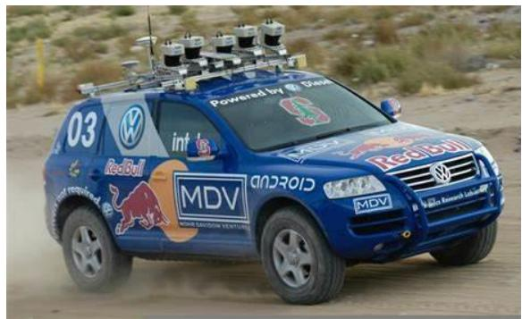

<details>
<summary>text_image</summary>

03
Red Bull
int
Powerst by 100 gm
CDU-2000
MDV
Red Bull
MDV
中国银河证券研究所
</details>

(a) DARPA 挑战赛


<details>
<summary>natural_image</summary>

White autonomous shuttle vehicle with 'W' logo driving on a rural road, no visible text or symbols on the vehicle or background.
</details>

(b) Waymo 出租车  
图 1-2 DARPA 挑战赛和 Waymo 出租车

国内的自动驾驶技术相较于国外的研究虽起步稍晚，但随着政府政策、市场需求的不断支持和推动，对于自动驾驶技术的研究一直保持着较快的发展速度。北京理工大学、国防科技大学等五所高校于1992 年联合研制出我国首款具备自主行驶能力的测试车辆 ATB-1，其最高行驶速度可达 21km/h。ATB-1 的成功研发，标志着我国无人驾驶技术迈出了实质性步伐，进入了探索与发展阶段。随后，ATB-2、ATB-3等无人驾驶车型相继推出，进一步推动了国内自动驾驶技术的发展。自2009年以来，“智能车未来挑战赛”截至目前已举办 14届，吸引了西安交通大学、北京理工大学、湖南大学等高校参与，已成为国内自动驾驶领域最具影响力的赛事之一。该赛事构建了高校间技术交流与合作的有效机制，有力推动了内自动驾驶技术的快速发展。

与此同时，国内各科技公司也不甘落后，在自动驾驶技术的研发与商业化探索方面投入大量资源。百度、华为、滴滴和 Momenta 等科技公司在自动驾驶领域都取得了显著进展，如图1-3所示。其中百度是国内最早布局自动驾驶的公司之一，早在 2013 年就启动了自动驾驶项目，并于 2017 年推出了全球首个 Apollo 自动驾驶开放平台。Apollo 开源平台向全球开发者提供自动驾驶技术解决方案，吸引了众多企业和研究机构参与合作。百度 Apollo 已经在国内多个城市开展了自动驾驶出租车的试运营，在北京、武汉等地已经实现了商业化落地。Momenta、文远知行和滴滴等公司也在自动驾驶取得了显著进展，并在国内外多个城市开展了试点运营。

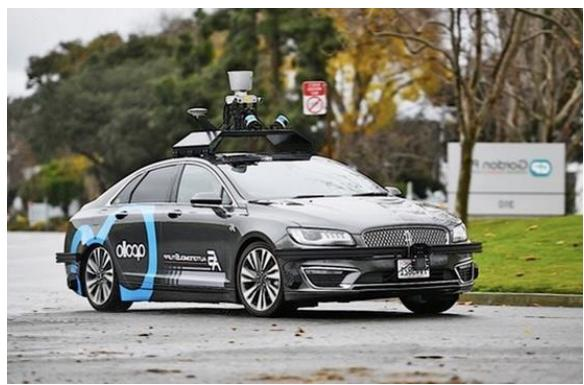

<details>
<summary>natural_image</summary>

Black self-driving car with blue 'olcoop' branding parked on a wet street, surrounded by trees and a company sign (no readable text in focus)
</details>

(a) Apollo 自动驾驶

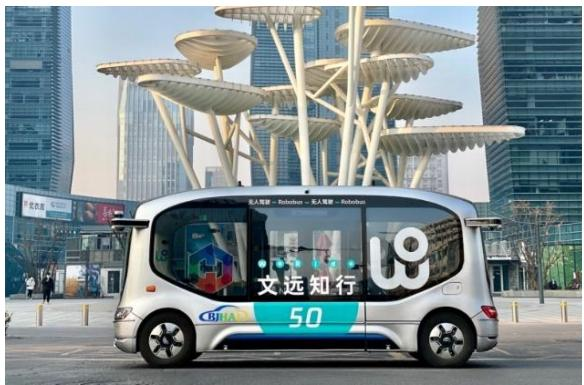

<details>
<summary>text_image</summary>

丈远知行
50
</details>

(b) 文远知行 L4 小巴  
图1-3 国内自动驾驶车辆

# 1.2.2 轨迹规划国内外研究现状

根据自动驾驶车辆的行驶环境，通常可以将道路分为非结构化道路和结构化道路两类，如图1-4 所示。在非结构化道路上通常缺乏明确车道线、交通标志等基础设施，常见于停车场、施工区域、乡村小道等场景。在这类道路上，自动驾驶车辆通常以较低车速行驶，几乎没有移动障碍物。而结构化道路有明确的车道线、交通标志和交通信号灯等设施，典型场景有城市道路、高速公路和高架路等。自动驾驶车辆在结构化道路上行驶，需要面临交通规则、合适的车道选择、复杂路口、非机动车和行人等挑战。

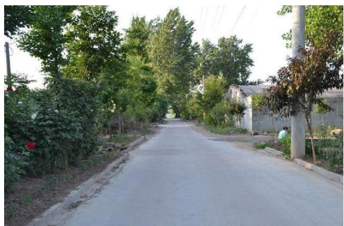

<details>
<summary>natural_image</summary>

Rural road lined with trees and a fence, no visible text or signage
</details>

(a) 非结构化道路

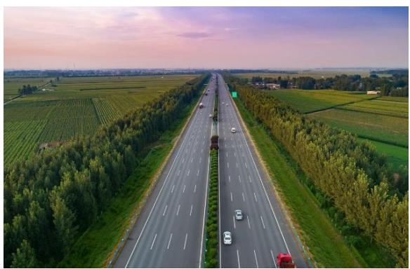

<details>
<summary>natural_image</summary>

Aerial view of a multi-lane highway cutting through green farmland under a pink sunset sky (no visible text or signage)
</details>

(b) 结构化道路  
图 1-4 道路区分

由于自动驾驶车辆日常主要运行于城区道路和城市快速路等结构化道路环境，因此本研究选取结构化道路作为研究对象。此类道路通常具备明确的参考线，可以有效缩小可通行区域的搜索空间。但这一环境也带来了许多挑战，如需要确保车辆在高速行驶时的稳定性、满足其他交通参与者的动态约束以及道路边界约束等。

规划通常分为全局路径规划和局部路径规划，二者协同工作，共同完成自动驾驶系统的规划任务。全局路径规划的主要任务是通过分析环境地图信息，生成一条连接起始点和目标点的最优路线。局部路径规划也常被称为运动规划或轨迹规划，局部路径规划是在全局路径规划的基础上，实时调整自动驾驶车辆的行驶轨迹，以应对环境中的各种障碍物和紧急突发事件。两者协同工作确保自动驾驶汽车在复杂的道路环境中安全平稳地到达终点。目前，主流规划方法有采样法、图搜索法、插值拟合法、数值优化法和机器学习法等[7,8]。

（1）采样方法 采样方法通过在状态空间或控制空间内采样有限个离散点，同时剔除车辆运动学、动力学不可达或有碰撞风险的样本点。其中经典的状态空间采样方法有快速扩展随机树[9]-[11]（Rapidly-exploring Random Trees，RRT）和概率路线图法[12]-[14]（Probabilistic Road Map，PRM），如图 1-5 所示。控制空间采样主要以动态窗口法[15]-[17]（Dynamic Window Approach，DWA）为代表。随机采样具有概率完备特点，常被运用于非结构化道路、移动机器人领域。但随机采样方式通常具有采样盲目性，为提升采样算法效率，栾添添等[18]基于RRT提出动态变采样策略。刘海威[19]基于 RRT-Connect 加入目标偏向性规则，以优化搜索时间和采样次数，从而提升路径搜索效率。随机采样方法在寻找通过狭窄通道的有效路径时往往存在较大困难。为此，苗红霞等[20]将 RRT 结合人工势场法。田洪清等[21]结合人工势场法提出基于势能场模型的概率图算法，保证在复杂的越野道路下生成可行安全的路径。薛光辉等[22]在PRM 算法的基础上引入人工势场，以促进节点的均匀分布。李敏等[23]提出一种改进型 PRM 算法，该方法利用距离变换优化路径规划效果。DWA主要是在速度空间内，通过不同的线速度和角速度组合进行采样，产生若干符合车辆运动学的路径，这些候选轨迹依据预设的代价函数选取性能最优的路径方案。梁广民[24]采用数学建模的方法来表述车辆的安全行驶概率，并在此基础上，从众多候选轨迹中筛选出碰撞风险最小的方案。针对DWA 在复杂场景时易出现陷入局部停滞，动态避障性能不佳等问题，李娟等[25]提出了基于 DWA 与RRT 算法融合的路径规划算法。罗征志等[26]将 RRT-Connect 与 DWA 算法融合，实现全局最优路径和实时避障功能。

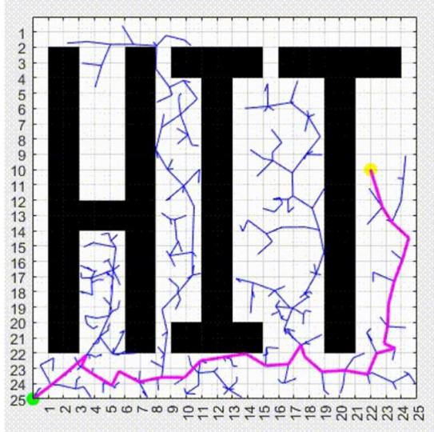

<details>
<summary>line</summary>

| x  | y    |
|----|------|
| 1  | 24   |
| 2  | 23   |
| 3  | 22   |
| 4  | 21   |
| 5  | 20   |
| 6  | 19   |
| 7  | 18   |
| 8  | 17   |
| 9  | 16   |
| 10 | 15   |
| 11 | 14   |
| 12 | 13   |
| 13 | 12   |
| 14 | 11   |
| 15 | 10   |
| 16 | 9    |
| 17 | 8    |
| 18 | 7    |
| 19 | 6    |
| 20 | 5    |
| 21 | 4    |
| 22 | 3    |
| 23 | 2    |
| 24 | 1    |
| 25 | 0    |
</details>

(a) RRT 算法

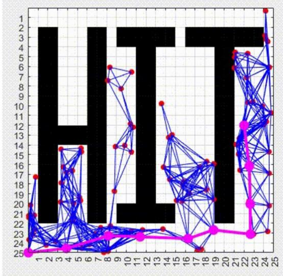

<details>
<summary>line</summary>

| Time | Value |
|------|-------|
| 1    | 25    |
| 2    | 24    |
| 3    | 23    |
| 4    | 22    |
| 5    | 21    |
| 6    | 20    |
| 7    | 19    |
| 8    | 18    |
| 9    | 17    |
| 10   | 16    |
| 11   | 15    |
| 12   | 14    |
| 13   | 13    |
| 14   | 12    |
| 15   | 11    |
| 16   | 10    |
| 17   | 9     |
| 18   | 8     |
| 19   | 7     |
| 20   | 6     |
| 21   | 5     |
| 22   | 4     |
| 23   | 3     |
| 24   | 2     |
| 25   | 1     |
</details>

(b) PRM 算法

图1-5 基于采样方法  
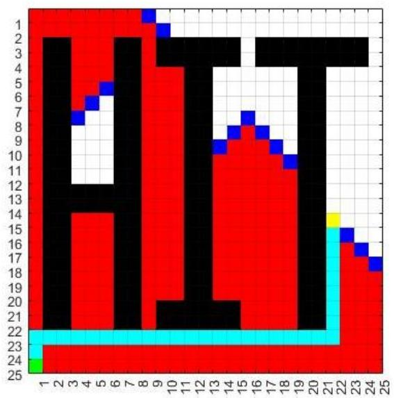

<details>
<summary>heatmap</summary>

| X | Y | Value |
|---|---|---|
| 1 | 1 | 25 |
| 2 | 2 | 24 |
| 3 | 3 | 23 |
| 4 | 4 | 22 |
| 5 | 5 | 21 |
| 6 | 6 | 20 |
| 7 | 7 | 19 |
| 8 | 8 | 18 |
| 9 | 9 | 17 |
| 10 | 10 | 16 |
| 11 | 11 | 15 |
| 12 | 12 | 14 |
| 13 | 13 | 13 |
| 14 | 14 | 12 |
| 15 | 15 | 11 |
| 16 | 16 | 10 |
| 17 | 17 | 9 |
| 18 | 18 | 8 |
| 19 | 19 | 7 |
| 20 | 20 | 6 |
| 21 | 21 | 5 |
| 22 | 22 | 4 |
| 23 | 23 | 3 |
| 24 | 24 | 2 |
| 25 | 25 | 1 |
</details>

(a) Dijkstra 算法

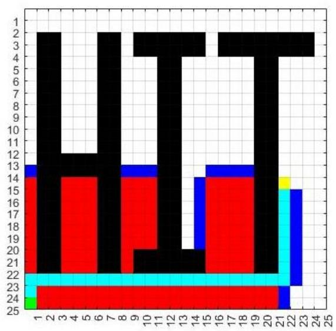

<details>
<summary>bar_stacked</summary>

| X-Axis | Black Segment | Red Segment | Blue Segment | Cyan Segment | Yellow Segment |
|---|---|---|---|---|---|
| 1 | 2 | 14 | 3 | 0 | 0 |
| 2 | 2 | 14 | 0 | 0 | 0 |
| 3 | 12 | 14 | 0 | 0 | 0 |
| 4 | 2 | 14 | 0 | 0 | 0 |
| 5 | 2 | 14 | 0 | 0 | 0 |
| 6 | 2 | 14 | 0 | 0 | 0 |
| 7 | 2 | 14 | 0 | 0 | 0 |
| 8 | 2 | 14 | 0 | 0 | 0 |
| 9 | 2 | 14 | 3 | 0 | 0 |
| 10 | 2 | 14 | 3 | 0 | 0 |
| 11 | 2 | 14 | 3 | 0 | 0 |
| 12 | 2 | 14 | 3 | 0 | 0 |
| 13 | 2 | 14 | 3 | 0 | 0 |
| 14 | 2 | 14 | 3 | 0 | 0 |
| 15 | 2 | 14 | 3 | 0 | 0 |
| 16 | 2 | 14 | 3 | 0 | 0 |
| 17 | 2 | 14 | 3 | 0 | 0 |
| 18 | 2 | 14 | 3 | 0 | 0 |
| 19 | 2 | 14 | 3 | 0 | 0 |
| 20 | 2 | 14 | 3 | 0 | 0 |
| 21 | 2 | 14 | 3 | 0 | 0 |
| 22 | 2 | 14 | 3 | 0 | 3 |
| 23 | 2 | 14 | 3 | 0 | 3 |
| 24 | 2 | 14 | 3 | 0 | 3 |
| 25+ (bottom) | - | - | - | - | - |
The chart displays a stacked bar chart with three distinct color segments for each category. The x-axis is labeled with integers from '1' to '25', and the y-axis is labeled with integer values from '1' to '25'. The bars are grouped by color: black (top), red (middle), blue (bottom), and cyan (bottom). The chart lacks explicit labels or units but visually represents the total height of each bar. The legend indicates the color categories are not explicitly labeled in the image. The chart is divided into four sections based on the color segments, suggesting it is part of a multi-segment representation. The top section contains the full label 'HT' at the bottom.
</details>

(b) A\*算法  
图1-6 基于搜索方法

（2）图搜索方法 图搜索方法首先将连续空间离散处理为网格化表示，其中每个单元均存储相应的环境特征数据。随后在构建的拓扑图中通过搜索策略确定初始位置至目标位置之间的全局最优通行路线。目前应用最为广泛的图搜索算法主要包括Dijkstra和A\*系列算法，如图1-6所示。Dijkstra算法由荷兰计算机科学家 Edsger W. Dijkstra 于 1959 年提出[27]，其基本原理是以起始点为出发点，利用贪心策略，每次优先选择当前距离起始点最近且尚未访问的节点进行扩展，直至到达终点。虽然Dijkstra算法可有效解决起点到终点最短路径问题。但无法对目标位置的方向进行有效引导，会占用大量计算资源。基于这一不足，Peter Hart 等提出了A\*算法[28]。A\*算法在 Dijkstra原有基础上引入了启发式函数，使得算法能够根据目标位置的距离和路径代价，节点优先向目标方向拓展，从而在拓展较少节点的情况下找到最优路径。启发式函数的设计是 A\*算法的关键，当启发式函数小于或等于真实代价时，A\*算法能够保证搜索出的路径是全局最优的。而当启发式函数为零时，此时 A\*算法将完全退化至 Dijkstra算法。在面对动态环境时，A\*算法规划出的路径无法及时做出调整。为了应对动态环境下的挑战，Anthony Stentz[29]提出了D\*算法。

（3）插值拟合方法 插值拟合方法通过显式数学函数来描述行驶轨迹，并通过参数确定其具体形态。该方法生成的局部路径通常具备良好的平滑性，因此在城市道路的高速行驶和泊车场景中被广泛应用。高速行车常用的曲线类型有贝塞尔曲线、多项式曲线和样条曲线等。在自动泊车系统的轨迹规划中，最常采用的几何路径主要有直线-圆弧、Dubins 曲线和RS 曲线等。Xu等[30]利用多项式曲线生成平滑无碰撞的轨迹，能够有效对应复杂的交通场景。彭晓燕等[31]基于三次样条曲线生成轨迹，并提出一种新的坐标转换计算方法，提高了规划的实时性。何慧玲[32]和孔令名[33]采用多项式函数生成备选轨迹集，并经过碰撞检测剔除有碰撞风险的轨迹，基于代价函数筛选出代价最低的最优轨迹。Choi 等[34]基于三次贝塞尔曲线生成满足道路约束且无碰撞的轨迹。Ling Zheng 等[35]采用四次贝塞尔曲线和危险势场函数生成无碰撞轨迹。在评价候选轨迹时，将路径规划问题转化为优化问题，采用顺序二次规划算法来平衡驾驶舒适性和驾驶安全性问题。

（4）数值优化方法 基于数值优化的规划方法通过将车辆运动轨迹的生成问题转化为最优控制模型的求解过程来实现。通过在不同约束条件下建立最优目标函数，以实现最小化目标函数，求得最优轨迹解。王富奎[36]在建立变道轨迹模型时，考虑安全性、舒适性和拟人性等指标，建立以多个目标函数平方和为最终目标的优化方程。最终构建为一个无约束的二次型非线性规划问题。在面对汽车漂移等极限工况时，卢少波等[37]参考车辆漂移的动力学特性，扩展车辆的稳定边界，并基于非线性模型预测控制规划轨迹。求解轨迹规划最优化过程中，关键核心是自动驾驶车辆与周围环境碰撞躲避约束的描述，它是造成最优控制问题模型复杂化的重要因素。Li[38]等通过构建安全行车隧道来线性化处理碰撞躲避约束。此时，避障约束的规模不再受环境复杂程度影响，即碰撞躲避约束由最初的严重非线性约束转化为线性边界约束，使最优控制问题易于求解。Julius Ziegler等[39]通过整合车辆运动特性限制与环境障碍约束构建优化目标函数，最终获得满足二阶连续性要求的可行轨迹。Heilmeier A 等[40]以最小曲率为目标函数利用二次规划优化全局路径。宋春雷等[41]把轨迹规划转化为路径规划和速度规划，提出一种改进的动态规划算法用于速度规划。人工势场法也是一种常见的数值优化方法[42]-[46]，通过构造势场函数，引导轨迹向目标点收敛，同时避开障碍物，从而实现路径规划。

（5）机器学习方法 机器学习是通过从数据中学习规律，自动构建模型来解决复杂问题。神经网络为传统决策规划带来了新思路，它能够将复杂的轨迹生成问题转化为学习输入与输出之间的映射关系。通过对车辆状态、环境特征等数据的学习，模型能够生成合理的轨迹。基于深度神经网络的方法，利用海量数据进行训练，直接从环境感知信息和车辆状态映射至控制指令，这类方法通常称为端到端决策规划策略。Chai R 等[47]提出了一种结合深度学习与优化算法的智能泊车路径规划方法。该方案采用分层架构，首先利用优化算法生成时间最优的参考轨迹，随后通过深度神经网络学习轨迹特征与方向盘转角之间的非线性对应关系。这种两阶段处理方式既保证了轨迹的合理性，又实现了控制指令的智能生成。Wu 等[48]设计的在线三维路径规划网络，可用于未知环境的实时规划。规划计算耗时与周围环境无关，面临复杂交通环境中具有优势。Bautista等[49]创新性地将强化学习框架与模型预测控制相融合，该方式特别适用于解决无信号控制路口的车辆轨迹规划问题。

# 1.2.3 跟踪控制国内外研究现状

轨迹跟踪控制是自动驾驶算法的底层模块，目标是确保自动驾驶车辆安全平稳准确地跟踪上层规划轨迹。根据车辆实时状态，结合车辆运动学、动力学特性，精确计算当前状态下的控制指令，并传递至无人驾驶汽车的方向盘、油门和制动踏板等执行机构。从而使车辆的运动轨迹、车速和加速度等状态量与预定规划轨迹保持一致。目前轨迹跟踪控制方法主要有经典控制法、几何控制法和最优控制法等。

（1）经典控制方法 PID 控制、滑膜控制和模糊控制等经典控制方法也适用于无人驾驶车辆的轨迹跟踪控制领域。由于 PID 方法具有简单易实现、响应快速且稳定等优点，运用最为广泛。PID控制器对系统数学模型要求低，即使模型不完备依然能保持良好的控制效果和控制精度，能够适应多种应用场景。PID跟踪控制器的主要原理是根据实际轨迹和期望轨迹的误差，通过比例、积分和微分三部分综合调节。其中积分部分能够消除长期存在的误差，比例部分可确保系统对当前误差的快速响应，而微分部分则有效抑制了系统的过冲和震荡，增强了抗干扰能力。PID控制器能够快速响应系统的偏差，还能有效消除稳态误差，确保系统最终达到设定目标，使得无人驾驶汽车的行驶轨迹达到期望预定轨迹。

（2）几何控制方法 几何跟踪控制算法主要有纯几何跟踪算法和Stanley算法。纯几何跟踪算法通过选择预定路径上的预瞄点，并控制转向角，使车辆不断逼近并跟随预瞄点，从而达到路径跟踪的效果。类似的，Stanley 跟踪算法是通过控制车辆的转向角来使车辆逐渐逼近并跟随预定路径，算法核心在于计算当前转向角控制量，使得车辆朝着目标路径行驶，同时最小化车辆与路径的横向误差[50]。在2005 年举办的 DARPA 无人车挑战赛中，斯坦福大学的自动驾驶汽车正是采用Stanley 算法最终获得了该赛事的冠军。此类跟踪算法基于简单的几何关系，计算复杂度低，适合实时应用。但在车辆速度较高或路径曲率变化较大时，会使跟踪精度下降、产生较大的跟踪误差。

（3）最优控制方法 最优控制方法通过优化计算得出控制信号，确保受控对象在给定限制下实现最优运行效果，这种控制技术能够有效提升系统整体表现。常见的最优控制方法有线性二次调节器[51]-[53]（Linear Quadratic Regulator，LQR）和模型预测控制[54]-[56]（MPC）。周卫琪等[57]针对弯道、狭窄区域等特殊工况提出一种改进LQR 的路径跟踪横向控制策略，以达到同时兼顾控制精度和通过安全裕度的目的。徐明泽等[58]采用横向 LQR 和纵向 PID 的控制策略，并采用遗传算法整定横向 LQR 的矩阵参数。梁忠超等[59]基于自适应 MPC 算法提出轨迹跟踪控制策略。谢宪毅等[60]将前轮转角极限值、转向系统执行机构物理限制纳入考虑，采用二次规划方法求解，实现轨迹跟踪控制。孙银健[61]结合侧偏角软约束，设计了一种基于线性时变MPC 的轨迹跟踪控制器，用于实现无人驾驶车辆在冰雪等复杂路面下的高速稳定性控制。由智恒[62]提出的改进跟踪控制策略通过引入质心侧偏角、加速度及轮胎侧偏特性等车辆动力学参数约束，有效防止了自动驾驶系统在极端工况下因地面附着条件不足导致的车辆稳定性不足问题。这一策略显著提升了车辆在路径跟踪时的稳定性和安全性。

# 1.2.4 国内外研究现状综述

轨迹规划中，被广泛采用的方法有 Moritz Werling 等[63]提出的最优轨迹生成方法、百度在 2019 年发布的 APOLLO3.5 中 EM planner 的规划方式。前者是在横向和纵向分别采样以生成轨迹集合，再筛选最优轨迹。后者是针对静态障碍物的路径规划和针对动态障碍物的纵向速度规划[64]。但以上都是将时间和空间解耦的规划方式，将一个三维问题解耦为两个二维问题的优点在于能大幅提升求解速度，但同时会导致求解轨迹质量下降，容易陷入局部次优解。时空联合规划的优点体现在规划时能充分考虑动态障碍物的预测信息，在粗搜索阶段就能对动态障碍物做出判断，可直接搜索轨迹。Wonteak Lim 等[65]提出一种横向采样、纵向数值优化的混合规划方法。Li 等[66]在时空搜索出粗轨迹后，建立车辆运动学约束、车辆自身约束、边界约束以及时空隧道约束对初始轨迹进行优化。Long Xin 等[67]基于 X-Y-T三维空间利用改进的 A\*算法搜索轨迹，然后利用 MPC 算法对轨迹进行轨迹优化，但只考虑了直道的情况，在弯道工况若仍采用笛卡尔坐标系则存在横纵向耦合的情况，不如 Frenet 坐标系直观。胡杰等[68]和周兵等[69]在 S-L-T 三维空间内利用图搜索的方式搜索轨迹，但都以固定步长拓展周围节点，只考虑了匀速工况。

轨迹跟踪控制器的目标是确保车辆沿预定期望轨迹行驶，是自动驾驶系统的基础。轨迹跟踪控制通常对系统的实时性、鲁棒性、稳定性和控制的精度都有一定要求。目前轨迹跟踪控制部分主要分为横向控制和纵向控制两部分，对于纵向控制，被控对象一般为车速或纵向位置，环节相对简单，多以 PID控制来实现。对于横向控制，被控对象是汽车前轮偏转角，多以 LQR 和 MPC 为代表的最优控制为主导。LQR 通过最小化加权状态量和控制量的代价函数来实现控制目标，具有快速稳定的控制效果。MPC 不仅可以对目标函数进行特殊设计，而且还可附加额外约束条件，具有较强的约束处理能力。LQR 和MPC 因其良好的控制精度，逐渐成为自动驾驶车辆轨迹跟踪控制中的常用方法。

# 1.3 本文主要研究内容

本研究聚焦于结构化道路环境中自动驾驶车辆的局部路径规划与运动控制问题。通过阅读和分析大量文献资料，建立一个安全可靠的轨迹规划和跟踪控制系统，能适用于静态和动态障碍物同时参与的复杂交通场景。在 Frenet 坐标系下建立T-S-L空间，通过三维动态规划算法，搜索出带时间信息的决策轨迹。在笛卡尔坐标系下，通过构建时空安全走廊进行碰撞躲避约束，再附加运动学约束、车辆机械约束、边界约束条件，以完成从轨迹规划问题到最优化问题的转换。基于汽车动力学模型建立MPC 横向控制器，基于驱动/制动力矩标定表建立PID纵向控制器，跟踪上层规划轨迹。最后，搭建仿真实验平台验证算法的可行性和有效性。图1-7是本文研究的结构拓扑图，主要研究内容可分为以下 4个部分：

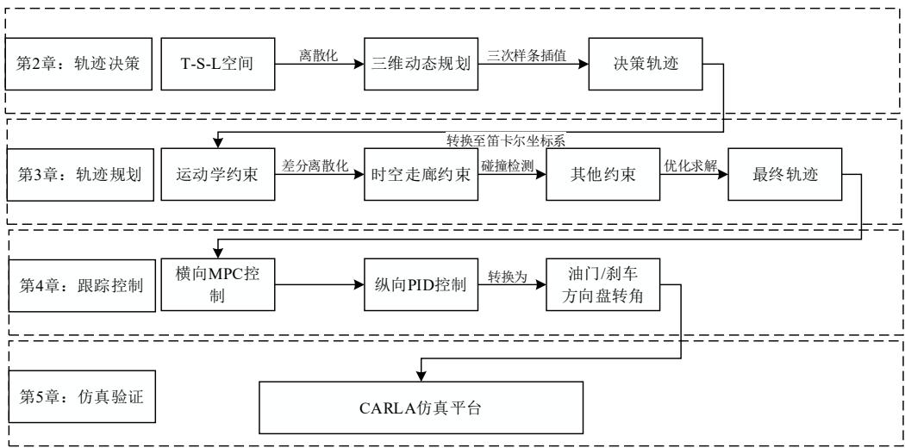

<details>
<summary>flowchart</summary>

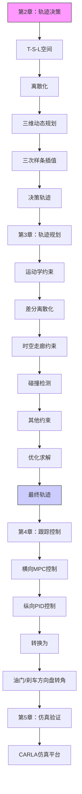
```mermaid
graph TD
    A["第2章：轨迹决策"] --> B["T-S-L空间"]
    B --> C["离散化"]
    C --> D["三维动态规划"]
    D --> E["三次样条插值"]
    E --> F["决策轨迹"]
    F --> G["第3章：轨迹规划"]
    G --> H["运动学约束"]
    H --> I["差分离散化"]
    I --> J["时空走廊约束"]
    J --> K["碰撞检测"]
    K --> L["其他约束"]
    L --> M["优化求解"]
    M --> N["最终轨迹"]
    N --> O["第4章：跟踪控制"]
    O --> P["横向MPC控制"]
    P --> Q["纵向PID控制"]
    Q --> R["转换为"]
    R --> S["油门/刹车方向盘转角"]
    S --> T["第5章：仿真验证"]
    T --> U["CARLA仿真平台"]
    style A fill:#f9f,stroke:#333
    style N fill:#ccf,stroke:#333
```
</details>

图1-7 论文结构拓扑图

（1）轨迹决策算法：首先推导笛卡尔坐标系与 Frenet 坐标系的转换关系，基于Frenet 坐标系构建 T-S-L三维空间。然后设计三维动态规划的代价函数，它是动态规划算法的核心，是评价规划轨迹安全、舒适和平滑等指标的标准。本文三维动态规划代价函数主要由碰撞代价、平滑代价、横向漂移代价、偏离全局代价、参考速度代价五部分组成。最后通过三维动态规划算法搜索出决策轨迹关键点，关键点经插值增密后转换至笛卡尔坐标系得到决策轨迹，该轨迹可作为后续轨迹规划最优化问题求解的初值。  
（2）轨迹规划算法：首先建立轨迹规划最优问题的数学模型，优化目标函数设计准则为尽可能贴近决策轨迹，需要满足的硬性约束条件有边界约束、车辆机械约束、运动学约束和碰撞躲避约束。然后介绍现有车体轮廓模型，并分析各自优劣。其次推导时空安全走廊的构建方式，时空安全走廊是用于描述碰撞躲避约束，将原来的非线性约束条件转换为线性的边界约束。最后验证本文提出轨迹决策和轨迹规划算法的可行性。  
（3）跟踪控制算法：根据汽车动力学模型，建立横向 MPC，纵向 PID的轨迹跟踪控制器。针对横向控制，构建 MPC 优化目标函数和约束条件，通过 MPC 优化求解和前馈控制得到前轮转角的实际控制量。针对纵向控制，基于车辆动力学特性制作驱动/制动力矩标定表，分别对纵向位置和车速进行控制。基于 Carsim 和Simulink 仿真平台，验证控制算法的跟踪精度和控制稳定性。  
（4）算法仿真验证：为验证本文所提出的轨迹规划和跟踪控制算法的有效性，搭建 ROS、Ubuntu/Carla 搭建联合仿真平台，并设计静态和静/动态混合两种交通场景。通过仿真实验平台对算法进行测试，验证本文所提算法的可行性和可靠性。

# 第2章 基于三维动态规划的轨迹决策算法研究

决策轨迹是后续轨迹规划开辟凸空间的基础。由于车辆日常驾驶主要以城区道路和城市快速路等道路为主，本文选取结构化道路作为研究对象，假设全局规划的参考线已知，着重研究在行驶过程中的局部路径规划。基于三维动态规划算法在T-S-L空间中搜索决策轨迹关键点，并通过三次样条插值得到最终决策轨迹。

# 2.1 笛卡尔坐标系与 Frenet 坐标系

# 2.1.1 Frenet 坐标系

描述空间中的位置坐标关系常见的有笛卡尔坐标系和Frenet道路坐标系两种。笛卡尔坐标系是二维（三维）空间中最常见的坐标系，由相互垂直的 x轴和y轴（z轴）组成。点的位置通过坐标(x,y)或 $( x , y , z )$ 表示。Frenet 坐标系主要用于描述物体沿曲线运动的关系，在自动驾驶规划领域常被用于描绘自车或障碍物与道路的相对位置关系，Frenet 坐标系对沿曲线运动的物体刻画更加简单高效。在 Frenet 坐标系中，定义了切线（Tangential direction，T）和法线（Normal direction，N）两个主要方向。切线方向定义为物体沿曲线的方向，法线正方向定义为垂直于切线并指向曲线的弯曲方向。Frenet 坐标系中，点的位置通过弧长 s 和横向偏移 l 表示。其中 s为沿曲线的弧长，l 为点到曲线的垂直距离。

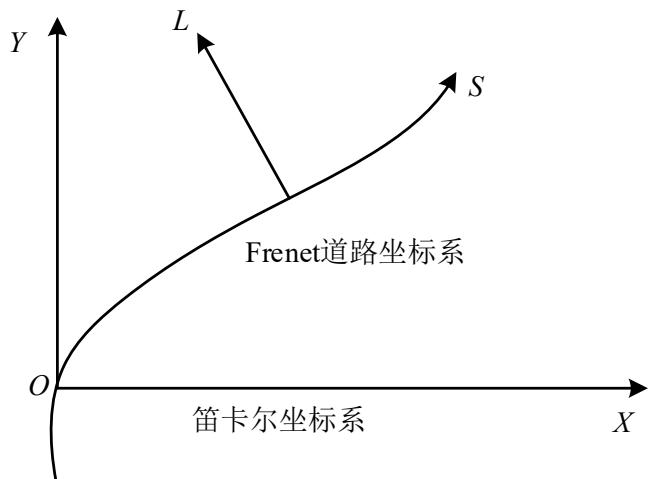

<details>
<summary>text_image</summary>

Y
L
S
Frenet道路坐标系
O
笛卡尔坐标系
X
</details>

图2-1 道路坐标系与笛卡尔坐标系

虽然笛卡尔坐标系是最常用的坐标系，但该坐标系并不是自动驾驶规划领域的最佳选择。笛卡尔坐标系在全局环境中难以直接反映车辆与道路的相对关系，且计算复杂度较高。相比于笛卡尔坐标系，Frenet 道路坐标系描述自车或障碍物与道路的相对位置更加便捷，且有助于简化轨迹规划问题，Frenet 坐标系已成为更为普遍的选择，在轨迹决策和规划中得到了广泛应用。

# 2.1.2 笛卡尔坐标系转换至 Frenet 坐标系

图2-2是自动驾驶车辆在笛卡尔坐标系和 Frenet 坐标系中的位置关系。其中，$\mathbf { \Phi } ( x , y )$ 是车辆质心在笛卡尔坐标系中的坐标，通过向参考线作垂线可获得投影点 R。横向位移 l 定义为 R 点与车辆质心间的垂直距离，纵向位移 s 则是参考线起点 O沿曲线至 R 点的路径长度。基于此，车辆质心在笛卡尔坐标可表示为 $\scriptstyle | ( x , y )$ ，而在Frenet 道路坐标系中可表示为 $\mathsf { I } ( s , l )$ 。现构建如下对应转换关系如式(2-1)。

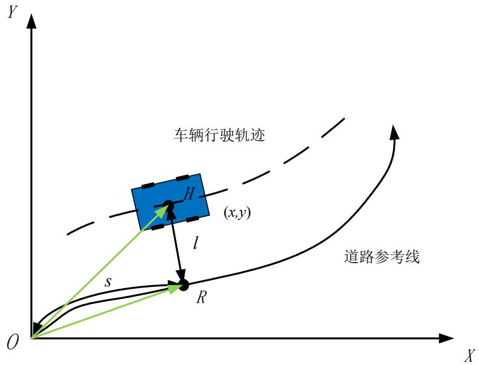

<details>
<summary>text_image</summary>

车辆行驶轨迹
(x,y)
l
s
R
O
X
Y
</details>

图2-2 坐标位置关系

$$
(x, y) _ {\text { referenceline }} \leftrightarrow (s, l) \tag {2-1}
$$

将投影点R点的单位切向量 $\vec { \tau } _ { \mathrm { r } }$ 和单位法向量 $\vec { n } _ { \mathrm { r } }$ 对时间求导有：

$$
\vec {\tau} _ {r} = \frac {d \vec {\tau} _ {r}}{d t} = \frac {d \vec {\tau} _ {r}}{d s _ {r}} \cdot \frac {d s _ {r}}{d t} = \kappa_ {r} \vec {n} _ {r} \dot {s} \tag {2-2}
$$

$$
\vec {n} _ {r} = \frac {d \vec {n} _ {r}}{d t} = \frac {d \vec {n} _ {r}}{d s _ {r}} \cdot \frac {d s _ {r}}{d t} = - \kappa_ {r} \vec {\tau} _ {r} \dot {s} \tag {2-3}
$$

式中 $\vec { n } _ { \mathrm { r } }$ ——投影点单位法向量；

$\vec { \tau } _ { \mathrm { r } }$ — 投影点单位切向量；

$\kappa _ { \mathrm { r } }$ — 投影点在参考线上的曲率；

$\dot { s }$ — —s 对时间一阶导数。

分别将车辆的真实位置矢量 $\vec { r } _ { h }$ 和车辆投影点的位置矢量 $\vec { r } _ { r }$ 对时间 t 求导，得到

车辆真实速度矢量 $\vec { \dot { r } } _ { h }$ 和车辆投影点的速度矢量 $\vec { \dot { r } } _ { r }$ ：

$$
\vec {r} _ {h} = \vec {v} _ {h} = \frac {d \vec {r} _ {h}}{d t} = \frac {d \vec {r} _ {h}}{d s _ {h}} \cdot \frac {d s _ {h}}{d t} = | \vec {v} | \cdot \vec {\tau} _ {h} \tag {2-4}
$$

$$
\vec {r} _ {r} = \vec {v} _ {r} = \frac {d \vec {r} _ {r}}{d t} = \frac {d \vec {r} _ {r}}{d s _ {r}} \cdot \frac {d s _ {r}}{d t} = \dot {s} \cdot \vec {\tau} _ {r} \tag {2-5}
$$

式中 $\vec { r } _ { h }$ — 车辆真实位置矢量；

$\vec { \nu } _ { h }$ — 车辆真实速度矢量；

$\left| \vec { \nu } \right|$ —— 车辆车速大小；

$\vec { r } _ { r }$ — 投影点位置矢量；

$\vec { \nu } _ { r }$ ——投影点速度矢量；

$\vec { \tau } _ { h }$ 车辆真实位置单位切向量。

根据式(2-4)，对时间 t 求导得到自车的加速度 $\vec { a } _ { h }$ 为：

$$
\vec {a} _ {h} = \frac {d \vec {v} _ {h}}{d t} = \frac {d | \vec {v} _ {h} | \vec {\tau} _ {h}}{d t} = \frac {d | \vec {v} _ {h} |}{d t} \vec {\tau} _ {h} + \frac {d \vec {\tau} _ {h}}{d t} | \vec {v} _ {h} | = | \vec {\dot {v}} | \vec {\tau} _ {h} + | \vec {v} _ {h} | ^ {2} \kappa_ {h} \vec {n} _ {h} \tag {2-6}
$$

式中 $\vec { a } _ { h }$ — 车辆真实加速度矢量；

$\kappa _ { h }$ — 车辆真实轨迹的曲率；

$\vec { n } _ { h }$ — 车辆真实轨迹法向量。

如图2-2所示，根据向量关系可得，自车的真实位置矢量 $\vec { r } _ { h }$ 可由投影点的位置矢量 $\vec { r } _ { r }$ 和横向误差l 向量相加可得：

$$
\vec {r} _ {\mathrm{h}} = \vec {r} _ {\mathrm{r}} + l \cdot \vec {n} _ {\mathrm{r}} \tag {2-7}
$$

对式(2-7)进行移项处理，并在方程两侧同时点乘 $\vec { n } _ { \mathrm { r } }$ ，经整理后可求得自车在道路坐标系下的横向位移 l 的表达式为：

$$
l = \left(\vec {r} _ {\mathrm{h}} - \vec {r} _ {\mathrm{r}}\right) \vec {n} _ {\mathrm{r}} \tag {2-8}
$$

将式(2-7)两边同时对时间 t 求导，将切向量对时间导数 $\vec { \dot { \tau } } _ { \mathrm { r } }$ 和法向量对时间导数$\vec { \dot { n } } _ { \mathrm { r } }$ 带入整理方程形式可得：

$$
\dot {s} \vec {\tau} _ {\mathrm{r}} + l \left(- \kappa_ {\mathrm{r}} \vec {\tau} _ {\mathrm{r}} \dot {s}\right) + \dot {l} \vec {n} _ {\mathrm{r}} = \vec {v} _ {\mathrm{h}} \tag {2-9}
$$

对式(2-9)两边同时与向量 $\vec { \tau } _ { \mathrm { r } }$ 做内积运算，经整理可得自车沿参考线切向的速度分量 如式(2-10)所示。对式(2-9)两侧分别与向量 $\vec { n } _ { \mathrm { r } }$ 作内积运算，整理后可求得车辆在参考路径法线方向上的横向速度分量 $i$ 如式(2-11)。

$$
\dot {s} = \frac {\vec {v} _ {h} \vec {\tau} _ {r}}{1 - \kappa_ {r} l} \tag {2-10}
$$

$$
\dot {l} = \vec {v} _ {\mathrm{h}} \vec {n} _ {\mathrm{r}} \tag {2-11}
$$

对式(2-10)进行时间 t 的微分运算，可推导出车辆在参考轨迹切线方向上的纵向加速度分量 如式(2-12)所示。而对于横向加速度 ，将式(2-11)关于时间 t 求导l数，经代数处理后，可获得车辆在参考轨迹法线方向上的横向加速度分量l 如式(2-13)所示。

$$
\ddot {s} = \frac {d \dot {s}}{d t} = \frac {1}{(1 - \kappa_ {r} l) ^ {2}} \left[ \frac {d (\vec {v} _ {h} \vec {\tau} _ {r})}{d t} (1 - \kappa_ {r} l) - \vec {v} _ {h} \vec {\tau} _ {r} (- \dot {\kappa} _ {r} l - \kappa_ {r} \dot {l}) \right] \tag {2-12}
$$

$$
= \frac {\vec {a} _ {h} \vec {\tau} _ {r}}{1 - \kappa_ {r} l} + \frac {\dot {s} ^ {2} \kappa_ {r} l ^ {\prime}}{1 - \kappa_ {r} l} + \frac {\dot {s} ^ {2}}{1 - \kappa_ {r} l} \left(\kappa_ {r} ^ {\prime} l + \kappa_ {r} l ^ {\prime}\right)
$$

$$
\ddot {l} = \frac {d \dot {l}}{d t} = \frac {d \vec {v} _ {h}}{d t} \vec {n} _ {r} + \frac {d \vec {n} _ {r}}{d t} \vec {v} _ {h} = \vec {a} _ {h} \vec {n} _ {r} - \dot {s} ^ {2} \kappa_ {r} (1 - \kappa_ {r} l) \tag {2-13}
$$

依据链式微分规则，经过计算可得出车辆横向位置 l 相对于纵向位置 s 的一阶微分关系式 如式(2-14)所示。通过整理式(2-13)并进行代数运算，可求得在 Frenet坐标系中车辆横向偏移量 l 关于纵向位置s 的二阶微分l表达式如(2-15)所示。

$$
l ^ {\prime} = \frac {d l}{d s _ {h}} = \frac {d l}{d t} \cdot \frac {d t}{d s _ {h}} = \frac {\dot {l}}{\dot {s}} = \frac {\vec {v} _ {h} \vec {n} _ {r}}{\vec {v} _ {h} \vec {\tau} _ {r}} (1 - \kappa_ {r} l) \tag {2-14}
$$

$$
l ^ {\prime \prime} = \frac {\ddot {l} - \ddot {s} l ^ {\prime}}{\dot {s} ^ {2}} \tag {2-15}
$$

将上述公式汇总可得笛卡尔坐标系转换至 Frenet 坐标系满足如下形式：

$$
\left\{ \begin{array}{l} s _ {h} = s _ {r} \\ \dot {s} = \frac {\vec {v} _ {h} \vec {\tau} _ {r}}{1 - \kappa_ {r} l} \\ \ddot {s} = \frac {\vec {a} _ {h} \vec {\tau} _ {r}}{1 - \kappa_ {r} l} + \frac {\dot {s} ^ {2} \kappa_ {r} l ^ {\prime}}{1 - \kappa_ {r} l} + \frac {\dot {s} ^ {2}}{1 - \kappa_ {r} l} \left(\kappa_ {r} ^ {\prime} l + \kappa_ {r} l ^ {\prime}\right) \\ l = \left(\vec {r} _ {h} - \vec {r} _ {r}\right) \vec {n} _ {r} \\ \dot {l} = \vec {v} _ {h} \vec {n} _ {r} \\ \ddot {l} = \vec {a} _ {h} \vec {n} _ {r} - \dot {s} ^ {2} \kappa_ {r} (1 - \kappa_ {r} l) \\ l ^ {\prime} = \frac {\vec {v} _ {h} \vec {n} _ {r}}{\vec {v} _ {h} \vec {\tau} _ {r}} (1 - \kappa_ {r} l) \\ l ^ {\prime \prime} = \frac {\ddot {l} - \ddot {s} l ^ {\prime}}{\dot {s} ^ {2}} \end{array} \right. \tag {2-16}
$$

# 2.1.3 Frenet 坐标系转换至笛卡尔坐标系

通过坐标变换处理公式(2-7)后，可获得车辆在笛卡尔坐标系下的横向位置 $x _ { h }$ 与纵向位置 $y _ { h }$ 分别为：

$$
x _ {h} = x _ {r} - l \sin \theta_ {r} \tag {2-17}
$$

$$
y _ {\mathrm{h}} = y _ {\mathrm{r}} + l \cos \theta_ {\mathrm{r}} \tag {2-18}
$$

对式(2-10)和式(2-11)左右两边同时取平方并求和，可计算出自车的速度 $\left| \vec { \nu } _ { \mathrm { h } } \right|$ 满足以下关系：

$$
\left| \vec {v} _ {\mathrm{h}} \right| = \sqrt {\left(\dot {l}\right) ^ {2} + \left(1 - \kappa_ {\mathrm{r}} l\right) ^ {2} \dot {s} ^ {2}} \tag {2-19}
$$

根据参考线上邻近的两个离散点，可以估算出自车投影点的航向角 $\theta _ { \mathrm { r } }$ 、离散弧长 $d \boldsymbol { s } _ { r }$ 和曲率 $\kappa _ { \mathrm { r } }$ 分别为：

$$
\theta_ {r} = \arctan \frac {d y}{d x} \tag {2-20}
$$

$$
d s _ {r} = \sqrt {(d x) ^ {2} + (d y) ^ {2}} \tag {2-21}
$$

$$
\kappa_ {r} = \frac {d \theta_ {r}}{d s _ {r}} = \frac {d \theta_ {r}}{d \sqrt {(d x) ^ {2} + (d y) ^ {2}}} \tag {2-22}
$$

根据式(2-19)，化简后得到车辆的航向角 $\theta _ { \mathrm { h } }$ 和车辆速度的方向 $\vec { \tau } _ { h }$ 分别为：

$$
\theta_ {h} = \theta_ {r} + \arctan \frac {l ^ {\prime}}{1 - \kappa_ {r} l} \tag {2-23}
$$

$$
\vec {\tau} _ {\mathrm{h}} = \left(\cos \theta_ {\mathrm{h}}, \sin \theta_ {\mathrm{h}}\right) \tag {2-24}
$$

通过将式(2-12)和式(2-13)进行移项处理，然后分别进行平方运算并将结果相加，经过简化运算后可求得自车加速度 $\vec { a } _ { h }$ 的大小为：

$$
\left| \vec {a} _ {h} \right| = \sqrt {\left[ \ddot {l} + \dot {s} ^ {2} \kappa_ {r} (1 - \kappa_ {r} l) \right] ^ {2} + \left[ \ddot {s} (1 - \kappa_ {r} l) - \dot {s} ^ {2} \kappa_ {r} l ^ {\prime} - \dot {s} ^ {2} (\kappa_ {r} ^ {\prime} l + \kappa_ {r} l ^ {\prime}) \right] ^ {2}} \tag {2-25}
$$

车辆的加速度 ${ \vec { a } } _ { h }$ 方向与X轴的夹角为 $\theta _ { a h }$ 如式(2-26)。由式(2-25)简化计算后，可得出加速度方向分量 $\vec { \tau } _ { a h }$ 如式(2-27)：

$$
\theta_ {a h} = \theta_ {r} + \arctan \frac {\ddot {l} + \dot {s} ^ {2} \kappa_ {r} (1 - \kappa_ {r} l)}{\ddot {s} (1 - \kappa_ {r} l) - \dot {s} ^ {2} \kappa_ {r} l ^ {\prime} - \dot {s} ^ {2} (\kappa_ {r} ^ {\prime} l + \kappa_ {r} l ^ {\prime})} \tag {2-26}
$$

$$
\vec {\tau} _ {a h} = \left(\cos \theta_ {a h}, \sin \theta_ {a h}\right) \tag {2-27}
$$

对式(2-6)两侧与 $\vec { n } _ { h }$ 向量进行内积运算，整理后可求得车辆运动路径在该点的曲率 $\kappa _ { h }$ ，其表达式如下：

$$
\kappa_ {h} = \frac {\vec {a} _ {h} \vec {n} _ {h}}{\left| \vec {v} _ {h} \right| ^ {2}} \tag {2-28}
$$

将上述公式汇总可得 Frenet 坐标系转换至笛卡尔坐标系满足如下形式：

$$
\left\{ \begin{array}{l} x _ {h} = x _ {r} - l \sin \theta_ {r} \\ y _ {h} = y _ {r} + l \cos \theta_ {r} \\ \theta_ {h} = \theta_ {r} + \arctan \frac {l ^ {\prime}}{1 - \kappa_ {r} l} \\ \vec {v} _ {h} = | \vec {v} _ {h} | \vec {\tau} _ {h} \\ \vec {a} _ {h} = | \vec {a} _ {h} | \vec {\tau} _ {a h} \\ \kappa_ {h} = \frac {\vec {a} _ {h} \vec {n} _ {h}}{| \vec {v} _ {h} | ^ {2}} \end{array} \right. \tag {2-29}
$$

# 2.2 全局参考路径平滑

在全局路径规划后会生成离散的参考路径点，未经处理的参考线会出现路径不平滑、曲率不连续等问题，进而影响后续局部路径规划的质量和跟踪控制的稳定性。常见参考线平滑的方法包括样条曲线插值方法和基于数值优化平滑方法。前者通过数学插值构造曲率连续曲线，后者利用优化方法最小化目标函数，以提升参考线的质量。下面将分别介绍上述两种方法，通过实验对比二者的平滑效果。

# 2.2.1 基于样条曲线平滑参考线

三次样条插值方法最初由 Ferguson 等[70]在1964年提出，最初主要用于计算机图形处理等应用领域。三次样条插值是根据给定的离散数据点，构造出经过所有采样点并符合三次多项式特性的平滑曲线函数。在规划领域三次样条插值常被用做全局参考路径平滑处理，其优势在于三次样条曲线平滑、连续可微的特性能够提高车辆行驶的舒适性和安全性。此外三次样条插值原理简单、计算效率高，适用于实时的自动驾驶系统。

三次样条插值可描述为存在点 $( x _ { i } , y _ { i } ) , i \in [ 0 , n ]$ ，共n+1个点、n 个区间，每个区间内都是一段三次多项式曲线。 $s _ { i } ( x )$ 在每一个子区间 $[ x _ { i } , x _ { i + 1 } ]$ 上均具有$s _ { i } \left( x \right) = a _ { i } + b _ { i } \left( x - x _ { i } \right) + c _ { i } \left( x - x _ { i } \right) ^ { 2 } + d _ { i } \left( x - x _ { i } \right) ^ { 3 }$ 三次多项式形式。基于三次样条函数的特性，可以得到式(2-30)所描述的约束关系，总共包含 4n-2个限制条件。由于该插值函数涉及4n个未知参数，因此还需补充两个额外约束才能完整求解。实际应用中通常采用三种边界处理方式，自然边界条件、固定边界条件以及无扭结边界条件，如公式(2-31)所示，本文所采用的是自然边界条件。将上述公式整理为矩阵形式，如公式(2-32)所示，其中 $h _ { i } = x _ { i + 1 } - x _ { i }$ ，三次样条曲线的待求解系数为 $x = A ^ { - 1 } b$ 。

$$
\left\{ \begin{array}{l l} s _ {i} (x _ {i}) = y _ {i}, & i \in [ 0, n - 1 ] \\ s _ {i} (x _ {i + 1}) = y _ {i + 1}, & i \in [ 0, n - 1 ] \\ s _ {i} ^ {\prime} (x _ {i + 1}) = s _ {i + 1} ^ {\prime} (x _ {i + 1}), & i \in [ 0, n - 2 ] \\ s _ {i} ^ {\prime \prime} (x _ {i + 1}) = s _ {i + 1} ^ {\prime \prime} (x _ {i + 1}), & i \in [ 0, n - 1 ] \end{array} \right. \tag {2-30}
$$

$$
\left\{ \begin{array}{l l} s ^ {\prime \prime \prime} (x _ {0}) = 0 & s ^ {\prime \prime} (x _ {n}) = 0 \\ s _ {0} ^ {\prime} (x _ {0}) = A & s _ {n - 1} ^ {\prime} (x _ {n}) = B \\ s _ {0} ^ {\prime \prime \prime} (x _ {0}) = s _ {1} ^ {\prime \prime \prime} (x _ {1}) & s _ {n - 2} ^ {\prime \prime \prime} (x _ {n - 1}) = s _ {n - 1} ^ {\prime \prime \prime} (x _ {n}) \end{array} \right. \tag {2-31}
$$

$$
A x = b \tag {2-32}
$$

式中，

$$
A = \left[ \begin{array}{c c c c c c c} 1 & 0 & 0 & & & \dots & 0 \\ h _ {0} & 2 \left(h _ {0} + h _ {1}\right) & h _ {1} & 0 & & & \\ 0 & h _ {1} & 2 \left(h _ {1} + h _ {2}\right) & h _ {2} & & 0 & \\ 0 & 0 & h _ {2} & 2 \left(h _ {2} + h _ {3}\right) & h _ {3} & & \vdots \\ \vdots & & & \ddots & \ddots & \ddots & \\ & & & 0 & h _ {n - 2} & 2 \left(h _ {n - 2} + h _ {n - 1}\right) & h _ {n - 1} \\ 0 & \dots & & & 0 & 0 & 1 \end{array} \right], \quad x = \left[ \begin{array}{c} m _ {0} \\ m _ {1} \\ m _ {2} \\ m _ {3} \\ \vdots \\ m _ {n} \end{array} \right],
$$

$$
b = 6 \left[ \begin{array}{c} 0 \\ \frac {y _ {2} - y _ {1}}{h _ {1}} - \frac {y _ {1} - y _ {0}}{h _ {0}} \\ \frac {y _ {3} - y _ {2}}{h _ {2}} - \frac {y _ {2} - y _ {1}}{h _ {1}} \\ \frac {y _ {4} - y _ {3}}{h _ {3}} - \frac {y _ {3} - y _ {2}}{h _ {2}} \\ \vdots \\ \frac {y _ {n} - y _ {n - 1}}{h _ {n - 1}} - \frac {y _ {n - 1} - y _ {n - 2}}{h _ {n - 2}} \\ 0 \end{array} \right] 。
$$

# 2.2.2 基于数值优化平滑参考线

基于数值优化平滑全局参考线的方法通常适用于高速公路或城市道路等结构化道路环境，主要优点是能生成平滑可靠的高质量全局参考线，为后续的局部路径规划提供基础支撑，如图2-3所示，黑色的路径点是优化前的参考线，红色的路径点是经过数值优化后的参考线。

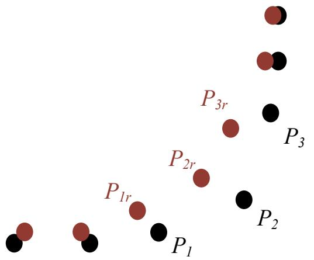

<details>
<summary>text_image</summary>

P₁ᵣ
P₂ᵣ
P₃ᵣ
P₃
P₂
P₁
</details>

图2-3 基于优化平滑参考线

数值优化方法通过最小化目标函数达到平滑参考线的目的。本文在参考线平滑过程中共设计平滑性、紧凑性和几何相似性三个核心评价指标。平滑性可以保证优化后参考线的连续性，紧凑性可以保证优化后参考线路径点分布的均匀性，几何相似性则保证平滑后的参考线与原始路径的一致性，具体如公式(2-33)所示。

$$
\operatorname{cost} (x) = w _ {1} \operatorname{cost} _ {1} (x) + w _ {2} \operatorname{cost} _ {2} (x) + w _ {3} \operatorname{cost} _ {3} (x) \tag {2-33}
$$

式中 $w _ { 1 }$ — 平滑代价权重系数；

$w _ { 2 }$ — 紧凑代价权重系数；

$w _ { 3 }$ ——几何相似代价权重系数；

$c o s t _ { 1 } ( x )$ — 平滑代价函数；

$\mathrm { { } } c o s t _ { 2 } \left( x \right)$ — 紧凑代价函数；

$c o s t _ { 3 } \left( \boldsymbol { x } \right)$ — —几何相似代价函数。

（1）平滑代价 优化后的全局参考线要尽量平滑，减少曲率的突变，以提高参考线的曲率连续性。平滑代价的计算通常基于路径点之间的变化，本文采用$\left\| \overrightarrow { P _ { 2 } P _ { 1 } } + \overrightarrow { P _ { 2 } P _ { 3 } } \right\|$ 作为衡量参考线是否平滑的标准， $\left\| \overrightarrow { P _ { 2 } P _ { 1 } } + \overrightarrow { P _ { 2 } P _ { 3 } } \right\|$ 越小越平滑，具体公式如(2-34)所示：

$$
\cos t _ {1} (x) = \sum_ {i = 1} ^ {n - 2} \left(\left(x _ {i} + x _ {i + 2} - 2 x _ {i + 1}\right) ^ {2} + \left(y _ {i} + y _ {i + 2} - 2 y _ {i + 1}\right) ^ {2}\right) \tag {2-34}
$$

（2）紧凑代价 紧凑代价是在确保路径点之间的距离尽可能均匀，从而提高参考线的紧凑性。通过优化参考线离散点的分布，可以减少参考线的冗余部分。本文采用 $\left\| \overrightarrow { P _ { 1 } P _ { 2 } } \right\| ^ { 2 } + \left\| \overrightarrow { P _ { 2 } P _ { 3 } } \right\| ^ { 2 }$ 作为衡量参考线是否紧凑的标准， $\left\| \overrightarrow { P _ { 1 } P _ { 2 } } \right\| ^ { 2 } + \left\| \overrightarrow { P _ { 2 } P _ { 3 } } \right\| ^ { 2 }$ 越小越紧凑，具体公式如(2-35)所示。

$$
\cos t _ {2} (x) = \sum_ {i = 1} ^ {n} \left(\left(x _ {i} - x _ {i r}\right) ^ {2} + \left(y _ {i} - y _ {i r}\right) ^ {2}\right) \tag {2-35}
$$

（3）几何相似代价 几何相似代价用于衡量优化后的参考线与原始参考线之间的相似性，确保生成的参考线不偏离原始导航路径太远。通过最小化几何相似代价，可以保持路径的形状和特征。本文采用 $\left\| \overrightarrow { P _ { 1 } P _ { r 1 } } \right\| + \left\| \overrightarrow { P _ { 2 } P _ { r 2 } } \right\| + \left\| \overrightarrow { P _ { 3 } P _ { r 3 } } \right\|$ 作为衡量参考线几何形状差距的标准， $\left\| \overrightarrow { P _ { 1 } P _ { r 1 } } \right\| + \left\| \overrightarrow { P _ { 2 } P _ { r 2 } } \right\| + \left\| \overrightarrow { P _ { 3 } P _ { r 3 } } \right\|$ 越小几何形状差距约小，具体公式如(2-36)所示。

$$
\cos t _ {3} (x) = \sum_ {i = 1} ^ {n - 1} \left(\left(x _ {i + 1} - x _ {i}\right) ^ {2} + \left(y _ {i + 1} - y _ {i}\right) ^ {2}\right) \tag {2-36}
$$

# 2.2.3 路径平滑对比

本节对样条曲线插值方法与数值优化方法在全局参考线平滑中的性能进行对比分析。为全面对比两种方法的适用性及其差异，本文分别设定全局参考路径点稀疏和密集两种情况，并通过对比实验对二者的平滑性、连续性及对原始参考路径的拟合程度等方面进行分析，以下为实验结果图。

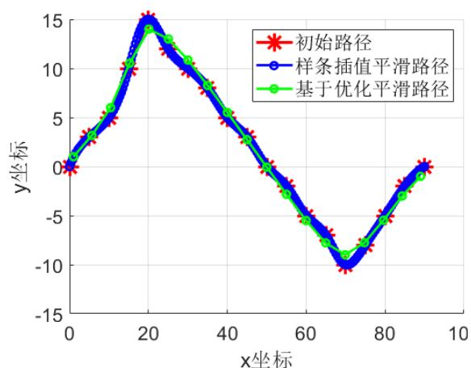

<details>
<summary>line</summary>

| x坐标 | 初始路径 | 样条插值平滑路径 | 基于优化平滑路径 |
|-------|----------|------------------|------------------|
| 0     | 0        | 0                | 0                |
| 20    | 15       | 15               | 15               |
| 40    | 5        | 5                | 5                |
| 60    | -5       | -5               | -5               |
| 80    | -10      | -10              | -10              |
| 90    | 0        | 0                | 0                |
</details>

(a) 路径点稀疏平滑效果

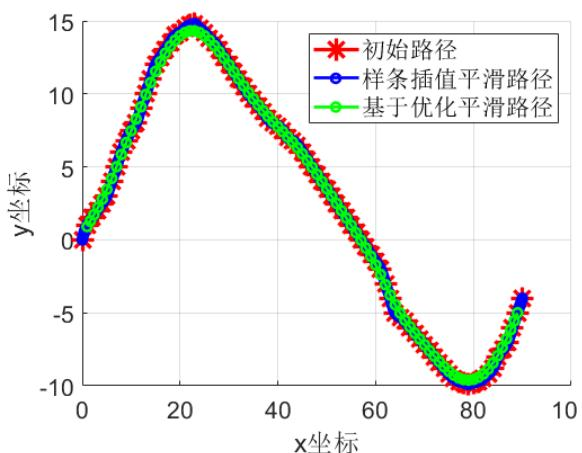

<details>
<summary>line</summary>

| x坐标 | 初始路径 | 样条插值平滑路径 | 基于优化平滑路径 |
|-------|----------|------------------|------------------|
| 0     | 0        | 0                | 0                |
| 20    | 15       | 14               | 14               |
| 40    | 8        | 7                | 7                |
| 60    | -5       | -4               | -4               |
| 80    | -10      | -9               | -9               |
| 90    | -3       | -2               | -2               |
</details>

(b) 路径点稠密平滑效果  
图2-4 路径点稀疏与稠密效果对比图

由图2-4(a)可知，在参考路径点稀疏时，样条曲线方法能够生成平滑的参考线。尽管原始路径点较少，通过曲线插值仍能生成一条连续的曲线，路径平滑度较高。数值优化方法只能基于现有的路径点进行动态调整，无法新增路径点，因此生成的路径平滑性较差，尤其是在路径点之间的过渡区域。由图2-4(b)可知，插值方法在参考路径点密集时，样条曲线插值方法虽然能够生成较为平滑的路径。但由于路径点过多，插值方法的计算复杂度增加，且生成的路径可能会过度拟合路径点。数值优化方法能够充分利用密集的路径点信息，通过最小化代价函数动态调整生成一条平滑的路径。数值优化方法生成的路径在平滑性和合理性都优于曲线插值方法。

通过对比实验可知，当全局参考路径点较少时，曲线插值方法优于数值优化方法。曲线方法能够通过插值生成更为平滑的路径，而优化方法由于路径点稀疏，且无法新增路径点，生成的路径平滑性较差。当全局参考路径点密集时，优化方法优于曲线插值方法。优化方法能够充分利用路径点信息，生成平滑且合理的路径，而插值方法可能会出现拟合过度的情况。

# 2.3 T-S-L 三维时空

# 2.3.1 T-S-L 坐标系的引入

本文在Frenet 基础上，引入时间 T轴，构成 T-S-L（时间-纵向-横向）三维时空。在T-S-L坐标系中，若动态障碍物的预测信息可靠，在此空间内动态障碍物将是一个斜立方体，静态障碍物是一个直立方体，如图2-5所示。相比于传统方法将规划解耦为 S-L 平面路径规划和 S-T 平面速度规划的方法，时空联合规划能够同时考虑时间和空间两个维度的变化，从而更有效地应对动态障碍物和交通流的实时变化。

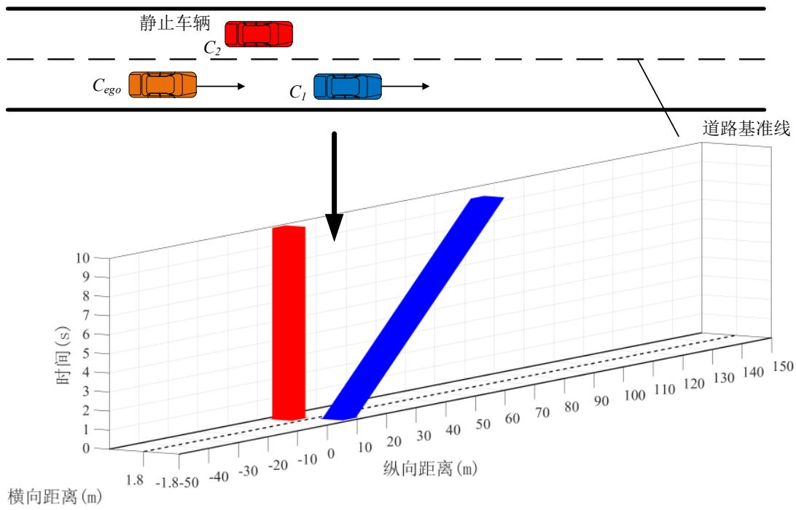

<details>
<summary>bar</summary>

| 车辆类型 | 横向距离 (m) | 纵向距离 (m) |
| -------- | ------------ | ------------ |
| C2       | -20          | 50           |
| C1       | -10          | 10           |
</details>

图 2-5 T-S-L 空间

传统方法在动态环境中，由于无法同时考虑时间和空间两个维度，可能会导致规划结果难以满足实际需求。且解耦规划由于将路径和速度分开进行优化，可能导致局部次优解，无法保证规划轨迹的全局最优性。如在图2-5情况下，无论蓝色前车速度如何，自车都无法规划超车绕行的轨迹。若蓝色车辆与自车相向而行，传统方法将无法规避碰撞的风险[71]。而时空联合规划通过时间和空间协同优化，系统能够综合考虑时间和空间的约束条件，从而找到全局最优的轨迹解。由此可见引入时间 T 轴的必要性。时空联合规划在动态环境的适应性、全局最优性以及处理复杂场景等方面具备明显优势。

# 2.3.2 离散采样策略

在三维动态规划算法过程中，离散采样点的分布情况直接影响最终结果的质量和精度。合理的采样点不仅能精确描述环境细节，还能提升整体运行效率。若采样点稀疏，系统无法准确描述周围环境中的关键信息，还会直接影响决策轨迹解空间的数量。若决策轨迹解空间数量过低时，会导致求解出的决策轨迹有碰撞风险，从而影响规划轨迹的有效性和精确性。当采样点过于密集时，密集的采样点虽能提高精度，但会增加计算负担，导致算法求解速度变慢，影响决策轨迹求解效率。因此，平衡采样点的分布密度对于优化效率至关重要。合理的采样点分布策略可以避免陷入局部最优解。

本文在T-S-L三维空间中的离散采样策略是基于当前位置 $( t _ { 0 } , s _ { 0 } , l _ { 0 } )$ ，向周围拓展新采样点 $( t _ { 1 } , s _ { 1 } , l _ { 1 } )$ ，合理的采样点分布策略可提高初始轨迹搜索的质量。基于时间不可逆和结构化道路无法倒车的特点，拓展新采样点应满足式(2-37)。图 2-6 表示基于节点 $\left( t _ { i } , s _ { 0 } , l _ { 0 } \right)$ 拓展新节点 $( t _ { i + 1 } , s _ { m } , l _ { n } )$ 的示意图，其中浅黄色的点代表车辆匀速时的采样点；深橘色代表加减速时的采样点；红色代表停车时的采样点。

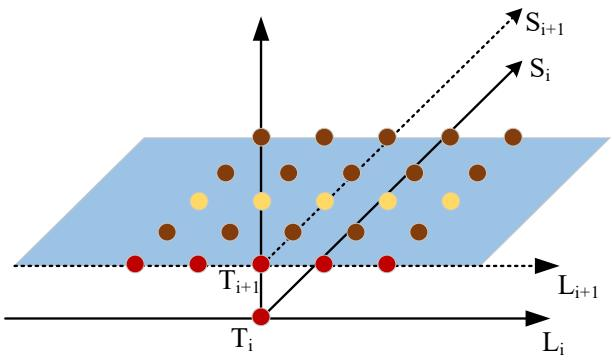

<details>
<summary>text_image</summary>

S_{i+1}
S_i
T_{i+1}
L_{i+1}
T_i
L_i
</details>

图2-6 离散采样策略图

$$
\left\{ \begin{array}{l l} t _ {1} = t _ {0} + d t, & d t > 0 \\ s _ {1} = s _ {0} + d s, & d s \in [ 0, d s _ {\max} ] \\ l _ {1} = l _ {0} + d l, & d l \in [ - d l _ {\max}, d l _ {\max} ] \end{array} \right. \tag {2-37}
$$

式中 — 时间采样间隔（s）；

$d s$ —— 纵向采样间隔（m）；

$d l$ ——横向采样间隔（m）；

$d s _ { m a x }$ 纵向采样最大值（m）；

$d l _ { \mathrm { m a x } }$ 横向采样最大值（m）；

$t _ { 1 }$ 、 $t _ { 0 }$ ——分别为新采样点时间、当前点时间（s）；

$s _ { 1 }$ 、 $s _ { 0 }$ ——分别为新采样点纵向坐标、当前点纵向坐标（m）；

$l _ { 1 }$ 、 $l _ { 0 }$ ——分别为新采样点横向坐标、当前点横向坐标（m）。

# 2.4 三维动态规划决策算法

在自动驾驶轨迹决策中，按规划方式不同可分为基于人为规划的重决策和基于代价函数的轻决策。重决策在特定场景下可简化计算，提高运行速度。但规则无法覆盖全部场景，在某些场景下存在规划失效的风险。轻决策完全取决于算法，可以处理复杂场景的规划任务。在轨迹规划过程中，需从 $N _ { T }$ 个时段内依次选择 $( S _ { i } , L _ { j } )$ 坐标点，共计存在 $( N _ { S } N _ { L } ) ^ { N _ { T } }$ 种不同的轨迹选择可能性。针对以上搜索寻优场景可采用动态规划算法，动态规划由 Bellman 于 1966 年提出[72]，基本思想是将待求解问题分解成若干个子问题，经过多阶段的决策，分别求出每阶段的最优解，然后从这些子问题的解中得到原始问题的最优解，通过动态规划搜索策略，能够将解空间的探索规模从 $O ( ( N _ { S } N _ { L } ) ^ { N _ { T } } ,$ 大幅缩减到 $O ( N _ { \ / T } ( N _ { \ / S } N _ { \ / L } ) ^ { 2 } )$ ，在较低计算耗时条件下实现最佳决策路径的快速求解。

# 2.4.1 动态规划代价函数设计

为从解空间中 $( N _ { s } N _ { L } ) ^ { N _ { T } }$ 条决策轨迹中筛选出最优解，需定义一套评价决策轨迹优劣的指标。轨迹决策的代价函数需体现安全性、舒适性和高效性。其中，安全性反映车辆的碰撞程度、潜在碰撞隐患；舒适性反映车辆横纵向速度变化幅度，可用于考量当前决策周期的结果与上一周期结果的一致性和延续性；高效性反映决策轨迹的通行效率。本文所采用的动态规划算法代价函数由碰撞代价、平滑代价、横向漂移代价、偏离全局代价和参考速度代价五部分组成。其中，安全性指标由碰撞代价函数和横向漂移代价函数体现，用于惩罚备选决策轨迹的碰撞程度；舒适性指标由平滑代价函数体现，用于惩罚备选决策轨迹速度变化情况；高效性能指标由偏离全局代价函数和参考速度代价函数体现，鼓励备选决策轨迹尽量贴近道路中心线行驶以及在额定时域内行驶得尽量远。整体代价函数可表示为：

$$
\operatorname{cost} (x) = w _ {1} \operatorname{cost} _ {1} (x) + w _ {2} \operatorname{cost} _ {2} (x) + w _ {3} \operatorname{cost} _ {3} (x) + w _ {4} \operatorname{cost} _ {4} (x) + w _ {5} \operatorname{cost} _ {5} (x) \tag {2-38}
$$

式中 $w _ { 1 } \setminus \ c o s t _ { 1 } ( x )$ — 分别为碰撞代价权重系数、碰撞代价函数；

$w _ { 2 }$ 、 $c o s t _ { 2 }$ — 分别为平滑代价权重系数、平滑代价函数；

$w _ { 3 }$ 、 $c o s t _ { 3 }$ — 分别为漂移代价权重系数、漂移代价函数；

$w _ { 4 } \ 、 \ c o s t _ { 4 } \left( x \right)$ — —分别为偏离全局代价权重系数、偏离全局代价函数；

$\begin{array} { r l } { w _ { 5 } \ 、 } & { { } c o s t _ { 5 } \left( x \right) } \end{array}$ ——分别为参考速度代价权重系数、参考速度代价函数。

（1）碰撞代价设计 碰撞代价是考量行车周围静态、动态障碍物的关键函数指标。本文设计标准为：当障碍物与自车的欧氏距离大于最大行车安全距离时，认为该障碍物无碰撞风险，不考虑障碍物碰撞代价；当障碍物与自车的欧氏距离小于最小极限安全距离时，认为该障碍物可能会与自车立即发生碰撞，障碍物代价应接近于无穷大；若障碍物与自车的欧氏距离在最大行车安全距离和最小极限安全距离之间时，认为该障碍物可能会与自车发生潜在碰撞风险，障碍物代价应和距离呈现负相关。同时考虑到动态障碍物碰撞风险更大，故应加大对应的权重系数，安全距离和极限距离也应做出相应的调整，综上碰撞代价函数形式如下所示：

$$
\cos t _ {1} = \left\{ \begin{array}{l l} \inf, & x <   d i s _ {\min} \\ \frac {4 5 0 0}{x ^ {2}}, & d i s _ {\min} \leq x \leq d i s _ {\max} \\ 0, & d i s _ {\max} <   x \end{array} \right. \tag {2-39}
$$

式中 — 障碍物与自车的欧氏距离（m）；

$d i s _ { \operatorname* { m i n } }$ 最小极限安全距离（m）；

$d i s _ { \operatorname* { m a x } }$ 最大行车安全距离（m）。

（2）平滑代价设计 平滑性代价用于惩罚决策轨迹横向速度变化情况，用于限制车辆的横向速度、加速度和加速度变化率，若车辆横向速度、加速度和加速度变化率过大则会导致车辆出现侧滑失控等风险。本文设计标准为：横向速度、横向加速度、横向加速度变化率的加权平方和，具体公式如下所示：

$$
\operatorname{cost} _ {2} (x) = w _ {\text { smooth1 }} l ^ {\prime 2} + w _ {\text { smooth2 }} l ^ {\prime \prime 2} + w _ {\text { smooth3 }} l ^ {\prime \prime \prime 2} \tag {2-40}
$$

式中 $\boldsymbol { w } _ { s m o o t h 1 }$ 、 ——分别为横向速度权重系数、横向速度；

$w _ { s m o o t h 2 }$ 、 — 分别为横向加速度权重系数、横向加速度；

$w _ { s m o o t h 3 }$ 、 $l ^ { m }$ — 分别为横向加速度变化率权重系数、横向加速度变化率。

（3）横向漂移代价设计 横向漂移代价是惩罚决策轨迹出现垂直于道路中心线的横向漂移的情况，即无纵向位移，但横向位移不为零的情况。当前位置节点和新拓展采样点的纵向位移 s 相同且横向位移 l 不同时，此时认为决策轨迹规划不合理，车辆会发生横向漂移，漂移代价设置为近于无穷大。具体公式如下所示：

$$
\cos t _ {3} (x) = \left\{ \begin{array}{l l} \inf, & s _ {0} = s _ {1} \& l _ {0} \neq l _ {1} \\ 0, & \text { otherwise } \end{array} \right. \tag {2-41}
$$

式中 $s _ { 0 }$ 、 $s _ { 1 }$ ——分别为当前节点纵向位移、拓展节点纵向位移（m）；

$l _ { 0 }$ 、 $l _ { \mathrm { 1 } }$ ——分别为当前节点横向位移、当前节点横向位移（m）。

（4）偏移全局代价和参考速度代价设计 偏移全局代价和参考速度代价是决策轨迹通行效率的衡量标准。这两个代价函数分别鼓励决策轨迹尽量贴近道路中心线行驶以及在安全限速内行驶得尽量远，二者设计准则具体为横向位移的平方和、自车车速与安全限速差的平方和，具体公式如下所示：

$$
\cos t _ {4} (x) = l ^ {2} \tag {2-42}
$$

$$
\cos t _ {5} (x) = \left(v - v _ {\text { ref }}\right) ^ {2} \tag {2-43}
$$

式中 — 采样点横向偏移（m）；

v 自车车速（m/s）；

Vref $\nu _ { r e f }$ 参考车速（m/s）。

# 2.4.2 三维动态规划决策算法

在T-S-L空间中，需要将时间T轴均匀离散，在每个 $T _ { k } , k \in [ 0 , N _ { \scriptscriptstyle T } ]$ 层都是 S-L平面。表 2-1 为本文动态规划算法的伪代码，首先需要计算规划起点到 $T _ { 0 }$ 层各个$n o d e ( T _ { 0 } , S _ { i } , L _ { j } )$ 的代价，即伪代码第 8 行。然后基于 $T _ { k }$ 层的节点 $n o d e ( T _ { k } , S _ { i } , L _ { j } )$ 计算与前一层的每个节点 $n o d e ( T _ { k - 1 } , S _ { m } , L _ { n } )$ 的层代价。 $n o d e ( T _ { k } , S _ { i } , L _ { j } )$ 表示当前节点的 总 代 价 ， layer\_cost 表 $\overline { { \overline { { \mathbf { \Omega } } } } } \overline { { \mathbf { \Omega } } }$ 层 代 价 。 如 果 $n o d e ( T _ { k - 1 } , S _ { m } , L _ { n } ) . \cos t$ 小 于$n o d e ( T _ { k } , S _ { i } , L _ { j } ) . \cos t$ 时，便更新 $n o d e ( T _ { k - 1 } , S _ { m } , L _ { n } )$ 的总代价，如伪代码 22 行所示。其次在最后一层找到最小代价的节点，通过回溯算法即可得到整个决策轨迹关键点。最后关键点经三次样条插值增密后转换至笛卡尔坐标系得到决策轨迹，这可作为后续轨迹规划的最优化问题求解的初值。

表2-1 算法伪代码

<table><tr><td colspan="2">Input: init_node, 3D spatiotemporal T-S-L map, NT, NS, NL and other parametersOutput: The decision trajectory</td></tr><tr><td>1</td><td>for k = 0 in NT, do</td></tr><tr><td>2</td><td>for i = 0 in NS, do</td></tr><tr><td>3</td><td>for j = 0 in NL, do</td></tr><tr><td>4</td><td>Initialization parameters;</td></tr><tr><td>5</td><td>end for</td></tr></table>

续表 2-2 算法伪代码  
```txt
Input: init_node, 3D spatiotemporal T-S-L map, NT, NS, NL and other parameters
Output: The decision trajectory

6 end for
7 end for
8 for i = 0 in NS, do
9 for j = 0 in NL do
10 node(0, i, j).parent = init_node;
11 Assign values to t, s, l of node(0, i, j) based on init_node;
12 node(0, i, j).cost = calc_cost(init_node, node(0, i, j));
13 end for
14 end for
15 for k = 1 in NT, do
16 for i = 0 in NS, do
17 for j = 0 in NL, do
18 for m = 0 in NS, do
19 for n = 0 in NL, do
20 Calculate layer cost, layer_cost = calc_cost(node(k-1, m, n), node(k, i, j));
21 Calculate sum cost, sum_cost = layer_cost + node(k-1, m, n);
22 if node(k, i, j).cost > sum_cost, then
23 node(k, i, j).cost = sum_cost;
24 Assign values to t, s, l of node(k, i, j) based on node(k-1, m, n);
25 node(k, i, j).parent = node(k-1, m, n);
26 end if
27 end for
28 end for
29 end for
30 end for
31 end for
32 Through the backtracking algorithm, the decision trajectory is obtained;
33 return. 
```

# 2.5 本章小结

本章基于T-S-L 三维时空坐标系，设计了三维动态规划的时空联合轨迹决策算法。首先，推导了笛卡尔坐标系与 Frenet 道路坐标系的转换关系。然后，通过对比实验分析了曲线插值和基于数值优化两种全局参考线平滑方法各自的优缺点。实验表明，当全局参考路径点较少时，曲线插值方法优于数值优化方法。而路径点密集时，数值优化方法优于曲线插值方法。其次，引入T-S-L三维时空并介绍离散采样策略，确保决策轨迹离散采样的合理性。同时，设计了三维动态规划的代价函数用于评价决策轨迹的质量。最后，基于T-S-L 时空提出了三维动态规划的轨迹决策算法。

# 第3章 基于时空安全走廊的规划算法研究

轨迹规划是自动驾驶的关键环节，同时也是本文的核心内容。在第二章中，使用三维动态规划算法已获得一条带有时间信息的决策轨迹，本章将对决策轨迹进行数值优化。将轨迹规划建模为一个标准的最优控制问题。其中针对运动学约束，采用向前欧拉法进行离散化处理。针对碰撞躲避约束，通过构建时空安全走廊进行线性简化处理。最后，在仿真平台上对上一章和本章的算法进行可行性验证。

# 3.1 最优化轨迹规划问题描述

本章将构建基本的自动驾驶车辆轨迹规划的数学命题[73]。定义车辆的状态变量 $\vec { x } \in R ^ { n _ { x } }$ ，控制变量 $\vec { u } \in R ^ { n _ { u } }$ （其中 $n _ { x }$ 表示状态空间的维数， $n _ { c }$ 表示控制空间的维数），集合 $C \in R ^ { 2 }$ 表示自动驾驶车辆行驶的二维平面， $C _ { O }$ 表示二维平面上静态障碍物、动态障碍物所占据的子空间， $C _ { F } = C \backslash C _ { o }$ 表示二维平面上自动驾驶车辆可行驶区域占据的空间。自动驾驶轨迹规划的标准最优控制问题格式为：

$$
\begin{array}{l} \min _ {x (t), u (t), t _ {f}} J \\ s. t. \quad \dot {x} (t) = f _ {K I N E} (x (t), u (t)) \quad t \in [ 0, t _ {f} ] \\ x (t) \in [ x _ {\min}, x _ {\max} ] \quad t \in [ 0, t _ {f} ] \\ u (t) \in [ u _ {\min}, u _ {\max} ] \quad t \in [ 0, t _ {f} ] \tag {3-1} \\ x (0) = x _ {i n i t} \quad u (0) = u _ {i n i t} \\ x (t _ {f}) = x _ {e n d} \quad u (t _ {f}) = u _ {e n d} \\ h _ {\text { collision }} (x (t)) \leq 0 \quad t \in [ 0, t _ {f} ] \\ \end{array}
$$

式中 $t _ { f }$ — 局部路径规划的时间窗口长度；

— —最小化的目标函数；

$\begin{array} { r } { \dot { x } ( t ) = f _ { { K I N E } } ( x ( t ) , u ( t ) ) } \end{array}$ — 车辆运动学约束；

$h _ { c o l l i s i o n } ( x ( t ) ) \leq 0$ ——轨迹规划自车碰撞躲避约束；

$x _ { \operatorname* { m i n } } \cdot \ x _ { \operatorname* { m a x } }$ — 分别为状态变量x的最小值、最大值；

$u _ { \mathrm { m i n } } \setminus u _ { \mathrm { m a x } }$ 分别为控制变量u的最小值、最大值；

$x _ { i n i t } \setminus \mathrm { ~ } x _ { e n d }$ — 分别为状态变量x的初始时刻值、终止时刻值；

$u _ { i n i t } \setminus u _ { e n d }$ — 分别为控制变量u的初始时刻值、终止时刻值。

# 3.1.1 优化目标函数

对于优化目标函数，本文主要考虑车辆状态量以及控制量两部分。对于状态量，优化目标是尽量贴合决策轨迹，即期望最优轨迹与决策轨迹在位置和横摆角偏差方面尽可能小。对于控制量部分，加速度变化率和前轮偏转角速度对轨迹的平滑性和驾驶舒适性有相当大的影响，较好的规划轨迹能够实现平缓的加速、减速和转向操作。通过调节前轮转向角速度能够显著降低车辆因过大横向加速度导致的侧滑概率。为提高行驶平顺性与操纵稳定性，应当控制车辆加速度变化率并限制前轮转角速度。采用二次型目标函数进行优化设计，可确保计算过程的高效性，因此优化目标函数有如下形式：

$$
J = \sum_ {i = 0} ^ {n} (w _ {1} (x _ {i} - x _ {i _ {\text { ref}}}) ^ {2} + w _ {2} (y _ {i} - y _ {i _ {\text { ref}}}) ^ {2} + w _ {3} (\varphi_ {i} - \varphi_ {i _ {\text { ref}}}) ^ {2} + w _ {4} j e r k _ {i} ^ {2} + w _ {5} \omega_ {i} ^ {2}) \tag {3-2}
$$

# 3.1.2 车辆运动学约束

本节将建立车辆运动学约束条件，用于保证轨迹规划必须满足车辆运动学限制。基于车辆实际运动特性，二自由度运动学模型如图3-1所示，该模型通过简化车辆动力学特性，重点描述车辆的基本运动关系。在进行运动学建模时，文本做出如下理想化假设：假设车辆在水平路面上保持纯滚动，暂不研究车身悬架及其减震等上下方向的振动；车辆由后轮提供动力，前轮控制方向，四个轮胎均无打滑现象，且左右两侧的前轮转角和前轮角速度相同；将整车视为不可变形的刚体，不考虑风阻及轮胎形变产生的侧向力；运动过程中自车的质心侧偏角始终为0。则自车的行驶过程受下列常微分方程组的制约：

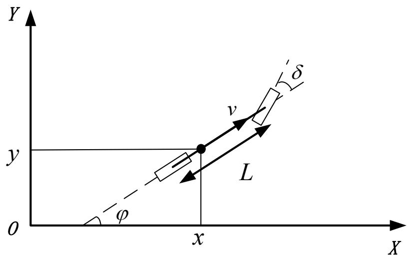

<details>
<summary>text_image</summary>

Y
v
δ
y
L
φ
O
x
X
</details>

图3-1 车辆运动学模型

$$
\frac {d}{d t} \left[ \begin{array}{l} x (t) \\ y (t) \\ \varphi (t) \\ \delta (t) \\ v (t) \\ a (t) \end{array} \right] = \left[ \begin{array}{c} v (t) \cos \varphi (t) \\ v (t) \sin \varphi (t) \\ v (t) \tan \delta (t) / L \\ \omega (t) \\ a (t) \\ j e r k (t) \end{array} \right] \tag {3-3}
$$

式中 、 ——分别为车辆后轴中心横坐标、车辆后轴中心纵坐标（m）；

、 ——分别为车辆横摆角（rad）、车辆前后轮轴距（m）；

、 ——分别为车辆前轮转角（rad）、车辆前轮偏角速度（rad/t）；

、 ——分别为车辆纵向速度（m/s）、车辆加速度 $( \mathrm { m } / \mathrm { s } ^ { 2 } )$ ）；

——车辆加速度变化率 $\left( \mathbf { m } / \mathbf { s } ^ { 3 } \right)$ ）。

二自由度运动学模型是一种被广泛应用的近似模型，该模型在描述车辆平面内的运动有较好的精确性。但上述二自由度运动学模型是微分方程形式，在进行求解过程中需要大量的数值计算。为了加快求解速度，可在离散时间域内实现求解。对于上述 微分方程的形式，常见的离散方法有向前欧拉法、中点欧拉法和向后欧拉法。经上述离散方法处理后，可以转换为离散的一般形式 $x _ { k + 1 } = \overline { { A } } x _ { k }$ 。下面将分别介绍三种方法的状态转移矩阵 的具体形式。

（1）向前欧拉法 向前欧拉法是最简单的一阶显式方法，其基本思想是用当前时刻的导数来近似下一时刻的状态变化量。对于上述微分方程，在离散时间域下，令 $x _ { k + 1 }$ 为下一时刻的状态，步长为 dt，则向前欧拉法的离散化形式如式(3-4)所示。这种方法计算简单，但由于其为显式方法，数值稳定性较差，在刚性系统或较大步长情况下可能会引起数值振荡或发散。

$$
x _ {k + 1} = (I + A d t) x _ {i} \tag {3-4}
$$

式中 I——单位矩阵。

（2）中点欧拉法 中点欧拉法是一种改进的数值积分方法，该方法是一种二阶精度的方法。其基本思想是利用当前时刻和下一时刻的导数的平均值来近似状态的变化。中点欧拉法的离散化形式如式(3-5)所示。

$$
x _ {k + 1} = (I - \frac {A d t}{2}) ^ {- 1} (I + \frac {A d t}{2}) x _ {i} \tag {3-5}
$$

（3）向后欧拉法 向后欧拉法是一种隐式数值积分方法，其基本思想是利用下一时刻的导数来计算状态更新。向后欧拉法的离散化形式具体如式(3-6)所示。该方法是隐式的，每一步都需要求解线性方程组，因此计算量较大。但是向后欧拉法具有良好的数值稳定性。即使在刚性系统或较大步长情况下仍能保持稳定收敛。

$$
x _ {k + 1} = (I - A d t) ^ {- 1} x _ {i} \tag {3-6}
$$

本文使用二自由度自行车模型经向前欧拉法离散化后，车辆运动学约束具体为如式(3-7)。将微分方程离散化为等式约束后，能够将连续系统转化为离散优化问题，能够利用 IPOPT 等成熟的优化求解器进行高效求解。离散化后的形式不仅便于引入物理约束和优化目标，还能够减少数值积分带来的误差，提高求解精度。另外，还可以借助内点法和序列二次规划等高效的数值优化方法实现快速求解，满足实时性要求。

$$
\left[ \begin{array}{l} x _ {k + 1} \\ y _ {k + 1} \\ \varphi_ {k + 1} \\ \delta_ {k + 1} \\ v _ {k + 1} \\ a _ {k + 1} \end{array} \right] = \left[ \begin{array}{c} v _ {k} \cos \varphi_ {k} d t \\ v _ {k} \sin \varphi_ {k} d t \\ v _ {k} \tan \delta_ {k} d t / L \\ \omega_ {k} d t \\ a _ {k} d t \\ j e r k _ {k} d t \end{array} \right], k \in [ 0, T _ {f} / d t ] \tag {3-7}
$$

# 3.1.3 车辆机械约束和边界约束

（1）机械约束 车辆由于自身机械等物理属性或运动能力存在一定的自我约束，具体表现为车辆最大加减速能力、最高时速和前轮偏转角等。具体如下所示：

$$
\left[ \begin{array}{c} a _ {\min} \\ 0 \\ - j e r k _ {\max} \\ - \omega_ {\max} \\ - \delta_ {\max} \end{array} \right] \leq \left[ \begin{array}{c} a \\ v \\ j e r k \\ \omega \\ \delta \end{array} \right] \leq \left[ \begin{array}{c} a _ {\max} \\ v _ {\max} \\ j e r k _ {\max} \\ \omega_ {\max} \\ \delta_ {\max} \end{array} \right] \tag {3-8}
$$

（2）边界约束 在车辆轨迹规划的起始时刻 ，此时车辆所处的运动状态是已知的，即规划起点时刻的车辆状态量，则有如式(3-9)的规划起点约束。而对于局部路径规划的终点时刻 $t = T _ { f }$ ，由于在结构化道路上轨迹规划是高频滚动的，因此终点时刻边界约束可以设置得更加自由。本文仅要求自车在 $t = T _ { f }$ 时处于稳定状态即可，规划终点约束形式如式(3-10)所示。

$$
[ x (0), y (0), \varphi (0), v (0), a (0), j e r k (0), \delta (0), \omega (0) ] = [ x _ {0}, y _ {0}, \varphi_ {0}, v _ {0}, a _ {0}, j e r k _ {0}, \delta_ {0}, \omega_ {0} ] \tag {3-9}
$$

$$
[ a (T _ {f}), j e r k (T _ {f}), \omega (T _ {f}) ] = [ 0, 0, 0 ] \tag {3-10}
$$

# 3.1.4 碰撞躲避约束

假设在每一时刻每个静态和动态障碍物的顶点位置信息都存储于集合$\xi ( t ) = \{ p o l y g o n _ { i } ( t ) | i = 1 , . . . , N _ { o b s } \}$ ，那么此时自车的碰撞躲避约束可描述为：

$$
\text { VehicleOutofPolygon } \left(A _ {\text { ego }}, B _ {\text { ego }}, C _ {\text { ego }}, D _ {\text { ego }}, \chi\right), \chi \in \xi (t), t \in [ 0, T _ {f} ] \tag {3-11}
$$

式中 $A _ { e g o } , B _ { e g o } , C _ { e g o } , D _ { e g o }$ — 自车矩形框4个顶点位置；

$\chi \_ { \stackrel { \mathrm { B E } } {  } } \mathcal { J } _ { \stackrel { \mathrm { B } } {  } } ^ { \pm } \mathcal { J } _ { \stackrel { \mathrm { B } } {  } } ^ { \mathrm { E } } \mathcal { H } _ { \stackrel { \mathrm { B } } {  } } ^ { \pm } \mathcal { H } _ {  } ^ { \prime } \mathcal { J } _ { \stackrel { \mathrm { B } } {  } } ^ { \pm } \mathcal { \frac { \mathrm { B } \varkappa } {  } } \mathcal {  } _ { \stackrel { \mathrm { B } } { \Xi } } ^ { \pm } \mathcal { \stackrel { \mathrm { H } } {  } } \circ$

碰撞躲避约束本质是严重非线性的，此类强非线性约束会导致优化问题难以求解，甚至在某些情况下使得轨迹规划的优化问题无法求解。或者即使能够找到可行的数值解，但求解过程因计算复杂度过高从而导致求解耗时超出实际应用所能接受的范围，难以满足实时性要求。由于凸优化具有良好的数值特性，且凸优化问题求解具有稳定性和高效性等特点。因此，在面临上述问题时，通常采用的策略是将非凸优化问题转换为等价的凸优化问题进行求解。

# 3.1.5 完整的最优控制问题

在前述章节中，分别建立了优化目标函数以及车辆的运动学约束、车辆机械约束、边界约束和碰撞躲避约束条件。至此，完整的最优控制问题可描述如下形式：

(3-12)

对于上式(3-12)规模庞大，且对于碰撞躲避约束式(3-11)这种严重非线性项，直接求解耗时较长，无法满足道路行车需要。本文将考虑将问题中的碰撞躲避约束进一步简化。本文将采用构建时空安全走廊的方法，即在空间和时间维度上构造一系列凸可行区域，并将轨迹规划问题约束在这些区域内。通过这一方式，可以将原始的非线性、非凸约束转化为求解难度更低的凸优化问题，从而在保证求解精度的同时，提高优化过程的计算效率，使得算法能够满足实际应用中的实时性和稳定性要求，时空安全走廊的构建方式将在后续章节具体给出。

# 3.2 车体轮廓模型与碰撞检测

在轨迹规划的过程中，为确保轨迹的安全性和可行性，首先需要建立车体轮廓模型，并进行有效的碰撞检测。通过对车体轮廓的合理近似，可以有效降低计算复杂度，同时保证检测的准确性。本节将介绍矩形近似、单圆法和双圆法三种常见的车体轮廓近似方法。

# 3.2.1 车体轮廓近似模型

在车辆几何表征领域，常见的轮廓建模方法主要包括矩形近似车体轮廓、单圆近似车体轮廓和双圆近似车体轮廓三种。针对各类行车环境，车辆外形特征的刻画标准需灵活调整。在空间受限、车速较慢的情况下，需要更详细地呈现车身细节，从而保证导航和障碍规避的准确性；反之，在开阔区域快速行驶时，考虑到环境多变及感知偏差，应在实际尺寸基础上增加安全缓冲空间，有效降低擦碰风险。下面将详细介绍三种轮廓模型：

（1）矩形近似车体轮廓 两辆汽车发生碰撞的几何描述是两车体轮廓对应矩形存在交叠[74]。而两辆汽车发生碰撞的所有情况可归结于两类：一类是至少有一辆车的车体轮廓顶点落入另一辆车体轮廓矩形内部，如图 3-2(a)，图 3-2(b)，图3-2(c)所示。第二类是一辆车的车体轮廓四个顶点均处于另一辆车体轮廓外部，如图3-2(d)所示。顶点碰撞属于第一种情形，而贯穿碰撞则对应第二种类型。显而易见，后者必然以前者为前提。因此，只要在物体运动全过程中有效预防顶点碰撞的发生，就能彻底避免后续贯穿现象的出现。

至此，判断两辆车是否发生碰撞转换为检测车辆轮廓的顶点是否在障碍车的车体轮廓的内部。同样的，在构建时空安全走廊时，判断车辆可通行区域是否与周边障碍车辆发生碰撞也可转换为点与矩形的几何关系。判断点与矩形的几何关系将在下节详细展开。

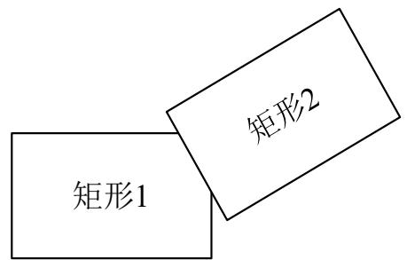

<details>
<summary>text_image</summary>

矩形1
矩形2
</details>

(a) 两矩形交叠一

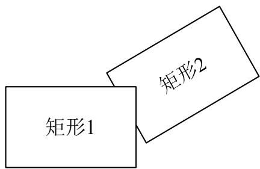

<details>
<summary>text_image</summary>

矩形1
矩形2
</details>

(b) 两矩形交叠二

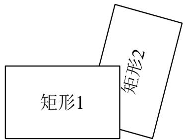

<details>
<summary>text_image</summary>

矩形1
矩形2
</details>

(c) 两矩形交叠三

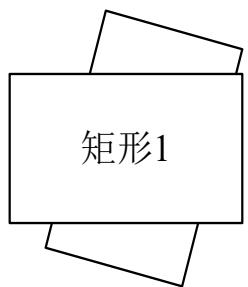

<details>
<summary>text_image</summary>

矩形1
</details>

(d) 两矩形贯穿   
图3-2 矩形碰撞位置关系

（2）单圆近似车体轮廓 在使用单圆法近似车体轮廓时，该方法采用一个圆形来覆盖车辆的矩形近似边界框 ABCD。该圆的中心点位于位置 $P ( P _ { x } , P _ { y } )$ ，其大小由半径 $R _ { \mathrm { s } }$ 决定，具体可参考图 3-3。圆心坐标 $P ( P _ { x } , P _ { y } )$ 和半径 $R _ { \mathrm { s } }$ 分别如式(3-13)和式(3-14)所示。

$$
P = \left(P _ {x}, P _ {y}\right) = \left(x + \frac {1}{2} \left(L _ {w} + L _ {f} - L _ {r}\right) \cdot \cos \varphi , y + \frac {1}{2} \left(L _ {w} + L _ {f} - L _ {r}\right) \cdot \sin \varphi\right) \tag {3-13}
$$

$$
R _ {\mathrm{s}} = \frac {1}{2} \sqrt {(L _ {\mathrm{f}} + L _ {\mathrm{w}} + L _ {\mathrm{r}}) ^ {2} + (L _ {\mathrm{b}}) ^ {2}} \tag {3-14}
$$

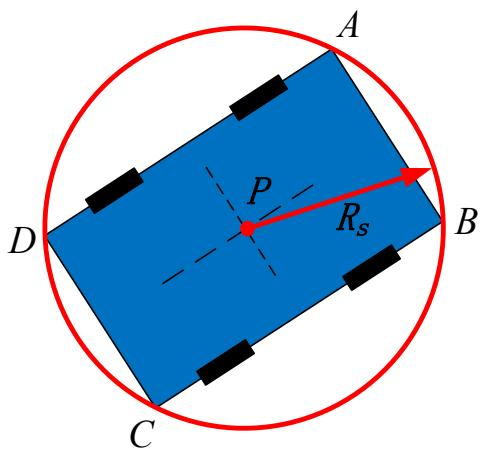

<details>
<summary>text_image</summary>

A
P
Rs
B
D
C
</details>

图3-3 单圆近似车体轮廓

（3）双圆近似车体轮廓 采用双圆近似车体轮廓时，该方法将车辆的矩形近似边界框 ABCD 沿长度方向均分为两个相同大小的部分，并分别用圆形拟合。这两个圆的中心点分别位于 $P _ { r } ( P _ { r x } , P _ { r y } )$ 和 $P _ { f } ( P _ { f x } , P _ { f y } )$ ，半径均为 $R _ { d }$ ，具体可参见图3-4。圆心 $P _ { r } ( P _ { r x } , P _ { r y } )$ 和 $P _ { f } ( P _ { f x } , P _ { f y } )$ 以及半径 $R _ { d }$ 如式(3-15)、式(3-16)和式(3-17)所示。

$$
P _ {r} = \left(P _ {r x}, P _ {r y}\right) = \left(x + \frac {1}{4} \left(L _ {w} + L _ {f} - 3 L _ {r}\right) \cdot \cos \varphi , y + \frac {1}{4} \left(L _ {w} + L _ {f} - 3 L _ {r}\right) \cdot \sin \varphi\right) \tag {3-15}
$$

$$
P _ {f} = \left(P _ {f x}, P _ {f y}\right) = \left(x + \frac {1}{4} \left(3 L _ {w} + 3 L _ {f} - L _ {r}\right) \cdot \cos \varphi , y + \frac {1}{4} \left(3 L _ {w} + 3 L _ {f} - L _ {r}\right) \cdot \sin \varphi\right) (3 - 1 6)
$$

$$
R _ {\mathrm{d}} = \frac {1}{2} \sqrt {\left(\frac {L _ {\mathrm{f}} + L _ {\mathrm{w}} + L _ {\mathrm{r}}}{2}\right) ^ {2} + \left(L _ {\mathrm{b}}\right) ^ {2}} \tag {3-17}
$$

综合考虑上述三种车辆轮廓近似模型，本文将选取双圆法近似自车的车辆轮廓，对于其他障碍车将选取方向包围盒矩形作为轮廓近似模型。因为自动驾驶车辆主要工作于城区结构化道路驾驶环境中，车辆行驶速度通常处于中高速范围。采用双圆法不仅能保证计算简洁性，还能更准确地描述车辆外形特征，并适当预留安全裕度，以降低高速行驶时的碰撞风险。

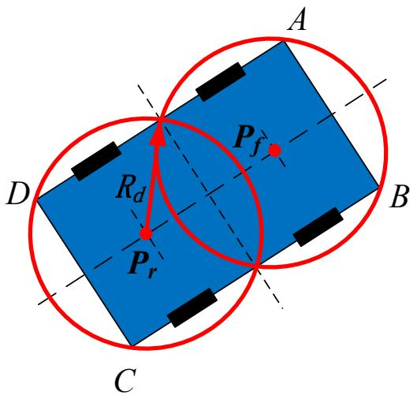

<details>
<summary>text_image</summary>

A
Pf
Rd
Pr
D
B
C
</details>

图3-4 双圆近似车体轮廓

# 3.2.2 点与矩形碰撞检测

矩形车体轮廓有轴对齐包围盒（Axis-Aligned Bounding Box，AABB）和方向包围盒（Oriented Bounding Box，OBB）两种模型，具体如图 3-5 所示。两模型最直接的区别是OBB 把车辆航向角考虑在内，能更精确的描述车体的外形轮廓，没有额外的冗余空间。AABB 模型的轮廓边界是与坐标轴平行的最小包围盒，其边界由车体外轮廓标点的最小值和最大确定。AABB 模型的边界始终与坐标轴对齐，当车辆存在一定航向角时，会导致存在较大的冗余空间。但对于 AABB 模型的碰撞检测相对简单，计算效率较高，适合实时性要求较高的应用。只需对 AABB 边界范围进行快速重叠检查即可，具体而言，若点 P(x,y)的横、纵坐标与 AABB 横纵坐标同时交叠时，即 $x \in [ x _ { \operatorname* { m i n } } , x _ { \operatorname* { m a x } } ] \& y \in [ y _ { \operatorname* { m i n } } , y _ { \operatorname* { m a x } } ]$ ，则说明此时点 P 在车体轮廓内部。

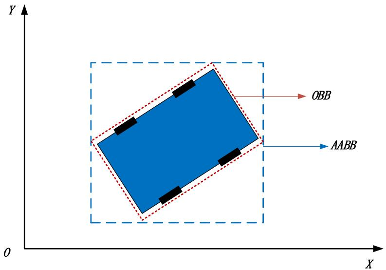

<details>
<summary>text_image</summary>

Y
OBB
AABB
X
O
</details>

图 3-5 AABB 与 OBB 模型

而对于OBB 模型而言，它依据车辆的航向角方向生成最小外包矩形。在此过程中不要求 OBB 模型的边界坐标轴对齐，OBB 模型的朝向严格与车辆航向角的实际方向保持一致。OBB 能够紧密地包围车辆车体，具有较高的碰撞检测精度。因此对于静态、动态障碍物本文将采用 OBB 矩形作为轮廓近似模型，以提高碰撞检测的精度。常见的碰撞检测方法有面积法、向量法和分离轴等，其中面积法在二维平面内具有较高的计算效率。下面将详细地介绍基于面积法的碰撞检测算法。

面积法是一种基于重叠区域面积变化的碰撞检测方法，核心思想是：对于平面内任意一点 $P ( x , y )$ ，当其处于矩形区域之外时，该点与矩形各顶点连线所形成的一系列三角形面积总和，必定大于原矩形的面积值。反之点 $P ( x , y )$ 在矩形边上或内部。为描述车辆外形，本研究将矩形边界框的四个顶点依次标记为 $A ( A _ { x } , A _ { y } )$ 、$B ( B _ { x } , B _ { y } )$ 、 $C ( C _ { x } , C _ { y } )$ 和 $D ( D _ { x } , D _ { y } )$ （顺时针排列）。基于车辆几何特征，各顶点的具体坐标可表示为：

$$
\left\{ \begin{array}{l} \left(A _ {x}, A _ {y}\right) = \left(x + \left(L _ {w} + L _ {f}\right) \cdot \cos \varphi - 0. 5 L _ {b} \cdot \sin \varphi , y + \left(L _ {w} + L _ {f}\right) \cdot \sin \varphi + 0. 5 L _ {b} \cdot \cos \varphi\right) \\ \left(B _ {x}, B _ {y}\right) = \left(x + \left(L _ {w} + L _ {f}\right) \cdot \cos \varphi + 0. 5 L _ {b} \cdot \sin \varphi , y + \left(L _ {w} + L _ {f}\right) \cdot \sin \varphi - 0. 5 L _ {b} \cdot \cos \varphi\right) \\ \left(C _ {x}, C _ {y}\right) = \left(x - L _ {r} \cdot \cos \varphi + 0. 5 L _ {b} \cdot \sin \varphi , y - L _ {r} \cdot \sin \varphi - 0. 5 L _ {b} \cdot \cos \varphi\right) \\ \left(D _ {x}, D _ {y}\right) = \left(x - L _ {r} \cdot \cos \varphi - 0. 5 L _ {b} \cdot \sin \varphi , y - L _ {r} \cdot \sin \varphi + 0. 5 L _ {b} \cdot \cos \varphi\right) \end{array} \right. \tag {3-18}
$$

如图3-6所示，当点??位于矩形ABCD之外时，其位置关系可通过以下数学表达式描述：

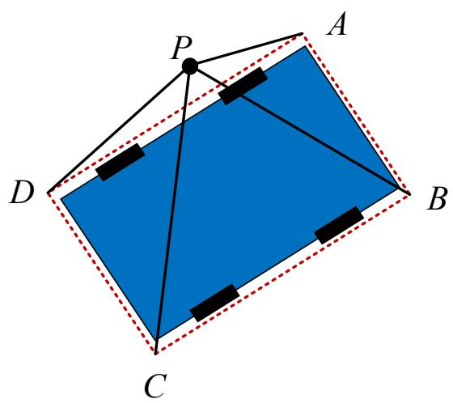

<details>
<summary>text_image</summary>

P
A
D
B
C
</details>

(a) 点在矩形外部

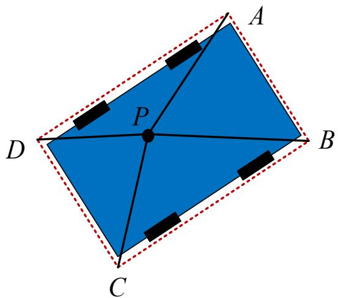

<details>
<summary>text_image</summary>

A
P
D
B
C
</details>

(b) 点在矩形内部  
图3-6 点与矩形位置关系

$$
S _ {\Delta \mathrm{PAB}} + S _ {\Delta \mathrm{PAB}} + S _ {\Delta \mathrm{PAB}} + S _ {\Delta \mathrm{PAB}} > S _ {\square \mathrm{ABCD}} \tag {3-19}
$$

上述表达式可转换为向量形式表示如下：

$$
\frac {1}{2} \left(\left| \overrightarrow {A P} \times \overrightarrow {A B} \right| + \left| \overrightarrow {B P} \times \overrightarrow {B C} \right| + \left| \overrightarrow {C P} \times \overrightarrow {C D} \right| + \left| \overrightarrow {D P} \times \overrightarrow {D A} \right|\right) > (L _ {\mathrm{f}} + L _ {\mathrm{w}} + L _ {\mathrm{r}}) \cdot L _ {\mathrm{b}} \tag {3-20}
$$

通过将矩形近似车体轮廓的四个顶点坐标分别带入式(3-20)中，即可判断车辆轨迹各点位置是否发生碰撞。

# 3.3 时空安全走廊构建方式

至此，对于碰撞躲避约束形式可转化为点 $P _ { r } ( P _ { r x } , P _ { r y } )$ 和点 $P _ { f } ( P _ { f x } , P _ { f y } )$ 与周围障碍物至少保持 $R _ { d }$ 距离。下文将给出点 $P _ { r } ( P _ { r x } , P _ { r y } )$ 和点 $P _ { f } ( P _ { f x } , P _ { f y } )$ 的取值范围[60,61]，如式(3-21)所示，使得“点 $P _ { r } ( P _ { r x } , P _ { r y } )$ 和点 $P _ { f } ( P _ { f x } , P _ { f y } )$ 与周围障碍物至少保持 $R _ { d }$ 距离”条件成立。那么式(3-21)可完全替换最优化问题中的碰撞躲避约束式(3-11)。

$$
x _ {r \_ l b \_ k} \leq x r _ {k} \leq x _ {r \_ u b \_ k}
$$

$$
y _ {r \_ l b \_ k} \leq y r _ {k} \leq y _ {r \_ u b \_ k} \tag {3-21}
$$

$$
x _ {f \_ l b \_ k} \leq x f _ {k} \leq x _ {f \_ u b \_ k}
$$

$$
y _ {f \_ l b \_ k} \leq y f _ {k} \leq y _ {f \_ u b \_ k}
$$

时空安全走廊有轴向对齐包围盒（AABB）与有向包围盒（OBB）两种生成方式，图3-7展示了两种生成时空安全走廊的区别。与矩形近似车体轮廓类似，这两种时空走廊生成方式的核心差异主要体现在是否把自车航向角的差异考虑在内。其中，OBB 生成时空走廊的方式虽然具有更高的检测精度和空间利用效率，但其构建过程较为复杂，且计算成本较高。该模型能够有效保证安全空间的充分利用，并为后续优化问题提供更大可用的解空间，因此更适用于道路曲率大或道路狭窄等精度要求比较高的场景。相比之下，AABB 生成时空走廊的过程相对简便、扩展操作高效，且在膨胀过程中的碰撞检测计算复杂度较低，在实际工程应用中更为普遍。虽然该模型未考虑自车航线角信息，但其在城区结构化道路、城快速路等场景普遍适用。本文时空安全走廊的构建方式将采用 AABB 模型。

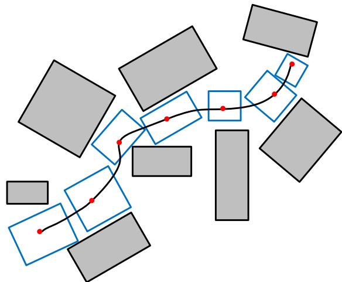

<details>
<summary>flowchart</summary>

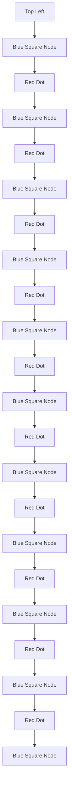
```mermaid
graph TD
    A["Top Left"] --> B["Blue Square Node"]
    B --> C["Red Dot"]
    C --> D["Blue Square Node"]
    D --> E["Red Dot"]
    E --> F["Blue Square Node"]
    F --> G["Red Dot"]
    G --> H["Blue Square Node"]
    H --> I["Red Dot"]
    I --> J["Blue Square Node"]
    J --> K["Red Dot"]
    K --> L["Blue Square Node"]
    L --> M["Red Dot"]
    M --> N["Blue Square Node"]
    N --> O["Red Dot"]
    O --> P["Blue Square Node"]
    P --> Q["Red Dot"]
    Q --> R["Blue Square Node"]
    R --> S["Red Dot"]
    S --> T["Blue Square Node"]
    T --> U["Red Dot"]
    U --> V["Blue Square Node"]
```
</details>

(a) OBB 时空走廊

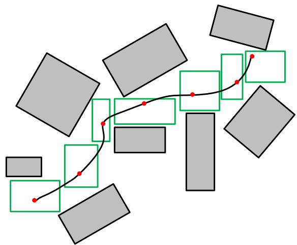

<details>
<summary>natural_image</summary>

Abstract geometric diagram with gray squares, green squares, and red dots connected by a black line (no text or symbols)
</details>

(b) AABB 时空走廊   
图3-7 OBB 时空走廊与AABB 时空走廊对比图

前序生成的决策轨迹是构建时空走廊的基础，现以决策轨迹中第 k 个轨迹点为例，详细阐述时空走廊的生成方式。首先集合 V 表示周围动态障碍物的预测轨迹上时间 $t = t _ { k }$ 时刻所在位置、静态障碍物位置以及道路边沿散点的全体集合。为确保时空走廊的构建过程符合规范，然后以点 $P _ { r } ( P _ { r x } , P _ { r y } )$ 为中心，沿着 X 轴和 Y 轴的正负方向分别扩展 $R _ { d }$ 距离，形成一个以 $P _ { r } ( P _ { r x } , P _ { r y } )$ 为几何中心、边长为 $2 R _ { d }$ 的矩形区域，如图3-8(a)所示。如果该矩形与集合 V中的任何元素重叠，则时空走廊的构建失败；若无重叠，安全走廊的构建则继续进行。接下来，按照顺时针方向，依次沿矩形的四条边扩展 ，直至扩展部分与集合 V 中的元素发生碰撞，如图3-8(b)所示。将序号由小到大探索各个局部区域是否和集合 V发生碰撞，如果未发生碰撞，则此次扩展视为有效，将该部分区域纳入时空安全区域。否则认为该方向是危险区域，停止对该方向继续拓展。在四个方向均终止拓展后得到的矩形，如图3-8(c)所示。最后，基于该矩形四周向中心收紧 $R _ { d }$ 长度得到最后 $P _ { r } ( P _ { r x } , P _ { r y } )$ 的时空安全走廊的取值范围，如图3-8(d)所示。

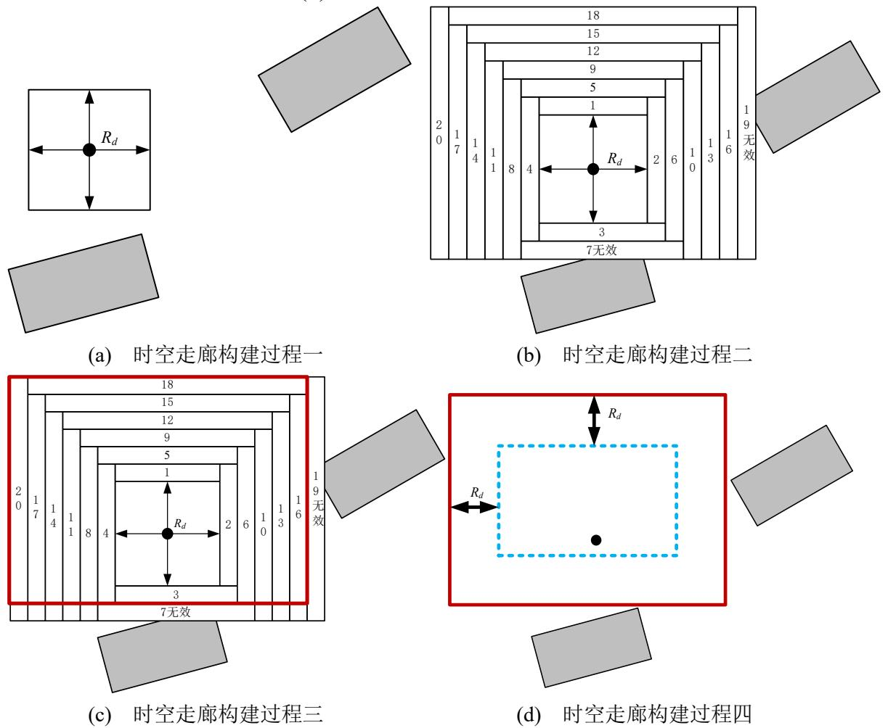  
图3-8 时空走廊构建方式

为了进一步验证所提出的时空安全走廊的合理性和有效性，选取具有全局中心线的结构化道路作为验证场景，包含静态障碍物以动态障碍物参与，实验结果如图3-9所示。图中灰色直线是道路左右边界，黑色粗线是道路中心参考线，绿色线条是自车的形式轨迹，蓝色矩形框是自车构建的时空安全走廊。从图可知，靠近道路中心线的紫色车是静止的，道路中心线右侧的粉色车以及横穿的小矩形块都是动态障碍物。从实验结果可看出基于决策轨迹可以安全合理地构建时空走廊，且时空走廊均未与环境中静态、动态障碍物以及道路边界发生碰撞交叠的情况。

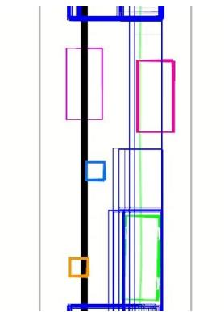

<details>
<summary>natural_image</summary>

Pure architectural floor plan lines without any text, numbers, or symbols
</details>

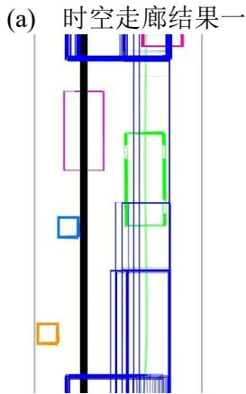

<details>
<summary>text_image</summary>

(a) 时空走廊结果一
</details>

(c) 时空走廊结果三

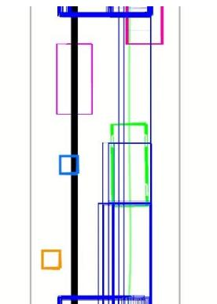

<details>
<summary>natural_image</summary>

Pure architectural floor plan lines without any text, numbers, or symbols
</details>

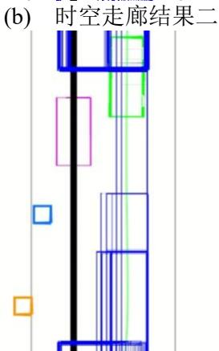

<details>
<summary>text_image</summary>

(b) 时空走廊结果二
</details>

(d) 时空走廊结果四   
图3-9 时空走廊构建结果

# 3.4 算法验证与分析

为验证第二章以及本章所提出的时空联合轨迹决策和轨迹规划算法的可行性和有效性，本小节通过在MATLAB 平台构建仿真场景对决策和规划算法进行开环可行性验证。在 MATLAB 平台内搭建一个单向通行的双车道场景，车道总长为 180米，双车道总宽为7 米，用以模拟日常较为常见的城市结构化道路环境。在该仿真场景内，会随机生成多辆交通参与车辆，来模拟实际驾驶过程中可能遇到的不同交通状况。本次仿真实验共设计了两种工况，以全面评估本文所提算法在不同交通场景下的可行性。在工况 1中，仿真场景共有 4辆交通参与车辆，以模拟道路通畅时的行车环境，用于验证算法在低交通密度条件下的轨迹规划能力。在工况 2 中交通参与车辆增加至8 辆，模拟复杂、拥堵的交通场景，以进一步测试算法在高密度交通环境中的有效性。

针对上述两种仿真场景，本文所提出的时空联合轨迹决策和轨迹规划算法均能较好地规划出通行效率高、且无碰撞风险的行驶轨迹，仿真结果如图 3-10、图3-11 和图 3-12 所示。下面将从通行效率、碰撞风险和行驶轨迹的平滑性多个角度对仿真结果进行分析。

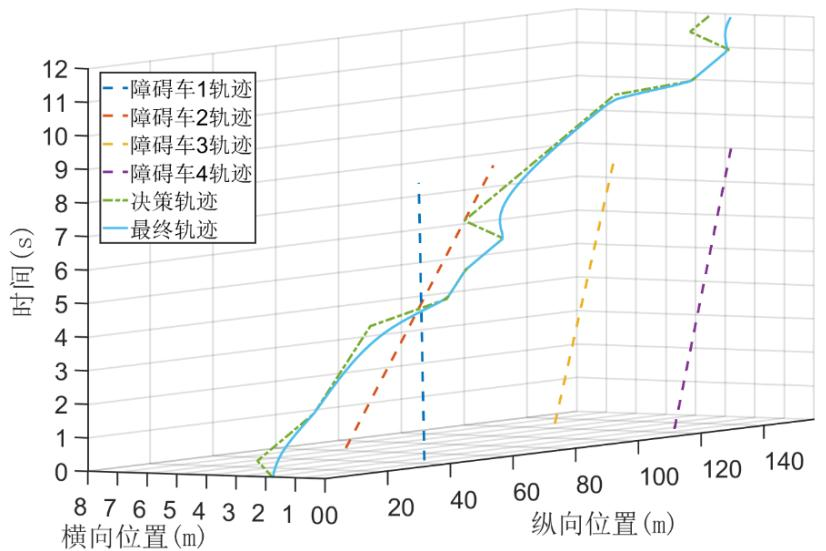

<details>
<summary>line</summary>

| 纵向位置 (m) | 障碍车1轨迹 (s) | 障碍车2轨迹 (s) | 障碍车3轨迹 (s) | 障碍车4轨迹 (s) | 决策轨迹 (s) | 最终轨迹 (s) |
| ------------ | ---------------- | ---------------- | ---------------- | ---------------- | ------------ | ------------ |
| 0            | 0                | 0                | 0                | 0                | 0            | 0            |
| 20           | 8                | 5                | 5                | 5                | 5            | 5            |
| 40           | 9                | 7                | 7                | 7                | 7            | 7            |
| 60           | 10               | 8                | 8                | 8                | 8            | 8            |
| 80           | 11               | 9                | 9                | 9                | 9            | 9            |
| 100          | 11.5             | 10               | 10               | 10               | 10           | 10           |
| 120          | 12               | 11               | 11               | 11               | 11           | 11           |
| 140          | 12               | 12               | 12               | 12               | 12           | 12           |
</details>

(a) 工况1三维轨迹

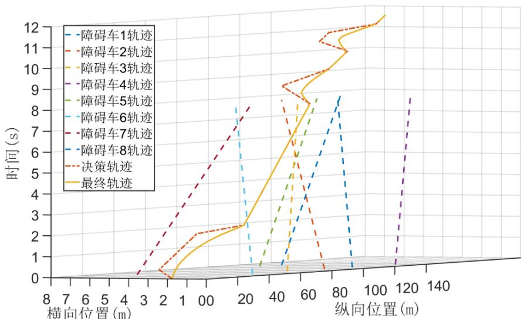

<details>
<summary>line</summary>

| 横向位置 (m) | 障碍车1轨迹 | 障碍车2轨迹 | 障碍车3轨迹 | 障碍车4轨迹 | 障碍车5轨迹 | 障碍车6轨迹 | 障碍车7轨迹 | 障碍车8轨迹 | 决策轨迹 | 最终轨迹 |
| ------------ | ------------ | ------------ | ------------ | ------------ | ------------ | ------------ | ------------ | ------------ | -------- | --------- |
| 0            | 0            | 0            | 0            | 0            | 0            | 0            | 0            | 0            | 0        | 0         |
| 20           | 0            | 0            | 0            | 0            | 0            | 8            | 2.5          | 0            | 0        | 2.5       |
| 40           | 0            | 0            | 0            | 0            | 0            | 0            | 9            | 4            | 0        | 5         |
| 60           | 0            | 0            | 0            | 0            | 8            | 0            | 9            | 6            | 4        | 9         |
| 80           | 9            | 0            | 0            | 0            | 0            | 0            | 11           | 8            | 11       | 11        |
| 100          | 12           | 12           | 12           | 12           | 12           | 12           | 12           | 12           | 12       | 12        |
| 120          | 12           | 12           | 12           | 12           | 12           | 12           | 12           | 12           | 12       | 12        |
| 140          | 12           | 12           | 12           | 12           | 12           | 12           | 12           | 12           | 12       | 12        |
</details>

(b) 工况2 三维轨迹  
图 3-10 三维轨迹图

图 3-10 是自车和其他交通参与车辆的三维时空轨迹图，图中彩色虚线是交通参与车辆在三维空间内的行驶轨迹，点画线是自车经三维动态规划的决策轨迹，而实线则是自车经优化后的最终行驶轨迹。从彩色虚线在三维坐标系内的斜率可知，交通参与车辆都是匀速向前的动态障碍物。自车在两种不同工况下，均能有效躲避周围动态障碍车辆，安全合理地到达设置的规划目标点。反映在图 3-10 中，自车最终的行驶轨迹曲线与障碍车辆的行驶轨迹曲线均无交点。实验结果可充分验证本文所提算法的有效性和可行性。

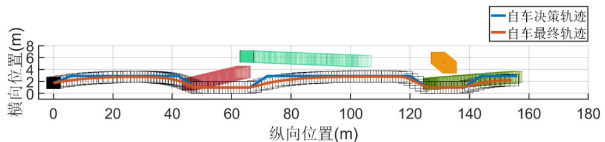

<details>
<summary>line</summary>

| 纵向位置(m) | 自车决策轨迹 | 自车最终轨迹 |
| ----------- | ------------ | ------------ |
| 0           | 2.5          | 2.0          |
| 20          | 3.0          | 2.5          |
| 40          | 2.8          | 2.3          |
| 60          | 2.0          | 1.5          |
| 80          | 3.5          | 3.0          |
| 100         | 3.2          | 3.0          |
| 120         | 2.5          | 2.3          |
| 140         | 3.0          | 2.8          |
| 160         | 3.5          | 3.2          |
| 180         | 3.0          | 2.8          |
</details>

(a) 工况1 自车轨迹  
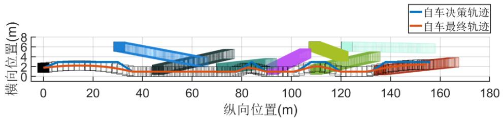

<details>
<summary>area</summary>

| 纵向位置(m) | 横向位置(m) - 自车决策轨迹 | 横向位置(m) - 自车最终轨迹 |
| ----------- | -------------------------- | -------------------------- |
| 0           | 2                          | 2                          |
| 20          | 3                          | 2                          |
| 40          | 7                          | 2                          |
| 60          | 4                          | 2                          |
| 80          | 5                          | 2                          |
| 100         | 3                          | 3                          |
| 120         | 4                          | 4                          |
| 140         | 3                          | 3                          |
| 160         | 4                          | 4                          |
| 180         | 4                          | 4                          |
</details>

(b) 工况 2自车轨迹  
图 3-11 仿真结果自车轨迹

图 3-11 是自车和其他动态障碍车辆的轨迹幻影图，从图中可直接看出自车决策轨迹和最终行驶轨迹的前后差异。图中黑色矩形框代表自车最终的运动轨迹，其他颜色的矩形框表示动态障碍车辆的运动轨迹。蓝色实线是基于三维动态规划求解得到的初始决策轨迹，橘色实线是经过数值优化后得到的最终轨迹。从图中蓝色曲线和橘色曲线对比可以看出，轨迹规划求解过程中，由于引入了车辆运动学约束、车辆机械约束和碰撞躲避等约束条件，最终轨迹相比决策轨迹在行驶舒适性和轨迹平滑性方面均有所提升。

图3-12是自车在两种工况下的速度变化曲线。从速度曲线变化趋势可以看出，本文的决策、规划算法在低密度和高密度交通环境下，均能够充分考虑动态障碍车的预测信息，动态调整自车的行驶速度，规划出一条车速合理且无碰撞的轨迹。自适应调整的自车车速可有效保证在不同场景下的通行效率和行车安全性。

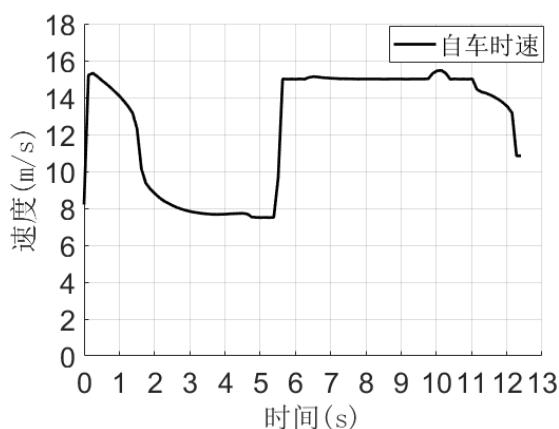

<details>
<summary>line</summary>

| 时间 (s) | 自车时速 (m/s) |
| -------- | -------------- |
| 0        | 15.0           |
| 1        | 13.0           |
| 2        | 9.0            |
| 3        | 8.0            |
| 4        | 8.0            |
| 5        | 8.0            |
| 6        | 15.0           |
| 7        | 15.0           |
| 8        | 15.0           |
| 9        | 15.0           |
| 10       | 15.0           |
| 11       | 14.5           |
| 12       | 13.0           |
| 13       | 10.5           |
</details>

(a) 工况1 自车车速

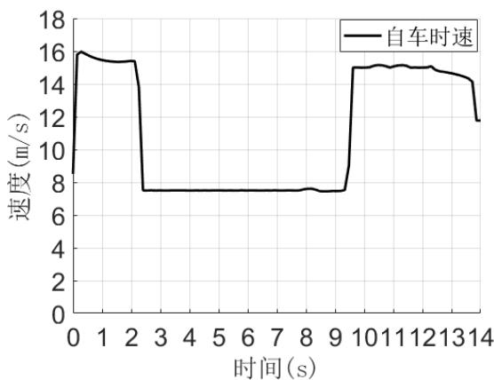

<details>
<summary>line</summary>

| 时间 (s) | 自车时速 (m/s) |
| -------- | -------------- |
| 0        | 8              |
| 1        | 16             |
| 2        | 16             |
| 3        | 8              |
| 4        | 8              |
| 5        | 8              |
| 6        | 8              |
| 7        | 8              |
| 8        | 8              |
| 9        | 8              |
| 10       | 15             |
| 11       | 15             |
| 12       | 15             |
| 13       | 14             |
| 14       | 12             |
</details>

(b) 工况2 自车车速  
图3-12 自车速度曲线

综上可知，无论是在道路通畅的仿真场景下，还是复杂拥堵的仿真场景下，本文所提出的轨迹决策和轨迹规划算法均能成功规划出安全无碰撞、可行合理的最终行驶轨迹。且基于时空联合的轨迹决策算法能够随动态障碍物实时调整自车的行驶速度。轨迹经数值优化后，相比于决策轨迹，在平滑性和舒适性等方面都有所提升。本文所提算法在不同交通环境下均具有良好的可行性，为后续决策-规划-控制闭环实验奠定了基础。

# 3.5 本章小结

本章将轨迹规划问题建模为标准的最优控制问题，并分别给出优化目标函数及相应约束条件。本文约束条件包括车辆运动学约束、车辆机械约束、边界约束和碰撞躲避约束，其中，针对车辆运动学的微分约束，采用向前欧拉离散化将其转化为等式约束。而对于碰撞躲避这一非线性因素，通过构建时空安全走廊实现线性化处理。最后，通过仿真平台对第二章和本章提出的三维空间轨迹决策算法和规划算法进行可行性验证。实验结果表明，基于三维动态规划的轨迹决策可动态调整自车车速。轨迹经数值优化后，质量有所提升。本文所提算法能稳定生成安全可行的行驶轨迹。

# 第4章 基于 MPC 的跟踪控制算法研究

轨迹跟踪控制是无人驾驶系统的底层执行模块，根据车辆当前的运动状态，使得自车能够准确、稳定地沿上层规划轨迹行驶。首先，提出横向 MPC，纵向 PID的控制策略，并推导车辆二自由度动力学误差模型。然后，分别阐述横向控制器和纵向控制器的具体设计方案。最后，在仿真实验平台上，针对双移线和变道两种典型工况进行仿真测试。

# 4.1 跟踪控制器设计方案

自动驾驶车辆属于典型的非线性系统，其动态响应会随着运行环境的变化而明显不同。为提升自动驾驶车辆轨迹跟踪的控制精度和鲁棒性，本研究设计一种横向基于模型预测控制，纵向基于比例-积分-微分控制的轨迹跟踪控制器[77]，具体架构见图4-1。针对横向控制器，运用模型预测控制优化调整前轮转角，从而增强自车稳定性和路径跟随准确度。针对纵向控制器，通过比例-积分-微分控制器结合驱动/制动力矩标定，动态调整所需的加速或刹车力度，以实现对纵向位置和车速的精准调控，能有效降低行驶轨迹与参考轨迹之间的误差。

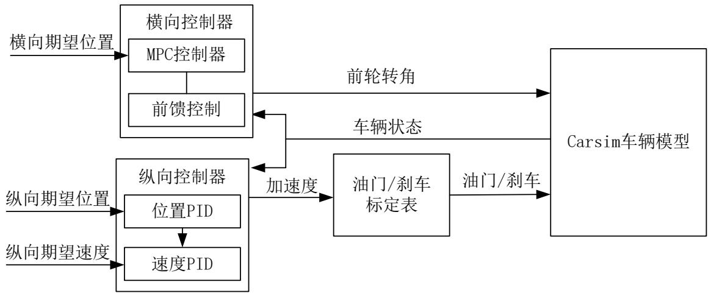

<details>
<summary>flowchart</summary>

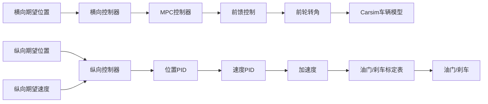
```mermaid
graph LR
    A["横向期望位置"] --> B["横向控制器"]
    B --> C["MPC控制器"]
    C --> D["前馈控制"]
    D --> E["前轮转角"]
    E --> F["Carsim车辆模型"]
    G["纵向期望位置"] --> H["纵向控制器"]
    H --> I["位置PID"]
    I --> J["速度PID"]
    J --> K["加速度"]
    K --> L["油门/刹车标定表"]
    L --> M["油门/刹车"]
    N["纵向期望速度"] --> H
```
</details>

图4-1 跟踪控制器总体方案

# 4.2 车辆动力学跟踪误差模型

# 4.2.1 二自由度动力学模型

为提升轨迹跟踪的控制精度与鲁棒性，本文选用考虑轮胎侧偏力的二自由度车辆动力学模型，如图4-2所示。系统的动态特性可通过以下微分方程描述：

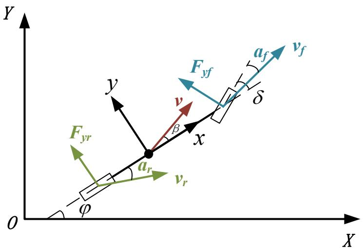

<details>
<summary>text_image</summary>

Y
Fyf
af
vf
y
v
β
x
δ
Fyr
ar
vr
φ
O
X
</details>

图4-2 二自由度车辆运动学模型

$$
\left\{ \begin{array}{l} m \left(\dot {v} _ {y} + v _ {x} \dot {\varphi}\right) = F _ {y f} \cos \delta + F _ {y r} \\ I _ {z} \ddot {\varphi} = a \cdot F _ {y f} \cos \delta - b \cdot F _ {y r} \end{array} \right. \tag {4-1}
$$

式中 、 $\delta$ ——分别为汽车质量（kg）、车辆前轮转角（rad）

$\nu _ { x }$ 、 $\dot { \nu } _ { _ { y } }$ — 分别为车辆纵向速度（m/s）、车辆横向加速度 $( \mathrm { m } / \mathrm { s } ^ { 2 } )$ ）；

$F _ { y f }$ 、 $a$ ——分别为前轮胎的侧偏力（N）、车辆质心到前轴的距离（m）；

$F _ { y r }$ 、 ——分别为后轮胎的侧偏力（N）、车辆质心到后轴的距离（m）；

$I _ { z }$ 、 $\ddot { \varphi }$ ——分别为z轴的旋转惯量 $( \mathbf { k g } \cdot \mathbf { m } ^ { 2 } )$ ）、横摆角加速度 $( \mathrm { r a d } / \mathrm { s } ^ { 2 } )$ ）。

上述模型是非线性模型，为简化控制器的设计，可对上述模型进行合理地线性简化近似。一般而言，车辆轮胎的侧滑角不超过 $6 ^ { \circ }$ ，因此对前轮偏转角的三角函数有如下近似 $\sin \delta = 0 , \cos \delta = 1$ 。前后轮胎所受的侧向力与其侧偏角之间可近似用线性方程表示，具体关系参见公式(4-2)。

$$
F _ {y f} = C _ {\alpha f} \alpha_ {f} \tag {4-2}
$$

$$
F _ {y r} = C _ {\alpha r} \alpha_ {r}
$$

式中 $C _ { \alpha f }$ Caf 车辆前轮胎的侧偏刚度（N/rad）；

$\alpha _ { f }$ — 车辆前轮胎的侧偏角（rad）；

$C _ { \alpha r }$ C 车辆后轮胎的侧偏刚度（N/rad）；

$\alpha _ { r }$ — 车辆后轮胎的侧偏角（rad）。

当轮胎侧偏角度不大时，采用线性化轮胎模型可以获得较精确的近似值。基于小角度近似原理，可计算出汽车前后轮侧偏角的表达式如下：

$$
\alpha_ {f} = \frac {\dot {\varphi} a + v _ {y}}{v _ {x}} - \delta \tag {4-3}
$$

$$
\alpha_ {r} = \frac {v _ {y} - \dot {\varphi} b}{v _ {x}}
$$

联合公式(4-2)、公式(4-3)带入公式(4-1)最后整理为矩阵形式有：

$$
\left[ \begin{array}{l} \ddot {y} \\ \ddot {\varphi} \end{array} \right] = \left[ \begin{array}{c c} \frac {C _ {\alpha f} + C _ {\alpha r}}{m v _ {x}} & \frac {a C _ {\alpha f} - b C _ {\alpha r}}{m v _ {x}} - v _ {x} \\ \frac {a C _ {\alpha f} - b C _ {\alpha r}}{I v _ {x}} & \frac {a ^ {2} C _ {\alpha f} + b ^ {2} C _ {\alpha r}}{I v _ {x}} \end{array} \right] \left[ \begin{array}{l} \dot {y} \\ \dot {\varphi} \end{array} \right] + \left[ \begin{array}{c} - \frac {C _ {\alpha f}}{m} \\ - \frac {a C _ {\alpha f}}{I} \end{array} \right] \delta \tag {4-4}
$$

# 4.2.2 跟踪误差模型

跟踪误差模型通常用于自动驾驶的轨迹跟踪控制。本文跟踪误差模型将选取横向距离偏差 $e _ { d }$ 、航向偏差 $e _ { \varphi }$ 、横向距离偏差对时间的导数 ${ \dot { e } } _ { d }$ 和航向偏差对时间的导数 $\dot { e } _ { \varphi }$ 为状态量。其中车辆在 Frenet 道路坐标系的横向位置误差 $e _ { d }$ 表示车辆与投影点的直线欧式距离，而车辆在 Frenet 道路坐标系的方向偏差 $e _ { \varphi }$ 则是车身轴线与投影点处参考轨迹切线形成的夹角。这种定义方式能够准确反映实际行驶轨迹与预期路径之间的差异。为关联车辆动力学模型式(4-4)，有必要将航向角 调整为横摆角 $\varphi$ 。考虑到两者实际并不相等，因此系统最终会产生 $- \beta$ 的稳定误差。

车辆在 Frenet 道路坐标系的横向位置误差 $e _ { d }$ 和航向偏差 $e _ { \varphi }$ 分别对时间 t 求导可得：

$$
\dot {e} _ {d} = v _ {x} e _ {\varphi} + v _ {y} \tag {4-5}
$$

$$
\dot {e} _ {\varphi} = \dot {\varphi} - \dot {\theta} _ {r} \tag {4-6}
$$

假设车身坐标系的纵向加速度 $a _ { x }$ 为0，即 $\dot { \nu } _ { x } = 0$ 。此时对横向误差 $e _ { d }$ 和航向偏差 $e _ { \varphi }$ 分别对时间 t 求二阶导可得，同时忽略参考轨迹 对时间 t 的二阶导数，即$\ddot { \theta } = 0$ ，可得如下形式：

$$
\ddot {e} _ {d} = v _ {x} \dot {e} _ {\varphi} + \dot {v} _ {y} \tag {4-7}
$$

$$
\ddot {e} _ {\varphi} = \ddot {\varphi} \tag {4-8}
$$

将式(4-5)\~式(4-8)代入到车辆二自由度动力学模型式(4-4)中，整理可得车辆在Frenet 道路坐标系的横向位置误差 $e _ { d }$ 和航向偏差 $e _ { \varphi }$ 对时间的一阶导数和二阶导数，具体表达为：

$$
\left\{ \begin{array}{l} \dot {e} _ {d} = \dot {e} _ {d} \\ \dot {e} _ {\varphi} = \dot {e} _ {\varphi} \\ \ddot {e} _ {d} = \left(\frac {C _ {\alpha f} + C _ {\alpha r}}{m v _ {x}}\right) \dot {e} _ {d} + \left(- \frac {C _ {\alpha f} + C _ {\alpha r}}{m}\right) e _ {\varphi} + \left(\frac {a C _ {\alpha f} - b C _ {\alpha r}}{m v _ {x}}\right) \dot {e} _ {\varphi} + \left(\frac {a C _ {\alpha f} - b C _ {\alpha r}}{m v _ {x}} - v _ {x}\right) \dot {\theta} _ {r} + \left(- \frac {C _ {\alpha f}}{m}\right) \delta \\ \ddot {e} _ {\varphi} = \left(\frac {a C _ {\alpha f} - b C _ {\alpha r}}{I _ {z} v _ {x}}\right) \dot {e} _ {d} + \left(- \frac {C _ {\alpha f} - C _ {\alpha r}}{I _ {z}}\right) e _ {\varphi} + \left(\frac {a ^ {2} C _ {\alpha f} + b ^ {2} C _ {\alpha r}}{I _ {z} v _ {x}}\right) \dot {e} _ {\varphi} + \left(\frac {a ^ {2} C _ {\alpha f} + b ^ {2} C _ {\alpha r}}{I _ {z} v _ {x}}\right) \dot {\theta} _ {r} + \left(- \frac {a C _ {\alpha f}}{I _ {z}}\right) \delta \end{array} \right. \tag {4-9}
$$

式(4-9)可转换为状态空间矩阵，选取横向距离偏差 $e _ { d }$ 、航向偏差 $e _ { \varphi }$ 、横向距离偏差对时间的导数 ${ \dot { e } } _ { d }$ 和航向偏差对时间的导数 $\dot { e } _ { \varphi }$ 为状态量有如下形式：

$$
e \dot {r} r = A e r r + B u + C \dot {\theta} _ {r} \tag {4-10}
$$

式 中 ， $\begin{array} { r } { A = \left[ { \begin{array} { c c c c } { 0 } & { 1 } & { 0 } & { 0 } \\ { 0 } & { \displaystyle { \frac { C _ { \alpha f } + C _ { \alpha r } } { m v _ { x } } } } & { - \frac { C _ { \alpha f } + C _ { \alpha r } } { m } } & { \displaystyle { \frac { a C _ { \alpha f } - b C _ { \alpha r } } { m v _ { x } } } } \\ { 0 } & { 0 } & { 0 } & { 1 } \\ { 0 } & { \displaystyle { \frac { a C _ { \alpha f } - b C _ { \alpha r } } { I _ { z } \nu _ { x } } } } & { \displaystyle { - \frac { C _ { \alpha f } - C _ { \alpha r } } { I _ { z } } } } & { \displaystyle { \frac { a ^ { 2 } C _ { \alpha f } + b ^ { 2 } C _ { \alpha r } } { I _ { z } \nu _ { x } } } } \end{array} } \right] { \mathrm { ~ , ~ } } \quad B = \left[ { \begin{array} { c } { 0 } \\ { - \displaystyle { \frac { C _ { \alpha f } } { m } } } \\ { 0 } \\ { 0 } \\ { \displaystyle { - \frac { a C _ { \alpha f } } { I _ { z } \nu _ { x } } } } \end{array} } \right] { \mathrm { ~ , ~ } } } \end{array}$ aCaf1

$$
e r r = \left[ \begin{array}{c} e _ {d} \\ \dot {e} _ {d} \\ e _ {\varphi} \\ \dot {e} _ {\varphi} \end{array} \right], \quad C = \left[ \begin{array}{c} 0 \\ \frac {a C _ {\alpha f} - b C _ {\alpha r}}{m v _ {x}} - v _ {x} \\ 0 \\ \frac {a ^ {2} C _ {\alpha f} + b ^ {2} C _ {\alpha r}}{I _ {z} v _ {x}} \end{array} \right], \quad u = [ \delta ] 。
$$

# 4.3 横向控制器设计

横向控制器的功能是确保车辆沿着期望轨迹行驶，一般被控对象是车辆的前轮转角。MPC 具备较好的预测和优化能力，能综合考虑车辆实际约束条件，在复杂动态环境下有良好的跟踪控制精度。为更好地理解 MPC 在横向跟踪控制中的应用，首先介绍 MPC 的基本理论，然后再详细阐述基于 MPC 的横向跟踪控制器的具体设计方案。

# 4.3.1 MPC 理论基础

模型预测控制是一种基于系统模型的先进控制方法，广泛应用于工业过程控制、自动驾驶以及机器人控制等多个领域。图 4-3 展示了模型预测控制的系统架构。在该框架中，控制器基于预测时域内的系统状态信息，通过求解包含性能指标和约束条件的优化问题，实时计算出最优控制指令 $u ^ { * } ( t )$ ，即控制序列的首个执行量。MPC 的优势在于能够处理多变量系统、约束优化问题，并且具有较强的鲁棒性和自适应能力。其基本原理是利用系统模型对未来状态进行预测，并在每个控制周期内优化当前的控制输入，从而达到系统性能的最优控制。MPC 的核心主要包括模型预测、滚动优化和反馈矫正三个关键环节。

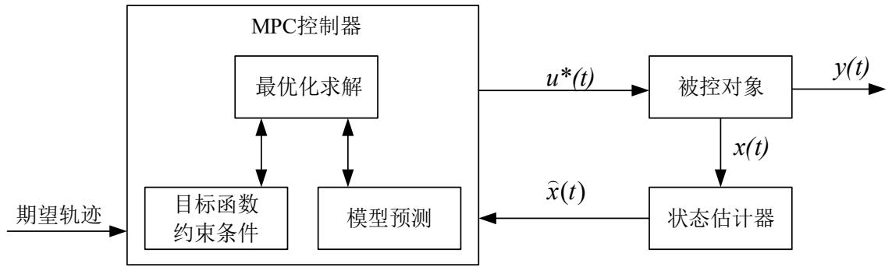

<details>
<summary>flowchart</summary>

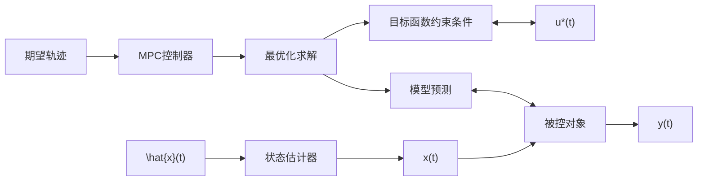
```mermaid
graph LR
    A["期望轨迹"] --> B["MPC控制器"]
    B --> C["最优化求解"]
    C --> D["目标函数约束条件"]
    C --> E["模型预测"]
    D <--> F["u*(t)"]
    E <--> G["被控对象"]
    G --> H["y(t)"]
    I["\hat{x}(t)"] --> J["状态估计器"]
    J --> K["x(t)"]
    K --> G
```
</details>

图 4-3 MPC 控制器原理

（1）模型预测 模型预测是模型预测控制的基础，能够在预测时域内对未来的状态量进行预测。具体来说，基于系统当前运行状况及控制指令，运用系统的数学模型预估未来某个时段内的状态变量与输出响应。其中系统的数学模型取决于被控对象，可以是线性的，也可以是非线性的。预测模型会直接影响 MPC 的控制效果与精度，因此对系统模型的精确建模是MPC 控制器设计中的重要一环。

（2）滚动优化 滚动优化是通过使某项性能指标最优来得到最优控制量，目标是通过优化算法在每一个控制周期内求解最优控制输入序列。MPC 通过定义一个目标函数，通常包括跟踪误差和控制输入量等。结合车辆自身状态约束条件，在预测时域内求解最优控制输入。与传统最优控制不同，MPC 采用在线滚动优化。即在每一个控制周期内只执行优化结果中的第一个控制输入，然后在下一个周期重新进行优化。这种滚动优化的方式使得 MPC 能够实时响应系统的变化，具有较高的控制精度和鲁棒性。

（3）反馈矫正 反馈校正的作用是减少因模型不准确或外部扰动导致的控制误差。为此模型预测控制在每个采样时刻都会采集系统真实输出数据，并将实测结果与预测结果进行对比分析，从而动态调整预测模型参数。反馈矫正机制使得MPC 能够在不确定性的情况下，依然保持良好的控制性能。反馈矫正能增强MPC对模型误差和外部扰动的容忍度。

MPC 通过模型预测、滚动优化和反馈矫正，实现对复杂系统的有效控制。模型预测控制基于精确的系统数学模型，具备较高的控制精度和鲁棒性，在工业控制和自动化领域得到了广泛应用。

# 4.3.2 MPC 横向控制器

为便于计算机求解，采用第三章所述的离散化方法（如式(3-4)、式(3-5)），将上述连续空间状态方程式(4-10)进行离散化处理，得到如下形式(4-11)。为描述方便，后文将仍沿用 、 符号表示经欧拉法离散后的系统矩阵 $\overline { { A } }$ 和控制矩阵 $\bar { B }$ 。

$$
\operatorname{err} (k + 1) = \bar {A} \operatorname{err} (k) + \bar {B} u (k) \tag {4-11}
$$

式中， $\overline { { { A } } } = ( I - \frac { A d t } { 2 } ) ^ { - 1 } ( I + \frac { A d t } { 2 } ) , \overline { { { B } } } = B d t$ Adt)(1+ ， 。

（1）预测模型 针对一个普通线性离散系统如式(4-11)，一般形式为$x ( k + 1 ) = A x ( k ) + B u ( k )$ 。此时 k 时刻，可通过状态方程预测计算出 N 个采样周期中的状态信息和控制序列，如下所示：

$$
\begin{array}{l} x (k \mid k) = x (k) = x _ {k} \\ x (k + 1 \mid k) = A x (k) + B u (k \mid k) = A x _ {k} + B u (k \mid k) \\ x (k + 2 \mid k) = A x (k + 1) + B u (k + 1 \mid k) = A ^ {2} x _ {k} + A B u (k \mid k) + B u (k + 1 \mid k) \tag {4-12} \\ \begin{array}{c} \bullet \\ \vdots \\ \bullet \end{array} \\ x (k + N \mid k) = A ^ {N} x _ {k} + A ^ {N - 1} B u (k \mid k) + A ^ {N - 2} B u (k + 1 \mid k) + \dots + B u (k + N - 1 \mid k) \\ \end{array}
$$

将式(4-12)统一为矩阵的形式有：

$$
X _ {k} = M x _ {k} + C u _ {k} \tag {4-13}
$$

式中， $X _ { k } = \left[ \begin{array} { c } { x ( k \mid k ) } \\ { x ( k + 1 \mid k ) } \\ { x ( k + 2 \mid k ) } \\ { \vdots } \\ { x ( k + N \mid k ) } \end{array} \right] \quad , \quad \quad M = \left[ \begin{array} { c } { I } \\ { A } \\ { A ^ { 2 } } \\ { \vdots } \\ { A ^ { N } } \end{array} \right] \quad , \quad \quad C = \left[ \begin{array} { c c c c } { 0 } & { 0 } & { \cdots } & { 0 } \\ { B } & & & \\ { A B } & { B } & & \\ { \vdots } & & { \ddots } \\ { A ^ { N - 1 } B } & { A ^ { N - 2 } B } & { \cdots } & { B } \end{array} \right]$

$$
u _ {k} = \left[ \begin{array}{c} u (k \mid k) \\ u (k + 1 \mid k) \\ u (k + 2 \mid k) \\ \vdots \\ u (k + N - 1 \mid k) \end{array} \right] 。
$$

从式(4-13)可以看出，在 N 步预测范围内，车辆的运动状态及控制输出都能基于当前状态 $x _ { k }$ 和控制输入 $u _ { k }$ 进行推算，从而完成预测过程。

（2）目标函数设计 轨迹跟踪的目的是为了在最小能量消耗的前提下使得无人驾驶汽车的行驶轨迹尽可能贴近规划轨迹，即车辆在一系列控制量序列输入下，确保车辆在未来一段时间内的行驶轨迹与期望轨迹之间的偏差尽量小[78]。因此将轨迹跟踪目标函数进行如下设计：

$$
J = \sum_ {i = 1} ^ {N - 1} [ x (k + i \mid k) ^ {T} Q x (k + i \mid k) + u (k + i \mid k) ^ {T} R u (k + i \mid k) ] + x (k + N \mid k) ^ {T} F x (k + N \mid k) \tag {4-14}
$$

式中 ——状态误差权重矩阵；

R——控制量权重矩阵；

$F$ — 终端误差权重矩阵。

目标函数第一项代表车辆状态量与期望轨迹的误差，反映车辆对参考轨迹的跟踪精度，误差越小跟踪效果越好；第二项代表系统输入控制，反映轨迹跟踪过程中车辆的平稳性，可用于惩罚车辆频繁拨动方向盘的情况，从而提高驾驶舒适性；第三项用于衡量系统在终端时刻的误差大小，确保车辆在最终状态下尽可能接近目标轨迹，以提升整体轨迹跟踪的精度和稳定性。

将式(4-14)中求和符号展开后，将状态误差权重矩阵和终端误差权重合并为一个整体记为 $\bar { Q }$ ，整理为矩阵的形式有：

$$
J = x _ {k} ^ {T} G x _ {k} + 2 x _ {k} ^ {T} E u _ {k} + u _ {k} ^ {T} H u _ {k} \tag {4-15}
$$

$\begin{array} { r } { \quad \not \equiv \not \equiv \not \equiv \not { U } , \quad \stackrel { \mathrm { \tiny ~ \# ~ } } { \cal G } = M ^ { T } \bar { \mathcal { Q } } M , \quad { \cal E } = { \cal C } ^ { T } \bar { \mathcal { Q } } M , \quad { \cal H } = { \cal C } ^ { T } \bar { \mathcal { Q } } { \cal C } + R \circ } \end{array}$

至此，式(4-15)的第一项是一个仅与车辆起始状态相关的常数，在优化求解过程中不影响最优控制量 $u ^ { * } ( t )$ 的取值。后两项构成一个标准的二次规划问题，二次规划是一个典型的数学优化问题，二次规划具有凸函数的性质和易于求解的优点。此类二次型问题可通过高斯-牛顿法、梯度下降、有效集法或内点法进行高效求解。

（3）约束条件 在实际的控制过程中，转向机构的物理特性决定了前轮转角需设定适当的限制条件，具体表达式参见公式(4-16)所示[79]。此外，质心侧偏角直接影响行驶稳定性，必须严格控制其变化区间。参考 BOSCH 公司的实验数据[65,66]可知，在干燥沥青铺装的高附着力路面上，该参数的最大阈值约为 $\mathsf { I } \pm 1 2 ^ { \circ }$ ，因此最终确定的侧滑角约束范围详见公式(4-17)。

$$
- \delta_ {\max} \leq \delta \leq \delta_ {\max} \tag {4-16}
$$

$$
- 1 2 ^ {\circ} \leq \beta \leq 1 2 ^ {\circ} \tag {4-17}
$$

根据模型预测控制器求解的最佳控制策略 $u ^ { * }$ ，将其应用于公式(4-10)后，可推导出系统在稳定状态下的闭环状态方程，形式如(4-18)所示。

$$
e \dot {r} r = A e r r + B u ^ {*} + C \dot {\theta} _ {r} \tag {4-18}
$$

为实现车辆对目标轨迹的精确跟踪并最小化侧向位置偏差，本研究采用模型预测控制策略。理论分析表明，如式(4-18)所示，采用模型预测控制策略得到的最优控制量 $u ^ { * } ( t )$ 输入被控系统，无法使误差状态量及其变化率无法被同时消除。为此，需要在上述控制器的基础上额外增加前馈补偿 $\delta _ { f }$ 项，以抵消系统的稳态误差，使其达到零值。改进后的控制算法详见公式(4-19)。进一步化简后，最终可得前馈控制量为 $\delta _ { f } = - ( B ^ { T } B ) ^ { - 1 } B ^ { T } C \dot { \theta } _ { r } - u ^ { * }$ 。

$$
e \dot {r} r = A e r r + B (u ^ {*} + \delta_ {f}) + C \dot {\theta} _ {r} \tag {4-19}
$$

# 4.4 纵向控制器设计

上文已完成MPC 横向运动控制器的设计，纵向控制器由PID和驱动制动表构成。PID 控制器部分采用位置-速度 PID 控制方法计算期望加速度，并根据当前车速，确定实际的纵向控制量，以实现车辆轨迹跟踪过程中的纵向运动控制。车辆纵向PID控制流程如图 4-4所示。

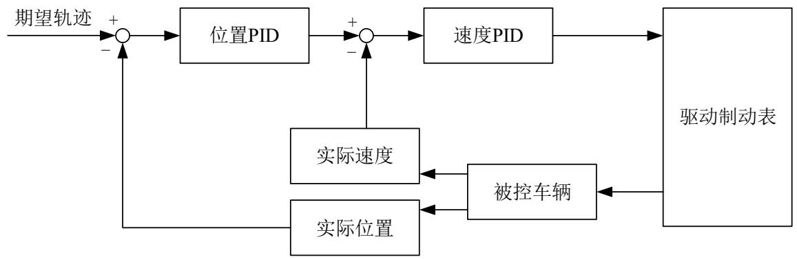

<details>
<summary>flowchart</summary>

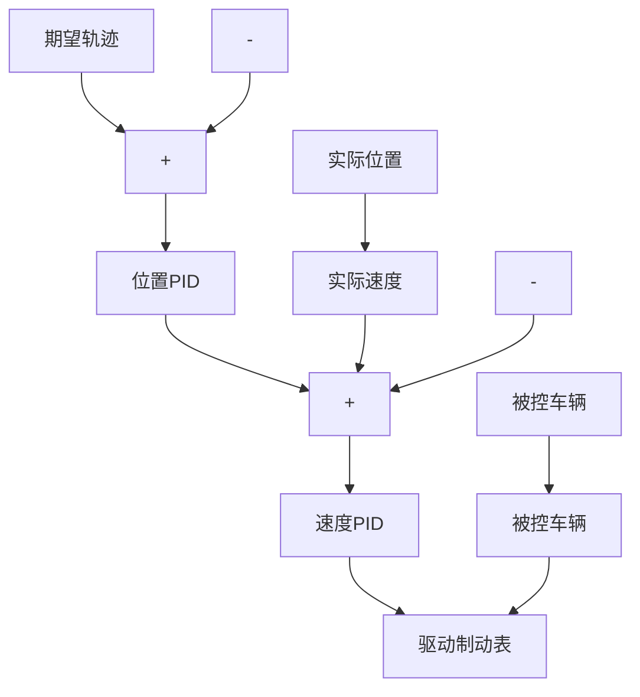
```mermaid
graph TD
    A["期望轨迹"] --> B["+"]
    B --> C["位置PID"]
    C --> D["+"]
    D --> E["速度PID"]
    E --> F["驱动制动表"]
    G["实际位置"] --> H["实际速度"]
    H --> D
    I["被控车辆"] --> J["被控车辆"]
    J --> F
    K["-"] --> B
    L["-"] --> D
```
</details>

图 4-4 PID 纵向控制器

# 4.4.1 PID 控制原理

PID控制是一种经典的反馈控制算法，它不依赖于系统的数学模型，且原理简单控制精度良好，是应用最为广泛的控制方法。PID控制的核心思想是通过对系统误差的比例、积分和微分进行综合调节，实现对系统输出的精确控制，其结构如图4-5所示。PID控制器由比例（P）、积分（I）和微分（D）三个部分组成，每个部分对误差的不同特性进行响应，共同作用以达到快速、稳定且准确的控制效果。

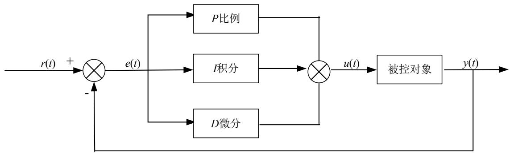

<details>
<summary>flowchart</summary>

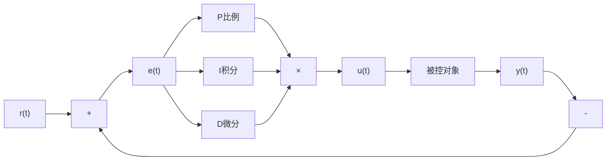
```mermaid
graph LR
    A["r(t)"] --> B["+"]
    B --> C["e(t)"]
    C --> D["P比例"]
    C --> E["I积分"]
    C --> F["D微分"]
    D --> G["×"]
    E --> G
    F --> G
    G --> H["u(t)"]
    H --> I["被控对象"]
    I --> J["y(t)"]
    J --> K["-"]
    K --> B
```
</details>

图 4-5 PID 控制系统结构

比例控制器的控制信号 $u ( t )$ 与误差信号 $e ( t )$ 呈线性关系，其响应速度快且能有效降低系统偏差，但存在稳态误差无法完全消除的固有特性。比例控制的输出可以表示为 $u ( t ) = K _ { p } \cdot e ( t )$ ，其中 $K _ { p }$ 是比例增益。比例控制能够显著减小误差，但单独使用时可能导致系统存在稳态误差，即系统输出无法完全达到设定值。积分控制用于消除稳态误差，其输出与误差的积分成正比，能够累积历史误差信息并逐步调整控制量。积分控制的输出为 $u ( t ) = K _ { i } \cdot \int _ { 0 } ^ { t } e ( \tau ) d \tau$ ，其中 $K _ { i }$ 是积分增益。积分控制能够有效消除稳态误差，但过大的积分增益可能导致系统响应变慢或产生振荡。微分控制通过预测误差的变化趋势来抑制系统的超调和振荡，其输出与误差的变化率成正比。微分控制表示为 $u ( t ) = K _ { d } \cdot \frac { d e ( t ) } { d t }$ ，其中 是微分增益。微分控制能够提高系 $K _ { d }$ 统的响应速度和稳定性，但对噪声较为敏感，可能导致控制输出波动。

PID 控制器将比例、积分和微分三部分结合起来，其输出为三者之和：

$$
u (t) = K _ {p} \cdot e (t) + K _ {i} \cdot \int_ {0} ^ {t} e (\tau) d \tau + K _ {d} \cdot \frac {d e (t)}{d t} \tag {4-20}
$$

通过合理调整 $K _ { p }$ 、 $K _ { i }$ 和 $K _ { d }$ 三个参数，PID控制器能够在不同的控制场景下实现快速、稳定且精确的控制效果。参数整定是 PID 控制的关键，常用的方法包括试凑法、Ziegler-Nichols 法和自整定法等。在纵向控制器设计中，PID 控制可以用于调节车辆的加速度、速度和纵向位置，以实现车辆纵向的精确控制。

# 4.4.2 PID 纵向控制器

纵向跟踪控制器的核心任务是建立精确的驱动/制动力矩标定表。驱动/制动力矩标定表的作用是将纵向控制器输出的纵向期望加速度映射到车辆实际的油门开度与刹车力度，确保车辆能够按照预期的速度和纵向位置行驶。因此在制作驱动/制动力矩标定表的过程需要充分考虑车辆的动力学特性和不同工况下的实际控制效果，以提升控制精度。本文选取无人驾驶汽车直接由电机驱动，驱动电机的转矩T 可有下列公式计算得出：

$$
T = \left\{ \begin{array}{l l} T _ {\max} t h r, & 0 <   n <   n _ {b} \\ \frac {T _ {\max} n _ {b} t h r}{n}, & n > n _ {b} \end{array} \right. \tag {4-21}
$$

式中 — $T _ { \mathrm { m a x } }$ 电机最大扭矩 $\left( \mathbf { N } \cdot \mathbf { m } \right)$ ；

$t h r$ ——油门/刹车的开度；

$n _ { b }$ — 电机最低转速（r/min）。

通过在不同油门/刹车的踏板开度下反复实验可获得多组实验数据。对于每组实验数据而言都是由自车的油门/刹车的踏板开度 thr 行驶速度 v 和行驶加速度 a组成的离散三维坐标。对于三维坐标数据可采用双线性插值构建出油门/刹车踏板的开度关于自车车速和加速度的函数关系。PID控制器可根据自车的实时车速和期望加速度，通过查询驱动/制动标定表（油门/刹车踏板的开度关于自车车速和加速度的函数关系）即可获取相应的油门开度或制动踏板开度信息，从而实现对车辆纵向位置和车速的精准控制。

# 4.5 算法验证与分析

为验证本文所提出无人驾驶车辆轨迹跟踪控制算法的有效性，本文将在Simulink 上实现轨迹跟踪控制算法，Carsim 软件用于构建整车动力学模型。从而实现Carsim 与Simulink 联合仿真验证算法的控制精度和鲁棒性。Carsim 具有高精度的车辆动力学模型，能够模拟车辆在不同条件下的动力学特性。Carsim 主要涵盖以下三部分功能模块：车辆参数模块，可对仿真车辆、传动系统、悬架系统以及轮胎等底盘系统进行设计；数值求解引擎模块：作为系统的核心计算单元，该组件既执行数学模型的迭代求解运算，又实现Carsim 与Simulink 和Labview等仿真软件间的实时数据交换功能；仿真结果可视化模块：该部分提供 3D动态演示功能，并设有数据分析界面，便于用户直观查看车辆仿真的各项性能指标。

首先需要选择合适的车辆模型，并配置 CarSim 的各项数据参数。然后在Simulink 中编写轨迹跟踪控制算法，并通过配置接口与 Carsim 进行数据交互，使控制算法能够实时作用于仿真车辆。最后将基于 CarSim 与Simulink联合仿真实验平台，针对双移线和变道两种经典工况进行仿真测试，以验证本文轨迹跟踪控制算法的跟踪精度和鲁棒性。

# 4.5.1 双移线工况

双移线工况可有效用于衡量无人驾驶车辆轨迹跟踪的稳定性和控制精度。在该工况下要求车辆在限定车道内按照预设轨迹完成连续两次变道操作，用于模拟大曲率弯道或连续避让障碍物的实际驾驶场景，其数学表达如式(4-22)所示。

$$
\begin{array}{l} z _ {1} = \frac {2 . 4}{2 5} (x - 2 7. 1 9) - 1. 2 \\ z _ {2} = \frac {2 . 4}{2 1 . 9 5} (x - 5 6. 4 6) - 1. 2 \tag {4-22} \\ Y _ {r e f} (x) = \frac {d _ {y 1}}{2} \left(1 + \tanh \left(z _ {1}\right)\right) - \frac {d _ {y 2}}{2} \left(1 + \tanh \left(z _ {2}\right)\right) \\ \end{array}
$$

式中 $d _ { \mathrm { y 1 } } = 4 . 0 5 , d _ { \mathrm { y 2 } } = 5 . 7 { \mathrm { _ { c } } }$

双移线工况仿真结果如图 4-6、图 4-7 和图 4-8 所示，下面主要从横纵向跟踪误差和实际状态量等方面进行讨论与分析。图 4-6是期望参考轨迹与车辆实际行驶轨迹的对比图，其中蓝色实线是双移线参考轨迹，橙色虚线是车辆实际行驶轨迹。整体来看，自车实际的行驶轨迹与期望轨迹基本重合，具有较好的横纵向轨迹跟踪能力。

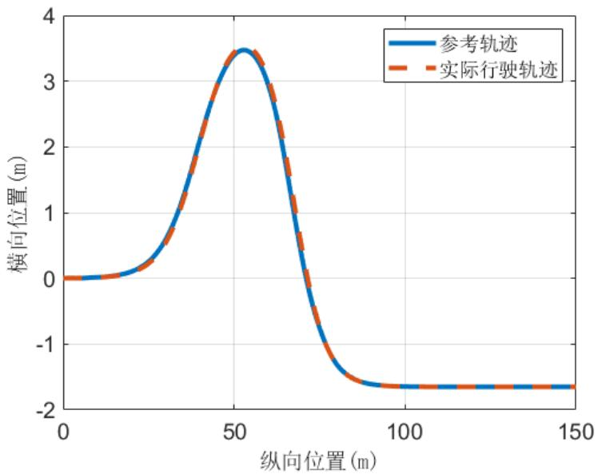

<details>
<summary>line</summary>

| 纵向位置 (m) | 参考轨迹 (m) | 实际行驶轨迹 (m) |
| ------------ | ------------ | ---------------- |
| 0            | 0.0          | 0.0              |
| 50           | 3.5          | 3.5              |
| 100          | -1.8         | -1.8             |
| 150          | -1.8         | -1.8             |
</details>

图4-6 双移线行驶轨迹

轨迹跟踪的横向误差和纵向误差如图4-7所示。由图4-7(a)可知，横向误差整体波动较小，最大误差保持在 0.05 米以内，车辆在横向控制方面表现较为稳定，能够较好地跟踪目标轨迹。对于纵向误差，在仿真起始阶段存在较大误差，主要原因是由于仿真车辆的加速能力有限，无法在短时间内快速跟上期望轨迹的纵向位置。但随着仿真进行，自车逐步调整车速，在实验后期使得整体纵向误差保持在 0.5米以内，可以达到双移线工况的控制要求。

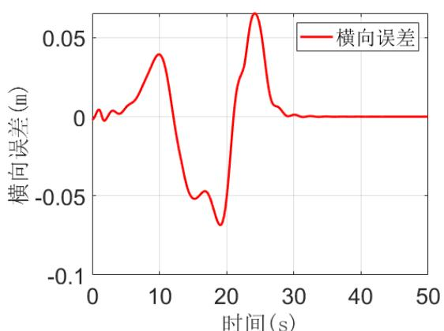

<details>
<summary>line</summary>

| 时间 (s) | 横向误差 (m) |
| -------- | ------------ |
| 0        | 0.00         |
| 10       | 0.04         |
| 20       | -0.07        |
| 30       | 0.00         |
| 40       | 0.00         |
| 50       | 0.00         |
</details>

(a) 横向误差

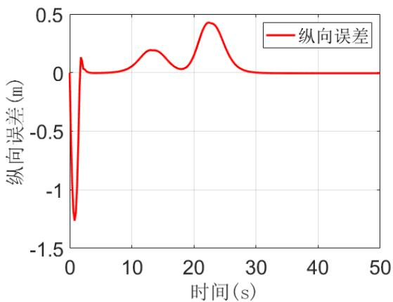

<details>
<summary>line</summary>

| 时间 (s) | 纵向误差 (m) |
| -------- | ------------ |
| 0        | -1.3         |
| 5        | 0.1          |
| 10       | 0.0          |
| 15       | 0.2          |
| 20       | 0.1          |
| 25       | 0.45         |
| 30       | 0.0          |
| 35       | 0.0          |
| 40       | 0.0          |
| 45       | 0.0          |
| 50       | 0.0          |
</details>

(b) 纵向误差   
图4-7 双移线横纵向误差

此外，图4-8分别展示了参考航向角与自车实际航向角的对比情况，以及车辆前轮转角的变化趋势。由图 4-8(a)可知，车辆的实际航向角经 MPC 横向控制器优化后，整体略小于期望航向角，车辆航向角是前轮偏转角的宏观体现。图 4-8(b)展示了车辆前轮转角的实际变化情况，可以看出前轮转角在整个双移线工况下均能保持平稳，未出现过大的波动。较小的前轮转角波动能够减少因控制输入剧烈变化而引起的行驶轨迹抖动，从而有效提升控制系统的跟踪精度和行驶稳定性。

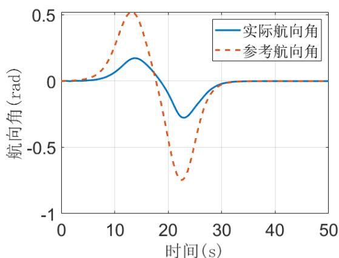

<details>
<summary>line</summary>

| 时间 (s) | 实际航向角 (rad) | 参考航向角 (rad) |
| -------- | ---------------- | ---------------- |
| 0        | 0.0              | 0.0              |
| 10       | 0.1              | 0.4              |
| 20       | -0.3             | -0.8             |
| 30       | 0.0              | 0.0              |
| 40       | 0.0              | 0.0              |
| 50       | 0.0              | 0.0              |
</details>

(a) 航向角对比图

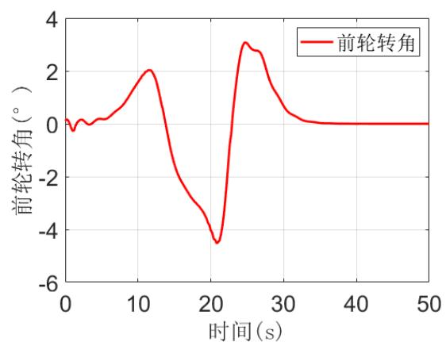

<details>
<summary>line</summary>

| 时间 (s) | 前轮转角 (°) |
| -------- | ------------ |
| 0        | 0            |
| 10       | 2            |
| 20       | -5           |
| 30       | 0            |
| 40       | 0            |
| 50       | 0            |
</details>

(b) 前轮转角图  
图4-8 航向角与前轮转角图

# 4.5.2 变道工况

常用自动驾驶车辆变道轨迹有样条曲线、贝塞尔曲线和多项式曲线等。其中五次多项式曲线因其具有良好的平滑性、较高的计算效率和曲率连续等优点，所以本文将采用五次多项式来表示变道轨迹。且五次多项式可保证轨迹在位置、速度和加速度上的连续性，其一般形式如式(4-23)所示。车辆变道始末状态分别为$P _ { 0 } = [ s _ { 0 } , \dot { s } _ { 0 } , \ddot { s } _ { 0 } , l _ { 0 } , \dot { l } _ { 0 } , \ddot { l } _ { 0 } ]$ 和 $P _ { 1 } = [ s _ { 1 } , \dot { s } _ { 1 } , \ddot { s } _ { 1 } , l _ { 1 } , \dot { l } _ { 1 } , \ddot { l } _ { 1 } ]$ 。将车辆变道时的开始状态 $P _ { 0 }$ 和变道结束时的终点状态 $P _ { 1 }$ 和换道时间 t 代入下式即可得最终的换道轨迹：

$$
x (t) = a _ {5} t ^ {5} + a _ {4} t ^ {4} + a _ {3} t ^ {3} + a _ {2} t ^ {2} + a _ {1} t + a _ {0} \tag {4-23}
$$

$$
y (t) = b _ {5} t ^ {5} + b _ {4} t ^ {4} + b _ {3} t ^ {3} + b _ {2} t ^ {2} + b _ {1} t + b _ {0}
$$

本文定义变道曲线的起始坐标为(0,0)，变道曲线的结束坐标为(100,10)，变道工况的仿真结果如图 4-9、图 4-10 和图 4-11 所示。图 4-9 是五次多项式变道参考轨迹与自车实际行驶轨迹的对比图，其中蓝色实线是变道的参考轨迹，橙色虚线是车辆实际行驶轨迹。从图中可以看出，在整个变道过程中自车的实际行驶轨迹始终与参考轨迹重合，且具有良好的平滑性，未出现明显的位置偏移和横向抖动。

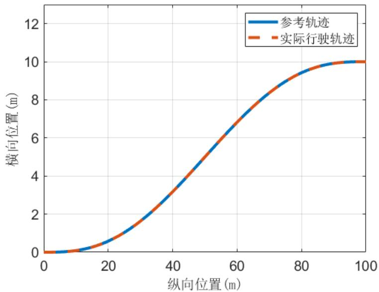

<details>
<summary>line</summary>

| 纵向位置 (m) | 参考轨迹 (m) | 实际行驶轨迹 (m) |
| :--- | :--- | :--- |
| 0 | 0 | 0 |
| 20 | 1 | 1 |
| 40 | 3.5 | 3.5 |
| 60 | 7 | 7 |
| 80 | 9.5 | 9.5 |
| 100 | 10 | 10 |
</details>

图4-9 变道行驶轨迹

图4-10是轨迹跟踪的横向误差和纵向误差。由图4-10(a)可知，整个变道过程中横向误差均保持在 0.003米以内，具有良好的控制精度。从图4-10(b)观察可知，纵向误差整体不超过 0.04 米。车辆能够快速调整自身状态以适应参考轨迹，且横纵向误差均有较高的跟踪精度，可进一步验证本文控制算法的鲁棒性。

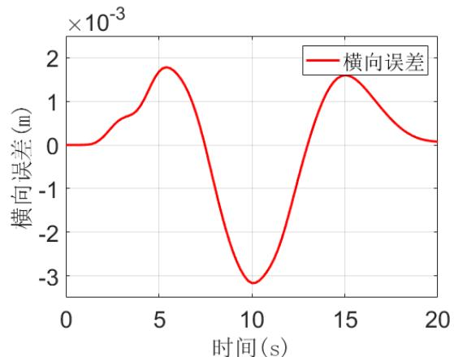

<details>
<summary>line</summary>

| 时间 (s) | 横向误差 (×10⁻³) |
| -------- | ---------------- |
| 0        | 0                |
| 5        | 1.8              |
| 10       | -3.0             |
| 15       | 1.8              |
| 20       | 0                |
</details>

(a) 横向误差

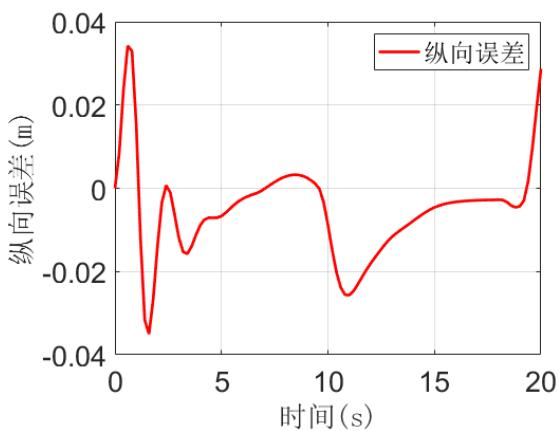

<details>
<summary>line</summary>

| 时间 (s) | 纵向误差 (m) |
| -------- | ------------ |
| 0        | 0.0000       |
| 1        | 0.0350       |
| 2        | -0.0350      |
| 3        | 0.0000       |
| 4        | -0.0150      |
| 5        | -0.0050      |
| 6        | -0.0025      |
| 7        | 0.0025       |
| 8        | 0.0050       |
| 9        | 0.0025       |
| 10       | -0.0250      |
| 11       | -0.0350      |
| 12       | -0.0250      |
| 13       | -0.0150      |
| 14       | -0.0050      |
| 15       | 0.0000       |
| 16       | 0.0025       |
| 17       | 0.0050       |
| 18       | 0.0025       |
| 19       | -0.0050      |
| 20       | 0.0350       |
</details>

(b) 纵向误差   
图 4-10 变道横纵向误差

图 4-11(a)是参考航向角和自车实际航向角的对比图。从图中可以看出，自车航向角能够较好地跟踪参考航向角的变化，两者之间的偏差较小，自车在变道过程中能良好的控制方向跟随参考轨迹。图 4-11(b)是车辆前轮转角的变化曲线。从曲线中可以看出，前轮转角未出现突变和抖动，整体变化平滑且连续。

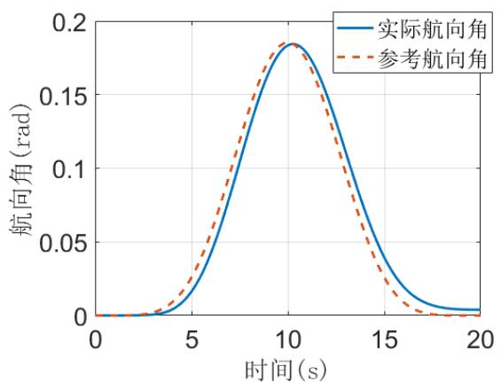

<details>
<summary>line</summary>

| 时间 (s) | 实际航向角 (rad) | 参考航向角 (rad) |
| -------- | ---------------- | ---------------- |
| 0        | 0.0              | 0.0              |
| 5        | 0.05             | 0.05             |
| 10       | 0.18             | 0.18             |
| 15       | 0.05             | 0.05             |
| 20       | 0.0              | 0.0              |
</details>

(a) 航向角对比图

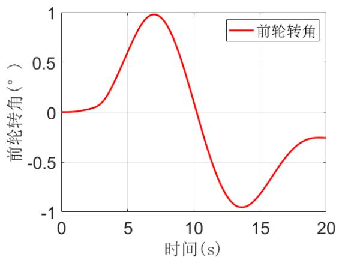

<details>
<summary>line</summary>

| 时间 (s) | 前轮转角 (°) |
| -------- | ------------ |
| 0        | 0            |
| 5        | 0.5          |
| 7        | 1            |
| 10       | 0            |
| 13       | -1           |
| 15       | -0.5         |
| 20       | 0            |
</details>

(b) 前轮转角图  
图4-11 航向角与前轮转角图

通过上述仿真实验可知，本文提出的横向 MPC-纵向PID轨迹跟踪控制器在双移线和变道场景下均有较高的跟踪精度、良好的动态响应和行驶平稳性。在两种典型测试工况下，控制器能保持稳定的控制性能，确保车辆按照参考轨迹行驶，满足无人驾驶系统对安全性、舒适性和稳定性的要求。

# 4.6 本章小结

本章设计了横向基于MPC，纵向基于PID的轨迹跟踪控制器。首先，设计了轨迹跟踪控制器的整体架构，并推导了二自由度车辆动力学跟踪误差模型。然后，针对横向控制，构建了 MPC 优化目标函数和约束条件，通过 MPC 优化求解和前馈控制得到前轮转角的实际控制量。其次，针对纵向控制，基于车辆动力学特性制作驱动/制动力矩标定表，确保车辆纵向速度的平稳调节。最后，基于 CarSim 与Simulink 联合仿真实验平台，针对双移线和变道两种工况进行测试。实验结果表明，本文的轨迹跟踪控制器能精准跟踪目标轨迹，且具有较好的控制精度和鲁棒性。

# 第5章 自动驾驶规划控制算法仿真验证

第2、3、4章已对无人驾驶车辆的轨迹决策、轨迹规划和跟踪控制算法进行了设计。本章将基于 ROS 与 Ubuntu/Carla 联合仿真实验平台，对本文提出算法进行闭环仿真测试。主要针对静态避障和动态超车两种实验场景进行仿真测试，验证算法的可行性和适应性。其中，车辆动力学模型由 Carla仿真软件提供，算法程序在ROS 中实现，二者通过 Carla ROS Bridge 进行通信。

# 5.1 仿真算法平台

前面章节已分别对各个算法进行了基本验证，并通过开环仿真实验测试算法可行性。为充分验证本文提出的轨迹决策、轨迹规划和跟踪控制算法的闭环可靠性，本文在Ubuntu 系统下，基于Carla仿真软件和ROS 平台，开展完整的轨迹规划与跟踪控制闭环实验。在本实验环境中，静、动态仿真场景在 Carla 仿真器中进行设置，轨迹规划与跟踪控制算法通过ROS 的话题消息进行发布，二者之间的通信通过Carla ROS Bridge 实现，确保仿真环境的稳定交互。整体仿真环境的框架如图5-1所示。

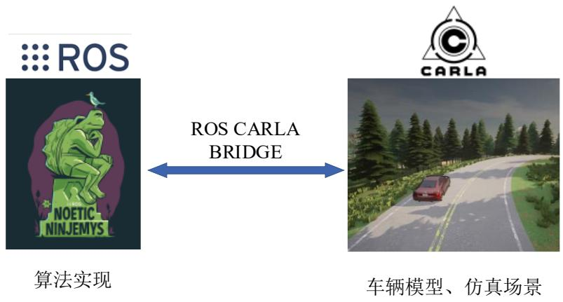

<details>
<summary>flowchart</summary>


```mermaid
graph LR
    A["ROS"] -->|ROS CARLA BRIDGE| B["CARLA"]
    B --> C["车辆模型、仿真场景"]
    C --> D["算法实现"]
```
</details>

图5-1 仿真环境框架图

机器人操作系统（Robot Operating System，ROS）是专为机器人软件开发所设计的电脑操作系统架构，可提供丰富的工具和库。支持分布式计算、硬件抽象和设备驱动，可极大简化机器人应用的开发流程。ROS 采用模块化架构，通过节点（Node）、话题（Topic）和服务（Service）等通信机制，实现不同功能模块之间的高效交互。上述架构使得各个功能模块可以独立开发、测试，并灵活组合，从而提高了系统的可扩展性和复用性。

CARLA（CAR Learning to Act，CARLA）是一个开源的自动驾驶模拟器。面向自动驾驶研究的高保真仿真平台，基于 Unreal Engine 开发，可提供逼真的虚拟城市环境。Carla 软件内包含丰富的道路基础设施、交通信号、动态交通流以及多种天气和光照条件，可用于模拟真实世界中的复杂驾驶场景。且内置丰富的车辆模型，能够准确反映车辆的运动特性。此外，Carla 还内置了多种传感器模型，包括激光雷达、摄像头、IMU、GPS 等，能够在仿真环境中高效测试和验证感知、规划、控制等自动驾驶算法。Carla采用模块化设计，支持 Python API 和 C++ API，可灵活适配不同的研究需求。

Carla ROS Bridge 是连接 Carla 和 ROS 的桥梁，把 Carla 软件和 ROS 系统无缝衔接。可将Carla中的仿真数据（如传感器数据、车辆状态、交通信息等）转换为ROS 的标准消息格式，并发布到 ROS 话题中。还支持还将 ROS 控制命令（如车辆速度控制等指令）发送至 Carla，实现仿真环境中的车辆控制。Carla ROS Bridge确保 ROS 与 Carla 仿真环境的稳定交互，可为自动驾驶算法验证和实车部署提供高效的仿真支持。本文通过 ROS 与 Carla 的联合仿真，能够对轨迹规划算法进行闭环仿真验证，确保算法在实际应用中的可行性和鲁棒性，使仿真结果更具参考价值。

# 5.2 仿真场景设计

本文的仿真实验硬件平台基于 Ubuntu 22.04 操作系统，Intel i7-10700 处理器，NVIDIA RTX 2060 显卡和 16GB 内存。仿真软件使用 Carla 0.9.11，仿真车辆模型选取仿真软件内部自带的特斯拉Model 3车型。

本文共设计静态障碍物和动态障碍物两类仿真场景，以测试自车在不同交通环境中的轨迹规划和避障能力。在静态仿真场景中，自车的初始全局坐标设为(0,0)，自车最快行驶车速为 10 m/s。确保仿真测试环境设置的合理性，静态场景内设置了两个静止障碍车辆，分别位于(1.5,24)和(8,75)，用于模拟典型固定障碍物的场景。此类场景可考察自车在静态环境下避障能力的有效性，该仿真环境的布局如图5-2(a)所示。

为更真实地模拟复杂的交通环境，在动态仿真场景中，设置了一辆静止障碍车辆和两辆以匀速行驶的动态障碍车辆。此类静/动态场景可用于模拟日常驾驶的道路交通状况，能有效测试自车在静态和动态障碍物交互时轨迹规划的有效性。自车的初始全局坐标仍为(0,0)，静态障碍车辆的全局坐标为(1.5,24)，用于考察自车的静态避障能力。动态障碍车辆 1的初始全局坐标为(1.5,63.5)，巡航速度设为 3.5m/s，动态障碍车辆 2 的初始全局坐标为(7.5,74.5)，巡航速度设定为 4m/s，用于考察自车的动态超车能力。两辆动态障碍车辆始终沿既定车道匀速向前保持车道居中行驶，以模拟实际道路中常见的车辆行驶行为。在此类场景下可进一步验证本文轨迹规划算法在混合交通条件下的静态避障和动态超车的能力。该仿真环境的布局如图 5-2(b)所示。

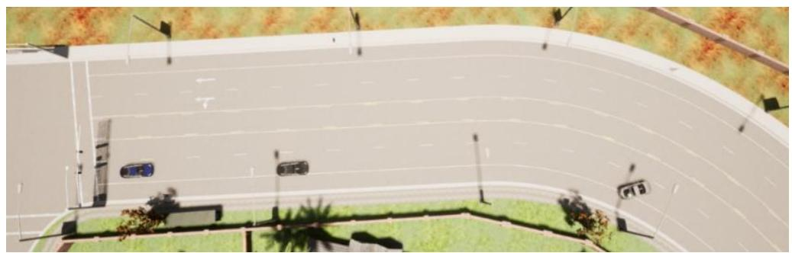

<details>
<summary>natural_image</summary>

Aerial view of a multi-lane highway with two cars and streetlights, surrounded by green lawns and trees (no visible text or symbols)
</details>

(a) 静态场景俯视图  
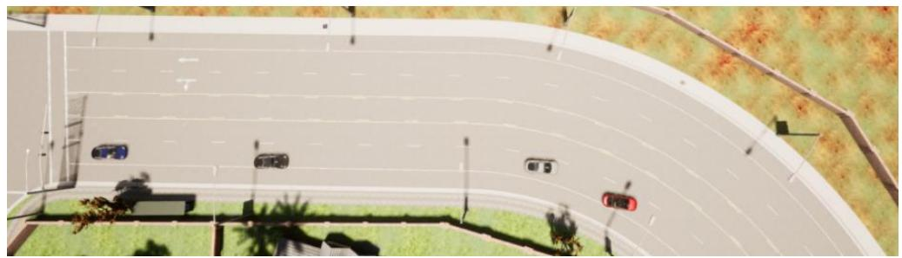

<details>
<summary>natural_image</summary>

Aerial view of a multi-lane highway with several cars parked on it, surrounded by green lawns and trees (no visible text or signage)
</details>

(b) 动态场景俯视图  
图5-2 动态场景俯视图

# 5.3 联合仿真实验与分析

# 5.3.1 静态场景仿真验证

静态场景的实验结果如图5-3、图5-4和图5-5 所示。图5-3和图 5-4(a)分别是静态场景下的时空轨迹和自车的速度曲线。其中，橙色点画线是自车的行驶轨迹，红色虚线是自车的横向速度，红色实线代表自车的纵向速度。由图可知，自车在 20s和60s 左右时向左完成避障任务，此时自车车速有所下降，并在避障完成后逐步回升至参考车速，以提高行驶的安全性。且自车行驶轨迹较为平滑，轨迹的横向位置和纵向车速均未出现明显突变，表明自车在避障过程中保持了良好的稳定性和控制精度。图5-4(b)是自车的实际行驶轨迹与全局参考轨迹的对比图。由图可知，自车仅在执行避障任务时会偏离全局参考线，完成避障后能够迅速靠近参考线。未执行避障任务时，自车的轨迹始终紧贴全局参考轨迹。图5-5是自车躲避障碍物 1和障碍物2的行驶过程图。

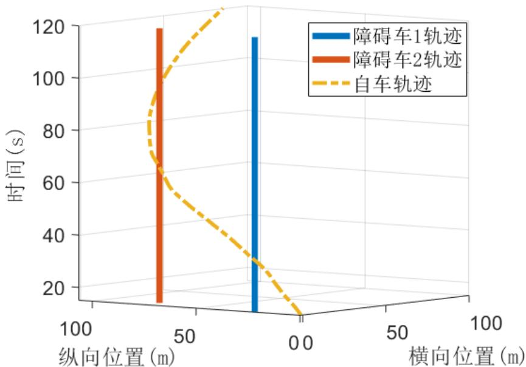

<details>
<summary>bar_line</summary>

| 轨迹类型   | 纵向位置 (m) | 横向位置 (m) | 时间 (s) |
| ---------- | ------------ | ------------ | -------- |
| 障碍车1轨迹 | -80          | -            | 115      |
| 障碍车2轨迹 | 35           | 40           | 120      |
| 自车轨迹   | 40           | 0            | 60       |
</details>

图5-3 静态场景三维空间轨迹图

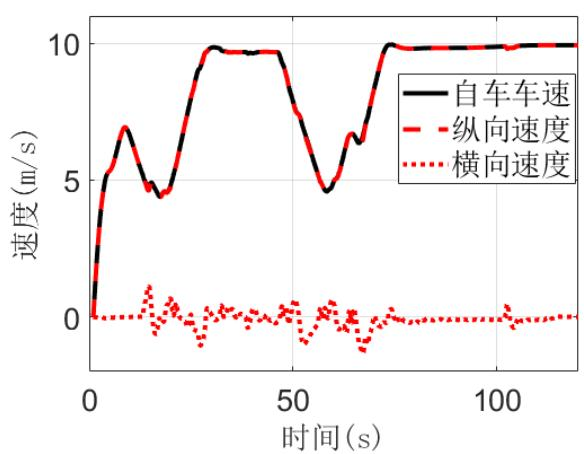

<details>
<summary>line</summary>

| 时间 (s) | 自车车速 (m/s) | 纵向速度 (m/s) | 横向速度 (m/s) |
| -------- | -------------- | -------------- | -------------- |
| 0        | 0              | 0              | 0              |
| 10       | 5              | 6              | 0              |
| 20       | 4              | 4              | 0              |
| 30       | 9              | 9              | 0              |
| 40       | 10             | 10             | 0              |
| 50       | 5              | 5              | 0              |
| 60       | 6              | 6              | 0              |
| 70       | 10             | 10             | 0              |
| 80       | 10             | 10             | 0              |
| 90       | 10             | 10             | 0              |
| 100      | 10             | 10             | 0              |
| 110      | 10             | 10             | 0              |
| 120      | 10             | 10             | 0              |
</details>

(a) 自车实际车速

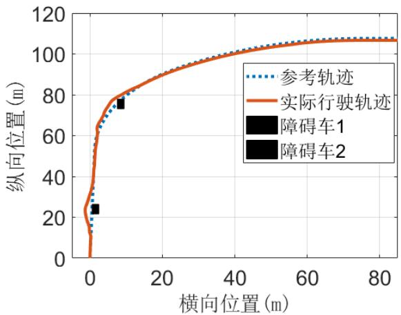

<details>
<summary>line</summary>

| 横向位置 (m) | 参考轨迹 (m) | 实际行驶轨迹 (m) | 障碍车1 (m) | 障碍车2 (m) |
| ------------ | ------------ | ---------------- | ----------- | ----------- |
| 0            | 0            | 0                | 0           | 0           |
| 10           | 75           | 75               | 25          | 25          |
| 80           | 105          | 105              | 105         | 105         |
</details>

(b) 静态场景轨迹图

图5-4 静态场景实验结果图  
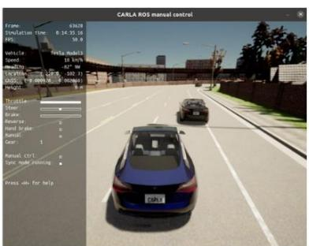

<details>
<summary>text_image</summary>

CARLA ROS manual control
Frame: 63628
Simulation time: 0:14:35.16
FPS: 50.0
Vehicle: Tesla Model
Speed: 15 kbps
Balance: -82 m
Length: 1000 mm (200 gm)
Acceleration: 1000 gm
Height: 0
Tailola:
Steer: 0
Spike: 0
Reverse: 0
Hard Scale: 0
Rearroll: 0
Cover: 1
Manual, Ctrl: 0
Sync mode running: 0
Press on for help
</details>

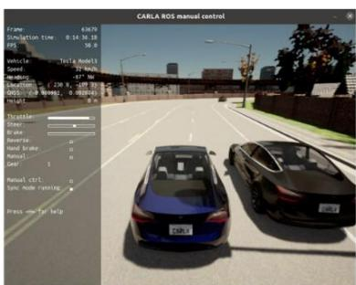

<details>
<summary>text_image</summary>

CARLA ROS manual control
Frame: 43672
Simulation time: 0:14:36.19
FPS: 50.0
Vehicle: Tesla Model3
Speed: 5 Nach
Acceleration: -27° RM
Limiting: (200 N, -189°)
ABS: 0.000000, 0.000000
Height: 0.0
Threshold: 22
Slope: 22
Rover: 22
Hand Brake: 22
Wheel: 22
Cover: 22
Manual ctrl: 0
Spec. Mode Running: 0
Press use to help
</details>

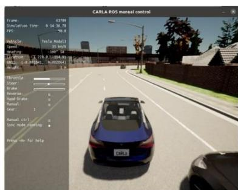

<details>
<summary>text_image</summary>

CARLA ROS manual control
Frame: 637bp
Simulation time: 0:14:36.78
FPS: -56.9
Options: Tesla Model(s)
Name: 0.25 miles
Winning: -100° Off
Lfd. $100k - 228.0 / 184.9
Gbps: 0.0001 / 0.0004
Winning: 1.1
Hrottle:
Sheer:
Reverse:
Round Drive:
Sonic
Gear: 1
Manual ctrl:
Sync Mode Running:
Replace On for help
</details>

(a) 超越障碍车 1过程图

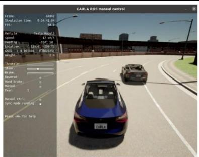

<details>
<summary>text_image</summary>

CARLA ROS manual control
Frame: 6392
Simulation time: 0:14:41:34
FPS: 58.0
Vehicle: Tesla Model1
Mode: 7.5 MHz
Racing: -100" st
Location: (22h 6, 156h 7)
GPS: 0.80116 (P:00321)
Height: 2 m
Trottle:
Steer:
Stride:
Reverse:
Hard mode:
Routback:
Cover:
Manual ctrl:
Sync node routing:
Press on for help
</details>

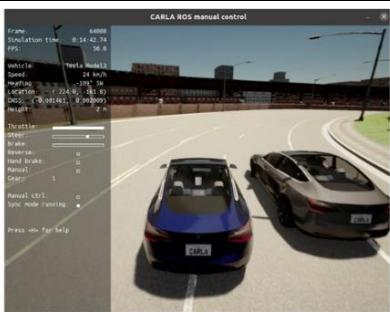

<details>
<summary>text_image</summary>

CARLA RDS manual control
Frame: 6.0000
Simulation time: 8:16:42.74
FPS: 50 B
Vehicle: "Meta Models"
Speed: 15 mph
Height: -395° 5m
Locking: (224.8, 261.9)
Balance: (200.0, 180.0)
Height: 2 m
Throttle:
Driver:
Blade:
Reverse:
Hand Brake:
Rearer:
Color:
Manual ctrl.
Specific mode running:
Press info for help
</details>

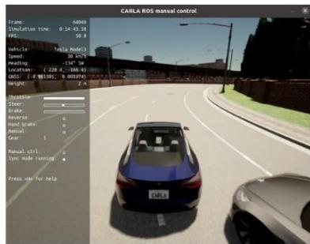

<details>
<summary>text_image</summary>

CARLA ROS manual control
Frame: 64809
Simulation time: 0:14:43.59
VPS: 50.0
Vehicle: Tesla Model 3
Speed: 12.5 V
Heating: -14" Sp
Location: (228.4, 386.4)
Kdd: (891.02) 9.00292
Height: 2.4
Unstable
Steer
Brake
Reverse
Road Speed:
Rearial
Gear: 1
Manual ctrl: G
Type mode running:
Press rule for help
</details>

(b) 超越障碍车 2过程图  
图5-5 自车静态场景避障过程图

# 5.3.2 动态场景仿真验证

静态场景的实验结果如图 5-6、图 5-7 和图 5-8 所示。图 5-6 展示了静态和动态避障过程的三维空间图。图中紫色点画线代表自车的行驶轨迹，而蓝色、橘红色和黄色实线则分别表示障碍物在三维空间中的轨迹。其中蓝色曲线代表静态障碍物，橘红色和黄色曲线代表动态障碍物。从图可看出，自车在 25s 左右完成对静态障碍物的避障；在 60s 和 120s 左右，自车通过向左变道超越两辆动态障碍车辆。图 5-7(a)是自车以及障碍车辆行驶过程中的速度曲线。图中黑色实线是自车的行驶速度，蓝色虚线是动态障碍车辆 1 的速度曲线，蓝色实线是动态障碍车辆 2 的速度曲线。从图中可以看出，自车在静态避障和动态超车阶段的速度变化较为平缓，且整个过程横向车速不大，未出现剧烈波动，确保行驶的稳定性和舒适性。图 5-7(b)是自车、动态障碍车辆 1 和动态障碍车辆 2 的实际行驶轨迹与全局参考线的对比图。图5-8是自车完成静态避障和动态超车的具体过程图。

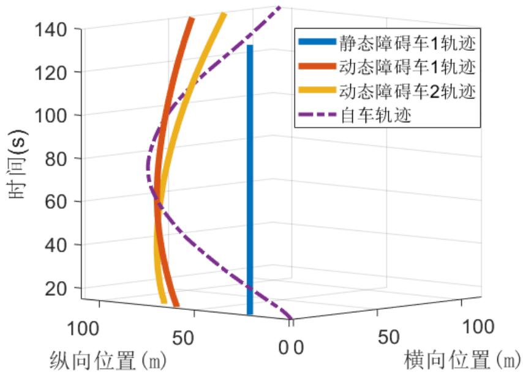

<details>
<summary>line</summary>

| 轨迹类型       | 纵向位置 (m) | 横向位置 (m) |
| --------------- | ------------- | ------------- |
| 静态障碍车1轨迹 | 0             | 0             |
| 动态障碍车1轨迹 | 50            | 0             |
| 动态障碍车2轨迹 | 50            | 0             |
| 自车轨迹        | 50            | 0             |
</details>

图5-6 动态场景三维空间轨迹图

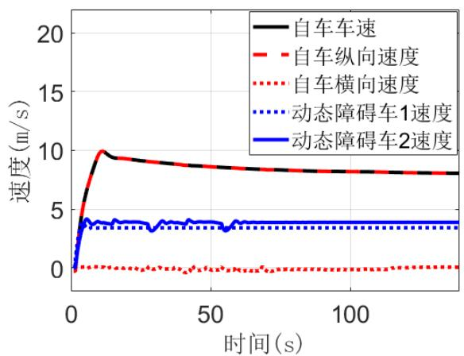

<details>
<summary>line</summary>

| 时间 (s) | 自车车速 | 自车纵向速度 | 自车横向速度 | 动态障碍车1速度 | 动态障碍车2速度 |
| -------- | -------- | ------------ | ------------ | ---------------- | ---------------- |
| 0        | 0        | 0            | 0            | 0                | 0                |
| 50       | 8.5      | 8.5          | 0            | 3.5              | 3.5              |
| 100      | 8.0      | 8.0          | 0            | 3.5              | 3.5              |
| 150      | 7.5      | 7.5          | 0            | 3.5              | 3.5              |
| 200      | 7.0      | 7.0          | 0            | 3.5              | 3.5              |
</details>

(a) 速度曲线图

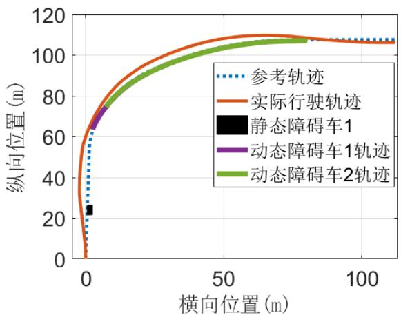

<details>
<summary>line</summary>

| 横向位置 (m) | 参考轨迹 | 实际行驶轨迹 | 静态障碍车1 | 动态障碍车1轨迹 | 动态障碍车2轨迹 |
| ------------ | -------- | ------------ | ----------- | ---------------- | ---------------- |
| 0            | 0        | 0            | 0           | 0                | 0                |
| 50           | 105      | 110          | 105         | 108              | 107              |
| 100          | 110      | 110          | 110         | 110              | 110              |
</details>

(b) 动态场景轨迹图

图 5-7动态场景实验结果图  
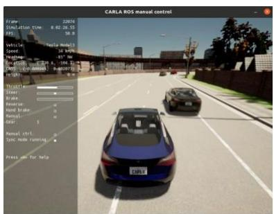

<details>
<summary>text_image</summary>

CARLA ROS manual control
Frame: 20076
Simulation time: 8:42:26.55
RDS: 58 B
Vehicle: Auto Models
Speed: 150000
Height: -25° Max
Body width: 6.54 ± 1.94
Body height: 6.54 ± 1.94
Height: 150000
Turbable:
Shear
Slope
Reverse
Hand-on color
Normal:
Color: 1
Manual ctrl:
Type: Mode running
Press us for help
</details>

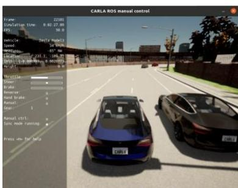

<details>
<summary>text_image</summary>

CARLA ROS manual control
Frame: 22351
Simulation time: 8:22:27.00
RPS: 56.0
Vehicle: Tesla Model1
Speed: 3.000
Weight: 81.000
Location: JIS 1, 106.31
Model 1: 0.0000000000000000000000000000000000000000000000000000000000000
Height: 9
Height: 9
Slope: 1
Ride: 1
Reverse: 1
Motor: 1
Gear: 1
Manual ctrl:
Sync NEE Running:
Press On for help
</details>

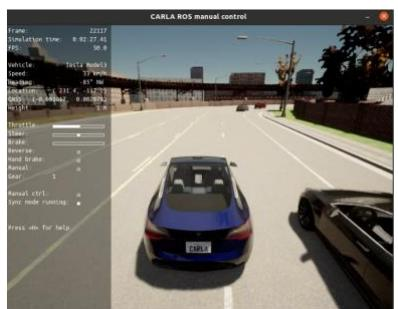

<details>
<summary>text_image</summary>

CARLA ROS manual control
Frame: 2017
Simulation Time: 8:02:27:01
URL: 50.8
Vehicle: Delta Model3
Speed: 3.5 km/h
Trinity: 85° H
Acceleration: 0.16 x - 0.1472
RPG: 0.0000
Height: 1.6
Throttle:
Shelter:
Blade:
Reverse:
New body:
Rearout:
Clear: 1
Rearout Ctrl:
Type Mode Running:
Pass d/s for help
</details>

(a) 静态障碍车过程图  
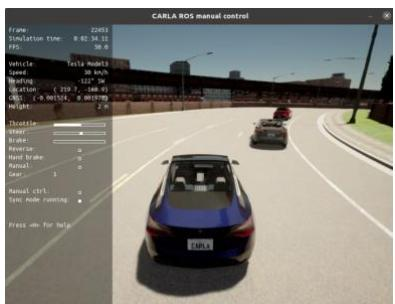

<details>
<summary>text_image</summary>

CARLA ROS manual control
Frame 22053
Simulation time 8:02:34:11
FPS 50.0
Vehicle Tesla Model3
Speed 5 N/A
Maxing -122° Sw
Location (-259°, -168°)
Size (≤ 600deg) @ 600deg
Height 2 m
Double
over
Ride
Reverse
Hard Brake
Rear
Clear 1
Manual ctrl
Sync Mode Running
Press info for help
</details>

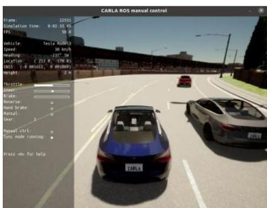

<details>
<summary>text_image</summary>

CARLA ROS manual control
Frame: 20350
Simulation time: 0.02:35 V
FPS: 50 W
Vehicle: Tesla A6013
Speed: 30 kPa
Heading: -117.5m
Location: (311.0, -078.0)
AFC (x model, x position)
Height: 2.5
Height:
Slaper:
Reverse:
Hand brake:
Manual:
Car:
Ampal start:
Temp mode running:
Press -do for help
CARLA
</details>

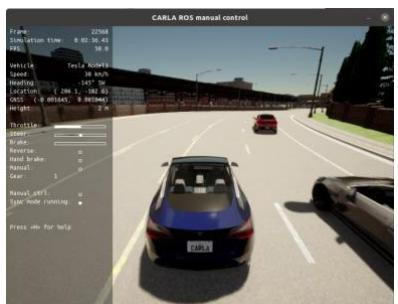

<details>
<summary>text_image</summary>

CARLA ROS manual control
Frame: 22066
Simulation time: 8:32:30.43
RMS: 58.0
Vehicle Tesla ACHN3
Speed 100 MHz
Heading 1457 Hz
Location ( .296.1, .192.3)
Auto (-0.00345, 0.00245)
Height 7.0
Thrattle
Steer
Reverse
Hand brake
Normal
Cover 1
Manual alert
Type Mode Running
Press info for help
</details>

(b) 动态障碍车 1过程图  
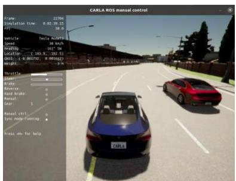

<details>
<summary>text_image</summary>

CARLA ROS manual control
Frame: 2706e
Simulation time: 8:02:39:15
FPS: 50.0
Vehicle: Tesla Model
Level: 35.0x50
Height: -161° 54
Location: (-185.9, -202.3)
ABS = 0.00152; 0.00162?
Weight: 3.0
Wireless:
After
Reverse
Hard mode
Normal
Clear: 1
Manual ctrl:
Sync mode Running:
Press off for help
</details>

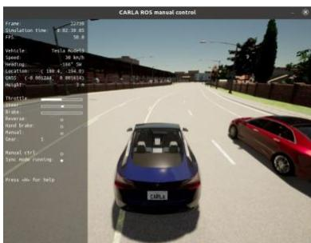

<details>
<summary>text_image</summary>

CARLA ROS manual control
Frame: 22700
Simulation time: 8:32:39.85
PS: 50.0
Vehicle: Tesla RDS
Speed: 30 kbps
Holding: -185° Sp
Location: (190 x, 204 x)
GND (-6 MHz, 8 MHz)
Height: 3.4
Height:
Speed:
RDC:
Reverse:
Head to rear:
Rearout:
Clear: 1
Annual ctrl:
Time name running:
Press do for help
</details>

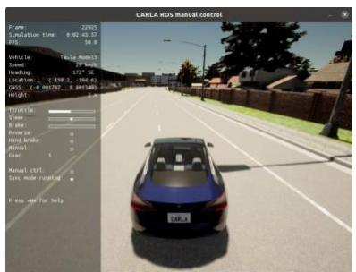

<details>
<summary>text_image</summary>

CARLA ROS manual control
Frame: 2005
Simulation time: 8:02:43:37
FPS: 56.8
Vehicle: T1a model
Speed: 1.5 mph
Heading: 173° 56
Location: ( $39.2, -004.6 )
CRS: (-0.00002, 0.00100)
Height:
Motor
Steer
Brake
Reverse
Next brake
Rearful
Color
Manual ctrl:
Spec mode running
Access key for help
</details>

(c) 超越动态障碍车 2过程图  
图5-8 自车动态场景避障过程图

由上述仿真实验结果可知，在静态仿真场景时，自车能够平稳规划轨迹并合理避障绕行。在动态仿真场景时，自车可根据障碍物的运动状态实时规划局部轨迹。针对静态障碍，自车可规划避障绕行轨迹；针对动态障碍物，自车可合理规划超车变道轨迹。本文提出的时空联合轨迹规划算法相比于解耦规划，能合理的处理静态障碍物和动态障碍物，具有更好适应性、安全性和可靠性。

# 5.4 本章小结

本章通过仿真实验验证第2、3、4章提出的自动驾驶轨迹决策、轨迹规划和跟踪控制算法的有效性。首先，搭建了 ROS 和 Ubuntu/Carla 的联合仿真实验平台，并选用 Carla 中的特斯拉 Model 3 车型作为仿真实验对象。然后，在 Carla 软件内共设计了静态障碍车辆和动态障碍车两类仿真场景。最后，基于 Carla ROS Bridge实现Carla和ROS 之间的通信，轨迹规划和跟踪控制的算法代码在ROS 环境中实现，以完成轨迹决策、轨迹规划和跟踪控制的闭环仿真实验验证。实验结果表明，本文提出的时空联合轨迹规划算法在静态和动态景下均表现良好，相比于解耦规划，能合理的处理静态障碍物和动态障碍物，具有更好适应性、安全性和可靠性。

# 结 论

本文选取自动驾驶车辆为研究对象，在感知层和全局路径已知的前提下，设计轨迹决策、轨迹规划和跟踪控制系统。基于三维动态规划算法搜索出决策轨迹关键点，通过三次样条插值对决策关键点进行插值增密。在最优控制问题的框架下对轨迹规划进行建模，并将运动学约束、机械约束、边界约束以及基于时空走廊的碰撞躲避约束作为硬约束纳入其中。基于横向 MPC、纵向 PID 控制器对规划轨迹实现跟踪控制。最后通过仿真实验验证本文所提算法的合理性和可行性。本文的研究成果如下：

（1）提出了三维动态规划的轨迹决策算法。推导了笛卡尔坐标系与 Frenet道路坐标系的转换关系，通过对比实验分析了基于样条曲线插值和基于数值优化两种全局参考线平滑方法的优劣。实验表明：当全局参考路径点较少时，曲线插值方法生成的全局参考线更平滑。路径点密集时，基于数值优化方法性能优于曲线插值法。并引入 T-S-L 三维时空同时介绍了离散采样策略，确保轨迹采样的合理性。给出了代价函数的设计方案和三维动态规划决策算法。  
（2）提出了基于时空走廊的轨迹规划算法。分别给出了最优控制问题的建模过程和优化目标函数的具体形式，紧接着设计了优化求解的约束项。具体包括车辆机械约束、边界约束、运动学约束和碰撞躲避约束。针对运动学约束，基于二自由度车辆运动学微分方程，采用向前欧拉离散化将其转化为等式约束。对于碰撞躲避这一非线性约束，通过构建时空安全走廊进行线性转换。通过仿真平台进行可行性验证，实验结果表明：三维动态规划的决策算法和时空走廊的规划算法在面对复杂交通环境时，能够充分考虑动态与静态障碍物的信息，动态调整自车的行驶速度，规划出一条安全合理可行的轨迹。  
（3）提出了横向 MPC、纵向 PID 的跟踪控制算法。建立了二自由度动力学误差模型，为 MPC 控制器提供理论支撑。针对横向控制，构建了 MPC 优化目标函数和约束条件，通过优化求解和前馈控制得到前轮转角的控制量，实现对车辆横向运动的精确调节。针对纵向控制，提出了 PID 纵向控制算法，并基于动力学特性制作驱动/制动力矩标定表，以确保车辆纵向位置和速度的平稳调节。在仿真实验平台上，针对双移线和变道两种典型工况进行了测试。实验结果表明：横向 MPC、纵向 PID 跟踪控制器能够精准跟踪目标轨迹，且有较好的稳定性和鲁棒性。  
（4）搭建了 ROS、Ubuntu/Carla 联合仿真平台。通过仿真实验验证本文提

出的自动驾驶轨迹决策、轨迹规划和跟踪控制算法的有效性。设计了静态避障和静态与动态混合两种实验仿真场景。实验结果表明：本文所提出的算法相比于传统算法，能合理的处理动态障碍物规划出超车轨迹，灵活性更高。且在静态和动态混合场景下均表现良好，能够有效保障车辆的行驶安全性和轨迹规划的合理性。

本文研究了结构化道路下自动驾驶轨迹规划和跟踪控制，具有重要的实践意义。不过，研究仍有待进一步探索和提高，未来还应重点关注以下三个方面：

（1）搭建的仿真环境较为理想化，未充分考虑真实交通场景下的特殊因素。具体体现为，没有考虑异形交通参与者和道路坡度变化等因素的影响。未来研究可引入更真实的交通仿真环境，提升算法在不同场景下的适应性。  
（2）本文采用线性化的车辆模型，未充分考虑车辆在高速行驶或极限工况下的非线性特性。此外，时空走廊构建方式采用 AABB 模型，未充分结合自车的航向角特性，存在一定的冗余空间。未来可引入更符合实际的非线性车辆模型，并采用考虑自车航向角的 OBB 模型，提高轨迹规划的灵活性和精确度。  
（3）本文的实验基于仿真车辆和仿真环境进行，未在实车上验证算法的实际适用性。由于真实车辆控制存在执行误差、传感器噪声以及通信延迟等问题，仿真结果可能与实际情况存在差距。未来研究可结合实车实验，验证算法在真实驾驶环境中的性能，以提高算法的工程适用性。

# 参考文献

[1] 交通管理局.全国机动车保有量达 4.53 亿辆 驾驶人达 5.42 亿人[EB/OL].公安部.2025[2025-01-18].https://www.gov.cn/lianbo/bumen/202501/content\_6999762.htm.  
[2] 刘爱华,叶礼奇 总编《中国统计年鉴, 2024》编委会和编辑出版人员,刘爱华,叶礼奇 总编,中国统计年鉴,中国统计出版社,2024,4-5,年鉴.  
[3] 熊璐,康宇宸,张培志,等.无人驾驶车辆行为决策系统研究[J].汽车技术,2018,(08):1-9.  
[4] 采国顺,刘昊吉,冯吉伟,等.智能汽车的运动规划与控制研究综述[J].汽车安全与节能学报,2021,12(03):279-297.  
[5] 雷洪钧.汽车驾驶自动化分级技术要求及组织实施的探讨[J].汽车工艺师,2020,(05):25-29+33.  
[6] 全国汽车标准化技术委员会(SAC/TC 114).汽车驾驶自动化分级:GB/T 40429-2021[S].中国标准出版社,2021.  
[7] 李柏,张友民,邵之江.自动驾驶车辆运动规划方法综述[J].控制与信息技术,2018,(06):1-6.  
[8] 朱冰,贾士政,赵健,等.自动驾驶车辆决策与规划研究综述[J].中国公路学报,2024,37(01):215-240.  
[9] Karaman S, Walter M R, Perez A, et al. Anytime motion planning using the RRT[C]//2011 IEEE international conference on robotics and automati on. IEEE, 2011: 1478-1483.   
[10]Noreen I, Khan A, Habib Z. Optimal path planning using RRT\* based a pproaches: a survey and future directions[J]. International Journal of Adv anced Computer Science and Applications, 2016, 7(11).   
[11]Noreen I, Khan A, Habib Z. A comparison of RRT, RRT\* and RRT\*-sm art path planning algorithms[J]. International Journal of Computer Science

and Network Security (IJCSNS), 2016, 16(10): 20.   
[12]Francis A, Faust A, Chiang H T L, et al. Long-range indoor navigation with PRM-RL[J]. IEEE Transactions on Robotics, 2020, 36(4): 1115-1134.   
[13]Cao K, Cheng Q, Gao S, et al. Improved PRM for path planning in narr ow passages[C]//2019 IEEE International Conference on Mechatronics and Automation (ICMA). IEEE, 2019: 45-50.   
[14]Li Q, Xu Y, Bu S, et al. Smart vehicle path planning based on modified PRM algorithm[J]. Sensors, 2022, 22(17): 6581.   
[15]Fox D, Burgard W, Thrun S. The dynamic window approach to collision avoidance[J]. IEEE Robotics & Automation Magazine, 1997, 4(1): 23-33.   
[16]Brock O, Khatib O. High-speed navigation using the global dynamic win dow approach[C]//Proceedings 1999 ieee international conference on robot ics and automation (Cat. No. 99CH36288C). IEEE, 1999, 1: 341-346.   
[17]Missura M, Bennewitz M. Predictive collision avoidance for the dynamic window approach[C]//2019 International Conference on Robotics and Auto mation (ICRA). IEEE, 2019: 8620-8626.   
[18]栾添添,王皓,孙明晓,等.基于动态变采样区域 RRT 的无人车路径规划[J].控制与决策,2023,38(06):1721-1729.  
[19]刘海威.无人驾驶车辆局部路径规划与跟踪控制算法研究[D].哈尔滨工业大学,2020.  
[20]苗红霞,陈家林,齐本胜,等.基于改进 RRT 和人工势场法的路径规划算法[J].自动化与仪器仪表,2023,(12):9-14.  
[21]田洪清,王建强,黄荷叶,等.越野环境下基于势能场模型的智能车概率图路径规划方法[J].兵工学报,2021,42(07):1496-1505.  
[22]薛光辉,刘爽,王梓杰,等.基于改进概率路线图算法的煤矿机器人路径规划方法[J].工矿自动化,2023,49(06):175-181.  
[23]李敏,周远远,黄鲁.基于距离变换的 PRM 路径规划算法[J].信息技术与网络

安全,2018,37(03):74-79.  
[24]梁广民.一种新的自动驾驶轨迹规划方法[J].电子科技大学学报,2017,46(04):600-606.  
[25]李娟,张子浩,张宏瀚.复杂环境下 DWA 与 RRT 算法融合的 AUV 局部路径规划[J].智能系统学报,2024,19(04):961-973.  
[26]罗征志,韩怡可,张鑫,等.改进 RRT-Connect 与 DWA 算法的巡检机器人路径规划研究[J].计算机工程与应用,2024,60(15):344-354.  
[27]Dijkstra E W. A note on two problems in connexion with graphs[M]//Eds ger Wybe Dijkstra: his life, work, and legacy. 2022: 287-290.   
[28] Hart P E, Nilsson N J, Raphael B. A formal basis for the heuristic deter mination of minimum cost paths[J]. IEEE transactions on Systems Scienc e and Cybernetics, 1968, 4(2): 100-107.   
[29]Stentz A. The focussed d^\* algorithm for real-time replanning[C]//IJCAI. 1995, 95: 1652-1659.   
[30] Xu W, Wei J, Dolan J M, et al. A real-time motion planner with trajecto ry optimization for autonomous vehicles[C]//2012 IEEE international confe rence on robotics and automation. IEEE, 2012: 2061-2067.   
[31]彭晓燕,谢浩,黄晶.无人驾驶汽车局部路径规划算法研究[J].汽车工程,2020,42(01):1-10.  
[32]何慧玲.智能车辆局部轨迹规划与跟踪控制算法研究[D].哈尔滨工业大学,2021.  
[33]孔令名.城市快速路下智能车辆运动规划算法研究[D].哈尔滨工业大学,2022.  
[34]Choi J, Curry R, Elkaim G. Path planning based on bézier curve for aut onomous ground vehicles[C]//Advances in Electrical and Electronics Engin eering-IAENG Special Edition of the World Congress on Engineering and Computer Science 2008. IEEE, 2008: 158-166.

[35]Zheng L, Zeng P, Yang W, et al. Bézier curve‐based trajectory planning for autonomous vehicles with collision avoidance[J]. IET Intelligent Trans port Systems, 2020, 14(13): 1882-1891.   
[36]王富奎.高动态环境下智能车局部路径规划研究[D].电子科技大学,2018.  
[37]卢少波,代灵峰,王晨辉,等.基于自主漂移的自动驾驶车辆极限工况轨迹规划与控制[J].汽车工程,2024,46(10):1780-1789.  
[38]Li B, Ouyang Y, Li L, et al. Autonomous driving on curvy roads withou t reliance on frenet frame: A cartesian-based trajectory planning method [J]. IEEE Transactions on Intelligent Transportation Systems, 2022, 23(9): 15729-15741.   
[39]Ziegler J, Bender P, Dang T, et al. Trajectory planning for Bertha—A lo cal, continuous method[C]//2014 IEEE intelligent vehicles symposium proc eedings. IEEE, 2014: 450-457.   
[40]Heilmeier A, Wischnewski A, Hermansdorfer L, et al. Minimum curvatur e trajectory planning and control for an autonomous race car[J]. Vehicle System Dynamics, 2020.   
[41]宋春雷,张嘉轩,田晓春,等.基于优化的离散空间轨迹规划算法[J].中国惯性技术学报,2023,31(11):1150-1156+1166.  
[42]时维国,宁宁,宋存利,等.基于蚁群算法与人工势场法的移动机器人路径规划[J].农业机械学报,2023,54(12):407-416.  
[43] Agirrebeitia J, Avilés R, De Bustos I F, et al. A new APF strategy for p ath planning in environments with obstacles[J]. Mechanism and Machine Theory, 2005, 40(6): 645-658.   
[44]Zhang W, Wang N, Wu W. A hybrid path planning algorithm considering AUV dynamic constraints based on improved A\* algorithm and APF alg orithm[J]. Ocean Engineering, 2023, 285: 115333.   
[45]Yang Y, Luo X, Li W, et al. AAPF\*: A safer autonomous vehicle path p

lanning algorithm based on the improved A\* algorithm and APF algorith m[J]. Cluster Computing, 2024, 27(8): 11393-11406.   
[46]Zhang Y, Liu K, Gao F, et al. Research on path planning and path track ing control of autonomous vehicles based on improved APF and SMC[J]. Sensors, 2023, 23(18): 7918.   
[47]Chai R, Tsourdos A, Savvaris A, et al. Design and implementation of de ep neural network-based control for automatic parking maneuver process [J]. IEEE Transactions on Neural Networks and Learning Systems, 2020, 33(4): 1400-1413.   
[48]Wu K, Wang H, Esfahani M A, et al. Achieving real-time path planning in unknown environments through deep neural networks[J]. IEEE Transact ions on Intelligent Transportation Systems, 2020, 23(3): 2093-2102.   
[49]Bautista-Montesano R, Galluzzi R, Ruan K, et al. Autonomous navigation at unsignalized intersections: A coupled reinforcement learning and mode l predictive control approach[J]. Transportation research part C: emerging technologies, 2022, 139: 103662.   
[50]Thrun S, Montemerlo M, Dahlkamp H, et al. Stanley: The robot that wo n the darpa grand challenge[J]. The 2005 DARPA grand challenge: the gr eat robot race, 2007: 1-43.   
[51]Alcala E, Puig V, Quevedo J, et al. Autonomous vehicle control using a kinematic Lyapunov-based technique with LQR-LMI tuning[J]. Control en gineering practice, 2018, 73: 1-12.   
[52] Yang T, Bai Z, Li Z, et al. Intelligent vehicle lateral control method bas ed on feedforward+ predictive LQR algorithm[C]//Actuators. MDPI, 2021, 10(9): 228.   
[53] Park M, Kang Y. Experimental verification of a drift controller for auton omous vehicle tracking: A circular trajectory using LQR method[J]. Intern

ational Journal of Control, Automation and Systems, 2021, 19(1): 404-41 6.   
[54]Borrelli F, Falcone P, Keviczky T, et al. MPC-based approach to active s teering for autonomous vehicle systems[J]. International journal of vehicle autonomous systems, 2005, 3(2-4): 265-291.   
[55]Wang H, Liu B, Ping X, et al. Path tracking control for autonomous veh icles based on an improved MPC[J]. IEEE access, 2019, 7: 161064-16107 3.   
[56]Yuan L, Zhao H, Chen H, et al. Nonlinear MPC-based slip control for el ectric vehicles with vehicle safety constraints[J]. Mechatronics, 2016, 38: 1-15.   
[57]周卫琪,赵羿寒,刘擎超,等.基于改进 LQR 的车辆路径跟踪横向控制策略[J].华中科技大学学报(自然科学版),2024,52(03):135-141.  
[58]徐明泽,刘清河.基于LQR和 PID的智能车轨迹跟踪控制算法设计与仿真[J].太原理工大学学报,2022,53(05):877-885.  
[59]梁忠超,张欢,赵晶,等.基于自适应 MPC 的无人驾驶车辆轨迹跟踪控制[J].东北大学学报(自然科学版),2020,41(06):835-840.  
[60]谢宪毅,金立生,杜军彪,等.基于 MPC 的自动驾驶汽车轨迹跟踪控制[J].机械设计,2024,41(S1):20-26.  
[61]孙银健.基于模型预测控制的无人驾驶车辆轨迹跟踪控制算法研究[D].北京理工大学,2015.  
[62]由智恒.基于 MPC 算法的无人驾驶车辆轨迹跟踪控制研究[D].吉林大学,2018.  
[63] Werling M, Ziegler J, Kammel S, et al. Optimal trajectory generation for dynamic street scenarios in a frenet frame[C]//2010 IEEE international co nference on robotics and automation. IEEE, 2010: 987-993.   
[64]Fan H, Zhu F, Liu C, et al. Baidu apollo em motion planner[J]. arXiv p

reprint arXiv:1807.08048, 2018.   
[65]Lim W, Lee S, Sunwoo M, et al. Hybrid trajectory planning for autonom ous driving in on-road dynamic scenarios[J]. IEEE Transactions on Intelli gent Transportation Systems, 2019, 22(1): 341-355.   
[66]Li B, Zhang Y. Fast trajectory planning for off-road autonomous driving with a spatiotemporal tunnel and numerical optimal control approach[C]//2 019 IEEE 4th International Conference on Advanced Robotics and Mecha tronics (ICARM). IEEE, 2019: 924-929.   
[67] Xin L, Kong Y, Li S E, et al. Enable faster and smoother spatio-tempora l trajectory planning for autonomous vehicles in constrained dynamic envi ronment[J]. Proceedings of the Institution of Mechanical Engineers, Part D: Journal of Automobile Engineering, 2021, 235(4): 1101-1112.   
[68]胡杰,张志豪,陈瑞楠,等.基于改进混合 A\*的智能汽车时空联合规划方法[J].汽车工程,2023,45(07):1123-1133.  
[69]周兵,黄治坤,柴天,等.基于图搜索与数值优化方法的分层轨迹规划方法[J].湖南大学学报(自然科学版),2022,49(12):1-10.  
[70] Ferguson J. Multivariable curve interpolation[J]. Journal of the ACM (JA CM), 1964, 11(2): 221-228.   
[71]乔应,赵立军,刘清河,等.基于 T-S-L 三维时空的自动驾驶动态轨迹规划算法[C]//中国汽车工程学会.第三十一届中国汽车工程学会年会论文集（1）.哈尔滨工业大学(威海);,2024:119-127.  
[72]Bellman R. Dynamic programming[J]. science, 1966, 153(3731): 34-37.   
[73]陈晓明,李柏,范丽丽,等.基于半空间约束理论的自动泊车高性能轨迹优化方法[J].机械工程学报,2024,60(10):273-288.  
[74]李柏.复杂约束下自动驾驶车辆运动规划的计算最优控制方法研究[D].浙江大学,2018.  
[75]李柏，葛雨明孙鹏编. 智能网联汽车协同决策与规划技术 [M]. 北京：机械

工业出版社, 2020.  
[76]李柏，张友民，彭晓燕，欧阳亚坤，孔旗著. 自动驾驶决策规划技术理论与实践 [M]. 北京：中国铁道出版社, 2021.  
[77]徐明泽.基于路面附着系数估计的紧急避撞策略研究[D].哈尔滨工业大学,2023.  
[78]朱兴建.基于模糊自适应 MPC 的无人驾驶车辆轨迹跟踪控制研究[D].西华大学,2022.  
[79]龚建伟，刘凯，齐建永著. 无人驾驶车辆模型预测控制 第 2 版 [M]. 北京：北京理工大学出版社, 2020.  
[80]Van Zanten A T, Erhardt R, Landesfeind K, et al. VDC systems develop ment and perspective[J]. SAE transactions, 1998: 424-444.   
[81]Van Zanten A T, Erhardt R, Lutz A, et al. Simulation for the Developme nt of the Bosch-VDC[J]. SAE transactions, 1996: 544-554.