# Lane Change Trajectory Planning Based on Space Time Corridor for Autonomous Driving

<table><tr><td rowspan="2">Zhenxin WuINTELLIGENT AND CONNECTED INSTITUTE Integration &amp; Validation Dept. CHINA FAW GROUP CO., LTD.Changchun, China wuzhenxin@faw.com.cn</td><td rowspan="2">Kuo Li *National Key Laboratory of Automotive Chassis Integration and BionicsJilin UniversityChangchun, China edwardlikuo@163.com</td><td>Guoping YouChina Merchants Testing Vehicle Technology Research Institute Co., Ltd.</td><td>Junwei LiangHAINAN CHANG GUANG SATELLITE INFORMATION TECHNOLOGY CO,LTD.</td></tr><tr><td>Chongqing, Chinayouguoping@cmhk.com</td><td>Hainan, China979090915@qq.com</td></tr></table>

Zhiwei Meng

National Key Laboratory of

Automotive Chassis Integration

and Bionics

Jilin University

Changchun, China

mengzw20@mails.jlu.edu.cn

Abstract—This paper presents a spatiotemporal-corridorbased trajectory planning method for intelligent vehicle lane changes, designed to enhance maneuver safety, comfort, and feasibility. The proposed approach constructs a collision-free drivable space using a voxel-based representation in the Frenet coordinate system. To account for dynamic interactions with surrounding vehicles, the lane-change process is segmented into three phases: pre-lane-change, mid-lane-change, and post-lanechange. Each phase is associated with a dedicated spatiotemporal corridor, generated through dynamic filtering and bounded by temporal feasibility using a trapezoidal velocity model. Within the constructed corridor, a smooth and dynamically feasible lanechange trajectory is formulated as a quadratic programming problem, utilizing segmented Bézier curves with constraints on jerk, velocity, acceleration, and continuity. Simulation results in a highway scenario demonstrate that the proposed method effectively generates collision-free, dynamically consistent, and comfort-optimized trajectories, thereby improving lane-change efficiency and overall driving safety.

Keywords—Lane change, trajectory planning, autonomous driving, quadratic programming

# I. INTRODUCTION

Automobiles as a fundamental mode of transportation in modern society, offer undeniable convenience and efficiency. However, the rapid growth in vehicle ownership has led to a sharp increase in traffic accidents, with unsafe lane-changing maneuvers emerging as a major concern. Improper lane changes can not only result in severe collisions but also exacerbate traffic congestion, thereby reducing overall road efficiency and increasing travel inconvenience [1].

To mitigate accidents caused by improper lane changes, researchers in the field of intelligent driving are actively developing Advanced Lane Change Assistance (ALCA) systems and Autonomous Lane Change (ALC) systems. These technologies aim to provide more precise and intelligent support for lane-changing maneuvers, thereby improving driving safety and reducing accident risk [2]. Currently, lane-change trajectory planning methods for intelligent vehicles can be broadly categorized into two types: decoupled path–speed planning and spatiotemporal joint planning approaches [3]. The decoupled method separates the lane-change process into independent path and speed planning stages, which simplifies the problem and improves computational efficiency. However, this approach often overlooks the coupling between position and velocity, making it less effective in handling dynamic obstacles. In contrast, spatiotemporal planning integrates spatial positioning and temporal dynamics, enabling a more comprehensive optimization of velocity, acceleration, and lane-change timing, while ensuring driving safety. Lane-change trajectory planning is a common scenario in vehicle motion planning, characterized by the need to precisely coordinate spatial position changes with temporal speed adjustments. In this study, a spatiotemporal planning approach is adopted to design the lane-change trajectory, and a corresponding trajectory tracking control algorithm is developed to ensure accurate execution of the planned maneuvers.

# II. RELATED WORK

Trajectory planning methods can generally be categorized into two groups: path–speed decoupled planning and spatiotemporal joint planning.

# A. Path–Speed Decoupled Lane-Change Trajectory Planning

The path–speed decoupling method reduces the complexity of 3D lane-change planning by dividing it into a 2D path search and a 1D speed profile. Baidu Apollo’s EM planner [4] exemplifies this strategy, solving path and speed sub-problems iteratively using DP+QP. Function-based methods are also widely used, modeling trajectories with polynomials [5], Bézier curves [6], and B-splines [7] to ensure smoothness. Werling et al. [8] projected the environment into the Frenet frame and fitted quintic polynomials between initial and goal points. Yan et al. [9] optimized lane-change trajectories by minimizing curvature and path length. Mehdi et al. [10] proposed a segmented Bézier curve method for real-time obstacle avoidance, and Chen L. [11] extended this with 3D Bézier curves and speed planning to improve tracking safety. Liang Z. [12] used Bézier-based paths to handle obstacle risks in parking scenarios, while Yang K. [13] introduced curvature smoothing via cubic Bézier curves for continuous, stable trajectory generation. While path–speed decoupling simplifies planning, it overlooks the strong coupling between position and speed by handling dynamic obstacles solely in the speed profile. This can lead to unsmooth or unsafe trajectories, particularly in lane changes or re-planning under dynamic conditions.

# B. Spatiotemporal Lane-Change Trajectory Planning

Spatiotemporal planning jointly optimizes position, speed, and acceleration under space–time constraints, enabling effective avoidance of static and dynamic obstacles. Unlike decoupled methods, it searches directly in higher-dimensional space, offering better optimality at the cost of higher computation. Pivtoraiko et al. proposed a discrete state lattice integrating kinematics and time [14], which Kushleyev et al. leveraged for graph-based lane-change planning [15]. Choi J introduced a dynamic corridor using a velocity obstacle framework for collision-free velocity selection [16]. Altché et al. partitioned spatiotemporal free space into convex regions and constructed transition graphs for dynamic planning [17]. Luo et al. projected obstacle influence over time into 2D, merged feasible areas into trapezoidal prisms, and performed convex optimization within corridors [18]. Deolasee et al. improved this by convexifying 3D regions and optimizing segmented Bézier curves within them [19]. While these methods offer structured spatiotemporal safety regions, many lack fine-grained temporal characterization, often overlooking dynamic attributes like velocity, acceleration, and jerk—limiting the expressiveness of spatiotemporal representations.

# III. PROPOSED ALGORITHM

# A. Generation of Drivable Space Based on Voxels

This study adopts a Frenet coordinate system constructed using the reference lane centerline to perform lane-change trajectory planning. A volumetric element in the 3D spatiotemporal domain is referred to as a voxel. Fig. 1 illustrates a voxel on the center lane at a specific moment. During its time interval ∆t, both the longitudinal and lateral boundaries remain constant. The voxel can be defined as $V =$ $( s ^ { m i n } , s ^ { m a x } , l ^ { m i n } , l ^ { m a x } , s ^ { m i n } , t ^ { m a x } )$ . where $s ^ { m i n }$ and $s ^ { m a x }$ denote the start and end positions in the longitudinal direction, $l ^ { m i n }$ and $l ^ { m a x }$ denote the lateral boundaries, and $t ^ { m i n }$ , ???????? define the time span of the voxel.

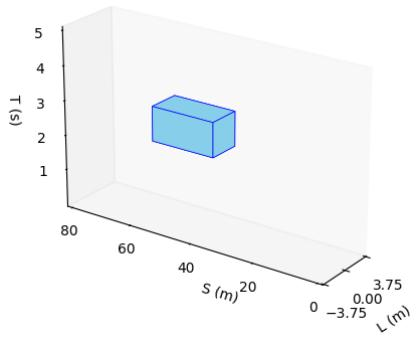

bar

| S (m) | L (m) |
|-------|-------|
| 40    | 3     |

Fig. 1. Voxel schematic diagram

Fig. 2 illustrates the process of removing collision-risk regions along the longitudinal axis. In Fig. 2(a), a voxel and the predicted trajectory of a preceding vehicle within its lateral bounds are shown for a given time interval. Fig. 2 (b) highlights in red the region deemed at risk of collision. Considering the rigid body characteristics of vehicles, an additional longitudinal buffer equivalent to half the vehicle length plus a safety margin ?????? $\dot { f } e r _ { s }$ is removed. To simplify computation, any feasible green regions within the red area are also excluded from the drivable space.

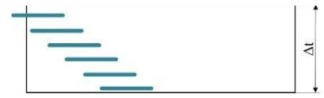

text_image

Δt

(a)

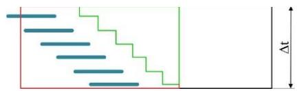

text_image

Diagram showing a stepped stepwise pattern with a vertical dimension labeled Δt

(b)   
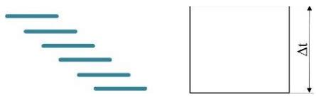

natural_image

Two geometric shapes: a stepped line and a rectangle with a vertical dimension labeled 'd' (no text or symbols beyond basic geometry)

(c)   
Fig. 2. Collision risk area elimination process

This study employs Time to Collision (TTC) as the safety distance model, formulated as follows:

$$
b u f f e r _ {s} = \left\{ \begin{array}{c} \left(v _ {r} - v _ {f}\right) t _ {T T C} + \delta , v _ {f} \leq v _ {r} \\ \delta , v _ {f} > v _ {r} \end{array} \right. \tag {1}
$$

$v _ { r }$ represents the velocity of the rear vehicle, and $v _ { f }$ denotes the velocity of the leading vehicle; $t _ { T T C }$ is the TTC threshold, set to 3 seconds in this work; ??is the minimum static following distance required when both vehicles travel at the same speed, set to 2 meters. Prior to generating the drivable free space, the temporal planning horizon—i.e., the maximum lanechange duration—must be determined. Since lane-change maneuvers influence vehicles on both the original and target lanes, it is essential to complete the maneuver efficiently to maintain traffic flow. This paper adopts a 5-second window as the planning horizon for lane changes. Each voxel’s initial width is set to match the width of the original lane. The voxel generation and expansion process is performed iteratively, based on the vehicle’s current longitudinal position $s _ { 0 }$ and longitudinal speed $v _ { 0 } ,$ using a fixed time step t. Assuming the starting time of the j‑th voxel $V _ { j }$ is known as $t _ { j } ^ { m i n }$ , the start and end times of the $( \mathrm { j } { + } 1 )$ ‑th voxel $V _ { j + 1 }$ —i.e., $t _ { j + 1 } ^ { m i n }$ and $t _ { j + 1 } ^ { m a x }$ — can be calculated using the fixed step size ∆t.

$$
t _ {j + 1} ^ {\text { min }} = t _ {j} ^ {\text { max }} \tag {2}
$$

$$
t _ {j + 1} ^ {\text { max }} = t _ {j + 1} ^ {\text { min }} + \Delta t \tag {3}
$$

Then the longitudinal starting position $s _ { j + 1 } ^ { m i n }$ of the j+1 voxel $V _ { j + 1 }$ 1 can be determined.

$$
T _ {t o v _ {m i n}} = \frac {v _ {m i n} - v _ {0}}{a _ {m i n}} \tag {4}
$$

$$
s _ {j + 1} ^ {m i n} = \left\{ \begin{array}{c} s _ {0} + v _ {0} t _ {t + 1} ^ {m i n} + \frac {1}{2} a _ {m i n} (t _ {j + 1} ^ {m i n}) ^ {2}, t _ {j + 1} ^ {m i n} <   T _ {t o _ {V _ {m i n}}} \\ s _ {0} + v _ {0} T _ {t o _ {V _ {m i n}}} + \frac {1}{2} a _ {m i n} (T _ {t o _ {V _ {m i n}}}) ^ {2} + \\ (t _ {t + 1} ^ {m i n} - T _ {t o _ {V _ {m i n}}}) \cdot v _ {m i n}, t _ {j + 1} ^ {m i n} \geq T _ {t o _ {V _ {m i n}}} \end{array} \right. \tag {5}
$$

Where $s _ { 0 }$ and $v _ { 0 }$ are the longitudinal position and longitudinal speed of the starting point of lane change of the vehicle respectively; $v _ { m i n }$ and $a _ { m i n }$ are the minimum speed and maximum deceleration respectively; $T _ { t o \_ V _ { m i n } }$ is the time required for the maximum deceleration degree $a _ { m i n }$ to decelerate from $v _ { 0 }$ to $v _ { m i n }$ . The vertical termination position is

$$
s _ {j + 1} ^ {\text { max }} = \left\{ \begin{array}{c} s _ {0} + v _ {0} t _ {t + 1} ^ {\text { max }} + \frac {1}{2} a _ {\text { max }} \left(t _ {j + 1} ^ {\text { max }}\right) ^ {2}, t _ {j + 1} ^ {\text { max }} <   T _ {t o _ {V _ {\text { max }}}} \\ s _ {0} + v _ {0} T _ {t o _ {V _ {\text { max }}}} + \frac {1}{2} a _ {\text { max }} \left(T _ {t o _ {V _ {\text { max }}}}\right) ^ {2} + \\ \left(t _ {t + 1} ^ {\text { max }} - T _ {t o _ {V _ {\text { max }}}}\right) v _ {\text { max }}, t _ {j + 1} ^ {\text { max }} \geq T _ {t o _ {V _ {\text { max }}}} \end{array} \right. \tag {6}
$$

$v _ { m a x }$ and $a _ { m a x }$ are the maximum vehicle speed and acceleration respectively; $T _ { t o \_ V _ { m i n } }$ is the time required for the maximum acceleration $a _ { m a x }$ to decelerate from $v _ { 0 }$ to $v _ { m a x } .$

The generation and expansion results of the voxel sequence on the original lane are illustrated in Fig. 3. Each voxel is determined based on the initial longitudinal position $s _ { 0 }$ and velocity $v _ { 0 }$ of the ego vehicle. Under the constraints of minimum velocity $v _ { m i n }$ , maximum deceleration $a _ { m i n }$ , maximum velocity $v _ { m a x }$ , and maximum acceleration $a _ { m a x } ,$ all positions within each voxel are reachable along the longitudinal axis. This approach effectively excludes unreachable regions within the planning horizon, thereby reducing the computational cost of subsequent trajectory generation.

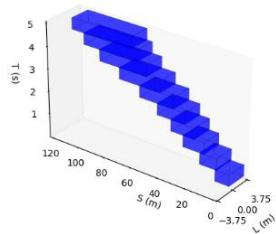

bar

| S (m) | L (m) |
|-------|-------|
| 0     | 120   |
| 3.75  | 100   |
| 60    | 80    |
| 80    | 60    |
| 100   | 40    |
| 120   | 20    |
| 140   | 0     |

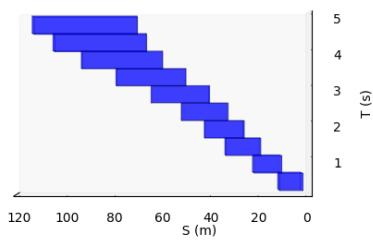

bar

| S (m) | T (s) |
|---|---|
| 120 | 5 |
| 100 | 4 |
| 80 | 3 |
| 60 | 2 |
| 40 | 1 |
| 20 | 1 |
| 0 | 1 |

Fig. 3. Generation and expansion results of voxel sequence on original Lane

The voxel sequence on the target lane is derived by extending the original lane’s voxel sequence. During this process, the only distinction lies in the lateral position of the voxels at each time step, while all other parameters remain unchanged. The width of voxels on the left lane is set to the width of the corresponding lane. Fig. 4 shows the extension from the original lane to the left lane voxel sequence. In this work, the combined set of voxel sequences from the original lane (in blue) and the target lane (in brown) is defined as the passable space, denoted by $O _ { p a s s a b l e }$

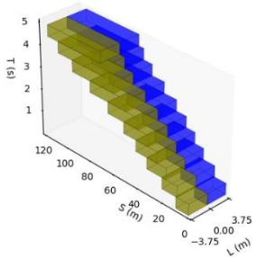

area_stacked

| S (m) | L (m) |
|-------|-------|
| 0     | 120   |
| 40    | 100   |
| 80    | 80    |
| 120   | 60    |
| 160   | 40    |
| 200   | 20    |
| 240   | 0     |
| 280   | -20   |
| 320   | -40   |
| 360   | -60   |
| 400   | -80   |
| 440   | -100  |
| 480   | -120  |
| 520   | -140  |
| 560   | -160  |
| 600   | -180  |
| 640   | -200  |
| 680   | -220  |
| 720   | -240  |
| 760   | -260  |
| 800   | -280  |
| 840   | -300  |
| 880   | -320  |
| 920   | -340  |
| 960   | -360  |
| 1000  | -380  |
| 1040  | -400  |
| 1080  | -420  |
| 1120  | -440  |
| 1160  | -460  |
| 1200  | -480  |

Fig. 4. Voxel sequence extending from original lane to left lane

# B. Generation of the Spatiotemporal Lane-Change Corridor

The previously constructed passable space $O _ { p a s s a b l e }$ includes all collision-free positions but lacks temporal continuity and explicit collision-risk filtering, limiting its suitability for trajectory generation. This section introduces a spatiotemporal corridor construction method to ensure continuity, feasibility, and safety.

Considering the dynamic interaction between the ego vehicle and surrounding traffic during an active lane change, the entire maneuver is divided into three sequential phases: prelane-change, mid-lane-change, and post-lane-change. Based on this division, a three-stage spatiotemporal corridor structure is proposed.

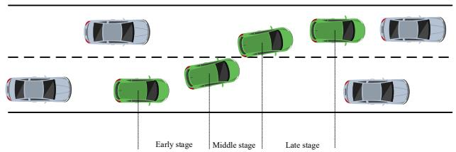

text_image

Early stage
Middle stage
Late stage

Fig. 5. Three stages of lane change

Voxel filtering is then performed accordingly. In the longitudinal direction, voxels corresponding to potential collisions with front or rear vehicles are removed. In the lateral direction, only the current lane’s space is retained during the preand post-phases, while both lanes are preserved during the midphase. The resulting corridor is illustrated in the Fig. 6 as a threestage spatiotemporal structure.

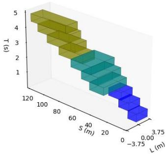

bar

| S (m) | L (m) | (s) |
|-------|-------|-----|
| 0     | -3.75 | 1   |
| 20    | 0     | 2   |
| 40    | 0.00  | 3   |
| 60    | 0.00  | 4   |
| 80    | 0.00  | 5   |
| 100   | 0.00  | 5   |
| 120   | 0.00  | 5   |

Fig. 6. Lane changing space time corridor

To ensure feasibility and temporal consistency, a trapezoidal velocity profile estimates the minimum duration for each lanechange phase, enforcing lateral velocity and acceleration limits. This guarantees phase durations exceed minimum thresholds, maintaining lateral dynamic constraints throughout the corridor.

As illustrated in Fig. 7, the trapezoidal velocity profile divides the lateral lane-change process into three phases: uniform acceleration, constant velocity, and uniform deceleration, with acceleration remaining constant within each phase.

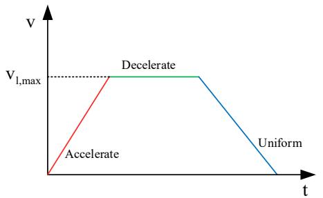

line

| t     | V       |
|-------|---------|
| 0     | 0       |
| 1.5   | V₁,max  |
| 1.5   | Decelerate |
| 1.5   | Uniform  |

Fig. 7. The lane change process is divided into three stages of speed change

In scenarios where the constant-velocity phase is absent, the lane change is completed using only the acceleration and deceleration phases. In this case, the maximum lateral velocity $v _ { f }$ is reached at the midpoint, and the durations of the acceleration and deceleration phases are equal:

$$
v _ {f} = \sqrt {\frac {2 a _ {l , m a x} a _ {l , m i n} (l _ {e n d} - l _ {0}) - a _ {l , m a x} v _ {l , e n d} ^ {2} + a _ {l , m i n} v _ {l , 0} ^ {2}}{a _ {l , m i n} - a _ {l , m a x}}} (7)
$$

$v _ { l , 0 }$ and $v _ { l , 0 }$ denote the initial and final lateral velocities of the lane change; $l _ { 0 }$ and $l _ { e n d }$ denote the initial and final lateral positions; $a _ { l , m i n }$ and $a _ { l , m a x }$ represent the minimum and maximum allowable lateral accelerations, set to $0 . 4 \mathrm { g }$ in this work [20]. By comparing the calculated $v _ { f }$ with the maximum allowed lateral velocity $v _ { l , m a x }$ , the presence of a constantvelocity phase can be determined. If $v _ { f } \le v _ { l , m a x }$ , then no constant-velocity phase exists, and the profile consists only of acceleration and deceleration stages. The time–position relationships for each phase can be described by the following equations.

$$
\begin{array}{l} l (t) \\ = \left\{ \begin{array}{c} l _ {0} + v _ {l, 0} t + \frac {1}{2} a _ {l, m a x} t ^ {2}, t \in [ 0, T _ {a} ] \\ l _ {0} + l _ {a} + v _ {v} (t - T _ {a}) + \frac {1}{2} a _ {l, m i n} (t - T _ {a}) ^ {2}, t \in [ T _ {a}, T _ {a} + T _ {d} ] \end{array} \right. \tag {8} \\ \end{array}
$$

Where $\begin{array} { r } { T _ { a } = \frac { v _ { v } - v _ { l , 0 } } { a _ { l , m a x } } } \end{array}$ ????−????,0 is the time of acceleration phase, ???? = $T _ { d } =$ ????,??????−???? is the time of deceleration phase. ???? = ????,0???? + $\frac { v _ { l , e n d } - v _ { v } } { a _ { l , m i n } }$ $l _ { a } = v _ { l , 0 } T _ { a } +$ $\textstyle \frac { 1 } { 2 } a _ { l , m a x } ( T _ { a } ) ^ { 2 }$ is the displacement in acceleration phase. $l _ { d } =$ $v _ { v } T _ { d } + \frac { 1 } { 2 } a _ { l , m i n } ( T _ { d } ) ^ { 2 }$ is the displacement in deceleration phase. If $v _ { f } > v _ { l , m a x } ,$ the lateral velocity $v _ { v }$ in the constant velocity section is the maximum lateral velocity $v _ { l , m a x }$ allowed in the lane changing process. At this time, there is a constant velocity section in the velocity curve, and the position time of each stage in the trapezoidal velocity curve can be described by the following formula:

$$
\begin{array}{l} l (t) \\ = \left\{ \begin{array}{c} l _ {0} + v _ {l, 0} + \frac {1}{2} a _ {l, m a x} t ^ {2}, t \in [ 0, T _ {a} ] \\ l _ {0} + l _ {a} + v _ {v} (t - T _ {a}), t \in [ T _ {a}, T _ {a} + T _ {v} ] \\ l _ {0} + l _ {a} + l _ {v} + v _ {v} (t - T _ {a} - T _ {v}) + \frac {1}{2} a _ {l, m i n} (t - T _ {a} - T _ {v}) ^ {2}, \\ t \in [ T _ {a} + T _ {v}, T _ {a} + T _ {v} + T _ {d} ] \end{array} \right. \tag {9} \\ \end{array}
$$

Where $\begin{array} { r } { T _ { v } = \frac { l _ { e n d } - l _ { 0 } - l _ { a } - l _ { d } } { v _ { v } } } \end{array}$ is the time of uniform velocity stage, and $l _ { v } = v _ { v } T _ { v }$ is the displacement of uniform velocity stage.

# C. Lane-Change Trajectory Generation

To ensure the smoothness and dynamic feasibility of the trajectory, the generation problem is formulated as a quadratic programming (QP) problem. The objective function is designed to minimize the trajectory’s jerk (i.e., the derivative of acceleration), which enhances vehicle stability and ride comfort. The QP problem is solved using the OOQP solver to optimize the Bézier control points, yielding a safe and dynamically consistent lane-change trajectory.

A Bézier curve $B ( t )$ is a parametric curve defined over the interval $t \in [ 0 , 1 ]$ , determined by a set of control points $p _ { i } ( i =$ $0 , 1 \ldots , m )$ , where ?? is the degree of the curve [21]. The general form of an ??-th order Bézier curve based on Bernstein polynomials is:

$$
B (t) = \sum_ {i = 0} ^ {m} P _ {i} \cdot b _ {m} ^ {i} (t), t \in [ 0, 1 ] \tag {10}
$$

Where in $b _ { m } ^ { i } ( t ) = \binom { m } { i } t ^ { i } ( 1 - t ) ^ { m - i }$ . In this work, Bézier curves are employed to represent both the lateral and longitudinal components of each trajectory segment. To ensure that each segment conforms to its respective time interval $[ t _ { j - 1 } , t _ { j } ]$ , a scaling factor $\alpha _ { j }$ is introduced to map the original domain [0,1] to $[ t _ { j - 1 } , t _ { j } ]$ . Additionally, a numerical scaling coefficient $\beta _ { j }$ is introduced to enhance stability during the optimization process. The resulting time-scaled Bézier curve is expressed as:

$$
f (t) = \beta_ {j} \sum_ {i = 0} ^ {m} p _ {i} \cdot b _ {m} ^ {i} \left(\frac {t - t _ {j - 1}}{\alpha_ {j}}\right), [ t _ {j - 1}, t _ {j} ] \tag {11}
$$

# D. Cost function

In this work, the cost function formulation focuses on minimizing the longitudinal and lateral jerks (i.e., the derivatives of acceleration). Jerk is a critical factor influencing both ride comfort and vehicle stability. A lower jerk implies smoother acceleration transitions, resulting in a more comfortable and stable lane-change maneuver. For the j-th trajectory segment, let $f ^ { \sigma } ( t )$ denote the scaled Bézier curve in the ?? direction. The corresponding jerk cost function is defined as:

$$
J _ {j} ^ {\sigma} = \int_ {t _ {j - 1}} ^ {t _ {j}} \left(\frac {d ^ {3} f _ {j} ^ {\sigma} (t)}{d t ^ {3}}\right) ^ {2} d t = \frac {1}{(\alpha_ {j}) ^ {3}} \int_ {0} ^ {1} \left(\frac {d ^ {3} f _ {j} ^ {\sigma} (t)}{d t ^ {3}}\right) ^ {2} d t \tag {12}
$$

Position Constraints for Lane-Change Trajectories: Since each voxel within the spatiotemporal lane-change corridor has been preprocessed to exclude regions with potential collision risks (e.g., obstacles and road boundaries), it is sufficient to ensure that each trajectory segment remains fully contained within its corresponding voxel to guarantee safety and collision avoidance. To achieve this, both the longitudinal and lateral Bézier curves of each trajectory segment must be constrained within the bounds of the corresponding voxel. For the longitudinal direction, this can be enforced by constraining all control points of the Bézier curve to lie within the voxel’s longitudinal bounds. The inequality constraint of the following formula needs to be imposed on dimension s:

$$
s _ {j} ^ {\text { min }} \leq \left(\alpha_ {j}\right) ^ {1 - k} \cdot q _ {j, i} ^ {s} \leq s _ {j} ^ {\text { max }}, (k = 0, i = [ 0, 5 ]) \tag {13}
$$

On Dimension l, the inequality constraint of the following formula needs to be applied:

$$
l _ {j} ^ {\text { min }} \leq \left(\alpha_ {j}\right) ^ {1 - k} \cdot q _ {j, i} ^ {s} \leq l _ {j} ^ {\text { max }}, (k = 0, i = [ 0, 5 ]) \tag {14}
$$

Dynamic constraint of lane change trajectory: the application of dynamic constraint is similar to the application of position constraint of lane change trajectory above. In order to make the speed of the scaled Bezier curve $f _ { j } ^ { \sigma } ( t )$ of segment j on the σ dimension at $[ v _ { j , - } ^ { \sigma } , v _ { j , + } ^ { \sigma } ]$ , the inequality constraint of the following formula is applied:

$$
v _ {j, -} ^ {\sigma} \leq \left(\alpha_ {j}\right) ^ {1 - k} \cdot q _ {j, i} ^ {\sigma , (k)} \leq v _ {j, +} ^ {\sigma}, (k = 1, i = [ 0, 4 ]) \tag {15}
$$

In order to make the acceleration of the scaled Bezier curve of the j segment in the σ dimension within the range of $[ a _ { j , - } ^ { \sigma } , a _ { j , + } ^ { \sigma } ] .$ it is necessary to impose control constraints on the second derivative of $f _ { j } ^ { \sigma } ( t )$ :

$$
a _ {j, -} ^ {\sigma} \leq \left(\alpha_ {j}\right) ^ {1 - k} \cdot q _ {j, i} ^ {\sigma , (k)} \leq a _ {j, +} ^ {\sigma}, (k = 2, i = [ 0, 3 ]) \tag {16}
$$

Continuity constraint of lane change trajectory: in order to ensure that the position, speed, acceleration and acceleration of the generated lane change trajectory $f ( t )$ are continuous, the position, speed, acceleration and acceleration of the longitudinal curve $f ^ { s } ( t )$ and the transverse curve $f ^ { l } ( t )$ of the lane change trajectory must be continuous, so continuity constraint needs to be imposed:

$$
\frac {d ^ {k} f _ {j} ^ {\sigma} (t _ {j})}{d t ^ {k}} = \frac {d ^ {k} f _ {j + 1} ^ {\sigma} (t _ {j})}{d t ^ {k}}, (k = 0, 1, 2, 3) \tag {17}
$$

Wher $\cdot \frac { d ^ { k } f _ { j } ^ { \sigma } ( t _ { j } ) } { d t ^ { k } }$ and $\frac { d ^ { k } f _ { j + 1 } ^ { \sigma } ( t _ { j } ) } { d t ^ { k } }$ are the last control point of the jth curve and the first control point of the j+1 curve on the σ dimension, respectively.

Constraints on the end point of lane change planning: since each Bezier curve must pass through its last control point, it is only necessary to constrain the state of the last control point of the scaled Bezier curveplanning start poin $f _ { n } ^ { \sigma } ( t )$ $[ \sigma _ { t _ { n } } ^ { ( 0 ) } , \sigma _ { t _ { n } } ^ { ( 1 ) } , \sigma _ { t _ { n } } ^ { ( 2 ) } ]$ ?????? , ?????? mension to the state of the , and then the constraints on the planning end point can be imposed:

$$
(\alpha_ {n}) ^ {1 - k} \cdot q _ {n, m - k} ^ {\sigma , (k)} = \sigma_ {t _ {n}} ^ {(k)}, (k = 0, 1, 2) \tag {18}
$$

So far, the trajectory generation problem is transformed into a quadratic programming (QP) problem, and the ooqp solver is used to solve the horizontal and vertical curves at the same time.

# IV. EXPERIMENT

Based on the proposed method, a typical highway lanechange scenario was constructed to validate the effectiveness of the trajectory planning algorithm. As illustrated in Fig. 8, the ego vehicle operates in a dual-lane same-direction highway environment. The road surface friction coefficient is set to $\varphi =$ 0.8 and remains constant. The road is straight, without ramps or intersections, ensuring a simplified traffic setting. The ego vehicle starts in the right lane at an initial speed of $v _ { M } =$ $8 0 k m / h ,$ , The leading vehicle in the same lane $F _ { 0 }$ is 23 meters ahead and travels at 70 km/h. In the target lane, the preceding vehicle $F _ { 1 }$ is 20 meters ahead at 85km/h, while the rear vehicle $R _ { 1 }$ is 22 meters behind traveling at 80km/h.

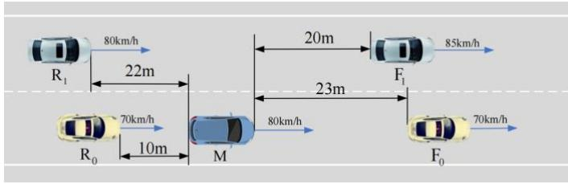

text_image

R₁
80km/h
22m
R₀
70km/h
10m
M
20m
F₁
85km/h
23m
80km/h
F₀
70km/h

Fig. 8. Schematic diagram of lane changing conditions

Simulation parameters are set as follows: maximum lateral acceleration $a _ { l , m a x } { = } 0 . 4 \mathrm { g }$ , maximum lateral velocity $v _ { l , m a x } =$ $2 . 5 m / s$ , time step $\Delta t = 0 . 1 s$ , and lateral safety $b u f f e r _ { L } =$ 0.5?? . The optimized phase timing for the lane-change maneuver is: middle phase starting at $t _ { c _ { 1 } } = 1 . 6 s$ , ending at $t _ { c _ { 2 } } = 2 . 8 \mathrm { s }$ , and post-change phase ending at $t _ { c _ { 3 } } = 4 . 6 s$ , with the corresponding spatiotemporal corridor shown in the Fig. 10.

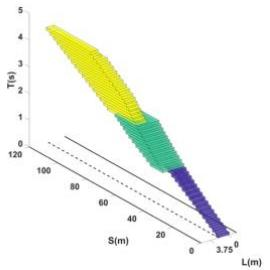

area

| S(m) | T(s) |
|------|------|
| 0    | 5    |
| 20   | 4    |
| 40   | 3    |
| 60   | 2    |
| 80   | 1    |
| 100  | 0    |

Fig. 9. Lane changing space time corridor

Using the optimized corridor, the trajectory is generated by solving a quadratic programming problem. To balance comfort in both longitudinal and lateral directions, the cost weights are set to $w _ { s } = w _ { l } = 0 . 5$ . The resulting trajectory is shown in the accompanying figures.

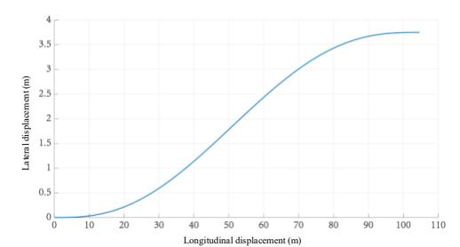

line

| Longitudinal displacement (m) | Lateral displacement (m) |
| ---------------------------- | ------------------------ |
| 0                            | 0.0                      |
| 10                           | 0.1                      |
| 20                           | 0.5                      |
| 30                           | 1.0                      |
| 40                           | 1.8                      |
| 50                           | 2.5                      |
| 60                           | 3.0                      |
| 70                           | 3.3                      |
| 80                           | 3.5                      |
| 90                           | 3.6                      |
| 100                          | 3.7                      |
| 110                          | 3.7                      |

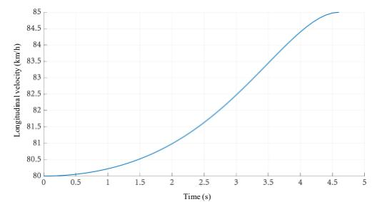

line

| Time (s) | Longitudinal velocity (km/h) |
| -------- | ---------------------------- |
| 0        | 80                           |
| 0.5      | 80                           |
| 1        | 80.2                         |
| 1.5      | 80.6                         |
| 2        | 81                           |
| 2.5      | 81.6                         |
| 3        | 82.4                         |
| 3.5      | 83.2                         |
| 4        | 84                           |
| 4.5      | 84.7                         |
| 5        | 85                           |

(b)   
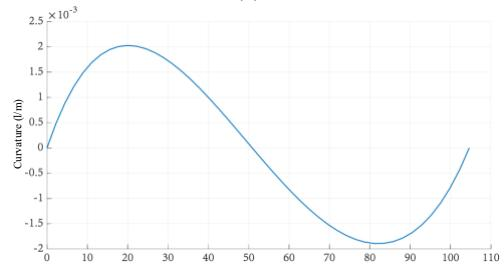

line

| x    | Curvature (l/m) |
| ---- | --------------- |
| 0    | 0.0             |
| 20   | 2.0             |
| 40   | 1.0             |
| 60   | -1.0            |
| 80   | -2.0            |
| 100  | -1.0            |
| 110  | 0.0             |

(c)   
Fig. 10. Change of parameters related to lane change trajectory

From Fig. 10(a) and (b), the lane-change trajectory is smooth and continuous. The vehicle gradually accelerates to match the target lane’s speed of 85km/h, achieving a rapid transition to a car-following state and enhancing efficiency in the target lane. Fig. 10(c) presents the curvature variation along the path, with a maximum curvature of only $0 . 0 0 2 m ^ { - 1 }$ , indicating excellent ride comfort and dynamic smoothness. These results confirm the feasibility and effectiveness of the proposed spatiotemporal corridor-based lane-change trajectory planning method.

# V. CONCLUSION

This paper presents a spatiotemporal-corridor-based lanechange trajectory planning method for intelligent vehicles, including corridor construction and trajectory generation. A voxel-based structure in the Frenet frame defines a collision-free drivable space, with the lane-change process divided into preparation, execution, and completion phases. Each phase has a dedicated spatiotemporal corridor formed by voxels filtered based on traffic interactions. Phase durations are constrained using a trapezoidal velocity model and planning horizon, establishing lateral feasibility. A multi-objective optimization model generates an optimal corridor balancing safety, comfort, and efficiency. Finally, segmented Bézier curves and quadratic programming yield a dynamically feasible trajectory. Simulations in highway scenarios validate the method’s effectiveness and smoothness.

# REFERENCES

[1] MA Y, YIN B, JIANG X, et al. Psychological and environmental factors affecting driver's frequent lane‐changing behaviour: A national sample of drivers in China[J]. IET Intelligent Transport Systems, 2020, 14(8): 825-33.   
[2] GONZáLEZ D, PéREZ J, MILANéS V, et al. A review of motion planning techniques for automated vehicles[J]. IEEE Transactions on intelligent transportation systems, 2015, 17(4): 1135-45.   
[3] ZHANG T, SONG W, FU M, et al. A unified framework integrating decision making and trajectory planning based on spatio-temporal voxels for highway autonomous driving[J]. IEEE Transactions on Intelligent Transportation Systems, 2021, 23(8): 10365-79.   
[4] FAN H, ZHU F, LIU C, et al. Baidu apollo em motion planner[J]. arXiv preprint arXiv:180708048, 2018.   
[5] MINH V T, PUMWA J. Feasible path planning for autonomous vehicles[J]. Mathematical Problems in Engineering, 2014, 2014(1): 317494.   
[6] CHEN Cheng, HE Yu-Qing, BU Chun-Guang, et al. Feasible Trajectory Generation for Autonomous Vehicles Based on Quartic B´ezier Curve [J]. ACTA AUTOMATICA SINICA, 2015, 41(3): 486-96.   
[7] ELBANHAWI M, SIMIC M, JAZAR R. Improved manoeuvring of autonomous passenger vehicles: Simulations and field results[J]. Journal of Vibration and Control, 2017, 23(12): 1954-83.   
[8] WERLING M, ZIEGLER J, KAMMEL S, et al. Optimal trajectory generation for dynamic street scenarios in a frenet frame[C. IEEE.   
[9] YAN Yao, LI Chun-shu, TANG Feng-min. Lane-changing trajectory planning of the autonomous vehicle based on the quintic polynomial model [J]. Journal of Machine Design, 2019, 000(8): 6.   
[10] MEHDI S B, CHOE R, HOVAKIMYAN N. Avoiding multiple collisions through trajectory replanning using piecewise Bézier curves[C. IEEE.   
[11] CHEN L, QIN D, XU X, et al. A path and velocity planning method for lane changing collision avoidance of intelligent vehicle based on cubic 3- D Bezier curve[J]. Advances in Engineering Software, 2019, 132: 65-73.   
[12] LIANG Z, ZHENG G, LI J. Automatic parking path optimization based on bezier curve fitting[C. IEEE.   
[13] YANG K, SUKKARIEH S. An analytical continuous-curvature pathsmoothing algorithm[J]. IEEE Transactions on Robotics, 2010, 26(3): 561-8.   
[14] PIVTORAIKO M, KNEPPER R A, KELLY A. Differentially constrained mobile robot motion planning in state lattices[J]. Journal of Field Robotics, 2009, 26(3): 308-33.   
[15] KUSHLEYEV A, LIKHACHEV M. Time-bounded lattice for efficient planning in dynamic environments[C. IEEE.   
[16] CHOI J. Kinodynamic motion planning for autonomous vehicles[J]. International journal of advanced robotic systems, 2014, 11(6): 90.   
[17] ALTCHé F, DE LA FORTELLE A. Partitioning of the free space-time for on-road navigation of autonomous ground vehicles[C. IEEE.   
[18] LUO J, YUAN M, PU H, et al. Trajectory planning for autonomous driving based on spatio-temporal corridor[C. IEEE.   
[19] DEOLASEE S, LIN Q, LI J, et al. Spatio-temporal motion planning for autonomous vehicles with trapezoidal prism corridors and Bézier curves[C. IEEE.   
[20] SHIM T, ADIREDDY G, YUAN H. Autonomous vehicle collision avoidance system using path planning and model-predictive-control-based active front steering and wheel torque control[J]. Proceedings of the Institution of Mechanical Engineers, Part D: Journal of automobile engineering, 2012, 226(6): 767-78.   
[21] MNIH V, KAVUKCUOGLU K, SILVER D, et al. Human-level control through deep reinforcement learning[J]. nature, 2015, 518(7540): 529-33.