# Robust Tunable Trajectory Repairing for Autonomous Vehicles Using Bernstein Basis Polynomials and Path-Speed Decoupling

Kailin Tong1, Selim Solmaz1, Martin Horn2, Michael Stolz1,2 and Daniel Watzenig1,2

Abstract— Adaptation to changing dynamic situations is yet an open problem for automated driving systems that require robust and efficient solutions. Particularly in the context of motion planning algorithms, this problem is typically addressed by re-planning the whole trajectory or repairing the invalid part. The main drawback of all the current approaches is the increased demand for computational resources, a critical safety issue in automated vehicles. Motivated by this, in this paper we propose a novel and efficient method for trajectory repairing utilizing Bernstein basis polynomials and path-speed decoupling. A robustness metric is introduced to tune the driving behavior. Accurate numerical simulations indicate performance figures typically better than 25ms for a feasible solution in representative driving scenarios, which was not achievable in other state-of-the-art approaches.

# I. INTRODUCTION

Analysis of recent accident statistics [1] indicates that despite strenuous testing efforts, autonomous vehicles (AVs) still fail to make the right decisions from time to time, potentially leading to property damages or even injuries, particularly in emergency situations. In a dynamic traffic scenario, the behavior of other vehicles might suddenly change and lead to a hazardous situation. From the perspective of an automated driving system, a common way to manage such a situation is to re-plan and update the trajectory from the current state to the target one. This would, however, require searching for alternative trajectories on a continuous basis. A more efficient approach would be first to detect the part of an invalid trajectory that can stay unchanged and then repair only the remaining part of it [2]. The main benefit of this is the elimination of the need to re-plan the whole trajectory continuously, as well as increased robustness against small disturbances.

In this paper, we propose a novel and efficient framework for cut-off state detection and trajectory repairing by exploit-

\* This project has received funding from the European GNSS Agency under the European Union’s Horizon 2020 research and innovation programme under grant agreement No 101004181. The publication was written at Virtual Vehicle Research GmbH in Graz and partially funded within the COMET K2 Competence Centers for Excellent Technologies from the Austrian Federal Ministry for Climate Action (BMK), the Austrian Federal Ministry for Digital and Economic Affairs (BMDW), the Province of Styria (Dept. 12) and the Styrian Business Promotion Agency (SFG). The Austrian Research Promotion Agency (FFG) has been authorised for the programme management.   
1 K. Tong, S. Solmaz, M. Stolz and D. Watzenig are with Virtual Vehicle Research GmbH, Inffeldgasse 21a, 8010 Graz, Austria. {kailin.tong, selim.solmaz, michael.stolz, daniel.watzenig}@v2c2.at   
2 M. Horn, M. Stolz and D. Watzenig are with the Institute of Automation and Control at Graz University of Technology, Inffeldgasse 21b, 8010 Graz, Austria. martin.horn@tugraz.at

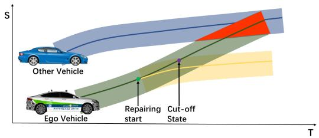

flowchart

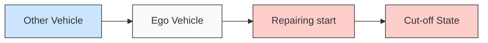

(a) Speed Repairing in S-T domain. The motion of the ego vehicle and the other vehicle in the current ego lane is projected into the S-T domain   
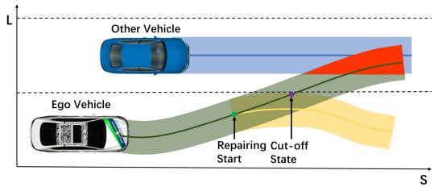

flowchart

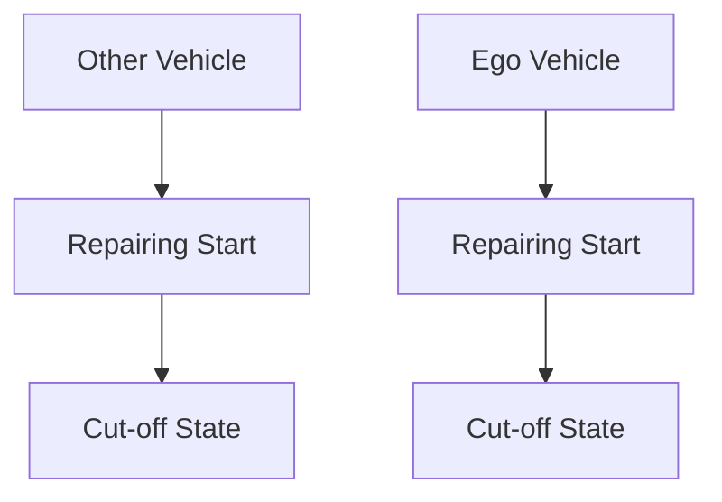

(b) Path Repairing in L-S domain. The motion of the ego vehicle and the other vehicle is projected into the L-S domain in curvilinear coordinates.   
Fig. 1: Trajectory repairing utilizing path-speed decoupling.

ing the property of Bernstein Basis Polynomials and Path-Speed Decoupling. Compared to the existing literature, the contributions that we report in this paper are summarized as follows:

• Formulation of a general convex optimization problem using Bernstein Polynomials for both path and speed repairing, considering kinematic constraints. The algorithm extends speed profile optimization [3] into path optimization using a same problem formulation but with kinematic path constraints. Our implementation is based on Python but is already real-time capable.   
• Proposing an efficient and real-time capable scheme to identify the critical time/distance to react and repair the speed profile and the path with safety assurance.   
• The first formal definition of a robustness metric (α) for a fail-safe motion planner. It is a parameter that can balance trajectory re-planning and repairing, as well as comfort and robustness, which enables high-level tuning of automated driving behavior.

# II. RELATED WORK

# A. Computation of Time-To-X

One commonly used safety metric is Time-To-X (TTX), where X refers to the corresponding reaction in the collision path. For example, Time-to-Collision (TTC) measures the time to collision and guides whether the AD (Automated Driving) system should send a warning to the driver or intervene directly [4]. Other metrics in this family are as follows: TTB (Time-To-Brake) indicates the time to braking with maximum deceleration; TTK (Time-To-Kickdown) indicates the time to reach the maximum velocity with full acceleration; TTS (Time-To-Steer) indicates the time to fully steer to the left or right with the maximum steering angle. Furthermore, the Time-To-React (TTR) has been proposed as a worst-case metric taking account of all Time-To-X metrics mentioned above [5]. The concept of TTX can be extended in the spatial axes, and define metrics such as DTB (Distance-To-Brake), DTS (Distance-To-Steer), DTC (Distance-To-Collision), DTM (Distance-To-Maneuver), and DTR (Distance-To-React) [6].

Generally, there are two ways to calculate TTX online: using empirical estimates or by forward simulation. Schratter et al. [7] use an empirical formula based on the current ego state and surrounding states to estimate TTB and TTS, and, finally, estimate the collision risk for decision-making of an emergency maneuver. Their proposed collision avoidance system can handle the pedestrian-crossing scenario in an occluded area. However, extending this approach to more general critical scenarios is not straightforward.

In the scope of forward simulation for TTX calculation, reachable set analysis has been applied in the literature for searching for TTR [8]. However, this provides an overapproximation of the true TTR. In [2], [9], TTX is obtained by a modified binary search using realistic emergency maneuver models. Therefore, it can compute TTX values with defined accuracy and handle scenarios with multiple static and dynamic obstacles. However, they give the same importance to longitudinal emergency maneuvers (TTB, TTK) and lateral ones (TTS), which is counterintuitive.

As a commonsense behavior in a very typical driving situation, e.g., when facing an emergency on the ego lane, the driver preferably attempts to adapt the speed, if not feasible, then tries to steer the car to avoid an accident. In this work, we use a hierarchical search scheme mimicking this behavior for calculating TTR (or DTR) to improve search efficiency.

# B. Planning schemes

Unlike other literature, which classifies planning algorithms by their problem formulations [10], we classify the planning scheme into two groups: re-planning and repairing.

1) Re-planing: When an agent navigates in a physical world, the agent’s action shall depend on information gathered during execution, termed as Feedback Motion Planning in [11], or more simply re-planning. The re-planning scheme has been commonly adopted in Autonomous Driving Software Stacks, such as Baidu Apollo [12]. After a re-planning, graph search-based planners and sampling-based planners have the chance to obtain a global optimal result (assuming no time limit); however, the newly planned trajectory might diverge from the previous quite a lot. As a result, the trajectory tracking might be unstable. On the contrary, numerical optimization approaches rely on the previous planning result, and the newly planned trajectory still follows the original one, but the result is only local optimum. To relieve the effort of re-planning, Apollo EM (Expectation and Maximization) planner proposes a path-speed decoupled iterative optimization scheme [12]. Our work is also motivated by the EM-type iterative algorithm.

2) Repairing: Unlike re-planning, repairing means that only the necessary part of a reference trajectory is changed due to environmental disturbances. This concept has been widely used in the robotics domain as well as for UAVs (Unmanned Aerial Vehicles), and UGVs (Unmanned Ground Vehicles), in the form of local re-planning [13] and trajectory deformation [14]. However, they are not explicitly intended for AVs and do not necessarily provide safety assurance. The point of “repairing” depends strictly on the optimization setup. Most recently, Lin et al. proposed a sampling-based trajectory repairing algorithm using closed-loop rapidlyexploring random trees (CL-RRT) and developed a safety assurance scheme for the repaired evasive maneuver. However, the sampling-based approach relies on randomness, which is computationally expensive in some scenarios as it is not easy to sample nodes in a “narrow passage”, which is a typical problem of sampling-based planners.

# III. PRELIMINARIES

# A. Vehicle Model and Configuration Space

We use a kinematic bicycle model [11] in this work as shown in Fig. 2. A two-wheel bicycle represents a fourwheeled vehicle, with the front wheel in the center of the front axle and the rear wheel in the center of the rear axle. Due to the steering angle δ , the vehicle cannot drive sideways and drives on a circle with a radius $R = L / t a n ( \delta )$ , where L denotes the distance between the front and rear axles. For the path planning problem for AVs, we define a configurationspace or C-space as $\chi \subset \mathbb { R } ^ { n }$ . The road curvature in the vehicle C-space is defined as $\kappa = 1 / R$ .

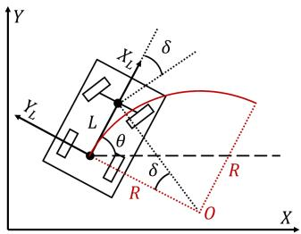

text_image

Y
X
L
θ
δ
R
O
X
Y_L
X_L
δ
R

Fig. 2: Illustration of bicycle model.

We use the Frenet frame representation for 2D space ´ because it is suitable for structured environments and traffic semantics modeling [15]. Usually, the driving reference line is extracted from an HD (High-Definition) map. In a Frenet´ frame, the space is decoupled into two orthogonal axes s and l (see Fig. 3). The vehicle states in a Cartesian frame are decoupled in the lateral and longitudinal directions. The states of the tracked objects are also projected into the Frenet´ frame.

A point in the C-space represents the ego vehicle. Road boundary considering ego vehicle width is used as the lower and upper bounds in the Frenet frame. Other traffic ´ participants also need to be represented in the C-space. We adopt the safety ellipse to inflate the occupancy of other vehicles. As shown in Fig. 3, the semi-major axis and semiminor axis of the safety ellipse are denoted as $S _ { \mathrm { o f f s e t } }$ and $L _ { \mathrm { o f f s e t } }$ respectively.

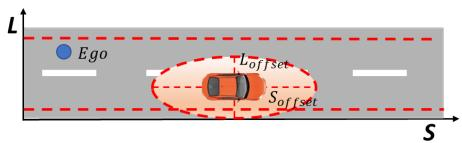

text_image

L
Ego
L_offset
S_offset
S

Fig. 3: Illustration of configuration space

# B. Bezier Curve and B ´ ezier Trajectory ´

The Bernstein basis is defined as $b _ { n } ^ { i } ( x ) = { \binom { n } { i } } \cdot x ^ { i } \cdot ( 1 -$ $x ) ^ { n - i } , x \in [ 0 , 1 ]$ . The polynomial function represented by linear combinations of the Bernstein basis is called a Bezier ´ curve. A Bezier curve of degree ´ n is expressed as follows:

$$
B (x) = c ^ {0} b _ {n} ^ {0} (x) + c ^ {1} b _ {n} ^ {1} (x) + \dots + c ^ {n} b _ {n} ^ {n} (x) = \sum_ {i = 0} ^ {n} c ^ {i} b _ {n} ^ {i} (x) \tag {1}
$$

where the polynomial coefficients $[ c ^ { 0 } , c ^ { 1 } , \cdots , c ^ { n } ]$ symbolized as c are the vector of control points for the Bezier curve. ´ Compared to a monomial basis polynomial, the Bernstein basis polynomial has the following properties [16]:

1) Fixed interval. The Bezier curve with respect to vari- ´ able x is defined on $x \in [ 0 , 1 ]$ .   
2) End point interpolation. The Bezier curve always be- ´ gins with the first control point, and terminates at the last control point, but does not pass other control points.   
3) Convex hull. The Bezier curve ´ $B ( x )$ comprises a set of control points c that lie entirely within the convex hull defined by all these control points. If the control points of the Bezier curve satisfy ´ $p \leq c ^ { i } \leq \bar { p } .$ , ∀i ∈ $\{ 0 , 1 , \cdots , n \}$ , it follows that $p \leq B ( x ) \leq \bar { p } , \forall x \in [ 0 , 1 ]$   
4) Hodograph. A hodograph is denoted as the derivative curve $\bar { B } ^ { ( 1 ) } ( t )$ of the Bezier curve ´ $B ( x )$ and is always a Bezier curve with control points satisfying ´ $c ^ { i , 1 } = n$ · $( c ^ { i + 1 , 0 } - c ^ { i , 0 } )$ , where n is the polynomial degree.

The Bezier curve is defined on a fixed interval ´ $[ 0 , 1 ]$ . To get an interval of arbitrary length for each trajectory segment, we need a scale factor h to scale any x assigned to that segment. Thus, the basic Bernstein piecewise trajectory with m segments can be written as follows [16]:

$$
f (x) = \left\{ \begin{array}{l} h _ {0} B _ {0} \left(\frac {x - X _ {0}}{h _ {0}}\right), x \in \left[ X _ {0}, X _ {1}\right) \\ h _ {1} B _ {1} \left(\frac {x - X _ {1}}{h _ {1}}\right), x \in \left[ X _ {1}, X _ {2}\right) \\ \dots \\ h _ {m - 1} B _ {m - 1} \left(\frac {x - X _ {m - 1}}{h _ {m - 1}}\right), x \in \left[ X _ {m - 1}, X _ {m} \right] \end{array} \right. \tag {2}
$$

where $B _ { j } ( t )$ is the $j \mathrm { - t h }$ Bezier polynomial. ´ $c _ { j } ^ { i }$ is the i-th control point of the $j \mathrm { - t h }$ segment of the whole trajectory. $X _ { 1 } , X _ { 2 } , \cdots , X _ { m }$ are the interval end of each segment. The total interval length is $X = X _ { m } - X _ { 0 } . \ h _ { 0 } , h _ { 1 } , \cdots , h _ { m - 1 }$ are the scale factors for each piece of the trajectory, such that the interval of a Bezier polynomial is scaled from ´ [0, 1] to the interval $[ X _ { j - 1 } , X _ { j } ]$ allocated in one segment.

To support the further formulation of the optimization problem, we give some important definitions and theorems. The arbitrary j-th piece of a Bezier trajectory ´ $f ( x )$ is denoted by $f _ { j } ( x )$ .

Definition 1 (Collision-free Space Ω): Assuming that the occupancy of all obstacles at time t in the configuration space χ is known and denoted as $O c c ( t )$ . The set $\Omega ( t ) \subset \chi$ is the set of collision-free states at time t without collision with $O c c ( t )$ , i.e. $\Omega ( t ) = \chi \backslash O c c ( t )$ .

Definition 2 (Convex Corridor Scor): A convex set in Ω is called a convex corridor, denoted as $S ^ { c o r } . \ I f \ f _ { j } ( x )$ resides in $S ^ { c o r }$ for convex hull property, $f _ { j } ( x )$ is collision-free.

Theorem 1 [16]: Assume that an arbitrary control point of $f _ { j } ( x )$ satisfies $c _ { j } ^ { i } \in \{ c _ { j } ^ { i } | \underline { { p } } _ { j } ^ { 0 } \leq h _ { j } c _ { j } ^ { i } \leq \bar { p } _ { j } ^ { 0 } \}$ , where $\underline { { p } } _ { i } ^ { 0 }$ and $\bar { p } _ { j } ^ { 0 }$ denote the lower bound and upper bound bias, respectively. Then the convex corridor $\bar { S ^ { c o \bar { r } } } = \{ ( x , y ) | \underline { { { p } } } _ { i } ^ { 0 } \leq y \leq \bar { p } _ { j } ^ { 0 } , x \in$ $[ X _ { j } , X _ { j + 1 } ] \}$ is also a rectangular corridor, denoted as $S ^ { r e c }$ , where $f _ { j } ( x )$ is a collision-free trajectory residing in $S ^ { r e c }$ .

Theorem 1 is an extension of convex hull property. The optimization of Bezier trajectories with ´ $S ^ { r e c }$ has been applied in UAVs [16], and AVs [17]. Furthermore, by combining the convex hull property and hodograph property, we can use control points to constrain the Bezier trajectory’s hodograph, ´ such as the trajectory’s velocity, acceleration, and jerk.

Lemma 1 [3]: Let $M \in \mathbb { R } ^ { ( n + 1 ) \times ( n + 1 ) }$ denote a change of basis matrix from Monomial basis $( 1 , x , \ldots , x ^ { n } )$ to Bernstein basis $( b ^ { 0 } ( x ) , \dot { b } ^ { 1 } ( x ) , \dots , b ^ { n } ( x ) )$ . We have $M _ { i , 0 } = 1 , 0 \leq M _ { i , j } \leq$ $1 , i \in \{ 0 , 1 , \cdots , n \} , j \in \{ 0 , 1 , \cdots , n \}$ .

Theorem 2: Assume that an arbitrary control point of $f _ { j } ( x )$ satisfies $c _ { j } ^ { i } \in \{ c _ { j } ^ { i } | \underline { { p } } _ { j } ^ { 0 } + h _ { j } \underline { { p } } _ { j } ^ { 1 } M _ { i , 1 } \leq h _ { j } c _ { j } ^ { i } \leq \bar { p } _ { j } ^ { 0 } +$ $h _ { j } \bar { p } _ { j } ^ { 1 } M _ { i , 1 } \}$ , where $\underline { { p } } _ { j } ^ { 0 } , \underline { { p } } _ { j } ^ { 1 }$ are the lower bound bias and skew, and $\bar { p } _ { j } ^ { 0 } , \bar { p } _ { j } ^ { 1 }$ are the upper bound bias and skew. Then the convex corridor $\begin{array} { r } { S ^ { c o r } = \{ ( x , y ) | \underline { { p } } _ { j } ^ { 0 } + h _ { j } \underline { { p } } _ { j } ^ { 1 } \frac { x - X _ { j } } { h _ { j } } \leq y \leq \bar { p } _ { j } ^ { 0 } + } \end{array}$ h j p¯1j x−X jh j , $\begin{array} { r } { h _ { j } \bar { p } _ { j } ^ { 1 } \frac { x - X _ { j } } { h _ { i } } , x \in [ X _ { j } , X _ { j + 1 } ] \} } \end{array}$ is also a trapezoidal corridor, denoted as $S ^ { t r a }$ , where $f _ { j } ( x )$ is a collision-free trajectory residing in Stra. $S ^ { t r a } .$

The proof of Theorem 2 in [3] does not consider the scale factor. We corrected the proof in our work. $S ^ { t r a }$ can more accurately approximate Ω than $S ^ { r e c }$ , which has been applied in speed profile optimization in [3]. Our work implements $S ^ { t r a }$ for both speed and path optimization for its simplicity and sufficient accuracy. It should also be noted that the most recent work [18] provides a sufficient condition for convex hull property for more general convex corridors.

# C. Robust Trajectory Repairing

Fig. 4 illustrates the relationships of the necessary definitions for the robust trajectory repairing method, which are described next.

Definition 3 (XTR): XTR is the maximum metric that the ego vehicle can follow the reference trajectory $u \big ( [ x _ { 0 } , x _ { h } ] \big )$ with respect to variable x for which a collision-free trajectory is guaranteed. x0 is the initial state, xh is the horizon. x can be time t or distance s, correspondingly we have TTR or DTR.

Definition 4 (Cut-off State): In the real world, every dynamic system has actuation delays and errors. ∆X denotes here the compensation time or distance for the actuation delay. Subtracting ∆X from XTR, we get the cut-off state, which is the maximal X where the AD system must execute an evasive maneuver.

Definition 5 (α-Robustness): Due to changes in driving conditions, a collision is likely to happen at XTC (X-To-Collision), and a critical XTR is respectively identified. α in [0, 1] denotes the robustness metric for a choice of a feasible state $X _ { f }$ (t or s) to react. We then define α-Robustness as $\alpha X _ { f } = \alpha \cdot ( X T R - \Delta X )$ , which indicates the state (t or s) at which the repairing will start.

Tuning α is straightforward. With a smaller α, a larger segment of the reference trajectory must be repaired; the AD system is more sensitive to driving condition changes but provides a more comfortable reaction. On the contrary, with a larger $\alpha ,$ a smaller segment of the reference trajectory must be repaired, and the AD system is more robust against driving condition changes; however, the maneuver is more aggressive due to approaching the critical point. If α is $0 ,$ the planning scheme is the same as replacing the trajectory (re-planning). If α is 1, the planning scheme is the same as repairing.

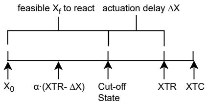

flowchart

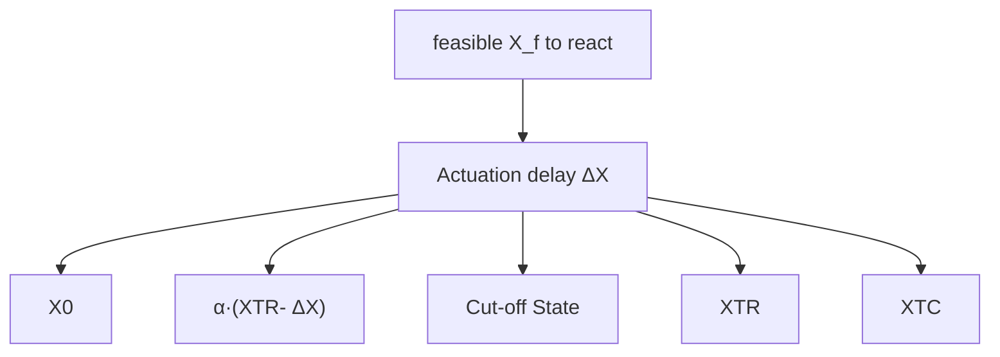

Fig. 4: Illustration of α-robustness

# IV. OVERALL APPROACH

Fig. 5 gives an overview of the proposed trajectory repairing scheme. We first detect that the initial reference trajectory violates the traffic rule or potentially causes a collision. The first option is to adapt the ego vehicle velocity, and we search for TTR in the S-T domain. If adjusting the speed to avoid the traffic rule violation is possible and proper (e.g., not leading to a full stop), the speed repairing is activated, and the updated speed profile is further given to the control and actuation layer. However, suppose abating the speed is impossible or improper. In this case, we compute the DTR in the L-S domain and check if it is possible and proper to avoid traffic rule violations. If it is, the path repairing is activated, and speed repairing is again executed to update the speed profile for the new path. If it is not, AEB (Automatic Emergency Braking) system is triggered and performs an emergency brake.

# A. Cut-off State Detection

To provide sufficient space for possible driving maneuvers from the cut-off state, we need to under-approximate the XTR considering evasive maneuvers related to speed (i.e., brake and kick-down) and evasive maneuvers related to the path (i.e., steering left or right). In previous work [2], both $M _ { s p e e d }$ (speed-related maneuvers) and $M _ { p a t h }$ (pathrelated maneuvers) are computed simultaneously for underapproximating TTR. However, this is not efficient and is counter-intuitive. We propose a hierarchical search scheme, in which we firstly under-approximate TTR considering $M _ { s p e e d } ;$ if it is not proper, we search for DTR considering $M _ { p a t h } .$ As shown in Scenario (1) of Table II, we reduce the computation time by avoiding the unnecessary search for DTR.

Fig. 6a shows the generated $M _ { s p e e d }$ in the $S - T$ domain. An obstacle suddenly cuts in at 1.9s, leading to a potential collision. Hence the reference speed profile must be adjusted. In the example, the time resolution is 0.1s, TTK is 0.3s, and TTB is 0.7s. Therefore, TTR is 0.7s.

Fig. 6b shows the generated $M _ { p a t h }$ in the X −Y domain. We follow the design of evasive steering maneuvers in [19]. The lateral target of the evasive path has a lateral offset $L _ { \mathrm { o f f s e t } }$ to the obstacle and is parallel to the reference path. Different from [19] using a polynomial model for the evasive path, we adopt Dubins Path [11] for the evasive path, as it takes account of the minimum turning radius of a bicycle model. In Fig. 6b, the traffic rule disallows the ego vehicle to steer to the right. The DTR is hence the DTS to the left.

# B. Trajectory Repairing Using Bezier Curve Optimization ´

We utilize the same Bezier trajectory optimization formu- ´ lation for path repairing and speed repairing with slightly different formulations of constraints. The repairing starts from the desired point with α-robustness. The objective function for the Bezier trajectory is designed as follows: ´

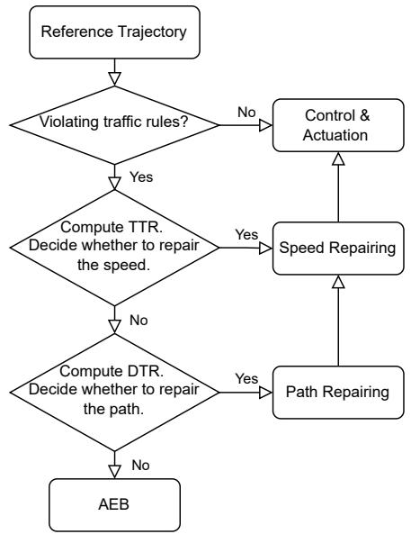

flowchart

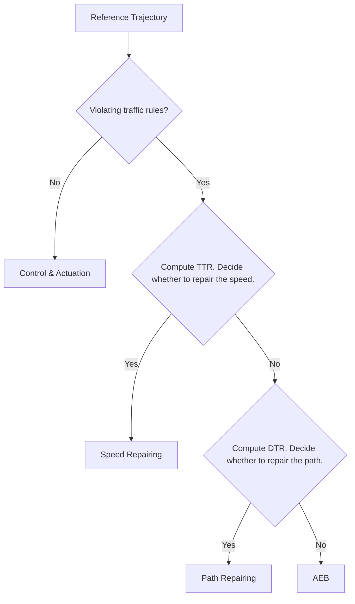

Fig. 5: Flowchart of the proposed trajectory repairing framework

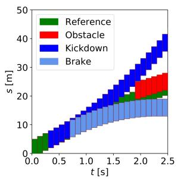

bar_stacked

| t [s] | Reference | Obstacle | Kickdown | Brake |
|-------|-----------|----------|----------|-------|
| 0.0   | 0         | 0        | 0        | 0     |
| 0.5   | 5         | 0        | 5        | 5     |
| 1.0   | 10        | 0        | 10       | 10    |
| 1.5   | 15        | 5        | 15       | 15    |
| 2.0   | 20        | 10       | 20       | 20    |
| 2.5   | 25        | 15       | 25       | 25    |

(a) Search for TTR.

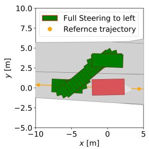

line

| x [m] | y [m] |
|-------|-------|
| -10   | 0.0   |
| -5    | 0.0   |
| 0     | 0.0   |
| 5     | 0.0   |

(b) Search for DTR.   
Fig. 6: Exemplary results of binary search in S-T domain and X-Y domain.

$$
\begin{array}{l} J = w _ {1} \int_ {0} ^ {X} (f (x) - r (x)) ^ {2} d x + w _ {2} \int_ {0} ^ {X} (f ^ {\prime} (x) - r ^ {\prime}) ^ {2} d x + \\ w _ {3} \int_ {0} ^ {X} f ^ {\prime \prime} (x) ^ {2} d x + w _ {4} \int_ {0} ^ {X} f ^ {\prime \prime \prime} (x) ^ {2} d x + w _ {5} (f (X) - r (X)) ^ {2} \tag {3} \\ \end{array}
$$

where x can represent t or s, and $f ( x )$ can represent $s ( t )$ or $l ( s ) . \ r ( x )$ is the reference speed profile or path. $r ^ { \prime }$ is the constant reference speed $\nu _ { r }$ or the constant reference lateral change rate $l _ { r } ^ { \prime } .$ . X is the horizon $T _ { m }$ or $S _ { m } . \ w _ { 1 } \cdot \cdot \cdot w _ { 5 }$ are weights for each term. The first term is to minimize the difference between the Bezier trajectory and the refer- ´ ence trajectory. The second term minimizes the deviations between the actual $f ^ { \prime } ( x )$ and the reference $r ^ { \prime } .$ The third and fourth objectives smooth the Bezier trajectory by penalizing ´ acceleration and jerk, respectively. In addition, we expect the end station to reach a certain value $r ( X )$ by the last term.

Next, we introduce the typical constraints for the optimization problem for both $S - T$ domain and $L - S$ domain, including boundary constraints, continuity constraints, security constraints, and physical constraints. However, the kinematic constraints differ in the $S - T$ domain and the $L - S$ domain. In the following formulation, $c _ { j } ^ { i , l }$ is the i-th control point of the $j \mathrm { - t h }$ segment of the Bezier trajectory with the ´ l-th order derivative. $h _ { j }$ is the scale factor for the j-th segment of the Bezier trajectory. We provide more general constraints ´ compared to previous work [16], [17], [3].

1) Boundary Constraints: The piecewise Bezier trajectory ´ starts at a fixed value of the zero-order, first-order, and second-order derivative, and it is defined as

$$
(h _ {0}) ^ {1 - l} c _ {0} ^ {0, l} = \frac {d ^ {l} f (x)}{d x ^ {l}} | _ {x = 0}, l = 0, 1, 2 \tag {4}
$$

2) Continuity Constraints: The piecewise Bezier trajec- ´ tory is continuous at the connecting points in terms of the zero-order, first-order, and second-order derivatives. It follows that

$$
\left(h _ {j}\right) ^ {1 - l} c _ {j} ^ {n, l} = \left(h _ {j + 1}\right) ^ {1 - l} c _ {j + 1} ^ {0, l}, l = 0, 1, 2, j = 0, 1, \dots , m - 1. \tag {5}
$$

3) Safety Constraints: With trapezoidal corridors $S ^ { t r a }$ , we come to the safety constraints:

$$
\underline {{p}} _ {j} ^ {0} + h _ {j} \underline {{p}} _ {j} ^ {1} M _ {i, 1} \leq h _ {j} c _ {j} ^ {i, 0} \leq \bar {p} _ {j} ^ {0} + h _ {j} \bar {p} _ {j} ^ {1} M _ {i, 1} \tag {6}
$$

where $i = 0 , 1 , \ldots , n , \ j = 0 , 1 , \ldots , m - 1$ . As stated in Section $\mathrm { { I I I - A } } .$ , the ego vehicle is represented as a point, and other obstacles are correspondingly inflated according to the safe ellipse. To have linear constraints, we take the $S _ { \mathrm { o f f s e t } }$ and $L _ { \mathrm { o f f s e t } }$ as an additional safety margin in the safety constraint formulation. We implemented a corridor generation algorithm that generates $s ^ { t r a }$ concerning a minimum resolution and merges similar pieces of the Bezier trajectory. ´

4) Physical Constraints: We take into account the real physical limits of the vehicle and constrain the velocity, acceleration, and jerk. We use the Hodograph property (see Section III-B) to obtain the Bezier polynomials of velocity, ´ acceleration, and jerk. The constraints follow that

$$
\underline {{\beta}} _ {j} ^ {l} \leq (h _ {j}) ^ {1 - l} c _ {j} ^ {i, l} \leq \bar {\beta} _ {j} ^ {l} \tag {7}
$$

where $i = 0 , 1 , \ldots , n , l = 1 , 2 , 3 , j = 0 , 1 , \ldots , m - 1 . \underline { { \beta } } _ { i } ^ { l }$ and $\bar { \beta } _ { j } ^ { l }$ are upper bound and lower bound for l-th derivative of the $j -$ th segment respectively. The bounds for acceleration and jerk remain constant for different pieces of the Bezier trajectory. ´

5) Kinematic Speed Constraints: The generated speed profile must be kinematically feasible. Let $a _ { l a t } ^ { d e s }$ be the desired lateral acceleration in the vehicle frame and $| k | _ { r , m a x }$ be the maximum absolute curvature of the reference path for $t \in [ T _ { j } , T _ { j + 1 } ]$ . Similar to [20], the lateral acceleration is constrained as

$$
c _ {j} ^ {i, 1} \leq \min \left\{\bar {\beta} _ {j} ^ {1}, \sqrt {a _ {l a t} ^ {d e s} / | k | _ {r , m a x}} \right\} \tag {8}
$$

6) Kinematic Path Constraints: The generated path must be kinematically feasible, and its turning radius must be greater than the minimum turning radius of the ego vehicle. Following the formulation in [21], we assume that 1) the ego vehicle’s orientation is approximately parallel to the reference line of the Frenet frame; 2) The lateral “accel-´ eration” $l ^ { \prime \prime }$ is numerically small and is assumed to be 0. The second assumption can easily be fulfilled as $l { ' } ^ { \prime \prime } ( s )$ or $f ^ { \prime \prime } ( x )$ is minimized during optimization. However, for an evasive maneuver, assumption (1) is not true, so we reshape the formulation of the constraints.

In [21], the curvature of the path is bounded by:

$$
\tan (\delta_ {m a x}) * \kappa_ {r} * l - \tan (\delta_ {m a x}) + | \kappa_ {r} | * l _ {w b} \leq 0 \tag {9}
$$

where $\delta _ { m a x }$ is the maximal steering angle, $\kappa _ { r }$ is the reference curvature, and $l _ { w b }$ is the wheelbase length. The inequality (9) shows that bounding κ is equivalent to bounding l. We can express the corresponding inequality for the j-th segment as follows

$$
h _ {j} c _ {j} ^ {i, 0} \leq \max \left\{\frac {1}{k _ {r}} - \frac {l _ {w b}}{\tan (\delta_ {\max})}, l _ {f u} \right\} \text {   if   } k _ {r} > 0 \tag {10}
$$

$$
h _ {j} c _ {j} ^ {i, 0} \geq \min \left\{\frac {1}{k _ {r}} + \frac {l _ {w b}}{\tan \left(\delta_ {\max}\right)}, l _ {f l} \right\} \text {   if   } k _ {r} <   0 \tag {11}
$$

where $l _ { f u }$ and $l _ { f l }$ are a feasible upper bound and a feasible lower bound, respectively. In practice, we use the curvature with maximal absolute value as $k _ { r }$ in the path kinematic constraint for each path segment, which is already conservative. Therefore we limit the boundary provided by the curvature constraint because an ultra-conservative boundary makes the optimization problem infeasible in the context of a lane change.

Finally, speed repairing and path repairing can be formulated as a quadratic programming (QP) problem :

$$
\min _ {\mathbf {c}} \quad \mathbf {c} ^ {T} Q _ {c} \mathbf {c} + \mathbf {p} _ {\mathbf {c}} ^ {T} \mathbf {c} + c o n s t
$$

$$
s. t. \quad A _ {e q} \mathbf {c} = \mathbf {b} _ {\mathbf {e q}} \tag {12}
$$

$$
A _ {i e} \mathbf {c} \leq \mathbf {b _ {i e}}
$$

where c is a combined vector of $( \mathbf { c _ { 0 } } , \mathbf { c _ { 1 } } , \hdots , \mathbf { c _ { m - 1 } } )$ . Due to the limit of pages, we refer the interested reader to the appendix of [3] for the formulation of speed profile optimization.

# V. EVALUATION

We evaluate our approach using traffic scenarios from the open-source CommonRoad platform [22]. The implementation of our approach is in Python and runs on a computer with an Intel(R) Xeon(R) W-2123 CPU @ 3.60GHz. The search-based planner shown in [20] is able to provide a reference trajectory. The vehicle parameters for the ego vehicle is for Ford Escort [22]. Furthermore, we limit the maximal execution time for all algorithms to 1.0s.

# A. Baseline: CL-RRT

CL-RRT was originally proposed for the 2007 DARPA Urban Challenge [23], and it has been recently improved and applied in trajectory repairing problems [2]. Following [2], [23], we implemented a variant of CL-RRT, which samples in the state space of $( s , l , \Phi , \nu _ { c m d } )$ . Φ denotes the sampled orientation and $\nu _ { c m d }$ is the desired command velocity. The sampling strategy in [2] uses a Gaussian mixture model to increase the sampling efficiency. However, its performance relies on the quality of reference trajectory and requires welldesigned heuristics. For more general cases, we adopt the random sampling strategy in the original work [23].

# B. Scenario 1: Urban T-Intersection

We select a challenging urban T-intersection scenario1 to validate our approach. The scenario animation can be found in the Scenario Selection Tool of CommonRoad. According to the flowchart in Fig. 5, we first compute the TTR. Each car in the scenario is assumed to have a rectangular shape. We project the predicted trajectories of the extreme vertices of obstacles that intervene in the ego-driving lane into the S-T domain. Two cars crossing the driving lane are presented in the middle of Fig. 7. After computing TTR, the algorithm checks if it is feasible to adapt the speed (Its average computation time is 9.8ms in Table II). In this scenario, TTR is only 0.9s, which is challenging for sampling-based approaches. The deceleration is the proper evasive maneuver.

Next, we start speed repairing. The actuation time delay ∆T is assumed to be 0.3s. The constant reference speed $\nu _ { r }$ is $1 2 . 5 m / s$ . The safety margin $S _ { \mathrm { o f f s e t } } = 4 m$ . The weights in the objective function are: $w _ { 1 } , w _ { 2 } = 2 , w _ { 3 } , w _ { 4 } , w _ { 5 } = 1 .$ . Fig. 7 shows the optimized speed profile and generated trapezoidal corridors with respect to different α. Fig. 8 demonstrates the optimized speed, acceleration, and jerk with respect to different α. The tradeoff effect of α can be summarized as follows: a larger α gives the system more “waiting time” to react and improves the robustness. However, the maneuver becomes more aggressive and produces higher jerks.

One exemplary “unlucky” sampling of CL-RRT projected into the S-T domain is shown in Fig. 9. We attempted different α values for initiating repairing for CL-RRT. One notable problem of it is that CL-RRT might sample a large number of invalid samples resulting in collisions, traffic rule violations, and physical limit excesses (an example is visible in Fig. 9). Therefore, its performance can vary in each simulation due to its stochastic nature. The average computation time of CL-RRT is higher than our time limit of 1.0s. By comparison, as shown in Table II, our speed repairing algorithm resulted in average computation times of 9.2 − 13.8ms for different α levels.

# C. Scenario 2: Blocked T-Intersection

The second scenario is a blocked T-intersection, modified from another T-intersection scenario2. We insert a static obstacle in front of the intersection so that the ego vehicle must execute a lane change to continue the route. We first searched for TTR. However, the ego vehicle must stop fully and cannot continue driving. Hence we again search for DTR, which is 27m in this scenario, and steering to the left is a proper evasive maneuver. The average computation time of the search for TTR and DTR is 11.4ms and 1.8ms, respectively.

The path repairing is afterward triggered. As we use path repairing that does not comprise temporal information, we project the occupancy of each traffic agent in a prediction horizon of 10s into the L-S and X-Y domain to ensure safety. The predicted trajectory of the car behind the ego vehicle is ignored, as it has to comply with the ego vehicle. The actuation distance delay compensation is $\Delta s = \nu _ { r } \cdot \Delta T =$ 3.75m . The longitudinal safety margin $S _ { \mathrm { o f f s e t } }$ is 4m, and the lateral safety margin $L _ { \mathrm { o f f s e t } }$ is 2.3m. All weights of the objective function are 1. Fig. 10a and Fig. 10b show the path repairing in L-S and X-Y domains with different α values, respectively. The path is repaired due to an emerging static obstacle and returns to the reference path before the T-intersection.

After path repairing, the speed must be re-planned as well. To avoid aggressive behavior, kick-down is forbidden. The speed re-planning is the same as speed repairing with $\alpha = 0 ,$ shown in the first scenario. In the interests of brevity, the optimization result is not reported here, but its computation time is indicated in Table II.

One exemplary result of CL-RRT is shown in Fig. 10c. Due to invalid samples, CL-RRT’s average computation time exceeds the time limit (1.0s), which is remarkably slower than our proposed approach (total average computation time is approximately 25ms) (See Table II).

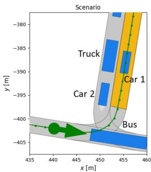

text_image

Scenario
Truck
Car 1
Car 2
Bus
y [m]
435 440 445 450 455 460
x [m]

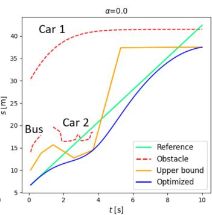

line

| t [s] | Car 1 Reference | Car 1 Obstacle | Car 2 Reference | Car 2 Obstacle | Car 2 Upper Bound | Car 2 Optimized | Car 2 Upper Bound | Car 2 Optimized |
|-------|-----------------|----------------|-----------------|----------------|-------------------|-----------------|-------------------|-----------------|
| 0     | 30              | 15             | 10              | 15             | 10                | 7               | 10                | 7               |
| 2     | 35              | 20             | 15              | 20             | 15                | 10              | 15                | 10              |
| 4     | 40              | 25             | 20              | 25             | 20                | 15              | 20                | 15              |
| 6     | 40              | 30             | 25              | 30             | 25                | 20              | 25                | 20              |
| 8     | 40              | 35             | 30              | 35             | 30                | 25              | 30                | 25              |
| 10    | 40              | 40             | 35              | 40             | 35                | 30              | 35                | 30              |

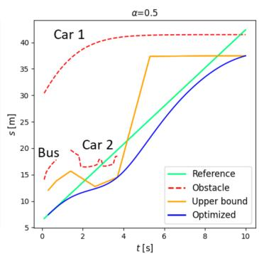

line

| t [s] | Reference | Obstacle | Upper bound | Optimized |
|-------|-----------|----------|-------------|---------|
| 0     | 7         | 30       | 12          | 7       |
| 2     | 15        | 40       | 16          | 12      |
| 4     | 25        | 40       | 38          | 20      |
| 6     | 35        | 40       | 38          | 30      |
| 8     | 40        | 40       | 38          | 35      |
| 10    | 42        | 40       | 38          | 38      |

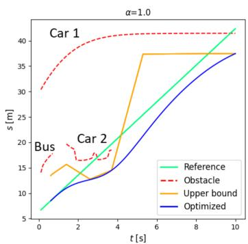

line

| t [s] | Reference | Obstacle | Upper bound | Optimized |
|-------|-----------|----------|-------------|---------|
| 0     | 5         | 30       | 15          | 5       |
| 2     | 10        | 35       | 18          | 10      |
| 4     | 15        | 40       | 38          | 15      |
| 6     | 20        | 40       | 38          | 25      |
| 8     | 25        | 40       | 38          | 30      |
| 10    | 30        | 40       | 38          | 35      |

Fig. 7: Optimization and trapezoidal corridors with different α. The left picture shows the urban T-intersection scenario, where planning starts from the arrow following a green line and attempts to reach the yellow goal region. The three right pictures include the other vehicles’ extreme points projected into the S-T domain (in the ego lane) and optimization results.

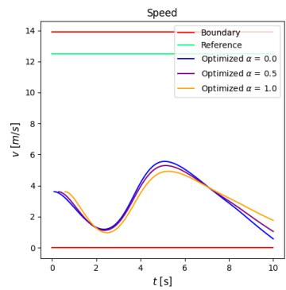

line

| t [s] | Boundary | Reference | Optimized α = 0.0 | Optimized α = 0.5 | Optimized α = 1.0 |
|-------|----------|-----------|-------------------|-------------------|-------------------|
| 0     | 14       | 12        | 3.5               | 3.5               | 3.5               |
| 2     | 14       | 12        | 1.0               | 1.0               | 1.0               |
| 4     | 14       | 12        | 5.0               | 5.0               | 5.0               |
| 6     | 14       | 12        | 4.5               | 4.5               | 4.5               |
| 8     | 14       | 12        | 2.0               | 2.0               | 2.0               |
| 10    | 14       | 12        | 0.5               | 0.5               | 0.5               |

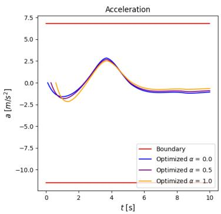

line

| t [s] | Boundary | Optimized α = 0.0 | Optimized α = 0.5 | Optimized α = 1.0 |
|-------|----------|-------------------|-------------------|-------------------|
| 0     | 7.0      | 0.0               | 0.0               | 0.0               |
| 2     | 7.0      | -2.0              | -2.0              | -2.0              |
| 4     | 7.0      | 3.0               | 3.0               | 3.0               |
| 6     | 7.0      | -1.0              | -1.0              | -1.0              |
| 8     | 7.0      | -1.0              | -1.0              | -1.0              |
| 10    | 7.0      | -1.0              | -1.0              | -1.0              |

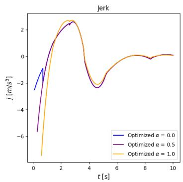

line

| t [s] | Optimized α = 0.0 | Optimized α = 0.5 | Optimized α = 1.0 |
|-------|-------------------|-------------------|-------------------|
| 0     | -2.5              | -6.0              | -7.0              |
| 1     | -1.0              | -3.0              | -4.0              |
| 2     | 1.5               | 2.0               | 2.5               |
| 3     | 2.5               | 2.8               | 2.9               |
| 4     | -2.0              | -2.5              | -2.8              |
| 5     | -1.5              | -1.8              | -1.9              |
| 6     | -0.5              | -0.8              | -0.9              |
| 7     | 0.0               | 0.0               | 0.0               |
| 8     | 0.2               | 0.1               | 0.1               |
| 9     | 0.1               | 0.0               | 0.0               |
| 10    | 0.0               | 0.0               | 0.0               |

Fig. 8: Optimized speed, acceleration, and jerk with different α.

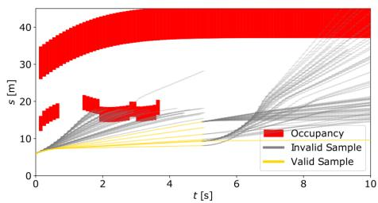

line

| t [s] | Occupancy | Invalid Sample | Valid Sample |
|-------|-----------|----------------|--------------|
| 0     | 15        | 10             | 5            |
| 2     | 20        | 15             | 8            |
| 4     | 25        | 20             | 10           |
| 6     | 30        | 25             | 12           |
| 8     | 35        | 30             | 15           |
| 10    | 40        | 35             | 18           |

Fig. 9: “Unlucky” sampling of CL-RRT projected into S-T domain. After 500 samples (17.7 s), CL-RRT did not find a solution to the goal due to too many invalid samples.

We compared the maximal and average curvature of the generated path for our approach for different α. The kinematic path constraints in Section IV-B.6 are activated and ensure that the curvature of the generated path is less than the maximal curvature (0.54) of the single-track model. With a smaller $\alpha ,$ a smoother path can be generated. However, due to the path-speed decoupling, the optimization result is suboptimal and has larger average curvature than the trajectory generated by CL-RRT.

# VI. CONCLUSION

We developed a robust tunable trajectory repairing framework for AVs based on Bernstein basis polynomials and path-

TABLE I: Comparison of curvature. 

<table><tr><td></td><td>α=0</td><td>α=0.5</td><td>α=1</td><td>CL-RRT</td><td>Maximal</td></tr><tr><td>Maximal Curvature</td><td>0.46</td><td>0.46</td><td>0.45</td><td>0.10</td><td>0.54</td></tr><tr><td>Average Curvature</td><td>0.06</td><td>0.08</td><td>0.13</td><td>0.03</td><td>0.54</td></tr></table>

speed decoupling. We improved the search efficiency for the critical measures by decoupling the search scheme into search in the S-T domain and X-Y domain. In addition, we proposed the concept α − Robustness. It is a generalization of re-planning and repairing and can be used to balance the driving comfort against robustness to external disturbances. The trajectory repairing approach based on random sampling in the C-space might cause numerous invalid samples and non-deterministic performance. Heuristics can improve the sampling efficiency (i.e., [2]) but requires a subtle design. By contrast, we formulated a unified QP problem with different kinematic constraints for both speed and path repairing. The QP formulation ensures that the optimization can be solved with a limited time cost meanwhile achieving kinematic feasibility, safety and comfort. Our experiments indicated typical feasible solutions within 25ms, which is sufficient for real-time safety-critical applications.

# REFERENCES

[1] R. L. McCarthy, “Autonomous vehicle accident data analysis: California ol 316 reports: 2015–2020,” ASCE-ASME J Risk and Uncert in

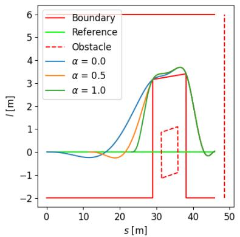

line

| s [m] | Boundary | Reference | Obstacle | α = 0.0 | α = 0.5 | α = 1.0 |
|-------|----------|-----------|----------|---------|---------|---------|
| 0     | -2       | 0         | -2       | 0       | 0       | 0       |
| 10    | -2       | 0         | -2       | 0       | 0       | 0       |
| 20    | -2       | 0         | -2       | 0       | 0       | 0       |
| 30    | 6        | 3         | -1       | 3       | 3       | 3       |
| 40    | -2       | 3         | -1       | 3       | 3       | 3       |
| 50    | -2       | 0         | -2       | 0       | 0       | 0       |

(a) Path repairing in L-S domain

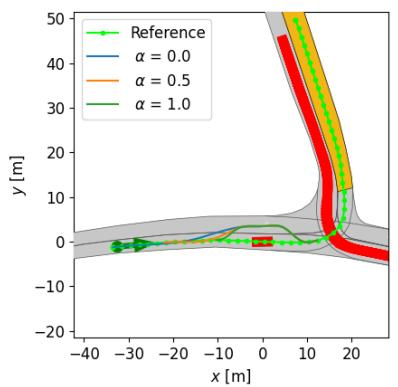  
(b) Path repairing in X-Y domain

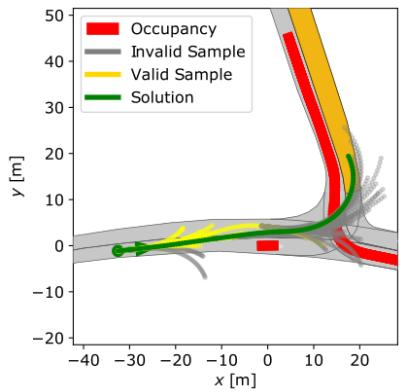

line

| x [m] | Occupancy | Invalid Sample | Valid Sample | Solution |
|-------|-----------|----------------|--------------|----------|
| -30   | 0         | 0              | 0            | 0        |
| 0     | 0         | 0              | 0            | 0        |
| 10    | 45        | 40             | 35           | 30       |
| 20    | 20        | 15             | 10           | 5        |

(c) Sampling of CL-RRT in X-Y domain   
Fig. 10: Benchmark of path repairing

TABLE II: Comparison of computation time. We run 100 iterations for each algorithm. Speed and path refer to speed repairing and path repairing, including the computation time for generating trapezoidal corridors and establishing and solving the optimization problem. The number before and after ± are the average and standard deviation, respectively. 

<table><tr><td rowspan="2">Scenario</td><td colspan="2">Cut-off State</td><td colspan="2"> $\alpha = 0$ </td><td colspan="2"> $\alpha = 0.5$ </td><td colspan="2"> $\alpha = 1$ </td><td rowspan="2">CL-RRT</td></tr><tr><td>TTR</td><td>DTR</td><td>Speed</td><td>Path</td><td>Speed</td><td>Path</td><td>Speed</td><td>Path</td></tr><tr><td>(1)</td><td>9.8±0.4ms</td><td>-</td><td>9.2±2.7ms</td><td>-</td><td>9.8±1.0ms</td><td>-</td><td>13.8±1.2ms</td><td>-</td><td>TIMEOUT</td></tr><tr><td>(2)</td><td>11.4±1.8ms</td><td>1.8±0.0ms</td><td>18.7±1.8ms</td><td>6.1±0.2ms</td><td>18.8±1.8ms</td><td>6.0±0.3ms</td><td>18.8±1.4ms</td><td>6.2±0.7ms</td><td>TIMEOUT</td></tr></table>

Engrg Sys Part B Mech Engrg, vol. 8, no. 3, 2022.

[2] Y. Lin, S. Maierhofer, and M. Althoff, “Sampling-based trajectory repairing for autonomous vehicles,” in 2021 IEEE International Intelligent Transportation Systems Conference (ITSC). IEEE, 2021, pp. 572–579.

[3] J. Li, X. Xie, H. Ma, X. Liu, and J. He, “Speed planning using bezier polynomials with trapezoidal corridors,” arXiv preprint arXiv:2104.11655, 2021.

[4] J. Guo, U. Kurup, and M. Shah, “Is it safe to drive? an overview of factors, metrics, and datasets for driveability assessment in autonomous driving,” IEEE Transactions on Intelligent Transportation Systems, vol. 21, no. 8, pp. 3135–3151, 2020.

[5] J. Hillenbrand, A. M. Spieker, and K. Kroschel, “A multilevel collision mitigation approach—its situation assessment, decision making, and performance tradeoffs,” IEEE Transactions on Intelligent Transportation Systems, vol. 7, no. 4, pp. 528–540, 2006.

[6] S. Kim, J. Wang, G. J. Heydinger, and D. A. Guenther, “The criticality index development for steering evasive maneuver based on mixed h2/hcontrol with parameter uncertainties,” in 2019 American Control Conference (ACC), 2019, pp. 3963–3968.

[7] M. Schratter, M. Hartmann, and D. Watzenig, “Pedestrian collision avoidance system for autonomous vehicles,” SAE International Journal of Connected and Automated Vehicles, vol. 2, no. 4, 2019.

[8] S. Sontges, M. Koschi, and M. Althoff, “Worst-case analysis of the time-to-react using reachable sets,” in 2018 IEEE Intelligent Vehicles Symposium (IV). IEEE, 2018, pp. 1891–1897.

[9] A. Tamke, T. Dang, and G. Breuel, “A flexible method for criticality assessment in driver assistance systems,” in 2011 IEEE Intelligent Vehicles Symposium (IV). IEEE, 062011, pp. 697–702.

[10] D. Gonzalez, J. Perez, V. Milanes, and F. Nashashibi, “A review of motion planning techniques for automated vehicles,” IEEE Transactions on Intelligent Transportation Systems, vol. 17, no. 4, pp. 1135–1145, 2016.

[11] S. M. LaValle, Planning algorithms. Cambridge university press, 2006.

[12] H. Fan, F. Zhu, C. Liu, L. Zhang, L. Zhuang, D. Li, W. Zhu, J. Hu, H. Li, and Q. Kong, “Baidu apollo em motion planner,” arXiv preprint arXiv:1807.08048, 2018.

[13] B. Zhou, F. Gao, L. Wang, C. Liu, and S. Shen, “Robust and efficient quadrotor trajectory generation for fast autonomous flight,” IEEE Robotics and Automation Letters, vol. 4, no. 4, pp. 3529–3536, 2019.

[14] Q.-C. Pham and Y. Nakamura, “A new trajectory deformation algorithm based on affine transformations,” IEEE Transactions on Robotics, vol. 31, no. 4, pp. 1054–1063, 2015.   
[15] M. Werling, J. Ziegler, S. Kammel, and S. Thrun, “Optimal trajectory generation for dynamic street scenarios in a frenet frame,” in ´ 2010 IEEE International Conference on Robotics and Automation. IEEE, 03.05.2010 - 07.05.2010, pp. 987–993.   
[16] F. Gao, W. Wu, Y. Lin, and S. Shen, “Online safe trajectory generation for quadrotors using fast marching method and bernstein basis polynomial,” in 2018 IEEE International Conference on Robotics and Automation (ICRA), 2018, pp. 344–351.   
[17] W. Ding, L. Zhang, J. Chen, and S. Shen, “Safe trajectory generation for complex urban environments using spatio-temporal semantic corridor,” IEEE Robotics and Automation Letters, vol. 4, no. 3, pp. 2997–3004, 2019.   
[18] W. Zhang, P. Yadmellat, and Z. Gao, “A sufficient condition for convex hull property in general convex spatio-temporal corridors,” in 2022 IEEE Intelligent Vehicles Symposium (IV), 2022, pp. 1033–1039.   
[19] C. G. Keller, T. Dang, H. Fritz, A. Joos, C. Rabe, and D. M. Gavrila, “Active pedestrian safety by automatic braking and evasive steering,” IEEE Transactions on Intelligent Transportation Systems, vol. 12, no. 4, pp. 1292–1304, 2011.   
[20] K. Tong, S. Solmaz, and M. Horn, “A search-based motion planner utilizing a monitoring functionality for initiating minimal risk maneuvers,” in 2021 IEEE International Intelligent Transportation Systems Conference (ITSC). IEEE, 8/10/2022 - 12/10/2022.   
[21] Y. Zhang, H. Sun, J. Zhou, J. Pan, J. Hu, and J. Miao, “Optimal vehicle path planning using quadratic optimization for baidu apollo open platform,” in 2020 IEEE Intelligent Vehicles Symposium (IV). IEEE, 2020, pp. 978–984.   
[22] M. Althoff, M. Koschi, and S. Manzinger, “Commonroad: Composable benchmarks for motion planning on roads,” in 2017 IEEE Intelligent Vehicles Symposium (IV). IEEE, 2017, pp. 719–726.   
[23] Y. Kuwata, J. Teo, G. Fiore, S. Karaman, E. Frazzoli, and J. P. How, “Real-time motion planning with applications to autonomous urban driving,” IEEE Transactions on control systems technology, vol. 17, no. 5, pp. 1105–1118, 2009.