Received 8 April 2024; revised 23 July 2024, 24 November 2024, 20 January 2025, and 10 March 2025; accepted 19 April 2025. Date of publication 28 April 2025; date of current version 5 May 2025.

Digital Object Identifier 10.1109/OJITS.2025.3563823

# Anytime Optimal Trajectory Repairing for Autonomous Vehicles

KAILIN TONG (Graduate Student Member, IEEE), MARTIN STEINBERGER 2 (Member, IEEE), MARTIN HORN 2 (Member, IEEE), SELIM SOLMAZ 1 (Senior Member, IEEE), AND DANIEL WATZENI G 1,3 (Senior Member, IEEE)

1Department of Electrics, Electronics, and Software, Virtual Vehicle Research GmbH, 8010, Graz, Austria

2Institute of Automation and Control, Graz University of Technology, 8010 Graz, Austria

3Institute of Computer Graphics and Vision, Graz University of Technology, 8010 Graz, Austria

CORRESPONDING AUTHOR: K. TONG (e-mail: kailin.tong@v2c2.at)

This work was supported by the European Union through the Project ARCHIMEDES under Grant 101112295 and through the Project Cynergy4MIE under Grant 101140226, which are supported by the Chips Joint Undertaking and its members, including Top-Up funding by the Program “Digitale Technologien” the Austrian Federal Ministry for Innovation, Mobility and Infrastructure (BMIMI).

ABSTRACT Adapting to dynamically changing situations remains a pivotal challenge for automated driving systems, which demand robust and efficient solutions. Occasional perception errors inherent in artificial intelligence further complicate the task. Whereas traditional motion planning algorithms address this challenge by replanning the entire trajectory, a significantly more efficient strategy is to repair only the flawed segments. Our paper introduces a groundbreaking approach by formulating an optimal trajectory repairing problem and proposing an innovative and efficient framework for critical timing detection and trajectory repairing. This trajectory repairing specifically employs Bernstein basis polynomials in both 2D distance-time and 3D spatiotemporal spaces. A distinctive feature of our method is the use of an anytime grid search to determine a sub-optimal time-to-repair, which contrasts with previous methods that relied on manually tuned or fixed repair times, limiting both flexibility and robustness. A statistical analysis of 100 scenarios demonstrates that our trajectory-repairing framework outperforms the path-speed decoupled repairing framework in terms of scenario success rate. Furthermore, we introduce a novel algorithm for driving corridor generation that more accurately approximates the collision-free space than state-of-the-art work. The proposed approach has broad potential for application in embedded systems across various autonomous platforms.

INDEX TERMS Autonomous vehicles, collision avoidance, trajectory planning, vehicle safety.

# I. INTRODUCTION

ESTING and validating automated driving (AD) is T a significant challenge for commercializing vehicle automation. A review of the latest accident data [1] reveals that, despite rigorous testing protocols, autonomous vehicles (AVs) occasionally make erroneous decisions, which could result in damage to property or even cause injuries, especially during emergencies. Traffic dynamics are inherently unpredictable, with sudden changes in the behavior of other vehicles potentially creating dangerous scenarios. In worst-case scenarios, human drivers might violate safety The review of this article was arranged by Associate Editor Xin Xia.

rules, creating dilemmas for AVs in making decisions about crash targets in unavoidable situations [2]. Additionally, the perception system may either fail to track certain objects or incorrectly identify nonexistent ones [3]. Identifying road condition defects also poses a challenge for perception systems, and these defects can lead to hazardous situations [4]. To navigate these complexities, automated driving systems typically re-plan their trajectory at a fixed frequency, shifting from their current trajectory to a new target to avoid a safety-critical situation [5]. However, this process often involves a constant search for viable alternative trajectories, which is not always the most efficient strategy.

A novel approach suggests identifying segments of the current trajectory that remain viable and only modifying the sections that are no longer valid [6]. This method significantly reduces the need for constant, comprehensive trajectory replanning, enhancing the system’s resilience to minor disruptions and improving overall efficiency. Implementing such a strategy involves sophisticated algorithms that assess not only the vehicle’s immediate trajectory but also incorporate data from the surrounding environment and predictive models of other road users’ actions. Advancements in machine learning or deep learning could further refine these predictive capabilities, allowing for more accurate adjustments to the AV’s trajectory in real time [7]. Furthermore, the adoption of vehicle-to-everything (V2X) communication technology is expected to improve AV situational awareness and the system’s ability to repair the trajectory in advance. V2X technology enables direct communication between vehicles and road infrastructure, providing autonomous vehicles with advanced detection of possible dangers and traffic conditions that are beyond of their immediate sensory capabilities [8]. This could lead to more informed decision-making processes, thereby preventing dangerous situations before they occur.

Based on the initial work in [6], we suggested an effective path-speed decoupled trajectory repairing framework in our earlier work [9]. Using Bernstein polynomials, the proposed trajectory repairing framework can pinpoint crucial times and distances for reacting and enables repairing the reference speed profile and path with the certainty of safety. The technique exhibits significant improvements in computational speed for an implementation in Python. Additionally, it offers a robustness metric $( 0 \leq \alpha \leq 1 )$ for fine-tuning autonomous driving behavior in balancing trajectory replanning and repairing, or essentially between comfort and robustness. However, the most significant drawback of pathspeed decoupling is its propensity to perform sub-optimally in circumstances with dynamic obstacles and the generated behavior is more conservative because path planning does not include time information. Further, while the α measure is handy, it is not simple to adjust to get the best repairing performance.

On the basis of our prior experience in pedestrian collision avoidance systems [10], search-based minimal risk maneuver planning [11] and convex optimization for trajectory repairing [9], we identify a clear trade-off between replanning and repairing at the critical point: early changing the original plan can produce a smoother reaction but may completely change the intended original plan and is not always necessary in a dynamical environment; Critical repairing avoids the potential accident at the last second and can better stick to the original plan until the critical point, but its maneuver may be too aggressive and evasive. This trade-off between re-planning and critical repairing results in an optimization problem that has received little attention.

One motivational example is the pedestrian collision avoidance system [10], in which a pedestrian stands by a road curb and appears to run across the road. Should the ego car decelerate or perhaps swerve to escape a possible danger, or should the ego vehicle wait for a little while to confirm the person’s behavior. Another motivating example is that if the perception system suddenly blacks out [11]: should the ego car immediately begin a minimal risk maneuver, which implies slowing down and stopping safely, or should it wait a while to see if the system can recover? Furthermore, in our real-world demonstration using the full-stack autonomous driving software Autoware [12], we observed a trade-off between replanning and critical repairing for the planning stack as well. For example, occasionally the perception system produces false-negative results, such as a falling leaf that causes the Lidar to assume it is an obstruction and activates an unnecessary emergency brake, reducing passenger comfort. However, if the system waits for the perception system to confirm the potential threat, we risk losing the opportunity to avoid the dangerous circumstance.

Motivated by these questions, we propose an optimal trajectory repairing problem while simultaneously providing a safety framework to ensure that the repaired trajectory does not collide with other objects’ movement. We also enhanced our prior work on speed and path repairing by using spatiotemporal repairing, broadening our approach to include more versatile scenarios. In comparison to the current literature, the contributions described in this work are summarized as follows:

• We outline the optimal trajectory repairing problem and provide an anytime grid search approach for sub-optimal trajectory repairing results. To the best of our knowledge, this is the first definition of an optimal trajectory repairing problem. In comparison to replanning or critical intervention, optimal trajectory repairing can reduce the total cost by balancing the reference trajectory and the repaired trajectory.   
• We describe a new hierarchical trajectory repairing architecture that takes into account both speed in the S-T space (S is longitudinal distance and T is time) and spatiotemporal repairing in the S-L-T space (S stands for longitudinal distance, L stands for lateral distance, and T stands for time). Our calculation time statistics clearly indicate that using a hierarchical structure improves processing efficiency.   
• We present an approach for under-approximating the collision-free space by creating quadrilateral frustum corridors in the S-L-T space. It can give more flexibility of boundaries than prism-shaped corridors stated in [13].

The remainder of this paper is organized as follows: Section II presents the relevant literature. Section III explains the concepts and theorems utilized in this research. Section IV illustrates the suggested anytime optimal trajectory repairing framework, while Section V discusses our simulation experiments and analyzes the outcomes.

Finally, the conclusion and summary are presented in Section VI.

# II. RELATED WORK

# A. COMPUTATION OF TIME-TO-X

A typical safety metric for AD is Time-To-X (TTX), where X is the collision or a reaction to a collision. For example, Time-to-Collision (TTC) measures the collision time and determines whether the AD system should warn the driver or act immediately [14]. Other metrics in this family are: TTB (Time-To-Brake) denotes the time to maximize deceleration, TTK (Time-To-Kickdown) indicates the time to reach maximum velocity with full acceleration, and TTS (Time-To-Steer) indicates the time to fully steer left or right with maximum steering angle. The Time-To-React (TTR) measure combines all Time-To-X metrics [15], used for a worst-case scenario. The CommonRoad-CriMe toolbox [16] provides out-of-box software for calculating TTX and other criticality metrics for evaluating autonomous driving functionalities. The TTX paradigm may be applied to spatial axes, defining measures like Distance-To-X (DTX) [17].

Typically, online TTX computations use either empirical formulas for value estimates or forward simulations. Using an empirical approach based on current ego and surrounding states, Schratter et al. [10] estimate TTB, TTS, and collision risk for emergency maneuver choices. Their collision avoidance system handles obstructed pedestrian crossings. However, extending the empirical estimation approach to other scenarios might be difficult. In contrast, the literature [18] suggests that forward simulation for TTR computation employs reachable set analysis. However, the resultant TTR might be too cautious.

According to recent work [6], TTX is calculated utilizing realistic emergency maneuver models using a modified binary search. It can calculate TTX values accurately and handle many static and dynamic obstacles. Counterintuitively, they value longitudinal (TTB, TTK) and lateral (TTS) emergency motions equally. During emergencies in the ego lane, drivers should reduce speed rather than suddenly change direction to avoid accidents [19]. This study uses a hierarchical search technique to calculate TTR first in the S-T domain and then in the S-L-T domain to increase search efficiency.

# B. PLANNING SCHEMES

In contrast to previous studies which classify planning algorithms based on their problem formulations, as seen in [20], [21], our approach emphasizes different planning strategies such as re-planning, repairing, and parallel planning. We further explore how these strategies are interconnected with various planning algorithms.

Re-planing: When an agent navigates in a physical world, their actions are based on information received during execution, known as Feedback Motion Planning in [22], or simply re-planning. The re-planning scheme is widely used in autonomous driving software stacks, including Baidu Apollo [23] and Autoware [12]. After replanning, graph search-based planners and sampling-based planners have the opportunity to achieve a global optimum outcome (assuming no time restriction); nevertheless, the freshly planned trajectory may deviate significantly from the prior one. As a result, trajectory tracking may be unstable. Numerical optimization procedures, on the other hand, rely on earlier planning results, and the freshly planned trajectory is consistent with the original, but the outcome is merely a local optimum.

Reparing: Unlike re-planning, repairing entails changing just the essential portion of a reference trajectory in response to environmental disruptions. This concept has been extensively utilized in the robotics field, as well as for Autonomous Aerial Vehicles (UAVs) and Unmanned Ground Vehicles (UGVs), in the form of local replanning [24], Gradient-based optimization [25], trajectory deformation [26] and elastic band [27]. However, they are not specifically designed for AVs and may not always give safety guarantees. The point of “repairing” is entirely dependent on the optimization setting. Lin et al. [6] suggested a sampling-based trajectory repair technique based on closedloop rapidly exploring random trees (CL-RRT) and created a safety assurance mechanism for the generated evasive strategy. However, the sampling-based tactic is computationally costly in some cases because it is difficult to sample nodes in a “tight passage” which is a common challenge for samplingbased planners. Lin and Althoff recent work [28] focused on repairing trajectories that break traffic laws, employing a unique methodology that blends temporal logic formalization with satisfiability-checking technologies.

Parallel Planning: Highly automated driving (HAD) involves the capacity to recognize and manage hazardous occurrences to maintain safety and restore the vehicle to a safe state [29]. However, a single planner cannot handle all possible circumstances. As a result, numerous scholars developed a parallel planning framework in which a failsafe planner operates in tandem or is triggered when dangers occur. Several noteworthy works employed various ways to tackle this problem, including A\* search [30], convex optimization [31], and Model Predictive Control [3]. Tong et al. [11] explored a software architecture for search-based motion planning that uses a backup graph rather than a backup planner. Recently, Zheng et al. [32] introduced a parallel trajectory optimization framework with spatiotemporal safety restrictions for autonomous driving in heavy traffic.

# III. PRELIMINARIES

# A. VEHICLE MODEL AND CONFIGURATION SPACE

In this study, we employ a kinematic bicycle model [22], as illustrated in Figure 1. A two-wheel bicycle resembles a four-wheeled vehicle, with the front wheel in the center of the front axle and the rear wheel in the middle of the back axle. Because of the steering angle δ, the vehicle cannot travel sideways and instead follows a circle with a radius

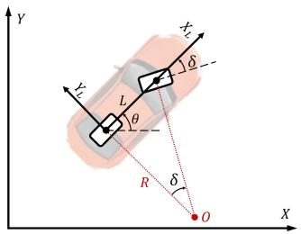

text_image

Y
Z
L
θ
R
δ
O
X

FIGURE 1. Illustration of the bicycle model.   
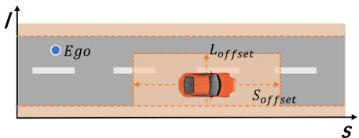

text_image

Ego
L_offset
S_offset
s

FIGURE 2. Illustration of the configuration space.

$R = L / t a n ( \delta )$ , where L is the distance between the front and rear axles. For the trajectory planning problem for $\mathbf { A V s } .$ , we define a configuration-space (C-space) as $\chi \subset \mathbb { R } ^ { n }$ . The road curvature in the vehicle C-space is defined as $\kappa = 1 / R .$ .

We utilize the Frenét frame representation for 2D space since it is ideal for structured settings and traffic semantics modeling [33]. Typically, the driving reference line is taken using an HD (High Definition) map. In a Frenét frame, the space is separated into two orthogonal axes s and l (see Figure 2).The states of other objects in the vicinity are projected into the Frenét frame as well.

A point in the C-space represents the ego vehicle. The lower and upper boundaries of the Frenét frame are based on the road border and the width of the ego vehicle. Other traffic participants are also be represented in the C-space. We add safety margins to inflate the occupancy areas of other cars. In Figure 2, the lateral and longitudinal safety margins are designated as $S _ { \mathrm { o f f s e t } }$ and $L _ { \mathrm { o f f s e t } }$ , respectively.

# B. BÉZIER CURVE AND BÉZIER TRAJECTORY

The Bernstein basis is defined as $\begin{array} { r } { b _ { n } ^ { i } ( t ) = \binom { n } { i } \cdot t ^ { i } \cdot ( 1 - t ) ^ { n - i } , t \in } \end{array}$ [0, 1]. Bézier curves are polynomial functions represented by linear combinations of the Bernstein basis. A Bézier curve with degree n is represented as follows:

$$
B (t) = c ^ {0} b _ {n} ^ {0} (t) + c ^ {1} b _ {n} ^ {1} (t) + \dots + c ^ {n} b _ {n} ^ {n} (t) = \sum_ {i = 0} ^ {n} c ^ {i} b _ {n} ^ {i} (t) \tag {1}
$$

where the polynomial coefficients $[ c ^ { 0 } , c ^ { 1 } , \ldots , c ^ { n } ]$ symbolized as c are the vector of control points for the Bézier curve. Compared to a monomial basis polynomial, the Bernstein basis polynomial has the following properties [34]:

1) Fixed interval: The Bézier curve for the variable t is defined on the interval [0, 1].   
2) End point interpolation: The Bézier curve always starts at the first control point and ends at the last control point, but it does not pass through any other control points.

3) Convex hull: The Bézier curve $B ( t )$ is defined by a collection of control points $c ^ { i }$ that are contained inside the convex hull formed by all these control points. If the control points of the Bézier curve satisfy $p \leq c ^ { i } \leq$ $\bar { p } , \ \forall i \in \{ 0 , 1 , \ldots , n \}$ , it follows that $\underline { { { p } } } ~ \le ~ B \overline { { { ( t ) } } } ~ \le ~ \bar { p } .$ $\forall t \in [ 0 , 1 ]$

4) Hodograph: A hodograph is the derivative curve $B ^ { ( 1 ) } ( t )$ of the Bézier curve $B ( t )$ and is always a Bézier curve with control points that follow the equation $c ^ { i , 1 } =$ $n \cdot ( c ^ { i + 1 , 0 } - c ^ { \dot { i } , 0 } )$ , where n represents the polynomial degree.

The variable t of a Bézier curve is defined within a constant range of values from 0 to 1. In order to obtain an interval of any length for each segment of a trajectory, a scale factor h is required to adjust any assigned t for that segment.Thus, the basic Bernstein piecewise trajectory in one dimension $\sigma \in \{ s , l \}$ with m segments can be expressed as follows:

$$
f ^ {\sigma} (\tau) = \left\{ \begin{array}{l l} h _ {0} B _ {0} \left(\frac {t - T _ {0}}{h _ {0}}\right), & t \in [ T _ {0}, T _ {1}) \\ h _ {1} B _ {1} \left(\frac {t - T _ {1}}{h _ {1}}\right), & t \in [ T _ {1}, T _ {2}) \\ \dots \\ h _ {m - 1} B _ {m - 1} \left(\frac {t - T _ {m - 1}}{h _ {m - 1}}\right), & t \in [ T _ {m - 1}, T _ {m} ] \end{array} \right. \tag {2}
$$

where $B _ { j } ( t )$ is the j-th Bézier polynomial. $c _ { j } ^ { i }$ is the i-th control point of the j-th segment of the whole trajectory. $T _ { 1 } , T _ { 2 } , \dots , T _ { m }$ are the interval end of each segment. The total interval length is $T = T _ { m } - T _ { 0 } . \ h _ { 0 } , h _ { 1 } , . . . , h _ { m - 1 }$ are the scale factors for each piece of the trajectory, such that the interval of a Bézier polynomial is scaled from [0, 1] to the interval $[ T _ { j - 1 } , T _ { j } ]$ allocated in one segment.

To help with the further formulation of the optimization problem, we provide certain required definitions and theorems. The j-th component of a Bézier trajectory $f ( t )$ is indicated as $f _ { j } ( t )$ .

Definition 1 (Collision-Free Space ): Assuming that the occupancy of all obstacles at time t in the C-space $\chi$ is known and defined as Occ(t). The set $\Omega \left( t \right) \subset \chi$ is the set of collision-free states at time t without collision with $O c c ( t )$ , i.e., $, \Omega ( t ) = \chi \setminus O c c ( t )$ .

Definition 2 (Convex Corridor $S ^ { c o r } )$ : A convex set in  is termed a convex corridor, indicated by $S ^ { c o r } . ~ I f f _ { j } ^ { \sigma } ( t )$ resides in $S ^ { c o r }$ for convex hull property, $f _ { j } ^ { \sigma } \left( t \right)$ is collision-free..

Theorem 1 [34]: Assume that an arbitrary control point of $f _ { j } ^ { s } ( t )$ meets the condition $c _ { j } ^ { i } \in \{ c _ { j } ^ { i } | \underline { { p } } _ { j } ^ { 0 } \leq h _ { j } \dot { c } _ { j } ^ { i } \leq \bar { p } _ { j } ^ { 0 } \}$ , where $\underline { { p } } _ { j } ^ { 0 }$ and $\bar { p } _ { j } ^ { 0 }$ denote the lower bound and upper bound bias, respectively. Then the convex corridor $S ^ { c o r } = \{ ( t , s ) \ | \underline { { { p } } } _ { j } ^ { 0 } \leq$ $s \leq \bar { p } _ { i } ^ { 0 } , t \in [ T _ { j } , T _ { j + 1 } ] \}$ is a rectangular corridor, referred as $S ^ { r e c } ,$ , where $f _ { j } ( t )$ ) is a collision-free trajectory residing in $S ^ { r e c }$ .

Theorem 1 extends the convex hull condition. Bézier trajectories have been optimized using $S ^ { r e c }$ in UAVs [34] and AVs [35]. By utilizing the convex hull property and hodograph property, we can employ control points to restrict the Bézier trajectory’s hodograph, including its velocity, acceleration, and jerk.

Lemma 1 $I 3 6 J { \mathrm { : } }$ Let $M \in \mathbb { R } ^ { ( n + 1 ) } \ \times ( n + 1 )$ denote a changeof-basis matrix from a Monomial basis $( 1 , t , \ldots , t ^ { n } )$ to a Bernstein basis $( b ^ { 0 } ( t ) , b ^ { 1 } ( t ) , \dots , b ^ { n } ( t ) )$ . We have $M _ { i , 0 } = 1$ , $0 \leq M _ { i , j } \leq 1 , i \in \{ 0 , 1 , \ldots , n \} , j \in \{ 0 , 1 , \ldots , n \}$ .

Definition 3 (Trapezoidal Corridor $S ^ { t r a } [ 3 7 ] ) \colon$ Assume that an arbitrary control point of $f _ { j } ( t )$ meets the condition $c _ { j } ^ { i } \in \{ c _ { j } ^ { i } | \underline { { p } } _ { j } ^ { 0 } + h _ { j } \underline { { p } } _ { j } ^ { 1 } M _ { i , 1 } \leq \hat { h _ { j } } c _ { j } ^ { i } \leq \bar { p } _ { j } ^ { 0 } + h _ { j } \bar { p } _ { j } ^ { 1 } M _ { i , 1 } \}$ , where $\underline { { p } } _ { j } ^ { 0 } , \underline { { p } } _ { j } ^ { 1 }$ are the lower bound bias and skew, and $\bar { p } _ { j } ^ { 0 } , \bar { p } _ { j } ^ { 1 }$ are the upper bound bias and skew. Then the convex corridor $S ^ { c o r } =$ $\begin{array} { r } { \{ ( t , y ) | \underline { { p } } _ { j } ^ { 0 } + h _ { j } \underline { { p } } _ { j } ^ { 1 } \frac { t - T _ { j } } { h _ { j } } \le y \le \bar { p } _ { j } ^ { 0 } + h _ { j } \bar { p } _ { j } ^ { 1 } \frac { t - T _ { j } } { h _ { j } } , t \in [ T _ { j } , T _ { j + 1 } ] \} } \end{array}$ t− is a trapezoidal corridor, referred as $S ^ { t r a } .$ , where $f _ { j } ( t )$ is a collision-free trajectory residing in $S ^ { t r a }$ .

Definition 3 in [36], [37] lacks the consideration of the scale factor in the proof. The accurate proof is provided in Appendix-A. $S ^ { t r a }$ is better at approximating  than $S ^ { r e c }$ , which has been used in speed profile optimization in [36], [37]. We have implemented $S ^ { t r a }$ in our work to optimize speed profile for its computation efficiency. The latest study by [38] establishes a criterion that ensures the convex hull characteristic for more general convex corridors.

Definition 4 (Trapezoidal Prism Corridor $S ^ { p r } \ \ - \ [ { \cal I } 3 { \cal J } ) ;$ Assume that an arbitrary control point of $f _ { j } ^ { s } ( t )$ in dimension s meets the condition $c _ { j } ^ { i } \in \{ c _ { j } ^ { i } | \underline { { p } } _ { j } ^ { 0 , s } + h _ { j } \underline { { p } } _ { j } ^ { 1 , s } \check { M } _ { i , 1 } \leq h _ { j } c _ { j } ^ { i } \leq \bar { p } _ { j } ^ { 0 , s } +$ $h _ { j } \bar { p } _ { j } ^ { 1 , s } M _ { i , 1 } \}$ , while an arbitrary control point of $f _ { j } ^ { l } ( t )$ meets the condition $c _ { j } ^ { i } \in \{ c _ { j } ^ { i } | { \underline { { p } } } _ { j } ^ { 0 , l } \leq h _ { j } c _ { j } ^ { i } \leq \bar { p } _ { j } ^ { 0 , l } \}$ , where $\underline { { p } } _ { j } ^ { 0 , \sigma } , \underline { { p } } _ { j } ^ { 1 , \sigma }$ are the lower bound bias and skew, and $\bar { p } _ { j } ^ { 0 , \sigma } , \bar { p } _ { j } ^ { 1 , \sigma }$ are the upper bound bias and skew. Then the convex corridor $S ^ { p r } =$ $\begin{array} { r } { \{ ( t , s , l ) | \underline { { p } } _ { j } ^ { 0 , s } + h _ { j } \underline { { p } } _ { j } ^ { 0 , s } \frac { t - T _ { j } } { h _ { j } } \leq s \leq \bar { p } _ { j } ^ { 0 , s } + h _ { j } \bar { p } _ { j } ^ { 1 , s } \frac { t - T _ { j } } { h _ { j } } , \underline { { p } } _ { j } ^ { 0 , l } \leq l \leq } \end{array}$ 0,s t−Tj 0,s + hj p¯ 1,sj jhj , p0,lj $\bar { p } _ { i } ^ { 0 , l } , t \in [ \bar { T _ { j } } , T _ { j + 1 } ] \}$ j    is a trapezoidal prism corridor, referred as $\check { S } ^ { p r }$ , where $f _ { i } ^ { \sigma } ( t )$ is a collision-free trajectory residing in $S ^ { p r }$ . Trapezoidal Prism Corridors have been applied in a stateof-the-art work [13].

# IV. PROPOSED TRAJECTORY REPAIRING FRAMEWORK

In previous work of the author [9], the path-speed decoupled repairing framework was proposed. This framework decoupled the problem into two independent repair processes in the S-T space and L-S space, respectively, and demonstrated high computational efficiency. However, in Scenario 3, where both the lateral and longitudinal movements of the ego vehicle must be considered to avoid a static obstacle and a car changing lanes, the path-speed decoupled framework might not be able to handle the situation. Therefore, we propose a hierarchical repairing framework. This approach remains computationally efficient when only speed adjustment is needed in the S-T space and is more robust in scenarios requiring repairing in the S-L-T space.

Figure 3 provides an overview of the proposed trajectory repairing scheme. The system first detects whether the initial reference trajectory potentially causes a collision. The first option is to adjust the ego vehicle’s velocity, searching for TTR in the S-T domain. If adjusting the speed to avoid the potential collision is feasible and appropriate (e.g., not leading to a full stop), the speed repairing is activated, as

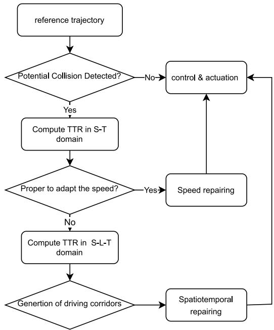

flowchart

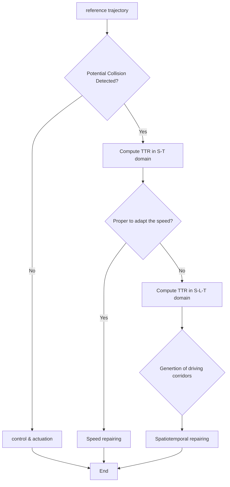

FIGURE 3. Flowchart of the proposed trajectory repairing framework.

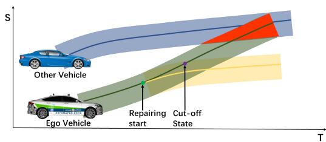

text_image

S
Other Vehicle
Ego Vehicle
Repairing
start
Cut-off
State
T

(a) Speed Repairing in S-T domain. The motion of the ego vehicle and the other vehicle in the current ego lane is projected into the S-T domain

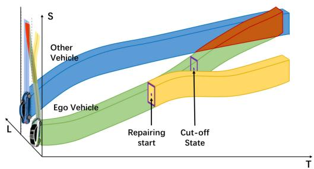

text_image

S
Other Vehicle
Ego Vehicle
Repairing start
Cut-off State
L
T

(b） Spatiotemporal Repairing in the S-L-T domain.The motion of the ego vehicle and the other vehicle is projected into the S-L-T domain in curvilinear coordinates.

FIGURE 4. Trajectory repairing in the S-T domain and the S-L-T domain.

shown in Figure 4(a), and the updated speed profile is passed to the control and actuation layer. However, if adjusting the speed is impossible or inappropriate, we compute the TTR in the S-L-T domain and generate driving corridors. In this case, the spatiotemporal repairing procedure begins, as shown in Figure 4(b), sending the repaired trajectory to the control and actuation stack. In the following sections, we will detail the functioning of each component.

feasible range to reactactuation delay △T   
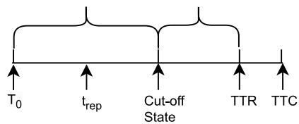

text_image

T₀
tₐₚ
Cut-off
State
TTR
TTC

FIGURE 5. Illustration of time-to-react and cut-off state.

# A. TIME-TO-REACT APPROXIMATION AND CUT-OFF STATE DETECTION

We begin by providing some essential definitions. Figure 5 illustrates the relationships of Time-To-React and Cut-off State, which are described next.

Definition 5 (Time-To-React): TTR (Time-To-React) is the greatest time instance that the ego vehicle may adhere to the reference trajectory $u ( [ t _ { 0 } , t _ { h } ] )$ in relation to variable $t ,$ ensuring a collision-free trajectory. The starting state is denoted as $t _ { 0 }$ and the time horizon for the reference trajectory is denoted as $t _ { h }$ .

Definition 6 (Cut-off State): Actuation delays are present in every dynamic system in the real world. Here, 	T is the time needed to compensate for the actuation delay. By subtracting 	T from TTR, we determine the cut-off state, representing the maximum time for the AD system to perform an evasive maneuver. In the following, we will refer to the trajectory repairing occurring at the cut-off state as “critical repairing.”

To provide sufficient safe space or time for possible driving maneuvers from the cut-off state, we need to underapproximate the TTR considering evasive maneuvers related to speed (i.e., brake and kick-down) and evasive maneuvers related to the path (i.e., steering left or right). In previous work [6], both $M _ { s p e e d }$ (speed-related maneuvers) and $M _ { p a t h }$ (path-related maneuvers) are computed simultaneously for under-approximating TTR. However, this is inefficient and counter-intuitive. We propose a hierarchical search scheme, in which we firstly under-approximate TTR in the S-T space considering $M _ { s p e e d } ;$ if it is not proper, we search for TTR in the S-L-T space considering $M _ { p a t h }$ . Our proposed hierarchical search algorithm for TTR is presented in Algorithm 3 in Appendix-B. As shown in the cut-off state search time for scenario (1) in Table 2, we reduce the computation time by avoiding the unnecessary search for TTR in the S-L-T space.

Figure 6(a) shows the generated speed-related maneuvers $M _ { s p e e d }$ in the S − T domain. An obstacle suddenly cuts in at 1.9s, leading to a potential collision. Hence the reference speed profile must be adjusted. In the example, the time resolution is 0.1s, TTK is 0.3s, and TTB is 0.7s. Therefore, TTR is 0.7s.

Figure 6(b) shows the generated path-related maneuvers $M _ { p a t h }$ in the X − Y domain. We follow the design of evasive steering maneuvers in [39]. The lateral target of the evasive path has a lateral offset $L _ { \mathrm { o f f s e t } }$ to the obstacle and is parallel to the reference path. Different from [39] using a polynomial model for the evasive path, We utilize the kinematic singletrack model to simulate the evasive lane change maneuver. The steering angle rate in this model is fixed at 0.09, following the steering intervention strategy outlined in [40]. In Figure 6(b), the traffic rule disallows the ego vehicle to steer to the right. The TTR is hence the TTS to the left.

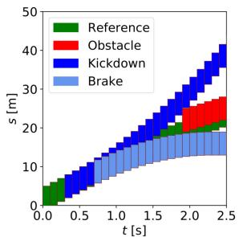

bar_stacked

| t [s] | Brake (m) | Kickdown (m) | Obstacle (m) | Reference (m) |
|---|---|---|---|---|
| 0.0 | 0 | 0 | 0 | 0 |
| 0.5 | 10 | 10 | 0 | 5 |
| 1.0 | 12 | 15 | 0 | 8 |
| 1.5 | 14 | 20 | 5 | 10 |
| 2.0 | 16 | 25 | 10 | 12 |
| 2.5 | 18 | 30 | 15 | 14 |

(a)Search for TTR in the S-T space visualized in the S-T space

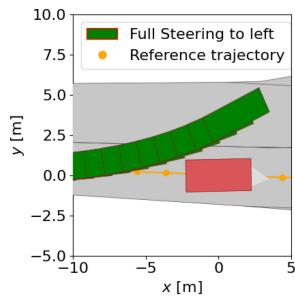

line

| x [m] | Full Steering to left y [m] | Reference trajectory y [m] |
|-------|-----------------------------|-----------------------------|
| -10   | 1.0                         | 0.0                         |
| -5    | 2.0                         | 0.0                         |
| 0     | 3.0                         | 0.0                         |
| 5     | 4.0                         | 0.0                         |

(b) Search for TTR in the S-L-T space visualized in the X-Y space   
FIGURE 6. Exemplary results of the binary search in the S-T domain and the S-L-T domain.

# B. ANYTIME AND OPTIMAL TRAJECTORY REPAIRING

In this section, we present the overall problem formulation for both anytime and optimal trajectory repairing.

Definition 7 (Anytime Trajectory Repairing): Anytime trajectory repairing is the trajectory repairing algorithm that can offer a repaired trajectory at any stage of its execution, even if it is interrupted before obtaining the best repaired trajectory.

Ensuring anytime trajectory repairing is crucial in safetycritical situations as it enables the execution of versatile and adaptable evasive actions while facing probable accidents. An anytime trajectory repairing method may provide a secure reaction to a possible threat, even in the most severe scenario. We can also establish the optimality of trajectory repairing as follows.

Definition 8 (Optimal Trajectory Repairing): A collision is anticipated to occur at TTC due to changes in driving circumstances, and a cut-off state has been recognized. The variable $t _ { r e p }$ inside the range of $[ T _ { 0 } , T T R - \Delta T ]$ signifies the possible time when the repairing will commence. The optimal time-to-repair is denoted as $t _ { r e p } ^ { * }$ and an optimal repaired trajectory is $u ^ { * } ( t )$ . The trajectory repairing is considered optimal if the following optimization problem achieves the global minimum.

$$
\min _ {t _ {r e p}, u (t)} J _ {r e f} \bigl (t _ {r e p}, r (t) \bigr) + J _ {r e p} \bigl (t _ {r e p}, u (t) \bigr)
$$

$$
s. t. \quad u (t) \in U
$$

$$
t _ {r e p} \in [ 0, T T R - \Delta T ] \tag {3}
$$

where $J _ { r e f }$ and $J _ { r e p }$ are the same objective functions for the reference trajectory r(t) until $t _ { r e p }$ and repaired trajectory u(t) starting from $t _ { r e p } . \ r ( t )$ is a reference trajectory, and u(t) is the repaired trajectory. Additionally, the total cost is denoted as $J _ { t o t a l } = J _ { r e f } + J _ { r e f }$ , with $J _ { t o t a l } ^ { * }$ representing the optimal total cost.

With a smaller $t _ { r e p } ,$ a larger segment of the reference trajectory must be repaired; the AD system is more sensitive to driving condition changes but could have a more comfortable reaction. On the contrary, with a larger $t _ { r e p } .$ , a smaller segment of the reference trajectory must be repaired, and the AD system is more robust against driving condition changes; however, the maneuver is more aggressive due to approaching the critical point. Adding $J _ { r e f }$ and $J _ { r e p } { . }$ , we can investigate the optimal time-to-repair balancing reference trajectory and repaired trajectory. If $t _ { r e p }$ is $T _ { 0 }$ , the planning scheme is the same as replacing the reference trajectory (replanning). If $t _ { r e p }$ is $T T R - \Delta T$ , the planning scheme is the same as critical repairing.

# C. TRAJECTORY REPAIRING USING BÉZIER TRAJECTORY OPTIMIZATION

In this study, we utilize the Bézier trajectory to model the vehicle’s trajectory. The primary reason for adopting the Bézier trajectory is its convex hull property and hodograph property, which guarantee the safety of the trajectory and facilitate the formulation of a quadratic programming (QP) problem [35]. While speed repairing is one-dimensional and spatiotemporal repairing is two-dimensional, we use the same Bézier trajectory optimization formulation for both of them. The repairing starts from a desired point $t _ { r e p } .$ . The objective function for the Bézier trajectory is designed as follows:

$$
\begin{array}{l} J _ {r e p, \sigma} = w _ {1} \int_ {t _ {r e p}} ^ {T} \left(f ^ {\sigma} (t) - r ^ {\sigma} (t)\right) ^ {2} d t \\ + w _ {2} \int_ {t _ {r e p}} ^ {T} \left(f ^ {\sigma^ {\prime}} (t) - V _ {r} ^ {\sigma}\right) ^ {2} d t + w _ {3} \int_ {t _ {r e p}} ^ {T} f ^ {\sigma^ {\prime \prime}} (t) ^ {2} d t \\ + w _ {4} \int_ {t _ {r e p}} ^ {T} f ^ {\sigma^ {\prime \prime \prime}} (t) ^ {2} d t + w _ {5} \left(f ^ {\sigma} (T) - r ^ {\sigma} (T)\right) ^ {2} \tag {4} \\ \end{array}
$$

where T represents the planning time horizon, and $w _ { 1 } , \ldots , w _ { 5 }$ are the weights assigned to each optimization term. For the speed repairing problem $J _ { r e p } = J _ { r e p , s }$ . For the spatiotemporal repairing problem $J _ { r e p } = J _ { r e p , s } + J _ { r e p , l }$

Next, we introduce the typical constraints for the optimization problem for both $S - T$ domain and $L - T$ domain, including boundary constraints, continuity constraints, security constraints, and physical constraints. In the following formulation, $c _ { j } ^ { i , l }$ is the i-th control point of the j-th segment of the Bézier trajectory of the l-th order derivative. $h _ { j }$ is the scale factor for the j-th segment of the Bézier trajectory. We combined the constraints from previous work [34], [35], [37].

# 1) BOUNDARY CONSTRAINTS

The piecewise Bézier trajectory starts at a fixed value of the zero-order, first-order, and second-order derivative, and it is defined as

$$
(h _ {0}) ^ {1 - l} c _ {0} ^ {0, l} = \left. \frac {d ^ {l} f (t)}{d t ^ {l}} \right| _ {t = 0}, l = 0, 1, 2 \tag {5}
$$

# 2) CONTINUITY CONSTRAINTS

The piecewise Bézier trajectory maintains continuity at the connecting points with respect to the zero-order, first-order, and second-order derivatives. It follows that

$$
\left(h _ {j}\right) ^ {1 - l} c _ {j} ^ {n, l} = \left(h _ {j + 1}\right) ^ {1 - l} c _ {j + 1} ^ {0, l}, l = 0, 1, 2, j = 0, 1, \dots , m - 1. \tag {6}
$$

# 3) SAFETY CONSTRAINTS

With trapezoidal corridors $S ^ { t r a }$ in 1D or quadrilateral frustum corridors $S ^ { q r }$ in 2D, we come to the safety constraints:

$$
\underline {{p}} _ {j} ^ {0} + h _ {j} \underline {{p}} _ {j} ^ {1} M _ {i, 1} \leq h _ {j} c _ {j} ^ {i, 0} \leq \bar {p} _ {j} ^ {0} + h _ {j} \bar {p} _ {j} ^ {1} M _ {i, 1} \tag {7}
$$

where $i = 0 , 1 , \ldots , n ; j = 0 , 1 , \ldots , m - 1 .$ .

The ego vehicle is depicted as a point, whereas other obstacles are expanded based on lateral and longitudinal safety margins, as mentioned in Section III-A. Incorporating $S _ { \mathrm { o f f s e t } }$ and $L _ { \mathrm { o f f s e t } }$ provides extra safety margin in the safety constraint formulation while ensuring linear constraints. We developed a corridor generation method that creates $S ^ { q r }$ based on a minimal resolution and combines related segments of the Bézier trajectory, as detailed in Algorithm 2.

# 4) PHYSICAL CONSTRAINTS

We take into account the actual physical constraints of the vehicle, imposing limits on velocity, acceleration, and jerk. Utilizing the Hodograph property, we derive Bézier polynomials for these motion trajectories, as detailed in Section III-B. The physical constraints are formalized as follows:

$$
\underline {{{{\beta}}}} _ {j} ^ {l} \leq \left(h _ {j}\right) ^ {1 - l} c _ {j} ^ {i, l} \leq \bar {\beta} _ {j} ^ {l} \tag {8}
$$

where $i = 0 , 1 , \ldots , n , l = 1 , 2 , 3 , j = 0 , 1 ; \ldots , m - 1 . \ \underline { { \beta } } _ { i } ^ { l }$ and $\bar { \beta } _ { j } ^ { l }$ are upper bound and lower bound for l-th derivative of the j-th segment respectively. The limits for acceleration and jerk are consistent throughout various segments of the Bézier trajectory.

# 5) KINEMATIC SPEED CONSTRAINTS

The speed profile produced must adhere to the principles of kinematics. For $t \in [ T _ { j } , T _ { j + 1 } ]$ , let $a _ { l a t } ^ { d e s }$ denote the desired lateral acceleration within the vehicle frame, and $| k | _ { r , m a x }$ represent the maximum absolute curvature of the reference path in the same segment. Similar to [11], the lateral acceleration is constrained as

$$
c _ {j} ^ {i, 1} \leq \min \left\{\bar {\beta} _ {j} ^ {1}, \sqrt {\frac {a _ {l a t} ^ {\mathrm{des}}}{| k | _ {r , \max}}} \right\} \tag {9}
$$

Finally, the constraints are linear and affine, therefore the trajectory repairing problem can be formulated as a QP problem [9]

$$
\min _ {c} c ^ {T} Q _ {c} c + p _ {c} ^ {T} c + J _ {r e m}
$$

$$
s. t. A _ {e q} c = b _ {e q}
$$

$$
A _ {i e} c \leq b _ {i e} \tag {10}
$$

where c is a combined vector of $[ c _ { 0 } , c _ { 1 } , \ldots , c _ { m - 1 } ]$ . The remaining terms not related to c are put into $J _ { r e m } .$ .

In our work, we adopt OSQP (Operator Splitting Quadratic Program) [41] as the QP solver due to its ability to handle large-scale problems with linear and affine constraints, providing reliable and accurate solutions.

# D. SOLVING OPTIMAL TRAJECTORY REPAIRING

This section addresses an optimal trajectory repairing problem and provide a suboptimal but workable technical solution. In our problem, the planned trajectory is described by piecewise Bézier curves. So the total cost $J _ { t o t a l }$ can be rewritten as:

$$
\begin{array}{l} J _ {t o t a l} = J _ {r e f} \left(t _ {r e p}, r (t)\right) + J _ {r e p} \left(t _ {r e p}, c\right) \\ = J _ {r e f} \big (t _ {r e p}, r (t) \big) + J _ {r e m} \big (t _ {r e p} \big) + J _ {Q P} \big (t _ {r e p}, c \big) \tag {11} \\ \end{array}
$$

It should be noted that $r ( t )$ is the reference trajectory, which is already fixed. $J _ { t o t a l }$ can be decomposed into three parts: $J _ { r e f } ( t _ { r e p } , r ( t ) )$ and $J _ { r e m } ( t _ { r e p } ,$ which are functions only with respect to variable $t _ { r e p } ,$ , and $J _ { Q P } ( t _ { r e p } , c )$ , which is a function with respect to variable $t _ { r e p }$ as well as to vector c.

Hence, with our QP problem formulation in Equation (10), the optimal trajectory repairing problem is:

$$
\min _ {t _ {r e p}, c} J _ {r e f} \big (t _ {r e p}, r (t) \big) + J _ {r e m} \big (t _ {r e p} \big) + J _ {q p} \big (t _ {r e p}, c \big)
$$

$$
s. t. A _ {e q} c = b _ {e q}
$$

$$
A _ {i e} c \leq b _ {i e}
$$

$$
t _ {r e p} \in [ 0, T T R - \Delta T ] \tag {12}
$$

where c is a combined vector of $[ c _ { 0 } , c _ { 1 } , \ldots , c _ { m - 1 } ] .$

Given the formulation of the optimal trajectory repairing problem, we incorporate the reference trajectory $r ( t )$ into the objective function as detailed in Equation (4). Consequently, we derive the reference cost, which persists up to $t _ { r e p } ,$ marking the begin of the repair process:

$$
\begin{array}{l} J _ {r e f, \sigma} = w _ {2} \int_ {0} ^ {t _ {r e p}} \left(r _ {\sigma} ^ {\prime} (t) - V _ {r, \sigma}\right) ^ {2} d t \\ +, w _ {3} \int_ {0} ^ {t _ {r e p}} r _ {\sigma} ^ {\prime \prime \cdot} (t) ^ {2} d t + w _ {4} \int_ {0} ^ {t _ {r e p}} r _ {\sigma} ^ {\prime \prime \prime} (t) ^ {2} d t. (13) \\ J _ {r e f, \sigma} = w _ {2} \int_ {0} ^ {t _ {r e p}} \left(r _ {\sigma} ^ {\prime} (t) - V _ {r, \sigma}\right) ^ {2} d t \\ +, w _ {3} \int_ {0} ^ {t _ {r e p}} r _ {\sigma} ^ {\prime \prime \cdot} (t) ^ {2} d t + w _ {4} \int_ {0} ^ {t _ {r e p}} r _ {\sigma} ^ {\prime \prime \prime} (t) ^ {2} d t. (13) \\ \end{array}
$$

The constraints for the optimization function are affine, however, the convexity of the objective function is unknown, as it is related to the reference trajectory $r ( t )$ . Numerical optimization methods, such as non-linear programming, might be able to solve the problem but might not achieve a global minimum for this specific problem. To ensure that our repair framework is compatible with smooth reference trajectories and be used in real-time, we propose a grid search approach to solve the optimal trajectory repairing problem, as shown in Algorithm 1. Although it can only provide a sub-optimal result, it is easy to implement and offers anytime Algorithm 1 Anytime Grid Search for $t _ { r e p }$ for Sub-Optimal Trajectory Repairing

Require: TRR: Time-To-React, $T _ { 0 } { \mathrm { : } }$ Initial time, 	T : time delay, δt: time resolution, r(t): reference trajectory

$$
1 \colon J _ {t o t a l} ^ {*} = \infty
$$

$$
2 \colon t _ {r e p} ^ {*} = t _ {r e p} \leftarrow T _ {0}
$$

$$
3: \text { while } t _ {r e p} \leq T T R - \Delta T \text { and not reachTimeLimit() do }
$$

$$
4: \quad J _ {r e f} \leftarrow \text { getRefCost } (r (t), t _ {r e p})
$$

$$
5: \quad J _ {r e m} \leftarrow \text { getRemCost } (t _ {r e p})
$$

$$
6: \quad J _ {r e p} \leftarrow s o l v e Q P (r (t), t _ {r e p})
$$

$$
7: \quad \text { if } J _ {r e f} + J _ {r e m} + J _ {r e p} <   J _ {t o t a l} ^ {*} \text { then }
$$

$$
8: \quad J _ {t o t a l} ^ {*} = J _ {r e f} + J _ {r e m} + J _ {r e p}
$$

$$
9: \quad t _ {r e p} ^ {*} \leftarrow t _ {r e p}
$$

$$
1 0: \quad \text { end   if }
$$

$$
1 1: \quad t _ {r e p} = t _ {r e p} + \delta t
$$

$$
1 2: \text { end   while }
$$

$$
1 3: \text {   return   } t _ {r e p} ^ {*}
$$

trajectory repairing, see Definition 7. The variables $J _ { t o t a l } ^ { * }$ and $t _ { f r } ^ { * }$ are first initialized (line 1-2). the optimal $t _ { f r } ^ { * }$ is determined by a grid search using a while loop (line 3 to line 12). Once all possible $t _ { r e p }$ values have been enumerated or if the next iteration is predicted to exceed a time constraint, the while loop terminates and we provide the sub-optimal outcome used to generate the repaired trajectory.

# E. 3D QUADRILATERAL FRUSTUM CORRIDOR GENERATION

This section describes our strategy to generate driving corridors in the S-L-T space. Extensive study has been conducted to provide safe corridors for drone flights. Convex cluster inflation, as stated in [42], improves time efficiency with GPU acceleration and free space capture, but requires an occupancy map for the environment model. Similarly, Saccani et al. utilize a convex polyhedron with a maximum radius to underestimate the open space. Expanding the vertices of the original polyhedron confirms its convexity [43]. On-road vehicles have less maneuverability than flying drones. Schäffer et al. have suggested a technique to find collision-free driving corridors that express spatiotemporal limitations using set-based reachability analysis for motion planning for [44].

We extend this work by also convexifying the boundary in $\mathrm { L } \mathrm { - } \mathrm { T }$ into trapezoidal corridors, which is detailed in Algorithm $2 . \ S ^ { q f }$ is a better approximation of  than $S ^ { p r }$ .

Definition 9 (Quadrilateral Frustum Corridor $S ^ { q f } ) .$ : Assume that an arbitrary control point of $f _ { i } ^ { \sigma } ( t )$ in both dimensions $\{ s , l \}$ meets the condition $c _ { j } ^ { i } \ \in \ \{ c _ { j } ^ { i } \underline { p } _ { i } ^ { 0 , \sigma } \ +$ $h _ { j } \underline { { p } } _ { j } ^ { 1 , \sigma } M _ { i , 1 } \ \leq \ h _ { j } c _ { j } ^ { i } \ \leq \ \bar { p } _ { j } ^ { 0 , \sigma } \ + \ h _ { j } \bar { p } _ { j } ^ { 1 , \sigma } M _ { i , 1 } \}$ , where $\underline { { p } } _ { j } ^ { 0 , \sigma } , \underline { { p } } _ { j } ^ { 1 , \sigma }$ are the lower bound bias and skew, and $\bar { p } _ { j } ^ { 0 , \sigma } , \bar { p } _ { j } ^ { 1 , \sigma }$ $S ^ { c o r } =$ hjp0,lj t−Tjhj $\begin{array} { r l r } { h _ { j } \underline { { p } } _ { j } ^ { 0 , l } \frac { t - T _ { j } } { h _ { j } } } & { \le } & { l \le \bar { p } _ { j } ^ { 0 , l } + h _ { j } \bar { p } _ { j } ^ { 1 , l } \frac { t - T _ { j } } { h _ { j } } , t \in [ T _ { j } , T _ { j + 1 } ] \} } \end{array}$ $\begin{array} { r } { \hat { \{ ( t , s , l ) \big . \vert p _ { j } ^ { 0 , s } + h _ { j } p _ { - j } ^ { 0 , s } \frac { t - T _ { j } } { h _ { j } } } \leq s \leq \bar { p } _ { j } ^ { 0 , s } + h _ { j } \bar { p } _ { j } ^ { 1 , s } \frac { t - T _ { j } } { h _ { j } } , \underline { { p } } _ { j } ^ { 0 , l } + } \end{array}$ + hjp¯ 1,sj t−Tjhj , p0,l + P is a

# Algorithm 2 Piecewise 3D Quadrilateral Frustum Driving Corridors Generation

Require: $t _ { r e p } \mathrm { : }$ Time-to-repair, $P _ { 0 } \colon$ Set of the reference trajectory and predicted trajectories of other vehicles, δt: corridor resolution, M: Maneuver set

1: for $m \in M$ do   
2: boundaries ← genBoundary(m, $P _ { 0 } )$   
3: generating boundaries by slicing the S-L-T space along the l axis   
4: corridor ← convexify2D(corridor, boundaries, δt)   
5:  convexify the boundary in the sliced S-T space for obtaining prism corridors   
6: corridor\_list.append(corridor)   
7: end for   
8: corridor, $m _ { r e p }$ ← combineCorridors $( t _ { r e p } ,$ corridor\_list)   
9: boundaries ← genBoundary(mrep, P0)   
10: generating boundaries by slicing the S-L-T space along the s axis   
11: corridor ← convexify2D(corridor, boundaries, δt)   
12:  convexify the boundary in the sliced L-T space for obtaining quadrilateral frustum corridors   
13: return corridor

quadrilateral frustum corridor, referred as $S ^ { q f }$ , where $f _ { j } ^ { \sigma } \left( t \right)$ is a collision-free trajectory residing in $S ^ { t r a }$ .

The algorithm 2 generates piecewise 3D quadrilateral frustum driving corridors, corresponding to the safety constraints (Equation (7)) for Bézier trajectory optimization. It generates driving corridors using time segments, allowing for customizable resolution as opposed to uniform resolution in [23], [45]. The algorithm acquires the search result for time-to-repair, a list of plausible evasive maneuvers, and the ego reference trajectory and predicted trajectories of all traffic participants. The program first runs through all feasible speed-related evasive tactics (lines 1–7). The driving corridor boundaries are formed by slicing the S-L-T space along the L axis, and the 2D S-T space is convexified by the implementation of Algorithm 2, as detailed in the reference work [13]. The combineCorridors(-) function then combines the created trapezoidal corridors for each evasive maneuver, taking into account the time-to-repair, to provide a combined corridor and a repaired maneuver (for example, when should a lane change start and end). In lines 8-12, we enhanced the corridor generation strategy in [13]. The function genBoundary(-) is used again, but this time it slices the S-L-T space along the S axis, and the merged corridor is subsequently handled by the function convexify2D(-) in the 2D L-T space. Finally, we have piecewise 3D quadrilateral frustum driving corridors.

Figure 7 illustrates the process of the approach. The scenario is the third one in our evaluation see below: road damage avoidance in flowing traffic. The planning problem is first projected into the S-L-T space, as illustrated in the first block of Figure 7. Next, based on the search results of several evasive maneuvers in Algorithm 3 in Section IV-A, lane-change to the left and lane-keeping with a slowdown is the move that may escape crashing into the road damage (or static obstacle). In this scenario, we created two prism corridors by convexifying the border in the S-T space, which were then joined based on the initial time step of repairing and expanded by convexifying the boundaries in the L-T space. Finally, we obtained the quadrilateral frustum corridors.

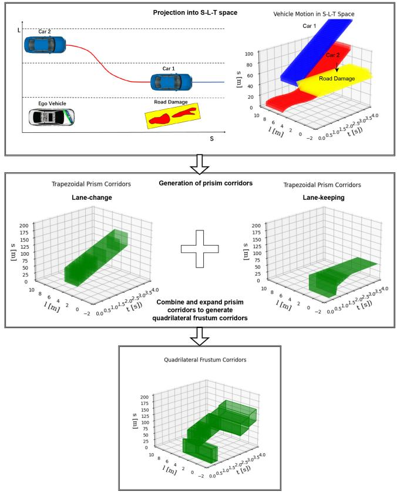

flowchart

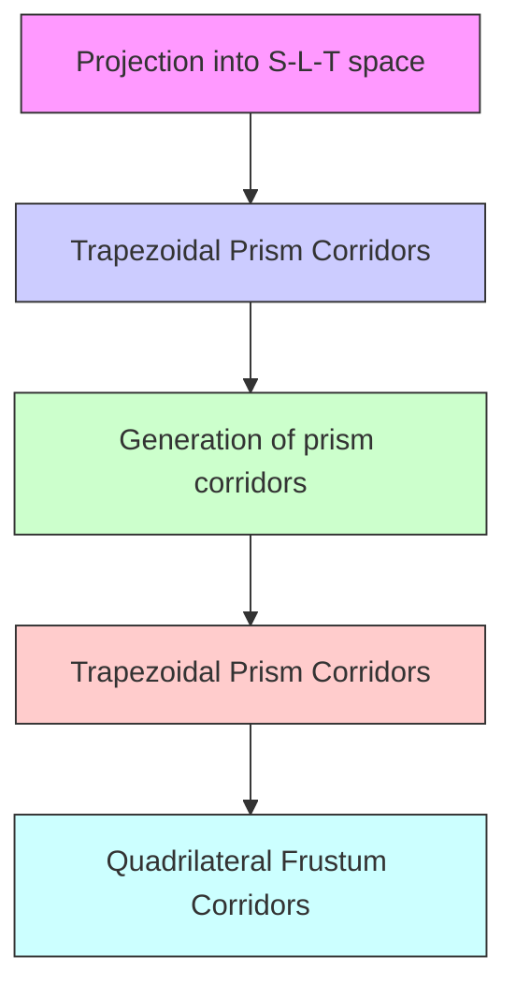

FIGURE 7. Illustration of driving corridor generation.

# V. EVALUATION

# A. IMPLEMENTATION DETAILS

We tested our method with various traffic scenarios using the open-source CommonRoad platform [46], which provides a wide range of scenarios. The vehicle parameters for the ego vehicle are based on a Ford Escort [46]. Our approach is implemented in Python and runs on a machine equipped with an Intel(R) Core(TM) i7-12700H. The solver used for solving the QP problem is OSQP [41]. We fine-tuned the solver setup, with the main optimization parameters being: a maximum of 4000 iterations, and both absolute and relative tolerances set to 0.001. Other parameters for OSQP are set to their default values. We specify the weights for the objective function in the discussion of each scenario.

Our current work does not account for interactive scenarios, so only a single horizon of the trajectory is calculated. In actual applications, the trajectory planning and repairing framework operates as follows: The search-based planner, as demonstrated in [11], plans a reference trajectory at a lower frequency for a longer horizon. This planner can generally handle various traffic scenarios that can be modeled into a graph. However, it suffers from a trade-off between graph resolution and computation load. To reduce computational burden, its resolution is intentionally limited, which may prevent it from effectively addressing unexpected aggressive behavior from other road users. Conversely, the trajectory repairing module operates as a fallback planner at a high frequency to ensure the safety of the reference trajectory planned by the search-based planner and to address immediate safety issues in response to the sudden behavior of other vehicles.

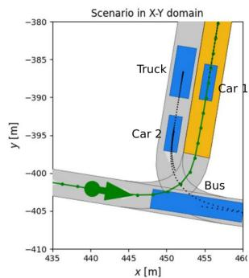

text_image

Scenario in X-Y domain
y [m]
-380
-385
-390
-395
-400
-405
-410
435 440 445 450 455 460
x [m]
Truck
Car 1
Car 2
Bus

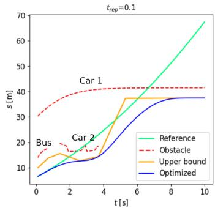

line

| t [s] | Reference | Obstacle | Upper bound | Optimized |
|-------|-----------|----------|-------------|-----------|
| 0     | 10        | 30       | 10          | 10        |
| 2     | 15        | 35       | 15          | 15        |
| 4     | 20        | 40       | 20          | 20        |
| 6     | 30        | 40       | 35          | 35        |
| 8     | 45        | 40       | 35          | 35        |
| 10    | 70        | 40       | 35          | 35        |

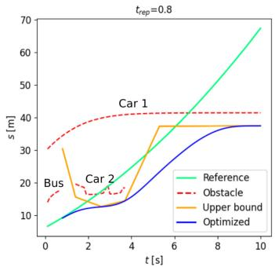

line

| t [s] | Reference | Obstacle | Upper bound | Optimized |
|-------|-----------|----------|-------------|-----------|
| 0     | 5         | 15       | 30          | 5         |
| 2     | 15        | 20       | 15          | 10        |
| 4     | 25        | 25       | 20          | 15        |
| 6     | 35        | 30       | 35          | 25        |
| 8     | 50        | 35       | 35          | 35        |
| 10    | 70        | 40       | 35          | 35        |

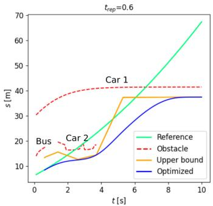

line

| t [s] | Reference | Obstacle | Upper bound | Optimized |
|-------|-----------|----------|-------------|-----------|
| 0     | 5         | 30       | 15          | 5         |
| 2     | 15        | 40       | 18          | 10        |
| 4     | 25        | 40       | 20          | 15        |
| 6     | 40        | 40       | 35          | 25        |
| 8     | 55        | 40       | 35          | 35        |
| 10    | 70        | 40       | 35          | 35        |

FIGURE 8. Scenario 1: optimization of trapezoidal corridors with different values of $t _ { r e p } .$ . The first graphic represents an urban T-intersection scenario in which the planning process begins with the arrow along a green line and progresses to the yellow objective zone. The dotted black lines represent the future motion of other vehicles. The three right graphics show the expected extreme positions of the other automobiles within the S-T domain (within the ego lane), as well as the optimization results.

In the following sections, we present the results of the proposed approach for each scenario, followed by a statistical analysis

# B. SCENARIO 1: URBAN T-INTERSECTION

We chose a difficult urban T-intersection situation,1 explicitly specified in the CommonRoad database, to test and confirm the efficacy of our approach. The scenario animation is featured within CommonRoad’s Scenario Selection Tool. The flowchart in Figure 3 shows that the first step is to calculate the TTR in the S-T space. It is believed that each automobile in the scenario has a rectangular shape. We extrapolate the projected moves of the outermost points of obstacles that appear in the vehicle’s lane and map them to the space-time domain. Figure 8 shows two vehicles crossing the driving lane. After calculating the TTR, the algorithm evaluates the possibility of changing the speed based on the average calculation time of 9.2ms, as shown in Table 2. In this case, the TTR is only 0.8s, making it difficult for searchor sampling-based approaches. Deceleration is the suitable evasive approach.

Next, we begin speed repairing. The actuation delay 	T is assumed to be zero seconds. The constant reference speed $\nu _ { r }$ is 12.5m/s. The safety margin offset, $S _ { \mathrm { o f f s e t } }$ , is equivalent to 4m. The objective function employs the following weights: $w _ { 1 } ~ = ~ 1 0 . 0 , w _ { 2 } ~ = ~ 2 . 0 , w _ { 3 } ~ = ~ 1 . 0 , w _ { 4 } ~ = ~ 1 . 0 , w _ { 5 } ~ = ~ 5 . 0$ . Figure 8 shows the speed profile after optimization for several $t _ { r e p }$ and trapezoidal corridor configurations. Figure 9 illustrates the ideal speed, acceleration, and jerk for replanning, repairing at the critical point, and sub-optimal trajectory repairing at $t _ { r e p } = 0 . 6 s .$ . The trade-off impact of $t _ { r e p }$ can be summarized as follows: Increasing the $t _ { r e p }$ value allows the system to better manage false-negative disturbances, such as recognizing a “ghost object”. This longer reaction time increases the system’s resilience and allows it to track the reference trajectory more precisely until it reaches the critical point. However, it increases jerk and deceleration, particularly at the onset of maneuvers, and reduces passenger comfort. On the other side, a lower $t _ { r e p }$ results in a shorter reaction waiting time.

Furthermore, it has the ability to provide more comfortable trajectory adjustments. In the first scenario, the sub-optimal time-to-repair $t _ { r e p } ^ { * }$ from anytime grid search is $0 . 6 s ,$ , yielding a lower total cost than critical repairing $( t _ { r e p } = 0 . 8 s )$ and replanning $( t _ { r e p } = 0 . 1 s )$ . In Figure 8, the rightmost figure shows the sub-optimal trajectory repairing, which provides a trade-off between rapid and robust reaction patterns. In Figure 9, the same trend can be observed: trajectory repairing starting at 0.6s establishes a balance between replanning and crucial repairing, which provides superior trajectory quality than the other two.

# C. SCENARIO 2: BLOCKED T-INTERSECTION

The second scenario, depicted in Figure 10, is a blocked T-intersection, modified from another scenario example.2 We place a static obstruction in front of the intersection, requiring the ego car to change lanes to continue on the path. We first looked for the TTR in the S-T Space. However, the ego vehicle must come to a complete halt and is unable to continue driving. As a result, we look for the TTR in the S-L-T space, which is 1.3s in this scenario, and steering to the left is an appropriate evasive strategy. The average computation time for the search for TTR in the S-T space and the S-L-T space is 11.4ms and 1.8ms, respectively (see Table 2).

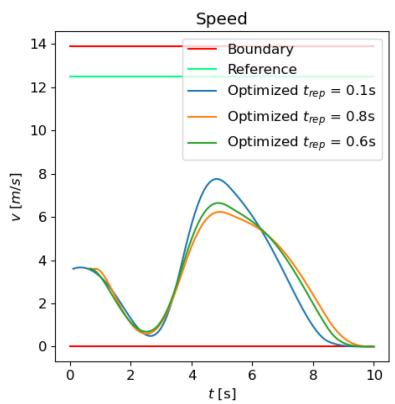

line

| t [s] | Boundary | Reference | Optimized t_rep = 0.1s | Optimized t_rep = 0.8s | Optimized t_rep = 0.6s |
|-------|----------|-----------|------------------------|------------------------|------------------------|
| 0     | 0        | 12.5      | 3.5                    | 3.5                    | 3.5                    |
| 2     | 0        | 12.5      | 1.0                    | 1.0                    | 1.0                    |
| 4     | 0        | 12.5      | 7.5                    | 6.5                    | 6.0                    |
| 6     | 0        | 12.5      | 6.0                    | 5.5                    | 5.0                    |
| 8     | 0        | 12.5      | 3.0                    | 3.0                    | 2.5                    |
| 10    | 0        | 12.5      | 0                      | 0                      | 0                      |

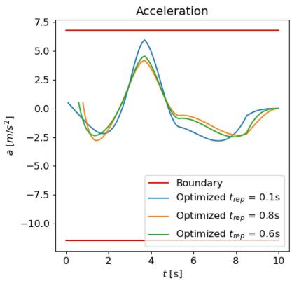

line

| t [s] | Boundary | Optimized t_rep = 0.1s | Optimized t_rep = 0.8s | Optimized t_rep = 0.6s |
|-------|----------|------------------------|------------------------|------------------------|
| 0     | 7.5      | 0.0                    | 0.0                    | 0.0                    |
| 2     | 7.5      | -2.5                   | -2.5                   | -2.5                   |
| 4     | 7.5      | 6.0                    | 4.0                    | 3.0                    |
| 6     | 7.5      | -2.5                   | -1.0                   | -1.5                   |
| 8     | 7.5      | -3.0                   | -2.0                   | -2.5                   |
| 10    | 7.5      | 0.0                    | 0.0                    | 0.0                    |

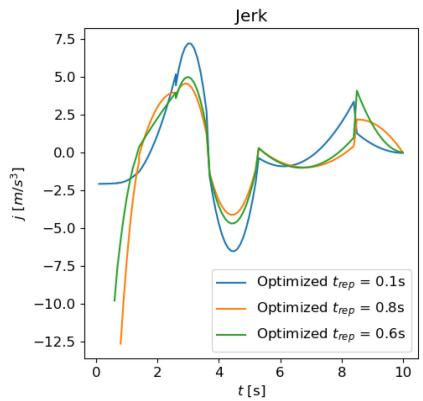

line

| t [s] | Optimized t_rep = 0.1s | Optimized t_rep = 0.8s | Optimized t_rep = 0.6s |
|-------|------------------------|------------------------|------------------------|
| 0     | -2.5                   | -12.5                  | -10.0                  |
| 2     | 7.5                    | 4.0                    | 5.0                    |
| 4     | -7.5                   | -4.0                   | -5.0                   |
| 6     | 0.0                    | 0.0                    | 0.0                    |
| 8     | 4.0                    | 2.0                    | 4.0                    |
| 10    | 0.0                    | 0.0                    | 0.0                    |

FIGURE 9. Scenario 1: optimized speed, acceleration, and jerk with different $t _ { r e p } ,$ where $t _ { r e p } = 0 . 1$ s is replanning, $\mathbf { \Delta } t _ { r e p } = 0$ .8s is critical repairing and $t _ { r e p } = 0$ .6s is sub-optimal repairing.

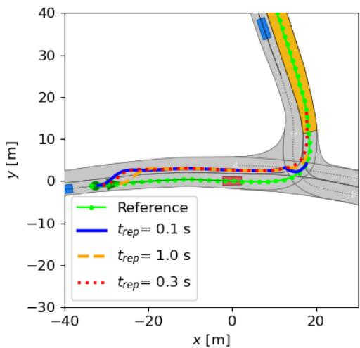

line

| x [m] | Reference y [m] | t_rep = 0.1 s y [m] | t_rep = 1.0 s y [m] | t_rep = 0.3 s y [m] |
|-------|-----------------|---------------------|---------------------|---------------------|
| -40   | ~0              | ~0                  | ~0                  | ~0                  |
| -20   | ~0              | ~0                  | ~0                  | ~0                  |
| 0     | ~0              | ~0                  | ~0                  | ~0                  |
| 20    | ~40             | ~40                 | ~40                 | ~40                 |

FIGURE 10. Scenario 2: Optimized trajectory with different $t _ { r e p } ,$ , where $t _ { r e p } = 0 . 1$ 1s is replanning, $t _ { r e p } = 1$ .0s is critical repairing and $\mathbf { \delta } _ { t e p } = 0$ .3s is the sub-optimal repairing.

The grid search for suboptimal trajectory repairing in the S-L-T space is then initiated. The actuation time delay compensation is $\Delta T \ = \ 0 . 3 s$ . Hence the cut-off moment considering time delay is $1 . 3 s \mathrm { ~ - ~ } 0 . 3 s \mathrm { ~ = ~ } 1 . 0 s$ . The longitudinal safety margin $S _ { \mathrm { o f f s e t } }$ is 2.0m, whereas the lateral safety margin $L _ { \mathrm { o f f s e t } }$ is 1.5m. The objective function weights for optimization in s-axis and l-axis are $w _ { 1 } = 5 . 0 $ , $w _ { 2 } = 5 . 0 , ~ w _ { 3 } = 1 . 0 , w _ { 4 } = 0 . 3 , w _ { 5 } = 2 0 . 0$ and $w _ { 1 } = 5 . 0$ , $w _ { 2 } = 1 . 0$ , $w _ { 3 } ~ = ~ 1 . 0 , w _ { 4 } ~ = ~ 0 . 0 , w _ { 5 } ~ = ~ 5 . 0 $ , respectively. The repairing process begins at $t _ { r e p } = 0 . 1 s$ and gradually adds starting steps until it reaches the critical time point $t _ { r e p } = 1 . 0 s$ . Figure 10 illustrates the trajectory formed by replanning, crucial repairing, and sub-optimal repairing. In comparison to replanning, the trajectory generated by critical repairing allowed the ego vehicle to wait for an additional 0.9 seconds, implying that the static obstacle may move or be a misperceived item, but its trajectory is relatively closer to the obstacle. The sub-optimal repairing $t _ { r e p } = 0 . 3 s$ strikes an appropriate balance between replanning and crucial trajectory repairing.

In Figure 12 and Figure 13, we project the driving corridors formed by the Algorithm 2 in a prediction horizon of 10s and our generated trajectory repairing results with different $t _ { r e p }$ into the S-T and the L-T domain, respectively. In this scenario, the predicted trajectory of the automobile behind the ego vehicle is ignored since it must comply with the ego vehicle. The trajectory is altered for a lefthand lane change caused by an emerging static obstruction before returning to the original route. In Figure 12, the replanning delivers an instantaneous but sluggish slowdown as a reaction to the road damage, but it accelerates again after implementing a lane change. In contrast, critical repairing at 1.0 seconds causes a significantly sharper deceleration, and the ego vehicle then accelerates due to the following vehicles, resulting in an overshoot of the driving speed. Sub-optimal repairing yields the best results in terms of tracking the original trajectory and driving comfort. Figure 13 illustrates a delayed start of lane change as the repairing start time step increases, although the trajectory in the lateral direction does not alter much.

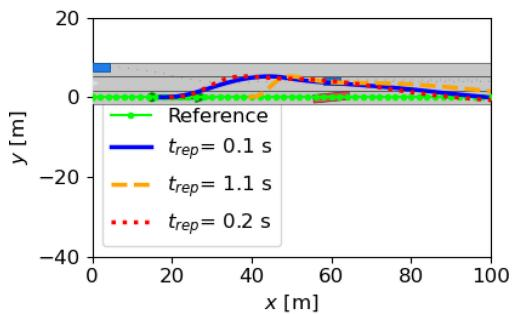

line

| x [m] | Reference | t_rep = 0.1 s | t_rep = 1.1 s | t_rep = 0.2 s |
|-------|-----------|---------------|---------------|---------------|
| 0     | 0         | 0             | 0             | 0             |
| 20    | 0         | 0             | 0             | 0             |
| 40    | 0         | 5             | 5             | 5             |
| 60    | 0         | 0             | 0             | 0             |
| 80    | 0         | -5            | -5            | -5            |
| 100   | 0         | -10           | -10           | -10           |

FIGURE 11. Scenario 3: Optimized trajectory with different $t _ { r e p } ,$ where $\begin{array} { r } { t _ { r e p } = 0 . 1 s \mathrm { i s } } \end{array}$ replanning, $t _ { r e p } = 1 ,$ .1s is critical repairing and $\mathbf { \Delta } t _ { r e p } = 0$ .2s is the sub-optimal repairing.

# D. SCENARIO 3: ROAD DAMAGE AVOIDANCE IN DYNAMIC TRAFFIC

The third scenario was self-created and inspired by the EU-H2020-funded project ESRIUM [47]. The ESRIUM project produced a digital map that can reliably identify road surface deterioration and wear. Connected and automated cars will receive route and driving instructions to make essential lane changes for safety or comfort [48]. As illustrated in Figure 7, the ego vehicle must perform a lane shift to avoid road damage; however, there is a car traveling on the adjacent lane, and another car on the third lane intends to go to the second lane. This presents a challenge for the trajectory repairing algorithm.

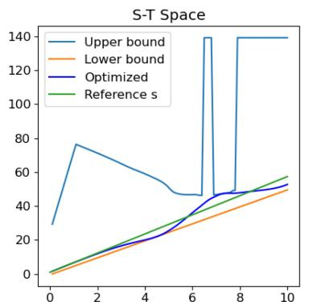

line

| x  | Upper bound | Lower bound | Optimized | Reference s |
|----|-------------|-------------|---------|-------------|
| 0  | 30          | 0           | 0       | 0           |
| 2  | 75          | 10          | 10      | 10          |
| 4  | 60          | 20          | 20      | 20          |
| 6  | 45          | 30          | 30      | 30          |
| 8  | 140         | 45          | 45      | 45          |
| 10 | 140         | 50          | 50      | 55          |

(a)Re-planning (trep =0.1s)

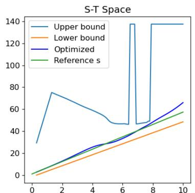

line

| x  | Upper bound | Lower bound | Optimized | Reference s |
|----|-------------|-------------|-----------|-------------|
| 0  | 30          | 0           | 0         | 0           |
| 2  | 75          | 10          | 10        | 10          |
| 4  | 60          | 20          | 20        | 20          |
| 6  | 50          | 30          | 30        | 30          |
| 8  | 140         | 40          | 40        | 40          |
| 10 | 140         | 50          | 65        | 55          |

(b) Suboptimal repairing (trep = 0.3s)

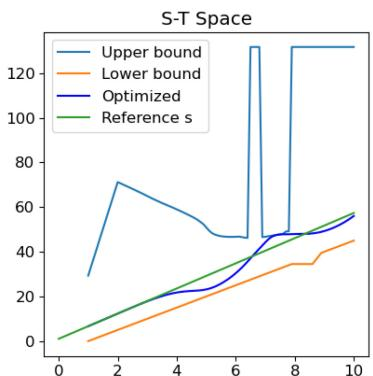

line

| x  | Upper bound | Lower bound | Optimized | Reference s |
|----|-------------|-------------|-----------|-------------|
| 0  | 30          | 0           | 0         | 0           |
| 2  | 70          | 10          | 10        | 10          |
| 4  | 55          | 20          | 20        | 20          |
| 6  | 45          | 30          | 30        | 30          |
| 8  | 130         | 40          | 50        | 40          |
| 10 | 130         | 45          | 55        | 55          |

(c) Critical repairing (trep =1.0s)

FIGURE 12. Scenario 2: benchmark of trajectory repairing with differen $t _ { r e p }$ in the S-T Space.   
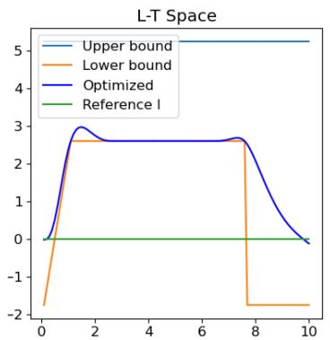

line

| x  | Upper bound | Lower bound | Optimized | Reference I |
|----|-------------|-------------|-----------|-------------|
| 0  | 5           | -2          | 0         | 0           |
| 1  | 5           | 2.5         | 3         | 0           |
| 2  | 5           | 2.5         | 2.5       | 0           |
| 3  | 5           | 2.5         | 2.5       | 0           |
| 4  | 5           | 2.5         | 2.5       | 0           |
| 5  | 5           | 2.5         | 2.5       | 0           |
| 6  | 5           | 2.5         | 2.5       | 0           |
| 7  | 5           | 2.5         | 2.5       | 0           |
| 8  | 5           | -2          | 2.5       | 0           |
| 9  | 5           | -2          | 1         | 0           |
| 10 | 5           | -2          | 0         | 0           |

(a) Re-planning $( t _ { r e p } = 0 . 1 s )$

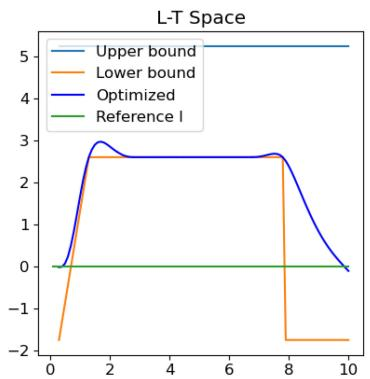

line

| x  | Upper bound | Lower bound | Optimized | Reference I |
|----|-------------|-------------|-----------|-------------|
| 0  | 5           | -2          | 0         | 0           |
| 2  | 5           | 3           | 3         | 0           |
| 4  | 5           | 3           | 3         | 0           |
| 6  | 5           | 3           | 3         | 0           |
| 8  | 5           | -2          | 3         | 0           |
| 10 | 5           | -2          | 0         | 0           |

(b) Sub-optimal repairing $( t _ { r e p } = 0 . 3 s )$

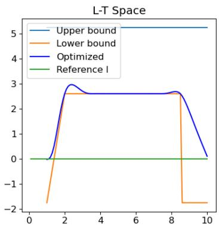

line

| x  | Upper bound | Lower bound | Optimized | Reference I |
|----|-------------|-------------|-----------|-------------|
| 0  | 5           | 0           | 0         | 0           |
| 2  | 5           | 3           | 3         | 0           |
| 4  | 5           | 3           | 3         | 0           |
| 6  | 5           | 3           | 3         | 0           |
| 8  | 5           | 3           | 3         | 0           |
| 10 | 5           | -2          | 0         | 0           |

(c) Critical repairing $( t _ { r e p } = 1 . 0 s )$

FIGURE 13. Scenario 2: benchmark of trajectory repairing with differen $\scriptstyle t _ { r e p }$ in the L-T Space.   
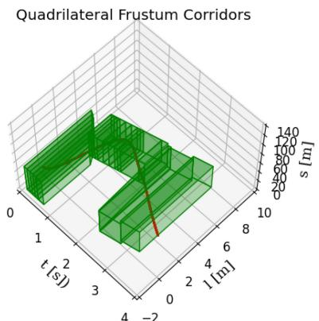

area_stacked

| t (s) | s (m) |
|-------|-------|
| 0     | 0     |
| 1     | 20    |
| 2     | 40    |
| 3     | 60    |
| 4     | 80    |
| 5     | 100   |
| 6     | 120   |
| 7     | 140   |

(a) Re-planning $( t _ { r e p } = 0 . 1 s )$

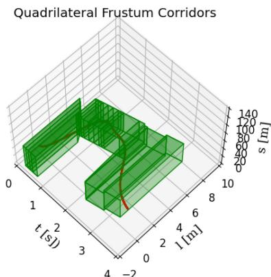

surface_3d

| t[s] | l[m] | s [m] |
|------|------|-------|
| 0    | 0    | 0     |
| 1    | 2    | 20    |
| 2    | 4    | 40    |
| 3    | 6    | 60    |
| 4    | 8    | 80    |
| 5    | 10   | 100   |
| 6    | 12   | 120   |
| 7    | 14   | 140   |

(b) Sub-optimal repairing $( t _ { r e p } = 0 . 2 s )$

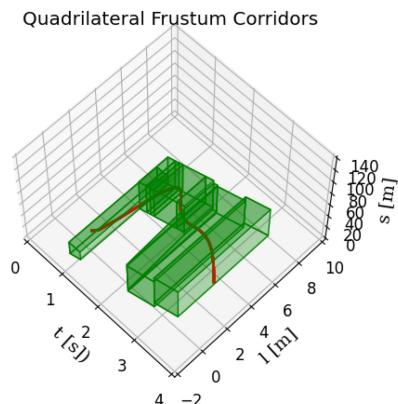

scatter_3d

| t [s²] | s [m] |
| ------ | ----- |
| 0      | 0     |
| 1      | 20    |
| 2      | 40    |
| 3      | 60    |
| 4      | 80    |
| 5      | 100   |
| 6      | 120   |
| 7      | 140   |

(c) Critical repairing $( t _ { r e p } = 1 . 1 s )$   
FIGURE 14. Scenario 3: a benchmark for trajectory repairing using different $t _ { r e p }$ in the S-L-T space. Quadrilateral frustum corridors are shown by green corridors, and the repaired trajectory is indicated by a red line.

Figure 14 visually contrasts different trajectory repairing approaches, each with varying $t _ { r e p }$ values, under dynamic conditions. Figure 14(a) illustrates a case in which the trajectory undergoes re-planning starting at 0.1 seconds. The re-planning is likely to result in a more responsive system, but it also has the most corridors, which demands more optimization solving time. When critical repairing begins at 1.1 seconds, the system recalculates the trajectory, resulting in a markedly slower intervention. This might result in a trajectory that first adheres to the previously intended trajectory before abruptly modifying the plan owing to the necessity to avoid hazards. Critical repairing responds more slowly to environmental changes, which might necessitate abrupt adjustments depending on the specific application. Nevertheless, it necessitates the smallest corridors and thus results in fewer unnecessary maneuvers. Sub-optimal repairing (with $t _ { r e p } = 0 . 2 s )$ offers a compromise between replanning and critical repairing. While the sub-optimal repaired trajectory might not adapt as swiftly as replanning does, it avoids waiting until a critical moment to execute an evasive action.

TABLE 1. Number of scenarios solved by spatiotemporal repairing (STR) vs. path-speed decoupled repairing (PSDR) [9] with mean time-to-repair (TTR) and mean time-to-collision (TTC) across 100 scenarios. 

<table><tr><td></td><td>STR</td><td>PSDR</td><td>Mean TTR</td><td>Mean TTC</td></tr><tr><td>Solved Scenarios</td><td>100</td><td>98</td><td>2.69s</td><td>6.58s</td></tr></table>

# E. STATISTICAL ANALYSIS

Here we present the results of a statistical analysis of our proposed approach. A dataset of T-junction scenarios (with the prefix ZAM\_Tjunction) from the CommonRoad benchmark, consisting of 100 distinct scenarios, is used for statistical analysis. 10 scenarios out of them are inserted with static obstacles for enforcing a lane change. In these non-interactive scenarios, the ego vehicle must execute a left turn at an intersection amidst oncoming traffic, presenting a challenging maneuver. To demonstrate the benefits of trajectory repairing, a reference trajectory is first generated that follows a predefined route at a constant speed matching the initial velocity. However, this reference trajectory leads to collisions with the predicted motion of other vehicles, necessitating trajectory repair. The 13 parameters for the proposed approach remain consistent across all 100 scenarios and have been carefully fine-tuned. However, the time delay, T, is set to zero, meaning no time delay is applied to the cut-off state.

Table 1 presents the number of scenarios successfully solved. Across the 100 scenarios, the mean TTC is 6.58 seconds, while the mean TTR is 2.69 seconds. As shown in Table 1, the proposed spatiotemporal repairing (STR) framework successfully solves all 100 scenarios. We also benchmark the previous Path-Speed Decoupled Repairing (PSDR) framework [9], setting its robustness metric α to 0.2. This approach is unable to solve two scenarios. This limitation occurs because, in the previous approach, path and speed repairing are treated independently. As a result, the predicted obstacle trajectories are projected onto the repaired path without considering their influence on speed adjustments. In certain cases, this decoupling leads to optimization problems that become infeasible, as the repaired path does not leave sufficient room for generating a feasible driving corridor.

The cut-off state search duration grows as the complexity of the scenarios increases. In Table 2, scenario 1 takes less computation time than scenarios 2 or 3 for detecting the cut-off state. This reduction in search complexity is achieved through the application of a hierarchical search strategy for the TTR. By initially searching within the S-T domain, we substantially streamline the search process. Also, in the first scenario, adjusting the longitudinal speed can prevent the accident without the need for a lane change. Scenario 2 has the greatest average computation time among all scenarios, owing to the complicated road layout (T-intersection) and the following and oncoming cars. However, if we transfer our solution to C++ and use multi-threading programming, we can reduce the computation time even more. Scenario 3 depicts a highway scene with two dynamic obstacles and one static obstacle (road damage). The average cutoff state search time is 27.7 ms, indicating strong real-time performance.

In terms of calculation time for various sorts of trajectory repairing, re-planning frequently takes longer to solve optimization problems and produce more corridors than critical repairing, because replanning has the longest planning time horizon and hence possibly the most corridors. In scenario 2, re-planning has a lower average calculation time than critical repairing but much higher standard deviations (7.3ms). Grid search often requires less calculation time for each iteration than re-planning or critical repair. The solver OSQP [41] supports warm-start, which means that it begins solving the optimization problem using the primal and dual variables from the prior QP solution. Since trajectory repairing, regardless of the start time steps, shares the same objective function and similar constraints, initiating the grid search with a warm start can decrease the solution time. It’s important to clarify that the real-time capability of our proposed method is not the main focus of this study. However, employing multi-threading, as demonstrated in [32], could substantially improve real-time performance by simultaneously addressing multiple optimization issues across different threads.

Table 3 shows the normalized costs of re-planning (RP), critical repairing (CR), and sub-optimal repairing (SOR) across three scenarios. The normalized cost Jˆ for reference cost, repairing cost, and total cost is calculated as follows: $\hat { J } = ( J _ { i } - J _ { m i n } ) / J _ { m i n }$ for each method $i \in \{ R P , C R , S O R \}$ . Here, Ji represents the specific cost (reference, repairing, or total) for each method, and $J _ { m i n }$ is the minimal cost among RP, CR, and SOR.

Re-planning repairs the reference trajectory starting from 0.1s, rendering the reference cost derived from the reference trajectory to be zero. Re-planning reacts to the potential crash the earliest, making the problem of avoiding an accident easier to solve. However, it also introduces the possibility of unnecessary responses to other road users’ behavior, and the time to start the repair is not always optimal. As repairing begins later, the reference cost rises. Critical repairing leads to the highest reference cost, winning some waiting time for the ego system to decide if a reaction to surrounding vehicles is necessary. However, it might also make the repaired trajectory too aggressive, causing a high repairing cost. The trade-off between re-planning and critical repairing leads to the need to search for an optimal point to start the repair. By using the proposed grid search method, sub-optimal repairing achieves the lowest overall cost, outperforming re-planning and critical repairing. Thus, the repaired trajectory’s safety, quality, and robust reaction to surrounding vehicles can be well balanced.

TABLE 2. Comparison of computation time. We run 100 iterations for each algorithm. The computation time includes computation time for generating driving corridors and establishing and solving the optimization problem. The right-most column is the average calculation time for one iteration (one-time trajectory repairing) during the anytime grid search. The numbers before and after ± are the average and standard deviation, respectively. 

<table><tr><td>Scenario</td><td>Cut-off State Search</td><td>Re-planning</td><td>Critical Repairing</td><td>One Iteration in Grid Search</td></tr><tr><td>(1)</td><td>9.2±1.1ms</td><td>7.2±1.5ms</td><td>6.4±1.2ms</td><td>4.7±0.2ms</td></tr><tr><td>(2)</td><td>74.6±7.1ms</td><td>19.7±7.3ms</td><td>23.9±0.5ms</td><td>20.1±0.8ms</td></tr><tr><td>(3)</td><td>27.7±1.0ms</td><td>53.3±6.6ms</td><td>27.5±2.2ms</td><td>31.8±6.6ms</td></tr></table>

TABLE 3. Comparison of normalized cost for RP (re-planning), CR (critical repairing) and SOR (sub-optimal repairing). 

<table><tr><td rowspan="2">Scenario</td><td colspan="3">Reference Cost</td><td colspan="3">Repairing Cost</td><td colspan="3">Total Cost</td></tr><tr><td>RP</td><td>CR</td><td>SOR</td><td>RP</td><td>CR</td><td>SOR</td><td>RP</td><td>CR</td><td>SOR</td></tr><tr><td>(1)</td><td>0.00</td><td>6.69</td><td>4.83</td><td>0.65</td><td>0.00</td><td>1.14</td><td>0.09</td><td>0.00</td><td>0.00</td></tr><tr><td>(2)</td><td>0.00</td><td>11.00</td><td>2.00</td><td>0.25</td><td>0.30</td><td>0.00</td><td>0.15</td><td>0.58</td><td>0.00</td></tr><tr><td>(3)</td><td>0.00</td><td>10.00</td><td>1.00</td><td>9.31</td><td>15.63</td><td>0.00</td><td>7.45</td><td>13.52</td><td>0.00</td></tr></table>

# VI. CONCLUSION AND OUTLOOK

The research work introduces an anytime optimal trajectory repairing approach for autonomous vehicles, with the goal of improving safety and performance in automated driving activities. We contribute to the automated driving community by offering a trajectory repairing framework that prioritizes safety and provides sub-optimal solutions with an anytime performance guarantee. To the best of our knowledge, this work marks the first definition of the optimal trajectory repairing problem and the application of an anytime grid search to identify a sub-optimal solution. Furthermore, as evidenced in Table 3, the sub-optimal repaired trajectory outperforms the replanning and critical repairing strategies presented in other comparable studies of the author.

Furthermore, we improved our previous work by extending path-speed decoupled repairing into a hierarchical framework: first, detect the cut-off state in the S-T space; if the maneuver is feasible, we solve the trajectory repairing in the S-T space; if not, we detect the cut-off state in the S-L-T space and implement a spatiotemporal trajectory repairing in the S-L-T space.

As shown in Table 1, the proposed framework successfully solves all 100 scenarios, while the previous approach encounters 2 failed scenarios. Table 2 demonstrates the time-saving advantages of step-by-step problem solutions. Our investigations showed that typical possible solutions for cut-off state search in the S-T space are under 10ms. Additionally, one iteration of trajectory repairing for distinct trep in grid search is less than 8 ms on average. In the S-L-T space, the cut-off state search time is higher, particularly in Scenario 2, which is around 75 ms, although trajectory repairing in the S-L-T space remains efficient. For one repetition trajectory repairing, the time cost is typically less than 54 ms. Our suggested solution, which is simply a Python implementation, has the potential to be used for real-time safety-critical applications if rewritten in C++.

The current work is validated in non-interactive scenarios. Demonstrating the performance of trajectory repairing with a reference planner in interactive scenarios of the CommonRoad benchmark would be highly interesting. However, this would require the development of a more versatile reference trajectory planner along with a prediction module. These components are planned for future work to enable integration into interactive scenarios.

Looking ahead, our research will concentrate on three main improvements:

• Implementing multi-threading technology to solve optimization problems in parallel, significantly accelerating the grid search process for optimal trajectory repairing. We aim to refine our search strategy to minimize the generated trajectory’s overall cost.   
• Exploring gradient-based methodologies, such as the augmented Lagrangian method, for tackling the optimal trajectory repairing problem, potentially incorporating assumptions about the reference trajectory to examine the problem’s convexity.   
• Validating our trajectory-repairing framework in interactive scenarios to affirm its effectiveness in diverse real-world settings.

# APPENDIX

# A. PROOF OF DEFINITION 3

Without losing generality, the j-th segment of the Bézier trajectory in Equation (2) is defined as:

$$
f _ {j} (t) = h _ {j} B _ {j} \left(\frac {t - T _ {j}}{h _ {j}}\right) \tag {14}
$$

$$
= h _ {j} \sum_ {i = 0} ^ {n} c _ {j} ^ {i} b _ {n} ^ {i} \left(\frac {t - T _ {j}}{h _ {j}}\right) \tag {15}
$$

For a feasible problem, the collision-free region holds that

$$
\underline {{p}} _ {j} ^ {0} + h _ {j} \underline {{p}} _ {j} ^ {1} \frac {t - T _ {j}}{h _ {j}} <   \bar {p} _ {j} ^ {0} + h _ {j} \bar {p} _ {j} ^ {1} \frac {t - T _ {j}}{h _ {j}}, \quad t \in [ T _ {j}, T _ {j + 1} ] \tag {16}
$$

Based on Lemma 1, which states that $M _ { i , 1 }$ adheres to the condition $0 \leq M _ { i , 1 } \leq 1$ , it follows that $T _ { j } \leq T _ { j } + h _ { j } M _ { i , 1 } \leq$ $T _ { j + 1 }$ . By setting $t = T _ { j } + h _ { j } M _ { i , 1 }$ , we obtain the following equation:

$$
\underline {{p}} _ {j} ^ {0} + h _ {j} \underline {{p}} _ {j} ^ {1} M _ {i, 1} <   \bar {p} _ {j} ^ {0} + h _ {j} \bar {p} _ {j} ^ {1} M _ {i, 1} \tag {17}
$$

There exist arbitrary control points of $f _ { j } ( t )$ satisfying condition

$$
\underline {{p}} _ {j} ^ {0} + h _ {j} \underline {{p}} _ {j} ^ {1} M _ {i, 1} \leq h _ {j} c _ {j} ^ {i} \leq \bar {p} _ {j} ^ {0} + h _ {j} \bar {p} _ {j} ^ {1} M _ {i, 1}, \quad i \in \{0, 1, \dots , n \} \tag {18}
$$

We first prove the right-side inequality.

$$
f _ {j} (t) = h _ {j} \sum_ {i = 0} ^ {n} c _ {j} ^ {i} b _ {n} ^ {i} \left(\frac {t - T _ {j}}{h _ {j}}\right) \tag {19}
$$

$$
\leq h _ {j} \sum_ {i = 0} ^ {n} \left(\bar {p} _ {j} ^ {0} / h _ {j} + \bar {p} _ {j} ^ {1} M _ {i, 1}\right) b _ {n} ^ {i} \left(\frac {t - T _ {j}}{h _ {j}}\right) \tag {20}
$$

$$
= \bar {p} _ {j} ^ {0} \sum_ {i = 0} ^ {n} b _ {n} ^ {i} \left(\frac {t - T _ {j}}{h _ {j}}\right) + h _ {j} \bar {p} _ {j} ^ {1} \sum_ {i = 0} ^ {n} M _ {i, 1} b _ {n} ^ {i} \left(\frac {t - T _ {j}}{h _ {j}}\right) \tag {21}
$$

$$
= \bar {p} _ {j} ^ {0} + h _ {j} \bar {p} _ {j} ^ {1} \frac {t - T _ {j}}{h _ {j}} \tag {22}
$$

Similarly, we can achieve left-side inequality. Hence, the Bézier function $f _ { j } ( t )$ is collision-free, and the convex corridor is a trapezoid.

# B. HIERARCHICAL SEARCH FOR TTR

Algorithm 3 shows our proposed hierarchical search scheme for TTR. Based on the initial trajectories of all traffic participants, the algorithm foremost collects possible speedrelated evasive maneuvers (line 1). The following function detectCollision(-) calculates the TTC (line 2). The TTR is 0 if a collision has already occurred (line 4). If a collision has not been detected, the TTR shall be equal to infinity (line 6). In all other cases, the searchTTM(-) function uses the binary search algorithm described in [49] to determine the maximum time remaining to perform a maneuver m $\in M _ { s p e e d }$ (line 9). The function isManueverSpeedProper(-) checks whether it is possible or proper to adapt the speed (e.g., no full stop). If adapting speed is not possible or proper, the spatiotemporal repairing starts and follows the same story (from line 17 to line 22). The difference is that we now use $M _ { p a t h }$ to search for TTR in the S-L-T space. Finally, TTR is returned. The collision checking relies on CommonRoad Drivability Checker [50].

# VII. ACKNOWLEDGMENT

The publication was written at Virtual Vehicle Research GmbH in Graz and partially funded within the COMET K2 Competence Centers for Excellent Technologies from the Austrian Federal Ministry for Innovation, Mobility and Infrastructure (BMIMI), Austrian Federal Ministry for Economy, Energy and Tourism (BMWET), the Province of Styria (Dept. 12) and the Styrian Business Promotion Agency

Algorithm 3 Hierarchical Search For TTR   
Require: $P_{0}$ : Set of the reference trajectory and predicted trajectories of other vehicles
1: $M_{speed} \leftarrow setSpeedEvasiveManeuvers(P_{0})$ 2: $TTC \leftarrow detectCollision(P_{0})$ 3: if TTC == 0 then
4:    TTR ← 0, return TTR
5: else if TTC == ∞ then
6:    TTR ← ∞, return TTR
7: else
8:    for $m \in M_{speed}$ do
9: $TTM_{m} \leftarrow searchTTM(m, TTC, P_{0})$ 10:    end for
11: $TTR \leftarrow max\{TTM_{m} | m \in M_{speed}\}$ 12: $m_{speed} \leftarrow argmax\{TTM_{m} | m \in M_{speed}\}$ 13:    if isManeuverSpeedProper(TTR, $m_{speed}$ ) then
14:    return TTR
15:    end if
16: end if
17: $M_{path} \leftarrow setPathEvasiveManeuvers(P_{0})$ 18: for $m \in M_{path}$ do
19: $TTM_{m} \leftarrow searchTTM(m, TTC, P_{0})$ 20: end for
21: $TTR \leftarrow max\{TTM_{m} | m \in M_{path}\}$ 22: return TTR

(SFG). The Austrian Research Promotion Agency (FFG) has been authorised for the programme management. Views and opinions expressed are, however, those of the authors only and do not necessarily reflect those of the European Union Key Digital Technologies Joint Undertaking. Neither the European Union nor the granting authority can be held responsible for them.

# REFERENCES

[1] R. L. McCarthy, “Autonomous vehicle accident data analysis: California OL 316 reports: 2015–2020,” Proc. ASCE-ASME J. Risk Uncert. Eng. Syst. Part B, Mech. Eng., vol. 8, no. 3, 2022, Art. no. 34502.   
[2] H. Qi, “Dilemma of responsibility-sensitive safety in longitudinal mixed autonomous vehicles flow: A human-driver-error-tolerant driving strategy,” IEEE Open J. Intell. Transp. Syst., vol. 5, pp. 265–280, 2024.   
[3] K. Tong, F. Guo, S. Solmaz, M. Steinberger, and M. Horn, “Risk monitoring and mitigation for automated vehicles: A model predictive control perspective,” in Proc. IEEE Int. Autom. Veh. Valid. Conf. (IAVVC), 2023, pp. 1–7.   
[4] A. Alrajhi, K. Roy, L. Qingge, and J. Kribs, “Detection of road condition defects using multiple sensors and IoT technology: A review,” IEEE Open J. Intell. Transp. Syst., vol. 4, pp. 372–392, 2023.   
[5] K. Tong, Z. Ajanovic, and G. Stettinger, “Overview of tools supporting planning for automated driving,” in Proc. IEEE 23rd Int. Conf. Intell. Transp. Syst. (ITSC), 2020, pp. 1–8.   
[6] Y. Lin, S. Maierhofer, and M. Althoff, “Sampling-based trajectory repairing for autonomous vehicles,” in Proc. IEEE Int. Intell. Transp. Syst. Conf. (ITSC), 2021, pp. 572–579.   
[7] Y. Jeong, S. Kim, and K. Yi, “Surround vehicle motion prediction using LSTM-RNN for motion planning of autonomous vehicles at multi-lane turn intersections,” IEEE Open J. Intell. Transp. Syst., vol. 1, pp. 2–14, 2020.

[8] C. Pilz et al., “Collective perception: A delay evaluation with a short discussion on channel load,” IEEE Open J. Intell. Transp. Syst., vol. 4, pp. 506–526, 2023.   
[9] K. Tong, S. Solmaz, M. Horn, M. Stolz, and D. Watzenig, “Robust tunable trajectory repairing for autonomous vehicles using Bernstein basis polynomials and path-speed decoupling,” in Proc. IEEE Int. Intell. Transp. Syst. Conf. (ITSC). 2023, pp. 8–15.   
[10] M. Schratter, M. Hartmann, and D. Watzenig, “Pedestrian collision avoidance system for autonomous vehicles,” SAE Int. J. Connect. Autom. Veh., vol. 2, no. 4, p. 78, 2019.   
[11] K. Tong, S. Solmaz, and M. Horn, “A search-based motion planner utilizing a monitoring functionality for initiating minimal risk maneuvers,” in Proc. IEEE Int. Intell. Transp. Syst. Conf. (ITSC), 2022, pp. 4048–4055.   
[12] S. Kato et al., “Autoware on board: Enabling autonomous vehicles with embedded systems,” in Proc. ACM/IEEE 9th Int. Conf. Cyber-Phys. Syst. (ICCPS), 2018, pp. 287–296.   
[13] S. Deolasee, Q. Lin, J. Li, and J. M. Dolan, “Spatio-temporal motion planning for autonomous vehicles with trapezoidal prism corridors and Bézier curves,” in Proc. Amer. Control Conf. (ACC), 2023, pp. 3207–3214.   
[14] J. Guo, U. Kurup, and M. Shah, “Is it safe to drive? An overview of factors, metrics, and Datasets for driveability assessment in autonomous driving,” IEEE Trans. Intell. Transp. Syst., vol. 21, no. 8, pp. 3135–3151, Aug. 2020.   
[15] J. Hillenbrand, A. M. Spieker, and K. Kroschel, “A multilevel collision mitigation approach—Its situation assessment, decision making, and performance tradeoffs,” IEEE Trans. Intell. Transp. Syst., vol. 7, no. 4, pp. 528–540, Dec. 2006.   
[16] Y. Lin and M. Althoff, “CommonRoad-CriMe: A toolbox for criticality measures of autonomous vehicles,” in Proc. IEEE Intell. Veh. Symp. (IV), 2023, pp. 1–8.   
[17] S. Kim, J. Wang, G. J. Heydinger, and D. A. Guenther, “The criticality index development for steering evasive maneuver based on mixed $H _ { 2 } / H _ { \infty }$ control with parameter uncertainties,” in Proc. Amer. Control Conf. (ACC), 2019, pp. 3963–3968.   
[18] S. Sontges, M. Koschi, and M. Althoff, “Worst-case analysis of the time-to-react using reachable sets,” in Proc. IEEE Intell. Veh. Symp. (IV), 2018, pp. 1891–1897.   
[19] H. Loeb, A. Belwadi, J. Maheshwari, and S. Shaikh, “Age and gender differences in emergency takeover from automated to manual driving on simulator,” Traffic Injury Prevent., vol. 20, no. 2, pp. S163–S165, 2019.   
[20] D. Gonzalez, J. Perez, V. Milanes, and F. Nashashibi, “A review of motion planning techniques for automated vehicles,” IEEE Trans. Intell. Transp. Syst., vol. 17, no. 4, pp. 1135–1145, Apr. 2016.   
[21] S. Dixit et al., “Trajectory planning and tracking for autonomous overtaking: State-of-the-art and future prospects,” Annu. Rev. Control, vol. 45, pp. 76–86, Jun. 2018.   
[22] S. M. LaValle, Planning Algorithms. Cambridge, U.K.: Cambridge Univ., 2006.   
[23] H. Fan et al., “Baidu apollo em motion planner,” 2018, arXiv:1807.08048.   
[24] B. Zhou, F. Gao, L. Wang, C. Liu, and S. Shen, “Robust and efficient quadrotor trajectory generation for fast autonomous flight,” IEEE Robot. Autom. Lett., vol. 4, no. 4, pp. 3529–3536, Oct. 2019.   
[25] B. Zhou, F. Gao, J. Pan, and S. Shen, “Robust real-time UAV replanning using guided gradient-based optimization and topological paths,” in Proc. IEEE Int. Conf. Robot. Autom. (ICRA), 2020, pp. 1208–1214.   
[26] Q.-C. Pham and Y. Nakamura, “A new trajectory deformation algorithm based on affine transformations,” IEEE Trans. Robot., vol. 31, no. 4, pp. 1054–1063, Aug. 2015.   
[27] T. Gu, J. Atwood, C. Dong, J. M. Dolan, and J.-W. Lee, “Tunable and stable real-time trajectory planning for urban autonomous driving,” in Proc. IEEE/RSJ Int. Conf. Intell. Robots Syst. (IROS), 2015, pp. 250–256.   
[28] Y. Lin and M. Althoff, “Rule-compliant trajectory repairing using satisfiability modulo theories,” in Proc. IEEE Intell. Veh. Symp. (IV), 2022, pp. 449–456.   
[29] Taxonomy and Definitions for Terms Related to Driving Automation Systems for on-Road Motor Vehicles,” SAE Standards, SAE-J3016, Apr. 2021.

[30] J. Salvado, L. M. Custodio, and D. Hess, “Contingency planning for automated vehicles,” in Proc. IEEE/RSJ Int. Conf. Intell. Robots Syst. (IROS), 2016, pp. 2853–2858.   
[31] C. Pek and M. Althoff, “Fail-safe motion planning for online verification of autonomous vehicles using convex optimization,” IEEE Trans. Robot., vol. 37, no. 3, pp. 798–814, Jun. 2021.   
[32] L. Zheng, R. Yang, Z. Peng, H. Liu, M. Y. Wang, and J. Ma, “Real-time parallel trajectory optimization with spatiotemporal safety constraints for autonomous driving in congested traffic,” in Proc. IEEE 26th Int. Conf. Intell. Transp. Syst. (ITSC), 2023, pp. 1186–1193.   
[33] M. Werling, J. Ziegler, S. Kammel, and S. Thrun, “Optimal trajectory generation for dynamic street scenarios in a Frenét frame,” in Proc. IEEE Int. Conf. Robot. Autom., 03.05.2010 - 07.05.2010, pp. 987–993.   
[34] F. Gao, W. Wu, Y. Lin, and S. Shen, “Online safe trajectory generation for quadrotors using fast marching method and Bernstein basis polynomial,” in Proc. IEEE Int. Conf. Robot. Autom. (ICRA), 2018, pp. 344–351.   
[35] W. Ding, L. Zhang, J. Chen, and S. Shen, “Safe trajectory generation for complex urban environments using spatio-temporal semantic corridor,” IEEE Robot. Autom. Lett., vol. 4, no. 3, pp. 2997–3004, Jul. 2019.   
[36] J. Li, X. Xie, H. Ma, X. Liu, and J. He, “Speed planning using Bezier polynomials with trapezoidal corridors,” 2021, arXiv:2104.11655.   
[37] C. Qu, J. He, J. Li, C. Fang, and Y. Mo, “Moving target interception considering dynamic environment,” in Proc. Amer. Control Conf. (ACC), 2022, pp. 1194–1199.   
[38] W. Zhang, P. Yadmellat, and Z. Gao, “A sufficient condition for convex hull property in general convex Spatio-temporal corridors,” in Proc. IEEE Intell. Veh. Symp. (IV), 2022, pp. 1033–1039.   
[39] C. G. Keller, T. Dang, H. Fritz, A. Joos, C. Rabe, and D. M. Gavrila, “Active pedestrian safety by automatic braking and evasive steering,” IEEE Trans. Intell. Transp. Syst., vol. 12, no. 4, pp. 1292–1304, Dec. 2011.   
[40] M. Z. Azmi et al., “Steering intervention strategy for side lane collision avoidance,” ARPN J. Eng. Appl. Sci, vol. 12, no. 14, pp. 4265–4269, 2017.   
[41] B. Stellato, G. Banjac, P. Goulart, A. Bemporad, and S. Boyd, “OSQP: An operator splitting solver for quadratic programs,” Math. Program. Comput., vol. 12, no. 4, pp. 637–672, 2020. [Online]. Available: https://doi.org/10.1007/s12532-020-00179-2   
[42] F. Gao, L. Wang, B. Zhou, X. Zhou, J. Pan, and S. Shen, “Teachrepeat-replan: A complete and robust system for aggressive flight in complex environments,” IEEE Trans. Robot., vol. 36, no. 5, pp. 1526–1545, Oct. 2020.   
[43] D. Saccani, L. Cecchin, and L. Fagiano, “Multitrajectory model predictive control for safe UAV navigation in an unknown environment,” IEEE Trans. Control Syst. Technol., vol. 31, no. 5, pp. 1982–1997, Sep. 2023.   
[44] L. Schäfer, S. Manzinger, and M. Althoff, “Computation of solution spaces for optimization-based trajectory planning,” IEEE Trans. Intell. Veh., vol. 8, no. 1, pp. 216–231, Jan. 2023.   
[45] Y. Zhang, H. Sun, J. Zhou, J. Pan, J. Hu, and J. Miao, “Optimal vehicle path planning using quadratic optimization for baidu apollo open platform,” in Proc. IEEE Intell. Veh. Symp. (IV), 2020, pp. 978–984.   
[46] M. Althoff, M. Koschi, and S. Manzinger, “CommonRoad: Composable benchmarks for motion planning on roads,” in Proc. IEEE Intell. Veh. Symp. (IV), 2017, pp. 719–726.   
[47] “EGNSS-enabled smart road infrastructure usage and maintenance for increased energy efficiency and safety on European road networks.” ESRIUM. 2022. [Online]. Available: https://esrium.eu/   
[48] M. Rudigier, S. Solmaz, G. Nestlinger, and K. Tong, “Development, verification and KPI analysis of infrastructure-assisted trajectory planners,” in Proc. Int. Conf. Connect. Veh. Expo (ICCVE), 2022, pp. 1–6.   
[49] A. Tamke, T. Dang, and G. Breuel, “A flexible method for criticality assessment in driver assistance systems,” in Proc. IEEE Intell. Veh. Symp. (IV), 2011, pp. 697–702.   
[50] C. Pek, V. Rusinov, S. Manzinger, M. C. Üste, and M. Althoff, “CommonRoad drivability checker: Simplifying the development and validation of motion planning algorithms,” in Proc. IEEE Intell. Veh. Symp. (IV), 2020, pp. 1013–1020.

natural_image

Portrait of a man wearing glasses and a blue suit (no text or symbols visible)

KAILIN TONG (Graduate Student Member, IEEE) received the B.S. degree in mechanical engineering from the Dalian University of Technology, Dalian, China, in 2015, and the M.S. degree in mechanical engineering both from Tongji University, Shanghai, China, and the Graz University of Technology, Graz, Austria, in 2018, where he is currently pursuing the Ph.D. degree with the Institute of Automation and Control. Since 2018, he has been a Researcher and a Senior Researcher with Virtual Vehicle Research GmbH, Graz. His research interest includes the development and application of connected automated vehicles, safe motion planning, and safe artificial intelligence for different robot platforms.

natural_image

Portrait of a young man with short blonde hair and glasses (no text or symbols visible)

MARTIN STEINBERGER (Member, IEEE) received the master’s degree in electrical engineering and the Ph.D. degree in technical sciences from the Graz University of Technology, Graz, Austria, in 2005 and 2011, respectively. During his time as a Postdoctoral Fellow with Klagenfurt University, Austria, he participated in several industry projects mainly in the field of automotive control. Since 2022, he has been an Associate Professor with the Institute of Automation and Control, Graz University of Technology. His research is mainly

focused on optimal and networked control.

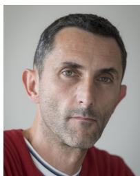

natural_image

Portrait of a man wearing a red shirt (no text or symbols visible)

MARTIN HORN (Member, IEEE) received the Ph.D. degree in electrical engineering and the Habilitation degree in system dynamics and control from the Graz University of Technology, Graz, Austria, in 1998 and 2003, respectively, where he was an Associate Professor with the Institute of Automation and Control from 2003 to 2008. In 2008, he was appointed as a Full Professor of Control and Measurement Systems with the Faculty of Technical Sciences, Klagenfurt University, Klagenfurt, Austria. Since 2014, he has been the Head of the Institute of Automation and Control, Graz University of Technology. He is currently the Head of the Christian Doppler Laboratory on Model-Based Control of Complex Testbed Systems. His main research interests include robust control theory and networked control. He serves as a member for European Control Association.

natural_image

Portrait of a man in a white shirt against a plain background (no text or symbols visible)

SELIM SOLMAZ (Senior Member, IEEE) received the B.Sc. degree from the Aerospace Engineering Department, Middle East Technical University in 2001, the M.Sc. degree the School of Aeronautics and Astronautics from the School of Aeronautics and Astronautics, Purdue University, West Lafayette, in 2003, and the Ph.D. degree from Electronics Engineering Department, National University of Ireland-Maynooth in 2008. He worked as a Lecturer in Turkey and North Cyprus consecutively from 2010 till 2018, and aside from teaching, he led or participated in several research projects on renewable energy, electrified drivetrains, vehicle dynamics, and control related topics. He also had several administrative assignments, including the Head of Graduate School, the Head of Department, and the Vice Dean during his academic career. In Summer 2018, he joined the Virtual Vehicle Research Center as a Senior Researcher. He is currently affiliated with the Control Systems Group, Department of Electrics, Electronics and Software, and works as a group leader on problems related to and motivated from autonomous driving technologies.

natural_image

Portrait of a man with short dark hair and beard, wearing a blue shirt (no text or symbols visible)

DANIEL WATZENIG (Senior Member, IEEE) was born in Austria. He received the Doctorate degree in electrical engineering from the Graz University of Technology, Austria.

He was awarded the Venia Docendi (Adjunct Professorship) for electrical measurement science and signal processing with the Graz University of Technology. He is the CTO and the Head of the Electronics Systems and Software Department, Virtual Vehicle Research Graz. In addition, he was appointed as a Full Professor of Multi-Sensor

Perception of Autonomous Systems with the Institute of Computer Graphics and Vision, Faculty of Computer Science and Biomedical Engineering, Graz University of Technology. He is the author or the co-author of over 200 peer-reviewed papers, book chapters, patents, and articles. His research interests focus on sense and control of autonomous vehicles, sensor fusion, reinforcement learning, and decision making under uncertainty. He is the Editor-in-Chief of the SAE International Journal of Connected and Automated Vehicles. Since 2024, he has been the Vice Chair and a Member of the Executive Committee of the IEEE Austria Section.