# Motion planning in complex urban environments: An industrial application on autonomous last-mile delivery vehicles

Haiming Wang $^{1}$ | Liangliang Zhang $^{1}$ | Qi Kong $^{1}$ | Weicheng Zhu $^{1}$ | Jie Zheng $^{2}$ | Li Zhuang $^{1}$ | Xin Xu $^{2}$

$^{1}$ Autonomous Driving Division, JD.com
American Technologies Corporation,
Mountain View, California, USA   
$^{2}$ Autonomous Driving Division, JD.com, Beijing, China

# Correspondence

Liangliang Zhang, Autonomous Driving Division, JD.com American Technologies Corporation, Mountain View, CA 94043, USA. Email: liangliang.zhang@jd.com

# Abstract

In this article, a motion planning framework for autonomous driving is explored to achieve unmanned last-mile delivery vehicle application in complicated urban scenario. This approach can dramatically improve the intelligence, driving safety, driving robustness, and scalability of autonomous vehicles. In this framework, a specific High-Definition (HD) map representation was proposed for last-mile delivery applications, and a Route Planning layer generates a kinematically feasible reference line with smoothness condition based on Routing and HD Map components. Then a Scenario Planning layer considers routing results and both static and dynamic obstacles into account to select a corresponding scenario to execute, such as cruise on-road scenario, cross intersection scenario, parking scenario, and so forth. Finally, a Trajectory Planning layer which is classified with trajectory generation and optimization modules is described. In the trajectory generation part, a rough path-speed profile and corresponding decisions, such as nudge, stop, yield, and so forth, are generated. Then, the rough path-speed profile is postprocessed by optimization algorithms in the trajectory optimization part. On the basis of the real road test results from thousands of times for JD.com's real autonomous delivery vehicle operations and approximate 115,475 km of fully autonomous driving mode in an urban scenario, the proposed motion planning framework demonstrates the efficiency of autonomous driving, improves the driving quality and reduces the manual intervention.

# KEYWORDS

autonomous navigation, optimization, path planning, vehicle robot

# 1 | INTRODUCTION

This paper is focused on the motion planning framework for an autonomous driving delivery application via a novel route-scenario-trajectory planning architecture. Autonomous driving vehicles have a great capability to improve transportation efficiency and reduce traffic accidents caused by human drivers' mistakes. Additionally, they can also save human resources and considerable time for the whole society. Fortunately, the autonomous driving technology has been paid attention and rapidly developed from the robotics research community, such as the Defense Advanced Research Projects Agency (DARPA) Grand and Urban Challenge (Buehler et al., 2007, 2009; Thrun et al., 2006; Urmson et al., 2008). Moreover, advanced driving assistance systems (ADAS) such as adaptive cruise control, lane-keeping feature, and self-parking systems have been widely implemented in commercial luxury cars. These ADAS functions can efficiently reduce accidents and exhibit great autonomous driving performance. However, these systems only perform on very simple driving scenarios and still need human intervention constantly. Thus, the technology is still far away from true level-4 autonomous driving.

In the meanwhile, a lot of research platforms and companies' projects have demonstrated the great potential for autonomous driving technology on public transportations. However, it is still too early to claim that autonomous driving technology can fully replace human drivers in passenger vehicles. Vehicle reliability, passenger safety, and cost of sensors and technology are still challenges in practical applications. For example, based on the 2020 Autonomous Vehicle Disengagement Reports issued by California's Department of Motor Vehicles, the best number of miles per disengagement, which is 29,944 from Waymo, is still way below the number that 165,000 miles on average per accident caused by a human driver. Therefore, significant challenges in terms of technology still remain for the commercialization of autonomous passenger vehicles (Buehler et al., 2009; Paden et al., 2016).

Last-mile delivery, however, is a very promising application scenario where the commercialization of autonomous driving technology is possible within the foreseeable future. As the continuous growth of e-commerce, last-mile delivery plays a significant role in the e-commerce experience. However, the urban last-mile delivery is the most expensive part of the whole supply chain, so autonomous driving technology is expected to reduce the cost and improve efficiency. Compared with passenger vehicles, there are three significant differences between delivery vehicles. The last-mile delivery vehicle is generally operated at relatively low speeds, typically within 20 miles per hour (mph), compared with passenger vehicles' speed from 35 to 70 mph on average. A slow vehicle needs shorter perception distance and shorter brake distance. Second, the last-mile delivery vehicle is typically smaller and lighter than the passenger vehicles, thus, this further decreases the risk and fatality of traffic accidents. Finally, a delivery vehicle is free of passengers, therefore, the safety and driving requirements are much lower, compared with passenger vehicles. Especially, in extreme conditions, a delivery vehicle can sacrifice itself to protect other vehicles sharing the road.

Although the last-mile delivery vehicles are very promising for commercial application, there are still challenges. First, compared with passenger vehicles application, last-mile delivery vehicles often operate in more complicated urban environments (Li et al., 2020). For passenger vehicles-based Robotaxi and highway transportation applications, they all have well-defined scenarios, structured space, and clear traffic regulations. Last-mile delivery vehicles, however, operate under irregular situations for a significant of amount portion of their operation time. With the rapid growth of the world's urban population, solving the last-mile delivery problem becomes a lot more complicated. Especially in China, there are about 830 million people lived in urban regions. Consequently, such a large amount of urban population induces three major challenges in last-mile delivery. First, high population density makes urban residents live in apartments or condominiums rather than a single-family house. As a result, when a last-mile delivery vehicle approaches the destination, unexpected situations may happen in this unstructured environment due to lack of traffic rules, such as parking spot occupied by unknown objects, pedestrians walking around, interference from passenger vehicles, and so forth. Second, even though in structured local roads, bicycles, motorcycles, and different types of automobiles share the road and have different kinematic features, so that, it is difficult to interact with this type of complex scenario. Finally, since the last-mile delivery vehicle has a relatively slow speed, then its behavior becomes more complicated when crossing the intersections or making left/U-turn with traffic lights. Therefore, the development of autonomous last-mile delivery vehicles requires advanced technologies in perception and planning (Kümmerle et al., 2015). In particular, to handle special needs for last-mile delivery, an advanced motion planning algorithm needs to be developed to determine the behavior of the vehicles.

Research on motion planning can primarily be classified into graph search-, sampling-, interpolating-, and optimization-based approaches (González et al., 2015). First, graph search-based plannings, such as Dijkstra algorithm (Bacha et al., 2008), A\* algorithm (Ziegler et al., 2008), State Lattice algorithm (Howard & Kelly, 2007), are frequently implemented in finding a global and local path while avoiding obstacles in surrounding environments. However, the resolution of the grid and lattice will compromise between the optimality of a path and the efficiency of computation load. On the other hand, it is difficult to generate a kinematically feasible path by using graph search-based approach only. Sampling-based planning solves the planning problems in high-dimensional spaces. This approach generates a collision-free path by sampling the configuration space of the vehicle. In sampling-based planning, the most commonly used method Rapidly exploring Random Tree (Karaman & Frazzoli, 2011) has been extensively tested for the automated vehicle. The shortcoming of this method is that the resulting path sometimes is not optimal, not smooth, and not curvature continuous. The interpolating-based approach uses preknown a set of waypoints obtained from a map to generate a new set of data (path) that obey trajectory continuity, obstacle avoidance, and vehicle constraints. The interpolating-based planning implements different techniques for trajectory generation and smoothing, such as clothoid curves (Brezak & Petrović, 2013), polynomial curves (Glaser et al., 2010), spline curves (Berglund et al., 2009), and so forth. The interpolating planner is very easy to implement (Ferguson & Stentz, 2007), however, it highly relies on global planning or global waypoints, so that, it is inflexible during on-road planning. Finally, the optimization-based approach has been successfully demonstrated in autonomous driving in DARPA challenges. In this scheme, optimal paths are generated by minimizing a cost function subjecting to different constraints, such as station, velocity, acceleration, jerk, and road boundary. Moreover, it is often used to smooth previously computed collision-free trajectories (Fan et al., 2018; Ferguson et al., 2008). For motion planning in the autonomous driving area, optimization-based algorithms are mainly developed in the Frenet frame (Werling et al., 2010). Generally, these algorithms are divided into direct optimization methods and path-speed decoupling methods. Direct optimization methods (McNaughton et al., 2011) solve the optimal trajectory directly by searching. The challenge of this approach is computation load greatly increases as search resolution increasing. Thus, the computed trajectory may not be optimal due to the time consumption requirements. On the other hand, path-speed decoupling methods (Fan et al., 2018; Gu et al., 2015) optimize path and speed separately by various constraints. This philosophy can design and optimize path and speed independently, then synthesize them into the desired trajectory. Therefore, this approach can improve the robustness and flexibility of optimization.

In this paper, the proposed approach builds on the existing work discussed above. Particularly, our approach uses a combined route planning, scenario planning, and trajectory planning architecture to address the unique issues in the last-mile delivery application. Before introducing the proposed motion planning framework, a novel multilayer High-Definition (HD) map design philosophy based on a special last-mile delivery application is described. After that, we focus on describing the proposed motion planning architecture, first, a single and multiple destination-based route planning is executed, by using a traditional graph search algorithm. Second, a route smoothing is completed by a nonlinear optimization method. Then, the scenario planning module is used to choose a scenario based on current vehicle driving status gained from route planning and a set of environmental features from perception, prediction, and localization. Moreover, some special scenarios are specifically designed for last-mile delivery. Finally, once a scenario is selected, such as cruise on-road scenario, motion planner continuously executes all tasks sequentially. These tasks can be classified as behavior decision task, trajectory generation task, and trajectory optimization task. Our contributions to motion planning in last-mile delivery are in terms of (1) HD map's specific design for last-mile delivery application, (2) multiple destinations-based route planning for complex last-mile delivery scenario, (3) additional scenario design for last-mile delivery, and (4) novel cost functions' establishment for path-speed generation and optimization tasks.

In this article, we focus on the description of the motion planning for autonomous last-mile delivery vehicles in a practical way, with experiments rather than theoretical improvement of the motion planning algorithm. The proposed route, scenario, and trajectory planning framework were applied to the autonomous last-mile delivery vehicle ROVER 5.0 of JD Logistics, which was invented by JD.com. ROVER 5.0 delivery vehicle ran daily delivery operations in multiple communities and campuses of six big cities which are Suzhou, Beijing, Wuhan, Xi'an, Xianyang, and Guangzhou in China since 2020. Since 2020 until now, ROVER 5.0 drove over 100,000 km in those cities, and successfully delivered 350,574 orders. In particular, when the COVID-19 outbroke in Wuhan, Hubei, China during January to March 2020, JD.com deployed ROVER 5.0 autonomous delivery vehicles in Wuhan to deliver medical supplies and living materials from JD's local distribution center to Wuhan's ninth hospital and three large communities, as shown in Figure 1. This unmanned autonomous delivery largely eliminated human contact and protect customers not to being exposed in a pandemic disease situation. During 3 months' autonomous delivery operations in Wuhan, ROVER 5.0 drove around 200 km and successfully delivered more than 1600 orders.

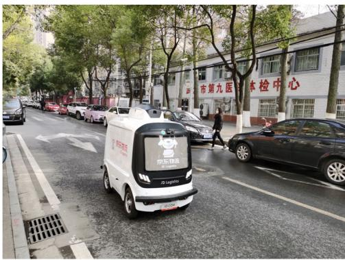

text_image

市第九医
体检中心
京东出版
JD.com.cn

FIGURE 1 JD.com's autonomous vehicle ROVER 5.0 is shipping medical supplies to Wuhan Ninth Hospital during COVID-19 pandemic

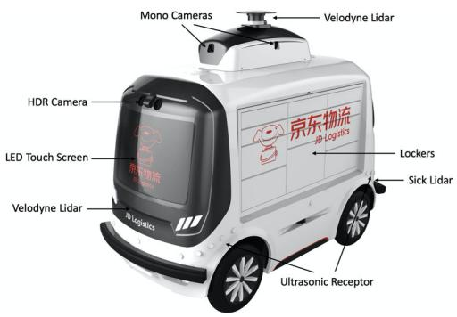

text_image

Mono Cameras
Velodyne Lidar
HDR Camera
京东物流
JD Logistics
LED Touch Screen
Velodyne Lidar
Jb Logistics
Lockers
Sick Lidar
Ultrasonic Receptor

FIGURE 2 ROVER 5.0 last-mile delivery vehicle. HDR, High Dynamic Range; LED, light-emitting diode.

The remainder of this paper is organized as follows. The autonomous last-mile delivery vehicle ROVER 5.0 is described in Section 2. The system architecture and structure of the motion planning algorithm are briefly introduced in Section 3. A description for details, which illustrates the proposed motion planning approach, is given as follows: HD map special design for the last-mile delivery application in Section 4; route planning is described in Section 5; scenario planning is described in Section 6; trajectory planning is described in Section 7. In Section 8, a simulation platform, which is the support of motion planning development and validation of autonomous driving systems, is described. In Section 9, we provide a case study with the real delivery scenario, and demonstrate the efficacy of the proposed approach. This article is ultimately concluded in Section 10.

# 2 | ROVER 5.0 VEHICLE

ROVER 5.0 vehicle, as shown in Figure 2, is designed by JD.com. The system of ROVER 5.0 mainly consists of a chassis, a power system, a computing unit, sensors, and accessories. ROVER 5.0 has a four-wheel motor drive, Ackerman-steering, and an electronic hydraulic brake system. To protect the vehicle from environmental impact, ROVER 5.0 installs front and rear bumpers and an emergency brake button for emergencies. Since ROVER 5.0 is designed for last-mile delivery applications, so there are multiple containers on the vehicle. For the power supply, ROVER 5.0 has a chargeable lithium-ion battery with 48 V, 80 Ah which can provide all power for the autonomy hardware, and the maximum mileage for a single-charge battery range is about 50 km.

The vehicle states related data, sensors data, and map data are communicated to the computer system through Universal Serial Bus interfaces. ROVER 5.0 has a Human Machine Interface (HMI) system. A LED touch screen is installed on the rear part of the vehicle so that customers can communicate with the vehicle for goods pickup. Furthermore, ROVER 5.0 vehicle installs a vehicle monitoring system that can monitor the road environments around the ego vehicle and publish video streaming on the authorized Internet.

For computation, ROVER 5.0 uses two Nvidia Jetson AGX Xaviers which integrate with 8-core NVIDIA Carmel Armv8.2 64-bit central processing unit (CPU) and 512 NVIDIA CUDA cores and 64 Tensor cores graphics processing unit. Jetson AGX Xavier also delivers up to 32 TOPs of AI performance. Moreover, a 1 T solid-state drive is mounted for the data logging. The accessories mainly consist of LED display that customers can interface with vehicles for goods pickup and a remote controller which can manually control the vehicle remotely.

ROVER 5.0 uses a number of sensors to navigate in complex urban environments. The sensors used in ROVER 5.0, can be seen in Table 1. For a measure of the global position of the vehicle, a single-point Global Positioning Systems (GPS) was installed on the upper rear part of the vehicle. A combined laser- and visual-map matching algorithm was employed to estimate the vehicle's position and orientation, by integrating GPS data with multiline light detection and ranging (LIDAR), High Dynamic Range (HDR) camera, Inertia Measurement Unit (IMU), and Odometry data. For obstacle detection and tracking, one 16-line LIDAR was installed on the roof of ROVER 5.0, and the other 16-line LIDAR was mounted on the front bumper. The maximum range of all three LIDARs is 100 m. Additionally, four mono cameras were also installed on the roof to detect the surrounding obstacles. For the protection of the vehicle's backup behavior, another 1-line LIDAR was installed on the rear bumper, and its maximum range is 10 m. For traffic light detection, an HDR camera was mounted on the upper portion of the vehicle. Furthermore, 12 ultrasonic receptors are mounted on the lower portion of the vehicle to prevent collisions with obstacles and road elements.

# 3 | SYSTEM ARCHITECTURE

# 3.1 | System framework of ROVER 5.0

The autonomous driving system of ROVER 5.0 has a layered architecture, as shown in Figure 3, which consists of an application layer, a component layer, a system layer, and a hardware and driver layer. Additionally, data platform, HMI, and visualization tool are also utilized by the layered architecture.

The application layer is comprised of both online and offline platforms. ROVER 5.0's online platforms contain the delivery service system, real-time monitoring system, and business scheduling system among different application scenarios. Additionally, the roles of offline platforms are mainly composed of offline data labeling, training, simulation, and validation which are subject to simulation platforms and machine learning platforms.

The component layer is mainly composed of the individual low-level algorithm module, such as perception, localization, prediction, planning, control modules, and so forth. The relationship between these modules is as shown in Figure 4. The HD map module provides an HD global map as a benchmark. From the sensor reading collected by various advanced sensors, the localization and perception modules estimate the vehicle's driving states and perceive the dynamic surrounding environment. The predictive environment (such as obstacles) variation can be obtained by a prediction algorithm. Ultimately, all the information is gathered for the motion planning module, which makes the driving behavior decision and generates a collision-free and kinematically/dynamically feasible trajectory applying to the control module.

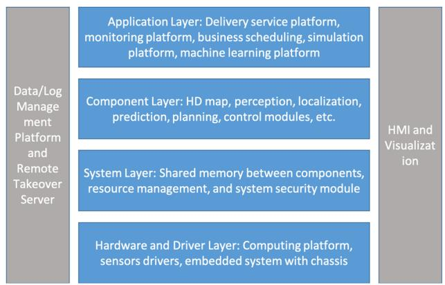

flowchart

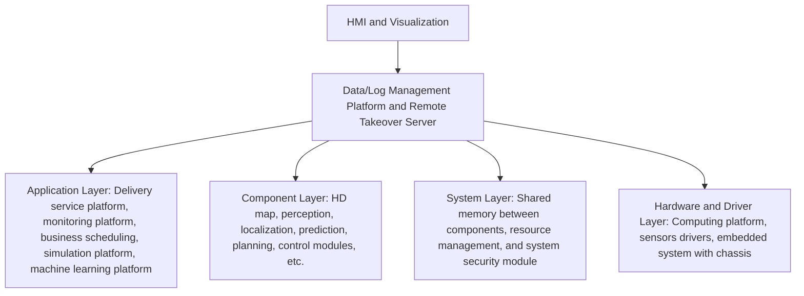
```mermaid
graph TD
    A["Data/Log Management Platform and Remote Takeover Server"] --> B["Application Layer: Delivery service platform, monitoring platform, business scheduling, simulation platform, machine learning platform"]
    A --> C["Component Layer: HD map, perception, localization, prediction, planning, control modules, etc."]
    A --> D["System Layer: Shared memory between components, resource management, and system security module"]
    A --> E["Hardware and Driver Layer: Computing platform, sensors drivers, embedded system with chassis"]
    F["HMI and Visualization"] --> A
```

FIGURE 3 System architecture of ROVER 5.0 last-mile delivery vehicle. HD, High-Definition; HMI, Human Machine Interface.

TABLE 1 Sensor description into ROVER 5.0 

<table><tr><td>Sensor</td><td>Characteristics</td></tr><tr><td>RAC-C1 GPS</td><td>Positioning accuracy within 20–60 cm dynamically and 1.5 m statically, speed accuracy within 0.1 m/s</td></tr><tr><td>ADIS16470 IMU</td><td>A triaxial gyroscope ±2000°/s dynamic range and a triaxial accelerometer with ±40 g dynamic range</td></tr><tr><td>Velodyne VLP-16 LIDAR</td><td>360° horizontal FOV with 0.1° resolution, 30° vertical FOV with 2° resolution, 100 m maximum range</td></tr><tr><td>Sick TIM551 LIDAR</td><td>270° FOV with 1° resolution, 0.05–10 m working range</td></tr><tr><td>BFS-U3-16S2C Mono Camera</td><td>CMOS, color, 226FPS with 1440× 1080 pixels</td></tr><tr><td>BFS-U3-23S3C HDR Camera</td><td>CMOS, color, 163FPS with 1920× 1200 pixels</td></tr></table>

Abbreviations: CMOS, complementary metal-oxide semiconductor; FOV, field of view; FPS, frames per second; GPS, Global Positioning System; HDR, High Dynamic Range; IMU, Inertia Measurement Unit; LIDAR, light detection and ranging.

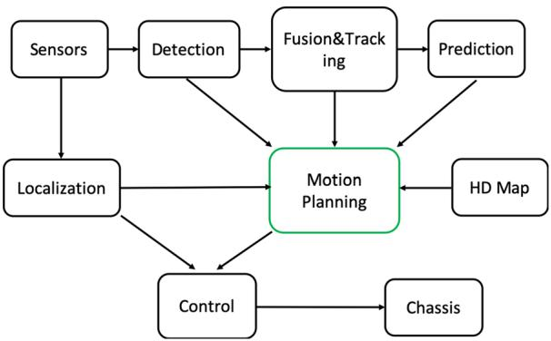

flowchart

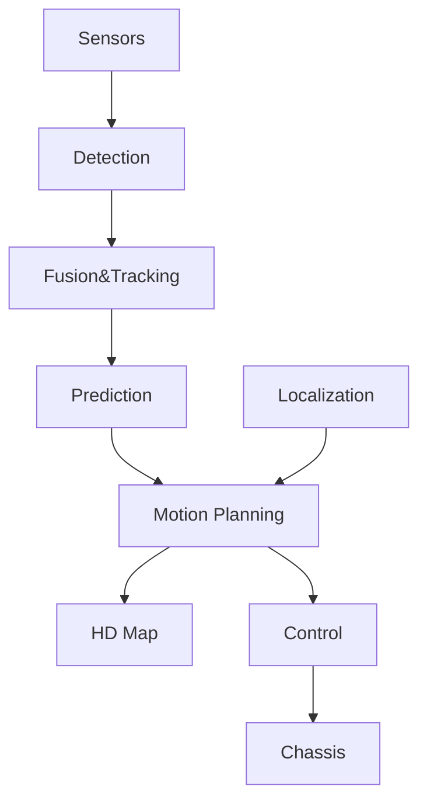
```mermaid
graph TD
    A["Sensors"] --> B["Detection"]
    B --> C["Fusion&Tracking"]
    C --> D["Prediction"]
    D --> E["Motion Planning"]
    E --> F["HD Map"]
    E --> G["Control"]
    G --> H["Chassis"]
    I["Localization"] --> E
```

FIGURE 4 Architecture of autonomous driving components

In an autonomous driving system, the system layer is a middle-level connecting component layer and hardware/sensor layer. The system layer consists of sharing memory among components, synchronizing the data for algorithms usage based on sensors time and security module.

At last, the hardware and sensor driver layer consists of computing hardware platform, embedded system hardware platform, sensor drivers, and corresponding protocol/software connecting them. The details have been described in Section 2.

# 3.2 | Architecture of motion planning

To enable autonomous vehicles to complete the given missions and tasks, a hierarchical architecture is widely used (McNaughton et al., 2008). In this architecture, each mission is decomposed into submissions to complete hierarchically. However, this type of layered architecture has some performance problems. The major shortcoming of this framework is that the higher-level decision layer sometimes does not have enough information to perfectly guide the lower-level trajectory planning execution. On the other hand, a parallel architecture also exists in various autonomous driving systems. Compared with the hierarchical framework, modules in this system are relatively independent and work in parallel. For example, lane-merge behavior, car-following behavior, and lane-keeping behavior are independently worked. In some complicated cases needing cooperation, this framework may not perform well.

As discussed above, there are shortcomings of both the current hierarchical and parallel planning architectures, In this paper, we proposed a novel planning framework that combines the strengths of the hierarchical and parallel architectures. The proposed motion planning architecture is comprised of route planning, scenario planning, and trajectory planning. Especially, scenario planning is based on parallel architecture, and trajectory planning is on hierarchical architecture. In a parallel framework, scenarios in this system are relatively independent and work in parallel. According to any specific scenario, a hierarchical framework is widely used to decompose the mission into multiple tasks and execute these trajectory-related tasks sequentially. Thus, many complicated problems become solvable. Additionally, an HD map module designed specifically for the last-mile delivery application is used as an input for the proposed motion planning architecture. The proposed framework is shown in Figure 5.

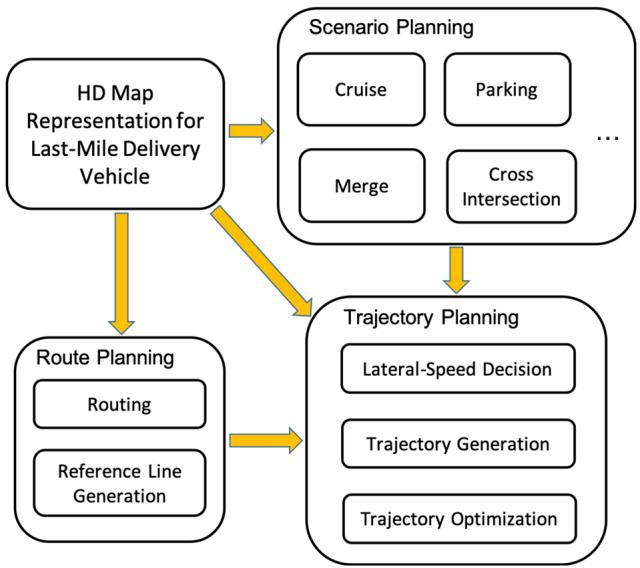

flowchart

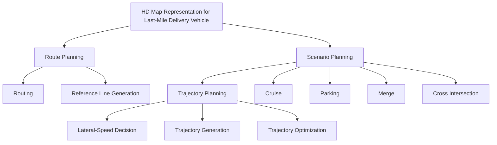
```mermaid
graph TD
    A["HD Map Representation for Last-Mile Delivery Vehicle"] --> B["Route Planning"]
    A --> C["Scenario Planning"]
    C --> D["Trajectory Planning"]
    D --> E["Lateral-Speed Decision"]
    D --> F["Trajectory Generation"]
    D --> G["Trajectory Optimization"]
    B --> H["Routing"]
    B --> I["Reference Line Generation"]
    C --> J["Cruise"]
    C --> K["Parking"]
    C --> L["Merge"]
    C --> M["Cross Intersection"]
```

FIGURE 5 Proposed motion planning framework. HD, High-Definition.

On the basis of HD map design, the data from the road network is used to create a node-edge graph. The waypoints in roads are defined as nodes, and the link between any two waypoints is the directional edge. These edges are also assigned costs like time and distance-related value functions. The route planning is generated by the classic graph search method. However, this routing result does not consider any motion requirements, so that, an nonlinear optimization method is required to optimize this routing result. Thus, the aims of route planning are to generate a feasible reference line by the map-based graph search and then optimize the reference line for smoothness requirements.

Scenario planning is based on the concept of dividing the planning into a set of scenarios. The benefits of this architecture could be: first, increasing independence and resource sharing among scenarios; second, improving the efficiency for industrial level developments. Essentially, the scenario planning is used to choose a scenario based on the current vehicle driving status gained from the HD map, perception and localization results. To independently plan in different scenarios and meet unique requirements in last-mile delivery, the scenarios are customized and designed by different traffic and driving conditions.

In terms of last-mile delivery application, we designed a list of scenarios as follows: (1) crossing intersections scenario is designed for the query of all intersection elements, including stop lines, lane-road IDs, safety islands, pillars, and so forth; (2) traffic lights scenario aims at addressing the issue that last-mile delivery vehicles do not have enough time to pass through the intersections, due to their low speed; (3) left-turn scenario is specifically designed for last-mile delivery vehicles. Since the driving speed is relatively low for last-mile delivery vehicles, so the vehicles usually keep driving on the bicycle lane on the right-hand side of the road. To prepare for a left turn in an intersection area, the vehicles have to move from the bicycle lane to the far left-hand side of the road. After that, vehicles need to adjust their orientations heading on the traffic lights; (4) backup on narrow road scenario handles with the situation that delivery vehicles drive on a bicycle lane or unstructured area. If perceived obstacles are too close to plan a feasible trajectory for obstacle avoidance, then vehicles activate a backup scheme to produce a space to replan a reasonable trajectory; (5) zone parking scenario is similar to passenger vehicles' zone navigation. It deals with the point-to-point planning problem in unstructured environments, like, parking lots; (6) merging from off-road to routing scenario is designed for the switching process from parking or pull over status to the on-road status; and (7) remote command from monitoring scenario is designed for manual intervention when the ego car is in a stuck situation.

For example, we design a cruise scenario when the ego car is on-lane, design a cross intersection scenario when the ego car goes straight through the intersection with traffic regulations, and design a left turn and U-turn scenario when the ego car's intention is left or U-turn in front of the traffic lights, and so forth. Once a scenario is selected, a set of corresponding trajectory planning-related tasks will be executed to complete this scenario. For instance, when the vehicle is driving under the cruise scenario, all behavior decision tasks including path-speed-based decision, obstacle-based decision, traffic regulation-based decision, and trajectory optimization tasks including path-speed optimization need to be executed sequentially within a motion planning cycle.

A set of tasks corresponding to different scenarios can be classified as behavior decision tasks, trajectory generation tasks, and trajectory optimization tasks. The behavior decider focused on dealing with on-road traffic-related decision, such as traffic light decision, crosswalk area decision, stop sign decision, intersection decision, and so forth, and obstacles-based decision. For obstacles-based decision, both static and dynamic obstacles are considered into account to make lateral decisions like nudge and lane change and speed decisions, like, stop, yield, follow, and so forth. In addition, a behavior decider not only makes general decisions but generates a rough path and speed profile based on trajectory-based decisions. After a rough path and speed profile for an autonomous vehicle is generated, the trajectory optimizer applies an optimization method to produce a smoother and human-like path and speed with consideration of the road boundary and kinematics/dynamics constraints of the autonomous vehicle.

# 4 | HD MAP DESIGN

In unpredictable real environments, autonomous vehicles should drive safely by detecting obstacles and recognizing existing landmarks on road. From the perspective of motion planning, the map representation is significant, because a motion planner has to utilize an HD map which consists of detection and recognition results to generate optimal trajectories.

To efficiently handle the on-road detection and recognition results for the specific last-mile delivery case, we proposed an HD map representation by combining 16 layers to present both obstacles and static landmarks in urban environments. For the common purpose, this 16-layered map is designed geometrically and semantically. The geometric map representation in each map layer is expressed as fundamental elements, like, point, pose, polyline, and polygon. On the other hand, the semantic expression of road elements is composed of identification (ID) and type. Therefore, all on-road detection and recognition results can be represented by both geometric and semantic expressions.

Our HD map design contains the definition of road geometries and properties, which are represented by 16 layers to provide both dynamic and static information of the environment. Moreover, each layer has its own geometric and semantic expressions. Like passenger vehicles, our last-mile delivery vehicle has many similar map representations for road elements, such as the boundaries and type of each lane and road, the intersections with their semantic expression, like, crosswalks, traffic lights, speed bumps, and so forth, and the parking lot map representation with lane ID and geometric shape. However, our map handling has some differences from that of passenger vehicles. In addition to these common road elements expression, the last-mile delivery vehicle application, especially the operations in China, has some special road elements representation. For example, we designed a barrier gate layer representing an element to access distribution centers and gated communities; we designed pillars layer, where these pillars are commonly used to prohibit motor vehicles' access and permit bicycles access only. Figure 6a shows a typical map representation of an intersection in China, the blue dots in the map denote pillars which are used to prohibit vehicles to access; moreover, we also designed a safety island layer. The safety islands shown in Figure 6a are located in a large intersection area where pedestrians, bicycles, and our delivery vehicles could wait there for the next green light (compared with passenger vehicles, they do not have to consider this safety island's condition). For intuitive comparison, Figure 6b shows a real safety island in an intersection.

In addition to traditional lanes and roads representation in HD map design, we also developed a novel lane group representation as an intermediate level between lane and road for better lane associations at large intersections. At large intersections, a lane's exit might correspond to multiple other lanes' entrances, so it is necessary to define lane groups to distinguish the group of lanes. As shown in Figure 7, the frames in red show multiple lanes in different roads that are synthesized into a lane group. The following routing method is based on this lane group-level configuration.

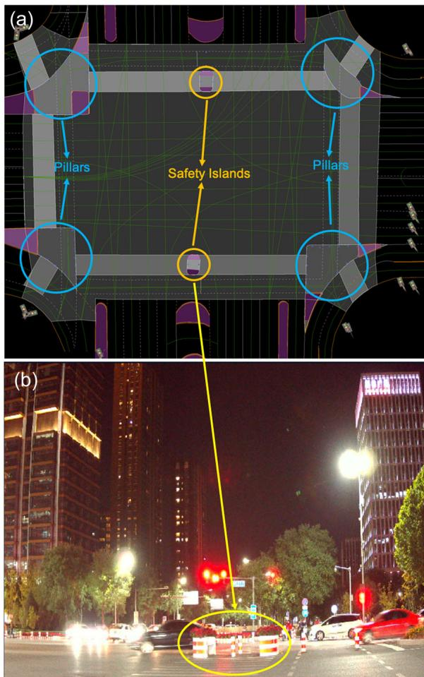

text_image

(a)
Pillars
Safety Islands
Pillars
(b)

FIGURE 6 ROVER 5.0's map representation for intersections: (a) a map representation of an intersection with pillars and safety islands and (b) a typical intersection photo in China

# 5 | ROUTE PLANNING

In autonomous driving, the aim of route planning is to generate an optimal route by a map from starting point to destination. To produce the route plans, the data provided by road network from the map are used to create a node-edge graph. In the proposed route planning method, the lanes in the road network are considered as nodes, the connectivity between lanes or lane groups, as shown in Figure 7, is conceived as edges, and the cost of edges is defined by a combination of several factors, such as traverse time of the edges, distance between edges, complexity of the edge conditions, and so forth. Therefore, the route planning is to generate a feasible route by the map-based graph search and smooth the route as a reference line for the following trajectory planning.

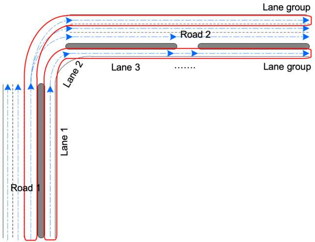

flowchart

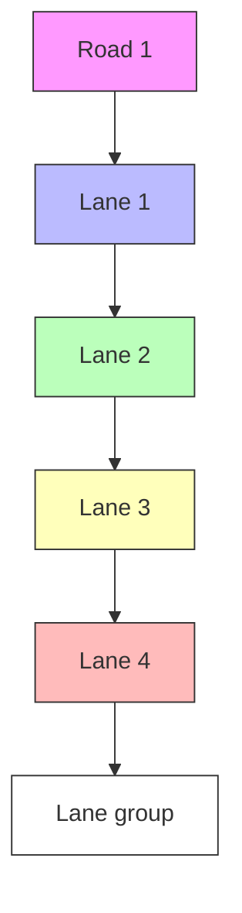
```mermaid
graph TD
    A["Road 1"] --> B["Lane 1"]
    B --> C["Lane 2"]
    C --> D["Lane 3"]
    D --> E["Lane 4"]
    E --> F["Lane group"]
    style A fill:#f9f,stroke:#333
    style B fill:#bbf,stroke:#333
    style C fill:#bfb,stroke:#333
    style D fill:#ffb,stroke:#333
    style E fill:#fbb,stroke:#333
    style F fill:#fff,stroke:#333
```

FIGURE 7 Lane group representation in map design

# 5.1 | Routing

After completing the special HD map design for the last-mile delivery application, the road network's representation described in Section 4 is pretty well defined. Then, the process of routing is to implement a graph search approach like A\* to find the shortest delivery path in the given road network. Especially for last-mile delivery, the routing consists of single-task routing, multiple-tasks routing, and a lane-based forbidden list design for routing cost. Where, a single task in last-mile delivery means all orders belong to one customer and are sent to one destination, and multiple tasks denote that there exist multiple destinations to arrive.

# 5.1.1 | Single-task routing

When a single task is distributed to last-mile delivery vehicles, the routing strategy is to find the shortest route along with a road network from the vehicle's origin to a designated destination. As discussed in Section 5, a road network is designed as a graph $G = (N, E)$ consisting of an indexed set of nodes $N$ with $n = |N|$ nodes and a spanning set of directed edges $E$ with $m = |E|$ edges. Each edge is represented as an ordered pair of nodes $E(i, j)$ . The value $C(i, j)$ associated with each edge represents the cost incurred by traversing the edge. In this paper, lanes or lane groups are designed as nodes $N(i)$ , the connectivity between lanes is considered as edges $E(i, j)$ , and traverse time, distance between edges, and complexity of the edge conditions are defined as cost $C(i, j)$ .

On the basis of the above road network's definition and notation, a graph search-based A\* method (Zeng & Church, 2009) can be readily used to generate the shortest single-task route.

# 5.1.2 | Multiple-tasks routing

Compared with single-task routing, multiple-tasks operation widely exists in last-mile delivery applications. As shown in Figure 8, a typical daily operation for last-mile delivery vehicles is that a delivery vehicle starts from a distribution center, and then stops by several transit stations, and finally arrives at a designated destination.

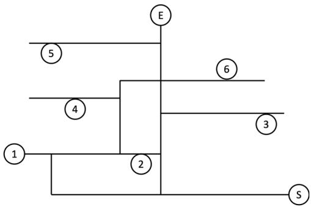

flowchart

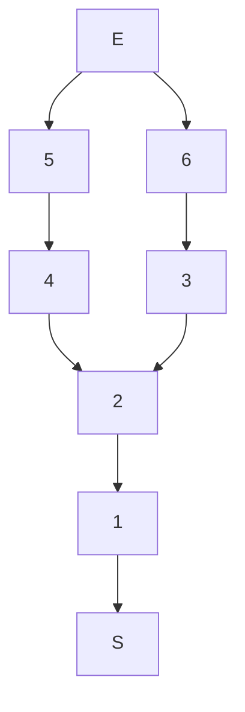
```mermaid
graph TD
    E --> 5
    E --> 6
    5 --> 4
    6 --> 3
    4 --> 2
    3 --> 2
    2 --> 1
    1 --> S
```

FIGURE 8 Multiple destinations' routing for last-mile delivery

To generate an optimal multiple-tasks route, we consider the multiple destinations delivery problem as a generalized asymmetric traveling salesman problem (Applegate et al., 2006). Without loss of generality, we consider starting point, transit stations, and final destination as a set of nodes $N_i$ for $i = 0, 1, ..., n - 1$ in the road network, where $n = |N|$ . Specifically, $N_0$ denotes the starting point, and $N_{n-1}$ denotes the final destination. Thus, the optimal route can be solved in the following steps:

Step 1: Calculating the shortest path for any arbitrary two delivery stations by $A^{\star}$ approach, as discussed in Section 5.1.1. For example, $\mathcal{D}_{i,j}$ for $i,j\in [0,n - 1]$ denotes the shortest distance between the $i$ th delivery station to the $j$ th delivery station.

Step 2: Summarizing orders information (cost) $O_{i}$ for $i = 0, 1, ..., n - 1$ , where the orders need to be sent to each delivery station. Typically, in the last-mile delivery application, we want to minimize the vehicle's load during the delivery operations, which means delivering a large quantity of orders in high priority. Additionally, some urgent goods are also delivered to a specific station in high priority, such as fresh food, medical suppliers, and so forth. Thus, the order-related cost can be expressed as

$$
\mathcal {O} _ {i} = w _ {0} \left(\frac {1}{N _ {i}}\right) ^ {2} + \sum_ {j = 1} ^ {N _ {i} ^ {\mathrm{u}}} w _ {j} \left(\frac {1}{N _ {i} ^ {j}}\right) ^ {2}, \tag {1}
$$

where $N_{i}$ is the total number of orders sent to the ith delivery station, $N_{i}^{u}$ is the number of categories for urgent goods in the ith delivery station, and $N_{i}^{j}$ is the number of orders for the jth urgent goods category sending to the ith delivery station. $w_{0}$ is weighting corresponding to the total number of orders, $w_{1}, w_{2}, ..., w_{N_{i}^{u}}$ are weightings corresponding to the number of urgent goods.

Step 3: Computing the total traverse cost from the ith delivery station to the jth delivery station as

$$
C _ {j} ^ {i} = \mathcal {D} _ {i, j} + \mathcal {O} _ {i} + \mathcal {O} _ {j}. \tag {2}
$$

All traverse costs between any arbitrary two nodes (assuming the number of nodes is equal to n) can be converted to the following matrix format:

$$
C _ {M} = \left[ \begin{array}{c c c c} 0 & C _ {1} ^ {0} & \dots & C _ {n - 1} ^ {0} \\ C _ {0} ^ {1} & 0 & \dots & C _ {n - 1} ^ {1} \\ \vdots & \vdots & \ddots & \vdots \\ C _ {0} ^ {n - 1} & C _ {1} ^ {n - 1} & \dots & 0 \end{array} \right]. \tag {3}
$$

Step 4: By using a dynamic programming (DP) search, we can find the minimum cost-based Hamiltonian cycle in the cost matrix $C_M$ from Equation (3), so that the optimal delivery sequence for multiple tasks can be readily solved.

# 5.1.3 | Forbidden list design

For route planning in the last-mile delivery application, we also proposed a unique forbidden list design to address the problem of local lane's variations. Compared with passenger vehicles, last-mile delivery vehicles often operate in irregular traffic environments. For example, ROVER 5.0 sometimes drives in the bicycle lanes, sidewalks, campus, or residential communities. These irregular traffic environments, however, often vary very frequently. Thus, the path produced by route planning based on an HD map might be infeasible for driving.

To generate feasible routes under irregular traffic environments, we designed a forbidden list inserting all impassable lane IDs due to traffic environment changes. By maximizing the weights of lanes in the forbidden list, the routing method automatically bypasses all lanes in the forbidden list, and then generates optimal routes under current traffic environments.

In Figure 9, we draw a flowchart describing how route planning algorithms should interact with the dynamic changing environment like road networks and adapt the best routes assigned to a vehicle according to the updates (i.e., change in forbidden list, congestions level, incidents, etc.) received from the traffic management systems.

# 5.2 | Reference line smoothing

In the last-mile delivery application, the routing result is considered as a reference line for the subsequent trajectory planning and control. As mentioned in Section 5, the reference line is the foundation of the whole planning module. In each planning cycle, a reference line is generated at first, then such like obstacle projection, traffic rule logic, path-speed-based decision, and optimization are produced by the reference line. However, the raw reference line, that is routing, is from a lane represented by waypoints in an HD map, so these points from the reference line are not smooth enough to the smoothness requirements for the trajectory planning and control modules. Consequently, reference line smoothing is required for planning and control.

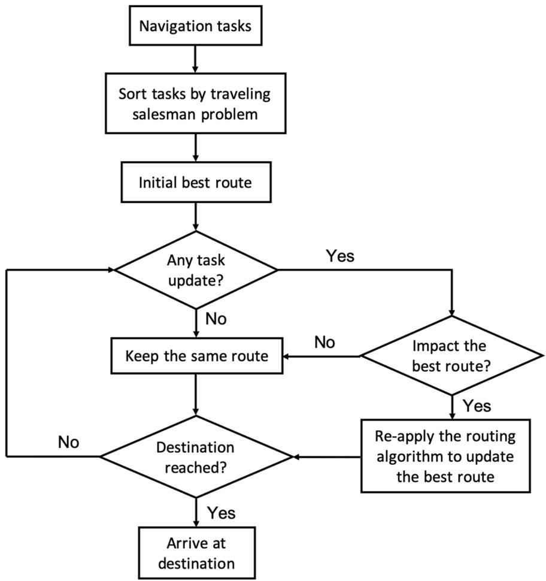

flowchart

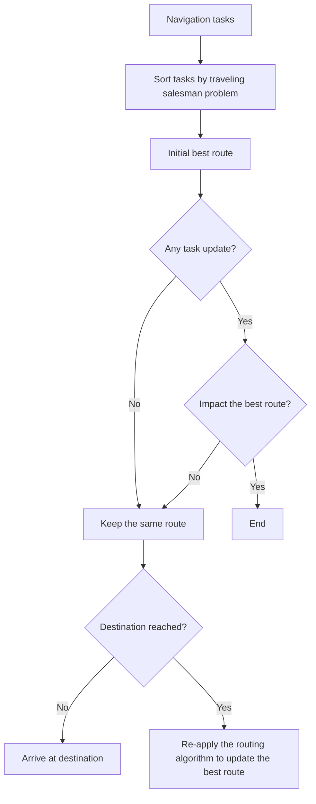
```mermaid
graph TD
    A["Navigation tasks"] --> B["Sort tasks by traveling salesman problem"]
    B --> C["Initial best route"]
    C --> D{Any task update?}
    D -->|Yes| E{Impact the best route?}
    D -->|No| F["Keep the same route"]
    F --> G{Destination reached?}
    G -->|No| H["Arrive at destination"]
    G -->|Yes| I["Re-apply the routing algorithm to update the best route"]
    E -->|No| F
    E -->|Yes| J["End"]
```

FIGURE 9 Flowchart of the best route update during environment changing

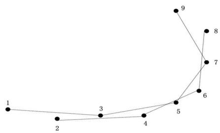

flowchart

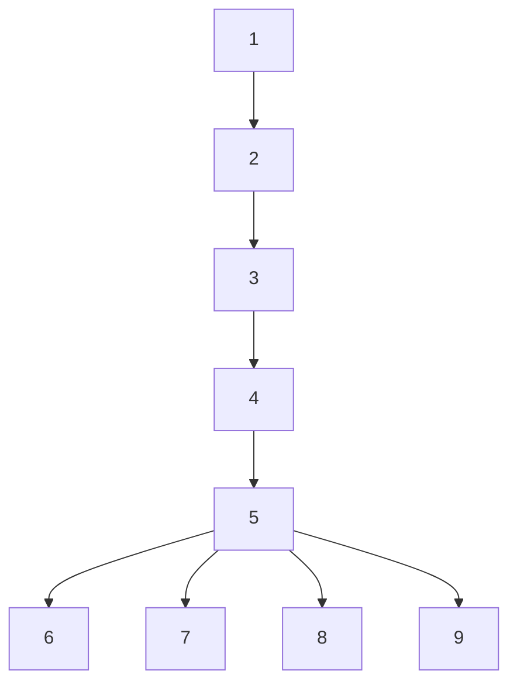
```mermaid
graph TD
    1 --> 2
    2 --> 3
    3 --> 4
    4 --> 5
    5 --> 6
    5 --> 7
    5 --> 8
    5 --> 9
```

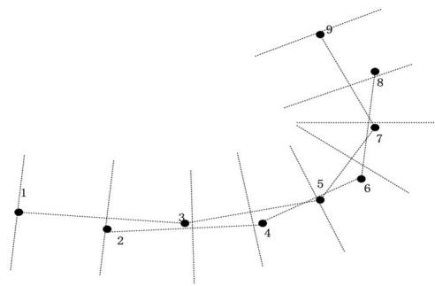

flowchart

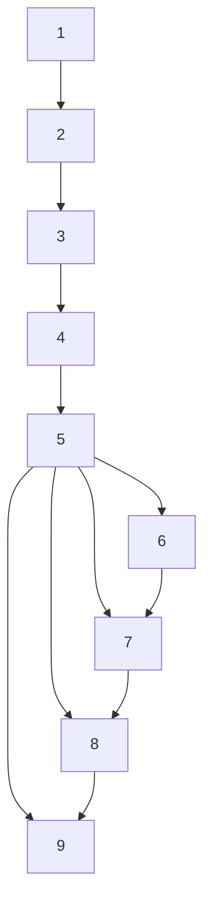
```mermaid
graph TD
    1 --> 2
    2 --> 3
    3 --> 4
    4 --> 5
    5 --> 6
    5 --> 7
    5 --> 8
    5 --> 9
    6 --> 7
    7 --> 8
    8 --> 9
```

FIGURE 10 Expression of longitudinal and lateral line segments

The routing results generated in Section 5.1 are discrete waypoints and not smooth. In these discrete waypoints, every two adjacent points can determine a straight line, where the equation of this line is represented as

$$
\mathcal {L} _ {s}: A _ {i} ^ {s} x + B _ {i} ^ {s} y + C _ {i} ^ {s} = 0. \tag {4}
$$

In the meanwhile, a perpendicular line passing through the midpoint of this straight line is shown in Figure 10:

$$
\mathcal {L} _ {\mathrm{p}}: A _ {i} ^ {\mathrm{p}} x + B _ {i} ^ {\mathrm{p}} y + C _ {i} ^ {\mathrm{p}} = 0, \tag {5}
$$

where $A_{i}^{s}, B_{i}^{s}, C_{i}^{s}$ are the coefficients of the straight line $\mathcal{L}_{s}$ given by the $(i - 1)$ th and $i$ th waypoints, $A_{i}^{p}, B_{i}^{p}, C_{i}^{p}$ are the coefficients of the corresponding perpendicular line $\mathcal{L}_{p}$ passing through the midpoint of the straight line $\mathcal{L}_{s}$ , and $x, y$ are defined in Equation (6).

To smooth the routing results, the optimized states X are designed as

$$
X = [ x \quad y \quad \theta \quad \phi ] ^ {T}, \tag {6}
$$

where x and y are the coordinates of the center of mass in an inertial frame, $\theta$ is the inertial heading, $\phi$ is the front steering angle. Then, the objective function can be designed as a linear combination of smoothness cost and the cost of deviation from the raw routing result. By setting weighting functions, the costs above can be minimized and compromised. Thus, mathematically, the objective function can be formulated as an optimization problem:

$$
\min _ {X \in \mathfrak {R} ^ {N}} J (X), \text {   where   }
$$

$$
J (X) \triangleq \sum_ {i = 1} ^ {N} w _ {0} (\phi_ {i} - \phi_ {i - 1}) ^ {2} + w _ {1} \frac {(A _ {i} ^ {s} x _ {i} + B _ {i} ^ {s} y _ {i} + C _ {i} ^ {s}) ^ {2}}{A _ {i} ^ {s 2} + B _ {i} ^ {s 2}}, \tag {7}
$$

where the first item of the objective function is the change of front steering angle, which reflects the smoothness, and the second item of the objective function is the distance from the optimized coordinates $(x, y)$ at each sampling point to the corresponding straight line $L_{s}$ in Equation (4). $w_{0}$ and $w_{1}$ are the weightings.

The constraints for reference line smoothing are comprised of vehicle kinematics constraints, road-related constraints, and vehicle physical limitation constraints. At relatively low speed and fixed planning frequency, we want a reference line that can succinctly capture the motion of the vehicle using geometry. In this paper, we consider a kinematics bicycle model (Rajamani, 2011), then all optimized states meeting vehicle kinematics constraints are described as

$$
x _ {i + 1} = x _ {i} + v _ {i} \cos \theta_ {i} T,
$$

$$
y _ {i + 1} = y _ {i} + v _ {i} \sin \theta_ {i} T, \tag {8}
$$

$$
\theta_ {i + 1} = \theta_ {i} + \frac {v _ {i} \tan \phi_ {i}}{I} T,
$$

where the definitions of $x, y, \theta, \phi$ are referred as Equation (6). $v_i$ is the linear velocity at the $i$ th sampling point, $T$ is the sampling time. Additionally, the road-related constraints are as follows. The optimized reference line is required to be within the road width, and the optimized states $(x, y)$ coordinates must lie on each perpendicular line $\mathcal{L}_p$ between two adjacent row waypoints.

$$
- d <   \frac {A _ {i} x _ {i} + B _ {i} y _ {i} + C _ {i}}{\sqrt {A _ {i} ^ {2} + B _ {i} ^ {2}}} <   d, \tag {9}
$$

$$
A _ {i} ^ {\mathrm{p}} x _ {i} + B _ {i} ^ {\mathrm{p}} y _ {i} + C _ {i} ^ {\mathrm{p}} = 0,
$$

where d denotes the maximum deviation from row routing results. Then, the vehicle physical limitation constraints consist of velocity constraint and front-wheel steering angle constraint as follows:

$$
V _ {\text { low }} <   V _ {i} <   V _ {\text { high }},
$$

$$
\phi_ {\text { low }} <   \phi_ {i} <   \phi_ {\text { high }}. \tag {10}
$$

After applying all constraints, the reference line optimization problem's solution can be readily obtained by some nonlinear optimization solver. For comparison, the quadratic programming (QP)-based quintic polynomial fitting method was also applied to design and smooth the raw reference line. Readers are referred to Baidu Apollo Team (2017) for the details of the QP-based polynomial optimization design. In this experiment, a raw routing result is shown in Figure 11a, and the total length of the routing result is around 2200.00 m. Smoothing results at two different methods were evaluated in this road test. We truncated two different portions of the road test which are compared in Figure 11b,c, where the blue path is the raw reference line, the green path is the optimized path obtained by using QP-based polynomial approach, and the pink path is the optimized path obtained by the proposed approach. Moreover, the curvature of the smoothed reference line is compared in Figure 11d,e, where the blue line denotes the curvature obtained by the QP-based polynomial approach, and the red line denotes the curvature obtained by the proposed approach.

The road test result shows that by using the proposed nonlinear optimization technique, both outstanding smoothness and satisfying vehicle kinematics requirements can be maintained throughout the entire reference line. Whereas by using the QP-based polynomial method, although good smoothness requirements can be achieved, the smoothing results do not meet the vehicle kinematics requirements, especially while making turns. Such sharp turns were dramatically reduced by using the proposed technique, as shown in Figure 11b,c. The optimized results' curvature comparison in Figure 11d,e also shows that by using the proposed nonlinear optimization technique, the curvature of the smoothing reference line was dramatically reduced (maximum curvature is reduced from 0.5 to 0.3). Therefore, the road results demonstrate the efficacy of the proposed technique for reference line smoothing.

# 6 | SCENARIO PLANNING

The scenario planning architecture is used to choose a scenario based on the current vehicle driving status gained from route planning and a set of environmental features. The scenarios are customized and designed for different traffic and driving conditions. For example, in autonomous driving practice, we design a cruise scenario when the ego car is tracking on-lane, design a cross intersection scenario when the ego car passes through the intersection with traffic regulations, and so forth. Once a scenario is selected, a set of corresponding tasks will be executed to complete this scenario. Additionally, in high-level design, the corresponding special scenarios are, respectively, left turn based on traffic lights, backup on narrow road, parking in a zone, and merging from off-road to route in last-mile delivery applications. When the vehicle is driving under the specific scenario, all behavior decision tasks including path-speed-based decision, obstacle-based decision, traffic regulation-based decision, and trajectory optimization tasks are executed sequentially within a motion planning cycle.

# 6.1 | Parking scenario

Unlike trajectory planning on road discussed in Section 7, to efficiently generate a smooth trajectory to a parking goal pose in unstructured zones with existing obstacles, we used a well-known hybrid A\* algorithm (Dolgov et al., 2008) applied to the kinematic state space of the vehicle in the first stage. Compared with traditional A\* which only allows visiting centers of cells, the hybrid A\* associates with each grid cell a continuous state of the vehicle. As known, the hybrid $A^{\star}$ is not guaranteed to find the optimal solution, because of the continuous states constraints. The paths produced by hybrid $A^{\star}$ are often still suboptimal and not guaranteed to be drivable. To generate drivable paths, we used the conjugate gradient descent method (Dolgov et al., 2008) to locally improve the paths, which is locally optimal, and usually attains the global optimum as well.

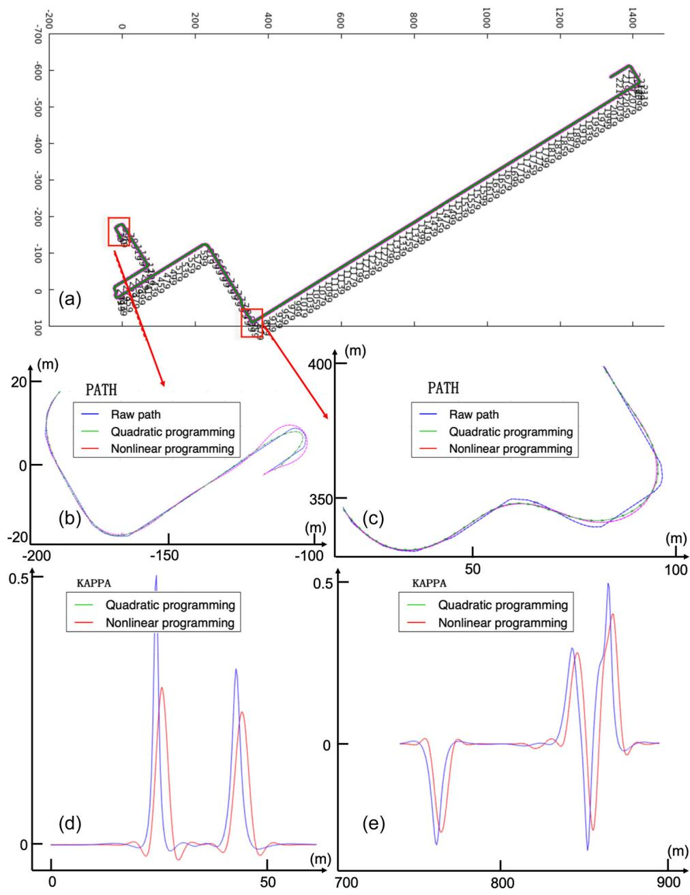  
FIGURE 11 A 2200-m's long raw reference line is shown at (a), a comparison of the smoothing results from two truncated portions obtained by using quadratic programming and nonlinear programming at (b, c), and a comparison of the corresponding curvatures at (d, e), respectively (maximum curvature can be dramatically reduced by using our proposed approach).

Figure 12 illustrates the motion planning in a typical unstructured environment. Especially, this figure shows a parking task when last-mile delivery vehicle came back to the distribution center. The red arrow denotes the designated parking goal pose for our vehicle's parking task. The red line is the open space path generation toward the parking spot, and the green line is the desired trajectory generated and optimized by hybrid $A^{\star}$ and conjugate gradient descent methods.

# 6.2 | Merge from off-road to routing scenario

As mentioned in Section 6.1, parking and resuming to drive on roads are frequent behaviors in last-mile delivery. The merging behavior from parking spots to roads is discussed in this section.

The merging behavior can be comprised of two stages. The first stage is to find a goal pose based on current vehicle position and reference line, and the second stage is to generate a trajectory from the current vehicle position toward the goal pose. For the first stage, a provisional goal point can be computed by projecting the current vehicle's position to the target reference line. If the provisional goal point is not occupied by obstacles, then we set it as the final goal point, otherwise, we can search appropriate goal point along with the reference line with a fixed step.

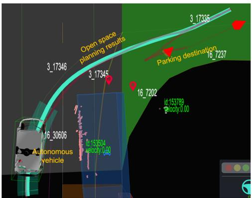

flowchart

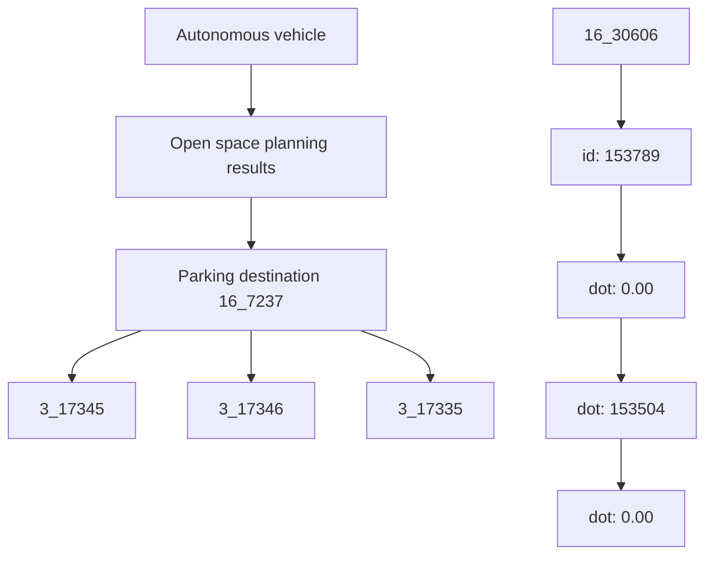
```mermaid
graph TD
    A["Autonomous vehicle"] --> B["Open space planning results"]
    B --> C["Parking destination 16_7237"]
    C --> D["3_17345"]
    C --> E["3_17346"]
    C --> F["3_17335"]
    G["16_30606"] --> H["id: 153789"]
    H --> I["dot: 0.00"]
    I --> J["dot: 153504"]
    J --> K["dot: 0.00"]
```

FIGURE 12 Example of the motion planning for a typical parking scenario

Once the goal point is determined, the merge trajectory from off-road to reference line can be generated by zone trajectory planning, referred to as in Section 6.1 or on-road trajectory planning, described details in Section 7. When the angle difference between the current vehicle's heading and the target reference line's heading is too large, zone trajectory planning is applied for merge trajectory, such as the behavior from the parking lot back to the road. On the other hand, when the current vehicle's heading is aligned to the target reference line, the on-road trajectory planning method is used to produce the merge trajectory, such as the vehicle which is pulled over roadside tries to be back to the road.

# 6.3 | Crossing intersections scenario

Within the geometric map, an intersection contains intersection ID, geometric shape, lane, and road ID binding with the intersection, as shown in Figure 6. In each motion planning cycle, the system keeps getting the current intersection information of interest, and based on the route planning results and traffic lights status, determining whether the vehicles are going to cross the intersection. Once the crossing intersection scenario is determined, all intersection elements, such as stop line, lane-road IDs, speed limits in the intersection, pillars, and safety islands, discussed in Section 4, are obtained based on the intersection shape. These data are known in advance of arrival at the intersection and are completely static.

In contrast to the information gained from the intersection elements, the moving obstacles data received periodically by perception are highly dynamic. However, the obstacles tracking and predicting through an intersection need additional intersection elements constraints. During the process of intersection crossing, the trajectory planning in Section 7 is determined by both intersection elements and moving obstacles.

# 6.4 | Left-turn scenario

The aim of the left-turn scenario is to adjust the last-mile vehicle's orientation heading to traffic lights at intersections. Logically, the left-turn scenario is transited from crossing intersections scenario. When vehicles complete to adjust orientation in the left-turn scenario, the scenario will be switched back to crossing intersections scenario for passing through intersections. Compared with the passenger vehicle, the last-mile delivery vehicle has a much slower driving speed, so a delivery vehicle keeps driving on the lane together with pedestrians and bicycles. When route planning produces a route for the trend to turn the vehicle left through an intersection, the vehicle needs to cross an intersection and waits in front of the stop line for traffic lights. After this transition, the vehicle might not perceive traffic lights due to its orientation. Therefore, we designed the left-turn scenario to adjust the vehicle's orientation in front of the stop line. Figure 13 can show the special left-turn scenario for delivery vehicles. First, the red arrow is the goal pose, and its optimal position is calculated based on stop line's position and obstacles' cost, and the goal's orientation is headed by the goal position to the traffic lights position; Second, once a goal is determined, hybrid A\* algorithm can generate a feasible path to drive vehicles to that goal, where can perceive the traffic lights; third, when the traffic light is green, the left-turn scenario will change back to cross intersection scenario, then vehicles finish to go through the intersection.

# 6.5 | Traffic lights scenario

As mentioned in Section 6.4, the primary property of a last-mile delivery vehicle is low speed. This slow speed property leads to vehicles not having enough time to pass through the intersections straightly or by a left turn, when the traffic light turns from green to red. Thus, we need a different strategy when vehicles are positioned in front of traffic lights at road intersections.

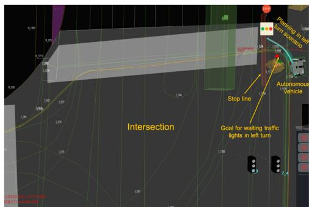

text_image

Planning in left
turn scenario
Stop line
Autonomous
vehicle
Goal for waiting traffic
lights in left turn
Intersection

FIGURE 13 Left-turn scenario for the last-mile delivery vehicles

It is obvious that vehicles stop on stop line at the road intersections when the traffic light is red. However, there exists two options (keep stopping or drive) when the traffic light becomes green. To avoid the situation that vehicles still drive in the middle of intersections even though the traffic light turns red, we designed a traffic light-based scenario decision. In our ROVER 5.0's operations, the HDR camera listed in Table 1 perceives traffic lights of interest. Once the green light is detected, then the timer is initiated to record the duration until the vehicle arrives at stop line. When the duration exceeds some predefined time threshold, the vehicle will stop at the stop line to wait for the next green light.

# 6.6 | Backup scenario

Essentially, a backup scenario is designed for the error recovery of vehicles on roads or intersections. The most commonly encountered recovery situations occur when the vehicle is blocked because of suddenly perceived obstacles, or the vehicle stops beyond the stop line in intersections.

# 6.6.1 | On-road backup

For backup scenarios triggered by obstacles, when the planning trajectory could not drive vehicles to bypass obstacles, due to trajectory planning problems or obstacle perception issues, the planning status is switched from cruise scenario to backup scenario. For example, various situations induced by transient irregular obstacles can trigger this scenario, for example, (1) traffic cones, bicycles, which are detected as wrong sizes, induce incorrect planning results; (2) some obstacles like barriers, other cars, or overhanging branch that are detected too late to bring the ego care to stuck.

When the ego car is stuck by obstacles on road, the algorithm for on-road backup behavior selects an initial forward goal along the reference line with some distance forward $s_{initial}$ from the ego car's position. If the initial forward goal is occupied by other obstacles, then the alternative goal can be searched by adding some incremental distance $s_{incremental}$ , until some maximum distance $s_{max}$ . Similarly, the algorithm also chooses a backup distance $s_{back}$ along with the reference line behind the ego car. Empirically, $s_{initial} = 10 \, m$ , $s_{incremental} = 1 \, m$ , $s_{max} = 15 \, m$ , and $s_{back} = 6 \, m$ worked well for last-mile delivery vehicles.

To obtain a backup trajectory, we initially used the current reference line with some offset obtained by the current vehicle's lateral distance from the reference line. If the backup trajectory based on the reference line is infeasible, then the algorithm can generate a new backup trajectory using the same method as discussed in Section 6.1. In the meantime, the trajectory planning module continues to plan the feasible forward trajectory to bypass obstacles based on a given forward goal. When the planned trajectory is constantly not overlapped with the obstacle's bounding box at some number of planning cycles, the system will switch the backup scenario to a cruise scenario for normal operations.

# 6.6.2 | On-intersection backup

Similar to the on-road backup scenario in Section 6.6.1, when the ego car crosses the stop line in the intersection scenario and traffic lights show a red signal, the system automatically switches the scenario from intersection to backup. All backup configurations are the same as those of on-road backup. Once traffic lights turn green or the ego car does not cross the stop line, then the system quits the backup scenario.

# 7 | TRAJECTORY PLANNING

The proposed motion planner is depicted in the Frenet frame that the reference frame is given by the tangential and normal vector at each path point based on the reference line (Werling et al., 2010). The reference line here is roughly the road center or desired path from the routing module. Rather than generating trajectory directly in the Cartesian frame, we map the obstacles and the ego car states with position and heading $(x, y, \theta)$ to the Frenet frame $(s, I, I^{(1)}, I^{(2)}, I^{(3)}, I^{(4)})$ with respect with time $t$ , which represent longitudinal station, lateral displacement, and its lateral derivatives. In the Frenet frame, the trajectory of the ego car and obstacle can be described in SL $(I(s))$ and station-time (ST) $(s(t))$ graphs. In motion planning, we can evaluate the static obstacles, estimated dynamic obstacles from prediction module, and ego cars' positions at each time instant. Then, the obstacles and ego car at each time instant are projected on the reference line in the Frenet frame. Thus, the relationship between ego car and obstacles is pretty clear in SL and ST graphs (Werling et al., 2010).

The proposed motion planning approach comprises two main parts as follows.

# 7.1 | Trajectory generation

# 7.1.1 | Path generation and decision

The lateral decision not only produces the obstacles-based vehicle lateral decision but also generates a rough path profile by a DP search. As shown in Figure 14, the lateral decision module mainly comprises the following four steps.

Step 1 (Obstacles boundary on $I(s)$ ): On the basis of the smooth reference line as discussed in Section 5.2, the obstacles and ego cars described with location and heading are mapped to the Frenet frame coordinates, which can produce $I(s)$ boundaries represented as a lateral displacement I with respect to station s. For example, assuming there is a smooth reference line R composed of n points, which can be partitioned into n - 1 line segments as follows:

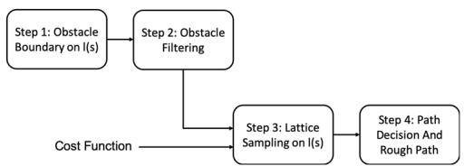

flowchart

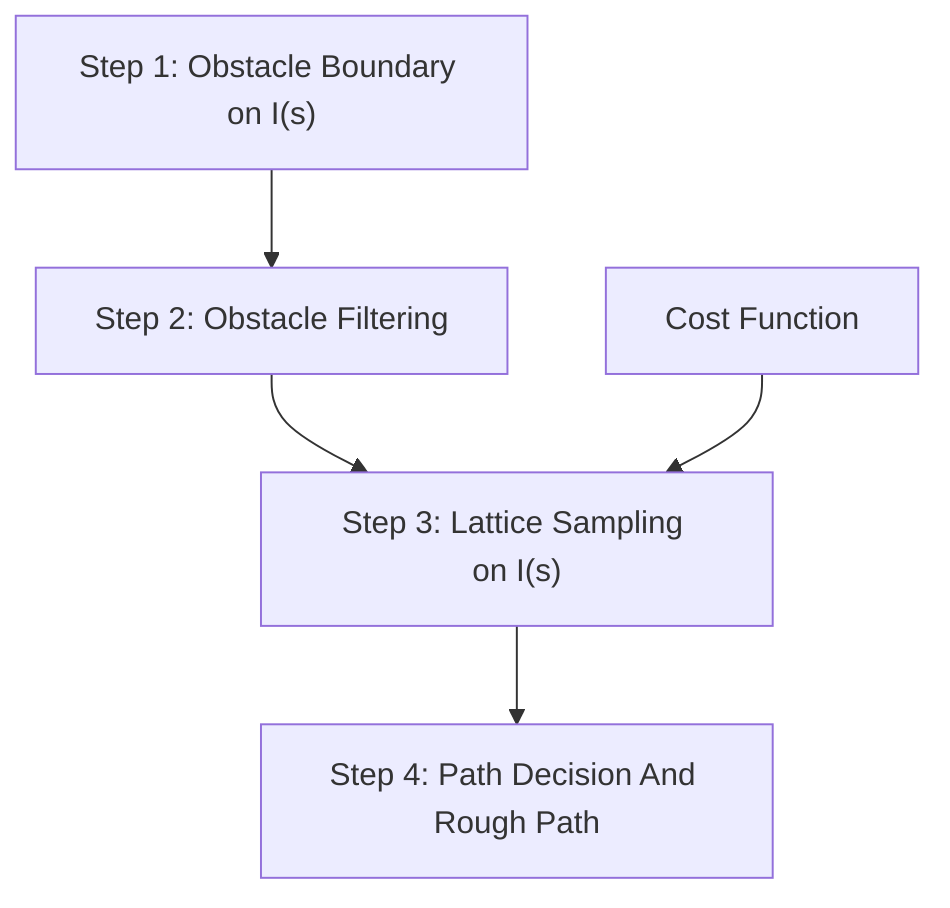
```mermaid
graph TD
    A["Step 1: Obstacle Boundary on I(s)"] --> B["Step 2: Obstacle Filtering"]
    B --> C["Step 3: Lattice Sampling on I(s)"]
    C --> D["Step 4: Path Decision And Rough Path"]
    E["Cost Function"] --> C
```

FIGURE 14 Flowchart of the lateral decision technique

$$
\operatorname{seg} _ {i} = R _ {i} \overrightarrow {R _ {i + 1}}, \quad i = 1, 2, \dots , n - 1, \tag {11}
$$

where $R_{i}$ denotes the $i$ th reference point, and $seg_{i}$ denotes the $i$ th line segment. Without loss of generality, to map an obstacle from Cartesian coordinates $(x, y)$ to Frenet coordinates $(s, l)$ , as shown in Figure 15, first we need to find the nearest line segment (assuming the $k$ th line segment) from all line segments based on the obstacle's position $P(x, y)$ in Cartesian coordinates. Second, connecting the $k$ th line segment $(seg_{k})$ 's start point $R_{k}$ with a terminal point $P$ constructs a vector $\overrightarrow{R_kP}$ . Similarly, the $k$ th line segment $(seg_{k})$ is denoted by $\overrightarrow{R_kR_{k+1}}$ in Equation (11). By vector projection formula, the scalar projection $s$ and scalar rejection $l$ can be readily obtained by

$$
s = \frac {\overrightarrow {R _ {k}} P \cdot R _ {k} \overrightarrow {R _ {k + 1}}}{\| R _ {k} \overrightarrow {R _ {k + 1}} \|},
$$

$$
I = \frac {\left\| \overrightarrow {R _ {k}} P \times R _ {k} \overrightarrow {R _ {k + 1}} \right\|}{\left\| R _ {k} \overrightarrow {R _ {k + 1}} \right\|}, \tag {12}
$$

where “·” denotes the inner product and “×” the cross product. Thus, given obstacles and ego car's positions in Cartesian coordinates and a smooth reference line, we can compute all obstacles' SL boundaries in Frenet coordinates. Building $I(s)$ boundaries is very important, because it illustrates the relationship between obstacles and ego cars, and provides evidence for the following lateral decision and path generation.

Note: Obstacles projection to Frenet frame highly depends on the smoothness of the reference line. If the curvature of the reference line is too large, such as the U-turn shape of the reference line, the obstacles mapping may produce ambiguous outcomes, that is, a lateral displacement l respects to multiple different stations s in the Frenet frame. To address this type of ambiguity, we partition the entire reference line with subsets according to U-turns as

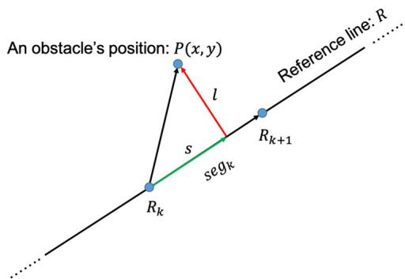

text_image

An obstacle's position: P(x,y)
l
s
segk
R_{k+1}
Reference line: R

FIGURE 15 (x, y) in Cartesian coordinates transforms to (s, l) in Frenet coordinates

$$
\operatorname{ref} (\cdot) = \cup_ {k} \operatorname{ref} _ {p _ {k}} (\cdot), \tag {13}
$$

where $ref_{p_{k}}(\cdot)$ is defined as the kth subreference line, $k = 1, 2, ..., n$ , and n is the number of partitions. Assuming there exist m obstacles and n - 1 U-turns in the reference line, which partitions the entire reference line into n subreference lines. Then, we can project all the m obstacles onto the n subreference lines to produce $m \times n$ SL boundaries. Thus, these $m \times n$ SL boundaries are considered independently of the following lateral decision making and rough path generation.

Step 2 (Obstacles filtering): For any time instant, we assume that all obstacle elements are constructed to a set O, which is given by

$$
\mathcal {O} (t) = \{o b j _ {k, t} \mid k = 1, 2,..., N; t \in \Re \}, \tag {14}
$$

where N is the total number of obstacle elements perceived by perception component.

To ignore some irrelevant obstacles that do not impact planning results, we define a planning region of interest (ROI) by some criterion. In this article, an s-l representation-based region relative to the reference line in the Frenet frame can be considered as the ROI, as shown in Figure 16.

Without loss of generality, we assume the reference line is the middle line of the lane, the planning length in each planning cycle is defined as $L_{p}$ , and any obstacle is represented as a rectangular bounding box. From Figure 16, four vertexes of an obstacle are mapped onto the reference line to produce $min_{s}$ and $max_{s}$ relative to ego car, and produce $min_{l}$ and $max_{l}$ relative to the reference line. On the other hand, if the obstacle is dynamic, then the velocity of obstacle v from the prediction module can be orthogonally decomposed as $v_{s}$ and $v_{l}$ . Thus, the criteria of obstacles filtering are (1) obstacle's s-directional boundaries satisfy the conditions in Equation (15) which means if the obstacles are far away from the planning distance or locate the behind of ego car, we can ignore them for planning.

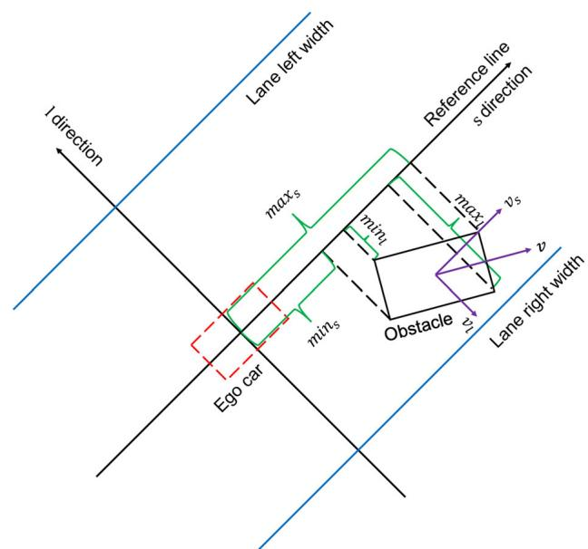

text_image

Lane left width
Reference line
s direction
l direction
max_s
min_s
min_t
max_t
v_s
Obstacle
v_t
Ego car
Lane right width

FIGURE 16 Schematic diagram for obstacle filtering

$$
\min _ {s} > P _ {s} + L _ {p} + \epsilon_ {f}
$$

$$
\max _ {s} <   P _ {s} - \epsilon_ {r} \tag {15}
$$

where $P_{s}$ denotes the ego car's s-coordinate along with reference line, $\epsilon_{f}$ and $\epsilon_{r}$ are the additionally longitudinal distance buffers in front and behind of ego car, respectively. (2) Obstacle's l-directional boundaries satisfy the conditions in Equation (16) which means if the obstacles go beyond the lane's boundaries, we can ignore them for planning.

$$
\min _ {l} > \max \left\{\mathbf {W} _ {l} \left(\min _ {s}\right), \dots , \mathbf {W} _ {l} \left(\max _ {s}\right) \right\} - \epsilon_ {l},
$$

$$
\max _ {l} <   \max \left\{\mathbf {W} _ {r} \left(\min _ {s}\right), \dots , \mathbf {W} _ {r} \left(\max _ {s}\right) \right\} + \epsilon_ {r}, \tag {16}
$$

where $W_{l}$ and $W_{r}$ are the functions of lane's left and right boundary, respectively, $\epsilon_{l}$ and $\epsilon_{r}$ are buffers for obstacles filtering in the l-direction. (3) Additionally, the prediction of dynamic obstacles is also considered here. At any time instant, an obstacle's velocity $\vec{v}$ can be estimated by prediction, as shown in Figure 16. On the basis of the orthogonal decomposition method, the obstacle's velocity $\vec{v}$ is decomposed as vectors $\vec{v}_{s}$ and $\vec{v}_{l}$ in the s-l frame. When the direction of $\vec{v}_{s}$ is along with the reference line, and the magnitude of $\vec{v}_{s}$ is larger than the maximum speed of the delivery vehicle, then we can ignore the corresponding obstacles. On the other hand, for $\vec{v}_{l}$ , when the magnitude of $\vec{v}_{l}$ is larger than a lateral velocity threshold (empirically, 0.4 m/s for ROVER 5.0 vehicle), the corresponding obstacles can be filtered out.

As a result, those irrelevant obstacles to motion planning are filtered and the processing time could be significantly reduced. The filtered obstacles subset is given by

$$
\mathcal {O} _ {f} (t) = \{o b j _ {k, t} \mid k = 1, 2,..., N _ {f}; t \in \Re \}, \tag {17}
$$

where $N_{f}$ is the total number of obstacle elements of interest after filtering, and $O_{f}(t) \subset O(t)$ .

Step 3 (Sampling on SL graph): For lattice sampling, multiple rows of points are first sampled in front of the ego car under the Frenet frame. As shown in Figure 17, the colors of sampling points denote the corresponding costs. The red end of the color spectrum denotes the higher cost, and the violet end denotes the lower cost. The bounds of sampling depend on the current passable areas where the vehicles drive on. For each row's sampling, the choice of resolution is based on lane boundaries and obstacles' position. Sampling points between rows are smoothly interpolated by polynomial edges. Notice that the resolution of the sampling between rows highly depends on vehicle speed and driving scenarios, so it can be customized by different application cases. For instance, when the ego car tries to go through a very narrow road junction, the sampling resolution could be set higher than normal.

Step 4 (Decision and rough path generation): When all lattice sampling-based nodes and edges are constructed, the rough path result can be generated by a connection of selected edges which are evaluated to have minimal cost functions. Each node's cost function is a linear combination of the obstacle avoidance cost and path cost including smoothness cost and deviation from reference line cost.

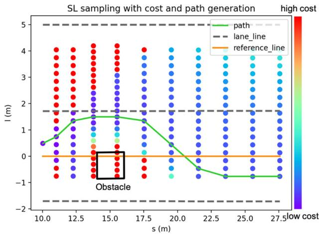

line

| s (m) | I (m) - path | I (m) - lane_line | I (m) - reference_line |
|-------|--------------|-------------------|------------------------|
| 10.0  | 0.5          | 1.8               | 0.0                    |
| 12.5  | 1.5          | 1.8               | 0.0                    |
| 15.0  | 1.5          | 1.8               | 0.0                    |
| 17.5  | 1.3          | 1.8               | 0.0                    |
| 20.0  | 0.5          | 1.8               | 0.0                    |
| 22.5  | -1.0         | 1.8               | 0.0                    |
| 25.0  | -1.0         | 1.8               | 0.0                    |
| 27.5  | -1.0         | 1.8               | 0.0                    |

FIGURE 17 Illustration of sampling on SL graph and path generation. The red end of the color spectrum denotes the higher cost, and the violet end denotes the lower cost.

$$
J (s, I) = J _ {\mathrm{obj}} (s, I) + J _ {\text { path }} (s, I). \tag {18}
$$

For the obstacles impact for path-based decision and generation, we only consider the obstacles which locate in the ROI. For example, the obstacles' S-L boundaries that are within some ROI boundaries are considered in path generation. Then, the obstacle avoidance cost $J_{\mathrm{obj}}(s, l)$ is given by

$$
J _ {\mathrm{obj}} (s, l) \triangleq \sum_ {i = 0} ^ {N} w _ {c} \mathcal {G} (\mu_ {\Delta s}, \mu_ {\Delta l}, \sigma_ {\Delta s}, \sigma_ {\Delta l}, \Delta s _ {i}, \Delta l _ {i}), \tag {19}
$$

where N denotes the number of nodes, $w_{c}$ is the weighting of obstacle avoidance cost, and $\mathcal{G}(\mu_{\Delta s}, \mu_{\Delta l}, \sigma_{\Delta s}, \sigma_{\Delta l}, \Delta s_{i}, \Delta l_{i})$ is the two-dimensional Gaussian function:

$$
\begin{array}{l} \mathcal {G} (\mu_ {\Delta s}, \mu_ {\Delta l}, \sigma_ {\Delta s}, \sigma_ {\Delta l}, \Delta s _ {i}, \Delta l _ {i}) \\ = \frac {1}{\sigma_ {\Delta s} \sigma_ {\Delta I} \sqrt {2 \pi}} e ^ {- \frac {1}{2} \left(\frac {(\Delta s _ {i} - \mu_ {\Delta s}) ^ {2}}{\sigma_ {\Delta s} ^ {2}} + \frac {(\Delta l _ {i} - \mu_ {\Delta l}) ^ {2}}{\sigma_ {\Delta l} ^ {2}}\right)}, \tag {20} \\ \end{array}
$$

where $\Delta s_{i}$ is the longitudinal distance between the $i$ th node and the obstacle's bounding box; $\Delta l_{i}$ is the lateral distance between the $i$ th node and the obstacle; $\mu_{\Delta s}$ and $\mu_{\Delta l}$ are the expectation values of $\Delta s$ and $\Delta l$ ; $\sigma_{\Delta s}$ and $\sigma_{\Delta l}$ are the standard deviations of $\Delta s$ and $\Delta l$ .

By Equation (20), we can see two-dimensional (2D) Gaussian function is a characteristic symmetric “cone” shape, as shown in Figure 18. Thus, the corresponding obstacle cost function $J_{obj}$ is a monotonically decreasing function, along with the longitudinal and lateral distance between ego car and obstacles increasing.

In addition to the obstacle avoidance cost $J_{\mathrm{obj}}(I(s))$ , the path cost $J_{\mathrm{path}}(I(s))$ is given by

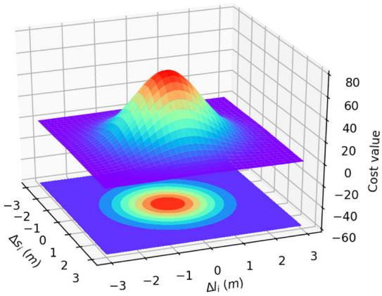

contour

| Δl_i (m) | Δs_i (m) | Cost value |
|----------|----------|------------|
| -3       | -3       | 0          |
| -2       | -2       | 20         |
| -1       | -1       | 40         |
| 0        | 0        | 60         |
| 1        | 1        | 80         |
| 2        | 2        | 60         |
| 3        | 3        | 40         |

FIGURE 18 Schematic diagram of obstacle-based cost function

$$
\begin{array}{l} J _ {\text { path }} (s, I) \triangleq \sum_ {i = 0} ^ {N} w _ {0} (I (s _ {i}) - r (s _ {i})) ^ {2} + w _ {1} (I ^ {(1)} (s _ {i})) ^ {2} \tag {21} \\ + w _ {2} (I ^ {(2)} (s _ {i})) ^ {2} + w _ {3} (I ^ {(3)} (s _ {i})) ^ {2}, \\ \end{array}
$$

where $[I(s_{i}), I^{(1)}(s_{i}), I^{(2)}(s_{i}), I^{(3)}(s_{i})]$ are the lateral displacement and its corresponding derivatives relative with the ith station $s_{i}$ , $r(s_{i})$ is the lateral displacement of reference line, and $w_{i}$ for i = 0, 1, 2, 3 are the weightings.

Thus, the node cost $J(s, l)$ can be obtained by a combination of path- and obstacle-related costs by Equation (18). Thus, the final rough path can be synthesized by these corresponding edges with the minimal cost through a DP search. Note: (1) In addition to consider the node cost $J(s, l)$ by DP search, the curvature limitation also needs to be considered. In practical DP search, the nodes connected in adjacent level is restricted by curvature limitation; (2) if all of the space are blocked by obstacles and no room to pass through for delivery vehicles, the DP search still can find a solution to generate an infeasible path across the obstacles. The following decisions can be made by speed planning described in Section 7.1.2, such as stop, yield, following, and so forth.

As shown in Figure 17, the black rectangle denotes an obstacle on the lane, and the colored dots denote the sampling points in front of an ego car. Each sampling point's cost is computed by Equations (18), (19), and (21) and the value of cost corresponds with a different color. Here, the red end of the color spectrum denotes the higher cost, and the violet end denotes the lower cost. The computation of cost is a trade-off among obstacle avoidance, minimum deviation from path to reference line, path smoothness, and curvature limitations. From Figure 17 we can see the color of sampling points which is nearby an obstacle, far away from the reference line, or making path curvature larger are red. Thus, the final optimal path is generated by connecting the minimum cost of points in each row. In the meanwhile, according to the relationship between the path points and obstacle positions, the path also makes obstacle decisions.

# 7.1.2 | Speed profile generation and decision

The speed decision module produces a decision for speed-relevant behavior, as well as generates a rough speed profile represented as a station s function with respect to time t, that is, $s(t)$ representation. Similar to the lateral decision algorithm described in Section 7.1.1, the speed decision also consists of four steps, as shown in Figure 19.

Step 1 (Obstacles boundary on $s(t)$ ): First, the obstacles' prediction trajectories are projected on the planned rough path in the Frenet frame, which can produce $s(t)$ boundaries that are represented as a station s with respect to time t for all obstacles. If the obstacles' trajectories have interactions with a planned path with some threshold (such as ego car's width), then the corresponding blocking intervals will be generated on the $s(t)$ frame.

Without loss of generality, we assign all blocking sections $T_{k}$ for $k \in \mathbb{N}$ ( $\mathbb{N}$ : the set of natural numbers), to be closed,

$$
T _ {k} = \left[ t _ {k, \mathrm{i}}, t _ {k, \mathrm{f}} \right], \quad k \in \mathbb {N}, \tag {22}
$$

where $t_{k,i}$ and $t_{k,f}$ are defined as the initial instant and the final instant for the kth blocking section, respectively. Thus, the entire obstacles-based blocking intervals in the Frenet frame is a well-defined function of time, and is partitioned into multiple intervals $s_{\mathrm{blk}}(\cdot)$ , that is,

$$
s _ {\mathrm{blk}} (\cdot) = \cup_ {k} s _ {\mathrm{blk}, k} (\cdot), \tag {23}
$$

where $s_{\mathrm{blk},k}(\cdot)$ are defined for the kth blocking section $T_{k}$ , and $k = 1, 2, \ldots$ .

However, computing obstacles ST boundaries is a very time-consuming task, especially for dynamic obstacles. As shown in Figure 20, to calculate dynamic obstacles ST boundaries, for each prediction trajectory point, the minimum distance between each vertex of an obstacle polygon and the path points should be computed. The time complexity is up to $O(kn^{2})$ , where k denotes the number of vertexes for the obstacle polygon. To save more time in each planning computation cycle, a k-dimensional tree space-partitioning data structure was proposed to address the time-consuming problem of obstacles ST boundaries computation.

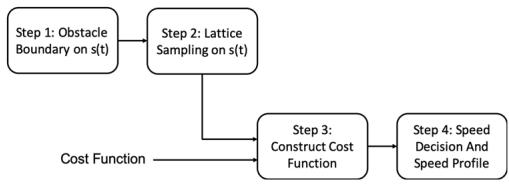

flowchart

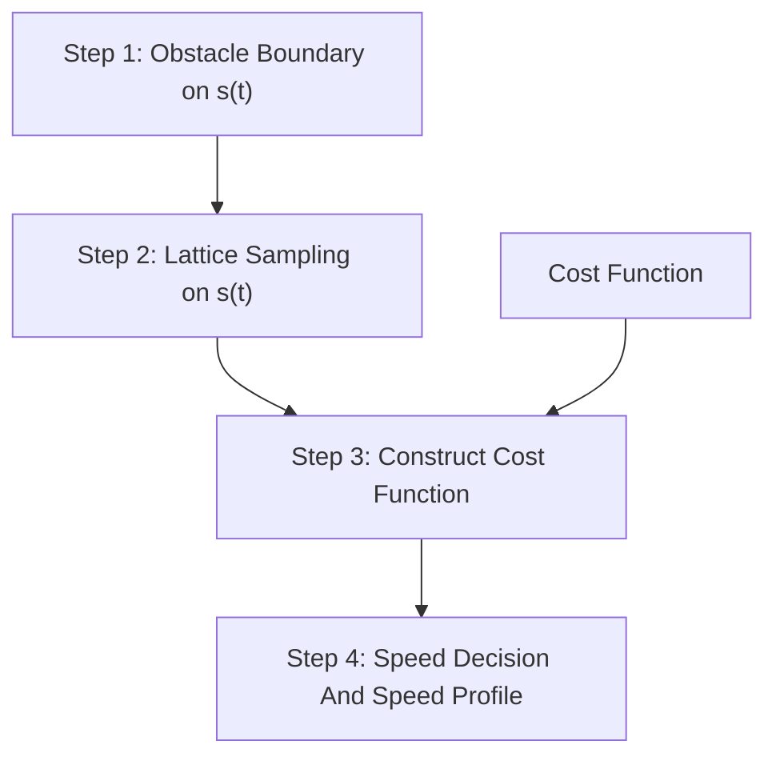
```mermaid
graph TD
    A["Step 1: Obstacle Boundary on s(t)"] --> B["Step 2: Lattice Sampling on s(t)"]
    B --> C["Step 3: Construct Cost Function"]
    C --> D["Step 4: Speed Decision And Speed Profile"]
    E["Cost Function"] --> C
```

FIGURE 19 Flowchart of the speed decision technique

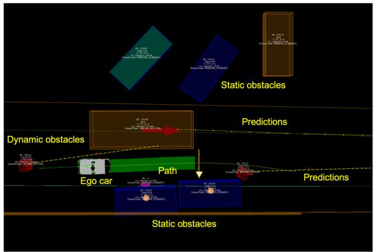

flowchart

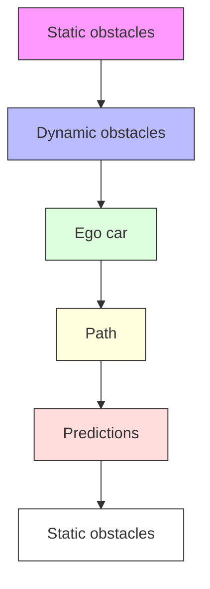
```mermaid
graph TD
    A["Static obstacles"] --> B["Dynamic obstacles"]
    B --> C["Ego car"]
    C --> D["Path"]
    D --> E["Predictions"]
    E --> F["Static obstacles"]
    style A fill:#f9f,stroke:#333
    style B fill:#bbf,stroke:#333
    style C fill:#dfd,stroke:#333
    style D fill:#ffd,stroke:#333
    style E fill:#fdd,stroke:#333
    style F fill:#fff,stroke:#333
```

FIGURE 20 Example of the autonomous driving scenario with dynamic obstacles ST boundaries computation. ST, station-time.

In practice, it is nearly always used to support search on multidimensional coordinates, such as 2D space in autonomous driving. In this paper, we construct a k-dimensional tree based on path points data. Because we store path points data organized by the xy-coordinates, in this case, k is 2, with the x-coordinate field arbitrarily designated key 0, and the y-coordinate field designated key 1. At each level, the split direction alternates between x and y. Thus, the xy-coordinates node at level 0 (x-direction split) would have in its left subtree only nodes whose x values are less than that of the root. The right subtree would contain nodes whose x values are greater than that of the root. The xy-coordinates node at level 1 (y-direction split) can be done in the same manner. Figure 21 shows an example of how a collection of 2D path points would be stored in a k-dimensional tree.

To evaluate and demonstrate the effect of obstacles ST boundaries computation, the computation time of obstacles ST boundaries with k-dimensional tree was investigated in the tests. Especially, the planned path in the tests includes $10^{4}$ numbers of points, and the prediction time of two obstacles last 6 s with 0.1 s resolution. For comparison, the same test configuration was also evaluated using the traditional “for” loops. The test results showed that using k-dimensional tree data structure, the total computational time of obstacles ST boundaries was only 5.8 ms, whereas the computational time using traditional “for” loops was dramatically increased to 62.2 ms. Therefore, the test results demonstrate the superior time-saving performance of k-dimensional tree assisted with obstacles ST boundaries computation, particularly for a large number of path points.

Step 2 (Sampling on ST graph): Considering the current ego car's states as the initial condition, a serial of time instant $t_{k}$ is sampled from the current initial time instant in the Frenet frame, such that

$$
t _ {k} \in [ 0, T _ {\mathrm{p}} ], \quad k \in \mathbb {N}, \tag {24}
$$

where $T_{p}$ is defined as the total planning time for speed planning, and $k = 1, 2, ..., N_{k}$ . Correspondingly, we sample accelerations $a_{t_{k},i}$ at each time instant $t_{k}$ ,

$$
a _ {t _ {k}, i} \in [ d _ {\max}, a _ {\max} ], \quad k, i \in \mathbb {N}, \tag {25}
$$

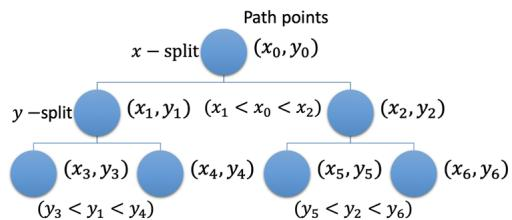

flowchart

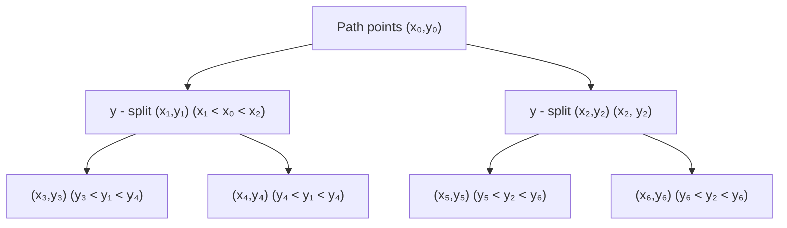
```mermaid
graph TD
    A["Path points (x₀,y₀)"] --> B["y - split (x₁,y₁) (x₁ < x₀ < x₂)"]
    A --> C["y - split (x₂,y₂) (x₂, y₂)"]
    B --> D["(x₃,y₃) (y₃ < y₁ < y₄)"]
    B --> E["(x₄,y₄) (y₄ < y₁ < y₄)"]
    C --> F["(x₅,y₅) (y₅ < y₂ < y₆)"]
    C --> G["(x₆,y₆) (y₆ < y₂ < y₆)"]
```

FIGURE 21 Example of path points stored in a k-dimensional tree

where $d_{max}$ denotes the maximum deceleration, $a_{max}$ denotes the maximum acceleration, and $i = 1, 2, ..., N_i$ . Notice that $N_k$ and $N_i$ are defined by sampling resolution. Thus, $(t_k, a_{t_k,i})$ constructs a time-acceleration node-based graph for the following DP search. As shown in Figure 22c, in an example of ROVER 5.0's operation, the total speed planning time $T_p$ is 4 s, the time resolution is 0.2 s, and the sampled accelerations are defined by $[-2, -1, 0, 0.3, 0.6]$ m/s².

Step 3 (Construct cost function): After constructing a graph including sampled $(t_k, a_{t_k,i})$ as nodes, each group of $(a_{t_0,i}, a_{t_1,i}, ..., a_{t_{N_k,i}})$ derives speed profile $(s(t_k), s^{(1)}(t_k), s^{(2)}(t_k), s^{(3)}(t_k))$ for $k = 1, 2, ..., N_k$ , which is evaluated by the summation of cost function as follows:

$$
J (s, t) \triangleq \sum_ {i = 0} ^ {N _ {k}} w _ {1} \left(s ^ {(1)} \left(t _ {k}\right) - V _ {\text {target}}\right) ^ {2} + w _ {2} \left(s ^ {(2)} \left(t _ {k}\right)\right) ^ {2} \tag {26}
$$

$$
+ w _ {3} (s ^ {(3)} (t _ {k})) ^ {2} + J _ {\mathrm{obs}} (s (t _ {k})),
$$

where

$$
J _ {\text { obs }} (s (t _ {k})) = \left\{ \begin{array}{l l} \infty & \text { for   } s (t _ {k}) \in s _ {\text { blk }} (\cdot), \\ 0 & \text { otherwise. } \end{array} \right. \tag {27}
$$

In Equation (26), $s^{(1)}(t_k) - V_{\text{target}}$ denotes the target velocity following cost, $s^{(2)}(t_k)$ and $s^{(3)}(t_k)$ are the speed smoothness costs, and $J_{\text{obs}}(s(t_k))$ denotes the total obstacles cost, which has an extremely large cost value when the accumulated station $s(t_k)$ is within the block interval set $s_{\text{blk}}(\cdot)$ . Thus, by using DP search, the minimal cost can be obtained easily.

Step 4 (Decision and rough speed profile): On the basis of the above three steps, an optimal speed profile $(s(t_{k}), s^{(1)}(t_{k}), s^{(2)}(t_{k}), s^{(3)}(t_{k}))$ with the lowest cost can be obtained for each planning cycle. Furthermore, since the ego car's speed profile and obstacles boundaries on the $s(t)$ frame are known, the speed decisions, such as stop, yield, and overtake, are straightforward. Figure 22a showed a scene that an ego car cruised on road, where a dynamic obstacle came across the lane in front of the ego car. Figure 22c illustrated an acceleration-time (AT) sampling as ego car's speed planning candidates. The computation of each sampling point's cost is based on Equations (26) and (27). Thus, the final speed profile can be generated with a minimal cost through a DP search. Similar to the description in Section 7.1.1, in addition to consider the node cost at DP search, the steering and its rate limitations also need to be considered. In a practical DP search, the node's connection in the adjacent level is restricted by the steering limitations. Similar to color representations in Figure 17, the red end of the color spectrum denotes the higher cost, and the violet end denotes the lower cost. The computation of cost is a trade-off among obstacle collisions, target speed following, speed smoothness, and steering limitations. On the basis of the minimum cost criterion, optimal acceleration lists relative to monotonic time instants (AT profile) are determined, as shown in the green line. Then, Figure 22b,d demonstrated the final ST and velocity-time (VT) profiles in a planning cycle. Especially in Figure 22b, the orange line showed the dynamic obstacle's ST boundaries and the red line showed the ego car's ST profile. By comparison, we can see ego car's station is always behind the dynamic obstacle at each time instant, so that a yield decision can be made directly.

(a)   
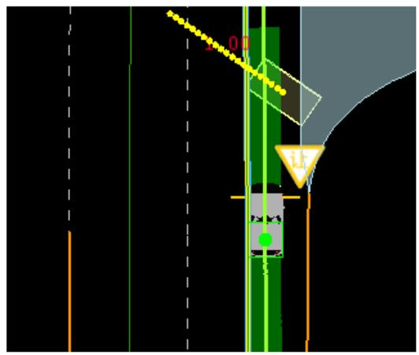

text_image

Diagram showing a vehicle with yellow trajectory line and warning sign, likely illustrating a road safety or traffic hazard scenario.

(b)   
Station-Time (ST) profile of ego car and obstacle   
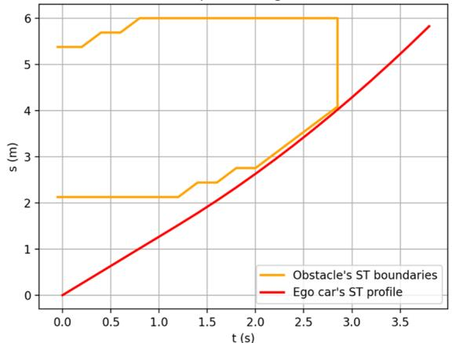

line

| t (s) | Obstacle's ST boundaries | Ego car's ST profile |
|-------|--------------------------|----------------------|
| 0.0   | 5.4                      | 0.0                  |
| 0.5   | 5.7                      | 0.8                  |
| 1.0   | 6.0                      | 1.6                  |
| 1.5   | 6.0                      | 2.4                  |
| 2.0   | 6.0                      | 3.2                  |
| 2.5   | 6.0                      | 4.0                  |
| 3.0   | 6.0                      | 4.8                  |
| 3.5   | 6.0                      | 5.6                  |

(c)   
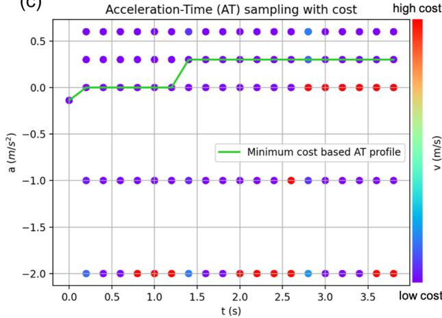

line

| t (s) | a (m/s²) | v (m/s) |
|-------|----------|---------|
| 0.0   | -0.1     | 0.0     |
| 0.5   | 0.0      | 0.0     |
| 1.0   | 0.0      | 0.0     |
| 1.5   | 0.3      | 0.0     |
| 2.0   | 0.3      | 0.0     |
| 2.5   | 0.3      | 0.0     |
| 3.0   | 0.3      | 0.0     |
| 3.5   | 0.3      | 0.0     |
| 4.0   | 0.3      | 0.0     |
| 4.5   | 0.3      | 0.0     |
| 5.0   | 0.3      | 0.0     |
| 5.5   | 0.3      | 0.0     |
| 6.0   | 0.3      | 0.0     |
| 6.5   | 0.3      | 0.0     |
| 7.0   | 0.3      | 0.0     |
| 7.5   | 0.3      | 0.0     |
| 8.0   | 0.3      | 0.0     |
| 8.5   | 0.3      | 0.0     |
| 9.0   | 0.3      | 0.0     |
| 9.5   | 0.3      | 0.0     |
| 10.0  | 0.3      | 0.0     |
| 10.5  | 0.3      | 0.0     |
| 11.0  | 0.3      | 0.0     |
| 11.5  | 0.3      | 0.0     |
| 12.0  | 0.3      | 0.0     |
| 12.5  | 0.3      | 0.0     |
| 13.0  | 0.3      | 0.0     |
| 13.5  | 0.3      | 0.0     |
| 14.0  | 0.3      | 0.0     |
| 14.5  | 0.3      | 0.0     |
| 15.0  | 0.3      | 0.0     |
| 15.5  | 0.3      | 0.0     |
| 16.0  | 0.3      | 0.0     |
| 16.5  | 0.3      | 0.0     |
| 17.0  | 0.3      | 0.0     |
| 17.5  | 0.3      | 0.0     |
| 18.0  | 0.3      | 0.0     |
| 18.5  | 0.3      | 0.0     |
| 19.0  | 0.3      | 0.0     |
| 19.5  | 0.3      | 0.0     |
| 20.0  | 0.3      | 0.0     |
| 20.5  | 0.3      | 0.0     |
| 21.0  | 0.3      | 0.0     |
| 21.5  | 0.3      | 0.0     |
| 22.0  | 0.3      | 0.0     |
| 22.5  | 0.3      | 0.0     |
| 23.0  | 0.3      | 0.0     |
| 23.5  | 0.3      | 0.0     |
| 24.0  | 0.3      | 0.0     |
| 24.5  | 0.3      | 0.0     |
| 25.0  | 0.3      | 0.0     |
| 25.5  | -1        | -1      |
| 26.0  | -1        | -1      |
| 26.5  | -1        | -1      |
| 27.0  | -1        | -1      |
| 27.5  | -1        | -1      |
| 28.0  | -1        | -1      |
| 28.5  | -1        | -1      |
| 29.0  | -1        | -1      |
| 29.5  | -1        | -1      |
| 30.0  | -1        | -1      |
| 30.5  | -1        | -1      |
| 31.0  | -1        | -1      |
| 31.5  | -1        | -1      |
| 32.0  | -1        | -1      |
| 32.5  | -1        | -1      |
| 33.0  | -1        | -1      |
| 33.5  | -1        | -1      |
| 34.0  | -1        | -1      |
| 34.5  | -1        | -1      |
| 35.0  | -1        | -1      |
| 35.5  | -1        | -1      |
| 36.0  | -1        | -1      |
| 36.5  | -1        | -1      |
| 37.0  | -1        | -1      |
| 37.5  | -1        | -1      |
| 38.0  | -1        | -1      |
| 38.5  | -1        | -1      |
| 39.0  | -1        | -1      |
| 39.5  | -1        | -1      |
| 40.0  | -1        | -1      |
| ...   | ...      | ...     |
| ...   | ...      | ...     |
| ...   | ...      | ...     |
| ...   | ...      | ...     |
| ...   | ...      | ...     |
| ...   | ...      | ...     |
| ...   | ...      | ...     |
| ...   | ...      | ...     |
| ...   | ...      | ...     |
| ...   | ...      | ...     |
| ...   | ...      | ...    |
| ...   | ...      | ...     |
| ...   | ...      | ...     |
| ...   | ...      | ...     |
| ...   | ...      | ...     |
| ...   | ...      | ...     |
| ...   | ...      | ...     |
| ...   | ...      | ...     |
| ...   | ...      | ...     |
| ...   | ...      | ...     |
| ...   | ...      | .../low   |
| ...   | ...      | .../low   |
| ...   | ...      | .../low   |
| ...   | ...      | .../low   |
| ...   | ...      | .../low   |
| ...   | ...      | .../low   |
| ...   | ...      | .../low   |
| ...   | ...      | .../low   |
| ...   | ...      | .../low   |
| ... /low /... /... /... /... /... /... /... /... /... /... /... /... /... /... /... /... /... /... /... /... /... /... /... /... /... /... /... /... /... /... /... /... /... /... /... /... /... /... /... /... /... /... /... /... /... /... /... /... /... /... /...

(d)   
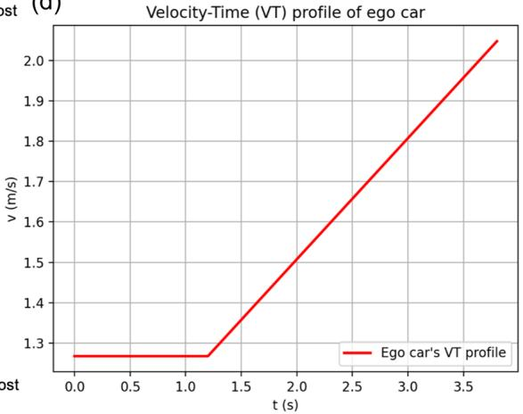

line

| t (s) | v (m/s) |
|-------|---------|
| 0.0   | 1.3     |
| 1.0   | 1.3     |
| 1.5   | 1.4     |
| 2.0   | 1.6     |
| 2.5   | 1.8     |
| 3.0   | 2.0     |
| 3.5   | 2.2     |
| 3.7   | 2.3     |

FIGURE 22 Example of optimal speed generation with dynamic obstacles' ST boundaries demonstration

# 7.2 | Trajectory optimization

As we have already mentioned, the path-speed profiles and their corresponding decisions such as nudge, stop, and yield produced by previous trajectory-based decision steps are often suboptimal and necessary for improvement. At the previous trajectory decision step, we find the path and speed only drivable and do not consider motion requirements. Therefore, we postprocess the solution of the trajectory-based decision by the following optimization procedure (Fan et al., 2018). The procedure consists of the path and speed optimization by a novel fourth-order discretized QP. This optimization essentially refines the trajectory to improve the smoothness.

# 7.2.1 | Path optimization

In this article, our optimization approach is conceptually similar to the motion planner by Baidu Apollo (Baidu Apollo Team, 2017; Fan et al., 2018). The path optimization produced by the fourth-order discretized QP is a refinement of the previous coarse path by a trajectory-based decision step. Compared with the QP approach, the discretized QP approach can generate a much smoother path which are minimizing an objective function with vehicle initial conditions and various linearized constraints. The schematic diagram is shown in Figure 23.

Without loss of generality, in the Frenet frame, we consider an objective function that can be designed as a linear combination of smoothness cost and guidance line tracking error cost. By design, it can minimize and compromise the lateral deviation from guidance line, lateral speed, lateral acceleration, and lateral jerk. Thus, mathematically, the objective function can be formulated as an optimization problem,

$$
\begin{array}{l} \min _ {\mathcal {L} _ {i} \in \Re^ {5}} J (\mathcal {L} _ {i}), \quad \text { where } \\ J (\mathcal {L} _ {i}) \triangleq \sum_ {i = 0} ^ {N} w _ {0} (I _ {\mathrm{opt}, i} - I _ {\mathrm{d}, i}) ^ {2} + w _ {1} (I _ {\mathrm{opt}, i} ^ {(1)}) ^ {2} + w _ {2} (I _ {\mathrm{opt}, i} ^ {(2)}) ^ {2} + w _ {3} (I _ {\mathrm{opt}, i} ^ {(3)}) ^ {2} \\ + w _ {4} \left(I _ {\text { opt }, i} ^ {(4)}\right) ^ {2}, \tag {28} \\ \end{array}
$$

where

$$
\mathcal {L} _ {i} = \left[ I _ {\text { opt }, i} \quad I _ {\text { opt }, i} ^ {(1)} \quad I _ {\text { opt }, i} ^ {(2)} \quad I _ {\text { opt }, i} ^ {(3)} \quad I _ {\text { opt }, i} ^ {(4)} \right] ^ {T}. \tag {29}
$$

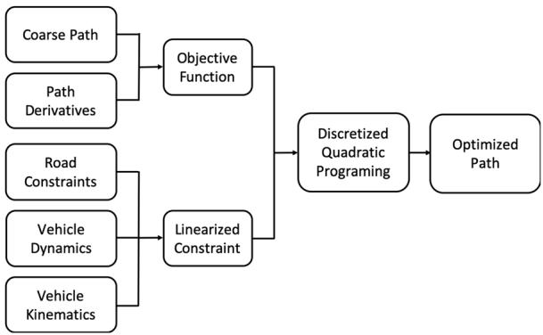

flowchart

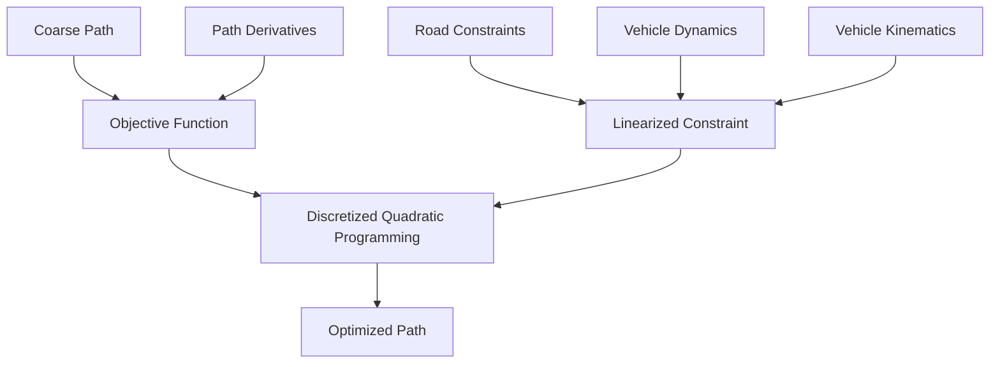
```mermaid
graph TD
    A["Coarse Path"] --> C["Objective Function"]
    B["Path Derivatives"] --> C
    D["Road Constraints"] --> E["Linearized Constraint"]
    F["Vehicle Dynamics"] --> E
    G["Vehicle Kinematics"] --> E
    C --> H["Discretized Quadratic Programming"]
    E --> H
    H --> I["Optimized Path"]
```

FIGURE 23 Discretized quadratic programming path optimization

Here, $L_{i}$ denotes the optimized path lateral information, including lateral displacement, lateral speed, lateral acceleration, lateral jerk, and the derivative of a lateral jerk. In Equation (28), $I_{opt,i}$ is the optimized path lateral displacement, and $I_{d,i}$ is the guidance line produced by the trajectory-based decision step. $(I_{\mathrm{opt},i} - I_{\mathrm{d},i})$ denotes the lateral deviation between the optimized path and the preproduced guidance line, and $\left(I_{\mathrm{opt},i}^{(1)}, I_{\mathrm{opt},i}^{(2)}, I_{\mathrm{opt},i}^{(3)}, I_{\mathrm{opt},i}^{(4)}\right)$ denotes the first derivative to the fourth derivative of lateral displacement which are introduced to get smooth function, and $w_{i}$ for i = 0, 1, 2, 3, 4 are the weightings.

We derive and expand the optimization problem in Equation (28), and prove the objective function $J(\mathcal{L}_{i})$ has a quadratic form with respect to parameter $L_{i}$ in (29). First, using (32), we have

$$
\begin{array}{l} J (\mathcal {L}) = \sum_ {i = 0} ^ {N} \left(\sum_ {j = 0} ^ {4} w _ {j} (I _ {\mathrm{opt}, i} ^ {(j)}) ^ {2}\right) - 2 w _ {0} (I _ {\mathrm{opt}, i}) (I _ {d, i}) + w _ {0} (I _ {d, i}) ^ {2} \\ = \sum_ {i = 0} ^ {N} (\mathcal {L} _ {i} ^ {T} W _ {i} \mathcal {L} _ {i} - 2 \mathcal {L} _ {i} ^ {T} c _ {1} + c _ {2}) \tag {30} \\ = \mathbb {L} ^ {T} \mathbb {W} \mathbb {L} - 2 \mathbb {L} C _ {1} + C _ {2}, \\ \end{array}
$$

where

$$
\mathbb {L} = [ \mathcal {L} _ {0} \quad \mathcal {L} _ {1} \quad \dots \quad \mathcal {L} _ {N} ] ^ {T},
$$

$$
\mathbb {W} = \operatorname{diag} ([ W _ {0} \quad W _ {1} \quad \dots \quad W _ {N} ]), \tag {31}
$$

$$
W _ {i} = \operatorname{diag} ([ w _ {0} \quad w _ {1} \quad w _ {2} \quad w _ {3} \quad w _ {4} ]),
$$

and $C_1$ and $C_2$ are the constants. Notice here that diagonal matrix $\mathbb{W}$ is positive definite. Thus, the objective function $J(\mathcal{L})$ has a quadratic convex form with respect to parameter vector $\mathcal{L}$ from Equation (30).

The constraints in the path optimization problem consist of extrinsic constraints and intrinsic constraints. The extrinsic constraints are vehicle initial conditions, road boundary, and dynamic feasibility. In the Frenet frame, these constraints are applied on $L_{i}$ in Equation (29) for i = 0, 1, ..., N. The optimized path needs to match the vehicle's initial lateral displacement and derivatives such as $L_{0} = init$ . To apply boundary constraints, road boundary is extracted from map information. The boundary constraints at each sampling point can be described as $I_{low,i} < I_{opt,i} < I_{high,i}$ for i = 1, 2, ..., N. Additionally, the dynamic feasibility constraints related with curvature are applied to $\left(l_{\text{opt},i}^{(1)} l_{\text{opt},i}^{(2)} l_{\text{opt},i}^{(3)} l_{\text{opt},i}^{(4)}\right)$ at each sampling point for $i = 1, 2, ..., N$ . On the other hand, the intrinsic constraints are based on the discretized path derivative definition with the assumption of the derivative of a lateral jerk as a constant, namely,

$$
\mathcal {M} _ {s} \mathcal {L} = C, \tag {32}
$$

where

$$
\mathcal {M} _ {s} = \left[ \begin{array}{c c c c c} 1 & \Delta s & \frac {1}{2} \Delta s ^ {2} & \frac {1}{6} \Delta s ^ {3} & \frac {1}{2 4} \Delta s ^ {4} \\ 0 & 1 & \Delta s & \frac {1}{2} \Delta s ^ {2} & \frac {1}{6} \Delta s ^ {3} \\ 0 & 0 & 1 & \Delta s & \frac {1}{2} \Delta s ^ {2} \\ 0 & 0 & 0 & 1 & \Delta s \\ 0 & 0 & 0 & 0 & 1 \end{array} \right], \tag {33}
$$

$$
C = \left[ \begin{array}{l l l l l} 0 & 0 & 0 & 0 & c \end{array} \right] ^ {T}. \tag {34}
$$

Here, $c$ denotes a constant, which is the derivative of a lateral jerk. $\Delta s$ is the sampling interval in the path's longitudinal direction. After applying all constraints, the optimization problem's solution can be readily obtained by a QP solver.

To evaluate and demonstrate the effects of path optimization with different weightings in the cost function, the path optimization algorithm was applied to the rough path in a real last-mile vehicle's planning scenario with obstacles. For comparison, the obtained optimal path is shown in Figure 24 with a red line for $[\omega_{0}\ \omega_{1}\ \omega_{2}\ \omega_{3}] = [100\ 5\ 100\ 5]$ , and with a green line for $[\omega_{0}\ \omega_{1}\ \omega_{2}\ \omega_{3}] = [5\ 5\ 100\ 5]$ . The test results clearly demonstrate that the proposed path optimization method guaranteed smoothness across the DP-based rough path (blue line). Comparing the red path with the green path, it is evident that different weightings of path deviation and path smoothness result in different obtained optimized paths. When increasing the weighting of path deviation ( $\omega_{0}$ ), the optimized path tends to be closed with DP rough path and ignores the path smoothness. Whereas, when decreasing the weighting of path deviation ( $\omega_{0}$ ), the optimized path considers path smoothness more. The optimized path in the green line was used in real applications.

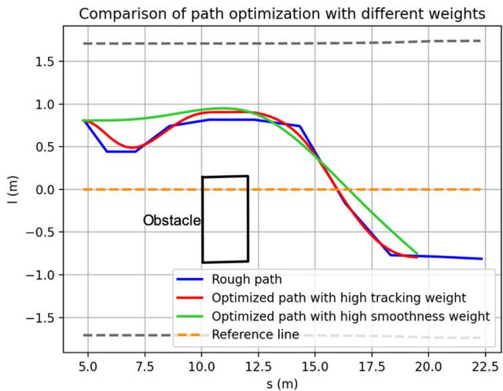

line

| s (m) | Rough path | Optimized path with high tracking weight | Optimized path with high smoothness weight |
|-------|------------|------------------------------------------|---------------------------------------------|
| 5.0   | 0.8        | 0.8                                      | 0.8                                         |
| 7.5   | 0.4        | 0.5                                      | 0.8                                         |
| 10.0  | 0.8        | 0.9                                      | 1.0                                         |
| 12.5  | 0.8        | 0.9                                      | 1.0                                         |
| 15.0  | 0.8        | 0.8                                      | 0.8                                         |
| 17.5  | -0.8       | -0.6                                     | -0.4                                        |
| 20.0  | -1.0       | -0.8                                     | -0.8                                        |
| 22.5  | -1.0       | -1.0                                     | -1.0                                        |

FIGURE 24 Example of optimal path generation with different weighting functions

# 7.2.2 | Speed optimization

Similar to the path optimization in Section 7.2.1, the speed profile by trajectory-based decision step cannot satisfy dynamic feasibility and various constraints, so the fourth-order discretized QP algorithm is also used here to optimize the rough speed profile. The schematic diagram is shown in Figure 25.

The derivation follows in Section 7.2.1 by establishing the relationship that path's longitudinal station information S at any sampling time $t_{i}$ . Similarly, an objective function for speed optimization can be designed as follows:

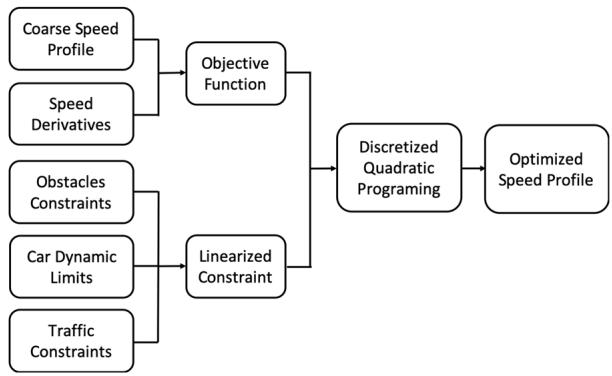

flowchart

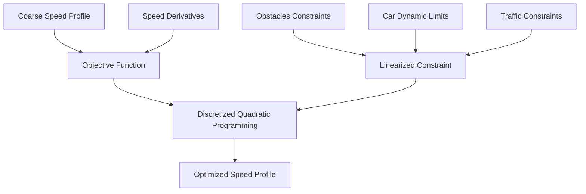
```mermaid
graph TD
    A["Coarse Speed Profile"] --> C["Objective Function"]
    B["Speed Derivatives"] --> C
    D["Obstacles Constraints"] --> E["Linearized Constraint"]
    F["Car Dynamic Limits"] --> E
    G["Traffic Constraints"] --> E
    C --> H["Discretized Quadratic Programming"]
    E --> H
    H --> I["Optimized Speed Profile"]
```

FIGURE 25 Discretized quadratic programming speed optimization

$$
\min _ {S _ {i} \in \mathfrak {R} ^ {5}} J (S _ {i}), \text {   where   }
$$

$$
\begin{array}{l} J (\mathcal {S} _ {i}) \triangleq \sum_ {i = 0} ^ {N} w _ {0} (s _ {\mathrm{opt}, i} - s _ {\mathrm{d}, i}) ^ {2} + w _ {1} (s _ {\mathrm{opt}, i} ^ {(1)}) ^ {2} + w _ {2} (s _ {\mathrm{opt}, i} ^ {(2)}) ^ {2} \\ + w _ {3} \left(s _ {\text { opt }, i} ^ {(3)}\right) ^ {2} + w _ {4} \left(s _ {\text { opt }, i} ^ {(4)}\right) ^ {2}, \tag {35} \\ \end{array}
$$

where

$$
\mathcal {S} _ {i} = \left[ s _ {\text { opt }, i} \quad s _ {\text { opt }, i} ^ {(1)} \quad s _ {\text { opt }, i} ^ {(2)} \quad s _ {\text { opt }, i} ^ {(3)} \quad s _ {\text { opt }, i} ^ {(4)} \right] ^ {T}. \tag {36}
$$

Here, the vector $S_{i}$ includes the optimized longitudinal station, speed, acceleration, jerk, and the derivative of jerk. Similar to Equation (28).

In Equation (35), the $s_{d,i}$ is the guidance speed profile produced by the trajectory-based decision step. $(s_{\mathrm{opt},i}-s_{\mathrm{d},i})$ denotes the distance between the optimized path and the preproduced guidance speed profile, and $(s_{\mathrm{opt},i},s_{\mathrm{opt},i}^{(1)},s_{\mathrm{opt},i}^{(2)},s_{\mathrm{opt},i}^{(3)},s_{\mathrm{opt},i}^{(4)})$ denotes the optimized path longitudinal station and the first derivative to the fourth derivative of the longitudinal station which is introduced to get smooth function, and $w_{i}$ for i=0,1,2,3,4 are the weights.

By expanding by Equation (35), the speed optimization problem can be converted to the matrix form as

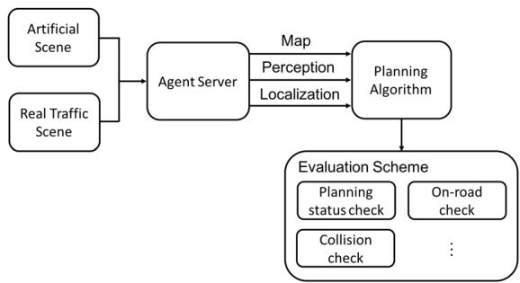

flowchart

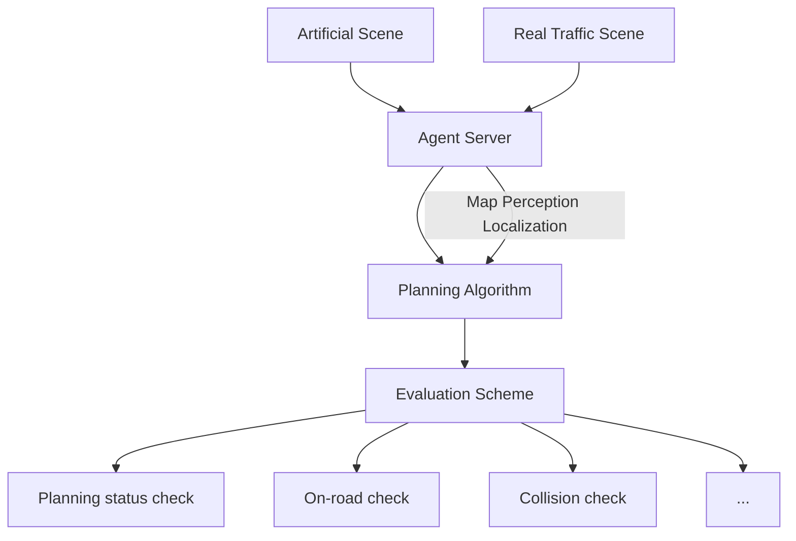
```mermaid
graph TD
    A["Artificial Scene"] --> C["Agent Server"]
    B["Real Traffic Scene"] --> C
    C --> D["Planning Algorithm"]
    D --> E["Evaluation Scheme"]
    E --> F["Planning status check"]
    E --> G["On-road check"]
    E --> H["Collision check"]
    E --> I["..."]
    C -->|Map Perception Localization| D
```

FIGURE 27 Flowchart of simulation platform

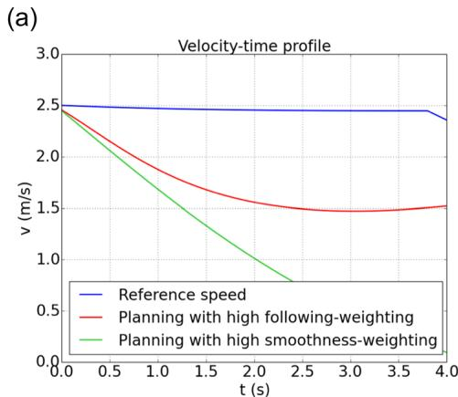

line

| t (s) | Reference speed | Planning with high following-weighting | Planning with high smoothness-weighting |
|-------|-----------------|----------------------------------------|------------------------------------------|
| 0.0   | 2.5             | 2.5                                    | 2.5                                      |
| 1.0   | 2.45            | 1.8                                    | 1.6                                      |
| 2.0   | 2.4             | 1.5                                    | 1.0                                      |
| 3.0   | 2.4             | 1.45                                   | 0.7                                      |
| 4.0   | 2.35            | 1.5                                    | 0.7                                      |

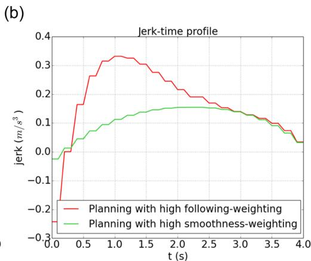

line

| t (s) | Planning with high following-weighting | Planning with high smoothness-weighting |
|-------|----------------------------------------|------------------------------------------|
| 0.0   | -0.2                                   | -0.05                                    |
| 0.5   | 0.15                                   | 0.05                                     |
| 1.0   | 0.32                                   | 0.1                                      |
| 1.5   | 0.3                                    | 0.12                                     |
| 2.0   | 0.2                                    | 0.14                                     |
| 2.5   | 0.15                                   | 0.14                                     |
| 3.0   | 0.1                                    | 0.12                                     |
| 3.5   | 0.05                                   | 0.08                                     |
| 4.0   | 0.0                                    | 0.0                                      |

FIGURE 26 Example of optimal velocity and jerk generation with different weighting functions: (a) the optimized velocity profile with different weightings, and (b) the optimized jerk profile with different weightings, respectively.

TABLE 2 Evaluation criterion summary 

<table><tr><td>Planning</td><td>Perception</td><td>Prediction</td><td>Localization</td><td>Simulation</td></tr><tr><td>Planning status evaluation</td><td>Perception status evaluation</td><td>Prediction completeness evaluation</td><td>Localization results consistency evaluation</td><td>Simulation completeness evaluation</td></tr><tr><td>Destination approaching evaluation</td><td>Perception-vision precision evaluation</td><td>Prediction precision evaluation</td><td>⋮</td><td>Time duration and mileage evaluation</td></tr><tr><td>Vehicle on-road evaluation</td><td>Perception-bird-eye-view precision evaluation</td><td>⋮</td><td></td><td>Simulation execution core evaluation</td></tr><tr><td>Collision evaluation</td><td>Perception-track precision evaluation</td><td></td><td></td><td>⋮</td></tr><tr><td>Obstacle avoidance evaluation</td><td>Traffic lights status evaluation</td><td></td><td></td><td></td></tr><tr><td>Open space planning status evaluation</td><td>Traffic lights duration evaluation</td><td></td><td></td><td></td></tr><tr><td>⋮</td><td>⋮</td><td></td><td></td><td></td></tr></table>

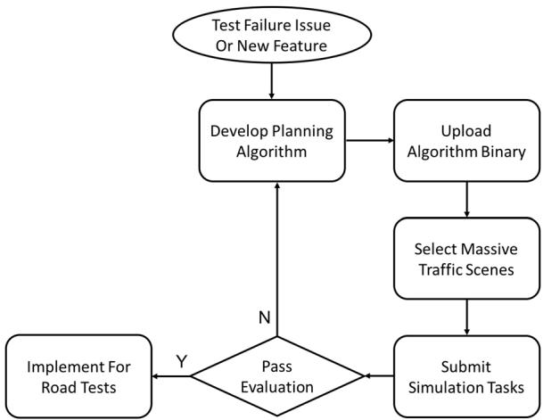

flowchart

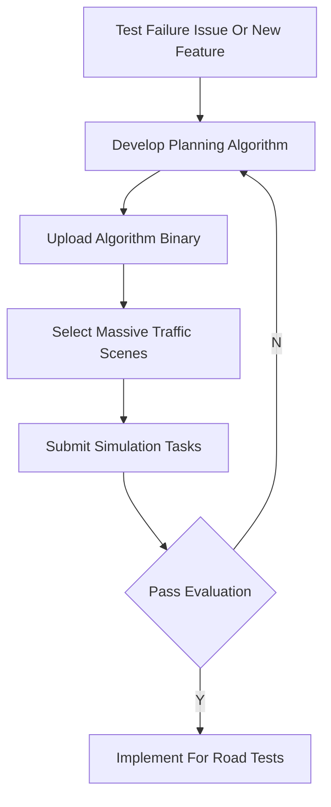
```mermaid
graph TD
    A["Test Failure Issue Or New Feature"] --> B["Develop Planning Algorithm"]
    B --> C["Upload Algorithm Binary"]
    C --> D["Select Massive Traffic Scenes"]
    D --> E["Submit Simulation Tasks"]
    E --> F{Pass Evaluation}
    F -->|Y| G["Implement For Road Tests"]
    F -->|N| B
```

FIGURE 28 Flowchart of algorithm development by simulation

$$
\begin{array}{l} J (\mathcal {S}) = \sum_ {i = 0} ^ {N} \left(\sum_ {j = 0} ^ {4} w _ {j} (s _ {\mathrm{opt}, i} ^ {(j)}) ^ {2}\right) - 2 w _ {0} (s _ {\mathrm{opt}, i}) (s _ {\mathrm{d}, i}) + w _ {0} (s _ {\mathrm{d}, i}) ^ {2} \\ = \sum_ {i = 0} ^ {N} (S _ {i} ^ {T} W _ {i} S _ {i} - 2 S _ {i} ^ {T} c _ {1} + c _ {2}) \tag {37} \\ = \mathbb {S} ^ {T} \mathbb {W} \mathbb {S} - 2 \mathbb {S} C _ {1} + C _ {2}, \\ \end{array}
$$

where

$$
\mathbb {S} = \left[ \begin{array}{c c c c} \mathcal {S} _ {0} & \mathcal {S} _ {1} & \dots & \mathcal {S} _ {N} \end{array} \right] ^ {T} \tag {38}
$$

and the definitions of W, $W_{i}$ , $C_{1}$ , $C_{2}$ are the same as before.

By Equation (37), we have proved that the objective function $J(S)$ has a quadratic convex form with respect to the parameter vector S.

To solve the optimal speed, the appropriate constraints need to be applied to $S_{t_{i}}$ in Equation (36) in $\{t_{i}|i=1,2,\ldots,N\}$ . The same as the path optimization problem, the initial condition constraint needs to be matched on ego car as $S_{t_{i}}=init$ for i=0. In addition to initial condition constraint, monotonic constraint, longitudinal

displacement, speed, acceleration, and jerk constraints are depicted as

$$
s _ {\mathrm{opt}, t _ {i}} <   s _ {\mathrm{opt}, t _ {i + 1}},
$$

$$
\mathcal {S} _ {\text { lower }} <   \mathcal {S} _ {i} <   \mathcal {S} _ {\text { upper }}.
$$

Similarly, considering the derivative definition and the assumption of the derivative of a longitudinal jerk as a constant, we have the intrinsic constraints as

$$
\mathcal {M} _ {t} \mathcal {S} = C, \tag {39}
$$

where

$$
\mathcal {M} _ {t} = \left[ \begin{array}{c c c c c} 1 & \Delta t & \frac {1}{2} \Delta t ^ {2} & \frac {1}{6} \Delta t ^ {3} & \frac {1}{2 4} \Delta t ^ {4} \\ 0 & 1 & \Delta t & \frac {1}{2} \Delta t ^ {2} & \frac {1}{6} \Delta t ^ {3} \\ 0 & 0 & 1 & \Delta t & \frac {1}{2} \Delta t ^ {2} \\ 0 & 0 & 0 & 1 & \Delta t \\ 0 & 0 & 0 & 0 & 1 \end{array} \right], \tag {40}
$$

$$
C = \left[ \begin{array}{l l l l l} 0 & 0 & 0 & 0 & c \end{array} \right] ^ {T}. \tag {41}
$$

Here, c denotes a constant, which is the derivative of a longitudinal jerk. $\Delta t$ is the sampling time in trajectory.

Similar to the evaluation of path optimization with different weightings in Section 7.2.1, the effect of the different weighting functions on the speed optimization performance is also evident from the test results. The test scenario is a decelerating process when the ego car failed to avoid an obstacle. As shown in Figure 26, we compared speed planning performance with a high-speed following weighting and a high-speed smoothness weighting. In Figure 26a, we can see the planned speed tried to be closed with reference speed for high-speed following weighting. In Figure 26b, however, the jerk profile was oscillating under the same high-speed following weighting, which means the speed smoothness cannot be maintained throughout the entire speed planning course. Whereas, the jerk profile (green line) became smooth when increasing the number of speed smoothness weightings. Therefore, the optimized speed profile in the green line was used in real applications for smoothness.

FIGURE 29 Simulation case number statistics from recent 1-month data   
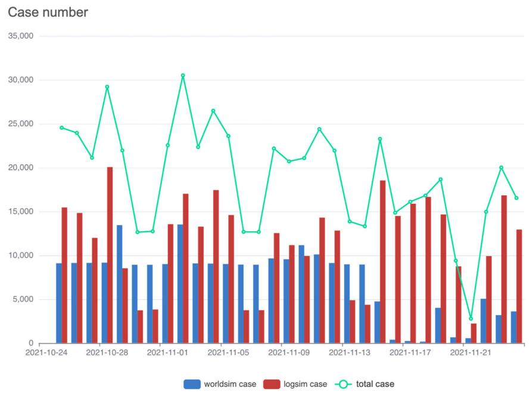

bar_line

Case number
| Date | worldsim case | logsim case | total case |
|---|---|---|---|
| 2021-10-24 | 9000 | 15300 | 24600 |
| 2021-10-25 | 9000 | 14700 | 24000 |
| 2021-10-26 | 9000 | 11800 | 21100 |
| 2021-10-27 | 9000 | 20000 | 29300 |
| 2021-10-28 | 13300 | 8400 | 21900 |
| 2021-11-01 | 8800 | 3800 | 12700 |
| 2021-11-02 | 8800 | 3800 | 12700 |
| 2021-11-03 | 8800 | 13400 | 22500 |
| 2021-11-04 | 9000 | 16900 | 30600 |
| 2021-11-05 | 8900 | 13300 | 22400 |
| 2021-11-06 | 8900 | 17400 | 26500 |
| 2021-11-07 | 8800 | 14500 | 23600 |
| 2021-11-08 | 8800 | 3700 | 12700 |
| 2021-11-09 | 9500 | 3600 | 12700 |
| 2021-11-10 | 9500 | 12500 | 22300 |
| 2021-11-11 | 9500 | 11100 | 20700 |
| 2021-11-12 | 9500 | 9900 | 21100 |
| 2021-11-13 | 8900 | 4955 | 24455 |
| 2021-11-14 | 8900 | 4455 | 21955 |
| 2021-11-15 | 8900 | 4455 | 13755 |
| 2021-11-16 | 8900 | 4455 | 13455 |
| 2021-11-17 | 4555 | 8755 | 23355 |
| 2021-11-18 | 3555 | 4455 | 14955 |
| 2021-11-19 | 3555 | 4455 | 15955 |
| 2021-11-20 | 3555 | 8755 | 16755 |
| 2021-11-21 | 6555 | 3755 | 9355 |
| 2021-11-22 | 3355 | 9955 | 2475 |
| 2021-11-23 | 3355 | 6755 | 6755 |
| 2021-11-24 | 3355 | 6755 | 6755 |
The data is already in CSV format with the original table as it was extracted from the image. The actual data is presented in a long format with columns for each date and case number. There is no additional data series or categories present in the image.

FIGURE 30 Motion planning daily simulation's pass rate from recent 1-month data   
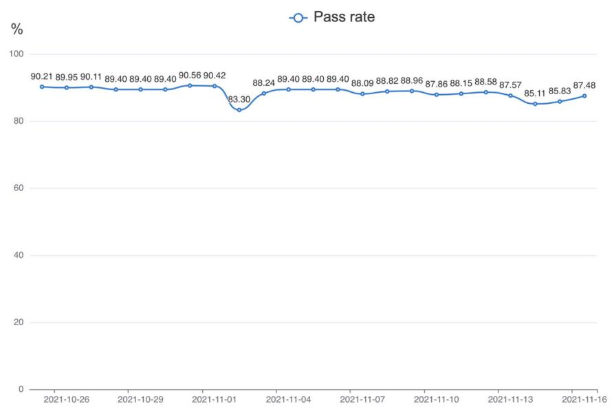

line

| Date | Pass rate (%) |
|---|---|
| 2021-10-26 | 90.21 |
| 2021-10-27 | 89.95 |
| 2021-10-28 | 90.11 |
| 2021-10-29 | 89.40 |
| 2021-10-30 | 89.40 |
| 2021-10-31 | 89.40 |
| 2021-11-01 | 90.56 |
| 2021-11-02 | 90.42 |
| 2021-11-03 | 83.30 |
| 2021-11-04 | 88.24 |
| 2021-11-05 | 89.40 |
| 2021-11-06 | 89.40 |
| 2021-11-07 | 89.40 |
| 2021-11-08 | 88.09 |
| 2021-11-09 | 88.82 |
| 2021-11-10 | 88.96 |
| 2021-11-11 | 87.86 |
| 2021-11-12 | 88.15 |
| 2021-11-13 | 88.58 |
| 2021-11-14 | 87.57 |
| 2021-11-15 | 85.11 |
| 2021-11-16 | 85.83 |
| 2021-11-17 | 87.48 |

# 8 | SIMULATION PLATFORM

For validation purpose, the most authoritative way to evaluate the performance of the motion planning algorithm in autonomous driving is road tests. However, road tests have some challenges in reality, such as test site limitation, test condition repeatability, time consumption, and high cost. To address these limitations, we developed a simulation platform to realistically simulate and visualize typical driving behaviors of autonomous vehicles with both real traffic scene and artificial scene data. By applying the simulation platform, the algorithm development has been expedited and planning performance has been improved.

# 8.1 | Simulation platform architecture

The simulation platform is designed to mimic the real implementation environment. The framework diagram is shown in Figure 27. From the flowchart, we can see the simulation data source is mainly from the real traffic scene of road tests.

TABLE 3 Operating data for different cities 

<table><tr><td>Cities</td><td>Delivery station</td><td>Mileage (km)</td><td>Running times</td><td>Delivery orders</td><td>Completed orders</td></tr><tr><td rowspan="4">Beijing</td><td></td><td>17,847.40</td><td>5428</td><td>55,488</td><td>44,482</td></tr><tr><td>Beijing Mulin Business Department</td><td>3266.65</td><td>576</td><td>6193</td><td>4714</td></tr><tr><td>JD Pai (Beijing Wuzi University)</td><td>7714.78</td><td>3382</td><td>39,352</td><td>32,125</td></tr><tr><td>7FRESH Business Department in Beijing JD Building</td><td>6865.97</td><td>1470</td><td>9943</td><td>7643</td></tr><tr><td rowspan="2">Guangzhou</td><td></td><td>4355.90</td><td>835</td><td>9866</td><td>7934</td></tr><tr><td>JD Pai (Research Institute of Guangzhou University)</td><td>4355.90</td><td>835</td><td>9866</td><td>7934</td></tr><tr><td rowspan="5">Suzhou</td><td></td><td>81,516.20</td><td>15,298</td><td>266,771</td><td>228,129</td></tr><tr><td>Suzhou Likou Business Department</td><td>27,835.40</td><td>4183</td><td>71,358</td><td>58,413</td></tr><tr><td>Changsu Southeast Business Department</td><td>42,337.63</td><td>8729</td><td>142,275</td><td>118,444</td></tr><tr><td>Changsu Zhenmen Business Department</td><td>10,873.34</td><td>2187</td><td>55,413</td><td>44,763</td></tr><tr><td>JD Pai (Changshu Institute of Technology in East Lake)</td><td>469.83</td><td>199</td><td>8375</td><td>6509</td></tr><tr><td rowspan="2">Xianyang</td><td></td><td>5239.54</td><td>1245</td><td>10,624</td><td>8208</td></tr><tr><td>JD Pai (Shanxi International Business College)</td><td>5239.54</td><td>1245</td><td>15,624</td><td>11,208</td></tr><tr><td rowspan="2">Xi&#x27;an</td><td></td><td>6318.18</td><td>1832</td><td>5964</td><td>4799</td></tr><tr><td>Xi&#x27;an Feitian Business Department</td><td>6318.18</td><td>1832</td><td>5964</td><td>4799</td></tr><tr><td rowspan="2">Wuhan</td><td></td><td>198.13</td><td>136</td><td>2161</td><td>1653</td></tr><tr><td>JD Pai (College of Arts and Sciences, Wuhan University)</td><td>198.13</td><td>136</td><td>2161</td><td>1653</td></tr><tr><td>Total</td><td></td><td>115,475.35</td><td>24,774</td><td>350,574</td><td>295,205</td></tr></table>

Additionally, the artificial scene data are significantly complementary if real tests data do not cover all traffic scenes. When data get ready, the agent server module will reconstruct the traffic scene based on input data to generate localization and perception information including vehicle states, dynamic obstacles track, objects detection, traffic lights detection, and so forth. These generated data, as well as map information, are applied to the motion planning component to produce corresponding behavior decision and motion planning. Finally, based on the planning results, the evaluation module can assess the new algorithm's performance by predefined planning criterion.

The evaluation module is the most important part of the simulation platform, because it provides good quality control for novel autonomous driving algorithm development before implementing the real road tests. The common evaluation criterion mainly includes planning and control, perception, predication, localization, and so forth, as shown in Table 2. Taking planning and control evaluations as examples, a planning status check evaluates the feasibility of speed and acceleration from the planned trajectory; a collision check evaluates if the ego car along with the planned trajectory collides with perceived obstacles; on-road check evaluates if the planning results go beyond the road boundaries. By using the evaluation module, we can evaluate planning performance readily, sequentially, and expedite the planning algorithm development.

# 8.2 | Algorithm development by simulation

To expedite new planning algorithm development in autonomous driving, the proposed simulation platform takes great importance. The flowchart of simulation-assisted algorithm development is shown in Figure 28. When the updated planning algorithm induced by new features or existing issues needs to be validated, we can validate the algorithm in the proposed simulation platform before implementing it on a large number of vehicles for real road tests. It will dramatically improve the efficacy of algorithm development. In Figure 28, after updating the new planning algorithm, we compile the program and upload the corresponding binary into the simulation platform. Then, we can select thousands of standard scenario sets and submit simulation tasks. Especially, we constructed a library including tens thousands of real traffic scenes and artificial traffic scenes in prior. The library is trying to cover real application scenarios as many as possible. Finally, the evaluation scheme will validate the proposed algorithm's feasibility and accuracy. If the success rate of evaluation is reduced, then we continue to improve the algorithm. Otherwise, the proposed algorithm is ready for real road tests.

Figure 29 demonstrated the statistic analysis of simulation case volume for our autonomous driving system at recent 1 month. The blue bar chart denotes the daily simulation by artificial scene, the red bar chart denotes the daily simulation by real traffic scene, and the green line is the total number of the simulation case. On the basis of a large amount of simulation cases, we can see our autonomous driving algorithm is validated by tens of thousands of simulation cases everyday. Such big simulation data analysis can efficiently evaluate and validate our algorithm and systems, so that dramatically improve autonomous driving performance. Similarly, the daily simulation results for the recent 1 month for the motion planning component are summarized in Figure 30. The daily motion planning simulation set comprises over 1000 real traffic scene cases, which still increase along with more real delivery operations. So, it is the reason that the pass rate fluctuates along with time. However, when the pass rate drops heavily at someday, that means a new planning algorithm commit induced a large number of failures, which real delivery operations cannot afford. For example, we can see the pass rate dropped from 90.42% to 83.30% on November 2, 2021 in Figure 30, which implies too many evaluations defined in the first column of Table 2 failed. Therefore, the comprehensive simulation validation can maintain the algorithm's performance and improve its efficiency.

FIGURE 31 Operation routes and all kinds of operation scenarios: (a) a route planning example in a monitoring system; (b) an autonomous delivery vehicle driving on cruise on-road scenario; (c) a vehicle waiting for traffic lights; (d) the left-turn scenario in an intersection, which is very different with a left turn for passenger vehicles; (e) a cross-intersection scenario with pedestrians and bicycles, which is also different with passenger vehicles; and (f) parking in a destination for delivery.   
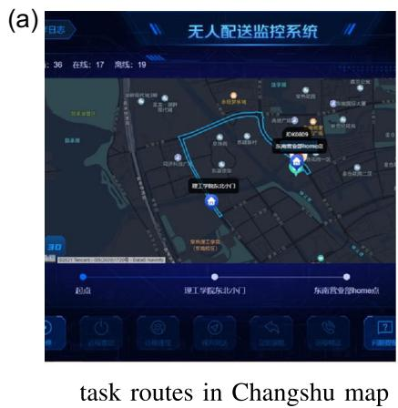

text_image

(a)
无人配送监控系统
36 在线: 17 南线: 19
起点
理工学院东北小门
东南营业部home点
task routes in Changshu map

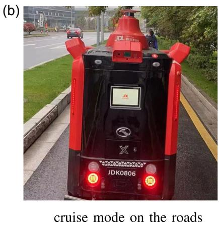

text_image

(b)
JDL
X
JDK0806
cruise mode on the roads

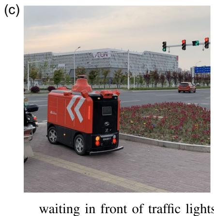

text_image

(c)
waiting in front of traffic lights

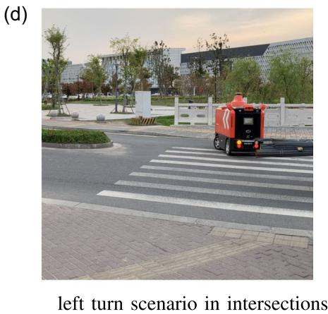

text_image

(d)
left turn scenario in intersections

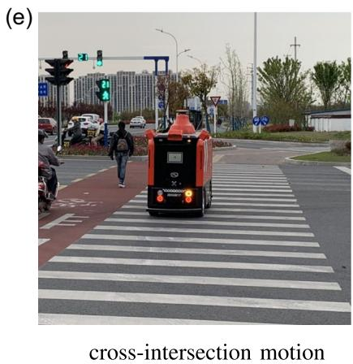

text_image

(e)
cross-intersection motion

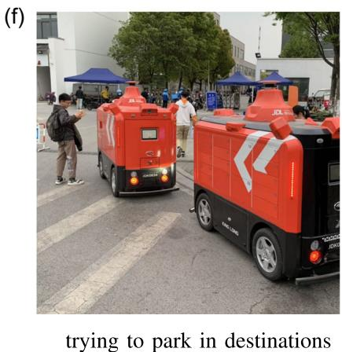

text_image

(f)
trying to park in destinations

# 9 | CASE STUDY

This section describes the real express delivery services using JD's autonomous delivery vehicles in China. A total of 192 ROVER vehicles were deployed in six different big cities in China, including Suzhou, Beijing, Wuhan, Xi'an, Xianyang, and

(a)   
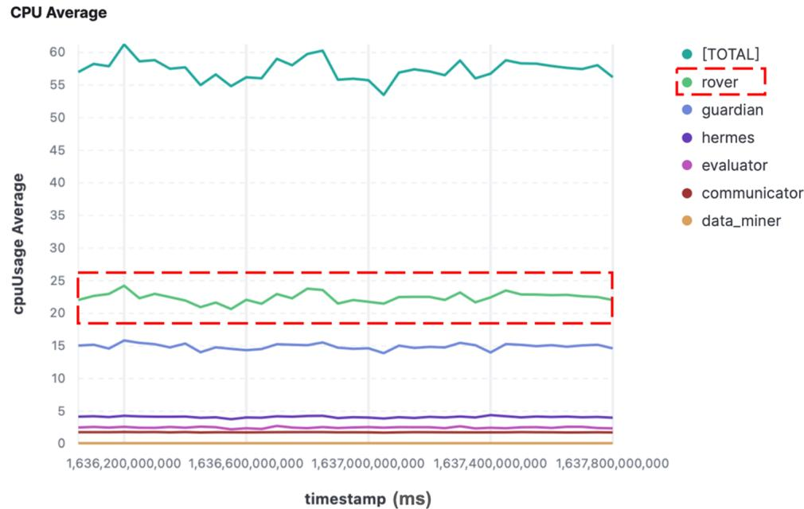

(b)   
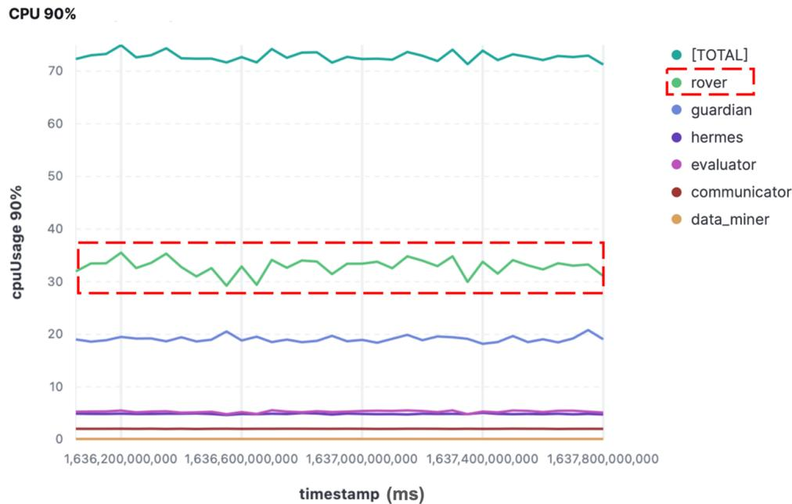

line

| timestamp (ms) | [TOTAL] | rover | guardian | hermes | evaluator | communicator | data_miner |
| -------------- | ------- | ----- | -------- | ------ | --------- | ------------ | ---------- |
| 1,636,200,000,000 | 72.0 | 34.0 | 19.0 | 5.0 | 5.0 | 2.0 | 0.0 |
| 1,636,600,000,000 | 71.0 | 33.0 | 19.5 | 5.0 | 5.0 | 2.0 | 0.0 |
| 1,637,000,000,000 | 72.0 | 34.0 | 19.0 | 5.0 | 5.0 | 2.0 | 0.0 |
| 1,637,400,000,000 | 71.0 | 33.0 | 19.5 | 5.0 | 5.0 | 2.0 | 0.0 |
| 1,637,800,000,000 | 72.0 | 34.0 | 19.0 | 5.0 | 5.0 | 2.0 | 0.0 |
| 1,638,200,000,000 | 71.5 | 33.5 | 19.5 | 5.0 | 5.0 | 2.0 | 0.0 |
| 1,638,600,000,000 | 72.5 | 34.5 | 19.5 | 5.0 | 5.0 | 2.0 | 0.0 |
| 1,639,000,000,000 | 72.5 | 34.5 | 19.5 | 5.0 | 5.0 | 2.0 | 0.0 |
| 1,639,400,000,000 | 72.5 | 34.5 | 19.5 | 5.0 | 5.0 | 2.0 | 0.0 |
| 1,640,800,000,000 | 72.5 | 34.5 | 19.5 | 5.0 | 5.0 | 2.0 | 0.0 |
| 1,641,200,000,000 | 72.5 | 34.5 | 19.5 | 5.0 | 5.0 | 2.0 | 0.0 |
| 1,641,600,000,000 | 72.5 | 34.5 | 19.5 | 5.0 | 5.0 | 2.0 | 0.0 |
| 1,642,800,000,000 | 72.5 | 34.5 | 19.5 | 5.0 | 5.0 | 2.0 | 0.0 |
| 1,643,200,000,000 | 72.5 | 34.5 | 19.5 | 5.0 | 5.0 | 2.0 | 0.0 |
| 1,643,600,888,888,888,888,888,888,888,888,888,888,888,888,888,888,888,888,888,888,888,888,888,888,888,888,888,88<ecel><ecel><ecel><ecel><ecel><ecel><ecel><ecel><nl>

FIGURE 32 CPU usage percentage comparison for different modules: (a) the CPU average usage percentage in autonomous vehicles and (b) the CPU 90% percentiles usage percentage in autonomous vehicles. CPU, central processing unit.

Guangzhou. The demonstration of our motion planning algorithm's performance is illustrated in Table 3. The statistics received from operational staff showed that the total mileage, running times, the number of departed delivery orders, and the number of arrived orders are 115,475.35 km, 24,774 times, 350,574 orders, and 295,205 orders, respectively, for operations from June 2020 to November 2021. From Table 3, the operation results demonstrated the total completion rate of delivery orders is as high as 84.21% (295,205/350,574) by using our autonomous delivery vehicles.

Most delivery operations are focused on Suzhou city. In all, 117 out of 192 ROVER vehicles were deployed in Suzhou for daily delivery, and the running mileage in Suzhou reached 81,516.20 km, accounting for 70.60% (81,516.20/115,475.65) of the total mileage. There are three main operation districts in Suzhou, which are Suzhou-Likou Business District, Changshu-Southeast Business District, and Changshu-Zhenmen Business District. The operating mileages in the above three districts are 28,567.50, 35,278.80, and 15,462.20 km, respectively. The completion rates (the number of delivery orders/the number of completed orders) in three districts are 81.86% (58,413/71,358), 83.25% (118,444/142,275), and 80.78% (44,763/55,413), respectively. Moreover, the operation routes and all kinds of operation scenarios are shown in Figure 31.

(a)   
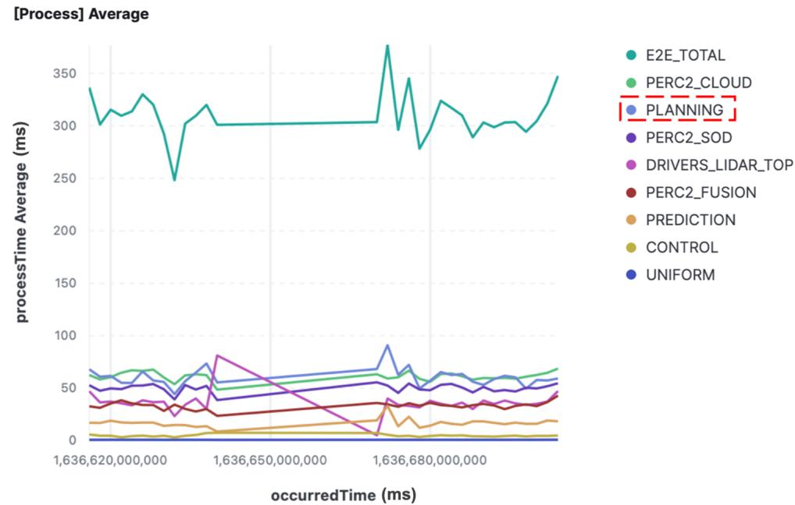

(b)   
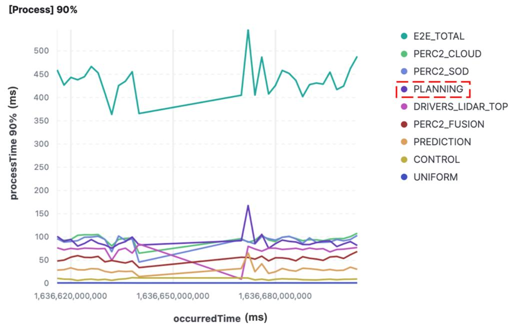  
FIGURE 33 End-to-end process time comparison for each cycle: (a) the end-to-end average process time in autonomous vehicles and (b) the end-to-end 90% percentiles process time in autonomous vehicles.

Especially, during the outbreak of Covid-19, for the purpose of contactless goods transportation, JD.com deployed two ROVER autonomous delivery vehicles in Wuhan to deliver medical supplies and living materials from JD's local distribution center to Wuhan's ninth hospital and three large communities. The total mileage, running times, the number of departed delivery orders, and the number of arrived orders are 198.13 km, 136 times, 2161 orders, and 1653 orders, respectively. The operating data demonstrated the potential ability of our method in complex urban environments.

In addition to the above real autonomous delivery completeness data, the internal program running criteria in each vehicle is also important. For example, the CPU usage percentage and the component's end-to-end process time are two critical running criteria for autonomous driving vehicles. Figure 32a shows a CPU (8-core CPU in one Xavier) average usage percentage for the total autonomous system that is only around 57%, and our core autonomous algorithms (highlighted “rover” in Figure 32), including planning, control, perception, prediction, and localization only take 22% CPU usage averagely. To eliminate the impact of the heavy outliers, we also provided a CPU 90% percentiles usage for comparison. From Figure 32b, we can see the whole system's CPU 90% percentiles usage is still below 75%, and the CPU 90% percentiles usage for the core autonomous algorithms “rover” is also as low as 35%. Moreover, the end-to-end process time in each cycle is the other important health criteria for autonomous driving systems, where “end-to-end” means a whole cycle from LIDAR sensor component to control component. As shown in Figure 33a,b, the planning component's average process time and 90% percentiles process time are around 60 and 100 ms, respectively. The end-to-end average process time and 90% percentiles process time are around 300 and 450 ms. Therefore, Figure 33 illustrated that no matter proposed motion planning architecture or the whole autonomous system, a relatively small process time can be maintained through delivery vehicles operation. In the meanwhile, to quantitatively evaluate the overall autonomous driving performance and demonstrate the algorithm's efficacy, our system counted the total emergency stop number in all of the operating delivery vehicles during recent 1-month period, as shown in Figure 34a. Moreover, by dividing by the number of delivery vehicles operating on that day, the average emergency stop count can be easily obtained in Figure 34b. Note: This emergency stop is not generated by a motion planning algorithm, but generated by an infrastructure system, so we can consider the emergency stop number as motion planning performance in real operations. In Figure 34, we can see a very low emergency stop number based on our autonomous driving algorithms can be maintained during daily operations in very complex urban environments (mostly below 10 times during 8-h operation per day). Therefore, this emergency stop evaluation demonstrated our motion planning algorithm's efficacy.

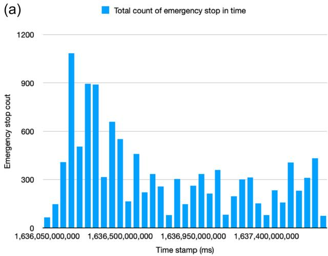

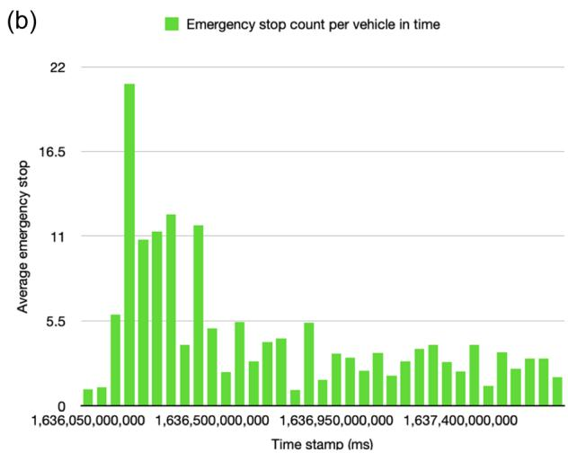

bar

| Time stamp (ms) | Average emergency stop |
| --------------- | ----------------------- |
| 1,636,050       | 1                       |
| 1,636,000       | 5                       |
| 1,636,000       | 22                      |
| 1,636,500       | 11                      |
| 1,636,500       | 12                      |
| 1,636,500       | 4                       |
| 1,636,500       | 11                      |
| 1,636,500       | 5                       |
| 1,636,500       | 2                       |
| 1,636,500       | 5                       |
| 1,636,500       | 4                       |
| 1,636,500       | 1                       |
| 1,636,950       | 5                       |
| 1,637,950       | 2                       |
| 1,637,950       | 3                       |
| 1,637,950       | 2                       |
| 1,637,950       | 3                       |
| 1,637,950       | 2                       |
| 1,637,950       | 3                       |
| 1,637,950       | 2                       |
| 1,637,950       ]<fcel>3                       |
| 1,637,950       ] | 2                       |
| 1,637,950       ] | 3                       |
| 1,637,950       ] | 2                       |
| 1,637,950       ] | 3                       |
| 1,637,950       ] | 2                       |
| 1,637,950       ] | 3                       |
| 1,637,950       ] | 2                       |
| 1,638,000       ] | 2                       |
| 1,638,000       ] | 3                       |
| 1,638,000       ] | 2                       |
| 1,638,000       ] | 3                       |
| 1,638,000       ] | 2                       |
| 1,638,000       ] | 3                       |
| 1,638,000       ] | 2                       |
| 1,638.50        ] | 2                       |
| 1,638.50        ] | 3                       |
| 1,638.50        ] | 2                       |
| 1,638.50        ] | 3                       |
| 1,638.50        ] | 2                       |
| 1,638.50        ] | 3                       |
| 1,638.50        ] | 2                       |
| 1,638.50        ] [final] | [final]                |

FIGURE 34 Emergency stop statistic data based on autonomous delivery operations during the recent 1 month: (a) the total count of emergency stop happening in all operating delivery vehicles and (b) the average emergency count per vehicle during each day period.

# 10 | CONCLUSIONS

In this article, a motion planning framework was proposed and implemented to achieve intelligent obstacle and traffic-based decision and trajectory smoothing in autonomous driving applications. A combined parallel scenarios and hierarchical tasks framework was provided to improve the efficacy of the motion planner. The proposed motion planning framework was classified as route planning, scenario planning, and trajectory planning. For route planning, both single and multiple destination-based routing algorithms were described. Then, the final smooth routing results were obtained by a nonlinear optimization method. For scenario planning, we developed various scenario-based planning strategies, according to routing and environment changes. Additionally, some new scenarios are specifically designed for last-mile delivery applications. Finally, for trajectory planning, it contains trajectory-based decision and trajectory optimization. The trajectory-based decision generated a rough path-speed profile based on the obstacles and traffic regulations. Then, the rough path-speed profile was optimized to generate a smoother trajectory that meets different constraints.

In this paper, as mentioned, we focused on motion planning for autonomous driving in practical applications. To validate motion planning algorithms readily, a simulation platform was introduced for the reliability and scalability of algorithms development. The strategy of the proposed motion planning has been effectively implemented and validated in hundreds of ROVER 5.0 delivery vehicles in China. In the road tests and large deployments, the algorithm has been evaluated and validated in more than 100,000 h and 100,000 km under various complex urban scenarios. The tests and deployments results demonstrated that using the proposed motion planning strategy, the planning effectiveness and performance can be substantially improved, even in the presence of crowded urban road conditions. Finally, the two critical program running criteria in autonomous driving applications were discussed.

# ACKNOWLEDGMENT

We would like to thank planning and control team members of autonomous driving division in JD.com for their help with implementing and testing the motion planner. We would also like to thank perception, localization, system architecture, simulation, and operation teams for their efforts related to this study. Especially, we would like to thank Xiaoyong Ma for providing daily operation data and Tao Yin for demonstration photos during operations. Finally, We also gratefully acknowledge the support of JD.com American Technologies Corporation. This study was supported by JD.com.

# DATA AVAILABILITY STATEMENT

The data that support the findings of this study are available from the corresponding author upon reasonable request.

# REFERENCES

Applegate, D.L., Bixby, R.E., Chvatal, V. & Cook, W.J. (2006) The traveling salesman problem: a computational study. Princeton, New Jersey, USA: Princeton University Press.   
Bacha, A., Bauman, C., Faruque, R., Fleming, M., Terwelp, C., Reinholtz, C., Hong, D., Wicks, A., Alberi, T. & Anderson, D. et al. (2008) Odin: team VictorTango's entry in the DARPA urban challenge. Journal of Field Robotics, 25(8), 467–492.   
Baidu Apollo Team. (2017) Apollo: open source autonomous driving. https://github.com/ApolloAuto/apollo   
Berglund, T., Brodnik, A., Jonsson, H., Staffanson, M. & Soderkvist, I. (2009) Planning smooth and obstacle-avoiding b-spline paths for autonomous mining vehicles. IEEE Transactions on Automation Science and Engineering, 7(1), 167–172.   
Brezak, M. & Petrović, I. (2013) Real-time approximation of clothoids with bounded error for path planning applications. IEEE Transactions on Robotics, 30(2), 507–515.   
Buehler, M., Iagnemma, K. & Singh, S. (2007) The 2005 DARPA grand challenge: the great robot race, vol. 36. New York City, NJ, USA: Springer.   
Buehler, M., lagnemma, K. & Singh, S. (2009) The DARPA urban challenge: autonomous vehicles in city traffic, vol. 56. New York City, NJ, USA: springer.   
Dolgov, D., Thrun, S., Montemerlo, M. & Diebel, J. (2008) Practical search techniques in path planning for autonomous driving. In: Proceedings of the First International Symposium on Search Techniques in Artificial Intelligence and Robotics (STAIR-08). Chicago, USA: AAAI.   
Fan, H., Zhu, F., Liu, C., Zhang, L., Zhuang, L., Li, D., Zhu, W., Hu, J., Li, H. & Kong, Q. (2018) Baidu apollo em motion planner. arXiv preprint arXiv:1807.08048.   
Ferguson, D., Howard, T.M. & Likhachev, M. (2008) Motion planning in urban environments. Journal of Field Robotics, 25(11–12), 939–960.   
Ferguson, D. & Stentz, A. (2007) Field D\*: an interpolation-based path planner and replanner. In: Robotics research. New York City, NJ, USA: Springer, pp. 239–253.   
Glaser, S., Vanholme, B., Mammar, S., Gruyer, D. & Nouveliere, L. (2010) Maneuver-based trajectory planning for highly autonomous vehicles on real road with traffic and driver interaction. IEEE Transactions on Intelligent Transportation Systems, 11(3), 589–606.   
González, D., Pérez, J., Milanés, V. & Nashashibi, F. (2015) A review of motion planning techniques for automated vehicles. IEEE Transactions on Intelligent Transportation Systems, 17(4), 1135–1145.

Gu, T., Atwood, J., Dong, C., Dolan, J.M. & Lee, J.-W. (2015) Tunable and stable real-time trajectory planning for urban autonomous driving. In: 2015 IEEE/RSJ international conference on intelligent robots and systems (IROS). IEEE, pp. 250–256.   
Howard, T.M. & Kelly, A. (2007) Optimal rough terrain trajectory generation for wheeled mobile robots. The International Journal of Robotics Research, 26(2), 141–166.   
Karaman, S. & Frazzoli, E. (2011) Sampling-based algorithms for optimal motion planning. The International Journal of Robotics Research, 30(7), 846–894.   
Kümmerle, R., Ruhnke, M., Steder, B., Stachniss, C. & Burgard, W. (2015) Autonomous robot navigation in highly populated pedestrian zones. Journal of Field Robotics, 32(4), 565–589.   
Li, B., Liu, S., Tang, J., Gaudiot, J.-L., Zhang, L. & Kong, Q. (2020) Autonomous last-mile delivery vehicles in complex traffic environments. Computer, 53(11), 26–35.   
McNaughton, M., Baker, C.R., Galatali, T., Salesky, B., Urmson, C. & Ziglar, J. (2008) Software infrastructure for an autonomous ground vehicle. Journal of Aerospace Computing, Information, and Communication, 5(12), 491–505.   
McNaughton, M., Urmson, C., Dolan, J.M. & Lee, J.-W. (2011) Motion planning for autonomous driving with a conformal spatiotemporal lattice. In: 2011 IEEE international conference on robotics and automation. Shanghai, China: IEEE, pp. 4889–4895.   
Paden, B., Čáp, M., Yong, S.Z., Yershov, D. & Frazzoli, E. (2016) A survey of motion planning and control techniques for self-driving urban vehicles. IEEE Transactions on Intelligent Vehicles, 1(1), 33–55.   
Rajamani, R. (2011) Vehicle dynamics and control. Berlin/Heidelberg, Germany: Springer Science & Business Media.   
Thrun, S., Montemerlo, M., Dahlkamp, H., Stavens, D., Aron, A., Diebel, J., Fong, P., Gale, J., Halpenny, M., Hoffmann, G., et al. (2006) Stanley: the robot that won the DARPA grand challenge. Journal of Field Robotics, 23(9), 661–692.   
Urmson, C., Anhalt, J., Bagnell, D., Baker, C., Bittner, R., Clark, M., Dolan, J., Duggins, D., Galatali, T., Geyer, C., et al. (2008) Autonomous driving in urban environments: boss and the urban challenge. Journal of Field Robotics, 25(8), 425–466.   
Werling, M., Ziegler, J., Kammel, S. & Thrun, S. (2010) Optimal trajectory generation for dynamic street scenarios in a Frenet frame. In: 2010 IEEE international conference on robotics and automation. Anchorage, Alaska, USA: IEEE, pp. 987–993.   
Zeng, W. & Church, R.L. (2009) Finding shortest paths on real road networks: the case for $a^{\star}$ . International Journal of Geographical Information Science, 23(4), 531–543.   
Ziegler, J., Werling, M. & Schroder, J. (2008) Navigating car-like robots in unstructured environments using an obstacle sensitive cost function. In: 2008 IEEE intelligent vehicles symposium. Eindhoven, Netherlands: IEEE, pp. 787–791.

How to cite this article: Wang, H., Zhang, L., Kong, Q., Zhu, W., Zheng, J., Zhuang, L., et al. (2022) Motion planning in complex urban environments: An industrial application on autonomous last-mile delivery vehicles. Journal of Field Robotics, 39, 1258–1285. https://doi.org/10.1002/rob.22107