

text_image

JILIN UNIVERSITY OF CHINA
1946
林大

# 吉 林 大 学

# 硕士学位论文

# （专业学位）

# 基于时空联合规划的无人车轨迹规划算法研究

# Research on Trajectory Planning Algorithm for autonomous

# Vehicles Based on Spatio-Temporal Joint Planning

作者姓 名：于越

类 别：机械

领域(方向)：车辆工程

指导教 师：卢延辉 副教授

培养单位：汽车工程学院

2024 年 5 月

# 基于时空联合规划的无人车轨迹规划算法研究

# Research on Trajectory Planning Algorithm for autonomous Vehicles Based on Spatio-Temporal Joint Planning

作 者 姓 名 ：于越

领域（方向）：车辆工程

指 导 教 师 ：卢延辉 副教授

类 别 ：机械

答 辩 日 期 ：2024 年 5 月 23 日

# 摘要

目前全球汽车行业正在经历“新四化”的改革浪潮，即智能化、电动化、网联化和共享化，其中的智能化改革被看作是解决交通拥堵、提升出行效率的关键所在。无人驾驶作为汽车智能化的核心技术，已经成为智能汽车行业发展的重点方向。无人驾驶系统一般可分为感知系统、定位系统、决策与规划系统和控制系统，其中轨迹规划技术直接决定了车辆在道路上的行驶轨迹，是自动驾驶系统中的关键部分。现阶段轨迹规划算法根据问题维度的不同可分为时空解耦式规划和时空联合规划。时空解耦式规划虽然能通过对路径规划和速度规划的解耦降低问题求解的复杂度，但解耦的求解顺序对生成轨迹的灵活性和适应性产生了极大的限制。时空联合规划虽能解决上述问题，但目前的研究往往难以平衡轨迹的求解质量和算法的实时性要求，并且缺少对结构化和非结构化场景的联合算法验证。

因此，本文将提出应用于无人车的全覆盖路径规划算法，并将建立起一套同时适用于结构化道路和非结构化区域且安全高效的时空联合规划算法框架，主要研究内容如下：

（1）非结构化场景下应用于无人车的全覆盖路径规划算法研究。算法先基于牛耕式分解法生成全覆盖路径，之后通过基于 DWA算法的路径平滑算法对全覆盖路径进行平滑处理，最终生成符合车辆运动学模型的全局路径。本部分首先对牛耕式分解法的核心步骤进行了详细介绍。接下来对基于 DWA算法的路径平滑算法的数学原理和实现细节进行了详尽地阐述。最后，构建仿真测试环境对算法进行了验证，证明了算法生成的全局路径可以有效覆盖整个地图区域并且满足平滑性的要求。  
（2）时空参考轨迹及时空安全走廊生成算法研究。本部分先根据轨迹规划算法得到时空参考轨迹，再基于时空参考轨迹生成时空安全走廊，分别作为下游时空联合轨迹优化问题的目标函数项和安全性约束项。本部分首先选择在全局路径构建的Frenet 坐标系下建立时空联合轨迹规划算法，提出了三维采样空间的构建方法，明确了对应参数值和碰撞检测模型。之后详细介绍了基于时空动态规划算法生成最优轨迹过程中评价函数和状态转移方程的数学形式，并阐明了算法的实现流程。接下来详细介绍了基于粗拓展和精拓展的两阶段时空安全走廊生成算法。最后通过仿真测试验证了算法的有效性。

（3）基于CILQR 算法的时空联合轨迹优化算法研究。本部分首先给出了一般道路下基于 CILQR 框架的时空联合轨迹优化问题的定义，之后结合上一部分得到的时空参考轨迹和时空安全走廊，为优化问题中状态量和控制量设计了目标函数和相关约束项。接下来针对 CILQR 算法求解最优轨迹的具体方法，给出了算法的整体流程图并对后向传递和前向传递两个核心步骤的数学原理和实现细节进行了详尽地阐述，最后列举出了算法推导过程中的核心参数值。  
（4）基于无人清扫车 PNC 仿真平台的多场景仿真验证。为验证本文提出的规划算法，本部分基于Ubuntu 系统和ROS1 搭建了无人清扫车PNC 仿真实验平台，并通过C++完成核心代码的编写。文中共设置三组仿真实验，实验包含了结构化和非结构化场景，场景中综合考虑了对动、静态障碍物的避障和大曲率 U-Turn 路径等工况。在分析实验数据结果和对比其他算法后，表明本文提出的时空联合轨迹规划算法框架在结构化和非结构化场景中均可以满足规划轨迹合理性、运行效率和安全性的要求，并且算法在全场景的平均耗时在 10ms 以下，具有高实时性的显著优势。

# 关键词：

无人驾驶，时空联合规划，时空安全走廊，全覆盖路径，数值优化

# ABSTRACT

Currently, the global automotive industry is undergoing a reform wave known as the "New Four Modernizations," encompassing intelligence, electrification, networking, and sharing. Among these, intelligent reform is seen as the key to addressing traffic congestion and enhancing travel efficiency. Autonomous driving, as the core technology of vehicle intelligence, has become a focal point in the development of the smart automotive industry.

The autonomous driving system can generally be divided into perception, positioning, decision-making and planning, and control systems. Among them, trajectory planning technology directly determines the driving trajectory of a vehicle on the road, serving as a critical component in the autonomous driving system.

Currently, trajectory planning algorithms can be categorized into two main types: temporal-spatial decoupling planning and temporal-spatial joint planning, based on the dimensionality of the problem. Spatial-temporal decoupling planning reduces the complexity of problem-solving by decoupling path planning and speed planning, but the decoupling sequence greatly limits the flexibility and adaptability of the generated trajectory. Spatial-temporal joint planning addresses these issues, but current research often struggles to balance the quality of trajectory solutions with the real-time requirements of the algorithm, and lacks joint algorithm verification for structured and unstructured scenes.

Therefore, this article proposes a comprehensive coverage path planning algorithm for autonomous vehicles and establishes a framework for spatial-temporal joint planning that is both suitable for structured roads and unstructured areas, ensuring both safety and efficiency. The main research contents are as follows:

(1) Research on comprehensive coverage path planning algorithms for autonomous vehicles in unstructured scenarios. The algorithm first generates a comprehensive coverage path based on the boustrophedon cellular decomposition method. Subsequently, it smooths the comprehensive coverage path using a path smoothing algorithm based on the DWA algorithm to produce a global path that aligns with the vehicle's kinematic model. This section provides a detailed introduction to the core steps of the boustrophedon cellular decomposition method, followed by an extensive explanation of the mathematical principles and implementation details of the path smoothing algorithm based on the DWA algorithm. Finally, a simulation test environment is constructed to validate the algorithm, demonstrating that the generated global path effectively covers the entire map area and meets smoothness requirements.

(2) Research on the generation of spatial-temporal reference trajectories and spatialtemporal safety corridors. This section first obtains a spatial- temporal reference trajectory based on the trajectory planning algorithm, and then generates a spatial- temporal safety corridor based on the reference trajectory, serving as the target and safety constraint for downstream spatial- temporal joint trajectory optimization problems. Initially, the trajectory planning problem is established in the Frenet coordinate system constructed from the global path, introducing the construction method of a three-dimensional sampling space and clarifying the corresponding parameter values and collision detection models. Subsequently, the mathematical forms of the evaluation function and state transition equation in the process of generating the optimal trajectory based on the spatial- temporal dynamic programming algorithm are detailed, along with the implementation process of the algorithm. Furthermore, a two-stage spatial- temporal safety corridor generation algorithm based on rough and fine expansion is introduced. Finally, the effectiveness of the algorithm is verified through simulation tests.

(3) Research on spatial- temporal joint trajectory optimization algorithms based on the CILQR algorithm. This section begins by defining the spatial- temporal joint trajectory optimization problem under general road conditions based on the CILQR framework. Utilizing the spatial- temporal reference trajectory and safety corridor obtained in the previous section, the objective function and relevant constraints for the state and control variables in the optimization problem are designed. Subsequently, the overall flowchart of the CILQR algorithm for solving the optimal trajectory is presented, with detailed explanations of the mathematical principles and implementation details of the backward pass and forward pass, the two core steps. Finally, the key parameter values in the algorithm derivation process are listed.

(4) Multi-scenario simulation verification based on the RoboSweeper PNC simulation platform. To validate the proposed planning algorithm, this section establishes a simulation experimental platform for RoboSweeper PNC based on the Ubuntu system and ROS1, with core code written in C++. Three sets of simulation experiments are conducted, encompassing both structured and unstructured scenarios, with comprehensive consideration of obstacle avoidance for dynamic and static obstacles, as well as high-curvature U-Turn paths. After analyzing the experimental data results and comparing them with other algorithms, it is demonstrated that the proposed spatial-temporal joint trajectory planning algorithm framework can meet the requirements of trajectory rationality, operational efficiency, and safety in both structured and unstructured scenarios. Additionally, the average time consumption of the algorithm is below 10ms, exhibiting significant advantages in real-time performance.

# Key words:

Autonomous driving, Spatio-temporal joint planning, Spatio-temporal safe corridor, Full coverage path, Numerical optimization

# 目 录

# 第1 章 绪论..

1.1 研究背景及意义.  
1.2 自动驾驶车辆研究现状..

1.2.1 自动驾驶车辆国外研究现状. 2

1.2.2 自动驾驶车辆国内研究现状. 3

1.3 自动驾驶规划算法研究现状

1.3.1 非结构化场景全局路径规划研究现状 4  
1.3.2 轨迹规划研究现状. .10

1.4 本文主要研究内容. .14

# 第2 章 非结构化场景全覆盖路径规划算法研究. 17

2.1 引言.. .17  
2.2 基于牛耕法的全覆盖路径规划算法 17

2.2.1 基于扫描线法的区域分解. 17  
2.2.2 子区域的覆盖路径生成和遍历顺序求解 18  
2.2.3 子区域间衔接路径规划算法. .20

2.3 基于 DWA 算法的路径平滑算法 .21

2.3.1 路径平滑算法的总体流程. .21  
2.3.2 速度空间采样及采样轨迹生成. .22  
2.3.3 轨迹评价函数设计. .23

2.4 算法验证分析.. .24  
2.5 本章小结.. .27

# 第3 章 时空参考轨迹及时空安全走廊生成算法研究. ..29

3.1 引言.. .29  
3.2 Frenet 坐标系 .29

3.2.1 Frenet 坐标系介绍 . .29   
3.2.2 Frenet 坐标系与笛卡尔坐标系转换关系推导. .31

# 3.3 基于时空动态规划的轨迹规划算法 .34

3.3.1 三维采样空间构建. .34  
3.3.2 主车与障碍物的碰撞检测. .36  
3.3.3 基于时空动态规划的最优轨迹生成. .39

3.4 时空安全走廊生成算法. .42  
3.5 算法验证分析.. ..45  
3.6 本章小结. ..46

# 第4 章 时空联合轨迹优化算法研究. ..49

4.1 引言.. ..49  
4.2 时空联合轨迹优化问题的建立 ..49

4.2.1 CILQR 问题的定义. ..49  
4.2.2 车辆系统状态方程. .52  
4.2.3 优化目标函数设计. .53  
4.2.4 运动学约束限制.. .54  
4.2.5 安全性约束限制.. .55

4.3 基于 CILQR 算法的最优轨迹求解 .60

4.3.1 CILQR 算法整体流程.. .60   
4.3.2 后向传递过程.. ..61  
4.3.3 前向传递过程. ..64

4.4 本章小结. ..67

第5 章 无人清扫车轨迹规划算法仿真验证 .69

5.1 引言.. .69  
5.2 无人清扫车 PNC 仿真实验平台搭建. ..69  
5.3 多场景下无人清扫车仿真实验结果分析. .71

5.3.1 结构化场景仿真实验与结果分析.. .71  
5.3.2 非结构化场景仿真实验与结果分析. .78

5.4 算法规划性能对比. .82   
5.5 本章小结. .85

第6 章 总结与展望 ..87

6.1 全文总结.. .87  
6.2 研究展望. .88

参考文献.. .89

# 第 1 章 绪论

# 1.1 研究背景及意义

随着现代社会的迅猛发展，汽车产业也迎来蓬勃的发展，汽车因其方便和舒适的特点，逐渐成为人们日常出行的首选工具。根据国家公安部交通管理局的数据，截至2023 年，机动车保有量已经达到了 4.26 亿辆[1]。然而随着道路上汽车的增多，带来的环境污染、城市拥堵和交通事故等问题也日益突显。为解决上述问题，目前全球汽车行业正在经历“新四化”的改革浪潮，即智能化、电动化、网联化和共享化，新四化的趋势正在推动汽车产业的变革，带来更智能、环保和灵活的出行方式，同时也带来了许多新的商机和挑战，其中的智能化改革被看作是解决交通问题最有效的方案。无人驾驶作为汽车智能化的核心技术，近年来随着计算机科学的发展，已经成为智能汽车行业发展的重点方向。

无人驾驶技术(Autonomous Driving Technology)是一种利用先进的传感器和人工智能算法来使汽车能够实时自主感知环境、做出决策并安全驾驶的技术。它旨在实现汽车的自动化驾驶，减少或消除人类驾驶员的干预。无人驾驶系统一般可分为感知系统、定位系统、决策与规划系统和控制系统。感知系统使用激光雷达、摄像头、超声波传感器等多种传感器来获取道路、障碍物、行人和交通信号等信息，并可以对车辆和行人进行意图识别，进而预测其未来的行为。定位系统利用全球定位系统(GPS)、惯性测量单元(IMU)、地图数据和实时定位技术来实现精确定位。决策与规划系统根据感知系统和定位系统提供的数据，并结合地图信息确定全局路径，制定主车最优的驾驶策略和规划未来一定时间内符合车辆运动学约束的轨迹。控制系统通过现代控制算法将决策规划模块输出的轨迹转化为实际的车辆控制信号，控制车辆的加速、制动和转向。

无人驾驶车辆可根据作业工况的不同进行分类，如作业场景为城市道路和高速道路等结构化场景的自动驾驶乘用车，如无人出租车(RoboTaxi)和无人公交车(RoboBus)等，这类无人驾驶车辆的工作场景主要为有明确车道线的公开道路，需要在面对复杂的交通流量、交叉口、行人和其他交通参与者的情况下实时进行自动驾驶决策规划任务。近年来，随着技术的发展，无人驾驶和自动化技术在城市环卫领域同样得到了应用，无人清扫车(RoboSweeper)的快速发展有效地解决了传统环卫服务中的人工成本问题。相比于自动驾驶乘用车，无人清扫车的作业场景不仅有结构化的公开道路，还有非结构化的开放空间，如火车站站前广场和各类大型广场等区域。同时对于规划任务而言，乘用车往往是点到点任务，即从一个特定的起点到一个特定的终点的单一任务，而无人清扫车除了点到点任务外，更多的是覆盖任务，即对一个定义好的区域或区域集合进行全面覆盖的任务。点到点任务的路径规划主要考虑起点和终点之间的最短路径或最佳路径，而覆盖任务的路径规划还需要考虑起点和终点之间的路径能够高效地覆盖整个区域，同时由于路径需要覆盖整个区域，因此覆盖任务规划的路径往往存在更多的大曲率 U-Turn 场景，因此对后续轨迹规划算法的最优性和稳定性要求更高。

对于整个自动驾驶系统，轨迹规划直接决定了车辆在道路上的行驶轨迹，是自动驾驶系统中的关键部分。轨迹规划的目标是在满足车辆运动学约束、道路约束和避障约束的前提下，生成一条平滑连续的轨迹，使车辆能够按照预定的目标行驶。这需要算法能够实时地处理道路环境信息和车辆状态信息，同时还需要考虑到动、静态交通参与者的预测信息。因此设计一个同时适用于结构化道路和非结构化区域并且能够实时高效地处理动、静态障碍物和道路边界的无人车轨迹规划算法对自动驾驶发展是一个复杂且关键的任务。

# 1.2 自动驾驶车辆研究现状

# 1.2.1 自动驾驶车辆国外研究现状

自动驾驶车辆的研究在全球范围内都处于活跃状态，在国外，自动驾驶技术的研究与发展主要集中在美国、欧洲、日本以及新加坡等地。美国一直是自动驾驶技术的领头羊，如自动驾驶技术领域的领导者 Waymo 公司[2]，专注于研发自动驾驶技术，Waymo 已经在多个城市进行了自动驾驶领域的测试[3]，并在公共道路上的路测里程已经超过了 800 万英里。同时，Waymo 也在积极研发自动驾驶技术在其他领域的应用，如图1.1所示的基于无人驾驶出租车的共享汽车服务等[4]。 Cruise是一家美国自动驾驶技术开发公司[5]，已经在旧金山、底特律、凤凰城等多个城市进行了自动驾驶汽车的测试和部署，并在商业化应用方面取得了重要突破。2019年，Cruise开始在旧金山提供自动驾驶出行服务，并在 2020年推出了名为“Origin”的自动驾驶小客车，如图1.2 所示，该车型没有方向盘和踏板，专为自动驾驶设计。特斯拉作为全球新能源汽车领导品牌，其 L2 级别自动驾驶系统 Autopilot 可以控制车辆的转向、加速和制动，以及自动泊车、自动变道、自适应巡航等功能[6]，并且已经在美国等多个国家进行了广泛的测试和部署，2024年初又推送了 FSD V12全自动驾驶系统，作为第一个端到端 AI 自动驾驶系统具有良好的实车表现，引起了广泛的关注和认可。传统汽车企业梅赛德斯奔驰为在美首家获得 L3 级自动驾驶汽车运营资质的汽车制造商，在2022年和2023年期间获得美国加利福尼亚州和内华达州的使用认证，意味着车辆在其自动驾驶系统 Driver Pilot 接管期间出现任何安全问题将由企业承担责任，这一举动进一步促进了自动驾驶汽车的全面落地量产。

natural_image

White autonomous delivery van with 'WAYMO' logo driving on a city road under an overpass structure (no visible text or symbols beyond branding)

图 1.1 Waymo L4 级别无人驾驶车  

natural_image

Front view of a white autonomous delivery bus with 'cruise' branding, parked on a city street with blurred traffic and trees in the background (no readable text beyond branding)

图 1.2 Cruise 自动驾驶巴士

# 1.2.2 自动驾驶车辆国内研究现状

国内自动驾驶相关研究起步相对较晚，但近些年随着国内高校科研机构和高科技公司加大对自动驾驶领域的研究和国家政府相关政策的推动，国内自动驾驶技术发展迅速。从上世纪八十年代，国防科技大学和哈尔滨工业大学等高校科研机构首次合作研发出了无人驾驶车辆[7][8] ，标志着我国自动驾驶技术研究的开始。经过多年的发展，我国自动驾驶领域无论在技术上还是在项目落地上都取得了长足的进步。2011 年，中国一汽集团和国防科技大学基于红旗 HQ3 车型合作研发的自动驾驶汽车在高速公路上完成300km 的自动驾驶试验。百度作为中国最早一批研发 L4级别自动驾驶技术的科技公司，在 2015 年发布了 Apollo 自动驾驶软件平台，并于 2017 年在北京五环进行了自动驾驶实车测试，2018年将Apollo 平台开源，并每年对 Apollo 平台进行迭代更新，同时百度在 2021 年起发布了萝卜快跑自动驾驶出行服务平台，如图 1.3 所示，已经在北京、上海、重庆和长沙等多个城市开展自动驾驶出行服务，有力地推动了国内自动驾驶行业的发展。

除百度外，小马智行、AutoX、文远知行、滴滴等面向 L4级别的自动驾驶公司纷纷推出各自的自动驾驶落地产品，目前在北京、上海、广州、深圳等地均已上线运营。除高等级自动驾驶技术，Momenta、小鹏、华为、蔚来等公司纷纷投入到 L2 级别自动驾驶技术研究上，其中小鹏公司研发的 XNGP 无高精地图自动驾驶系统在 2024年已经覆盖 243 座城市。目前国内市场已有多款 L2++级别量产车型交付落地，得到了使用者的广泛认可，有力地推动了自动驾驶全面落地的进程。

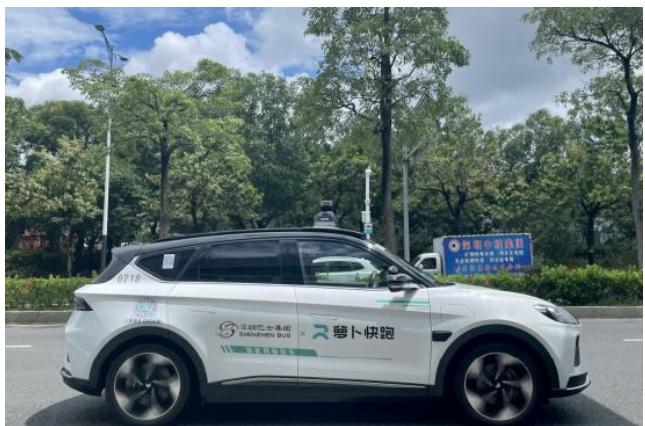

text_image

红杉艺术城
SHENZHEN BUS
萝卜快跑

图1.3 百度萝卜快跑自动驾驶出租车

# 1.3 自动驾驶规划算法研究现状

# 1.3.1 非结构化场景全局路径规划研究现状

规划算法模块是整个自动驾驶系统中的核心部分，规划算法的好坏直接影响到自动驾驶系统的安全性和乘客的舒适度。规划算法从功能上进一步细分，可分为全局路径规划算法和局部轨迹规划算法，也称运动规划算法。全局路径规划算法根据已知的地图信息为基础进行路径规划，根据不同的规划目标，寻找一条从起点到目标点的最优路径，作为后续轨迹规划算法的参考线，一般不考虑实时变化的障碍物。局部轨迹规划会根据传感器感知的障碍物信息，并结合当前自车状态信息，实时地规划出一条符合车辆运动学约束且安全舒适的轨迹。

非结构化场景，也称开放空间，指的是难以检测到明确车道线的场景，如某些园区、停车场、广场等场景。非结构化场景下全局路径规划算法根据规划任务的不同，可分为点到点路径规划(Point-to-Point Path Planning)和全覆盖路径规划(CompleteCoverage Path Planning, CCPP)。点到点路径规划的目标是找到一条从起始点（起点）到目标点（终点）的最短或可行的路径，常用的方法有基于栅格地图的图搜索法和随机采样法等。

# 1. 图搜索法

图搜索算法作为最常用的路径规划算法之一，其基本原理是将车辆所在的环境地图离散化处理为栅格地图，通过这种方式，环境被抽象为一个图数据结构，其中节点表示位置，边表示可能的移动，之后利用图论中搜索的算法遍历图中的所有节点和边，根据一定的搜索策略和评估函数来逐步找到从起点到终点的最优路径，常用的算法有Dijkstra算法，A\*算法，hybirdA\*算法以及这些算法的变种改进算法。

Dijkstra 算法提出时间较早，由荷兰计算机科学家 Edsger W. Dijkstra 提出[9] ，用于解决带权有向图中单个节点到其他所有节点的最短路径问题。其主要特点是以起始点为中心，采用贪心策略，每次迭代时选择离起始点最近且未访问过的节点，然后更新其相邻节点的距离。这个过程一直持续到所有节点都被访问过或找到了目标节点为止，Dijkstra 算法的时间复杂度为O(|??|2)，其中|??|表示节点的数量，相比于经典图论搜索算法，如深度优先搜索(Depth-First Search, DFS)和广度优先搜索(Breadth-FirstSearch, BFS)，Dijkstra 算法结合贪心算法策略，大幅降低了算法时间复杂度。

Dijkstra 算法优点在于其实现相对简单，并且原理直观明了。然而，作为一种基于广度优先搜索的策略，Dijkstra 算法在面临大规模或高精度规划问题时，其性能瓶颈逐渐显现。随着搜索范围的扩大或栅格化精度的提高，地图中的栅格数量会急剧增加，这直接导致算法的搜索总量成倍增长，因此，求解最优路径所需的时间也会显著增长。为了克服这些限制，研究者们通常会采用一些优化策略，如启发式搜索、并行计算等，以提高Dijkstra 算法在复杂环境下的效率。同时，也有许多新的路径规划算法被提出，以应对更大规模和更高精度的路径规划需求，其中 A\*算法属于应用最为广泛的改进算法之一。

A\*算法由 Hart 于 20 世纪 60 年代提出[10]，A\*算法相比于 Dijkstra 算法在搜索过程中引入了启发式函数，即在每次迭代拓展节点时，除了考虑节点与起点的距离，还根据启发式函数计算节点的启发距离，两项相加综合确定每次拓展的节点，两个算法拓展过程对比如图1.4 所示，蓝色节点表示搜索过程中拓展过的节点，红色节点表示最终搜索得到的路径。不同于 Dijkstra 算法，A\*算法在每次节点拓展时具有目标性，启发距离会引导算法在节点拓展时向着终点方向靠近，因此可以减少不必要的拓展次数，更快地找到一条从起点到终点的路径。

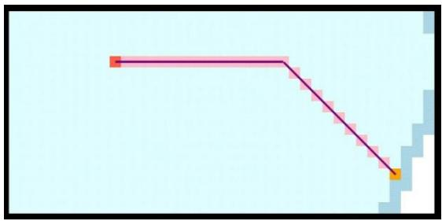

natural_image

Simple line drawing of a stepped path with a red horizontal segment and a yellow arrowhead at the end (no text or symbols)

(a) Dijkstra 算法搜索过程

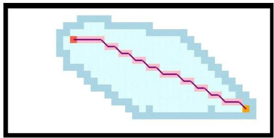

natural_image

Pixelated abstract line drawing with pink and orange segments on light blue background (no text or symbols)

(b)A\*算法搜索过程  
图1.4 Dijkstra 算法与A\*算法搜索过程节点拓展对比

传统的 A\*算法在时间效率、路径求解的最优性和轨迹平滑度方面仍有进一步优化的空间。加权 A\*(Weighted A\*)[11]通过在启发式函数中引入一个权重因子来确定算法启发项的权重，从而增加了对未知区域的探索性，提高搜索效率，但可能无法找到全局最优解。为解决算法规划时间有限的问题，Maxim 等人提出即时修复 A\*(AnytimeRepairing A\*，ARA\*)算法[12] ，它能够快速找到一个可行路径，并在剩余时间内不断优化这个路径，这使得它在处理实时路径规划问题时非常有效。此外，仍有大量针对A\*算法启发式函数和搜索方式的改进变种算法，如引入了双向搜索方式的双向 A\*搜索算法 (A\*-connect)[13]、加入增量思想的终身规划 A\*算法(Lifelong Planning A\*，LPA\*)[14]等、通过组合不同启发函数提升算法搜索的目的性，避免陷入局部最优解的多启发式 A\* (Multi-Heuristic A\*，MHA\*)算法[15]等。

然而，传统的 A\*算法和以上的改进变种算法在进行路径规划时只考虑??和??坐标两个维度，不能满足车辆的运动学约束问题，无法直接作为规划路径的输出。为解决该问题，混合 A\*算法(hybird A\*)在 2008 年由 Dmitri Dolgov 和 Sebastian Thrun 提出[16]，混合 A\*算法的核心思想是引入了??维度，即车辆的横摆角，进而将 A\*算法与车辆运动学相结合，以处理 A\*算法无法满足的车辆运动学约束的问题。混合 A\*算法在拓展节点和设计启发式函数时均考虑了车辆的运动学约束。它通过在单位时间内对车辆的速度和方向进行采样，生成一段符合车辆运动学的轨迹，并将轨迹的末端位姿作为子节点，使用车辆的实际运动距离和满足避障条件及车辆运动学约束条件的最短路径长度作为启发式函数的值。这使得生成的路径更加符合车辆的实际运动能力，并且能够更好地处理车辆的运动学约束和避障问题，如图 1.5 所示，近年来被广泛应用于无人驾驶车辆的路径规划，特别是在停车场等复杂环境中进行自动泊车，如 W. Sheng等人[17]基于混合 A\*算法设计了一种在无结构、狭窄通道环境下的自主泊车分层轨迹规划器。S. Sedighi 等人[18] 使用可见性图为混合 A算法引入了一个改进的成本函数，经测试在代客泊车等应用场景中具有显著优势。Y. Shi[19]等人针对自助代客泊车将路径规划分为全局部分和局部部分。全局路径基于图搜索算法进行规划，在局部路径规划部分对混合 A∗算法和 Reeds-Shepp 曲线进行改进，最终显著提高了路径规划的效率和合理性。

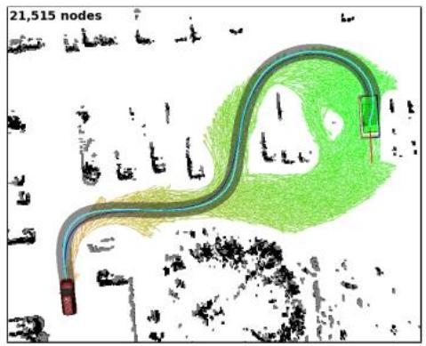

text_image

21,515 nodes

图 1.5 混合 A\*算法搜索过程

# 2. 随机采样法

基于随机采样的算法以概率完备性(当时间接近无限时一定有解)来代替传统算法的完备性要求。基于随机采样的路径规划算法利用随机思想，最常用的算法为快速随机扩展树法 (Rapidly-exploring random tree，RRT)[20]以及其变种改进算法。

RRT 算法的基本思想是从起点开始，通过在状态空间中随机采样并构建一棵扩展树，来探索到终点的可行路径，节点的扩展过程如图 1.6所示。在 RRT 算法的基础上衍生了大量改进算法，如提升路径求解最优性的 RRT\*算法[21]、加入双向搜索的RRT-Connect 算法[22] 、拥有高实时性的 Anytime RRT 算法[23]等等。RRT 算法实现简单，求解速度较快，适用于高维度空间中的路径规划问题，但由于采样过程存在很大地随机性，因此算法稳定性较差。

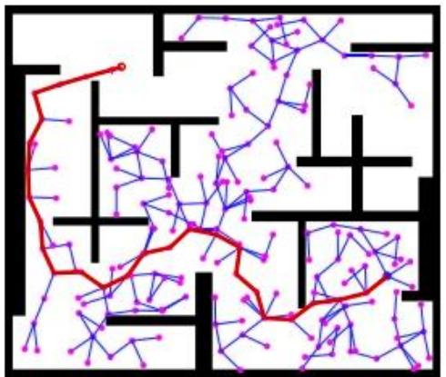

flowchart

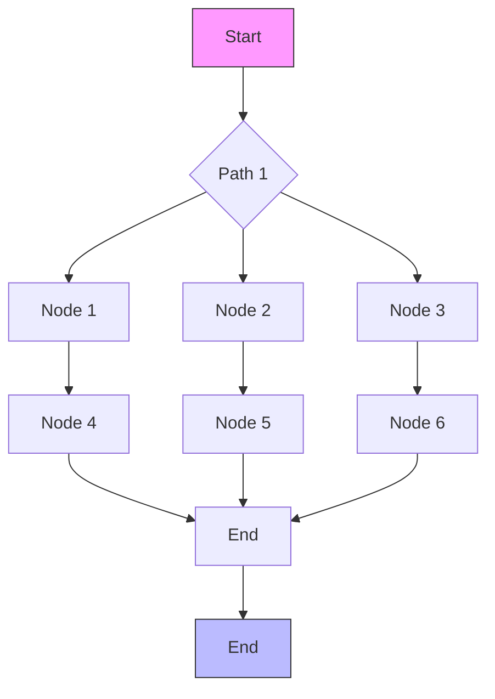
```mermaid
graph TD
    A["Start"] --> B{Path 1}
    B --> C["Node 1"]
    B --> D["Node 2"]
    B --> E["Node 3"]
    C --> F["Node 4"]
    D --> G["Node 5"]
    E --> H["Node 6"]
    F --> I["End"]
    G --> I
    H --> I
    I --> J["End"]
    style A fill:#f9f,stroke:#333
    style J fill:#bbf,stroke:#333
```

图1.6 RRT算法规划过程

全覆盖路径规划算法是一种用于解决无人车在特定区域内进行全面覆盖的路径规划问题的算法。算法的目标是在避免碰撞的前提下，规划出一条或多条路径，使无人车能够遍历工作区域内的所有位置。算法需要解决的关键问题包括：遍历工作区域内除障碍物以外的全部区域，确保每个位置都被访问到，并且在遍历过程中要尽量避免路径重复，缩短移动距离，以提高效率。近年来随着全覆盖路径规划技术应用逐渐广泛，越来越多的国内外学者展开了研究。

栅格法[24][25]将工作区域划分成栅格，搜索连通的栅格表示路径，Zelinsky A 等人[26]基于wavefront 算法对每一个栅格进行代价值计算，并根据当前目标点的位置，选择周围栅格的代价值最大的栅格作为下一个运动目标点，当工作区域的栅格都被选择完毕后，则得到了全遍历的路径。栅格法在通用性、简单性、环境信息记录等方面具有优势，但在计算效率和计算精度的矛盾以及搜索盲目性等方面存在不足。

模板模型法[27]是一种基于先验知识的路径规划方法。该方法首先定义了一组符合环境地图的典型模板，这些模板可以是基于环境特征或障碍物布局而设计。在路径规划过程中，算法会将这些模板与环境地图进行匹配，以确定机器人应该采取的运动方向。1995年，由Hofner等人[28]提出的传统的模板算法，邱雪娜等人[29]在原有模板的基础上增加了新的运动模板，能够处理有静态障碍物的环境。基于模板模型的全覆盖路径规划算法具有简单直观、计算效率高的优点，当环境与模板库的模板匹配成功时，规划效果较好。然而，它缺乏灵活性，难以应对环境变化，且模板设计可能复杂，需要针对特定场景调整。

单元分解法[30]是一种将整体区域分解为多个子区域，然后对每个子区域进行单独路径规划的方法。这种方法通常包括三个主要步骤：整体区域的分解、子区域内的全覆盖路径规划、以及子区域间衔接的路径规划。Trapeziodal 分解法[31]通过一条直线平行的扫过待遍历的区域，根据三种不同的情况将区域划分为一系列梯形状的子区域，并对每个子区域进行路径规划，以确保机器人能够完全覆盖整个区域。这种方法通过将整个区域划分为梯形子区域，可以简化路径规划问题，有效地处理障碍物边界的复杂性，但由于划分区域过多，导致相邻区域连接部分覆盖重复率过高。为此，Boustrophedon(牛耕式)分解法[32]通过区间合并减少了 Trapeziodal 分解法的区域划分数量，并在划分完单元格后，用牛耕式的弓形路径覆盖每个单元格，如图 1.7 所示。相比于Trapeziodal 分解法，牛耕式分解法有效地减少重复覆盖，提高了覆盖效率，提升了适应各种环境以及与其他算法结合的能力，但由于每个单元格的路径通过简单的弓字形方式生成，不考虑车辆运动学模型且存在大量曲率突变的直角弯，如果直接作为全局参考线会严重影响后续轨迹规划的结果，因此无法直接输出给轨迹规划模块。

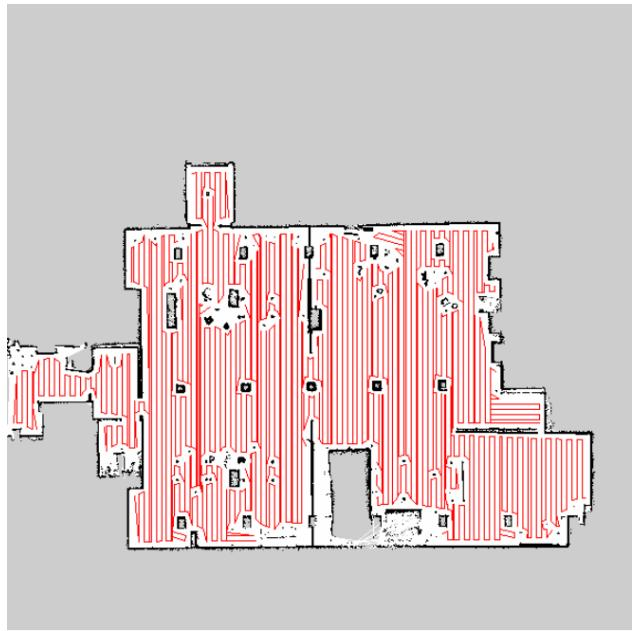

natural_image

Architectural floor plan with red and black striped patterns indicating room layouts (no text or labels)

图1.7 牛耕式分解法全覆盖路径规划示意图

除了上述常见的覆盖算法外，随着搜索算法的发展，近年来逐渐有与常用于点到点路径规划的 $\mathbf { A } ^ { * }$ 算法、蚁群算法、人工势场法等相结合的全覆盖路径规划算法被提出。陈超等人[33]提出基于可视图法的 $\mathbf { A } ^ { * }$ 算法，算法通过将规划起点与障碍物边界连线构成一个线段集合，并依次判断其他障碍物是否与集合中的线段有交集，并在集合中删除掉相交的线段，该方法提升了不同环境的泛化性，但无法处理复杂动态环境。张赤斌等[34]提出了基于智能蚁群的全覆盖路径规划算法，但由于蚁群算法需要预训练运动路径，导致算法会大量消耗计算资源。梁嘉俊等人[35]将覆盖算法结合了改进型的人工势场法，有效解决了在传统的人工势场法下，机器人会由于障碍物堵塞产生死锁的现象，并提升了近距离障碍物之间路径规划能力。

综上所述，在非结构化场景下，目前对于面向自动驾驶的点到点路径规划算法研究已经取得了很大的进展，已有诸如混合 A\*和相应改进算法考虑了车辆运动学模型，算法生成的路径能够更好地应用到后续自动驾驶轨迹规划任务当中。但面向无人清扫车等自动驾驶车辆的全覆盖路径规划算法方面，仍然存在很大的进步空间。目前全覆盖路径规划算法大多沿用了机器人规划算法，并未考虑车辆运动学模型，因此生成的路径不够平滑，存在大量曲率突变处，进而影响后续轨迹规划结果的安全性、舒适性和平滑性。因此，如何设计适用于无人车的全覆盖路径规划算法是一个研究重点。

# 1.3.2 轨迹规划研究现状

在全局路径规划层规划出参考路径后，需要轨迹规划层根据车辆状态和周围障碍物的信息，实时规划出一条满足车辆运动学约束、安全性约束和舒适性要求的轨迹，轨迹包含车辆未来若干秒内的路径信息和速度信息，然后输出给控制模块进行轨迹跟踪，因此轨迹规划本质上可以看成是多目标优化问题。轨迹规划根据是否进行时空解耦，可分为时空解耦式规划和时空联合规划。

# 1. 时空解耦式规划

时空解耦式规划是将整个包含路径信息和速度时间信息的三维轨迹规划解耦为二维的路径规划和一维的速度规划，其核心思想是在路径规划阶段只考虑避免静态障碍物碰撞，之后在规划路径的基础上考虑动态障碍物并进行速度规划，常用时空解耦式规划方法有搜索法和数值优化方法等[36]。从 2010 年，由 Werling[37]首次提出基于Frenet 坐标系的轨迹规划方法后，后续对于时空解耦式规划方法的研究普遍基于Frenet 坐标系。使用Frenet 框架的一个明显好处是，任何道路都可以标准化为一个具有左右边界的直线道路，因此轨迹规划问题中的非线性避障约束就转化为边界内的线性约束，除此之外，原本耦合的运动学约束也被解耦为纵向和横向维度上的独立多项式，上述特性使得基于 Frenet 的方法能够将轨迹规划问题转换为二次规划(QP)问题，从而快速求解。其中，以百度 Apollo 团队提出的 EM Planner(Expectation MaximizationPlanner)[38]为代表，EM Planner 首先在由提前生成的参考线构建的 Frenet 坐标系下进行路径规划，之后在最优路径构建的 Frenet 坐标系下进行速度规划，两次规划均先由动态规划算法生成路径和速度粗解，然后根据粗解分别拓展凸空间，将优化问题转换为二次规划问题，最后通过开源求解器 OSQP 求解，该方法作为“轻决策，重规划”开源算法的代表，可以同时满足城市场景和高速场景的轨迹规划要求，因此在自动驾驶领域应用十分广泛。DANG T 等人[39]通过对轨迹优化的目标函数中引入加速度的导数和横摆角速度的优化目标，提升了最优轨迹的舒适性。Zhu 等人[40]提出了一种能够保证问题凸性的 CES 算法用于对路径和速度进行优化，确保算法在 100ms 以下实时帧运行。 LIM W等人[41]提出一种采样与优化方法集成的分层轨迹规划方法，降低城市驾驶环境的复杂性和计算负载。GU 等人[42]提出了一种新型解耦式时空轨迹规划器，该方法可以在低维搜索空间上进行更精细的采样，并具有更好的可调性和稳定性，但解耦方案在时空上并不完备。刘召栋[43]在将轨迹规划问题解耦成路径规划和速度规划后，分别将两个问题构造成 MPC 问题，并求解出相应的轨迹。在泊车场景中，百度Apollo 团队[44]提出了一种新型解耦式轨迹优化算法，相比于直接使用混合 A\*算法作为泊车规划轨迹，具有实时计算性能好、精确避障、严格保证路径曲率约束等优点。

时空解耦式规划能够通过先进行路径规划，再进行速度规划的方法简化整个轨迹规划问题，从而显著地降低整个优化问题的求解难度，保证了算法求解的实时性。然而，由于轨迹中的路径和速度在时空上存在强耦合关系，时空解耦的求解顺序对生成轨迹的灵活性和适应性产生了极大的限制，因此，解耦算法仅适用于处理横纵向运动相对解耦的一般场景，例如路口让行和静态障碍物绕行等[45][46]，在处理借道超车、避免对向来车、邻车切入等高动态场景时，由于时空解耦式轨迹规划算法将问题分解为两个部分进行求解，会导致生成的轨迹并不是全局最优[47]，限制了自动驾驶车辆的实际表现。

# 2. 时空联合规划

时空联合规划不进行时空解耦，直接在三维时空范围内对可行轨迹进行求解，同时考虑静态障碍物、动态障碍物和它们相互之间的影响，相比时空解耦式算法，虽然问题维度上升，计算求解难度增大，但通过时空联合规划求解轨迹的解空间更大并且求解灵活性更高，在各类场景下的规划表现更好。目前主流的时空联合规划算法可分为采样法、搜索法和数值优化法。

State Lattice算法[48][49][50]作为经典的基于采样法的时空联合规划算法，通过构造时空采样空间，对车辆目标位置状态进行采样，利用多项式曲线将车辆初始状态和目标状态连接成光滑的轨迹，并设置相应的轨迹评价函数，对所有采样的轨迹曲线簇进行评价，选择一条代价最小并且不与时空上任何一个障碍物碰撞的轨迹作为输出。Y.Chang 等人[51]提出了一种针对道路场景并结合了 Informed RRT\*和 B 样条曲线的 3D样本轨迹规划方法，算法通过增加样本相关性和采样效率，以及实施障碍物识别和终点采样，提高了轨迹规划的效率和求解质量，同时实验结果也验证了该方法的鲁棒性。Z. Ajanovic等人[52]提出了一种基于A\*搜索算法的快速且稳定性高的运动规划框架，该框架采用了一种方便的几何表示法，用于描述搜索空间和驾驶约束，进而基于 A\*算法求解简化问题后的精确代价映射图，该算法同时考虑了距离和时间范围，具有模型预测的特性，能够计算最优运动轨迹。

然而单一的基于采样法或搜索法的时空联合规划方法依赖于对时空离散的程度，离散程度越高，最优轨迹的采样和搜索空间更加完备、求解质量更高，但求解耗时会急剧增加。基于优化的方法将运动规划问题转化为数值优化问题，与其他方法相比，该方法能够在欧式空间内进行连续规划，可以在统一的公式中评估多个目标(如约束条件)。此外，随着维度的增加，计算量不会呈指数级增长。这些优势使得基于优化的方法在处理运动规划问题时具有很高的灵活性和效率。然而优化问题的求解可能需要大量的计算资源，特别是对于复杂的非线性优化问题。

F. Eiras 等人[53]提出了一种基于 Frenet 坐标系的两阶段时空联合轨迹规划框架，该方法直接在三维时空上求解非凸非线性的优化问题，第一阶段通过混合整数线性规划求得粗轨迹，第二阶段通过开源求解器 IPOPT 求解非线性优化问题的精确解，该方法保证了在安全范围内最优解的可行性和平滑性，并在复杂的城市结构化道路场景验证了方法的有效性。为了提高优化算法的求解效率，Liu 等人[54]提出了用于高效轨迹优化的 CFS(convex feasible set)算法，它已被应用于机器人避障和自动驾驶运动规划中[55][56]，但该方法使用逆动力学导致得到的最优控制输入不准确，可能会在规划轨迹和实际轨迹之间引入不匹配的问题。J. Chen 等人[57]提出了CILQR算法，该算法将时空联合规划问题转换为有约束的最优控制问题，并将一般道路上运动规划问题的约束通过罚函数的形式结合到 ILQR 算法[58][59]框架中，经实验验证能够高效地解决具有非线性系统动力学和非凸约束的最优控制问题，单帧求解耗时在10ms 以下。该算法结合了ILQR 的效率和灵活性，同时处理了复杂的约束条件，使得在自动驾驶等实际应用中能够更好地处理各种驾驶场景和规则。也有一些学者提出基于学习的方法[60][61]，这类方法能够灵活地学习专家或类似人类的驾驶策略，并且计算负载对维度不敏感。然而，基于学习的方法仍然难以在长期安全性和可行性约束方面提供理论保证。

这种单一基于数值优化的时空联合规划方法虽然能够通过 ILQR 框架保证实时性的要求，但由于高度非凸非线性的障碍物和边界约束会导致整个优化问题复杂度显著增加，并且求解会受到初始猜测轨迹或局部最优解的影响，导致得到的轨迹易陷入局部最优解[62]，因此也有学者提出基于采样或搜索的方法与基于数值优化的时空联合规划相结合的方法。

W. Zhan 等人[62]提出了基于搜索和优化的时空联合规划算法，该方法首先通过三维时空栅格地图对车辆运动环境进行建模，之后通过 A\*算法搜索初始轨迹，最后通过 MPC 方法进行优化得到最终轨迹，但该方法对于状态空间简化过多，导致求解完备性和轨迹质量较差。胡杰等人[63]首先使用改进混合 A\*在时空范围内进行轨迹粗搜索获得初始轨迹，然后以初始轨迹为参考构建可行驶时空走廊，并综合考虑车辆动力学和轨迹连续性约束等条件，使用数值优化的方法进一步平滑初始轨迹，平衡了轨迹求解质量和求解耗时的问题，并在城市结构化道路对算法进行了验证。但该方法为了简化问题复杂度，选择在Frenet 坐标系下进行规划，而使用Frenet 坐标系会带来无法准确建立自车的真实运动学模型的问题[64]，此问题会在弯曲道路处更加凸显，因此并不适用于存在大曲率参考路径的结构化和非结构化场景中。B. Li 等人[64]提出了一种基于笛卡尔坐标系的时空联合规划方法，该方法首先通过动态规划算法计算出初始轨迹，并在每次迭代过程中通过构造安全走廊处理非凸的避障约束，并对非凸的运动学约束进行线性化处理，从而简化整个非线性优化问题，最后利用开源求解器 IPOPT 求解整个优化问题，相比于基于 Frenet 框架的规划器，该方法得到的最优轨迹可以有效避免在大曲率弯道处出现曲率突变的现象。该方法尽管处理了复杂的避障约束，但通过 IPOPT 直接求解优化问题极大地限制了算法的实时性，求解耗时在 250ms 以上，同时原论文中只是单帧求解，算法求解稳定性较差，无法满足目前自动驾驶系统对于轨迹规划模块实时帧求解的要求。

综上，目前对于时空联合规划的研究往往难以平衡轨迹的求解质量和实时性的要求，并且仅针对结构化道路或非结构化区域进行单一场景的算法验证。

# 1.4 本文主要研究内容

根据现阶段路径规划算法和轨迹规划算法的研究现状，本文将提出应用于无人车的全覆盖路径规划算法，并将建立起一套适用于结构化道路和非结构化区域且安全高效的时空联合规划算法框架。本文各部分研究内容如下：

（1）非结构化场景下应用于无人车的全覆盖路径规划算法研究。针对基于牛耕法的全覆盖路径规划算法，首先介绍了算法步骤中整体区域的分解、子区域全覆盖路径的生成、子区域的遍历顺序求解和生成子区域间衔接的路径规划。由于通过牛耕法直接生成的路径不够平滑，因此提出了基于 DWA 算法的路径平滑算法，并对其数学原理和实现细节进行了详尽地阐述。最后，构建仿真测试环境对算法进行了验证，证明了算法生成的全局路径可以有效覆盖整个地图区域并且满足平滑性的要求。  
（2）时空参考轨迹及时空安全走廊生成算法研究。本部分首先详细介绍 Frenet坐标系的相关内容，并在全局路径构建的 Frenet 坐标系下建立时空联合轨迹规划算法。之后对提出的基于时空动态规划的轨迹规划算法相关内容进行详尽地阐述，包括三维采样空间的构建方法、碰撞检测模型、时空动态规划算法的实现流程及其评价函数和状态转移方程的数学形式。接下来对时空安全走廊的模型选择和基于粗拓展和精拓展的两阶段生成算法进行了详细解释。最后利用单元测试对算法性能进行验证，并使用opencv库将算法结果进行可视化，验证了算法的有效性。  
（3）基于CILQR 算法的时空联合轨迹优化算法研究。本部分首先给出了一般道路下基于 CILQR 框架的时空联合轨迹优化问题的定义，并结合上一部分得到的时空参考轨迹和时空安全走廊对优化问题中的各项约束和目标函数进行了详尽地数学推导，进而给出了对应障碍函数的惩罚形式。之后针对 CILQR 求解最优轨迹的具体方法，详细介绍了 CILQR 算法的整体流程，并对后向传递和前向传递两个核心步骤的数学原理和实现细节进行了详尽地阐述，最后列举了算法推导过程中需要的核心参数值。  
（4）基于无人清扫车 PNC 仿真平台的多场景仿真验证。为验证本文所提的规划算法，本部分搭建了基于 Ubuntu系统和 ROS1 的无人清扫车PNC 仿真实验平台，核心代码由C++编写而成。本部分共设计了三组仿真实验，涵盖了结构化和非结构化场景，并充分考虑了动静态障碍物的避障以及大曲率 U-Turn 路径等复杂工况。通过深入分析实验数据结果，并与其他算法进行对比，结果表明，本文提出的时空联合轨迹

规划算法框架在结构化和非结构化场景中均展现出规划轨迹的合理性、运行的高效性和安全性，同时具有高实时性的显著优势。

论文主要研究内容的组织结构如图 1.8 所示。

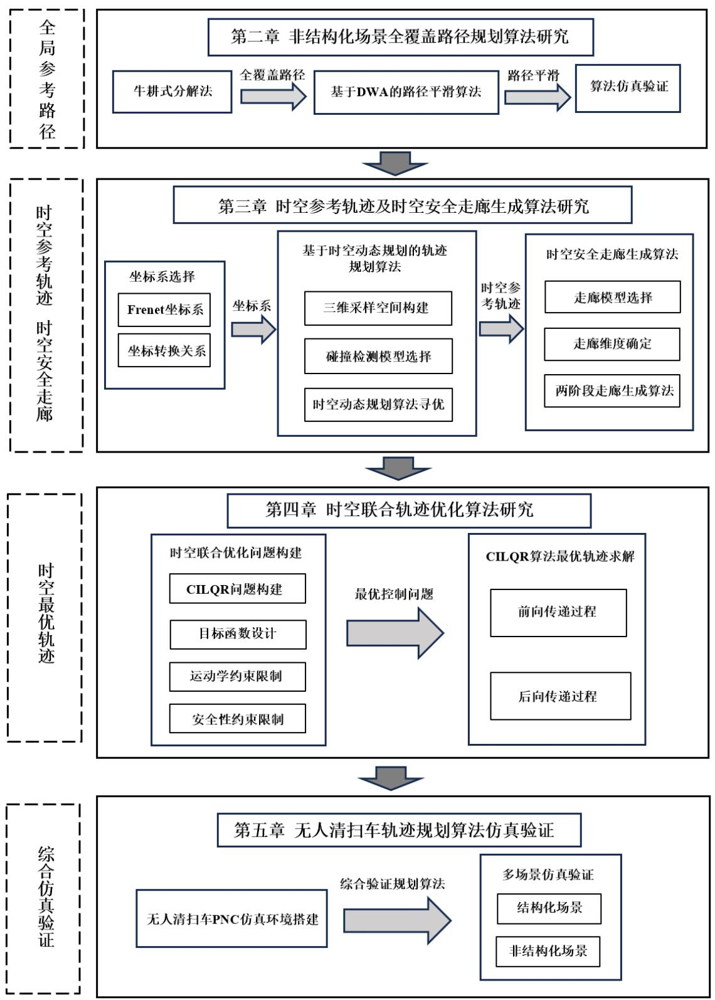

flowchart

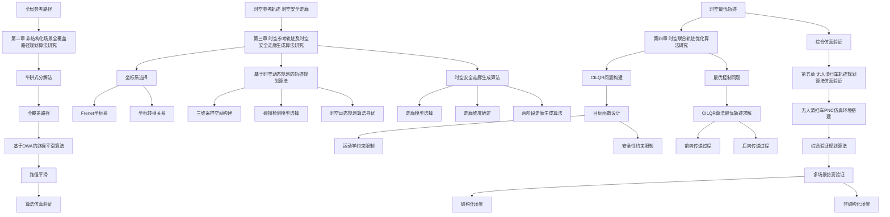
```mermaid
graph TD
    A["全局参考路径"] --> B["第二章 非结构化场景全覆盖路径规划算法研究"]
    B --> C["牛耕式分解法"]
    C --> D["全覆盖路径"]
    D --> E["基于DWA的路径平滑算法"]
    E --> F["路径平滑"]
    F --> G["算法仿真验证"]
    
    H["时空参考轨迹 时空安全走廊"] --> I["第三章 时空参考轨迹及时空安全走廊生成算法研究"]
    I --> J["坐标系选择"]
    J --> K["Frenet坐标系"]
    J --> L["坐标转换关系"]
    I --> M["基于时空动态规划的轨迹规划算法"]
    M --> N["三维采样空间构建"]
    M --> O["碰撞检测模型选择"]
    M --> P["时空动态规划算法寻优"]
    I --> Q["时空安全走廊生成算法"]
    Q --> R["走廊模型选择"]
    Q --> S["走廊维度确定"]
    Q --> T["两阶段走廊生成算法"]
    
    U["时空最优轨迹"] --> V["第四章 时空联合轨迹优化算法研究"]
    V --> W["CILQR问题构建"]
    W --> X["目标函数设计"]
    X --> Y["运动学约束限制"]
    X --> Z["安全性约束限制"]
    V --> AA["最优控制问题"]
    AA --> AB["CILQR算法最优轨迹求解"]
    AB --> AC["前向传递过程"]
    AB --> AD["后向传递过程"]
    
    U --> AE["综合仿真验证"]
    AE --> AF["第五章 无人清扫车轨迹规划算法仿真验证"]
    AF --> AG["无人清扫车PNC仿真环境搭建"]
    AG --> AH["综合验证规划算法"]
    AH --> AI["多场景仿真验证"]
    AI --> AJ["结构化场景"]
    AI --> AK["非结构化场景"]
```

图1.8 论文整体结构图

# 第 2 章 非结构化场景全覆盖路径规划算法研究

# 2.1 引言

全局路径规划作为自动驾驶规划模块重要组成部分，需要向轨迹规划部分输出平滑的全局参考线，本章旨在研究非结构化场景下应用于无人车的全覆盖路径规划算法。本章首先介绍了基于牛耕法的全覆盖路径规划算法，并详细介绍了算法的三个核心步骤：整体区域的分解、子区域内的全覆盖路径规划和子区域间衔接的路径规划。由于直接通过牛耕法生成的全局路径不考虑车辆运动学模型，因此本文基于 DWA(动态窗口法)算法对全局路径进行平滑处理，并对算法原理和实现细节进行了全面阐述。在本章的最后，通过开源 opencv 库创建像素地图对算法进行了验证。

# 2.2 基于牛耕法的全覆盖路径规划算法

# 2.2.1 基于扫描线法的区域分解

由第 1.3.1 小节介绍可知，基于单元分解法的全覆盖路径规划算法是一种将待覆盖区域划分为多个子区域，并对每个子区域进行路径规划以实现全覆盖的算法。牛耕式分解法作为 Trapeziodal 分解法的改进算法，具有覆盖效率高、适应环境能力强以及与其他算法易结合等优点，因此本文选取牛耕式分解法生成地图的全覆盖路径。牛耕式分解法一共包含三个核心步骤，即整体区域的分解、子区域内的全覆盖路径规划以及子区域间衔接的路径规划。

在得到非结构化区域的地图后，牛耕法需要先将地图根据障碍物分解成若干个子区域，之后在对分别处理每个子区域。具体实现方法为扫描线法，即从区域的某个边界开始，用一条扫描线逐步扫描整个区域。当扫描线遇到障碍物时，它会记录下障碍物的顶点位置，并根据这些顶点将区域分割成不同的子区域，这些子区域可以通过连接障碍物的顶点来形成，而连接线则作为弧组成一个连通图。

在扫描过程中，牛耕式分解法定义了三种不同事件[32]，即IN事件、OUT事件和MIDDLE事件，如图 2.1所示，并根据三种事件的触发来分解整个区域。事件的触发依赖于扫描线连通性的变化，使连通性变化的点被称为临界点，如图 2.2所示，在图中临界点的左侧扫描线为双向连通，右侧为单向连通。IN 事件触发时表示当前单元格关闭并开启两个新的单元格，OUT 事件触发时正好相反，为当前两个单元格关闭并开启一个新的单元格，MIDDLE 事件触发时，与 Trapeziodal 分解法关闭当前单元格并打开一个新的单元格的做法不同，在牛耕式分解法中既不打开也不关闭单元格，而是更新当前的单元格，因此牛耕式分解法能够减少单元格分解的数量，从而减少覆盖路径规划时的重复覆盖率。

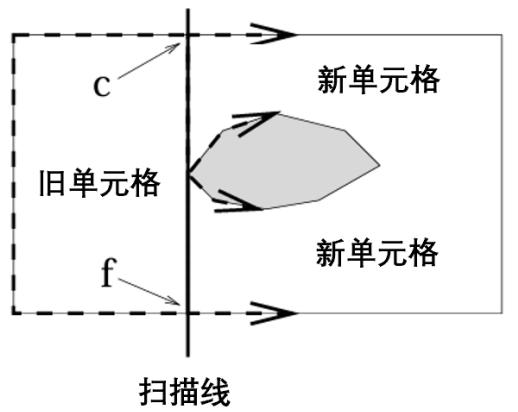

text_image

c
旧单元格
f
新单元格
新单元格
扫描线

(a) IN 事件

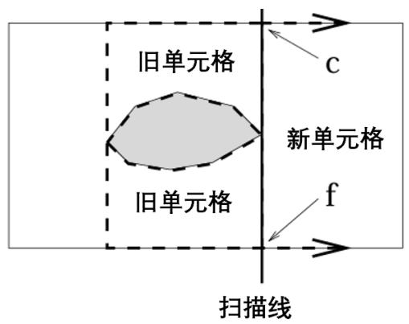

text_image

旧单元格
旧单元格
新单元格
C
f
扫描线

(b) OUT 事件

图 2.1 IN 事件和 OUT 事件  
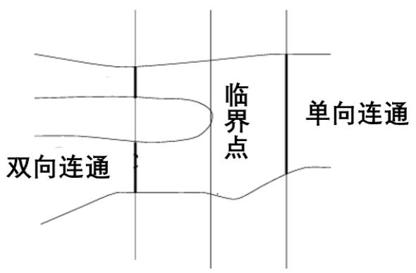

text_image

双向连通
临界点
单向连通

图2.2 临界点示意图

在扫描线从地图的左边界向右扫描过程中，当遇到临界点改变扫描线连通性时，会根据不同情况触发上述对应的事件，最终将整个地图区域划分成若干个单元格子区域，形成一张连通图，其中每个单元格可以看成是图中的一个节点，并根据临界点确定与相邻节点间的连通性。

# 2.2.2 子区域的覆盖路径生成和遍历顺序求解

在整体区域通过扫描线法分解成单元格子区域并组成连通图后，需要确定一条最优路线来遍历图中的每个节点，这是经典的 TSP(Traveling Saleman Problem)问题，TSP问题是组合优化中的一个 NP 困难问题。对于TSP 问题的求解，本文先用邻接矩阵法来表示子区域组成的连通图，并使用深度优先的搜索算法(DFS)，可以计算出对连通图进行穷举遍历的路径列表，如图2.3所示，算法的具体步骤如下：

1. 从分解中的任意一个单元格开始，将其插入到路径列表中，并将其标记为已访问。  
2. 转到当前单元格的邻接矩阵中第一个未访问的单元格(即按照逆时针方向转到第一个未访问的单元格)，将这个单元格插入到路径列表的开头，并将其标记为已访问。  
3. 重复此过程(即转到步骤 2)，直到遇到所有相邻节点都已被访问的单元格。  
4. 回溯遍历，直到遇到具有未访问相邻节点的单元格。回溯过程通过向前遍历路径列表来实现，将每个已访问的元素插入到路径列表的前端，直到遇到具有未访问相邻节点的元素，将此元素插入到路径列表的前端，并重复上述过程(即转到步骤2)。  
5. 如果在回溯过程中没有找到存在未访问相邻节点的单元格，那么连通图中的所有单元格都已被访问，算法结束并输出路径列表。

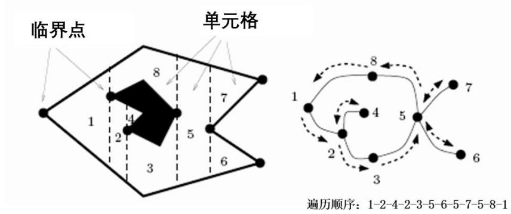

flowchart

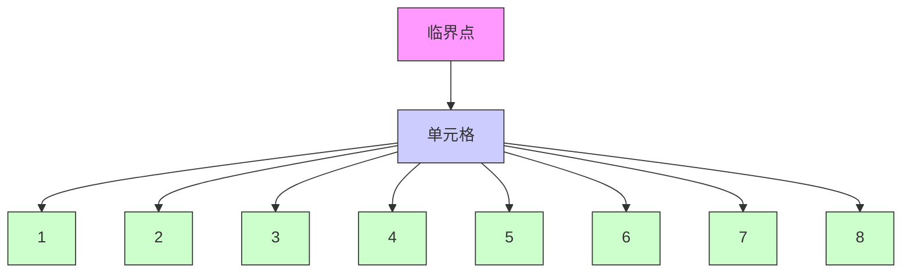
```mermaid
graph TD
    A["临界点"] --> B["单元格"]
    B --> C["1"]
    B --> D["2"]
    B --> E["3"]
    B --> F["4"]
    B --> G["5"]
    B --> H["6"]
    B --> I["7"]
    B --> J["8"]
    style A fill:#f9f,stroke:#333
    style B fill:#ccf,stroke:#333
    style C fill:#cfc,stroke:#333
    style D fill:#cfc,stroke:#333
    style E fill:#cfc,stroke:#333
    style F fill:#cfc,stroke:#333
    style G fill:#cfc,stroke:#333
    style H fill:#cfc,stroke:#333
    style I fill:#cfc,stroke:#333
    style J fill:#cfc,stroke:#333
```

图2.3 牛耕式分解法子区域分解示意图

在完成子区域分解并确定了遍历顺序后，依次对每个子区间生成如图 2.4所示的牛耕式弓字形覆盖路径。对于子区域路径规划起点的确定，分别计算区域内平行线的每个角点到主车起始位置的距离，取距离第二近的角点作为往复覆盖的起点。

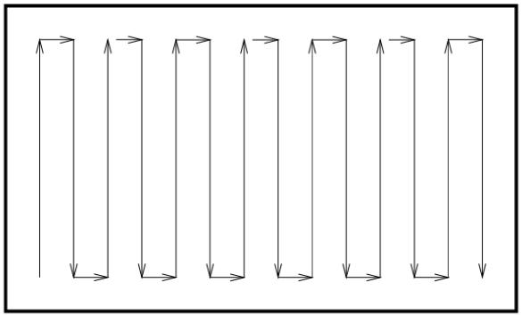

natural_image

Pure diagram of vertical arrows pointing right, no text or symbols present

图2.4 弓字形覆盖路径

# 2.2.3 子区域间衔接路径规划算法

在每个子区域生成完弓字形覆盖路径后，需要按照求解得到的遍历顺序生成各个子区间的衔接路径，即在像素地图中进行多次点到点路径规划，规划起点为上一个子区域覆盖路径的终点，终点为当前子区域覆盖路径的起点。本文选取被广泛应用的 $\mathbf { A } ^ { * }$ 算法作为子区间衔接路径生成算法。 $\mathbf { A } ^ { * }$ 算法在搜索效率和求解时间上均有着良好的性能结果。根据第 1.3.1 小节介绍，A\*算法作为 Dijkstra 算法的改进算法，增加了启发式函数ℎ(??)，设当前节点到起始点的代价为 $| g ( n )$ ，则在路径搜索过程节点的代价变为 $| g ( n ) + h ( n )$ ，因此有明确的目标导向，进而能够更快地搜索到一条起点到终点的最短路径。

在实际编程过程中，A\*算法通过维护一个优先级队列，优先级队列中的排序按照$h ( n ) { + } g ( n )$ 最小进行排序，将未搜索到最短路径的节点放入到该队列中。由于优先级队列的数据结构特性，每插入和删除一个节点的时间复杂度均为 $O ( l o g n )$ 。遍历过程中，将所有找到路径的节点放入到一个单独的集合当中，一般通过哈希表维护，记为$c l o s e _ { s e t }$ 。通过不断拓展更新优先级队列中的节点，直到目标节点被放入 $. c l o s e _ { s e t }$ 则停止拓展，并回溯遍历最优父节点生成最短路径。如果直到除了目标点的其他所有节点都找到了最短路径，则说明目标节点不可到达，路径规划失败。

本文通过开源opencv 库创建像素地图，并根据本章算法生成全覆盖路径如图 2.5所示，其中黑色像素区域代表不可行区域，即在算法中表示障碍物区域，灰色像素区域为需要覆盖的整个区域，从图中可以看出基于牛耕法的全覆盖路径规划算法生成的路径能够有效地覆盖整个非结构化区域，但由于在生成子区域覆盖路径时并不考虑车辆运动学模型，因此无法直接作为轨迹规划模块的全局参考线。

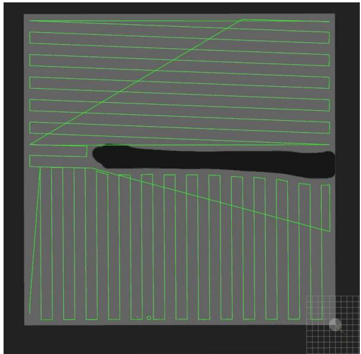

natural_image

Pure architectural floor plan lines without any text, numbers, or symbols

图2.5 基于牛耕法的全覆盖路径规划

# 2.3 基于 DWA算法的路径平滑算法

# 2.3.1 路径平滑算法的总体流程

对于路径平滑算法，常见的方法有基于插值和基于优化的平滑算法。基于插值的平滑算法通过使用插值函数(如贝塞尔曲线、B 样条曲线等)来生成平滑的路径。这些算法通常会在原始路径点之间插入新的路径点，使得生成的路径更加平滑。插值算法的优点是计算量相对较小，可以快速地生成平滑的路径。但是，插值算法可能无法完全满足无人车的运动学模型，导致生成的路径在实际执行时出现问题。基于优化的平滑算法通过优化目标函数来生成平滑的路径。目标函数通常包括路径长度、平滑度和安全性等因素，可以得到更加平滑、更符合无人车运动学模型的路径，如离散点优化法等。优化算法的优点是可以更好地满足无人车的运动学模型，生成的路径更加准确、可靠。但是由于全覆盖路径长度过长，离散后优化变量维度较高导致计算复杂度较大，因此可能出现耗时高且优化结果不稳定的问题。

动态窗口算法(Dynamic Window Approaches, DWA) [65]是基于预测控制理论的一种次优方法，因其在未知环境下生成安全、考虑机器人或无人车运动学模型并且平滑的避障轨迹, 同时具有计算量小, 反应迅速、可操作性强等特点，被广泛应用于机器人和无人车轨迹规划领域[66][67][68]，因此本文将基于 DWA 算法设计全局路径平滑算法。

基于DWA算法的路径平滑算法的核心思想是根据无人车当前的位置状态和速度状态在速度空间 $( v , \omega )$ 中确定一个满足无人车运动学约束限制的采样速度空间，其中??表示车辆速度， $\omega$ 表示车辆横摆角速度，然后根据车辆运动学模型计算无人车在这些速度情况下移动一定时间内的轨迹簇，并通过评价函数对轨迹簇进行评价，最后选出评价最优的轨迹的第一个轨迹点加入平滑后的全局路径，如此递推求解直至终点加入平滑后的全局路径，算法结束。

算法包含三个核心步骤：速度采样、采样轨迹生成和轨迹评价，由于 DWA算法属于局部轨迹规划算法，因此在程序运行时将以 5hz的频率不断调用路径平滑算法模块，来模拟无人车从起点运动到终点的实时帧规划过程。

# 2.3.2 速度空间采样及采样轨迹生成

由于车辆本身运动学约束的限制条件，车辆的速度采样空间 $V _ { s }$ 中 $( v , \omega )$ 有一定的范围限制，主要为速度边界的限制和加速度的限制。根据为无人车的硬件条件和环境限制, 无人车的速度存在的边界限制, 此时可采样的速度空间 $V _ { m }$ 为，

$$
V _ {m} = \{(v, \omega) \mid v \in [ v _ {m i n}, v _ {m a x} ], \omega \in [ \omega_ {m i n}, \omega_ {m a x} ] \} \dots\dots\tag {2.1}
$$

其中 $v _ { m i n }$ 、 $v _ { m a x }$ 分别为车辆最小和最大速度， $\omega _ { m i n }$ 、 $\omega _ { m a x }$ 分别为车辆最小和最大横摆角速度。

由于车辆加速度和横摆角加速度约束的限制，假设最大加速度和减速度大小一样，故考虑加速度时可采样的速度空间 $V _ { d }$ 为，

$$
V _ {d} = \left\{(v, \omega) \left| \begin{array}{l} v \in [ v _ {c} - a _ {m a x} ^ {v} \cdot \Delta t, v _ {c} + a _ {m a x} ^ {v} \cdot \Delta t ] \\ \omega \in [ \omega_ {c} - a _ {m a x} ^ {\omega} \cdot \Delta t, \omega_ {c} + a _ {m a x} ^ {\omega} \cdot \Delta t ] \end{array} \right. \right\}. \tag {2.2}
$$

其中 $v _ { c }$ 和 $\omega _ { c }$ 分别为车辆当前的速度和和横摆角速度， $a _ { m a x } ^ { v }$ 和 $a _ { m a x } ^ { \omega }$ 为车辆能达到的最大加速度和最大横摆角加速度， $\Delta t$ 为采样时间间隔。

综合两类速度限制，最终无人车速度采样空间时两个速度空间的交集，即

$$
V _ {s} = V _ {m} \cap V _ {d}. \tag {2.3}
$$

在确定了速度采样空间 $V _ { s }$ 后，算法以一定的采样间距(分辨率)在速度空间进行均匀采样以生成待评价的采样轨迹。在速度空间中，对横摆角速度设置分辨率，记为$r e s o l u t i o n _ { \omega }$ ，总采样组数为，

$$
n = (\omega_ {m a x} - \omega_ {\mathrm{min}}) / r e s o l u t i o n _ {\omega}. \tag {2.4}
$$

由于本文通过DWA算法进行路径平滑的过程中不考虑对环境中障碍物的避障行为，同时由于待平滑的路径存在大量 U-Turn 路径，在掉头过程中需要对速度进行限制，因此设置每次采样的速度为，

$$
v = v _ {t a r g e t} - d e c e l e r a t e _ {t u r n} \cdot | \omega | \dots\dots\tag {2.5}
$$

其中 $v _ { t a r g e t }$ 为车辆行驶的参考速度， $\omega .$ 为当前采样的横摆角速度， $d e c e l e r a t e _ { t u r n }$ 为在U-Turn时根据横摆角速度降低车速的比率。根据式(2.4)和(2.5)，横摆角速度和速度组成了一系列的速度组合。

在采样了一组 $( v , \omega )$ 时，通过车辆的运动学模型对采样轨迹进行推算，对轨迹推算总时长 $T _ { p r e d }$ 进行均匀采样，采样间隔为∆??。本文选取简化后的自行车模型，假设车辆当前状态为 $( x _ { k } , y _ { k } , \theta _ { k } )$ ，其中 $x _ { k }$ 和 $y _ { k }$ 为车辆后轴中心坐标， $\theta _ { k }$ 代表当前车辆横摆角，因此车辆的运动学方程有，

$$
\left\{ \begin{array}{c} x _ {k + 1} = x _ {k} + v \cdot \cos \theta_ {k} \cdot \Delta t \\ y _ {k + 1} = y _ {k} + v \cdot \sin \theta_ {k} \cdot \Delta t \\ \theta_ {k + 1} = \theta_ {k} + \omega \cdot \Delta t \end{array} \right. \dots\dots (2. 6)
$$

从初始状态根据采样速度依次推算得到一条采样轨迹，最终对所有采样空间推算得到一系列的轨迹簇。

# 2.3.3 轨迹评价函数设计

对于采样轨迹簇评价函数的设计，本文从以下几个方面考虑：横摆角评价函数、目标点位置评价函数和障碍物评价函数，并将不同评价函数乘以权重值组成最终的多目标评价函数。

横摆角评价函数用当前采样速度下生成轨迹的每个轨迹点的横摆角与对应全局路径上的目标点朝向角偏差 $\Delta \theta$ 的绝对值表示，

$$
c o s t _ {h e a d i n g} = \sum_ {i = 1} ^ {n} \min \left(| \Delta \theta_ {i} |, 2 \pi - | \Delta \theta_ {i} |\right) \dots\dots\tag {2.7}
$$

对于全局路径上的目标点，先通过轨迹的起始状态坐标与牛耕法生成的全局路径点进行匹配得到最佳匹配点的索引，然后再将索引加上前向模拟的步长，得到全局路径上的目标点。

目标点位置评价函数基于当前采样轨迹上每一个轨迹点与对应全局路径上目标点位置偏差设计，表达形式为，

$$
c o s t _ {l o c a l} = \sum_ {i = 1} ^ {n} \sqrt [ 2 ]{(x _ {i} - x _ {r e f}) ^ {2} + (y _ {i} - y _ {r e f}) ^ {2}} \dots\dots\tag {2.8}
$$

其中 $x _ { i }$ 和 $\boldsymbol { { \mathrm { I } } } _ { \boldsymbol { y } _ { i } }$ 为采样轨迹点的坐标值， $x _ { r e f }$ 和 $\vert y _ { r e f }$ 为全局路径上目标点的坐标值。

障碍物评价函数基于当前采样轨迹上每一个轨迹点与像素地图中表示障碍物的像素点间的距离设计，在本文假设下，像素地图中的障碍物为地图中不可行的区域。先计算对应采样轨迹与障碍物之间的最近距离 $d _ { o b s }$ ，之后根据 $d _ { o b s }$ 设计函数形式为：

$$
c o s t _ {o b s} = \sum_ {i = 1} ^ {n} e ^ {- d _ {o b s}} \dots\dots(2. 9)
$$

综上最终的轨迹评价函数为，

$$
c o s t _ {t r a} = W _ {h e a d i n g} c o s t _ {h e a d i n g} + W _ {l o c a l} c o s t _ {l o c a l} + W _ {o b s} c o s t _ {o b s} \dots\dots (2. 1 0)
$$

其中 $W _ { h e a d i n g }$ 、 $W _ { l o c a l }$ 和 $W _ { o b s }$ 分别为横摆角评价函数对应的权重值、目标点位置评价函数对应的权重值和障碍物评价函数对应的权重值。

在得到采样轨迹簇后，首先对轨迹进行碰撞检测，在像素地图中只需判断每个轨迹点根据车身尺寸占据的像素点是否为地图中不可行驶的像素点即可，将所有和地图边界有碰撞风险的轨迹删除，之后将剩余轨迹通过轨迹评价函数 $c o s t _ { t r a }$ 计算????????值，选取????????值最小的一条轨迹作为当前模拟帧的最优采样轨迹，并将轨迹的第一个轨迹点加入平滑后的全局路径中，结束当前循环的路径平滑算法程序调用。

# 2.4 算法验证分析

为验证本章算法的有效性，算法程序在单元测试环境下基于 C++编写，其中路径平滑算法的核心参数设定整理在表 2.1中，验证算法的大型像素地图通过开源 opencv库创建，其中黑色像素点代表不可行区域，白色像素点代表可行区域，并将全覆盖路径和平滑后的路径同样通过 opencv 库可视化到地图上，其中起点和终点选择为同一个点，图 2.6 将牛耕法生成的全覆盖路径和平滑后的路径结果均可视化，图 2.7 仅将平滑后的全局路径结果可视化。

在可视化效果图中，灰色路径线代表本文提出的基于牛耕法的全覆盖路径规划算法生成的路径，绿色路径线代表基于 DWA算法的路径平滑算法平滑后的路径，可以看出算法生成的全覆盖路径能够有效地覆盖整个大型地图区域，并且在地图边界处也有较好地贴边效果，有利于无人清扫车后续规划出贴边清扫轨迹。同时，通过本文提出的算法平滑后的路径不与地图边界碰撞，改善了牛耕法生成路径可能有间断的问题，保证了路径的连续性，并且能够很好的将全局路径尤其是大曲率 U-turn 处不光滑的路径平滑处理，生成符合无人车运动学模型的全局路径，能够提升后续轨迹规划结果的平顺性和舒适性，并且有利于作为 Frenet 坐标轴提高障碍物投影的正确性，因此可以输出给后续无人车轨迹规划模块作为全局路径参考线。

表 2.1 基于 DWA 的路径平滑算法核心参数

<table><tr><td>参数符号</td><td>参数含义</td><td>参数值</td><td>参数单位</td></tr><tr><td> $v_{min}$ </td><td>采样空间最低车速</td><td>0.5</td><td>m/s</td></tr><tr><td> $v_{max}$ </td><td>采样空间最高车速</td><td>1.0</td><td>m/s</td></tr><tr><td> $\omega_{min}$ </td><td>采样空间最小横摆角速度</td><td>-0.5</td><td>rad/s</td></tr><tr><td> $\omega_{max}$ </td><td>采样空间最大横摆角速度</td><td>0.5</td><td>rad/s</td></tr><tr><td> $a_{max}^{v}$ </td><td>采样空间最大加速度</td><td>3.0</td><td> $m/s^2$ </td></tr><tr><td> $a_{max}^{\omega}$ </td><td>采样空间最大横摆角加速度</td><td>16.0</td><td> $rad/s^2$ </td></tr><tr><td> $resolution_{\omega}$ </td><td>横摆角速度采样间距</td><td>0.1</td><td>-</td></tr><tr><td> $v_{target}$ </td><td>规划的目标车速</td><td>1.0</td><td>m/s</td></tr><tr><td> $decelerate_{turn}$ </td><td>无人车转弯减速调节系数</td><td>1.5</td><td>-</td></tr><tr><td> $T_{pred}$ </td><td>采样轨迹预测总时长</td><td>2.0</td><td>s</td></tr><tr><td> $\Delta t$ </td><td>时间采样间距</td><td>0.2</td><td>s</td></tr><tr><td> $W_{heading}$ </td><td>横摆角评价函数权重值</td><td>1.5</td><td>-</td></tr><tr><td> $W_{local}$ </td><td>目标点位置评价函数权重值</td><td>1.0</td><td>-</td></tr><tr><td> $W_{obs}$ </td><td>障碍物评价函数权重值</td><td>4.0</td><td>-</td></tr></table>

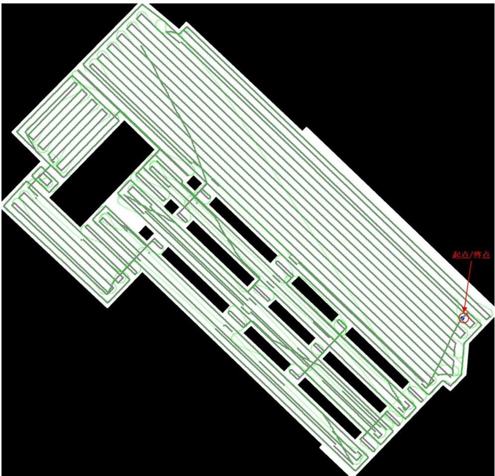

text_image

起点/终点

图2.6 基于牛耕法的全覆盖路径和平滑后路径效果图  
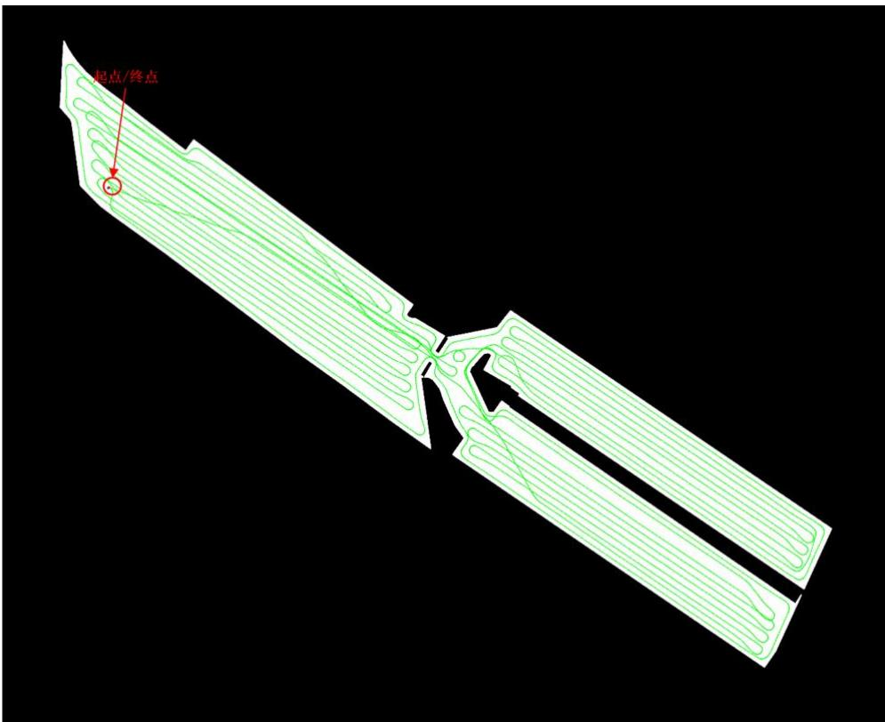

text_image

起点/终点

图 2.7 基于DWA算法的路径平滑算法效果图

# 2.5 本章小结

本章提出了非结构化场景下应用于无人车的全覆盖规划算法，算法共分为两个部分，先通过牛耕式分解法生成能够覆盖整个地图区域的路径，之后通过基于 DWA算法的路径平滑算法对路径进行平滑处理，生成平滑连续的全局路径，用作后续轨迹规划模块的全局参考线。本章算法程序通过C++编写，并在单元测试环境下利用 opencv库对算法进行验证，得出了算法能够生成符合无人车运动学模型并且有效覆盖整个非结构化区域的平滑路径的结论。

# 第 3 章 时空参考轨迹及时空安全走廊生成算法研究

# 3.1 引言

上一章节介绍了面向非结构化场景的全覆盖路径规划算法，本章节将继续研究基于全局路径参考线的轨迹规划算法和时空安全走廊生成算法。本章节将首先介绍轨迹规划中的Frenet 坐标系，并阐明该坐标系与笛卡尔坐标系之间的转化关系，同时罗列了 Frenet 坐标系的优缺点，经分析本章时空联合轨迹规划算法将在 Frenet 坐标系下建立。随后详细介绍了基于时空动态规划的轨迹规划算法原理，该算法将综合考虑对动态、静态障碍物避障能力，为后续基于笛卡尔坐标系的时空联合轨迹优化算法提供优质的参考轨迹。接下来详细阐述了基于时空参考轨迹的时空安全走廊生成算法，生成的安全走廊将作为后续时空联合轨迹优化算法的安全性不等式约束。本章的最后在单元测试环境下对算法进行了验证。

# 3.2 Frenet 坐标系

# 3.2.1 Frenet 坐标系介绍

Frenet 坐标系也被称为曲线坐标系，是一种常用于描述曲线或路径的局部坐标系。它基于曲线的切线、法线的概念，提供了一种更直观和便于处理曲线运动的表示方法，在道路轨迹规划建模中得到广泛应用。该坐标系可以将现实世界中形状不规则的道路转换为Frenet 框架中的直线表示，在轨迹规划任务中，Frenet 坐标系一般基于前端生成的全局路径作为参考线而建立，如图 3.1所示，其中沿着参考线的方向为 s(station)方向，沿着参考线切线的垂直方向为 l(lateral)方向。

Frenet 坐标系的一个明显优势是可以将任何道路标准化为具有左右边界的道路形式。这样一来，轨迹规划中的非线性边界约束问题就可以转化为线性边界约束内问题。同时，在这种表达方式下，障碍物及道路交通标志物都可以投影到参考线上，得到横纵向的坐标值，可以更方便主车对周围环境信息进行决策。因此，在 Frenet 坐标系下开发的轨迹规划算法可以规划问题，降低算法开发难度，提升算法的普适性。

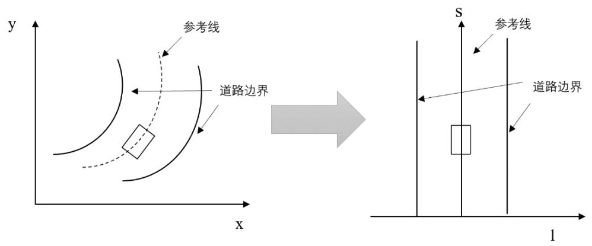

text_image

y
参考线
道路边界
x
S
参考线
道路边界
1

图3.1 笛卡尔坐标系到 Frenet 坐标系转换示意图

虽然 Frenet 有上述优点，但其也存在无法准确建立自车的真实运动学模型的问题。当全局参考线包含多处大曲率路径时，如果直接在 Frenet 坐标系下构造时空联合轨迹优化问题，由于在 Frenet 框架下无法正确地表达车辆实际的运动能力，会导致最优轨迹出现违反曲率和控制量约束限制的问题，同时在这种情况下从 Frenet 坐标系转换为笛卡尔坐标系的轨迹也会出现一定的“失真”现象。此外，参考线路径曲率过大也会出现笛卡尔坐标系到 Frenet 坐标系转换错误的问题，由于从笛卡尔坐标系的(??,??)坐标转换到Frenet 坐标系的(s,l)坐标需要找到转换点在参考线上的匹配点，当参考线路径曲率过大时，会出现如图 3.2 所示的问题，转换点到参考线上点 $\mathsf { p } 1$ 和点 ${ \tt p } 2$ 的距离相等，即存在两个匹配点，导致其 s 坐标值出现错误的问题，进而引发障碍物的Frenet 坐标转换错误，影响算法中的避障处理，本章节第三小节内容会给出这个问题的解决方法。

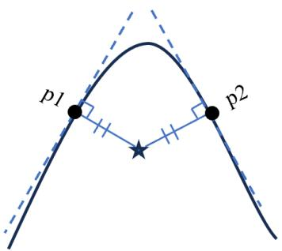

text_image

p1
p2

图3.2 笛卡尔坐标系到 Frenet 坐标系转换错误示意图

综上所述，结合在 Frenet 坐标系下进行轨迹规划的优缺点，本章节提出的基于时空动态规划的轨迹规划算法旨在快速搜索出一条在时空上不与任何障碍物及边界碰撞的时空粗轨迹，作为后续轨迹优化的参考轨迹，因此算法选择在 Frenet 坐标系下建立。

# 3.2.2 Frenet 坐标系与笛卡尔坐标系转换关系推导

如图3.3所示，假设在笛卡尔坐标系下存在一条轨迹和一条参考线，现将该轨迹上的点转换到以参考线建立的 Frenet 坐标系上。其中，假设轨迹上任意一点表示的向量为??⃗(??, ??)，该点沿着轨迹切向方向的切向量为 $\vec { T } _ { \vec { x } }$ ，法向量为 $\lvert \overrightarrow { N } _ { \vec { x } }$ ，切向量的水平夹角为 $\theta _ { \vec { x } }$ ，该点在参考线上的投影向量为?? (??)，该投影点的切向量和法向量分别为 $\vec { T } _ { \vec { r } } \mathcal { \bar { \mathsf { H } } } \vec { N } _ { \vec { r } }$ ，切向量与水平夹角为 $\theta _ { \vec { r } }$ 。点??⃗(??, ??)和点?? (??)之间的距离为??(??)。根据本文算法需要，在笛卡尔坐标系下定义如下变量， $v _ { x }$ 表示该点的速度，方向沿 $\bar { \overline { { \ u { T } } } } _ { \vec { x } } , a _ { x }$ 表示主车的加速度，$\kappa _ { x }$ 表示该点的曲率。在 Frenet 坐标系下定义如下变量，定义 $l ^ { \prime } = d l / d s \mathcal { F } \mathbb { H } l ^ { \prime \prime } = d l ^ { \prime } / d s$ ，分别表示横向坐标对纵向坐标的一阶导数和二阶导数，定义 $\dot { l } = d l / d t \mathcal { F } \mathbb { H } \ddot { l } = d \dot { l } / d t$ 分别表示主车横向的速度和加速度，同理可定义??̇和??̈分别表示主车纵向的速度和加速度。定义 $\Delta \theta = \theta _ { \vec { x } } - \theta _ { \vec { r } }$ 为航向偏差角。

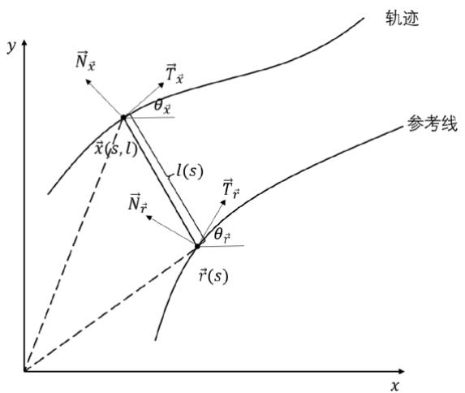

text_image

轨迹
参考线
y
x
\vec{N}_{\vec{x}}
\vec{T}_{\vec{x}}
\vec{\theta}_{\vec{x}}
\vec{x}(s,l)
l(s)
\vec{N}_{\vec{r}}
\vec{T}_{\vec{r}}
\vec{\theta}_{\vec{r}}
\vec{r}(s)

图3.3 Frenet 坐标系和笛卡尔坐标系关系转换

为便于后续推导，首先求坐标轴对弧长的导数。假设曲线中，有无限接近的两个点 $s _ { 1 }$ 和 $s _ { 2 }$ ，基于这两个点的切向量和法向量分别为 $\overrightarrow { T _ { 1 } }$ 、 $\overrightarrow { N _ { 1 } }$ 和 $\overrightarrow { T _ { 2 } } \cdot \overrightarrow { N _ { 2 } }$ ，如图 3.4 所示。根据定义式(3.1)，

$$
\frac {d \vec {T}}{d s} = \lim _ {\Delta \rightarrow 0} \frac {\overrightarrow {T _ {1}} - \overrightarrow {T _ {2}}}{\Delta s}. \dots \tag {3.1}
$$

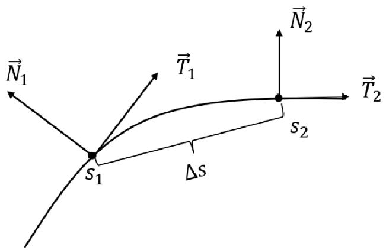

text_image

N̅₁
T̅₁
S₁
ΔS
S₂
N̅₂
T̅₂

图3.4 坐标系微分图

假设向量 $\overrightarrow { T _ { 1 } }$ 和 $\overrightarrow { T _ { 2 } }$ 间的夹角为Δ??，由于 $\Delta s .$ 足够小，则 $\overrightarrow { T _ { 1 } }$ 和 $\overrightarrow { T _ { 2 } } .$ 足够接近，且均为单位向量， $\Delta \theta$ 趋于 0，满足 $s \mathrm { i n } ( \varDelta \theta ) \approx \Delta \theta$ ，则有，

$$
\frac {d \vec {T}}{d s} = \lim _ {\Delta \rightarrow 0} \frac {\overrightarrow {T _ {1}} - \overrightarrow {T _ {2}}}{\Delta s} = \lim _ {\Delta \rightarrow 0} \frac {\Delta \theta \vec {N}}{\Delta s} = \kappa \vec {N} \dots\dots (3. 2)
$$

同理有，

$$
\frac {d \vec {N}}{d s} = - \kappa \vec {T} \dots\dots(3. 3)
$$

因为切向量与法向量均为单位向量，有以下关系式成立，

$$
\left\{ \begin{array}{l l} \overrightarrow {T _ {\vec {r}}} & = [ c o s \theta_ {r}, s i n \theta_ {r} ] ^ {T} \\ \overrightarrow {N _ {\vec {r}}} & = [ - s i n \theta_ {r}, c o s \theta_ {r} ] ^ {T} \\ \overrightarrow {T _ {\vec {x}}} & = [ c o s \theta_ {x}, s i n \theta_ {x} ] ^ {T} \\ \overrightarrow {N _ {\vec {x}}} & = [ - s i n \theta_ {x}, c o s \theta_ {x} ] ^ {T} \end{array} \right. \dots\dots (3. 4)
$$

根据向量运算法则关系，有如下关系，

$$
\vec {x} (s, l) = \vec {r} (s) + l (s) \overrightarrow {N _ {\vec {r}}} \dots\dots(3. 5)
$$

简写为，

$$
\vec {x} = \vec {r} + l \overrightarrow {N} _ {r} \dots\dots(3. 6)
$$

因此和??关系有，

$$
l = [ \vec {x} - \vec {r} ] ^ {T} \overrightarrow {N _ {r}} \dots\dots(3. 7)
$$

因此??在笛卡尔坐标系下的长度可以表示为，

$$
l = \sqrt {(x - x _ {r}) ^ {2} + (y - y _ {r}) ^ {2}} \dots\dots(3. 8)
$$

对公式(3.7)两端对时间进行求导，有，

$$
\dot {l} = [ \dot {\vec {x}} - \dot {\vec {r}} ] ^ {T} \overrightarrow {N} _ {r} + [ \vec {x} - \vec {r} ] ^ {T} \dot {\overrightarrow {N}} _ {r} \dots\dots(3. 9)
$$

其中，

$$
\dot {\vec {x}} = \frac {d \vec {x}}{d t} = v _ {x} \overrightarrow {T _ {x}} \dots\dots(3. 1 0)
$$

同样，

$$
\dot {\vec {r}} = \dot {s} \overrightarrow {T _ {r}} \dots\dots(3. 1 1)
$$

同时有，

$$
\dot {\overrightarrow {N _ {r}}} = \frac {d \dot {\overrightarrow {N _ {r}}}}{d t} = \frac {d \dot {\overrightarrow {N _ {r}}}}{d t} \frac {d s}{d t} = - \kappa \dot {s} \overrightarrow {T _ {r}} \dots\dots(3. 1 2)
$$

根据上面式子可得，

$$
\dot {l} = [ \boldsymbol {v} _ {x} \overrightarrow {T _ {x}} - \dot {\boldsymbol {s}} \overrightarrow {T _ {r}} ] ^ {T} \overrightarrow {N _ {r}} - l \overrightarrow {N _ {r}} \kappa \dot {\boldsymbol {s}} \overrightarrow {T _ {r}} \dots\dots (3. 1 3)
$$

又因为 $| \overrightarrow { T _ { r } } |$ 和 $\overrightarrow { N } _ { r }$ 正交，所以有，

$$
i = v _ {x} \overrightarrow {T _ {x}} ^ {T} \overrightarrow {N _ {r}} \dots \tag {3.14}
$$

带入上式可以得到，

$$
\dot {l} = v _ {x} \overrightarrow {T _ {x}} ^ {T} \overrightarrow {N _ {r}} = v _ {x} * (c o s \theta_ {r} s i n \theta_ {x} - s i n \theta_ {r} c o s \theta_ {x}) = v _ {x} \sin (\Delta \theta) \dots \tag {3.15}
$$

等式两边同时对时间求导可得，

$$
\dot {\vec {x}} = \dot {\vec {r}} + l \overrightarrow {N} _ {r} + l \dot {\overrightarrow {N}} _ {r} \dots\dots(3. 1 6)
$$

将上述推导结果带入有，

$$
\dot {\vec {x}} = \dot {s} \overrightarrow {T _ {r}} + \frac {d l}{d t} \overrightarrow {N _ {r}} - l \kappa \dot {s} \overrightarrow {T _ {r}} = \dot {s} (1 - \kappa l) \overrightarrow {T _ {r}} + i \overrightarrow {N _ {r}} \dots\dots(3. 1 7)
$$

求解纵向速度有，

$$
v _ {x} = \left\| \dot {\vec {x}} \right\| = \sqrt {\dot {s} ^ {2} (1 - \kappa l) ^ {2} + \dot {l} ^ {2}} \dots\dots(3. 1 8)
$$

对于公式(3.17)两边同乘 $\overrightarrow { T _ { r } }$ 有，

$$
\dot {\vec {x}} \overrightarrow {T _ {r}} = \dot {s} (1 - \kappa l) \overrightarrow {T _ {r} T _ {r}} + l \overrightarrow {N _ {r}} \overrightarrow {T _ {r}} \dots\dots(3. 1 9)
$$

由公式(3.10)和公式(3.15)可得，

$$
\dot {s} = \frac {v _ {x} \cos (\Delta \theta)}{1 - \kappa l}. \tag {3.20}
$$

最终得到从笛卡尔坐标系到 Frenet 坐标系的转换关系如下，

$$
\left\{ \begin{array}{c} \| l \| = \sqrt {(x - x _ {r}) ^ {2} + (y - y _ {r}) ^ {2}} \\ \dot {l} = v _ {x} \sin (\Delta \theta) \\ \dot {s} = \frac {v _ {x} \cos (\Delta \theta)}{1 - \kappa l} \\ l ^ {\prime} = (1 - \kappa l) \tan (\Delta \theta) \\ l ^ {\prime \prime} = (\kappa l ^ {\prime} + \kappa^ {\prime} l) \tan (\Delta \theta) + \frac {1 - \kappa l}{\cos^ {2} (\Delta \theta)} \Bigl (\frac {1 - \kappa l}{\cos (\Delta \theta)} \kappa_ {x} - \kappa_ {r} \Bigr) \\ \dot {v _ {x}} = \ddot {s} \frac {1 - \kappa l}{\cos (\Delta \theta)} - \frac {\dot {s} ^ {2}}{\cos^ {2} (\Delta \theta)} [ (1 - \kappa l) \tan (\Delta \theta) (\Delta \theta) ^ {\prime} - (\kappa l ^ {\prime} + \kappa^ {\prime} l) ] \end{array} \right. \dots\dots (3. 2 1)
$$

对于从Frenet 坐标系到笛卡尔坐标系的转化关系，用同样方法可以推导，由于篇幅关系不再赘述，现直接给出对应公式如下，

$$
\left\{ \begin{array}{c} x _ {x} = x _ {r} - l s i n (\theta_ {r}) \\ y _ {x} = y _ {r} + l c o s (\theta_ {r}) \\ \theta_ {x} = \arctan \left(\frac {l ^ {\prime}}{1 - \kappa_ {r} l}\right) + \theta_ {r} \\ v _ {x} = \sqrt {[ \dot {s} (1 - \kappa_ {r} l) ] ^ {2} + (\dot {s} l ^ {\prime}) ^ {2}} \qquad \dots\dots (3. 2 2) \\ a _ {x} = \ddot {s} \frac {1 - \kappa_ {r} l}{c o s (\theta_ {x} - \theta_ {r})} + \frac {\dot {s} ^ {2}}{c o s (\theta_ {x} - \theta_ {r})} [ l ^ {\prime} (\kappa_ {x} \frac {1 - \kappa_ {r} l}{c o s (\theta_ {x} - \theta_ {r})} - \kappa_ {r}) - (\kappa_ {r} ^ {\prime} l + \kappa_ {r} l ^ {\prime}) ] \\ \kappa_ {x} = ((l ^ {\prime \prime} + (\kappa_ {r} ^ {\prime} l + \kappa_ {r} l ^ {\prime}) \tan (\theta_ {x} - \theta_ {r})) \frac {c o s ^ {2} (\theta_ {x} - \theta_ {r})}{1 - \kappa_ {r} l} + \kappa_ {r}) \frac {c o s (\theta_ {x} - \theta_ {r})}{1 - \kappa_ {r} l} \\ \end{array} \right.
$$

根据上述推导关系，本章节提出的算法首先将车辆在笛卡尔坐标系下的初始位置转换到Frenet 坐标系下，之后进行轨迹规划，然后将规划结果从 Frenet 坐标系转换到笛卡尔坐标系，并根据规划结果生成时空安全走廊，后续将规划结果作为轨迹优化算法中的参考轨迹。

# 3.3 基于时空动态规划的轨迹规划算法

# 3.3.1 三维采样空间构建

无人车在运行时，需要根据当前状态和期望速度等信息，在可行驶的空间内对未来时刻的状态进行实时帧规划，假设将时间离散化后的??时刻状态量为 $\begin{array} { r l } { { S t a t e } _ { t } = } & { { } } \end{array}$ $[ s , l , \theta , v , a ] ^ { T }$ ，最终轨迹规划的结果为每∆??时刻的状态量，因此在 Frenet 坐标系的轨迹规划本质上是一个横纵向耦合的时空联合规划问题。

无人车整个轨迹规划的空间可以构建成一个三维的??????采样空间，在这个三维的采样空间内，需要分别将规划轨迹的时间、横向偏移和纵向距离离散化，三者离散化后的维度为别记为 $) d i m e n s o n _ { t }$ 、??????????????????、 $d i m e n s o n _ { s }$ 。其中对于时间维度，单帧轨迹规划总时长记为 $\Pi _ { h o r i z o n }$ ，本文选取为 8s，即每一帧规划未来 8s 的轨迹，则离散化后的时间间隔 $\Delta T = T _ { h o r i z o n } / d i m e n s o n _ { t }$ 。对于横向规划空间，主车可安全运行的横向边界为参考线上当前点的道路左右最大宽度减去安全冗余距离??????????，记为??????????和????????ℎ??， $l _ { s a f e }$ $\boldsymbol { l } _ { l e f t }$ $\begin{array} { r } { l l _ { r i g h t } , } \end{array}$ 根据向量叉积规则， $l _ { l e f t }$ 为正， $l _ { r i g h t }$ 为负，因此离散化后的横向偏移间隔 $\Delta l =$ $( l _ { l e f t } - l _ { r i g h t } ) / d i m e n s o n _ { l }$ 。对于纵向规划空间，车辆能够运行的最高车速记为 $v _ { m a x }$ ，当前帧参考线的长度为 $s _ { r e f }$ ，则在 $T _ { h o r i z o n }$ 时 间 内 可 行 驶 的 最 大 距 离 $s _ { m a x } =$ $\operatorname* { m i n } { ( v _ { m a x } \ * T \_ h o r i z o n , s _ { r e f } ) }$ ，离散化后的纵向距离间隔 $\Delta s = \ s _ { m a x } / d i m e n s o n _ { s }$ ，示意图如图3.5所示，图中每个黑色点为采样点，表示当前层时间切片上的 $( s , l )$ 坐标，每层时间切片上的横纵向采样空间是相同的，因此整个时空上的采样空间维度为$d i m e n s o n _ { t } * d i m e n s o n _ { l } * d i m e n s o n _ { s }$ 。

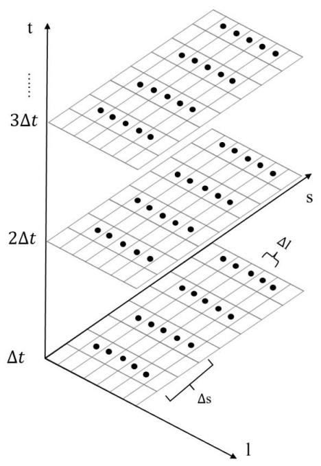

text_image

t
...
3Δt
2Δt
Δt
s
Δl
Δs
l

图3.5Frenet 坐标系下的采样空间

对于采样空间中各个维度的确定，选取的????????????????越大，表明对空间采样越精细，能够考虑到更多可能的状态，更好地适应复杂和多样化的环境，从而提高规划的稳定性和准确性。由于整个算法的空间复杂度为 $O ( n ^ { 3 } )$ ，如果????????????????过大，会大幅增加空间内的采样点数，进而引起后续轨迹规划算法在遍历采样点时的迭代次数会以立方级的形式增长，导致大幅增加轨迹规划算法的时间复杂度，影响整个规划算法的实时性。因此根据本文无人车最高时速的规定、单帧规划的最长时间的规定并且综合采样精度和实时性等因素，上述参数在本文算法中的设定如表 3.1 所示。

表3.1 采样空间参数表

<table><tr><td>参数符号</td><td>参数含义</td><td>参数值</td><td>参数单位</td></tr><tr><td> $T_{horizon}$ </td><td>单帧规划的最长时间</td><td>8</td><td>s</td></tr><tr><td> $dimenson_t$ </td><td>离散化的时间维度</td><td>5</td><td>-</td></tr><tr><td> $dimenson_l$ </td><td>离散化的横向维度</td><td>15</td><td>-</td></tr><tr><td> $dimenson_s$ </td><td>离散化的纵向维度</td><td>11</td><td>-</td></tr><tr><td> $l_{safe}$ </td><td>左右边界安全裕度</td><td>0.75</td><td>m</td></tr><tr><td> $l_{left}$ </td><td>道路左边界最大宽度</td><td>4.0</td><td>m</td></tr><tr><td> $l_{right}$ </td><td>道路右边界最大宽度</td><td>-4.0</td><td>m</td></tr><tr><td> $v_{max}$ </td><td>规划规定最高车速</td><td>1</td><td>m/s</td></tr></table>

# 3.3.2 主车与障碍物的碰撞检测

在构建完三维采样空间后，根据选取的车辆和障碍物轮廓模型构建方式的不同，会影响算法在每次遍历到某个节点时车辆与障碍物的碰撞检测方法。根据前文分析可知，由于整个算法的空间复杂度很高，因此不同的碰撞检测方法会显著地影响整个轨迹规划算法的耗时。

为了能够判断轮廓几何间的碰撞关系，对于车辆轮廓模型的构建，可以有多种方式，包括轴对齐包围盒(Axis-Aigned Bounding Box，AABB)、有向包围盒(OrientedBounding Box，OBB)和根据宽高比通过多个圆包围矩形框(Circle Enclosing Rectangle，CER)，如图3.6和图3.7所示。其中AABB 包围盒模型通过边与坐标轴 XY轴对齐的车辆模型的外接矩形构建，并且随着车辆位姿的变化，其外接矩形的长宽也会不断变化。AABB 碰撞检测算法非常简单，计算速度快，它只需要比较两个边界框的位置关系和重叠情况，而无需进行复杂的几何计算或变换。但 AABB 是一种粗略的包围盒形状，它只能近似地描述物体的形状，尤其在当物体长宽比过大时对物体轮廓描述十分不准确，很容易造成碰撞误判，因此通常适用于粗略的碰撞检测。OBB 包围盒模型类似于 AABB 包围盒模型，但其可以根据车辆的横摆角和形状进行旋转，因此能够更准确地描述物体的形状，对于几何间的碰撞检测更为精确，但 OBB 碰撞检测算法相对复杂，需要考虑旋转矩阵的计算和变换，并比较多个边界框的位置关系，计算复杂度较高，会极大地影响算法的实时性。CER 模型通过计算障碍物的宽高比，使用多个外接圆包围矩形框构建碰撞检测模型，对于车辆模型而言，可以分别用两个圆心在前后轴中心的圆代表车辆形状，碰撞检测时只需计算圆心与圆心之间的距离是否小于安全距离即可。相比于 AABB，这种建模方式能够更好地利用车辆和障碍物的位姿信息，对物体轮廓描述更为准确，因此碰撞检测更为精准，同时相比于 OBB，虽然碰撞检测精度降低，但大幅减少了碰撞检测的计算复杂度，能够更好地满足算法实时性的要求。综上所述，本章主车与障碍物间的碰撞检测模型选取为 CER 模型。

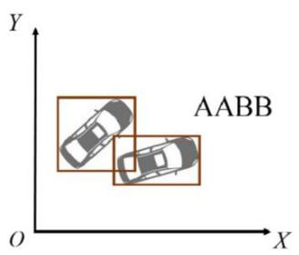

text_image

Y
O X
AABB

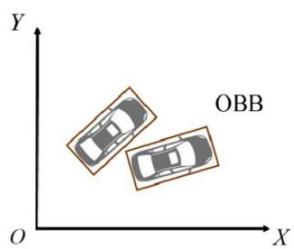

text_image

Y
OBB
X
O

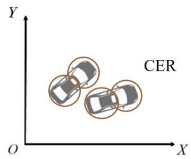

text_image

Y
CER
O
X

图3.6 多种车辆轮廓模型的构建  
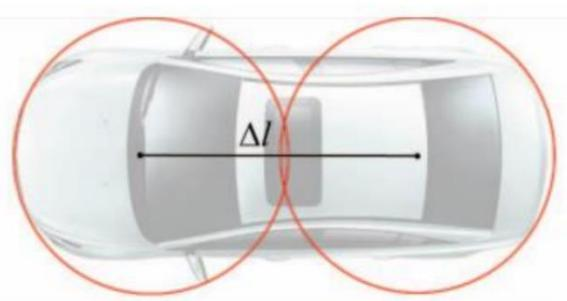

text_image

Δl

图3.7 通过两个圆表示车辆形状

假设自车及障碍物矩形框模型如图 3.8所示，现推导通过 N个相同半径圆覆盖矩形框的 CER 模型碰撞检测公式。假设车身矩形框被 $N _ { D I S C }$ 个相同半径的圆盘覆盖，如图3.9所示。定义 $( x ^ { d i s c j } , y ^ { d i s c j } )$ 表示第??个圆盘的圆心坐标，圆心坐标为，

$$
\left\{ \begin{array}{l} x ^ {d i s c j} (t) = x (t) + \left(\frac {2 j - 1}{2 N _ {D I S C}} (L _ {R} + L _ {W} + L _ {F}) - L _ {R}\right) c o s \theta (t) \\ y ^ {d i s c j} (t) = y (t) + \left(\frac {2 j - 1}{2 N _ {D I S C}} (L _ {R} + L _ {W} + L _ {F}) - L _ {R}\right) s i n \theta (t) \dots\dots (3. 2 3) \\ j = 1, \ldots , N _ {D I S C}, t \in [ 0, T ] \end{array} \right.
$$

每个圆盘的半径为，

$$
R ^ {d i s c} = \sqrt {(\frac {L _ {R} + L _ {W} + L _ {F}}{2 N _ {D I S C}}) ^ {2} + (\frac {L _ {B}}{2}) ^ {2}} \dots\dots(3. 2 4)
$$

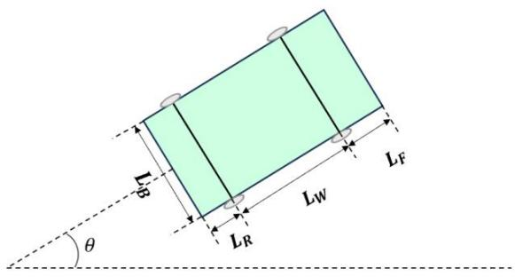

text_image

L
θ
Lr
Lw
Lf

图3.8 车辆矩形模型示意图  
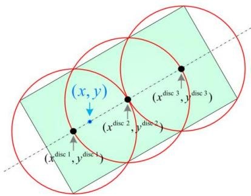

text_image

(x,y)
(x^disc 3, y^disc 3)
(x^disc 2, y^disc 2)
(x^disc 1, y^disc 1)

图 3.9 使用相同半径的圆盘来覆盖矩形车身的示意图(图中 $N _ { D I S C } { = } 3 )$

因此车辆与障碍物间的碰撞检测转化为判断覆盖车辆矩形的圆盘圆心与覆盖障碍物矩形的圆盘圆心距离是否大于安全距离，示意图如图 3.10 所示，假设自车一共??个包围圆，第??个包围圆圆心坐标为 $( x _ { h i } , y _ { h i } )$ ，半径为 $| r _ { h i }$ ，障碍物一共??个包围圆，第??个包围圆圆心坐标为 $\left( x _ { o j } , y _ { o j } \right)$ ，半径为 $\boldsymbol { r } _ { o j }$ ，安全缓冲距离 $b u f f e r _ { s a f e }$ ，安全距离为$d _ { s a f e }$ ，则有 $d _ { s a f e } = r _ { h i } + r _ { o j } + b u f f e r _ { s a f e }$ ，主车与障碍物无碰撞的条件为 $\forall i \in$ $M , \forall j \in N$ 有，

$$
\sqrt {(x _ {h i} - x _ {o j}) ^ {2} + (y _ {h i} - y _ {o j}) ^ {2}} > d _ {s a f e}. \tag {3.25}
$$

此时表明当前状态下主车与障碍物无碰撞风险。

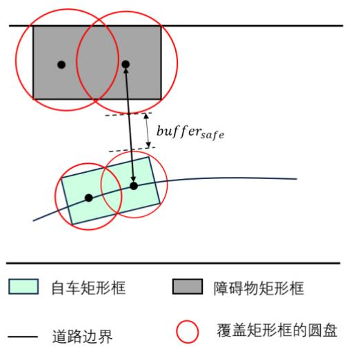

text_image

buffer safe
自车矩形框	障碍物矩形框
道路边界	覆盖矩形框的圆盘

图3.10 车辆与障碍物碰撞模型示意图

# 3.3.3 基于时空动态规划的最优轨迹生成

根据前两小节所述，在构建完三维采样空间后，连接相邻层时间切片上的采样点可构成一段轨迹，将每一个采样点作为状态节点，并对各段轨迹进行质量评估，质量评价值作为连接相邻节点的有向边的权重，因此整个轨迹规划问题变成三维空间下的图论中经典最短路搜索问题[69]，即在图3.5所示空间下的每一层时间切片上寻找一个轨迹点，最终组成一条????????最小的最优轨迹作为后续优化算法的参考轨迹。常见的方法有 Dijkstra 算法、A\*算法、Floyd 算法[70]、Bellman-ford[71]算法以及动态规划算法[72][73]等算法。鉴于轨迹上各个状态点所处的不同阶段，为了降低计算复杂度并更好地保留完整的轨迹代价值和状态点序列，动态规划方法是一种适合的求解方案。通过动态规划，我们可以通过将问题划分为子问题并逐步解决，并利用已计算的子问题结果来避免重复计算，即当前时间层上的节点到起点的最短路径只和上一时间层上的父节点有关，从而大幅减少了节点的拓展，降低了算法的时间复杂度，提高求解效率。

对于传统的基于动态规划的路径规划算法，其生成结果为一条由一系列$\{ ( s _ { 0 } , l _ { 0 } ) \cdots ( s _ { n } , l _ { n } ) \}$ 点组成的路径，因此整个算法在二维空间进行计算，算法的空间复杂度为 $| o ( n ^ { 2 } )$ ，计算复杂度较低，因此任意两个状态点间的转移路径可以通过??次多项式拟合并设计评价函数计算????????。而本文基于时空动态规划算法的状态空间为时空下的三维采样空间，生成结果为一系列由 $\{ ( s _ { 0 } , l _ { 0 } , t _ { 0 } ) \cdots ( s _ { n } , l _ { n } , t _ { n } ) \}$ 点组成的轨迹，整个算法的空间复杂度为 $| o ( n ^ { 3 } )$ ，计算复杂度较高，同时生成轨迹用来生成后续优化算法的安全性约束并作为参考轨迹，因此任意两个状态点间通过线性插值生成转移轨迹并计算????????。由第 3.3.1 小节可知，规划算法的最长规划时间 $T _ { h o r i z o n }$ 为 8??， $d i m e n s o n _ { t }$ 为5，则每层时间切片的间隔 $\Delta T = T _ { h o r i z o n } / d i m e n s o n _ { t } = \ 1 . 6 \mathrm { s }$ ，为保证轨迹的连续性，需要对状态节点间的转移轨迹进行线性插值，插值间隔为 0.2s，求得每个轨迹点的速度 $\begin{array} { r } { v _ { k } = \frac { s _ { k } - s _ { k - 1 } } { \Delta t } } \end{array}$ ????−????−1，加速度?? ∆?? $\begin{array} { r } { a _ { k } = \frac { v _ { k } - v _ { k - 1 } } { \Delta t } } \end{array}$ ????−????−1。所以最终轨迹包含规划起点在内的一共 41 个包 ∆??含位置信息和速度信息的轨迹点。

在时空动态规划算法中，状态节点每次拓展需要选择合法的子节点，即需要对状态子节点进行可行性分析并对节点间的转移轨迹进行碰撞检测。可行性分析中需要保证子节点的 ${ S _ { c h i l d } } - { S _ { p a r e n t } } \leq { v _ { m a x } } * \Delta T$ ，碰撞检测一共包含两个部分，首先需要判断拓展的子节点是否在边界内，假设子节点在采样空间的坐标为 $( s _ { n o d e } , l _ { n o d e } )$ ，则在边界内的安全性条件为 $\begin{array} { r } { l _ { r i g h t } + l _ { s a f e } < l _ { n o d e } < l _ { l e f t } - l _ { s a f e } } \end{array}$ 。最后需要判断转移轨迹是否与时空上的障碍物产生碰撞风险，传统 Frenet 坐标系下的碰撞检测方法一般将障碍物投影到参考线上得到障碍物的投影信息 $( s _ { m i n } , s _ { m a x } , l _ { m i n } , l _ { \mathrm { m a x } } )$ ，如果 $s _ { m i n } < s _ { n o d e } <$ <$s _ { m a x }$ ，并且 $l _ { m i n } + l _ { s a f e } < l _ { n o d e } < l _ { m a x } - l _ { s a f e }$ ，则此时不满足碰撞风险的检测，可以看出这种方法简单方便，由于本文聚焦于大曲率全局路径下的轨迹规划，据第 3.2.1小节分析可知，在这种情况下投影点很容易出错，因此本文选择把 Frenet 坐标转换为笛卡尔坐标进行碰撞检测。对于转移轨迹检测碰撞风险，假设该段转移轨迹上任意一个时间步长对应的状态点为 $( s _ { \Delta } , l _ { \Delta } , t _ { \Delta } )$ ，该点转换为笛卡尔坐标系后的坐标点 $( x _ { \Delta } , y _ { \Delta } )$ ，构建主车的CER 模型，同时根据障碍物的预测信息获得其在 $t _ { \Delta }$ 时刻的CER 模型，最后通过第 3.3.2 小节介绍的碰撞检测方法进行当前时刻的碰撞风险检测，当转移轨迹上每一个轨迹点都无碰撞风险，则当前转移轨迹合法。

对于合法状态节点间的转移轨迹进行轨迹评价，评价函数的设计从以下几个方面考虑，分别是横向距离偏移量、横向距离的变化率、横向速度的大小、速度与参考速度的偏差和可行驶纵向距离的大小，因此状态节点 $s t a t e _ { p a r e n t }$ 和状态节点 $s t a t e _ { c h i l d }$ 间合 法 转 移 轨 迹 的 代 价 $c o s t \big ( s t a t e _ { p a r e n t } , s t a t e _ { c h i l d } \big ) = c o s t _ { l a t e r a l } + c o s t _ { l a t e r a l \_ c h a n g e } +$ $c o s t _ { l a t e r a l \_ v e l o c i t y } + c o s t _ { v e l o c i t y \_ b i a s } + c o s t _ { s p a t i a l }$ ，式子中各项????????对应了上述各部分。

自动驾驶车辆在行驶时，要求轨迹尽可能贴合根据全局路径生成的参考线，这样可以确保车辆在行驶过程中保持在规划的路径上，提高行驶的安全性和稳定性。因此可以选用与参考线的横向距离偏移量即 $l _ { c h i l d }$ 计算相应的代价，式中 $\omega _ { l a t e r a l }$ 为????????的权重。

$$
\operatorname{cost} _ {\text { lateral }} = \omega_ {\text { lateral }} \left| l _ {\text { child }} \right| \dots \tag {3.26}
$$

在贴合参考线的基础上，需要对轨迹的平滑性进行评价，本文选取了横向距离的变化率 $: \frac { d l } { d s }$ 作为评价指标，近似处理为 $| \frac { \Delta l } { \Delta s } \rrangle$ 如下式所示：

$$
c o s t _ {l a t e r a l \_ c h a n g e} = \omega_ {l a t e r a l \_ c h a n g e} (\left| \frac {l _ {c h i l d} - l _ {p a r e n t}}{s _ {c h i l d} - s _ {p a r e n t}} \right|) \dots\dots(3. 2 7)
$$

此外，还需要考虑整个轨迹的舒适性，要求评价轨迹的横向速度，即 $\frac { d l } { d t }$ 尽可能小，近似处理后的代价计算式为：

$$
c o s t _ {l a t e r a l \_ v e l o c i t y} = \omega_ {l a t e r a l \_ v e l o c i t y} (\left| \frac {l _ {c h i l d} - l _ {p a r e n t}}{\Delta T} \right|) \dots\dots(3. 2 8)
$$

最后为保证车辆运行效率，要求轨迹的速度尽可能贴合目标车速大小，同时希望在 $\Delta T$ 的时间间隔内车辆能够行车更远的距离，并且因此分别有代价计算式：

$$
c o s t _ {v e l o c i t y \_ b i a s} = \omega_ {v e l o c i t y \_ b i a s} (\frac {s _ {c h i l d} - s _ {p a r e n t}}{\Delta T} - v _ {d e s i r e d}) ^ {2}. \tag {3.29}
$$

$$
c o s t _ {s p a t i a l} = \omega_ {s p a t i a l} (s _ {m a x} - s _ {c h i l d} + s _ {p a r e n t}) \dots\dots(3. 3 0)
$$

其中 $s _ { m a x } = \operatorname* { m i n } { ( v _ { m a x } * \Delta T , s _ { r e f } - s _ { p a r e n t } ) }$ 。

综上，确定了轨迹评价函数的数学形式，后续时空动态规划算法在拓展节点时通过上述公式计算两个合法状态节点间转移轨迹的代价。

在时空动态规划过程中，假设当前层时间切片上的状态节点 $s t a t e _ { c h i l d }$ 可由上一层时间切片上所有合法的前继状态节点集 $\zeta _ { p a r e n t }$ 中的 $s t a t e _ { p a r e n t }$ 转移而来， $\eta _ { c h i l d }$ 和$\eta _ { p a r e n t }$ 分别表示子节点和父节点到规划起点的最小代价，通过以下规则对 $s t a t e _ { c h i l d }$ 的动态规划状态 $\eta _ { c h i l d }$ 进行状态转移：

$$
\eta_ {c h i l d} = \min \left(\eta_ {c h i l d}, \eta_ {p a r e n t} + c o s t \bigl (s t a t e _ {p a r e n t}, s t a t e _ {c h i l d} \bigr)\right) \dots\dots(3. 3 1)
$$

结合前文所述，基于时空动态规划的最优轨迹生成算法流程如下：

1. 首先将笛卡尔坐标系下的规划起点转换到 Frenet 坐标系，并通过本章提出的评价函数计算第一层时间切片上每一个合法状态子节点的代价，每个合法子节点的最优父节点为规划起点。

2. 接下来依次迭代遍历每一层时间切片上的父节点，通过图 3.11 所示的节点拓展方式得到下一层时间切片的子节点，根据本章介绍的方法保留合法子节点，然后根据公式(3.31)依次求得合法子节点的最小状态转移值，求得最小状态转移值对应的父节点即为当前子节点的最优父节点，重复这个步骤直到最后一层时间切片上的合法子节点都得到最优父节点。

3. 遍历最后一层时间切片上的状态节点，得到代价最小的节点，并根据节点的最优父节点依次回溯最优节点生成最优轨迹点。  
4. 通过本小节介绍的节点间轨迹拟合方法对得到的轨迹点进行线性插值，同时计算每个节点的速度和加速度，将 Frenet 坐标系下的轨迹点状态 $\{ s , l , t , v , a \}$ 转化为笛卡尔坐标系下的轨迹点状态 $\{ x , y , t , v , a \}$ ，最终得到 0 到 8s 且时间间隔为 0.2s的时空参考轨迹。

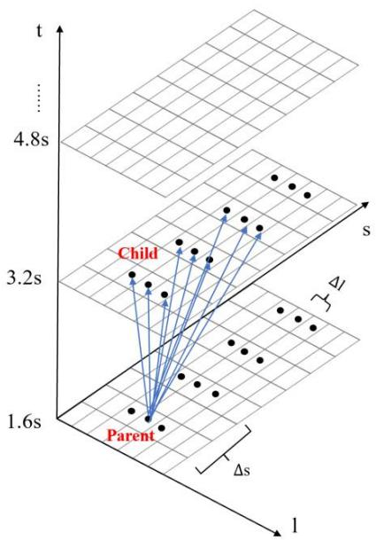

text_image

t
4.8s
3.2s
1.6s
s
Parent
Child
Δl
Δs
l

图3.11 时空动态规划算法节点拓展方式示意图

# 3.4 时空安全走廊生成算法

相比于Frenet 坐标系，直接在笛卡尔坐标系中通过基于优化的方法在连续解空间中能够更灵活地找到最优解，但面临新的问题是难以处理非凸的障碍物和边界碰撞约束，因此整个优化问题很容易变成非线性优化问题，导致求解效率低且容易陷入局部最优解。为解决上述问题，本文通过得到的时空参考轨迹构建时空安全走廊，并在后续优化问题中基于时空安全走廊构造安全性不等式约束。

常见走廊的构建模型有前文介绍的 AABB 和OBB 包围盒两种模型，由前文分析可知 AABB 模型和 OBB 模型最本质的区别在于是否考虑方向性，因此相比之下AABB 模型构建及拓展方式简单，同时每次拓展膨胀时与障碍物的碰撞检测算法复杂度更低，应用较为广泛[64][74]，但正因为其忽略了车辆位姿方向，因此对于复杂空间利用率明显不如 OBB 模型，并且其碰撞检测精度较低，因此其更适用于障碍物少、边界宽广且曲率较小的道路，而 OBB 模型精度高，虽然构建复杂但能够提高安全空间的利用率，保证后续优化问题解空间的连续性，两种不同模型构建的安全走廊对比图如图3.12所示，对于 CER 模型，由于保证点在圆内的数学形式为二次项的非线性约束，故不适用于安全走廊的构建。综上本文时空安全走廊构建模型选择为 OBB 模型。

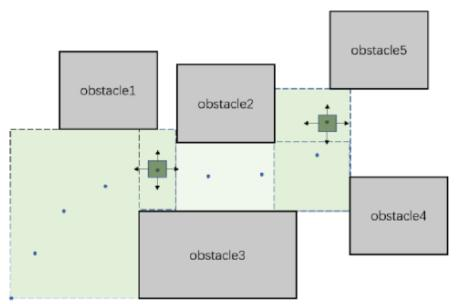

flowchart

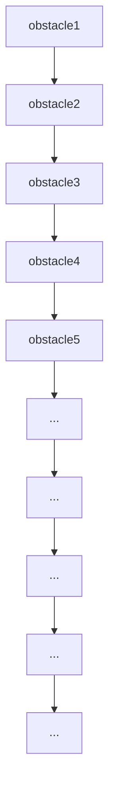
```mermaid
graph TD
    obstacle1["obstacle1"] --> obstacle2["obstacle2"]
    obstacle2 --> obstacle3["obstacle3"]
    obstacle3 --> obstacle4["obstacle4"]
    obstacle4 --> obstacle5["obstacle5"]
    obstacle5 --> dot1["..."]
    dot1 --> dot2["..."]
    dot2 --> dot3["..."]
    dot3 --> dot4["..."]
    dot4 --> dot5["..."]
```

（a）

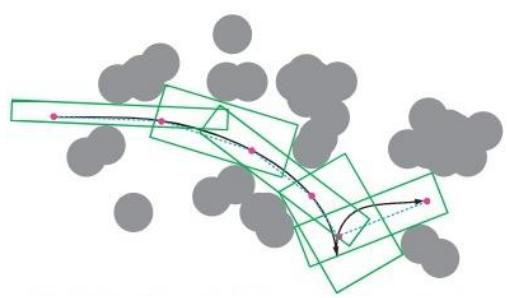

flowchart

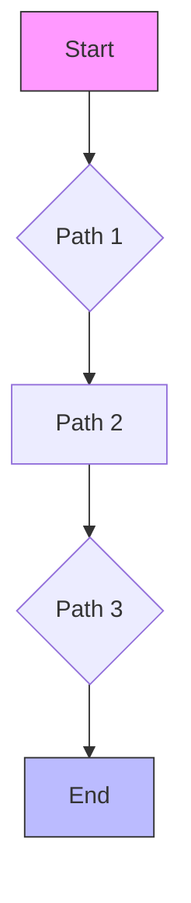
```mermaid
graph TD
    A["Start"] --> B{Path 1}
    B --> C["Path 2"]
    C --> D{Path 3}
    D --> E["End"]
    style A fill:#f9f,stroke:#333
    style E fill:#bbf,stroke:#333
```

(b)   
图 3.12 AABB 模型安全走廊与 OBB 模型安全走廊对比图

本文规定轨迹规划时间为 8??，对于生成时空安全走廊的时间间隔 $r e s o l u t i o n _ { t }$ 选择，如果间隔过小会导致走廊中 OBB 模型过多，由于每个 OBB 模型生成膨胀时都需要与边界和障碍物进行碰撞检测，会大幅增加时间复杂度同时增加不必要的解空间，而间隔过大会导致在狭窄空间出现解空间不连续的问题。因此结合本文无人车规定的最高车速为 $1 m / s$ ，最高加速度为 $0 . 5 m / s ^ { 2 }$ ，每秒能行驶的最大距离为 1.25??，因此选取 $r e s o l u t i o n _ { t } = 1 s$ ，即走廊由8个OBB 模型组成，每个 OBB 中包含时间为 1??的轨迹，这样选择在尽可能降低时间复杂度的前提下保证了解空间的连续性。

时空走廊的 OBB 模型在每次拓展时都需要和障碍物以及边界进行碰撞检测。以走廊中第??个OBB 模型 $b o x _ { i }$ 为例，由于走廊生成时间间隔为 1 秒，因此 $\boldsymbol { \cdot } \boldsymbol { b o x } _ { i }$ 包含了第?? −1秒到??秒的轨迹，每次拓展时与第??秒障碍物位置以及边界进行碰撞检测。在自动驾驶系统中，障碍物一般表示为 OBB 模型，边界以一系列坐标点的形式表示，因此可以将障碍物的 OBB 模型转换成 4 条有方向的线段，而对于表示边界的点可以将任意两个点组成一条线段，并将角度差值小于一定弧度值的线段合并，最终碰撞检测转换为检测走廊的OBB 模型与障碍物、边界组成的线段是否重叠，如图 3.13 所示，进一步转换为判断矩形框对角线的两条线段是否与其他线段重叠，判断线段间是否重叠的方法较为简单，本文不再赘述。

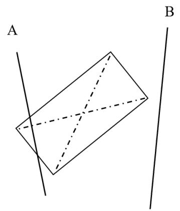

natural_image

Geometric diagram showing a parallelogram with intersecting lines and labeled points A and B (no text or symbols beyond labels)

图3.13OBB 模型与线段碰撞检测示意图

在时空安全走廊的生成算法中，最核心的部分是每个 OBB 模型的拓展方式，同样以走廊中第??个??????为例，首先先根据轨迹坐标点和车辆模型尺寸生成初始 $b o x _ { i }$ ，之后本文以粗拓展和精拓展两个阶段进行 $b o x _ { i }$ 的膨胀拓展，在第一个阶段，以 $b o x _ { i }$ 四条边的方向依次拓展一次为一个循环，第一轮循环中每条边的拓展步长为0.1??，后面每一轮循环拓展步长都变大一倍，同时在每条边拓展一次后都用前述方法进行碰撞检测，如果某条边在尝试拓展后碰撞检测不通过，则停止拓展并且后续不再拓展这条边，直至整个循环中所有边都碰撞检测都不通过，则停止循环，粗拓展过程结束。在第二个阶段，以同样的方法对 ${ b o x } _ { i }$ 进行拓展，但拓展步长始终为 0.1m，并以同样的循环终止条件结束拓展，整个算法过程如图 3.14所示，其中橘黄色矩形框为 $\boldsymbol { \mathrm { I } } \boldsymbol { b } \boldsymbol { o x } _ { i }$ 初始状态，绿色矩形框为粗拓展过程，蓝色矩形框为精拓展过程。相比于传统定步长拓展算法，本文提出的两阶段时空安全走廊拓展算法先通过粗拓展在相距障碍物和边界较远的范围内快速拓展，然后通过精拓展在与障碍物和边界相距较近的危险范围内精确拓展，因此可以在保证拓展精度的前提下大幅减少拓展次数，提升算法的实时性，同时能够更为有效地利用安全空间，保证后续优化算法解空间的连续性。

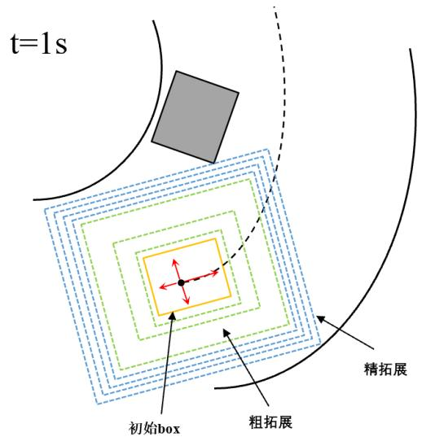

text_image

t=1s
初始box
粗拓展
精拓展

图 3.14 时空安全走廊拓展方式示意图(图中?? = 1)

# 3.5 算法验证分析

为提升轨迹规划算法和安全走廊生成算法的实时性，本章代码均由 C++语言编写，由于本章提出的轨迹规划算法不考虑车辆运动学约束，无法直接作为后续控制算法模块的输入，不能直接在实车仿真平台验证。因此通过代码的单元测试(Unit Test)验证算法性能，并使用开源代码库 opencv将单元测试中算法结果进行可视化。

在单元测试中，为验证本章算法对于动、静态障碍物的处理，因此设计对多动、静态障碍物避让的验证场景，如图 3.15所示，其中(a)、(b)、(c)依次为程序运行时关键帧的可视化效果图，图中共有 3 个静态障碍物和 2 个动态障碍物，红色矩形右侧的轨迹点组成的直线代表动态障碍物的未来轨迹，斜红色直线为参考线，黄色轨迹线为本文基于时空动态规划的轨迹规划算法当前帧结果，绿色矩形框为生成的时空安全走廊，从可视化结果图中可以看出本文提出的轨迹规划算法可以对动态障碍物有很好的避障绕行效果，并与障碍物保持一定的安全距离，同时保证了与参考线的贴合，可作为后续轨迹优化算法的参考轨迹。从图中也可看出基于参考轨迹生成的时空安全走廊在保证了不与障碍物在时空上碰撞的前提下，所包含的安全空间尽可能覆盖整个区域，作为后续轨迹优化算法的安全性约束确保了解空间的连续性。

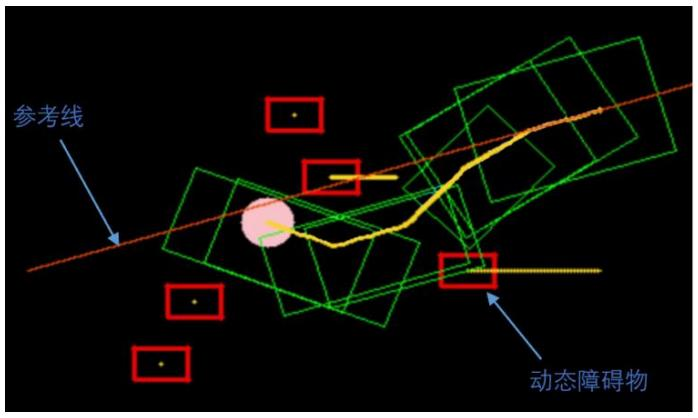

text_image

参考线
动态障碍物

(a)

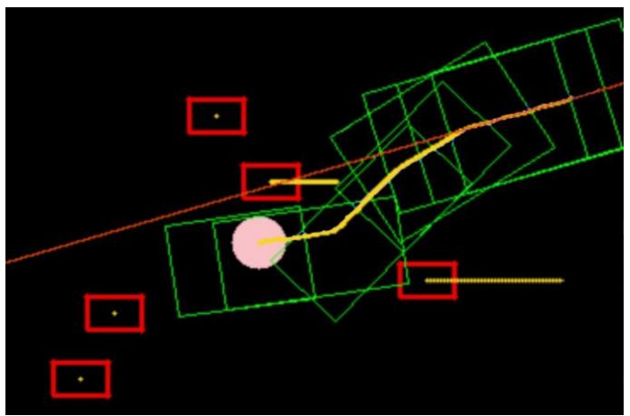

natural_image

Abstract geometric diagram with red and green lines, a pink circle, and dotted lines on black background (no text or symbols)

(b)   
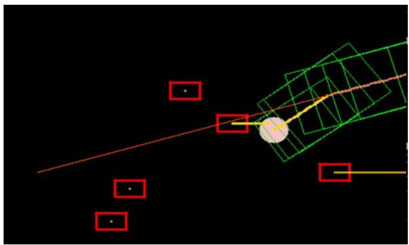

natural_image

Abstract 3D wireframe cube and line diagram with red and yellow square markers on black background (no text or symbols)

(c)   
图 3.15 单元测试实时帧可视化效果图

# 3.6 本章小结

本章首先介绍了轨迹规划算法常用的Frenet坐标系和笛卡尔坐标系之间的优劣对比以及对转换关系进行了推导，并选择在Frenet 坐标系下进行规划。接下来介绍了本章提出的基于时空动态规划的轨迹规划算法中采样空间的构建，并给出了采样维度的具体参数，对比了表示主车与障碍物的几种几何模型并分析各自间的优劣，综合比较下碰撞检测模型选择为 CER 模型，之后结合前面内容介绍了时空动态规划算法评价函数的设计以及整个轨迹算法的主流程。随后介绍了时空安全走廊的原理，分析了不同走廊模型的特点，经对比时空安全走廊模型选择为 OBB 模型，并详细介绍了本文提出的两阶段走廊拓展算法。最后在单元测试中验证了本章提出的算法，算法能够安全地避开动、静态障碍物并贴合参考线，基于规划结果生成的时空安全走廊保证了轨迹的安全性和解空间的连续性。

# 第 4 章 时空联合轨迹优化算法研究

# 4.1 引言

由于上一章节算法在 Frenet 坐标系下得到的轨迹不考虑车辆运动学模型，无法直接作为轨迹规划的结果输出，因此本章节将基于前文算法得到的时空参考轨迹和时空安全走廊，在笛卡尔坐标系下构造时空联合轨迹优化问题并求解。整个轨迹优化问题本质上是一个非凸非线性的最优控制问题，通过常见的优化求解方法如内点法、SQP[75]等方法直接求解最优轨迹计算复杂度高，算法实时性差，因此本文将基于CILQR(Constrained Iterative Linear Quadratic Regulator)框架的高效时空联合轨迹优化算法进行最优轨迹求解。在本章中，首先介绍了在 CILQR 算法框架下构建轨迹优化问题的方法，包括对目标函数、车辆运动学模型以及关于状态量和控制量的不等式约束等数学形式的推导，对于安全性约束的设计，本文通过时空安全走廊构造不等式约束，改进了原算法非凸非线性的约束性质，接下来介绍了 CILQR 算法的整体流程并对前向传递和后向传递这两个核心流程的数学原理进行了详细推导。为提升 CILQR算法优化求解的收敛性，本文在前向传递过程中引入线搜索策略，优化了算法迭代步骤中控制增量的大小，实现算法更快速的收敛和更接近最优解的轨迹。最后总结了整个优化算法迭代过程中各项参数的具体数值，并应用于第五章仿真实验中算法核心代码的编写。

# 4.2 时空联合轨迹优化问题的建立

# 4.2.1 CILQR 问题的定义

根据第一章节的介绍可知，自动驾驶轨迹规划算法可以分成时空解耦式和时空耦合式，时空耦合式算法，即时空联合轨迹优化，相比于解耦式的算法可以更好地处理动态场景，并提升生成轨迹的灵活性和适应性。由第三章对轨迹规划常见的两种坐标系分析可知，在包含大曲率全局路径的轨迹规划任务中，为更好地考虑车辆运动学模型和避免障碍物坐标投影出错，本章基于笛卡尔坐标系构建时空联合轨迹优化问题。时空联合轨迹优化问题本质上可以看成是一个有约束的最优控制问题，规划结果是连续的、最优的，并且具有时空特性，然而由于车辆运动学模型的非线性特性以及避障约束的非凸性质，该问题包含非线性等式约束和非凸不等式约束，导致求解优化问题非常困难且效率低下。迭代线性二次调节器(ILQR)是一种基于线性二次调节器(LQR)的算法，相比于通用非线性数值优化求解器 IPOPT，ILQR 算法(Iterative LinearQuadratic Regulator)利用动态规划思想可以高效地解决标准 LQR 最优控制问题。其最重要的优势是时间效率，能够有效解决时空联合轨迹优化问题中的实时性挑战。除了利用动态规划的优势外，ILQR 算法还利用解析导数和海森矩阵，而不是有限差分法，进一步减少运行时间，但该算法仅能解决带系统状态方程约束的非线性优化问题，无法解决存在避障约束和运动学约束限制的一般道路自动驾驶轨迹规划问题。CILQR(Constrained Iterative Linear Quadratic Regulator)算法在 ILQR 算法的基础上同样利用了动态规划算法对标准 LQR 问题求解的高效性优势，并在算法迭代过程中通过障碍函数将不等式约束转化为目标函数，将非线性约束线性化，障碍函数二次化，并添加到初始目标函数中，能够解决一般道路自动驾驶轨迹规划问题，因此本文将基于CILQR 算法构建并求解时空联合轨迹优化问题。

本文时空联合轨迹优化问题可以表述为：

$$
\min J = \sum_ {t = 0} ^ {N - 1} l (x _ {t}, u _ {t}) + l _ {f} (x _ {N}) \dots\dots(4. 1)
$$

$$
s. t. \quad x _ {0} = x _ {s t a r t} \dots\dots(4. 2)
$$

$$
x _ {t + 1} = f (x _ {t}, u _ {t}) t = 0, 1, \dots , N - 1 \dots\dots(4. 3)
$$

$$
g _ {i} (x _ {t}) \leq 0 t = 0, 1, \dots , N i = 1, 2, \dots , m \dots\dots(4. 4)
$$

$$
h _ {i} (u _ {t}) \leq 0 t = 0, 1, \dots , N - 1 i = 1, 2, \dots , n \dots \tag {4.5}
$$

$$
X = \{x _ {0}, x _ {1}, \dots , x _ {N} \} \dots\dots(4. 6)
$$

$$
U = \{u _ {0}, u _ {1}, \dots , u _ {N - 1} \}. \tag {4.7}
$$

其中，优化目标函数 $l ( x _ { t } , u _ { t } )$ 非二次型，但保证二次可微， $x _ { \mathrm { t } } = [ x ^ { c } , y ^ { c } , v , \theta , a ] ^ { T }$ 为第??个采样时刻的状态量，由第??个采样时刻车辆后轴中心在笛卡尔坐标系下的横纵坐标以及当前车速、横摆角和加速度表示， $u _ { t } = [ j e r k , \omega ] ^ { T }$ 为第??个采样时刻的控制量，由第??个采样时刻车辆的加速度变化率和横摆角速度表示。因此整个优化问题的优化变量为式(4.6)和式(4.7)组成的优化向量矩阵，根据第 3.3 小节可知，本文规定单帧规划总时长为 $ { T _ { h o r i z o n } } = \mathrm { 8 s }$ 并采用等间隔时间采样，离散化后时间间隔 $T _ { s } = 0 . 2 { \mathrm { s } }$ ，因此上式中 $\Nu = 4 0$ 。式(4.1)为整个轨迹优化问题的目标函数，包含了对于每个时刻的状态量和控制量的损失值，式(4.2)到(4.5)为优化问题中的约束，式(4.2)为轨迹初始状态量和车辆当前帧状态量相等的等式约束，式(4.3)为状态量和控制量间状态方程构成的非线性等式约束，式(4.4)和式(4.5)分别为关于状态量和控制量的不等式约束。

对于不等式约束的处理，本文通过 CILQR 算法引入障碍函数，通过障碍函数将不等式约束以惩罚项的形式加到目标函数上，本文选取指数型障碍函数，指数型障碍函数对于轻微的约束违反，函数增长较慢，能够提供较小的惩罚，当违反程度较大时，函数增长速度非常快，可以强烈惩罚严重的约束违反，迫使不等式约束快速满足，其数学形式为：

$$
B (g (x)) = q _ {1} \exp (q _ {2} g (x)) \dots\dots\tag {4.8}
$$

其中 $q _ { 1 }$ 和 $q _ { 2 }$ 为指数型障碍函数的调节参数，具体函数图像如图 4.1 所示。

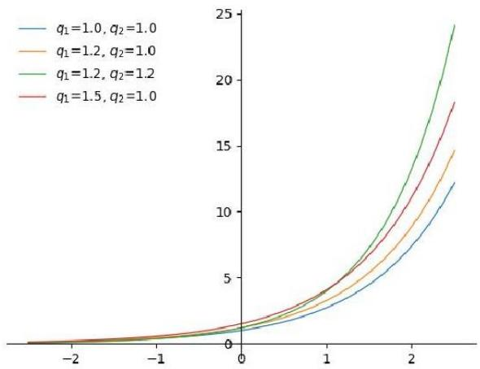

line

| x    | q1=1.0, q2=1.0 | q1=1.2, q2=1.0 | q1=1.2, q2=1.2 | q1=1.5, q2=1.0 |
| ---- | -------------- | -------------- | -------------- | -------------- |
| -2   | ~0             | ~0             | ~0             | ~0             |
| -1   | ~0             | ~0             | ~0             | ~0             |
| 0    | ~0             | ~0             | ~0             | ~0             |
| 1    | ~5             | ~6             | ~7             | ~8             |
| 2    | ~12            | ~14            | ~16            | ~18            |

图4.1 不同参数对应的障碍函数图像

定义障碍函数 $b _ { i } ^ { x _ { t } }$ 、 $b _ { i } ^ { u _ { t } }$ 分别为：

$$
b _ {i} ^ {x _ {t}} = q _ {1} \exp \left(q _ {2} g _ {i} (x _ {t})\right) t = 0, 1, \dots , N i = 0, 1, \dots , m \dots\dots (4. 9)
$$

$$
b _ {i} ^ {u _ {t}} = q _ {1} \exp \bigl (q _ {2} \mathrm{h} _ {i} (u _ {t}) \bigr) t = 0, 1, \dots , N - 1 i = 0, 1, \dots , n \dots\dots (4. 1 0)
$$

定义新的优化目标函数为：

$$
L (x _ {t}, u _ {t}) = l (x _ {t}, u _ {t}) + \sum_ {i = 1} ^ {m} b _ {i} ^ {x _ {t}} + \sum_ {i = 1} ^ {n} b _ {i} ^ {u _ {t}} \dots\dots(4. 1 1)
$$

$$
L _ {f} (x _ {N}) = l _ {f} (x _ {N}) + \sum_ {i = 1} ^ {m} b _ {i} ^ {x _ {N}} \dots\dots(4. 1 2)
$$

原时空联合轨迹优化问题转化为标准的 ILQR 问题形式：

$$
\min J = \sum_ {t = 0} ^ {N - 1} L (x _ {t}, u _ {t}) + L _ {f} (x _ {N}) \dots\dots(4. 1 3)
$$

$$
s. t. \quad x _ {0} = x _ {\text {start}} \dots\dots\tag {4.14}
$$

$$
x _ {t + 1} = f (x _ {t}, u _ {t}) t = 0, 1, \dots , N - 1 \dots\dots(4. 1 5)
$$

$$
X = \left\{x _ {0}, x _ {1}, \dots , x _ {N} \right\} \dots\dots (4. 1 6)
$$

$$
U = \left\{u _ {0}, u _ {1}, \dots , u _ {N - 1} \right\}. \tag {4.17}
$$

# 4.2.2 车辆系统状态方程

车辆运动学模型在轨迹规划任务起到了重要作用，通过对车辆进行准确且简明地建模，可以保证规划的最优轨迹满足车辆运动学约束。目前，常用的车辆运动学模型是自行车模型。这个模型将四轮汽车简化为了一个等效的两轮自行车模型，如图4.2所示，这种简化使得轨迹规划更加高效和实用。

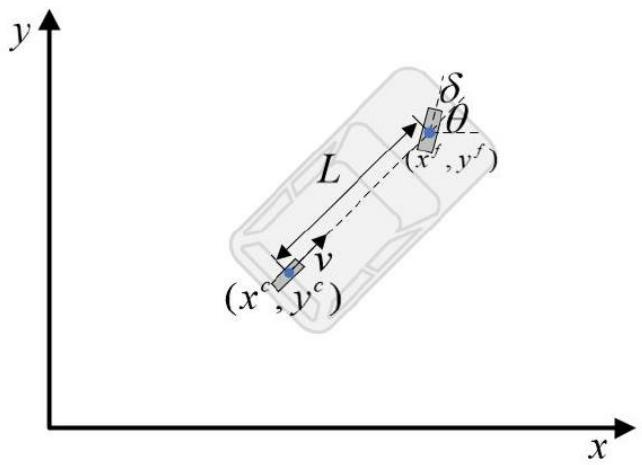

text_image

y
δ
θ
(x', y')
L
v
(x^c, y^c)
x

图4.2 自行车模型示意图

在车辆正常行驶时，侧滑情况很少发生，在不考虑侧滑以及无后轮转角的情况下，车辆模型简化为自行车模型后的前后轮非完整约束方程为：

$$
\left\{ \begin{array}{c} \dot {x ^ {f}} \sin (\theta + \delta) - \dot {y ^ {f}} \cos (\theta + \delta) = 0 \\ \dot {x ^ {c}} \sin \theta - \dot {y ^ {c}} \cos \theta = 0 \\ x ^ {c} + L \cos \theta = x ^ {f} \\ y ^ {c} + L \sin \theta = y ^ {f} \end{array} \right. \dots\dots (4. 1 8)
$$

其中 $( x ^ { c } , y ^ { c } )$ 为后轮横纵向坐标值， $( x ^ { f } , y ^ { f } )$ 为前轮横纵向坐标值，??为车辆横摆角，??为车辆轴距，??为车辆前轮转角，消去 $( x ^ { f } , y ^ { f } )$ 可得：

$$
\dot {x ^ {c}} \sin (\theta + \delta) - \dot {y ^ {c}} \cos (\theta + \delta) - \dot {\theta} L \cos \delta = 0 \dots\dots(4. 1 9)
$$

对于后轮有 $\dot { x ^ { c } } = v c o s \theta , \dot { y ^ { c } } = v s i n \theta$ 带入(4.19)可得 $\begin{array} { r } { \dot { \theta } = \frac { v } { L } t a n \delta } \end{array}$ 。综上，得到自行车模型下的运动学微分方程为：

$$
\left\{ \begin{array}{l} \dot {x ^ {c}} = v c o s \theta \\ \dot {y ^ {c}} = v s i n \theta \\ \dot {v} = a \\ \dot {\theta} = \frac {v}{L} t a n \delta \end{array} \right. \dots\dots (4. 2 0)
$$

结合上一小节可知，第??个采样时刻的状态量为 $x _ { \mathrm { t } } = [ x ^ { c } , y ^ { c } , v , \theta , a ] ^ { T }$ ，控制量为$u _ { t } = [ j e r k , \omega ] ^ { T }$ ，时间间隔为 $I T _ { s }$ ，结合车辆运动学模型式(4.20)，可以根据第??个采样时刻的状态量和控制量得到第??+1个采样时刻的状态量，即离散化后的车辆系统状态方程为：

$$
\left\{ \begin{array}{c} x _ {t + 1} ^ {c} = x _ {t} ^ {c} + c o s \theta_ {t} (v _ {t} T _ {s} + \frac {a _ {t}}{2} T _ {s} ^ {2}) \\ y _ {t + 1} ^ {c} = y _ {t} ^ {c} + s i n \theta_ {t} (v _ {t} T _ {s} + \frac {a _ {t}}{2} T _ {s} ^ {2}) \\ v _ {t + 1} = v _ {t} + a _ {t} T _ {s} \\ \theta_ {t + 1} = \theta_ {t} + \omega_ {t} T _ {s} \\ a _ {t + 1} = a _ {t} + j e r k _ {t} T _ {s} \end{array} \right. \dots\dots\tag {4.21}
$$

因此根据式(4.21)可以写出式(4.15)的状态方程，显然可以看出式(4.15)中的状态函数 $\cdot f ( x _ { t } , u _ { t } )$ 为非线性函数，在 CILQR 算法迭代过程中需要对状态方程进行线性化处理，即在 $( x _ { t } , u _ { t } )$ 进行一阶泰勒展开处理有，

$$
\bar {f} (\delta x _ {t}, \delta u _ {t}) = f _ {x} ^ {T} (x _ {t}, u _ {t}) \cdot \delta x _ {t} + f _ {u} ^ {T} (x _ {t}, u _ {t}) \cdot \delta u _ {t} \dots\dots(4. 2 2)
$$

其中 $\bar { f } ( \delta x _ { t } , \delta u _ { t } ) = f ( x _ { t } + \delta x _ { t } , u _ { t } + \delta u _ { t } ) - f ( x _ { t } , u _ { t } )$ ，对于 ${ f _ { x } } ^ { T } ( x _ { t } , u _ { t } )$ 和 $\mathcal { f } _ { u } ^ { \ T } ( x _ { t } , u _ { t } )$ 有：

$$
f _ {x} ^ {T} (x _ {t}, u _ {t}) = \left[ \begin{array}{c c c c c} 1 & 0 & c o s \theta_ {t} T _ {s} & - s i n \theta_ {t} (v _ {t} T _ {s} + \frac {a _ {t}}{2} T _ {s} ^ {2}) & c o s \theta_ {t} \frac {T _ {s} ^ {2}}{2} \\ 0 & 1 & s i n \theta_ {t} T _ {s} & c o s \theta_ {t} (v _ {t} T _ {s} + \frac {a _ {t}}{2} T _ {s} ^ {2}) & s i n \theta_ {t} \frac {T _ {s} ^ {2}}{2} \\ 0 & 0 & 1 & 0 & T _ {s} \\ 0 & 0 & 0 & 1 & 0 \\ 0 & 0 & 0 & 0 & 1 \end{array} \right] \dots\dots (4. 2 3)
$$

$$
f _ {u} ^ {T} (x _ {t}, u _ {t}) = \left[ \begin{array}{c c} 0 & 0 \\ 0 & 0 \\ 0 & 0 \\ 0 & T _ {s} \\ T _ {s} & 0 \end{array} \right] \dots\dots\tag {4.24}
$$

综上得到了优化问题中的车辆运动学模型和车辆系统状态方程，并通过一阶泰勒展开推导出了线性车辆系统状态方程。

# 4.2.3 优化目标函数设计

对于时空联合轨迹优化问题的目标函数 $L ( x _ { t } , u _ { t } )$ 的设计，可分为状态量相关优化目标和控制量优化目标，即 $L ( x _ { t } , u _ { t } ) = L ^ { s t a t e } + L ^ { c o n t r o l }$ ，式中两项分别代表状态量和

控制量相关的优化目标。

对于状态量的优化目标，本文定义为与时空参考轨迹点的偏移量，即期望最优轨迹和时空参考轨迹在位置、横摆角、速度和加速度间的偏差尽可能小，时空参考轨迹通过第三章提出的基于时空动态规划的轨迹规划算法生成，目标函数设计成二次函数的形式，保证目标函数的凸性，因此有，

$$
L ^ {s t a t e} = (x _ {t} - x _ {t} ^ {r}) ^ {T} W _ {r e f} (x _ {t} - x _ {t} ^ {r}) \dots\dots(4. 2 5)
$$

其中， ${ x _ { t } } ^ { r } = [ { x _ { c } } ^ { r } , { y _ { c } } ^ { r } , \theta ^ { r } , { v ^ { r } } , a ^ { r } ] ^ { \prime }$ ??为参考轨迹对应采样时间间隔的轨迹点的状态信息，

$$
W _ {r e f} = \left[ \begin{array}{c c c c c} {{W _ {p o s}}} & & & & \\ & {{W _ {p o s}}} & & & \\ & & {{W _ {v e l}}} & & \\ & & & {{W _ {t h e t a}}} & \\ & & & & {{W _ {a c c}}} \end{array} \right], W _ {p o s}, W _ {t h e t a}, W _ {v e l} \mathrm{和} W _ {a c c} \mathrm{分别代表状态}
$$

量与参考轨迹点位置、横摆角、速度和加速度偏移量的代价权重值。

在轨迹规划中，考虑加速度变化率和横摆角速度对于生成平滑的轨迹非常重要。通过控制加速度变化率的大小，可以实现减少速度和加速度的突变，使得运动更加平稳和自然。通过控制横摆角速度的大小，可以避免车辆方向快速变化和横向加速度过大，提升驾驶安全和舒适。综合考虑最优轨迹的舒适性和可控性要求，期望控制量中的加速度变化率和横摆角速度尽可能小，同样为保证凸性，目标函数设计成二次函数形式，因此对于控制量的优化目标，本文定义为：

$$
L ^ {c o n t r o l} = u _ {t} ^ {T} W _ {c o n t r o l} u _ {t} \dots\dots(4. 2 6)
$$

其中， $W _ { c o n t r o l } = \left[ \begin{array} { c c } { W _ { j e r k } } & \\ & { W _ { y a w r a t e } } \end{array} \right]$ ， $W _ { j e r k }$ 和 $W _ { y a w r a t e }$ 分别代表控制量中加速度变化率和横摆角速度优化目标项的代价权重值。

# 4.2.4 运动学约束限制

状态量和控制量除了部分优化目标需要被优化，还需要考虑车辆的可控性，因此状态量和控制量需要被加以运动学约束限制。本文状态量和控制量的运动学约束一共分为三部分，分别速度的上下界约束，加速度的上下界约束、横摆角速度的上下界约束和加速度变化率的上下界约束。

对于时空联合轨迹优化问题中速度的约束限制，如下式：

$$
v _ {m i n} \leq v _ {t} \leq v _ {m a x} t = 0, 1, \dots , N \dots\dots(4. 2 7)
$$

其中 $v _ { m a x }$ 和 $v _ { m i n }$ 分别是自动驾驶车辆在轨迹规划任务中所规定的最大速度和最小速度，由前文可知 $N = 4 0$ 。根据式(4.9)将式(4.27)写成障碍函数形式为：

$$
B (g ^ {v} (v _ {t})) = q _ {1} ^ {v} \mathrm{exp} (q _ {2} ^ {v} (v _ {t} - v _ {m a x})) + q _ {1} ^ {v} \mathrm{exp} (q _ {2} ^ {v} (v _ {m i n} - v _ {t})) \dots\dots(4. 2 8)
$$

由此得到速度约束的障碍函数形式。

对于时空联合轨迹优化问题中加速度的约束限制，如下式：

$$
a _ {m i n} \leq a _ {t} \leq a _ {m a x} t = 0, 1, \dots , N \dots\dots\tag {4.29}
$$

其中 $a _ { m a x }$ 和 $\mid a _ { m i n }$ 分别是自动驾驶车辆在运行中所能达到的最大加速度和最小加速度。同理写成障碍函数形式为：

$$
B (g ^ {a} (a _ {t})) = q _ {1} ^ {a} \mathrm{exp} (q _ {2} ^ {a} (a _ {t} - a _ {m a x})) + q _ {1} ^ {a} \mathrm{exp} (q _ {2} ^ {a} (a _ {m i n} - a _ {t})) \dots\dots(4. 3 0)
$$

由此得到加速度约束的障碍函数形式。

对于时空联合轨迹优化问题中横摆角速度的约束限制，如下式：

$$
\omega_ {m i n} \leq \omega_ {t} \leq \omega_ {m a x} t = 0, 1, \dots , N - 1 \dots\dots(4. 3 1)
$$

其中 $\omega _ { m i n } = - \omega _ { m a x } , \omega _ { m a x }$ 是自动驾驶车辆在运行中所能达到的最大横摆角速度。写成障碍函数形式为：

$$
B (g ^ {\omega} (\omega_ {t})) = q _ {1} ^ {\omega} \exp (q _ {2} ^ {\omega} (\omega_ {t} - \omega_ {m a x})) + q _ {1} ^ {\omega} \exp {(q _ {2} ^ {\omega} (\omega_ {m i n} - \omega_ {t}))} \dots \dots (4. 3 2)
$$

由此得到横摆角速度约束的障碍函数形式。

对于时空联合轨迹优化问题中????????的约束限制，如下式：

$$
j e r k _ {m i n} \leq j e r k _ {t} \leq j e r k _ {m a x} t = 0, 1, \dots , N - 1 \dots\dots (4. 3 3)
$$

其中 $j e r k _ { m a x }$ 和 $j e r k _ { m i n }$ 分别是自动驾驶车辆在运行中所能达到的最大加速度变化率和最小加速度变化率。写成障碍函数形式为：

$$
B (g ^ {j} (j e r k _ {t})) = q _ {1} ^ {j} \mathrm{exp} \bigl (q _ {2} ^ {j} (j e r k _ {t} - j e r k _ {m a x}) \bigr) + q _ {1} ^ {j} \mathrm{exp} (q _ {2} ^ {j} (j e r k _ {m i n} - j e r k _ {t})) (4. 3 4)
$$

综上得到了关于状态量和控制量的运动学不等式约束并推导出了对应的障碍函数形式，运动学不等式约束通过障碍函数的形式带入到式(4.11)和(4.12)中，并且障碍函数参数值统一使用 $q _ { 1 } ^ { m o t i o n }$ 和 $\mid q _ { 2 } ^ { m o t i o n }$ 表示，最终作为惩罚项转换成目标函数的一部分，在算法迭代过程中迫使状态量和控制量满足约束。

# 4.2.5 安全性约束限制

自动驾驶车辆在道路行驶时，需要避免与环境中的动态障碍物、静态障碍物和道路边界发生碰撞，例如如何安全地超车以及如何避免碰撞路边停放的静态障碍物，因此在轨迹规划任务中需要对优化变量施加避开障碍物和在边界内的安全性约束。然而在笛卡尔坐标系下避障约束通常是非线性且非凸的不等式约束，如在原 CILQR 算法[57]中，通过椭圆的形式对障碍物进行建模，主车选择 CER 模型建模，并根据障碍物的速度以及规定的安全距离将椭圆长轴和短轴长度拓展以满足避障安全性需求，如图4.3 所示，在优化问题中的不等式约束形式为： $( x _ { t } - x _ { 0 } ) ^ { T } P ( x _ { t } - x _ { 0 } ) > 1 t = 1 , 2 , \dots , N$ ，其中 $x _ { t }$ 为第??个采样时刻的状态量， $x _ { 0 }$ 和??为表示对应采样时刻的障碍物椭圆的数学参数。可以从该数学形式看出，原论文中避障约束是一个高度非凸且非线性的不等式约束，这种方法会导致原优化问题更加复杂同时约束处理变得困难，在 CILQR 迭代过程中，尽管通过罚函数的方法将约束转化到目标函数上，但由于非凸性和非线性性质，每次迭代步骤需要更多的计算来逼近最优解，这可能会导致算法收敛速度变慢，出现无法找到全局最优解，只能收敛到局部最优解的情况。也有方法使用矩形框更好地逼近障碍物形状，但其约束形式本质上都是非凸不等式约束，在优化算法迭代过程中同样会出现上述问题。

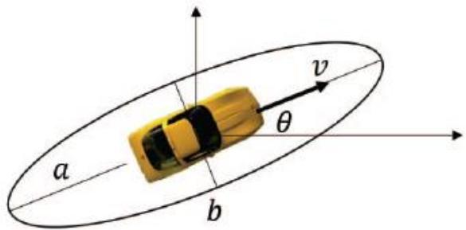

text_image

a
b
v
θ

图4.3 椭圆表示的障碍物模型示意图

对于在边界内的安全性约束，在 Frenet 坐标系下可以很容易地表示为线性不等式约束： $l _ { m i n } \leq l _ { t } \leq l _ { m a x }$ ，其中 $l _ { m i n }$ 、 $l _ { m a x }$ 为当前采样时刻待优化轨迹点沿参考线方向的左右边界宽度， $l _ { m i n }$ 和 $\boldsymbol { \mathrm { I } } \boldsymbol { l _ { m a x } }$ 可以通过离线模式预先计算得到，不占用实时计算资源。但在笛卡尔坐标系下，需要每次根据车辆前、后轴中心 $C _ { k } ^ { 1 }$ 和 $C _ { k } ^ { 2 }$ 坐标，分别计算到左右边界的投影点 $L _ { k } ^ { 1 }$ $L _ { k } ^ { 2 }$ $R _ { k } ^ { 1 }$ 和 $R _ { k } ^ { 2 }$ ，如图 4.4 所示，约束形式为前后轴坐标点和对应左右边界投影点间距离大于设定的安全距离，对于点间距的计算可以使用欧式距离或者通过切线的直线方程计算两点间距。然而无论通过哪种方法计算，边界安全性约束形式都是非线性不等式约束，不利于算法迭代收敛，同时在实际计算机编程环境中，左右边界的数据结构以一系列离散的点的形式保存在容器中，因此每次计算投影点的时候都需要遍历整个容器找到距离最近的点作为投影点，每次迭代都至少需要计算4??次投影点，会大量占用计算资源，影响算法的实时性。

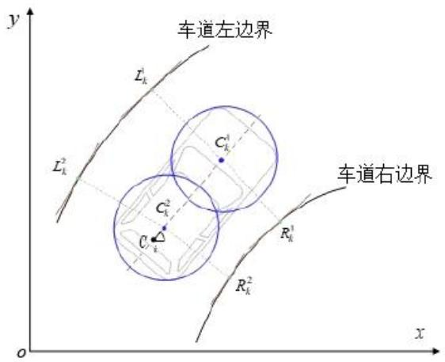

text_image

车道左边界
Lₖ
L₂
Cₖ¹
Cₖ²
Rₖ¹
Rₖ²
车道右边界
x
y
o

图4.4 主车在车道边界的投影

为解决避障和边界安全性约束非凸非线性的性质给优化求解带来的困难，本文基于第三章算法生成的时空安全走廊，对每个采样时刻的状态量 $x _ { t }$ 构造线性不等式安全性约束限制。由第3.4小节可知，本文时空安全走廊一共生成 8个矩形框，走廊中的每个矩形框在生成拓展时保证时间间隔 1s 内的轨迹不与障碍物和边界碰撞。由于本文采样间隔为0.2s，则每个矩形框 $b o x _ { i }$ 包含 5个基于对应采样时刻的状态量和车身尺寸生成的矩形框。时空安全走廊安全性约束构造方法如图 4.5 所示，从 0.2s 到 1s 轨迹的每个采样间隔状态量对应的车身矩形框被约束在走廊的第一个??????内，从1.2s 到2s 轨迹的每个采样间隔状态量对应的车身矩形框被约束在走廊的第二个??????内，以此类推，最终将0 到8s 的轨迹中不包含起点的每个采样时刻的状态量均加以约束限制。

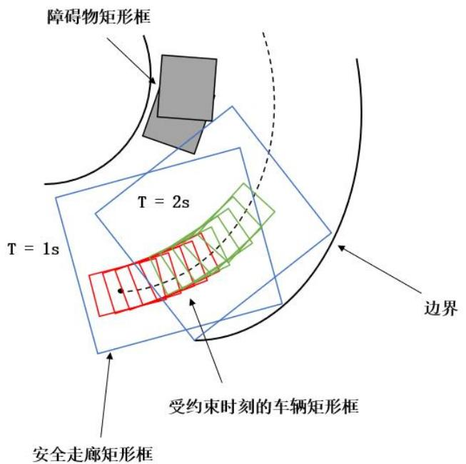

text_image

障碍物矩形框
T = 2s
T = 1s
边界
受约束时刻的车辆矩形框
安全走廊矩形框

图4.5 时空安全走廊安全性约束的构造

对于时空安全走廊约束数学形式的推导，首先考虑走廊模型为更简单的 AABB 矩形框的情况，对于 AABB 矩形框，其左下角的点和右上角的点分别为矩形框 4 个角点中??坐标和??坐标同时最小和最大的点。安全性不等式约束为限制车辆矩形框在走廊AABB 矩形框内，则要求车身矩形框四个角点均在走廊 AABB 矩形框内，假设车辆矩形框四个角点坐标如图 4.6 所示，则约束具体数学形式为：

$$
\left\{ \begin{array}{l} X _ {m i n} \leq x _ {i} \leq X _ {m a x} \\ Y _ {m i n} \leq y _ {i} \leq Y _ {m a x} \end{array} \right. i = 1, 2, 3, 4 \dots\dots (4. 3 5)
$$

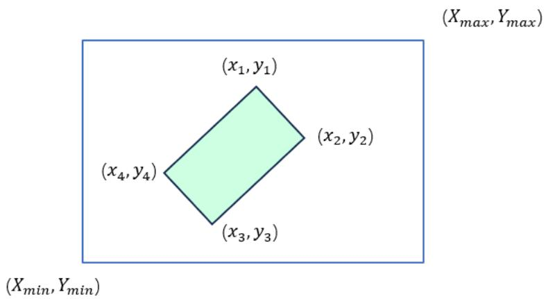

text_image

(Xmax, Ymax)
(x1, y1)
(x2, y2)
(x3, y3)
(x4, y4)
(Xmin, Ymin)

图 4.6 AABB 模型约束车辆矩形框示意图

对于本文时空安全走廊使用的 OBB 矩形框模型，假设第??个采样时刻的状态量 $x _ { t }$ 对应的车辆后轴坐标为 $( x _ { c } , y _ { c } )$ ，横摆角为 $\lvert \theta _ { t }$ ，结合车身尺寸生成的车辆 OBB 矩形框模型的四个角点坐标和其对应的时空安全走廊中的??????模型如图 4.7 所示。同理，安全性不等式约束为将车辆矩形框四个角点均限制在走廊 OBB 矩形框内，首先需要根据走廊 OBB 矩形框的朝向角??，将矩形框顺时针旋转??度， OBB 矩形框的四个角点需要乘以旋转矩阵 $R = \left[ \begin{array} { l l } { { c o s \theta } } & { { s i n \theta } } \\ { { - s i n \theta } } & { { c o s \theta } } \end{array} \right]$ ， 车辆矩形框角点坐标同样需要乘以旋转矩阵??，此时 OBB 矩形框转换为 AABB 矩形框，新 AABB 矩形框角点坐标向量为 $\begin{array} { r } { \left[ \begin{array} { l } { X _ { i } ^ { r } } \\ { Y _ { i } ^ { r } } \end{array} \right] = } \end{array}$ ??????$[ \begin{array} { l l } { { c o s \theta } } & { { s i n \theta } } \\ { { - s i n \theta } } & { { c o s \theta } } \end{array} [ \begin{array} { l } { { X _ { i } } } \\ { { Y _ { i } } } \end{array} ] i = 1 , 2 , 3 , 4$ ，则新 AABB 矩形框四个角点??坐标和??坐标的最大最小值为：

$$
\left\{ \begin{array}{l} X _ {m i n} ^ {r} = \min \left\{X _ {1} ^ {r}, X _ {2} ^ {r}, X _ {3} ^ {r}, X _ {4} ^ {r} \right\} \\ X _ {m a x} ^ {r} = \max \left\{X _ {1} ^ {r}, X _ {2} ^ {r}, X _ {3} ^ {r}, X _ {4} ^ {r} \right\} \\ Y _ {m i n} ^ {r} = \min \left\{Y _ {1} ^ {r}, Y _ {2} ^ {r}, Y _ {3} ^ {r}, Y _ {4} ^ {r} \right\} \\ Y _ {m a x} ^ {r} = \max \left\{Y _ {1} ^ {r}, Y _ {2} ^ {r}, Y _ {3} ^ {r}, Y _ {4} ^ {r} \right\} \end{array} \right. \dots\dots (4. 3 6)
$$

综上所述，第??个采样时刻的状态量 $x _ { t }$ 对应的时空安全走廊安全性不等式约束的数学形式为：

$$
\left\{ \begin{array}{l} X _ {m i n} ^ {r} \leq x _ {i} \cdot c o s \theta + y _ {i} \cdot s i n \theta \leq X _ {m a x} ^ {r} \\ Y _ {m i n} ^ {r} \leq - x _ {i} \cdot s i n \theta + y _ {i} \cdot c o s \theta \leq Y _ {m a x} ^ {r} \end{array} \right. i = 1, 2, 3, 4 \dots\dots (4. 3 7)
$$

将式(4.37)写成障碍函数形式为： $B ( g ^ { s a f e } ( x _ { t } ) ) = q _ { 1 } ^ { s a f e } \mathrm { e x p } \bigl ( q _ { 2 } ^ { s a f e } ( x _ { i } \cdot c o s \theta + y _ { i }$

$$
\left. \sin \theta - X _ {m a x} ^ {r})\right) + q _ {1} ^ {s a f e} \exp \left(q _ {2} ^ {s a f e} (X _ {m i n} ^ {r} - x _ {i} \cdot c o s \theta - y _ {i} \cdot s i n \theta)\right) +
$$

$$
q _ {1} ^ {s a f e} \exp \left(q _ {2} ^ {s a f e} (- x _ {i} \cdot s i n \theta + y _ {i} \cdot c o s \theta - Y _ {m a x} ^ {r})\right) + q _ {1} ^ {s a f e} \exp \left(q _ {2} ^ {s a f e} (Y _ {m i n} ^ {r} + x _ {i} \cdot s i n \theta - Y _ {m a x} ^ {r})\right).
$$

$y _ { i } \cdot c o s \theta ) \ )$ ，由此得到了安全性不等式约束的障碍函数。

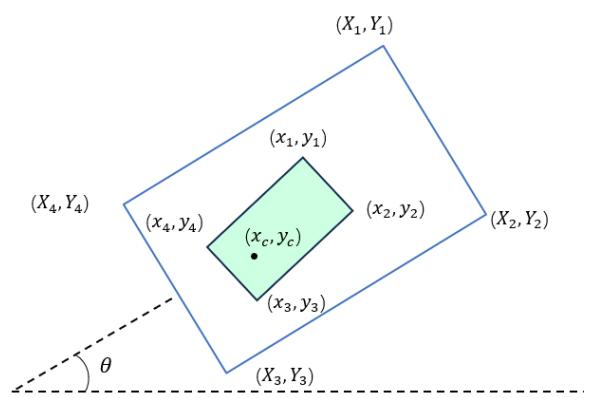

text_image

(X₁,Y₁)
(x₁,y₁)
(x₄,Y₄)
(x₄,y₄)
(xc,yc)
(x₂,y₂)
(x₂,Y₂)
(x₃,y₃)
θ
(X₃,Y₃)

图4.7 OBB 模型约束车辆矩形框

相比于传统的非凸非线性的避障和边界安全性约束，本文通过时空安全走廊构造了统一的安全性不等式约束形式，如式(4.37)所示，从式子的数学形式可以看出，本文提出的空安全走廊安全性约束为线性不等式凸约束，相比于非凸非线性的约束形式，有利于简化轨迹优化问题，保证问题的凸性，减少最优解的收敛次数，同时线性约束还可以减少优化求解过程中梯度和海塞(Hessian)矩阵的计算量， 从而提高 CILQR 算法的求解效率。

# 4.3 基于 CILQR 算法的最优轨迹求解

# 4.3.1 CILQR 算法整体流程

CILQR 算法本质上是 ILQR 算法的拓展，上一小节基于 CILQR 算法框架构建了时空联合轨迹优化问题，包含关于状态量和控制量的目标函数的设计、运动学约束的设计以及时空安全走廊安全性约束的设计，并通过障碍函数将不等式约束作为惩罚项变成目标函数的一部分，进而将一般性的道路轨迹规划问题转化为如式(4.13)到(4.17)所示的 ILQR 问题形式。本小节将基于 CILQR 算法对前文构建的时空联合轨迹优化问题进行最优轨迹地求解。出于安全性地考虑，轨迹规划模块在自动驾驶系统中一般以一定频率调用，即每一帧轨迹规划算法都需要求解出未来 8s 的最优轨迹，因此本文算法对最优轨迹进行实时帧求解。

CILQR 算法求解轨迹优化问题的核心思想和 ILQR 算法一致，即通过迭代优化，逐步改进控制策略以接近最优解。在算法迭代过程中包含两个核心步骤，即后向传递过程(backward pass)和前向传递过程(forward pass)。在后向传递过程中，CILQR 算法利用动态规划算法将由状态优化量序列和控制优化量序列组成的优化问题分解成若干个子问题，对每个子问题的目标函数进行二阶泰勒展开并计算牛顿方向，进而获得每个子问题中对应的状态量和控制量之间的控制律。在前向传递过程中，根据后向传递计算得到的控制律和车辆系统状态方程，结合线搜索策略计算当前迭代循环中新的状态量和控制量的优化序列，这两个步骤的具体原理细节和数学推导将在本章后续小节介绍。

本文基于 CILQR 算法实时帧求解最优轨迹的整体流程如图 4.8 所示， 首先每一帧轨迹规划模块从定位模块获得车辆的初始状态量 $\boldsymbol { x } _ { 0 } = \{ x _ { c } ^ { 0 } , y _ { c } ^ { 0 } , v _ { 0 } , \theta _ { 0 } , a _ { 0 } \}$ ，并根据上一帧最优轨迹的结果确定初始控制量序列 $U _ { 0 } = \{ u _ { 0 } , \ldots , u _ { N - 1 } \}$ 。如果当前帧为第一帧，则初始控制量序列中所有的控制量 $\dot { \boldsymbol { \jmath } } e r \boldsymbol { k } _ { t }$ 和 $\omega _ { t }$ 设定为一个较小的值，本文设定为 0.05。

如果当前帧不是第一帧，则利用热启动(warmstart)技术，即使用上一帧优化求解的最优控制量序列作为当前帧初始控制量序列，在优化求解过程中通过热启动技术可以有效利用上一帧的优化结果，使当前帧初始解在上一帧的最优解处开始迭代，从而减少优化算法的迭代次数、加速优化算法的收敛速度并且提高求解效果。之后根据初始状态量、初始控制量序列和车辆系统状态方程(4.15)，推导出初始状态量序列 $X _ { 0 } =$ $\{ x _ { 0 } , \ldots , x _ { N } \}$ ，将 $X _ { 0 }$ 和 $U _ { 0 }$ 作为当前帧算法迭代过程中的初始解，并根据设计的目标函数计算初始目标函数值 $J _ { o l d }$ ，设置初始正则化系数λ，正则化系数用来保证计算出正确的牛顿方向。之后进入算法迭代求解的循环中，每个循环在经过后向传递和包含线搜索的前向传递过程的计算后，会得到新的状态量优化序列 $X _ { n e w }$ 和控制量优化序列 $U _ { n e w }$ ，并根据这两者计算出对应的目标函数值 $J _ { n e w }$ ，然后判断是否符合线搜索条件，接下来根据判断结果的不同分别进入图中各自的流程。算法优化求解的循环直到收敛条件$\left| \frac { J _ { n e w } - J _ { o l d } } { J _ { o l d } } \right| < t o l$ ???????? 满足时，当前帧算法收敛并退出循环，输出此时的最优状态量序列和控制量序列作为当前帧的最优轨迹。

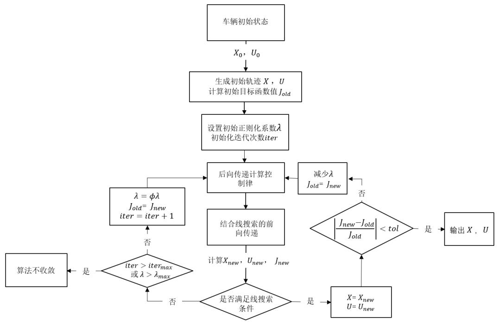

flowchart

```mermaid
graph TD
    A["车辆初始状态"] --> B["X₀, U₀"]
    B --> C["生成初始轨迹 X, U\n计算初始目标函数值 J_old"]
    C --> D["设置初始正则化系数λ\n初始化迭代次数iter"]
    D --> E["后向传递计算控制律"]
    E --> F{结合线搜索的前向传递}
    F -->|否| G{iter > iter_max\n或 λ > λ_max}
    F -->|是| H["算法不收敛"]
    G --> I{是否满足线搜索条件}
    I -->|否| D
    I -->|是| J["X = X_new\nU = U_new"]
    J --> K{|J_new - J_old| < tol}
    K -->|是| L["输出 X, U"]
    K -->|否| M{iter > iter_max\n或 λ > λ_max}
    M -->|否| E
    M -->|是| N["减少λ\nJ_old = J_new"]
    N --> E
```

图 4.8 CILQR 算法流程图

# 4.3.2 后向传递过程

由前文介绍可知，后向传递过程是CILQR算法迭代优化循环中的核心步骤之一，它借鉴了强化学习的思想，并将动态规划算法与优化方法相结合，可以为每个采样时刻的状态计算值函数和控制增益，以指导控制策略的改进。

在后向传递过程中需要定义两个重要函数：价值函数(value function)和动作函数(action function)，价值函数是对于给定状态的评估，表示在给定状态下采取某个控制策略的优势，价值函数通常用符号 $V ( x )$ 表示，其中??是当前的状态向量，价值函数衡量在给定状态下采取某个控制策略的优势程度。动作函数(也称为增强值函数)表示在给定状态和控制输入下采取某个动作的优势，动作函数通常用符号??表示， $Q ( x , u )$ ，其中??是当前的状态向量，??是当前的控制输入向量，动作函数可以看作是对于给定状态和控制输入的评估，衡量在这个状态下采取某个动作的优势程度。动作函数和价值函数的定义利用了动态规划算法，即当前时刻的动作函数由当前时刻状态对应的目标函数和下一时刻的最优价值函数值表示，因此结合本文最终定义的时空联合轨迹优化问题表达式(4.13)到(4.17)，定义价值函数??和动作函数??为：

$$
V _ {N} \left(x _ {N}\right) = L _ {f} \left(x _ {N}\right) \dots \tag {4.38}
$$

$$
Q _ {t} (x _ {t}, u _ {t}) = L (x _ {t}, u _ {t}) + V _ {t + 1} (x _ {t + 1}) t = 0, 1,..., N - 1 \dots\dots\tag {4.39}
$$

$$
V _ {t} (x _ {t}) = \min _ {u _ {t}} Q _ {t} (x _ {t}, u _ {t}) t = 0, 1, \dots , N \dots \tag {4.40}
$$

将状态方程 $x _ { t + 1 } = f ( x _ { t } , u _ { t } )$ 代入式(4.29)有，

$$
Q _ {t} (x _ {t}, u _ {t}) = L (x _ {t}, u _ {t}) + V _ {t + 1} \bigl (f (x _ {t}, u _ {t}) \bigr) t = 0, 1, \dots , N - 1 \dots\dots (4. 4 1)
$$

接下来需要对 $t = 0 , 1 , \ldots , N - 1$ 时，求解 $V _ { t } ( x _ { t } ) = \operatorname* { m i n } _ { u _ { t } } Q _ { t } ( x _ { t } , u _ { t } )$ 。考虑对 $Q _ { t } ( x _ { t } , u _ { t } )$ （20号进行二阶泰勒展开，有： $Q _ { t } ( x _ { t } + \delta x , u _ { t } + \delta u ) = Q _ { t } ( x _ { t } , u _ { t } ) + \big ( Q _ { t _ { x } } { } ^ { T } , Q _ { t _ { u } } { } ^ { T } \big ) ( \delta x , \delta u ) ^ { T } +$ $\begin{array} { r l } { \frac { 1 } { 2 } [ \delta x ^ { T } , \delta u ^ { T } ] } & { { } \stackrel { \textstyle \left[ Q _ { t _ { x x } } \quad Q _ { t _ { x u } } \right] } { \textstyle \left[ Q _ { t _ { u x } } \quad Q _ { t _ { u u } } \right] } [ \delta x ] } \end{array}$ [???????? ???????? ] [????????] ，可以定义????̅̅̅(????, ????)为： $\overline { { Q _ { t } } } ( \delta x , \delta u )$

$$
\overline {{{Q _ {t}}}} (\delta x, \delta u) = \left(Q _ {t _ {x}} ^ {T}, Q _ {t _ {u}} ^ {T}\right) (\delta x, \delta u) ^ {T} + \frac {1}{2} [ \delta x ^ {T}, \delta u ^ {T} ] \left[ \begin{array}{c c} Q _ {t _ {x x}} & Q _ {t _ {x u}} \\ Q _ {t _ {u x}} & Q _ {t _ {u u}} \end{array} \right] \left[ \begin{array}{c} \delta x \\ \delta u \end{array} \right] \dots \dots (4. 4 2)
$$

故原问题可以转化为求解 $\operatorname* { m i n } _ { \delta u } \overline { { Q _ { t } } } ( \delta x , \delta u )$ 。

由 $Q _ { t } ( x _ { t } , u _ { t } )$ 的定义，且注意到 $f ( { \boldsymbol { x } } _ { t } , { \boldsymbol { u } } _ { t } )$ 为线性化之后的函数，可以得到，

$$
\left\{ \begin{array}{c} Q _ {t _ {x}} = L _ {x} + f _ {x} ^ {T} V _ {t + 1 _ {x}} \\ Q _ {t _ {u}} = L _ {u} + f _ {u} ^ {T} V _ {t + 1 _ {x}} \\ Q _ {t _ {x x}} = L _ {x x} + f _ {x} ^ {T} V _ {t + 1 _ {x x}} f _ {x} \\ Q _ {t _ {u x}} = L _ {u x} + f _ {u} ^ {T} V _ {t + 1 _ {x x}} f _ {x} \\ Q _ {t _ {u u}} = L _ {u u} + f _ {u} ^ {T} V _ {t + 1 _ {x x}} f _ {u} \end{array} \right. \dots\dots (4. 4 3)
$$

进而通过计算 $\overline { { Q _ { t } } } ( \delta x , \delta u )$ 的梯度求解a $\Gamma \underline { { \mathsf { g m i n } } } \overline { { Q _ { t } } } ( \delta x , \delta u ) _ { \overline { { \mathsf { H } } } } \qquad $ 得，

$$
\delta u ^ {*} (\delta x) = K _ {t} \delta x + k _ {t} t = 0, 1, \dots , N - 1 \dots\dots(4. 4 4)
$$

$$
k _ {t} = - Q _ {t u u} ^ {- 1} Q _ {t u}. \tag {4.45}
$$

$$
K _ {t} = - Q _ {t u u} ^ {- 1} Q _ {t u x}. \tag {4.46}
$$

将上式求解结果代入 $\overline { { Q _ { t } } } ( \delta x , \delta u )$ 中整理可得，

$$
V _ {t _ {x}} = Q _ {t _ {x}} - K _ {t} ^ {T} Q _ {t _ {u u}} k _ {t}. \tag {4.47}
$$

$$
V _ {t _ {x x}} = Q _ {t _ {x x}} - K _ {t} ^ {T} Q _ {t _ {u u}} k _ {t}. \tag {4.48}
$$

其中 ${ \bf \ddot { \mathbf { k } } } _ { t }$ 的计算结果对应着牛顿方向，进一步对于式中海塞矩阵 $Q _ { t _ { u u } }$ 的逆矩阵的求解，一般有特征值分解法、LU 分解法和 Cholesky 分解等，由于 $Q _ { t _ { u u } }$ 维度较高、计算复杂度大且在算法迭代过程中易出现数值不稳定的现象，因此本文选取计算效率更高且求解稳定性更强的特征值分解法计算求解，同时在特征值分解法计算过程中引入正则化系数??，具体求解过程如下：

1. 首先对 $Q _ { t u u }$ 进行特征值分解： $Q _ { t _ { u u } } = U ^ { T } \Lambda U$   
2. 对Λ进行正则化变换： $\overline { { \Lambda } } = r e l u ( \Lambda ) + \lambda I$ ，其中??为单位矩阵  
3. 求得逆矩阵 $\boldsymbol { Q _ { t _ { u u } } } ^ { - 1 } = \boldsymbol { U ^ { T } } \boldsymbol { \overline { { \Lambda } } } ^ { - 1 } \boldsymbol { U }$

由于矩阵????是一个正定矩阵，因此对Λ进行正则化变换可以避免在迭代求解过程中数值不稳定的影响，使得海塞矩阵更接近于单位矩阵，进而保证通过 ${ Q _ { t } } _ { u u } ^ { - 1 }$ 计算的得到的牛顿方向是梯度下降的方向。

综上，得到了后向传递过程的计算步骤：从最后一个采样时刻 $t = N - 1$ 开始计算，首先计算 $Q _ { t _ { u u } }$ 、 $Q _ { t _ { u } }$ 和 $\boldsymbol { { \lvert Q _ { t } } _ { u x } }$ ，接下来计算 $k _ { t }$ 和 $K _ { t }$ ，最后得到 $V _ { t _ { x } }$ 和 $\lvert V _ { t _ { x x } }$ ，并继续从后往前回溯计算，最终得到当前迭代循环的对应采样时刻的控制律表达式为：

$$
\delta u = K _ {t} \delta x + k _ {t} t = 0, 1, \dots , N - 1 \dots\dots(4. 4 9)
$$

# 4.3.3 前向传递过程

优化求解算法迭代的基本步骤为：1.确定当前迭代优化变量的搜索方向，2.根据搜索方向确定沿该方向移动的距离，即线搜索(line search)过程。上述步骤可以写成如下数学表达式，

$$
x _ {k + 1} = x _ {k} + \alpha_ {k} d _ {k} \dots\dots\tag {4.50}
$$

$$
\alpha_ {k} = \underset {\alpha} {\operatorname{argmin}} f (x _ {k} + \alpha d _ {k}) \dots\dots(4. 5 1)
$$

其中 $x _ { k }$ 是第??步迭代的优化变量， $d _ { k }$ 表示当前步骤下的搜索方向， $\alpha _ { k }$ 表示当前步骤下沿 $\cdot d _ { k }$ 方向移动的步长，??为目标函数，不同的算法在选择搜索方向、确定步长、收敛准则和针对特定问题结构等方面有所不同，以适用于不同类型的优化问题。对于CILQR 算法，后向传递过程计算得到的控制律表达式(4.49)可以对应于式(4.50)， 搜索方向即为 $k _ { t } = - { Q _ { t } } _ { u u } ^ { - 1 } Q _ { t _ { u } }$ 表示的牛顿方向，在前向传递过程中可以直接通过控制律计 算 新 的 状 态 优 化 序 列 $X _ { n e w } = \{ x _ { 0 } ^ { n e w } , \dots , x _ { N } ^ { n e w } \}$ 和 控 制 状 态 序 列 $U _ { n e w } =$ $\{ u _ { 0 } ^ { n e w } , \ldots , u _ { N - 1 } ^ { n e w } \}$ 。首先对起始状态量进行初始化，令 $x _ { 0 } ^ { n e w } = x _ { 0 }$ ，接下来分别对采样时刻 $t = 0 , 1 , \ldots , N - 1$ ，重复进行公式：

$$
\left\{ \begin{array}{l} u _ {t} ^ {\text {new}} = u _ {t} + k _ {t} + K _ {t} (x _ {t} ^ {\text {new}} - x _ {t}) \\ x _ {t + 1} ^ {\text {new}} = f (x _ {t} ^ {\text {new}}, u _ {t} ^ {\text {new}}) \end{array} \right. \tag {4.52}
$$

即可得到当前迭代循环的 $X _ { n e w }$ 和 $U _ { n e w }$ 。直接使用控制律的方法虽然简单，但默认移动步长 $\alpha = 1$ ，有可能出现步长过大导致目标函数值沿搜索方向没有充分下降的问题，如图 4.9 所示，进而导致 CILQR 算法收敛速度慢并且易陷入局部最优解，因此为减少算法收敛迭代次数，提升收敛率，本文在前向传递过程中引入线搜索策略。

常见的线搜索算法可以分为精确线搜索算法和非精确线搜索算法。精确线搜索算 法，如黄金分割法，该算法能在每次迭代中找到使目标函数取得最小值的精确步长， 但会消耗大量计算资源。非精确线搜索算法，如回溯线搜索法，回溯线搜索法不需要 找到精确的最优步长，只需要定义一个初始步长和一些减少条件，然后逐步减小步长 直到满足条件，相比于精确线搜索法，回溯线搜索法简单易实现、适用性广泛并且计 算开销很小。

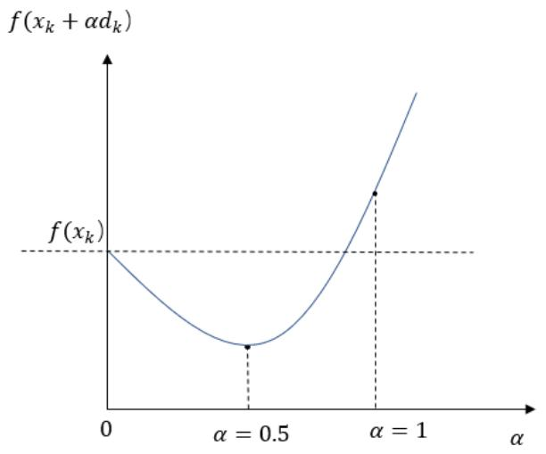

line

| α     | f(xₖ) |
|-------|-------|
| 0     | f(xₖ) |
| α = 0.5 | Minimum |
| α = 1  | Increasing |

图4.9 不同步长??对应的目标函数值

综合算法收敛性和实时性的考虑，本文选取回溯线搜索法作为线搜索策略，因此式(4.49)转化为，

$$
\delta u = K _ {t} \delta x + \alpha k _ {t} t = 0, 1, \dots , N - 1 \dots \tag {4.53}
$$

由本小节介绍可知，该式结合式(4.52)可以计算得到 $X _ { n e w }$ 和 $U _ { n e w }$ ，代入目标函数中计算得到 $\scriptstyle J _ { n e w }$ ，本文计算实际目标函数下降值表示，如下式，

$$
z = J _ {n e w} - J _ {o l d} \dots\dots(4. 5 4)
$$

因此本文回溯线搜索策略为：初始步长 $\alpha = 1$ ，并根据上述步骤计算??，如果??在区间 $[ \beta _ { 1 } , \beta _ { 2 } ]$ ]内，本文设置为 $[ - 1 0 ^ { - 3 } , + \infty ]$ ，则说明基于当前步长??计算得到的 $X _ { n e w }$ 和$U _ { n e w }$ 满足线搜索条件，根据算法流程图 4.8 进入下一步骤。反之，则更新步长 $\alpha = \gamma \alpha$ ，其中??为回溯线搜索尺度参数并且满足 $0 < \gamma < 1$ ，本文设为 0.5，继续重复计算 $X _ { n e w }$ 和 $U _ { n e w }$ 并判断是否满足线搜索条件。如果线搜索在一定的迭代次数后依然没有取得进展，如流程图4.8 所示，则在下一次迭代过程中增大正则化系数 $\lambda = \phi \lambda$ ，有效地将牛顿方向引导到正确的梯度下降方向。表 4.1 整理了本章 CILQR 算法推导过程中的核心参数值，这些参数将用于第五章节的仿真环境中的算法参数设置。

表 4.1 CILQR 算法参数表

<table><tr><td>参数名称</td><td>参数描述</td><td>参数值</td><td>参数单位</td></tr><tr><td> $T_{horizon}$ </td><td>单帧规划时长</td><td>8.0</td><td>s</td></tr><tr><td>N</td><td>采样时刻总个数</td><td>40</td><td>-</td></tr><tr><td> $W_{pos}$ </td><td>位置偏差权重</td><td>8.0</td><td>-</td></tr><tr><td> $W_{vel}$ </td><td>速度偏差权重</td><td>2.0</td><td>-</td></tr><tr><td> $W_{theta}$ </td><td>横摆角偏差权重</td><td>1.0</td><td>-</td></tr><tr><td> $W_{acc}$ </td><td>加速度偏差权重</td><td>0.1</td><td>-</td></tr><tr><td> $W_{jerk}$ </td><td>加速度变化率权重</td><td>2.0</td><td>-</td></tr><tr><td> $W_{yawrate}$ </td><td>横摆角速度权重</td><td>4.0</td><td>-</td></tr><tr><td> $q_1^{motion}$ </td><td>运动学约束障碍函数参数</td><td>1.0</td><td>-</td></tr><tr><td> $q_2^{motion}$ </td><td>运动学约束障碍函数参数</td><td>10.0</td><td>-</td></tr><tr><td> $q_1^{safe}$ </td><td>安全性约束障碍函数参数</td><td>2.0</td><td>-</td></tr><tr><td> $q_2^{safe}$ </td><td>安全性约束障碍函数参数</td><td>10.0</td><td>-</td></tr><tr><td> $v_{min}$ </td><td>规定最低车速</td><td>0.0</td><td>m/s</td></tr><tr><td> $v_{max}$ </td><td>规定最高车速</td><td>1.0</td><td>m/s</td></tr><tr><td> $a_{min}$ </td><td>规定最低加速度</td><td>-0.5</td><td> $m/s^2$ </td></tr><tr><td> $a_{max}$ </td><td>规定最高加速度</td><td>0.5</td><td> $m/s^2$ </td></tr><tr><td> $\omega_{min}$ </td><td>规定最低横摆角速度</td><td>-0.5</td><td>rad/s</td></tr><tr><td> $\omega_{max}$ </td><td>规定最高横摆角速度</td><td>0.5</td><td>rad/s</td></tr><tr><td> $jerk_{min}$ </td><td>规定最低加速度变化率</td><td>-5.0</td><td> $m/s^3$ </td></tr><tr><td> $jerk_{max}$ </td><td>规定最高加速度变化率</td><td>5.0</td><td> $m/s^3$ </td></tr><tr><td>λ</td><td>初始正则化系数</td><td>1</td><td>-</td></tr><tr><td>φ</td><td>正则化系数尺度参数</td><td>2</td><td>-</td></tr><tr><td> $\lambda_{max}$ </td><td>最大正则化系数</td><td>512</td><td>-</td></tr><tr><td>tol</td><td>CILQR算法收敛容忍值</td><td>0.0008</td><td>-</td></tr><tr><td>γ</td><td>回溯线搜索尺度参数</td><td>0.5</td><td>-</td></tr><tr><td>β1</td><td>线搜索满足条件区间下界</td><td>- $10^{-3}$ </td><td>-</td></tr><tr><td>β2</td><td>线搜索满足条件区间上界</td><td>+ $\infty$ </td><td>-</td></tr></table>

# 4.4 本章小结

本章对基于笛卡尔坐标系的时空联合轨迹优化问题的构建以及最优轨迹的求解进行了详细地介绍。本章首先介绍了 CILQR 算法在求解非线性最优控制问题的优势，之后给出了本文时空联合轨迹优化问题的定义，并对整个轨迹优化问题中车辆系统状态方程的线性化、目标函数的构造、关于状态量和控制量的运动学约束和基于时空安全走廊的安全性约束的设计都进行了详细地数学推导。在基于 CILQR 算法构造完轨迹优化问题后，本章对基于CILQR 算法求解最优轨迹的算法流程进行了详细地介绍，并对前向传递和后向传递两个核心算法步骤的数学原理以及具体实现细节进行了详尽地阐述，在本章的最后整理了算法所需要的核心参数值。

# 第 5 章 无人清扫车轨迹规划算法仿真验证

# 5.1 引言

前文针对基于牛耕法和DWA平滑算法的全局路径规划算法进行了详细说明和算法初步验证。同时对基于 CILQR 算法框架，并结合时空安全走廊和时空动态规划算法的轨迹规划算法原理进行了详尽的解释和数学推导。在本章节中，为进一步验证整个规划算法的可行性，在 Ubuntu 系统下基于 ROS1 搭建无人清扫车 PNC(planning andcontrol)仿真实验平台，并通过创建多场景仿真任务，分析仿真结果，综合验证本文提出的规划算法。

# 5.2 无人清扫车 PNC 仿真实验平台搭建

本文基于图 5.1 所示的无人清扫实验车，在 Ubuntu16.04 系统下，基于 ROS1 搭建无人清扫车PNC 仿真实验平台对算法进行验证，并使用 Foxglove Studio 仿真器作为可视化 HMI 和保存数据日志的工具。为提升算法的实时性，整个算法核心代码均由C++编写，算法运行过程中的数据存入 log 文件日志中，通过python 语言读取数据并绘图可视化显示。仿真平台搭载的硬件如下，处理器型号为 i7-8700，显卡型号为GTX 1660 Super，内存为 32GB。

为在多场景下对本文提出的规划算法进行仿真验证，仿真地图使用 Vector MapBuilder 创建 Lanelet2 格式的地图，地图由包含多条车道的结构化道路和两个非结构化区域构成，如图5.2所示，编号1和2为下文创建仿真实验选取的地图，分别为非结构化区域和结构化道路，其中结构化双车道中单条道路宽度为 3.4m，车道直线部分长度为47m，非结构化区域长度为 20m，宽度为 13m。

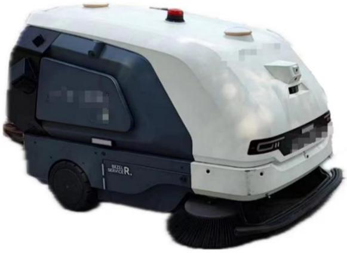

natural_image

Exterior view of a modern automated cleaning or cleaning service vehicle (no visible text or symbols)

图5.1 无人清扫车实验平台  
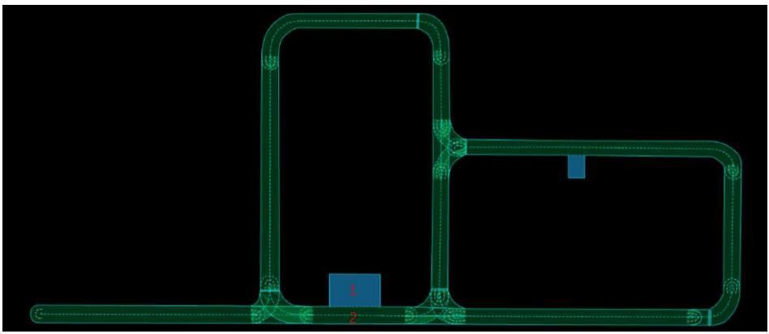

natural_image

Pure architectural floor plan lines without any text, numbers, or symbols

图 5.2 LaneLet2 格式的仿真地图

由于本文仿真环境下验证对象是规划算法的性能，因此对于感知系统的障碍物信息和定位系统的定位信息均采用环境中的真实值，以避免感知不稳定和定位误差对于规划算法测试结果的影响。对于控制算法，横向控制算法采用 MPC算法，纵向控制算法采用PID 算法，并假定车辆加减速和转向没有延迟。同时对车辆最小转弯半径、最大加速度等运动能力指标加以限制，以避免在轨迹跟踪时超出车辆物理极限。仿真环境中无人清扫车的几何尺寸和车辆模型参数如表 5.1所示。

表5.1 仿真实验车辆参数

<table><tr><td>参数名称</td><td>参数值</td></tr><tr><td>车辆长度(m)</td><td>1.6</td></tr><tr><td>车辆宽度(m)</td><td>1.3</td></tr><tr><td>车辆轴距(m)</td><td>0.89</td></tr><tr><td>最小转弯半径(m)</td><td>1.0</td></tr><tr><td>前轮最大转角(rad)</td><td>0.73</td></tr></table>

本文在多场景下设置实验验证整个规划算法的各项性能，多场景总体可分为结构化场景和非结构化场景，进一步根据无人清扫车作业任务类型又可分为点到点任务和覆盖任务，同时测试场景中设置静态障碍物和动态障碍物来综合测试轨迹规划算法的避障性能和在高动态交互场景中的处理能力。在结构化场景的点到点任务中，全局路径根据 LaneLet2 地图中的道路中心线生成，在非结构化场景的覆盖任务中，全局路径由前文介绍的牛耕法生成，并通过基于DWA的平滑算法平滑处理。

# 5.3 多场景下无人清扫车仿真实验结果分析

本文通过三组实验综合评价了提出的时空联合轨迹规划算法。评价指标包括以下几个方面：

1. 规划轨迹的合理性：保证规划的轨迹符合优化问题设定的运动学约束，同时具备足够的平滑性。  
2. 安全性：确保规划的轨迹在时空上不与动静障碍物和边界发生碰撞，并保留一定的安全距离。  
3. 运行效率：尽可能使规划的速度与期望速度相匹配，以提高清扫车的作业效率。  
4. 实时性：保证整个轨迹规划算法能够在自动驾驶系统中以至少 10Hz 的频率实时运行。

这些评价指标将帮助验证该算法的性能和有效性。三组实验的设置有助于全面评估算法在不同场景和条件下的表现。第一组实验为结构化道路中慢速车绕行场景的仿真实验，在该实验中模拟车道内超越慢速交通参与者过程中对向来车的高动态复杂场景，用来验证本文提出的时空联合规划算法对于高动态交互场景的处理能力。第二组实验为结构化行车场景的点到点任务仿真实验，该实验模拟了结构化道路 U-Turn 场景下的无人清扫车作业工况，相比于第一组实验，在该实验中会综合测试本文规划算法对静态障碍物和动态障碍物的避障能力。第三组实验为非结构化行车场景的覆盖任务仿真实验，对比结构化场景，在非结构化覆盖场景实验中存在更多大曲率 U-Turn场景和绕大型静态障碍物场景，能更好地验证轨迹规划算法的性能。

# 5.3.1 结构化场景仿真实验与结果分析

在第一组结构化慢速车绕行场景仿真实验中，在本车道内设置一个同向行驶的慢速交通参与者，速度为 0.4m/s，同时设置一个对向行驶的车辆，速度为 2m/s，障碍物前的直线代表预测运动方向，该实验在 Foxglove Studio 仿真器中的可视化效果如图5.3 所示，绿色道路中心线为全局路径，规划的起点为左下方清扫车模型处，终点为全局参考线的终点。

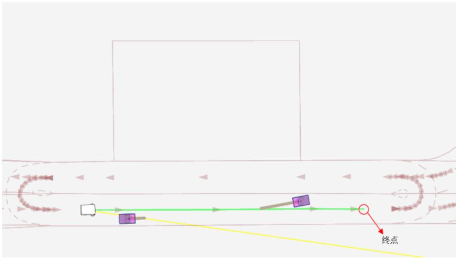

text_image

终点

图 5.3 结构化慢速车绕行仿真实验可视化界面

图5.4为程序运行时，本文提出的基于时空动态规划算法和时空安全走廊约束的时空联合轨迹规划算法在仿真环境中关键帧的可视化效果，其中图(a)、(c)、(e)、(g)的可视化效果中，由 41 个点组成的运动轨迹为本文提出的基于时空动态规划算法的轨迹规划算法得到的 0 到 8s 的时空参考轨迹，离散程度即为每 0.2s 一个轨迹点。可视化图中的矩形框代表基于上述参考轨迹生成的时空安全走廊，每隔 1s 生成一个不与时空上的任何一个障碍物以及边界碰撞的矩形框，总共 8 个矩形框组成安全走廊。图(b)、(d)、(f)、(h)的可视化效果中，由 41 个点组成的运动轨迹为本文提出的基于CILQR 框架的时空联合轨迹规划算法优化出的 0到8s 的精确轨迹，离散程度同样为每0.2s 一个轨迹点。图 5.5和图5.6为程序运行时，算法在关键帧迭代收敛过程中的log 日志。

从图(a)、(c)、(e)关键帧效果图可以看出，在面对同向行驶的慢速障碍物和对向动态障碍物时，基于时空动态规划算法生成的参考轨迹可以在保证通行效率的前提下有效利用空间，生成时空上超车和避免与对向障碍物碰撞的参考轨迹，并基于此轨迹生成时空安全走廊，可以看出，本文提出的时空安全走廊可以在时间维度上充分利用可行驶空间，保证后续优化算法解空间的连续性。从图(b)、(d)、(f)关键帧效果图可以看出，本文第四章节提出的基于 CILQR 算法的时空联合轨迹规划算法可以优化得到超72

过慢速车且避开对向行驶障碍物的轨迹，规划结果在贴合参考轨迹的前提下足够平滑，同时满足本文提出的时空安全走廊的安全性约束。从图(g)和(h)可以看出，主车在安全绕过对向障碍物后规划结果贴合参考轨迹。

从图 5.5 和图 5.6 的 log 日志中可以看出，本文通过在前向传递过程中增加线搜索策略可以显著地降低 CILQR 算法迭代收敛次数，并且避免由于正则化系数??超出最大限制而导致CILQR算法不收敛的问题，同时将整个场景算法的平均耗时从14.31ms降低至7.67ms，提高了算法的实时性和收敛性。

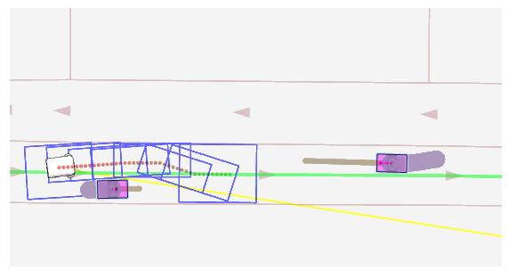

flowchart

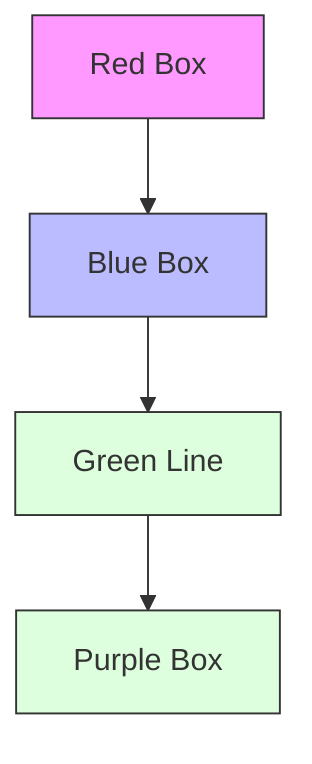
```mermaid
graph TD
    A["Red Box"] --> B["Blue Box"]
    B --> C["Green Line"]
    C --> D["Purple Box"]
    style A fill:#f9f,stroke:#333
    style B fill:#bbf,stroke:#333
    style C fill:#dfd,stroke:#333
    style D fill:#dfd,stroke:#333
```

(a)

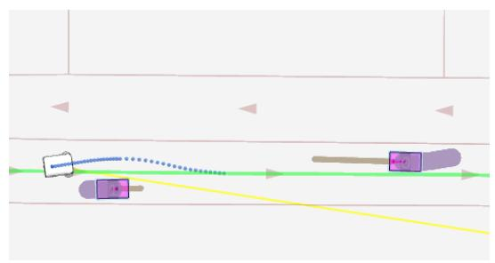

flowchart

```mermaid
graph LR
    A["Block 1"] --> B["Block 2"]
    B --> C["Yellow Line"]
    C --> D["Green Reference Line"]
    style A fill:#f9f,stroke:#333
    style B fill:#bbf,stroke:#333
    style C stroke-dasharray: 5 5
```

(b)

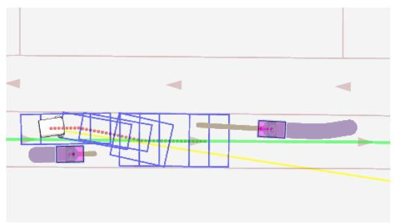

flowchart

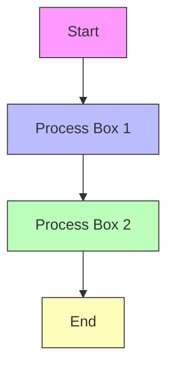
```mermaid
graph TD
    A["Start"] --> B["Process Box 1"]
    B --> C["Process Box 2"]
    C --> D["End"]
    style A fill:#f9f,stroke:#333
    style B fill:#bbf,stroke:#333
    style C fill:#bfb,stroke:#333
    style D fill:#ffb,stroke:#333
```

(c)

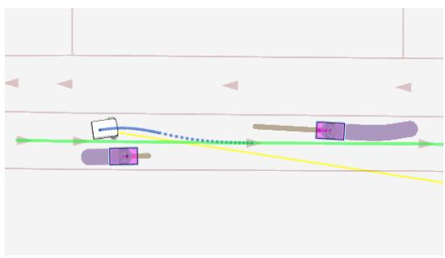

flowchart

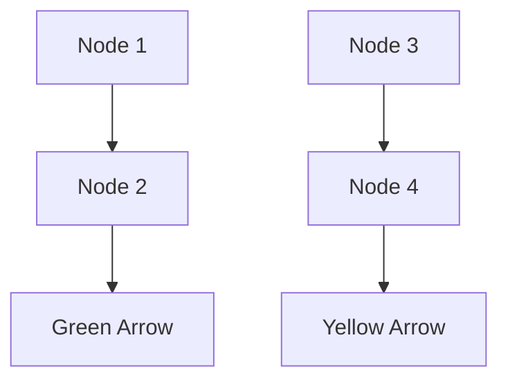
```mermaid
graph TD
    A["Node 1"] --> B["Node 2"]
    B --> C["Green Arrow"]
    D["Node 3"] --> E["Node 4"]
    E --> F["Yellow Arrow"]
```

(d)

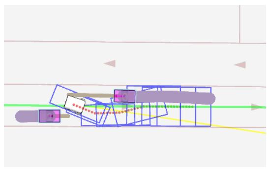

flowchart

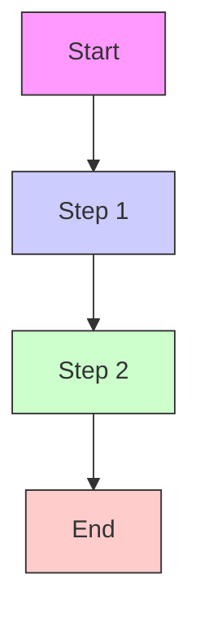
```mermaid
graph TD
    A["Start"] --> B["Step 1"]
    B --> C["Step 2"]
    C --> D["End"]
    style A fill:#f9f,stroke:#333
    style B fill:#ccf,stroke:#333
    style C fill:#cfc,stroke:#333
    style D fill:#fcc,stroke:#333
```

(e)

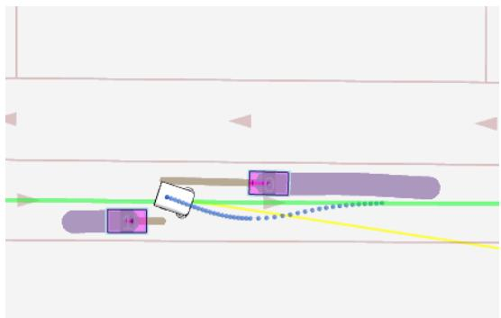

flowchart

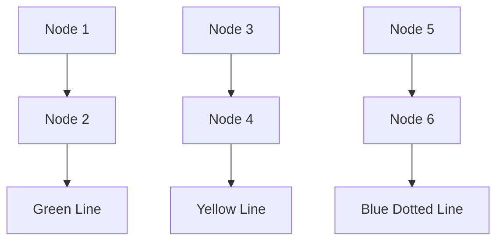
```mermaid
graph TD
    A["Node 1"] --> B["Node 2"]
    B --> C["Green Line"]
    D["Node 3"] --> E["Node 4"]
    E --> F["Yellow Line"]
    G["Node 5"] --> H["Node 6"]
    H --> I["Blue Dotted Line"]
```

(f)

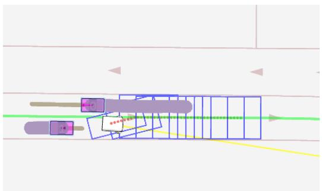

flowchart

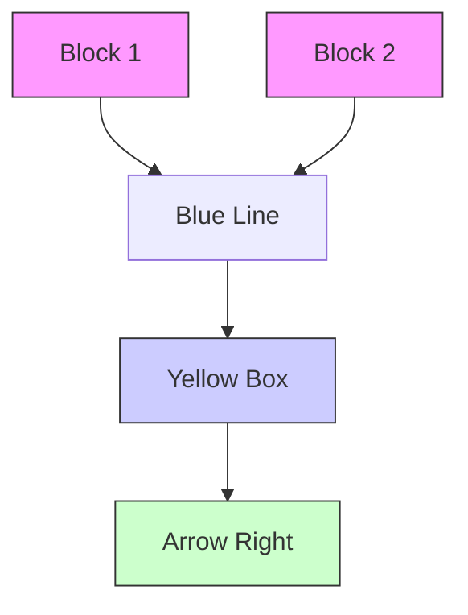
```mermaid
graph TD
    A["Block 1"] --> B["Blue Line"]
    C["Block 2"] --> B
    B --> D["Yellow Box"]
    D --> E["Arrow Right"]
    style A fill:#f9f,stroke:#333
    style C fill:#f9f,stroke:#333
    style D fill:#ccf,stroke:#333
    style E fill:#cfc,stroke:#333
```

(g)

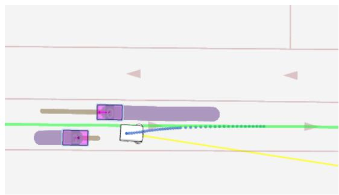

flowchart

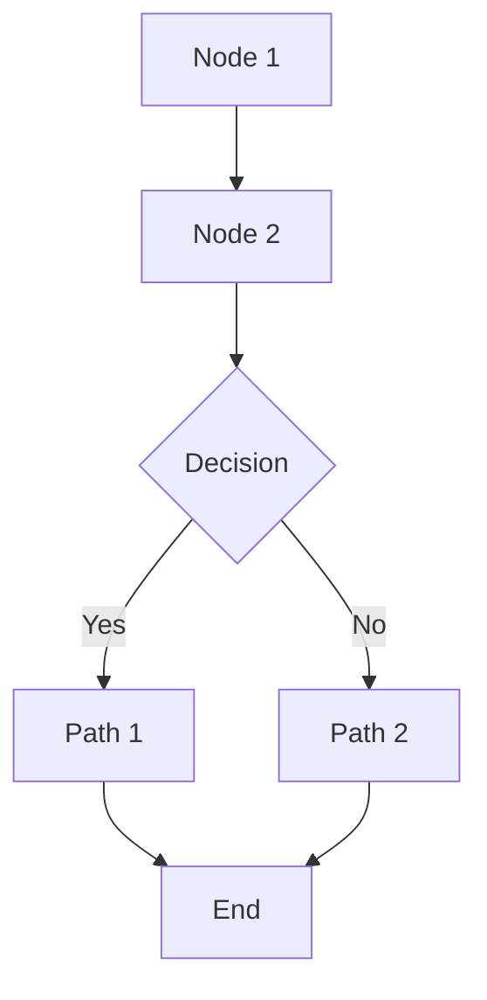
```mermaid
graph TD
    A["Node 1"] --> B["Node 2"]
    B --> C{Decision}
    C -->|Yes| D["Path 1"]
    C -->|No| E["Path 2"]
    D --> F["End"]
    E --> F
```

(h)

图5.4 结构化超车场景中关键帧的轨迹规划可视化效果图

<table><tr><td>0302 16:25:19.864 [I]</td><td>ciIqr_planner.cpp:610 [YY] line search z = 33.3142, alpha = 1</td></tr><tr><td>0302 16:25:19.864 [I]</td><td>ciIqr_planner.cpp:615 [YY] line search success</td></tr><tr><td>0302 16:25:19.865 [I]</td><td>ciIqr_planner.cpp:834 [COST] i: 0, lambda = 1, J old = 308.836, J_new = 275.522</td></tr><tr><td>0302 16:25:19.865 [I]</td><td>ciIqr_planner.cpp:836 [COST] J_state_old = 85.0082, J_control_old = 223.828</td></tr><tr><td>0302 16:25:19.865 [I]</td><td>ciIqr_planner.cpp:838 [COST] J_state_new = 27.6803, J_control_new = 247.841</td></tr><tr><td>0302 16:25:19.865 [I]</td><td>ciIqr_planner.cpp:610 [YY] line search z = -22.4035, alpha = 1</td></tr><tr><td>0302 16:25:19.865 [I]</td><td>ciIqr_planner.cpp:610 [YY] line search z = -11.0749, alpha = 0.5</td></tr><tr><td>0302 16:25:19.866 [I]</td><td>ciIqr_planner.cpp:610 [YY] line search z = -5.37419, alpha = 0.25</td></tr><tr><td>0302 16:25:19.866 [I]</td><td>ciIqr_planner.cpp:610 [YY] line search z = -2.64623, alpha = 0.125</td></tr><tr><td>0302 16:25:19.866 [I]</td><td>ciIqr_planner.cpp:610 [YY] line search z = -1.31288, alpha = 0.0625</td></tr><tr><td>0302 16:25:19.866 [I]</td><td>ciIqr_planner.cpp:610 [YY] line search z = -0.65388, alpha = 0.03125</td></tr><tr><td>0302 16:25:19.866 [I]</td><td>ciIqr_planner.cpp:610 [YY] line search z = -0.3263, alpha = 0.015625</td></tr><tr><td>0302 16:25:19.866 [I]</td><td>ciIqr_planner.cpp:610 [YY] line search z = -0.16299, alpha = 0.0078125</td></tr><tr><td>0302 16:25:19.866 [I]</td><td>ciIqr_planner.cpp:610 [YY] line search z = -0.0814549, alpha = 0.00390625</td></tr><tr><td>0302 16:25:19.866 [I]</td><td>ciIqr_planner.cpp:610 [YY] line search z = -0.0407174, alpha = 0.00195312</td></tr><tr><td>0302 16:25:19.866 [I]</td><td>ciIqr_planner.cpp:610 [YY] line search z = -0.0203562, alpha = 0.000976562</td></tr><tr><td>0302 16:25:19.866 [I]</td><td>ciIqr_planner.cpp:610 [YY] line search z = -0.010775, alpha = 0.000488281</td></tr><tr><td>0302 16:25:19.866 [I]</td><td>ciIqr_planner.cpp:610 [YY] line search z = -0.00508858, alpha = 0.000244141</td></tr><tr><td>0302 16:25:19.866 [I]</td><td>ciIqr_planner.cpp:615 [YY] line search success</td></tr><tr><td>0302 16:25:19.867 [I]</td><td>ciIqr_planner.cpp:834 [COST] i: 1, lambda = 1, J old = 275.522, J_new = 275.527</td></tr><tr><td>0302 16:25:19.867 [I]</td><td>ciIqr_planner.cpp:836 [COST] J_state_old = 27.6803, J_control_old = 247.841</td></tr><tr><td>0302 16:25:19.867 [I]</td><td>ciIqr_planner.cpp:838 [COST] J_state_new = 27.6795, J_control_new = 247.847</td></tr><tr><td>0302 16:25:19.867 [I]</td><td>planner_dispatcher.cpp:163 [PlannerDispatcher] current frame motion plan time = 5.76716 ms</td></tr><tr><td>0302 16:25:19.867 [I]</td><td>planner_dispatcher.cpp:185 [PlannerDispatcher] current frame: 182</td></tr><tr><td>0302 16:25:19.867 [I]</td><td>planner.dispatcher.cpp:186 [PlannerDispatcher] avg motion plan time: 8.25825 ms</td></tr></table>

(a) 增加线搜索策略的前向传递过程  
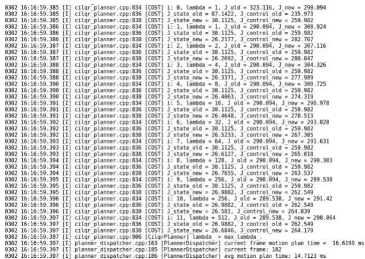

text_image

0302 16:16:59.385 [I] clqr_planer.cpp:834 [COST] I: 8, lambda = 1, J old = 323.116, J new = 290.094
0302 16:16:59.385 [I] clqr_planer.cpp:836 [COST] J_state_old = 87.1422, J_control_old = 235.973
0302 16:16:59.385 [I] clqr_planer.cpp:838 [COST] J_state_new = 38.1125, J_control_new = 259.982
0302 16:16:59.386 [I] clqr_planer.cpp:834 [COST] I: 1, lambda = 1, J old = 290.094, J new = 308.924
0302 16:16:59.386 [I] clqr_planer.cpp:836 [COST] J_state_old = 26.2177, J_control_new = 282.707
0302 16:16:59.387 [I] clqr_planer.cpp:838 [COST] I: 2, lambda = 2, J old = 290.094, J new = 307.116
0302 16:16:59.387 [I] clqr_planer.cpp:836 [COST] J_state_old = 38.1125, J_control_old = 259.982
0302 16:16:59.387 [I] clqr_planer.cpp:838 [COST] J_state_new = 26.2092, J_control_new = 280.847
0302 16:16:59.388 [I] clqr_planer.cpp:834 [COST] I: 3, lambda = 290.094, J new = 290.094.326
0302 16:16:59.388 [I] clqr_planer.cpp:836 [COST] J_state_old = 38.1125, J_control_old = 259.982
0302 16:16:59.388 [I] clqr_planer.cpp:838 [COST] J_state_new = 26.3371, J_control_new = 277.989
0302 16:16:59.390 [I] clqr_planer.cpp:834 [COST] I: 4, lambda = 8, J old = 290.094, J new = 300.725
0302 16:16:59.390 [I] clqr_planer.cpp:836 [COST] J_state_old = 38.1125, J_control_old = 259.982
0302 16:16:59.391 [I] clqr_planer.cpp:834 [COST] J_state_new = 26.4648, J_control_new = 274.319
0302 16:16:59.391 [I] clqr_planer.cpp:836 [COST] I: 5, lambda = 16, J old = 290.094, J new = 296.978
0302 16:16:59.391 [I] clqr_planer.cpp:836 [COST] J_state_old = 38.1125, J_control_old = 259.982
0302 16:16:59.391 [I] clqr_planer.cpp:838 [COST] J_state_new = 26.4648, J_control_new = 270.513
0302 16:16:59.392 [I] clqr_planer.cpp:834 [COST] I: 6, lambda = 290.094, J old = 290.094, J new = 293.828
0302 16:16:59.392 [I] clqr_planer.cpp:836 [COST] J_state_old = 38.1125, J_control_old = 259.982
0302 16:16:59.392 [I] clqr_planer.cpp:838 [COST] J_state_new = 26.5233, J_control_new = 267.305
0302 16:16:59.393 [I] clqr_planer.cpp:834 [COST] I: 7, lambda = 64, J old = 290.094, J new = 291.631
0302 16:16:59.393 [I] clqr_planer.cpp:836 [COST] J_state_old = 38.1125, J_control_old = 259.982
0302 16:16:59.394 [I] clqr_planer.cpp:834 [COST] J_state_new = 26.5233, J_control_new = 277.989
0302 16:16:59.394 [I] clqr_planer.cpp:834 [COST] I: 8, lambda = 128, J old = 290.094, J new = 290.303
0302 16:16:59.394 [I] clqr_planer.cpp:836 [COST] J_state_old = 38.1125, J_control_old = 259.982
0302 16:16:59.394 [I] clqr_planer.cpp:838 [COST] J_state_new = 26.7655, J_control_new = 263.537
0302 16:16:59.394 [I] clqr_planer.cpp:834 [COST] I: 9, lambda = 290.094, J old = 289.538, J_control_new = 289.538
0302 16:16:59.395 [I] clqr_planer.cpp:836 [COST] J_state_old = 38.1125, J_control_old = 259.982
0302 16:16:59.395 [I] clqr_planer.cpp:838 [COST] J_state_new = 26.9882, J_control_new = 262.549
0302 16:16:59.396 [I] clqr_planer.cpp:834 [COST] I: 10, lambda = 256, J old = 289.538, J new = 291.42
0302 16:16:59.396 [I] clqr_planer.cpp:836 [COST] J_state_old = 26.9882, J_control_old = 262.549
0302 16:16:59.397 [I] clqr_planer.cpp:834 [COST] J_state_new = 26.7655, J_control_new = 277.749
0302 16:16:59.397 [I] clqr_planer.cpp:834 [COST] I: 11, lambda = 512, J old = 289.538, J new = 290.864
0302 16:16:59.397 [I] clqr_planer.cpp:836 [COST] J_state_old = 26.9882, J_control_old = 262.549
0302 16:16:59.397 [I] clqr_planer.cpp:838 [COST] J_state_new = 26.6846, J_control_new = 264.179
0302 16:16:59.397 [I] clqr_planer.cpp:906 [ClqrPlanner] lample > max lambda .
0302 16:16:59.397 [I] planner/dispatcher.cpp=1[Planner/dispatcher](current frame:=182)
0302 16:16:59.397 [I] planner/dispatcher.cpp=1[Planner/dispatcher](avg motion plan time=14.7123 ms

(b) 没有线搜索策略的前向传递过程

图 5.5 算法迭代过程中某一帧(第 182 帧)收敛过程的 log 日志

<table><tr><td>0302</td><td>16:25:36.390</td><td>[I]</td><td>cilqr_planner.cpp:610</td><td>[YY]</td><td>line search z = -0.402632, alpha = 1</td></tr><tr><td>0302</td><td>16:25:36.390</td><td>[I]</td><td>cilqr_planner.cpp:610</td><td>[YY]</td><td>line search z = -0.170682, alpha = 0.5</td></tr><tr><td>0302</td><td>16:25:36.390</td><td>[I]</td><td>cilqr_planner.cpp:610</td><td>[YY]</td><td>line search z = -0.0780953, alpha = 0.25</td></tr><tr><td>0302</td><td>16:25:36.390</td><td>[I]</td><td>cilqr_planner.cpp:610</td><td>[YY]</td><td>line search z = -0.0372834, alpha = 0.125</td></tr><tr><td>0302</td><td>16:25:36.390</td><td>[I]</td><td>cilqr_planner.cpp:610</td><td>[YY]</td><td>line search z = -0.0182063, alpha = 0.0625</td></tr><tr><td>0302</td><td>16:25:36.391</td><td>[I]</td><td>cilqr_planner.cpp:610</td><td>[YY]</td><td>line search z = -0.00899499, alpha = 0.03125</td></tr><tr><td>0302</td><td>16:25:36.391</td><td>[I]</td><td>cilqr_planner.cpp:615</td><td>[YY]</td><td>line search success</td></tr><tr><td>0302</td><td>16:25:36.391</td><td>[I]</td><td>cilqr_planner.cpp:834</td><td colspan="2">[COST] i: 0, lambda = 1, J old = 12.4265, J_new = 12.4355</td></tr><tr><td>0302</td><td>16:25:36.391</td><td>[I]</td><td>cilqr_planner.cpp:836</td><td colspan="2">[COST] J_state_old = 11.2321, J_control_old = 1.1944</td></tr><tr><td>0302</td><td>16:25:36.391</td><td>[I]</td><td>cilqr_planner.cpp:838</td><td colspan="2">[COST] J_state_new = 11.241, J_control_new = 1.19446</td></tr><tr><td>0302</td><td>16:25:36.391</td><td>[I]</td><td>planner_dispatcher.cpp:163</td><td colspan="2">[PlannerDispatcher] current frame motion plan time = 3.62033 ms</td></tr><tr><td>0302</td><td>16:25:36.391</td><td>[I]</td><td>planner_dispatcher.cpp:185</td><td colspan="2">[PlannerDispatcher] current frame: 343</td></tr><tr><td>0302</td><td>16:25:36.391</td><td>[I]</td><td>planner_dispatcher.cpp:186</td><td colspan="2">[PlannerDispatcher] avg motion plan time: 7.67221 ms</td></tr><tr><td>0302</td><td>16:17:15.893</td><td>[I]</td><td>cilqr_planner.cpp:834</td><td>[COST]</td><td>i: 0, lambda = 1, J old = 12.4588, J new = 12.8409</td></tr><tr><td>0302</td><td>16:17:15.893</td><td>[I]</td><td>cilqr_planner.cpp:836</td><td>[COST]</td><td>J state_ old = 11.2591, J control_ old = 1.19966</td></tr><tr><td>0302</td><td>16:17:15.893</td><td>[I]</td><td>cilqr_planner.cpp:838</td><td>[COST]</td><td>J state_new = 11.5889, J control_new = 1.252</td></tr><tr><td>0302</td><td>16:17:15.894</td><td>[I]</td><td>cilqr_planner.cpp:834</td><td>[COST]</td><td>i: 1, lambda = 2, J old = 12.4588, J new = 12.8008</td></tr><tr><td>0302</td><td>16:17:15.894</td><td>[I]</td><td>cilqr_planner.cpp:836</td><td>[COST]</td><td>J state_ old = 11.2591, J control_ old = 1.19966</td></tr><tr><td>0302</td><td>16:17:15.894</td><td>[I]</td><td>cilqr_planner.cpp:838</td><td>[COST]</td><td>J state_new = 11.5583, J control_new = 1.24248</td></tr><tr><td>0302</td><td>16:17:15.895</td><td>[I]</td><td>cilqr_planner.cpp:834</td><td>[COST]</td><td>i: 2, lambda = 4, J old = 12.4588, J new = 12.7495</td></tr><tr><td>0302</td><td>16:17:15.895</td><td>[I]</td><td>cilqr_planner.cpp:836</td><td>[COST]</td><td>J state_ old = 11.2591, J control_ old = 1.19966</td></tr><tr><td>0302</td><td>16:17:15.895</td><td>[I]</td><td>cilqr_planner.cpp:838</td><td>[COST]</td><td>J state_new = 11.5183, J control_new = 1.23124</td></tr><tr><td>0302</td><td>16:17:15.896</td><td>[I]</td><td>cilqr_planner.cpp:834</td><td>[COST]</td><td>i: 3, lambda = 8, J old = 12.4588, J new = 12.695</td></tr><tr><td>0302</td><td>16:17:15.896</td><td>[I]</td><td>cilqr_planner.cpp:836</td><td>[COST]</td><td>J state_ old = 11.2591, J control_ old = 1.19966</td></tr><tr><td>0302</td><td>16:17:15.896</td><td>[I]</td><td>cilqr_planner.cpp:838</td><td>[COST]</td><td>J state_new = 11.4744, J control_new = 1.22061</td></tr><tr><td>0302</td><td>16:17:15.897</td><td>[I]</td><td>cilqr_planner.cpp:834</td><td>[COST]</td><td>i: 4, lambda = 16, J old = 12.4588, J new = 12.6453</td></tr><tr><td>0302</td><td>16:17:15.897</td><td>[I]</td><td>cilqr_planner.cpp:836</td><td>[COST]</td><td>J state_ old = 11.259I, J control_ old = 1.19966</td></tr><tr><td>0302</td><td>16:17:15.897</td><td>[I]</td><td>cilqr_planner.cpp:838</td><td>[COST]</td><td>J state_new = 11.433, J control_new = 1.21234</td></tr><tr><td>0302</td><td>16:17:15.898</td><td>[I]</td><td>cilqr_planner.cpp:834</td><td>[COST] i: 5, lambda = 32, J old = 12.4588, J new = 12.6042</td><td></td></tr><tr><td>0302</td><td>16:17:15.898</td><td>[I]</td><td>cilqr_planner.cpp:836</td><td>[COST] J state_ old = 11.259I, J control_ old = 1.19966</td><td></td></tr><tr><td>0302</td><td>16:17:15.898</td><td>[I]</td><td>cilqr_planner.cpp:838</td><td>[COST] J state_new = 11.3975, J control_new = 1.20668</td><td></td></tr><tr><td>0302</td><td>16:17:15.899</td><td>[I]</td><td>cilqr_planner.cpp:834</td><td>[COST] i: 6, lambda = 64, J old = 12.4588, J new = 12.5716</td><td></td></tr><tr><td>0302</td><td>16:17:15.899</td><td>[I]</td><td>cilqr_planner.cpp:836</td><td>[COST] J state_ old = 11.259I, J control_ old = 1.19966</td><td></td></tr><tr><td>0302</td><td>16:17:15.899</td><td>[I]</td><td>cilqr_planner.cpp:838</td><td>[COST] J state_new = 11.3685, J control_new = 1.20307</td><td></td></tr><tr><td>0302</td><td>16:17:15.900</td><td>[I]</td><td>cilqr_planner.cpp:834</td><td>[COST] i: 7, lambda = 128, J old = 12.4588, J new = 12.5464</td><td></td></tr><tr><td>0302</td><td>16:17:15.900</td><td>[I]</td><td>cilqr_planner.cpp:836</td><td>[COST] J state_ old = 11.259I, J control_ old = 1.19966</td><td></td></tr><tr><td>0302</td><td>16:17:15.900</td><td>[I]</td><td>cilqr_planner.cpp:838</td><td>[COST] J state_new = 11.3455, J control_new = 1.20094</td><td></td></tr><tr><td>0302</td><td>16:17:15.901</td><td>[I]</td><td>cilqr_planner.cpp:834</td><td>[COST] i: 8, lambda = 256, J old = 12.4588, J new = 12.5272</td><td></td></tr><tr><td>0302</td><td>16:17:15.901</td><td>[I]</td><td>cilqr_planner.cpp:836</td><td>[COST] J state_ old = 11.259I, J control_ old = 1.19966</td><td></td></tr><tr><td>0302</td><td>16:17:15.901</td><td>[I]</td><td>cilqr_planner.cpp:838</td><td>[COST] J state_new = 11.3274, J control_new = 1.19981</td><td></td></tr><tr><td>0302</td><td>16:17:15.902</td><td>[I]</td><td colspan="3">cilqr_planner.cpp:834 [CIqrPlanner] lambda &gt; max lambda .</td></tr></table>

(a) 增加线搜索策略的前向传递过程

# (b) 没有线搜索策略的前向传递过程

图 5.6 算法迭代过程中最后一帧(第 343 帧)收敛过程的 log 日志

第二组实验包含与动态交通参与者交互的场景、对静态障碍物的避障场景和大曲率 U-Turn 场景，该实验在 Foxglove Studio 仿真器中的可视化效果如图 5.7 所示，其中绿色道路中心线为全局路径，规划的起点为左下方清扫车模型处，终点为全局参考线的终点，为了测试本文提出的时空联合轨迹规划算法对于动态和静态障碍物的处理能力，分别在道路的两侧设置三个不规则静态障碍物，同时设置一个动态障碍物模拟交通参与者穿行道路，如图 5.7左下方的障碍物，障碍物前的直线代表该交通参与者的预测运动方向。

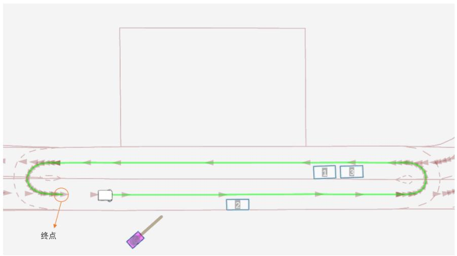

flowchart

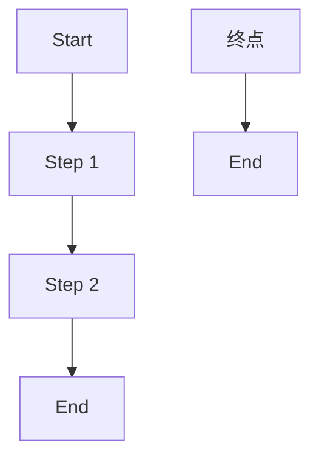
```mermaid
graph TD
    A["Start"] --> B["Step 1"]
    B --> C["Step 2"]
    C --> D["End"]
    E["终点"] --> F["End"]
```

图 5.7 结构化点到点任务仿真实验可视化界面

图5.8为程序运行时在仿真环境中截取的关键帧的可视化效果图。图(a)到(d)截取了算法对于动态障碍物和静态障碍物同时处理的前后连续帧的效果，图(e)到(f)分别截取了算法在U-Turn场景下和绕多静态障碍物处的关键帧的效果图。从图(a)、图(c)和图(g)中，从时空参考轨迹可以看出本文提出的基于时空动态规划的轨迹规划算法可以很好地在时空上同时处理多动、静态障碍物，得到一条保证安全性且满足最小目标函数值的轨迹，同时可以看出基于此生成的时空安全走廊不与任何一个障碍物在时空上碰撞，也不与边界碰撞，作为约束可以保证后续轨迹优化算法的安全性。从图(b)、图(d)、图(f)和图(h)可以看出本文提出的基于 CILQR 框架的轨迹规划算法收敛，得到的轨迹平滑且始终满足优化问题中的时空安全走廊不等式约束，保证了安全性的要求。

从图5.9中，优化变量中的状态量的速度和加速度信息可以看出，规划的速度变化平滑且始终尽可能贴近目标车速，同时不超过最高车速 1m/s，加速度也始终在约束问题中设置的最大最小加速度限制内。从图 5.10 中，优化变量中的横摆角和横摆角速度信息可以看出，规划的横摆角速度在 U-Turn 和绕障时增大，直线行驶时减小，且始终在优化问题中设置的最大最小横摆角速度限制内，符合优化目标的预期，同时横摆角的变化也符合预期。从图 5.11中，优化变量中的状态量的坐标信息可以看出，规划的路径横纵坐标在整个无人车作业任务中平滑变化。

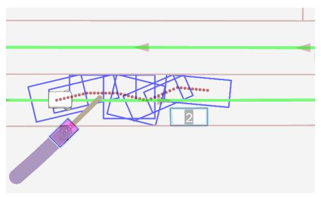

text_image

Diagram showing a pencil drawing on paper sheets with numbered annotations and alignment lines

(a)

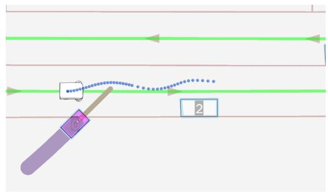

text_image

Diagram showing a pendulum motion with labeled positions and directional arrows, including a numbered box labeled '2'

(b)

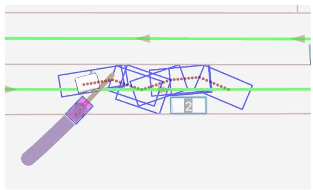

text_image

Diagram showing a pen tip interacting with a geometric structure, labeled with numbers 1 and 2, and colored dots indicating points.

(c)

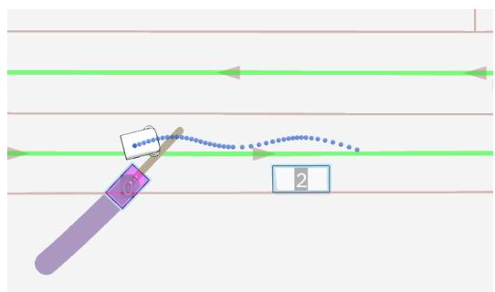

text_image

Diagram showing a pencil drawing a curved line with labeled points and directional arrows, likely illustrating a physics or engineering concept.

(d)

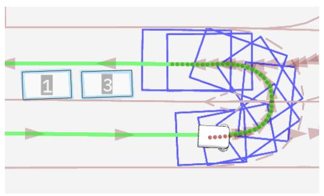

flowchart

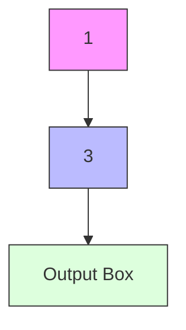
```mermaid
graph TD
    A["1"] --> B["3"]
    B --> C["Output Box"]
    style A fill:#f9f,stroke:#333
    style B fill:#bbf,stroke:#333
    style C fill:#dfd,stroke:#333
```

(e)

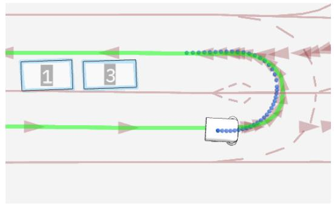

flowchart

```mermaid
graph TD
    A["1"] --> B["2"]
    B --> C["3"]
    C --> D["4"]
    D --> E["5"]
    E --> F["6"]
    F --> G["7"]
    G --> H["8"]
    H --> I["9"]
    I --> J["10"]
    J --> K["11"]
    K --> L["12"]
    L --> M["13"]
    M --> N["14"]
    N --> O["15"]
    O --> P["16"]
    P --> Q["17"]
    Q --> R["18"]
    R --> S["19"]
    S --> T["20"]
    T --> U["21"]
    U --> V["22"]
    V --> W["23"]
    W --> X["24"]
    X --> Y["25"]
    Y --> Z["26"]
```

(f)

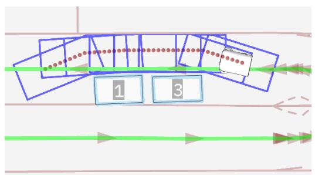

flowchart

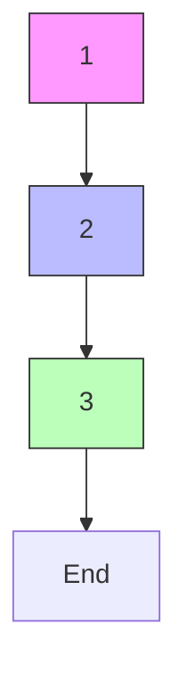
```mermaid
graph TD
    A["1"] --> B["2"]
    B --> C["3"]
    C --> D["End"]
    style A fill:#f9f,stroke:#333
    style B fill:#bbf,stroke:#333
    style C fill:#bfb,stroke:#333
```

(g)

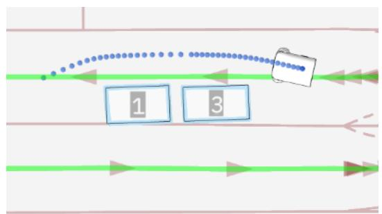

flowchart

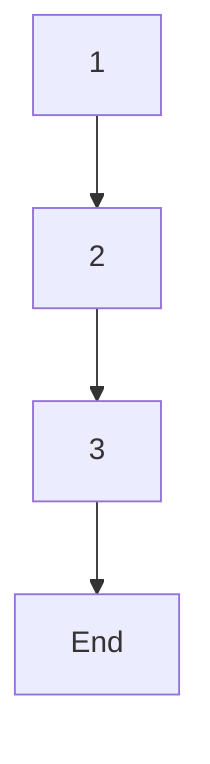
```mermaid
graph TD
    A["1"] --> B["2"]
    B --> C["3"]
    C --> D["End"]
```

(h)

图5.8 结构化场景中关键帧的轨迹规划可视化效果图  
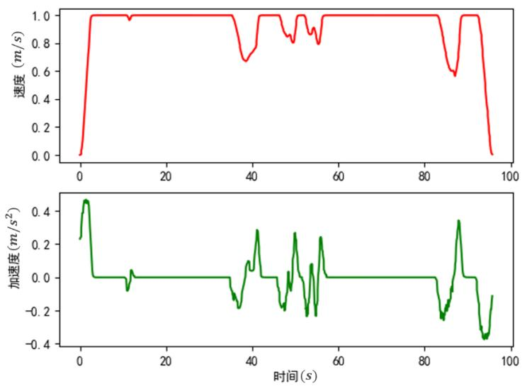

line

| 时间 (s) | 速度 (m/s) | 加速度 (m/s²) |
| -------- | ---------- | ------------- |
| 0        | 0.0        | 0.2           |
| 10       | 1.0        | 0.45          |
| 20       | 1.0        | 0.0           |
| 30       | 1.0        | -0.1          |
| 40       | 0.7        | -0.2          |
| 50       | 1.0        | 0.3           |
| 60       | 1.0        | 0.0           |
| 70       | 1.0        | -0.1          |
| 80       | 1.0        | -0.2          |
| 90       | 0.6        | -0.3          |
| 100      | 0.0        | -0.4          |

图5.9 速度和加速度随时间变化曲线

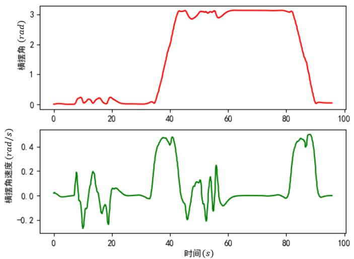

line

| 时间 (s) | 横摆角 (rad) | 横摆角速度 (rad/s) |
| -------- | ------------ | ------------------ |
| 0        | 0.0          | 0.0                |
| 10       | 0.1          | -0.1               |
| 20       | 0.05         | 0.2                |
| 30       | 0.0          | -0.2               |
| 40       | 3.0          | 0.4                |
| 50       | 3.0          | -0.2               |
| 60       | 3.0          | 0.2                |
| 70       | 3.0          | -0.1               |
| 80       | 3.0          | 0.0                |
| 90       | 1.5          | -0.1               |
| 100      | 0.0          | 0.0                |

图 5.10 横摆角和横摆角速度随时间变化曲线

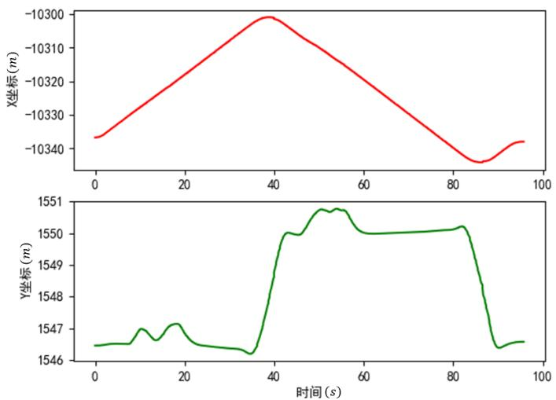

line

| 时间 (s) | X坐标 (m) | Y坐标 (m) |
| -------- | --------- | --------- |
| 0        | -10340    | 1546      |
| 20       | -10320    | 1547      |
| 40       | -10300    | 1551      |
| 60       | -10310    | 1550      |
| 80       | -10330    | 1549      |
| 100      | -10340    | 1546      |

图5.11 路径坐标随时间变化曲线

# 5.3.2 非结构化场景仿真实验与结果分析

第二组实验为非结构化场景的覆盖任务仿真实验，如图 5.12 所示，其中绿色的线代表本文提出的全局路径规划算法生成的全局参考线。从图中可以看出本文提出的基于牛耕法和DWA算法的全局路径规划算法可以充分地覆盖整个清扫区域，同时保证了路径的平滑性。规划的起点为清扫车模型处，终点为全局参考线的终点。

对比结构化场景，在非结构化覆盖场景实验中存在更多大曲率的 U-Turn 场景，对整个轨迹规划算法的求解稳定性有更高的要求，因此能更好地验证轨迹规划算法的收敛性及规划能力，同时实验还在道路边界设置 4 个相较于车辆更大的静态障碍物，以充分验证本文提出的轨迹规划算法的避障能力。

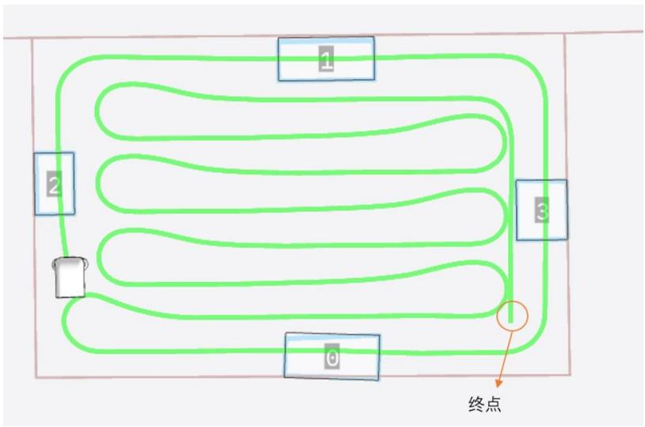

flowchart

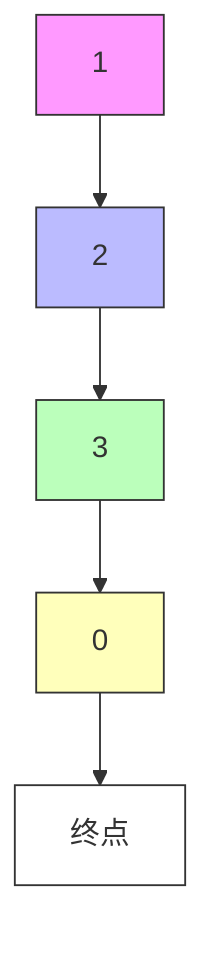
```mermaid
graph TD
    A["1"] --> B["2"]
    B --> C["3"]
    C --> D["0"]
    D --> E["终点"]
    style A fill:#f9f,stroke:#333
    style B fill:#bbf,stroke:#333
    style C fill:#bfb,stroke:#333
    style D fill:#ffb,stroke:#333
    style E fill:#fff,stroke:#333
```

图 5.12 非结构化覆盖任务仿真实验可视化界面

图 5.13 为程序运行时在仿真环境中截取的关键帧的可视化效果图。图(a)到图(h)分别截取了车辆在绕行大型静态障碍物的关键帧的可视化效果图，图(i)到图(j)截取了车辆在大曲率 U-Turn 时的可视化效果图。从图(a)、(c)、(e)、(g)可以看出，本文提出的基于时空动态规划的轨迹规划算法可以实时地生成避开大型静态障碍物的轨迹，基于此轨迹生成的时空安全走廊不与边界和任何一个障碍物碰撞，从图(b)、(d)、(f)、(h)可以看出，后续轨迹优化算法收敛，优化得到的轨迹平滑并且与障碍物保持了一定的安全距离，保证了车辆的运动能力和安全性。从图(j)中可以看出，本文算法在大曲率U-Turn处可以正常收敛，同时优化得到的轨迹平滑，符合车辆运动学要求。

从图 5.14 到图 5.16 的优化问题中的状态量和控制量随时间变化曲线可以看出，车辆在 U-Turn 和绕障时，由于优化问题中运动学模型和横摆角速度约束的限制，优化得到的速度会降低，在正常直行时速度会尽可能贴合目标车速。同时优化得到的加速度和横摆角速度在约束限制的范围内，轨迹的路径坐标随时间变化平滑，因此面对作业场景更复杂且优化问题中约束限制更严格的非结构化场景，本文提出的轨迹规划算法同样可以满足无人车规划轨迹要求。

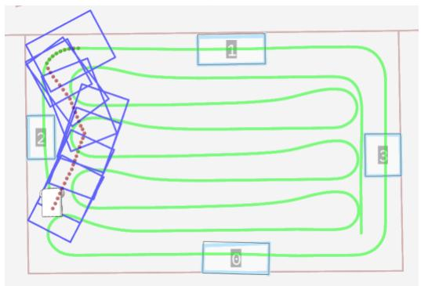

flowchart

```mermaid
graph TD
    A["1"] --> B["2"]
    B --> C["3"]
    C --> D["4"]
    style A fill:#f9f,stroke:#333
    style B fill:#bbf,stroke:#333
    style C fill:#bfb,stroke:#333
    style D fill:#ffb,stroke:#333
```

(a)

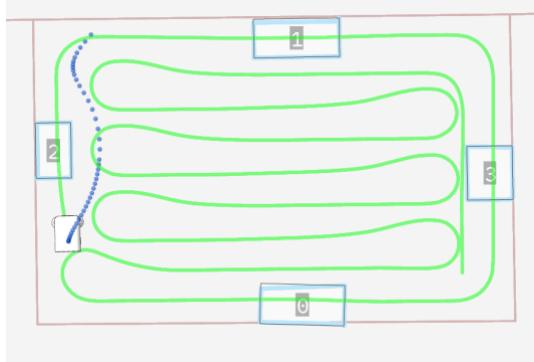

flowchart

```mermaid
graph TD
    A["1"] --> B["2"]
    B --> C["3"]
    C --> D["4"]
    D --> E["5"]
    E --> F["6"]
    F --> G["7"]
    G --> H["8"]
    H --> I["9"]
    I --> J["10"]
    J --> K["11"]
    K --> L["12"]
    L --> M["13"]
    M --> N["14"]
    N --> O["15"]
    O --> P["16"]
    P --> Q["17"]
    Q --> R["18"]
    R --> S["19"]
    S --> T["20"]
```

(b)

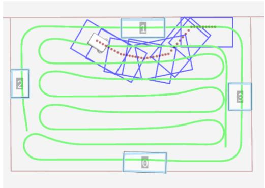

flowchart

```mermaid
graph TD
    A["1"] --> B["2"]
    B --> C["3"]
    C --> D["4"]
    D --> A
    style A fill:#f9f,stroke:#333
    style B fill:#bbf,stroke:#333
    style C fill:#bfb,stroke:#333
    style D fill:#ffb,stroke:#333
```

(c)

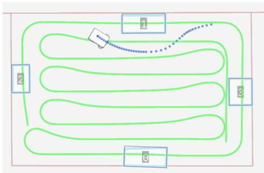

flowchart

```mermaid
graph TD
    A["1"] --> B["2"]
    B --> C["3"]
    C --> D["4"]
    D --> E["5"]
    E --> F["6"]
    F --> G["7"]
    G --> H["8"]
    H --> I["9"]
    I --> J["10"]
    J --> K["11"]
    K --> L["12"]
    L --> M["13"]
    M --> N["14"]
    N --> O["15"]
    O --> P["16"]
    P --> Q["17"]
    Q --> R["18"]
    R --> S["19"]
    S --> T["20"]
```

(d)

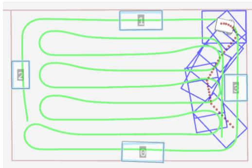

flowchart

```mermaid
graph TD
    A["1"] --> B["2"]
    B --> C["3"]
    C --> D["4"]
    D --> E["5"]
    E --> F["6"]
    F --> G["7"]
    G --> H["8"]
    H --> I["9"]
    I --> J["10"]
    J --> K["11"]
    K --> L["12"]
    L --> M["13"]
    M --> N["14"]
    N --> O["15"]
    O --> P["16"]
    P --> Q["17"]
    Q --> R["18"]
    R --> S["19"]
    S --> T["20"]
    T --> U["21"]
    U --> V["22"]
    V --> W["23"]
    W --> X["24"]
    X --> Y["25"]
    Y --> Z["26"]
    Z --> AA["27"]
    AA --> AB["28"]
    AB --> AC["29"]
    AC --> AD["30"]
```

(e)

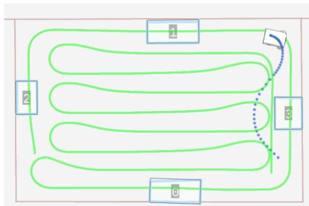

flowchart

```mermaid
graph TD
    A["1"] --> B["2"]
    B --> C["3"]
    C --> D["4"]
    D --> A
    style A fill:#f9f,stroke:#333
    style B fill:#ccf,stroke:#333
    style C fill:#cfc,stroke:#333
    style D fill:#fcc,stroke:#333
```

(f)

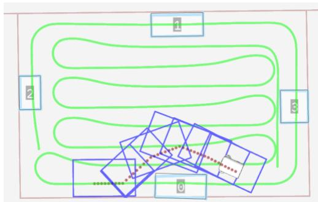

flowchart

```mermaid
graph TD
    A["1"] --> B["2"]
    B --> C["3"]
    C --> D["4"]
    D --> E["5"]
    E --> F["6"]
    F --> G["7"]
    G --> H["8"]
    H --> I["9"]
    I --> J["10"]
    J --> K["11"]
    K --> L["12"]
    L --> M["13"]
    M --> N["14"]
    N --> O["15"]
    O --> P["16"]
    P --> Q["17"]
    Q --> R["18"]
    R --> S["19"]
    S --> T["20"]
    T --> U["21"]
    U --> V["22"]
    V --> W["23"]
    W --> X["24"]
    X --> Y["25"]
    Y --> Z["26"]
    Z --> AA["27"]
    AA --> AB["28"]
    AB --> AC["29"]
    AC --> AD["30"]
```

(g)

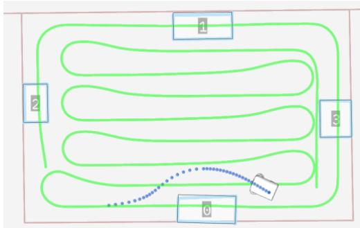

flowchart

```mermaid
graph TD
    A["1"] --> B["2"]
    B --> C["3"]
    C --> D["4"]
    D --> E["5"]
    E --> F["6"]
    style A fill:#fff,stroke:#000
    style B fill:#fff,stroke:#000
    style C fill:#fff,stroke:#000
    style D fill:#fff,stroke:#000
    style E fill:#fff,stroke:#000
    style F fill:#fff,stroke:#000
```

(h)

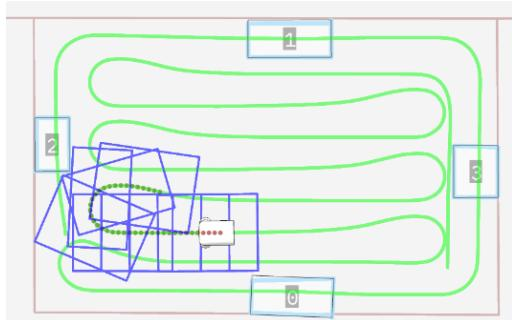

flowchart

```mermaid
graph TD
    A["1"] --> B["2"]
    B --> C["3"]
    C --> D["4"]
    D --> E["5"]
    E --> F["6"]
    F --> G["7"]
    G --> H["8"]
    H --> I["9"]
    I --> J["10"]
    J --> K["11"]
    K --> L["12"]
    L --> M["13"]
    M --> N["14"]
    N --> O["15"]
    O --> P["16"]
    P --> Q["17"]
    Q --> R["18"]
    R --> S["19"]
    S --> T["20"]
    T --> U["21"]
    U --> V["22"]
    V --> W["23"]
    W --> X["24"]
    X --> Y["25"]
    Y --> Z["26"]
    Z --> AA["27"]
    AA --> AB["28"]
    AB --> AC["29"]
    AC --> AD["30"]
    AD --> AE["31"]
    AE --> AF["32"]
    AF --> AG["33"]
    AG --> AH["34"]
    AH --> AI["35"]
    AI --> AJ["36"]
    AJ --> AK["37"]
    AK --> AL["38"]
    AL --> AM["39"]
    AM --> AN["40"]
    AN --> AO["41"]
    AO --> AP["42"]
    AP --> AQ["43"]
    AQ --> AR["44"]
    AR --> AS["45"]
    AS --> AT["46"]
    AT --> AU["47"]
    AU --> AV["48"]
    AV --> AW["49"]
    AW --> AX["50"]
```

(i)

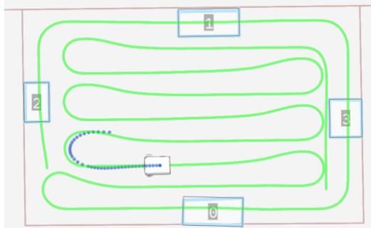

flowchart

```mermaid
graph TD
    A["1"] --> B["2"]
    B --> C["3"]
    C --> D["4"]
    D --> A
    style A fill:#f9f,stroke:#333
    style B fill:#ccf,stroke:#333
    style C fill:#cfc,stroke:#333
    style D fill:#fcc,stroke:#333
```

(j)

图5.13 非结构化场景中关键帧的轨迹规划可视化效果图  
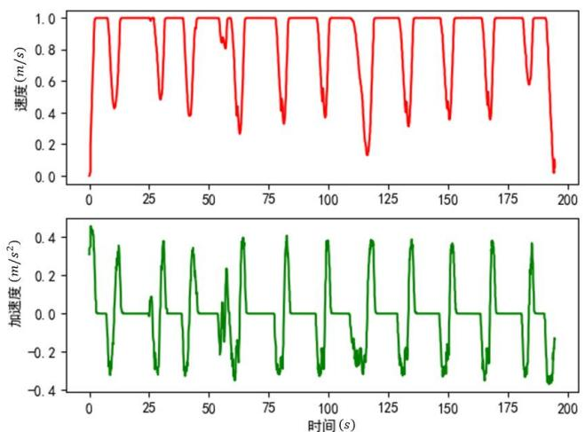

line

| 时间 (s) | 速度 (m/s) | 加速度 (m/s²) |
| -------- | ---------- | ------------- |
| 0        | 1.0        | 0.4           |
| 25       | 0.5        | -0.3          |
| 50       | 1.0        | 0.4           |
| 75       | 0.5        | -0.3          |
| 100      | 1.0        | 0.4           |
| 125      | 0.5        | -0.3          |
| 150      | 1.0        | 0.4           |
| 175      | 0.5        | -0.3          |
| 200      | 1.0        | -0.4          |

图 5.14 速度和加速度随时间变化曲线

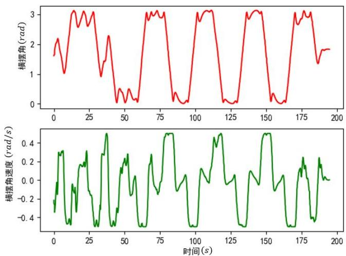

line

| 时间 (s) | 横摆角 (rad) | 横摆角速度 (rad/s) |
| -------- | ------------ | ------------------ |
| 0        | 1.8          | -0.3               |
| 25       | 3.0          | 0.4                |
| 50       | 0.2          | -0.4               |
| 75       | 3.0          | 0.4                |
| 100      | 0.2          | -0.4               |
| 125      | 3.0          | 0.4                |
| 150      | 0.2          | -0.4               |
| 175      | 3.0          | 0.4                |
| 200      | 1.8          | -0.3               |

图5.15 横摆角和横摆角速度随时间变化曲线

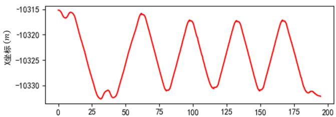

line

| Time (s) | X坐标 (m) |
| -------- | ---------- |
| 0        | -10315     |
| 25       | -10330     |
| 50       | -10325     |
| 75       | -10330     |
| 100      | -10325     |
| 125      | -10330     |
| 150      | -10325     |
| 175      | -10330     |
| 200      | -10335     |

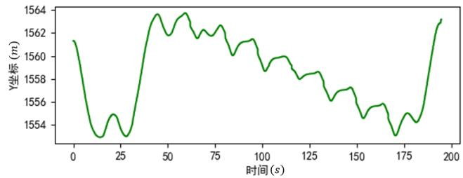

line

| 时间 (s) | Y坐标 (m) |
| -------- | ---------- |
| 0        | 1561       |
| 25       | 1553       |
| 50       | 1563       |
| 75       | 1562       |
| 100      | 1560       |
| 125      | 1558       |
| 150      | 1556       |
| 175      | 1554       |
| 200      | 1563       |

图 5.16 路径坐标随时间变化曲线

根据三组仿真实验的结果分析，本文提出的轨迹规划算法可以满足规划轨迹合理、运行效率和安全性的要求，对于实时性的要求，本文提出的轨迹规划算法在结构化和非结构化场景仿真实验中平均耗时如表 5.2 所示，从表中可以看出，本文提出的算法在设置多障碍物和大曲率 U-Turn 复杂场景下的单帧平均耗时均在 10ms 以下，完全满足目前自动驾驶对于规划模块算法的实时性要求。

表5.2 本文规划算法平均耗时

<table><tr><td>规划算法</td><td>结构化场景耗时</td><td>非结构化场景耗时</td></tr><tr><td>时空动态轨迹规划算法</td><td>1.103ms</td><td>0.912ms</td></tr><tr><td>CILQR 轨迹优化算法</td><td>8.164ms</td><td>7.516ms</td></tr></table>

# 5.4 算法规划性能对比

本章前几节介绍了为验证本文提出的规划算法而设置的三组仿真实验，并给出了仿真实验的结果，分析实验结果可以看出，本文提出的整个轨迹规划算法可以满足规划轨迹的各项要求。本节将进一步对本文提出的算法与类似时空联合轨迹规划算法进行对比分析。

本文的算法核心是将整个轨迹规划问题转化为基于时空联合的最优控制问题，并采用 CILQR 算法框架进行优化求解。在构建优化问题时，本文提出了时空动态规划算法来生成轨迹的参考轨迹，并提出了基于参考轨迹的时空安全走廊生成算法。这两者分别被作为优化问题的目标函数项和不等式约束项，从而形成了一个完整的时空联合规划问题。最后本文使用 CILQR 算法来对该问题进行求解。

对比单独使用 CILQR 算法构建并求解时空联合规划问题，本文提出的时空动态规划算法优化了目标函数中的参考轨迹偏移项。本文算法得到的参考轨迹在全局参考线的基础上考虑了与动、静态障碍物的碰撞约束项，因此相比原算法直接使用全局参考线的方法求解质量更高，同时时空安全走廊约束优化了原算法避免障碍物碰撞的不等式约束项，将原问题中非线性的非凸不等式约束项转化为仿射约束项的数学形式，简化约束项转化为惩罚项的数值求解，提高算法收敛性。单独使用 CILQR 算法和结合时空动态规划和安全走廊的时空联合规划算法绕障效果分别如图 5.17 和图 5.18 所示。

在图 5.17 中，红色轨迹线表示目标函数的参考轨迹，由直接选取全局参考线上的点生成，蓝色轨迹线为根据原 CILQR 算法优化的轨迹，从图中可以看出原算法在绕行大型障碍物时会出现离障碍物距离过近和绕障失败的现象，其主要原因在于参考轨迹直接选取为未考虑避障的全局参考线，如图(a)和(b)中红色轨迹点所示。在整个优化问题求解过程中，最优轨迹既要满足目标函数中与参考线偏移尽可能小的软约束项，又需要满足避开障碍物的硬约束项，当障碍物较大时，硬约束项较难满足，因此会影响迭代过程中目标函数下降方向的准确性，进而在参考线偏移的目标函数项和避障约束的惩罚项综合影响下导致不能完全满足避障的不等式约束，如图(a)所示，同时也会导致优化过程中陷入局部最优解，即尽管满足了避障的不等式约束但未能优化出绕行的轨迹，如图(b)所示。而从图 5.18(a)和(c)看出本文提出的时空动态规划算法可以生成绕行大型障碍物的初始轨迹，后续基于初始轨迹的 CILQR 算法得到的最优轨迹如图(b)和(d)所示，可以看出求解的最优轨迹保证了绕障时轨迹的安全性和平滑性。

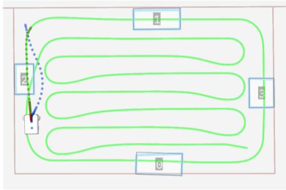

flowchart

```mermaid
graph TD
    A["1"] --> B["2"]
    B --> C["3"]
    C --> D["0"]
    style A fill:#f9f,stroke:#333
    style B fill:#ccf,stroke:#333
    style C fill:#cfc,stroke:#333
    style D fill:#fcc,stroke:#333
```

(a)

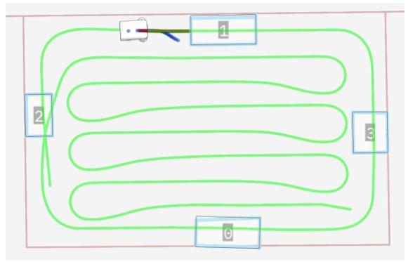

flowchart

```mermaid
graph TD
    A["1"] --> B["2"]
    B --> C["3"]
    C --> D["4"]
    D --> E["5"]
    E --> F["6"]
```

(b)   
图 5.17 原 CILQR 算法的绕障效果图

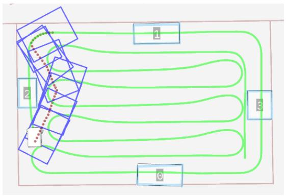

flowchart

```mermaid
graph TD
    A["0"] --> B["1"]
    B --> C["2"]
    C --> D["3"]
    D --> A
    style A fill:#f9f,stroke:#333
    style B fill:#bbf,stroke:#333
    style C fill:#bfb,stroke:#333
    style D fill:#ffb,stroke:#333
```

(a)

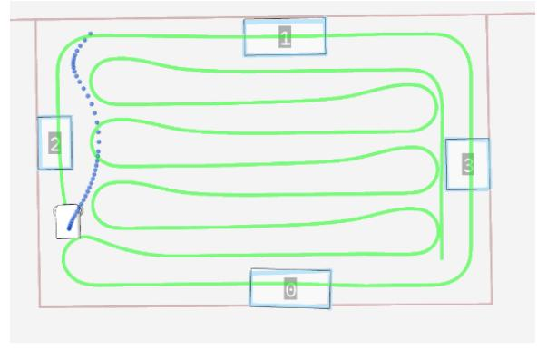

flowchart

```mermaid
graph TD
    A["1"] --> B["2"]
    B --> C["3"]
    C --> D["4"]
    D --> E["5"]
    E --> F["6"]
    F --> G["7"]
    G --> H["8"]
    H --> I["9"]
    I --> J["10"]
    J --> K["11"]
    K --> L["12"]
    L --> M["13"]
    M --> N["14"]
    N --> O["15"]
    O --> P["16"]
    P --> Q["17"]
    Q --> R["18"]
    R --> S["19"]
    S --> T["20"]
```

(b)

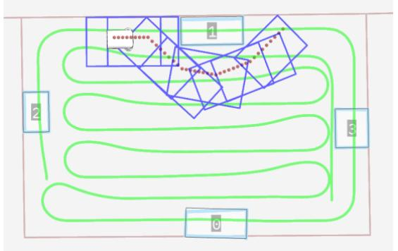

flowchart

```mermaid
graph TD
    A["1"] --> B["2"]
    B --> C["3"]
    C --> D["4"]
    D --> A
    style A fill:#f9f,stroke:#333
    style B fill:#bbf,stroke:#333
    style C fill:#bfb,stroke:#333
    style D fill:#ffb,stroke:#333
```

(c)

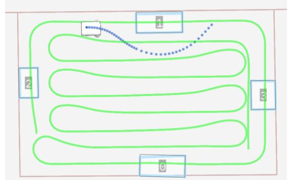

flowchart

```mermaid
graph TD
    A["1"] --> B["2"]
    B --> C["3"]
    C --> D["4"]
    D --> E["5"]
    E --> F["6"]
    F --> G["7"]
    G --> H["8"]
    H --> I["9"]
    I --> J["10"]
    J --> K["11"]
    K --> L["12"]
    L --> M["13"]
    M --> N["14"]
    N --> O["15"]
    O --> P["16"]
    P --> Q["17"]
    Q --> R["18"]
    R --> S["19"]
    S --> T["20"]
    T --> U["21"]
    U --> V["22"]
    V --> W["23"]
    W --> X["24"]
    X --> Y["25"]
    Y --> Z["26"]
    Z --> AA["27"]
    AA --> AB["28"]
    AB --> AC["29"]
    AC --> AD["30"]
```

(d)   
图5.18 基于本文算法的绕障效果图

对比论文[64]中提出的基于笛卡尔坐标系的时空联合规划方法，本文首先改进了时空安全走廊的生成方式，原论文使用 AABB 模型生成如图 5.19(a)所示的时空安全走廊，而本文采用考虑了参考轨迹点的朝向的OBB模型生成时空安全走廊如图5.19(b)所示。从图中可以看出在狭窄 U-Turn区域内采用 AABB 生成方式对空间利用率不如本文方法，尤其在(a)中红色矩形框处，这样会造成优化问题中解空间减少且不连续，而本文方法减少了凸空间的浪费，增大了最优轨迹的求解空间，提高算法收敛性。其次，相比于该论文在相似场景通过开源求解器 IPOPT 求解非线性最优控制问题，本文通过CILQR算法求解大幅提升了算法的实时性，该论文单帧求解耗时273.630ms，本文算法耗时为10ms 以下，同时该论文中只是单帧求解轨迹，而本文算法均为实时帧求解，因此在算法稳定性上也更优。

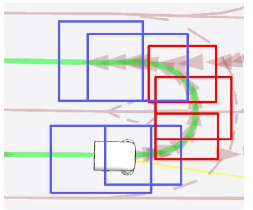

flowchart

```mermaid
graph TD
    A["Blue Square"] --> B["Green Arrow"]
    C["Red Square"] --> D["Green Arrow"]
    E["White Vehicle Icon"] --> F["Yellow Line"]
```

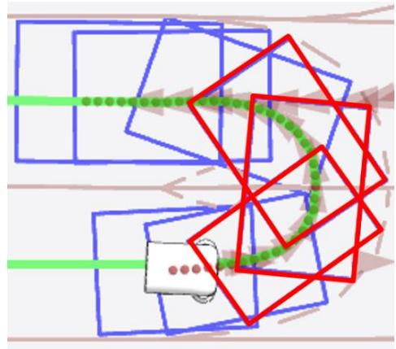

flowchart

```mermaid
graph TD
    A["Robot"] --> B["Blue Box"]
    A --> C["Red Box"]
    B --> D["Green Path"]
    C --> E["Green Path"]
    D --> F["Arrow to Red Box"]
    E --> G["Arrow to Blue Box"]
    style A fill:#f9f,stroke:#333
    style B fill:#bbf,stroke:#333
    style C fill:#bbf,stroke:#333
    style D fill:#dfd,stroke:#333
    style E fill:#dfd,stroke:#333
    style F fill:#dfd,stroke:#333
    style G fill:#dfd,stroke:#333
```

图5.19 时空安全走廊生成方式对比图

# 5.5 本章小结

本章在Ubuntu 系统下基于实车搭建无人清扫车 PNC 仿真环境，并设置仿真实验综合验证本文提出的路径规划和轨迹规划算法。仿真实验场景根据清扫车的作业场景分为结构化和非结构化两个场景，在结构化场景中验证了本文提出的时空联合轨迹规划算法对于动态和静态障碍物的避障能力，在非结构化场景中首先验证本文提出的全局路径规划算法，其次根据规划出的全局路径，更加充分地验证了本文提出的轨迹规划算法对于大曲率 U-Turn 场景及多大型障碍物避障场景的效果。根据仿真环境中关键帧的效果图和优化变量的曲线关系图可以看出，本文提出的时空联合轨迹规划算法可以很好的处理动静态障碍物并满足规划要求的各项性能指标。最后相比于单独使用CILQR 算法和论文[64]提出的算法，本文方法拥有更好的轨迹求解质量、更少的计算时间和更高的求解稳定性，有效减少了运行时 CPU 的计算资源，能够更好地部署到自动驾驶硬件系统中。

# 第 6 章 总结与展望

# 6.1 全文总结

本文主要针对目前无人车的轨迹规划方法难以在多场景下兼顾求解质量和求解耗时的问题，提出了应用于无人车的全覆盖路径规划算法，并建立起一套同时适用于结构化道路和非结构化道路场景且安全高效的时空联合规划算法框架。本文的研究内容总结如下：

（1）建立了非结构化场景下应用于无人车全覆盖路径规划算法。算法基于牛耕式分解法生成全覆盖路径，之后通过基于 DWA算法的路径平滑算法对全覆盖路径进行平滑处理，最终生成符合无人车运动学模型的全局路径。论文中详细介绍了牛耕式分解法步骤中基于扫描线法的整体区域分解、子区域弓字形路径覆盖、通过求解 TSP问题确定子区域的遍历顺序和基于 A\*算法的子区域衔接路径规划算法。并对基于DWA 算法的路径平滑算法的数学原理和实现细节进行了详尽地阐述。最后，构建仿真测试环境对算法进行了验证，证明了算法生成的全局路径可以有效覆盖整个地图区域并且满足平滑性的要求。  
（2）提出了基于时空动态规划的轨迹规划算法和时空安全走廊生成算法。本部分首先通过介绍 Frenet 坐标系并分析其在轨迹规划中的优劣后，选择在 Frenet 坐标系下建立基于时空动态规划的时空联合轨迹规划算法。接下来介绍了三维采样空间的构建方法，并给出了相关参数值，在综合对比后，碰撞检测模型选取 CER 模型。之后详细介绍了基于时空动态规划算法生成最优轨迹的实现流程以及评价函数的设计和状态转移方程的数学形式。接下来对本文提出的时空安全走廊生成算法进行了详尽阐述，安全走廊模型选取 OBB 模型，并详细介绍了粗拓展和精拓展两阶段时空安全走廊生成算法。最后通过仿真测试验证了算法的有效性，并将生成的时空参考轨迹和时空安全走廊输出给下游轨迹优化算法框架。  
（3）建立了基于 CILQR 算法的时空联合轨迹优化框架。本部分首先给出了基于CILQR 框架的一般道路下时空联合轨迹优化问题的定义。之后结合上一部分得到的时空参考轨迹和生成的时空安全走廊，对优化问题中关于状态量和控制量的各项约束和目标函数进行了详尽地数学推导。接下来针对 CILQR 求解最优轨迹的具体方法，

介绍了 CILQR 算法的整体流程，并对后向传递和前向传递两个核心步骤地数学原理和实现细节进行了详尽地阐述。最后列举出了本章算法推导过程中的核心参数值，并应用到第五章仿真验证当中。

（4）基于无人清扫车 PNC 仿真平台的多场景仿真验证。本部分在 Ubuntu 系统下基于 ROS1 搭建了用来验证本文提出的规划算法的 PNC 仿真实验平台，并通过Foxglove仿真器可视化。本文共设置三组仿真实验，前两组实验为结构化场景，最后一组实验为非结构化场景，第一组实验考虑慢速车绕行且对向来车的高动态场景，第二组实验综合考虑动态交通参与者交互、静态障碍物绕行和大曲率 U-Turn 道路的场景，第三组实验考虑更复杂的绕障工况和更多的大曲率 U-Turn 道路的场景。在分析实验结果和对比其他算法后，表明本文提出的时空联合轨迹规划算法框架在结构化和非结构化场景中均展现出规划轨迹的合理性、运行的高效性和安全性，同时具有高实时性的显著优势。

# 6.2 研究展望

本文提出了一套适用于结构化和非结构化场景的高效时空联合规划算法框架，但由于时间和研究的限制，未来仍可以从下面几方面开展更深地工作研究：

（1）将本文提出的轨迹规划算法框架与决策算法相结合。本文通过时空动态规划算法生成安全走廊凸空间的过程中，仅考虑障碍物的位置形状，后续工作可以根据决策算法，结合障碍物类型的不同，考虑障碍物更多的信息，辅助生成安全走廊，让无人车决策更加“老司机”。  
（2）对时空安全走廊模型进一步研究。本文使用的 OBB 模型虽然相比于使用率更广的 AABB 模型解空间利用更好，但当面对周围环境地形更为复杂的非结构化区域也存在对解空间的浪费，后续可以研究可以通过生成凸多边形等方式提升走廊在复杂空间的生成效果。

# 参考文献

[1] 傅蕾. 我国机动车保有量达 4.26 亿辆驾驶人 5.13 亿人[N]. 人民公安报·交通安全周刊, 2023-07-11(001).  
[2] Katie Burke. Self-driving companies to consumers: Take a spin[J]. Automotive News, 2017, 91(6775).   
[3] LeBeau P. Waymo starts commercial ride-share service[J]. URL: https://www. cnbc. com/2018/12/05/waymo-starts-commercial-ride-share-service. html, 2018.   
[4] Gibbs S. Google sibling waymo launches fully autonomous ride-hailing service[J]. The Guardian, 2017, 7.   
[5] 黄震. 汽车行业巨变前夜[J]. 企业观察家, 2019(05): 26-29.  
[6] 袁沂. 最新商用智能驾驶计算机方案与展望[J]. 汽车文摘, 2019, 8.  
[7] 杜明博. 基于人类驾驶行为的无人驾驶车辆行为决策与运动规划方法研究[D].中国科学技术大学,2016.  
[8] 赵盼. 城市环境下无人驾驶车辆运动控制方法的研究[D]. 中国科学技术大学,2012.  
[9] Dijkstra E W. A note on two problems in connexion with graphs[J]. Numerische Mathematik, 1959, 1(1): 269-271.   
[10]Hart P E, Nilsson N J, Raphael B. A formal basis for the heuristic determination of minimum cost paths[J]. IEEE Transactions on Systems Science and Cybernetics, 1968, 4(2): 100-107.   
[11]Furcy D A. Speeding up the convergence of online heuristic search and scaling up offline heuristic search[M]. Georgia Institute of Technology, 2004.   
[12]Likhachev M, Gordon G J, Thrun S. ARA\*: Anytime A\* with provable bounds on suboptimality[C]//Advances in Neural Information Processing Systems. 2004: 767-774.   
[13]Islam F, Narayanan V, Likhachev M. A\*-connect: Bounded suboptimal bidirectional heuristic search[C]//2016 IEEE International Conference on Robotics and Automation (ICRA). IEEE, 2016: 2752-2758.

[14]Koenig S, Likhachev M and Furcy D. Lifelong planning A\*[J]. Artificial Intelligence 2004; 155(1-2): 93-146.   
[15]Aine S, Swaminathan S, Narayanan V, et al. Multi-heuristic A\*[J]. International Journal of Robotics Research, 2014, 35(1-3):224-243.   
[16]Dolgov D, Thrun S, Montemerlo M, et al. Practical search techniques in path planning for autonomous driving[J]. Ann Arbor, 2008, 1001(48105): 18-80.   
[17]Sheng W, Li B, Zhong X. Autonomous parking trajectory planning with tiny passages: a combination of multistage hybrid A-star algorithm and numerical optimal control[J]. IEEE Access, 2021, 9: 102801-102810.   
[18]Sedighi S, Nguyen D V, Kuhnert K D. Guided hybrid A-star path planning algorithm for valet parking applications[C]//2019 5th international conference on control, automation and robotics (ICCAR). IEEE, 2019: 570-575.   
[19]Shi Y, Wang P, Wang X. An autonomous valet parking algorithm for path planning and tracking[C]//2022 IEEE 96th Vehicular Technology Conference (VTC2022-Fall). IEEE, 2022: 1-7.   
[20]La Valle S M. Rapidly-exploring random trees: A new tool for path planning[J]. Technical Report. Computer Science Department, Iowa State University (TR 98-11). 1998: 1-4.   
[21]Karaman S, Frazzoli E. Incremental sampling-based algorithms for optimal motion planning[J]. 2011.   
[22]Kuffner J J, LaValle S M. RRT-connect: An efficient approach to single-query path planning[C]//Proceedings 2000 ICRA. Millennium Conference. IEEE International Conference on Robotics and Automation. Symposia Proceedings (Cat. No. 00CH37065). IEEE, 2000, 2: 995-1001.   
[23]Ferguson D, Stentz A. Anytime rrts[C]//Intelligent Robots and Systems, 2006 IEEE/RSJ International Conference on. IEEE, 2006: 5369-5375.   
[24]杨俊成, 李淑霞, 蔡增玉. 路径规划算法的研究与发展[J]. 控制工程, 2017, 24(07):1473-1480.  
[25]贺承宇. 清扫机器人的路径规划与避障算法研究[D]. 哈尔滨理工大学, 2021.

[26]Zelinsky A, Jarvis R A, Byrne J C. Planning Paths of Complete Coverage of an Unstructured Environment by a Mobile Robot[C]. Proceedings of International Conference on Advanced Robotics, 1993:533-538.   
[27]朱大奇, 颜明重. 移动机器人路径规划技术综述[J]. 控制与决策, 2010, 25(07):961- 967.  
[28]Hofner C, Schmidt G. Path planning and guidance techniques for an autonomous mobile cleaning robot[J]. Robotics and autonomous systems, 1995, 14(2-3): 199-212.   
[29]邱雪娜, 刘士荣, 俞金寿, 等. 移动机器人的完全遍历路径规划:生物激励与启发式模板方法[J]. 模式识别与人工智能, 2006, 19(01): 122-128.  
[30]Nielsen L D, Sung I, Nielsen P. Convex decomposition for a coverage path planning for autonomous vehicles: Interior extension of edges[J]. Sensors, 2019, 19(19): 4165..   
[31]Latombe J C, Latombe J C. Approximate cell decomposition[J]. Robot Motion Planning, 1991: 248-294.   
[32]Choset, H., Pignon, P. (1998). Coverage Path Planning: The Boustrophedon Cellular Decomposition. In: Zelinsky, A. (eds) Field and Service Robotics. Springer, London.   
[33]陈 超 , 唐 坚 . 基 于 可 视 图 法 的 水 面 无 人 艇 路 径 规 划 设 计 [J]. 中 国 造船,2013,54(01):129-135..\  
[34]张赤斌, 王兴松. 基于蚁群算法的完全遍历路径规划研究[J]. 中国机械工程, 2008,256(16): 1945-1949.  
[35]梁嘉俊, 曾碧, 何元烈. 基于改进势场栅格法的清洁机器人路径规划算法研究[J].广东工业大学学报, 2016, 33(04): 30-36.  
[36]Claussmann L, Revilloud M, Gruyer D, et al. A review of motion planning for highway autonomous driving[J]. IEEE Transactions on Intelligent Transportation Systems, 2019, 21(5): 1826-1848.   
[37]WERLING M, ZIEGLER J, KAMMEL S, et al. Optimal trajectory generation for dynamic street scenarios in a frenet frame[C]//2010 IEEE International Conference on Robotics and Automation. [S.l.]: IEEE, 2010: 987-993.   
[38]FAN H, ZHU F, LIU C, et al. Baidu apollo em motion planner[J]. ar Xiv preprint arXiv:1807.08048, 2018.

[39]Ziegler J, Bender P, Dang T, et al. Trajectory planning for Bertha—A local, continuous method[C]//2014 IEEE intelligent vehicles symposium proceedings. IEEE, 2014: 450- 457.   
[40]ZHU Z, SCHMERLING E, PAVONE M. A convex optimization approach to smooth trajectories for motion planning with car-like robots[C]//2015 54th IEEE conference on decision and control (CDC). [S.l.]: IEEE, 2015: 835-842.   
[41]Lim W, Lee S, Sunwoo M, et al. Hierarchical trajectory planning of an autonomous car based on the integration of a sampling and an optimization method[J]. IEEE Transactions on Intelligent Transportation Systems, 2018, 19(2): 613-626.   
[42]GU T, ATWOOD J, DONG C, et al. Tunable and stable real-time trajectory planning for urban autonomous driving[C]//2015 IEEE/RSJ international conference on intelligent robots and systems (IROS). [S.l.]: IEEE, 2015: 250- 256.   
[43]刘召栋. 特定城市场景下的自动驾驶车辆规划算法研究[D]. 吉林大学,2020.  
[44]Zhou J, He R, Wang Y, et al. Dl-iaps and pjso: A path/speed decoupled trajectory optimization and its application in autonomous driving[J]. arXiv preprint arXiv:2009.11135, 2020.   
[45]Miller C, Pek C, Althoff M. Efficient mixed-integer programming for longitudinal and lateral motion planning of autonomous vehicles[C]//2018 IEEE Intelligent Vehicles Symposium (IV). IEEE, 2018: 1954-1961.   
[46]Li B, Kong Q, Zhang Y, et al. On-road trajectory planning with spatio-temporal RRT\* and always-feasible quadratic program[C]//2020 IEEE 16th International Conference on Automation Science and Engineering (CASE). IEEE, 2020: 942-947.   
[47]Deolasee S, Lin Q, Li J, et al. Spatio-temporal motion planning for autonomous vehicles with trapezoidal prism corridors and bézier curves[C]//2023 American Control Conference (ACC). IEEE, 2023: 3207-3214.   
[48]Rufli M, Siegwart R. On the design of deformable input-/state-lattice graphs[C]//2010 IEEE International Conference on Robotics and Automation. IEEE, 2010: 3071-3077.   
[49]McNaughton M, Urmson C, Dolan J M, et al. Motion planning for autonomous driving with a conformal spatiotemporal lattice[C]//2011 IEEE International Conference on

Robotics and Automation. IEEE, 2011: 4889-4895.   
[50]Wang S. State lattice-based motion planning for autonomous on-road driving[D]. , 2015.   
[51]Chang Y, Liang H, Zhao P, et al. On-road Trajectory Planning with Spatio-temporal Informed RRT[C]//2022 IEEE International Conference on Mechatronics and Automation (ICMA). IEEE, 2022: 1425-1431.   
[52]Ajanovic Z, Lacevic B, Shyrokau B, et al. Search-based optimal motion planning for automated driving[C]//2018 IEEE/RSJ International Conference on Intelligent Robots and Systems (IROS). IEEE, 2018: 4523-4530.   
[53]Eiras F, Hawasly M, Albrecht S V, et al. A two-stage optimization-based motion planner for safe urban driving[J]. IEEE Transactions on Robotics, 2021, 38(2): 822-834.   
[54]Liu C, Lin C Y, Tomizuka M. The convex feasible set algorithm for real time optimization in motion planning[J]. SIAM Journal on Control and optimization, 2018, 56(4): 2712-2733.   
[55]Chen J, Liu C, Tomizuka M. Foad: Fast optimization-based autonomous driving motion planner[C]//2018 Annual American Control Conference (ACC). IEEE, 2018: 4725-4732.   
[56]Liu C, Zhan W, Tomizuka M. Speed profile planning in dynamic environments via temporal optimization[C]//2017 IEEE Intelligent Vehicles Symposium (IV). IEEE, 2017: 154-159.   
[57]Chen J, Zhan W, Tomizuka M. Constrained iterative lqr for on-road autonomous driving motion planning[C]//2017 IEEE 20th International conference on intelligent transportation systems (ITSC). IEEE, 2017: 1-7.   
[58]Li W, Todorov E. Iterative linear quadratic regulator design for nonlinear biological movement systems[C]//First International Conference on Informatics in Control, Automation and Robotics. SciTePress, 2004, 2: 222-229.   
[59]Li W, Todorov E. Iterative linear quadratic regulator design for nonlinear biological movement systems[C]//First International Conference on Informatics in Control, Automation and Robotics. SciTePress, 2004, 2: 222-229.   
[60]Xin L, Kong Y, Li S E, et al. Enable faster and smoother spatio-temporal trajectory planning for autonomous vehicles in constrained dynamic environment[J]. Proceedings

of the Institution of Mechanical Engineers, Part D: Journal of Automobile Engineering, 2021, 235(4): 1101-1112.   
[61]Sun L, Peng C, Zhan W, et al. A fast integrated planning and control framework for autonomous driving via imitation learning[C]//Dynamic Systems and Control Conference. American Society of Mechanical Engineers, 2018, 51913: V003T37A012.   
[62]Zhan W, Li J, Hu Y, et al. Safe and feasible motion generation for autonomous driving via constrained policy net[C]//IECON 2017-43rd Annual Conference of the IEEE Industrial Electronics Society. IEEE, 2017: 4588-4593.   
[63]胡杰, 张志豪, 陈瑞楠等. 基于改进 A\*的智能汽车时空联合规划方法[J]. 汽车工程, 2023, 45(07): 1123-1133.  
[64]Li B, Ouyang Y, Li L, et al. Autonomous driving on curvy roads without reliance on frenet frame: A cartesian-based trajectory planning method[J]. IEEE Transactions on Intelligent Transportation Systems, 2022, 23(9): 15729-15741.   
[65]Fox D, Burgard W, Thrun S. The dynamic window approach to collision avoidance[J]. IEEE Robotics & Automation Magazine, 1997, 4(1): 23-33.   
[66]Missura M, Bennewitz M. Predictive collision avoidance for the dynamic window approach[C]//2019 International Conference on Robotics and Automation (ICRA). IEEE, 2019: 8620-8626.   
[67]Brock O, Khatib O. High-speed navigation using the global dynamic window approach[C]//Proceedings 1999 ieee international conference on robotics and automation (Cat. No. 99CH36288C). IEEE, 1999, 1: 341-346.   
[68]Kang Y, de Lima D A, Victorino A C. Dynamic obstacles avoidance based on imagebased dynamic window approach for human-vehicle interaction[C]//2015 IEEE Intelligent Vehicles Symposium (IV). IEEE, 2015: 77-82.   
[69]张岩. 关于最短路算法的一些研究[J]. 西安文理学院学报(自然科学版), 2014,17(4): 32- 35.  
[70]朱浩, 张玉. 基于改进的 Floyd 算法求节点间所有最短路径[J]. 电声技术, 2011,35(12): 65-67.  
[71]宫恩超, 李鲁群. 基于 Bellman-Ford 算法的动态最优路径算法设计[J]. 测绘通报,

2011, (08): 26-28+41.   
[72]李帮义, 何勇, 姚恩瑜. 点带约束成本的最短路问题[J]. 高校应用数学学报 A 辑(中文版), 2000(1): 93-96.  
[73]廖慧芬, 邵小兵. 动态规划算法的原理及应用[J]. 中国科技信息, 2005(21): 42.  
[74]徐靖贤. 无人驾驶轨迹规划与跟踪控制关键技术研究[D]. 长安大学, 2023.  
[75]Ziegler J, Bender P, Dang T, et al. Trajectory planning for Bertha—A local, continuous method[C]//2014 IEEE intelligent vehicles symposium proceedings. IEEE, 2014: 450- 457.