

text_image

JILIN UNIVERSITY CHINA
1946
林大岭

# 吉 林 大 学

# 硕士学位论文

# （专业学位）

# 自动驾驶车辆时空联合决策规划方法研究

# Research on Spatio-Temporal Joint Decision-Making Planning Methods for Autonomous Vehicles

作 者 姓 名：钟良

类 别：机械

领域（方向）：车辆工程

指 导 教 师：卢长刚 副教授

培 养 单 位：汽车工程学院

2025 年 05 月

# 自动驾驶车辆时空联合决策规划方法研究

# Research on Spatio-Temporal Joint Decision-Making and Planning Methods for Autonomous Vehicles

作 者 姓 名：钟良

领域（方向）：车辆工程

指 导 教 师：卢长刚 副教授

类 别：机械

答 辩 日 期：2025 年 5 月 25 日

# 摘 要

# 自动驾驶车辆时空联合决策规划方法研究

随着人工智能技术的快速发展，自动驾驶汽车已经成为汽车产业变革的重要一环。作为自动驾驶汽车的“大脑”，决策规划系统直接影响了自动驾驶的性能。当前，决策规划系统面临着许多挑战，一方面，需要设计能够应对不同场景的决策方法，考虑自车与道路、智能体之间的复杂交互，确保决策的合理性、拟人化与安全性；另一方面，在遵循车辆运动学约束、避障约束等条件的基础上，综合考虑行驶安全性、舒适性等因素进行轨迹规划。对于决策方法，目前广泛应用的规则类与学习类方法难以平衡决策算法的拟人性与安全性，普遍使用的时空解耦规划方法也难以实现轨迹规划问题求解的完备性与最优性。

因此，本文提出一种自动驾驶车辆时空联合的决策规划方法，该方法包含了智能体轨迹预测、自车终点生成、终点搜索、轨迹优化几大模块，适用于结构化与非结构化道路场景。论文主要包括以下几个部分：

首先，研究了基于注意力机制的轨迹预测与自车终点决策方法。通过局部时空注意力编码，将局部区域信息精细化建模，使用全局交互模块学习局部区域间的关联特征。再通过多层感知机网络完成多模态轨迹预测任务。对于自车终点决策方法，本文提出结合规则采样与神经网络的方法，使用规则采样生成自车终点集合，利用注意力机制预测采样终点的概率分布。随后，运用离线优化算法计算最优终点集合，并采用知识蒸馏技术将优化知识迁移至在线模型中。最后实现精确且高效的自车终点决策。

其次，研究了基于 A\* 算法的多目标时空联合搜索方法。具体而言，输入感知和预测结果，构建时空栅格地图。接着改进 A\*算法，实现以多个终点为目标、在三维时空中的搜索算法。最终，综合考虑轨迹代价函数与合理性约束，筛选出最优的粗轨迹，并将其传递至轨迹规划模块，为后续规划提供可靠的输入。

再次，本文研究了基于微分平坦特性的时空联合轨迹规划算法。考虑规划流程的影响因素，提出了一种结合时空安全走廊、时空参数化轨迹以及时空联合规划的综合规划方法。构建时空安全走廊将避障问题转化为凸问题，更快速鲁棒地求解。基于微分平坦特性，将一组满足车辆运动学的平坦输出作为决策变量，设计了一种以控制点位置和轨迹时间为参数的时空轨迹参数化方法，实现轨迹高效合理地表征。结合时空安全走廊、微分平坦特性和时空参数化轨迹，构建了同时考虑横向与纵向优化的时空联合规划问题，通过数学重构将问题转化为无约束优化问题进行求解。最后通过仿真测试进行参数调优以及复杂场景的快速验证。

最后，本文进行了研究内容的仿真验证工作。在 Argoverse 数据集上进行了轨迹预测模型和自车终点决策模型的训练与评估，结果表明模型各项评价指标均达到了预期水平，消融实验也说明了决策模型在安全性与多样性方面的优势。另外，基于 ROS1 构建了搜索与规划算法的联合仿真平台，设计多种典型自动驾驶场景，评估在不同场景下规划轨迹的实时性、合理性以及安全性。

# 关键词：

自动驾驶，轨迹预测，自车终点决策，多目标三维搜索，时空联合规划

# ABSTRACT

# Research on Spatio-Temporal Joint Decision-Making and Planning Methods for Autonomous Vehicles

With the rapid development of artificial intelligence technology, autonomous vehicles have become a crucial part of the transformation of the automotive industry. As the "brain" of automatic driving system, decision-making and planning system directly affects the performance of automatic driving system. At present, decision-making and planning system is faced with many problems. On the one hand, how to design decision-making methods that can cope with different scenarios, considering the complex interaction between autonomous vehicles, roads and agents, to ensure the rationality, personification and safety of decisionmaking; On the other hand, on the basis of following the constraints of vehicle kinematics, obstacle avoidance and other conditions, how to comprehensively consider driving safety, comfort and other factors for trajectory planning. For decision-making methods, it is difficult for the widely used rule-base and learning methods to balance the quasi-humanity and security of decision algorithms, and it is difficult for the widely used spatio-temporal decoupling programming methods to achieve the completeness and optimality of the solution of planning problems.

Therefore, this paper proposes a spatio-temporal decision-making and planning method for autonomous vehicles, which includes several modules, such as trajectory prediction, egotarget generation, graph search and trajectory optimization, and is suitable for structured and unstructured road scenarios. The thesis mainly includes the following parts:

Firstly, trajectory prediction and ego-target decision method based on attention mechanism are studied. Through local spatio-temporal attention coding, the local region information is finely modeled, and the correlation features between local regions are used in the global interaction module. Then the multi-modal trajectory prediction task is completed by MLP. In this paper, a method combining sampling and neural network is proposed to generate the set of ego-target points, and the probability distribution of sampled target points is predicted by the attention mechanism. Then, an off-line optimization algorithm is used to calculate the optimal target points set, and knowledge distillation technology is used to transfer the optimization knowledge to the online model. Finally, accurate and efficient ego-target points are achieved.

Then, A multi-objective spatio-temporal joint search method based on $\mathbf { A } ^ { * }$ algorithm is studied. Specifically, input perception and prediction results to build a spatio-temporal 3D raster map. Then the $\mathbf { A } ^ { * }$ algorithm is improved to realize the search algorithm in threedimensional space-time with multiple target points as the goal. Finally, considering the trajectory cost function and rationality constraint comprehensively, the optimal coarse trajectory is selected and transmitted to the trajectory planning module to provide reliable input for subsequent planning.

Furthermore, a spatio-temporal joint trajectory planning algorithm based on differential flatness is studied. Considering the influencing factors of the planning process, a comprehensive planning method combining spatio-temporal safety corridor, minimal control trajectory and spatio-temporal joint planning is proposed. A spatio-temporal safety corridor is constructed to transform the obstacle avoidance problem into a convex problem, which can be solved more quickly and robustly. Based on differential flatness, a set of flat outputs satisfying vehicle kinematics are taken as decision variables, and a spatio-temporal trajectory parameterization method with control point position and time as parameters is designed to achieve efficient and reasonable trajectory characterization. Combining spatio-temporal safety corridor, differential flatness and parametric trajectory, a spatiotemporal joint programming problem considering both horizontal and vertical optimization is constructed, and the problem is transformed into an unconstrained optimization problem by mathematical reconstruction. Finally, the simulation test is used for parameter tuning and quick verification of complex scenarios.

Finally, this paper carries out the simulation verification of the research content. The training and evaluation of the trajectory prediction model and ego-target decision model are conducted on the Argoverse dataset. The result shows that all evaluation indexes of the model reach the expected level. The ablation experiment also demonstrates the advantages of the decision model in terms of safety and diversity. In addition, a joint simulation platform of search and planning algorithm is built based on ROS1 to design a variety of typical automatic driving scenarios and evaluate the real-time, rationality and safety of trajectory planning in different scenarios.

# Key Words:

Autonomous driving, Trajectory prediction, Ego-target decision, Multi-object 3D search, Spatio-temporal joint planning

# 目 录

# 第1 章 绪论..

1.1 研究背景及意义.  
1.2 自动驾驶系统架构研究现状  
1.3 自动驾驶预测算法研究概述  
1.4 自动驾驶决策规划研究概述 8

1.4.1 行为决策研究概述.  
1.4.2 轨迹规划研究概述.

1.5 本文主要研究内容. .13

# 第2 章 基于注意力机制的轨迹预测与自车终点决策方法 ..17

2.1 本文基础网络介绍. .18  
2.2 基于时空注意力的分层编码器 .20

2.2.1 时空注意力介绍. .20  
2.2.2 分层编码器. .20  
2.2.3 局部区域时空注意力编码. .21  
2.2.4 全局交互编码. .27

2.3 轨迹预测解码器. .28   
2.4 多模态自车终点生成算法 .30

2.4.1 密集终点概率估计. .30  
2.4.2 多模态自车终点集合生成.. .32

2.5 本章小结. .35

# 第3 章 基于A\*的多目标时空联合搜索方法. .37

3.1 时空栅格地图建立. .37

3.1.1 栅格化空间地图表达.. .38   
3.1.2 栅格化时空地图表达.. .39

3.2 基于 A\*的时空联合搜索算法 ..40

3.2.1 A\*算法介绍. ..40   
3.2.2 基于A\*的时空联合搜索算法流程 .41  
3.2.3 时空间搜索节点扩展方法.. .43   
3.2.4 时空联合搜索代价函数. .44

3.3 多目标时空搜索算法. ..46

3.3.1 多目标时空搜索方法.. ..46  
3.3.2 多目标终点聚类. ..48  
3.3.3 轨迹评价方法. .49

3.4 本章总结. .49

# 第4 章 基于微分平坦特性的时空联合轨迹规划算法 ..51

# 4.1 时空安全走廊的数学表述与求解算法 .52

4.1.1 时空安全走廊生成.. .52  
4.1.2 碰撞检测方法. .54

# 4.2 时空轨迹参数化方法. ..56

4.2.1 车辆二自由度运动学模型及其微分平坦特性 .56  
4.2.2 最小化控制量轨迹. .60  
4.2.3 最小化控制量轨迹闭式解求解. ..62

# 4.3 时空轨迹规划问题的构建及求解 ..64

4.3.1 时空轨迹规划问题的构建.. ..64  
4.3.2 时空轨迹规划问题硬约束的处理. ..66   
4.3.3 时空轨迹规划问题可行性约束. ..67  
4.3.4 优化问题的重构.. .69  
4.3.5 无约束优化问题求解.. 71

# 4.4 规划器的仿真测试工具. .72

# 4.5 本章总结. .74

# 第5 章 仿真与实验验证 .75

# 5.1 交通参与者轨迹预测模型训练与结果 .75

5.1.1 轨迹预测常用评价指标. .75   
5.1.2 模型训练与可视化结果. .76

# 5.2 多模态自车终点决策模型训练结果 .79

5.2.1 多模态自车终点决策模型评价指标. .79  
5.2.2 多模态自车终点决策模型可视化结果 .80  
5.2.3 消融实验. .81

# 5.3 时空联合搜索与轨迹规划算法联合仿真验证. .82

5.3.1 非结构化道路场景仿真验证. .82  
5.3.2 超车变道场景仿真验证. .84  
5.3.3 窄路会车场景仿真验证. ..86

# 5.4 本章小结. .88

# 第 6 章 全文总结与展望 .91

6.1 全文总结. ..91  
6.2 研究展望. ..92

# 参考文献... .93

# 第1章 绪论

# 1.1 研究背景及意义

随着汽车领域科技的快速发展以及产业的迅速变革，自动驾驶汽车已经成为车辆交通领域的重要研究方向。面对这一情况，国家在智能汽车发展方面出台了众多政策支持。顶层设计层面，2017年工信部发布的《智能汽车创新发展战略》以及 2020年政府各部门联合发布的《智能汽车创新发展战略行动计划》[1]，为产业发展了奠定基础，设定明确目标和路径，并给予企业政策与融资支持。地方政府也积极响应，比如北京市发布的《关于促进本市会展业高质量发展的若干措施》围绕相关领域谋划展会并开展招商；上海市、深圳市等地也相继出台相关产业扶持政策。自动驾驶汽车已成为我国汽车产业转型升级、建设汽车强国目标的重要一环。

自动驾驶是一种结合高精度传感器与人工智能的先进技术，其核心目标是实现车辆的完全自动化，减轻甚至消除车辆对人类驾驶员的依赖，从而重塑未来交通模式。2024 年，中国具备辅助驾驶功能的乘用车新车销量占比已近五成，越来越多的具有自动驾驶功能的车辆进入市场。《麦肯锡未来出行报告》[2]中根据不同的技术可用性、客户采用率和监管支持水平，预测了三种全球自动驾驶乘用车未来销售情景[1]，报告表明，在较为平均的基础场景下，预计在 2035年，七成以上的新车具备自动驾驶功能，四成左右的新车将配备高级别的自动驾驶系统。

预计乘用车销量中搭载自动驾驶技术的百分比  
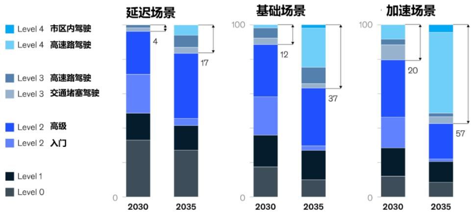

bar_stacked

| 阶段       | 年份   | Level 1 | Level 2 | Level 3 | Level 4 | 市区内驾驶 |
| ---------- | ------ | ------- | ------- | ------- | ------- | ----------- |
| 延迟场景   | 2030   | 17      | 12      | 4       | 4       | 0           |
| 基础场景   | 2030   | 37      | 20      | 0       | 0       | 0           |
| 加速场景   | 2030   | 57      | 0       | 0       | 0       | 0           |

数据来源：麦肯锡未来移动中心

图 1.1 麦肯锡预测全球自动驾驶乘用车未来销售情景

在此背景下，全球各大车企和科技公司也大力投入开发高性能的自动驾驶系统。如24年年初特斯拉FSD V12 推送，开创性地开发了端到端的自动驾驶系统，通过神经网络进行车辆控制，减少了对硬性规则代码的依赖。Waymo 的自动驾驶出租车服务已经在美国多个城市获得了当地交通管理部门的批准和支持，并能实现区域性的收支平衡。比亚迪于2025年初发布“天神之眼”高阶智能驾驶系统，将自动驾驶功能下放到10万元以下级别车型，开创了“全民智驾时代”。另外，地平线、小马智行、文远知行等公司于24 年下半年排队上市，也证明了资本市场对自动驾驶行业的认可[3]。

目前传统的自动驾驶系统主要有几大功能模块：感知预测系统、定位系统、决策规划系统以及控制系统，各模块协同运作，共同实现车辆的智能化驾驶。感知预测系统通过激光雷达、摄像头等多种传感器，实时捕捉道路、障碍物、行人及交通信号等环境信息，并能够预测出车辆和行人等智能体的行为意图，从而掌握其未来动向。定位系统则融合全球定位系统（Global Position System，GPS）、惯性测量单元（Inertial MeasurementUnit ，IMU）、高精度地图数据以及实时定位技术，确保车辆在复杂多变的道路环境中实现厘米级的高精度定位。决策规划系统基于感知预测和定位系统的结果，结合地图与导航信息，规划全局路径并制定最优驾驶策略，同时生成符合车辆运动学特性的局部未来可行驶轨迹。控制系统则依托先进的控制算法将规划轨迹转化为具体的车辆控制指令，精准调控加速、制动和转向，确保车辆行驶的平稳性与安全性。其中，决策规划系统是自动驾驶系统的“大脑”，直接影响自动驾驶系统的性能和安全性。因此，决策规划系统的研究和优化，不仅是自动驾驶技术发展的核心环节，也是实现安全、可靠和高效自动驾驶的基础[4]。

决策规划系统起到至关重要作用的同时，也面临着各方面的问题。决策规划系统分为决策算法和规划算法，其对应的问题也分为两部分：一是设计出在复杂外界环境条件下，考虑自车与道路、智能体之间的复杂交互，保证行为的合理性、拟人性与安全性的决策方法；二是在满足车辆运动学约束、避障约束等约束条件下，综合考虑车辆行驶安全性、舒适性等因素的轨迹规划问题。难以通过简易的算法完全实现性能需求，因此本文拟研究一种自动驾驶车辆时空联合决策规划方法。首先将人类驾驶员的驾驶数据作为专家轨迹，通过深度学习专家轨迹的驾驶行为，从而为决策算法的拟人性、合理性提供有效支持，并使用传统的搜索优化算法显式建模环境并搜索最优解，保障决策算法的安全与合理性。接下来在决策结果的基础上，构建一种时空联合的轨迹规划算法，同时优化横纵向轨迹，生成多个评价维度下的最优轨迹。最终实现多种算法的相互补充，协同优化，综合提升决策规划系统的拟人性、合理性与安全性[5, 6]。

# 1.2 自动驾驶系统架构研究现状

自动驾驶系统的架构随着技术的不断发展而不断演变，目前主要可以分为传统的分层式系统架构以及端到端自动驾驶系统。

传统的自动驾驶系统架构主要继承于机器人领域，尤其是感知、定位和规划三大模块的框架，在自动驾驶技术的发展中长期占据主导地位。传统的自动驾驶系统通常包括感知、定位、预测、决策、规划和控制等核心模块，一个典型的代表即为 Apollo3.0 软件架构[7]，如图 1.2 所示。该架构的优势在于模块化设计，使得各个模块可以独立开发，从而简化了系统的设计过程，同时也便于故障排查与问题定位。然而，这种模块化架构的主要缺点是限制了系统的灵活性与泛化能力，这归因于各模块之间的独立性使得它们在协同工作时的适应性与优化空间受到一定制约，进而影响了系统整体性能和应对复杂场景的能力。本文建立的决策规划系统的主体属于传统的模块化自动驾驶系统，但是在具体实现中应用了神经网络技术，相比于传统决策规划方法有较高的性能上限。

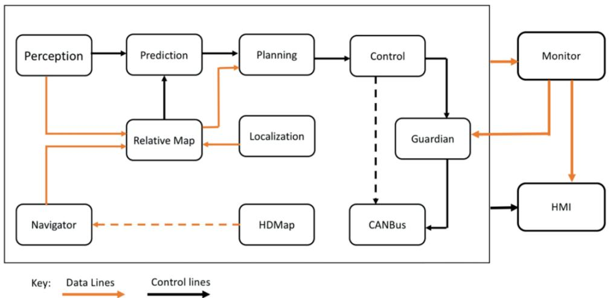

flowchart

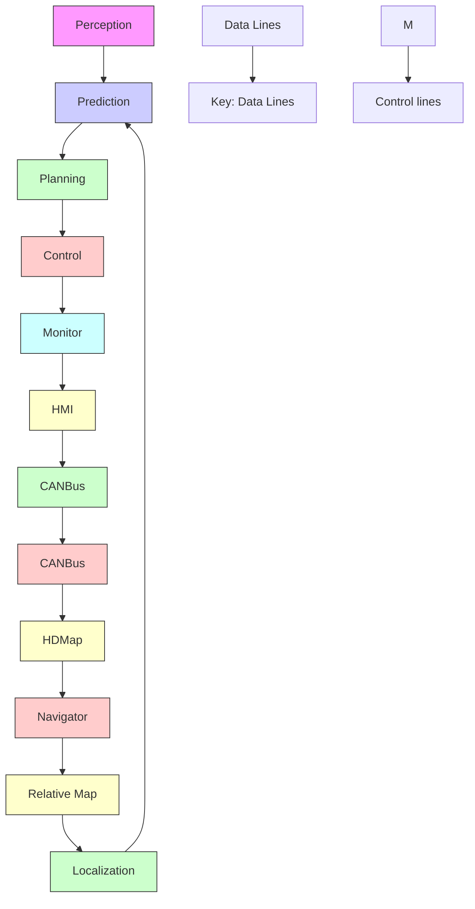
```mermaid
graph TD
    A["Perception"] --> B["Prediction"]
    B --> C["Planning"]
    C --> D["Control"]
    D --> E["Monitor"]
    E --> F["HMI"]
    F --> G["CANBus"]
    G --> H["CANBus"]
    H --> I["HDMap"]
    I --> J["Navigator"]
    J --> K["Relative Map"]
    K --> L["Localization"]
    L --> B
    style A fill:#f9f,stroke:#333
    style B fill:#ccf,stroke:#333
    style C fill:#cfc,stroke:#333
    style D fill:#fcc,stroke:#333
    style E fill:#cff,stroke:#333
    style F fill:#ffc,stroke:#333
    style G fill:#cfc,stroke:#333
    style H fill:#fcc,stroke:#333
    style I fill:#ffc,stroke:#333
    style J fill:#fcc,stroke:#333
    style K fill:#ffc,stroke:#333
    style L fill:#cfc,stroke:#333
    style_M["Data Lines"] --> N["Key: Data Lines"]
    M --> O["Control lines"]
```

图 1.2 百度 Apollo3.0 软件架构

从2023年开始，端到端自动驾驶技术发展迅速。在学术领域，上海人工智能实验室提出的 UniAD（Unified Autonomous Driving）系统于 2023 年 6 月荣获 CVPR 2023 最佳论文奖，这一成就极大地促进了端到端自动驾驶技术的研究热度[8]。此后，众多基于端到端方法的自动驾驶研究成果相继发布，持续引发广泛关注。在产业界，特斯拉自FSD（Full Self Driving）v12版本更新以来，已全面切换至端到端技术架构。与此同时，国内主要汽车制造商及智能驾驶技术公司，如鸿蒙智行、小鹏汽车、Momenta、元戎启行、卓驭、商汤绝影等，也加大了端到端自动驾驶系统的研发力度，并于 2024年陆续

公布了相关量产规划[9]。

虽然端到端自动驾驶技术近期才开始在学术和工业界火爆，但端到端自动驾驶方案在该领域的早期发展中已显现潜力。2016 年，英伟达团队提出了基于卷积神经网络（Convolutional Neural Network，CNN）的端到端自动驾驶系统 DAVE-2，并在其论文中展示了这一创新方法[10]。DAVE-2 系统通过一个单一的卷积神经网络直接处理来自摄像头的原始输入，并输出车辆方向盘转角。在训练过程中，模型通过学习专家驾驶行为，在不同类型的道路上都展示了出色的驾驶性能，包括城市道路与乡村公路。Wayve在 2018 年 9 月发布了论文《Learning to Drive in a Day》[11]。其结合了强化学习与深度学习方法，允许系统通过试错过程自我改进，来适应不同的驾驶环境，而不仅仅依赖于数据的数量和质量。Wayve 的研究成果进一步证明了强化学习在端到端自动驾驶中的应用潜力，并为自动驾驶系统的快速适应和环境交互提供了新的思路。UniAD[8]代表了一种全栈 Transformer 可解释端到端模型设计。该模型架构如图 1.3 所示，包括两个感知模块、两个预测模块以及一个重要的规划模块，这些模块的设计基于 Transformer架构，确保了高效的信息流动与处理能力。UniAD 的架构展现了 Transformer 模型在自动驾驶系统中对复杂任务的高效整合与处理能力，为端到端自动驾驶技术的进一步发展提供了新的研究视角。

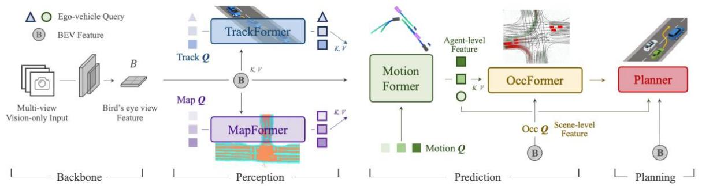

flowchart

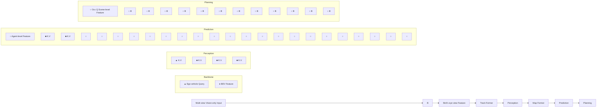
```mermaid
graph LR
    A["Multi-view Vision-only Input"] --> B["B"]
    B --> C["Bird's eye view Feature"]
    C --> D["Track Former"]
    D --> E["Perception"]
    E --> F["Map Former"]
    F --> G["Prediction"]
    G --> H["Planning"]
    
    subgraph Backbone
        I["▲ Ego-vehicle Query"]
        J["● BEV Feature"]
    end
    
    subgraph Perception
        K["▲ K.V"]
        L["■ K.V"]
        M["■ K.V"]
        N["■ K.V"]
    end
    
    subgraph Prediction
        O["○ Agent-level Feature"]
        P["■ K.V"]
        Q["■ K.V"]
        R["○"]
        S["○"]
        T["○"]
        U["○"]
        V["○"]
        W["○"]
        X["○"]
        Y["○"]
        Z["○"]
        AA["○"]
        AB["○"]
        AC["○"]
        AD["○"]
        AE["○"]
        AF["○"]
        AG["○"]
        AH["○"]
        AI["○"]
        AJ["○"]
        AK["○"]
        AL["○"]
    end
    
    subgraph Planning
        AM["○ Occ Q Scene-level Feature"]
        AN["○ B"]
        AO["○ B"]
        AP["○ B"]
        AQ["○ B"]
        AR["○ B"]
        AS["○ B"]
        AT["○ B"]
        AU["○ B"]
        AV["○ B"]
        AW["○ B"]
        AX["○ B"]
        AY["○ B"]
    end
```

图 1.3 UniAD 模型架构

当前，端到端自动驾驶的研究还在进行，由于量产的端到端系统的安全性等因素无法完全符合用户的需求，因此，模块化的系统架构仍然占据着重要地位。而如何结合端到端与模块化架构的优点，综合提升自动驾驶系统性能，是当前阶段的重要工作。本章接下来对模块化架构下的预测决策规划方法进行研究与概述[12]。

# 1.3 自动驾驶预测算法研究概述

能够有效地认知周围的环境并且预测周围智能体未来意图，对决策规划来说至关重要。在人类驾驶行为中，驾驶员通常会持续观察周边交通参与者的动态，并在执行新的驾驶操作（如加速或变道）前，对这些交通参与者的未来状态进行预测[13]。这种预测通常通过未来轨迹的形式来表征，其不仅有助于提前识别潜在危险，还为决策制定和路径规划算法提供了关键输入，如图 1.4所示。

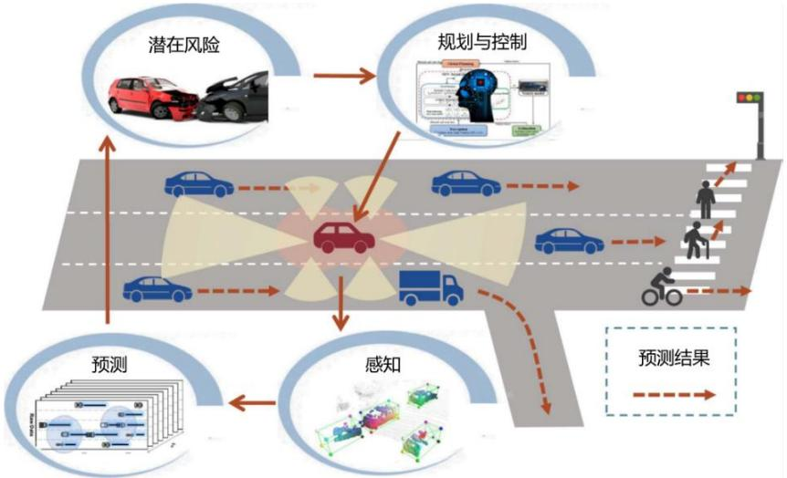

flowchart

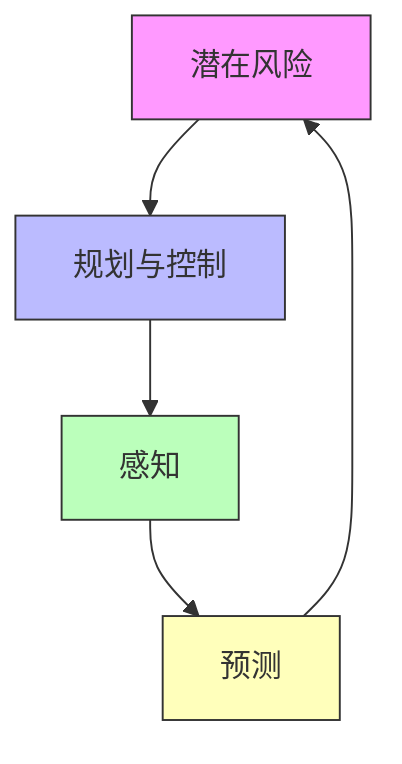
```mermaid
graph TD
    A["潜在风险"] --> B["规划与控制"]
    B --> C["感知"]
    C --> D["预测"]
    D --> A
    style A fill:#f9f,stroke:#333
    style B fill:#bbf,stroke:#333
    style C fill:#bfb,stroke:#333
    style D fill:#ffb,stroke:#333
```

图1.4 轨迹预测的作用

在过去的二十年里，根据不同的建模方法，预测方法可分为基于物理模型的方法、基于机器学习的方法和基于深度学习的方法[14, 15]。基于物理模型的轨迹预测方法通过建立车辆动力学或运动学方程进行状态推演，在此类方法中，车辆运动特性通常采用前轮驱动的自行车模型（Bicycle Model）进行表征。由于参数复杂度较低，运动学模型相较于动力学模型在工程实践中具有更广泛的应用场景[16]。现有研究主要采用以下几种经典运动学模型：恒定速度模型与恒定加速度模型；恒转向率与恒速模型及恒转向率与恒加速度模型[17]；恒转向角与恒速模型以及恒转向角与恒加速度模型[18]。这些模型的核心原理是将车辆当前运动状态作为初始条件代入物理方程进行递推计算，其优势在于算法复杂度低、实时性强，适用于计算资源受限的嵌入式系统。但传统物理模型存在显著局限性：首先，其未考虑道路拓扑结构、交通规则等环境约束因素；其次，当前状态传感器的测量误差会随预测时域延长产生累积效应，导致长期预测可靠性下降[19]。

相较于依赖多物理模型组合的传统方法，基于机器学习的轨迹预测技术通过数据驱动方法构建预测模型。该领域经典方法涵盖支持向量机（Support Vector Machine，SVM）、隐马尔可夫模型（Hidden Markov Model，HMM）以及动态贝叶斯网络（DynamicBayesian Network，DBN）等架构。实证研究表明，DBN因其独特的时空建模能力，在预测精度与场景适应性方面展现出更优的性能表现[20]。DBN 采用贝叶斯概率图模型框架，通过引入时间片机制将静态贝叶斯网络扩展为时序建模工具。具体而言，Kevin 等学者[21]提出的时间模板理论，将连续时间离散化为等间隔的时间片序列，该时间片长度通常与传感器采样周期保持同步，从而有效解决传统贝叶斯网络在时序建模方面的局限性。另外 DBN 通过多层级概率推理实现驾驶意图与轨迹生成的协同预测。尽管DBN 在[20]真实道路测试中展现出显著的识别性能提升，其仍存在技术瓶颈：其一，行为类别空间定义过于受限，现有模型通常仅能识别车道保持与变道等基础行为模式，难以应对复杂交互场景；其二，轨迹生成模块依赖行为识别结果进行多项式拟合，此过程中累积的建模误差会显著降低长时域预测的可靠性。

目前，基于深度学习的轨迹预测方法逐渐流行，这种方法能够将道路和其他地图元素考虑在内，还能融入交互信息，从而适应更加复杂的场景。基于深度学习的轨迹预测网络主要包括循环神经网络（Recurrent Neural Network，RNN）、卷积神经网络和注意力机制。循环神经网络与经典的基于机器学习的处理空间信息的方法不同，它主要对时间序列数据进行处理[22]。RNN 通过存储前一时刻的状态信息，并结合当前输入来计算当前输出。但是在时间步长较大的情况下，传统的 RNN经常会面临梯度消失或梯度爆炸的问题。为了解决这一问题，提出了门控 RNN，如长短期记忆网络（Long Short-term Memory Network，LSTM）和门控循环单元（Gated Recurrent Unit，GRU），它们通过引入门控机制，有效地缓解了梯度问题，并改善了长序列学习的能力。Altche等人[23]应用单层 LSTM 的结构进行轨迹预测任务。Ding 等人[24]通过 LSTM 网络编码智能体的历史轨迹与特征进行其行为预测，并进一步输入行为预测结果与环境信息来预测智能体轨迹。Hyeonet 等人[25]使用编码器-解码器 LSTM 架构，LSTM 编码器对车辆信息进行编码，LSTM 解码器通过搜索算法得到 K个最可能的预测轨迹。Mercat 等人[26]对道路场景中的所有车辆进行联合预测，得到其多模态概率密度函数序列。它的架构使用多头注意力来解释所有车辆之间的交互关系，并使用 LSTM 层进行编码和预测。Zhang 等人[27]提出了一种基于 LSTM 将意图预测和轨迹预测结合起来的框架，多智能体在路口的意图由一个LSTM 模型预测，而轨迹由另一个基于 LSTM 的先验轨迹模型预测。

由于CNN在计算机视觉等领域的成功，其应用也被扩展到了轨迹预测领域。Nikhil等人[28]指出，CNN 具有相比 RNN 在并行计算、特征提取方面更有优势，因此在轨迹预测中融入CNN方法。该研究在传统预测框架基础上，在全连接层之后加入卷积层捕捉时序特征，最后输出预测轨迹。CoverNet[29]提出通过分析车辆状态（如速度、加速度和偏航率）和栅格图像，生成一组可能的未来轨迹，并通过分析语义特征来确定概率最高的轨迹作为预测结果。崔等人[30]结合CNN与车辆运动学模型进行轨迹预测，该模型还能够处理栅格图数据，并有效捕捉运动学特征。由于 CNN 与 RNN 各有优势，因此一些研究将二者结合使用，以提高轨迹预测的精度和效率。Deo 等人[31]采用 LSTM 编码器提取周围车辆的时间信息，并将其输入到社交池化层[32]，社交池化层在栅格化图中，初步学习智能体车辆之间的交互关系，得到社交张量。社交张量通过 CNN 网络捕捉空间维度信息，进一步完善车辆交互信息。最后，解码器生成多模态的概率分布，预测对应的未来轨迹。吴慈航等人[33]采用多头CNN网络提取向量化数据中的基础特征信息，之后进行特征融合获得高维语义信息，最后使用 LSTM 捕捉特征中的时序关系，进行有效预测。

2017 年，Vaswani 等人[34]提出了 Transformer 模型，该模型使用大量的注意力机制来完成序列机器翻译任务，而不使用 RNN。由于 Transformer 模型在机器翻译中取得了优异的成绩，研究人员将 Transformer 模型应用于轨迹预测任务。一些研究者[35]比较了 LSTM 和基于注意力机制的模型在预测行人未来轨迹中的表现。研究结果表明，基于Transformer的模型尤其在长期轨迹预测中表现优越，并且能够处理真实传感器数据中常见的丢失输入观测问题，展现出更强的鲁棒性。另外，Transformer 还被用来建模交通参与者与环境之间的相互作用[36]。例如，Liu 等人[37]提出mmTransformer网络，如图 1.5 所示，该工作将堆叠的 Transformer 网络作为骨干框架，将环境信息整合到轨迹预测模型中，从而提高对未来轨迹的预测精度，mmTransformer 网络结构如图所示。大连理工大学的连静等人[38]使用了两个改进版的 Transformer网络，用于提取低层次的智能体运动学特征和高层次的融合车道目标点时序关联信息的特征，从而实现了基于车道目标引导的车辆轨迹预测。Transformer模型的引入不仅克服了 RNN的计算瓶颈，还使得轨迹预测能够更好地处理长时间跨度的数据，同时也能建模复杂的交互关系和环境信息，为自动驾驶系统中的预测任务提供更强大的支持。本文的预测算法使用了基于Transformer的方法，且在编码和解码过程均使用注意力机制，确保模型能够输出有效且合理的轨迹。

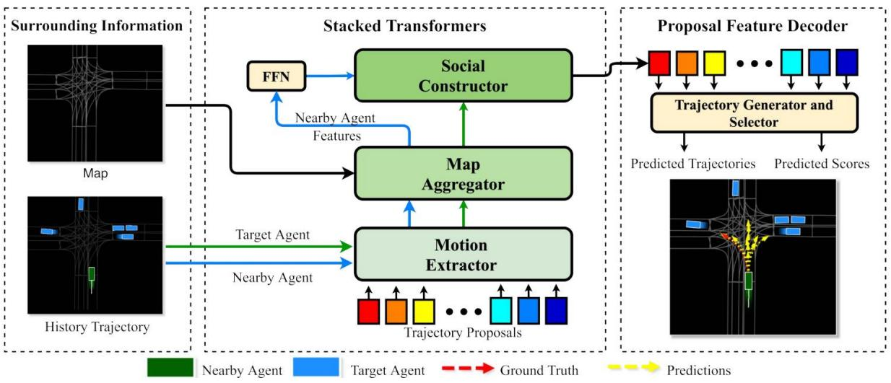

flowchart

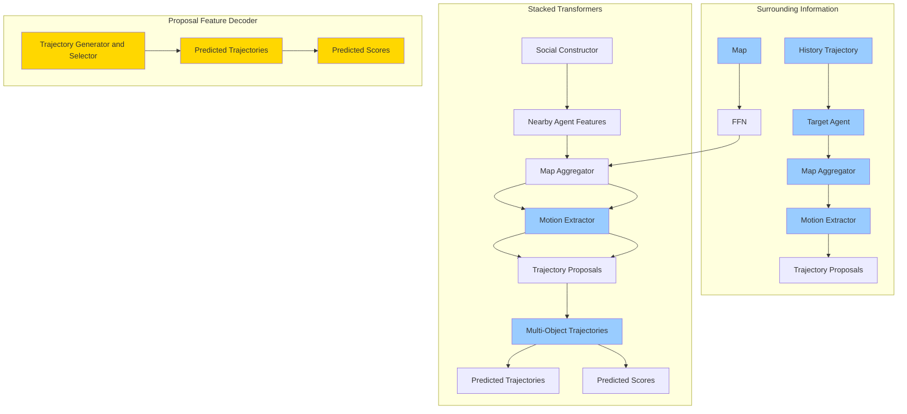
```mermaid
graph TD
    subgraph "Surrounding Information"
        A["Map"] --> B["FFN"]
        C["History Trajectory"] --> D["Target Agent"]
        D --> E["Map Aggregator"]
        E --> F["Motion Extractor"]
        F --> G["Trajectory Proposals"]
    end

    subgraph "Stacked Transformers"
        H["Social Constructor"] --> I["Nearby Agent Features"]
        I --> J["Map Aggregator"]
        J --> K["Motion Extractor"]
        K --> L["Trajectory Proposals"]
        L --> M["Multi-Object Trajectories"]
        M --> N["Predicted Trajectories"]
        M --> O["Predicted Scores"]
    end

    subgraph "Proposal Feature Decoder"
        P["Trajectory Generator and Selector"] --> Q["Predicted Trajectories"]
        Q --> R["Predicted Scores"]
    end

    B --> J
    J --> K
    K --> L
    style A fill:#99CCFF
    style C fill:#99CCFF
    style D fill:#99CCFF
    style E fill:#99CCFF
    style F fill:#99CCFF
    style K fill:#99CCFF
    style M fill:#99CCFF
    style P fill:#FFD700
    style Q fill:#FFD700
    style R fill:#FFD700
```

图 1.5 mmTransformer 网络结构图

# 1.4 自动驾驶决策规划研究概述

自动驾驶决策规划模块负责根据环境信息与上游模块结果，进行自动驾驶车辆的行为决策、并规划出轨迹传给下游。主要可以分为行为决策和轨迹规划两部分。

# 1.4.1 行为决策研究概述

行为决策根据方法原理的不同，主要可以分为反应式、交互式以及学习式决策[39]。反应式决策主要通过分析交通环境信息以及行为决策暗含的逻辑关系，以逻辑推理策略为基础来实现决策过程。该方法较为简单清晰，可解释性很强，但是难以应对复杂交互场景。交互式决策主要是依托于博弈论相关知识，强调车辆与其他交通元素之间的关系，挖掘智能体之间深层次的交互信息，实时调整决策策略，交互式决策方法的优势是对交互的建模较为完备和合理，但是在路口等智能体过多的场景下，问题的建模以及表达能力存在问题。学习式决策方法则是借助深度学习、强化学习等数据驱动的方法，从海量数据中学习专家行为，从而不断优化模型的表现，以应对各种复杂和动态的驾驶环境。与其他决策方法相比，基于学习的系统更加灵活，能够在复杂变化的交通情境下做出更为合理的决策。强化学习通常用于学习人类行为，因为其架构和学习方法基于人类的学习过程[40]。Xu等人[41]提出了一种基于强化学习的智能车辆决策方法，用于高速公路上的车道变换和超车问题。该方法将车道变换和超车的顺序决策问题建模为一个多目标的马尔可夫决策过程，提高决策的安全性、速度和平稳性。Chu 等人[42]通过强化学习解决了车辆跟驰决策问题，得到的决策结果具有较好的拟人性与合理性。

吉林大学的胡宏宇等人[43]使用强化学习方法解决自车匝道汇入决策问题。其通过智能驾驶员模型模拟其他车辆运动，并使用深度确定性策略梯度算法，建立了不同驾驶风格的决策模型。卡尔斯鲁厄理工学院的 Brechtel 等[44]人使用连续空间的部分可观测马尔科夫决策过程（Partially Observable Markov Decision Process，POMDP）建模自动驾驶决策问题，并验证了算法在复杂环境下在应对上游信息不确定性的能力。POMDP 也能够生成与其他道路参与者交互的驾驶行为[45]。除了以上方法，行为决策任务可以看做对自车未来轨迹的预测，因此工业界也尝试使用轨迹预测模型的方法生成自车决策行为。

# 1.4.2 轨迹规划研究概述

轨迹规划是自动驾驶系统中的核心功能模块，其主要任务是在考虑安全性、通行效率和舒适性等多重约束条件的情况下，生成局部时空轨迹曲线。从技术层面来看，轨迹可定义为带有时间戳的参数化曲线，通过对该曲线的调控可实现智能体在时空维度上的运动控制。具体而言，轨迹规划的核心问题在于确定一条满足特定约束条件的时空曲线，该曲线需同时满足以下关键条件：（1）确保运动学可行性，以便于底层控制器的轨迹跟踪控制；（2）保证自车与环境障碍物之间的无碰撞安全性；（3）基于预设的成本函数实现驾驶行为的最优化。在现有研究文献中，轨迹规划有时也被称为运动规划（motion planning）。当前的轨迹规划方法，大致可分为两大类，一类是传统的轨迹规划方法，包括图搜索方法、采样方法以及数值优化方法，另一类是数据驱动方法，主要包括模仿学习、强化学习以及生成式模型方法[6, 46, 47]。

作为路径规划领域经典算法之一，图搜索算法先将环境离散化处理，再进行搜索过程。该算法首先将连续环境空间量化为栅格地图，进而将其转化为图结构表示：其中顶点对应于离散化的空间位置，边则表征位置间的可达关系。在此基础上，算法依据特定的启发式策略和代价评估机制，系统地探索解空间以获取最优路径解。典型的图搜索算法包括Dijkstra算法、A\*算法及其扩展形式 Hybrid A\*算法等，这些算法通过不同的启发式策略和优化机制在计算效率和路径质量之间实现平衡。Dijkstra算法是由著名计算机科学家Edsger W. Dijkstra 提出的基础性路径搜索算法[48]。该算法采用广度优先策略，能够有效求解图中的单源最短路径问题。然而，由于其采用均匀扩展的搜索机制，在探索过程中往往会产生大量冗余节点访问，导致搜索效率受限。为克服这一局限性，研究者[49]基于 Dijkstra 算法框架引入启发式信息，提出了具有目标导向性的 A\*算法，A\*算法通过引入启发式函数显著提升了路径搜索效率，实现了目标导向的最优路径求解。为进一步提高算法在实际自动驾驶场景中的适用性，Dolgov 等人[50]对传统 A\*算法进行了创新性改进，提出了 Hybrid A\*算法。该算法的核心创新在于将车辆的运动学约束（非完整性约束）纳入节点扩展策略，从而生成符合车辆物理特性的可行轨迹。这一突破性成果在 DARPA 城市挑战赛中得到成功验证，充分证明了该算法在处理复杂城市道路环境中的优越性能和工程实用性。为防止搜索过程陷入无解，Qin 等人[51]提出了一种创新性的混合搜索策略，将跳点搜索算法的优势与 Hybrid A\*算法相结合，实现了搜索效率的显著提升。然而，图搜索方法存在着维度的诅咒，目前更适合处理二维空间静态环境的轨迹规划问题，难以扩展到更高维空间，并且问题复杂度随着问题规模指数增加，因此在工程中往往需要与其他方法结合应用。

基于采样的方法在搜索空间中随机生成一系列样本点，并根据这些样本点之间的连接关系来构建路径。这些方法主要依赖于概率论，通过对搜索空间的随机采样来尽可能覆盖空间中的可行区域，并逐渐逼近最终的可行路径。主要可以分为概率图方法（Probability Graph Method）和快速扩展随机树（Rapidly-exploring Random Tree，RRT）[52]。PRM 方法首先在环境中随机生成大量样本点，并通过对这些样本点进行连接，构成一个图结构。然后通过图搜索算法来找到从起点到终点的路径[53]。PRM 方法思路较为简单清晰，但是在采样与搜索过程中没有考虑约束条件，轨迹可能无法执行。RRT[54]方法通过从起点或终点出发，扩展一个树状结构，逐步探索到目标区域。每次扩展时，算法会选择一个随机点，然后在树中寻找一个合适的节点与其连接。RRT 的特点是能够快速找到一条可行路径，但由于其扩展是基于局部搜索的，因此搜索结果并非全局最优，且轨迹平滑性较差。后续，又有学者在此基础上开发了 RRT\*等算法[55]，从多种角度对 RRT 算法进行了改进与优化，在此不多赘述。总之，基于采样的方法能够快速得到可行解，但是由于采样过程具有随机性，难以求解得到最优的结果。

由于数值优化在机器人领域的广泛应用，自动驾驶的轨迹规划也引入了数值优化的方法。基于数值优化的轨迹规划方法通过最优化领域的技术来生成满足约束条件的最优轨迹。数值优化轨迹规划整体可以分为三个部分：一是设置目标函数，定义优化目标，如最小化控制、最小化时间、安全性、舒适性目标等等；二是确定约束条件，使轨迹满足真实世界的物理约束，如车辆运动学与动力学约束、障碍物避让约束等等；三是优化算法，前两部分设置好了优化问题，需要选择合适的优化算法快速、鲁棒、最优地解决这个优化问题，优化算法可以按照优化器原理进行分类，分为梯度下降、二次规划（QP）、内点法（IPOPT）等方法。数值优化轨迹规划相比于其他方法，能够将轨迹规划问题建模更加精细，并且求解速度也相对较快，引起学术届与工业界的广泛研究与应用。戴姆勒公司[56]早期提出了一种基于优化求解轨迹规划问题的方法，该方法同时考虑了车辆系统约束与外部环境约束，并且构建了一个在连续空间下的优化框架，通过序列二次规划（Sequential Quadratic Programming，SQP）求解该优化问题，规划出时空轨迹。百度 Apollo 团队提出的 EM Planner 规划器[57]在早期工业界受到欢迎，该方法以Werling[58]提出基于 Frenet 坐标系的轨迹规划方法为基础，首先使用动态规划方法求解路径与速度粗解，生成凸空间，然后将轨迹规划问题分为路径规划与速度规划两部分，并将问题转化为二次规划问题，使用开源的 OSQP（Operator Splitting QuadraticProgramming）求解器求解。该方法将三维问题降维，使用迭代求解的思路，加快了问题的求解速度，同时问题建模的精度也较高，因此在工业界应用广泛。迭代线性二次调节器（iLQR）方法属于打靶法（shooting），相比于配点法，其将一个大规模问题转化为一系列小的动态规划问题求解，并且迭代过程只更新控制序列无需计算整条轨迹，因此普遍上计算效率更高[59]。Chen 等人[60]提出了一种基于 iLQR 的轨迹规划方法，该方法对约束条件进行了二次化与线性化，以罚函数形式进行惩罚，并且使用 iLQR 对优化问题进行高效求解，实现了领先于 SQP 方法的表现。Han等人[61]基于车辆的微分平坦特性提出了一种配点法的轨迹规划方法，该方法基于微分平坦特性、通行走廊、MINCO轨迹等技术，构建了一个简便合理的轨迹优化问题，然后通过链式求导等方法将其重构为无约束规划方法，最后使用 LBFGS 方法求解。小鹏汽车的 Zhang等人[62]使用非线性优化方法求解静态环境下的轨迹规划问题，该方法使用自行车模型离散积分来定义运动学状态转移函数，然后构建了考虑安全性、舒适性等因素的目标函数，最后使用IPOPT 求解规划问题。

除了按照原理进行分类，轨迹规划还可以根据优化问题建模方法分为时空解耦和时空联合规划方法。在实际工程应用中，轨迹规划的最常用的解决方案是时空解耦规划方案，如EM planner。其核心思想是用迭代法，首先假设速度已知进行路径规划，再在路径规划结果的基础上，求解速度序列。路径与速度依次求解的规划方法，将规划问题分解为低维的子问题，从而实现高效的求解。然而，采用迭代方法的前提是在一个周期内迭代多次直至收敛，而在实际应用中，计算资源有限，不支持一个规划周期内多次进行优化求解，跨周期的迭代方法则因为相邻周期之间上层输入信息持续变化，求解不稳定。相比于时空解耦的规划方法，时空联合求解的解空间完备性更好，能够得到时空维度最优解，在多种复杂场景下，表现得更接近人类驾驶员，能够胜任各种复杂场景下的规划任务[63]。目前的时空轨迹规划方法也可分为基于采样的方法、基于图搜索的方法和基于优化的方法。但它们各自存在一些问题，难以独立且高质量地解决轨迹规划问题[64]。因此有研究者提出将多种方法进行结合以获得更好的性能。清华大学的Long 等人[65]提出了一种结合搜索与优化算法的联合规划方法，在感知与预测输入基础上建立三维的栅格地图，并通过改进的搜索算法得到三维空间下的粗轨迹，最后通过简单的模型预测控制的方法优化粗轨迹完整轨迹规划过程。Ziegler 等人[66]在使用状态栅格方法在时空栅格空间中进行采样，并采用基于搜索的方法来获取可执行轨迹。这种方法为轨迹提供了更高的自由度，使其能够处理更复杂的场景。Zhang 等人[67]基于初始轨迹构建梯形棱柱形状的时空走廊，并在时空走廊内部使用参数化曲线方法拟合得到最终轨迹。武汉理工大学的胡杰等人[68]改进了混合 A\*算法在时空间地图中搜索粗轨迹，并应用二次规划算法进行轨迹的精细化与平滑。

数据驱动的轨迹规划方法能够不断学习人类驾驶员的行为，通过海量数据提升模型性能。相比于传统的轨迹规划方法，其将工程师从手写规则的困境中解放出来，成为了自动驾驶广泛应用的关键一环。基于模仿学习的轨迹规划方法从人类行为中获得监督，数据利用率高，且实现简单。QuAD[69]提出了一种基于查询（Query-based）的运动规划方法，将运动规划问题建模为一种交互式查询任务，进而生成高效且安全的驾驶行为。这种方法通过采样方法生成待选驾驶轨迹，并生成查询点，然后结合注意力机制，为待选点打分，最后综合考虑碰撞风险、轨迹平滑性、目标可达性等因素，挑选代价最低的轨迹作为规划路径。模仿学习规划方法通过学习专家行为来训练规划器，适用于有大量高质量驾驶数据的情况，其直接使用专家数据，避免了生成模型和强化学习中需要大量采样或计算的复杂过程。但是其无法真正理解人类驾驶背后的逻辑，比如驾驶意图、驾驶习惯，知其然不知其所以然。强化学习方法让智能体与环境交互，并从反馈中学习最优策略。该方法能够通过奖励惩罚机制明确引导智能体行为，自主探索可能的驾驶策略，不局限于专家示范，但其行为可能过于“机械化”，缺乏拟人性。Zhang 等人[70]基于模仿学习在实际应用中轨迹不合交通规则的问题，提出了一种结合模仿学习与强化学习的方法，该方法在闭环模拟中进行学习，既包括真实数据集场景，也包括程序生成的极端场景，实验表明该方法能够在常规与长尾场景中都表现出色。生成模型通过模拟环境或场景生成丰富的驾驶数据，从而为自动驾驶系统提供高质量的训练样本，图 1.6 为生成式网络的基本框架。Diffusion-ES 方案[71]设计了一种基于扩散模型和采样优化的轨迹生成与优化方法，该方案分为采样轨迹、评估轨迹和改进轨迹三部分，首先利用扩散模型生成初始轨迹分布，确保轨迹符合真实数据分布，然后使用黑盒奖励函数对生成的轨迹打分，最后对高分轨迹进行去噪声优化轨迹，探索潜在的更优解。GenAD[72]提出了一种生成式端到端自动驾驶框架，其将自动驾驶建模为一个未来生成问题，在一个结构化潜在轨迹空间中同时进行运动预测和轨迹规划。生成模型可以构造出接近真实世界的场景数据，从而提高模型在真实场景的表现，但是通常需要庞大的算力和时间成本，并且对复杂人类行为的场景建模仍然有难度。

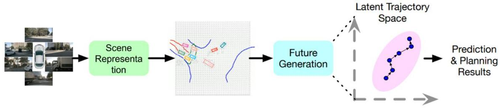

flowchart

```mermaid
graph LR
    A["Car Image"] --> B["Scene Representation"]
    B --> C["Future Generation"]
    C --> D["Latent Trajectory Space"]
    D --> E["Prediction & Planning Results"]
```

图1.6 生成式网络基本框架

# 1.5 本文主要研究内容

综上所述，自动驾驶是一个三维时空间上动态演变的复杂问题，不仅需要处理车辆自身的感知、决策规划等任务，还需与其他智能体（如行人、车辆）以及环境进行深度交互与协同。结合现阶段自动驾驶决策规划领域的研究现状，本文将提出一套适用于结构化与非结构化道路的时空联合决策规划算法框架，并进行仿真实验验证算法的有效性。本文研究内容与架构安排如图 1.7所示，具体安排如下：

第二章进行了基于注意力机制的轨迹预测与自车终点决策方法研究。具体而言，本章为每个交通参与者划分独立的感知区域，并通过三个核心模块：交通参与者间交互信息编码、时序关系编码以及交通参与者与车道信息编码，实现对局部环境信息的精细化表征，再通过全局交互模块学习不同局部区域间的关联特征。在轨迹预测部分，我们设计了基于多层感知机的解码器，输出交通参与者的多模态轨迹。针对自车终点决策问题，本文提出了一种规则采样与神经网络相结合的解决方案。首先采用规则采样方法生成自车终点集合，并引入注意力机制，预测采样终点的概率分布。然后通过离线优化算法获得最优终点集合分布，并利用知识蒸馏技术将优化算法的决策能力迁移至在线模型。最终，通过预测头输出终点集合的坐标分布，实现高效准确的终点决策。

第三章进行了基于A\*的多目标时空联合搜索方法研究。本章旨在为第二章模型终点生成安全轨迹并筛选最优解传递给规划模块。首先，算法以环境感知与轨迹预测结果作为输入，构建了融合动静态障碍物的时空栅格地图。在此基础上，我们对传统A\*算法进行了改进，使其能够在三维时空地图中实现高效的联合搜索，从而生成初步的时空轨迹。为提升算法效率，本框架创新性地结合了虚拟终点采样与逐点搜索策略，在确保实时性的同时，支持为多个候选终点并行生成搜索轨迹。最后，综合考虑轨迹代价函数与合理性约束，算法筛选出最优粗轨迹并输出至轨迹规划模块，为后续的规划模块提供可靠输入。

第四章进行了基于微分平坦特性的时空联合轨迹规划算法研究。本章针对自动驾驶轨迹规划任务提出了一种融合时空安全走廊建模、时空轨迹参数化与时空联合优化的综合规划方法。首先，重构了避障问题的数学描述，建立了具有明确物理意义的时空安全走廊模型。在此基础上，提出了一种以控制点位置和轨迹时间为决策变量的时空轨迹参数化方法，实现了对轨迹的高效表征。在规划算法设计层面，本章引入时空安全走廊和时空参数化轨迹，构建了综合考虑横纵向优化的时空联合规划问题。通过对约束条件的数学重构，将原问题转化为无约束优化问题，并采用 LBFGS 算法实现高效鲁棒求解。最后通过仿真测试工具调节优化参数并验证算法性能。

第五章进行了研究内容的仿真验证工作。本章系统性地验证了第二章轨迹预测与终点决策模型以及第三、四章时空联合搜索与规划算法的性能。其中，轨迹预测模型基于Argoverse数据集进行训练与评估，各项评价指标均达到预期水平；终点决策模型的测试结果表明，其能够准确生成多模态且符合实际驾驶场景的自车终点分布。另外，本章基于ROS搭建了搜索与规划算法的联合仿真平台。通过设计多种典型自动驾驶场景，对路径搜索与轨迹优化功能进行了全面测试，考察算法在不同场景下的适应性以及在实时性、合理性、安全性等方面的表现。

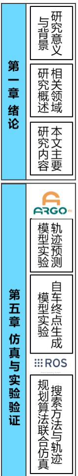

flowchart

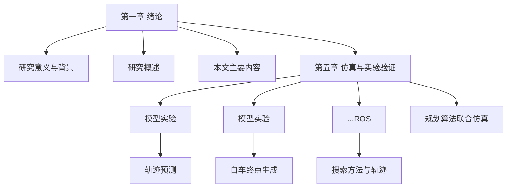
```mermaid
graph TD
    A["第一章 绪论"] --> B["研究意义与背景"]
    A --> C["研究概述"]
    A --> D["本文主要内容"]
    A --> E["第五章 仿真与实验验证"]
    E --> F["模型实验"]
    E --> G["模型实验"]
    E --> H["...ROS"]
    E --> I["规划算法联合仿真"]
    F --> J["轨迹预测"]
    G --> K["自车终点生成"]
    H --> L["搜索方法与轨迹"]
```

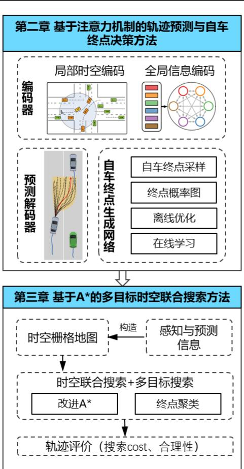

flowchart

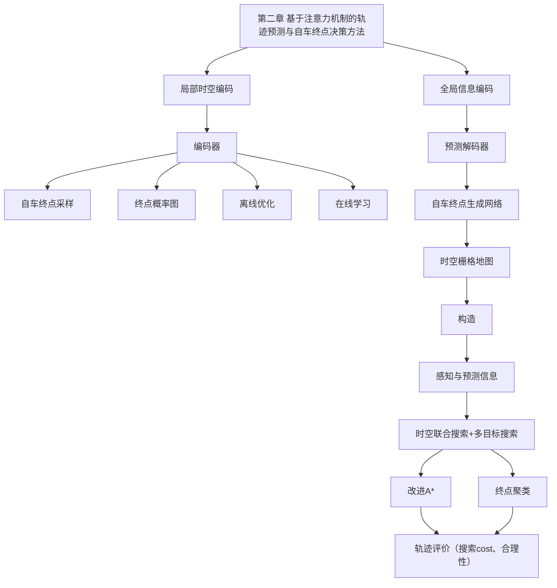
```mermaid
graph TD
    A["第二章 基于注意力机制的轨迹预测与自车终点决策方法"] --> B["局部时空编码"]
    A --> C["全局信息编码"]
    B --> D["编码器"]
    C --> E["预测解码器"]
    D --> F["自车终点采样"]
    D --> G["终点概率图"]
    D --> H["离线优化"]
    D --> I["在线学习"]
    E --> J["自车终点生成网络"]
    J --> K["时空栅格地图"]
    K --> L["构造"]
    L --> M["感知与预测信息"]
    M --> N["时空联合搜索+多目标搜索"]
    N --> O["改进A*"]
    N --> P["终点聚类"]
    O --> Q["轨迹评价（搜索cost、合理性）"]
    P --> Q
```

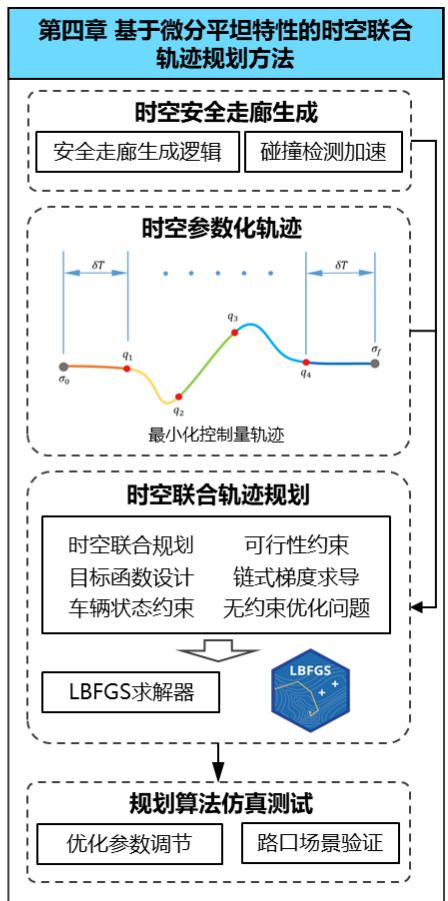

flowchart

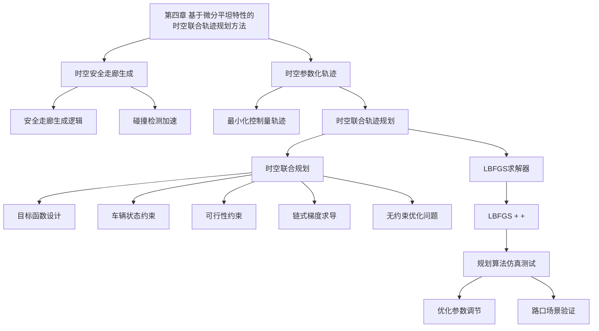
```mermaid
graph TD
    A["第四章 基于微分平坦特性的时空联合轨迹规划方法"] --> B["时空安全走廊生成"]
    B --> C["安全走廊生成逻辑"]
    B --> D["碰撞检测加速"]
    A --> E["时空参数化轨迹"]
    E --> F["最小化控制量轨迹"]
    E --> G["时空联合轨迹规划"]
    G --> H["时空联合规划"]
    H --> I["目标函数设计"]
    H --> J["车辆状态约束"]
    H --> K["可行性约束"]
    H --> L["链式梯度求导"]
    H --> M["无约束优化问题"]
    G --> N["LBFGS求解器"]
    N --> O["LBFGS + +"]
    O --> P["规划算法仿真测试"]
    P --> Q["优化参数调节"]
    P --> R["路口场景验证"]
```

图1.7 本文研究内容与架构安排

# 第2章 基于注意力机制的轨迹预测与自车终点决策方法

在自动驾驶系统中，轨迹预测模块的核心作用是预测交通参与者（如行人、其他车辆等）在未来一段时间内的运动轨迹。轨迹预测是自动驾驶决策规划算法的基础，直接影响到系统的安全性、建模精度以及和其他交通参与者的交互能力。自动驾驶决策算法模块负责对驾驶环境进行实时分析，评估自动驾驶车辆的多种可能行动方案，并选择最优的执行策略，从而确保自动驾驶车辆能够安全、平稳地完成驾驶任务。高性能的预测和决策算法对自动驾驶系统至关重要。

本章提出了基于注意力机制的轨迹预测算法与自车终点决策方法。首先在分层架构下应用时空注意力机制，编码器提取出交通参与者之间、交通参与者与环境间的时间和空间维度的深层交互特征以及局部区域之间的交互关系，然后将编码嵌入向量接入到预测解码器，输出多模态预测轨迹。同时，本文设计了终点驱动的多模态自车终点决策算法，通过生成自车的多模态终点捕捉自车的未来意图，完成决策过程。该部分仍然以时空编码嵌入向量为输入，结合规则采样与注意力机制，生成采样终点和对应的终点概率分布图，然后使用优化方法得到最优终点集并将其作为伪真值监督，通过在线终点集合生成网络得到多模态的自车终点集合。本章框架图如图 2.1 所示。

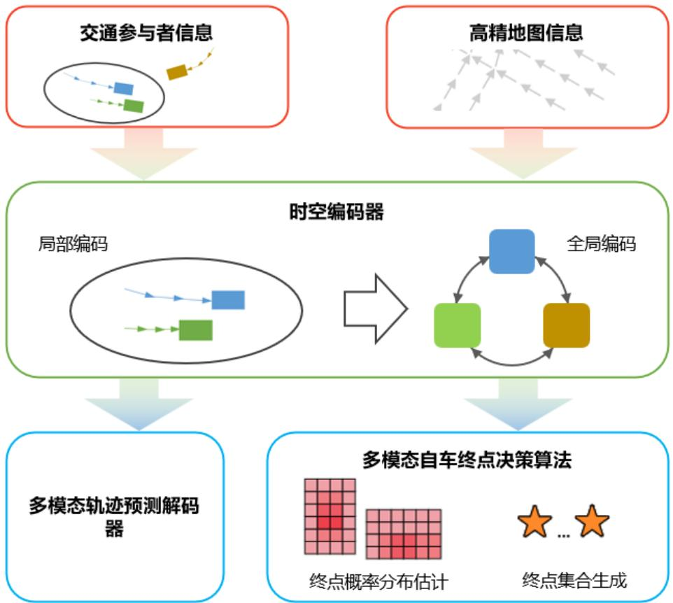

flowchart

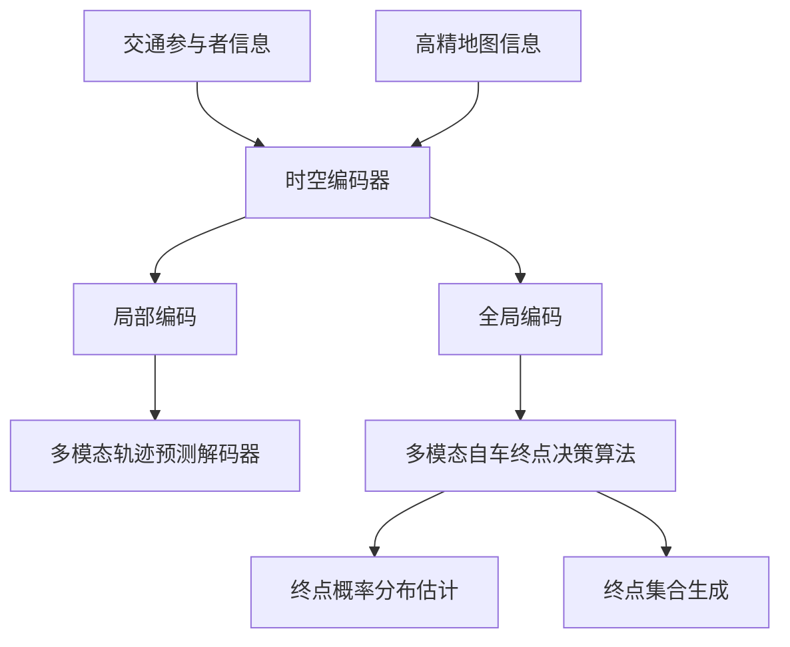
```mermaid
graph TD
    A["交通参与者信息"] --> B["时空编码器"]
    C["高精地图信息"] --> B
    B --> D["局部编码"]
    D --> E["多模态轨迹预测解码器"]
    B --> F["全局编码"]
    F --> G["多模态自车终点决策算法"]
    G --> H["终点概率分布估计"]
    G --> I["终点集合生成"]
```

图2.1 第2章框架图

# 2.1 本文基础网络介绍

在轨迹预测和决策领域，深度学习已成为关键技术。为了有效处理时空数据、提取有价值的特征以及做出合理有效的预测决策，本论文采用了多种基础的深度学习网络作为基础组件。下面对本章使用频率较高的两种网络进行详细介绍，并阐明它们在本研究中的应用与作用。

多层感知机（MLP）是一种经典的前馈神经网络，它由多个全连接层组成。每一个全连接层由多个神经元（或节点）构成，且每个节点与前一层的所有节点相连接。通过这些层的堆叠，MLP 能够逐步学习从输入到输出的复杂非线性映射关系。MLP 广泛应用于各种任务，包括分类、回归、特征提取等。

MLP 的基本结构如图 2.2 所示，包括三部分：输入层、隐藏层和输出层。输入层负责接收外部输入的数据，隐藏层起到加权和与激活函数的作用，将输入数据映射到高维空间，捕捉数据中的非线性特征。输出层根据隐藏层的输出生成最终的结果。MLP的每一层都是通过一组权重和偏置进行计算，并通过非线性激活函数（如 ReLU）引入非线性特性。在模型训练过程中，MLP 通常通过反向传播算法来更新网络中的权重。损失函数会计算网络输出与真实标签之间的误差，并通过梯度下降算法进行优化。多层感知机的简单性和灵活性使得它在很多任务中都表现得非常有效。

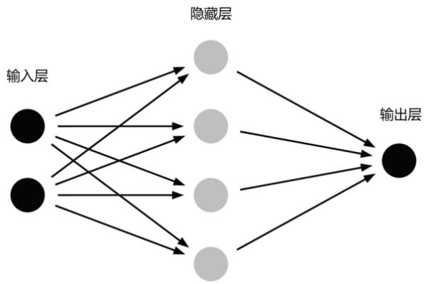

flowchart

```mermaid
graph TD
    A["输入层"] --> B["隐藏层"]
    A --> C["输出层"]
    D["输入层"] --> B
    D --> C
    E["输入层"] --> B
    E --> C
    F["输入层"] --> B
    F --> C
    G["输入层"] --> B
    G --> C
    H["输入层"] --> B
    H --> C
    I["输入层"] --> B
    I --> C
    J["输入层"] --> B
    J --> C
    K["输入层"] --> B
    K --> C
    L["输入层"] --> B
    L --> C
    M["输入层"] --> B
    M --> C
    N["输入层"] --> B
    N --> C
    O["输入层"] --> B
    O --> C
    P["输入层"] --> B
    P --> C
    Q["输入层"] --> B
    Q --> C
    R["输入层"] --> B
    R --> C
    S["输入层"] --> B
    S --> C
    T["输入层"] --> B
    T --> C
    U["输入层"] --> B
    U --> C
    V["输入层"] --> B
    V --> C
    W["输入层"] --> B
    W --> C
    X["输入层"] --> B
    X --> C
    Y["输入层"] --> B
    Y --> C
    Z["输入层"] --> B
    Z --> C
    AA["输入层"] --> B
    AA --> C
    AB["输入层"] --> B
    AB --> C
    AC["输入层"] --> B
    AC --> C
    AD["输入层"] --> B
    AD --> C
    AE["输入层"] --> B
    AE --> C
    AF["输入层"] --> B
    AF --> C
    AG["输入层"] --> B
    AG --> C
    AH["输入层"] --> B
    AH --> C
    AI["输入层"] --> B
    AI --> C
    AJ["输入层"] --> B
    AJ --> C
    AK["输入层"] --> B
    AK --> C
    AL["输入层"] --> B
    AL --> C
    AM["输入层"] --> B
    AM --> C
    AN["输入层"] --> B
    AN --> C
    AO["输入层"] --> B
    AO --> C
    AP["输入层"] --> B
    AP --> C
    AQ["输入层"] --> B
    AQ --> C
    AR["输入层"] --> B
    AR --> C
    AS["输入层"] --> B
    AS --> C
```

图 2.2 MLP 网络结构

在本文中，MLP 在不同网络的编码解码阶段都有使用。在编码模块中，MLP 主要是作为一个基本的特征提取器，有效从输入的时空数据中学习到稍高层次的语义特征，为后续的轨迹预测和终点决策网络提供一个初步的特征嵌入表示。在解码器中，MLP起到特征提取以及特征矩阵降维等作用，并作为回归头来使用。

注意力机制是近年来深度学习领域中广泛应用的一项技术，其在处理序列数据时具有显著的优势。注意力机制的灵感来源于人类在视觉和认知中的注意力机制，即人类在处理大量信息时，往往会选择性地关注最为重要的部分，从而提高处理效率和效果。在神经网络中，注意力机制通过计算输入中各个元素之间的相关性，自动为不同的输入部分分配不同的权重，从而让模型能够聚焦于最相关的信息。

Transformer 架构正是基于注意力机制发展而来的，图 2.3 为 Transformer 网络的基本结构，其依赖自注意力机制建模序列内部关系，捕捉长距离依赖，广泛用于自然语言处理、计算机视觉等领域。注意力机制主要包含查询、键、值三个部分。具体来说，查询、键和值都是输入数据经过线性变换后得到的向量，它们之间通过点积计算相似度，得到的权重值与值向量一起进行加权求和，从而生成最终的注意力输出。

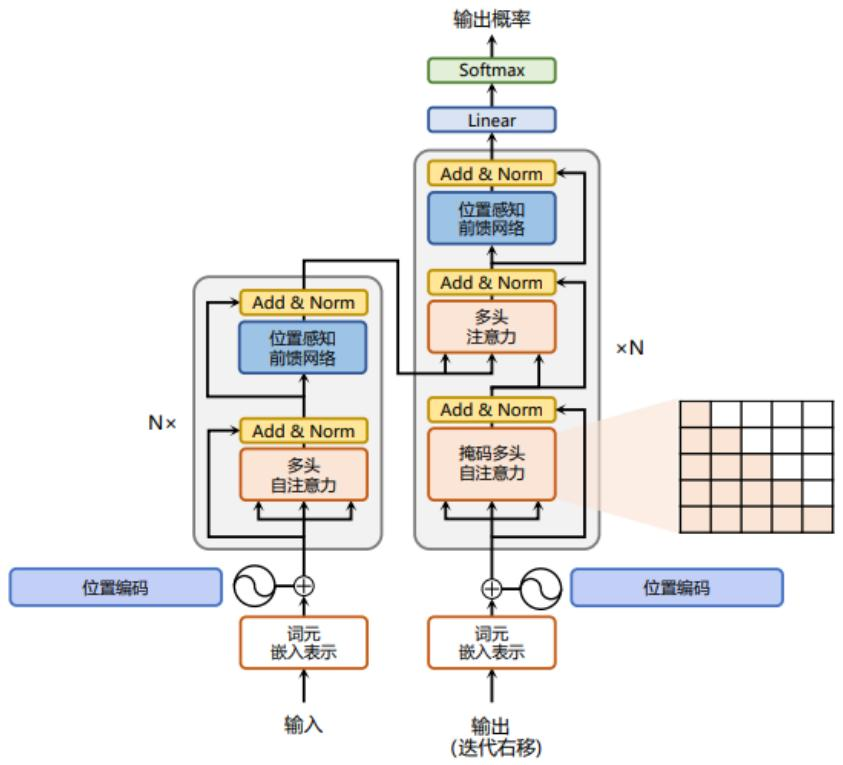

flowchart

神经网络前馈结构流程图，展示位置编码、增减与降维后输出概率的结构，包含位置感知前馈、多头注意力及嵌入表示等关键节点

图 2.3 Transformer 网络结构

Transformer 中的注意力机制有多个变种，其中最为常见的是缩放点积注意力和多头注意力。缩放点积注意力中，查询向量和键向量的点积结果会随着序列长度的增加而增大，为了防止数值过大导致梯度爆炸，通常需要对点积结果进行缩放。而多头注意力则通过并行计算多个独立的注意力头来捕捉输入序列中的不同信息，每个头能够从不同的角度关注输入的不同部分，最终将所有头的输出拼接起来，以获得更加丰富的特征表示。

为使得模型能够更好地理解时间和空间维度的复杂交互，本文采用了 Transformer中的点积注意力与多头注意力机制来进行轨迹预测。通过点积注意力机制有效提升了模型的预测精度和鲁棒性，同时避免了输入序列过长造成的问题。另外使用多头注意力，通过并行计算多个注意力头，模型能够从多个角度学习输入数据的不同特征，有效增强了模型对复杂时空关系的建模能力。

# 2.2 基于时空注意力的分层编码器

# 2.2.1 时空注意力介绍

时空注意力方法是近年来在深度学习领域中处理时空序列数据时应用的一种重要技术，特别是在涉及动态环境建模和预测的任务中（如自动驾驶、交通预测、视频理解等）。时空数据同时包含空间信息和时间信息，时空注意力方法通过在空间和时间维度上分别进行建模，能够有效捕捉复杂的时空关系，同时解耦输入信息加快注意力机制的计算，进而实现高效的预测和决策。

在自动驾驶中，轨迹预测任务要求预测交通参与者（如行人、车辆等）在未来时刻的轨迹，这就涉及到如何建模它们在空间和时间上的变化以及相互作用。如何将空间和时间两种信息合理建模并学习深层次的交互，成为了轨迹预测问题中的一个重要挑战。当前很多方法通过引入时空注意力学习时空数据的交互特征，并获得不错的效果，因此本文也基于时空注意力机制，构建时空信息编码器模块。

时空注意力的核心思想是通过注意力机制关注每个时间步或者每个智能体，使模型能够有选择地关注输入数据的不同部分。具体而言，首先空间注意力模型根据空间位置之间的相关性（如交通参与者之间的相对位置）来计算注意力权重，这使得模型能够学习交通参与者之间的空间交互关系，然后在每个空间位置，时间注意力模型通过计算时间步之间的依赖关系来捕捉时间序列中的长期和短期依赖。这帮助模型更好地理解交通参与者的运动模式和行为变化，从而为预测其未来轨迹提供更精确的信息。

# 2.2.2 分层编码器

目前基于Transformer的轨迹预测决策网络编码器可以分为分层架构与统一架构两种。表2.1对比了两种架构在多个维度上的优缺点。在分层编码器中，模型通常通过不同层次逐步处理不同层级的信息，通常包括底层的局部信息以及高层的全局信息。其分层架构天然适合分解交通参与者时空信息：底层专注于局部区域的时空信息建模，高层专注局部之间的空间关系，能够有效避免统一处理带来的高计算复杂度问题。另外分层架构能够清晰的映射到不同层次的具体任务，拥有更好的模型可解释性，模型也可在不同层的模型中灵活调整模型的结构与参数，更具灵活和扩展性。但是分层架构通常涉及多个层次的设计和信息融合，因此模型的训练和调试过程相对复杂。每一层的输出需要和其他层进行对接和融合，确保信息流动的合理性和一致性，需要更多的时间来调优各层的参数和结构。

在统一架构中，所有的信息都通过编码器的一张大网络进行特征提取与交互信息学习，通常不涉及显式的层次分解。统一架构通常结构简单，只有一个统一的模型进行训练，避免了分层架构中多层次信息交互的复杂性。它减少了模型设计、训练过程中的复杂性，模型的调试和优化也相对更容易。此外统一架构能够直接在同一网络中学习时空依赖，避免了在不同层次间可能出现的信息丢失或不一致，所有的空间和时间依赖都可以直接通过统一的机制进行建模。但是统一架构通常在建模时无法区分不同层次的时空关系。它在捕捉短期与长期依赖、局部与全局关系方面的能力较弱，例如，单一的模型可能很难有效地处理局部的运动行为与全局的交通流动趋势之间的相互作用。当数据规模增大，统一架构可能会受到计算资源的限制，无法有效处理复杂的时空依赖。特别是在处理大规模的交通场景时，单一模型的计算复杂度可能呈指数级增长。统一架构中的信息融合过程也往往较为复杂，导致模型的内在机制难以解释，然而，由于输入的信息更为丰富，其学习能力的上限也会相对较高[73]。

表2.1 分层架构与统一架构的对比

<table><tr><td>特性</td><td>分层架构</td><td>统一架构</td></tr><tr><td>计算复杂度</td><td>较低(解耦信息)</td><td>较高(数据序列较长)</td></tr><tr><td>灵活性</td><td>较强</td><td>较弱</td></tr><tr><td>可解释性</td><td>强</td><td>弱</td></tr><tr><td>特征提取能力</td><td>下限较高</td><td>上限较高</td></tr></table>

# 2.2.3 局部区域时空注意力编码

在分层架构中，首先要将地图区域划分为若干个局部区域，进行局部的特征提取。因此，合理的局部区域划分方法对于模型的性能与实车表现至关重要，局部区域划分过大或过小都会对算法造成负面影响，如实时性变差、学习能力变弱。本文以每个交通参与者为中心，将局部地图区域划分为若干个局部区域，每个局部区域形状为以交通参与者为中心的椭圆，交通参与者的运动方向为椭圆的长轴，椭圆的形状参数如下式：

$$
l _ {a} = \omega_ {l} v + l _ {\text { type }} \dots \tag {2.1}
$$

$$
w _ {a} = \omega_ {w} v + w _ {\text { type }} \dots \tag {2.2}
$$

式中， $\omega _ { l }$ 与 $\omega _ { w }$ 为速度对应的长轴与纵轴权重，v为参与者速度， $l _ { t y p e }$ 为参与者类型加权的长轴基础长度， $w _ { t y p e }$ 为其类型加权的短轴基础长度，椭圆的长轴长度受到参与者的类型和速度的影响，椭圆的短轴长度由交通参与者的类型和尺寸决定。图 2.4 为某路口场景下的局部区域划分示意图，图中虚线椭圆为车辆的局部区域，实线椭圆为 VRU（行人、自行车等交通中弱势群体）的局部区域。将局部区域表征为椭圆形状考虑了交通场景中的现实情况，现实中交通参与者的运动轨迹具有方向性和非对称性，尤其是在车速较高的城市道路与高速场景下，交通参与者往往更关注前方远处与隔壁车道的车辆，不会关心较远车道的车辆行驶状况。因此，选择以交通参与者为中心的椭圆形区域进行局部划分，更符合现实中的空间布局与运动规律。

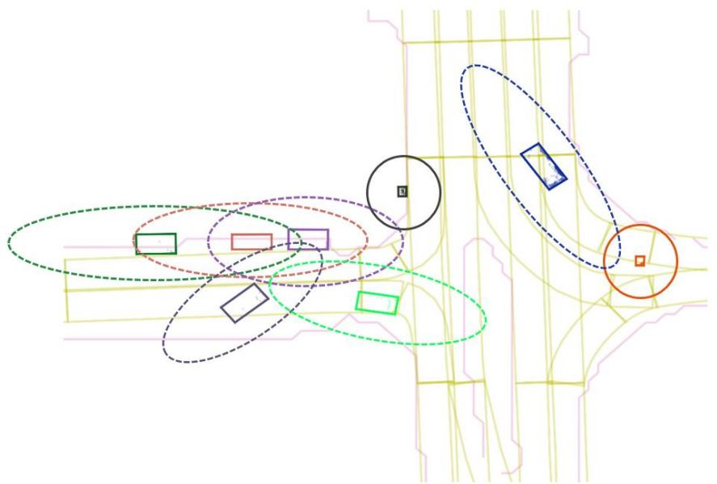

text_image

Diagram showing spatial or geometric shapes with colored outlines and labeled points, overlaid on a grid-like map with colored boxes.

图2.4 局部区域划分方式

划分好局部区域后，就可以在每个局部中进行时空编码。图 2.5为本文时空分层编码器的架构，将场景划分为 n个局部区域（n个智能体）后，局部编码器主要由三个模块组成，局部区域交通参与者间交互信息编码模块负责提取局部区域中心参与者与其他相邻参与者之间在每个时间步的特征；局部区域时序关系编码模块学习每个交通参与者的时序关系；局部区域交通参与者与车道信息编码模块获取区域内的参与者与局部地图车道线信息的交互关系。局部编码完成后，将所有局部区域特征向量接入全局化信息编码模块进行全局特征学习。

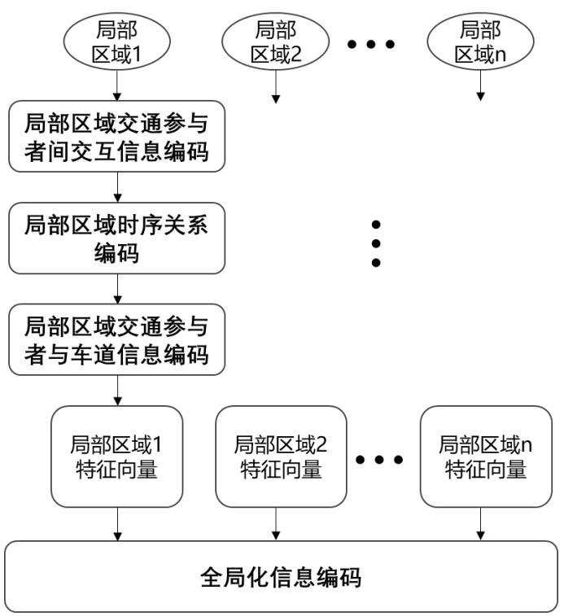

flowchart

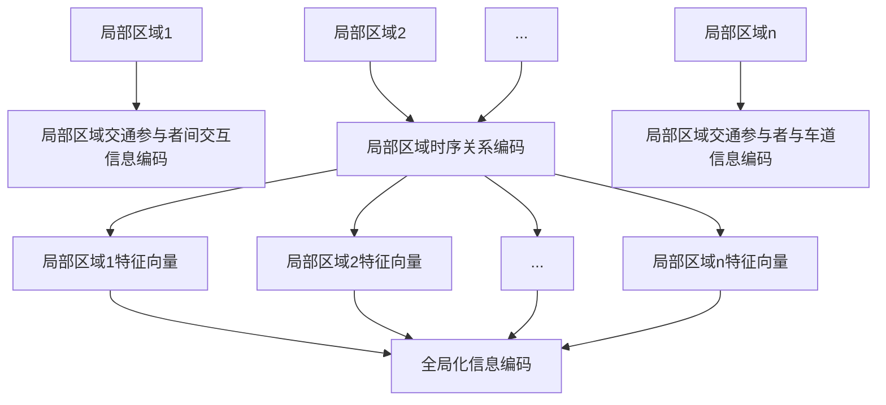
```mermaid
graph TD
    A["局部区域1"] --> B["局部区域交通参与者间交互信息编码"]
    C["局部区域2"] --> D["局部区域时序关系编码"]
    E["..."] --> D
    F["局部区域n"] --> G["局部区域交通参与者与车道信息编码"]
    D --> H["局部区域1特征向量"]
    D --> I["局部区域2特征向量"]
    D --> J["..."]
    D --> K["局部区域n特征向量"]
    H --> L["全局化信息编码"]
    I --> L
    J --> L
    K --> L
```

图2.5 时空分层编码器架构

交通参与者间交互模块的目标是学习单个时间步中心交通参与者与其局部区域内的相邻交通参与者之间的关系，在局部区域中，我们选择中心交通参与者当前时刻的轨迹段 $p _ { i } ^ { { \mathrm { t } } - 1 } \to p _ { i } ^ { t }$ 作为参考向量，这个参考向量代表了中心交通参与者在当前时间步的最新运动方向。具体而言，它指示了中心参与者的运动趋势（如速度和方向），并为后续计算提供了统一的基准。

为了利用预测问题的对称性，我们引入了平移旋转不变性，该模块可以根据中心交通参与者的参考向量方向旋转所有局部交通参与者的轨迹向量，从而消除不同参与者不同方向的影响，实现旋转不变性。这意味着，通过对所有局部交通参与者的轨迹向量进行旋转，使得它们在空间上与参考向量对齐，从而统一了局部区域中所有交通参与者的相对位置关系。假设交通参与者 i 的最新轨迹方向为 $\theta _ { i }$ ，将每个相邻的参与者 j的轨迹向量 $\boldsymbol { p } _ { j } ^ { t }$ 旋转，使其与参与者 i 的参考向量对齐，旋转操作是通过二维空间的旋转矩阵实现的，如式（2.3）所示，式中 $R { \left( \theta _ { i } \right) }$ 为旋转矩阵：

$$
R \left(\theta_ {i}\right) = \left[ \begin{array}{c c} \cos \theta_ {i} & - \sin \theta_ {i} \\ \sin \theta_ {i} & \cos \theta_ {i} \end{array} \right] \dots\dots\tag {2.3}
$$

相邻交通参与者 j 的轨迹向量通过旋转操作可以得到旋转后轨迹向量 $p _ { j ( r o t ) } ^ { t }$

$$
p _ {j (r o t)} ^ {t} = R \left(\theta_ {i}\right) \left(p _ {j} ^ {t} - p _ {j} ^ {t - 1}\right) \dots \tag {2.4}
$$

基于交通参与者的旋转向量以及相关的语义信息（如车辆尺寸、类型等），我们使用MLP 对时空信息进行初步的特征提取，为每个局部区域交通参与者生成一个在时间步t 的嵌入向量：

$$
m _ {i} ^ {t} = P _ {\text { center }} \left(\left[ R _ {i} ^ {\mathrm{T}} \left(p _ {i} ^ {t} - p _ {i} ^ {t - 1}\right), a _ {i} \right]\right) \dots \tag {2.5}
$$

$$
m _ {i, j} ^ {t} = P _ {n b r} \left(\left[ p _ {j (r o t)} ^ {t}, R _ {i} ^ {\mathrm{T}} \left(p _ {j} ^ {t} - p _ {i} ^ {t}\right), a _ {j} \right]\right) \dots\dots\tag {2.6}
$$

式中， $P _ { c e n t e r }$ 与 $P _ { n b r }$ 是两个不同的多层感知机模块， $a _ { i }$ 与 $a _ { j }$ 是交通参与者 i 与 j 的语义信息， $m _ { i } ^ { t }$ 的输入为中心参与者的轨迹向量与其语义信息， $m _ { i , j } ^ { t }$ 的输入为参与者 j 的轨迹向量、其语义信息以及 $\mathrm { j }$ 相对于中心交通参与者 i 的位置向量，通过 MLP 网络，我们得到了交通参与者 i 和 j 在时间步 t 的嵌入向量 $m _ { i } ^ { t }$ 和 $m _ { i , j } ^ { t }$ 。然后，我们将中心交通参与者的嵌入向量 $m _ { i } ^ { t }$ 转换为查询向量 ${ \bf \Pi } ( { \bf q } )$ ），将相邻交通参与者的嵌入向量 $m _ { i , j } ^ { t }$ 输入计算键向量（k）和值向量（v）：

$$
q _ {i} ^ {t} = W ^ {Q s} m _ {i} ^ {t} \dots \tag {2.7}
$$

$$
k _ {i, j} ^ {t} = W ^ {K s} m _ {i, j} ^ {t} \dots\dots\tag {2.8}
$$

$$
v _ {i, j} ^ {t} = W ^ {V s} m _ {i, j} ^ {t} \dots\dots\tag {2.9}
$$

其中， $W ^ { Q s }$ 、 $W ^ { K s }$ 、 $W ^ { V s } \in R ^ { d _ { k } \times d _ { h } }$ 是可学习的线性变换矩阵， $d _ { k }$ 为变换矩阵输出维度，$d _ { h }$ 为输入的嵌入向量的长度。生成的 $q _ { i } ^ { t }$ 、 $k _ { i , j } ^ { t }$ 、 $\nu _ { i , j } ^ { t }$ 作为缩放的点积注意力模块的输入，计算局部区域交通参与者空间交互信息，图 2.6 展示了一个点积注意力机制的计算流程，下式为缩放点积注意力计算公式：

$$
\alpha_ {i} ^ {t} = \text { softmax } \left(\frac {\left(q _ {i} ^ {t}\right) ^ {T}}{\sqrt {d _ {k}}} \left[ \left\{k _ {i, j} ^ {t} \right\} _ {j \in N _ {i}} \right]\right) \dots \tag {2.10}
$$

$$
O _ {i} ^ {t} = \sum_ {j \in N _ {i}} \alpha_ {i} ^ {t} v _ {i, j} ^ {t}. \tag {2.11}
$$

式中，首先对 $\mathsf { q }$ 和k 进行点积运算得到查询向量与键向量的相似度。在 Transformer中，查询向量和键向量的维度是 $d _ { k }$ ，其点积结果会受到维度的影响，为避免点积值过大，将点积结果除以 $\sqrt { d _ { k } }$ 进行缩放。然后将缩放后的点积通过 softmax函数归一化，获得注意力权重 $\boldsymbol { \alpha } _ { i } ^ { t }$ ，最后将注意力权重与值向量v相乘，得到加权求和结果 $O _ { i } ^ { t }$ 。 $O _ { i } ^ { t }$ 即为局部区域在时间步t通过点积注意力机制输出的特征向量。

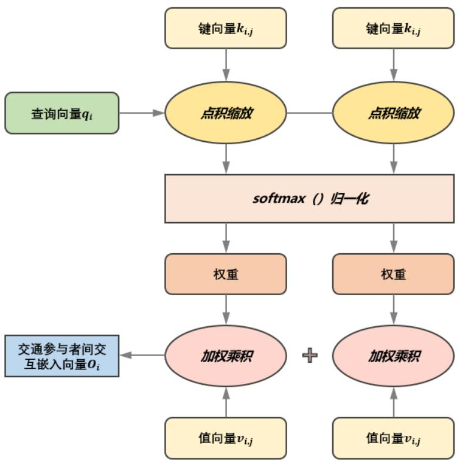

flowchart

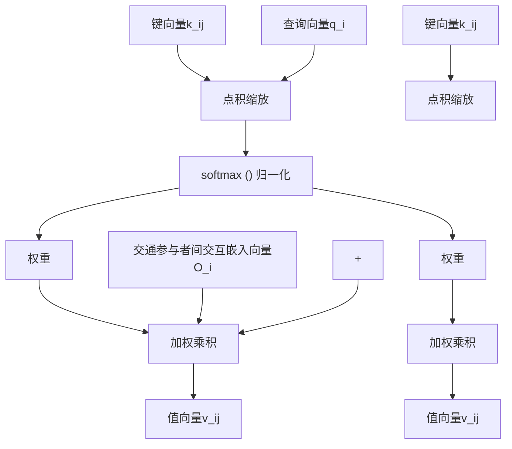
```mermaid
graph TD
    A["键向量k_ij"] --> B["点积缩放"]
    C["键向量k_ij"] --> D["点积缩放"]
    E["查询向量q_i"] --> B
    B --> F["softmax () 归一化"]
    F --> G["权重"]
    F --> H["权重"]
    G --> I["加权乘积"]
    H --> J["加权乘积"]
    I --> K["值向量v_ij"]
    J --> L["值向量v_ij"]
    M["交通参与者间交互嵌入向量O_i"] --> I
    N["+"] --> I
```

图2.6 点积注意力计算流程

另外，与标准的点积注意力相比，本文对其进行了优化，使用门控循环单元（GRU）将环境特征 $O _ { i }$ 与中心交通参与者的特征 $m _ { i } ^ { t }$ 融合，使编码过程中获得多尺度信息。GRU的流程图如图 2.7 所示，它是一种改进的循环神经网络，比 LSTM 结构更简单，计算效率更高。其主要包含更新门与重置门，根据当前时间步输入 $x _ { t }$ 和上一个时间步的隐藏状态 $\cdot h _ { t - 1 }$ ，更新门决策保留多少上一个时间步的隐藏状态 $\cdot h _ { t - 1 }$ ，重置门决定遗忘多少过去的状态信息。

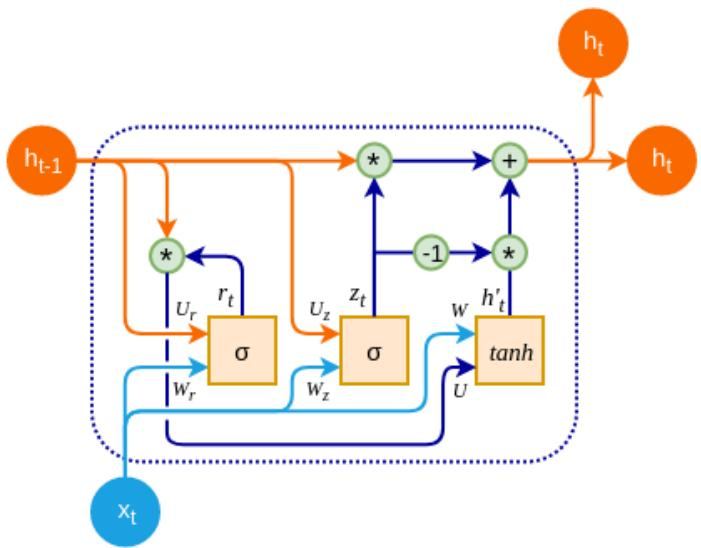

flowchart

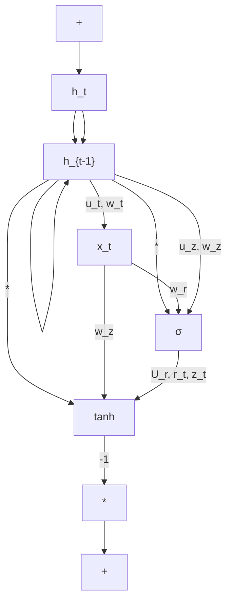
```mermaid
graph TD
    h_t_minus_1["h_{t-1}"] -->|*| σ[σ]
    h_t_minus_1 -->|*| tanh["tanh"]
    x_t["x_t"] -->|w_r| σ
    x_t -->|w_z| tanh
    σ -->|U_r, r_t, z_t| tanh
    tanh -->|-1| *1["*"]
    *1 --> add["+"]
    + --> h_t["h_t"]
    h_t --> h_t_minus_1
    h_t_minus_1 -->|u_z, w_z| σ
    h_t_minus_1 -->|u_t, w_t| x_t
    h_t_minus_1 --> h_t_minus_1
    h_t --> h_t_minus_1
```

图 2.7 GRU 流程图

使用 GRU 融合环境特征的过程如下式。式中， $W ^ { g a t e }$ 和 $W ^ { s e l f }$ 是可学习矩阵， $\odot$ 代

表逐元素乘积计算， $\hat { m } _ { i } ^ { T }$ 为经过门控函数后的交通参与者间交互嵌入向量。

$$
g _ {i} ^ {t} = \operatorname{sigmoid} \left(W ^ {\text { gate }} \left[ m _ {i} ^ {t}, O _ {i} ^ {t} \right]\right) \dots \tag {2.12}
$$

$$
\hat {m} _ {i} ^ {t} = g _ {i} ^ {t} \odot W ^ {\text { self }} m _ {i} ^ {t} + \left(1 - g _ {i} ^ {t}\right) \odot O _ {i} ^ {t} \dots \tag {2.13}
$$

和标准的Transformer 一样，本研究注意力模块也可以扩展为多头注意力模块。多头注意力及后续操作流程如图 2.8所示。将多头注意力模块的输出拼接后，通过一个多层感知机模块进行降维，降维后通过两层残差网络以及层归一化，避免训练中出现网络退化问题。最终我们获得交通参与者 i 在时间步t的空间交互信息的嵌入向量 $s _ { i } ^ { t } \in R ^ { d _ { h } }$ 。

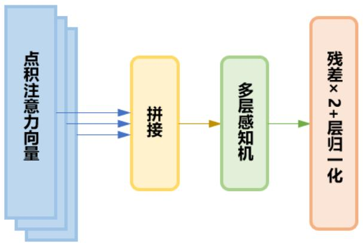

flowchart

```mermaid
graph LR
    A["点积注意力向量"] --> B["拼接"]
    B --> C["多层感知机"]
    C --> D["残差×2+层归一化"]
```

图2.8 多头注意力以及后续处理

在交通参与者间交互信息编码后，我们得到了每个局部区域在每个时间步的空间交互信息。为进一步捕获局部区域内每个交通参与者的时序信息，本文在局部交通参与者交互信息编码模块之后进行时序关系编码操作提取时序特征，该编码模块也是主要通过注意力机制实现。对于任意中心交通参与者 i，该模块的输入是交通参与者间交互模块在不同的时间步长返回的嵌入向量 ${ \boldsymbol { s } } _ { i } ^ { t }$ 的集合，另外，我们在输入序列的末尾加上一个可学习的标记，促使模型在学习阶段在序列的结尾位置生成更精确的上下文信息。将可学习的标记嵌入到输入中得到矩阵 $S _ { i } \in R ^ { ( T + 1 ) \times d _ { h } }$ ，输入到时间注意力模块中，时间注意力的计算公式如下：

$$
Q _ {i} = S _ {i} W ^ {Q t} \dots \tag {2.14}
$$

$$
K _ {i} = S _ {i} W ^ {K t} \dots \tag {2.15}
$$

$$
V _ {i} = S _ {i} W ^ {V t} \dots \tag {2.16}
$$

$$
\hat {S} _ {i} = \text { softmax } \left(\frac {Q _ {i} K _ {i} ^ {\mathrm{T}}}{\sqrt {d _ {k}}} + M\right) V _ {i} \dots \tag {2.17}
$$

$$
M _ {a b} = \left\{ \begin{array}{l l} - \infty & \text {   if   } a <   b, \\ 0 & \text {   otherwise,   } \end{array} \right. \tag {2.18}
$$

其中 $\boldsymbol { W } ^ { Q t } \setminus \boldsymbol { W } ^ { K t } \setminus \boldsymbol { W } ^ { V t } \in R ^ { d _ { h } \times d _ { K } }$ 是可学习矩阵，计算过程仍为标准的点积注意力计算。$M \in R ^ { ( T + 1 ) \times ( T + 1 ) }$ 是时间掩码，结构如图 2.9 所示。通过时间掩码可以让可学习标记只专注于当前与之前的时间步特征。时间编码模块除了注意力模块以外，还包含了与交通参与者间交互模块类似的后续处理，如多头注意力、MLP 以及Transformer中的残差与层归一化，最后得到交通参与者时空交互特征。

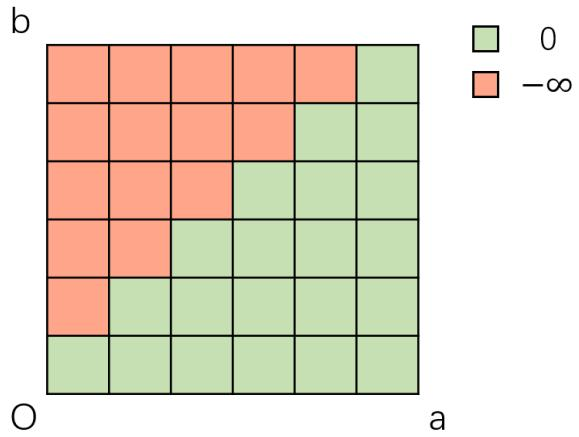  
图2.9 时间掩码矩阵

地图能够限制交通参与者的通行范围，并指引其未来意图，交通参与者需要按照地图行驶。因此学习局部地图信息特征对正确预测参与者轨迹非常重要。我们首先提取出局部区域中的车道线元素，然后与轨迹向量的处理方法类似，以中心向量为参考旋转局部车道向量以及车道相对位置，然后将旋转后的向量通过 MLP 进行编码：

$$
m _ {i _ {\text { lane }}} = P _ {\text { lane }} \left(\left[ R _ {i} ^ {\mathrm{T}} \left(p _ {\text { lane }} ^ {1} - p _ {\text { lane }} ^ {0}\right), R _ {i} ^ {\mathrm{T}} \left(p _ {\text { lane }} ^ {0} - p _ {i} ^ {T}\right) a _ {\text { lane }} \right]\right) \dots \tag {2.19}
$$

其中 $P _ { l a n e }$ 是车道线元素的 MLP 编码器， $R _ { i }$ 是中心交通参与者 i 对应的旋转矩阵，$p _ { l a n e } ^ { 0 }$ 是车道线的起点位置， $p _ { l a n e } ^ { 1 }$ 是车道线的终点位置， $a _ { l a n e }$ 为车道线的语义信息。将中心交通参与者的时空特征作为查询输入，将用 MLP 编码的车道线元素特征作为键输入与值输入，然后应用点积注意力、多头注意力，MLP 等网络进行特征提取。最后应用另一个MLP 模块获得最终的局部区域嵌入向量 $l _ { i } \in R ^ { d _ { h } }$ 。

在经过以上交互模块进行顺序建模后，最后的嵌入向量 $\cdot l _ { i }$ 融合了局部区域的中心交通参与者与周围交通参与者的时空交互以及与地图车道线的空间交互。

# 2.2.4 全局交互编码

局部区域编码器能够学习到局部区域丰富的特征信息，但其学习能力受到了局部区域范围的限制。因此为了增强算法在全局区域的学习能力，本文进一步使用全局交互编码来补偿受限的局部编码，捕获场景级别的长距离依赖关系。全局交互操作可以转换为所有局部区域两两之间的交互，由于局部特征是在以交通参与者为中心的坐标系中提取的，因此全局交互模块在执行局部区域间的消息传递时，需考虑帧间局部区域的几何关系。为此本研究对编码进行了修改，让网络有效地学习和理解局部坐标系之间的差异。

在局部区域之间，交通参与者 i 与交通参与者 j 的局部坐标系的差异可以分为坐标系原点的差异和角度的差异。具体而言，我们分别使用 $p _ { j } ^ { t } - p _ { i } ^ { t }$ 以及 $\Delta \theta _ { i j }$ 来表征两者坐标原点的相对偏移量与角度的相对偏差。在此基础上，本文引入了一个多层感知机模块，用于高效提取交通参与者 i 与j 之间的交互特征，以实现对交通场景中个体间复杂动态关系的精准建模与表征，如式(2.20)所示。式中 $P _ { g l b }$ 为全局交互模块的 MLP 编码器。

$$
m _ {i j} = P _ {g l b} \left(\left[ R _ {i} ^ {\mathrm{T}} \left(p _ {j} ^ {t} - p _ {i} ^ {t}\right), \cos \Delta \theta_ {i j}, \sin \Delta \theta_ {i j} \right]\right) \dots \tag {2.20}
$$

然后，将交通参与者 i 的局部嵌入向量 $l _ { i }$ 转换为查询向量，利用交通参与者 j 的局部嵌入向量 $l _ { j }$ 和交通参与者i和 j之间的交互特征 $m _ { i j }$ ，分别计算出键向量和值向量：

$$
\tilde {q} _ {i} = W ^ {Q _ {\text { global }}} l _ {i} \dots \tag {2.21}
$$

$$
\tilde {k} _ {i j} = W ^ {K _ {\text { global }}} \left[ l _ {j}, m _ {i j} \right] \dots \tag {2.22}
$$

$$
\tilde {v} _ {i j} = W ^ {V _ {\text { global }}} \left[ l _ {j}, m _ {i j} \right] \dots \tag {2.23}
$$

其中， $W ^ { Q _ { g l o b a l } }$ 、 $\boldsymbol { W } ^ { K _ { g l o b a l } }$ 、 $W ^ { V _ { g l o b a l } }$ 是可学习的线性变换矩阵。随后，我们引入了与之前的编码模块类似的多头注意力模块以及后处理网络，以获取交通参与者之间两两的空间交互特征。通过全局交互模块，我们不仅保留了局部交互信息，还通过全局特征的提取，为交通场景的整体建模提供了更为丰富的语义信息。

# 2.3 轨迹预测解码器

交通参与者的未来运动趋势实际上是多模态的。因此我们将未来轨迹的分布参数化为混合拉普拉斯模型，每个混合分量都是一个拉普拉斯分布。拉普拉斯分布是一种常用于建模具有尖峰和厚尾的分布，其概率密度函数为：

$$
f (x \mid \mu , b) = \frac {1}{2 b} \exp \left(- \frac {| x - \mu |}{b}\right) \dots \tag {2.24}
$$

其中 $\mu$ 为拉普拉斯分布的位置均值，b为出度参数，控制分布的宽度。拉普拉斯分布比正态分布具有更重的尾部，这使得它更适用于建模包含异常值或稀疏性的现象，其集合形状如图 2.10 所示。混合拉普拉斯模型是一种混合模型，它假设数据点是从多个拉普拉斯分布的组合中生成的。假设一组数据 $x = \left\{ x _ { 1 } , x _ { 2 } , . . . , x _ { n } \right\}$ 通过以下形式的混合分布采样：

$$
p (x) = \sum_ {k = 1} ^ {K} \pi_ {k} f (x \mid \mu_ {k}, b _ {k}) \dots \tag {2.25}
$$

其中，K是混合组件的个数， $\pi _ { k }$ 是第k个组件的概率权重， $f \left( \boldsymbol { x } | \mu _ { k } , \boldsymbol { b } _ { k } \right)$ 是 第 k  个拉普拉斯分布的概率密度函数，其中 $\mu _ { k }$ 是该分布的均值， $b _ { \scriptscriptstyle k }$ 是该分布的尺度参数。混合拉普拉斯模型能够更好地处理数据中的异常值，相比于正态分布具有更强的鲁棒性，并且适用于稀疏数据，能够有效地表示自动驾驶车辆未来轨迹的分布。

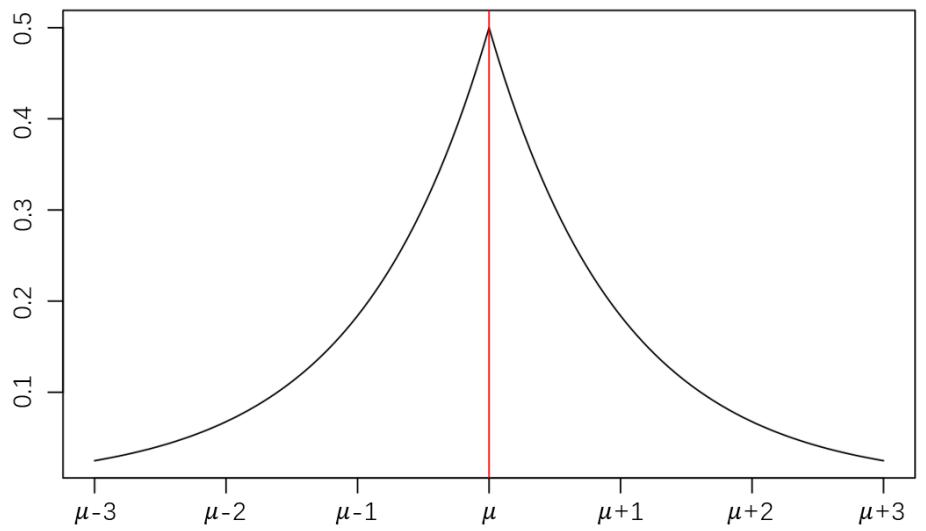

line

| x     | y     |
|-------|-------|
| μ-3   | ~0.02 |
| μ-2   | ~0.08 |
| μ-1   | ~0.25 |
| μ     | 0.50  |
| μ+1   | ~0.25 |
| μ+2   | ~0.08 |
| μ+3   | ~0.02 |

图2.10 拉普拉斯概率分布图

为了多尺度地综合考虑局部信息与全局信息，对于每个交通参与者i与每个混合组件，MLP 接收局部区域嵌入向量和全局嵌入向量作为输入，输出每个参与者在局部坐标系中每个时间步的位置以及相关不确定性。回归头的输出张量的尺寸为[??,??,??,4]，其中??是混合组件的个数，??是场景中的交通参与者个数，??是预测的未来时间步长，4 包括位置（二维）以及相应的不确定性（二维），本文混合组件个数??设为 6，即每个参与者对应 6 条预测轨迹。相应的还有一个分类头负责输出每种模态的概率分布，分类头是与回归头类似的结构，同样以局部和全局嵌入向量为输入，经过 MLP 网络后再使用 softmax 函数归一化，为每个交通参与者生成混合模型的混合系数，其形状为[N，D]。

本文轨迹预测的损失分为两部分，分别是回归损失和分类损失。首先，对于回归损失，我们计算每个交通参与者每个模态未来轨迹的推理结果和真实轨迹之间的误差，为每个交通参与者挑选出误差最小的轨迹，然后使用 WTA策略，只对误差最小的轨迹计算回归损失。本文使用负对数似然作为预测模型的回归损失：

$$
L _ {r e g} = - \frac {1}{N H} \sum_ {i = 1} ^ {N} \sum_ {t = T + 1} ^ {T + H} \log P \left(R _ {i} ^ {\mathrm{T}} \left(p _ {i} ^ {t} - p _ {i} ^ {T}\right) \mid \mu_ {i} ^ {t}, b _ {i} ^ {t}\right) \dots \tag {2.26}
$$

式中P为拉普拉斯分布的概率密度函数，N 是交通参与者个数，H是预测未来时间步长，T 为当前时刻， $\mu _ { i } ^ { t } , b _ { i } ^ { t }$ 分别是交通参与者i的最优模态的位置和不确定性。

另外，本文使用交叉熵损失作为分类损失来优化混合系数。交叉熵损失函数是一种广泛用于分类任务的损失函数，能够衡量预测分布和实际分布之间的差异。其计算方法如下式：

$$
L _ {c l s} = - \sum_ {i = 1} ^ {N} y _ {i} \log \left(\hat {y} _ {i}\right) \dots \tag {2.27}
$$

式中， $y _ { i }$ 为真实的类别标签，即最优模态的独热编码。 $\hat { y } _ { i }$ 为每个模态的预测概率值。交叉熵损失只会惩罚最优模态的概率，其预测概率越低，惩罚越严重。

# 2.4 多模态自车终点生成算法

自动驾驶中，决策方法多种多样，深度学习决策方法能够通过海量数据进行训练，自动从数据中提取特征，捕捉到复杂的交通场景和行为模式，因此受到广泛应用。其中，终点驱动的轨迹预测决策方法预测的车辆未来目标终点，相比于预测车辆在未来一段时间的轨迹，终点预测任务相对简单，能够更直观表达自车的意图，而且与直接回归轨迹相比，将未来建模为一组离散目标能够避免模态平均的影响，从而促进多模态的生成。因此，本节在前面时空分层编码器的基础上，使用终点驱动的方法搭建自车终点决策模块，输出自车多模态终点。首先，使用规则采样方法得到密集终点集合，再使用密集终点编码器生成密集终点的概率分布，然后通过离线优化器计算密集终点集在概率分布图中的最优分布，作为终点决策的伪真值监督，最后通过多模态自车终点集合生成模块在线生成自车多模态终点。

# 2.4.1 密集终点概率估计

2022年特斯拉人工智能日上，提出了基于占用栅格预测（OccupancyNetwork）的感知方法，将三维空间栅格化来预测栅格被物体占据情况。自车未来的终点分布也用类似的思想，将二维平面空间栅格化，预测终点的栅格占用。密集终点是一个相对于稀疏终点的概念，是指采样的密度较高，基本能够覆盖可行域的大部分位置[74]。相比于基于稀疏终点的终点预测，密集终点能够在较小的区域内采样多个终点，捕获到细粒度信息，更能表征真实世界的终点分布，使用密集终点采样的系统可以近似看作是无锚（anchor-free）的。因此，我们利用密集的终点采样，对地图执行密集终点的概率分布估计。密集终点概率估计模块的架构图如图 2.11 所示。由图可知，终点概率估计模型主要分为环境编码、终点采样以及终点概率估计解码模块三部分，最后输出终点概率热力图。

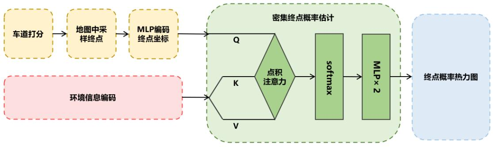

flowchart

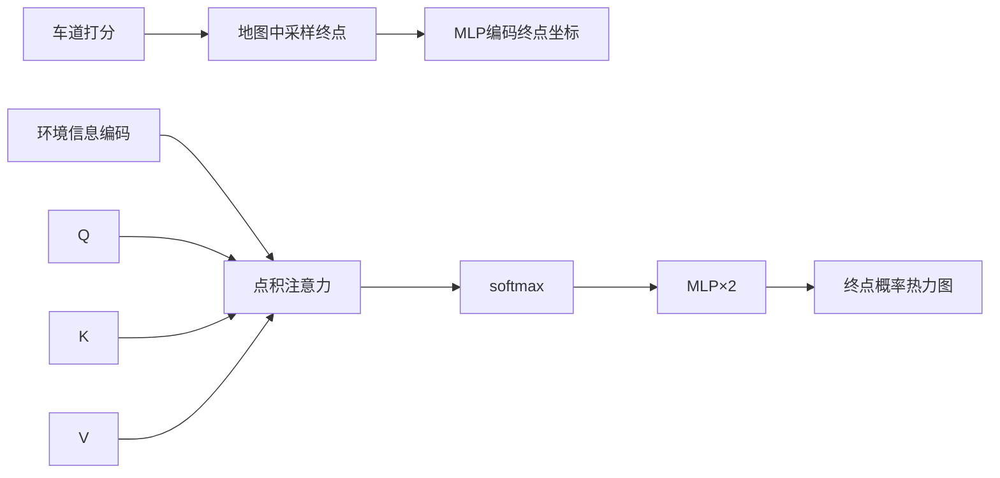
```mermaid
graph LR
    A["车道打分"] --> B["地图中采样终点"]
    B --> C["MLP编码终点坐标"]
    D["环境信息编码"] --> E["点积注意力"]
    E --> F["softmax"]
    F --> G["MLP×2"]
    G --> H["终点概率热力图"]
    I["Q"] --> E
    J["K"] --> E
    K["V"] --> E
```

图2.11 密集终点概率估计算法的架构图

上文中，已经通过时空分层编码器提取了自车局部区域的交互特征以及全局交互特征，因此终点概率估计以上文中编码得到的自车局部与全局特征嵌入作为环境信息编码输入。在进行终点概率估计之前，我们首先对车道进行打分，预测自车未来行驶的车道，减少终点候选的数量，从而减少后续模块的计算量。对车道的打分问题，我们将其建模为一个分类问题，在训练过程中使用二元交叉熵损失进行训练。最接近真值终点的车道的得分设为 1，其余车道设为0。任意一个车道 $l a n e _ { x }$ 与真值终点之间的距离可以定义为真值终点到 $l a n e _ { \boldsymbol { x } }$ 最短距离的平方。在过滤掉低可能性车道后，用规则方法在高概率车道上均匀采样，即获得了密集终点集合。

接下来，密集终点编码器使用注意力机制来提取终点与环境信息之间的深层交互信息。首先，我们通过 MLP 编码终点的二维坐标，获得所有终点的特征矩阵??。通过时空分层编码模块，我们可以得到自车局部区域的局部特征嵌入向量以及自车与其他交通参与者全局交互嵌入向量，将嵌入向量传入另一个 MLP 模块聚合自车局部区域和全局交互特征，得到自车环境特征??。然后，通过注意力机制建立终点与环境之间的联系：

$$
Q ^ {\text { goal }} = D W ^ {Q} \dots \tag {2.28}
$$

$$
K ^ {\text { goal }} = E W ^ {K} \dots\dots\tag {2.29}
$$

$$
V ^ {\text { goal }} = E W ^ {V} \dots\dots\tag {2.30}
$$

$$
F = \text { softmax } \left(\frac {Q ^ {\text { goal }} K ^ {\text { goalT }}}{\sqrt {d _ {k}}}\right) V ^ {\text { goal }} \dots \tag {2.31}
$$

其中 $W ^ { Q } , W ^ { K } , W ^ { V }$ 为可学习的线性变换矩阵，通过点积注意力的计算，我们得到了终点与环境之间的交互特征F 。第i个终点的预测概率通过 softmax函数计算：

$$
\varphi_ {i} = \frac {\exp (h (F _ {i}))}{\sum_ {n = 1} ^ {N} \exp (h (F _ {n}))} \dots \tag {2.32}
$$

式中，可训练函数h()为一个两层的 MLP 网络，输入终点与环境交互特征，输出终点的概率分数，经过 softmax 归一化，得到了终点概率 $\varphi _ { i }$ 。模型训练的损失函数是终点预测概率 $\varphi$ 和真值概率 之间的二元交叉熵损失：

$$
L _ {\text { goal }} = C E (\varphi , \omega) \dots \tag {2.33}
$$

对于终点的真值概率，将与真值最近的终点的真值概率 $\omega$ 设为1，其余终点的真值概率设置为0。

# 2.4.2 多模态自车终点集合生成

通过上面的密集终点概率估计模块，我们可以得到一个终点概率的热力图(heatmap)，表征自车轨迹最终位置的概率分布。终点生成的目标是生成一个自车终点集合，表征多模态的自车未来意图区域。这个问题可以转化为从密集终点热力图中提取一组最高概率的终点。多模态终点生成的目标是在尽可能精确的基础上，覆盖尽可能多的模态，由于数据中的真值只有一个，虽然我们通过“胜者通吃”（Winner TakesAll，WTA）策略一定程度上避免模态坍塌的问题，但是由于数据分布限制等因素，模型仍然会倾向于输出平均行为的终点（或轨迹）。因此，本文设计了一个离线的优化方法求解最优的终点集，由于优化算法的时间复杂度较高，本文仅在训练过程中运行该算法，并将其结果作为多模态的伪标签，供在线的终点集合生成模型训练学习，在线模型通过训练学习到离线优化算法的终点选择方法，相比离线方法能够在更短时间内输出一个终点集合。本文自车终点集合生成流程如图 2.12所示。

我们将密集终点概率估计得到的热力图表征为H，图中每个终点的几何位置表征为一个集合 $F = \left\{ f _ { 1 } , f _ { 2 } , . . . , f _ { n } \right\}$ ， $f _ { i }$ 表示第i个终点的二维坐标。假设A是热力图中的一个随机终点，则 A 的 终 点 概 率 $P \left( A = f _ { i } \right) = H \left( f _ { i } \right)$ 。 给 定 一 个 随 机 的 终 点 集 合$B = \{ b _ { 1 } , b _ { 2 } , . . . , b _ { m } \}$ ，假设真值终点为 $p _ { g t }$ ，我们通过 minFDE指标表征真值误差，可通过下式计算任意一组终点的真值误差：

$$
d _ {F D E} (B, p _ {g t}) = \min _ {b _ {i} \in B} b _ {i} - p _ {g t} \dots \tag {2.34}
$$

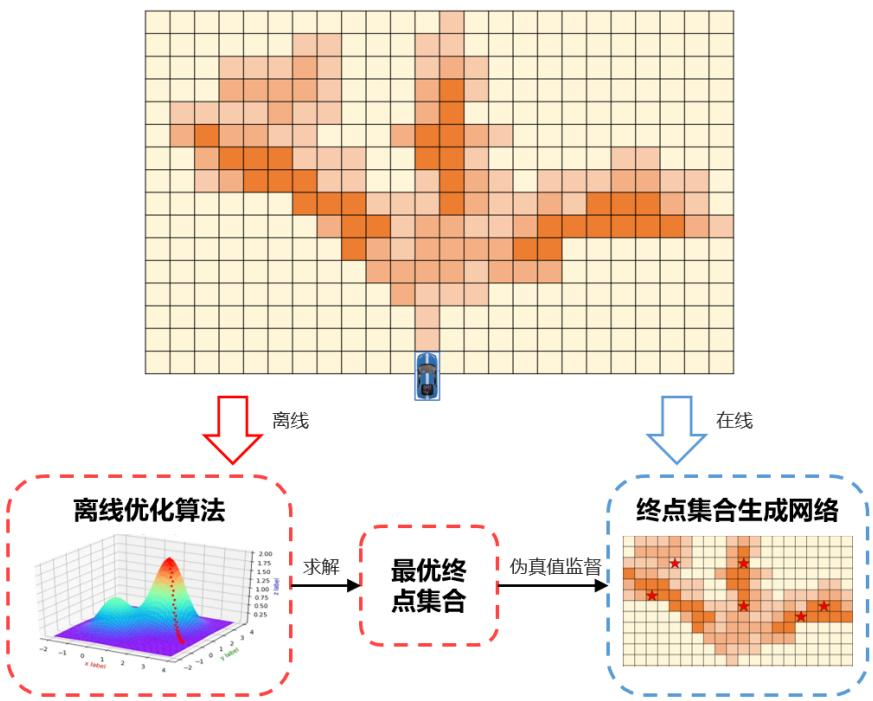

flowchart

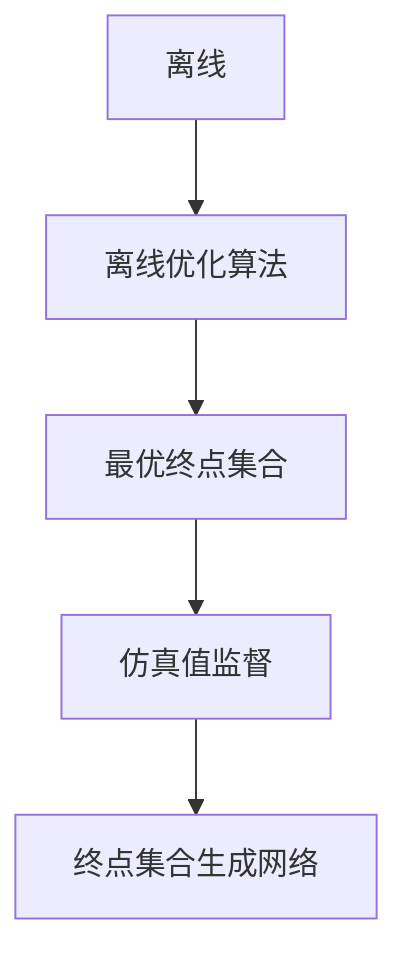
```mermaid
graph TD
    A["离线"] --> B["离线优化算法"]
    B --> C["最优终点集合"]
    C --> D["仿真值监督"]
    D --> E["终点集合生成网络"]
```

图2.12 多模态自车终点集合生成流程

该模块的输入为热力图，因此模型在线推理时我们没有确切的真值终点，只有终点概率分布??。我们通过概率分布??获得终点集 B 的真值误差：

$$
D \left[ d _ {F D E} (B, F) \right] = \sum_ {i = 1} ^ {n} H \left(f _ {i}\right) d _ {F D E} (B, f _ {i}) \dots \tag {2.35}
$$

另外，为了避免终点与障碍物发生碰撞，本文在优化算法中加入了碰撞惩罚，$d _ { \mathrm { c o l l i s i o n } } \left( B \right)$ 表征终点集合 B 的碰撞代价，如式（2.36）。 $f ( b _ { i } )$ 的计算方式如式(2.37)，其中， $d i s t ( b _ { i } )$ 为点 $b _ { i }$ 与最近障碍物的距离。

$$
d _ {\text { collision }} (B) = \min _ {b _ {i} \in B} f \left(b _ {i}\right) \dots \tag {2.36}
$$

$$
f \left(b _ {i}\right) = \left\{ \begin{array}{l l} 0, & \text {   dist } \left(b _ {i}\right) > 1 \\ \frac {1}{\operatorname{dist} \left(b _ {i}\right)}, & \text {   dist } \left(b _ {i}\right) \leq 1 \end{array} \right. \dots\dots (2. 3 7)
$$

然后，将真值误差函数与碰撞代价合并，得到最终的代价函数 $E$ ：

$$
E (B, F) = D \left[ d _ {F D E} (B, F) \right] + d _ {\text { collision }} (B) \dots \tag {2.38}
$$

将优化问题的目标函数J 设置为终点集 B 的代价函数，要找到使得目标函数J 最小化的全局最优解 $: \overline { { B } } .$ 。优化算法一般用于寻找问题的最优解，广泛用于机器学习、轨迹规划等领域，一般通过不断迭代解集来逼近最优。本文使用了爬山算法，这是一种局部搜索优化算法，爬山算法属于贪心算法的一种，基于当前的最优选择，通过局部改进逼近全局最优解。本文的爬山算法流程人如表 2.1的伪代码所示，算法会不断重复迭代过程直至达到时间限制，在每次迭代中，会对当前的终点集合施加随机扰动，生成一个新的候选集合，当新的集合对应的预期误差小于原集合的预期误差时，用新的集合替换原集合。另外算法参考模拟退火方法，引入随机性误差，当随机条件 r满足条件时，也会更新目标集合，即允许接收略差的解，防止算法陷入局部最优。经过多次随机扰动获得多个终点集，选择其中代价最低的目标集作为结果，从而获得接近全局最优解的终点集合??????。

表2.1 终点集合离线生成算法  
Algorithm 1: 终点集合离线生成算法
Data: 密集终点概率分布图（heatmap）
Result: 最小化期望误差的终点集合
1 初始化，随机采样初始终点候选集合 b，并且计算当前的期望误差 f(b);
2 while True do
3 if time exceeded then
4 | break;
5 end
6 for every goal $b_{i}$ in b do
7 $b_{i}^{\prime}=RandomPerturbation(b_{i})$ ;
8 end
9 E=f(b);
10 $E^{\prime}=f(b^{\prime})$ ;
11 取 0 到 1 之间的随机数 rand;
12 if $E^{\prime}<E$ or rand<0.01 then
13 | b=b';
14 end
15 end

基于上述过程，可以为每一帧数据生成终点概率分布热力图并且通过离线优化算法生成最优的终点集合。在自动驾驶实际场景中，对算法实时性要求较高，本文使用的优化算法需要较长的时间选择最优终点，难以实际应用。因此本文基于优化在线的终点集生成模块使用离线模型的终点集合??????作为伪真值来对在线模型的训练进行监督，即通过网络训练将优化算法的知识蒸馏到终点集生成模型当中。

由于需要进行多模态终点生成并且有多个真值监督，单个预测头难以支持，因此本文设置多个预测头，并行地预测??个终点位置(??为预测终点集和伪真值终点集的终点个数)。在预测头之前，本文先通过一个终点概率热力图编码器提取热力图终点间交互特征，热力图编码器由一个单层的自注意力网络再加一个最大池化层组成。每个预测头为一个双层MLP 网络，预测头的输出包括??个终点的二维坐标以及该预测头的置信度。

终点集生成模型的损失函数分为回归损失和分类损失两部分，首先回归损失由预测终点集 $B ^ { p r e d }$ 与伪真值集合 $B ^ { o p }$ 之间的偏移量表示：

$$
L _ {s e t} \left(B ^ {p r e d}, B ^ {o p}\right) = \sum_ {i = 1} ^ {m} L _ {r e g} \left(b _ {i} ^ {p r e d}, b _ {i} ^ {o p}\right) \dots \tag {2.39}
$$

式中， $L _ { r e g }$ 为标准的 $L _ { 1 }$ 平滑损失。另外在训练过程中，本文只对代价最低的头进行回归，以减少其他预测头回归的计算量。本文在训练中使用二元交叉熵损失预测多个预测头的置信度：

$$
L _ {h e a d} = C E (\lambda , \mu) \dots \tag {2.40}
$$

式中， 是预测头预测的置信度， $\mu$ 为置信度标签。所有预测头中，代价最低的头的置信度标签 $\mu$ 置为 1，其余预测头 $\mu = 0$ 。在推理过程中，只将预测头中最高置信度的结果作为多模态自车终点结果。

# 2.5 本章小结

为了实现高性能的轨迹预测以及自车意图预测，本章基于注意力机制构建了数据驱动的交通参与者轨迹预测与自车终点决策模型。

首先，本章使用了时空分层编码方法编码环境信息，具体地，我们通过椭圆表征局部区域，为每个参与者划分出局部区域，在此基础上通过交通参与者间交互信息编码、时序关系编码以及交通参与者和车道信息编码三个模块编码局部信息，并通过全局交互模块学习局部区域之间的交互。然后对轨迹进行解码，解码器主体为 MLP 网络，输出多模态的交通参与者轨迹坐标和轨迹概率。在自车终点决策模型部分，首先通过规则采样方法采样密集的自车可能终点。然后在时空分层编码基础上，应用注意力机制，预测所有终点的概率分布。之后通过离线优化算法得到最优终点集合分布，并以其为伪真值，通过网络将优化算法的知识蒸馏到在线模型中。最后，通过预测头预测出终点集合的坐标。

# 第3章 基于 A\*的多目标时空联合搜索方法

在日常的驾驶中，人们经常会面临换道还是车道保持、超车还是避让等等的抉择，这些行为对应了自动驾驶算法中的决策模块。首先需要完成车辆决策过程，再针对不同的决策行为进行更加细致的轨迹规划。自动驾驶决策的好坏一般可以用拟人性、安全性等指标来衡量。在现有方法中，基于规则的决策方法能够通过不断完善规则保障安全性，但是其决策结果不具有拟人性，且容易出现帧间决策跳变的问题。而数据驱动的决策方法通过学习老司机数据让决策更具拟人性，但是模型结果安全性缺乏硬性保证，仍需通过后处理保证轨迹的安全。

为了解决上述问题，本文第二章通过数据驱动方法得到了他车预测结果和自车终点集合，在此基础上本章提出了多目标时空联合搜索算法，具体分为时空栅格地图和时空联合搜索两部分。首先根据感知、预测等输入信息构建时空栅格地图，统一建模静态障碍物与交通参与者的运动来保证算法避障能力，并且在保证计算效率的前提下通过启发式搜索方法生成多模态的搜索轨迹，并评价挑选出最优轨迹，保证轨迹的拟人性以及安全性。最后，将最优的搜索轨迹传给轨迹规划模块。

# 3.1 时空栅格地图建立

自动驾驶处理的是一个由二维平面和一维时间共同组成的三维空间。本文在这个三维空间中进行时空联合搜索，在进行搜索的流程前，首先需要建立地图，将需要的交通信息、障碍物信息、语义信息等表达在地图上。在此基础上，使用合适的算法在地图中进行决策任务。

地图根据建模方法的不同，主要可以分为：栅格化法和车道线法（如高精地图）等。高精地图存在着建图成本高、泛化性较差、维护成本较高等问题，目前业界相关应用都更倾向于轻图和无图，而且本文所用的决策算法为图搜索算法，更适合在栅格地图中部署。因此栅格化地图的方法更合适本研究。图 3.1 为一个结构化道路的栅格化示例，栅格图方法将空间分割为网格，可将所需要的信息保存在栅格当中，表征此栅格的状态信息。本文使用较为简单、计算速度较快的 $0 . 2 \mathrm { m } \times 0 . 2 \mathrm { m }$ 均匀的矩形网格作为栅格。

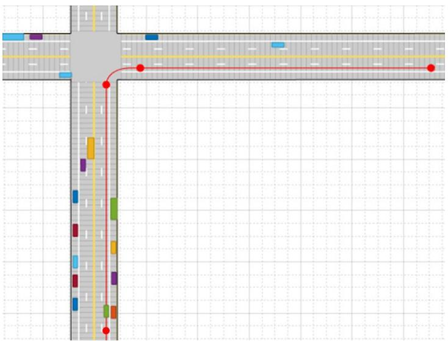

natural_image

Top-down view of a road intersection with colored directional arrows and grid background (no text or symbols)

图3.1 栅格图示例

# 3.1.1 栅格化空间地图表达

地图需要将多模态的信息在地图中表征，本节首先只考虑空间维度的信息，即地图元素和障碍物，如路沿、车道线、停止线、安全岛、车辆、行人等，保证自车不会违反交通规则以及不会与障碍物发生碰撞。

在搜索算法执行过程中，搜索时长往往和访问的栅格个数成正比，因此尽可能地剔除掉不可达区域对算法实时性至关重要，同时也不能将可行区域模糊处理为不可达区域，否则可能导致搜索缺少解甚至无解。总而言之，需要在地图中精确合理地构建不同元素在栅格中的状态。在坐标系的选择方面，本文选择笛卡尔坐标系，相比于 Frenet坐标系，能够更精细地表达元素的形状，避免坐标转换时的精度损失。另外对于不同类型地图元素，驾驶员往往给不同元素以不同程度的关注，因此我们给不同元素以不同的膨胀系数来差异化关注度。搜索算法一般将自车表征为质点，因此将自车的几何中心作为质点的位置，在考虑与自车的碰撞时，需要将自车的物理尺寸考虑进来。

对于路沿、车道线等完全静止的道路元素，驾驶员对其的关注相比车辆更低，并且受自车的状态影响较大，因此本文基于自车的航向角与障碍物朝向的夹角、自车速度计算膨胀系数 $\dot { \omega } _ { s t a t i c }$ ，另外考虑自车的物理模型时，也可基于自车状态来计算对应的膨胀尺寸 $L _ { e x p a n d }$ ，公式如下：

$$
\omega_ {\text { static }} = v ^ {*} \sin \theta^ {*} \omega_ {\text { relative }} + v ^ {*} \omega_ {\text { absolute }} \dots \tag {3.1}
$$

$$
L _ {\text { expand }} = L _ {e g o} * \sin \theta + W _ {e g o} * \sin \theta \dots \tag {3.2}
$$

式中，v为自车速度， 为自车速度方向与障碍物的夹角， $\omega _ { r e l a t i v e }$ 和 $\omega _ { a b s o l u t e }$ 是碰撞系数有关自车相对道路元素的速度和自车绝对速度的权重， $L _ { e g o }$ 和 $W _ { e g o }$ 分别是自车的长度和宽度。扩展后的车道与路沿元素所对应的不可通行区域如图 3.2 中橙色区域所示。

对于车辆来讲，碰撞风险一个很重要的评价指标是 TTC（time to collision），因此通过TTC 和自车速度综合计算膨胀系数：

$$
\omega_ {\text { dynamic }} = T T C ^ {*} \omega_ {T T C} + v ^ {*} \omega_ {\text { speed }} \dots\dots(3. 3)
$$

考虑自车的物理尺寸，重新计算障碍物车辆的坐标：

$$
\left(x _ {i} - \frac {L _ {e g o} + L _ {i}}{2} \sin \theta - \frac {W _ {e g o} + W _ {i}}{2} \cos \theta , y _ {i} + \frac {L _ {e g o} + L _ {i}}{2} \cos \theta - \frac {W _ {e g o} + W _ {i}}{2} \sin \theta\right) \tag {3.4}
$$

$$
\left(x _ {i} + \frac {L _ {e g o} + L _ {i}}{2} \sin \theta + \frac {W _ {e g o} + W _ {i}}{2} \cos \theta , y _ {i} - \frac {L _ {e g o} + L _ {i}}{2} \cos \theta + \frac {W _ {e g o} + W _ {i}}{2} \sin \theta\right) \tag {3.5}
$$

$$
\left(x _ {i} + \frac {L _ {e g o} + L _ {i}}{2} \sin \theta - \frac {W _ {e g o} + W _ {i}}{2} \cos \theta , y _ {i} - \frac {L _ {e g o} + L _ {i}}{2} \cos \theta - \frac {W _ {e g o} + W _ {i}}{2} \sin \theta\right) \tag {3.6}
$$

$$
\left(x _ {i} - \frac {L _ {e g o} + L _ {i}}{2} \sin \theta + \frac {W _ {e g o} + W _ {i}}{2} \cos \theta , y _ {i} + \frac {L _ {e g o} + L _ {i}}{2} \cos \theta + \frac {W _ {e g o} + W _ {i}}{2} \sin \theta\right) \tag {3.7}
$$

式中，设定第i辆障碍物车坐标为 $\left( x _ { i } , y _ { i } \right)$ ，长宽分别是 $L _ { \mathrm { { i } } }$ 和 $W _ { i }$ ， $\sigma$ 为障碍物车与自车航向角夹角， $L _ { e g o }$ 和 $W _ { e g o }$ 分别是自车的长度和宽度。图 3.2 为空间地图示例，其中黄色区域是障碍物车本身模型，红色区域是膨胀后的不可通行区域。

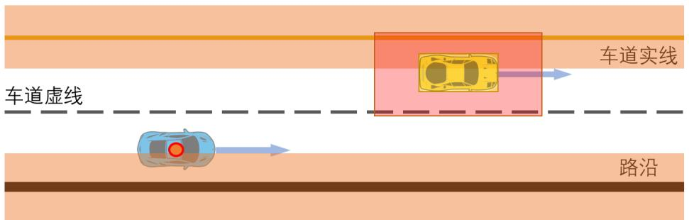

text_image

车道虚线
车道实线
路沿

图3.2 空间地图示例

# 3.1.2 栅格化时空地图表达

二维空间地图只具有几何属性，想要在动态障碍物干扰的情况下合理地进行运动规划，需要为地图加入时间维度的信息。因此需要构建一个三维时空间栅格地图，来建模动态障碍物的运动轨迹。

本节在上一节的 XY二维空间地图的基础上，增加一维时间轴，构建 XYT三维时空地图。带有时间信息的时空地图能够表达时空轨迹，可以根据动态障碍物未来时间内每一步对应的出现的位置进行表达，从而划分出不可行区域，将多辆周车预测的未来轨迹投影到时空地图中去，即可构造自车的可行域，如图 3.3中黄色区域所示。同时，时空地图对自车动作搜索空间的表达也更清晰，可以根据轨迹斜率可以算出速度，根据不同速度可以准确搜索到未来的位置状态。另外，交通环境信息也可以在时空间地图上进行表示，例如红绿灯可以通过在特定车道上特定时间段内禁止通行的方式在地图中进行表示。这种方法摆脱了传统的搜索算法只能处理静态障碍物的缺陷，将搜索算法布置在时空地图上避让动态障碍物，而且还可以将交通多模态信息表达在地图上，提升了算法的泛化性。

通过这种方法，空间地图2D $\mathrm { M a p } \colon \left\{ ( x , y ) | x \in R _ { x } , y \in R _ { y } \right\}$ 转变为时空地图3D Map：$\big \{ ( x , y , t ) | x \in R _ { x } , y \in R _ { y } , t = 0 , \Delta t , \cdots , n * \Delta t \big \} , ( x , y , t )$ 为时空节点的坐标，时间轴为等时间间隔，??为自车规划的最大时间步长。

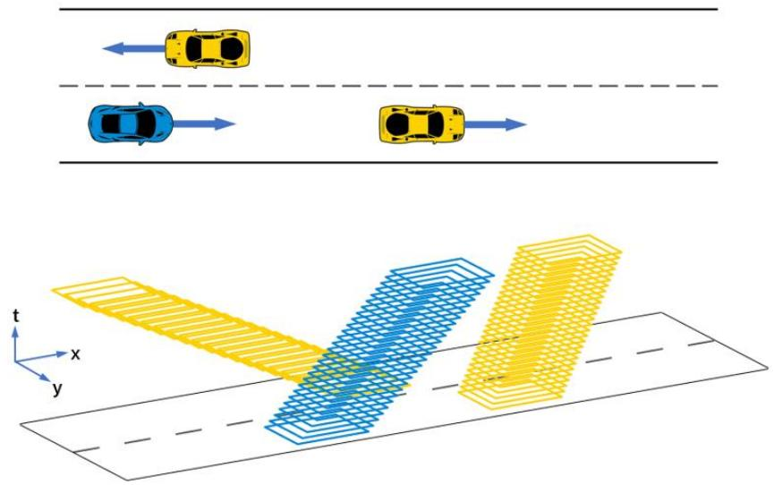

text_image

Diagram illustrating vehicle motion with labeled axes (x, y, t) and directional arrows for road tracking

图3.3 时空地图表达

# 3.2 基于A\*的时空联合搜索算法

# 3.2.1 A\*算法介绍

A\*算法是一种经典的路径搜索算法，广泛应用于自动驾驶中的路径优化和障碍物避让等任务。它是一种启发式搜索算法，在 Dijkstra算法的基础上加入启发函数，其核心思想是以启发式的方法引导搜索过程，以达到最佳的搜索效率。A\*算法的基本流程如下所示：

(1) 初始化开放列表和关闭列表：开放列表用于存放待探索的节点，关闭列表用于存放已经探索过的节点。  
(2) 计算代价函数：对于每一个节点，计算代价函数 $f \left( n \right) = g \left( n \right) + h \left( n \right)$ ，其中：

g n( )表示从起点到节点 n 的实际代价，h n( )表示从节点 n 到目标点的估算代价，通常使用启发式函数来计算。

(3) 节点扩展：选择代价函数最小的节点进行扩展。将扩展的节点加入开放列表，并更新其父节点和代价函数。  
(4) 终止条件：当目标节点被扩展到开放列表中时，搜索结束，路径可通过回溯父节点得到。

在自动驾驶中，路径搜索算法需要考虑真实车辆物理模型，保证路径的可行性，传统的A\*算法无法满足车辆路径搜索的需求。Hybrid A\*算法是A\*算法的一种改进版本，传统的A\*算法与Hybrid A\*的区别在于以下几点：

(1) 运动模型的引入：Hybrid A\*算法的核心思想是将车辆的运动模型引入搜索过程中，考虑了车辆的动力学约束，例如转弯半径、最大加速度、最大速度等物理限制，搜索空间变得更加复杂。使得生成的路径不仅符合静态环境约束，还满足车辆物理模型的动态约束，并且生成的轨迹平滑度、可执行性都会更好。图 3.4展示了 A\*与HybridA\*扩展节点方式的区别。

(2) 代价函数与启发式函数：Hybrid A\*使用类似 A\*算法的代价函数，但在计算过程中，必须考虑车辆的实际运动能力和物理约束。另外 Hybrid A\*算法通常用 Dijkstra算法先找到不同节点到终点的距离作为启发式函数项。

(3) 更新机制：A\*算法中某个节点设置代价后不再参与更新，但 Hybrid A\*算法同一个节点若有代价函数更小的更新方式，需要为节点更新状态。

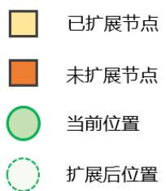

text_image

已扩展节点
未扩展节点
当前位置
扩展后位置

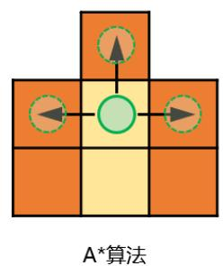

flowchart

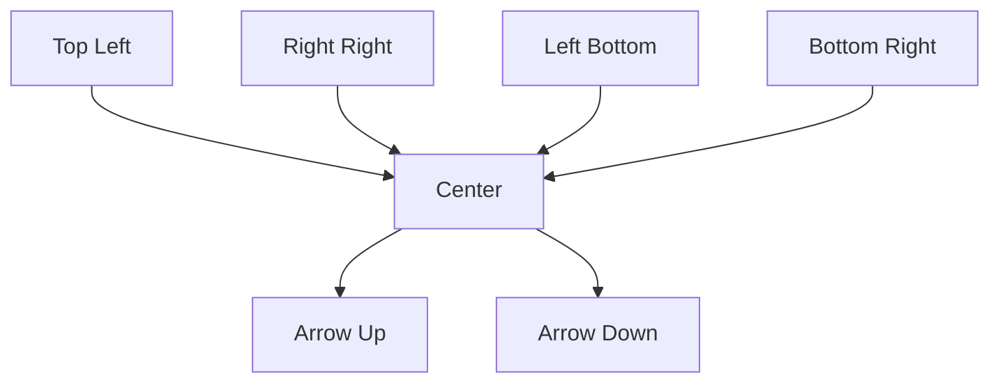
```mermaid
graph TD
    A["Top Left"] --> B["Center"]
    C["Right Right"] --> B
    D["Left Bottom"] --> B
    E["Bottom Right"] --> B
    B --> F["Arrow Up"]
    B --> G["Arrow Down"]
```

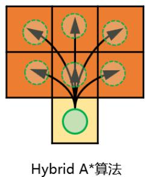

flowchart

```mermaid
graph TD
    A["输入层"] --> B["处理层"]
    B --> C["输出层"]
    style A fill:#f9f,stroke:#333
    style C fill:#bbf,stroke:#333
    note bottom
        Hybrid A*算法
```

图 3.4 A\*与 Hybrid A\*扩展节点区别

# 3.2.2 基于 A\*的时空联合搜索算法流程

自动驾驶决策算法不仅要输出横向上的决策，如换道或车道保持，还要输出超车或避让的纵向决策，本质上这是一个时空维度上的决策过程。正常的搜索算法是在静态环境下进行搜索流程，而无法处理包含动态障碍物的环境。因此本文基于 $\mathsf { A } ^ { * }$ 算法进行改进，基于时空间栅格地图，设计了三维时空间下的搜索算法[75]，搜索过程如图 3.5所示。通过 $\mathbf { A } ^ { * } .$ 代价函数的设计，可以平衡多种因素对应的多种目标函数来影响搜索轨迹的生成，能够在复杂环境下，考虑多因素生成合理轨迹。

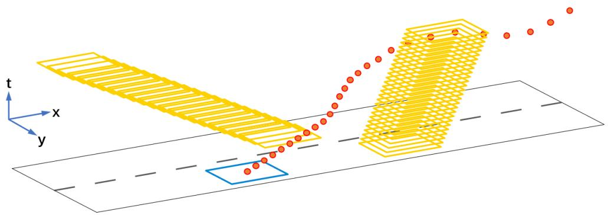

text_image

Diagram illustrating a trajectory or path in 3D space with labeled axes (x, y, t) and red dots indicating points along the trajectory.

图3.5 时空间地图中搜索轨迹

$\mathbf { A } ^ { * }$ 算法的基本原理和流程上文中已经介绍。算法的代价函数主要由两部分组成：

$$
\operatorname{Cost} \left(s _ {t}\right) = G \left(s _ {t}\right) + H \left(s _ {t}\right) \dots \tag {3.8}
$$

式中 $C o s t ( s _ { t } )$ 为节点 $s _ { t }$ 的总代价， $G { \left( s _ { t } \right) }$ 为起点到当前节点 $s _ { t }$ 的累计代价， $H { \left( s _ { t } \right) }$ 为当前节点的启发代价，表示当前状态到终点的预估成本。传统 $\mathbf { A } ^ { * }$ 算法主要用来寻找二维平面最短路径，并且图中障碍物都是静止障碍物。本文改进后的 $\mathbf { A } ^ { * }$ 算法适用于在三维的时空间地图进行轨迹搜索，并且考虑了动态障碍物的未来状态，在地图中搜索出一条无碰撞的粗轨迹，图 3.5为在时空间地图中进行搜索的示意图，图中的红色点表示了搜索出的粗轨迹。三维空间中的搜索算法与传统的 $\mathbf { A } ^ { * }$ 算法相比需要考虑时间维度的搜索，本文改进后的 $\mathbf { A } ^ { * }$ 算法可以分为以下步骤，伪代码如表 3.1所示：

(1) 初始化，在离散化后的每个时刻点都创建一个开集和一个闭集，开集用来存储本时刻可读取节点，闭集存储本时刻不可扩展节点。搜索流程开始前将起点放入开集，再根据每个时刻障碍物占据空间将其放入对应时刻的闭集中。  
(2) 取开集中代价最小的节点作为新的当前节点，并将该节点从开集中移除，存入闭集中。  
(3) 从当前点扩展下一步的节点，若当前扩展的节点未遍历过（未在开集中出现）且可以访问（未在闭集中），计算代价函数，将扩展的节点连同其状态信息和其父节点信息一起存入开集中。

(4) 若当前点出现在终点区域内，则视为完成搜索，退出循环。否则返回步骤（2）继续搜索。  
(5) 搜索到终点后，以第一个进入终点区域的点为当前点，根据闭集中当前点的信息寻找父节点，并将父节点当作当前点，循环直到找到起点，即得到完整路径。

表 3.1 改进 A\*搜索算法伪代码  
Algorithm 2: 改进 A* 算法流程
Data: 时空栅格地图，起终点
Result: 时空轨迹
1 初始化开集 openset 与闭集 closeset;
2 while 开集不为空集合 do
3    从 $openset_t$ 中取出最低代价节点作为当前节点 curnode;
4    将当前节点放入 $closeset_t$ ;
5    从 $openset_t$ 中移除 curnode;
6    if curnode 为 target then
7    找到目标终点并 break 退出循环;
8    else
9    在 t+1 层扩展节点 neighbornodes;
10    for every neighbor in neighbornodes do
11    if neighbor not in $openset_{t+1}$ in $closeset_{t+1}$ then
12    将 neighbor 加入 $openset_{t+1}$ 中;
13    end
14    end
15    end
16    t=t+1;
17 end
18 从终点回溯得到完整的轨迹;

# 3.2.3 时空间搜索节点扩展方法

本文选取自车的状态空间为 $\left\{ x , y , \nu , \theta , t \right\} \circ \left( x , y \right)$ 为自车笛卡尔坐标下的坐标，v是自车绝对速度， 表示航向角，t 是当前点时刻。本文选取的搜索空间为动作空间，具体分为加速度空间和横摆角空间，离散这两个空间，以设定的加速度与横摆角序列进行搜索。

基于车辆运动学约束，将前轮转角 $\delta$ 在 $\cdot - \delta _ { m a x } , \delta _ { m a x }$ ]中进行均匀离散化，表达式如下：

$$
\delta_ {i} = \frac {2 \times \delta_ {\max} \times (i - 1)}{N - 1} \dots \tag {3.9}
$$

式中N 为离散后转角个数（N 为奇数来保证直行的能力）， $\delta _ { i }$ 为第 i 个转角角度。以加速度为搜索空间进行扩展，能够实现空间变步长扩展，另外我们非均匀地离散化车辆加速度，可以显著提高节点扩展的效率和搜索质量。基于车辆运动学约束确定加速度和减速度的上限之后，在固定区间内采样加速度，得到如下的加速度空间：

$$
A = \left\{a _ {d e c}, \dots , 0, \dots , a _ {a c c} \right\} \dots \tag {3.10}
$$

基于上述的离散前轮转角空间和加速度空间进行节点扩展，从当前节点$\left\{ x _ { i } , y _ { i } , \theta _ { i } , \nu _ { i } , t _ { i } \right\}$ 扩展到子节点 $\left\{ { { x } _ { i + 1 } } , { { y } _ { i + 1 } } , { { \theta } _ { i + 1 } } , { { \nu } _ { i + 1 } } , { { t } _ { i + 1 } } \right\}$ 的过程如下：

$$
x _ {i + 1} = x _ {i} + v _ {i} \cos \theta_ {i} d t \dots \tag {3.11}
$$

$$
y _ {i + 1} = y _ {i} + v _ {i} \sin \theta_ {i} d t \dots \tag {3.12}
$$

$$
\theta_ {i + 1} = \theta_ {i} + \frac {v _ {i} \tan \delta_ {i}}{L} d t \dots\dots(3. 1 3)
$$

$$
v _ {i + 1} = v _ {i} + a _ {i} d t \dots \tag {3.14}
$$

$$
t _ {i + 1} = t _ {i} + d t \dots\dots\tag {3.15}
$$

当需要搜索的终点较远时，搜索树的节点深度会变增加，搜索算法的复杂度也会随着深度的增加呈指数级的增长，因此保证搜索算法的实时性对其非常重要。本文借鉴Hybrid A\*中的优化思路，在时空间搜索算法中采用了基于时空栅格地图的剪枝方法。在节点扩展过程中，如果某个节点已经出现在开集当中，但通过新的路径找到了代价更小的方案，那么就更新该节点的代价值。用这种方法，可以保证节点的最优性，并且避免了不必要的重复计算。如图 3.6所示，图中橙色实线为扩展后节点对应的轨迹，绿色虚线为被剪枝的轨迹。若不进行剪枝，就会导致更多的节点加入开集合中，从而造成计算资源的浪费。而剪枝后的节点扩展有效避免了这一问题。

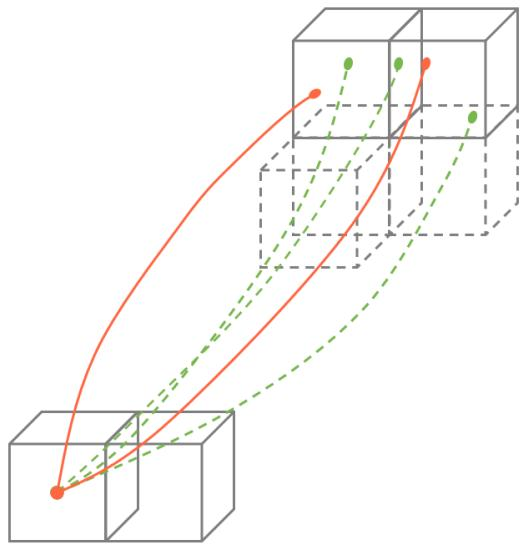

natural_image

Diagram showing two 3D cubes with solid and dashed lines connecting points, no text or symbols present

图3.6 时空栅格节点扩展的剪枝

# 3.2.4 时空联合搜索代价函数

搜索算法的代价函数由启发代价与累计代价组成。节点的累计成本代价 $G _ { s u m }$ 是从起始节点到当前节点的累计代价，主要由父节点的累计代价 $G _ { p }$ 和本次扩展代价 $G _ { i }$ 两部分组成，具体表达式如下：

$$
G _ {s u m} = G _ {p} + G _ {i} \dots \tag {3.16}
$$

$$
G _ {i} = w _ {\text { dist }} * E _ {d} + w _ {\text { comfort }} * E _ {c} + w _ {r} * E _ {r} + w _ {\text { safe }} * E _ {s} \dots \tag {3.17}
$$

式中本次扩展代价 $G _ { i }$ 由路径长度代价、舒适性代价、驾驶合理性代价和安全性代价组成， $w _ { d i s t }$ 、 $\boldsymbol { w } _ { c o m f o r t }$ 、 $w _ { r }$ 和 $\boldsymbol { w } _ { s a f e }$ 为相应的权重系数， $E _ { d }$ 为起点到当前节点状态的路径长度，通过 Dijkstra 算法计算最短路得到。 $E _ { c }$ 为舒适性评价函数，考虑了父节点到子节点加速度，速度，转向角的变化率，其中，加速度和速度的变化率体现了路径的平滑性与舒适性，转向角的变化直接影响路径的可行性和车辆的动力学约束。 $E _ { d }$ 为驾驶合理性评价函数，考虑了道路推荐车速以及相对道路中心线的横向偏移， $E _ { c }$ 与 $E _ { d }$ 计算方式如下：

$$
E _ {c} = w _ {a} \left(a _ {i} - a _ {i - 1}\right) ^ {2} + w _ {v} \left(v _ {i} - v _ {i - 1}\right) ^ {2} + w _ {\varphi} \left(\varphi_ {i} - \varphi_ {i - 1}\right) ^ {2} \dots \tag {3.18}
$$

$$
E _ {d} = w _ {v _ {\text { ref }}} \left(v _ {i} - v _ {\text { ref }}\right) ^ {2} + w _ {\text { center }} \left(l _ {i} - l _ {\text { centerline }}\right) ^ {2} \dots\dots\tag {3.19}
$$

$E _ { s }$ 为安全性评价函数，可以使用节点与障碍物以及边界的最短距离来表征，而这类问题最终可以归结为求解点到线段的最短距离问题，我们使用硬约束与软约束联合对安全性代价进行设计，最短距离设为min\_??， $E _ { s }$ 通过如下公式表达：

$$
E _ {s} = \left\{ \begin{array}{c l} + \infty , & \text { min\_d } \leq a \\ f (\text { min\_d }), & a <   \text { min\_d } <   b \\ 0, & \text { min\_d } \geq b \end{array} \right. \tag {3.20}
$$

当 min\_ $d$ 小于一个较小值a，将代价设为无穷，用近似硬约束的方式防止车辆发生碰撞。当min d\_ 大于一个较大值b，认为车辆与障碍物距离都很远，无安全风险，代价设为0。当min d \_ 在a与b之间时使用一个衰减函数 $f ( m i n _ { - } d )$ 作为软约束。

启发函数可以引导搜索朝着接近目标点的方向进行，提高搜索效率。传统方法多采用A\*搜索结果作为启发式函数，但这种方法耗时严重，难以在复杂的动态环境中应用，并且由于本文使用的累计代价函数从多个方面影响搜索，因此启发函数不能仅仅惩罚路径长度，而是和累计代价一样考虑多种因素。启发函数还应小于剩余路径的实际代价来保证算法能够得到最优解。

基于累计代价函数的计算，设计相应的启发函数。启发函数公式如下：

$$
H _ {i} = w _ {\text { dist }} * H _ {d} + w _ {\text { comfort }} * H _ {c} + H _ {r} * E _ {r} + H _ {\text { safe }} * E _ {s} \dots \tag {3.21}
$$

启发函数的构成与累计代价函数类似，由路径长度代价、舒适性代价、驾驶合理性代价和安全性代价组成。首先，采用经典的欧式距离作为路径长度启发项 $H _ { d }$ ，节点??的启发函数计算如下，其中 $x _ { i }$ 和 $| y _ { i }$ 是节点??的几何坐标， $x _ { e n d }$ 和 $\mathbf { \chi } _ { e n d }$ 为规划终点的几何坐标：

$$
H _ {i} = \left(x _ {i} - x _ {\text { end }}\right) ^ {2} + \left(y _ {i} - y _ {\text { end }}\right) ^ {2} \dots \tag {3.22}
$$

舒适性代价同样分为加速度变化率、速度变化率和转向角变化率，考虑到加速度变化率和转向角的代价较小，启发项只惩罚速度变化率。对于速度变化率，假设后续轨迹以最大的加速度变化到目标车速，这样可以让后续轨迹速度变化率惩罚项尽可能最小。

对于驾驶合理性代价，车辆行驶的大部分时间均为沿道路中心线行驶，并且速度变化率中已经有了对推荐车速的考虑，因此不对驾驶合理性进行惩罚。对于安全性代价，本文假设处于最优情况下，不会出现与障碍物的碰撞风险来处理。

# 3.3 多目标时空搜索算法

# 3.3.1 多目标时空搜索方法

在第二章中，通过多模态自车终点生成模块，本研究得到了自车的多模态终点作为目标。下一步需要在此基础上生成到达多目标的完整轨迹。本文通过搜索算法搜索起点到目标点的时空路径，得到完整的到达目标点的轨迹。在搜索算法的框架下，想要得到能够达到多个不同目标点的最优路径，主要分为三个思路：虚拟终点方法、最近点启发方法以及逐一终点搜索方法。

虚拟终点方法是一种修改启发项的方法，在一次搜索流程同时考虑所有终点，该方法的思路是将多个真实终点连接到一个虚拟终点上，这些终点到虚拟终点的距离可以假设为0。在实际搜索过程中，将这个虚拟终点设置为搜索算法的目标终点，相应地，启发式函数的设计会考虑到达虚拟终点的代价来加快搜索。这种方法能够在一次搜索过程中找到到达多个终点的最优路径，并且算法仍然基于 A\*原理，代码改动较小，但是这种方法在终点分布较稀疏的情况下，难以找到一个合适的虚拟终点。

最近点启发方法是也通过修改启发式函数的方式，将多个目标点考虑进启发式函数，使得算法在搜索过程中同时考虑多个终点，主要是通过以下方式实现：

(1) 将启发式函数设计为距离当前节点到多个目标点的最小距离或某种加权距离（例如：距离最近的目标点）。  
(2) 在路径搜索时，每当算法到达某个目标点时，可以判断是否已经到达了所有

目标点，若已到达，则结束搜索。

通过这种方法，我们能在一次搜索中考虑多个目标点，可以避免多次搜索造成的浪费。但是这种方法的缺点是可能导致启发式函数的设计变得复杂，需要不断调整来确保启发式函数能够合理引导搜索过程，否则会导致搜索变慢或者无法搜索到最优路径。

逐一终点搜索方法在 $\mathbf { A } ^ { * }$ 算法的基础上不需要过多修改，该方法对所有的终点执行A\*流程，直到访问完所有的目标点为止。该方法主要步骤如下：

(1) 使用 $\mathbf { A } ^ { * }$ 算法从起点搜索到一个目标点，计算路径并记录。  
(2) 更换目标点，重复这一过程，直到得到所有目标点路径。

这种方法实现简单，调试方便，不需要在已有算法基础上进行过多更改，并且每次搜索可以针对单一终点设计最适合的启发式函数。但当目标点数量很多时，需要进行多次搜索，资源消耗较大，这是因为其无法在一次搜索中，同时考虑多个终点的信息。

在上一章节的自车多模态终点生成模块，生成自车六个的终点位置。虚拟启发方法效率高，但难以为六个终点生成合理的虚拟终点；最近点启发方法也能一次完成所有终点的搜索，但是其启发方法不够合理；逐一终点搜索方法虽然鲁棒性较好，并且一定能够得到最优路径，但是这种方法依次搜索六条轨迹时间复杂度过高。因此，本文提出结合虚拟启发方法与逐一终点搜索方法的优点，首先对终点进行分类，通过终点的聚类让虚拟启发方法能够为每类终点生成合适的虚拟终点。此外，聚类后逐一终点搜索方法的搜索次数可以从终点个数降为聚类类别数量，有效降低了算法的时间复杂度。

表 3.2 多目标搜索流程伪代码

<table><tr><td colspan="2">Algorithm 3: 多目标搜索流程</td></tr><tr><td colspan="2">Data: 搜索终点集合,时空栅格地图Result: 多目标最优搜索路径</td></tr><tr><td colspan="2">1 将终点集合中的终点聚类,得到 MultiSet 点集;</td></tr><tr><td colspan="2">2 for set in MultiSet do</td></tr><tr><td>3</td><td>为 set 内的终点生成虚拟终点;</td></tr><tr><td>4</td><td>虚拟终点作为本次搜索启发终点,设置启发函数;</td></tr><tr><td>5</td><td>使用改进 A* 算法进行搜索;</td></tr><tr><td>6</td><td>if every goal in set is searched then</td></tr><tr><td>7</td><td>continue;</td></tr><tr><td>8</td><td>else</td></tr><tr><td>9</td><td>继续搜索;</td></tr><tr><td>10</td><td>end</td></tr><tr><td colspan="2">11 end</td></tr></table>

# 3.3.2 多目标终点聚类

点集聚类的方法有多种，应用最为广泛的是基于空间位置的聚类方法。基于空间位置的聚类方法通过空间位置将点集进行分类，K-means 聚类是经典的空间聚类算法之一，它通过将终点划分为 k 个簇，使得每个簇内的点尽可能接近簇中心，并最小化簇内点的总距离。K-means 聚类方法简单高效，并且对于球形簇有比较好的效果，但是这种方法对于对初始簇中心的选取敏感。此外将终点分为固定 k 个簇不完全合理，并且仅仅通过距离进行聚类并不广泛适用于所有场景。在自动驾驶的场景中，按照自车行驶的方向对终点进行分类比较符合直觉，因此本文在空间位置聚类方法之前，首先按照行驶方向对终点进行分类。具体而言，我们连接所有终点与起点，计算得到所有起终点连线与自车方向的夹角，设置固定的角度差阈值，将两两终点夹角的差值与角度差阈值进行比较，从而完成分类。这种方法一定程度上可以表征终点的方位，即完成了基于行驶方向对终点的分类。之后，再用基于空间位置的聚类方法，对已得到的每个类进行聚类，具体地，本研究不固定终点簇的个数，仍然是以球形簇的方法处理点集。总而言之，本研究基于行驶方向对终点分类，区分点集的意图层次的差别，再基于空间位置进行分类，捕获空间层次的差异。图 3.7 为多目标终点聚类方法的示意图，橙色三角形表征自车终点。首先根据行驶方向将终点分为两类（蓝色与橙色点划线），然后根据空间位置最终将终点分为三类（绿色圆）。

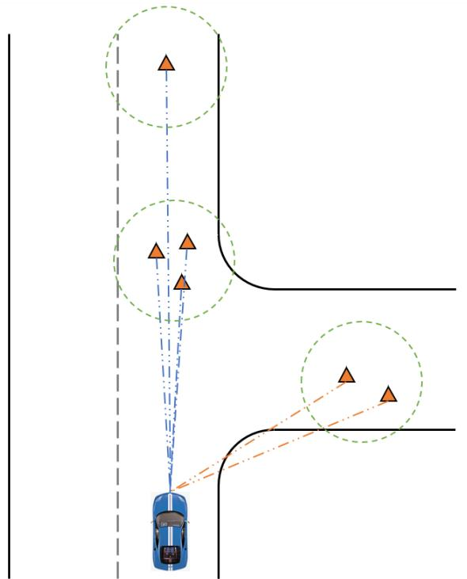

text_image

Diagram showing traffic signal propagation with a car at the intersection and three circular obstacles approaching it, labeled in Chinese.

图3.7 多目标终点聚类示意图

# 3.3.3 轨迹评价方法

为了加强后续轨迹规划算法的实时性，得到多条搜索路径后，本研究对轨迹进行评价，选出一条最优路径传给规划模块进行轨迹规划。轨迹评价根据两个方面对轨迹进行打分，一是轨迹搜索的结果，二通过规则算法考虑轨迹的合理性选择轨迹。

轨迹打分如下式所示。首先，可以获得每条搜索路径终点处的代价函数值。代价函数考虑了路径长度、轨迹的舒适性、驾驶行为合理性以及安全性，因此将终点代价函数值作为此轨迹评分的一部分。另外，在实际工程应用过程中，轨迹合理性因素很大程度上影响轨迹的选择，但是合理性因素多种多样，难以非常规范性地进行建模，通常通过规则算法实现。本文使用基于规则的方法，综合考虑自车导航信息、帧间一致性、与其他交通参与者的 TTC（time to collision），评价轨迹的合理性。

$$
\text { Score } = S _ {\text { cost }} + S _ {\text { navi }} + S _ {\text { cons }} + S _ {\text { TTC }} \dots \tag {3.23}
$$

考虑自车导航信息，使得自车轨迹符合导航信息的指引，例如路口的左右转或者直行的信息，又或者变道下匝道的信息，本文通过检查轨迹与导航语义信息的差异，从而给每条轨迹进行加权打分。考虑帧间一致性，是为了确保车辆的决策与规划在时间维度上的合理性和连贯性，决策的帧间不一致会让车辆不同帧间输出不同的控制行为，如急加速、急转弯，这会极大地影响舒适性，此外自车行为的不稳定也会影响他车行为，容易引发交通事故。通过计算本帧待选轨迹与上一帧决策输出的轨迹的相似性，以此为参考进行轨迹打分。碰撞时间（Time to Collision，TTC）表示的是在当前车辆速度不变的情况下，自动驾驶车辆与目标车辆发生碰撞所需的时间，TTC 指标通常用于衡量自动驾驶车辆与其他交通参与者之间发生碰撞的风险，相比距离判断风险要更为合理，考虑 TTC 能够显著提高轨迹安全性，避免碰撞，增强应对紧急情况的能力，我们计算轨迹所有交通参与者的 TTC，挑选最小的 TTC 表征轨迹合理性。综合以上的合理性信息，以及搜索结果，本研究对轨迹进行了合理并全面的评估，选出得分最高的轨迹传给规划模块。

# 3.4 本章总结

在第二章的预测以及终点决策基础上，本章构建了一种基于 A\*的多目标时空联合搜索算法，为模型终点搜索出安全轨迹并对轨迹进行评价，最终将最优轨迹传给规划模块。首先，我们以环境感知与轨迹预测结果为输入，基于栅格图生成考虑统一动静态障碍物的时空栅格地图。然后改进了 A\*算法，使其能够在三维时空地图中进行时空联合搜索，生成时空粗轨迹。之后，多目标时空搜索算法结合了虚拟终点方法与逐一终点搜索方法，在保证实时性的前提下，能够为多个终点生成搜索轨迹，最后结合搜索结果的代价函数与轨迹合理性因素，选择出最优粗轨迹并传给轨迹规划模块。

# 第4章 基于微分平坦特性的时空联合轨迹规划算法

自动驾驶轨迹规划模块的主要目标是在决策结果的基础上，进一步细化轨迹，在有障碍物的环境中，规划出一条从起点到终点无碰撞的路径，并且保证轨迹的平滑性、舒适性与合理性。对于轨迹规划算法而言，规划求解的质量与效率受到很多因素的影响，包括优化问题构建形式、轨迹参数化方法、约束的设计、优化器的选择等等。因此，为了提高轨迹规划求解质量与效率，本章节提出了一种基于微分平坦特性的时空联合轨迹规划方法，本章架构如图 4.1 所示。首先基于上文的轨迹预测决策和搜索结果构建了时空安全走廊来表征自车每个时刻的可通行区域，然后引入了车辆的微分平坦运动学模型，使用最小化控制量轨迹作为时空轨迹参数化方法，将控制点位置与时间作为轨迹规划的决策变量。随后提出了同时优化车辆横向与纵向运动的时空联合轨迹规划算法，设置安全性、合理性等约束并将约束条件重构进代价函数中，将问题转化为无约束优化问题使用 LBFGS 优化器进行求解。最终本文编写了规划算法的仿真测试工具，进行算法的调参和验证。

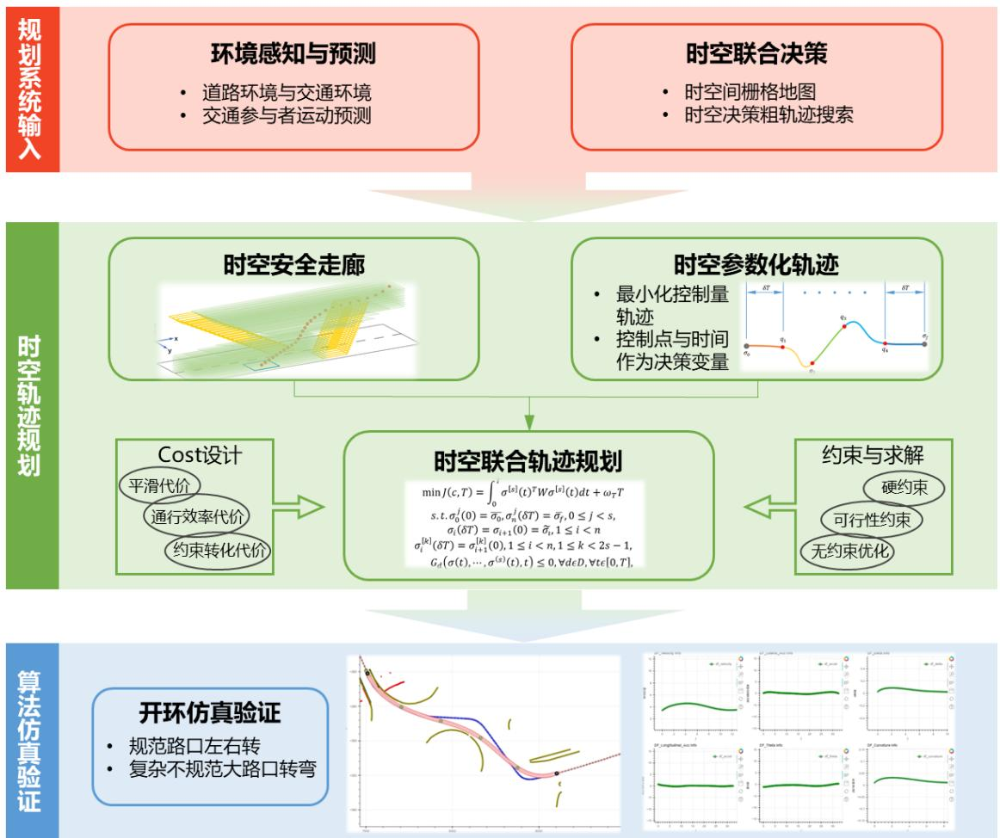

flowchart

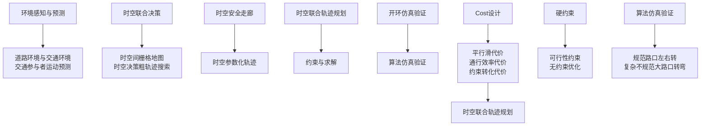
```mermaid
graph TD
    A["环境感知与预测"] --> B["道路环境与交通环境\n交通参与者运动预测"]
    C["时空联合决策"] --> D["时空间栅格地图\n时空决策粗轨迹搜索"]
    E["时空安全走廊"] --> F["时空参数化轨迹"]
    G["时空联合轨迹规划"] --> H["约束与求解"]
    I["开环仿真验证"] --> J["算法仿真验证"]
    K["Cost设计"] --> L["平行滑代价\n通行效率代价\n约束转化代价"]
    L --> M["时空联合轨迹规划"]
    N["硬约束"] --> O["可行性约束\n无约束优化"]
    P["算法仿真验证"] --> Q["规范路口左右转\n复杂不规范大路口转弯"]
```

图4.1 第4章架构图

# 4.1 时空安全走廊的数学表述与求解算法

自动驾驶局部地图通常包含有很多离散的地图元素，直接将这些离散数据全部引入自动驾驶轨迹规划是一种缺乏效率的方式。此外地图离散数据具有非光滑性以及不连续性，将这些离散元素引入轨迹规划会给规划问题引入非凸性，降低规划问题的求解效率。因此，自动驾驶规划模块可以避免直接对原始的离散数据进行计算求解，而是对原始离散的地图元素进行预处理，将地图中的通行区域以时空安全走廊来表征。

因此，本节通过构建时空走廊的方法，将避障问题转化为将自车限制在走廊内部的问题。基于决策模块输出的粗轨迹，通过多边形初始化与膨胀过程创建可通行的区域，将自车与周围障碍物分离开，从而构建出时空走廊，供后续优化模块使用。

# 4.1.1 时空安全走廊生成

安全走廊的概念广泛应用于无人车和无人机轨迹规划领域[76, 77]，用于表征机器人的可通行区域，时空安全走廊是在空间通行走廊的基础上，考虑环境动态的动态变化生成的安全走廊。安全走廊的形状多种多样，矩形形状较为简单，进行膨胀与碰撞检测等计算也比较方便，另外车辆的可行域通过矩形表征更为合理且精确，因此本文使用矩形表征时空安全走廊。

时空安全走廊的生成主要分为两部分：初始化走廊和走廊膨胀。首先要建立初始的安全走廊，即生成走廊种子。上一章中，已经得到时空联合搜索的粗轨迹，因此走廊种子可由时空粗轨迹处的车辆物理模型构成，步长不同导致的轨迹点缺失可以通过对时间插值来补全，由此，可以得到与粗轨迹一致的一系列可通行走廊种子，作为后续膨胀的初始状态。如图4.2 所示，图中自车对应的矩形框即为走廊种子的状态。

由于走廊种子面积较小，需要对其进行膨胀增大规划的解空间，优化后续规划算法的速度与合理性。本文膨胀算法通过遍历可通行走廊的四条边，不断地对被选边进行扩展，对于已碰撞的边，停止扩展，直到四条边都与障碍物发生碰撞。另外考虑到车辆的纵向和横向通行能力的差异，纵向方向的边膨胀速率会更高，让走廊更符合真实场景。在本次膨胀结束后，再以同样的方法扩展下一个走廊种子，直至所有种子都被膨胀完毕。所有的走廊共同组成了本次规划的时空安全走廊。如图 4.3所示，图中淡绿色矩形框即为图4.2中种子膨胀后的时空安全走廊。

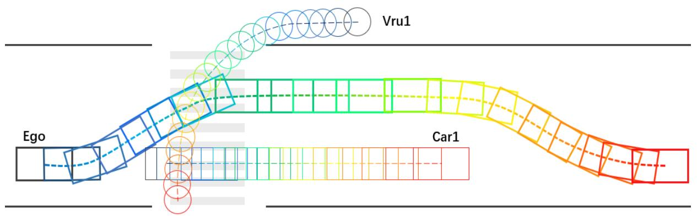

flowchart

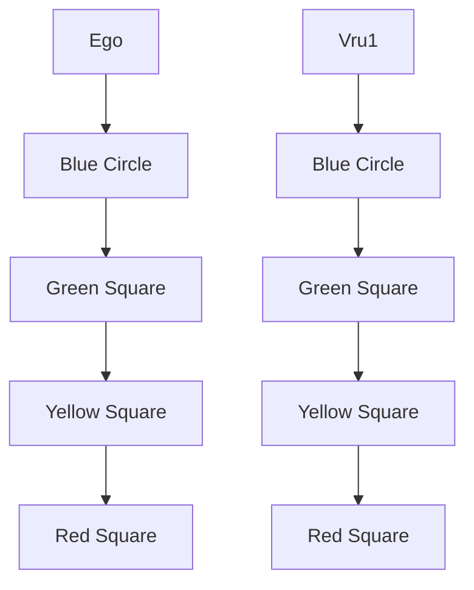
```mermaid
graph TD
    A["Ego"] --> B["Blue Circle"]
    B --> C["Green Square"]
    C --> D["Yellow Square"]
    D --> E["Red Square"]
    F["Vru1"] --> G["Blue Circle"]
    G --> H["Green Square"]
    H --> I["Yellow Square"]
    I --> J["Red Square"]
```

图4.2 时空安全走廊初始化

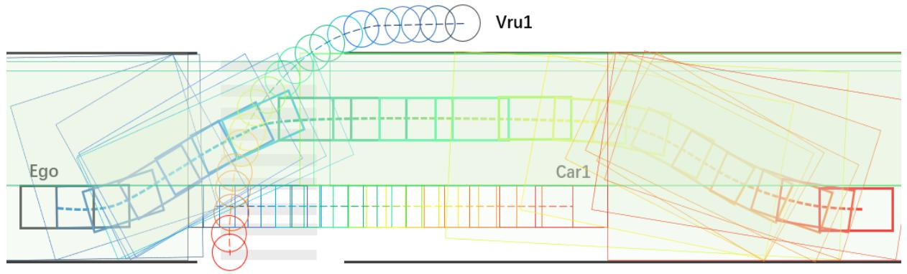

flowchart

```mermaid
graph TD
    A["Ego"] --> B["Car1"]
    B --> C["Vru1"]
    style A fill:#f9f,stroke:#333
    style B fill:#bbf,stroke:#333
    style C fill:#dfd,stroke:#333
```

图4.3 膨胀后的时空安全走廊

安全走廊生成的精准度主要受到膨胀的步长影响，膨胀的步长越小，就能够更精细地生成走廊。但是由于自车模型初始化生成的走廊种子面积较小，为了保证精确度就需要多次膨胀，为了提高算法效率，我们使用上一次膨胀后的走廊作为本次膨胀的初始化种子，当上一次的走廊不与当前障碍物发生碰撞时，就将其作为本次膨胀的初始种子，从而减少在相邻走廊同质化的情况下浪费的膨胀次数。时空走廊生成的具体流程如表4.1所示，最终得到的时空走廊三维可视化效果如图 4.4所示。

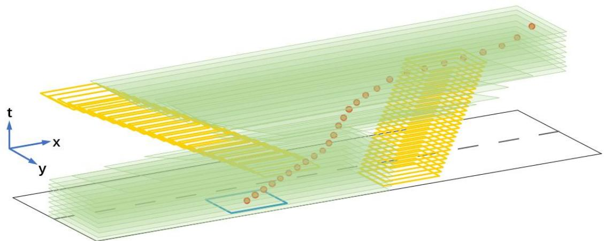

text_image

Diagram illustrating a 3D coordinate system with labeled axes (x, y, t) and a grid of orange dots, likely representing a physical or mathematical model.

图4.4 时空安全走廊三维状态

表4.1 时空安全走廊生成流程  
Algorithm 4: 时空安全走廊生成
Data: 时空联合搜索结果（位置与方向），地图
Result: 时空安全走廊
1 初始化 $t_0$ 处的 corridor（走廊）；
2 for $t_i = t_1$ to $t_{end}$ do
3 $Corridor_{t_i} \leftarrow Ego_{t_i}$ ;
4    if $CheckCollision(Corridor_{t_i}, Map_{t_i}) == False$ and $Ego_{t_i}$ in $Corridor_{t_{i-1}}$ then
5    将 $Corridor_{t_{i-1}}$ 赋值给 $Corridor_{t_i}$ ;
6    end
7    NoInflationSet ← 空集;
8    for dir = front, left, down, right do
9    if dir in NoInflationSet then
10    continue
11    end
12    if $CheckCollision(InflatedCorridor, Map_{t_i}) == False$ then
13    沿 dir 膨胀;
14    else
15    将 dir 加入到 NoInflationSet;
16    end
17    end
18 end
19 return Corridor;

# 4.1.2 碰撞检测方法

在生成时空安全走廊的过程中，每一次走廊膨胀，都需要检测与障碍物的碰撞，所以碰撞检测算法在很大程度上决定了时空安全走廊生成的效率。在线的规划系统需要一个快速的碰撞检测算法保证系统的实时性。

直观上来讲，碰撞检测任务需要进行目标与所有障碍物的碰撞检查，所以本文通过有向包围盒（Oriented Bounding Box，OBB）预处理原始障碍物数据，来加快障碍物检测流程。OBB 是一种紧密包围对象的矩形盒子，它是一种在计算机图形学和几何处理中常用的包围盒类型，用于快速估算几何体的空间范围，帮助进行碰撞检测、加速渲染、空间分割等任务。可以通过二维的 OBB 来预处理空间障碍物元素，将障碍物表征成数量更少的一系列包围盒，从而让碰撞检测过程更快速。相比普通的包围盒，它能够更精准地包围与表达对象。图4.5为OBB与轴对齐包围盒（Axis-Aligned Bounding Box，AABB）的对比图，相比之下 OBB 能够更加精确紧密地包围障碍物，灵活度更高。

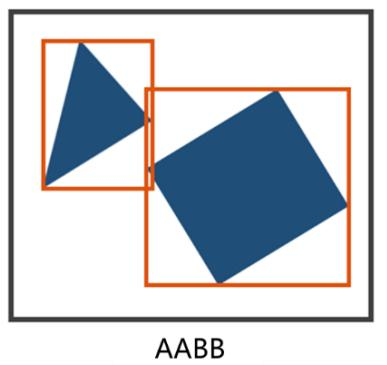

natural_image

Geometric diagram with two blue triangles and an orange square, labeled 'AABB' below (no text or symbols within the shapes)

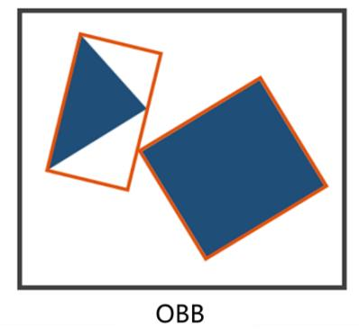

natural_image

Abstract geometric composition with two overlapping squares, one blue and one dark blue, outlined in orange (no text or symbols)

图 4.5 AABB 与 OBB 的区别

图4.6为一个点集合得到的 OBB 示意图。计算一个点集合的 OBB，可以采用主成分分析法，其可以帮助我们找到数据在多维空间中的主方向。在二维空间中，这些方向是最能代表数据分布的两个相互垂直的轴。这两个轴定义了 OBB 的方向，而轴上点的最大值和最小值可以确定 OBB 的大小。具体计算 OBB 的大致步骤如下：

(1) 计算中心点：计算数据对象的平均位置，即所有点坐标的算术平均值，将其作为OBB 的中心点；  
(2) 构建协方差矩阵：基于点集相对于中心点的偏移量，构建一个协方差矩阵。在二维空间中，协方差矩阵为 2x2矩阵；  
(3) 计算特征值和特征向量：对协方差矩阵进行特征分解，计算得到两个特征值及其对应的特征向量。这些特征向量表示数据的主方向，并且它们是单位向量且相互垂直；  
(4) 使用特征向量作为 OBB 的轴：最大特征值对应的特征向量对应于 OBB 的长轴，另一个特征向量对应于 OBB 的短轴，如此确定了 OBB 的方向；  
(5) 确定OBB 的边界：将所有对象元素投影到特征向量定义的轴上，并找到最大和最小的投影值来确定 OBB 的边界；  
(6) 构建 OBB：根据中心点、轴和边界来构建 OBB；

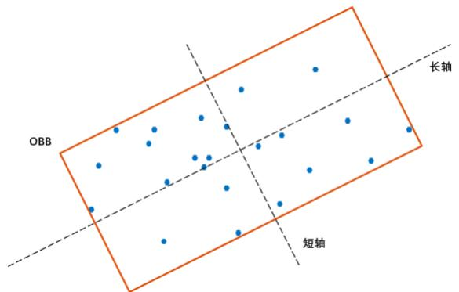

text_image

OBB
长轴
短轴

图 4.6 OBB 示意图

通过OBB 预处理地图元素后，碰撞检测流程如表 4.2所示。算法首先遍历所有的OBB，当自车与 OBB 发生碰撞时，再检测自车与该 OBB 内部所有元素的碰撞情况。如果检测仍然为碰撞，则判定为碰撞。通过这种方式，可以避免让自车与所有元素都进行碰撞检测，有效地减少了碰撞检测时间。自车与包围盒内元素的碰撞检测可以转化为矩形框与点、线段或者多边形的碰撞检测问题，并通过成熟的算法进行求解。

表4.2 碰撞检测流程  
Algorithm 5: 碰撞检测流程
Data: OBBs, 自车轨迹
Result: 碰撞结果
1 for curOBB in OBBs do
2    if CheckCollision(curOBB, Ego) == True then
3    if CheckCollision(OBB包围元素, Ego) == True then
4    return True;
5    else
6    return False;
7    end
8    else
9    return False;
10    end
11 end

# 4.2 时空轨迹参数化方法

对于轨迹规划算法而言，参数化形式对算法的影响很大。大部分求解方法使用状态与控制量来表征运动轨迹，具有较好的灵活性，但是不可避免地引入了相关的决策变量和等式约束。车辆运动学模型具有微分平坦特性，动力学微分约束可以通过平坦输出来严格保证。因此本文将无人机领域中常用的的最小控制轨迹推广到自动驾驶车辆模型中，使用平坦输出轨迹进行参数化，并且将所有可行性约束编码为平坦空间中的解析和连续可微表达式，并将其集成到优化公式中。为了保证足够阶的连续性，采用分段无约束最小控制问题求解并表达轨迹，参数化轨迹能天然地满足起点终点的状态约束和连续性约束，从而降低了轨迹规划问题的难度。

# 4.2.1 车辆二自由度运动学模型及其微分平坦特性

车辆运动学模型是描述车辆在不同运动状态下位置、速度、加速度等状态量之间物理关系的数学模型。这个模型主要依赖于车辆的几何特性和运动学原理，通常不考虑车辆动力学、轮胎侧向力和纵向力等复杂因素，通过简化这些因素来简化车辆模型，用较少的物理量表征车辆的状态。

车辆运动学模型构建时会进行一些简化假设，来将复杂的车辆系统更简单地建模：

(1) 车辆为一个刚性系统，考虑为一个整体；  
(2) 忽略轮胎的侧偏；  
(3) 仅考虑车辆在二维平面的运动，忽略高度方向的位移；  
(4) 车辆的两个前轮和两个后轮转速与转角完全相同，类自行车模型；

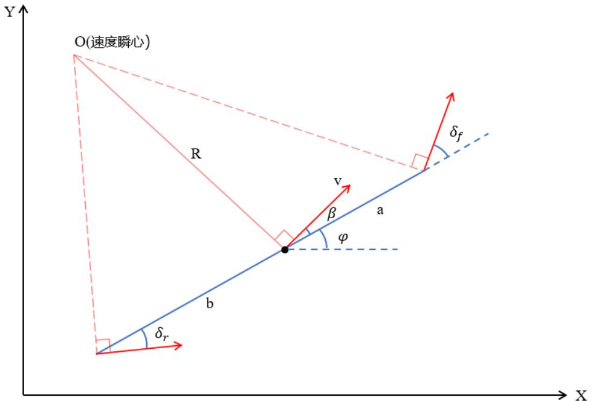

text_image

O(速度瞬心)
R
v
β
a
φ
b
δr
δf
X
Y

图4.7 车辆运动学模型

车辆运动学模型如图 4.7所示，其中点P 为车辆质心坐标，v为车辆质心速度，车辆横摆角为 $\varphi$ ，质心侧偏角为 $\beta$ ，车辆前轮转角为 $\delta _ { f }$ ，后轮转角为 $\delta _ { r }$ ，质心与前轮和后轮的距离分别为a和 b，O点为车辆的速度瞬心，转弯半径为 R。

首先我们建立微分方程描述车辆质心的运动状态，假设质心在世界坐标系下的坐标为 $\left( x , y \right)$ ，状态方程如下：

$$
\dot {x} = v \cos (\beta + \varphi)
$$

$$
\dot {y} = v \sin (\beta + \varphi) \dots \tag {4.1}
$$

$$
\dot {\varphi} = \frac {v}{R}
$$

式中，R 是车辆状态的未知量，可通过正弦定理推导：

$$
\left\{ \begin{array}{l} \frac {a}{\sin (\delta_ {f} - \beta)} = \frac {R}{\sin \left(\frac {\pi}{2} - \delta_ {f}\right)} \\ \frac {b}{\sin (\delta_ {r} + \beta)} = \frac {R}{\sin \left(\frac {\pi}{2} - \delta_ {r}\right)} \end{array} \right. \dots\dots (4. 2)
$$

$$
\left\{ \begin{array}{l} \frac {a}{R} = \tan \delta_ {f} \cos \beta - \sin \beta \\ \frac {b}{R} = \tan \delta_ {r} \cos \beta + \sin \beta \end{array} \right. \dots\dots (4. 3)
$$

进一步推导可得到??：

$$
R = \frac {a + b}{\cos \beta \left(\tan \delta_ {f} + \tan \delta_ {r}\right)} \dots \tag {4.4}
$$

此时车辆的运动学模型仍然复杂，且变量过多，因此采用车辆二自由度运动学模型将模型进一步简化。简化后的二自由度运动学模型如图 4.8所示。应用的简化假设如下：

(1) 车辆速度较低，忽略车辆的侧滑，因此车辆横向速度为 $0 { \mathrm { ; } }$ ；  
(2) 后轮不转向，车辆后轮转角 $\delta _ { r }$ 为 $0 { \mathrm { ; } }$ ；

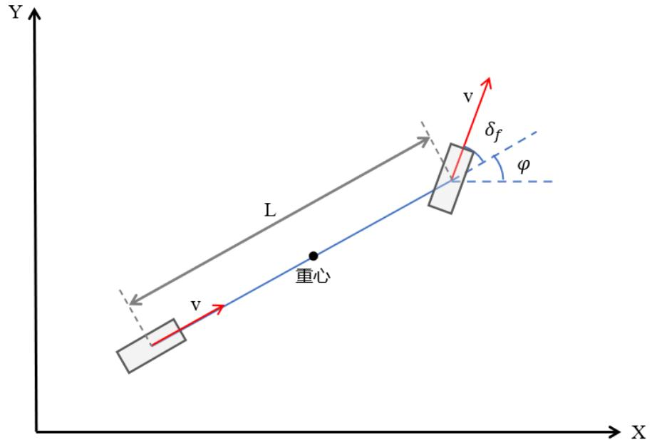

text_image

Y
L
v
重心
v
δf
φ
X

图 4.8 简化后的二自由度运动学模型

简化后，运动学方程转化为：

$$
\begin{array}{l} \dot {x} = v \cos (\varphi) \\ \dot {y} = v \sin (\varphi) \end{array} \tag {4.5}
$$

$$
\dot {\varphi} = \frac {v \tan \delta_ {f}}{R}
$$

式(4.5)即为车辆二自由度运动学模型公式，输入变量为 $\delta _ { f }$ 和 v 。

微分平坦特性是控制理论中的一个概念。具体来说，如果一个系统是微分平坦的，那么存在一组平坦输出，它的有限导数可以唯一地确定系统的所有状态和输入。这意味着可以找到一个映射，使得平坦输出的有限阶导数组合能够唯一确定系统的所有状态和输入。微分平坦系统具有通过平坦输出表达状态与控制输入的天然优势，在规划的时候可以不考虑运动学约束，因此广泛用于不同系统的轨迹规划研究[78]。车辆二自由度自行车模型简化了车辆运动学模型，被广泛使用在自动驾驶汽车的轨迹规划中，并且满足微分平坦特性。因此，在本文中，我们在笛卡尔坐标框架中使用简化的运动学自行车模型来描述四轮车辆。假设模型车辆的状态向量为 $x = \left( x , y , \theta , \nu , a _ { t } , a _ { n } , \phi , \kappa \right) ^ { T }$ ，其中 $\boldsymbol { p } = \left( x , y \right) ^ { T }$ 表示后轮中心的位置， 为车辆横摆角，v是纵向速度， $a _ { t }$ 表示纵向加速度， $a _ { \scriptscriptstyle n }$ 是横向加速度， $\phi$ 是前轮的转向角， 是曲率。状态方程如下式：

$$
\left\{ \begin{array}{l} \dot {x} = v \cos (\theta) \\ \dot {y} = v \sin (\theta) \\ \dot {\theta} = \frac {1}{L} v \tan \phi \\ \quad \dot {v} = a _ {t} \\ \quad a _ {n} = v ^ {2} \kappa \\ \quad \kappa = \frac {\tan \phi}{L} \end{array} \right. \tag {4.6}
$$

其中 L 是汽车的轴距。选择平坦输出为 $\boldsymbol { \sigma } = ( \sigma _ { x } , \sigma _ { y } ) ^ { T }$ ， $\sigma$ 的物理意义为以汽车后轮为中心的位置。其他规划算法所需的状态变量都可以由平坦输出表示：

$$
\left\{ \begin{array}{l} v = \sqrt {\dot {\sigma} _ {x} ^ {2} + \dot {\sigma} _ {y} ^ {2}} \\ \theta = \arctan 2 \left(\dot {\sigma} _ {y}, \dot {\sigma} _ {x}\right) \\ a _ {t} = \frac {\dot {\sigma} _ {x} \ddot {\sigma} _ {x} + \dot {\sigma} _ {y} \ddot {\sigma} _ {y}}{\sqrt {\dot {\sigma} _ {x} ^ {2} + \dot {\sigma} _ {y} ^ {2}}} \\ a _ {n} = \frac {\dot {\sigma} _ {x} \ddot {\sigma} _ {y} - \dot {\sigma} _ {y} \ddot {\sigma} _ {x}}{\sqrt {\dot {\sigma} _ {x} ^ {2} + \dot {\sigma} _ {y} ^ {2}}} \\ \phi = \arctan \frac {\left(\dot {\sigma} _ {x} \ddot {\sigma} _ {y} - \dot {\sigma} _ {y} \ddot {\sigma} _ {x}\right) L}{\left(\dot {\sigma} _ {x} ^ {2} + \dot {\sigma} _ {y} ^ {2}\right) ^ {\frac {3}{2}}} \\ \kappa = \frac {\dot {\sigma} _ {x} \ddot {\sigma} _ {y} - \dot {\sigma} _ {y} \ddot {\sigma} _ {x}}{\left(\dot {\sigma} _ {x} ^ {2} + \dot {\sigma} _ {y} ^ {2}\right) ^ {\frac {3}{2}}} \end{array} \right. \tag {4.7}
$$

在微分平坦度特性下，可以使用平坦输出及其有限阶导数来表征车辆的任意状态量与控制量，并且平坦输出天然地满足运动学约束，从而简化了轨迹规划任务并加快了优化的求解速度。

# 4.2.2 最小化控制量轨迹

轨迹优化方法根据问题构造与求解形式主要可以分为打靶法与配点法，二者的求解过程如图 4.9 和图 4.10 所示。打靶法可以近似为一个开炮射击的场景，算法模拟以不同的初始速度射出炮弹（状态控制方程），查看炮弹落点，相应地调整初速度（控制序列），直到命中目标。配点法没有模拟的过程，而是通过分段多项式近似轨迹，通过让每个控制点处的运动学或动力学与多项式导数相匹配来满足系统的物理约束，这种方法求解往往更加稳健。在轨迹优化中，轨迹参数化是一个重要影响因素。轨迹参数化是指将运动轨迹转换为一组数学函数或参数，使得轨迹可以通过参数来表示和控制。轨迹参数化是路径规划、轨迹跟踪、运动控制等应用中的重要技术。通过轨迹参数化，可以在规划过程中对轨迹进行优化、调整和执行。轨迹参数化方法多样，可以分为时间参数化方法、几何位置参数化、多项式参数化、样条曲线参数化等等。时间参数化方法通过将轨迹点和时间进行关联来描述轨迹，这种方法较为直观和简单，但对轨迹描述不精确，轨迹动态特性不易控制；几何位置参数化方法通过控制点的位置表示轨迹，更容易满足几何约束，但通常缺少时间维度的信息；多项式参数化方法通过拟合多项式表示轨迹，多项式轨迹通常较为平滑，但其需要额外的计算保证多项式轨迹满足约束；样条曲线参数化方法通常使用分段样条曲线表示轨迹，对复杂轨迹描述能力较强，且具有较高的平滑性，但其需要合适的控制点，并且其本身可能引入更多的等式约束[79]。

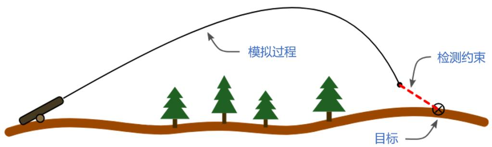

flowchart

```mermaid
graph TD
    A["模拟过程"] --> B["检测约束"]
    B --> C["目标"]
    style A fill:#f9f,stroke:#333
    style B fill:#ccf,stroke:#333
    style C fill:#cfc,stroke:#333
```

图4.9 打靶法示意图

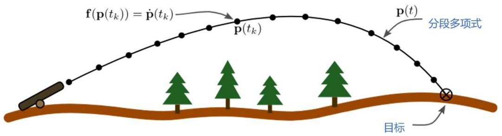

text_image

f(p(t_k)) = \dot{p}(t_k)
p(t_k)
p(t)
分段多项式
目标

图4.10 配点法示意图

避障是关乎轨迹规划安全性的重要问题，为了调整轨迹来满足避让障碍物的约束，设置并调节轨迹的控制点是最常用的方法。另外，为了满足时间相关的纵向约束，调节轨迹的时间分配也有助于满足系统的物理限制。因此，时间和空间参数对于一个灵活的轨迹表征而言都是极其重要的。在这些时间与空间参数给定的前提下生成一条尽可能平滑的时空轨迹是自动驾驶轨迹规划的一个基本问题。

将这个问题用优化的形式表达出来，可以表达为一个二次规划问题，在满足约束的前提下，从确定的时间和空间参数中生成尽可能光滑的轨迹。考虑到通常需要多个控制点来满足轨迹所需的几何约束，本文采用考虑多段无约束控制量最小化问题：

$$
\min _ {z (t)} \int_ {t _ {0}} ^ {t _ {M}} v ^ {[ s ]} (t) ^ {T} W v ^ {[ s ]} (t) d t
$$

$$
\begin{array}{l} s. t. z ^ {(s)} (t) = v (t), \forall t \epsilon [ t _ {0}, t _ {M} ] \\ z ^ {[ s - 1 ]} (t _ {0}) = \overline {{z _ {0}}}, z ^ {[ s - 1 ]} (t _ {M}) = \overline {{z _ {f}}} \end{array} \tag {4.8}
$$

$$
z ^ {[ d ]} \left(t _ {i}\right) = \overline {{z _ {i}}}, 1 \leq i <   M
$$

$$
t _ {i - 1} <   t _ {i}, 1 \leq i \leq M
$$

式中， $t _ { 0 }$ 和 $t _ { M }$ 是整段轨迹的起始时间和结束时间，整段时间被分为了M 段，每段对应一条多项式轨迹，s决定了最小化控制量对应的控制量，例如s为 2即代表最小化加速度，第二个约束公式为起点终点约束，其中 $\overline { { z _ { 0 } } }$ 与 $\overline { { z _ { f } } }$ 是轨迹初始和结束处的边界条件，第三个约束公式为轨迹中间点处的状态约束， $z _ { i }$ 为中间点处对应的已知状态，d 表示等式约束对应的阶数。

前面的内容阐述了车辆的平坦输出，二自由度车辆运动学模型中各个状态变量都能够对应平坦输出的表示，将平坦输出对应到最小化控制量问题当中。首先，对于车辆而言，加加速度（Jerk）量与曲率、速度、加速度都密切相关，能够很好地表征轨迹平滑度和舒适性，因此将??设置为3，将问题转化为最小化 Jerk问题。轨迹段数过多会导致计算量增加，而过少会导致轨迹的表达能力下降。综合考虑，将轨迹段数??设置为 5。对于中间点边界条件，只要求轨迹通过中间点的位置即可，不做更高阶的要求。这样对轨迹在中间点处的连续性做出更高的要求，以保证最小化控制轨迹的唯一性，本文要求轨迹在中间点处是四阶连续的，即控制点处的位置、速度、加速度、以及加速度一阶导数（jerk）和二阶导数（snap）都是连续的。在满足上述约束的条件下，该问题存在闭式解，不需要调用优化器进行优化问题求解。

# 4.2.3 最小化控制量轨迹闭式解求解

由上节可知，最小控制分段轨迹一共分为 5 段，轨迹对应二维的平坦输出，每一维度轨迹为五次（ $N = 2 s - 1 \AA$ ）多项式轨迹，多项式轨迹由控制点（中间点）与时间作为参数进行轨迹参数化。对于第i段的多项式轨迹，可以表达为下式：

$$
\begin{array}{c} \sigma_ {i} = c _ {i} ^ {\mathrm{T}} * \beta (t) \\ \beta (t) = \left(1, t, t ^ {2}, t ^ {3}, t ^ {4}\right) ^ {\mathrm{T}}, t \in [ 0, \delta T ] \end{array} \dots\dots\tag {4.9}
$$

其中 $\beta ( t )$ 为多项式的基， $c _ { i }$ 为第i段多项式系数矩阵，t 为每段轨迹的相对时间，从 0 到 $\delta T$ ，我们将整段轨迹按时间均匀分为 5 段，因此最小控制轨迹的总时间$T = \delta T ^ { * } 5$ 。多项式轨迹由多项式系数矩阵与时间的向量矩阵乘积表示。

上文提到，为了能够闭式求解最小化控制量轨迹，我们要求轨迹在控制点处的高阶连续性，另外综合其他的等式约束，闭式解求解的条件如下：

$$
\begin{array}{l} \sigma_ {0} ^ {j} (0) = \overline {{\sigma_ {0}}}, \sigma_ {M} ^ {j} (\delta T) = \overline {{\sigma_ {f}}}, 0 \leq j <   s \\ \sigma_ {i} (\delta T) = \sigma_ {i + 1} (0) = \sigma_ {i}, 1 \leq i <   M \quad \dots \tag {4.10} \\ \end{array}
$$

$$
\sigma_ {i} ^ {[ k ]} (\delta T) = \sigma_ {i + 1} ^ {[ k ]} (0), 1 \leq i <   M, 1 \leq k <   2 s - 1
$$

上式等式约束主要包括起始点和终点的 0 到s−1阶约束，控制点处的位置约束以及控制点处的一到四阶连续性约束。综合以上的约束条件，分段多项式轨迹的系数可以由轨迹时间，初始和末尾状态唯一确定，直接将约束施加在多项式系数矩阵上，可以表述为以下矩阵方程：

$$
M ^ {*} c = b \dots\dots\tag {4.11}
$$

其中c是系数矩阵，M 和b为等式约束条件对应的系数和物理参数。

首先将起点和终点处的边界条件用矩阵表示，定义为：

$$
P _ {s t} = \left(\beta (0), \dots , \beta^ {(s - 1)} (0)\right) ^ {\mathrm{T}} \dots \tag {4.12}
$$

$$
P _ {e d} = \left(\beta (T), \dots , \beta^ {(s - 1)} (T)\right) ^ {\mathrm{T}} \dots \tag {4.13}
$$

$$
P _ {s t} * c _ {0} = B _ {0} \dots\dots\tag {4.14}
$$

$$
P _ {e d} * c _ {m} = B _ {m} \dots\dots\tag {4.15}
$$

式中， $P _ { s t }$ 与 $P _ { e d }$ 分别为起点与终点处的 0 到 s-1 阶的 $\beta$ （时间基）关于时间的导数矩阵， $B _ { 0 }$ 和 $B _ { m }$ 分别表示轨迹起点和终点的边界条件的物理值。

对于控制点处的边界条件以及连续性条件，可以表述为以下矩阵方程：

$$
\left(P _ {i} Q _ {i}\right) * \binom {c _ {i}} {c _ {i + 1}} = \binom {B _ {i}} {0 _ {5 \times 2}} \dots\dots\tag {4.16}
$$

$$
P _ {i} = \left(\beta (\delta T), \dots , \beta^ {(2 s - 2)} (\delta T), \beta (\delta T), \dots , \beta^ {(2 s - 2)} (\delta T)\right) ^ {T} \dots \tag {4.17}
$$

$$
Q _ {i} = \left(0, - \beta (0), \dots , - \beta^ {(2 s - 2)} (0)\right) ^ {T} \dots \tag {4.18}
$$

其中， $P _ { i } Q _ { i }$ 为第 i 段轨迹对应的关于时间的系数矩阵， $c _ { i }$ 和 $c _ { i + 1 }$ 是第 i 段和第 i+1 段多项式轨迹系数矩阵， $B _ { i }$ 为控制点的几何位置约束，零矩阵对应控制点处的连续性约束，保证相邻两端轨迹连接处的高阶连续性。

综合以上，矩阵方程(4.11)的M 和b可以确定下来，其中 $M \in R ^ { 3 0 \times 3 0 }$ ， $b \in \boldsymbol { R } ^ { 3 0 \times 2 }$ ，具体为：

$$
M = \left( \begin{array}{c c c c c} P _ {s t} & 0 & 0 & \dots & 0 \\ P _ {1} & Q _ {1} & 0 & \dots & 0 \\ 0 & P _ {2} & Q _ {2} & \dots & 0 \\ \vdots & \vdots & \vdots & \ddots & \vdots \\ 0 & 0 & 0 & \dots & P _ {e d} \end{array} \right) \dots\dots\tag {4.19}
$$

$$
b = \left( \begin{array}{c} B _ {0} \\ B _ {1} \\ 0 _ {5 \times 2} \\ \vdots \\ B _ {m - 1} \\ 0 _ {5 \times 2} \\ B _ {m} \end{array} \right) \dots\dots\tag {4.20}
$$

已知 M 矩阵与 b 矩阵，可以通过矩阵计算求解出系数矩阵 c，即可以唯一确定最小化控制量轨迹。最后最小化控制轨迹如图 4.11 所示，通过控制点位置与轨迹时间变量可以调整轨迹的形状以及速度。值得一提的是，该参数化轨迹的求解在轨迹优化过程中调用频率很高，因此应尽可能降低算法的时间复杂度，由于M矩阵中含有时间项，不免会在优化迭代过程中，不断地重新计算 M 矩阵，造成资源的浪费。本文使用了归一化的方法，将矩阵 M 的时间项消除掉，在系数矩阵计算过程中再考虑时间项，从而将矩阵 M 确定为一个不变矩阵，相应的逆矩阵也可唯一确定下来，无重复计算。

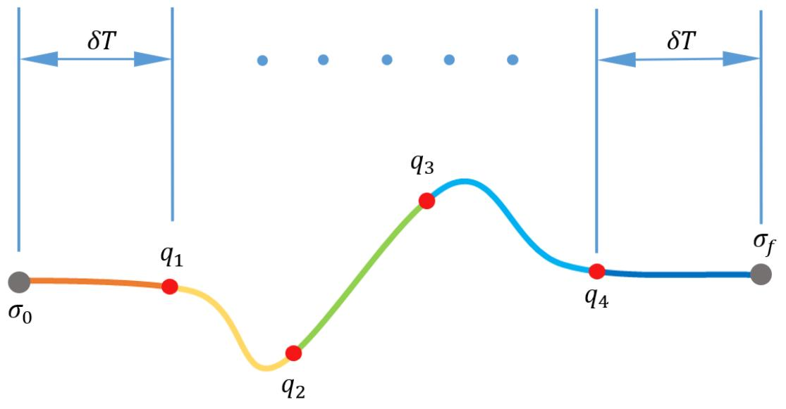

text_image

δT
q0
q1
q2
q3
q4
σf
δT

图4.11 以控制点与时间为决策变量的轨迹示意图

# 4.3 时空轨迹规划问题的构建及求解

自动驾驶轨迹规划的基本问题是生成一条连接车辆起点和目标终点的时空路径，同时车辆满足各种约束，例如运动学/动力学约束和避碰约束，以及来自内部系统或外部环境的时间和空间约束。轨迹规划的最常用的解决方案是将轨迹规划分为路径规划和速度规划分别求解的结构，但是在实际应用中会遇到多种多样的问题，本质是因为路径和速度在运动规划中有不可忽视的相互影响和相互依赖。时空联合规划是指在三维时空间内同时求解路径和速度曲线，得到的是二者的最佳组合。相比时空解耦规划，这种时空联合同时求解的规划方法具有更大的求解空间，能够解决横纵耦合严重场景的规划问题，具有更接近于熟练驾驶员的表现，能够满足复杂场景的规划需求。因此本章节使用时空联合轨迹规划方法对轨迹进行求解。

# 4.3.1 时空轨迹规划问题的构建

本文前面的内容中，已经建立了时空安全走廊，能够考虑动静态元素开辟出可通行区域。在轨迹参数化部分，引入了车辆微分平坦特性，最小化控制量轨迹能够通过控制点与轨迹时间来直观表达时空轨迹，并天然满足运动学约束，为规划求解做好了准备。本节将在此基础上构建时空联合轨迹规划的优化问题，并进行求解。优化问题的构建如下式：

$$
\min J (c, T) = \int_ {0} ^ {T} \sigma^ {[ s ]} (t) ^ {T} W \sigma^ {[ s ]} (t) d t + \omega_ {T} T
$$

$$
s. t. \sigma_ {0} ^ {j} (0) = \overline {{{\sigma}}} _ {0}, \sigma_ {n} ^ {j} (\delta T) = \overline {{{\sigma}}} _ {f}, 0 \leq j <   s
$$

$$
\sigma_ {i} (\delta T) = \sigma_ {i + 1} (0) = \sigma_ {i}, 1 \leq i <   n \quad \dots \tag {4.21}
$$

$$
\sigma_ {i} ^ {[ k ]} (\delta T) = \sigma_ {i + 1} ^ {[ k ]} (0), 1 \leq i <   n, 1 \leq k <   2 s - 1
$$

$$
G _ {d} (\sigma (t), \dots , \sigma^ {(s)} (t), t) \leq 0, \forall d \epsilon D, \forall t \epsilon [ 0, T ]
$$

本文将问题初始化为一个在满足各种等式和不等式约束条件下的最小化控制和通行时间的问题，其中??是一个对角矩阵惩罚控制，第一个约束方程是边界条件， $\overline { { \sigma _ { 0 } } }$ 和$\overline { { \sigma _ { f } } }$ 分别是轨迹的已知起点和终点状态。第二个约束方程是控制点处的边界条件，要求第i 段轨迹和第i+1段轨迹经过已知控制点位置。第三个约束方程为控制点处轨迹 0到k阶的连续性约束。第四个约束方程为轨迹的可行性约束的统一性表达。本文中，s 选择为3，因此代价函数为最小化加加速度与最小化时间函数，连续性约束要求控制点处0到4阶连续 $\left( 1 \leq k < 2 s - 1 \right)$ ）。

后续优化求解过程需要代价函数关于决策变量的梯度，因此需要进行梯度求导。目标函数??对??和??的梯度如下式：

$$
\frac {\partial J}{\partial c _ {i}} = 2 \left(\int_ {0} ^ {\delta T} \beta^ {(s)} (t) \beta^ {(s)} (t) ^ {T}\right) c _ {i} \dots \tag {4.22}
$$

$$
\frac {\partial J}{\partial T} = \frac {1}{n} \sum_ {i = 1} ^ {n} c _ {i} ^ {T} \beta^ {(s)} (\delta T) \beta^ {(s)} (\delta T) ^ {T} c _ {i} + \omega_ {T} \dots \tag {4.23}
$$

另外对于可行性约束，施加在整条轨迹的可行性约束可以等价为施加在分段多项式轨迹中每一段上，

$$
G _ {d} (\sigma (t), \dots , \sigma^ {(s)} (t), t) \leq 0, \forall d \in D, \forall t \in [ 0, T ] \Leftrightarrow
$$

$$
G _ {d} \left(\sigma_ {i} (\bar {t}), \dots , \sigma_ {i} ^ {(s)} (\bar {t}), \bar {t}\right) \leq 0, \forall d \in D, \forall \bar {t} \in [ 0, \delta T ] \dots \tag {4.24}
$$

$$
\forall i \in \{1, 2, \dots , n \}
$$

轨迹分为n段，其中t 为每段轨迹的相对时间戳。在此基础上，我们离散化每一段的连续轨迹的可行性约束，通过对离散化后的约束点来确保轨迹的可行性。然后连续时间可行性约束可以转化为下式：

$$
G _ {d, i, j} (c _ {i}, t) \leq 0
$$

$$
G _ {d, i, j} \left(c _ {i}, t\right) \leq 0 := G _ {d} \left(\sigma_ {i, j}, \dots , \sigma_ {i, j} ^ {(s)}, \bar {t}\right) \quad \dots \tag {4.25}
$$

$$
\overline {{t}} = \frac {j \cdot \delta T}{\lambda n}, \forall j \in \{0, 1, 2, \dots , \lambda \}, \forall d \in D
$$

# 4.3.2 时空轨迹规划问题硬约束的处理

自动驾驶任务需要考虑交通规则、真实的车辆物理极限等实际的因素，以保证轨迹是可行且合理的。因此本节通过硬约束的设置来约束轨迹。

首先，车辆的最高速度既受到物理极限限制，又受到实际交通场景下限速规则的约束。因此车辆的纵向速度需要限制在合理范围内。约束点处的速度约束可以用下式来表示：

$$
G _ {v} (\dot {\sigma}) = \dot {\sigma} ^ {T} \dot {\sigma} - v _ {m} ^ {2}. \tag {4.26}
$$

其中 $^ { 1 } v _ { m }$ 是最大的纵向速度。速度约束的梯度如下：

$$
\frac {\partial G}{\partial \dot {\sigma}} = 2 \dot {\sigma} \dots\dots(4. 2 7)
$$

另外由于车辆的动力约束和轮胎与地面的摩擦限制，需要设置加速度的限制来防止动力不足和轮胎打滑。因此，本研究在约束点位置设置了纵向和横向加速度的约束函数：

$$
G _ {a _ {t}} (\dot {\sigma}, \ddot {\sigma}) = \frac {(\ddot {\sigma} ^ {T} \dot {\sigma}) ^ {2}}{\dot {\sigma} ^ {T} \dot {\sigma}} - a _ {t m} ^ {2} \dots \tag {4.28}
$$

$$
G _ {a _ {n}} (\dot {\sigma}, \ddot {\sigma}) = \frac {(\ddot {\sigma} ^ {T} B \dot {\sigma}) ^ {2}}{\dot {\sigma} ^ {T} \dot {\sigma}} - a _ {n m} ^ {2}, B = \left[ \begin{array}{l l} 0 & - 1 \\ 1 & 0 \end{array} \right] \dots\dots\tag {4.29}
$$

其中 $a _ { { _ { t m } } }$ 和 $a _ { n m }$ 是车辆的纵向与横向最大加速度，??是辅助系数矩阵。 $G _ { a _ { t } } \left( \dot { \sigma } , \ddot { \sigma } \right)$ 与$G _ { a _ { n } } \left( \dot { \sigma } , \ddot { \sigma } \right)$ 的梯度如下：

$$
\frac {\partial G _ {a _ {t}}}{\partial \dot {\sigma}} = 2 \frac {\ddot {\sigma} ^ {T} \dot {\sigma}}{\left\| \dot {\sigma} \right\| _ {2} ^ {2}} \ddot {\sigma} - 2 \left(\frac {\ddot {\sigma} ^ {T} \dot {\sigma}}{\left\| \dot {\sigma} \right\| _ {2} ^ {2}}\right) ^ {2} \dot {\sigma} \dots\dots (4. 3 0)
$$

$$
\frac {\partial G _ {a _ {t}}}{\partial \ddot {\sigma}} = 2 \frac {\ddot {\sigma} ^ {T} \dot {\sigma}}{\left\| \dot {\sigma} \right\| _ {2} ^ {2}} \dot {\sigma} \dots\dots(4. 3 1)
$$

$$
\frac {\partial G _ {a _ {n}}}{\partial \dot {\sigma}} = 2 \frac {\ddot {\sigma} ^ {T} B \dot {\sigma}}{\left\| \dot {\sigma} \right\| _ {2} ^ {2}} B ^ {T} \ddot {\sigma} - 2 \left(\frac {\ddot {\sigma} ^ {T} B \dot {\sigma}}{\left\| \dot {\sigma} \right\| _ {2} ^ {2}}\right) ^ {2} \dot {\sigma} \dots\dots (4. 3 2)
$$

$$
\frac {\partial G _ {a _ {n}}}{\partial \ddot {\sigma}} = 2 \frac {\ddot {\sigma} ^ {T} B \dot {\sigma}}{\left\| \dot {\sigma} \right\| _ {2} ^ {2}} B \dot {\sigma} \dots \tag {4.33}
$$

除此之外，曲率由车辆最大前轮转角来决定，因此轨迹的曲率应该受到硬约束限制。假设车辆最大曲率为 $\kappa _ { m }$ ，轨迹曲率应被限制在 $\left[ - \kappa _ { m } , \kappa _ { m } \right]$ 。因此，曲率约束可以分为 $G _ { \kappa _ { l } } \left( \dot { \sigma } , \ddot { \sigma } \right)$ 和 $G _ { \kappa _ { r } } \left( \dot { \sigma } , \ddot { \sigma } \right)$ 两个约束函数，式子如下：

$$
\kappa_ {m} = \frac {\tan \phi_ {m}}{L} \dots\dots(4. 3 4)
$$

$$
G _ {\kappa_ {l}} (\dot {\sigma}, \ddot {\sigma}) = \frac {\ddot {\sigma} ^ {T} B \dot {\sigma}}{\dot {\sigma} _ {2} ^ {3}} - \kappa_ {m} \dots \tag {4.35}
$$

$$
G _ {\kappa_ {r}} (\dot {\sigma}, \ddot {\sigma}) = - \frac {\ddot {\sigma} ^ {T} B \dot {\sigma}}{\dot {\sigma} _ {2} ^ {3}} - \kappa_ {m} \dots \tag {4.36}
$$

上式中， $\phi _ { m }$ 为最大前轮转角。另外， $G _ { \kappa _ { l } }$ 与 $G _ { \kappa _ { \gamma } }$ 的梯度如下：

$$
\frac {\partial G _ {\kappa_ {l}}}{\partial \dot {\sigma}} = \frac {B ^ {T} \ddot {\sigma} ^ {T}}{\dot {\sigma} _ {2} ^ {3}} - 3 \frac {\ddot {\sigma} ^ {T} B \dot {\sigma}}{\dot {\sigma} _ {2} ^ {5}} \dot {\sigma} \dots \tag {4.37}
$$

$$
\frac {\partial G _ {\kappa_ {l}}}{\partial \ddot {\sigma}} = \frac {B \dot {\sigma}}{\dot {\sigma} _ {2} ^ {3}} \dots \tag {4.38}
$$

$$
\frac {\partial G _ {\kappa_ {r}}}{\partial \dot {\sigma}} = - \frac {\partial G _ {\kappa_ {l}}}{\partial \dot {\sigma}} \dots \tag {4.39}
$$

$$
\frac {\partial G _ {\kappa_ {r}}}{\partial \ddot {\sigma}} = - \frac {\partial G _ {\kappa_ {l}}}{\partial \ddot {\sigma}} \dots \tag {4.40}
$$

# 4.3.3 时空轨迹规划问题可行性约束

在上文中，通过安全生成流程得到了时空走廊来表征自车的可通行区域，时空走廊生成过程中既考虑了静态避障，也通过时空地图实现了动态障碍物避障，因此本文在避障约束的方面，可以统一的处理动静态障碍物，时空联合地实现避障功能。

本研究的约束点的采样时间间隔保持和时空走廊的 $\Delta t$ 保持一致，从而保证约束点与时空走廊一一对应。通过这种方式可以保证把每个约束点处的自车车辆模型限制在对应的走廊内保证整条轨迹的安全性。首先，使用凸多边形表征自车形状，多边形的顶点集可以定义为??：

$$
\begin{array}{r l} \varepsilon = & \left\{P _ {e} \in R ^ {2}: P _ {e} = \sigma + R D _ {e}, e = 1, 2, \dots , n _ {e} \right\} \\ & R = \frac {1}{\dot {\sigma} _ {2}} (\dot {\sigma}, B \dot {\sigma}) \end{array} \tag {4.41}
$$

其中R为自车坐标系到世界坐标系的旋转矩阵， $n _ { e }$ 为凸多边形顶点个数， $D _ { e }$ 为自车坐标系下第 e 个顶点的坐标。安全走廊可以用超平面的方式表达，超平面是 n 维空间中的一个 n-1 维子空间，用于将空间分成两部分。如图 4.12 所示，在二维空间中，超平面是一条直线，在三维空间中是一个平面。

因此，每个约束点处对应的安全走廊可以表示为??：

$$
\begin{array}{l} H = \left\{q \in R ^ {2}: A q \leq b \right\} \\ A = \left(A _ {1}, \dots , A _ {n _ {z}}\right) ^ {T} \in R ^ {n _ {z} \times 2} \dots \tag {4.42} \\ \end{array}
$$

$$
b = \left(b _ {1}, \dots , b _ {n _ {z}}\right) ^ {T} \in R ^ {n _ {z}}
$$

其中 $n _ { z }$ 是超平面的个数， $A _ { z }$ 与 $b _ { z }$ 为超平面的描述符，可以由安全走廊的顶点和法向量确定。值得一提的是，一旦生成了安全走廊，超平面的表达也就完全确定下来。

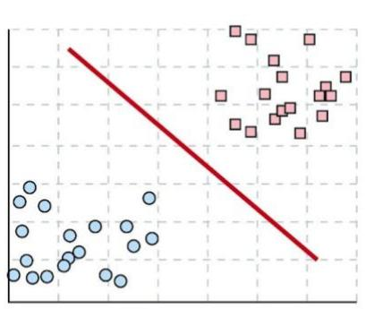

scatter

| Group | X     | Y     |
|-------|-------|-------|
| Blue  | 0.1   | 0.2   |
| Blue  | 0.2   | 0.3   |
| Blue  | 0.3   | 0.4   |
| Blue  | 0.4   | 0.5   |
| Blue  | 0.5   | 0.6   |
| Blue  | 0.6   | 0.7   |
| Blue  | 0.7   | 0.8   |
| Blue  | 0.8   | 0.9   |
| Blue  | 0.9   | 1.0   |
| Pink  | 0.1   | 0.1   |
| Pink  | 0.2   | 0.2   |
| Pink  | 0.3   | 0.3   |
| Pink  | 0.4   | 0.4   |
| Pink  | 0.5   | 0.5   |
| Pink  | 0.6   | 0.6   |
| Pink  | 0.7   | 0.7   |
| Pink  | 0.8   | 0.8   |
| Pink  | 0.9   | 0.9   |
| Pink  | 1.0   | 1.0   |

二维空间超平面

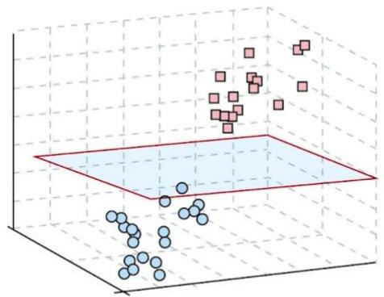  
三维空间超平面  
图 4.12 二维与三维空间超平面示意图

将自车模型限制在安全走廊内部，一个充分必要条件是自车模型顶点都包含在安全走廊内：

$$
\varepsilon \subseteq H \Leftrightarrow \sigma + R D _ {e} \subseteq H, \forall e \in \{1, 2, \dots , n _ {e} \} \dots \tag {4.43}
$$

而走廊内包含所有自车顶点的一个充分必要条件是每个顶点在每个超平面的内侧，如图 4.13 所示，左图中车辆在走廊内，无需惩罚，右图中的车辆左上方顶点超出走廊范围，通过计算自车与走廊对应顶点连接向量在超平面法向量方向上的结果，惩罚超出走廊的部分，计算公式如下：

$$
\sigma + R D _ {e} \subseteq H \Leftrightarrow A _ {z} ^ {T} (\sigma + R \cdot D _ {e}) \leq b _ {z}, \forall z \in \{1, 2, \dots , n _ {e} \} \dots \tag {4.44}
$$

约束点的位置约束函数可最终表达为：

$$
G _ {I} = \left(G _ {I _ {1, 1}}, \dots , G _ {I _ {e, z}}, \dots , G _ {I _ {n _ {e}, n _ {z}}}\right) ^ {T} \in R ^ {n _ {e} \times n _ {z}} \tag {4.45}
$$

$$
G _ {I _ {e, z}} (\dot {\sigma}, \ddot {\sigma}) = A _ {z} ^ {T} (\sigma + R D _ {e}) - b _ {z}
$$

约束函数 $G _ { I _ { e , \tau } } \left( \dot { \sigma } , \ddot { \sigma } \right)$ 对应的梯度如下：

$$
\frac {\partial G _ {I _ {e , z}}}{\partial \sigma} = A _ {z}. \tag {4.46}
$$

$$
\frac {\partial G _ {I _ {e , z}}}{\partial \dot {\sigma}} = \left(\frac {\left(D _ {e} , B D _ {e}\right) ^ {T}}{\left\| \dot {\sigma} _ {2} \right\|} - \frac {\dot {\sigma} \left(R D _ {e}\right) ^ {T}}{\left\| \dot {\sigma} _ {2} ^ {2} \right\|}\right) A _ {z} \dots\dots(4. 4 7)
$$

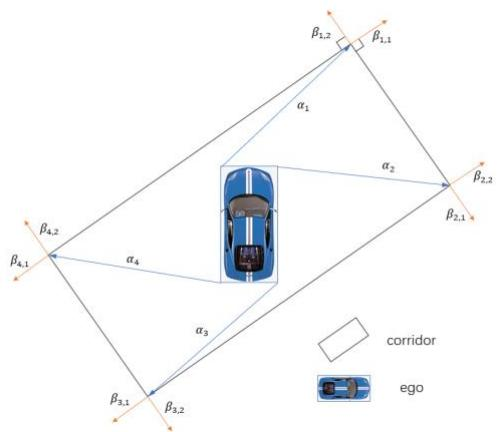

text_image

β₁,₂
β₁,₁
α₁
α₂
β₂,₂
β₂,₁
β₄,₂
α₄
α₃
β₄,₁
β₃,₁
β₃,₂
corridor
ego

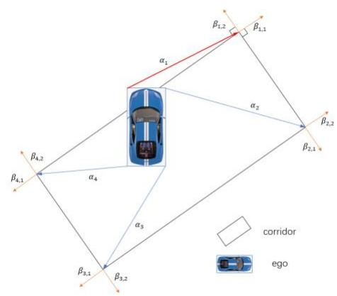

text_image

β₁,₂
β₁,₁
α₁
α₂
β₂,₂
β₂,₁
β₄,₂
α₄
α₃
β₃,₁
β₃,₂
corridor
ego

图 4.13 自车约束在安全走廊内部示意图

# 4.3.4 优化问题的重构

上节我们构建了优化问题中的状态约束，并推导出约束函数与梯度，本节在此基础上，将优化问题的约束进一步转化，重构为无约束优化问题并进行求解。

对于整条轨迹的可行性约束，我们离散化轨迹时间，将方程转化为如下形式：

$$
\zeta_ {\Sigma} (c, T) = \sum_ {d \in D} w _ {d} \sum_ {i = 1} ^ {n} \sum_ {j = 0} ^ {\lambda} P _ {d, i, j} \left(c _ {i}, T\right) \dots \tag {4.48}
$$

$$
P _ {d, i, j} \left(c _ {i}, T\right) = \frac {\delta T}{\lambda} \overline {{\omega_ {k}}} L _ {1} \left(G _ {d, i, j}\right) \dots \tag {4.49}
$$

式中， $w _ { d }$ 是可行性约束对应的代价权重， $P _ { d , i , j }$ 是约束点违反可行性约束的惩罚。直接将约束带入代价函数中，可能会出现代价函数阶跃、不连续、不可导等情况，导致优化过程收敛慢甚至不收敛。此外，惩罚项小于 0 时不应将其加入到代价函数中。因此我们定义一个松弛函数 $L _ { 1 }$ 来保证惩罚项的连续可导并且非负：

$$
L _ {1} (x) = \left\{ \begin{array}{l l} 0, & x \leq 0 \\ - \frac {x ^ {4}}{2 a _ {0} ^ {3}} + \frac {x ^ {3}}{a _ {0} ^ {2}}, & 0 <   x <   a _ {0} \dots \tag {4.50} \\ x - \frac {1}{2} a _ {0}, & x > a _ {0} \end{array} \right.
$$

$$
L _ {1} ^ {\prime} (x) = \left\{ \begin{array}{l l} 0, & x \leq 0 \\ - \frac {2 x ^ {3}}{a _ {0} ^ {3}} + \frac {3 x ^ {2}}{a _ {0} ^ {2}}, & 0 <   x <   a _ {0} \\ 1, & x > a _ {0} \end{array} \right. \dots \tag {4.51}
$$

松弛函数在 0 点处连续，在分界点 $a _ { 0 }$ 处连续且可导， $a _ { 0 }$ 应为一个较小值，保证松弛函数不会对原问题产生过大的影响。松弛函数及其导数图像如图 4.14。

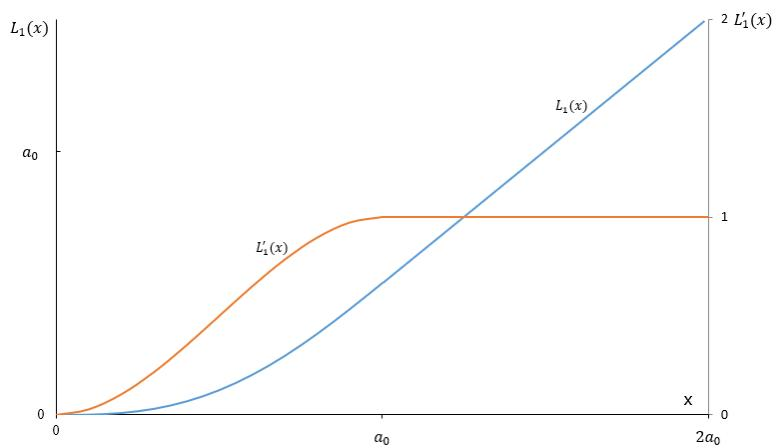

line

| x     | L₁(x) | L'₁(x) |
|-------|-------|--------|
| 0     | 0     | 0      |
| a₀    | a₀    | a₀     |
| 2a₀   | a₂    | 1      |

图4.14 松弛函数及其导数图像

相应的，约束点处的惩罚项对应的梯度如下：

$$
\frac {\partial P _ {d , i , j}}{\partial c _ {i}} = \frac {\partial P _ {d , i , j}}{\partial G _ {d , i , j}} \frac {\partial G _ {d , i , j}}{\partial c _ {i}} \dots\dots(4. 5 2)
$$

$$
\frac {\partial P _ {d , i , j}}{\partial T} = \left(0 _ {i - 1} ^ {T}, \frac {P _ {d , i , j}}{T}, 0 _ {n - i} ^ {T}\right) ^ {T} + \frac {\partial P _ {d , i , j}}{\partial G _ {d , i , j}} \frac {\partial G _ {d , i , j}}{\partial T} \dots\dots\tag {4.53}
$$

$$
\frac {\partial P _ {d , i , j}}{\partial G _ {d , i , j}} = \frac {\delta T}{\lambda} \overline {{\omega_ {k}}} L _ {1} ^ {\prime} \left(G _ {d, i, j}\right) \dots \tag {4.54}
$$

由此，轨迹规划问题可转化为：

$$
\min \Phi (c, T) = J (c, T) + \zeta_ {\Sigma} (c, T)
$$

$$
s. t. \sigma_ {0} ^ {j} (0) = \overline {{\sigma_ {0}}}, \sigma_ {n} ^ {j} (\delta T) = \overline {{\sigma_ {f}}}, 0 \leq j <   s \tag {4.55}
$$

$$
\sigma_ {i} (\delta T) = \sigma_ {i + 1} (0) = \sigma_ {i}, 1 \leq i <   n
$$

$$
\sigma_ {i} ^ {[ k ]} (\delta T) = \sigma_ {i + 1} ^ {[ k ]} (0), 1 \leq i <   n, 1 \leq k <   2 s - 1
$$

由上文已知，最小化控制量轨迹可通过公式 $M ^ { * } c = b$ 唯一确定系数矩阵 $c$ ，式中M与b中可以由连续约束，起终点状态，以及控制点 $q$ 、轨迹时间T 唯一确定。由于连续性约束与起终点约束是优化问题中固定不变的，因此，我们将控制点 $q$ 、轨迹时间T 作为优化问题中的决策变量，而等式约束均可以通过最小化控制量轨迹天然满足，因此将公式4.55 中的等式约束消除，优化问题转化为如下形式：

$$
\min \psi (q, T) = \phi (c (q, T), T) \dots \tag {4.56}
$$

目标函数 $\psi \left( q , T \right)$ 对控制点和时间的梯度推导如下：

$$
\frac {\partial \psi}{\partial q _ {i}} = (M _ {i} ^ {- \mathrm{T}} \frac {\partial \phi}{\partial c}) ^ {\mathrm{T}} E _ {(2 i - 1) s + 1} \dots \tag {4.57}
$$

$$
\frac {\partial \psi}{\partial T} = \frac {\partial \phi}{\partial T} - T r \left\{\left(M _ {i} ^ {- \mathrm{T}} \frac {\partial \phi}{\partial c}\right) ^ {\mathrm{T}} \frac {\partial M}{\partial T} c \right\} \dots \tag {4.58}
$$

$$
\forall i \in \{1, 2, \dots , n \}
$$

$E _ { j }$ 为列向量，其中第 j行为 1，其余行为 0。Tr{}为迹运算。

至此，本研究消除了原优化问题中的所有约束，将有约束的问题转化为无约束优化问题，从而可以通过调用无约束优化器进行鲁棒且快速的求解。

# 4.3.5 无约束优化问题求解

在无约束优化问题中，优化算法的选择对于优化问题的效率和精度具有重要影响。无约束优化算法种类较多，常见的有梯度下降法、牛顿法、高斯牛顿法、拟牛顿法等等，其中拟牛顿法有着和牛顿法一样收敛较快的特点，并且相比牛顿法需要更少的计算资源，因此在无约束优化领域得到了广泛应用，LBFGS 算法就是拟牛顿法中的一种。

LBFGS算法是一种用于无约束优化问题的迭代方法，它是经典BFGS算法的变种，理解BFGS 算法对了解 LBFGS 算法至关重要。

BFGS 算法是一种拟牛顿法，通过近似求解海森矩阵（Hessian matrix）来更新搜索方向，并加速收敛[80]。BFGS 的关键是通过已知条件迭代地计算并更新海森矩阵的逆，避免牛顿法中求解海森矩阵以及其逆矩阵导致的计算资源大量消耗。算法流程如下：

(1) 给定初值 $x _ { 0 }$ 与精度阈值 ，设定D为海森矩阵的逆， $D _ { 0 }$ 为单位矩阵I ， $g _ { k }$ 为雅克比矩阵（Jacobian Matrix）， k 初始化为 0；  
(2) 确定搜索方向 $d _ { k } = - D _ { k } ^ { * } g _ { k }$ （类似牛顿法）；  
(3) 通过 line search 得到迭代步长 $\lambda _ { k }$ ，令 $s _ { k } = \lambda _ { k } d _ { k } , x _ { k + 1 } = x _ { k } + s _ { k }$ ；  
(4) 若 $g _ { k + 1 } < \varepsilon$ ，算法结束；  
(5) 计算 $y _ { k } = g _ { k + 1 } - g _ { k }$ ；  
(6) 计算 $D _ { k + 1 } = \left( I - \frac { s _ { k } y _ { k } ^ { T } } { y _ { k } ^ { T } s _ { k } } \right) D _ { k } \left( I - \frac { y _ { k } s _ { k } ^ { T } } { y _ { k } ^ { T } s _ { k } } \right) + \frac { s _ { k } s _ { k } ^ { T } } { y _ { k } ^ { T } s _ { k } } \ : ;$ T T  k k k k  y s y s − +      ；  
(7) $k = k + 1$ ，返回（2）；

BFGS 需要直接存储完整地海森矩阵的逆矩阵，矩阵大小为 $N \times N$ ，当N 很大时存储矩阵需要消耗大量内存资源。LBFGS 则通过引入有限记忆来降低计算和存储的复杂度，只在每次迭代中存储前m次迭代的梯度和位置变化信息，并通过这些信息构造一个低秩的近似海森矩阵，m通常远小于N，由此空间复杂度由 $O \big ( N \times N \big )$ 降为 $O \big ( m \times N \big )$ ，从而避免了大规模矩阵的存储。

# 4.4 规划器的仿真测试工具

为了能够快速验证轨迹规划器的性能，并且有效地调节规划器的权重参数，本文为规划器设计了仿真测试模块。本章规划代码通过 C++代码编写，可视化脚本调用了Python 中 Matplotlib 绘图库绘制出关键信息并且根据可视化结果进行参数的调优。权重参数确定后，本文在路口右转和非规则路口转弯的场景下对算法进行了验证。

路口右转场景的仿真如图 4.15 所示，图中红色 box 为自车规划轨迹序列，绿色点为最小化控制参数化轨迹的控制点。可以看出在右转场景下，规划轨迹能够有效地通过路口，与道路元素均保持了安全距离，并且规划轨迹平滑度较高。

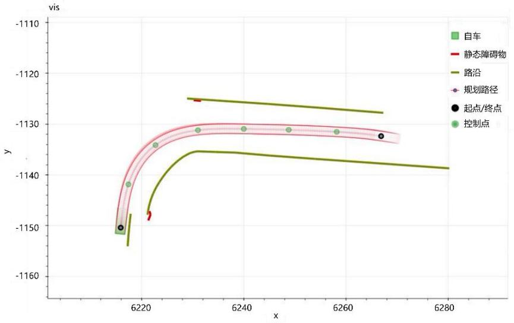

line

| x     | y       |
|-------|---------|
| 6220  | -1150   |
| 6240  | -1130   |
| 6260  | -1130   |
| 6280  | -1140   |

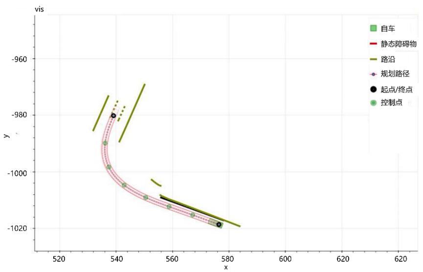

scatter

| x    | y      | Category       |
|------|--------|----------------|
| 540  | -980   | 路沿           |
| 540  | -1000  | 自车           |
| 540  | -1010  | 规划路径       |
| 580  | -1020  | 控制点         |
| 580  | -1020  | 起点/终点     |

图4.15 路口右转场景仿真

非规则大路口转弯是在城市工况下难度较高的场景。规划器需要保证能够生成足够长度轨迹通过路口，并且能稳定经过预设的起点终点，不与障碍物发生碰撞。能够在这种场景下取得不错的表现可以在一定程度上证明规划器的性能。本文的规划算法在非规则大路口转弯场景下的仿真结果如图 4.16 所示，左图中蓝色轨迹为规划的初始输入轨迹，其形状不符合人驾习惯，并且平滑度较差，红色轨迹框为经过规划器优化后的轨迹，可以看出，优化后的轨迹更加拟人，轨迹更加平滑，能够准确经过预定的起终点（黑色点）。右图为轨迹的速度、横纵向加速度、前轮转角、航向角以及曲率关于时间的曲线，可以看出自车初始提速来提高通行效率，在接近出口转弯时降低车速保证良好的转弯体感，另外上述所有的状态量均随时间平滑地变化。

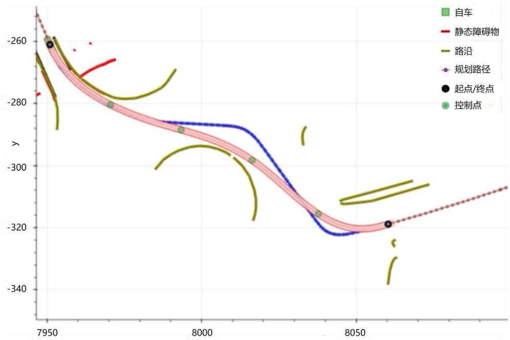

line

| x     | y (自车) | y (静态障碍物) | y (路沿) | y (规划路径) |
|-------|----------|-----------------|----------|--------------|
| 7950  | -260     | -260            | -260     | -260         |
| 8000  | -280     | -280            | -280     | -280         |
| 8050  | -320     | -320            | -320     | -320         |
| 8100  | -340     | -340            | -340     | -340         |

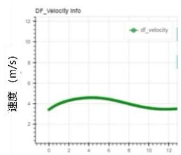

line

| Time (s) | Speed (m/s) |
| -------- | ----------- |
| 0        | 3.5         |
| 2        | 4.0         |
| 4        | 4.5         |
| 6        | 4.3         |
| 8        | 4.0         |
| 10       | 3.7         |
| 12       | 3.5         |

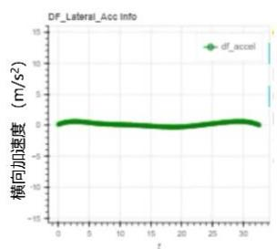

line

| t  | df_accel (m/s²) |
|----|-----------------|
| 0  | 0.0             |
| 5  | 0.0             |
| 10 | 0.0             |
| 15 | 0.0             |
| 20 | 0.0             |
| 25 | 0.0             |
| 30 | 0.0             |

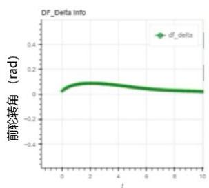

line

DF_Delta into
| t | df delta (rad) |
|---|---|
| 0 | 0.0 |
| 2 | 0.1 |
| 4 | 0.05 |
| 6 | 0.03 |
| 8 | 0.02 |
| 10 | 0.01 |

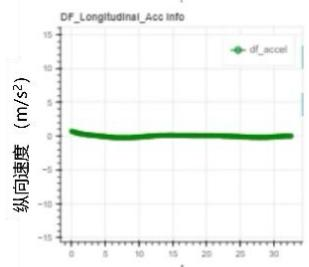

line

| t   | 纵向速度 (m/s²) |
| --- | --------------- |
| 0   | 0.0             |
| 5   | -0.5            |
| 10  | -0.5            |
| 15  | -0.5            |
| 20  | -0.5            |
| 25  | -0.5            |
| 30  | -0.5            |

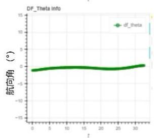

line

| t  | df_Theta (°) |
|----|--------------|
| 0  | -1.0         |
| 5  | -0.8         |
| 10 | -0.6         |
| 15 | -0.4         |
| 20 | -0.2         |
| 25 | 0.0          |
| 30 | 0.2          |

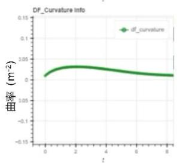

line

| t   | df_curvature (m⁻²) |
| --- | ----------------- |
| 0   | 0.0               |
| 2   | 0.03              |
| 4   | 0.02              |
| 6   | 0.01              |
| 8   | 0.01              |

图4.16 非规则大路口转弯场景仿真

综上，本文设计的规划器能够有效的优化质量较差的原轨迹，并且规划轨迹具有很好地安全性、拟人性和平滑性，并且能够胜任复杂场景的轨迹规划任务。

# 4.5 本章总结

本章基于自动驾驶轨迹规划的任务以及影响轨迹规划算法的多种因素，提出了一种综合时空安全走廊、时空轨迹参数化、时空联合规划的自动驾驶时空轨迹规划方法。首先，本章通过引入时空安全走廊重新定义了轨迹规划中的避障问题，建立了可通行区域。另外通过最小化控制轨迹的求解，定义了一种以控制点位置与轨迹时间的决策变量的时空轨迹参数化方法。然后将在规划算法搭建中引入时空安全走廊和时空参数化轨迹，并在规划问题的构建中综合考虑车辆横纵向优化，构建了时空联合轨迹规划问题，通过对约束条件的重构将原问题转化为无约束优化问题通过 LBFGS 算法进行高效鲁棒的求解。最后通过仿真结果表明，规划轨迹具有良好的安全性、拟人性、平滑性以及泛化性。

# 第5章 仿真与实验验证

本文在上述章节中分别介绍了自动驾驶轨迹预测模型与终点决策模型、多目标时空联合搜索算法以及时空联合规划方法。本章节对上述章节方法进行仿真验证，具体地，5.1 节介绍轨迹预测模型评价指标、训练配置以及预测结果可视化等；5.2 节多模态终点决策模型训练的结果以及消融实验；5.3 节进行时空联合搜索与时空联合轨迹规划算法的联合仿真，分别在非结构化道路场景、超车变道场景和窄路会车场景验证算法的优越性。

# 5.1 交通参与者轨迹预测模型训练与结果

# 5.1.1 轨迹预测常用评价指标

在自动驾驶领域轨迹预测任务中，有多种指标对模型性能进行评价。本文使用Argoverse 官方提供的指标来评价模型的预测性能，包括最小平均位移误差（minimumAverage Displacement Error，minADE）、最小最终位移误差（minimum Final DisplacementError,，minFDE）和未命中率（Miss Rate，MR）。这些指标用于评估预测轨迹与真实轨迹之间的误差，以及模型在面对多种可能轨迹时的表现，本文预测模型即通过这些指标评价预测模型表现。评价指标的具体解释如下：

(1) minADE：是指在多个预测轨迹中，选取与真实轨迹的最小平均距离误差。具体来说，对于每个时间步，利用预测轨迹与真实轨迹之间的欧几里得距离进行计算，然后取所有时间步的平均值，计算公式如式 5.1，式中 $\hat { \mathbf { y } } _ { t } ^ { ( k ) }$ 为第k 条轨迹， $y _ { t }$ 是真实轨迹在时间步t的位置，K是预测轨迹的数量。minADE 衡量的是模型在整个时间序列上对轨迹的预测精度。

$$
\min A D E = \frac {1}{T} \sum_ {t = 1} ^ {T} \min _ {k \in \{1, \dots , K \}} \hat {y} _ {t} ^ {(k)} - y _ {t} \dots \tag {5.1}
$$

(2) minFDE：计算的是在所有预测轨迹中，与真实轨迹的最终位置（即预测时间序列的最后一个时间步）之间的最小欧几里得距离。与 minADE 不同，minFDE 只关注预测轨迹与真实轨迹在终点时的偏差，主要评估模型在预测最终位置时的精度。计算公式如式5.2所示，??为最后时间步：

$$
\min F D E = \min _ {k \in \{1, \dots , K \}} \hat {y} _ {T} ^ {(k)} - y _ {T}. \tag {5.2}
$$

(3) MR：用于评估预测轨迹是否成功捕捉到真实轨迹的评估指标。它衡量的是在多个可能的轨迹预测中，模型未能准确预测到真实轨迹的比率。通常，MR 的定义是通过设定一个阈值，计算预测轨迹与真实轨迹之间的距离是否超过这个阈值，超过的部分即被认为是“missed”（错过的）。计算公式如下，??()是指示函数，条件成立返回 1，否则返回0， 为设定的阈值：

$$
M R = \frac {1}{T} \sum_ {t = 1} ^ {T} I \left(\min _ {k \in \{1, \dots , K \}} \hat {y} _ {t} ^ {(k)} - y _ {t} > \varepsilon\right) \dots \tag {5.3}
$$

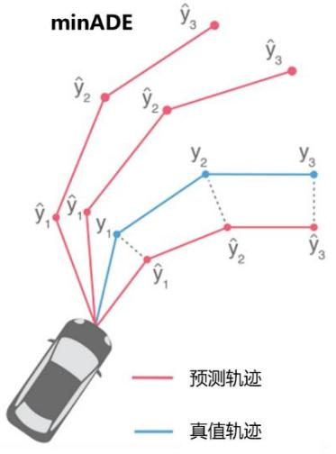

flowchart

```mermaid
graph TD
    A["minADE"] --> B["ŷ₁"]
    A --> C["ŷ₂"]
    A --> D["ŷ₃"]
    B --> E["y₁"]
    C --> F["y₂"]
    D --> G["y₃"]
    E --> H["ŷ₁"]
    F --> I["ŷ₂"]
    G --> J["ŷ₃"]
    style A fill:#f9f,stroke:#333
    style B fill:#ccf,stroke:#333
    style C fill:#ccf,stroke:#333
    style D fill:#ccf,stroke:#333
    style E fill:#cfc,stroke:#333
    style F fill:#cfc,stroke:#333
    style G fill:#cfc,stroke:#333
    style H fill:#fcc,stroke:#333
    style I fill:#fcc,stroke:#333
    style J fill:#fcc,stroke:#333
```

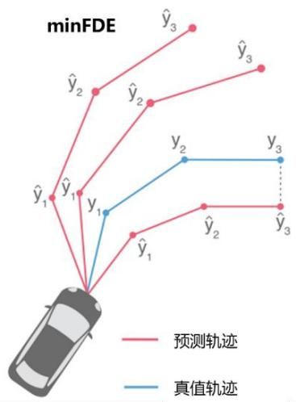

flowchart

```mermaid
graph TD
    A["minFDE"] --> B["ŷ₁"]
    A --> C["ŷ₂"]
    A --> D["ŷ₃"]
    B --> E["y₁"]
    C --> F["y₂"]
    D --> G["y₃"]
    E --> H["ŷ₁"]
    F --> I["ŷ₂"]
    G --> J["ŷ₃"]
    style A fill:#f9f,stroke:#333
    style B fill:#ccf,stroke:#333
    style C fill:#ccf,stroke:#333
    style D fill:#ccf,stroke:#333
    style E fill:#cfc,stroke:#333
    style F fill:#cfc,stroke:#333
    style G fill:#cfc,stroke:#333
    style H fill:#fcc,stroke:#333
    style I fill:#fcc,stroke:#333
    style J fill:#fcc,stroke:#333
```

图 5.1 minADE 与 minFDE 计算方式

# 5.1.2 模型训练与可视化结果

本文预测模型所使用的数据集为 Argoverse2 数据集。其是由 Argo AI、卡内基梅隆大学、佐治亚理工学院联合发布，数据集主要应用于 3D 目标跟踪以及运动预测任务。数据集包含了多种类型的信息，包括传感器数据、动态目标轨迹数据以及地图信息。数据采集车辆以及传感器配置如图 5.2所示，车辆与行人的轨迹数据主要依靠高精度 GPS和激光雷达设备获取，而地图信息则是通过高精度 GPS 配合摄像头采集的数据生成的。

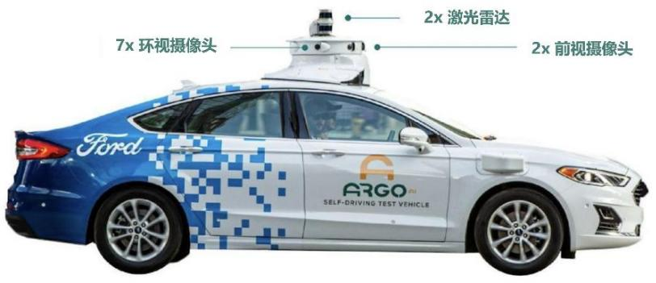

text_image

7x 环视摄像头
2x 激光雷达
2x 前视摄像头
Ford
ARGO
SELF-DRIVING TEST VEHICLE

图 5.2 Argoverse 数据采集车辆

本文采用的实验数据是 Argoverse Motion Forecasting 数据集，该数据集是 324557个场景的集合，每个场景包含五秒钟的数据，且采样频率为 10Hz，总时间 320 小时，主要提供了自车、其他车辆以及行人等类型交通参与者的轨迹数据以及矢量数据类型的高精地图数据。

本文模型训练与验证所使用的服务器配置如表 5.1所示，另外计算机使用的 Linux系统版本为Ubuntu20.04，所有的模型搭建以及可视化脚本代码的编写都通过 Python 语言实现。

表5.1 服务器配置参数

<table><tr><td>配置类型</td><td>配置信息</td></tr><tr><td>CPU</td><td>Intel i7-13790F 处理器</td></tr><tr><td>GPU</td><td>NVIDIA GeForce RTX 3060</td></tr><tr><td>运行内存</td><td>32G</td></tr><tr><td>线程数</td><td>24</td></tr></table>

模型基于 Pytorch 学习架构搭建，使用 AdamW 优化器训练 50 个 epoch（周期），训练的批次大小为 8，初始学习率设置为 0.0005，丢弃率设置为 0.1。图 5.3 为本文预测模型在一些场景下的预测可视化结果，为了让可视化效果更加清晰，每个场景只可视化自车和一个其他车辆的预测结果。由可视化结果可以看出，本文模型可以在复杂的交通场景中对交通参与者做出准确、合理、多模态的预测。所有场景下多模态的预测轨迹能够将真值轨迹包含在内，有效地预测未来轨迹，另外无论是在路口转弯还是直行场景，模型都能够预测出多种模态的结果，如(h)图预测出右转和直行的轨迹，图(f)能够预测出不同速度的轨迹。可视化结果可以证明本文轨迹预测模型在轨迹预测任务上的有效性，能够为在多种场景下进行合理地预测。

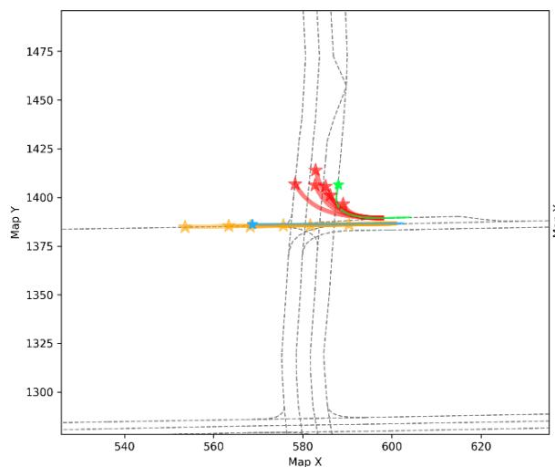

scatter

| Map X | Map Y |
|-------|-------|
| 550   | 1380  |
| 570   | 1380  |
| 580   | 1410  |
| 590   | 1400  |
| 600   | 1390  |

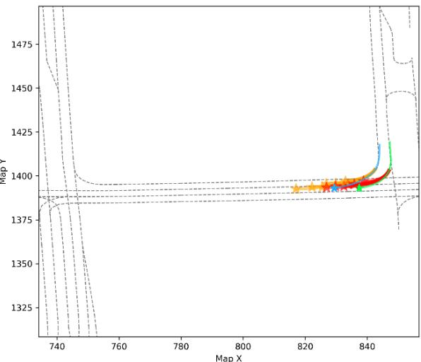

line

| Map X | Map Y |
|-------|-------|
| 740   | 1375  |
| 760   | 1375  |
| 780   | 1375  |
| 800   | 1375  |
| 820   | 1375  |
| 840   | 1375  |
| 840   | 1400  |
| 840   | 1425  |
| 840   | 1450  |
| 840   | 1475  |

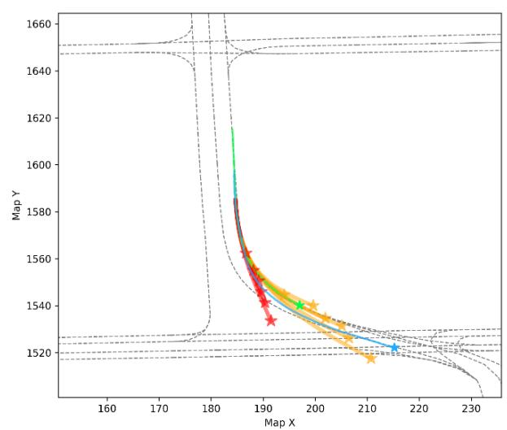

line

| Map X | Map Y |
|-------|-------|
| 180   | 1580  |
| 190   | 1540  |
| 200   | 1530  |
| 210   | 1525  |
| 220   | 1520  |
| 230   | 1515  |

(c)

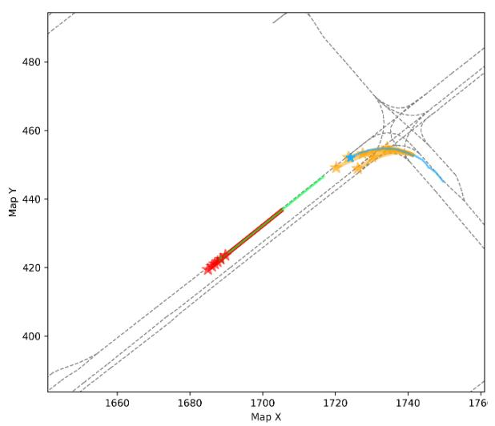

line

| Map X | Map Y |
|-------|-------|
| 1680  | 420   |
| 1700  | 435   |
| 1720  | 445   |
| 1740  | 455   |
| 1760  | 430   |

(d)

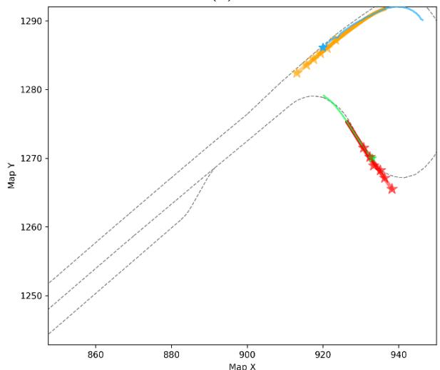

line

| Map X | Map Y |
|-------|-------|
| 860   | 1250  |
| 880   | 1260  |
| 900   | 1270  |
| 920   | 1280  |
| 940   | 1270  |

(e)

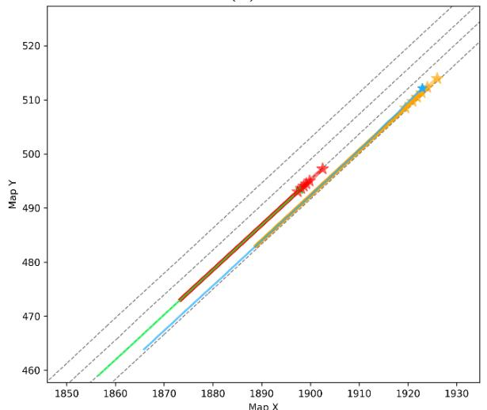

scatter

| Map X | Map Y |
|---|---|
| 1890 | 495 |
| 1900 | 497 |
| 1920 | 510 |
| 1930 | 515 |

(f)

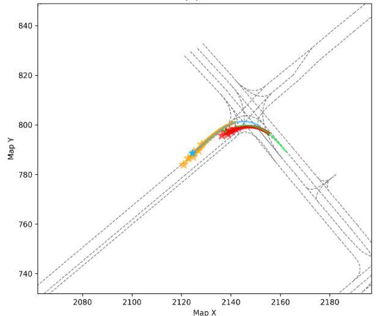

scatter

| Map X | Map Y |
|-------|-------|
| 2120  | 785   |
| 2130  | 790   |
| 2140  | 795   |
| 2150  | 798   |
| 2160  | 799   |
| 2170  | 798   |
| 2180  | 795   |

(g)

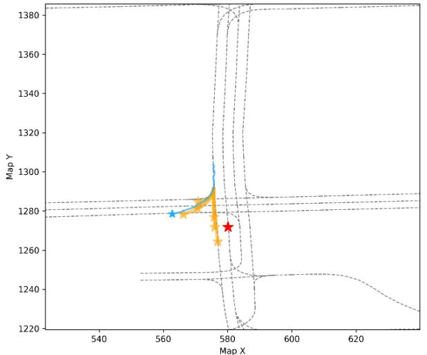

scatter

| Map X | Map Y | Color |
|-------|-------|-------|
| 560   | 1280  | Blue  |
| 570   | 1290  | Orange|
| 580   | 1270  | Red   |

(h)   
自车真实轨迹 自车预测轨迹☆自车预测终点—他车真实轨迹 一他车预测轨迹 ★他车预测终点  
表5.2给出了本文预测模型在 Argoverse验证集上的评价指标。模型在验证集上的

图5.3 多模态轨迹预测可视化结果

性能评价指标 minADE 为 0.79 m，minFDE 为 1.24 m，MR 为 0.13，指标表明了模型的预测轨迹与真值轨迹的贴合度较高，且预测终点非常精准。另外多模态预测轨迹都贴近真值轨迹，没有过度偏离真值。

表 5.2 预测模型在 Argoverse 验证集上的评价指标

<table><tr><td rowspan="2">数据集</td><td colspan="3">预测性能评价指标</td></tr><tr><td>minADE/m</td><td>minFDE/m</td><td>MR</td></tr><tr><td>Argoverse 验证集</td><td>0.79</td><td>1.24</td><td>0.13</td></tr></table>

# 5.2 多模态自车终点决策模型训练结果

# 5.2.1 多模态自车终点决策模型评价指标

相比预测任务，自车终点决策模型推理自车未来终点，对自车终点的安全性有更高的要求，另外工程应用中更希望终点之间不同从而捕捉未来的不确定性。因此，本节除了上述的预测评价指标，还设计了新的评价指标评价终点的安全性和模态的差异性。

本节评价安全性的指标包括与静态障碍物的碰撞率（Collision Rate），以及与交通参与者真值终点车辆物理模型框（box）的交并比（IOU）。自车与静态障碍物的碰撞可以通过计算自车终点位置的物理模型与静态障碍物是否相交进行判断，然后计算碰撞率。障碍物在实际应用中通常以点、线段或者多边形的形式表示，因此，碰撞问题可以转化为多边形与其他点、线段或者多边形是否相交的计算，这可以通过基本的向量几何知识计算求解。自车与交通参与者真值终点 box 的 IOU 能够体现模型中自车与动态障碍物的碰撞程度，IOU是衡量两个物体重叠程度的标准，计算公式为：

$$
I O U = \frac {\text { Area   of   Intersection }}{\text { Area   of   Union }} \dots \tag {5.4}
$$

其中， Areaof Intersection 为两物体交集区域面积， Areaof Union为两物体并集区域面积。具体地，我们计算自车所有模态的终点 box与交通参与者真值终点处的 box的IOU，对验证集中所有场景进行 IOU计算并加权平均得到最终的 IOU 指标。

评价自车终点模态的差异性是为了清楚预测结果的多样性，本文通过与第三章多目标终点聚类类似的方法对自车终点进行聚类，得到每个场景下的终点聚类得到的类别数量，最后求解验证集的所有场景中每个场景平均的聚类类别数量，作为评价预测结果多样性的Diff指标。

# 5.2.2 多模态自车终点决策模型可视化结果

图5.4为多模态自车终点决策模型在 Argoverse验证集的可视化结果，可以看出生成的终点分布在真值轨迹附近，并且有最优模态贴近真值。另外多模态的终点间不同伦，在路口场景终点的横向分布展现出多模态，在直行场景也生成了不同速度的轨迹。

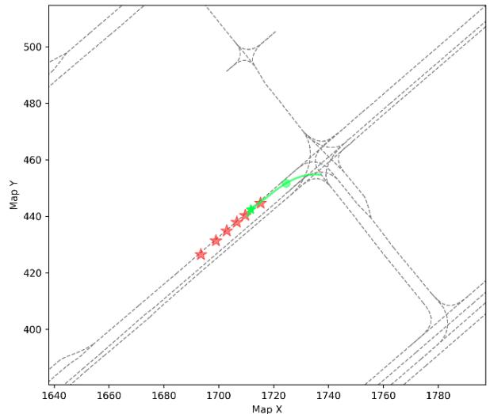

scatter

| Map X | Map Y |
|-------|-------|
| 1700  | 430   |
| 1710  | 435   |
| 1720  | 440   |
| 1730  | 445   |
| 1740  | 450   |
| 1750  | 455   |
| 1760  | 460   |
| 1770  | 465   |
| 1780  | 470   |
| 1790  | 475   |
| 1800  | 480   |
| 1810  | 485   |
| 1820  | 490   |
| 1830  | 495   |
| 1840  | 500   |

(a)

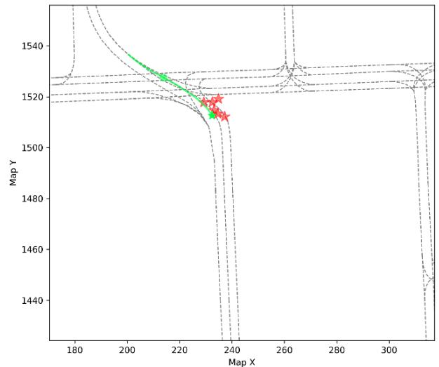

line

| Map X | Map Y |
|-------|-------|
| 240   | 1520  |

(b)

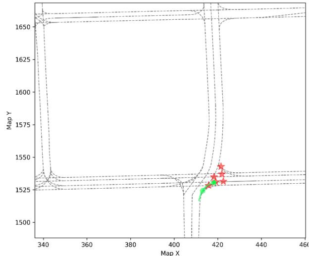

line

| Map X | Map Y |
|-------|-------|
| 418   | 1525  |
| 420   | 1535  |
| 422   | 1538  |
| 424   | 1537  |
| 426   | 1536  |
| 428   | 1534  |
| 430   | 1532  |
| 432   | 1530  |
| 434   | 1528  |
| 436   | 1526  |
| 438   | 1524  |
| 440   | 1522  |
| 442   | 1520  |
| 444   | 1518  |
| 446   | 1516  |
| 448   | 1514  |
| 450   | 1512  |
| 452   | 1510  |
| 454   | 1508  |
| 456   | 1506  |
| 458   | 1504  |
| 460   | 1502  |

(c)

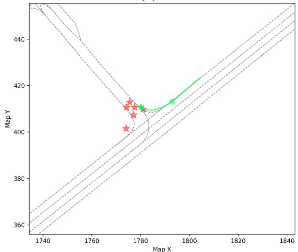

scatter

| Map X | Map Y |
|-------|-------|
| 1775  | 410   |
| 1780  | 410   |
| 1785  | 405   |
| 1790  | 415   |

(d)

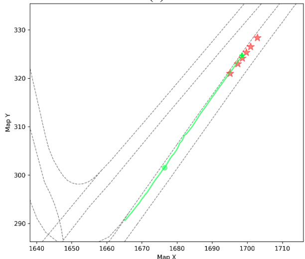

scatter

| Map X | Map Y |
|-------|-------|
| 1640  | 290   |
| 1650  | 295   |
| 1660  | 300   |
| 1670  | 305   |
| 1680  | 310   |
| 1690  | 315   |
| 1700  | 320   |
| 1710  | 325   |

(e)

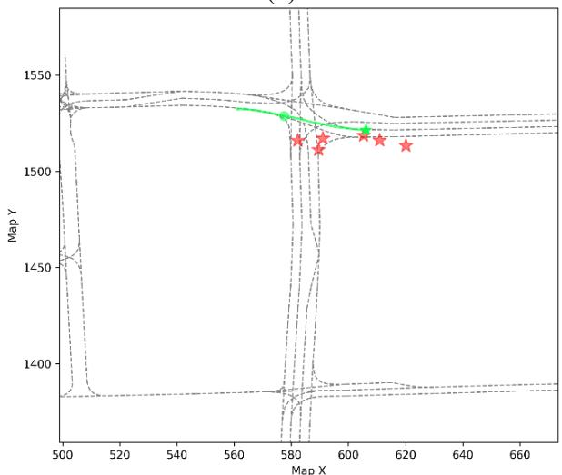

line

| Map X | Map Y |
|-------|-------|
| 500   | 1550  |
| 580   | 1520  |
| 600   | 1510  |
| 620   | 1505  |

(f)

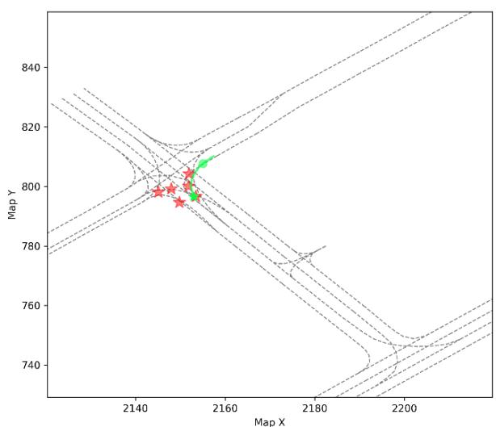

scatter

| Map X | Map Y |
|-------|-------|
| 2140  | 800   |
| 2160  | 805   |
| 2180  | 790   |
| 2200  | 780   |

(g)

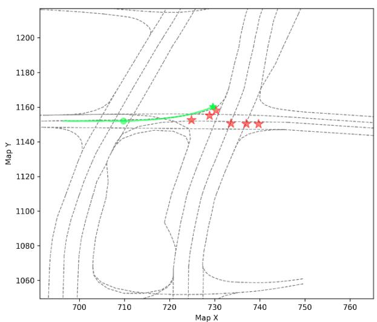

scatter

| Map X | Map Y |
|-------|-------|
| 710   | 1155  |
| 730   | 1160  |
| 740   | 1155  |

(h)   
自车真实轨迹  
●自车当前位置  
☆多模态自车终点

图5.4 多模态自车终点生成可视化结果

# 5.2.3 消融实验

本研究设计了消融实验验证多模态自车终点决策模型的有效性，通过 minFDE、MR、CollisionRate、IOU、Diff几种评价指标，证明本文自车终点决策模型在多方面的优势。在实验设置方面，首先使用第二章中的时空分层编码器以及轨迹预测解码器的组合，不去接入自车终点决策模型，而是用轨迹预测的方式推理自车终点位置，将其作为第一组实验。然后在时空分层编码后接入自车终点决策模型，以终点驱动方式生成自车终点集合，将其作为第二组实验。消融实验结果如下表 5.3所示。

表5.3 消融实验结果

<table><tr><td>评价指标</td><td>第一组实验</td><td>第二组实验</td></tr><tr><td>minFDE/m</td><td>1.26</td><td>1.31</td></tr><tr><td>MR</td><td>0.11</td><td>0.10</td></tr><tr><td>Collision Rate</td><td>0.13</td><td>0.11</td></tr><tr><td>IOU</td><td>0.073</td><td>0.063</td></tr><tr><td>Diff</td><td>1.78</td><td>2.21</td></tr></table>

参考实验结果可以得出，使用或者不使用自车终点决策模型，预测指标 minFDE和MR 差别不大，说明编码器部分能够学到丰富的场景信息，即使缺少自车终点决策模块，预测模型仍然能够实现高性能的终点预测；在安全性方面，第二组实验的 CollisionRate以及 IOU指标相比第一组实验均降低了10%以上，说明自车终点决策模型能够从离线模型中学习到专家轨迹的避让行为以及优化过程中的避让倾向，避免与其他障碍物发生碰撞，有效地降低自车的碰撞风险；在决策的多样性方面，第二组实验结果中Diff 指标提升了 24%，说明自车终点决策模型能够有效地避免模态坍缩问题，学习自车未来行为的多种可能性。

# 5.3 时空联合搜索与轨迹规划算法联合仿真验证

本文的时空联合搜索与轨迹规划算法都是通过 C++编程语言实现，在 Ubuntu20.04系统中，使用 ROS1 及其 RVIZ 等工具，搭建自动驾驶车辆多场景下的仿真实验平台，并且撰写 python 脚本绘制相关曲线图。ROS 是一个开源的机器人操作系统，提供了硬件抽象、底层设备控制、常用功能实现、进程间通信等功能，帮助开发者更快地构建和部署机器人应用，广泛用于自动驾驶仿真、测试等领域。在仿真环境搭建过程中，本文编写代码设置地图元素、静态障碍物空间位置以及动态障碍物轨迹，对动态障碍物的预测假设为完美预测，搜索与规划算法运行频率为 10HZ，仿真环境分为非结构化道路场景、高速路场景以及城区窄路场景，仿真车辆参数如表 5.4所示。

表5.4 仿真车辆参数表

<table><tr><td>定义</td><td>参数</td></tr><tr><td>车辆长度</td><td>5m</td></tr><tr><td>车辆宽度</td><td>2m</td></tr><tr><td>轴距</td><td>3.2m</td></tr><tr><td>最大加减速度</td><td>[-4 m/s2,3 m/s2]</td></tr></table>

# 5.3.1 非结构化道路场景仿真验证

非结构化道路场景缺少车道线、路沿等地图元素，障碍物的分布不规律，也没有明确的交通规则，能充分检验车辆在复杂环境中的通行能力。因此，本节构建了非结构化道路的仿真场景，场景内分布了密集静态障碍物和周期性运动的动态交通车辆。自车从起点静止状态起步，穿越障碍物区域并绕开动态车辆，到达预定终点。

本文的非结构化道路场景仿真如图 5.5所示。图中黑色车辆为自车，蓝色车辆为动态障碍物车辆，蓝色曲线为搜索算法在环境中搜索出的一条最优轨迹，橙色曲线为搜索轨迹经过规划算法优化后的可执行轨迹，橙色框序列与橙色轨迹相对应，方便检查自车物理模型是否与障碍物发生碰撞。通过时空联合搜索算法，我们得到了一条粗轨迹通过前方的障碍物区域，并且合理超越或避让动态障碍物。使用规划算法进一步优化搜索粗轨迹，优化后的橙色轨迹相比蓝色轨迹没有尖锐和粗糙部分，平滑度更高，规划的轨迹框不会与静态障碍物和其他车辆发生碰撞，轨迹安全性较好。图 5.5(e)中的绿色矩形框为本场景的时空安全走廊，规划轨迹限制在走廊内部保障轨迹的安全。

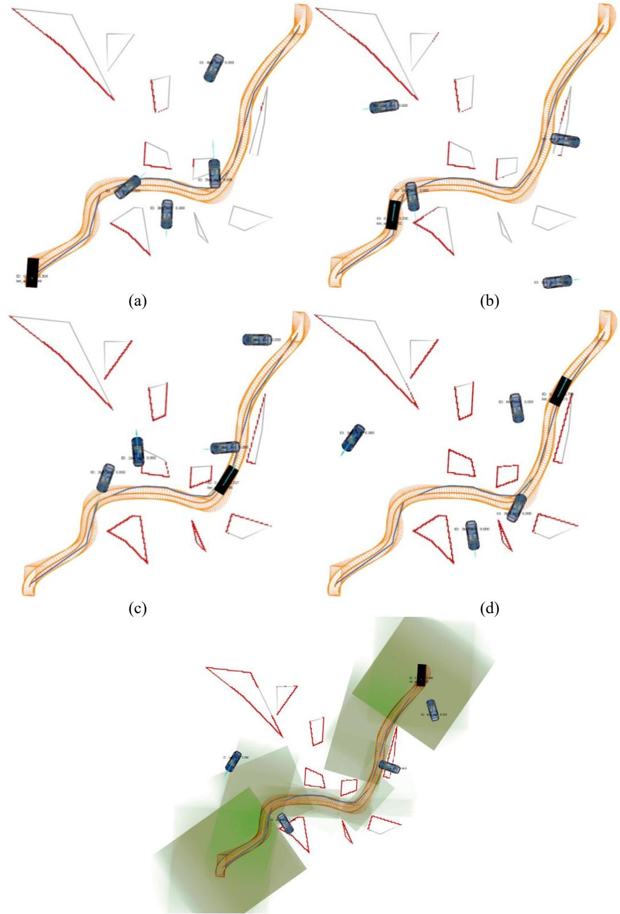  
(e)   
图5.5 非结构化道路场景仿真

图 5.6 为非结构化道路场景规划轨迹的速度、加速度、曲率和航向角曲线。可以观察到，速度和加速度随时间变化平滑，并且加速度的绝对值不超过 $3 \mathrm { m } / \mathrm { s } ^ { 2 }$ ，保障了纵向的舒适性。曲率和航向角曲线连续且平滑，表明轨迹在转向避让障碍物的同时，能够保障横向体感的舒适性。

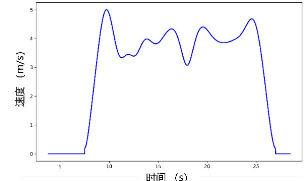

line

| 时间 (s) | 速度 (m/s) |
| -------- | ---------- |
| 5        | 0          |
| 10       | 5          |
| 15       | 4          |
| 20       | 4.5        |
| 25       | 4.8        |
| 27       | 0          |

（a)

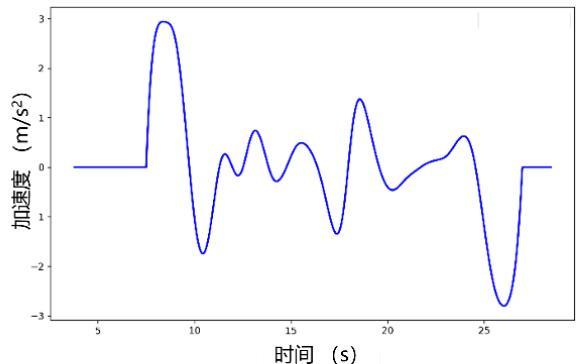

line

| 时间 (s) | 加速度 (m/s²) |
| -------- | ------------- |
| 5        | 0             |
| 7        | 0             |
| 9        | 3             |
| 10       | -2            |
| 12       | 0.5           |
| 14       | 0.8           |
| 16       | 0.3           |
| 18       | -1            |
| 20       | 1.5           |
| 22       | 0.2           |
| 24       | 0.6           |
| 26       | -3            |
| 28       | 0             |

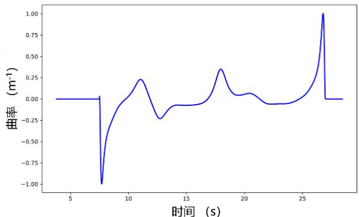

line

| 时间 (s) | 曲率 (m⁻¹) |
| -------- | ---------- |
| 5        | 0.00       |
| 7        | -1.00      |
| 10       | 0.25       |
| 12       | -0.25      |
| 15       | -0.10      |
| 18       | 0.35       |
| 20       | 0.05       |
| 22       | -0.05      |
| 25       | 0.10       |
| 27       | 1.00       |
| 28       | 0.00       |

（c）

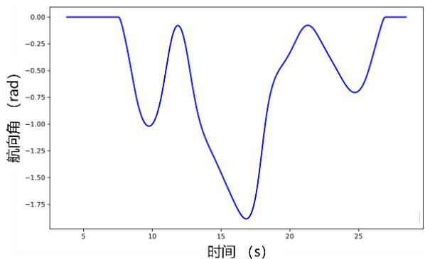

line

| 时间 (s) | 航向角 (rad) |
| -------- | ------------ |
| 0        | 0.00         |
| 5        | 0.00         |
| 10       | -1.00        |
| 15       | -1.75        |
| 20       | -0.50        |
| 25       | -0.75        |
| 30       | 0.00         |

图 5.6 非结构化道路规划轨迹的速度、加速度、曲率和航向角曲线

# 5.3.2 超车变道场景仿真验证

超车变道场景是自动驾驶应用领域的重点场景，需要在保证变道过程中横向体感的前提下，完成超车行为，本节构建了高速路的超车变道场景。图 5.7是超车变道场景下自车不断超越障碍物的过程，图中红色框内的黑色车辆为自车，其他车辆为直行的障碍物车辆，蓝色箭头表示车辆行驶方向。他车的行驶速度均为 10 m/s，自车从静止状态出发，不断加速超越多辆慢速车。

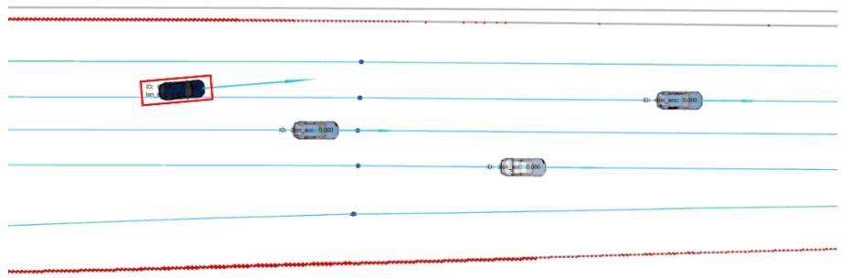

text_image

0.5 km
0.5 km 0.000
0.5 km 0.000

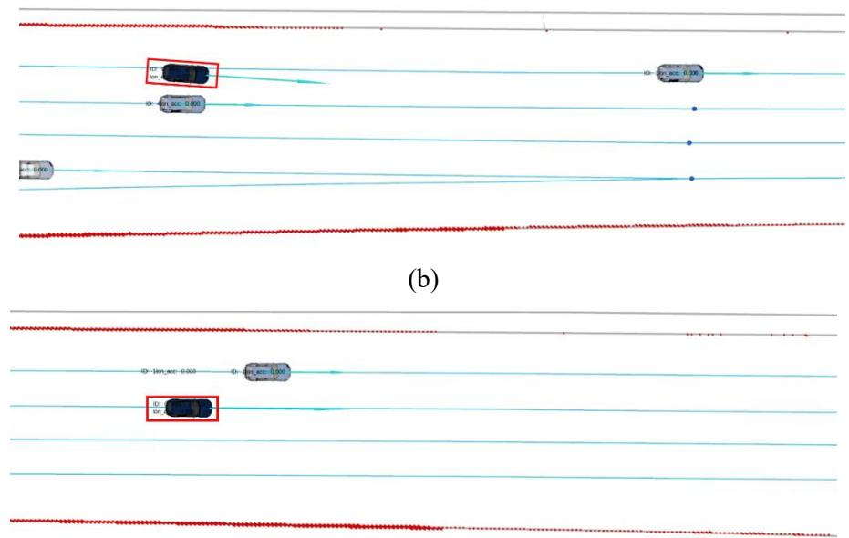

text_image

ID: 10m
ID: 25km/2.5km
ID: 30km/2.5km
ID: 40km/2.5km
(b)

(c)   
图5.7 超车变道仿真场景

图5.8为超车过程中的自车状态曲线，从速度与加速度曲线图中可以看出自车不断加速实现超车，并且加速度能够限制在 $2 \mathrm { m } / \mathrm { s } ^ { 2 }$ 以内，保证了纵向的平滑性与舒适性。同时车辆的曲率和航向角变化曲线比较丝滑，并且在小区间内进行波动，最大曲率约为$0 . 0 0 6 \mathrm { m } ^ { - 1 }$ 。综合以上，算法能够在保证横向的舒适性的前提下，较为丝滑地完成超车行为，符合预期。

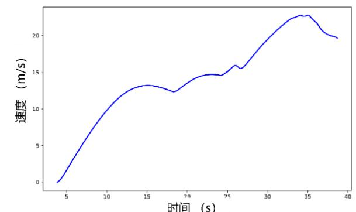

line

| 时间 (s) | 速度 (m/s) |
| -------- | ---------- |
| 5        | 0          |
| 10       | 8          |
| 15       | 13         |
| 20       | 12         |
| 25       | 14         |
| 30       | 16         |
| 35       | 22         |
| 40       | 20         |

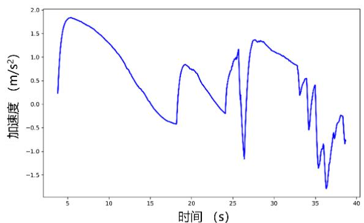

line

| 时间 (s) | 加速度 (m/s²) |
| -------- | ------------- |
| 5        | 0.2           |
| 10       | 1.8           |
| 15       | 0.8           |
| 20       | -0.5          |
| 25       | 1.2           |
| 30       | 1.4           |
| 35       | -1.0          |
| 40       | -0.8          |

（b)

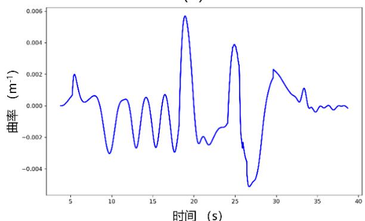

line

| 时间 (s) | 曲率 (m⁻¹) |
| -------- | ----------- |
| 5        | 0.000       |
| 10       | -0.003      |
| 15       | 0.001       |
| 20       | 0.006       |
| 25       | -0.002      |
| 30       | 0.002       |
| 35       | 0.000       |
| 40       | 0.000       |

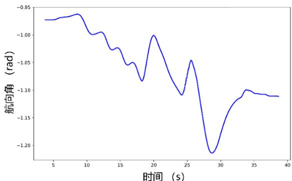

line

| 时间 (s) | 航向角 (rad) |
| -------- | ------------ |
| 5        | -0.97        |
| 10       | -0.98        |
| 15       | -1.03        |
| 20       | -1.00        |
| 25       | -1.05        |
| 30       | -1.20        |
| 35       | -1.10        |
| 40       | -1.10        |

图5.8 超车变道场景自车轨迹的速度、加速度、曲率和航向角曲线

# 5.3.3 窄路会车场景仿真验证

在真实世界中，会车场景是交互性较强的场景，当自车同车道前方出现低速车时，人类需要根据外部环境信息判断超车后回到原车道还是避让对向车，如果超车，自车需要较短时间窗口内超越同向车安全地避让对向车辆，如果避让，自车则应让对对向车先行通过后再超车。该场景的规划任务横纵向耦合严重，能有效地检验算法的性能。因此，本节构建了窄路会车场景，并设置了场景一和场景二，两种场景中存在同向与对向车，场景一中对向车与自车较近并且车速较快，场景二的对向车与自车较远，并且车速较低，我们希望算法能够在不同的会车场景下做出合理的窄路超车行为。

图 5.9 为窄路会车场景一的仿真图，图中红框内车辆为自车，蓝色框内是对向车辆。可以看出在对向车离自车较近且车速较高的前提下，自车能够先超过对向车，然后在进行换道行为超越同车道的慢速车辆。自车的表现合理，符合预期。

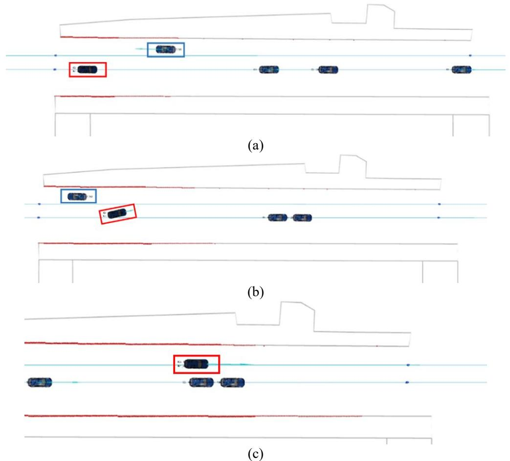

text_image

(a)
(b)
(c)

图5.9 窄路会车场景一仿真

图 5.10 为窄路会车场景一的车辆状态曲线，由速度与加速度曲线可知，自车迅速提速，并且加速过程非常丝滑，最大加速度不超过 $2 \mathrm { m } / \mathrm { s } ^ { 2 }$ 。超车过程中曲率与航向角的变化平顺，横向舒适性较好。

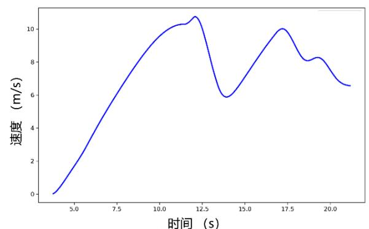

line

| 时间 (s) | 速度 (m/s) |
| -------- | ---------- |
| 0        | 0          |
| 5.0      | 2          |
| 7.5      | 6          |
| 10.0     | 9          |
| 12.5     | 10.5       |
| 15.0     | 6          |
| 17.5     | 10         |
| 20.0     | 8          |

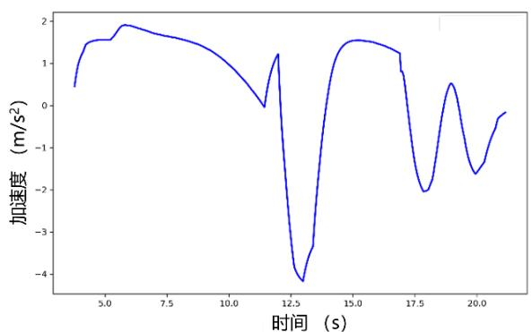

line

| 时间 (s) | 加速度 (m/s²) |
| -------- | ------------- |
| 5.0      | 1.5           |
| 6.0      | 1.8           |
| 7.0      | 1.6           |
| 8.0      | 1.4           |
| 9.0      | 1.2           |
| 10.0     | 0.8           |
| 11.0     | 0.2           |
| 12.0     | -4.0          |
| 13.0     | -3.5          |
| 14.0     | 1.5           |
| 15.0     | 1.6           |
| 16.0     | 1.4           |
| 17.0     | -2.0          |
| 18.0     | 0.5           |
| 19.0     | -1.5          |
| 20.0     | -0.5          |

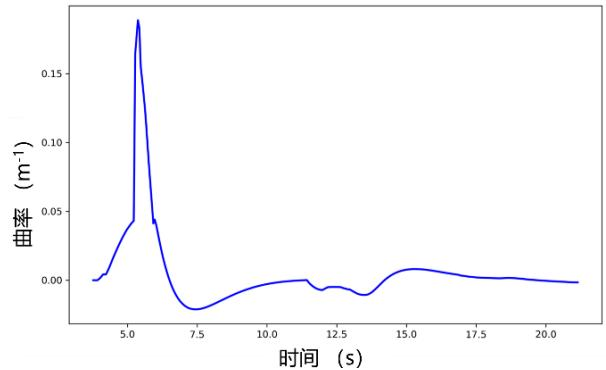

line

| 时间 (s) | 曲率 (m⁻¹) |
| -------- | ---------- |
| 4.0      | 0.00       |
| 5.0      | 0.04       |
| 6.0      | 0.18       |
| 7.0      | 0.02       |
| 8.0      | 0.00       |
| 9.0      | 0.01       |
| 10.0     | 0.01       |
| 11.0     | 0.01       |
| 12.0     | 0.00       |
| 13.0     | 0.01       |
| 14.0     | 0.01       |
| 15.0     | 0.01       |
| 16.0     | 0.01       |
| 17.0     | 0.01       |
| 18.0     | 0.01       |
| 19.0     | 0.01       |
| 20.0     | 0.01       |

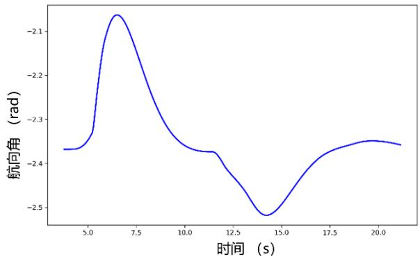

line

| 时间 (s) | 航向角 (rad) |
| -------- | ------------ |
| 5.0      | -2.38        |
| 6.0      | -2.10        |
| 7.0      | -2.20        |
| 8.0      | -2.30        |
| 9.0      | -2.38        |
| 10.0     | -2.40        |
| 11.0     | -2.42        |
| 12.0     | -2.45        |
| 13.0     | -2.50        |
| 14.0     | -2.48        |
| 15.0     | -2.45        |
| 16.0     | -2.40        |
| 17.0     | -2.38        |
| 18.0     | -2.36        |
| 19.0     | -2.35        |
| 20.0     | -2.36        |
| 21.0     | -2.37        |

图5.10 窄路会车场景一自车轨迹的速度、加速度、曲率和航向角曲线

图5.11为窄路会车场景二的仿真图，在蓝色框内的对向车较远且 TTC 较大的情况下，红色框内自车选择直接变道超越同车道的慢速车辆，而后迅速回到原车道避让对向车辆。

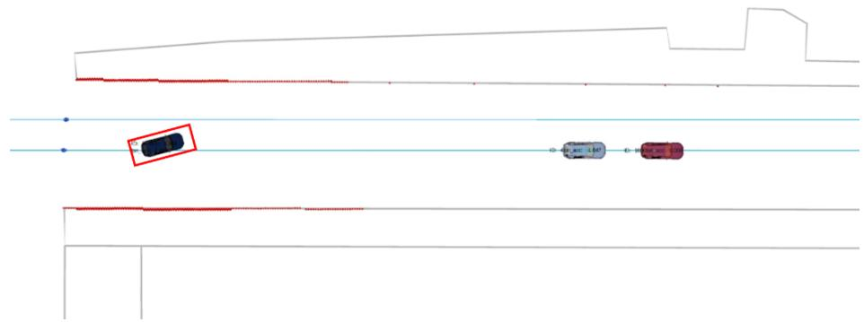

text_image

Diagram showing vehicle positions with red boxes highlighting specific positions, likely from a technical or engineering context.

(a)   
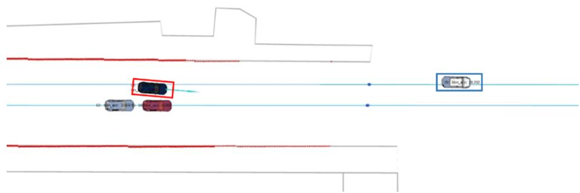

text_image

Diagram showing vehicle positions with red and blue lines, a highlighted car, and a box labeled 'Box 4' at 0.725.

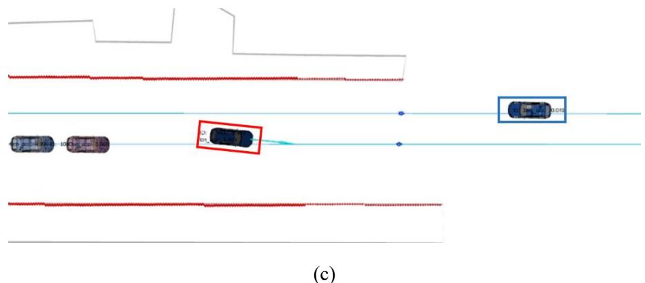

text_image

(c)

图 5.11 窄路会车场景二仿真

图 5.12 为窄路会车场景二自车轨迹的速度、加速度、曲率和航向角曲线，速度和加速度随时间变化连续且平滑。曲率和航向角曲线丝滑，能够保证横向体感前提下有效避让同向车与对向车。总结以上，算法能够在不同的环境条件下规划出合理的轨迹，并保证轨迹的舒适性与安全性。

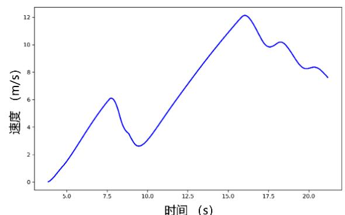

line

| 时间 (s) | 速度 (m/s) |
| -------- | ---------- |
| 5.0      | 0.0        |
| 7.5      | 6.0        |
| 10.0     | 2.5        |
| 12.5     | 7.0        |
| 15.0     | 12.0       |
| 17.5     | 10.0       |
| 20.0     | 8.0        |
| 22.5     | 7.5        |

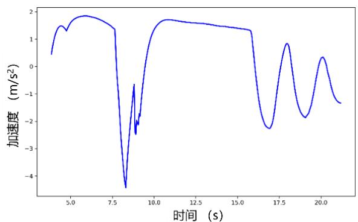

line

| 时间 (s) | 加速度 (m/s²) |
| -------- | ------------- |
| 5.0      | 1.5           |
| 6.0      | 1.8           |
| 7.0      | 1.6           |
| 7.5      | -4.5          |
| 8.0      | -2.5          |
| 9.0      | -1.0          |
| 10.0     | 1.8           |
| 11.0     | 1.7           |
| 12.0     | 1.6           |
| 13.0     | 1.5           |
| 14.0     | 1.4           |
| 15.0     | 1.3           |
| 16.0     | -2.5          |
| 17.0     | 0.8           |
| 18.0     | -2.0          |
| 19.0     | 0.5           |
| 20.0     | -1.5          |

（b)

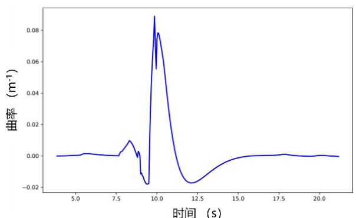

line

| 时间 (s) | 曲率 (m⁻¹) |
| -------- | ---------- |
| 5.0      | 0.00       |
| 7.5      | 0.00       |
| 10.0     | 0.085      |
| 12.5     | -0.015     |
| 15.0     | 0.00       |
| 17.5     | 0.00       |
| 20.0     | 0.00       |

（c）

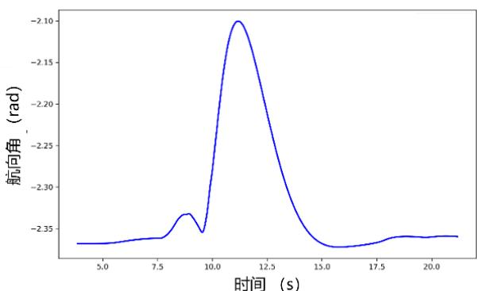

line

| 时间 (s) | 航向角 (rad) |
| -------- | ------------ |
| 5.0      | -2.35        |
| 7.5      | -2.34        |
| 10.0     | -2.35        |
| 12.5     | -2.10        |
| 15.0     | -2.35        |
| 17.5     | -2.34        |
| 20.0     | -2.34        |

（d）  
图5.12 窄路会车场景二自车轨迹的速度、加速度、曲率和航向角曲线

# 5.4 本章小结

本章节介绍了第二章轨迹预测和终点决策的模型验证以及第三章、第四章的时空联合搜索与规划算法的仿真验证过程。预测模型在 Argoverse数据集上训练与评测，多项评测指标均符合预期，终点决策模型验证结果表明其能够有效地生成合理的自车多模态终点。然后本章使用 ROS 搭建搜索算法和优化算法的联合仿真环境，针对多种自动驾驶场景，进行路径搜索和轨迹优化的仿真实验。结果表明，算法能够在复杂的交通环境下，有效地生成安全平滑的轨迹。本章的仿真测试结果能够反映出本文算法的优良性能与稳定性。

# 第6章 全文总结与展望

# 6.1 全文总结

围绕自动驾驶决策规划领域面临的问题，在前人研究的基础上，本文综合深度学习、图搜索算法、轨迹优化等方法，时空联合地求解决策规划问题，给出了一套完整的自动驾驶决策与轨迹规划解决方案。在决策方面，建立了基于注意力机制的轨迹预测和自车终点决策模型，并使用多目标时空联合搜索方法搜索出决策粗轨迹；在规划方面，引入了时空安全走廊、车辆微分平坦运动学模型、时空参数化轨迹，时空联合规划等求解规划问题，保证了求解的最优性与完备性。

(1) 提出了一种基于注意力机制的轨迹预测算法与自车终点决策方法。模型编码器分为局部编码和全局编码。基于注意力机制，局部编码在局部区域内生成时间与空间维度的深层交互特征，全局编码捕获局部区域间的关联。随后预测解码器接入编码特征，输出交通参与者的多模态预测轨迹。同时，设计了结合规则采样与神经网络的自车终点决策方案，通过采样与注意力机制生成采样终点及其概率分布，离线优化算法求解最优终点集并作为伪真值监督，然后通过在线终点生成网络将离线优化知识蒸馏迁移到在线模型，最后获得自车终点集合。  
(2) 研究了基于 A\*的多目标时空联合搜索方法，为自车终点生成对应安全完整的粗轨迹传给下游规划模块。以感知、预测结果为输入，构建考虑周围静态与动态障碍物的时空栅格地图，并避障约束映射到栅格地图上。然后改进 A\*算法，实现在三维栅格地图上的时空搜索过程，并且以自车终点集合为目标终点，进行多目标搜索。最后设计轨迹评价方法选出最优轨迹传给下游。此外，在算法实现过程中，使用了剪枝、聚类等等方法平衡了算法的精度与实时性。  
(3) 提出了一种基于微分平坦特性的时空联合轨迹规划方法。首先在搜索得到粗轨迹的基础上，构建了时空安全走廊，将避让障碍物问题重构为限制车辆在可行域内的问题。然后基于车辆的微分平坦运动学模型，求解最小化控制量轨迹，并将控制点位置与时间作为时空轨迹参数。随后提出了同时优化车辆横纵向状态的时空联合轨迹规划算法，详尽地描述了优化问题的目标函数与各项约束，并进行相应的链式求导推导梯度，将问题转化为无约束优化问题，并使用 LBFGS 优化器求解。最后设计轨迹规划

算法的仿真测试工具，进行算法的调参，也验证了算法的有效性。

(4) 最后系统性地进行了仿真与实验验证，主要分为预测与决策模型训练验证以及搜索与优化算法的仿真验证两部分。轨迹预测模型在 Argoverse数据集上的测试结果表明模型具备良好的预测性能。终点决策模型的实验结果证明了其能有效预测自车终点未来分布，并且消融实验表明其在安全性与多样性方面具备优势。另外，本文基于ROS1 搭建了时空联合搜索与轨迹规划算法的联合仿真平台，并设计了非结构化道路场景、超车变道场景与会车场景验证算法的能力。结果表明，本文提出的算法能够在多种典型自动驾驶场景中生成安全合理平滑的轨迹，充分证明了该算法的优越性和稳健性。

# 6.2 研究展望

本文提出了的自动驾驶车辆时空联合的决策规划算法方案，在如下方面仍需进一步研究：

(1) 本文以模块化的思路对交通参与者轨迹预测、自车决策算法、轨迹搜索与规划算法进行相对独立的建模，预测决策模型中的交互特征信息无法供下游使用，在后续工作中，需要进一步减少原始信息的有损传递，以端到端的框架设计整个决策规划系统，提高算法的上限。  
(2) 本文使用开源数据集和自建仿真场景进行了算法验证与分析。在后续工作中，可以将整套决策规划算法进行系统性的闭环仿真验证，并探究算法在实车平台的工程化部署方案，评估算法在真实世界中的表现。

# 参考文献

[1] 国 家 发 展 和 改 革 委 员 会 . 智 能 汽 车 创 新 发 展 战 略 [Z].2020.https://www.ndrc.gov.cn/xwdt/tzgg/202002/P020200812309778314842.pdf.  
[2] 麦肯锡. 麦肯锡未来出行报告 [Z]. 2023.https://roll.sohu.com/a/734891929\_121123925.   
[3] 李雅琪. 从 Waymo 最大单笔融资看当前全球自动驾驶产业发展 [J]. 智能网联汽车, 2024, (06):6-7.  
[4] 《中国公路学报》编辑部. 中国汽车工程学术研究综述·2023 [J]. 中国公路学报, 2023, 36(11):1-192.  
[5] González D, Pérez J, Milanés V, et al. A Review of Motion Planning Techniques for Automated Vehicles [J]. IEEE Trans Intell Transp Syst, 2016, 17(4): 1135-1145.   
[6] 朱冰, 贾士政, 赵健, 等. 自动驾驶车辆决策与规划研究综述 [J]. 中国公路学报, 2024, 37(01):215-240.  
[7] 百度. 百度自动驾驶开放平台 [Z].https://apollo.baidu.com/docs/apollo/latest/index.html.  
[8] Hu Y H, Yang J Z, Chen L, et al. Planning-oriented Autonomous Driving [C]. IEEE/CVF Conference on Computer Vision and Pattern Recognition (CVPR), 2023: 17853-17862.   
[9] 李升波, 刘畅, 殷玉明, 等. 汽车端到端自动驾驶系统的关键技术与发展趋势 [J]. 人工智能,2023, (05): 1-16.  
[10] Bojarski M, Del Testa D, Dworakowski D, et al. End to end learning for self-driving cars [J]. arXiv preprint arXiv:160407316, 2016.   
[11] Kendall A, Hawke J, Janz D, et al. Learning to Drive in a Day [C]. IEEE International Conference on Robotics and Automation (ICRA), 2019: 8248-8254.   
[12] 褚端峰, 王如康, 王竞一, 等. 端到端自动驾驶的研究进展及挑战 [J]. 中国公路学报, 2024,37(10): 209-232.  
[13] 李雪松, 张锲石, 宋呈群, 等. 自动驾驶场景下的轨迹预测技术综述 [J]. 计算机工程, 2023,49(05): 1-11.  
[14] Huang Y J, Du J T, Yang Z R, et al. A Survey on Trajectory-Prediction Methods for Autonomous Driving [J]. IEEE T Intell Veh, 2022, 7(3): 652-674.   
[15] 宋东鉴. 基于交通态势认知的智能汽车类人决策规划策略研究 [D]. 吉林大学, 2024.  
[16] Ammoun S, Nashashibi F. Real time trajectory prediction for collision risk estimation between vehicles [C]. IEEE 5th International Conference on Intelligent Computer Communication and Processing, 2009: 417-+.   
[17] Lytrivis P, Thomaidis G, Amditis A, et al. Cooperative Path Prediction in Vehicular Environments [C]. 11th IEEE International Conference on Intelligent Transportation Systems (ITSC 2008), 2008: 803- 808.   
[18] Batz T, Watson K, Beyerer J, et al. Recognition of dangerous situations within a cooperative group of vehicles [C]. IEEE Intelligent Vehicles Symposium, 2009: 907-912.   
[19] Lefkopoulos V, Menner M, Domahidi A, et al. Interaction-Aware Motion Prediction for Autonomous Driving: A Multiple Model Kalman Filtering Scheme [J]. IEEE Robot Autom Lett, 2021, 6(1): 80-87.   
[20] Weidl G, Madsen A L, Kasper D, et al. Optimizing Bayesian Networks for Recognition of Driving Maneuvers to Meet the Automotive Requirements [C]. IEEE International Symposium on Intelligent Control (ISIC), 2014: 1626-1631.

[21] Murphy K P. Dynamic Bayesian networks: Representation, inference and learning [M]. University of California, Berkeley, 2002.   
[22] Sutskever I, Vinyals O, Le Q. Sequence to Sequence Learning with Neural Networks [C]. 28th Conference on Neural Information Processing Systems (NIPS), 2014, 27: 3104–3112.   
[23] Altché F, de La Fortelle A, Ieee. An LSTM Network for Highway Trajectory Prediction [C]. 20th IEEE International Conference on Intelligent Transportation Systems (ITSC), 2017.   
[24] Ding W C, Shen S J, Ieee. Online Vehicle Trajectory Prediction using Policy Anticipation Network and Optimization-based Context Reasoning [C]. IEEE International Conference on Robotics and Automation (ICRA), 2019: 9610-9616.   
[25] Park S, Kim B, Kang C M, et al. Sequence-to-Sequence Prediction of Vehicle Trajectory via LSTM Encoder-Decoder Architecture [J]. 2018 IEEE Intelligent Vehicles Symposium (IV), 2018: 1672-1678.   
[26] Mercat J, Gilles T, El Zoghby N, et al. Multi-Head Attention for Multi-Modal Joint Vehicle Motion Forecasting [C]. IEEE International Conference on Robotics and Automation (ICRA), 2020: 9638- 9644.   
[27] Zhang T, Song W J, Fu M Y, et al. Vehicle Motion Prediction at Intersections Based on the Turning Intention and Prior Trajectories Model [J]. IEEE-CAA J Automatica Sin, 2021, 8(10): 1657-1666.   
[28] Nikhil N, Morris B T. Convolutional Neural Network for Trajectory Prediction [C]. 15th European Conference on Computer Vision (ECCV), 2018, 11131: 186-196.   
[29] Tung P M, Grigore E C, Boulton F A, et al. CoverNet: Multimodal Behavior Prediction using Trajectory Sets [C]. IEEE/CVF Conference on Computer Vision and Pattern Recognition (CVPR), 2020: 14062-14071.   
[30] Cui H, Nguyen T, Chou F-C, et al. Deep Kinematic Models for Kinematically Feasible Vehicle Trajectory Predictions [J]. 2020 IEEE International Conference on Robotics and Automation (ICRA), 2019: 10563-10569.   
[31] Deo N, Trivedi M M, Ieee. Convolutional Social Pooling for Vehicle Trajectory Prediction [C]. IEEE/CVF Conference on Computer Vision and Pattern Recognition (CVPR), 2018: 1549-1557.   
[32] Alahi A, Goel K, Ramanathan V, et al. Social LSTM: Human Trajectory Prediction in Crowded Spaces [C]. 2016 IEEE Conference on Computer Vision and Pattern Recognition (CVPR), 2016: 961-971.   
[33] 吴慈航, 闫建国, 程龙, 等. 基于多头卷积长短期记忆网络的锥套轨迹预测 [J]. 西北工业大学学报, 2022, 40(03): 628-635.  
[34] Vaswani A, Shazeer N, Parmar N, et al. Attention Is All You Need [C]. 31st Annual Conference on Neural Information Processing Systems (NIPS), 2017, 30.   
[35] Giuliari F, Hasan I, Cristani M, et al. Transformer Networks for Trajectory Forecasting [C]. 25th International Conference on Pattern Recognition (ICPR), 2021: 10335-10342.   
[36] Huang Z Y, Mo X Y, Lv C, et al. Multi-modal Motion Prediction with Transformer-based Neural Network for Autonomous Driving [C]. IEEE International Conference on Robotics and Automation (ICRA), 2022: 2605-2611.   
[37] Liu Y C, Zhang J H, Fang L J, et al. Multimodal Motion Prediction with Stacked Transformers [C]. IEEE/CVF Conference on Computer Vision and Pattern Recognition (CVPR), 2021: 7573-7582.   
[38] 连静, 李硕贤, 刘一荻, 等. 基于车道目标引导的车辆轨迹预测 [J]. 汽车工程, 2023, 45(08):1353-1361.  
[39] 关鑫, 史佳敏, 陈仕韬, 等. 自动驾驶安全挑战：行为决策与运动规划 [J]. 模式识别与人工智能, 2023, 36(03): 191-210.

[40] 金立生, 韩广德, 谢宪毅, 等. 基于强化学习的自动驾驶决策研究综述 [J]. 汽车工程, 2023,45(04): 527-540.  
[41] Xu X, Zuo L, Li X, et al. A Reinforcement Learning Approach to Autonomous Decision Making of Intelligent Vehicles on Highways [J]. IEEE Trans Syst Man Cybern -Syst, 2020, 50(10): 3884-3897.   
[42] Chu H Q, Guo L L, Yan Y J, et al. Self-Learning Optimal Cruise Control Based on Individual Car-Following Style [J]. IEEE Trans Intell Transp Syst, 2021, 22(10): 6622-6633.   
[43] 胡宏宇, 程铭, 鲁子洋, 等. 考虑自车-他车驾驶风格的匝道汇入决策模型 [J]. 吉林大学学报(工学版): 1-12.  
[44] Brechtel S. Dynamic Decision-making in Continuous Partially Observable Domains: A Novel Method and its Application for Autonomous Driving [D], 2015.   
[45] Bai H Y, Cai S J, Ye N, et al. Intention-Aware Online POMDP Planning for Autonomous Driving in a Crowd [C]. IEEE International Conference on Robotics and Automation (ICRA), 2015: 454-460.   
[46] 闫宇奇. 自主代客泊车系统路径生成与优化研究 [D]. 吉林大学, 2024.  
[47] 陈国胜. 面向自动驾驶多工况下的轨迹生成与优化 [D]. 吉林大学, 2022.  
[48] Dijkstra E W. A note on two problems in connexion with graphs [J]. Numerische Mathematik, 1959, 1(1): 269-271.   
[49] Hart P E, Nilsson N J, Raphael B. A Formal Basis for the Heuristic Determination of Minimum Cost Paths [J]. IEEE Transactions on Systems Science and Cybernetics, 1968, 4(2): 100-107.   
[50] Dolgov D A. Practical Search Techniques in Path Planning for Autonomous Driving [C]. 2008.   
[51] Qin Z B, Chen X, Hu M J, et al. A novel path planning methodology for automated valet parking based on directional graph search and geometry curve [J]. Robot Auton Syst, 2020, 132: 12.   
[52] 李柏, 张友民, 邵之江. 自动驾驶车辆运动规划方法综述 [J]. 控制与信息技术, 2018, (06): 1-6.  
[53] Kavraki L E, Svestka P, Latombe J C, et al. Probabilistic roadmaps for path planning in highdimensional configuration spaces [J]. IEEE Transactions on Robotics and Automation, 1996, 12(4): 566-580.   
[54] LaValle S M. Rapidly-exploring random trees : a new tool for path planning [J]. The annual research report, 1998.   
[55] Karaman S, Frazzoli E. Incremental Sampling-based Algorithms for Optimal Motion Planning [J]. ArXiv, 2010, abs/1005.0416.   
[56] Ziegler J, Bender P, Dang T, et al. Trajectory Planning for BERTHA - a Local, Continuous Method [C]. IEEE Intelligent Vehicles Symposium (IV), 2014: 450-457.   
[57] Fan H, Zhu F, Liu C, et al. Baidu Apollo EM Motion Planner [J]. ArXiv, 2018, abs/1807.08048.   
[58] Werling M, Ziegler J, Kammel S, et al. Optimal Trajectory Generation for Dynamic Street Scenarios in a Frenet Frame [C]. IEEE International Conference on Robotics and Automation (ICRA), 2010: 987-993.   
[59] Howell T A, Jackson B E, Manchester Z. ALTRO: A Fast Solver for Constrained Trajectory Optimization [C]. 2019 IEEE/RSJ International Conference on Intelligent Robots and Systems (IROS), 2019: 7674-7679.   
[60] Chen J Y, Zhan W, Tomizuka M, et al. Constrained Iterative LQR for On-Road Autonomous Driving Motion Planning [C]. 20th IEEE International Conference on Intelligent Transportation Systems (ITSC), 2017.   
[61] Han Z C, Wu Y W, Li T, et al. An Efficient Spatial-Temporal Trajectory Planner for Autonomous Vehicles in Unstructured Environments [J]. IEEE Trans Intell Transp Syst, 2024, 25(2): 1797-1814.

[62] Zhang Y, Sun H, Chai R, et al. Optimal Vehicle Trajectory Planning for Static Obstacle Avoidance using Nonlinear Optimization [J]. ArXiv, 2023, abs/2307.09466.   
[63] 于越. 基于时空联合规划的无人车轨迹规划算法研究 [D]. 吉林大学, 2024.  
[64] Hubmann C, Aeberhard M, Stiller C, et al. A Generic Driving Strategy for Urban Environments [C]. 19th IEEE International Conference on Intelligent Transportation Systems (ITSC), 2016: 1010-1016.   
[65] Xin L, Kong Y, Li S, et al. Enable faster and smoother spatio-temporal trajectory planning for autonomous vehicles in constrained dynamic environment [J]. Proceedings of the Institution of Mechanical Engineers, Part D: Journal of Automobile Engineering, 2020, 235: 095440702090662.   
[66] Ziegler J, Stiller C. Spatiotemporal state lattices for fast trajectory planning in dynamic on-road driving scenarios [C]. 2009 IEEE/RSJ International Conference on Intelligent Robots and Systems, 2009: 1879-1884.   
[67] Zhang X, Wang B Y, Lu Y M, et al. A Hierarchical Multi-Vehicle Coordinated Motion Planning Method Based on Interactive Spatio-Temporal Corridors [J]. IEEE T Intell Veh, 2024, 9(1): 2675-2687.   
[68] 胡杰, 张志豪, 陈瑞楠, 等. 基于改进混合 A\*的智能汽车时空联合规划方法 [J]. 汽车工程,2023, 45(07): 1123-1133.  
[69] Biswas S, Casas S, Sykora Q, et al. QuAD: Query-based Interpretable Neural Motion Planning for Autonomous Driving [J]. 2024 IEEE International Conference on Robotics and Automation (ICRA), 2024: 14236-14243.   
[70] Zhang C, Tu J, Zhang L, et al. Learning Realistic Traffic Agents in Closed-loop [C]. 7th Conference on Robot Learning (CoRL), 2023, 229.   
[71] Yang B, Su H, Gkanatsios N, et al. Diffusion-ES: Gradient-free Planning with Diffusion for Autonomous Driving and Zero-Shot Instruction Following [J]. ArXiv, 2024, abs/2402.06559.   
[72] Zheng W, Song R, Guo X, et al. GenAD: Generative End-to-End Autonomous Driving [C]. European Conference on Computer Vision, 2024.   
[73] Nayakanti N, Al-Rfou R, Zhou A, et al. Wayformer: Motion Forecasting via Simple & Efficient Attention Networks [C]. IEEE International Conference on Robotics and Automation (ICRA), 2023: 2980-2987.   
[74] Gu J R, Sun C, Zhao H, et al. DenseTNT: End-to-end Trajectory Prediction from Dense Goal Sets [C]. 18th IEEE/CVF International Conference on Computer Vision (ICCV), 2021: 15283-15292.   
[75] 忻隆. 自动驾驶汽车拟人化决策系统的关键技术研究 [D]. 清华大学, 2019.  
[76] Ding W C, Zhang L, Chen J, et al. Safe Trajectory Generation for Complex Urban Environments Using Spatio-Temporal Semantic Corridor [J]. IEEE Robot Autom Lett, 2019, 4(3): 2997-3004.   
[77] Liu S, Watterson M, Mohta K, et al. Planning Dynamically Feasible Trajectories for Quadrotors Using Safe Flight Corridors in 3-D Complex Environments [J]. IEEE Robot Autom Lett, 2017, 2(3): 1688- 1695.   
[78] Fliess M, Levine J, Martin P, et al. FLATNESS AND DEFECT OF NONLINEAR-SYSTEMS - INTRODUCTORY THEORY AND EXAMPLES [J]. Int J Control, 1995, 61(6): 1327-1361.   
[79] 汪哲培. 多旋翼无人机运动规划的几何方法 [D]. 浙江大学, 2022.  
[80] Jorge Nocedal S J W. Numerical optimization [M]. Springer New York, NY, 2006.