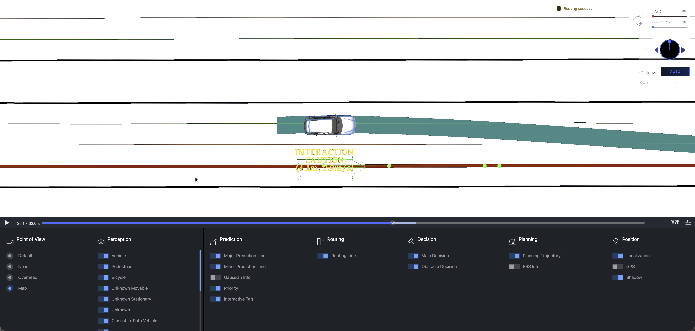
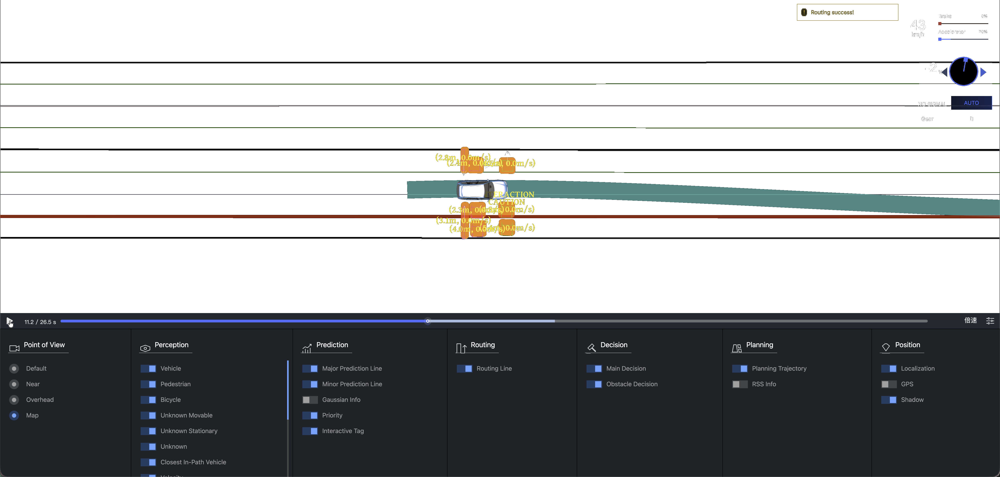
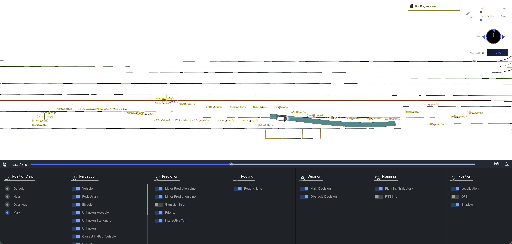

<h1 align="center">动态多障碍交通中面向路径—速度规划的交互感知约束接口</h1>

> 中文校对稿，仅用于作者核对技术含义、术语、数字、图注和声明，不作为期刊投稿文件。

**作者：** JiaWang Liao，YuFei Hu，ChaoYang Shi，ChengJiao Sun（通讯作者） 
**单位：** 湖北文理学院计算机工程学院，湖北省襄阳市隆中路296号，邮政编码 441053 
**通讯邮箱：** jiao1952@126.com

# 摘要

在双阶段路径—速度规划中，无时间意识的障碍物边界与局部通行侧选择会排除本可通行的通道，并在密集交通中造成不必要的停车。本文提出约束生成方法 MIKU，依据估计到达时间构造横向通行带，在道路站位上选择带序列，并将安全通行时间窗映射为既有路径二次规划与速度二次规划的边界。对于固定截面区间模型，最宽横向带可通过排序并扫描障碍物区间在 $O(k\log k)$ 时间内得到。在覆盖七类交通场景的 3,500 组配对结构化道路仿真中，相对内部无时间意识且固定侧向的基线，MIKU 将无碰撞到达目标率从 62.69% 提高至 77.46%，配对差值为 14.77 个百分点，95% 置信区间为 13.54--15.97。在另外 700 组滚动重规划仿真中，成功率从 62.29% 提高至 72.29%。在配对基准中，完整规划调用时延的中位数为 9.98 ms，第 99 百分位为 221.80 ms。上述结果表明，在所测仿真条件下，交互感知约束选择能够改进路径—速度规划。

**关键词：** 自动驾驶；路径—速度分解；时空同伦；动态障碍物；运动规划

# 引言 {#zh:sec:introduction}

在城市混合交通的自动驾驶中，基于路径—速度分解的规划器经常输出不必要的兜底停车，因为时间不敏感的路径边界与逐障碍物的侧向选择在任一求解器运行之前就已丢弃了交互时序信息。本文提出 MIKU，为双阶段二次规划架构构建约束重构框架，并在 4,000 个确定性区间实例和 3,500 个配对仿真场景上展开全面评估；通过无碰撞到达率、行车进度比、加加速度均方根、规划时延分位数以及降级停车率，直接反映运动规划中安全性、通行效率、乘坐舒适性与实时计算之间的多目标耦合权衡 (González et al. 2016; Paden et al. 2016; Schwarting et al. 2018)。

具体而言，路径—速度分解在 Frenet 站位—横向坐标 $s, l$ 中生成横向路径，在站位—时间坐标 $s, t$ 中优化纵向速度 (Kant and Zucker 1986; Werling et al. 2010; Zhou et al. 2021)。工业实现通常求解两个结构化凸二次规划，并通过空间路径边界与时间 ST 边界向求解器暴露环境约束 (Fan et al. 2018; Zhang et al. 2020; Wang et al. 2022)。在密集动态场景中，这种分解会丢失两类关键信息：由当前时刻快照或整个预测时域并集构成的路径边界，无法区分某区域是当前被占用还是在自车到达时已经空闲；逐障碍物做出的不可逆侧向选择，可能以互不兼容的方式抬高路径下界并压低路径上界，即使联合选择后仍存在可通行的通道。

联合时空搜索、混合整数优化与时空走廊方法可以同时协调空间与时间决策 (McNaughton et al. 2011; Kessler et al. 2023; Yoon et al. 2024)，但通常会显著扩展状态空间或改变优化命题结构，难以直接兼容实际生产部署中的双二次规划架构。因此，现有工业级路径—速度分解架构面临三项关键局限：首先，时间不敏感的路径边界合并了整个预测时域内的占用，在横向优化求解前丢失了自车到达时刻条件下的通行净空；其次，贪心且不可逆的逐障碍物侧向决策无法捕捉群组级的连续通道，导致即便联合选择后仍存在可行走廊，路径下界与上界仍会相互穿越并错误触发阻塞；最后，现有的跨阶段协调机制若不改变下游凸优化求解器结构，就难以有效传递时空同伦决策。如图 [1](#zh:fig:teaser){reference-type="ref" reference="zh:fig:teaser"} 所示，MIKU 直接在约束接口层面解决上述挑战：构建随时间变化的横向通行带，选择空间与时间同伦类别，并将其直接映射为两个下游二次规划原生支持的线性盒约束。

{#zh:fig:teaser width="\textwidth"}

本文的主要贡献如下：

1.  **到达时间相关的空间投影机制：** 提出依据自车预估到达时间的时变投影方法，将障碍物时空占用映射为中心线坐标系下的路径边界，解决无时间意识边界合并整个预测时域占用的问题，确保路径规划阶段仅感知自车实际穿越各纵向站位时真实存在的障碍物。
2.  **群组级连续横向划分与快速扫描算法：** 在连续划分引理与最大间隙定理的理论支撑下，在固定截面区间模型中将 $k$ 个障碍物的指数级 $2^k$ 侧向分配组合降维至严格的 $O(k\log k)$ 扫描，并在 4,000 个确定性实例上对照穷举搜索完成精确性验证，有效解决贪心逐障碍物分配导致边界对顶穿越与通道人为阻断的问题。
3.  **分层时间同伦图与保 QP 接口约束传递：** 通过不确定性扩展占用管、安全通行时间窗与分层时间同伦图将空间决策连贯传递至纵向速度规划，将时序协调条件统一表达为下游 QP 原生支持的线性 ST 盒约束，完整保留下游二次规划的目标函数、运动学约束、凸性与稀疏结构，解决跨阶段协调破坏求解器结构的问题。
4.  **系统化的实证基准与量产架构集成验证：** 在 3,500 个配对仿真场景上开展严谨的统计评估与组件消融实验，在独立的 700 场景闭环滚动重规划中验证控制稳定性，并在业界广泛使用的 Apollo 11.0 自动驾驶系统上完成端到端接口集成与验证。

第 [2](#zh:sec:related_work){reference-type="ref" reference="zh:sec:related_work"} 节将约束接口方法置于联合规划器和分解式规划器之间进行定位。第 [3](#zh:sec:problem){reference-type="ref" reference="zh:sec:problem"} 节定义路径—速度分解接口及其两种失效机制。第 [4](#zh:sec:method){reference-type="ref" reference="zh:sec:method"} 节介绍 MIKU，第 [5](#zh:sec:experimental_design){reference-type="ref" reference="zh:sec:experimental_design"} 节和第 [6](#zh:sec:results){reference-type="ref" reference="zh:sec:results"} 节说明评估设计与结果，第 [7](#zh:sec:discussion){reference-type="ref" reference="zh:sec:discussion"}--[9](#zh:sec:conclusion){reference-type="ref" reference="zh:sec:conclusion"} 节讨论工程含义、局限和结论。

# 相关工作 {#zh:sec:related_work}

## 联合时空规划

联合规划器通过搜索或优化扩展状态保留几何和时间耦合。共形时空格栅直接协调位置、速度和时间
(McNaughton et al. 2011)。瞬时分析方法以及 SLT
形式化方法也在密集交通中联合处理横向和纵向决策 (Yang and Li 2021; Hu et
al. 2023, 2025; Qiao
2025)。混合整数形式化则可以用离散变量编码障碍物侧向选择 (Kessler et al.
2023)。这些方法具有较强的协调能力，但其扩大的搜索空间、整数决策或非线性规划结构，与许多
两阶段 PVD 规划架构使用的两个串联凸 QP
存在结构差异。因此，本文后续使用的有限网格联合搜索只作为计算参考，不将其声称为连续问题的最优解。

## 分解式与迭代式协调

PVD 规划器先优化路径，再优化速度轮廓，从而获得计算可处理性 (Kant and
Zucker 1986; Werling et al.
2010)。凸平滑和分段加加速度优化使这种结构适用于面向生产的软件 (Fan et
al. 2018; Zhou et al. 2021; Zhang et al.
2020)。时间优化、迭代锚定、候选配对和风险感知协调能够在两个阶段之间回传信息
(C. Liu et al. 2017; Chen et al. 2019; Zhang et al. 2024; Han et al.
2026; Liu et al.
2024)。但它们的有效性取决于每个阶段暴露了哪些信息。反复更新到达时间，无法恢复已经被不可逆局部侧向决策丢弃的横向类别。

安全走廊方法在连续优化之前显式给出可行域。空间飞行走廊展示了凸集如何连接离散搜索和轨迹优化
(S. Liu et al. 2017)，近期自动驾驶研究又将这一思想扩展到时空换道走廊或
Frenet 走廊 (Yoon et al. 2024; Tariq et al. 2025)。MIKU
同样强调显式可行域，但关注更窄的接口问题，即如何在不替换路径 QP 和速度
QP 的情况下，生成相互一致的 SL 边界与 ST 边界。

## 交互预测与安全裕度

预测感知规划能够处理静态障碍物轮廓无法表达的行人和车辆交互 (Yang et al.
2023; Jeong and Yi
2021)。这类预测仍然存在不确定性，因此规划器需要区分用于估计到达时刻的名义状态和用于碰撞检查的占用集合。MIKU
使用前者查询并排序候选方案，同时用有界的位置误差和速度误差扩展后者。进一步的威胁相关附加裕度按照碰撞紧迫性、横向重叠、相对运动、目标类型和局部密度分配有限的横向空间，其中碰撞时间仅作为一个归一化紧迫性因子
(Minderhoud and Bovy 2001)。

表 [\[zh:tab:method_classes\]](#zh:tab:method_classes){reference-type="ref"
reference="zh:tab:method_classes"}
从求解器层面总结了这些差异。已有方法在各自假设下都具有价值，但仍缺少一种
两阶段 PVD 规划架构，能够在保留下游 QP
的同时，联合协调依赖时间的投影、群组级侧向选择以及速度阶段的时序约束。

| 方法族 | 时空协调方式 | 对求解器的影响 | 本文所处理的接口缺口 |
|---|---|---|---|
| 无时间意识的 PVD | 先路径后速度 | 两个结构化 QP | 丢失依赖到达时刻的占用信息和群组选择 |
| 迭代式 PVD | 反复更新路径与速度 | 多次调用求解器 | 仅靠时序无法恢复已丢弃的横向类别 |
| 联合格栅或混合整数规划 | 耦合状态或离散变量 | 扩大搜索或更换优化器 | 不保留原有的双 QP 接口 |
| 安全走廊规划 | 优化前构造凸可行集 | 走廊生成器加连续求解器 | 往往只关注选定走廊，而非耦合的空间和时间类别 |
| MIKU | 将空间和时间同伦映射为边界 | 保留两个下游 QP | 处理到达时序、群组决策和跨阶段约束传递 |

# 问题形式化 {#zh:sec:problem}

考虑自动驾驶车辆在规划时域 $T_{\mathrm{pred}}$ 内沿包含 $k(t)$ 个静态与动态障碍物的道路行驶。在给定自车运动状态与障碍物运动预测的前提下，本文旨在为两阶段路径—速度优化构建空间与时间约束接口 $(\mathcal{B}_l,\mathcal{B}_s)$，且无需改动下游凸二次规划求解器的命题结构。依据自动驾驶运动规划的分层设计范式，本文聚焦于行为决策与轨迹规划层；底层运动控制算法负责轨迹跟踪，系统层面的通信延迟与执行机构动态迟滞与上层轨迹规划解耦。

## 路径—速度解耦接口

我们在相对于道路参考线建立的 Frenet 坐标系中对自动驾驶车辆运动规划进行建模。在该坐标系中，纵向坐标 $s$ 表示沿道路参考线的弧长里程，用于表征车辆的纵向行驶距离；横向坐标 $l$ 表示垂直于参考线的带符号法向偏移，用于表征横向位置。

在经典的两阶段路径—速度解耦规划框架下，完整的时空运动规划被解耦为两个前后串联的子任务：
首先在空间域中求解横向路径函数 $l(s)$，用于确定车辆在各纵向站位处的横向避障位移；
随后在时域中求解纵向轨迹函数 $s(t)$，用于规划车辆在时域 $t \in [0, T_{\mathrm{pred}}]$ 内的纵向位置、速度与加速度时间剖面。

为满足实时数值优化的计算要求，上述连续曲线分别在离散空间采样点 $s_j$（其中 $j=0,\dots,K$）与离散时间步长 $t_r$（其中 $r=0,\dots,N$）处进行离散化。令离散空间路径状态向量为 $\mathbf{x}_p=(l_j,l'_j,l''_j)_{j=0}^{K}$，其中一阶导数 $l'_j = \mathrm{d}l/\mathrm{d}s$ 与二阶导数 $l''_j = \mathrm{d}^2l/\mathrm{d}s^2$ 分别对应横向航向角偏差与曲率变化率；令离散纵向轨迹状态向量为 $\mathbf{x}_v=(s_r,v_r,a_r)_{r=0}^{N}$，其中 $v_r = \dot{s}(t_r)$ 与 $a_r = \ddot{s}(t_r)$ 分别对应纵向速度与纵向加速度。两个规划阶段依次通过凸二次规划求解：
$$\begin{align}
 \mathbf{x}_p^*={}&\arg\min_{\mathbf{x}_p}
 \frac{1}{2}\mathbf{x}_p^{\mathsf T}H_p\mathbf{x}_p+q_p^{\mathsf T}\mathbf{x}_p,\\[-2pt]
 &\quad\text{s.t. }A_p\mathbf{x}_p=b_p,\quad l_j^-\leq l_j\leq l_j^+, \label{zh:eq:path_qp}\\
 \mathbf{x}_v^*={}&\arg\min_{\mathbf{x}_v}
 \frac{1}{2}\mathbf{x}_v^{\mathsf T}H_v\mathbf{x}_v+q_v^{\mathsf T}\mathbf{x}_v,\\[-2pt]
 &\quad\text{s.t. }A_v\mathbf{x}_v=b_v,\quad s_r^{lb}\leq s_r\leq s_r^{ub},\\[-2pt]
 &\qquad 0\leq v_r\leq v_{\max},\quad a_{\min}\leq a_r\leq a_{\max}. \label{zh:eq:speed_qp}
\end{align}$$ 
式中 $H_p$ 与 $H_v$ 编码轨迹平滑性代价，$A_p$ 与 $A_v$ 编码相邻离散点之间的分段加加速度运动学等式约束。外部交通环境信息严格通过空间路径边界 $\mathcal{B}_l=\{[l_j^-,l_j^+]\}_{j=0}^K$ 与时间位置边界 $\mathcal{B}_s=\{[s_r^{lb},s_r^{ub}]\}_{r=0}^N$ 传递给下游求解器。MIKU 的核心任务便是在保持目标矩阵、运动学等式与凸二次规划求解器结构完全不变的前提下，系统性重构这两个关键的约束接口。

## 中心坐标障碍物模型

对于障碍物 $i$，令 $O_i(t)=[s_i^-(t),s_i^+(t)]\times[l_i^-(t),l_i^+(t)]$ 表示其物理矩形包络。在道路物理边界 $[l_{\mathrm{road}}^-,l_{\mathrm{road}}^+]$、自车宽度 $W_{\mathrm{ego}}$ 以及路侧安全裕度 $d_{\mathrm{road}}$ 约束下，自车中心的可行区间为
$$\begin{equation}
 [L^-,L^+]=[l_{\mathrm{road}}^-+W_{\mathrm{ego}}/2+d_{\mathrm{road}},\ l_{\mathrm{road}}^+-W_{\mathrm{ego}}/2-d_{\mathrm{road}}].
 \label{zh:eq:center_road}
\end{equation}$$
障碍物占用的横向禁行区间一次性外扩半车宽与威胁相关附加裕度 $d_{\mathrm{buf},i}$：
$$\begin{equation}
 [u_i,v_i]=[l_i^- -W_{\mathrm{ego}}/2-d_{\mathrm{buf},i},\ l_i^+ +W_{\mathrm{ego}}/2+d_{\mathrm{buf},i}].
 \label{zh:eq:center_forbidden}
\end{equation}$$
式~(\ref{zh:eq:center_road})--(\ref{zh:eq:center_forbidden}) 中的所有物理量均相对于自车中心定义，保证车宽尺寸在下游模块中不被重复扣除。

在某一站位处的 $k$ 个活动障碍物集合中，通过决策向量 $\mathbf{d}$ 将每个障碍物指定分配至自车左侧或右侧。得到的中心带为
$$\begin{equation}
 l^-(\mathbf{d})=\max\left(L^-,\max_{i\in\mathcal{L}}v_i\right),\qquad
 l^+(\mathbf{d})=\min\left(L^+,\min_{i\in\mathcal{R}}u_i\right),
 \label{zh:eq:center_band}
\end{equation}$$
其中空集极值项自然省略。当可用通道宽度满足 $W(\mathbf{d})=l^+(\mathbf{d})-l^-(\mathbf{d})\geq\varepsilon$ 时，该横向带为几何可行，其中 $\varepsilon$ 为通行容差阈值。

## 传统规划基线的失效机理与评估准则

无时间意识的路径规划阶段采用整个预测时域的并集
$$\begin{equation}
 \overline{O}_i=\bigcup_{t\in[0,T_{\mathrm{pred}}]}O_i(t),
 \label{zh:eq:prob_union}
\end{equation}$$
作为空间投影，将不同时刻发生的占用视为同时冲突。此外，贪心且不可逆的逐障碍物侧向分配极易使式~(\ref{zh:eq:center_band}) 中的上界与下界相互对顶穿越，即出现 $l^+(s)<l^-(s)$，即便时空上存在可行通道也会错误触发阻塞停车。

当规划轨迹 $(\mathbf{x}_p^*,\mathbf{x}_v^*)$ 在 $[0,T_{\mathrm{pred}}]$ 整个时域内均无碰撞并成功到达目标纵向站位 $s\geq s_{\mathrm{end}}-1$~m 时，判定该回合规划成功；完整的运营评估指标体系在第 5 节中详细给出。

# MIKU 方法 {#zh:sec:method}

## 总体流程

为克服传统两阶段解耦规划在密集动态交通中的时空耦合割裂与虚假死锁缺陷，MIKU 在外部交通环境与下游二次规划求解器之间构建了交互感知的约束接口 $(\mathcal{B}_l, \mathcal{B}_s)$。该方法通过四个紧密协同的模块开展规划计算：
首先以到达时间投影分离时间上不相交的障碍物占用；
其次以威胁感知安全裕度依据交互紧迫性自适应调节横向通行间隙；
再次以连续横向划分确定群组级侧向分配并提取候选空间走廊；
最后以时间同伦图构建速度优化所需的无碰撞站位—时间可行区间。
如图 [2](#zh:fig:miku_flow){reference-type="ref" reference="zh:fig:miku_flow"} 所示，上述模块在严格保留式~(\ref{zh:eq:path_qp})与式~(\ref{zh:eq:speed_qp})标准凸二次规划结构的前提下，系统性重构了空间与时间约束接口。数据流总结见图 [2](#zh:fig:miku_flow)。

{#zh:fig:miku_flow
width="\textwidth"}

## 威胁感知裕度 {#zh:sec:method_threat}

对于障碍物 $i$，MIKU
将碰撞紧迫性、横向重叠、相对运动、目标类型和局部交互密度组合为归一化威胁分数：
$$\begin{equation}
 \Theta_i=w_1f_{\mathrm{TTC}}(i)+w_2f_{\mathrm{overlap}}(i)+w_3f_{\mathrm{vel}}(i)+w_4f_{\mathrm{type}}(i)+w_5f_{\mathrm{inter}}(i).
 \label{zh:eq:threat_score}
\end{equation}$$ 所有因子均位于 $[0,1]$，权重设定为 $0.30, 0.20, 0.15, 0.10, 0.25$。当自车位于障碍物后方且正在接近时，$\mathrm{TTC}_i=(s_i-s_{\mathrm{ego}})/(\dot{s}_{\mathrm{ego}}-\dot{s}_i)$，否则取
$+\infty$。分段线性 TTC 因子在 $\mathrm{TTC}_i\leq2.0$ s 时取 1，在
$\mathrm{TTC}_i\geq7.0$ s 时取 0，中间区间线性下降 (Minderhoud and Bovy
2001)。重叠因子和相对速度因子为 $$\begin{align}
 f_{\mathrm{overlap}}(i)&=\min\!\left(1,\frac{\max(0,\min(l_i^+,l_{\mathrm{ego}}^+)-\max(l_i^-,l_{\mathrm{ego}}^-))}{\max(0.1,\min(W_i,W_{\mathrm{ego}}))}\right),\\
 f_{\mathrm{vel}}(i)&=\sigma(v_{\mathrm{rel},i}/v_{\max}),\qquad \sigma(x)=\frac{1}{1+e^{-5x}}.
\end{align}$$ 其中 $W_i=l_i^+-l_i^-$
表示障碍物宽度。截断操作使障碍物宽于自车时的重叠因子仍处于
$[0,1]$。易受伤道路使用者、机动车、未知可移动物体、静态障碍物和小型标记物的类型因子分别为
$1.0$、$0.7$、$0.5$、$0.3$ 和 $0.15$。密度在 10 m
邻域内计算，单个障碍物的密度取 0。附加裕度为 $$\begin{equation}
 d_{\mathrm{buf},i}=d_{\mathrm{buf,min}}+(d_{\mathrm{buf,max}}-d_{\mathrm{buf,min}})\Theta_i,
 \label{zh:eq:dynamic_delta}
\end{equation}$$ 其中缓冲区限值为
$[d_{\mathrm{buf,min}},d_{\mathrm{buf,max}}]=[0.10,0.40]$
m。该项只改变边界数值，不改变排序或扫描结构。

## 连续横向划分与最大间隙 {#zh:sec:method_band}

纵向区间相互重叠的障碍物被分配到同一个连通分量。按较低站位边缘排序，并维护最大的上界，即可在
$O(n\log n)$ 时间内构造所有分量。在一个分量内部，再按 $u_i$
对活动区间排序，$u_i$ 相同时按降序 $v_i$ 规则打破平局。下面的引理限制侧向分配搜索范围。

::: {#zh:lem:continuous_partition .lemma}
**引理 1** (连续最优划分).
*对于式 ([\[zh:eq:center_band\]](#zh:eq:center_band){reference-type="ref"
reference="zh:eq:center_band"})中的中心带目标，存在一个最优分配，使得按
$u_i$ 排序的障碍物中，前缀被分配到 $L$ 侧，后缀被分配到 $R$
侧。因此只需考察 $k+1$ 个分割点。*
:::

*证明。* 若两侧均非空，令 $\beta=\min_{i\in\mathcal{R}}u_i$。将当前位于
$\mathcal{L}$ 且满足 $u_i\geq\beta$ 的每个障碍物移到
$\mathcal{R}$。由于每个被移动的下边缘都不小于
$\beta$，上界保持不变，而从 $\mathcal{L}$
中移除元素不会抬高下界，因此带宽不会减小。重复该操作即可得到连续分割。空侧情况对应
$p=0$ 或 $p=k$。对于 $u_i$ 相同的情况按 $v_i$
降序排列即可消除歧义。$\Box$

对于分割点 $p$，定义前缀最大值和候选上边缘 $$\begin{equation}
 V_0=L^-,\qquad V_p=\max\left(L^-,\max_{1\leq q\leq p}v_{(q)}\right),
 \label{zh:eq:prefix_v}
\end{equation}$$ $$\begin{equation}
 U_p=\begin{cases}\min(L^+,u_{(p+1)}),&p<k,\\L^+,&p=k,\end{cases}\qquad g_p=U_p-V_p.
 \label{zh:eq:gap_def}
\end{equation}$$

::: {#zh:thm:max_gap .theorem}
**定理 2** (最大间隙最优性). *对于固定截面区间模型，最优中心带宽度为
$W^*=\max_{p=0,\ldots,k}g_p$。候选解通过排序和一次前缀扫描获得，复杂度为
$O(k\log k)$。*
:::

*证明。* 对于分割点
$p$，式 ([\[zh:eq:center_band\]](#zh:eq:center_band){reference-type="ref"
reference="zh:eq:center_band"})给出下边缘 $V_p$ 和最紧的上边缘
$U_p$，因此带宽为
$g_p$。引理 [1](#zh:lem:continuous_partition){reference-type="ref"
reference="zh:lem:continuous_partition"} 保证存在连续最优分割，枚举
$k+1$ 个分割点即可取得最优值。$\Box$

MIKU
在每个分量中保留 $Q=3$
个最宽的正带，并通过动态规划在带宽与横向中心变化之间进行权衡。若分量 $j$
中的带 $B_{jq}$ 具有中心 $c_{jq}$ 与宽度 $g_{jq}$，则序列最小化
$$\begin{equation}
 -\sum_jg_{jq_j}+\lambda_s\left(|c_{1q_1}-l_0|+\sum_{j>1}|c_{jq_j}-c_{j-1,q_{j-1}}|\right),
 \label{zh:eq:spatial_homotopy}
\end{equation}$$ 递推关系为 $$\begin{equation}
 D_{jq}=-g_{jq}+\min_r\{D_{j-1,r}+\lambda_s|c_{jq}-c_{j-1,r}|\}.
 \label{zh:eq:spatial_dp}
\end{equation}$$
如图 [3](#zh:fig:max_gap){reference-type="ref" reference="zh:fig:max_gap"} 所示，针对 $k=4$ 个排序障碍物区间，该机制仅需评估 $k+1=5$ 个候选连续分割边界即可确定最大可行间隙 $g_2 = U_2 - V_2$。

![排序后的禁行区间 $[u_i,v_i]$ 在道路边界 $L^-$ 与 $L^+$ 之间给出 $k+1=5$ 个分割候选。分割点 $p=2$ 由 $O(k\log k)$ 前缀扫描得到 $W^*=g_2=U_2-V_2$。](figures/fig_max_gap_en.pdf){#zh:fig:max_gap
width="82%"}

## 依赖到达时间的投影 {#zh:sec:method_projection}

在站位 $s$
处，路径阶段查询预计自车到达时刻对应的障碍物占用。根据当前状态并采用恒定加速度近似，有
$$\begin{equation}
 \tau(s)=\frac{-v_{\mathrm{ego}}+\sqrt{v_{\mathrm{ego}}^2+2a_{\mathrm{ego}}(s-s_{\mathrm{ego}})}}{a_{\mathrm{ego}}},
 \label{zh:eq:arrival_time}
\end{equation}$$ 当 $|a_{\mathrm{ego}}|<10^{-3}$
时使用恒速极限。判别式为负时，将该点标记为位于规划时域之外。在滚动重规划中，$\tau(s)$
由上一次速度解插值得到，并在每个周期更新。

数值场景采用 $s_i(t)=s_{i,0}+v_{s,i}t$ 和
$l_i(t)=l_{i,0}+v_{l,i}t$。对于有界预测误差，时刻 $t$ 的纵向和横向扩展为
$$\begin{equation}
 \epsilon_{s,i}(t)=\epsilon_{s0,i}+t\epsilon_{vs,i},\qquad
 \epsilon_{l,i}(t)=\epsilon_{l0,i}+t\epsilon_{vl,i}.
 \label{zh:eq:prediction_tube}
\end{equation}$$ 在构造 ST
占用图之前，将物理障碍物和自车轮廓按上述量扩展。名义的 $\tau(s)$
用于选择并排序候选方案，碰撞检查则使用扩展后的占用。

## 时间同伦与 ST 传递 {#zh:sec:method_temporal}

若两个时空解相对于每个动态障碍物的通过顺序相同，则视为属于同一时间同伦类。本文的图在离散通行窗口序列上选择候选类。

对于冲突区域 $c$，令 $I_{cr}=[t_{cr}^{in},t_{cr}^{out}]$
表示路径与预测占用管之间的每个重叠区间。经过时间安全扩展 $\eta_c$
后，安全时间窗为 $$\begin{equation}
 \mathcal{W}_c=[0,T]\setminus\bigcup_r[t_{cr}^{in}-\eta_c,t_{cr}^{out}+\eta_c].
 \label{zh:eq:safe_windows}
\end{equation}$$ 将这些时间窗与最早可到达时间相交，得到
$W_{cq}=[\alpha_{cq},\beta_{cq}]$。对于按站位排序的冲突点，当满足
$$\begin{equation}
 \hat t_c\geq\hat t_{c-1}+\frac{s_c-s_{c-1}}{v_{\max}},\qquad \hat t_c\in W_{cq}
 \label{zh:eq:temporal_edge}
\end{equation}$$ 时，连接相邻节点。节点代价衡量其与 $\tau(s_c)$
的偏离，边代价抑制在障碍物前后通行之间进行不必要的切换。带宽受限的动态规划选择一条具有因果关系的序列。

对于选定的时间窗，其语义以线性盒约束进入速度 QP： $$\begin{equation}
 \begin{aligned}
 s_j^{ub}&=\min(s_j^{ub,0},s_c^- -\epsilon_s),&&t_j<\alpha_{cq},\\
 s_j^{lb}&=\max(s_j^{lb,0},s_c^+ +\epsilon_s),&&t_j\geq\beta_{cq}.
 \end{aligned}
 \label{zh:eq:window_to_st}
\end{equation}$$
如果没有完整的可达时间窗序列，规划器会在第一个不可达冲突之前施加停车上界。下游速度
QP 仍然是具有相同目标函数和运动学等式的凸 QP。

## 算法与复杂度

### 算法 1：MIKU 约束生成与映射

**输入：** 道路边界、自车状态以及 $n$ 个障碍物的预测轨迹 
**输出：** 中心路径边界和 ST 位置边界

1. 估计 $\tau(s)$，并为每个障碍物计算依赖威胁的中心区间。
2. 对站位区间排序并构造纵向连通分量。
3. 对每个连通分量，按 $(u_i,-v_i)$ 排序，计算前缀最大值，并保留 $Q$ 个最宽的正带。
4. 依据空间同伦目标选择连续的空间同伦序列。
5. 将选定的侧向分配写入各站位的活动路径边界。
6. 构造不确定性扩展的占用管和安全时间窗。
7. 依据时间边条件选择具有因果关系的时间同伦序列，并将其映射为 ST 盒约束。
8. 若启用迭代，则根据速度解更新 $\tau(s)$，直到达到迭代上限或收敛。
9. 返回路径边界和 ST 边界。

对于 $K$ 个路径采样点、$m$ 个分量、每个分量至多 $Q$
个空间候选以及有界时间束宽度 $B$，排序和分组的代价为
$O(n\log n)$。若每个终端空间带保留 $K_s$
个前缀，分层空间动态规划的代价为 $O(mK_sQ^2\log(K_sQ))$。对于 $h$
个冲突点以及每层 $R$ 个可达时间窗，时间束扩展和排序的代价为
$O(hBR\log(BR))$。实现采用参数 $Q=3$、$K_s=3$ 与束宽 $B=8$。占用查询的代价为
$O(nK)$，朴素交互密度计算在最坏情况下为 $O(n^2)$。

# 实验设计 {#zh:sec:experimental_design}

实验评估在三个不同层次展开：大规模开环统计仿真、闭环滚动重规划以及在 Apollo Planning 生产架构中的软件集成验证。统计实验使用确定性场景生成器和固定随机种子，使每种方法接收完全相同的环境输入，碰撞与间隙指标则依据独立保留的真实轨迹进行严格评估。

## 实验协议与场景

每个场景使用按场景族分配的固定时域 $T\in\{9,10,12,14\}$ s：交叉行人与延迟交叉为 9 s，车辆切入、带对向交通的停放车辆及预测噪声为 10 s，窄间隙多障碍物为 12 s，交错动态障碍物为 14 s。当仿真时钟达到 $T$ 而未达到 $s_{\mathrm{end}}\geq s_{\max}-1$ m 时判为超时。全文使用四套互不重叠的协议。

开环评估协议，涵盖 3,500 个场景。七类场景族各使用 500 个随机种子：交叉行人、车辆切入、带对向交通的停放车辆、窄间隙多障碍物、交错动态障碍物、预测噪声与延迟交叉。参数在各场景族范围内采样。除预测噪声场景族仅将有界误差注入规划输入外，规划场景与真实场景完全一致。

固定截面几何检查，涵盖 4,000 个实例。20 个确定性随机种子，每个种子生成 200 个固定截面区间实例；每个实例包含 0 到 8 个可能重叠、嵌套或穿越道路边界的禁行区间。扫描算法与全部 $2^k$ 种侧向分配的穷举结果比较中心带宽度。

滚动重规划评估协议，涵盖 700 个场景。每类场景族使用 100 个随机种子。自车在 $t=0$ 时由真实状态 $(s_0,l_0,v_0,a_0)$ 初始化，首个规划周期采用冷启动，不复用 QP 对偶变量的暖启动，也不承继任何同伦决策。每隔 0.5 s 执行当前计划的第一个片段，更新障碍物状态，并在移位后的时域 $\max(2.0\text{ s},T-t)$ 上再次调用规划器，直至自车在 $s\geq s_{\max}-1$ m 到达目标或达到 $T$。

有限网格联合参考，涵盖 70 个场景。分层设置，每类场景族使用 10 个随机种子，网格间距为 $\Delta t=0.5$ s、$\Delta s=0.5$ m、$\Delta l=0.25$ m 与 $\Delta v=1.0$ m/s，束宽设为 20,000。

## 基线与实现

匹配的 PVD 基线按照约束接口交换的信息定义：

- B0 无时间意识，使用固定的局部侧向策略。

- B1 增加依赖到达时间的投影，但保留逐障碍物的贪心侧向选择。

- B2 在 B1 策略中允许三次到达时间细化迭代。

- MIKU 增加群组级连续划分、Top-$K$ 空间同伦、威胁感知裕度、不确定性扩展占用、时间同伦，以及最多两次交替更新的规划迭代。

四种方法共享相同的路径 QP 与速度 QP 目标、运动学约束、输入及指标实现。两个分段加加速度 QP 均在 OSQP 的默认容差下求解，3,500 场景运行中不施加逐次调用的墙钟上限。基线 B2 在其三次到达时间细化迭代内使用同一套 QP。基线 B3 是 $(t,s,l,v)$ 网格上的确定性集束搜索动态规划，束宽设为 20,000。单步转移代价为相对 $v_0$ 的速度偏差、纵向加速度、横向偏置与横向加速度的加权和再减去进度奖励；运动学不可行或与不确定性扩展障碍物发生碰撞的转移在排序前直接剪除。MIKU 的超参数在第 4 节确定后即固定：威胁权重设定为 $0.30, 0.20, 0.15, 0.10, 0.25$，TTC 断点为 $2.0$ 与 $7.0$ s，缓冲区间为 $[0.10,0.40]$ m；参数 $Q=3$、$K_s=3$ 与 $\lambda_s$；参数 $B=8$ 与 $\eta_c$；规划迭代最多两次。实验运行于配有 64 GB 内存的 Intel i9-14900HX 平台。Apollo 集成验证与 Apollo 11.0 Planning 的兼容性。

## 结果指标与统计分析

主要结果指标是无碰撞到达目标率：当运行在完整时域内保持无碰撞，并且达到 $s_{\mathrm{end}}\geq s_{\max}-1$ m 时判为成功。碰撞率根据真实矩形评估；退化停车率记录无碰撞但停车或未到达目标的运行。进度比、平均速度、加加速度均方根、最小带符号间隙、最小纵向碰撞时间、带惩罚的行驶时间与规划延迟提供安全性、舒适性与计算方面的背景。无碰撞到达时，带惩罚的行驶时间等于到达时间，否则等于第 5.1 节中各场景族对应的时域 $T$ 加 5 s。运行时间涵盖完整的方法调用，B2 包括其全部协调迭代。

对于每个固定随机种子，先计算 MIKU 减去基线的差值再行聚合。连续指标使用 5,000 次重采样的配对百分位 Bootstrap 区间；二元结果使用精确 McNemar 检验；效应量采用配对 Cohen's $d_z$。运行时间报告第 50、95 与 99 百分位。

# 结果 {#zh:sec:results}

## 基准对比与统计评估 {#zh:subsec:results_main}

固定截面测试显示，$O(k\log k)$ 扫描与穷举枚举在全部 4,000
个生成实例上完全一致。中心带宽度的最大绝对差小于 $10^{-12}$
的数值测试容差。

表 [\[zh:tab:main_results\]](#zh:tab:main_results){reference-type="ref"
reference="zh:tab:main_results"} 报告 3,500 个配对场景的结果。MIKU 将 B0
的无碰撞到达目标率从 62.69% 提高到 77.46%，配对差值为 14.77
在主要配对比较中，表 [zh:tab:main_results](#zh:tab:main_results) 汇总了 3,500 个配对场景的结果。MIKU 将无碰撞到达目标率从基线 B0 的 62.69% 提高至 77.46%，实现配对差值 14.77 个百分点，其 95% Bootstrap 置信区间为 13.54 至 15.97，精确 McNemar 检验 $p=1.94\times10^{-133}$。碰撞率从 2.17% 降至 1.14%，降幅达 1.03 个百分点，95% 置信区间为 $-1.37$ 至 $-0.71$，$p=2.91\times10^{-11}$。平均进度提高 8.93 个百分点，加加速度均方根降低 0.120 m/s$^3$，带惩罚行驶时间减少 0.81 s。平均间隙的总体差值为 $-0.010$ m，95% 置信区间为 $[-0.024,0.004]$ m。

| 指标 | B0 | B1 | B2 | MIKU |
|---|---:|---:|---:|---:|
| 无碰撞到达目标（%） | 62.69 | 52.37 | 62.09 | **77.46** |
| 碰撞（%） | 2.17 | 2.14 | 2.23 | **1.14** |
| 退化停车（%） | 35.40 | 45.77 | 35.97 | **21.51** |
| 进度比（%） | 77.52 | 71.07 | 76.62 | **86.45** |
| 加加速度均方根（m/s$^3$） | 1.252 | 1.315 | 1.300 | **1.132** |
| 运行时间第 50 百分位（ms） | 10.11 | 11.37 | 31.20 | **9.98** |
| 运行时间第 95 百分位（ms） | 56.79 | 63.24 | 169.49 | **55.93** |
| 运行时间第 99 百分位（ms） | 138.88 | 169.73 | 463.05 | 221.80 |

在类别层面的效应分析中，图 [4](#zh:fig:evidence_dashboard){reference-type="ref" reference="zh:fig:evidence_dashboard"} 面板 (a) 定位了差异的来源：成功率增益最大的是窄间隙多障碍物类别，提升达 65.4 个百分点；其次是延迟交叉类别，提升达 26.8 个百分点。交叉行人和车辆切入类别未出现总体差异，因为其几何在障碍物任一侧都存在一条主导通道；MIKU 的群组级划分与时间同伦在这些单走廊构型下不改变约束接口，证实该方法在基线接口已经充分的场景中不引入性能退化。预测噪声类别的成功率提高 3.2 个百分点，碰撞率降低 7.0 个百分点；然而进度下降 1.12 个百分点，加加速度均方根上升 0.041 m/s$^3$，这是误差界较大时保守的不确定性扩展占用管的预期副效应。面板 (d) 显示配对增益来自退化停车向成功到达的迁移。

在与联合时空格栅搜索参考基线 B3 的 70 个案例配对对比中，B3 达到 80.0%，MIKU 为 77.1%，配对差值为 $-2.86$ 个百分点，95% 置信区间为 $[-11.43,5.71]$，$p=0.754$；B3 的运行时间中位数为 1,835.43 ms，而 MIKU 仅为 10.44 ms。在粗网格条件下，MIKU 以无统计显著性的 2.86 个百分点成功率差距换取了近两个数量级的更低计算时延，确保了实时控制周期的可实现性。

{#zh:fig:evidence_dashboard
width="\textwidth"}

## 组件消融与机制归因 {#zh:subsec:results_ablation}

在相同的 3,500 个场景上执行减法消融，沿用第 5 节的 5,000 次重采样 Bootstrap。移除 Top-$K$ 空间同伦后成功率下降 10.17 个百分点；移除威胁感知裕度后下降 10.74 个百分点。移除时间同伦图后，延迟交叉类别成功率从 89.6% 降至 66.8%，在该类别上造成 22.8 个百分点的损失。移除鲁棒占用管后，预测噪声类别的碰撞率从 3.6% 上升至 11.0%。到达时间投影与纵向分组的总体变化较小，其价值集中于特定构型。图 [4](#zh:fig:evidence_dashboard){reference-type="ref" reference="zh:fig:evidence_dashboard"} 面板 (c) 汇总了下表所列的效应。

| 变体 | 移除组件 | 成功率（%） | 碰撞率（%） | 进度（%） |
|---|---|---:|---:|---:|
| A1 | 到达时间投影 | 77.34 | 1.23 | 86.73 |
| A2 | 纵向分组 | 76.94 | 1.14 | 85.89 |
| A3 | Top-$K$ 空间同伦 | 67.29 | 1.14 | 79.53 |
| A4 | 威胁感知裕度 | 66.71 | 1.14 | 78.85 |
| A5 | 时间同伦图 | 74.20 | 1.17 | 84.29 |
| A6 | 鲁棒占用管 | 76.97 | 2.20 | 86.60 |
| A7 | 交替细化 | 76.63 | 1.03 | 85.92 |
| MIKU | 无 | **77.46** | **1.14** | **86.45** |

几何上，如图 [5](#zh:fig:narrow_mechanism){reference-type="ref" reference="zh:fig:narrow_mechanism"} 所示，在窄通道中，逐障碍物策略不断抬升与压低相互对置的路径边界，直至中心区间被消解为空；而群组级划分在协调障碍物侧向选择后保留一条连续带。在延迟交叉中，时间图同时保留障碍物前通行与障碍物后通行两条候选，并强制其因果顺序。

{#zh:fig:narrow_mechanism
width="\textwidth"}

## 鲁棒性、时延分布与滚动重规划 {#zh:subsec:results_robustness}

在预测噪声子组中，除了第 6.1 节报告的 3.2 个百分点成功率增益与 7.0 个百分点碰撞率降低外，MIKU 的平均进度为 59.73%，B0 为 60.85%；加加速度均方根为 2.274 m/s$^3$，B0 为 2.234 m/s$^3$。这与如下解释一致：当误差界较大时，不确定性扩展占用会带来较为保守的行为。

完整调用运行时间的中位数与第 95 百分位与 B0 相当或更低，但第 99 百分位并非如此：MIKU 为 221.80 ms，B0 为 138.88 ms，图 [4](#zh:fig:evidence_dashboard){reference-type="ref" reference="zh:fig:evidence_dashboard"} 面板 (b) 中可见上尾的分化。B2 因始终执行三次协调迭代，在所有分位数上都更慢。

滚动重规划协议评估多周期连续规划下的闭环累积控制表现。在 700 个案例中，成功率从 62.29% 提升至 72.29%，实现 10.0 个百分点的改善，95% 置信区间为 7.57 至 12.57；两种方法的碰撞率均为 1.29%，平均进度从 82.55% 升至 90.25%，单回合运行时间第 95 百分位从 827.20 ms 升至 1,361.51 ms。

## 量产软件接口集成与验证 {#zh:subsec:results_apollo}

Apollo 11.0 集成直接通过既有的路径边界与 ST 边界模块传递生成的约束条件，完整保留下游 QP 的目标函数、运动学等式与凸优化结构。如图 [6](#zh:fig:apollo_cases){reference-type="ref" reference="zh:fig:apollo_cases"} 所示，三个代表性 Dreamview 测试工况，即动态超车、窄通道通行与单车道绕行，在 Apollo 0.5 s 规划周期内均实现了平滑轨迹生成与稳健避障，证实了方法与量产级自动驾驶系统架构的工程兼容性与可行性。

<figure id="zh:fig:apollo_cases">

(a) 动态超车

(b) 窄通道通行

(c) 单车道绕行

<figcaption>Apollo 11.0 Dreamview 中的动态超车（a）、窄通道通行（b）与单车道绕行（c）。</figcaption>
</figure>

# 讨论 {#zh:sec:discussion}

## 性能增益的机理解释

3,500 个场景的配对对比直接将理论失效机制与具体的量化性能提升相联系。MIKU 相对基线 B0 将无碰撞到达目标的成功率从 62.69% 显著提升至 77.46%，实现配对增益 14.77 个百分点，其 95% 置信区间为 13.54 至 15.97。这一增益高度集中于受到严重空间或时间瓶颈制约的交通构型：
在窄间隙多障碍物几何中，传统的贪心侧向决策极易导致对置路径边界相互穿越而闭合，即 $l^+ < l^-$，MIKU 通过群组级连续划分恢复了连通可行的中央通行带，成功率提升 65.4 个百分点；
在延迟交叉几何中，无时间意识的投影将未来到达时刻的占用错误视为当前通行阻碍，MIKU 通过到达时间投影与时间同伦图有效保留了障碍物前和障碍物后两条因果通行走廊，成功率提升 26.8 个百分点。
而在本质上仅存在单一主导通道的场景中，如简单行人过街与高速车辆切入，算法表现与基线保持一致，这证实了 MIKU 精准消除既定接口瓶颈的针对性机制。

组件消融实验进一步证实了上述机制归因。去除消融变体 A3 中的 Top-$K$ 空间同伦或变体 A4 中的威胁感知裕度，分别导致成功率下降 10.17 与 10.74 个百分点，表明群组级横向协调是构建空间可行走廊的绝对基石。去除变体 A5 中的时间同伦图，使延迟交叉场景的成功率从 89.6% 骤降至 66.8%，带来 22.8 个百分点的损失，证实了其在多条时序通道并存时的决断作用。去除变体 A6 中的鲁棒占用管，则使预测噪声下的碰撞率从 3.6% 激增至 11.0%，表明不确定性扩展在吸收现实感知与跟踪误差中不可或缺 (Yoon et al. 2024; Yang et al. 2023; Liu et al. 2024)。

上述发现与已有的分解式规划文献方向一致，同时明确了改进的作用位点。Fan et al. (2018) 和 Zhou et al. (2021) 证明了分段加加速度 QP 能够实现量产级的平滑性与时延表现。走廊类方法 (Liu et al. 2017; Yoon et al. 2024) 表明显式构造可行域可以提升结构化环境下的轨迹质量；MIKU 通过共享同伦图将空间与时间走廊选择耦合。Chen et al. (2019) 的迭代锚定策略在两个阶段之间回传时序信息，然而基线 B2 的结果达到 62.09% 成功率，与无时间意识的 B0 相当，证实了：仅凭迭代更新到达时间无法恢复被不可逆的初始侧向决策所丢弃的横向类别。对于交通系统设计者而言，实际意义在于：升级约束接口层——而无需替换下游 QP 求解器——即可弥合分解式与联合式规划器之间的大部分性能差距，同时保持实时部署所需的计算预算。

## 实时计算与工程权衡

在自动驾驶系统实际部署中，规划模块必须严格满足车载控制周期的延迟预算，通常为 50 至 100 ms。在 3,500 个测试案例中，MIKU 的规划运行时间中位数仅为 9.98 ms，第 95 百分位为 55.93 ms，证明在名义行驶工况下交互感知约束重构并未增加额外的计算负担。

计算开销主要集中在长尾分布区间：完整规划周期的第 99 百分位 P99 时延为 221.80 ms，基线 B0 则为 138.88 ms。这一长尾特性真实反映了密集交通的物理复杂性：空间划分与时间同伦图的分支扩展仅在多目标密集冲突的高难度场景下激活。在量产工程部署中，系统延迟余量应依据 P99 尾部指标而非中位数进行校准。此外，在预测噪声环境下，碰撞率降低 7.0 个百分点的收益伴随着 1.12 个百分点的进度轻微牺牲与 0.041 m/s$^3$ 的加加速度上升，体现了安全裕度与通行效率之间合理可控的工程权衡。

## 与联合优化及迭代基线的对比分析

与替代规划范式的横向对比彰显了约束接口重构架构的核心优势。在 70 个案例的有限网格实验中，联合时空搜索基线 B3 达到 80.0% 的成功率，MIKU 为 77.1%，配对差值为 $-2.86$ 个百分点，95% 置信区间为 $[-11.43, 5.71]$，$p=0.754$。然而，B3 的运行时间中位数高达 1,835.43 ms，比 MIKU 的 10.44 ms 慢近两个数量级。联合搜索虽然具有理论上的强耦合能力，但其极高的计算复杂度难以满足车载硬件的实时闭环需求。

相反，迭代式 PVD 基线 B2 在路径与速度阶段之间执行三次循环迭代，运行时间中位数为 31.20 ms，但成功率仅为 62.09%，与 B0 的 62.69% 相当且比 MIKU 低 15.37 个百分点。

## 多工况评估结果的综合分析

多层次实验评估框架从不同运营维度全面检验了规划性能。3,500 个场景的开环仿真协议在受控环境分布下提供了充足的统计置信度与机制归因依据。700 个场景的闭环滚动重规划协议则证实，开环单步性能增益能够在长时间多周期行驶中稳定累积，将全场景任务成功率从 62.29% 提升至 72.29%，增幅达 10.0 个百分点，且未诱发重规划振荡。

在 Apollo 11.0 架构中的集成进一步验证了量产级部署可行性。在 Dreamview 的动态超车、窄通道与车道绕行等场景下，MIKU 在不改动原生凸优化求解器与控制接口的前提下平稳运行。

# 局限性与未来展望 {#zh:sec:limitations}

尽管 MIKU 显著增强了多障碍物交通环境下的交互感知约束生成能力，本文方法仍存在若干实际局限，为未来研究指明了方向。

首先，在预测模型与道路几何方面，本文目前的实证评估主要基于结构化道路环境及带有有界噪声包络的恒定速度预测模型。真实交通场景中包含复杂的道路曲率、拓扑交叉口以及周围人类驾驶员的多模态行为不确定性。这一边界在预测误差呈现系统性而非有界性时可能高估碰撞率的降低幅度。后续研究将引入在自然驾驶数据集上训练的校准多模态轨迹预测模型，例如 Trajectron++ 或 MTR，并将区间几何抽象扩展至曲率超过 0.05 rad/m 的弯道拓扑。

其次，在验证层级方面，当前的实验验证聚焦于大规模数值仿真与 Apollo 11.0 架构内的软件在环测试。后续工作将补充硬件在环时延、传感器处理延迟以及极端天气或退化路面下的底盘动力学，并开展封闭试验场实车测试与通行顺序动态重排下的完备性分析。

# 结论 {#zh:sec:conclusion}

本文提出了面向动态多障碍交通路径—速度规划的 MIKU 交互感知约束重构框架。通过引入到达时间依赖投影、连续群组级侧向划分、威胁感知安全裕度以及时间同伦图，MIKU 在严格保持下游路径和速度二次规划凸优化命题结构完全不变的前提下，系统性地重构了缺失的交互时序与空间拓扑约束接口。此外，固定截面最大间隙定理保证了最优侧向分配可通过 $O(k\log k)$ 扫描高效求解，消除了传统多障碍物分配中的指数级组合爆炸。

在覆盖七类典型交通构型的 3,500 个配对仿真场景中，实证评估表明 MIKU 将无碰撞到达目标率从 62.7% 显著提升至 77.5%，相对基线提升 14.8 个百分点，并将碰撞率从 2.2% 减半至 1.1%。性能增益在极具挑战的狭窄通道提升 65.4 个百分点，在延迟交叉场景提升 26.8 个百分点，直接证实了重构后的约束接口能够有效消除虚假死锁。消融实验证实群组级侧向协调与威胁感知裕度构筑了空间可行走廊的基础，而时间同伦图则有效解析了因果通行时序。算法完整规划周期的中位时延仅为 9.98 ms，充分满足自动驾驶典型控制周期的硬实时要求。

在 Apollo 11.0 架构内的软件在环验证进一步证实，MIKU 无需改动原生二次规划求解器即可无缝接入量产级自动驾驶系统，在动态超车、窄通道与车道绕行等代表性工况下表现出优异的兼容性与避障平滑性。闭环滚动重规划实验亦验证了多周期动态行驶下的轨迹一致性与鲁棒性。后续研究将把该框架拓展至校准的多模态轨迹预测、复杂立体弯道道路网络以及全系统实车在环测试平台。

# 数据可用性声明 {#数据可用性声明 .unnumbered}

匿名复现实验包包含冻结的场景生成器、配置文件、聚合结果、原始行以及分析脚本。论文录用后，该复现实验包将存入 Zenodo 或同等长期保存的公共仓库，分配 DOI，并以 CC BY 4.0 许可发布。在审稿期间，编辑部可基于合理请求获取上述材料。

# 代码可用性声明 {#代码可用性声明 .unnumbered}

复现正文数值表所需的分析与评估脚本已包含在补充材料压缩包中。论文录用后，完整的 MIKU 规划器代码及其 Apollo 11.0 集成文件将在公开的 GitHub 仓库中发布，并归档至 Zenodo 分配 DOI，采用 Apache-2.0 许可，以与上游 Apollo 项目保持兼容。补充材料压缩包本身仅包含用于复现所报告数值表的脚本；完整的集成文件将在录用时随公开仓库一并发布。

# 基金 {#基金 .unnumbered}

本研究得到襄阳市异构大数据市级重点实验室、湖北省优势特色学科群"新能源汽车与智慧交通"以及湖北省重点研发计划项目编号 2025BEB002 的支持。

# 利益冲突声明 {#利益冲突声明 .unnumbered}

作者声明不存在利益冲突。

# CRediT 作者贡献 {#credit-作者贡献 .unnumbered}

JiaWang Liao 负责概念化、方法、软件、形式化分析、数据整理、可视化和论文初稿撰写。YuFei Hu 负责方法、验证、调查和论文审阅与编辑。ChaoYang Shi 负责软件、验证、调查、可视化和论文审阅与编辑。ChengJiao Sun 负责监督、项目管理、基金获取、概念化以及论文审阅与编辑。全体作者均审阅并批准最终稿件。

# AI 使用声明 {#ai-使用声明 .unnumbered}

OpenAI Codex GPT-5 于 2026 年 9 月访问，用于将作者已有的中文稿翻译、文字编辑并按期刊呈现需要重组。该工具未用于原创或得出科学论证，也未用于生成底层数据或分析。引用选择和书目信息已根据作者的原始材料及正式记录核验。JiaWang Liao 对完整英文稿进行审阅和核验，包括全部科学主张、公式、引用和数值结果。作者已查阅适用的工具使用条款，确认这种使用适合发表，并对全文内容的原创性、完整性和准确性，包括参考文献的准确性，承担全部责任。

::::::::::::::::::::::::::::: {#refs .references .csl-bib-body .hanging-indent}
::: {#ref-chen2019em .csl-entry}
Chen, Jianyu, Wei Zhan, and Masayoshi Tomizuka. 2019. "Autonomous
Driving Motion Planning with Constrained Iterative LQR." *IEEE
Transactions on Intelligent Vehicles* 4 (2): 244--54.
<https://doi.org/10.1109/TIV.2019.2904385>.
:::

::: {#ref-fan2018baidu .csl-entry}
Fan, Haoyang, Fan Zhu, Changchun Liu, et al. 2018. *Baidu Apollo EM
Motion Planner*. <https://arxiv.org/abs/1807.08048>.
:::

::: {#ref-gonzalez2016 .csl-entry}
González, David, Joshué Pérez, Vicente Milanés, and Fawzi Nashashibi.
2016. "A Review of Motion Planning Techniques for Automated Vehicles."
*IEEE Transactions on Intelligent Transportation Systems* 17 (4):
1135--45. <https://doi.org/10.1109/TITS.2015.2498841>.
:::

::: {#ref-han2026_contingency .csl-entry}
Han, Wei, Bo Leng, Peizhi Zhang, and Lu Xiong. 2026. "Safety-Critical
Kinematically-Executable Overtake Planning via Contingency Path-Speed
Iterative Algorithm for Automated Valet Parking." *IET Intelligent
Transport Systems* 20 (1): e70140. <https://doi.org/10.1049/itr2.70140>.
:::

::: {#ref-hu2023_hybrid_astar_slt .csl-entry}
Hu, Jie, Zhihao Zhang, Ruinan Chen, et al. 2023. "Spatio-temporal Joint
Planning Method of Intelligent Vehicles Based on Improved Hybrid A\*."
*Automotive Engineering* 45 (7): 1123--33.
<https://doi.org/10.19562/j.chinasae.qcgc.2023.07.003>.
:::

::: {#ref-hu2025_dp_nmpc .csl-entry}
Hu, Jie, Jiachen Zheng, Silong Zhou, Wenlong Zhao, Zhiling Zhang, and
Maojia Yao. 2025. "Spatio-Temporal Unified Planning Method for
Intelligent Vehicles on Structured Road." *Automotive Engineering* 47
(5): 820--28. <https://doi.org/10.19562/j.chinasae.qcgc.2025.05.003>.
:::

::: {#ref-jeong2021ml .csl-entry}
Jeong, Yonghwan, and Kyongsu Yi. 2021. "Target Vehicle Motion
Prediction-Based Motion Planning Framework for Autonomous Driving in
Uncontrolled Intersections." *IEEE Transactions on Intelligent
Transportation Systems* 22 (1): 168--77.
<https://doi.org/10.1109/TITS.2019.2955721>.
:::

::: {#ref-kant1986pvd .csl-entry}
Kant, Kamal, and Steven W. Zucker. 1986. "Toward Efficient Trajectory
Planning: The Path-Velocity Decomposition." *The International Journal
of Robotics Research* 5 (3): 72--89.
<https://doi.org/10.1177/027836498600500304>.
:::

::: {#ref-kessler2023 .csl-entry}
Kessler, Tobias, Klemens Esterle, and Alois Knoll. 2023. "Mixed-Integer
Motion Planning on German Roads Within the Apollo Driving Stack." *IEEE
Transactions on Intelligent Vehicles* 8 (1): 851--67.
<https://doi.org/10.1109/TIV.2022.3162671>.
:::

::: {#ref-liu2017speed .csl-entry}
Liu, Changliu, Wei Zhan, and Masayoshi Tomizuka. 2017. "Speed Profile
Planning in Dynamic Environments via Temporal Optimization." *2017 IEEE
Intelligent Vehicles Symposium*, 154--59.
<https://doi.org/10.1109/IVS.2017.7995713>.
:::

::: {#ref-pathspeedstructured2024 .csl-entry}
Liu, Fang, Xiaowen Zhao, Weixing Su, and Yonggang Wen. 2024. "Dynamic
Path-Speed Planning Algorithm for Autonomous Driving on Structured
Roads." *Proceedings of the Institution of Mechanical Engineers, Part D:
Journal of Automobile Engineering* 238 (10--11): 3172--93.
<https://doi.org/10.1177/09544070231181626>.
:::

::: {#ref-liu2017sfc .csl-entry}
Liu, Sikang, Michael Watterson, Kartik Mohta, et al. 2017. "Planning
Dynamically Feasible Trajectories for Quadrotors Using Safe Flight
Corridors in 3-D Complex Environments." *IEEE Robotics and Automation
Letters* 2 (3): 1688--95. <https://doi.org/10.1109/LRA.2017.2663526>.
:::

::: {#ref-mcnaughton2011lattice .csl-entry}
McNaughton, Matthew, Chris Urmson, John M. Dolan, and Jin-Woo Lee. 2011.
"Motion Planning for Autonomous Driving with a Conformal Spatiotemporal
Lattice." *2011 IEEE International Conference on Robotics and
Automation*, 4889--95. <https://doi.org/10.1109/ICRA.2011.5980223>.
:::

::: {#ref-minderhoud2001extended .csl-entry}
Minderhoud, Michiel M., and Piet H. L. Bovy. 2001. "Extended
Time-to-Collision Measures for Road Traffic Safety Assessment."
*Accident Analysis & Prevention* 33 (1): 89--97.
<https://doi.org/10.1016/S0001-4575(00)00019-1>.
:::

::: {#ref-paden2016 .csl-entry}
Paden, Brian, Michal Čáp, Sze Zheng Yong, Dmitry Yershov, and Emilio
Frazzoli. 2016. "A Survey of Motion Planning and Control Techniques for
Self-Driving Urban Vehicles." *IEEE Transactions on Intelligent
Vehicles* 1 (1): 33--55. <https://doi.org/10.1109/TIV.2016.2578706>.
:::

::: {#ref-qiao2025stjoint .csl-entry}
Qiao, Ying. 2025. "Study on a Spatiotemporal Joint Trajectory-Planning
Algorithm for Autonomous Driving on Structured Roads." Master's thesis,
Harbin Institute of Technology.
<https://doi.org/10.27061/d.cnki.ghgdu.2025.003637>.
:::

::: {#ref-schwarting2018planning .csl-entry}
Schwarting, Wilko, Javier Alonso-Mora, and Daniela Rus. 2018. "Planning
and Decision-Making for Autonomous Vehicles." *Annual Review of Control,
Robotics, and Autonomous Systems* 1 (1): 187--210.
<https://doi.org/10.1146/annurev-control-060117-105157>.
:::

::: {#ref-frenetcorridor2025 .csl-entry}
Tariq, Faizan M., Zheng-Hang Yeh, Avinash Singh, David Isele, and
Sangjae Bae. 2025. "Frenet Corridor Planner: An Optimal Local Path
Planning Framework for Autonomous Driving." *2025 IEEE Intelligent
Vehicles Symposium (IV)*, 686--93.
<https://doi.org/10.1109/IV64158.2025.11097649>.
:::

::: {#ref-wang2022_jfr .csl-entry}
Wang, Haiming, Liangliang Zhang, Qi Kong, et al. 2022. "Motion Planning
in Complex Urban Environments: An Industrial Application on Autonomous
Last-Mile Delivery Vehicles." *Journal of Field Robotics* 39 (8):
1258--85. <https://doi.org/10.1002/rob.22107>.
:::

::: {#ref-werling2010 .csl-entry}
Werling, Moritz, Julius Ziegler, Sören Kammel, and Sebastian Thrun.
2010. "Optimal Trajectory Generation for Dynamic Street Scenarios in a
Frenet Frame." *2010 IEEE International Conference on Robotics and
Automation*, 987--93. <https://doi.org/10.1109/ROBOT.2010.5509799>.
:::

::: {#ref-yangbo2023ped .csl-entry}
Yang, Bo, Song Yan, Zheng Wang, and Kimihiko Nakano. 2023. "Prediction
Based Trajectory Planning for Safe Interactions Between Autonomous
Vehicles and Moving Pedestrians in Shared Spaces." *IEEE Transactions on
Intelligent Transportation Systems* 24 (10): 10513--24.
<https://doi.org/10.1109/TITS.2023.3281157>.
:::

::: {#ref-yang2021_ia_planner .csl-entry}
Yang, Xiaoyu, and Huiyun Li. 2021. *IA Planner: Motion Planning Using
Instantaneous Analysis for Autonomous Vehicle in the Dense Dynamic
Scenarios on Highways*. <https://arxiv.org/abs/2103.10909>.
:::

::: {#ref-yoon2024stcorridor .csl-entry}
Yoon, Youngmin, Changhee Kim, Heeseong Lee, Dabin Seo, and Kyongsu Yi.
2024. "Spatio-Temporal Corridor-Based Motion Planning of Lane Change
Maneuver for Autonomous Driving in Multi-Vehicle Traffic." *IEEE
Transactions on Intelligent Transportation Systems* 25 (10): 13163--83.
<https://doi.org/10.1109/TITS.2024.3388380>.
:::

::: {#ref-zhang2020pathqp .csl-entry}
Zhang, Yajia, Hongyi Sun, Jinyun Zhou, Jiacheng Pan, Jiangtao Hu, and
Jinghao Miao. 2020. "Optimal Vehicle Path Planning Using Quadratic
Optimization for Baidu Apollo Open Platform." *2020 IEEE Intelligent
Vehicles Symposium (IV)*, 978--84.
<https://doi.org/10.1109/IV47402.2020.9304787>.
:::

::: {#ref-zhang2024_dp_rcg .csl-entry}
Zhang, Ziyu, Chunyan Wang, Wanzhong Zhao, Mingchun Cao, Jinqiang Liu,
and Kunhao Xu. 2024. "Path-Speed Decoupling Planning Method Based on
Risk Cooperative Game for Intelligent Vehicles." *IEEE Transactions on
Transportation Electrification* 10 (2): 3792--3806.
<https://doi.org/10.1109/TTE.2023.3316124>.
:::

::: {#ref-zhou2021dliaps .csl-entry}
Zhou, Jinyun, Runxin He, Yu Wang, et al. 2021. "Autonomous Driving
Trajectory Optimization with Dual-Loop Iterative Anchoring Path
Smoothing and Piecewise-Jerk Speed Optimization." *IEEE Robotics and
Automation Letters* 6 (2): 439--46.
<https://doi.org/10.1109/LRA.2020.3045925>.
:::
:::::::::::::::::::::::::::::
